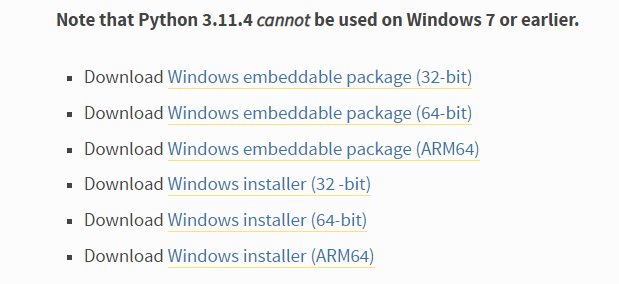

# 1.模拟器环境搭建

一.什么是安卓逆向？
----------

* * *

安卓逆向是对已经打包好的APP进行反编译、源码分析了解APP实现逻辑的一门技术

二.安卓逆向可以干嘛？
-----------

* * *

去更新  
去广告  
内购/会员破解  
协议自动签到  
白嫖！！！  
拜托，会逆向的人超酷的好嘛

三.适合人群
------

* * *

小白、零基础人群  
先来一碗鸡汤：改天是哪天，下次是哪次，以后是多久，去经历，去后悔。保持热爱，奔赴山海。我们都在奔赴各自不同的人生！！！

四.教程简介
------

* * *

参考之前发的  
[《关于我在吾爱破解论坛学安卓逆向这档事》预告](https://www.52pojie.cn/thread-1692384-1-1.html)  
PS:我不是程序员，安卓逆向只是兴趣，可能讲的不好，还请各位大佬多多包涵。另外本教程只是个基础的，并没有什么含金量。所以，如果能帮到一些新朋友培养起对安卓逆向的兴趣，那已经是物尽其用了。

## 五.Magisk介绍

* * *

Magisk 是一套用于定制 Android 的开源软件，支持高于 Android 5.0 的设备。

以下是一些功能亮点：

*   **MagiskSU**：为应用程序提供 root 访问权限
*   **Magisk 模块**：通过安装模块修改只读分区
*   **MagiskHide**：从根检测 / 系统完整性检查中隐藏 Magisk(Shamiko)
*   **MagiskBoot** : 最完整的安卓启动镜像解包和重新打包工具

六.安装步骤
------

* * *

1.到官网下载9.0模拟器，并安装  
[https://www.ldmnq.com/](https://www.ldmnq.com/)

\[更新!\]适用于几乎所有安卓模拟器(7+)安装magisk的教程-简单无脑向  
[https://www.52pojie.cn/thread-1583586-1-1.html](https://www.52pojie.cn/thread-1583586-1-1.html)  
(出处: 吾爱破解论坛)

2.下载配置文件

3.安装面具

七.答疑
----

* * *

Magisk刷不上：把模拟器 磁盘共享 --> 设置为 可写入

这种情况可能是你下的是最新版雷电模拟器，需要在设置里把读写权限打开  

## 八.视频及课件地址

* * *

[百度云](https://pan.baidu.com/s/1cFWTLn14jeWfpXxlx3syYw?pwd=nqu9)  
[阿里云](https://www.aliyundrive.com/s/TJoKMK6du6x)  
[哔哩哔哩](https://www.bilibili.com/video/BV1wT411N7sV)  
路过的师傅帮忙点个star呗！  
[https://github.com/ZJ595/AndroidReverse](https://github.com/ZJ595/AndroidReverse)

九.后续更新地址
--------

* * *

[《安卓逆向这档事》二、初识APK文件结构、双开、汉化、基础修改](https://www.52pojie.cn/thread-1695796-1-1.html)  
[《安卓逆向这档事》三、初识smail，vip终结者](https://www.52pojie.cn/thread-1701353-1-1.html)  
[《安卓逆向这档事》四、恭喜你获得广告&弹窗静默卡](https://www.52pojie.cn/thread-1706691-1-1.html)  
[《安卓逆向这档事》五、1000-7=？&动态调试&Log插桩](https://www.52pojie.cn/thread-1714727-1-1.html)  
[《安卓逆向这档事》六、校验的N次方-签名校验对抗、PM代{过}{滤}理、IO重定向](https://www.52pojie.cn/thread-1731181-1-1.html)  
[《安卓逆向这档事》七、Sorry，会Hook真的可以为所欲为-Xposed快速上手(上)模块编写,常用Api](https://www.52pojie.cn/thread-1740944-1-1.html)  
[《安卓逆向这档事》八、Sorry，会Hook真的可以为所欲为-xposed快速上手(下)快速hook](https://www.52pojie.cn/thread-1748081-1-1.html)  
[《安卓逆向这档事》九、密码学基础、算法自吐、非标准加密对抗](https://www.52pojie.cn/thread-1762225-1-1.html)  
[《安卓逆向这档事》十、不是我说，有了IDA还要什么女朋友？](https://www.52pojie.cn/thread-1787667-1-1.html)  
[《安卓逆向这档事》十二、大佬帮我分析一下](https://www.52pojie.cn/thread-1809646-1-1.html)  
[《安卓逆向这档事》番外实战篇1-某电影视全家桶](https://www.52pojie.cn/thread-1814917-1-1.html)  
[《安卓逆向这档事》十三、是时候学习一下Frida一把梭了(上)](https://www.52pojie.cn/thread-1823118-1-1.html)  
[《安卓逆向这档事》十四、是时候学习一下Frida一把梭了(中)](https://www.52pojie.cn/thread-1838539-1-1.html)

PS:解压密码都是52pj，阿里云由于不能分享压缩包，所以下载exe文件，双击自解压

# 2.初识apk结构

## 一、课程目标

1.了解APK文件结构   2.双开APK，简单了解原理   3.汉化APK   4.简单修改APK名字、图标

## 二、工具

1.教程Demo   2.MT管理器/NP管理器   3.开发者助手   4.雷电模拟器

## 三、课程内容

### 1.Apk结构

apk 全称 Android Package，它相当于一个压缩文件，只要在电脑上将apk后缀改为zip即可解压。

| 文件                    | 注释                                                         |
| ----------------------- | ------------------------------------------------------------ |
| assets目录              | 存放APK的静态资源文件，比如视频，音频，图片等                |
| lib 目录                | armeabi-v7a基本通用所有android设备，arm64-v8a只适用于64位的android设备，x86常见用于android模拟器，其目录下的.so文件是c或c++编译的动态链接库文件 |
| META-INF目录            | 保存应用的签名信息，签名信息可以验证APK文件的完整性，相当于APK的身份证(验证文件是否又被修改) |
| res目录                 | res目录存放资源文件，包括图片，字符串等等，APK的脸蛋由他的layout文件设计 |
| AndroidMainfest.xml文件 | APK的应用清单信息，它描述了应用的名字，版本，权限，引用的库文件等等信息 |
| classes.dex文件         | classes.dex是java源码编译后生成的java字节码文件，APK运行的主要逻辑 |
| resources.arsc文件      | resources.arsc是编译后的二进制资源文件，它是一个映射表，映射着资源和id，通过R文件中的id就可以找到对应的资源 |

### 2.双开及原理

双开：简单来说，就是手机同时运行两个或多个相同的应用，例如同时运行两个微信

| 原理               | 解释                                                         |
| ------------------ | ------------------------------------------------------------ |
| 修改包名           | 让手机系统认为这是2个APP，这样的话就能生成2个数据存储路径，此时的多开就等于你打开了两个互不干扰的APP |
| 修改Framework      | 对于有系统修改权限的厂商，可以修改Framework来实现双开的目的，例如：小米自带多开 |
| 通过虚拟化技术实现 | 虚拟Framework层、虚拟文件系统、模拟Android对组件的管理、虚拟应用进程管理 等一整套虚拟技术，将APK复制一份到虚拟空间中运行，例如：平行空间 |
| 以插件机制运行     | 利用反射替换，动态代{过}{滤}理，hook了系统的大部分与system—server进程通讯的函数，以此作为“欺上瞒下”的目的，欺骗系统“以为”只有一个apk在运行，瞒过插件让其“认为”自己已经安装。例如：VirtualApp |

### 3.汉化APK

汉化：使用专门的工具对外文版的软件资源进行读取、翻译、修改、回写等一系列处理，使软件的菜单、对话框、提示等用户界面显示为中文，而程序的内核和功能保持不变，这个过程即为软件汉化

**基本上字符串都是在arsc里，建议一键汉化，然后再润色。   少量没汉化到的字符串参考视频中的方法定位去逐个汉化。**

### 流程图

这里还需要注意的是，如果要直装应用，那就应该先签名安装，看看是否有签名校验导致的闪退  

### 4.初识AndroidManifest.xml

AndroidManifest.xml文件是整个应用程序的信息描述文件，定义了应用程序中包含的Activity,Service,Content provider和BroadcastReceiver组件信息。每个应用程序在根目录下必须包含一个AndroidManifest.xml文件，且文件名不能修改。它描述了package中暴露的组件，他们各自的实现类，各种能被处理的数据和启动位置。

| 属性                               | 定义                                                     |
| ---------------------------------- | -------------------------------------------------------- |
| versionCode                        | 版本号，主要用来更新，例如:12                            |
| versionName                        | 版本名，给用户看的，例如:1.2                             |
| package                            | 包名，例如：com.zj.52pj.demo                             |
| uses-permission android:name=""    | 应用权限，例如：android.permission.INTERNET 代表网络权限 |
| android:label="@string/app_name"   | 应用名称                                                 |
| android:icon="@mipmap/ic_launcher" | 应用图标路径                                             |
| android:debuggable="true"          | 应用是否开启debug权限                                    |

## 四、课后小作业

1.试着自己找个应用双开、修改名字、找个英文应用汉化   2.替换第一关挑战中的图片

## 八、参考文档

[【VirtualAPP 双开系列08】如何实现多开 - UID](https://blog.csdn.net/u014294681/article/details/116270479)

PS:解压密码都是52pj，阿里云由于不能分享压缩包，所以下载exe文件，双击自解压

# 3.初识smali

一、课程目标
------

* * *

1.了解JVM、Dalvik、ART  
2.初识smali语法  
3.实战修改smali

二、工具
----

* * *

1.教程Demo(更新)  
2.MT管理器/NP管理器  
3.雷电模拟器  
4.jadx-gui  
5.核心破解

三、课程内容
------

* * *

### 1.什么是JVM、Dalvik、ART

JVM是JAVA虚拟机，运行JAVA字节码程序  
Dalvik是Google专门为Android设计的一个虚拟机，Dalvik有专属的文件执行格式dex(Dalvik executable)  
Art(Android Runtime)相当于Dalvik的升级版，本质与Dalvik无异

### 2.smali及其语法

smali是Dalvik的寄存器语言，smali代码是dex反编译而来的。

- 关键字

| 名称        | 注释                       |
| ----------- | -------------------------- |
| .class      | 类名                       |
| .super      | 父类名，继承的上级类名名称 |
| .source     | 源名                       |
| .field      | 变量                       |
| .method     | 方法名                     |
| .register   | 寄存器                     |
| .end method | 方法名的结束               |
| public      | 公有                       |
| protected   | 半公开，只有同一家人才能用 |
| private     | 私有，只能自己使用         |
| .parameter  | 方法参数                   |
| .prologue   | 方法开始                   |
| .line xxx   | 位于第xxx行                |

- 数据类型对应

| smali类型    | java类型                          | 注释                 |
| ------------ | --------------------------------- | -------------------- |
| V            | void                              | 无返回值             |
| Z            | boolean                           | 布尔值类型，返回0或1 |
| B            | byte                              | 字节类型，返回字节   |
| S            | short                             | 短整数类型，返回数字 |
| C            | char                              | 字符类型，返回字符   |
| I            | int                               | 整数类型，返回数字   |
| J            | long （64位 需要2个寄存器存储）   | 长整数类型，返回数字 |
| F            | float                             | 单浮点类型，返回数字 |
| D            | double （64位 需要2个寄存器存储） | 双浮点类型，返回数字 |
| string       | String                            | 文本类型，返回字符串 |
| Lxxx/xxx/xxx | object                            | 对象类型，返回对象   |

- 常用指令

| 关键字       | 注释                                                   |
| ------------ | ------------------------------------------------------ |
| const        | 重写整数属性，真假属性内容，只能是数字类型             |
| const-string | 重写字符串内容                                         |
| const-wide   | 重写长整数类型，多用于修改到期时间。                   |
| return       | 返回指令                                               |
| if-eq        | 全称equal(a=b)，比较寄存器ab内容，相同则跳             |
| if-ne        | 全称not equal(a!=b)，ab内容不相同则跳                  |
| if-eqz       | 全称equal zero(a=0)，z即是0的标记，a等于0则跳          |
| if-nez       | 全称not equal zero(a!=0)，a不等于0则跳                 |
| if-ge        | 全称greater equal(a>=b)，a大于或等于则跳               |
| if-le        | 全称little equal(a<=b)，a小于或等于则跳                |
| goto         | 强制跳到指定位置                                       |
| switch       | 分支跳转，一般会有多个分支线，并根据指令跳转到适当位置 |
| iget         | 获取寄存器数据                                         |

其余指令可用语法工具查询

定位方法：搜索弹窗关键字、抓取按钮id

例子：

~~~java
//一个私有、静态、不可变的方法   方法名
.method private static final onCreate$lambda-2(Lkotlin/jvm/internal/Ref$IntRef;Lcom/zj/wuaipojie/ui/ChallengeSecond;Landroid/widget/ImageView;Landroid/widget/ImageView;Landroid/widget/ImageView;Landroid/view/View;)Z //(这里面是方法的参数)这里是方法返回值类型，表示布尔值类型，返回假或真
    .registers 7  //寄存器数量

    .line 33  //代码所在的行数
    iget p0, p0, Lkotlin/jvm/internal/Ref$IntRef;->element:I  //读取p0(第一个参数，参考寄存器知识)中element的值赋值给p0

    const/4 p5, 0x1  //p5赋值1

    const/16 v0, 0xa //v0赋值10，在16进制里a表示10

    if-ge p0, v0, :cond_15  //判断p0的值是否大于或等于v0的值(即p0的值是否大于或等于10)，如果大于或等于则跳转到:cond_15

    .line 34  //以下是常见的Toast弹窗代码
    check-cast p1, Landroid/content/Context; //检查Context对象引用

    const-string p0, "请先获取10个硬币哦" //弹窗文本信息，把""里的字符串数据赋值给p0

    check-cast p0, Ljava/lang/CharSequence; //检查CharSequence对象引用

    invoke-static {p1, p0, p5}, Landroid/widget/Toast;->makeText(Landroid/content/Context;Ljava/lang/CharSequence;I)Landroid/widget/Toast; 
    //将弹窗文本、显示时间等信息传给p1

    move-result-object p0  //结果传递给p0

    invoke-virtual {p0}, Landroid/widget/Toast;->show()V  //当看到这个Toast;->show你就应该反应过来这里是弹窗代码

    goto :goto_31  //跳转到:goto_31

    :cond_15 //跳转的一个地址

    invoke-virtual {p1}, Lcom/zj/wuaipojie/ui/ChallengeSecond;->isvip()Z  //判断isvip方法的返回值是否为真(即结果是否为1)

    move-result p0  //结果赋值给p0

    if-eqz p0, :cond_43 //如果结果为0则跳转cond_43地址

    const p0, 0x7f0d0018  //在arsc中的id索引，这个值可以进行查询

    .line 37
    invoke-virtual {p2, p0}, Landroid/widget/ImageView;->setImageResource(I)V //设置图片资源

    const p0, 0x7f0d0008

    .line 38
    invoke-virtual {p3, p0}, Landroid/widget/ImageView;->setImageResource(I)V

    const p0, 0x7f0d000a

    .line 39
    invoke-virtual {p4, p0}, Landroid/widget/ImageView;->setImageResource(I)V

    .line 40
    sget-object p0, Lcom/zj/wuaipojie/util/SPUtils;->INSTANCE:Lcom/zj/wuaipojie/util/SPUtils; 

    check-cast p1, Landroid/content/Context;

    const/4 p2, 0x2 //p2赋值2

    const-string p3, "level" //sp的索引

    invoke-virtual {p0, p1, p3, p2}, Lcom/zj/wuaipojie/util/SPUtils;->saveInt(Landroid/content/Context;Ljava/lang/String;I)V //写入数据

    goto :goto_50 //跳转地址

    :cond_43

    check-cast p1, Landroid/content/Context;

    const-string p0, "\u8bf7\u5148\u5145\u503c\u5927\u4f1a\u5458\u54e6\uff01" //请先充值大会员哦！

    check-cast p0, Ljava/lang/CharSequence;

    invoke-static {p1, p0, p5}, Landroid/widget/Toast;->makeText(Landroid/content/Context;Ljava/lang/CharSequence;I)Landroid/widget/Toast;

    move-result-object p0

    invoke-virtual {p0}, Landroid/widget/Toast;->show()V

    :goto_50
    return p5  //返回p5的值
.end method //方法结束

//判断是否是大会员的方法
.method public final isvip()Z
    .registers 2

    const/4 v0, 0x0 //v0赋值0

    return v0 //返回v0的值

.end method
~~~

修改方法：修改判断、强制跳转、修改寄存器的值

### 3.寄存器

在smali里的所有操作都必须经过寄存器来进行:本地寄存器用v开头数字结尾的符号来表示，如v0、 v1、v2。 参数寄存器则使用p开头数字结尾的符号来表示，如p0、p1、p2。特别注意的是，p0不一定是函数中的第一个参数，在非static函数中，p0代指“this"，p1表示函数的第一个 参数，p2代表函数中的第二个参数。而在static函数中p0才对应第一个参数(因为Java的static方法中没有this方法）

四、课后小作业
-------

* * *

1.关掉视频自己复现三种方法  
2.完成这个作业demo(因为最近实在是太太太忙了，绝对不是因为我懒，咕咕咕。搞懂这个demo那也基本上能理解本节课的内容)  
丑小鸭师傅的demo  
链接：[https://pan.baidu.com/s/1cUInoi](https://pan.baidu.com/s/1cUInoi) 密码：07p9  
原文链接：[教我兄弟学Android逆向02 破解第一个Android程序](https://www.52pojie.cn/thread-650395-1-1.html)

五、反思&答疑
-------

* * *

关于jadx搜不到大会员的unicode编码，这是因为我录视频之前在设置里把unicode的转义打开而导致的，像你们第一次安装jadx都是默认关闭这个选项的，所以能直接搜到大会员的汉字！！！

由于准备不是很充足，我感觉我讲的不是太好，多看看我列举参考文档有利于理解smali语法。

对于开发者而言，在打包应用时，最好对代码进行混淆，否则逆向人员轻而易举得进行Crack，或者说在写代码的时候就不要用isvip、getvip等易辨识的单词作为方法名

八、参考文档
------

* * *

[吾爱破解安卓逆向入门教程（三）---深入Smali文件](https://www.52pojie.cn/thread-396966-1-1.html)  
[吾爱破解安卓逆向入门教程（四）---Smali函数分析](https://www.52pojie.cn/thread-397858-1-1.html)  
[【原木文章】Android改造者之路-02.初探smali功法](https://www.52pojie.cn/thread-1485681-1-1.html)

# 4.修改广告

一、课程目标
------

* * *

1.了解安卓四大组件、Activity生命周期  
2.弹窗定位、去更新  
3.广告分析与布局优化

二、工具
----

* * *

1.教程Demo(更新)  
2.MT管理器/NP管理器  
3.算法助手  
4.雷电模拟器  
5.开发助手

三、课程内容
------

* * *

### 1.广告类型

启动广告     弹窗&更新广告   横幅广告  

### 2.安卓四大组件

| 组件                           | 描述                                                         |
| ------------------------------ | ------------------------------------------------------------ |
| Activity(活动)                 | 在应用中的一个Activity可以用来表示一个界面，意思可以理解为“活动”，即一个活动开始，代表 Activity组件启动，活动结束，代表一个Activity的生命周期结束。一个Android应用必须通过Activity来运行和启动，Activity的生命周期交给系统统一管理。 |
| Service(服务)                  | Service它可以在后台执行长时间运行操作而没有用户界面的应用组件，不依赖任何用户界面，例如后台播放音乐，后台下载文件等。 |
| Broadcast Receiver(广播接收器) | 一个用于接收广播信息，并做出对应处理的组件。比如我们常见的系统广播：通知时区改变、电量低、用户改变了语言选项等。 |
| Content Provider(内容提供者)   | 作为应用程序之间唯一的共享数据的途径，Content Provider主要的功能就是存储并检索数据以及向其他应用程序提供访问数据的接口。Android内置的许多数据都是使用Content Provider形式，供开发者调用的（如视频，音频，图片，通讯录等） |

#### 1.activity的切换

 ~~~xml
         <!---声明实现应用部分可视化界面的 Activity，必须使用 AndroidManifest 中的 <activity> 元素表示所有 Activity。系统不会识别和运行任何未进行声明的Activity。----->
         <activity  
             android:label="@string/app_name"  
             android:name="com.zj.wuaipojie.ui.MainActivity"  
             android:exported="true">  <!--当前Activity是否可以被另一个Application的组件启动：true允许被启动；false不允许被启动-->
             <!---指明这个activity可以以什么样的意图(intent)启动--->
             <intent-filter>  
                 <!--表示activity作为一个什么动作启动，android.intent.action.MAIN表示作为主activity启动--->
                 <action  
                     android:name="android.intent.action.MAIN" />  
                 <!--这是action元素的额外类别信息，android.intent.category.LAUNCHER表示这个activity为当前应用程序优先级最高的Activity-->
                 <category  
                     android:name="android.intent.category.LAUNCHER" />  
             </intent-filter>  
         </activity>  
         <activity  
             android:name="com.zj.wuaipojie.ui.ChallengeFirst" />
         <activity  
             android:name="com.zj.wuaipojie.ui.ChallengeFifth"  
             android:exported="true" />  
         <activity  
             android:name="com.zj.wuaipojie.ui.ChallengeFourth"  
             android:exported="true" />  
         <activity  
             android:name="com.zj.wuaipojie.ui.ChallengeThird"  
             android:exported="false" />  
         <activity  
             android:name="com.zj.wuaipojie.ui.ChallengeSecond"  
             android:exported="false" />  
         <activity  
             android:name="com.zj.wuaipojie.ui.AdActivity" />  
 ~~~

启动广告流程：  
启动Activity->广告Activity->主页Activity

修改方法：  
1.修改加载时间  
2.Acitivity切换定位，修改Intent的Activity类名

 ~~~java
 switch (position) {  
   case 0:  
     Intent intent = new Intent();  
     intent.setClass(it.getContext(), ChallengeFirst.class);  
     it.getContext().startActivity(intent);  
     return;  
   case 1:  
     Intent intent2 = new Intent();  
     intent2.setClass(it.getContext(), ChallengeSecond.class);  
     it.getContext().startActivity(intent2);  
     return;  
   case 2:  
     Intent intent3 = new Intent();  //new一个Intent，
     intent3.setClass(it.getContext(), AdActivity.class);  //传入要切换的Acitivity的类名
     it.getContext().startActivity(intent3);  //启动对应的Activity
     return;  
   case 3:  
     Intent intent4 = new Intent();  
     intent4.setClass(it.getContext(), ChallengeFourth.class);  
     it.getContext().startActivity(intent4);  
     return; 
   default:  
     return;  
 }
 
 ~~~

### 3.Activity生命周期

| 函数名称    | 描述                                                         |
| ----------- | ------------------------------------------------------------ |
| onCreate()  | 一个Activity启动后第一个被调用的函数，常用来在此方法中进行Activity的一些初始化操作。例如创建View，绑定数据，注册监听，加载参数等。 |
| onStart()   | 当Activity显示在屏幕上时，此方法被调用但此时还无法进行与用户的交互操作。 |
| onResume()  | 这个方法在onStart()之后调用，也就是在Activity准备好与用户进行交互的时候调用，此时的Activity一定位于Activity栈顶，处于运行状态。 |
| onPause()   | 这个方法是在系统准备去启动或者恢复另外一个Activity的时候调用，通常在这个方法中执行一些释放资源的方法，以及保存一些关键数据。 |
| onStop()    | 这个方法是在Activity完全不可见的时候调用的。                 |
| onDestroy() | 这个方法在Activity销毁之前调用，之后Activity的状态为销毁状态。 |
| onRestart() | 当Activity从停止stop状态恢进入start状态时调用状态。          |

### 4.弹窗定位&堆栈分析

修改方法：  
1.修改xml中的versiocode  
2.Hook弹窗(推荐算法助手开启弹窗定位)  
3.修改dex弹窗代码  
4.抓包修改响应体(也可以路由器拦截)

### 5.布局优化

1.开发者助手抓布局  
2.MT管理器xml搜索定位  
3.修改xml代码

 _复制代码_ _隐藏代码_`android:visibility="gone"`

四、课后小作业
-------

* * *

定位并去除作业demo首页中的弹窗  

# 5.动态调试&Log插桩

一、课程目标
------

* * *

1.配置java环境  
2.了解并掌握动态调试  
3.了解并掌握Log插桩

二、工具
----

* * *

1.教程Demo  
2.MT管理器/NP管理器  
3.jeb  
4.雷电模拟器  
5.XappDebug

三、课程内容
------

* * *

### 1.配置java环境

1.下载jdk文件并安装(课件里有)  
2.配置java环境  
ps：在视频里面环境配置只配置了一个JAVA\_HOME  
还有一个Path和CLASSPATH，请参考这篇文档，写得很详细，配置完后记得cmd窗口输入java验证一下  
[java 环境配置(详细教程)](https://blog.csdn.net/xhmico/article/details/122390181)

### 2.什么是动态调试

动态调试是指自带的调试器跟踪自己软件的运行，可以在调试的过程中知道参数或者局部变量的值以及履清代码运行的先后顺序。多用于爆破注册码(CTF必备技能)

### 3.动态调试步骤

#### 1.修改debug权限

- 方法一:在AndroidManifest.xml里添加可调试权限：`android:debuggable="true"`

- 方法二：XappDebug模块hook对应的app

​			项目地址：[XappDebug](https://github.com/Palatis/XAppDebug)

- 方法三：Magisk命令(重启失效)

 ~~~bash
 1.  adb shell #adb进入命令行模式
 
 2.  su #切换至超级用户
 
 3.  magisk resetprop ro.debuggable 1
 
 4.  stop;start; #一定要通过该方式重启
 ~~~

- 方法四:刷入MagiskHide Props Config模块(永久有效，但我这两台手机都不行，哭死，呜呜呜)。修改ro.debuggable的值为1

#### 2.端口转发以及开启adb权限

版本号点击七次开启开发者模式并开启adb调试权限

夜神模拟器：adb connect 127.0.0.1:62001

#### 3.下段点

ctrl+b下断点

#### 4.debug模式启动

`adb shell am start -D -n com.zj.wuaipojie/.ui.MainActivity`

adb shell am start -D -n  
adb shell am start -D -n 包名/类名  
am start -n 表示启动一个activity  
am start -D 表示将应用设置为可调试模式

#### 5.Jeb附加调试进程

激活jeb

在线python运行  
[https://tool.lu/coderunner/](https://tool.lu/coderunner/)

算号代码：

~~~python
#https://bbs.pediy.com/
#!/usr/bin/env python
import os, sys, struct, time, binascii, hashlib

RC4_Key2= 'Eg\xa2\x99_\x83\xf1\x10'

def rc4(Key, inData):
    Buf = ""
    S = range(256)
    K = (map(lambda x:ord(x), Key) * (256 / len(Key) + 1))[:256]
    j = 0
    for i in range(256):
        j = (S[i] + K[i] + j) % 256
        S[i], S[j] = S[j], S[i]
    i, j = 0, 0
    for x in range(len(inData)):
        i = (i + 1) % 256
        j = (j + S[i]) % 256
        S[i], S[j] = S[j], S[i]
        Buf += chr(S[(S[j] + S[i]) % 256] ^ ord(inData[x]))
    return Buf

def Long2Int(longdata):
    lo = longdata & 0xFFFFFFFF
    hi = (longdata >> 32) & 0x7FFFFFFF
    return hi, lo

def KeygenSN(LicenseSerial, MachineID):
    mhi, mlo = Long2Int(MachineID)
    lhi, llo = Long2Int(LicenseSerial)
    hi_Key = (mhi - lhi + 0x55667788) & 0x7FFFFFFF
    lo_Key = (mlo + llo + 0x11223344) & 0xFFFFFFFF
    Z0, = struct.unpack('<Q', struct.pack('<LL', lo_Key, hi_Key))
    Z1 = int(time.time()) ^ 0x56739ACD
    s = sum(map(lambda x:int(x, 16), "%x" % Z1)) % 10
    return "%dZ%d%d" % (Z0, Z1, s)

def ParsePost(buf):
    Info = struct.unpack('<3L2Q4LQ3L', buf[:0x40])
    flag, CRC, UserSerial, LicenseSerial, MachineID, build_type, \
          Ver_Major, Ver_Minor, Ver_Buildid, Ver_Timestamp, \
          TimeOffset, Kclass, Random2 = Info
    SysInfoData = buf[0x40:]
    assert CRC == binascii.crc32(buf[8:]) & 0xFFFFFFFF
    return Info, SysInfoData

def DecodeRc4Str(buf):
    buf = buf.decode('hex')
    i, s = ParsePost(rc4(buf[:8] + RC4_Key2, buf[8:]))
    return i, s

def GetJebLicenseKey():
    licdata = ""
    if licdata:
        i, MachineID = DecodeRc4Str(licdata)
        SN = KeygenSN(i[3], i[4])
        print "JEB License Key:", SN
        return SN

GetJebLicenseKey()
raw_input("Enter to Exit...")

~~~

快捷键：  
^F6进入方法  
F6跳过方法  
F7从方法中跳出来  
R运行到光标处

### 3.Log插桩

定义：Log插桩指的是反编译APK文件时，在对应的smali文件里，添加相应的smali代码，将程序中的关键信息，以log日志的形式进行输出。

调用命令：
`invoke-static {对应寄存器}, Lcom/mtools/LogUtils;->v(Ljava/lang/Object;)V`

四、课后小作业
-------

* * *

动态调试获取注册码  
[https://wwl.lanzoub.com/iZ0tt0fzsbpa](https://wwl.lanzoub.com/iZ0tt0fzsbpa)  
作业提交地址：  
《安卓逆向这档事》第五节课后小作业贴  
[https://www.52pojie.cn/thread-1714883-1-1.html](https://www.52pojie.cn/thread-1714883-1-1.html)  
(出处: 吾爱破解论坛)

五、答疑
----

* * *

关于jeb动态调试没有进程的问题，请看下面顶置的评论，替换个新的adb

关于永久debug的问题，可以参考zzzznl的方法(具体楼层在224)  
关于MagiskHidePropsConfig设置ro.debuggable，我运气比较好，雷电模拟器中设置成功了几次，操作如下：  
1.cmd中adb shell  
2.su获取root权限  
3.props进入设置，其后是大佬教程中的步骤，注意不要在4中设置，哪怕4中有也在5中新建一下，因为4中设置无法选择设置的时期，而5中可以  
4.重新进入5中设置的ro.debuggable，这时候可以选择设置该参数的时间，我选的延时Delay，Boot Completed之后3秒（随便设的，没测试其他值）  

5.重启n次之后进入模拟器，检查参数  

所以我觉得存在一种可能，模块虽然起作用了，但很快又被模拟器重新设回去了，选择较晚期进行设置，存在一点设置成功的可能，大佬可以参考下

八、参考文档
------

* * *

[Android修改ro.debuggable 的四种方法](https://blog.csdn.net/jinmie0193/article/details/111355867)  
[Log简易打印工具，超简单的调用方法](https://www.52pojie.cn/thread-411454-1-1.html)  
[JEB动态调试Smali-真机/模拟器（详细，新手必看）](https://www.52pojie.cn/thread-1598242-1-1.html)

# 6.校验

一、课程目标
------

* * *

1.了解APK文件签名  
2.了解APK常见校验及校验对抗方法  
3.了解PM代{过}{滤}理和IO重定向  
4.smali语法之赋值

二、工具
----

* * *

1.教程Demo(更新)  
2.MT管理器/NP管理器  
3.雷电模拟器  
4.Jadx-gui(第三课课件里有)  
5.算法助手(第四课课件里有)

三、课程内容
------

* * *

### 1.什么是校验

是开发者在数据传送时采用的一种校正数据的一种方式  
常见的校验有:签名校验(最常见)、dexcrc校验、apk完整性校验、路径文件校验等

### 2.什么是APK签名

通过对 Apk 进行签名，开发者可以证明对 Apk 的所有权和控制权，可用于安装和更新其应用。而在 Android 设备上的安装 Apk ，如果是一个没有被签名的 Apk，则会被拒绝安装。在安装 Apk 的时候，软件包管理器也会验证 Apk 是否已经被正确签名，并且通过签名证书和数据摘要验证是否合法没有被篡改。只有确认安全无篡改的情况下，才允许安装在设备上。

简单来说，APK 的签名主要作用有两个：

1.  证明 APK 的所有者。
2.  允许 Android 市场和设备校验 APK 的正确性。

Android 目前支持以下四种应用签名方案：  
v1 方案：基于 JAR 签名。  
v2 方案：APK 签名方案 v2（在 Android 7.0 中引入）  
v3 方案：APK 签名方案 v3（在 Android 9 中引入）  
v4 方案：APK 签名方案 v4（在 Android 11 中引入）

V1 签名的机制主要就在 META-INF 目录下的三个文件，MANIFEST.MF，ANDROID.SF，ANDROID.RSA，他们都是 V1 签名的产物。  
（1）MANIFEST.MF：这是摘要文件。程序遍历Apk包中的所有文件(entry)，对非文件夹非签名文件的文件，逐个用SHA1(安全哈希算法)生成摘要信息，再用Base64进行编码。如果你改变了apk包中的文件，那么在apk安装校验时，改变后的文件摘要信息与MANIFEST.MF的检验信息不同，于是程序就不能成功安装。  

（2）ANDROID.SF：这是对摘要的签名文件。对前一步生成的MANIFEST.MF，使用SHA1-RSA算法，用开发者的私钥进行签名。在安装时只能使用公钥才能解密它。解密之后，将它与未加密的摘要信息（即，MANIFEST.MF文件）进行对比，如果相符，则表明内容没有被异常修改。  

（3）ANDROID.RSA文件中保存了公钥、所采用的加密算法等信息。  

在某些情况下，直接对apk进行v1签名可以绕过apk的签名校验

v2方案会将 APK 文件视为 blob，并对整个文件进行签名检查。对 APK 进行的任何修改（包括对 ZIP 元数据进行的修改）都会使 APK 签名作废。这种形式的 APK 验证不仅速度要快得多，而且能够发现更多种未经授权的修改。

### 3.什么是签名校验

如何判断是否有签名校验？  
不做任何修改，直接签名安装，应用闪退则说明大概率有签名校验

一般来说，普通的签名校验会导致软件的闪退，黑屏，卡启动页等  
当然，以上都算是比较好的，有一些比较狠的作者，则会直接rm -rf /，把基带都格掉的一键变砖。

 ~~~sh
 kill/killProcess
 #kill/KillProcess()可以杀死当前应用活动的进程，这一操作将会把所有该进程内的资源（包括线程全部清理掉）.当然，由于ActivityManager时刻监听着进程，一旦发现进程被非正常Kill，它将会试图去重启这个进程。这就是为什么，有时候当我们试图这样去结束掉应用时，发现它又自动重新启动的原因.
 
 system.exit
 #杀死了整个进程，这时候活动所占的资源也会被释放。
 
 finish
 #仅仅针对Activity，当调用finish()时，只是将活动推向后台，并没有立即释放内存，活动的资源并没有被清理
 ~~~

在我个人见过最恶心的签名校验中，当属三角校验(低调大佬教的)最烦人。  所谓三角校验，就是so检测dex，动态加载的dex(在软件运行时会解压释放一段dex文件，检测完后就删除)检测so，dex检测动态加载的dex

普通获取签名校验代码：

 ~~~java
 private boolean SignCheck() {
     String trueSignMD5 = "d0add9987c7c84aeb7198c3ff26ca152";
     String nowSignMD5 = "";
     try {
         // 得到签名的MD5
         PackageInfo packageInfo = getPackageManager().getPackageInfo(getPackageName(),PackageManager.GET_SIGNATURES);
         Signature[] signs = packageInfo.signatures;
         String signBase64 = Base64Util.encodeToString(signs[0].toByteArray());
         nowSignMD5 = MD5Utils.MD5(signBase64);
     } catch (PackageManager.NameNotFoundException e) {
         e.printStackTrace();
     }
     return trueSignMD5.equals(nowSignMD5);
 }
 ~~~

系统将应用的签名信息封装在 PackageInfo 中，调用 PackageManager 的 getPackageInfo(String packageName, int flags) 即可获取指定包名的签名信息

### 4.签名校验对抗

方法一:核心破解插件，不签名安装应用  
方法二:一键过签名工具，例如MT、NP、ARMPro、CNFIX、Modex的去除签名校验功能  
方法三:具体分析签名校验逻辑(手撕签名校验)  
方法四:io重定向--VA&SVC：ptrace+seccomp  
[SVC的TraceHook沙箱的实现&无痕Hook实现思路](https://bbs.pediy.com/thread-273160.htm)  
方法五:去作者家严刑拷打拿到.jks文件和密码

### 5.手动实现PM代{过}{滤}理

#### 1.什么是PMS

思路源自：[Android中Hook 应用签名方法](https://github.com/fourbrother/HookPmsSignature)

PackageManagerService（简称PMS），是Android系统核心服务之一，处理包管理相关的工作，常见的比如安装、卸载应用等。

#### 2.实现方法以及原理解析

HOOK PMS代码:

 ~~~java
 package com.zj.hookpms;
 import java.lang.reflect.Field;
 import java.lang.reflect.Method;
 import java.lang.reflect.Proxy;
 
 import android.content.Context;
 import android.content.pm.PackageManager;
 import android.util.Log;
 
 public class ServiceManagerWraper {
 
     public final static String ZJ = "ZJ595";
 
     public static void hookPMS(Context context, String signed, String appPkgName, int hashCode) {
         try {
             // 获取全局的ActivityThread对象
             Class<?> activityThreadClass = Class.forName("android.app.ActivityThread");
             Method currentActivityThreadMethod =
                     activityThreadClass.getDeclaredMethod("currentActivityThread");
             Object currentActivityThread = currentActivityThreadMethod.invoke(null);
             // 获取ActivityThread里面原始的sPackageManager
             Field sPackageManagerField = activityThreadClass.getDeclaredField("sPackageManager");
             sPackageManagerField.setAccessible(true);
             Object sPackageManager = sPackageManagerField.get(currentActivityThread);
             // 准备好代{过}{滤}理对象, 用来替换原始的对象
             Class<?> iPackageManagerInterface = Class.forName("android.content.pm.IPackageManager");
             Object proxy = Proxy.newProxyInstance(
                     iPackageManagerInterface.getClassLoader(),
                     new Class<?>[]{iPackageManagerInterface},
                     new PmsHookBinderInvocationHandler(sPackageManager, signed, appPkgName, 0));
             // 1. 替换掉ActivityThread里面的 sPackageManager 字段
             sPackageManagerField.set(currentActivityThread, proxy);
             // 2. 替换 ApplicationPackageManager里面的 mPM对象
             PackageManager pm = context.getPackageManager();
             Field mPmField = pm.getClass().getDeclaredField("mPM");
             mPmField.setAccessible(true);
             mPmField.set(pm, proxy);
         } catch (Exception e) {
             Log.d(ZJ, "hook pms error:" + Log.getStackTraceString(e));
         }
     }
 
     public static void hookPMS(Context context) {
         String Sign = "原包的签名信息";
         hookPMS(context, Sign, "com.zj.hookpms", 0);
     }
 }
 ~~~

ActivityThread的静态变量sPackageManager  
ApplicationPackageManager对象里面的mPM变量

### 6.IO重定向

什么是IO重定向？

例：在读A文件的时候指向B文件

[平头哥的核心代码](https://github.com/virjarRatel/ratel-core)  
[Virtual Engine for Android(Support 12.0 in business version)](https://github.com/asLody/VirtualApp)

IO重定向可以干嘛？

1，可以让文件只读，不可写

2，禁止访问文件

3，路径替换

具体实现：  
过签名检测(读取原包)  
风控对抗(例:一个文件记录App启动的次数)  
过Root检测，Xposed检测(文件不可取)

 ~~~c 
 using namespace std;  
 string packname;  
 string origpath;  
 string fakepath;  
 
 int (*orig_open)(const char *pathname, int flags, ...);  
 int (*orig_openat)(int,const char *pathname, int flags, ...);  
 FILE *(*orig_fopen)(const char *filename, const char *mode);  
 static long (*orig_syscall)(long number, ...);  
 int (*orig__NR_openat)(int,const char *pathname, int flags, ...);  
 
 void* (*orig_dlopen_CI)(const char *filename, int flag);  
 void* (*orig_dlopen_CIV)(const char *filename, int flag, const void *extinfo);  
 void* (*orig_dlopen_CIVV)(const char *name, int flags, const void *extinfo, void *caller_addr);  
 
 static inline bool needs_mode(int flags) {  
     return ((flags & O_CREAT) == O_CREAT) || ((flags & O_TMPFILE) == O_TMPFILE);  
 }  
 bool startsWith(string str, string sub){  
     return str.find(sub)==0;  
 }  
 
 bool endsWith(string s,string sub){  
     return s.rfind(sub)==(s.length()-sub.length());  
 }  
 bool isOrigAPK(string  path){  
 
     if(path==origpath){  
         return true;  
     }  
     return false;  
 }  
 //该函数的功能是在打开一个文件时进行拦截，并在满足特定条件时将文件路径替换为另一个路径  
 
 //fake_open 函数有三个参数：  
 //pathname：一个字符串，表示要打开的文件的路径。  
 //flags：一个整数，表示打开文件的方式，例如只读、只写、读写等。  
 //mode（可选参数）：一个整数，表示打开文件时应用的权限模式。  
 int fake_open(const char *pathname, int flags, ...) {  
     mode_t mode = 0;  
     if (needs_mode(flags)) {  
         va_list args;  
         va_start(args, flags);  
         mode = static_cast<mode_t>(va_arg(args, int));  
         va_end(args);  
     }  
     //LOGI("open,  path: %s, flags: %d, mode: %d",pathname, flags ,mode);  
     string cpp_path= pathname;  
     if(isOrigAPK(cpp_path)){  
         LOGI("libc_open, redirect: %s, --->: %s",pathname, fakepath.data());  
         return orig_open("/data/user/0/com.zj.wuaipojie/files/base.apk", flags, mode);  
     }  
     return  orig_open(pathname, flags, mode);  
 
 }  
 
 //该函数的功能是在打开一个文件时进行拦截，并在满足特定条件时将文件路径替换为另一个路径  
 
 //fake_openat 函数有四个参数：  
 //fd：一个整数，表示要打开的文件的文件描述符。  
 //pathname：一个字符串，表示要打开的文件的路径。  
 //flags：一个整数，表示打开文件的方式，例如只读、只写、读写等。  
 //mode（可选参数）：一个整数，表示打开文件时应用的权限模式。  
 //openat 函数的作用类似于 open 函数，但是它使用文件描述符来指定文件路径，而不是使用文件路径本身。这样，就可以在打开文件时使用相对路径，而不必提供完整的文件路径。  
 //例如，如果要打开相对于当前目录的文件，可以使用 openat 函数，而不是 open 函数，因为 open 函数只能使用绝对路径。  
 //  
 int fake_openat(int fd, const char *pathname, int flags, ...) {  
     mode_t mode = 0;  
     if (needs_mode(flags)) {  
         va_list args;  
         va_start(args, flags);  
         mode = static_cast<mode_t>(va_arg(args, int));  
         va_end(args);  
     }  
     LOGI("openat, fd: %d, path: %s, flags: %d, mode: %d",fd ,pathname, flags ,mode);  
     string cpp_path= pathname;  
     if(isOrigAPK(cpp_path)){  
         LOGI("libc_openat, redirect: %s, --->: %s",pathname, fakepath.data());  
         return  orig_openat(fd,fakepath.data(), flags, mode);  
     }  
     return orig_openat(fd,pathname, flags, mode);  
 
 }  
 FILE *fake_fopen(const char *filename, const char *mode) {  
 
     string cpp_path= filename;  
     if(isOrigAPK(cpp_path)){  
         return  orig_fopen(fakepath.data(), mode);  
     }  
     return orig_fopen(filename, mode);  
 }  
 //该函数的功能是在执行系统调用时进行拦截，并在满足特定条件时修改系统调用的参数。  
 //syscall 函数是一个系统调用，是程序访问内核功能的方法之一。使用 syscall 函数可以调用大量的系统调用，它们用于实现操作系统的各种功能，例如打开文件、创建进程、分配内存等。  
 //  
 static long fake_syscall(long number, ...) {  
     void *arg[7];  
     va_list list;  
 
     va_start(list, number);  
     for (int i = 0; i < 7; ++i) {  
         arg[i] = va_arg(list, void *);  
     }  
     va_end(list);  
     if (number == __NR_openat){  
         const char *cpp_path = static_cast<const char *>(arg[1]);  
         LOGI("syscall __NR_openat, fd: %d, path: %s, flags: %d, mode: %d",arg[0] ,arg[1], arg[2], arg[3]);  
         if (isOrigAPK(cpp_path)){  
             LOGI("syscall __NR_openat, redirect: %s, --->: %s",arg[1], fakepath.data());  
             return orig_syscall(number,arg[0], fakepath.data() ,arg[2],arg[3]);  
         }  
     }  
     return orig_syscall(number, arg[0], arg[1], arg[2], arg[3], arg[4], arg[5], arg[6]);  
 
 }  
 
 //函数的功能是获取当前应用的包名、APK 文件路径以及库文件路径，并将这些信息保存在全局变量中  
 //函数调用 GetObjectClass 和 GetMethodID 函数来获取 context 对象的类型以及 getPackageName 方法的 ID。然后，函数调用 CallObjectMethod 函数来调用 getPackageName 方法，获取当前应用的包名。最后，函数使用 GetStringUTFChars 函数将包名转换为 C 字符串，并将包名保存在 packname 全局变量中  
 //接着，函数使用 fakepath 全局变量保存了 /data/user/0/<packname>/files/base.apk 这样的路径，其中 <packname> 是当前应用的包名。  
 //然后，函数再次调用 GetObjectClass 和 GetMethodID 函数来获取 context 对象的类型以及 getApplicationInfo 方法的 ID。然后，函数调用 CallObjectMethod 函数来调用 getApplicationInfo 方法，获取当前应用的 ApplicationInfo 对象。  
 //它先调用 GetObjectClass 函数获取 ApplicationInfo 对象的类型，然后调用 GetFieldID 函数获取 sourceDir 字段的 ID。接着，函数使用 GetObjectField 函数获取 sourceDir 字段的值，并使用 GetStringUTFChars 函数将其转换为 C 字符串。最后，函数将 C 字符串保存在 origpath 全局变量中，表示当前应用的 APK 文件路径。  
 //最后，函数使用 GetFieldID 和 GetObjectField 函数获取 nativeLibraryDir 字段的值，并使用 GetStringUTFChars 函数将其转换为 C 字符串。函数最后调用 LOGI 函数打印库文件路径，但是并没有将其保存在全局变量中。  
 
 extern "C" JNIEXPORT void JNICALL  
 Java_com_zj_wuaipojie_util_SecurityUtil_hook(JNIEnv *env, jclass clazz, jobject context) {  
     jclass conext_class = env->GetObjectClass(context);  
     jmethodID methodId_pack = env->GetMethodID(conext_class, "getPackageName",  
                                                "()Ljava/lang/String;");  
     auto packname_js = reinterpret_cast<jstring>(env->CallObjectMethod(context, methodId_pack));  
     const char *pn = env->GetStringUTFChars(packname_js, 0);  
     packname = string(pn);  
 
     env->ReleaseStringUTFChars(packname_js, pn);  
     //LOGI("packname: %s", packname.data());  
     fakepath= "/data/user/0/"+ packname +"/files/base.apk";  
 
     jclass conext_class2 = env->GetObjectClass(context);  
     jmethodID methodId_pack2 = env->GetMethodID(conext_class2,"getApplicationInfo","()Landroid/content/pm/ApplicationInfo;");  
     jobject application_info = env->CallObjectMethod(context,methodId_pack2);  
     jclass pm_clazz = env->GetObjectClass(application_info);  
 
     jfieldID package_info_id = env->GetFieldID(pm_clazz,"sourceDir","Ljava/lang/String;");  
     auto sourceDir_js = reinterpret_cast<jstring>(env->GetObjectField(application_info,package_info_id));  
     const char *sourceDir = env->GetStringUTFChars(sourceDir_js, 0);  
     origpath = string(sourceDir);  
     LOGI("sourceDir: %s", sourceDir);  
 
     jfieldID package_info_id2 = env->GetFieldID(pm_clazz,"nativeLibraryDir","Ljava/lang/String;");  
     auto nativeLibraryDir_js = reinterpret_cast<jstring>(env->GetObjectField(application_info,package_info_id2));  
     const char *nativeLibraryDir = env->GetStringUTFChars(nativeLibraryDir_js, 0);  
     LOGI("nativeLibraryDir: %s", nativeLibraryDir);  
     //LOGI("%s", "Start Hook");  
 
     //启动hook  
     void *handle = dlopen("libc.so",RTLD_NOW);  
     auto pagesize = sysconf(_SC_PAGE_SIZE);  
     auto addr = ((uintptr_t)dlsym(handle,"open") & (-pagesize));  
     auto addr2 = ((uintptr_t)dlsym(handle,"openat") & (-pagesize));  
     auto addr3 = ((uintptr_t)fopen) & (-pagesize);  
     auto addr4 = ((uintptr_t)syscall) & (-pagesize);  
 
     //解除部分机型open被保护  
     mprotect((void*)addr, pagesize, PROT_READ | PROT_WRITE | PROT_EXEC);  
     mprotect((void*)addr2, pagesize, PROT_READ | PROT_WRITE | PROT_EXEC);  
     mprotect((void*)addr3, pagesize, PROT_READ | PROT_WRITE | PROT_EXEC);  
     mprotect((void*)addr4, pagesize, PROT_READ | PROT_WRITE | PROT_EXEC);  
 
     DobbyHook((void *)dlsym(handle,"open"), (void *)fake_open, (void **)&orig_open);  
     DobbyHook((void *)dlsym(handle,"openat"), (void *)fake_openat, (void **)&orig_openat);  
     DobbyHook((void *)fopen, (void *)fake_fopen, (void**)&orig_fopen);  
     DobbyHook((void *)syscall, (void *)fake_syscall, (void **)&orig_syscall);  
 }
 ~~~

~~~bash
    sget-object p10, Lcom/zj/wuaipojie/util/ContextUtils;->INSTANCE:Lcom/zj/wuaipojie/util/ContextUtils;  

    invoke-virtual {p10}, Lcom/zj/wuaipojie/util/ContextUtils;->getContext()Landroid/content/Context;  

    move-result-object p10  

    invoke-static {p10}, Lcom/zj/wuaipojie/util/SecurityUtil;->hook(Landroid/content/Context;)V
~~~

### 7.其他常见校验

#### root检测：

反制手段  
1.算法助手、对话框取消等插件一键hook  
2.分析具体的检测代码  
3.利用IO重定向使文件不可读  
4.修改Andoird源码，去除常见指纹

~~~kotlin
fun isDeviceRooted(): Boolean {
    return checkRootMethod1() || checkRootMethod2() || checkRootMethod3()
}

fun checkRootMethod1(): Boolean {
    val buildTags = android.os.Build.TAGS
    return buildTags != null && buildTags.contains("test-keys")
}

fun checkRootMethod2(): Boolean {
    val paths = arrayOf("/system/app/Superuser.apk", "/sbin/su", "/system/bin/su", "/system/xbin/su", "/data/local/xbin/su", "/data/local/bin/su", "/system/sd/xbin/su",
            "/system/bin/failsafe/su", "/data/local/su", "/su/bin/su")
    for (path in paths) {
        if (File(path).exists()) return true
    }
    return false
}

fun checkRootMethod3(): Boolean {
    var process: Process? = null
    return try {
        process = Runtime.getRuntime().exec(arrayOf("/system/xbin/which", "su"))
        val bufferedReader = BufferedReader(InputStreamReader(process.inputStream))
        bufferedReader.readLine() != null
    } catch (t: Throwable) {
        false
    } finally {
        process?.destroy()
    }
}
~~~

定义了一个 `isDeviceRooted()` 函数，该函数调用了三个检测 root 的方法：`checkRootMethod1()`、`checkRootMethod2()` 和 `checkRootMethod3()`。

`checkRootMethod1()` 方法检查设备的 `build tags` 是否包含 `test-keys`。这通常是用于测试的设备，因此如果检测到这个标记，则可以认为设备已被 root。

`checkRootMethod2()` 方法检查设备是否存在一些特定的文件，这些文件通常被用于执行 root 操作。如果检测到这些文件，则可以认为设备已被 root。

`checkRootMethod3()` 方法使用 `Runtime.exec()` 方法来执行 `which su` 命令，然后检查命令的输出是否不为空。如果输出不为空，则可以认为设备已被 root。

#### 模拟器检测

~~~kotlin
fun isEmulator(): Boolean { 
        return Build.FINGERPRINT.startsWith("generic") || Build.FINGERPRINT.startsWith("unknown") || Build.MODEL.contains("google_sdk") Build.MODEL.contains("Emulator") || Build.MODEL.contains("Android SDK built for x86") || Build.MANUFACTURER.contains("Genymotion") || Build.HOST.startsWith("Build") || Build.PRODUCT == "google_sdk" 
}
~~~

通过检测系统的 `Build` 对象来判断当前设备是否为模拟器。具体方法是检测 `Build.FINGERPRINT` 属性是否包含字符串 `"generic"`。

[模拟器检测对抗](https://ionized-bag-d70.notion.site/04dbaf39091f42519b14decd2a87fde7)

#### 反调试检测

安卓系统自带调试检测函数

~~~c
fun checkForDebugger() {  
    if (Debug.isDebuggerConnected()) {  
        // 如果调试器已连接，则终止应用程序  
        System.exit(0)  
    }  
}
~~~

debuggable属性

~~~c
public boolean getAppCanDebug(Context context)//上下文对象为xxActivity.this
{
    boolean isDebug = context.getApplicationInfo() != null &&
            (context.getApplicationInfo().flags & ApplicationInfo.FLAG_DEBUGGABLE) != 0;
    return isDebug;
}

~~~

ptrace检测

~~~c
int ptrace_protect()//ptrace附加自身线程 会导致此进程TracerPid 变为父进程的TracerPid 即zygote
{
    return ptrace(PTRACE_TRACEME,0,0,0);;//返回-1即为已经被调试
}
~~~

每个进程同时刻只能被1个调试进程ptrace  ，主动ptrace本进程可以使得其他调试器无法调试

调试进程名检测

~~~c++
int SearchObjProcess()
{
    FILE* pfile=NULL;
    char buf[0x1000]={0};

    pfile=popen("ps","r");
    if(NULL==pfile)
    {
        //LOGA("SearchObjProcess popen打开命令失败!\n");
        return -1;
    }
    // 获取结果
    //LOGA("popen方案:\n");
    while(fgets(buf,sizeof(buf),pfile))
    {

        char* strA=NULL;
        char* strB=NULL;
        char* strC=NULL;
        char* strD=NULL;
        strA=strstr(buf,"android_server");//通过查找匹配子串判断
        strB=strstr(buf,"gdbserver");
        strC=strstr(buf,"gdb");
        strD=strstr(buf,"fuwu");
        if(strA || strB ||strC || strD)
        {
            return 1;
            // 执行到这里，判定为调试状态

        }
    }
    pclose(pfile);
    return 0;
}
~~~

[\[原创\]对安卓反调试和校验检测的一些实践与结论](https://bbs.pediy.com/thread-268155.htm)

#### frida检测

[一些Frida检测手段](https://github.com/xxr0ss/AntiFrida)

### 8.smali语法小课堂之赋值

#### 1.Int型赋值

 ~~~java
 .method private static final onCreate$lambda-0(Lcom/zj/wuaipojie/ui/SmaliLearn;Landroid/widget/TextView;Landroid/widget/TextView;Landroid/widget/TextView;Landroid/view/View;)V  
     .registers 9  
 
     .line 21  
     invoke-virtual {p0}, Lcom/zj/wuaipojie/ui/SmaliLearn;->isVip()I  
 
     move-result p4  
         //判断vip的值分别对应不用的会员的等级
     if-eqz p4, :cond_35  
 
     const/4 v0, 0x1  
 
     if-eq p4, v0, :cond_2d  
 
     const/4 v0, 0x4  
 
     if-eq p4, v0, :cond_25  
 
     const/16 v0, 0x10  
 
     if-eq p4, v0, :cond_1d  
 
     const/16 v0, 0x63  
 
     if-eq p4, v0, :cond_15  
 
     goto :goto_3c  
 
     :cond_15  
     const-string p4, "至尊会员"  
 
     .line 26  
     check-cast p4, Ljava/lang/CharSequence;  
 
     invoke-virtual {p1, p4}, Landroid/widget/TextView;->setText(Ljava/lang/CharSequence;)V  
 
     goto :goto_3c  
 
     :cond_1d  
     const-string p4, "超级会员"  
 
     .line 25  
     check-cast p4, Ljava/lang/CharSequence;  
 
     invoke-virtual {p1, p4}, Landroid/widget/TextView;->setText(Ljava/lang/CharSequence;)V  
 
     goto :goto_3c  
 
     :cond_25  
     const-string p4, "大会员"  
 
     .line 24  
     check-cast p4, Ljava/lang/CharSequence;  
 
     invoke-virtual {p1, p4}, Landroid/widget/TextView;->setText(Ljava/lang/CharSequence;)V  
 
     goto :goto_3c  
 
     :cond_2d  
     const-string p4, "会员"  
 
     .line 23  
     check-cast p4, Ljava/lang/CharSequence;  
 
     invoke-virtual {p1, p4}, Landroid/widget/TextView;->setText(Ljava/lang/CharSequence;)V  
 
     goto :goto_3c  
 
     :cond_35  
     const-string p4, "非会员"  
 
     .line 22  
     check-cast p4, Ljava/lang/CharSequence;  
 
     invoke-virtual {p1, p4}, Landroid/widget/TextView;->setText(Ljava/lang/CharSequence;)V
 
         .line 28  
         //判断vipEndTime的时间戳是否小于系统时间
     :goto_3c  
     new-instance p1, Ljava/util/Date;  
 
     invoke-direct {p1}, Ljava/util/Date;-><init>()V  
 
     invoke-virtual {p1}, Ljava/util/Date;->getTime()J  
 
     move-result-wide v0  
 
     .line 29  
     new-instance p1, Ljava/text/SimpleDateFormat;  
 
     const-string p4, "yyyy-MM-dd"  
 
     invoke-direct {p1, p4}, Ljava/text/SimpleDateFormat;-><init>(Ljava/lang/String;)V  
 
     .line 30  
     invoke-virtual {p0}, Lcom/zj/wuaipojie/ui/SmaliLearn;->vipEndTime()J  
 
     move-result-wide v2  
 
     cmp-long p4, v2, v0  
 
     if-gez p4, :cond_5c  
 
     const-string p1, "已过期"  
 
     .line 31  
     check-cast p1, Ljava/lang/CharSequence;  
 
     invoke-virtual {p2, p1}, Landroid/widget/TextView;->setText(Ljava/lang/CharSequence;)V  
 
     goto :goto_6d  
 
     .line 33  
     :cond_5c  
     invoke-virtual {p0}, Lcom/zj/wuaipojie/ui/SmaliLearn;->vipEndTime()J  
 
     move-result-wide v0  
 
     invoke-static {v0, v1}, Ljava/lang/Long;->valueOf(J)Ljava/lang/Long;  
 
     move-result-object p4  
 
     invoke-virtual {p1, p4}, Ljava/text/SimpleDateFormat;->format(Ljava/lang/Object;)Ljava/lang/String;  
 
     move-result-object p1  
 
     check-cast p1, Ljava/lang/CharSequence;  
 
     invoke-virtual {p2, p1}, Landroid/widget/TextView;->setText(Ljava/lang/CharSequence;)V  
 
     .line 35  
     :goto_6d  
     iget p0, p0, Lcom/zj/wuaipojie/ui/SmaliLearn;->vip_coin:I  
 
     if-eqz p0, :cond_74  
 
     .line 36  
     invoke-static {p0}, Ljava/lang/String;->valueOf(I)Ljava/lang/String;
 
     move-result-object p0
 
     check-cast p0, Ljava/lang/CharSequence;
 
     invoke-virtual {p3, p0}, Landroid/widget/TextView;->setText(Ljava/lang/CharSequence;)V
 
     :cond_74  
     return-void  
 .end method
 ~~~

const/4和const/16的区别？

> const/4 最大只允许存放4个二进制位(4bit)，  
> const/16 最大值允许存放16个二进制位(16bit)， 第一位(即最高位)默认为符号位。单位换算 1byte=8bit  
> 举例说明下寄存器的取值范围: # 以下数据定义高位默认为符号位  
> const/4 v0,0x2 # 最大只允许存放半字节数据 取值范围为 -8 and 7  
> const/16 v0 , 0xABCD # 定义一个寄存器变量，最大只允许存放16位数据 比如short类型数据 取值范围为-32768~32767  
> const v0 , 0xA# 定义一个寄存器， 最大只允许存放32位数据,比如int类型数据 将数字10赋值给v0 取值范围-2147483647~2147483647  
> const/high16 #定义一个寄存器， 最大只允许存放高16位数值 比如0xFFFF0000末四位补0 存入高四位0XFFFF

#### 2.Long型赋值

**const-wide vx, lit32** 表示将一个 32 位的常量存储到 vx 与 vx+1 两个寄存器中 —— 即一个 long 类型的数据

 ~~~java
 .method public final vipEndTime()J  
     .registers 3  
 
     const-wide v0, 0x1854460ef29L  
 
     return-wide v0  
 .end method
 ~~~

会员到期时间就是2022年12月24日。那么1854460ef29L 怎么来的呢？也就是（2022年12月24日-1970年1月1日）×365天×24小时×60分钟×60秒×1000毫秒，转换成16进制就大概是那个数了

[在线时间戳转换](https://www.beijing-time.org/shijianchuo/)

#### 3.变量赋值(正则)

 ~~~bash
     iget p0, p0, Lcom/zj/wuaipojie/ui/SmaliLearn;->vip_coin:I  
 
     if-eqz p0, :cond_74  
 
     .line 36  
     invoke-static {p0}, Ljava/lang/String;->valueOf(I)Ljava/lang/String;
 
     move-result-object p0
 
     check-cast p0, Ljava/lang/CharSequence;
 
     invoke-virtual {p3, p0}, Landroid/widget/TextView;->setText(Ljava/lang/CharSequence;)V
 ~~~

~~~bash
# 正则匹配
(.*) .* 
const/4 $1 0x1
~~~

### 9.反思

签名的博弈日新月异，善用工具，拥抱开源！！！

通过系统自带的api去获取签名很容易被伪造，不妨试试通过SVC的方式去获取(参考MT开源的方法)  
隐式签名校验  
有一些则比较隐晦，在发现apk被修改后，会偷偷修改apk的部分功能，例如在某些多开定位软件中，会暗改ip的经纬网等，跟实际产生一定的偏差。  
PS:推荐学习芽衣大神的手撕签名校验教程

## 四、课后小作业

* * *

1.手动实现PM代{过}{滤}理  
2.移植我的重定向代码(要学会偷代码！)  

八、参考文档
------

* * *

[APK 签名：v1 v2 v3 v4](https://blog.csdn.net/weixin_46569059/article/details/120307144)  
[如何把签名校验做到极致](https://github.com/gtf35/how-to-check-sign)  
[Android PMS HOOK](https://www.jianshu.com/p/C559852c4878)  
[\[实战破解\]白描-动态代{过}{滤}理Hook签名校验](https://www.52pojie.cn/thread-1526854-1-1.html)  
[\[原创\]对安卓反调试和校验检测的一些实践与结论](https://bbs.pediy.com/thread-268155.htm)  
[新版MT去签及对抗](https://github.com/L-JINBIN/ApkSignatureKillerEx)  
[【小白教程】正则匹配的写法 多行匹配 批量赋值 smali逆向 简单实用](https://www.52pojie.cn/forum.php?mod=viewthread&tid=1288443)

# 7.xposed-Hook(上)

一、课程目标
------

* * *

1.了解Xposed原理及发展  
2.从0到1编写xposed模块  
3.配置ubuntu的逆向环境  
4.了解xposed的常用Api

二、工具
----

* * *

1.教程Demo(更新)  
2.jadx-gui  
3.雷电模拟器  
4.vmware  
5.Android Studio

三、课程内容
------

* * *

### 1.什么是Xposed？

Xposed是一款可以在不修改APK的情况下影响程序运行的框架，基于它可以制作出许多功能强大的模块，且在功能不冲突的情况下同时运作。在这个框架下，我们可以编写并加载自己编写的插件APP，实现对目标apk的注入拦截等。

### 2.Xposed原理

用自己实现的**app\_process**替换掉了系统原本提供的**app\_process**，加载一个额外的jar包，入口从原来的：  **com.android.internal.osZygoteInit.main()被替换成了：  de.robv.android.xposed.XposedBridge.main()**，  
创建的Zygote进程就变成Hook的Zygote进程了，从而完成对zygote进程及其创建的Dalvik/ART虚拟机的劫持(zytoge注入)  

### 3.Xposed的发展及免root框架

| 名称          | 地址                                             | 支持版本 | 是否免root |
| ------------- | ------------------------------------------------ | -------- | ---------- |
| xposed        | https://github.com/rovo89/Xposed                 | 2.3-8.1  | 否         |
| EDXposed      | https://github.com/ElderDrivers/EdXposed         | 8.0-10   | 否         |
| LSPosed       | https://github.com/LSPosed/LSPosed               | 8.1-13   | 否         |
| VirtualXposed | https://github.com/android-hacker/VirtualXposed  | 5.0-10.0 | 是         |
| 太极          | https://www.coolapk.com/apk/me.weishu.exp        | 5.0-13   | 是         |
| 两仪          | https://www.coolapk.com/apk/io.twoyi             | 8.1-13   | 是         |
| 天鉴          | https://github.com/Katana-Official/SPatch-Update | 6-10     | 是         |

### 4.Xposed可以做什么？

1.修改app布局:[上帝模式](https://github.com/kaisar945/Xposed-GodMode)  
2.劫持数据，修改参数值、返回值、主动调用等。例:微信防撤回、步数修改、一键新机  
[应用变量](https://github.com/kingsollyu/AppEnv)  

3.自动化操作，例:微信抢红包  

学习项目:  

[2022 最好的Xposed模块: GravityBox, Pixelify, XPrivacyLua](https://www.xda-developers.com/best-xposed-modules/)  
[基于Xposed的抖音爬虫，抖音风控后自动一键新机，模拟一个全新的运行环境](https://github.com/Lstaynight/xposed-dy)  
[基于xposed的frida持久化方案](https://github.com/svengong/xcubebase)  
[A Xposed Module for Android Penetration Test, with NanoHttpd.](https://github.com/monkeylord/XServer)  
[GravityBox](https://github.com/GravityBox/GravityBox)  
[Xposed-Modules-Repo](https://github.com/Xposed-Modules-Repo)\]  
[一个旨在使QQ变得更好用的开源Xposed模块](https://github.com/ferredoxin/QNotified)  
[杜比大喇叭](https://github.com/nining377/dolby_beta)  
[知乎去广告Xposed模块](https://github.com/shatyuka/Zhiliao)  
[哔哩漫游](https://github.com/yujincheng08/BiliRoaming)  
[曲境](https://github.com/Mocha-L/QuJing)  
[自动化创建Xposed模块及钩子，让Xposed模块编写时只需关注钩子实现](https://github.com/monkeylord/XposedTemplateForAS)

### 5.Xposed环境配置

#### 前置

ubuntu虚拟机镜像，感谢沐阳哥提供的镜像！！！  
内置:

*   `Frida`开发环境
*   动态分析及开发工具：android-studio
*   动态分析工具：ddms
*   静态分析工具：jadx1.4.4
*   动静态分析工具：jeb
*   动态分析工具：集成HyperPwn
*   静态分析工具：010 editor
*   抓包工具：Charles
*   抓包工具：WireShark
*   动态分析工具:unidbg

vm虚拟机：[https://www.vmware.com/cn/products/workstation-pro/workstation-pro-evaluation.html](https://www.vmware.com/cn/products/workstation-pro/workstation-pro-evaluation.html)  
(或下载我打包好的)  
激活码自行百度哦

第一步，安装虚拟机调整路径，输入激活码

第二步，导入镜像，文件->打开->选择解压好的镜像

第三步，点击运行，待初始化，输入密码:toor

* * *

1.Android Studio创建新项目  
2.将下载的xposedBridgeApi.jar包拖进libs文件夹  
3.右击jar包，选择add as library  
4.修改xml文件配置

 ~~~xml
 <!-- 是否是xposed模块，xposed根据这个来判断是否是模块 -->
 <meta-data
     android:name="xposedmodule"
     android:value="true" />
 <!-- 模块描述，显示在xposed模块列表那里第二行 -->
 <meta-data
     android:name="xposeddescription"
     android:value="这是一个Xposed模块" />
 <!-- 最低xposed版本号(lib文件名可知) -->
 <meta-data
     android:name="xposedminversion"
     android:value="89" />
 ~~~

5.修改build.gradle,将此处修改为compileOnly 默认的是implementation

 ~~~kotlin
 implementation //使用该方式依赖的库将会参与编译和打包
 compileOnly //只在编译时有效，不会参与打包
 ~~~

6.新建-->Folder-->Assets Folder，创建xposed\_init(不要后缀名):只有一行代码，就是说明入口类  
7.新建Hook类，实现IXposedHookLoadPackage接口，然后在handleLoadPackage函数内编写Hook逻辑

 ~~~java
 import de.robv.android.xposed.IXposedHookLoadPackage; 
 import de.robv.android.xposed.callbacks.XC_LoadPackage;
 
 public class Hook implements IXposedHookLoadPackage {
     @Override
     public void handleLoadPackage(XC_LoadPackage.LoadPackageParam loadPackageParam) throws Throwable {
 
     }
 }
 ~~~

继承了IXposedHookLoadPackag便拥有了hook的能力

### 6.Xpoosed常用API

[An efficient Hook API and Xposed Module solution built in Kotlin](https://github.com/fankes/YukiHookAPI)

#### 1.Hook普通方法

修改返回值

 ~~~java
 XposedHelpers.findAndHookMethod("com.zj.wuaipojie.Demo", loadPackageParam.classLoader, "a", String.class, new XC_MethodHook() {
     @Override
     protected void afterHookedMethod(MethodHookParam param) throws Throwable {
         super.afterHookedMethod(param);
         param.setResult(999);
     }
 });
 
 ~~~

修改参数

 ~~~java
 XposedHelpers.findAndHookMethod("com.zj.wuaipojie.Demo", loadPackageParam.classLoader, "a", String.class, new XC_MethodHook() {
     @Override
     protected void beforeHookedMethod(MethodHookParam param) throws Throwable {
         super.beforeHookedMethod(param);
         String a = "pt";
         param.args[0] = a;    }
 });
 
 ~~~

#### 2.Hook复杂&自定义参数

 ~~~java
 Class a = loadPackageParam.classLoader.loadClass("类名");
 XposedBridge.hookAllMethods(a, "方法名", new XC_MethodHook() {
     @Override
     protected void beforeHookedMethod(MethodHookParam param) throws Throwable {
         super.beforeHookedMethod(param);
 
         }
 });
 ~~~

#### 3.Hook替换函数

 ~~~java
 Class a = classLoader.loadClass("类名")
 XposedBridge.hookAllMethods(a,"方法名",new XC_MethodReplacement() {  
     home.php?mod=space&uid=1892347  
     protected Object replaceHookedMethod(MethodHookParam methodHookParam) throws Throwable {  
         return "";  
     }  
 });
 ~~~

#### 4.Hook加固通杀

 ~~~java
 XposedHelpers.findAndHookMethod(Application.class, "attach", Context.class, new XC_MethodHook() {  
     @Override  
     protected void afterHookedMethod(MethodHookParam param) throws Throwable {  
         Context context = (Context) param.args[0];  
         ClassLoader classLoader = context.getClassLoader();
         //hook逻辑在这里面写  
     }  
 });
 ~~~

四、课后小作业
-------

* * *

写一个xposed模块去修改上节课smali相关学习里的方法，并修改参数以及返回值

八、参考文档
------

* * *

[\[原创\]源码编译（2）——Xopsed源码编译详解](https://bbs.kanxue.com/thread-269616.htm class=)  
[\[原创\]Xposed Hook技巧，代{过}{滤}理abstract](https://bbs.kanxue.com/thread-260484.htm)  
[\[原创\]Xposed callMethod 如何传入接口参数](https://bbs.kanxue.com/thread-257100.htm)

# 8.xposed-Hook(下)

一、课程目标
------

* * *

1.了解Xposed常用API  
2.借助lspatch实现免root注入  
3.SimpleHook快速hook

二、工具
----

* * *

1.教程Demo(更新)  
2.MT管理器/NP管理器  
3.算法助手  
4.jadx-gui  
5.simplehook  
6.Android Studio

三、课程内容
------

* * *

虚拟机连接模拟器方法  
[https://www.cnblogs.com/voyage1969/p/14876449.html](https://www.cnblogs.com/voyage1969/p/14876449.html)

### Xposed常用API

#### 1.Hook变量

静态变量与实例变量：

*   静态变量（static）：类被初始化，同步进行初始化
*   非静态变量：类被实例化（产生一个对象的时候），进行初始化

静态变量

 ~~~java
 final Class clazz = XposedHelpers.findClass("类名", classLoader);  
 XposedHelpers.setStaticIntField(clazz, "变量名", 999);
 ~~~

实例变量

 ~~~java
 final Class clazz = XposedHelpers.findClass("类名", classLoader);  
 XposedBridge.hookAllConstructors(clazz, new XC_MethodHook() {  
      @Override
     protected void afterHookedMethod(MethodHookParam param) throws Throwable {  
         super.afterHookedMethod(param);  
         //param.thisObject获取当前所属的对象
         Object ob = param.thisObject;  
         XposedHelpers.setIntField(ob,"变量名",9999);  
     }  
 });
 ~~~

#### 2.Hook构造函数

无参构造函数

 ~~~java
 XposedHelpers.findAndHookConstructor("com.zj.wuaipojie.Demo", classLoader, new XC_MethodHook() {
     @Override
     protected void beforeHookedMethod(MethodHookParam param) throws Throwable {
         super.beforeHookedMethod(param);
     }
     @Override
     protected void afterHookedMethod(MethodHookParam param) throws Throwable {
         super.afterHookedMethod(param);
     }
 });
 ~~~

有参构造函数

 ~~~java
 XposedHelpers.findAndHookConstructor("com.zj.wuaipojie.Demo", classLoader, String.class, new XC_MethodHook() {
     @Override
     protected void beforeHookedMethod(MethodHookParam param) throws Throwable {
         super.beforeHookedMethod(param);
     }
     @Override
     protected void afterHookedMethod(MethodHookParam param) throws Throwable {
         super.afterHookedMethod(param);
     }
 });
 ~~~

#### 3.Hook multiDex方法

 ~~~java
 XposedHelpers.findAndHookMethod(Application.class, "attach", Context.class, new XC_MethodHook() {  
     @Override  
     protected void afterHookedMethod(MethodHookParam param) throws Throwable {  
         ClassLoader cl= ((Context)param.args[0]).getClassLoader();  
         Class<?> hookclass=null;  
         try {  
             hookclass=cl.loadClass("类名");  
         }catch (Exception e){  
             Log.e("zj2595","未找到类",e);  
             return;        
         }  
         XposedHelpers.findAndHookMethod(hookclass, "方法名", new XC_MethodHook() {  
             @Override  
             protected void afterHookedMethod(MethodHookParam param) throws Throwable {  
             }        
         });  
     }  
 });
 ~~~

#### 4.主动调用

静态方法:

 ~~~java
 Class clazz = XposedHelpers.findClass("类名",lpparam.classLoader);
 XposedHelpers.callStaticMethod(clazz,"方法名",参数(非必须));
 ~~~

实例方法:

~~~java
Class clazz = XposedHelpers.findClass("类名",lpparam.classLoader);
XposedHelpers.callMethod(clazz.newInstance(),"方法名",参数(非必须));
~~~

#### 5.Hook内部类

内部类:类里还有一个类class

 ~~~java
 XposedHelpers.findAndHookMethod("com.zj.wuaipojie.Demo$InnerClass", lpparam.classLoader, "innerFunc",String.class,  new XC_MethodHook() {  
     @Override  
     protected void beforeHookedMethod(MethodHookParam param) throws Throwable {  
         super.beforeHookedMethod(param);  
 
     }  
 });
 ~~~

#### 6.反射大法

~~~java
Class clazz = XposedHelpers.findClass("com.zj.wuaipojie.Demo", lpparam.classLoader);
XposedHelpers.findAndHookMethod("com.zj.wuaipojie.Demo$InnerClass", lpparam.classLoader, "innerFunc",String.class,  new XC_MethodHook() {  
    @Override  
    protected void beforeHookedMethod(MethodHookParam param) throws Throwable {  
        super.beforeHookedMethod(param);  
        //第一步找到类
        //找到方法，如果是私有方法就要setAccessible设置访问权限
        //invoke主动调用或者set修改值(变量)
        Class democlass = Class.forName("com.zj.wuaipojie.Demo",false,lpparam.classLoader);  
        Method demomethod = democlass.getDeclaredMethod("refl");  
        demomethod.setAccessible(true);  
        demomethod.invoke(clazz.newInstance());  
    }  
});
~~~

#### 7.遍历所有类下的所有方法

 ~~~java
 XposedHelpers.findAndHookMethod(ClassLoader.class, "loadClass", String.class, new XC_MethodHook() {  
     @Override  
     protected void afterHookedMethod(MethodHookParam param) throws Throwable {  
         super.afterHookedMethod(param);  
         Class clazz = (Class) param.getResult();  
         String clazzName = clazz.getName();  
         //排除非包名的类  
         if(clazzName.contains("com.zj.wuaipojie")){  
             Method[] mds = clazz.getDeclaredMethods();  
             for(int i =0;i<mds.length;i++){  
                 final Method md = mds[i];  
                 int mod = mds[i].getModifiers();  
                 //去除抽象、native、接口方法  
                 if(!Modifier.isAbstract(mod)  
                     && !Modifier.isNative(mod)  
                     &&!Modifier.isAbstract(mod)){  
                     XposedBridge.hookMethod(mds[i], new XC_MethodHook() {  
                         @Override  
                         protected void beforeHookedMethod(MethodHookParam param) throws Throwable {  
                             super.beforeHookedMethod(param);  
                             Log.d("zj2595",md.toString());  
                         }  
                     });  
                 }  
 
            }  
         }  
 
     }  
 });
 ~~~

#### 8.Xposed妙用

字符串赋值定位:

 ~~~java
 XposedHelpers.findAndHookMethod("android.widget.TextView", lpparam.classLoader, "setText", CharSequence.class, new XC_MethodHook() {  
     @Override  
     protected void beforeHookedMethod(MethodHookParam param) throws Throwable {  
         super.beforeHookedMethod(param);  
         Log.d("zj2595",param.args[0].toString());  
                 if(param.args[0].equals("已过期")){  
                     printStackTrace();  
                 }
     }  
 });
 private static void printStackTrace() {  
     Throwable ex = new Throwable();  
     StackTraceElement[] stackElements = ex.getStackTrace();  
     for (int i = 0; i < stackElements.length; i++) {  
         StackTraceElement element = stackElements[i];  
         Log.d("zj2595","at " + element.getClassName() + "." + element.getMethodName() + "(" + element.getFileName() + ":" + element.getLineNumber() + ")");  
     }  
 }
 ~~~

点击事件监听:

 ~~~java
 Class clazz = XposedHelpers.findClass("android.view.View", lpparam.classLoader);
 XposedBridge.hookAllMethods(clazz, "performClick", new XC_MethodHook() {  
     @Override  
     protected void afterHookedMethod(MethodHookParam param) throws Throwable {  
         super.afterHookedMethod(param);  
         Object listenerInfoObject = XposedHelpers.getObjectField(param.thisObject, "mListenerInfo");  
         Object mOnClickListenerObject = XposedHelpers.getObjectField(listenerInfoObject, "mOnClickListener");  
         String callbackType = mOnClickListenerObject.getClass().getName();  
         Log.d("zj2595",callbackType);  
     }  
 });
 ~~~

改写布局:

 ~~~java
 XposedHelpers.findAndHookMethod("com.zj.wuaipojie.ui.ChallengeSixth", lpparam.classLoader,  
         "onCreate", Bundle.class, new XC_MethodHook() {  
     @Override  
     protected void afterHookedMethod(MethodHookParam param) throws Throwable {  
         super.afterHookedMethod(param);  
         View img = (View)XposedHelpers.callMethod(param.thisObject,  
                 "findViewById", 0x7f0800de);  
         img.setVisibility(View.GONE);  
 
     }  
 });
 ~~~

### Xposed模块patch

[LSPatch](https://github.com/LSPosed/LSPatch)  

PS:最低支持安卓9

### Xposed快速Hook

[SimpleHook](https://github.com/littleWhiteDuck/SimpleHook)  

[jshook](https://github.com/Xposed-Modules-Repo/me.jsonet.jshook)

### Xpsoed源码

[XPOSED魔改一：获取特征](https://www.52pojie.cn/thread-1149210-1-1.html)  
[Lsposed 技术原理探讨 && 基本安装使用](https://www.52pojie.cn/thread-1694093-1-1.html)  
[\[原创\]源码编译（2）——Xopsed源码编译详解](https://bbs.kanxue.com/thread-269616.htm 

# 9.密码学

一、课程目标
------

* * *

1.密码学基础  
2.常见编码与算法  
3.非标准加密对抗

二、工具
----

* * *

1.教程Demo(更新)  
2.MT管理器/NP管理器  
3.算法助手  
4.雷电模拟器  
5.Android Studio  
6.jadx-gui

三、课程内容
------

* * *

### 1.为什么要学这个？

*   CTF
*   爬虫:算法还原、协议分析
*   网络安全:渗透测试、安全防护  
    

### 2.密码学基础

#### 1.什么是密码学?

密码学(cryptography)是一种将信息表述为不可读的方式，并使用一种秘密的方法将信息恢复出来的科学。密码学提供的最基本的服务是数据机密性服务，就是使通信双方可以互相发送消息，并且避免他人窃取消息的内容。加密算法是密码学的核心。

*   明文：原始消息
*   密文：加密后的消息
*   加密：从明文到密文的变换过程
*   解密：从密文到明文的变换过程
*   密钥：相用来完成加解密等过程的秘密信息  
    

### 3.常见编码

#### 1.Base64编码

[CyberChef](https://gchq.github.io/CyberChef/)  
定义:  
Base64是一种用64个字符表示任意二进制数据的方法，是一种编码，并非加密字符编码，由 A-Z a-z 0-9 + / 和补充字符 “=” 组成，Base64编码后的字符数是4的倍数（不足会补"="）

例子：明文 `吾爱破解论坛` --> `5ZC+54ix56C06Kej6K665Z2b`

逻辑实现:

~~~java
import java.util.Base64;

public class Base64Example {
    public static void main(String[] args) {
        String text = "吾爱破解论坛";

        // 编码
        String encodedString = Base64.getEncoder().encodeToString(text.getBytes());
        System.out.println("Encoded string: " + encodedString);

        // 解码
        byte[] decodedBytes = Base64.getDecoder().decode(encodedString);
        String decodedString = new String(decodedBytes);
        System.out.println("Decoded string: " + decodedString);
    }
}
~~~

自实现base64：

 ~~~java
 public class Base64Example {
         //base64码表
     private static final String base64Chars = "ABCDEFGHIJKLMNOPQRSTUVWXYZabcdefghijklmnopqrstuvwxyz0123456789+/";
 
     public static void main(String[] args) {
         String originalInput = "吾爱破解论坛";
 
         // 编码
         String encodedString = encodeBase64(originalInput.getBytes());
         System.out.println("Encoded string: " + encodedString);
 
         // 解码
         byte[] decodedBytes = decodeBase64(encodedString);
         String decodedString = new String(decodedBytes);
         System.out.println("Decoded string: " + decodedString);
     }
 
     private static String encodeBase64(byte[] inputBytes) {
         StringBuilder sb = new StringBuilder();
         int paddingCount = (3 - inputBytes.length % 3) % 3;
 
         for (int i = 0; i < inputBytes.length; i += 3) {
             int b = ((inputBytes[i] & 0xFF) << 16) | ((i + 1 < inputBytes.length ? inputBytes[i + 1] & 0xFF : 0) << 8) | (i + 2 < inputBytes.length ? inputBytes[i + 2] & 0xFF : 0);
             sb.append(base64Chars.charAt((b >> 18) & 0x3F)).append(base64Chars.charAt((b >> 12) & 0x3F)).append(base64Chars.charAt((b >> 6) & 0x3F)).append(base64Chars.charAt(b & 0x3F));
         }
 
         for (int i = 0; i < paddingCount; i++) {
             sb.setCharAt(sb.length() - i - 1, '=');
         }
 
         return sb.toString();
     }
 
     private static byte[] decodeBase64(String inputString) {
         ByteArrayOutputStream bos = new ByteArrayOutputStream();
         int paddingCount = 0;
 
         for (int i = 0; i < inputString.length(); i += 4) {
             int b = (base64Chars.indexOf(inputString.charAt(i)) << 18) | (base64Chars.indexOf(inputString.charAt(i + 1)) << 12) | (i + 2 < inputString.length() && inputString.charAt(i + 2) != '=' ? base64Chars.indexOf(inputString.charAt(i + 2)) << 6 : 0) | (i + 3 < inputString.length() && inputString.charAt(i + 3) != '=' ? base64Chars.indexOf(inputString.charAt(i + 3)) : 0);
             bos.write((b >> 16) & 0xFF);
             bos.write((b >> 8) & 0xFF);
             bos.write(b & 0xFF);
 
             if (inputString.charAt(i + 2) == '=') {
                 paddingCount++;
             }
 
             if (inputString.charAt(i + 3) == '=') {
                 paddingCount++;
             }
         }
 
         byte[] result = bos.toByteArray();
 
         if (paddingCount > 0) {
             byte[] trimmedResult = new byte[result.length - paddingCount];
             System.arraycopy(result, 0, trimmedResult, 0, trimmedResult.length);
             return trimmedResult;
         } else {
             return result;
         }
     }
 }
 ~~~

#### 2.Hex编码

定义:  
hex编码，又称十六进制编码(也称base16)，一般用于方便人们查看二进制文件内容，它将字节数据中的每4个bit使用数字(0-9)、字母(A-F)共16个字符等效表示，由于一个字节有8个bit，所以一个字节会被编码为2个hex字符  
PS:在 ASCII 编码中，只有0到127之间的数字是表示英文字母、数字和符号的，超出这个范围的字符需要使用其他编码方式,例如汉字就需要使用 UTF-8 或 UTF-16

例子：明文 `吾爱破解论坛` --> `E590BEE788B1E7A0B4E8A7A3E8AEBAE59D9B`

逻辑实现:  
`%02X` 是一个格式化字符串，其中 `%` 是转义符，`02` 是最小宽度，表示输出的字符串至少包含两个字符，不足两个字符时用 `0` 填充，`X` 表示输出的字符集为大写的十六进制数。(算是一个特征)

 ~~~java
 // 将普通字符串转换为Hex字符串
 public static String stringToHex(String input) {  
     StringBuilder output = new StringBuilder();  
     byte[] bytes = input.getBytes(StandardCharsets.UTF_8);  
     for (byte b : bytes) {  
         output.append(String.format("%02X", b));  
     }  
     return output.toString();  
 }  
 // 将Hex字符串转换为普通字符串  
 public static String hexToString(String input) {  
     byte[] bytes = new byte[input.length() / 2];  
     for (int i = 0; i < input.length(); i += 2) {  
         bytes[i / 2] = (byte) Integer.parseInt(input.substring(i, i + 2), 16);  
     }  
     return new String(bytes, StandardCharsets.UTF_8);  
 }
 ~~~

#### 3.Unicode编码

定义:  
Unicode（统一码、万国码、单一码）是一种在计算机上使用的字符编码。

例子：明文 `吾爱破解论坛` --> `\u543E\u7231\u7834\u89E3\u8BBA\u575B`

逻辑实现:

 ~~~java
 // 将字符串转换为Unicode格式
 public static String stringToUnicode(String input) {  
     StringBuilder output = new StringBuilder();  
     for (int i = 0; i < input.length(); i++) {  
         output.append(String.format("\\u%04X", (int) input.charAt(i)));  
     }  
     return output.toString();  
 }
 // 将Unicode格式的字符串转换为原始字符串  
 public static String unicodeToString(String input) {  
     StringBuilder output = new StringBuilder();  
     for (int i = 0; i < input.length(); i += 6) {  
         String str = input.substring(i + 2, i + 6);  
         output.append((char) Integer.parseInt(str, 16));  
     }  
     return output.toString();  
 }
 ~~~

#### 4.Byte数组

PS：常用于字符串加密  
明文：

 例子：明文 `吾爱破解论坛` --> `byte[] byteArray = new byte[]{-27,-112,-66,-25,-120,-79,-25,-96,-76,-24,-89,-93,-24,-82,-70,-27,-99,-101};  `

密文：

~~~java
public static void main(String[] args) {  
        //stringtobyte数组
    String originalInput = "吾爱破解论坛";  
    byte[] bytes = originalInput.getBytes();  
    System.out.println(Arrays.toString(bytes));  

    //byte数组tostring
    byte[] byteArray = new byte[]{-27,-112,-66,-25,-120,-79,-25,-96,-76,-24,-89,-93,-24,-82,-70,-27,-99,-101};  
    String str = new String(byteArray);  
    System.out.println(str);  

}
~~~

### 4.加密算法

#### 1.消息摘要算法&单向散列函数&哈希算法

定义:  
单向散列函数算法也称Hash（哈希）算法(消息摘要算法)，是一种将任意长度的消息压缩到某一固定长度（消息摘要）的函数（该过程不可逆）。 Hash函数可用于数字签名、 消息的完整性检测、消息起源的认证检测等。  
常见的算法:MD5、HMAC、SHA-X(SHA-1,SHA-2)

##### MD5摘要

特性:

*   压缩性:无论数据长度是多少,计算出来的MD5值长度相同(16位、32位)
*   抗修改性:即便修改一个字节，计算出来的MD5值也会巨大差异
*   抗碰撞性:知道数据和MD5值，很小概率找到相同MD5值相同的原数据
*   易计算性:由原数据容易计算出MD5值(逆推)

例子：明文 `吾爱破解论坛` --> `0bc50e2bf301b3f7c4309a9f4c9b19b2`

逻辑实现:

 ~~~java
     public static void main(String[] args) throws Exception {
         MessageDigest md = MessageDigest.getInstance("MD5");
         md.update("吾爱破解论坛".getBytes());
         byte[] res = md.digest();
         System.out.println(byteToHexString(res));
     }
     public static String byteToHexString(byte[] by) {
         StringBuilder SB = new StringBuilder();
 
         for (int k : by) {
             int j = k;
             if (k < 0) {
                 j = k + 256;
             }
 
             if (j < 16) {
                 SB.append("0");
             }
 
             SB.append(Integer.toHexString(j));
         }
         return SB.toString();
     }
 ~~~

#### 2.对称加密算法

定义:  
加密和解密使用相同密钥的密码算法叫对称加解密算法，简称对称算法。对称算法速度快，通常在需要加密大量数据时使用。所谓对称，就是采用这种密码方法的双方使用同样的密钥进行加密和解密。  
  
对称加密算法可以分为以下几种类型：

*   DES（数据加密标准）：DES是一种对称加密算法，使用56位密钥，将数据分成64位块，然后进行加密。由于DES的密钥长度比较短，易受到暴力破解攻击。
*   3DES（三重DES）：3DES是基于DES算法的改进版本，使用三个56位的密钥，对数据进行三次加密，从而增加了加密强度。3DES比DES更加安全，但是加密速度较慢。
*   AES（高级加密标准）：AES是一种高级的对称加密算法，使用128、192或256位密钥，可以对不同长度的数据块进行加密。AES比DES和3DES更加安全，且加密速度更快。
*   RC4：RC4是一种流加密算法，使用相同的密钥对数据进行加密和解密。RC4的密钥长度可以是40位、64位、128位等不同长度。RC4在实际应用中已经被证明存在漏洞，不再被推荐使用。

##### (1)AES加解密

例子：明文 `吾爱破解论坛` --> `VPPMeI+jgyAtCYeM+VvamDapwXp+n4Q/oUHULimyLA4=`

逻辑实现:

 ~~~java
 import javax.crypto.Cipher;  
 import javax.crypto.spec.SecretKeySpec;  
 import java.util.Base64;
 public class Aes {  
     private static final String ALGORITHM = "AES";  
     private static final String TRANSFORMATION = "AES/ECB/PKCS5Padding";  //加密模式
     private static final String SECRET_KEY = "1234567wuaipojie";  //密钥
 
     public static void main(String[] args) throws Exception {  
         String originalMessage = "吾爱破解论坛";  
 
         // Encrypt the message  
         byte[] encryptedMessage = encrypt(originalMessage);  
         System.out.println("加密结果: " + Base64.getEncoder().encodeToString(encryptedMessage));  
 
         // Decrypt the message  
         String decryptedMessage = decrypt(encryptedMessage);  
         System.out.println("解密结果: " + decryptedMessage);  
     }  
 
     private static byte[] encrypt(String message) throws Exception {  
         SecretKeySpec key = new SecretKeySpec(SECRET_KEY.getBytes(), ALGORITHM);  
         Cipher cipher = Cipher.getInstance(TRANSFORMATION);  
         cipher.init(Cipher.ENCRYPT_MODE, key);  
         return cipher.doFinal(message.getBytes());  
     }  
 
     private static String decrypt(byte[] encryptedMessage) throws Exception {  
         SecretKeySpec key = new SecretKeySpec(SECRET_KEY.getBytes(), ALGORITHM);  
         Cipher cipher = Cipher.getInstance(TRANSFORMATION);  
         cipher.init(Cipher.DECRYPT_MODE, key);  
         return new String(cipher.doFinal(encryptedMessage));  
     }  
 
 }
 ~~~

##### (2)DES加解密

例子：明文 `吾爱破解论坛` --> `QJBizO9/gNXe+fmKsWwHrkXExXultVO2`

逻辑实现:

 ~~~java
 import javax.crypto.Cipher;  
 import javax.crypto.spec.SecretKeySpec;  
 import java.util.Base64;
 public class Des {  
     private static final String ALGORITHM = "DES";  
     private static final String TRANSFORMATION = "DES/ECB/PKCS5Padding";  //加密模式
     private static final String SECRET_KEY = "52pj2023";  //密钥
 
     public static void main(String[] args) throws Exception {  
         String originalMessage = "吾爱破解论坛";  
 
         // Encrypt the message  
         byte[] encryptedMessage = encrypt(originalMessage);  
         System.out.println("加密结果: " + Base64.getEncoder().encodeToString(encryptedMessage));  
 
         // Decrypt the message  
         String decryptedMessage = decrypt(encryptedMessage);  
         System.out.println("解密结果: " + decryptedMessage);  
     }  
 
     private static byte[] encrypt(String message) throws Exception {  
         SecretKeySpec key = new SecretKeySpec(SECRET_KEY.getBytes(), ALGORITHM);  
         Cipher cipher = Cipher.getInstance(TRANSFORMATION);  
         cipher.init(Cipher.ENCRYPT_MODE, key);  
         return cipher.doFinal(message.getBytes());  
     }  
 
     private static String decrypt(byte[] encryptedMessage) throws Exception {  
         SecretKeySpec key = new SecretKeySpec(SECRET_KEY.getBytes(), ALGORITHM);  
         Cipher cipher = Cipher.getInstance(TRANSFORMATION);  
         cipher.init(Cipher.DECRYPT_MODE, key);  
         return new String(cipher.doFinal(encryptedMessage));  
     }  
 
 }
 ~~~

#### 3.非对称加密算法

定义:  
非对称加密，也称为公钥加密，使用两个不同的密钥进行加密和解密，这两个密钥是一对，一个被称为公钥，一个被称为私钥。公钥可以随意分发给任何需要通信的人，而私钥则只能由密钥持有者保留。在非对称加密中，公钥用于加密消息，而私钥用于解密消息，这使得非对称加密更加安全，因为即使公钥被泄露，也无法破解密文。  
常见的非对称加密:RSA

##### RSA加解密

定义:  
RSA是最具代表性的公钥密码体制。由于算法完善（既可用于数据加密又可用于数字签名）、安全性良好、易于实现和理解，RSA已成为一种应用极广的公钥密码体制，也是目前世界上唯一被广泛使用的公钥密码。在广泛的应用中，它不仅实现技术日趋成熟而且安全性逐渐得到证明。由此人们越发对RSA偏爱有加，并提出了许多基于RSA的加强或变形公钥密码体制。根据不同的应用需要，人们基于RSA算法开发了大量的加密方案与产品。  

`PS:RSA公钥加密的每次结果都不一样`

例子：明文 `吾爱破解论坛` --> `bLZtNVaHFLeKnQDG79KzOuvPa1HwGvcKX5fJfWR09g0HsAzM7NX7pcOzDp46UL4vOP/n1/DKxYpxxA8CjfxDdR8mNb4I3eNDq7oRZzQmDYKK+98uMuDc0+3utMuhojSdTe3cC6bWy66xcyV9LgX0Cau0sIDzBk9c7by6VCwj7xs=`

逻辑实现:

 ~~~java
 public class RSA {  
     public static final String KEY_ALGORITHM = "RSA";  
 
     private static final String PUBLIC_KEY = "RSAPublicKey";  
 
     private static final String PRIVATE_KEY = "RSAPrivateKey";  
 
     // 1024 bits 的 RSA 密钥对，最大加密明文大小  
     private static final int MAX_ENCRYPT_BLOCK = 117;  
 
     // 1024 bits 的 RSA 密钥对，最大解密密文大小  
     private static final int MAX_DECRYPT_BLOCK = 128;  
 
     // 生成密钥对  
     public static Map<String, Object> initKey(int keysize) throws Exception {  
         KeyPairGenerator keyPairGen = KeyPairGenerator.getInstance(KEY_ALGORITHM);  
         // 设置密钥对的 bit 数，越大越安全  
         keyPairGen.initialize(keysize);  
         KeyPair keyPair = keyPairGen.generateKeyPair();  
 
         // 获取公钥  
         RSAPublicKey publicKey = (RSAPublicKey) keyPair.getPublic();  
         // 获取私钥  
         RSAPrivateKey privateKey = (RSAPrivateKey) keyPair.getPrivate();  
         Map<String, Object> keyMap = new HashMap<>(2);  
         keyMap.put(PUBLIC_KEY, publicKey);  
         keyMap.put(PRIVATE_KEY, privateKey);  
         return keyMap;  
     }  
 
     // 获取公钥字符串  
     public static String getPublicKeyStr(Map<String, Object> keyMap) {  
         // 获得 map 中的公钥对象，转为 key 对象  
         Key key = (Key) keyMap.get(PUBLIC_KEY);  
         // 编码返回字符串  
         return encryptBASE64(key.getEncoded());  
     }  
 
     // 获取私钥字符串  
     public static String getPrivateKeyStr(Map<String, Object> keyMap) {  
         // 获得 map 中的私钥对象，转为 key 对象  
         Key key = (Key) keyMap.get(PRIVATE_KEY);  
         // 编码返回字符串  
         return encryptBASE64(key.getEncoded());  
     }  
 
     // 获取公钥  
     public static PublicKey getPublicKey(String publicKeyString) throws NoSuchAlgorithmException, InvalidKeySpecException {  
         byte[] publicKeyByte = Base64.getDecoder().decode(publicKeyString);  
         X509EncodedKeySpec keySpec = new X509EncodedKeySpec(publicKeyByte);  
         KeyFactory keyFactory = KeyFactory.getInstance(KEY_ALGORITHM);  
         return keyFactory.generatePublic(keySpec);  
     }  
 
     // 获取私钥  
     public static PrivateKey getPrivateKey(String privateKeyString) throws Exception {  
         byte[] privateKeyByte = Base64.getDecoder().decode(privateKeyString);  
         PKCS8EncodedKeySpec keySpec = new PKCS8EncodedKeySpec(privateKeyByte);  
         KeyFactory keyFactory = KeyFactory.getInstance(KEY_ALGORITHM);  
         return keyFactory.generatePrivate(keySpec);  
     }  
 
     /**  
      * BASE64 编码返回加密字符串  
      *  
      * home.php?mod=space&uid=952169 key 需要编码的字节数组  
      * home.php?mod=space&uid=155549 编码后的字符串  
      */  
     public static String encryptBASE64(byte[] key) {  
         return new String(Base64.getEncoder().encode(key));  
     }  
 
     /**  
      * BASE64 解码，返回字节数组  
      *  
      * home.php?mod=space&uid=952169 key 待解码的字符串  
      * home.php?mod=space&uid=155549 解码后的字节数组  
      */  
     public static byte[] decryptBASE64(String key) {  
         return Base64.getDecoder().decode(key);  
     }  
 
     /**  
      * 公钥加密  
      *  
      * home.php?mod=space&uid=952169 text         待加密的明文字符串  
      * @param publicKeyStr 公钥  
      * home.php?mod=space&uid=155549 加密后的密文  
      */  
     public static String encrypt1(String text, String publicKeyStr) {  
         try {  
 
             System.out.println("明文字符串为:"+text);  
             Cipher cipher = Cipher.getInstance(KEY_ALGORITHM);  
             cipher.init(Cipher.ENCRYPT_MODE, getPublicKey(publicKeyStr));  
             byte[] tempBytes = cipher.doFinal(text.getBytes("UTF-8"));  
             return Base64.getEncoder().encodeToString(tempBytes);  
         } catch (Exception e) {  
             throw new RuntimeException("加密字符串[" + text + "]时遇到异常", e);  
         }  
     }  
 
     /**  
      * 私钥解密  
      *  
      * @param secretText    待解密的密文字符串  
      * @param privateKeyStr 私钥  
      * @return 解密后的明文  
      */  
     public static String decrypt1(String secretText, String privateKeyStr) {  
         try {  
             // 生成私钥  
             Cipher cipher = Cipher.getInstance(KEY_ALGORITHM);  
             cipher.init(Cipher.DECRYPT_MODE, getPrivateKey(privateKeyStr));  
             // 密文解码  
             byte[] secretTextDecoded = Base64.getDecoder().decode(secretText.getBytes("UTF-8"));  
             byte[] tempBytes = cipher.doFinal(secretTextDecoded);  
             return new String(tempBytes);  
         } catch (Exception e) {  
             throw new RuntimeException("解密字符串[" + secretText + "]时遇到异常", e);  
         }  
     }  
 
     public static void main(String[] args) throws Exception {  
         Map<String, Object> keyMap;  
         String cipherText;  
         // 原始明文  
         String content = "吾爱破解论坛";  
 
         // 生成密钥对  
         keyMap = initKey(1024);  
         String publicKey = getPublicKeyStr(keyMap);  
         System.out.println("公钥:"+publicKey);  
         String privateKey = getPrivateKeyStr(keyMap);  
         System.out.println("私钥:"+privateKey);  
 
         // 加密  
         cipherText = encrypt1(content, publicKey);  
         System.out.println("加密后的密文:"+cipherText);  
 
         // 解密  
         String plainText = decrypt1(cipherText, privateKey);  
         System.out.println("解密后明文:"+plainText);  
     }  
 
 }
 ~~~

总的来说，非对称加密比对称加密更加安全，但同时也更加计算密集和复杂，因此在实际应用中需要根据具体情况来选择合适的加密方式。常见的做法是使用对称加密算法加密数据，然后使用非对称加密算法加密对称加密算法使用的密钥，这样既保证了数据的安全性，又避免了非对称加密算法的资源消耗。

#### 4.非标准加密算法

遇到不是常规的加密怎么办？  
方法一:主动调用  
方法二:扣算法  
方法三:问问神奇的ChatGPT

四、课后小作业
-------

* * *

修改教程demo中的值

五、答疑
----

* * *

推荐书目:  
[加密与解密（第4版）](https://book.douban.com/subject/30288807/)  
[Java加密与解密的艺术(第2版)](https://book.douban.com/subject/25861566/)  
[密码学原理与Java实现](https://book.douban.com/subject/35662338/)

八、参考文档
------

* * *

[安卓逆向中关于密码学、NDK开发（JNI调用）以及Java层逆向基础知识思维导图](https://www.52pojie.cn/thread-1729095-1-1.html)  
[密码学原理与Java实现](https://book.douban.com/subject/35662338/)  
[MD5加密概述，原理及实现](https://blog.csdn.net/Oliver_xpl/article/details/90214896)  
[RSA 加解密（Java 实现）](https://blog.csdn.net/piaoranyuji/article/details/126140261)  
[密码学：RSA加密算法详解](https://blog.csdn.net/lemon_tree12138/article/details/50696926)

# 10.IDA

一、课程目标
------

* * *

1.初识ELF文件格式、常见节区  
2.了解NDK开发，写一个简单的so  
3.学习IDA Pro工具的使用来分析so文件  
4.通过学习ARM基础知识，能进行简单的修改  
5.通过Chatgpt&IDA快速分析二进制文件

二、工具
----

* * *

1.教程Demo(更新)  
2.MT管理器/NP管理器  
3.IDA Pro  
4.雷电模拟器  
5.Android Studio

三、课程内容
------

* * *

### 1\. 初识ELF文件格式

ELF（Executable and Linkable Format）是一种可执行和可链接的文件格式，是linux底下二进制文件，可以理解为windows下的`PE文件`，在Android中可以比作`SO`，方便函数的移植，在常用于保护Android软件，增加逆向难度。

ELF文件的主要组成部分包括：

*   ELF Header：文件头，描述文件的基本信息
*   Program Header Table：程序头表，描述进程映像的布局
*   Section Header Table：节区头表，描述文件的各个节区

| 节区名   | 描述                                             |
| -------- | ------------------------------------------------ |
| .text    | 代码段，存放程序的指令                           |
| .data    | 数据段，存放已初始化的全局变量和静态变量         |
| .rodata  | 只读数据段，存放只读数据                         |
| .bss     | 未初始化数据段，存放未初始化的全局变量和静态变量 |
| .symtab  | 符号表，存放符号信息                             |
| .strtab  | 字符串表，存放字符串数据                         |
| .dynsym  | 动态符号表，存放动态链接需要的符号信息           |
| .dynamic | 动态链接信息，存放动态链接器需要的信息           |

### 2.NDK开发

NDK（Native Development Kit）是一套用于开发Android应用程序的工具集，它允许您在C/C++中编写性能关键的部分代码，并将这些代码与Java代码进行连接。

步骤：  
1.下载NDK和CMake  
  
  
2.新建一个项目,往下拉,找到"c++"这个选项  
3.查看CMakeLists.txt和编写native-lib.cpp  
下面是cmakelist.txt和native-lib.cpp文件的作用以及简要说明：

| 文件名         | 作用             | 说明                                                         |
| -------------- | ---------------- | ------------------------------------------------------------ |
| CMakeLists.txt | 构建配置文件     | CMakeLists.txt是用于配置NDK项目的构建系统的文件。它指定了构建所需的源文件、依赖项、编译选项等。在构建过程中，CMake会根据该文件的指示生成对应的构建脚本，用于编译本地代码并生成本地库。 |
| native-lib.cpp | 本地代码实现文件 | native-lib.cpp是包含本地代码实现的文件。它定义了通过Java和本地代码之间进行通信的本地方法。该文件中的函数实现将被编译为本地库，供Java代码调用。 |

 ~~~java
 public class MainActivity extends AppCompatActivity {
 
     // Used to load the 'ndkdemo' library on application startup.
     static {
         System.loadLibrary("ndkdemo"); // 加载名为"ndkdemo"的库
     }
 
     private ActivityMainBinding binding; // 声明一个ActivityMainBinding变量
 
     @Override
     protected void onCreate(Bundle savedInstanceState) {
         super.onCreate(savedInstanceState);
 
         binding = ActivityMainBinding.inflate(getLayoutInflater()); // 使用ViewBinding将布局文件解析为一个ActivityMainBinding对象
         setContentView(binding.getRoot()); // 将Activity的布局设置为根布局
 
         // Example of a call to a native method
         TextView tv = binding.sampleText; // 获取布局文件中的TextView控件
         tv.setText(stringFromJNI()); // 调用本地方法stringFromJNI()并将其返回的字符串设置为TextView的文本内容
     }
 
     /**
      * A native method that is implemented by the 'ndkdemo' native library,
      * which is packaged with this application.
      */
     public native String stringFromJNI(); // 声明一个native方法stringFromJNI()
 }
 ~~~

~~~bash
# For more information about using CMake with Android Studio, read the
# documentation: https://d.android.com/studio/projects/add-native-code.html

# 设置构建本地库所需的CMake的最小版本要求
cmake_minimum_required(VERSION 3.22.1)

# 声明和命名项目
project("ndkdemo")

# 创建并命名一个库，设置其类型为STATIC或SHARED，并指定源代码的相对路径
# 可以定义多个库，CMake会为您构建它们
# Gradle会自动将共享库打包到APK中
add_library(
        # 设置库的名称
        ndkdemo

        # 设置库类型为共享库
        SHARED

        # 提供源文件的相对路径
        native-lib.cpp)

# 搜索指定的预构建库并将路径存储为变量。
# 由于CMake默认在搜索路径中包含系统库，因此您只需指定要添加的公共NDK库的名称。
# CMake会在完成构建之前验证该库是否存在。
find_library(
        # 设置路径变量的名称
        log-lib

        # 指定要让CMake定位的NDK库的名称
        log)

# 指定CMake应链接到目标库的库。
# 您可以链接多个库，例如在此构建脚本中定义的库、预构建的第三方库或系统库。
target_link_libraries(
        # 指定目标库
        ndkdemo

        # 将目标库链接到NDK中包含的log库
        ${log-lib})

~~~

 ~~~c++
 #include <jni.h> // JNI头文件，提供了JNI函数和数据类型的定义
 #include <string> // C++标准库的string类
 
 // 声明一个jni函数，该函数将会被Java代码调用
 // JNIEXPORT表示这个函数是可导出的，并且可以被其他代码使用
 // jstring表示这个函数返回的是一个Java字符串对象
 // JNICALL是JNI函数的调用约定
 // Java_com_example_ndkdemo_MainActivity_stringFromJNI是JNI函数的命名规则，与Java中对应的方法名对应
 // Java打头，1包名,2类名,3方法名字;"_"号隔开
 extern "C" JNIEXPORT jstring JNICALL
 Java_com_example_ndkdemo_MainActivity_stringFromJNI(
         JNIEnv* env, // JNIEnv是指向JNI环境的指针，可以用来访问JNI提供的功能
         jobject /* this */) { // jobject是指向Java对象的指针，在本例中并没有使用
 
     std::string hello = "Hello from C++"; // 创建一个C++字符串对象
     return env->NewStringUTF(hello.c_str()); // 将C++字符串对象转换为Java字符串对象并返回
 }
 ~~~

#### 1.JNI的前世今生

NDK是开发套件，JNI才是调用的框架。所以与其说是NDK开发，不如说是JNI的开发。不过NDK是Android提供的开发套件。JNI可不是，JNI全称Java Native Interface,即Java本地接口，JNI是Java调用Native 语言的一种特性。通过JNI可以使得Java与C/C++机型交互。即可以在Java代码中调用C/C++等语言的代码或者在C/C++代码中调用Java代码。

#### 2.JNI的两种注册方式

##### jni静态注册方式

*   优点: 理解和使用方式简单, 属于傻瓜式操作, 使用相关工具按流程操作就行, 出错率低
*   缺点: 当需要更改类名,包名或者方法时, 需要按照之前方法重新生成头文件, 灵活性不高
    

##### jni动态注册方式

 ~~~c++
 #include <jni.h>
 #include <string>
 
 extern "C" {
 
 JNIEXPORT jstring JNICALL Java_com_example_ndkdemo_MainActivity_nativeGetStringFromJNI(JNIEnv* env, jobject obj) {
     std::string hello = "Hello wuaipojie";
     return env->NewStringUTF(hello.c_str());
 }
 
 // 定义本地方法注册函数
 JNIEXPORT jint JNICALL JNI_OnLoad(JavaVM* vm, void* reserved) {
     JNIEnv* env;
     if (vm->GetEnv(reinterpret_cast<void**>(&env), JNI_VERSION_1_6) != JNI_OK) {
         return -1;
     }
 
     // 定义要注册的本地方法
     JNINativeMethod methods[] = {
         {"nativeGetStringFromJNI", "()Ljava/lang/String;", reinterpret_cast<void*>(Java_com_example_ndkdemo_MainActivity_nativeGetStringFromJNI)}
     };
 
     // 获取类引用
     jclass clazz = env->FindClass("com/example/ndkdemo/MainActivity");
     if (clazz == nullptr) {
         return -1;
     }
 
     // 注册本地方法
     if (env->RegisterNatives(clazz, methods, sizeof(methods) / sizeof(methods[0])) < 0) {
         return -1;
     }
 
     return JNI_VERSION_1_6;
 }
 
 } // extern "C"
 ~~~

##### 数据类型

| C++ 数据类型  | Java 数据类型 | JNI 数据类型签名      |
| ------------- | ------------- | --------------------- |
| jint          | int           | "I"                   |
| jboolean      | boolean       | "Z"                   |
| jbyte         | byte          | "B"                   |
| jchar         | char          | "C"                   |
| jshort        | short         | "S"                   |
| jlong         | long          | "J"                   |
| jfloat        | float         | "F"                   |
| jdouble       | double        | "D"                   |
| jobject       | Object        | "Ljava/lang/Object;"  |
| jstring       | String        | "Ljava/lang/String;"  |
| jarray        | Array         | "[elementType"        |
| jobjectArray  | Object[]      | "[Ljava/lang/Object;" |
| jbooleanArray | boolean[]     | "[Z"                  |
| jbyteArray    | byte[]        | "[B"                  |
| jcharArray    | char[]        | "[C"                  |
| jshortArray   | short[]       | "[S"                  |
| jintArray     | int[]         | "[I"                  |
| jlongArray    | long[]        | "[J"                  |
| jfloatArray   | float[]       | "[F"                  |
| jdoubleArray  | double[]      | "[D"                  |

在JNI动态注册中，需要使用正确的数据类型签名来声明本地方法。例如，如果你要注册一个返回`int`类型的本地方法，其数据类型签名应为`I`。

### 3.IDA Pro使用技巧与Patch

下载地址：  
\[2023/05更新预告\]反汇编神器IDA Pro 7.7.220118 (SP1)汉化版  
[https://www.52pojie.cn/thread-1640829-1-1.html](https://www.52pojie.cn/thread-1640829-1-1.html)  
(出处: 吾爱破解论坛)

简介：  
IDA Pro（Interactive Disassembler Professional）是一款功能强大的交互式反汇编和调试工具，广泛应用于软件逆向工程、漏洞分析和二进制代码分析。它支持多种处理器架构和可执行文件格式，包括但不限于x86、ARM、MIPS、PowerPC等。通过使用IDA Pro，可以对程序进行静态分析、动态调试和代码修改等操作。

快捷键：

| 快捷键      | 功能                         |
| ----------- | ---------------------------- |
| Esc         | 回到上一个位置               |
| Enter       | 跳转到当前光标处的地址       |
| -           | 折叠代码                     |
| +           | 展开代码                     |
| *           | 创建一个结构                 |
| Alt + A     | 手动定义一个数组             |
| Alt + F     | 寻找直接引用的函数           |
| Alt + G     | 跳转到特定的地址             |
| Alt + T     | 显示调用树                   |
| Alt + X     | 重命名                       |
| Ctrl + G    | 快速跳转到指定地址           |
| Ctrl + J    | 显示引用列表                 |
| Ctrl + K    | 显示 XREF 到选中的函数/数据  |
| Ctrl + N    | 创建一个函数                 |
| Ctrl + Q    | 快速重命名                   |
| Ctrl + X    | 显示从选中的函数/数据的 XREF |
| Ctrl + E    | 显示结构类型                 |
| Ctrl + R    | 手动定义一个数据结构         |
| Ctrl + W    | 打开函数列表                 |
| Ctrl + D    | 以十进制显示当前值           |
| Ctrl + B    | 以二进制显示当前值           |
| Ctrl + H    | 以十六进制显示当前值         |
| Space       | 在图形/文本视图中切换        |
| shift + f12 | 打开字符串窗口               |
| F5          | 转伪C代码                    |

#### Patch方式

1.keypatch插件快速修补  
快捷键：Ctrl+Alt+k  
录完教程发现Patching这个插件更好用些，下节课再做演示  
Patching - [https://github.com/gaasedelen/patching](https://github.com/gaasedelen/patching)  
2.ARM TO Hex  
[ARM to HEX](https://armconverter.com/)

### 4.ARM基础知识

#### 常见寻址方式

| 寻址方式                       | 描述                                                         |
| ------------------------------ | ------------------------------------------------------------ |
| 立即数寻址                     | 直接使用立即数值作为操作数，例如：`MOV R0, #5`               |
| 寄存器直接寻址                 | 使用寄存器中的值作为操作数，例如：`MOV R0, R1`               |
| 寄存器间接寻址                 | 使用寄存器中的值作为内存地址，访问该地址中的数据，例如：`LDR R0, [R1]` |
| 寄存器相对寻址                 | 使用寄存器中的值加上一个立即偏移量作为内存地址，例如：`LDR R0, [R1, #4]` |
| 寄存器变址寻址                 | 使用两个寄存器中的值相加作为内存地址，例如：`LDR R0, [R1, R2]` |
| 带有变址寄存器的寄存器相对寻址 | 使用寄存器中的值加上另一个寄存器的值乘以一个比例因子作为内存地址，例如：`LDR R0, [R1, R2, LSL #2]` |
| 堆栈寻址                       | 使用堆栈指针寄存器（如SP）进行操作，例如：`PUSH {R0, R1}` 或 `POP {R0, R1}` |

#### 压栈和出栈指令

| 指令类型 | 指令示例             | 描述                                         |
| -------- | -------------------- | -------------------------------------------- |
| 压栈     | `PUSH {R0, R1}`      | 将寄存器R0和R1的内容压入堆栈中               |
| 压栈     | `PUSH {R0-R5}`       | 将寄存器R0到R5的内容压入堆栈中               |
| 压栈     | `STMDB SP!, {R0-R5}` | 将寄存器R0到R5的内容压入堆栈中（与PUSH等效） |
| 出栈     | `POP {R0, R1}`       | 从堆栈中弹出数据，恢复到寄存器R0和R1中       |
| 出栈     | `POP {R0-R5}`        | 从堆栈中弹出数据，恢复到寄存器R0到R5中       |

#### 跳转指令

| 指令类型   | 指令示例   | 描述                                                         |
| ---------- | ---------- | ------------------------------------------------------------ |
| 无条件跳转 | `B label`  | 无条件跳转到标签`label`指向的位置                            |
| 子程序调用 | `BL label` | 调用子程序，将当前指令的下一条指令地址存入链接寄存器（LR），然后跳转到标签`label`指向的位置 |
| 子程序返回 | `BX LR`    | 返回子程序调用前的位置，跳转到链接寄存器（LR）中存储的地址   |
| 寄存器跳转 | `BX Rn`    | 跳转到寄存器Rn中存储的地址                                   |

#### 算术运算指令

汇编中也可以进行算术运算， 比如加减乘除，常用的运算指令用法如表 所示：

| 指令               | 计算公式                | 备注                         |
| ------------------ | ----------------------- | ---------------------------- |
| ADD Rd, Rn, Rm     | Rd = Rn + Rm            | 加法运算，指令为 ADD         |
| ADD Rd, Rn, #immed | Rd = Rn + #immed        | 加法运算，指令为 ADD         |
| ADC Rd, Rn, Rm     | Rd = Rn + Rm + 进位     | 带进位的加法运算，指令为 ADC |
| ADC Rd, Rn, #immed | Rd = Rn + #immed + 进位 | 带进位的加法运算，指令为 ADC |
| SUB Rd, Rn, Rm     | Rd = Rn - Rm            | 减法                         |
| SUB Rd, #immed     | Rd = Rd - #immed        | 减法                         |
| SUB Rd, Rn, #immed | Rd = Rn - #immed        | 减法                         |
| SBC Rd, Rn, #immed | Rd = Rn - #immed - 借位 | 带借位的减法                 |
| SBC Rd, Rn ,Rm     | Rd = Rn - Rm - 借位     | 带借位的减法                 |
| MUL Rd, Rn, Rm     | Rd = Rn * Rm            | 乘法 (32 位)                 |
| UDIV Rd, Rn, Rm    | Rd = Rn / Rm            | 无符号除法                   |
| SDIV Rd, Rn, Rm    | Rd = Rn / Rm            | 有符号除法                   |

#### 逻辑运算

汇编语言的时候也可以使用逻辑运算指令，常用的运算指令用法如表 所示：  

#### 偷懒小插件

[WPeChatGPT](https://github.com/WPeace-HcH/WPeChatGPT)

  
api报错问题，可以参考仓库里的解决方法：

`pip uninstall urllib3 pip install urllib3==1.25.11`

如果 urllib3 版本没错或重装 1.25 版本还是存在 API 访问问题的话，那么请下载最新版本，对插件指定代{过}{滤}理：

* 将下面三行代码取消注释，然后把代{过}{滤}理地址及端口信息填入 _**proxies**_ 变量即可：

  `print("WPeChatGPT has appointed the proxy.") proxies = {'http': "http://127.0.0.1:7890", 'https': "http://127.0.0.1:7890"} openai.proxy = proxies`

四、课后小作业
-------

* * *

1.修改教程demo第五关里的native校验

五、答疑
----

* * *

待更新

Obsidian主题：  
[Blue-topaz-example](https://github.com/PKM-er/Blue-topaz-example)

推荐书籍:  
王爽老师的《汇编语言(第三版)》  
《IDA Pro权威指南(第二版)》

八、参考文档
------

* * *

[官方NDK入门案例](https://developer.android.com/ndk/guides?hl=zh-cn)  
[ARM汇编入门指南](https://zhuanlan.zhihu.com/p/388683540)  
[ARM汇编基础详解](https://blog.csdn.net/weixin_45309916/article/details/107837561)  
[Android so(ELF)文件解析](https://www.52pojie.cn/forum.php?mod=viewthread&tid=1282554)  
[小米学安卓逆向一 - NDK开发(1)](https://bbs.kanxue.com/thread-267367.htm)  
[WPeChatGPT](https://github.com/WPeace-HcH/WPeChatGPT)  
[工具使用-IDA从入门到理解](https://bbs.kanxue.com/thread-266021.htm)  
[什么是NDK开发（一）](https://blog.csdn.net/weixin_34583170/article/details/94864797)

# 12.SO

一、课程目标
------

* * *

1.了解汇编寄存器知识、so加载流程  
2.了解常见so防护手段，以ollvm为例  
3.学习动态调试技巧以及常见反调试

二、工具
----

* * *

1.教程Demo(更新)  
2.MT管理器/NP管理器  
3.IDA PRO  
4.Android Studio  
5.010 Editor

三、课程内容
------

* * *

### 1.so加载流程

作用：反调试、脱壳、注入等

流程图：  

函数的基本介绍：

| 函数名                                             | 描述                                                         |
| -------------------------------------------------- | ------------------------------------------------------------ |
| `android_dlopen_ext()` 、`dlopen()`、`do_dlopen()` | 这三个函数主要用于加载库文件。`android_dlopen_ext` 是系统的一个函数，用于在运行时动态加载共享库。与标准的 `dlopen()` 函数相比，`android_dlopen_ext` 提供了更多的参数选项和扩展功能，例如支持命名空间、符号版本等特性。 |
| `find_library()`                                   | `find_library()` 函数用于查找库，基本的用途是给定一个库的名字，然后查找并返回这个库的路径。 |
| `call_constructors()`                              | `call_constructors()` 是用于调用动态加载库中的构造函数的函数。 |
| `init`                                             | 库的构造函数，用于初始化库中的静态变量或执行其他需要在库被加载时完成的任务。如果没有定义`init`函数，系统将不会执行任何动作。需要注意的是，`init`函数不应该有任何参数，并且也没有返回值。 |
| `init_array`                                       | `init_array`是ELF（Executable and Linkable Format，可执行和可链接格式）二进制格式中的一个特殊段（section），这个段包含了一些函数的指针，这些函数将在`main()`函数执行前被调用，用于初始化静态局部变量和全局变量。 |
| `jni_onload`                                       | 这是Android JNI(Java Native Interface)中的一个函数。当一个native库被系统加载时，该函数会被自动调用。`JNI_OnLoad`可以做一些初始化工作，例如注册你的native方法或者初始化一些数据结构。如果你的native库没有定义这个函数，那么JNI会使用默认的行为。`JNI_OnLoad`的返回值应该是需要的JNI版本，一般返回`JNI_VERSION_1_6`。 |

下断点时机：  
应用级别的：java\_com\_XXX；  
外壳级别的：JNI\_Onload，.init，.init\_array(反调试);  
系统级别的：fopen，fget，dvmdexfileopen(脱壳)；

安卓在线源码查看  
[AOSPXRef](http://aospxref.com/)

### 2.IDA动态调试

#### 1.前置操作：

1.在IDA目录下的dbgsrv，选择跟手机架构一致的server  
2.adb push as /data/local/tmp/  
3.进入手机端命令：adb shell  
4.切换获取手机的root权限：su  
5.跳到对应路径：cd /data/local/tmp/  
6.提权：chmod 777 as  
7.XappDebug hook

#### 2.调试步骤

分为两种模式，一种是以debug模式启动，第二种则以普通模式启动，二者的区别在于使用场景，有时候要动态调试的参数在app一启动的时候就产生了，时机较早，所以需要以debug模式去挂起app

~~~bash
adb shell am start -D -n com.zj.wuaipojie/.ui.ChallengeEight （去掉-D 则表示不以debug模式启动app）
adb forward tcp:23946 tcp:23946 (端口转发)
adb forward tcp:8700 jdwp:PID (pid监听)
jdb -connect com.sun.jdi.SocketAttach:hostname=127.0.0.1,port=8700 (jdb挂起)
~~~

PS：若不是以debug启动则不需要输入后两条命令  
其他的步骤具体看视频

佚名大佬：[\[超级详细\]实战分析一个Crackme的过程](https://www.52pojie.cn/thread-1315444-1-7.html)

#### 3.常见寄存器知识

在进行动态调试，以下是一些常用的寄存器介绍：

| 寄存器名称 | 功能介绍                                                     |
| ---------- | ------------------------------------------------------------ |
| `R0-R12`   | 通用寄存器，用于存储临时数据。在函数调用时，`R0-R3`用于存储前四个参数，其余的参数通过堆栈传递。返回值也通过`R0`和`R1`传递。 |
| `R13 (SP)` | 堆栈指针寄存器，指向当前堆栈的顶部。                         |
| `R14 (LR)` | 链接寄存器，存储子程序的返回地址。                           |
| `R15 (PC)` | 程序计数器，指向下一条要执行的指令。                         |
| `CPSR`     | 当前程序状态寄存器，保存程序的状态信息，如算术运算的结果标志、中断禁止标志等。 |
| `FPSCR`    | 浮点状态和控制寄存器，如果你在调试的代码中涉及到浮点运算，那么这个寄存器会比较重要。 |

#### 4.常用快捷键

| 快捷键        | 功能                                                         |
| ------------- | ------------------------------------------------------------ |
| `F2`          | 在所在行下断点                                               |
| `F5`          | 可以将ARM指令转化为可读的C代码，同时可以使用Y键，对JNIEnv指针做一个类型转换，从而对JNI里经常使用的JNIEnv方法能够识别 |
| `F7`          | 单步进入调试                                                 |
| `F8`          | 按照顺序一行一行，单步调试                                   |
| `F9`          | 直接跳到下一个断点处                                         |
| `Shift + F12` | 快速查看so文件中的字符串信息，分析过程中通过一些关键字符串能够迅速定位到关键函数 |
| `Ctrl + s`    | 有两个用途，在IDA View页面中可以查看文件so文件的所有段信息，在调试页面可以查看程序中所有so文件映射到内存的基地址。tips:在进行so调试过程中，很有用的一个小技巧就是IDA双开，一个用于进行静态分析；一个用于动态调试。比如说调试过程中要找到一个函数的加载到内存中的位置 |
| `Esc`         | 回退键，能够倒回上一部操作的视图（只有在反汇编窗口才是这个作用，如果是在其他窗口按下esc，会关闭该窗口） |
| `g`           | 直接跳到某个地址                                             |
| `y`           | 更改变量的类型                                               |
| `x`           | 对着某个函数、变量按该快捷键，可以查看它的交叉引用           |
| `n`           | 更改变量的名称                                               |
| `p`           | 创建函数                                                     |

#### 5.可能遇到的问题

 1、`'jdb' 不是内部或外部命令，也不是可运行的程序或批处理文件`

[http://t.csdn.cn/paKAt](http://t.csdn.cn/paKAt)

 2、

> 2.java.io.IOException: handshake failed - connection prematurally closed
>         at com.sun.tools.jdi.SocketTransportService.handshake(SocketTransportService.java:136)
>         at com.sun.tools.jdi.SocketTransportService.attach(SocketTransportService.java:232)
>         at com.sun.tools.jdi.GenericAttachingConnector.attach(GenericAttachingConnector.java:116)
>         at com.sun.tools.jdi.SocketAttachingConnector.attach(SocketAttachingConnector.java:90)
>         at com.sun.tools.example.debug.tty.VMConnection.attachTarget(VMConnection.java:519)
>         at com.sun.tools.example.debug.tty.VMConnection.open(VMConnection.java:328)
>         at com.sun.tools.example.debug.tty.Env.init(Env.java:63)
>         at com.sun.tools.example.debug.tty.TTY.main(TTY.java:1066)
> 致命错误:
> 无法附加到目标 VM。
> 解决方法：有可能是手机问题，建议低版本真机，不要用模拟器！切命令顺序不要乱！另外也有可能软件有反调试！

3、动态调试中找不到so文件

> 解决方法：可以尝试手动复制一份对应的so文件放到data/app/包名/lib目录下

4、device offline

> 解决方法：重新插拔usb，再不行就重启机子

5、5.0.0.0.0:23946: bind: Address already in use

> 解决方案： adb shell "su -c 'lsof | grep 23946'" //获取pid adb shell "su -c 'kill -9 PID'" //这里的pid要根据上一步获取的填写

#### 6.常见反调试

1.调试端口检测  
检测常见的23946端口，所以在运行时可以加 -p 指定一个另外的端口来过掉这个检测  
2.调试进程名检测  
固定的进程名 android\_server gdb\_server等等，所以要改个名字，例如as64  
3.ptrace检测  
每个进程同时刻只能被1个调试进程ptrace ，主动ptrace本进程可以使得其他调试器无法调试  
实现代码：

 ~~~c
 int ptrace_protect()//ptrace附加自身线程 会导致此进程TracerPid 变为父进程的TracerPid 即zygote
 {
     return ptrace(PTRACE_TRACEME,0,0,0);;//返回-1即为已经被调试
 }
 ~~~

### 3.SO防护手段

常见防护手段:

| 主要功能         | 描述                                                         |
| ---------------- | ------------------------------------------------------------ |
| SO加壳           | 对C/C++源码编译出来的SO文件进行加壳，使SO文件无法正确反编译和反汇编。 |
| SO源码虚拟化保护 | 将原始汇编指令翻译为自定义的虚拟机指令，跳转到自定义的虚拟机中执行，每次保护生成的虚拟机指令随机，且对虚拟机解释器再度混淆 |
| SO防调用         | 对SO文件进行授权绑定，防止SO文件被非授权应用调用运行。       |
| SO Linker        | 对整个SO文件进行加密压缩，包括代码段、符号表和字符串等，运行时再解密解压缩到内存，从而有效的防止SO数据的泄露。 |
| SO源码混淆       | 常量字符串加密、分裂基本块、等价指令替换、虚假控制流、控制流平坦化。 |
| SO环境监测       | 防frida\xposed\root、防动态调试、防模拟器、防多开等          |

#### 1.ollvm简介

LLVM(Obfuscator-LLVM)是瑞士西北应用科技大学安全实验室于2010年6月份发起的一个项目,该项目旨在提供一套开源的针对LLVM的代码混淆工具,以增加对逆向工程的难度，只不过仅更新到llvm的4.0，2017年开始就没在更新。  
[项目地址](https://github.com/obfuscator-llvm/obfuscator)

 `源代码（c/c++）经过clang--> 中间代码(经过一系列的优化，优化用的是Pass)--> 机器码`

#### 2.ollvm的分类

| 分类                                       | 描述                                                         |
| ------------------------------------------ | ------------------------------------------------------------ |
| 指令替换（Instructions Substitution)(Sub)  | 将一条运算指令替换为多条等价的运算指令，例如：y=x+1变为y=x+1+1-1 |
| 虚假控制流（Bogus Control Flow)(bcf)       | 通过加入包含不透明谓词的条件跳转和不可达的基本块，来干扰IDA的控制流分析和F5反汇编 |
| 控制流平坦化(Control Flow Flattening)(Fla) | 主要通过一个主分发器来控制程序基本块的执行流程，将所有基本代码放到控制流最底部，然后删除原理基本块之间跳转关系，添加次分发器来控制分发逻辑，然后过新的复杂分发逻辑还原原来程序块之间的逻辑关系 |
| 字符串加密                                 | 编写一个pass将其中的字符串信息使用一些加密算法进行加密，然后特定的时间进行还原 |

##### 1.2.1 指令替换（Sub）

指令替换，将一条运算指令，替换为多条等价的运算指令。例如：`y=x+1`变为`y=x+1+1-1`  

##### 1.2.2 虚假控制流（bcf）

虚假控制流混淆主要通过加入包含不透明谓词(相邻数字相乘恒为偶数)的条件跳转和不可达的基本块，来干扰IDA的控制流分析和F5反汇编  
常见特征：不透明谓词-->例如`y > 10 || x * (x + 1) % 2 != 0`  

##### 1.2.3 控制流平坦化（Fla）

控制流平坦化，主要通过一个主分发器来控制程序基本块的执行流程。该方法将所有基本代码放到控制流最底部，然后删除原理基本块之间跳转关系，添加次分发器来控制分发逻辑，然后过新的复杂分发逻辑还原原来程序块之间的逻辑关系。  
常见的特征：一大堆分支函数  
  

##### 1.2.4 字符串加密

字符串加密的原理很简单，编写一个pass将其中的字符串信息使用一些加密算法进行加密，然后特定的时间进行还原。一般含有字符串混淆、函数名混淆、不在init\_array解密等  
常见的特征：datadiv\_decoded  

#### 3.ollvm对抗

1.简单ollvm可以通过交叉引用分析  
2.angr去除不透明谓词  
3.Unicorn/Unidbg/AndroidNativeEmu模拟执行  
4.IDA Trace  
5.binary ninja  
6.后端编译优化  
7.frida辅助分析

#### 4.IDA Trace 实战分析ollvm

1.在要trace的函数前后下断，触发断点  
2.配置trace的log输出路径，并选择trace模式

*   Instruction tracing 调试器将为每条指令保存所有修改后的寄存器值。
*   Basic block tracing 调试器将保存到达临时基本块断点的所有地址。
*   Function tracing 调试器将保存发生函数调用或函数返回的所有地址。  
    3.run并触发trace

感谢SharkFall大佬帮忙编译的样本

[遇到ollvm平坦化怎么办？没事！chatGpt爸爸帮你解决](https://bbs.kanxue.com/thread-275993.htm)  
[记一次基于unidbg模拟执行的去除ollvm混淆](https://bbs.kanxue.com/thread-277086.htm)  
[Unicorn反ollvm控制流平坦化之bb](https://www.52pojie.cn/thread-1114563-1-1.html)  
[ARM64 OLLVM反混淆](https://bbs.kanxue.com/thread-252321.htm)  
[OLLVM 与去平坦化 & \[RoarCTF2019\] polyre 详细WP](https://www.52pojie.cn/forum.php?mod=viewthread&tid=1601573)  
[移除ollvm中的控制流平坦化、不透明谓词](https://www.52pojie.cn/forum.php?mod=viewthread&tid=1502997)  
[【reverse】虚假控制流入门：Ubuntu20.04安装ollvm4.0踩坑记+用IDApython去除BCF](https://www.52pojie.cn/forum.php?mod=viewthread&tid=1692596)  
[基于IDA Python的OLLVM反混淆(一) 手动去混淆](https://www.52pojie.cn/forum.php?mod=viewthread&tid=148835)  
[你所需要的对抗ollvm的知识都在这里](https://bbs.kanxue.com/thread-272414.htm)  
[ollvm反混淆学习](https://bbs.kanxue.com/thread-269441.htm)  
[记使用Trace还原ollvm混淆的函数](https://bbs.kanxue.com/thread-261773.htm)  
[frida辅助分析ollvm](https://bbs.kanxue.com/thread-275265.htm)

八、参考文档
------

* * *

[IDA Pro 使用技巧、动态调式 so、monitor.bat](https://blog.csdn.net/freeking101/article/details/106531466)  
[【第贰期 REVERSE 分享会】二十余种反调试源码讲解 & IDA插件介绍](https://www.bilibili.com/video/BV1vU4y1e7Gs/?spm_id_from=333.337.search-card.all.click&vd_source=f1eee5e1320f8ad793e5c8b3f4375b10)  
[记一次基于unidbg模拟执行的去除ollvm混淆](https://bbs.kanxue.com/thread-277086.htm)  
[Android APP漏洞之战（14）——Ollvm混淆与反混淆](https://bbs.kanxue.com/thread-274532.htm)  
[\[超级详细\]实战分析一个Crackme的过程](https://www.52pojie.cn/thread-1315444-1-7.html)  
[《使用IDA进行动态调试与过反调试（上）（三）》](https://xz.aliyun.com/t/4205>《IDA Pro7.0使用技巧总结》</a> 
<a rel=)  
[对安卓反调试和校验检测的一些实践与结论](https://bbs.kanxue.com/thread-268155.htm)

# 13.frida(上)

一、课程目标
------

* * *

1.配置frida环境，了解frida原理  
2.从0到1编写frida脚本  
3.了解frida的常用Api

二、工具
----

* * *

1.教程Demo(更新)  
2.jadx-gui  
3.雷电模拟器  
4.VS Code

三、课程内容
------

* * *

### 1.什么是Frida？

Frida 是一款开源的动态插桩工具，可以插入一些代码到原生App的内存空间去动态地监视和修改其行为，支持Windows、Mac、Linux、Android或者iOS，从安卓层面来讲，可以实现`Java`层和`Native`层`Hook`操作。  
[项目地址](https://github.com/frida/frida)  
[官网及使用文档](https://frida.re/)

### 2.Frida原理及重要组件

frida注入的原理就是找到目标进程,使用ptrace跟踪目标进程获取mmap，dlpoen，dlsym等函数库的偏移获取mmap在目标进程申请一段内存空间将在目标进程中找到存放frida-agent-32/64.so的空间启动执行各种操作由agent去实现

| 组件名称     | 功能描述                                                     |
| ------------ | :----------------------------------------------------------- |
| frida-gum    | 提供了inline-hook的核心实现，还包含了代码跟踪模块Stalker，用于内存访问监控的MemoryAccessMonitor，以及符号查找、栈回溯实现、内存扫描、动态代码生成和重定位等功能 |
| frida-core   | fridahook的核心，具有进程注入、进程间通信、会话管理、脚本生命周期管理等功能，屏蔽部分底层的实现细节并给最终用户提供开箱即用的操作接口。包含了frida-server、frida-gadget、frida-agent、frida-helper、frida-inject等关键模块和组件，以及之间的互相通信底座 |
| frida-gadget | 本身是一个动态库，可以通过重打包修改动态库的依赖或者修改smali代码去实现向三方应用注入gadget，从而实现Frida的持久化或免root |

### 3.Frida与Xposed的对比

| 工具   | 优点                                                   | 缺点                                         |
| ------ | ------------------------------------------------------ | -------------------------------------------- |
| Xposed | 直接编写Java代码，Java层hook方便，可打包模块持久化hook | 环境配置繁琐，兼容性较差，难以Hook底层代码。 |
| Frida  | 配置简单，免重启hook。支持Java层和Native层的hook操作   | 持久化hook相对麻烦                           |

### 4.Frida环境配置

#### 1.安装Python与VS Code

[下载python](https://www.python.org/downloads/windows/)  
  
[下载VS Code](https://code.visualstudio.com/)  
汉化:在插件搜索Chinese，选择第一个插件安装重启即可

#### 2.虚拟环境的env的安装

1.  安装环境
    
    `pip install virtualenvwrapper-win -i https://pypi.tuna.tsinghua.edu.cn/simple`
    
2.  设置WORKON\_HOME环境变量
    
    `mkvirtualenv 新建环境 rmvirtualenv 删除环境`

#### 3.Frida安装以及多版本处理

`pip install frida-tools -i https://pypi.tuna.tsinghua.edu.cn/simple`

配置代码提示

#### 4.push Frida-server

[点击下载](https://github.com/frida/frida)  
PS:版本一定要对应！！！  

### 5.Frida基础知识

#### 1.基础指令

1.frida-ps -U  查看当前手机运行的进程  
2.frida-ps --help 查看help指令

 ~~~bash
 frida-ps --help
 使用方式: frida-ps [选项]
 
 选项:
   -h, --help            显示帮助信息并退出
   -D ID, --device ID    连接到具有给定ID的设备
   -U, --usb             连接到USB设备
   -R, --remote          连接到远程frida-server
   -H HOST, --host HOST  连接到HOST上的远程frida-server
   --certificate CERTIFICATE
                         与HOST进行TLS通信，期望的CERTIFICATE
   --origin ORIGIN       连接到设置了"Origin"头为ORIGIN的远程服务器
   --token TOKEN         使用TOKEN验证HOST
   --keepalive-interval INTERVAL
                         设置心跳包间隔(秒)，或设置为0以禁用(默认为-1，根据传输方式自动选择)
   --p2p                 与目标建立点对点连接
   --stun-server ADDRESS
                         设置与--p2p一起使用的STUN服务器地址
   --relay address,username,password,turn-{udp,tcp,tls}
                         添加与--p2p一起使用的中继
   -O FILE, --options-file FILE
                         包含额外命令行选项的文本文件
   --version             显示程序版本号并退出
   -a, --applications    只列出应用程序
   -i, --installed       包括所有已安装的应用程序
   -j, --json            以JSON格式输出结果
 ~~~

#### 2.操作模式:

| 操作模式          | 描述                                                         | 优点                                                         | 主要用途                                             |
| ----------------- | ------------------------------------------------------------ | ------------------------------------------------------------ | ---------------------------------------------------- |
| CLI（命令行）模式 | 通过命令行直接将JavaScript脚本注入进程中，对进程进行操作     | 便于直接注入和操作                                           | 在较小规模的操作或者需求比较简单的场景中使用         |
| RPC模式           | 使用Python进行JavaScript脚本的注入工作，实际对进程进行操作的还是JavaScript脚本，可以通过RPC传输给Python脚本来进行复杂数据的处理 | 在对复杂数据的处理上可以通过RPC传输给Python脚本来进行，有利于减少被注入进程的性能损耗 | 在大规模调用中更加普遍，特别是对于复杂数据处理的需求 |

#### 3.注入模式与启动命令:

| 注入模式   | 描述                                                         | 命令或参数                                                   | 优点                                                         | 主要用途                                                    |
| ---------- | ------------------------------------------------------------ | ------------------------------------------------------------ | ------------------------------------------------------------ | ----------------------------------------------------------- |
| Spawn模式  | 将启动App的权利交由Frida来控制，即使目标App已经启动，在使用Frida注入程序时还是会重新启动App | 在CLI模式中，Frida通过加上 -f 参数指定包名以spawn模式操作App | 适合于需要在App启动时即进行注入的场景，可以在App启动时即捕获其行为 | 当需要监控App从启动开始的所有行为时使用                     |
| Attach模式 | 在目标App已经启动的情况下，Frida通过ptrace注入程序从而执行Hook的操作 | 在CLI模式中，如果不添加 -f 参数，则默认会通过attach模式注入App | 适合于已经运行的App，不会重新启动App，对用户体验影响较小     | 在App已经启动，或者我们只关心特定时刻或特定功能的行为时使用 |

Spawn模式：`frida -U -f 进程名 -l hook.js`

attach模式：`frida -U 进程名 -l hook.js`\

frida_server自定义端口：

~~~bash
frida server 默认端口：27042

taimen:/ $ su
taimen:/ # cd data/local/tmp/
taimen:/data/local/tmp # ./fs1280 -l 0.0.0.0:6666
~~~

`logcat |grep "D.zj2595"`日志捕获
`adb connect 127.0.0.1:62001`模拟器端口转发

#### 4.基础语法

| API名称                                    | 描述                                           |
| ------------------------------------------ | ---------------------------------------------- |
| `Java.use(className)`                      | 获取指定的Java类并使其在JavaScript代码中可用。 |
| `Java.perform(callback)`                   | 确保回调函数在Java的主线程上执行。             |
| `Java.choose(className, callbacks)`        | 枚举指定类的所有实例。                         |
| `Java.cast(obj, cls)`                      | 将一个Java对象转换成另一个Java类的实例。       |
| `Java.enumerateLoadedClasses(callbacks)`   | 枚举进程中已经加载的所有Java类。               |
| `Java.enumerateClassLoaders(callbacks)`    | 枚举进程中存在的所有Java类加载器。             |
| `Java.enumerateMethods(targetClassMethod)` | 枚举指定类的所有方法。                         |

#### 5.日志输出语法区别

| 日志方法        | 描述                                                | 区别                                                         |
| --------------- | --------------------------------------------------- | ------------------------------------------------------------ |
| `console.log()` | 使用JavaScript直接进行日志打印                      | 多用于在CLI模式中，`console.log()`直接输出到命令行界面，使用户可以实时查看。在RPC模式中，`console.log()`同样输出在命令行，但可能被Python脚本的输出内容掩盖。 |
| `send()`        | Frida的专有方法，用于发送数据或日志到外部Python脚本 | 多用于RPC模式中，它允许JavaScript脚本发送数据到Python脚本，Python脚本可以进一步处理或记录这些数据。 |

#### 6.Hook框架模板

 ~~~c
 function main(){
     Java.perform(function(){
         hookTest1();
     });
 }
 setImmediate(main);
 ~~~

### 6.Frida常用API

#### 1.Hook普通方法、打印参数和修改返回值

 ~~~js
 //定义一个名为hookTest1的函数
 function hookTest1(){
         //获取一个名为"类名"的Java类，并将其实例赋值给JavaScript变量utils
     var utils = Java.use("类名");
     //修改"类名"的"method"方法的实现。这个新的实现会接收两个参数（a和b）
     utils.method.implementation = function(a, b){
             //将参数a和b的值改为123和456。
         a = 123;
         b = 456;
         //调用修改过的"method"方法，并将返回值存储在`retval`变量中
         var retval = this.method(a, b);
         //在控制台上打印参数a，b的值以及"method"方法的返回值
         console.log(a, b, retval);
         //返回"method"方法的返回值
         return retval;
     }
 }
 ~~~

#### 2.Hook重载参数

 ~~~js
 // .overload()
 // .overload('自定义参数')
 // .overload('int')
 function hookTest2(){
     var utils = Java.use("com.zj.wuaipojie.Demo");
     //overload定义重载函数，根据函数的参数类型填
     utils.Inner.overload('com.zj.wuaipojie.Demo$Animal','java.lang.String').implementation = function(a，b){
         b = "aaaaaaaaaa";
         this.Inner(a,b);
         console.log(b);
     }
 }
 ~~~

#### 3.Hook构造函数

~~~js
function hookTest3(){
    var utils = Java.use("com.zj.wuaipojie.Demo");
    //修改类的构造函数的实现，$init表示构造函数
    utils.$init.overload('java.lang.String').implementation = function(str){
        console.log(str);
        str = "52";
        this.$init(str);
    }
}
~~~

#### 4.Hook字段

~~~js
function hookTest5(){
    Java.perform(function(){
        //静态字段的修改
        var utils = Java.use("com.zj.wuaipojie.Demo");
        //修改类的静态字段"flag"的值
        utils.staticField.value = "我是被修改的静态变量";
        console.log(utils.staticField.value);
        //非静态字段的修改
        //使用`Java.choose()`枚举类的所有实例
        Java.choose("com.zj.wuaipojie.Demo", {
            onMatch: function(obj){
                    //修改实例的非静态字段"_privateInt"的值为"123456"，并修改非静态字段"privateInt"的值为9999。
                obj._privateInt.value = "123456"; //字段名与函数名相同 前面加个下划线
                obj.privateInt.value = 9999;
            },
            onComplete: function(){

            }
        });
    });

}
~~~

#### 5.Hook内部类

~~~js
function hookTest6(){
    Java.perform(function(){
        //内部类
        var innerClass = Java.use("com.zj.wuaipojie.Demo$innerClass");
        console.log(innerClass);
        innerClass.$init.implementation = function(){
            console.log("eeeeeeee");
        }

    });
}
~~~

#### 6.枚举所有的类与类的所有方法

~~~js
function hookTest7(){
    Java.perform(function(){
        //枚举所有的类与类的所有方法,异步枚举
        Java.enumerateLoadedClasses({
            onMatch: function(name,handle){
                    //过滤类名
                if(name.indexOf("com.zj.wuaipojie.Demo") !=-1){
                    console.log(name);
                    var clazz =Java.use(name);
                    console.log(clazz);
                    var methods = clazz.class.getDeclaredMethods();
                    console.log(methods);
                }
            },
            onComplete: function(){}
        })
    })
}
~~~

#### 7.枚举所有方法

~~~js
function hookTest8(){
    Java.perform(function(){
        var Demo = Java.use("com.zj.wuaipojie.Demo");
        //getDeclaredMethods枚举所有方法
        var methods =Demo.class.getDeclaredMethods();
        for(var j=0; j < methods.length; j++){
            var methodName = methods[j].getName();
            console.log(methodName);
            for(var k=0; k<Demo[methodName].overloads.length;k++){
                Demo[methodName].overloads[k].implementation = function(){
                    for(var i=0;i<arguments.length;i++){
                        console.log(arguments[i]);
                    }
                    return this[methodName].apply(this,arguments);
                }
            }
        }
    })
}
~~~

#### 8.主动调用

静态方法

 ~~~js
 var ClassName=Java.use("com.zj.wuaipojie.Demo"); 
 ClassName.privateFunc("传参");
 ~~~

非静态方法

 ~~~js
     var ret = null;
     Java.perform(function () {
         Java.choose("com.zj.wuaipojie.Demo",{    //要hook的类
             onMatch:function(instance){
                 ret=instance.privateFunc("aaaaaaa"); //要hook的方法
             },
             onComplete:function(){
                     //console.log("result: " + ret);
             }
         });
     })
     //return ret;
 ~~~

## 八、参考文档

* * *

[一篇文章带你领悟Frida的精髓(基于安卓8.1)](https://www.freebuf.com/articles/system/190565.html)  
[frida检测](https://www.52pojie.cn/forum.php?mod=viewthread&tid=1783400)  
[IDA&Frida 学习](https://www.52pojie.cn/forum.php?mod=viewthread&tid=1759879&highlight=frida)  
[Frida工作原理学习（1）](https://bbs.kanxue.com/thread-273450.htm)  
[frida源码阅读之frida-java](https://bbs.kanxue.com/thread-229215.htm)  
[Art 模式实现XposedNativeHook兼容Android10](https://bbs.kanxue.com/thread-251171.htm)  
[Frida 入门及介绍](https://blog.csdn.net/qq_1290259791/article/details/100381831)  
[https://bbs.kanxue.com/thread-278145.htm](https://bbs.kanxue.com/thread-278145.htm)  
[\[原创\]FRIDA 使用经验交流分享](https://bbs.kanxue.com/thread-265160.htm)

# 14.frida(中)

一、课程目标
------

1.配置objection环境  
2.了解objection常用Api  
3.了解frida\_java\_trace工具分析控制流混淆

二、工具
----

1.教程Demo(更新)  
2.jadx-gui  
3.VS Code  
4.IDLE

三、课程内容
------

### 1.objection

#### 1.什么是objection

objection是基于frida的命令行hook集合工具, 可以让你不写代码, 敲几句命令就可以对java函数的高颗粒度hook, 还支持RPC调用。可以实现诸如内存搜索、类和模块搜索、方法hook打印参数返回值调用栈等常用功能，是一个非常方便的，逆向必备、内存漫游神器。  
[项目地址](https://github.com/sensepost/objection)

#### 2.objection环境配置

已不更新，要和frida的版本匹配

 ~~~bash
 python使用的版本建议大于3.8，不然可能会报错，或者你调低frida以及objection的版本
 pip install objection==1.11.0
 pip install frida-tools==9.2.4
 frida 14.2.18
 ~~~

#### 3.objection快速上手

1.help命令注释

~~~bash
objection --help(help命令)
Checking for a newer version of objection...
Usage: objection [OPTIONS] COMMAND [ARGS]...

       _   _         _   _
   ___| |_|_|___ ___| |_|_|___ ___
  | . | . | | -_|  _|  _| | . |   |
  |___|___| |___|___|_| |_|___|_|_|
        |___|(object)inject(ion)

       Runtime Mobile Exploration
          by: @leonjza from @sensepost

  默认情况下，通信将通过USB进行，除非提供了`--network`选项。

选项:
  -N, --network            使用网络连接而不是USB连接。
  -h, --host TEXT          [默认: 127.0.0.1]
  -p, --port INTEGER       [默认: 27042]
  -ah, --api-host TEXT     [默认: 127.0.0.1]
  -ap, --api-port INTEGER  [默认: 8888]
  -g, --gadget TEXT        要连接的Frida Gadget/进程的名称。 [默认: Gadget]
  -S, --serial TEXT        要连接的设备序列号。
  -d, --debug              启用带有详细输出的调试模式。(在堆栈跟踪中包括代{过}{滤}理源图)
  --help                   显示此消息并退出。

命令:
  api          以无头模式启动objection API服务器。
  device-type  获取关于已连接设备的信息。
  explore      启动objection探索REPL。
  patchapk     使用frida-gadget.so补丁一个APK。
  patchipa     使用FridaGadget dylib补丁一个IPA。
  run          运行单个objection命令。
  signapk      使用objection密钥对APK进行Zipalign和签名。
  version      打印当前版本并退出。
~~~

2.注入命令

~~~bash
objection -g 包名 explore

-   help：不知道当前命令的效果是什么，在当前命令前加help比如:help env，回车之后会出现当前命令的解释信息
-   按空格：不知道输入什么就按空格，会有提示出来
-   jobs：可以进行多项hook
-   日志：objection的日志文件生成在 C:\Users\Administrator\.objection
~~~

启动前就hook

 ~~~bash
 objection -g 进程名 explore --startup-command "android hooking watch class 路径.类名"
 ~~~

#### 4.objection基础api

1、memory list modules   -查看内存中加载的库

~~~bash
memory list modules
Save the output by adding `--json modules.json` to this command
Name                                                              Base          Size                 Path
----------------------------------------------------------------  ------------  -------------------  ------------------------------------------------------------------------------
app_process64                                                     0x57867c9000  40960 (40.0 KiB)     /system/bin/app_process64
linker64                                                          0x72e326a000  229376 (224.0 KiB)   /system/bin/linker64
libandroid_runtime.so                                             0x72e164e000  2113536 (2.0 MiB)    /system/lib64/libandroid_runtime.so
libbase.so                                                        0x72dfa67000  81920 (80.0 KiB)     /system/lib64/libbase.so
libbinder.so                                                      0x72dec1c000  643072 (628.0 KiB)   /system/lib64/libbinder.so
libcutils.so                                                      0x72de269000  86016 (84.0 KiB)     /system/lib64/libcutils.so
libhidlbase.so                                                    0x72df4cc000  692224 (676.0 KiB)   /system/lib64/libhidlbase.so
liblog.so                                                         0x72e0be1000  98304 (96.0 KiB)     /system/lib64/liblog
~~~

2、memory list exports so名称 - 查看库的导出函数

 ~~~bash
 memory list exports liblog.so
 Save the output by adding `--json exports.json` to this command
 Type      Name                                  Address
 --------  ------------------------------------  ------------
 function  android_log_write_int32               0x72e0be77c8
 function  android_log_write_list_begin          0x72e0be76f0
 function  __android_log_bswrite                 0x72e0be9bd8
 function  __android_log_security                0x72e0bf2144
 function  __android_log_bwrite                  0x72e0be9a18
 function  android_log_reset                     0x72e0be75ec
 function  android_log_write_string8             0x72e0be7a38
 function  android_logger_list_free              0x72e0be8c04
 function  __android_log_print                   0x72e0be9728
 function  __android_logger_property_get_bool    0x72e0bf2248
 function  android_logger_get_id                 0x72e0be8270
 function  android_logger_set_prune_list         0x72e0be8948
 ~~~

3、android hooking list activities -查看内存中加载的activity   /android hooking list services -查看内存中加载的services  

4、android intent launch\_activity 类名 -启动`activity`或`service`(可以用于一些没有验证的activity,在一些简单的ctf中有时候可以出奇效)

5、关闭ssl校验  android sslpinning disable

6、关闭root检测  android root disable

#### 5.objection内存漫游

1、内存搜刮类实例

~~~bash
android heap search instances 类名(命令)
Class instance enumeration complete for com.zj.wuaipojie.Demo  
 Hashcode  Class                  toString()
---------  ---------------------  -----------------------------
215120583  com.zj.wuaipojie.Demo  com.zj.wuaipojie.Demo@cd27ac7
~~~

2、调用实例的方法

~~~bash
android heap execute <handle> getPublicInt(实例的hashcode+方法名)
如果是带参数的方法，则需要进入编辑器环境  
android heap evaluate <handle>  
console.log(clazz.a("吾爱破解"));
按住esc+enter触发
~~~

3、android hooking list classes -列出内存中所有的类(结果比静态分析的更准确)

 ~~~bash
 android hooking list classes 
 
 tw.idv.palatis.xappdebug.MainApplication
 tw.idv.palatis.xappdebug.xposed.HookMain
 tw.idv.palatis.xappdebug.xposed.HookMain$a
 tw.idv.palatis.xappdebug.xposed.HookMain$b
 tw.idv.palatis.xappdebug.xposed.HookMain$c
 tw.idv.palatis.xappdebug.xposed.HookMain$d
 tw.idv.palatis.xappdebug.xposed.HookSelf
 u
 v
 void
 w
 xposed.dummy.XResourcesSuperClass
 xposed.dummy.XTypedArraySuperClass
 
 Found 10798 classes
 ~~~

4、android hooking search classes 关键类名 -在内存中所有已加载的类中搜索包含特定关键词的类

 ~~~bash
 android hooking search classes wuaipojie
 Note that Java classes are only loaded when they are used, so if the expected class has not been found, it might not have been loaded yet.
 com.zj.wuaipojie.Demo
 com.zj.wuaipojie.Demo$Animal
 com.zj.wuaipojie.Demo$Companion
 com.zj.wuaipojie.Demo$InnerClass
 com.zj.wuaipojie.Demo$test$1
 com.zj.wuaipojie.MainApplication
 com.zj.wuaipojie.databinding.ActivityMainBinding
 ... 
 
 Found 38 classes
 ~~~

5、android hooking search methods 关键方法名 -在内存中所有已加载的类的方法中搜索包含特定关键词的方法(一般不建议使用，特别耗时，还可能崩溃)

6、android hooking list class\_methods 类名 -内存漫游类中的所有方法

 ~~~bash
 android hooking list class_methods com.zj.wuaipojie.ui.ChallengeSixth
 private static final void com.zj.wuaipojie.ui.ChallengeSixth.onCreate$lambda-0(com.zj.wuaipojie.ui.ChallengeSixth,android.view.View)
 private static final void com.zj.wuaipojie.ui.ChallengeSixth.onCreate$lambda-1(com.zj.wuaipojie.ui.ChallengeSixth,android.view.View)
 private static final void com.zj.wuaipojie.ui.ChallengeSixth.onCreate$lambda-2(com.zj.wuaipojie.ui.ChallengeSixth,android.view.View)
 private static final void com.zj.wuaipojie.ui.ChallengeSixth.onCreate$lambda-3(com.zj.wuaipojie.ui.ChallengeSixth,android.view.View)
 protected void com.zj.wuaipojie.ui.ChallengeSixth.onCreate(android.os.Bundle)
 public final java.lang.String com.zj.wuaipojie.ui.ChallengeSixth.hexToString(java.lang.String)
 public final java.lang.String com.zj.wuaipojie.ui.ChallengeSixth.unicodeToString(java.lang.String)
 public final void com.zj.wuaipojie.ui.ChallengeSixth.toastPrint(java.lang.String)
 public static void com.zj.wuaipojie.ui.ChallengeSixth.$r8$lambda$1lrkrgiCEFWXZDHzLRibYURG1h8(com.zj.wuaipojie.ui.ChallengeSixth,android.view.View)
 public static void com.zj.wuaipojie.ui.ChallengeSixth.$r8$lambda$IUqwMqbTKaOGiTaeOmvy_GjNBso(com.zj.wuaipojie.ui.ChallengeSixth,android.view.View)
 public static void com.zj.wuaipojie.ui.ChallengeSixth.$r8$lambda$Kc_cRYZjjhjsTl6GYNHbgD-i6sE(com.zj.wuaipojie.ui.ChallengeSixth,android.view.View)
 public static void com.zj.wuaipojie.ui.ChallengeSixth.$r8$lambda$PDKm2AfziZQo6Lv1HEFkJWkUsoE(com.zj.wuaipojie.ui.ChallengeSixth,android.view.View)
 
 Found 12 method(s)
 ~~~

#### 6.objectionHook

1、hook类的所有方法

`android hooking watch class 类名`

2、hook方法的参数、返回值和调用栈

`android hooking watch class_method 类名.方法名 --dump-args --dump-return --dump-backtrace`

3、hook 类的构造方法

`android hooking watch class_method 类名.$init`

4、hook 方法的所有重载

`android hooking watch class_method 类名.方法名`

### 2.trace实战java控制流混淆

样本展示:  
  
  
项目地址:  
[BlackObfuscator](https://github.com/CodingGay/BlackObfuscator)

#### 对抗方法

1.  ZenTracer  
    [项目地址](https://github.com/hluwa/ZenTracer)  
    缺点:无法打印调用栈，无法`hook`构造函数  
    
    
     ~~~bash
     因为以长久不更新，故新版frida不兼容，下面是我跑起来的版本
     python==3.8.8
     firda==14.2.18
     frida-tools==9.2.4
     还需要安装pyqt5的库
     
     //使用说明
     1.运行server端
     2.点击action
     3.点击Match Regex设置过滤标签
     4.输入包名(或者方法名等可以过滤的标签)，点击add
     5.点击action的start
     6.点击应用触发相应的逻辑
     7.可左上角fils-Export JSON来导出日志分析
     ~~~

2.  r0tracer  
    [项目地址](https://github.com/r0ysue/r0tracer)  
    兼容最新版本  
    

~~~bash

    //A. 简易trace单个lei
    //traceClass("com.zj.wuaipojie2023_1.MainActivity")
    //B. 黑白名单trace多个函数，第一个参数是白名单(包含关键字)，第二个参数是黑名单(不包含的关键字)
    hook("com.zj.wuaipojie2023_1", "$");
    //hook("ViewController","UI")
    //C. 报某个类找不到时，将某个类名填写到第三个参数，比如找不到com.roysue.check类。（前两个参数依旧是黑白名单）
    // hook("com.roysue.check"," ","com.roysue.check");    
    //D. 新增hookALL() 打开这个模式的情况下，会hook属于app自己的所有业务类，小型app可用 ，中大型app几乎会崩溃，经不起
    // hookALL()

        //日志输出
        frida -U -f 【2023春节】解题领红包之四 -l r0tracer.js -o Log.txt
~~~

八、参考文档
------

[实用FRIDA进阶：内存漫游、hook anywhere、抓包](https://www.anquanke.com/post/id/197657)

# 番外1：去广告

一、课程目标
------

* * *

借助已学知识完成样本软件的去除签名校验、去广告与更新、布局优化

二、工具
----

* * *

1.样本软件  
2.jadx-gui  
3.MT管理器/NP管理器  
4.算法助手  
5.开发助手

三、课程内容
------

* * *

全家桶：顾名思义，这些影视app都是一套源码开发的，多个渠道分发只是换了个包名和皮肤  
[《安卓逆向这档事》疑难解答-建议征集贴](https://www.52pojie.cn/thread-1811344-1-1.html)  
[【吾爱破解安卓逆向入门教程《安卓逆向这档事》三、初识smali，vip终结者】](https://www.bilibili.com/video/BV1G8411e7HT/?share_source=copy_web&vd_source=3bc2e3777e91ab913d8a64fe4871a3b1)  
[【【Android逆向】16分钟动画讲解java以及对应的smali代码】](https://www.bilibili.com/video/BV1Cp4y157bY/?share_source=copy_web&vd_source=3bc2e3777e91ab913d8a64fe4871a3b1)  
PS:讲得特别好，建议对于smali还不熟悉的朋友可以多看几遍！！！

### 1.去除广告

关键字:initsdk、loadad、initad等

|             广告关键词              |       厂商       | 文档                                                         |
| :---------------------------------: | :--------------: | ------------------------------------------------------------ |
|            com.qq.e.ads             |  腾讯优量汇广告  | https://developers.adnet.qq.com/doc/android/union/union_splash |
| CSJAD、TTAdSdk、bytedance、pangolin |    穿山甲广告    | https://www.csjplatform.com/supportcenter/5395               |
|          ADMob、google.ads          |     谷歌广告     | https://developers.google.com/admob/android/app-open?hl=zh-cn#extend |
|               TorchAd               |     360广告      | https://easydoc.soft.360.cn/doc?project=186589faed863b0a24f15f9bcbafd5c7&doc=2cbbbe19c5cb90f5e7a41c7037b0029a&config=title_menu_toc |
|                kwad                 |     快手广告     | https://u.kuaishou.com/home/help/detail/1334/1370/1310       |
|            baidu.mobads             |     百度广告     | http://bce.ssp.baidu.com/mssp/sdk/BaiduMobAds_MSSP_bd_SDK_android_v5.1.pdf |
|               MimoSdk               |     米盟广告     | https://t5.a.market.xiaomi.com/download/AdCenter/0d3a369516ee146e8a9d5c290985939da4624fe0a/AdCenter0d3a369516ee146e8a9d5c290985939da4624fe0a.html |
|             sigmob.sdk              |    sigmob广告    | [https://doc.sigmob.com/#/Sigmob%E4%BD%BF%E7%94%A8%E6%8C%87%E5%8D%97/SDK%E9%9B%86%E6%88%90%E8%AF%B4%E6%98%8E/Android/SDK%E6%8E%A5%E5%85%A5%E9%85%8D%E7%BD%AE/](https://doc.sigmob.com/#/Sigmob使用指南/SDK集成说明/Android/SDK接入配置/) |
|              TradPlus               | TradPlus聚合广告 | https://service.cocos.com/document/zh/tradplusad.html        |

通过免广告关键字来实现部分广告的去除

略。。。

### 2.去除签名校验

[吾爱破解安卓逆向入门教程《安卓逆向这档事》六、校验的N次方-签名校验对抗、PM代{过}{滤}理、IO重定向](https://www.bilibili.com/video/BV1X24y1m7cj/?share_source=copy_web&vd_source=3bc2e3777e91ab913d8a64fe4871a3b1)  
1.核心破解，免签名安装  
2.一键去签名工具  
[\[实战破解\]白描-动态代{过}{滤}理Hook签名校验](https://www.52pojie.cn/thread-1526854-1-1.html)  
3.手动分析签名校验

 ~~~java
 .method public static f()Ljava/util/List;
     .registers 2
     .annotation build Landroidx/annotation/NonNull;
     .end annotation
 
     .annotation system Ldalvik/annotation/Signature;
         value = {
             "()",
             "Ljava/util/List<",
             "Ljava/lang/String;",
             ">;"
         }
     .end annotation
 
     .line 1
     new-instance v0, Ljava/util/ArrayList;
 
     invoke-direct {v0}, Ljava/util/ArrayList;-><init>()V
 
     const-string v1, "F9:6C:E9:5F:D5:47:BE:DF:81:15:E3:71:8A:10:54:45" 
     #创建了一个新的 ArrayList 实例，然后向列表中添加了一个字符串常量 "F9:6C:E9:5F:D5:47:BE:DF:81:15:E3:71:8A:10:54:45"
 
     invoke-virtual {v0, v1}, Ljava/util/ArrayList;->add(Ljava/lang/Object;)Z
 
     return-object v0
 .end method
 ~~~

### 3\. 去除更新弹窗

~~~java
public static boolean a(boolean z, SaiUpgradeInfo saiUpgradeInfo) {  
        if (!a.b.b() && saiUpgradeInfo != null) {  
            try {  
                //获取版本号进行对比
                if (saiUpgradeInfo.getVersion_code() >= b.c.a.b.d.i()) {  
                    boolean b2 = v.c().b(SaiSPKey.INSTANCE.getUpgrade_dialog(), false);  
                    if (z || !b2) {  
                        if (saiUpgradeInfo.getIs_same() == 1) {  
                            v c = v.c();  
                            if (!c.b("appUpgrade_" + saiUpgradeInfo.getVersion_code(), false)) {  
                                new d(b.c.a.b.a.h(), saiUpgradeInfo).show();  
                                v c2 = v.c();  
                                c2.s("appUpgrade_" + saiUpgradeInfo.getVersion_code(), true);  
                                return true;  
                            }  
                        } else if (saiUpgradeInfo.getVersion_code() > b.c.a.b.d.i()) {  
                            new d(b.c.a.b.a.h(), saiUpgradeInfo).show();  
                            return true;  
                        } else if (z) {  
                            ToastUtils.v("已经是最新版本");  
                        }  
                        e0.b("========>>> 包升级更新：${it.url}");  
                    }  
                } else if (z) {  
                    ToastUtils.v("已经是最新版本");  
                }  
            } catch (Exception unused) {  
            }  
        }  
        return false;  
    }
~~~

### 4.布局优化

[【吾爱破解安卓逆向入门教程《安卓逆向这档事》四、恭喜你获得广告&弹窗静默卡】](https://www.bilibili.com/video/BV14v4y1D7yA/?share_source=copy_web&vd_source=3bc2e3777e91ab913d8a64fe4871a3b1)

| 元素名称     | 属性名称                   | 描述                                                        |
| ------------ | -------------------------- | ----------------------------------------------------------- |
| LinearLayout | android:gravity            | 设置布局内部元素的位置，这里设置为中心和左对齐              |
| LinearLayout | android:orientation        | 设置 `LinearLayout` 的方向，这里设置为水平                  |
| LinearLayout | android:tag                | 为视图设置标签，这里设置为 "binding_13"                     |
| LinearLayout | android:background         | 设置背景图片，这里引用了名为 "sai_sp_stroke_divider" 的资源 |
| LinearLayout | android:paddingLeft        | 设置左填充距离，这里引用了名为 "dp_15" 的资源               |
| LinearLayout | android:paddingTop         | 设置顶部填充距离，这里设置为 10dp                           |
| LinearLayout | android:paddingBottom      | 设置底部填充距离，这里设置为 10dp                           |
| LinearLayout | android:visibility         | 设置视图可见性，这里设置为 "gone"                           |
| LinearLayout | android:layout_width       | 设置布局宽度，这里设置为 0dp                                |
| LinearLayout | android:layout_height      | 设置布局高度，这里设置为包裹内容                            |
| LinearLayout | android:layout_marginRight | 设置右边距，这里引用了名为 "dp_8" 的资源                    |
| LinearLayout | android:layout_weight      | 设置布局权重，这里设置为 1.0                                |
| LinearLayout | android:paddingVertical    | 设置垂直方向的填充距离，这里设置为 10dp                     |
| ImageView    | android:layout_width       | 设置图片视图宽度，这里引用了名为 "dp_32" 的资源             |
| ImageView    | android:layout_height      | 设置图片视图高度，这里引用了名为 "dp_32" 的资源             |
| ImageView    | android:src                | 设置图片资源，这里引用了名为 "icon_mine_invitecode" 的资源  |
| TextView     | android:textSize           | 设置文本字体大小，这里引用了名为 "sp_14" 的资源             |
| TextView     | android:textColor          | 设置文本颜色，这里引用了名为 "common_h0" 的资源             |
| TextView     | android:layout_width       | 设置文本视图宽度，这里设置为包裹内容                        |
| TextView     | android:layout_height      | 设置文本视图高度，这里设置为包裹内容                        |
| TextView     | android:layout_marginLeft  | 设置左边距，这里引用了名为 "dp_10" 的资源                   |
| TextView     | android:text               | 设置文本内容，这里设置为 "填写邀请码"                       |

`android:visibility="gone"`

2.上帝模式优化布局

[\[白嫖大法\]某影视邀请协议分析](https://www.52pojie.cn/thread-1452996-1-1.html)

### 四、课后小作业

* * *

完成剩余布局的优化并截图回复  
最终效果图:  

