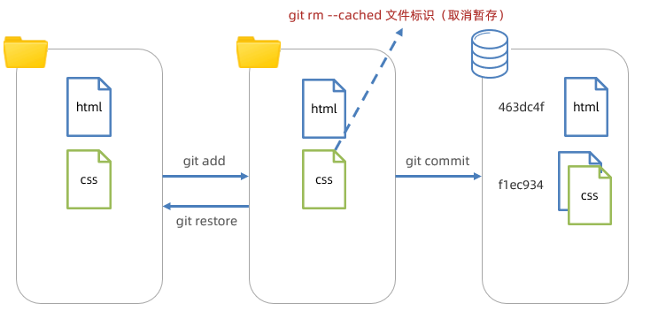
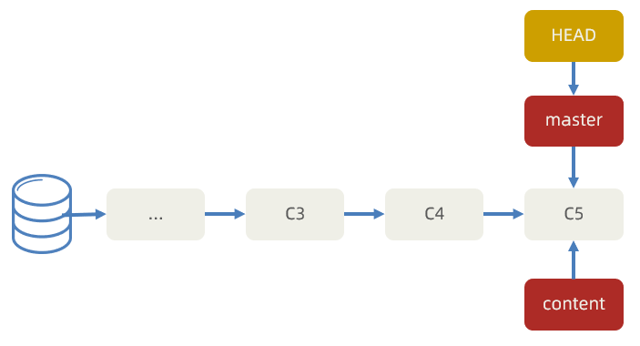
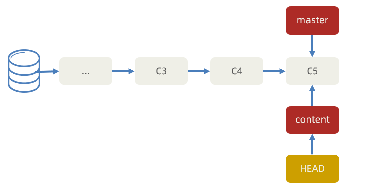
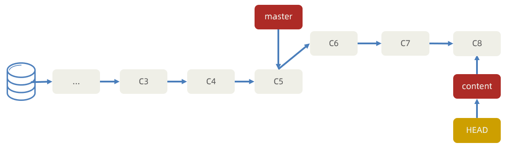

# git基本概念

## Git 初识

1. [概念](https://developer.mozilla.org/zh-CN/docs/Glossary/Git)：一个免费开源，分布式的代码版本控制系统，帮助开发团队维护代码

2. 作用：记录代码内容，切换代码版本，多人开发时高效合并代码内容

3. 如何学：

   个人本机使用：Git 基础命令和概念

   多人共享使用：团队开发同一个项目的代码版本管理


[Windows](https://git-scm.com/)[系统](https://git-scm.com/)：exe 程序，默认下一步即可

Mac系统：dmg 程序，默认下一步即可

检验成功：

1.打开 bash 终端（git 专用）

2.命令：git -v（查看版本号）


配置：用户名和邮箱，应用在每次提交代码版本时表明自己身份

命令：

git config --global user.name "itheima"

git config --global user.email "itheima@itcast.cn"


1.为何学习 Git ？

- 管理代码版本，记录，切换，合并代码


2.Git 学习：

- 现在本机自己使用
- 再学习多人共享使用

3.如何安装使用？

- 程序双击安装
- 使用 bash 终端以及 git 命令

## Git 仓库

Git 仓库（repository）：记录文件状态内容的地方，存储着修改的历史记录


创建：

1.把本地文件夹转换成 Git 仓库：命令 git init

2.从其他服务器上克隆 Git 仓库


需求：创建一个空白的 Git 仓库

1.什么是 Git 仓库 ？

- 记录文件状态内容和历史记录的地方（.git 文件夹）


2.如何创建 Git 仓库？

- 把本地文件夹转换成 Git 仓库：命令 git init


- 从其他服务器上克隆 Git 仓库

## Git 的三个区域

Git 使用时：

工作区：实际开发时操作的文件夹

暂存区：保存之前的准备区域（暂存改动过的文件）

版本库：提交并保存暂存区中的内容，产生一个版本快照

| **命令**                 | **作用**                 |
| ------------------------ | ------------------------ |
| git add 文件名           | 暂存指定文件             |
| git add .                | 暂存所有改动的文件       |
| git commit -m "注释说明" | 提交并保存，产生版本快照 |

需求：把登录页面新增后，暂存并提交


1、Git 使用时有哪些区域 ？

​	 工作区，暂存区，版本库

2、工作区的内容，最终要如何保存在版本库中？

- git add 添加到暂存区


- git commit 提交保存到版本库，产生一次版本快照记录

## Git 文件状态

Git 文件 2 种状态：

ü未跟踪：新文件，从未被 Git 管理过

ü已跟踪：Git 已经知道和管理的文件

| **文件状态** | **概念**          | **场景**             |
| ------------ | ----------------- | -------------------- |
| 未跟踪（U）  | 从未被 Git 管理过 | 新文件               |
| 新添加（A）  | 第一次被 Git 暂存 | 之前版本记录无此文件 |
| 未修改（''） | 三个区域统一      | 提交保存后           |
| 已修改（M）  | 工作区内容变化    | 修改了内容产生       |

使用：修改文件，暂存，提交保存记录，如此反复


需求：新增 css 文件，并使用 git status -s 查看文件状态，并最终提交

第一列是暂存区状态

第二列是工作区状态


1.Git 文件状态分为哪 2 种 ？

- 未跟踪和已跟踪（新添加，未修改，已修改）


2.如何查看暂存区和工作区文件状态？

- git status -s

## Git 暂存区作用

暂存区：暂时存储，可以临时恢复代码内容，与版本库解耦

暂存区 -> 覆盖 -> 工作区，命令：git restore 目标文件（注意：完全确认覆盖时使用）

从暂存区移除文件，命令：git rm --cached 目标文件



1.如何移除暂存区已暂存的文件？

- git rm --cached 目标文件

## 忽略文件

概念：.gitignore 文件可以让 git 彻底忽略跟踪指定文件

目的：让 git 仓库更小更快，避免重复无意义的文件管理

例如：

- 系统或软件自动生成的文件
- 编译产生的结果文件
- 运行时生成的日志文件，缓存文件，临时文件等
- 涉密文件，密码，秘钥等文件

创建：

1. 项目根目录新建 .gitignore 文件
2. 填入相应配置来忽略指定文件

注意：如果文件已经被暂存区跟踪过，可以从暂存区移除即可


## 分支的概念

概念：本质上是指向提交节点的可变指针，默认名字是 master

注意：HEAD 指针影响工作区/暂存区的代码状态


场景：开发新需求 / 修复 Bug，保证主线代码随时可用，多人协同开发提高效率

例如：

在现有代码上创建新分支完成内容列表业务

突然需要紧急修复 Bug - 单独创建分支解决 Bug


需求：创建内容列表 content 分支，并产生 3 次提交记录

步骤：

1. 创建分支命令：git branch 分支名



2. 切换分支命令：git checkout 分支名




3. 工作区准备代码并暂存提交，重复 3 次

   

1.什么是 Git 分支？

- 指针，指向提交记录


2.HEAD 指针的作用？

- 影响暂存区和工作区的代码


3.如何创建和切换指针？

- git branch 分支名


- git checkout 分支名

# git基本操作

### 环境配置

当安装Git后首先要做的事情是设置用户名称和email地址。这是非常重要的，因为每次Git提交都会使用该用户信息

```shell
#设置用户信息 
   git config --global user.name “itcast”
   git config --global user.email “itcast@itcast.cn”
#查看配置信息
   git config --list
   git config user.name
#通过上面的命令设置的信息会保存在~/.gitconfig文件中

```

### initstatus

```shell
# 初始化仓库带工作区
git init
# 初始化仓库不带工作区
git init --bare  
# 查看状态
git status 
#查看状态 使输出信息更加简洁
git status –s 
```

### 暂存区

~~~shell
# 查看暂存区文件列表
git ls-files
# 从暂存区恢复到工作区，如果文件标识为“.”，则恢复所有文件
git restore 文件标识
# 从暂存区移除文件，不让 git 跟踪文件变化
git rm --cached 文件标识
~~~

### add, commit和删除文件

```shell
# 将未跟踪的文件加入暂存区
git add  <文件名>  
# 将暂存区的文件取消暂存 (取消 add )
git reset  <文件名>  
```

```shell
# git commit 将暂存区的文件修改提交到本地仓库
git commit -m "日志信息"  <文件名>  
# 撤销上次commit
git reset --soft head~1	# 不会撤销git add
git reset head~	# 同时会撤销git add
```

```shell
# 从本地工作区 删除文件
git rm <文件名>  
# 如果本工作区库误删, 想要回退
git checkout head <文件名>
git checkout <文件名>
git reset head <文件名/文件夹>
# 删除本地仓库
rm -rf .git
```

### 删除缓存

```shell
# git提交的文件夹无法点击，为灰色
# 原因：该文件夹下也有.git文件
# 解决方法：先删除缓存，在删除.git文件，最后重新add、commit
git rm -r --cached "灰色文件夹名称"
# 无法解决，将本地文件换个位置，同步后再放回来，再同步
```

### 仓库提交记录和版本回退 reset

```shell
# 查看提交记录 - 详细信息
git log
# 查看提交记录 - 简略信息：版本号 分支指针 提交时说明注释
git log --oneline
# 查看已删除的提交记录
git reflog
# 查看完整历史 - 简略消息：包括提交，切换，回退等所有记录
git reflog --oneline
# 以tree形式显示提交记录
git log --oneline --graph [--decorate --all]

# --soft 模式保留暂存区和工作区原本内容  
# --hard 模式不保留暂存区和工作区原本内容 
# --mixed 模式不保留暂存区，工作区保留（默认）  先覆盖到暂存区，再用暂存区对比覆盖工作区
# 版本切换(回退到指定版本)：切换版本代码到暂存区和工作区
git reset --hard <commitID>
# 回退到上个版本
git reset --hard head^
# 回退到第2个版本 
git reset --hard head~2
```

### ssh公钥和秘钥

```shell
# 生成秘钥（后面一直回车即可）
ssh-keygen -t rsa
# 生成秘钥是可加邮箱，后面会让你设置密码，设置后连接仓库需要输入密码
ssh-keygen -t rsa -C "这是你在git配置的邮箱"
# 查看ssh目录下的文件
ls ~/.ssh
# 查看公钥
# 方式1：
cat ~/.ssh/id_rsa.pub
# 方式2：
# 右键 点击 Git GUI Here，点击help，点击show SSH Key,就得到公钥
# id_rsa文件是私钥，要保存好，放在本地，私钥可以生产公钥，反之不行。
# id_rsa.pub文件是公钥，可以用于发送到其他服务器，或者git上
```

### 从远程仓库中指定文件夹下载

```shell
# 初始化命令
git init
# 设置允许克隆子目录
git config core.sparsecheckout true
# 设置要克隆仓库的子目录路径
# 注意：空格不能漏 ，'other' 替换成自己要下载的文件名
echo 'other*' >> .git/info/sparse-checkout
# 换成要克隆项目和目标仓库的地址
git remote add bird 仓库地址
# 下载（实际依然都下载了，只是只显示指定文件夹而已）
git pull bird master
```


# git远程仓库操作

## 查看远程 

```shell
# 查看远程  列出指定的每一个远程服务器的简写
git remote 
# 查看远程 , 列出 简称和地址
git remote  -v  
# 查看远程仓库详细地址
git remote show  <仓库简称>

```

## 添加/移除远程仓库

```shell
# 添加远程仓库
git remote add <shortname> <url>
# 移除远程仓库和本地仓库的关系(只是从本地移除远程仓库的关联关系，并不会真正影响到远程仓库)
git remote rm <shortname> 
```

## 克隆远程仓库

```shell
# 从远程仓库克隆
git clone 远程Git仓库地址 
例如: git clone https://gitee.com/itcast/gittest.git
```

## 推送到远程仓库

```shell
# 强制推送
git push -f origin master

# 把本地仓库推送到别人的远程仓库
git remote add <shortname> <url>	# 添加新的分支
# 拉取，等价于：git fetch 和 git merge
git pull <remote-name> <branch-name>
# 拉取合并，合并没有关系的记录
git pull --rebase 远程仓库别名 分支名
# 一次推送
git add .
git commit -m 'name'
git push <remote-name> <branch-name>
# 若建立了与远程仓库的关联关系，直接 git push 即可

# 将本地仓库推送至远程仓库的某个分支
git push [remote-name] [branch-name]
# 将本地仓库推送至远程仓库的某个分支，并建立起关联关系
git push --set-upstream [remote-name] [branch-name]
# 将本地仓库推送至远程仓库的某个分支，并建立起关联关系(快捷方式)
git push -u [remote-name] [branch-name]
# 推送失败，HTTP 413 curl 22 The requested URL returned error，http推送文件有大小限制，解决方法：添加远程仓库是用ssh方式，使用ssh方式推送。
```

## 删除远程仓库的文件

```shell
# 删除远程仓库文件的同时会删除本地仓库的文件
git rm 文件		 #本地中该文件会被删除
git rm -r 文件夹	#删除文件夹
git commit -m '删除某个文件'
git push （origin master）

# 删除远程仓库文件的同时不会删除本地仓库的文件
git rm --cached 文件 		  #本地中该文件不会被删除
git rm -r  --cached  文件夹 #删除文件夹
git commit -m '删除某个文件'
git push （origin master）
```

## 从远程仓库获取代码

```shell
# 从远程仓库克隆，用ssh方式不能指定用户，需要用http方式
git clone <url> 
# 通过代理克隆仓库
git clone https://github.com/flutter/flutter.git --config "http.proxy=192.168.0.105:7890"
# 从远程仓库拉取 (拉取到.git 目录,不会合并到工作区,工作区发生变化)
git fetch  <shortname>  <分支名称>
# 手动合并  把某个版本的某个分支合并到当前工作区
git merge <shortname>/<分支名称>
# 从远程仓库拉取 (拉取到.git 目录,合并到工作区,工作区不发生变化) = fetch+merge
git pull  <shortname>  <分支名称>
git pull  <shortname>  <分支名称>  --allow-unrelated-histories  #  强制拉取合并
```

注意：如果当前本地仓库不是从远程仓库克隆，而是本地创建的仓库，并且仓库中存在文件，此时再从远程仓库拉取文件的时候会报错（fatal: refusing to merge unrelated histories ），解决此问题可以在git pull命令后加入参数--allow-unrelated-histories (如上 命令)

## 解决需要重复输入账号和密码的问题

```shell
git config --global credential.helper store
# 然后再输入一次账号密码就会保存，以后就不用输入了
```

## 为远程仓库设置代理

```shell
# 通过代理克隆仓库
git clone https://github.com/flutter/flutter.git --config "http.proxy=192.168.0.105:7890"

# 针对所有域名的 Git 仓库
# HTTP/HTTPS 协议，port 需与代理软件设置的一致
git config –-global http.proxy http://127.0.0.1:port  # 注意修改 port
# SOCKS5 协议，port 需与代理软件设置的一致
git config --global http.proxy socks5://127.0.0.1:port  # 注意修改 port

# 针对特定域名的 Git 仓库
# HTTP/HTTPS 协议
git config -–global http.url.proxy http://127.0.0.1:port
# 以 Github 为例
git config –-global http.https://github.com.proxy http://127.0.0.1:port
# SOCKS5 协议
git config –-global http.url.proxy socks5://127.0.0.1:port
# 以 Github 为例
git config –-global http.https://github.com.proxy socks5://127.0.0.1:port
# ssh方式参考：https://www.cnblogs.com/cscshi/p/15705045.html
```


# git命令行-- 分支

## 查增换删

```shell
# 默认 分支名称为 master
# 列出所有本地分支
git branch
# 列出所有远程分支
git branch -r
# 列出所有本地分支和远程分支
git branch -a
# 创建分支
git branch <分支名>
# 切换分支 
git checkout <分支名>
# 创建并立刻切换分支
git checkout -b <分支名>
# 删除分支(如果分支已经修改过,则不允许删除)
git branch -d  <分支名>
# 强制删除分支
git branch -D  <分支名>
```

## 合并分支

~~~shell
# 1、切回到要合入的分支上
git checkout master
# 2、合并其他分支过来
git merge 其他分支名
# 3、删除合并后的其他分支的指针
git branch -d login-bug
~~~

## 远程分支管理

```shell
# 提交分支至远程仓库
git push <仓库简称> <分支名称>	
# 合并分支 将其他分支合并至当前工作区
git merge <分支名称>
# 删除远程仓库分支
git push origin –d branchName
```

# 命令行 --tag

```shell
# 列出所有tag
git tag
# 查看tag详细信息 
git show [tagName]
# 新建一个tag
git tag [tagName]
# 提交指定tag
$ git push [仓库简称] [tagName]
# 新建一个分支，指向某个tag
$ git checkout -b [branch] [tag]
# 删除本地tag
$ git tag -d [tag]
# 删除远程tag (注意 空格)
$ git push origin :refs/tags/[tag]
```

# 案例

```
企业中我们是如何开发的
1) 入职第一天,管理人员分配/git账号密码 
2) 开发人员下载代码即文档/ 根据文档将环境搭建成功
3) 团队一般会给你讲讲项目相关的支持
----
4) 你接到第一个需求(或者某个功能,一般要经过沟通,分析,设计...等过程)
5) 创建feature分支(一般一个需求对应一个feature,命名格式上标注该需求的id)
6) 开发需求,本地测试,提交代码到当前需求对应的feature分支,
	一般来讲为了避免将测试代码提交,需要提交前,检查如下步骤
	6.1) 是否多提交了某个文件,比如测试文件
	6.2) 是否漏提交文件
	6.3) 打开每一个应该提交的文件,判断是否多提交了一行代码,是否少提交了一行代码,是否删除了本应该存在的代码 
	检查完毕提交代码
7) 合并分支至test分支-- 测试人员会在test分支中测试
8) 测试人员测试bug ,开发者在feature分支上继续修改,提交
9) 测试人员测试通过 ,test分支会被测试人员合并到develop开发分支,再次测试
10)develop分支最终会被合并到master主分支

```


   


