# 	HTTP&Tomcat&Servlet

**今日目标：**

> * 了解JavaWeb开发的技术栈
> * 理解HTTP协议和HTTP请求与响应数据的格式
> * 掌握Tomcat的使用
> * 掌握在IDEA中使用Tomcat插件
> * 理解Servlet的执行流程和生命周期
> * 掌握Servlet的使用和相关配置

## 1，Web概述

### 1.1 Web和JavaWeb的概念

==Web是全球广域网，也称为万维网(www)，能够通过浏览器访问的网站。==
在我们日常的生活中，经常会使用浏览器去访问`百度`、`京东`、`传智官网`等这些网站，这些网站统称为Web网站。如下就是通过浏览器访问传智官网的界面: 

我们知道了什么是Web，那么JavaWeb又是什么呢？顾名思义==JavaWeb就是用Java技术来解决相关web互联网领域的技术栈。==
等学习完JavaWeb之后，同学们就可以使用Java语言开发我们上述所说的网站。而国内很多大型网站公司也是首选Java语言来解决web互联网相关的问题。那都有哪些公司的系统是使用Java语言的呢?
 
使用Java语言开发互联网系统是有很多技术栈需要大家了解，具体都有哪些呢?

### 1.2 JavaWeb技术栈

了解JavaWeb技术栈之前，有一个很重要的概念要介绍。

#### 1.2.1 B/S架构

什么是B/S架构?
B/S 架构：Browser/Server，浏览器/服务器 架构模式，它的特点是，客户端只需要浏览器，应用程序的逻辑和数据都存储在服务器端。浏览器只需要请求服务器，获取Web资源，服务器把Web资源发送给浏览器即可。大家可以通过下面这张图来回想下我们平常的上网过程:
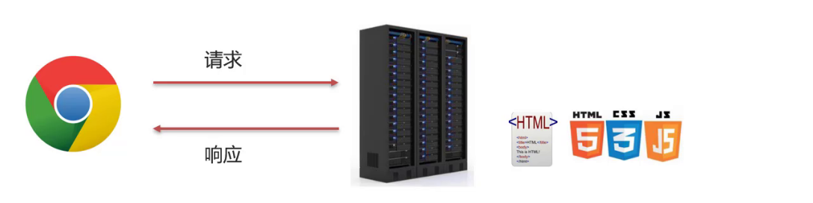

* 打开浏览器访问百度首页，输入要搜索的内容，点击回车或百度一下，就可以获取和搜索相关的内容
* 思考下搜索的内容并不在我们自己的点上，那么这些内容从何而来？答案很明显是从百度服务器返回给我们的
* 日常百度的小细节，逢年过节百度的logo会更换不同的图片，服务端发生变化，客户端不需做任务事情就能获取最新内容
* 所以说B/S架构的好处:易于维护升级：服务器端升级后，客户端无需任何部署就可以使用到新的版本。
	了解了什么是B/S架构后，作为后台开发工程师的我们将来主要关注的是服务端的开发和维护工作。在服务端将来会放很多资源,都有哪些资源呢?

#### 1.2.2 静态资源

* 静态资源主要包含HTML、CSS、JavaScript、图片等，主要负责页面的展示。
* 我们之前已经学过前端网页制作`三剑客`(HTML+CSS+JavaScript),使用这些技术我们就可以制作出效果比较丰富的网页，将来展现给用户。但是由于做出来的这些内容都是静态的，这就会导致所有的人看到的内容将是一模一样。
* 在日常上网的过程中，我们除了看到这些好看的页面以外，还会碰到很多动态内容，比如我们常见的百度登录效果:
	
	`张三`登录以后在网页的右上角看到的是 `张三`，而`李四`登录以后看到的则是`李四`。所以不同的用户访问相同的资源看到的内容大多数是不一样的，要想实现这样的效果，光靠静态资源是无法实现的。

#### 1.2.3 动态资源

* 动态资源主要包含Servlet、JSP等，主要用来负责逻辑处理。
* 动态资源处理完逻辑后会把得到的结果交给静态资源来进行展示，动态资源和静态资源要结合一起使用。
* 动态资源虽然可以处理逻辑，但是当用户来登录百度的时候，就需要输入`用户名`和`密码`,这个时候我们就又需要解决的一个问题是，用户在注册的时候填入的用户名和密码、以及我们经常会访问到一些数据列表的内容展示(如下图所示)，这些数据都存储在哪里?我们需要的时候又是从哪里来取呢?
	

#### 1.2.4 数据库

* 数据库主要负责存储数据。
* 整个Web的访问过程就如下图所示:
	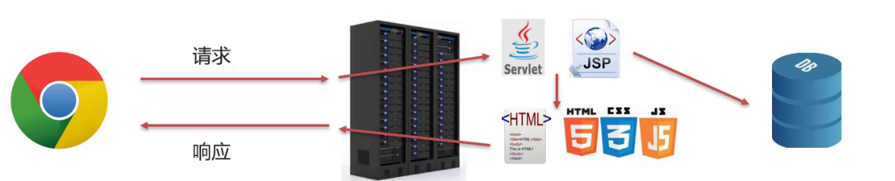
	(1)浏览器发送一个请求到服务端，去请求所需要的相关资源;
	(2)资源分为动态资源和静态资源,动态资源可以是使用Java代码按照Servlet和JSP的规范编写的内容;
	(3)在Java代码可以进行业务处理也可以从数据库中读取数据;
	(4)拿到数据后，把数据交给HTML页面进行展示,再结合CSS和JavaScript使展示效果更好;
	(5)服务端将静态资源响应给浏览器;
	(6)浏览器将这些资源进行解析;
	(7)解析后将效果展示在浏览器，用户就可以看到最终的结果。
	在整个Web的访问过程中，会设计到很多技术，这些技术有已经学习过的，也有还未涉及到的内容，都有哪些还没有涉及到呢?

#### 1.2.5 HTTP协议

* HTTP协议:主要定义通信规则
* 浏览器发送请求给服务器，服务器响应数据给浏览器，这整个过程都需要遵守一定的规则，之前大家学习过TCP、UDP，这些都属于规则，这里我们需要使用的是HTTP协议，这也是一种规则。

#### 1.2.6 Web服务器

* Web服务器:负责解析 HTTP 协议，解析请求数据，并发送响应数据
* 浏览器按照HTTP协议发送请求和数据，后台就需要一个Web服务器软件来根据HTTP协议解析请求和数据，然后把处理结果再按照HTTP协议发送给浏览器
* Web服务器软件有很多，我们课程中将学习的是目前最为常用的==Tomcat==服务器

到这为止，关于JavaWeb中用到的技术栈我们就介绍完了，这里面就只有HTTP协议、Servlet、JSP以及Tomcat这些知识是没有学习过的，所以整个Web核心主要就是来学习这些技术。

### 1.3 Web核心课程安排

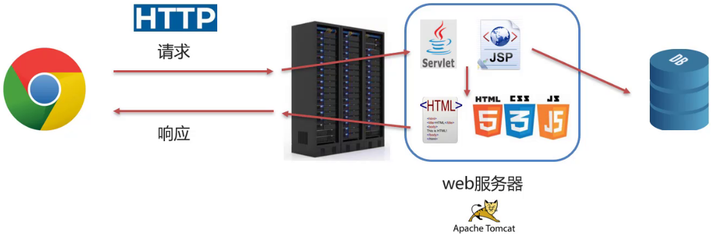

整个Web核心，我们总共有六天的学习内容，分别是:

* 第一天：HTTP、Tomcat、Servlet
* 第二天：Request(请求)、Response(响应)
* 第三天：JSP、会话技术(Cookie、Session)
* 第四天：Filter(过滤器)、Listener(监听器)
* 第五天：Ajax、Vue、ElementUI
* 第六天：综合案例

(1)Request是从客户端向服务端发出的请求对象，

(2)Response是从服务端响应给客户端的结果对象，

(3)JSP是动态网页技术,

(4)会话技术是用来存储客户端和服务端交互所产生的数据，

(5)过滤器是用来拦截客户端的请求,

(6)监听器是用来监听特定事件,

(7)Ajax、Vue、ElementUI都是属于前端技术

这些技术都该如何来使用，我们后面会一个个进行详细的讲解。接下来我们来学习下HTTP、Tomcat和Servlet。 

## 2, HTTP

### 2.1 简介

**HTTP概念**

HyperText Transfer Protocol，超文本传输协议，规定了浏览器和服务器之间==数据传输的规则==。

* 数据传输的规则指的是请求数据和响应数据需要按照指定的格式进行传输。
* 如果想知道具体的格式，可以打开浏览器，点击`F12`打开开发者工具，点击`Network`来查看某一次请求的请求数据和响应数据具体的格式内容，如下图所示:


> 注意:在浏览器中如果看不到上述内容，需要清除浏览器的浏览数据。chrome浏览器可以使用ctrl+shift+Del进行清除。

==所以学习HTTP主要就是学习请求和响应数据的具体格式内容。==

**HTTP协议特点**

HTTP协议有它自己的一些特点，分别是:

* 基于TCP协议: 面向连接，安全

	TCP是一种面向连接的(建立连接之前是需要经过三次握手)、可靠的、基于字节流的传输层通信协议，在数据传输方面更安全。

* 基于请求-响应模型的:一次请求对应一次响应

	请求和响应是一一对应关系

* HTTP协议是无状态协议:对于事物处理没有记忆能力。每次请求-响应都是独立的

	无状态指的是客户端发送HTTP请求给服务端之后，服务端根据请求响应数据，响应完后，不会记录任何信息。这种特性有优点也有缺点，

	* 缺点:多次请求间不能共享数据
	* 优点:速度快

	请求之间无法共享数据会引发的问题，如:

	* 京东购物，`加入购物车`和`去购物车结算`是两次请求，
	* HTTP协议的无状态特性，加入购物车请求响应结束后，并未记录加入购物车是何商品
	* 发起去购物车结算的请求后，因为无法获取哪些商品加入了购物车，会导致此次请求无法正确展示数据

	具体使用的时候，我们发现京东是可以正常展示数据的，原因是Java早已考虑到这个问题，并提出了使用`会话技术(Cookie、Session)`来解决这个问题。具体如何来做，我们后面会详细讲到。刚才提到HTTP协议是规定了请求和响应数据的格式，那具体的格式是什么呢?

### 2.2 请求数据格式

#### 2.2.1 格式介绍

请求数据总共分为三部分内容，分别是==请求行==、==请求头==、==请求体==

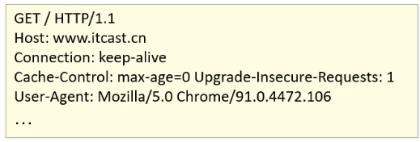

* 请求行: HTTP请求中的第一行数据，请求行包含三块内容，分别是 GET[请求方式] /[请求URL路径] HTTP/1.1[HTTP协议及版本]

	请求方式有七种,最常用的是GET和POST

* 请求头: 第二行开始，格式为key: value形式

	请求头中会包含若干个属性，常见的HTTP请求头有:

	```
	Host: 表示请求的主机名
	User-Agent: 浏览器版本,例如Chrome浏览器的标识类似Mozilla/5.0 ...Chrome/79，IE浏览器的标识类似Mozilla/5.0 (Windows NT ...)like Gecko；
	Accept：表示浏览器能接收的资源类型，如text/*，image/*或者*/*表示所有；
	Accept-Language：表示浏览器偏好的语言，服务器可以据此返回不同语言的网页；
	Accept-Encoding：表示浏览器可以支持的压缩类型，例如gzip, deflate等。
	```

	 ==这些数据有什么用处?==

	举例说明:服务端可以根据请求头中的内容来获取客户端的相关信息，有了这些信息服务端就可以处理不同的业务需求，比如:

	* 不同浏览器解析HTML和CSS标签的结果会有不一致，所以就会导致相同的代码在不同的浏览器会出现不同的效果
	* 服务端根据客户端请求头中的数据获取到客户端的浏览器类型，就可以根据不同的浏览器设置不同的代码来达到一致的效果
	* 这就是我们常说的浏览器兼容问题

* 请求体: POST请求的最后一部分，存储请求参数

	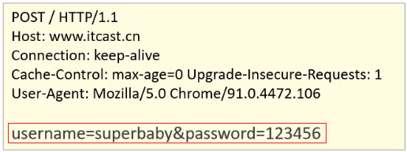

	如上图红线框的内容就是请求体的内容，请求体和请求头之间是有一个空行隔开。此时浏览器发送的是POST请求，为什么不能使用GET呢?这时就需要回顾GET和POST两个请求之间的区别了:

	* GET请求请求参数在请求行中，没有请求体，POST请求请求参数在请求体中
	* GET请求请求参数大小有限制，POST没有

#### 2.2.2 实例演示

把 `代码\http` 拷贝到IDEA的工作目录中，比如`D:\workspace\web`目录，

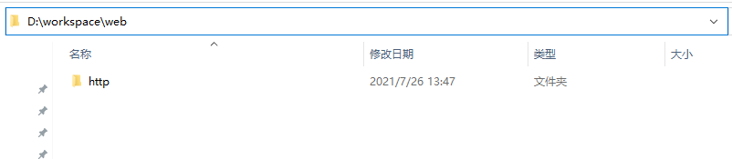

使用IDEA打开

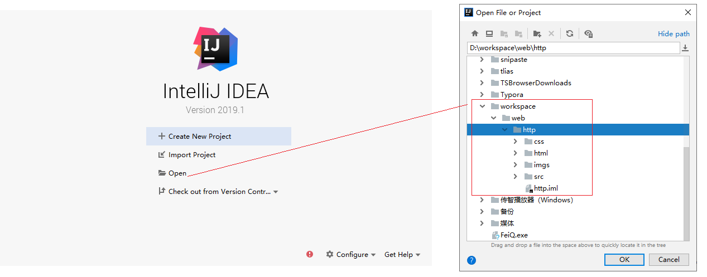

打开后，可以点击项目中的`html\19-表单验证.html`，使用浏览器打开，通过修改页面中form表单的method属性来测试GET请求和POST请求的参数携带方式。

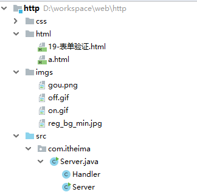


**小结**:

1. 请求数据中包含三部分内容，分别是请求行、请求头和请求体

2. POST请求数据在请求体中，GET请求数据在请求行上

### 2.3 响应数据格式

#### 2.3.1 格式介绍

响应数据总共分为三部分内容，分别是==响应行==、==响应头==、==响应体==


* 响应行：响应数据的第一行,响应行包含三块内容，分别是 HTTP/1.1[HTTP协议及版本] 200[响应状态码] ok[状态码的描述]

* 响应头：第二行开始，格式为key：value形式

	响应头中会包含若干个属性，常见的HTTP响应头有:

	```
	Content-Type：表示该响应内容的类型，例如text/html，image/jpeg；
	Content-Length：表示该响应内容的长度（字节数）；
	Content-Encoding：表示该响应压缩算法，例如gzip；
	Cache-Control：指示客户端应如何缓存，例如max-age=300表示可以最多缓存300秒
	```

* 响应体： 最后一部分。存放响应数据

	上图中<html>...</html>这部分内容就是响应体，它和响应头之间有一个空行隔开。

#### 2.3.2 响应状态码

参考: 资料/1.HTTP/《响应状态码.md》

关于响应状态码，我们先主要认识三个状态码，其余的等后期用到了再去掌握:

* 200  ok 客户端请求成功
* 404  Not Found 请求资源不存在
* 500 Internal Server Error 服务端发生不可预期的错误

#### 2.3.3 自定义服务器

在前面我们导入到IDEA中的http项目中，有一个Server.java类，这里面就是自定义的一个服务器代码，主要使用到的是`ServerSocket`和`Socket`

```java
package com.itheima;

import sun.misc.IOUtils;

import java.io.*;
import java.net.ServerSocket;
import java.net.Socket;
import java.nio.charset.StandardCharsets;
import java.nio.file.Files;
/*
    自定义服务器
 */
public class Server {
    public static void main(String[] args) throws IOException {
        ServerSocket ss = new ServerSocket(8080); // 监听指定端口
        System.out.println("server is running...");
        while (true){
            Socket sock = ss.accept();
            System.out.println("connected from " + sock.getRemoteSocketAddress());
            Thread t = new Handler(sock);
            t.start();
        }
    }
}

class Handler extends Thread {
    Socket sock;

    public Handler(Socket sock) {
        this.sock = sock;
    }

    public void run() {
        try (InputStream input = this.sock.getInputStream()) {
            try (OutputStream output = this.sock.getOutputStream()) {
                handle(input, output);
            }
        } catch (Exception e) {
            try {
                this.sock.close();
            } catch (IOException ioe) {
            }
            System.out.println("client disconnected.");
        }
    }

    private void handle(InputStream input, OutputStream output) throws IOException {
        BufferedReader reader = new BufferedReader(new InputStreamReader(input, StandardCharsets.UTF_8));
        BufferedWriter writer = new BufferedWriter(new OutputStreamWriter(output, StandardCharsets.UTF_8));
        // 读取HTTP请求:
        boolean requestOk = false;
        String first = reader.readLine();
        if (first.startsWith("GET / HTTP/1.")) {
            requestOk = true;
        }
        for (;;) {
            String header = reader.readLine();
            if (header.isEmpty()) { // 读取到空行时, HTTP Header读取完毕
                break;
            }
            System.out.println(header);
        }
        System.out.println(requestOk ? "Response OK" : "Response Error");
        if (!requestOk) {
            // 发送错误响应:
            writer.write("HTTP/1.0 404 Not Found\r\n");
            writer.write("Content-Length: 0\r\n");
            writer.write("\r\n");
            writer.flush();
        } else {
            // 发送成功响应:

            //读取html文件，转换为字符串
            BufferedReader br = new BufferedReader(new FileReader("http/html/a.html"));
            StringBuilder data = new StringBuilder();
            String line = null;
            while ((line = br.readLine()) != null){
                data.append(line);
            }
            br.close();
            int length = data.toString().getBytes(StandardCharsets.UTF_8).length;

            writer.write("HTTP/1.1 200 OK\r\n");
            writer.write("Connection: keep-alive\r\n");
            writer.write("Content-Type: text/html\r\n");
            writer.write("Content-Length: " + length + "\r\n");
            writer.write("\r\n"); // 空行标识Header和Body的分隔
            writer.write(data.toString());
            writer.flush();
        }
    }
}
```

上面代码，大家不需要自己写，主要通过上述代码，只需要大家了解到服务器可以使用java完成编写，是可以接受页面发送的请求和响应数据给前端浏览器的，真正用到的Web服务器，我们不会自己写，都是使用目前比较流行的web服务器，比如==Tomcat==

**小结**

1. 响应数据中包含三部分内容，分别是响应行、响应头和响应体

2. 掌握200，404，500这三个响应状态码所代表含义，分布是成功、所访问资源不存在和服务的错误

## 3, Tomcat

### 3.1 简介

#### 3.1.1 什么是Web服务器

Web服务器是一个应用程序（==软件==），对HTTP协议的操作进行封装，使得程序员不必直接对协议进行操作，让Web开发更加便捷。主要功能是"提供网上信息浏览服务"。


 Web服务器是安装在服务器端的一款软件，将来我们把自己写的Web项目部署到Web Tomcat服务器软件中，当Web服务器软件启动后，部署在Web服务器软件中的页面就可以直接通过浏览器来访问了。

**Web服务器软件使用步骤**

* 准备静态资源
* 下载安装Web服务器软件
* 将静态资源部署到Web服务器上
* 启动Web服务器使用浏览器访问对应的资源

上述内容在演示的时候，使用的是Apache下的Tomcat软件，至于Tomcat软件如何使用，后面会详细的讲到。而对于Web服务器来说，实现的方案有很多，Tomcat只是其中的一种，而除了Tomcat以外，还有很多优秀的Web服务器，比如:


Tomcat就是一款软件，我们主要是以学习如何去使用为主。具体我们会从以下这些方向去学习:

1. 简介: 初步认识下Tomcat

2. 基本使用: 安装、卸载、启动、关闭、配置和项目部署，这些都是对Tomcat的基本操作

3. IDEA中如何创建Maven Web项目

4. IDEA中如何使用Tomcat,后面这两个都是我们以后开发经常会用到的方式

首选我们来认识下Tomcat。

**Tomcat**

Tomcat的相关概念:

* Tomcat是Apache软件基金会一个核心项目，是一个开源免费的轻量级Web服务器，支持Servlet/JSP少量JavaEE规范。

* 概念中提到了JavaEE规范，那什么又是JavaEE规范呢?

	JavaEE: Java Enterprise Edition,Java企业版。指Java企业级开发的技术规范总和。包含13项技术规范:JDBC、JNDI、EJB、RMI、JSP、Servlet、XML、JMS、Java IDL、JTS、JTA、JavaMail、JAF。

* 因为Tomcat支持Servlet/JSP规范，所以Tomcat也被称为Web容器、Servlet容器。Servlet需要依赖Tomcat才能运行。

* Tomcat的官网: https://tomcat.apache.org/ 从官网上可以下载对应的版本进行使用。

**Tomcat的LOGO**


**小结**

通过这一节的学习，我们需要掌握以下内容:

1. Web服务器的作用

> 封装HTTP协议操作，简化开发
>
> 可以将Web项目部署到服务器中，对外提供网上浏览服务

2. Tomcat是一个轻量级的Web服务器，支持Servlet/JSP少量JavaEE规范，也称为Web容器，Servlet容器。

### 3.2 基本使用

Tomcat总共分两部分学习，先来学习Tomcat的基本使用，包括Tomcat的==下载、安装、卸载、启动和关闭==。

#### 3.2.1 下载

直接从官网下载


大家可以自行下载，也可以直接使用资料中已经下载好的资源，

Tomcat的软件程序  资料/2. Tomcat/apache-tomcat-8.5.68-windows-x64.zip

Tomcat的源码	资料/2. Tomcat/tomcat源码/apache-tomcat-8.5.68-src.zip

#### 3.2.2 安装

Tomcat是绿色版,直接解压即可

* 在D盘的software目录下，将`apache-tomcat-8.5.68-windows-x64.zip`进行解压缩，会得到一个`apache-tomcat-8.5.68`的目录，Tomcat就已经安装成功。

	==注意==，Tomcat在解压缩的时候，解压所在的目录可以任意，但最好解压到一个不包含中文和空格的目录，因为后期在部署项目的时候，如果路径有中文或者空格可能会导致程序部署失败。

* 打开`apache-tomcat-8.5.68`目录就能看到如下目录结构，每个目录中包含的内容需要认识下,

	

	bin:目录下有两类文件，一种是以`.bat`结尾的，是Windows系统的可执行文件，一种是以`.sh`结尾的，是Linux系统的可执行文件。

	webapps:就是以后项目部署的目录

	到此，Tomcat的安装就已经完成。

#### 3.2.3 卸载

卸载比较简单，可以直接删除目录即可

#### 3.2.4 启动

双击: bin\startup.bat


启动后，通过浏览器访问 `http://localhost:8080`能看到Apache Tomcat的内容就说明Tomcat已经启动成功。

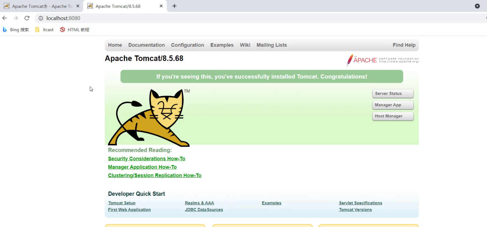

==注意==: 启动的过程中，控制台有中文乱码，需要修改conf/logging.prooperties

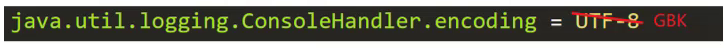

#### 3.2.5 关闭

关闭有三种方式 

* 直接x掉运行窗口:强制关闭[不建议]
* bin\shutdown.bat：正常关闭
* ctrl+c： 正常关闭

#### 3.2.6 配置

**修改端口**

* Tomcat默认的端口是8080，要想修改Tomcat启动的端口号，需要修改 conf/server.xml


> 注: HTTP协议默认端口号为80，如果将Tomcat端口号改为80，则将来访问Tomcat时，将不用输入端口号。

**启动时可能出现的错误**

* Tomcat的端口号取值范围是0-65535之间任意未被占用的端口，如果设置的端口号被占用，启动的时候就会包如下的错误

	

* Tomcat启动的时候，启动窗口一闪而过: 需要检查JAVA_HOME环境变量是否正确配置

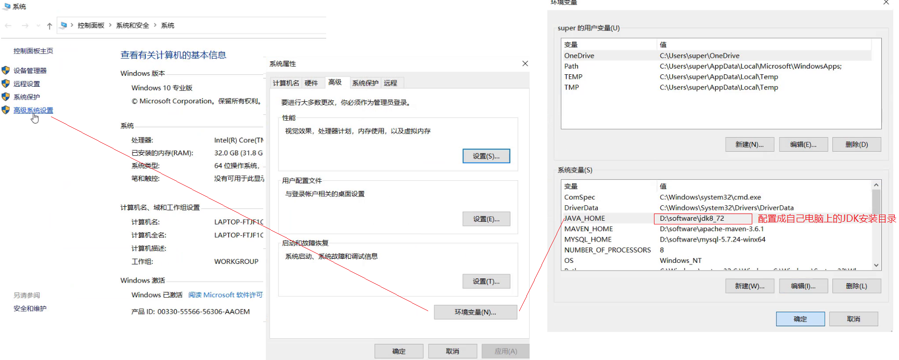

#### 3.2.7 部署

* Tomcat部署项目： 将项目放置到webapps目录下，即部署完成。

	* 将 `资料/2. Tomcat/hello` 目录拷贝到Tomcat的webapps目录下

	* 通过浏览器访问`http://localhost/hello/a.html`，能看到下面的内容就说明项目已经部署成功。

		

		但是呢随着项目的增大，项目中的资源也会越来越多，项目在拷贝的过程中也会越来越费时间，该如何解决呢?

* 一般JavaWeb项目会被打包称==war==包，然后将war包放到Webapps目录下，Tomcat会自动解压缩war文件

	* 将 `资料/2. Tomcat/haha.war`目录拷贝到Tomcat的webapps目录下

	* Tomcat检测到war包后会自动完成解压缩，在webapps目录下就会多一个haha目录

	* 通过浏览器访问`http://localhost/haha/a.html`，能看到下面的内容就说明项目已经部署成功。

		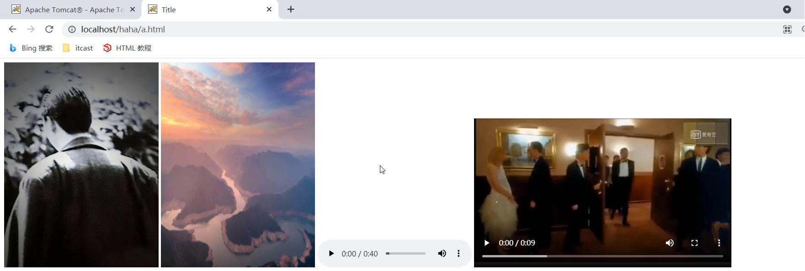

至此，Tomcat的部署就已经完成了，至于如何获得项目对应的war包，后期我们会借助于IDEA工具来生成。

### 3.3 Maven创建Web项目

介绍完Tomcat的基本使用后，我们来学习在IDEA中如何创建Maven Web项目，学习这种方式的原因是以后Tomcat中运行的绝大多数都是Web项目，而使用Maven工具能更加简单快捷的把Web项目给创建出来，所以Maven的Web项目具体如何来构建呢?

在真正创建Maven Web项目之前，我们先要知道Web项目长什么样子，具体的结构是什么?

#### 3.3.1 Web项目结构

Web项目的结构分为:开发中的项目和开发完可以部署的Web项目,这两种项目的结构是不一样的，我们一个个来介绍下:

* Maven Web项目结构: 开发中的项目

	

* 开发完成部署的Web项目

	

	* 开发项目通过执行Maven打包命令==package==,可以获取到部署的Web项目目录
	* 编译后的Java字节码文件和resources的资源文件，会被放到WEB-INF下的classes目录下
	* pom.xml中依赖坐标对应的jar包，会被放入WEB-INF下的lib目录下

#### 3.3.2 创建Maven Web项目

介绍完Maven Web的项目结构后，接下来使用Maven来创建Web项目，创建方式有两种:使用骨架和不使用骨架

**使用骨架**

> 具体的步骤包含:
>
> 1.创建Maven项目
>
> 2.选择使用Web项目骨架
>
> 3.输入Maven项目坐标创建项目
>
> 4.确认Maven相关的配置信息后，完成项目创建
>
> 5.删除pom.xml中多余内容
>
> 6.补齐Maven Web项目缺失的目录结构

1. 创建Maven项目

	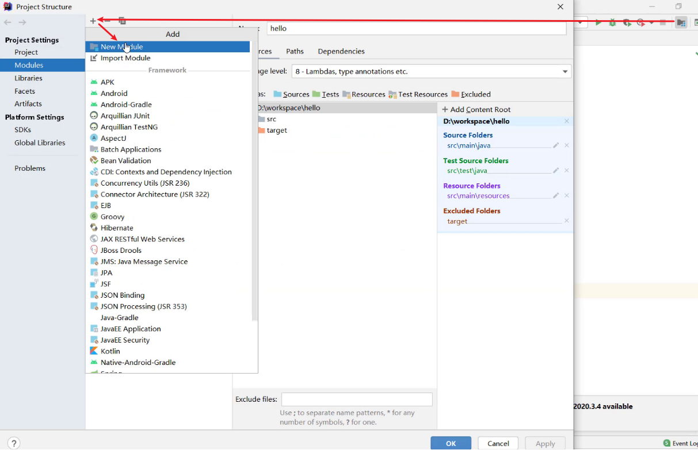

2. 选择使用Web项目骨架

	

3. 输入Maven项目坐标创建项目

	

4. 确认Maven相关的配置信息后，完成项目创建

	

5. 删除pom.xml中多余内容，只留下面的这些内容，注意打包方式 jar和war的区别

	

6. 补齐Maven Web项目缺失的目录结构，默认没有java和resources目录，需要手动完成创建补齐，最终的目录结果如下

	


**不使用骨架**

>具体的步骤包含:
>
>1.创建Maven项目
>
>2.选择不使用Web项目骨架
>
>3.输入Maven项目坐标创建项目
>
>4.在pom.xml设置打包方式为war
>
>5.补齐Maven Web项目缺失webapp的目录结构
>
>6.补齐Maven Web项目缺失WEB-INF/web.xml的目录结构

1. 创建Maven项目

	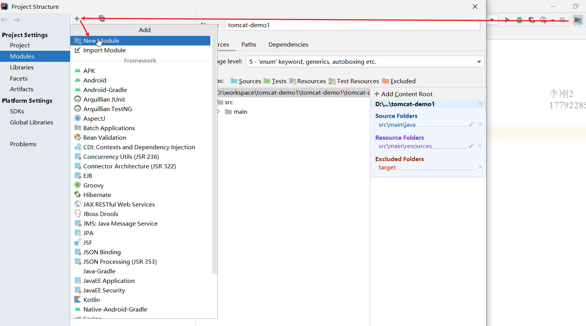

2. 选择不使用Web项目骨架

	

3. 输入Maven项目坐标创建项目

	

4. 在pom.xml设置打包方式为war,默认是不写代表打包方式为jar

	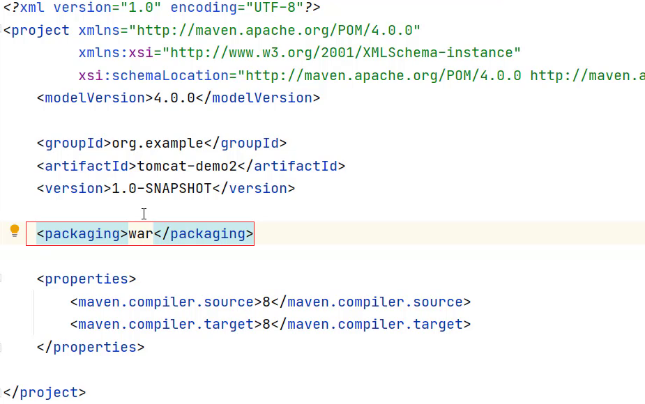

5. 补齐Maven Web项目缺失webapp的目录结构

	

6. 补齐Maven Web项目缺失WEB-INF/web.xml的目录结构

	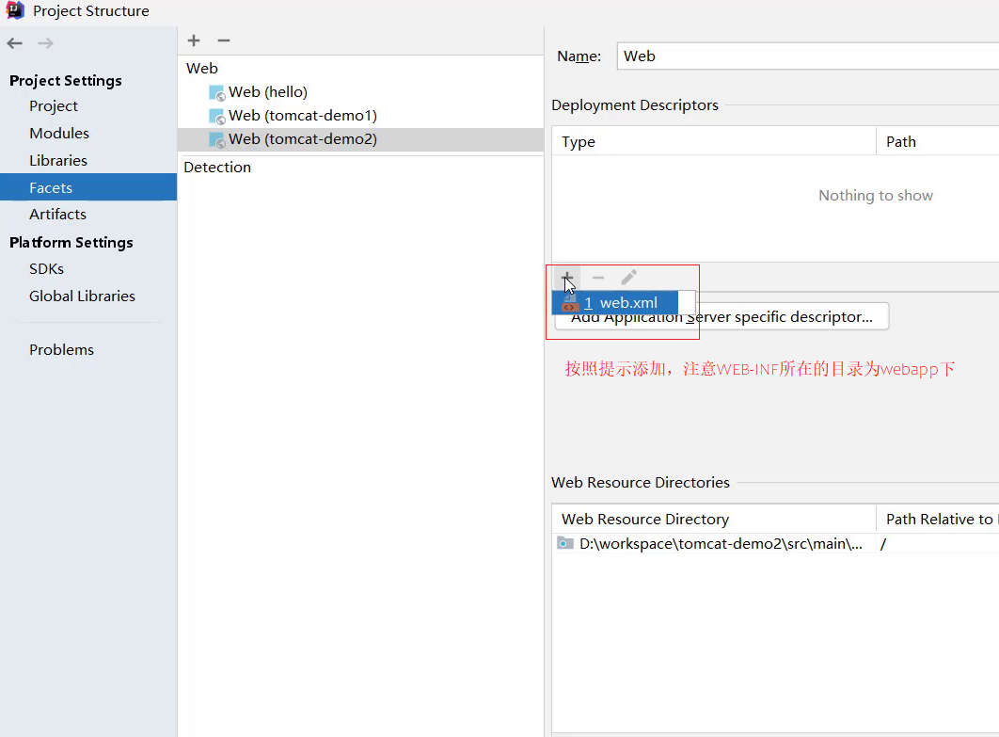

7. 补充完后，最终的项目结构如下:

	

	

	

上述两种方式，创建的web项目，都不是很全，需要手动补充内容，至于最终采用哪种方式来创建Maven Web项目，都是可以的，根据各自的喜好来选择使用即可。

**小结**

1.掌握Maven Web项目的目录结构

2.掌握使用骨架的方式创建Maven Web项目


> 3.掌握不使用骨架的方式创建Maven Web项目


### 3.4 IDEA使用Tomcat

* Maven Web项目创建成功后，通过Maven的package命令可以将项目打包成war包，将war文件拷贝到Tomcat的webapps目录下，启动Tomcat就可以将项目部署成功，然后通过浏览器进行访问即可。
* 然而我们在开发的过程中，项目中的内容会经常发生变化，如果按照上面这种方式来部署测试，是非常不方便的
* 如何在IDEA中能快速使用Tomcat呢?

在IDEA中集成使用Tomcat有两种方式，分别是==集成本地Tomcat==和==Tomcat Maven插件==

#### 3.4.1 集成本地Tomcat

目标: 将刚才本地安装好的Tomcat8集成到IDEA中，完成项目部署，具体的实现步骤

1. 打开添加本地Tomcat的面板

	

2.  指定本地Tomcat的具体路径

	

3. 修改Tomcat的名称，此步骤可以不改，只是让名字看起来更有意义，HTTP port中的端口也可以进行修改，比如把8080改成80

	

4. 将开发项目部署项目到Tomcat中

	

	扩展内容： xxx.war和 xxx.war exploded这两种部署项目模式的区别?

	* war模式是将WEB工程打成war包，把war包发布到Tomcat服务器上

	* war exploded模式是将WEB工程以当前文件夹的位置关系发布到Tomcat服务器上
	* war模式部署成功后，Tomcat的webapps目录下会有部署的项目内容
	* war exploded模式部署成功后，Tomcat的webapps目录下没有，而使用的是项目的target目录下的内容进行部署
	* 建议大家都选war模式进行部署，更符合项目部署的实际情况

5. 部署成功后，就可以启动项目，为了能更好的看到启动的效果，可以在webapp目录下添加a.html页面

	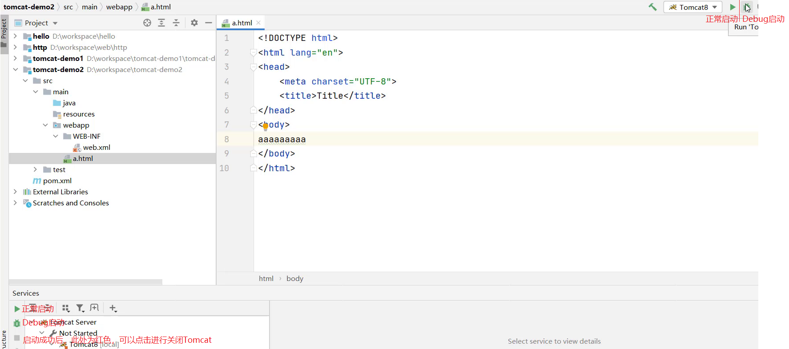

6. 启动成功后，可以通过浏览器进行访问测试

	

7. 最终的注意事项

	

	

至此，IDEA中集成本地Tomcat进行项目部署的内容我们就介绍完了，整体步骤如下，大家需要按照流程进行部署操作练习。


 #### 3.4.2 Tomcat Maven插件

在IDEA中使用本地Tomcat进行项目部署，相对来说步骤比较繁琐，所以我们需要一种更简便的方式来替换它，那就是直接使用Maven中的Tomcat插件来部署项目，具体的实现步骤，只需要两步，分别是:

1. 在pom.xml中添加Tomcat插件

	```xml
	<build>
	    <plugins>
	    	<!--Tomcat插件 -->
	        <plugin>
	            <groupId>org.apache.tomcat.maven</groupId>
	            <artifactId>tomcat7-maven-plugin</artifactId>
	            <version>2.2</version>
	        </plugin>
	    </plugins>
	</build>
	```

2. 使用Maven Helper插件快速启动项目，选中项目，右键-->Run Maven --> tomcat7:run


==注意:==

* 如果选中项目并右键点击后，看不到Run Maven和Debug Maven，这个时候就需要在IDEA中下载Maven Helper插件，具体的操作方式为: File --> Settings --> Plugins --> Maven Helper ---> Install,安装完后按照提示重启IDEA，就可以看到了。


* Maven Tomcat插件目前只有Tomcat7版本，没有更高的版本可以使用
* 使用Maven Tomcat插件，要想修改Tomcat的端口和访问路径，可以直接修改pom.xml

```xml
<build>
    <plugins>
    	<!--Tomcat插件 -->
        <plugin>
            <groupId>org.apache.tomcat.maven</groupId>
            <artifactId>tomcat7-maven-plugin</artifactId>
            <version>2.2</version>
            <configuration>
            	<port>80</port><!--访问端口号 -->
                <!--项目访问路径
					未配置访问路径: http://localhost:80/tomcat-demo2/a.html
					配置/后访问路径: http://localhost:80/a.html
					如果配置成 /hello,访问路径会变成什么?
						答案: http://localhost:80/hello/a.html
				-->
                <path>/</path>
            </configuration>
        </plugin>
    </plugins>
</build>
```

**小结**

通过这一节的学习，大家要掌握在IDEA中使用Tomcat的两种方式，集成本地Tomcat和使用Maven的Tomcat插件。后者更简单，推荐大家使用，但是如果对于Tomcat的版本有比较高的要求，要在Tomcat7以上，这个时候就只能用前者了。

## 4， Servlet

### 4.1 简介

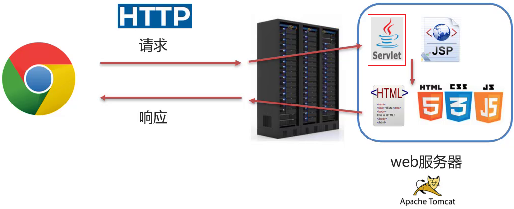

* Servlet是JavaWeb最为核心的内容，它是Java提供的一门==动态==web资源开发技术。

* 使用Servlet就可以实现，根据不同的登录用户在页面上动态显示不同内容。

* Servlet是JavaEE规范之一，其实就是一个接口，将来我们需要定义Servlet类实现Servlet接口，并由web服务器运行Servlet

	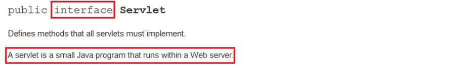

介绍完Servlet是什么以后，接下来我们就按照`快速入门`->`执行流程`->`生命周期`->`体系结构`->`urlPattern配置`->`XML配置`的学习步骤，一步步完成对Servlet的知识学习，首选我们来通过一个入门案例来快速把Servlet用起来。

### 4.2 快速入门

==需求分析: 编写一个Servlet类，并使用IDEA中Tomcat插件进行部署，最终通过浏览器访问所编写的Servlet程序。==

具体的实现步骤为:

1. 创建Web项目`web-demo`，导入Servlet依赖坐标

```xml
<dependency>
    <groupId>javax.servlet</groupId>
    <artifactId>javax.servlet-api</artifactId>
    <version>3.1.0</version>
    <!--
      此处为什么需要添加该标签?
      provided指的是在编译和测试过程中有效,最后生成的war包时不会加入
       因为Tomcat的lib目录中已经有servlet-api这个jar包，如果在生成war包的时候生效就会和Tomcat中的jar包冲突，导致报错
    -->
    <scope>provided</scope>
</dependency>
```

2. 创建:定义一个类，实现Servlet接口，并重写接口中所有方法，并在service方法中输入一句话

```java
package com.itheima.web;

import javax.servlet.*;
import java.io.IOException;

public class ServletDemo1 implements Servlet {

    public void service(ServletRequest servletRequest, ServletResponse servletResponse) throws ServletException, IOException {
        System.out.println("servlet hello world~");
    }
    public void init(ServletConfig servletConfig) throws ServletException {

    }

    public ServletConfig getServletConfig() {
        return null;
    }

    public String getServletInfo() {
        return null;
    }

    public void destroy() {

    }
}
```

3. 配置:在类上使用@WebServlet注解，配置该Servlet的访问路径

```java
@WebServlet("/demo1")
```

4. 访问:启动Tomcat,浏览器中输入URL地址访问该Servlet

```
http://localhost:8080/web-demo/demo1
```

5. 器访问后，在控制台会打印`servlet hello world~` 说明servlet程序已经成功运行。

至此，Servlet的入门案例就已经完成，大家可以按照上面的步骤进行练习了。

### 4.3 执行流程

Servlet程序已经能正常运行，但是我们需要思考个问题: 我们并没有创建ServletDemo1类的对象，也没有调用对象中的service方法，为什么在控制台就打印了`servlet hello world~`这句话呢?

要想回答上述问题，我们就需要对Servlet的执行流程进行一个学习。


* 浏览器发出`http://localhost:8080/web-demo/demo1`请求，从请求中可以解析出三部分内容，分别是`localhost:8080`、`web-demo`、`demo1`
	* 根据`localhost:8080`可以找到要访问的Tomcat Web服务器
	* 根据`web-demo`可以找到部署在Tomcat服务器上的web-demo项目
	* 根据`demo1`可以找到要访问的是项目中的哪个Servlet类，根据@WebServlet后面的值进行匹配
* 找到ServletDemo1这个类后，Tomcat Web服务器就会为ServletDemo1这个类创建一个对象，然后调用对象中的service方法
	* ServletDemo1实现了Servlet接口，所以类中必然会重写service方法供Tomcat Web服务器进行调用
	* service方法中有ServletRequest和ServletResponse两个参数，ServletRequest封装的是请求数据，ServletResponse封装的是响应数据，后期我们可以通过这两个参数实现前后端的数据交互

**小结**

介绍完Servlet的执行流程，需要大家掌握两个问题：

1. Servlet由谁创建?Servlet方法由谁调用?

> Servlet由web服务器创建，Servlet方法由web服务器调用

2. 服务器怎么知道Servlet中一定有service方法?

> 因为我们自定义的Servlet,必须实现Servlet接口并复写其方法，而Servlet接口中有service方法

### 4.4 生命周期

介绍完Servlet的执行流程后，我们知道Servlet是由Tomcat Web服务器帮我们创建的。

接下来咱们再来思考一个问题:==Tomcat什么时候创建的Servlet对象?==

要想回答上述问题，我们就需要对Servlet的生命周期进行一个学习。

* 生命周期: 对象的生命周期指一个对象从被创建到被销毁的整个过程。

* Servlet运行在Servlet容器(web服务器)中，其生命周期由容器来管理，分为4个阶段：

	1. ==加载和实例化==：默认情况下，当Servlet第一次被访问时，由容器创建Servlet对象

	```xml
	默认情况，Servlet会在第一次访问被容器创建，但是如果创建Servlet比较耗时的话，那么第一个访问的人等待的时间就比较长，用户的体验就比较差，那么我们能不能把Servlet的创建放到服务器启动的时候来创建，具体如何来配置?
	
	@WebServlet(urlPatterns = "/demo1",loadOnStartup = 1)
	loadOnstartup的取值有两类情况
		（1）负整数:第一次访问时创建Servlet对象
		（2）0或正整数:服务器启动时创建Servlet对象，数字越小优先级越高
	```

	2. ==初始化==：在Servlet实例化之后，容器将调用Servlet的==init()==方法初始化这个对象，完成一些如加载配置文件、创建连接等初始化的工作。该方法只==调用一次==
	3. ==请求处理==：==每次==请求Servlet时，Servlet容器都会调用Servlet的==service()==方法对请求进行处理
	4. ==服务终止==：当需要释放内存或者容器关闭时，容器就会调用Servlet实例的==destroy()==方法完成资源的释放。在destroy()方法调用之后，容器会释放这个Servlet实例，该实例随后会被Java的垃圾收集器所回收

* 通过案例演示下上述的生命周期

	```java
	package com.itheima.web;
	
	import javax.servlet.*;
	import javax.servlet.annotation.WebServlet;
	import java.io.IOException;
	/**
	* Servlet生命周期方法
	*/
	@WebServlet(urlPatterns = "/demo2",loadOnStartup = 1)
	public class ServletDemo2 implements Servlet {
	
	    /**
	     *  初始化方法
	     *  1.调用时机：默认情况下，Servlet被第一次访问时，调用
	     *      * loadOnStartup: 默认为-1，修改为0或者正整数，则会在服务器启动的时候，调用
	     *  2.调用次数: 1次
	     * @param config
	     * @throws ServletException
	     */
	    public void init(ServletConfig config) throws ServletException {
	        System.out.println("init...");
	    }
	
	    /**
	     * 提供服务
	     * 1.调用时机:每一次Servlet被访问时，调用
	     * 2.调用次数: 多次
	     * @param req
	     * @param res
	     * @throws ServletException
	     * @throws IOException
	     */
	    public void service(ServletRequest req, ServletResponse res) throws ServletException, IOException {
	        System.out.println("servlet hello world~");
	    }
	
	    /**
	     * 销毁方法
	     * 1.调用时机：内存释放或者服务器关闭的时候，Servlet对象会被销毁，调用
	     * 2.调用次数: 1次
	     */
	    public void destroy() {
	        System.out.println("destroy...");
	    }
	    public ServletConfig getServletConfig() {
	        return null;
	    }
	
	    public String getServletInfo() {
	        return null;
	    }
	
	
	}
	```

	==注意:如何才能让Servlet中的destroy方法被执行？==

	

在Terminal命令行中，先使用`mvn tomcat7:run`启动，然后再使用`ctrl+c`关闭tomcat

**小结**

这节中需要掌握的内容是:

1. Servlet对象在什么时候被创建的?

> 默认是第一次访问的时候被创建，可以使用@WebServlet(urlPatterns = "/demo2",loadOnStartup = 1)的loadOnStartup 修改成在服务器启动的时候创建。

2. Servlet生命周期中涉及到的三个方法，这三个方法是什么?什么时候被调用?调用几次?

>涉及到三个方法，分别是 init()、service()、destroy()
>
>init方法在Servlet对象被创建的时候执行，只执行1次
>
>service方法在Servlet被访问的时候调用，每访问1次就调用1次
>
>destroy方法在Servlet对象被销毁的时候调用，只执行1次

### 4.5 方法介绍

Servlet中总共有5个方法，我们已经介绍过其中的三个，剩下的两个方法作用分别是什么？

我们先来回顾下前面讲的三个方法，分别是:

* 初始化方法，在Servlet被创建时执行，只执行一次

```java
void init(ServletConfig config) 
```

* 提供服务方法， 每次Servlet被访问，都会调用该方法

```java
void service(ServletRequest req, ServletResponse res)
```

* 销毁方法，当Servlet被销毁时，调用该方法。在内存释放或服务器关闭时销毁Servlet

```java
void destroy() 
```

剩下的两个方法是:

* 获取Servlet信息

```java
String getServletInfo() 
//该方法用来返回Servlet的相关信息，没有什么太大的用处，一般我们返回一个空字符串即可
public String getServletInfo() {
    return "";
}
```

* 获取ServletConfig对象

```java
ServletConfig getServletConfig()
```

ServletConfig对象，在init方法的参数中有，而Tomcat Web服务器在创建Servlet对象的时候会调用init方法，必定会传入一个ServletConfig对象，我们只需要将服务器传过来的ServletConfig进行返回即可。具体如何操作?

```java
package com.itheima.web;

import javax.servlet.*;
import javax.servlet.annotation.WebServlet;
import java.io.IOException;

/**
 * Servlet方法介绍
 */
@WebServlet(urlPatterns = "/demo3",loadOnStartup = 1)
public class ServletDemo3 implements Servlet {

    private ServletConfig servletConfig;
    /**
     *  初始化方法
     *  1.调用时机：默认情况下，Servlet被第一次访问时，调用
     *      * loadOnStartup: 默认为-1，修改为0或者正整数，则会在服务器启动的时候，调用
     *  2.调用次数: 1次
     * @param config
     * @throws ServletException
     */
    public void init(ServletConfig config) throws ServletException {
        this.servletConfig = config;
        System.out.println("init...");
    }
    public ServletConfig getServletConfig() {
        return servletConfig;
    }
    
    /**
     * 提供服务
     * 1.调用时机:每一次Servlet被访问时，调用
     * 2.调用次数: 多次
     * @param req
     * @param res
     * @throws ServletException
     * @throws IOException
     */
    public void service(ServletRequest req, ServletResponse res) throws ServletException, IOException {
        System.out.println("servlet hello world~");
    }

    /**
     * 销毁方法
     * 1.调用时机：内存释放或者服务器关闭的时候，Servlet对象会被销毁，调用
     * 2.调用次数: 1次
     */
    public void destroy() {
        System.out.println("destroy...");
    }
    
    public String getServletInfo() {
        return "";
    }
}
```

getServletInfo()和getServletConfig()这两个方法使用的不是很多，大家了解下。

### 4.6 体系结构

通过上面的学习，我们知道要想编写一个Servlet就必须要实现Servlet接口，重写接口中的5个方法，虽然已经能完成要求，但是编写起来还是比较麻烦的，因为我们更关注的其实只有service方法，那有没有更简单方式来创建Servlet呢?

要想解决上面的问题，我们需要先对Servlet的体系结构进行下了解:


因为我们将来开发B/S架构的web项目，都是针对HTTP协议，所以我们自定义Servlet,会通过继承==HttpServlet==

具体的编写格式如下:

```java
@WebServlet("/demo4")
public class ServletDemo4 extends HttpServlet {
    @Override
    protected void doGet(HttpServletRequest req, HttpServletResponse resp) throws ServletException, IOException {
        //TODO GET 请求方式处理逻辑
        System.out.println("get...");
    }
    @Override
    protected void doPost(HttpServletRequest req, HttpServletResponse resp) throws ServletException, IOException {
        //TODO Post 请求方式处理逻辑
        System.out.println("post...");
    }
}
```

* 要想发送一个GET请求，请求该Servlet，只需要通过浏览器发送`http://localhost:8080/web-demo/demo4`,就能看到doGet方法被执行了
* 要想发送一个POST请求，请求该Servlet，单单通过浏览器是无法实现的，这个时候就需要编写一个form表单来发送请求，在webapp下创建一个`a.html`页面，内容如下:

```html
<!DOCTYPE html>
<html lang="en">
<head>
    <meta charset="UTF-8">
    <title>Title</title>
</head>
<body>
    <form action="/web-demo/demo4" method="post">
        <input name="username"/><input type="submit"/>
    </form>
</body>
</html>
```

启动测试，即可看到doPost方法被执行了。

Servlet的简化编写就介绍完了，接着需要思考两个问题:

1. HttpServlet中为什么要根据请求方式的不同，调用不同的方法?
2. 如何调用?

针对问题一，我们需要回顾之前的知识点==前端发送GET和POST请求的时候，参数的位置不一致，GET请求参数在请求行中，POST请求参数在请求体中==，为了能处理不同的请求方式，我们得在service方法中进行判断，然后写不同的业务处理，这样能实现，但是每个Servlet类中都将有相似的代码，针对这个问题，有什么可以优化的策略么?

```java
package com.itheima.web;

import javax.servlet.*;
import javax.servlet.annotation.WebServlet;
import javax.servlet.http.HttpServlet;
import javax.servlet.http.HttpServletRequest;
import javax.servlet.http.HttpServletResponse;
import java.io.IOException;


@WebServlet("/demo5")
public class ServletDemo5 implements Servlet {

    public void init(ServletConfig config) throws ServletException {

    }

    public ServletConfig getServletConfig() {
        return null;
    }

    public void service(ServletRequest req, ServletResponse res) throws ServletException, IOException {
        //如何调用?
        //获取请求方式，根据不同的请求方式进行不同的业务处理
        HttpServletRequest request = (HttpServletRequest)req;
       //1. 获取请求方式
        String method = request.getMethod();
        //2. 判断
        if("GET".equals(method)){
            // get方式的处理逻辑
        }else if("POST".equals(method)){
            // post方式的处理逻辑
        }
    }

    public String getServletInfo() {
        return null;
    }

    public void destroy() {

    }
}

```

要解决上述问题，我们可以对Servlet接口进行继承封装，来简化代码开发。

```java
package com.itheima.web;

import javax.servlet.*;
import javax.servlet.http.HttpServletRequest;
import java.io.IOException;

public class MyHttpServlet implements Servlet {
    public void init(ServletConfig config) throws ServletException {

    }

    public ServletConfig getServletConfig() {
        return null;
    }

    public void service(ServletRequest req, ServletResponse res) throws ServletException, IOException {
        HttpServletRequest request = (HttpServletRequest)req;
        //1. 获取请求方式
        String method = request.getMethod();
        //2. 判断
        if("GET".equals(method)){
            // get方式的处理逻辑
            doGet(req,res);
        }else if("POST".equals(method)){
            // post方式的处理逻辑
            doPost(req,res);
        }
    }

    protected void doPost(ServletRequest req, ServletResponse res) {
    }

    protected void doGet(ServletRequest req, ServletResponse res) {
    }

    public String getServletInfo() {
        return null;
    }

    public void destroy() {

    }
}

```

有了MyHttpServlet这个类，以后我们再编写Servlet类的时候，只需要继承MyHttpServlet，重写父类中的doGet和doPost方法，就可以用来处理GET和POST请求的业务逻辑。接下来，可以把ServletDemo5代码进行改造

```java
@WebServlet("/demo5")
public class ServletDemo5 extends MyHttpServlet {

    @Override
    protected void doGet(ServletRequest req, ServletResponse res) {
        System.out.println("get...");
    }

    @Override
    protected void doPost(ServletRequest req, ServletResponse res) {
        System.out.println("post...");
    }
}

```

将来页面发送的是GET请求，则会进入到doGet方法中进行执行，如果是POST请求，则进入到doPost方法。这样代码在编写的时候就相对来说更加简单快捷。

类似MyHttpServlet这样的类Servlet中已经为我们提供好了，就是HttpServlet,翻开源码，大家可以搜索`service()`方法，你会发现HttpServlet做的事更多，不仅可以处理GET和POST还可以处理其他五种请求方式。

```java
protected void service(HttpServletRequest req, HttpServletResponse resp)
        throws ServletException, IOException
    {
        String method = req.getMethod();

        if (method.equals(METHOD_GET)) {
            long lastModified = getLastModified(req);
            if (lastModified == -1) {
                // servlet doesn't support if-modified-since, no reason
                // to go through further expensive logic
                doGet(req, resp);
            } else {
                long ifModifiedSince = req.getDateHeader(HEADER_IFMODSINCE);
                if (ifModifiedSince < lastModified) {
                    // If the servlet mod time is later, call doGet()
                    // Round down to the nearest second for a proper compare
                    // A ifModifiedSince of -1 will always be less
                    maybeSetLastModified(resp, lastModified);
                    doGet(req, resp);
                } else {
                    resp.setStatus(HttpServletResponse.SC_NOT_MODIFIED);
                }
            }

        } else if (method.equals(METHOD_HEAD)) {
            long lastModified = getLastModified(req);
            maybeSetLastModified(resp, lastModified);
            doHead(req, resp);

        } else if (method.equals(METHOD_POST)) {
            doPost(req, resp);
            
        } else if (method.equals(METHOD_PUT)) {
            doPut(req, resp);
            
        } else if (method.equals(METHOD_DELETE)) {
            doDelete(req, resp);
            
        } else if (method.equals(METHOD_OPTIONS)) {
            doOptions(req,resp);
            
        } else if (method.equals(METHOD_TRACE)) {
            doTrace(req,resp);
            
        } else {
            //
            // Note that this means NO servlet supports whatever
            // method was requested, anywhere on this server.
            //

            String errMsg = lStrings.getString("http.method_not_implemented");
            Object[] errArgs = new Object[1];
            errArgs[0] = method;
            errMsg = MessageFormat.format(errMsg, errArgs);
            
            resp.sendError(HttpServletResponse.SC_NOT_IMPLEMENTED, errMsg);
        }
    }
```

**小结**

通过这一节的学习，要掌握:

1. HttpServlet的使用步骤

> 继承HttpServlet
>
> 重写doGet和doPost方法

2. HttpServlet原理

> 获取请求方式，并根据不同的请求方式，调用不同的doXxx方法

### 4.7 urlPattern配置

Servlet类编写好后，要想被访问到，就需要配置其访问路径（==urlPattern==）

* 一个Servlet,可以配置多个urlPattern

	

	```java
	package com.itheima.web;
	
	import javax.servlet.ServletRequest;
	import javax.servlet.ServletResponse;
	import javax.servlet.annotation.WebServlet;
	
	/**
	* urlPattern: 一个Servlet可以配置多个访问路径
	*/
	@WebServlet(urlPatterns = {"/demo7","/demo8"})
	public class ServletDemo7 extends MyHttpServlet {
	
	    @Override
	    protected void doGet(ServletRequest req, ServletResponse res) {
	        
	        System.out.println("demo7 get...");
	    }
	    @Override
	    protected void doPost(ServletRequest req, ServletResponse res) {
	    }
	}
	```

	在浏览器上输入`http://localhost:8080/web-demo/demo7`,`http://localhost:8080/web-demo/demo8`这两个地址都能访问到ServletDemo7的doGet方法。

* ==urlPattern配置规则==

	* 精确匹配

		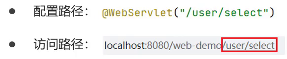

		```java
		/**
		 * UrlPattern:
		 * * 精确匹配
		 */
		@WebServlet(urlPatterns = "/user/select")
		public class ServletDemo8 extends MyHttpServlet {
		
		    @Override
		    protected void doGet(ServletRequest req, ServletResponse res) {
		
		        System.out.println("demo8 get...");
		    }
		    @Override
		    protected void doPost(ServletRequest req, ServletResponse res) {
		    }
		}
		```

		访问路径`http://localhost:8080/web-demo/user/select`

	* 目录匹配

		

		```java
		package com.itheima.web;
		
		import javax.servlet.ServletRequest;
		import javax.servlet.ServletResponse;
		import javax.servlet.annotation.WebServlet;
		
		/**
		 * UrlPattern:
		 * * 目录匹配: /user/*
		 */
		@WebServlet(urlPatterns = "/user/*")
		public class ServletDemo9 extends MyHttpServlet {
		
		    @Override
		    protected void doGet(ServletRequest req, ServletResponse res) {
		
		        System.out.println("demo9 get...");
		    }
		    @Override
		    protected void doPost(ServletRequest req, ServletResponse res) {
		    }
		}
		```

		访问路径`http://localhost:8080/web-demo/user/任意`

		==思考:==

		1. 访问路径`http://localhost:8080/web-demo/user`是否能访问到demo9的doGet方法?
		2. 访问路径`http://localhost:8080/web-demo/user/a/b`是否能访问到demo9的doGet方法?
		3. 访问路径`http://localhost:8080/web-demo/user/select`是否能访问到demo9还是demo8的doGet方法?

		答案是: 能、能、demo8，进而我们可以得到的结论是`/user/*`中的`/*`代表的是零或多个层级访问目录同时精确匹配优先级要高于目录匹配。

	* 扩展名匹配

		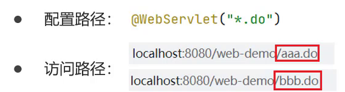

		```java
		package com.itheima.web;
		
		import javax.servlet.ServletRequest;
		import javax.servlet.ServletResponse;
		import javax.servlet.annotation.WebServlet;
		
		/**
		 * UrlPattern:
		 * * 扩展名匹配: *.do
		 */
		@WebServlet(urlPatterns = "*.do")
		public class ServletDemo10 extends MyHttpServlet {
		
		    @Override
		    protected void doGet(ServletRequest req, ServletResponse res) {
		
		        System.out.println("demo10 get...");
		    }
		    @Override
		    protected void doPost(ServletRequest req, ServletResponse res) {
		    }
		}
		```

		访问路径`http://localhost:8080/web-demo/任意.do`

		==注意==:

		1. 如果路径配置的不是扩展名，那么在路径的前面就必须要加`/`否则会报错

		

		2. 如果路径配置的是`*.do`,那么在*.do的前面不能加`/`,否则会报错

		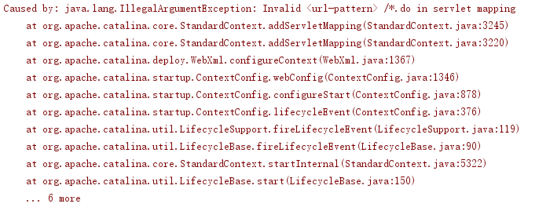

	* 任意匹配

		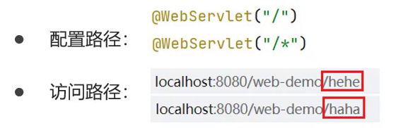

		```java
		package com.itheima.web;
		
		import javax.servlet.ServletRequest;
		import javax.servlet.ServletResponse;
		import javax.servlet.annotation.WebServlet;
		
		/**
		 * UrlPattern:
		 * * 任意匹配： /
		 */
		@WebServlet(urlPatterns = "/")
		public class ServletDemo11 extends MyHttpServlet {
		
		    @Override
		    protected void doGet(ServletRequest req, ServletResponse res) {
		
		        System.out.println("demo11 get...");
		    }
		    @Override
		    protected void doPost(ServletRequest req, ServletResponse res) {
		    }
		}
		```

		访问路径`http://localhost:8080/demo-web/任意`

		```java
		package com.itheima.web;
		
		import javax.servlet.ServletRequest;
		import javax.servlet.ServletResponse;
		import javax.servlet.annotation.WebServlet;
		
		/**
		 * UrlPattern:
		 * * 任意匹配： /*
		 */
		@WebServlet(urlPatterns = "/*")
		public class ServletDemo12 extends MyHttpServlet {
		
		    @Override
		    protected void doGet(ServletRequest req, ServletResponse res) {
		
		        System.out.println("demo12 get...");
		    }
		    @Override
		    protected void doPost(ServletRequest req, ServletResponse res) {
		    }
		}
		
		```

		访问路径`http://localhost:8080/demo-web/任意

		==注意:==`/`和`/*`的区别?

		1. 当我们的项目中的Servlet配置了 "/",会覆盖掉tomcat中的DefaultServlet,当其他的url-pattern都匹配不上时都会走这个Servlet

		2. 当我们的项目中配置了"/*",意味着匹配任意访问路径

		3. DefaultServlet是用来处理静态资源，如果配置了"/"会把默认的覆盖掉，就会引发请求静态资源的时候没有走默认的而是走了自定义的Servlet类，最终导致静态资源不能被访问

**小结**

1. urlPattern总共有四种配置方式，分别是精确匹配、目录匹配、扩展名匹配、任意匹配

2. 五种配置的优先级为 精确匹配 > 目录匹配> 扩展名匹配 > /* > / ,无需记，以最终运行结果为准。

### 4.8 XML配置

前面对应Servlet的配置，我们都使用的是@WebServlet,这个是Servlet从3.0版本后开始支持注解配置，3.0版本前只支持XML配置文件的配置方法。

对于XML的配置步骤有两步:

* 编写Servlet类

```java
package com.itheima.web;

import javax.servlet.ServletRequest;
import javax.servlet.ServletResponse;
import javax.servlet.annotation.WebServlet;

public class ServletDemo13 extends MyHttpServlet {

    @Override
    protected void doGet(ServletRequest req, ServletResponse res) {

        System.out.println("demo13 get...");
    }
    @Override
    protected void doPost(ServletRequest req, ServletResponse res) {
    }
}
```

* 在web.xml中配置该Servlet

```xml
<?xml version="1.0" encoding="UTF-8"?>
<web-app xmlns="http://xmlns.jcp.org/xml/ns/javaee"
         xmlns:xsi="http://www.w3.org/2001/XMLSchema-instance"
         xsi:schemaLocation="http://xmlns.jcp.org/xml/ns/javaee http://xmlns.jcp.org/xml/ns/javaee/web-app_4_0.xsd"
         version="4.0">
    
    
    
    <!-- 
        Servlet 全类名
    -->
    <servlet>
        <!-- servlet的名称，名字任意-->
        <servlet-name>demo13</servlet-name>
        <!--servlet的类全名-->
        <servlet-class>com.itheima.web.ServletDemo13</servlet-class>
    </servlet>

    <!-- 
        Servlet 访问路径
    -->
    <servlet-mapping>
        <!-- servlet的名称，要和上面的名称一致-->
        <servlet-name>demo13</servlet-name>
        <!-- servlet的访问路径-->
        <url-pattern>/demo13</url-pattern>
    </servlet-mapping>
</web-app>
```

这种配置方式和注解比起来，确认麻烦很多，所以建议大家使用注解来开发。但是大家要认识上面这种配置方式，因为并不是所有的项目都是基于注解开发的。

# Request&Response

**今日目标**

>* 掌握Request对象的概念与使用
>* 掌握Response对象的概念与使用
>* 能够完成用户登录注册案例的实现
>* 能够完成SqlSessionFactory工具类的抽取

## 1，Request和Response的概述

==Request是请求对象，Response是响应对象。==这两个对象在我们使用Servlet的时候有看到：

此时，我们就需要思考一个问题request和response这两个参数的作用是什么?


* request:==获取==请求数据
	* 浏览器会发送HTTP请求到后台服务器[Tomcat]
	* HTTP的请求中会包含很多请求数据[请求行+请求头+请求体]
	* 后台服务器[Tomcat]会对HTTP请求中的数据进行解析并把解析结果存入到一个对象中
	* 所存入的对象即为request对象，所以我们可以从request对象中获取请求的相关参数
	* 获取到数据后就可以继续后续的业务，比如获取用户名和密码就可以实现登录操作的相关业务
* response:==设置==响应数据
	* 业务处理完后，后台就需要给前端返回业务处理的结果即响应数据
	* 把响应数据封装到response对象中
	* 后台服务器[Tomcat]会解析response对象,按照[响应行+响应头+响应体]格式拼接结果
	* 浏览器最终解析结果，把内容展示在浏览器给用户浏览

对于上述所讲的内容，我们通过一个案例来初步体验下request和response对象的使用。

```java
@WebServlet("/demo3")
public class ServletDemo3 extends HttpServlet {
    @Override
    protected void doGet(HttpServletRequest request, HttpServletResponse response) throws ServletException, IOException {
        //使用request对象 获取请求数据
        String name = request.getParameter("name");//url?name=zhangsan

        //使用response对象 设置响应数据
        response.setHeader("content-type","text/html;charset=utf-8");
        response.getWriter().write("<h1>"+name+",欢迎您！</h1>");
    }

    @Override
    protected void doPost(HttpServletRequest request, HttpServletResponse response) throws ServletException, IOException {
        System.out.println("Post...");
    }
}
```

启动成功后就可以通过浏览器来访问，并且根据传入参数的不同就可以在页面上展示不同的内容:


**小结**

在这节中，我们主要认识了下request对象和reponse对象:

* request对象是用来封装请求数据的对象
* response对象是用来封装响应数据的对象

目前我们只知道这两个对象是用来干什么的，那么它们具体是如何实现的，就需要我们继续深入的学习。接下来，就先从Request对象来学习,主要学习下面这些内容:

* request继承体系

* request获取请求参数
* request请求转发

## 2，Request对象

### 2.1 Request继承体系

在学习这节内容之前，我们先思考一个问题，前面在介绍Request和Reponse对象的时候，比较细心的同学可能已经发现：

* 当我们的Servlet类实现的是Servlet接口的时候，service方法中的参数是ServletRequest和ServletResponse
* 当我们的Servlet类继承的是HttpServlet类的时候，doGet和doPost方法中的参数就变成HttpServletRequest和HttpServletReponse

那么，

* ServletRequest和HttpServletRequest的关系是什么?
* request对象是有谁来创建的?
* request提供了哪些API,这些API从哪里查?

首先，我们先来看下Request的继承体系:


从上图中可以看出，ServletRequest和HttpServletRequest都是Java提供的，所以我们可以打开JavaEE提供的API文档[参考: 资料/JavaEE7-api.chm],打开后可以看到:


所以ServletRequest和HttpServletRequest是继承关系，并且两个都是接口，接口是无法创建对象，这个时候就引发了下面这个问题:


这个时候，我们就需要用到Request继承体系中的`RequestFacade`:

* 该类实现了HttpServletRequest接口，也间接实现了ServletRequest接口。
* Servlet类中的service方法、doGet方法或者是doPost方法最终都是由Web服务器[Tomcat]来调用的，所以Tomcat提供了方法参数接口的具体实现类，并完成了对象的创建
* 要想了解RequestFacade中都提供了哪些方法，我们可以直接查看JavaEE的API文档中关于ServletRequest和HttpServletRequest的接口文档，因为RequestFacade实现了其接口就需要重写接口中的方法

对于上述结论，要想验证，可以编写一个Servlet，在方法中把request对象打印下，就能看到最终的对象是不是RequestFacade,代码如下:

```java
@WebServlet("/demo2")
public class ServletDemo2 extends HttpServlet {
    @Override
    protected void doGet(HttpServletRequest request, HttpServletResponse response) throws ServletException, IOException {
        System.out.println(request);
    }

    @Override
    protected void doPost(HttpServletRequest request, HttpServletResponse response) throws ServletException, IOException {
    }
}
```

启动服务器，运行访问`http://localhost:8080/request-demo/demo2`,得到运行结果:


**小结**

* Request的继承体系为ServletRequest-->HttpServletRequest-->RequestFacade
* Tomcat需要解析请求数据，封装为request对象,并且创建request对象传递到service方法
* 使用request对象，可以查阅JavaEE API文档的HttpServletRequest接口中方法说明

### 2.2 Request获取请求数据

HTTP请求数据总共分为三部分内容，分别是==请求行、请求头、请求体==，对于这三部分内容的数据，分别该如何获取，首先我们先来学习请求行数据如何获取?

#### 2.2.1 获取请求行数据

请求行包含三块内容，分别是`请求方式`、`请求资源路径`、`HTTP协议及版本`


对于这三部分内容，request对象都提供了对应的API方法来获取，具体如下:

* 获取请求方式: `GET`

```
String getMethod()
```

* 获取虚拟目录(项目访问路径): `/request-demo`

```
String getContextPath()
```

* 获取URL(统一资源定位符): `http://localhost:8080/request-demo/req1`

```
StringBuffer getRequestURL()
```

* 获取URI(统一资源标识符): `/request-demo/req1`

```
String getRequestURI()
```

* 获取请求参数(GET方式): `username=zhangsan&password=123`

```
String getQueryString()
```

介绍完上述方法后，咱们通过代码把上述方法都使用下:

```java
/**
 * request 获取请求数据
 */
@WebServlet("/req1")
public class RequestDemo1 extends HttpServlet {
    @Override
    protected void doGet(HttpServletRequest req, HttpServletResponse resp) throws ServletException, IOException {
        // String getMethod()：获取请求方式： GET
        String method = req.getMethod();
        System.out.println(method);//GET
        // String getContextPath()：获取虚拟目录(项目访问路径)：/request-demo
        String contextPath = req.getContextPath();
        System.out.println(contextPath);
        // StringBuffer getRequestURL(): 获取URL(统一资源定位符)：http://localhost:8080/request-demo/req1
        StringBuffer url = req.getRequestURL();
        System.out.println(url.toString());
        // String getRequestURI()：获取URI(统一资源标识符)： /request-demo/req1
        String uri = req.getRequestURI();
        System.out.println(uri);
        // String getQueryString()：获取请求参数（GET方式）： username=zhangsan
        String queryString = req.getQueryString();
        System.out.println(queryString);
    }
    @Override
    protected void doPost(HttpServletRequest req, HttpServletResponse resp) throws ServletException, IOException {
    }
}
```

启动服务器，访问`http://localhost:8080/request-demo/req1?username=zhangsan&passwrod=123`，获取的结果如下:


#### 2.2.2 获取请求头数据

对于请求头的数据，格式为`key: value`如下:


所以根据请求头名称获取对应值的方法为:

```
String getHeader(String name)
```

接下来，在代码中如果想要获取客户端浏览器的版本信息，则可以使用

```java
/**
 * request 获取请求数据
 */
@WebServlet("/req1")
public class RequestDemo1 extends HttpServlet {
    @Override
    protected void doGet(HttpServletRequest req, HttpServletResponse resp) throws ServletException, IOException {
        //获取请求头: user-agent: 浏览器的版本信息
        String agent = req.getHeader("user-agent");
		System.out.println(agent);
    }
    @Override
    protected void doPost(HttpServletRequest req, HttpServletResponse resp) throws ServletException, IOException {
    }
}

```

重新启动服务器后，`http://localhost:8080/request-demo/req1?username=zhangsan&passwrod=123`，获取的结果如下:


#### 2.2.3 获取请求体数据

浏览器在发送GET请求的时候是没有请求体的，所以需要把请求方式变更为POST，请求体中的数据格式如下:


对于请求体中的数据，Request对象提供了如下两种方式来获取其中的数据，分别是:

* 获取字节输入流，如果前端发送的是字节数据，比如传递的是文件数据，则使用该方法

```
ServletInputStream getInputStream()
该方法可以获取字节
```

* 获取字符输入流，如果前端发送的是纯文本数据，则使用该方法

```
BufferedReader getReader()
```

接下来，大家需要思考，要想获取到请求体的内容该如何实现?

>具体实现的步骤如下:
>
>1.准备一个页面，在页面中添加form表单,用来发送post请求
>
>2.在Servlet的doPost方法中获取请求体数据
>
>3.在doPost方法中使用request的getReader()或者getInputStream()来获取
>
>4.访问测试

1. 在项目的webapp目录下添加一个html页面，名称为：`req.html`

```html
<!DOCTYPE html>
<html lang="en">
<head>
    <meta charset="UTF-8">
    <title>Title</title>
</head>
<body>
<!-- 
    action:form表单提交的请求地址
    method:请求方式，指定为post
-->
<form action="/request-demo/req1" method="post">
    <input type="text" name="username">
    <input type="password" name="password">
    <input type="submit">
</form>
</body>
</html>
```

2. 在Servlet的doPost方法中获取数据

```java
/**
 * request 获取请求数据
 */
@WebServlet("/req1")
public class RequestDemo1 extends HttpServlet {
    @Override
    protected void doGet(HttpServletRequest req, HttpServletResponse resp) throws ServletException, IOException {
    }
    @Override
    protected void doPost(HttpServletRequest req, HttpServletResponse resp) throws ServletException, IOException {
        //在此处获取请求体中的数据
    }
}
```

3. 调用getReader()或者getInputStream()方法，因为目前前端传递的是纯文本数据，所以我们采用getReader()方法来获取

```java
/**
 * request 获取请求数据
 */
@WebServlet("/req1")
public class RequestDemo1 extends HttpServlet {
    @Override
    protected void doGet(HttpServletRequest req, HttpServletResponse resp) throws ServletException, IOException {
    }
    @Override
    protected void doPost(HttpServletRequest req, HttpServletResponse resp) throws ServletException, IOException {
         //获取post 请求体：请求参数
        //1. 获取字符输入流
        BufferedReader br = req.getReader();
        //2. 读取数据
        String line = br.readLine();
        System.out.println(line);
    }
}
```

==注意==

BufferedReader流是通过request对象来获取的，当请求完成后request对象就会被销毁，request对象被销毁后，BufferedReader流就会自动关闭，所以此处就不需要手动关闭流了。

4. 启动服务器，通过浏览器访问`http://localhost:8080/request-demo/req.html`


点击`提交`按钮后，就可以在控制台看到前端所发送的请求数据


**小结**

HTTP请求数据中包含了`请求行`、`请求头`和`请求体`，针对这三部分内容，Request对象都提供了对应的API方法来获取对应的值:

* 请求行
	* getMethod()获取请求方式
	* getContextPath()获取项目访问路径
	* getRequestURL()获取请求URL
	* getRequestURI()获取请求URI
	* getQueryString()获取GET请求方式的请求参数
* 请求头
	* getHeader(String name)根据请求头名称获取其对应的值
* 请求体
	* 注意: ==浏览器发送的POST请求才有请求体==
	* 如果是纯文本数据:getReader()
	* 如果是字节数据如文件数据:getInputStream()

#### 2.2.4 获取请求参数的通用方式

在学习下面内容之前，我们先提出两个问题:

* 什么是请求参数?
* 请求参数和请求数据的关系是什么?

1.什么是请求参数?

为了能更好的回答上述两个问题，我们拿用户登录的例子来说明

1.1 想要登录网址，需要进入登录页面

1.2 在登录页面输入用户名和密码

1.3 将用户名和密码提交到后台

1.4 后台校验用户名和密码是否正确

1.5 如果正确，则正常登录，如果不正确，则提示用户名或密码错误

上述例子中，用户名和密码其实就是我们所说的请求参数。

2.什么是请求数据?

请求数据则是包含请求行、请求头和请求体的所有数据

3.请求参数和请求数据的关系是什么?

3.1 请求参数是请求数据中的部分内容

3.2 如果是GET请求，请求参数在请求行中

3.3 如果是POST请求，请求参数一般在请求体中

对于请求参数的获取,常用的有以下两种:

* GET方式:

```
String getQueryString()
```

* POST方式:

```
BufferedReader getReader();
```

有了上述的知识储备，我们来实现一个案例需求:

（1）发送一个GET请求并携带用户名，后台接收后打印到控制台

（2）发送一个POST请求并携带用户名，后台接收后打印到控制台

此处大家需要注意的是GET请求和POST请求接收参数的方式不一样，具体实现的代码如下:

```java
@WebServlet("/req1")
public class RequestDemo1 extends HttpServlet {
    @Override
    protected void doGet(HttpServletRequest req, HttpServletResponse resp) throws ServletException, IOException {

        String result = req.getQueryString();
        System.out.println(result);

    }
    @Override
    protected void doPost(HttpServletRequest req, HttpServletResponse resp) throws ServletException, IOException {
        BufferedReader br = req.getReader();
        String result = br.readLine();
        System.out.println(result);
    }
}
```

* 对于上述的代码，会存在什么问题呢?


* 如何解决上述重复代码的问题呢?


当然，也可以在doGet中调用doPost,在doPost中完成参数的获取和打印,另外需要注意的是，doGet和doPost方法都必须存在，不能删除任意一个。

==GET请求和POST请求获取请求参数的方式不一样，在获取请求参数这块该如何实现呢?==

要想实现，我们就需要==思考==:

GET请求方式和POST请求方式区别主要在于获取请求参数的方式不一样，是否可以提供一种==统一==获取请求参数的方式，从而==统一==doGet和doPost方法内的代码?

解决方案一:

```java
@WebServlet("/req1")
public class RequestDemo1 extends HttpServlet {
    @Override
    protected void doGet(HttpServletRequest req, HttpServletResponse resp) throws ServletException, IOException {
        //获取请求方式
        String method = req.getMethod();
        //获取请求参数
        String params = "";
        if("GET".equals(method)){
            params = req.getQueryString();
        }else if("POST".equals(method)){
            BufferedReader reader = req.getReader();
            params = reader.readLine();
        }
        //将请求参数进行打印控制台
        System.out.println(params);
      
    }
    @Override
    protected void doPost(HttpServletRequest req, HttpServletResponse resp) throws ServletException, IOException {
        this.doGet(req,resp);
    }
}
```

使用request的getMethod()来获取请求方式，根据请求方式的不同分别获取请求参数值，这样就可以解决上述问题，但是以后每个Servlet都需要这样写代码，实现起来比较麻烦，这种方案我们不采用

解决方案二:

request对象已经将上述获取请求参数的方法进行了封装，并且request提供的方法实现的功能更强大，以后只需要调用request提供的方法即可，在request的方法中都实现了哪些操作?

(1)根据不同的请求方式获取请求参数，获取的内容如下:


(2)把获取到的内容进行分割，内容如下:


(3)把分割后端数据，存入到一个Map集合中:


**注意**:因为参数的值可能是一个，也可能有多个，所以Map的值的类型为String数组。

基于上述理论，request对象为我们提供了如下方法:

* 获取所有参数Map集合

```
Map<String,String[]> getParameterMap()
```

* 根据名称获取参数值（数组）

```
String[] getParameterValues(String name)
```

* 根据名称获取参数值(单个值)

```
String getParameter(String name)
```

接下来，我们通过案例来把上述的三个方法进行实例演示:

1.修改req.html页面，添加爱好选项，爱好可以同时选多个

```html
<!DOCTYPE html>
<html lang="en">
<head>
    <meta charset="UTF-8">
    <title>Title</title>
</head>
<body>
<form action="/request-demo/req2" method="get">
    <input type="text" name="username"><br>
    <input type="password" name="password"><br>
    <input type="checkbox" name="hobby" value="1"> 游泳
    <input type="checkbox" name="hobby" value="2"> 爬山 <br>
    <input type="submit">

</form>
</body>
</html>
```


2.在Servlet代码中获取页面传递GET请求的参数值

 2.1获取GET方式的所有请求参数

```java
/**
 * request 通用方式获取请求参数
 */
@WebServlet("/req2")
public class RequestDemo2 extends HttpServlet {
    @Override
    protected void doGet(HttpServletRequest req, HttpServletResponse resp) throws ServletException, IOException {
        //GET请求逻辑
        System.out.println("get....");
        //1. 获取所有参数的Map集合
        Map<String, String[]> map = req.getParameterMap();
        for (String key : map.keySet()) {
            // username:zhangsan lisi
            System.out.print(key+":");

            //获取值
            String[] values = map.get(key);
            for (String value : values) {
                System.out.print(value + " ");
            }

            System.out.println();
        }
    }

    @Override
    protected void doPost(HttpServletRequest req, HttpServletResponse resp) throws ServletException, IOException {
    }
}
```

获取的结果为:


 2.2获取GET请求参数中的爱好，结果是数组值

```java
/**
 * request 通用方式获取请求参数
 */
@WebServlet("/req2")
public class RequestDemo2 extends HttpServlet {
    @Override
    protected void doGet(HttpServletRequest req, HttpServletResponse resp) throws ServletException, IOException {
        //GET请求逻辑
        //...
        System.out.println("------------");
        String[] hobbies = req.getParameterValues("hobby");
        for (String hobby : hobbies) {
            System.out.println(hobby);
        }
    }

    @Override
    protected void doPost(HttpServletRequest req, HttpServletResponse resp) throws ServletException, IOException {
    }
}
```

获取的结果为:


 2.3获取GET请求参数中的用户名和密码，结果是单个值

```java
/**
 * request 通用方式获取请求参数
 */
@WebServlet("/req2")
public class RequestDemo2 extends HttpServlet {
    @Override
    protected void doGet(HttpServletRequest req, HttpServletResponse resp) throws ServletException, IOException {
        //GET请求逻辑
        //...
        String username = req.getParameter("username");
        String password = req.getParameter("password");
        System.out.println(username);
        System.out.println(password);
    }

    @Override
    protected void doPost(HttpServletRequest req, HttpServletResponse resp) throws ServletException, IOException {
    }
}
```

获取的结果为:


3.在Servlet代码中获取页面传递POST请求的参数值

 3.1将req.html页面form表单的提交方式改成post

 3.2将doGet方法中的内容复制到doPost方法中即可

**小结**

* req.getParameter()方法使用的频率会比较高

* 以后我们再写代码的时候，就只需要按照如下格式来编写:

```
public class RequestDemo1 extends HttpServlet {
    @Override
    protected void doGet(HttpServletRequest req, HttpServletResponse resp) throws ServletException, IOException {
       //采用request提供的获取请求参数的通用方式来获取请求参数
       //编写其他的业务代码...
    }
    @Override
    protected void doPost(HttpServletRequest req, HttpServletResponse resp) throws ServletException, IOException {
        this.doGet(req,resp);
    }
}
```

### 2.3 IDEA快速创建Servlet

使用通用方式获取请求参数后，屏蔽了GET和POST的请求方式代码的不同，则代码可以定义如下格式:


由于格式固定，所以我们可以使用IDEA提供的模板来制作一个Servlet的模板，这样我们后期在创建Servlet的时候就会更高效，具体如何实现:

(1)按照自己的需求，修改Servlet创建的模板内容


（2）使用servlet模板创建Servlet类


### 2.4 请求参数中文乱码问题

问题展示:

(1)将req.html页面的请求方式修改为get

```
<!DOCTYPE html>
<html lang="en">
<head>
    <meta charset="UTF-8">
    <title>Title</title>
</head>
<body>
<form action="/request-demo/req2" method="get">
    <input type="text" name="username"><br>
    <input type="password" name="password"><br>
    <input type="checkbox" name="hobby" value="1"> 游泳
    <input type="checkbox" name="hobby" value="2"> 爬山 <br>
    <input type="submit">

</form>
</body>
</html>
```

(2)在Servlet方法中获取参数，并打印

```java
/**
 * 中文乱码问题解决方案
 */
@WebServlet("/req4")
public class RequestDemo4 extends HttpServlet {
    @Override
    protected void doGet(HttpServletRequest request, HttpServletResponse response) throws ServletException, IOException {
       //1. 获取username
       String username = request.getParameter("username");
       System.out.println(username);
    }

    @Override
    protected void doPost(HttpServletRequest request, HttpServletResponse response) throws ServletException, IOException {
        this.doGet(request, response);
    }
}
```

（3）启动服务器，页面上输入中文参数


（4）查看控制台打印内容


（5）把req.html页面的请求方式改成post,再次发送请求和中文参数


（6）查看控制台打印内容，依然为乱码


通过上面的案例，会发现，不管是GET还是POST请求，在发送的请求参数中如果有中文，在后台接收的时候，都会出现中文乱码的问题。具体该如何解决呢？

#### 2.4.1 POST请求解决方案

* 分析出现中文乱码的原因：
	* POST的请求参数是通过request的getReader()来获取流中的数据
	* TOMCAT在获取流的时候采用的编码是ISO-8859-1
	* ISO-8859-1编码是不支持中文的，所以会出现乱码
* 解决方案：
	* 页面设置的编码格式为UTF-8
	* 把TOMCAT在获取流数据之前的编码设置为UTF-8
	* 通过request.setCharacterEncoding("UTF-8")设置编码,UTF-8也可以写成小写

修改后的代码为:

```java
/**
 * 中文乱码问题解决方案
 */
@WebServlet("/req4")
public class RequestDemo4 extends HttpServlet {
    @Override
    protected void doGet(HttpServletRequest request, HttpServletResponse response) throws ServletException, IOException {
        //1. 解决乱码: POST getReader()
        //设置字符输入流的编码，设置的字符集要和页面保持一致
        request.setCharacterEncoding("UTF-8");
       //2. 获取username
       String username = request.getParameter("username");
       System.out.println(username);
    }

    @Override
    protected void doPost(HttpServletRequest request, HttpServletResponse response) throws ServletException, IOException {
        this.doGet(request, response);
    }
}
```

重新发送POST请求，就会在控制台看到正常展示的中文结果。

至此POST请求中文乱码的问题就已经解决，但是这种方案不适用于GET请求，这个原因是什么呢，咱们下面再分析。

#### 2.4.2 GET请求解决方案

刚才提到一个问题是`POST请求的中文乱码解决方案为什么不适用GET请求？`

* GET请求获取请求参数的方式是`request.getQueryString()`
* POST请求获取请求参数的方式是`request.getReader()`
* request.setCharacterEncoding("utf-8")是设置request处理流的编码
* getQueryString方法并没有通过流的方式获取数据

所以GET请求不能用设置编码的方式来解决中文乱码问题，那问题又来了，如何解决GET请求的中文乱码呢? 

1. 首先我们需要先分析下GET请求出现乱码的原因:

 

(1)浏览器通过HTTP协议发送请求和数据给后台服务器（Tomcat)

(2)浏览器在发送HTTP的过程中会对中文数据进行URL==编码==

(3)在进行URL编码的时候会采用页面`<meta>`标签指定的UTF-8的方式进行编码，`张三`编码后的结果为`%E5%BC%A0%E4%B8%89`

(4)后台服务器(Tomcat)接收到`%E5%BC%A0%E4%B8%89`后会默认按照`ISO-8859-1`进行URL==解码==

(5)由于前后编码与解码采用的格式不一样，就会导致后台获取到的数据为乱码。

思考: 如果把`req.html`页面的`<meta>`标签的charset属性改成`ISO-8859-1`,后台不做操作，能解决中文乱码问题么?

答案是否定的，因为`ISO-8859-1`本身是不支持中文展示的，所以改了<meta>标签的charset属性后，会导致页面上的中文内容都无法正常展示。

分析完上面的问题后，我们会发现，其中有两个我们不熟悉的内容就是==URL编码==和==URL解码==，什么是URL编码，什么又是URL解码呢?

**URL编码**

这块知识我们只需要了解下即可,具体编码过程分两步，分别是:

(1)将字符串按照编码方式转为二进制

(2)每个字节转为2个16进制数并在前边加上%

`张三`按照UTF-8的方式转换成二进制的结果为:

```
1110 0101 1011 1100 1010 0000 1110 0100 1011 1000 1000 1001
```

这个结果是如何计算的?

使用`http://www.mytju.com/classcode/tools/encode_utf8.asp`，输入`张三`


就可以获取张和三分别对应的10进制，然后在使用计算器，选择程序员模式，计算出对应的二进制数据结果:


在计算的十六进制结果中，每两位前面加一个%,就可以获取到`%E5%BC%A0%E4%B8%89`。

当然你从上面所提供的网站中就已经能看到编码16进制的结果了:


但是对于上面的计算过程，如果没有工具，纯手工计算的话，相对来说还是比较复杂的，我们也不需要进行手动计算，在Java中已经为我们提供了编码和解码的API工具类可以让我们更快速的进行编码和解码:

编码:

```java
java.net.URLEncoder.encode("需要被编码的内容","字符集(UTF-8)")
```

解码:

```java
java.net.URLDecoder.decode("需要被解码的内容","字符集(UTF-8)")
```

接下来咱们对`张三`来进行编码和解码

```
public class URLDemo {

  public static void main(String[] args) throws UnsupportedEncodingException {
        String username = "张三";
        //1. URL编码
        String encode = URLEncoder.encode(username, "utf-8");
        System.out.println(encode); //打印:%E5%BC%A0%E4%B8%89

       //2. URL解码
       //String decode = URLDecoder.decode(encode, "utf-8");//打印:张三
       String decode = URLDecoder.decode(encode, "ISO-8859-1");//打印:`å¼ ä¸ `
       System.out.println(decode);
    }
}

```

到这，我们就可以分析出GET请求中文参数出现乱码的原因了，

* 浏览器把中文参数按照`UTF-8`进行URL编码
* Tomcat对获取到的内容进行了`ISO-8859-1`的URL解码
* 在控制台就会出现类上`å¼ ä¸‰`的乱码，最后一位是个空格

2. 清楚了出现乱码的原因，接下来我们就需要想办法进行解决


从上图可以看住，

* 在进行编码和解码的时候，不管使用的是哪个字符集，他们对应的`%E5%BC%A0%E4%B8%89`是一致的

* 那他们对应的二进制值也是一样的，为:

	* ```
		1110 0101 1011 1100 1010 0000 1110 0100 1011 1000 1000 1001
		```

* 为所以我们可以考虑把`å¼ ä¸‰`转换成字节，在把字节转换成`张三`，在转换的过程中是它们的编码一致，就可以解决中文乱码问题。

具体的实现步骤为:

>1.按照ISO-8859-1编码获取乱码`å¼ ä¸‰`对应的字节数组
>
>2.按照UTF-8编码获取字节数组对应的字符串

实现代码如下:

```
public class URLDemo {

  public static void main(String[] args) throws UnsupportedEncodingException {
        String username = "张三";
        //1. URL编码
        String encode = URLEncoder.encode(username, "utf-8");
        System.out.println(encode);
        //2. URL解码
        String decode = URLDecoder.decode(encode, "ISO-8859-1");

        System.out.println(decode); //此处打印的是对应的乱码数据

        //3. 转换为字节数据,编码
        byte[] bytes = decode.getBytes("ISO-8859-1");
        for (byte b : bytes) {
            System.out.print(b + " ");
        }
		//此处打印的是:-27 -68 -96 -28 -72 -119
        //4. 将字节数组转为字符串，解码
        String s = new String(bytes, "utf-8");
        System.out.println(s); //此处打印的是张三
    }
}
```

**说明**:在第18行中打印的数据是`-27 -68 -96 -28 -72 -119`和`张三`转换成的二进制数据`1110 0101 1011 1100 1010 0000 1110 0100 1011 1000 1000 1001`为什么不一样呢？

其实打印出来的是十进制数据，我们只需要使用计算机换算下就能得到他们的对应关系，如下图:


至此对于GET请求中文乱码的解决方案，我们就已经分析完了，最后在代码中去实现下:

```java
/**
 * 中文乱码问题解决方案
 */
@WebServlet("/req4")
public class RequestDemo4 extends HttpServlet {
    @Override
    protected void doGet(HttpServletRequest request, HttpServletResponse response) throws ServletException, IOException {
        //1. 解决乱码：POST，getReader()
        //request.setCharacterEncoding("UTF-8");//设置字符输入流的编码

        //2. 获取username
        String username = request.getParameter("username");
        System.out.println("解决乱码前："+username);

        //3. GET,获取参数的方式：getQueryString
        // 乱码原因：tomcat进行URL解码，默认的字符集ISO-8859-1
       /* //3.1 先对乱码数据进行编码：转为字节数组
        byte[] bytes = username.getBytes(StandardCharsets.ISO_8859_1);
        //3.2 字节数组解码
        username = new String(bytes, StandardCharsets.UTF_8);*/

        username  = new String(username.getBytes(StandardCharsets.ISO_8859_1),StandardCharsets.UTF_8);

        System.out.println("解决乱码后："+username);

    }

    @Override
    protected void doPost(HttpServletRequest request, HttpServletResponse response) throws ServletException, IOException {
        this.doGet(request, response);
    }
}
```

**注意**

* 把`request.setCharacterEncoding("UTF-8")`代码注释掉后，会发现GET请求参数乱码解决方案同时也可也把POST请求参数乱码的问题也解决了
* 只不过对于POST请求参数一般都会比较多，采用这种方式解决乱码起来比较麻烦，所以对于POST请求还是建议使用设置编码的方式进行。

另外需要说明一点的是==Tomcat8.0之后，已将GET请求乱码问题解决，设置默认的解码方式为UTF-8==

**小结**

1. 中文乱码解决方案

* POST请求和GET请求的参数中如果有中文，后台接收数据就会出现中文乱码问题

	GET请求在Tomcat8.0以后的版本就不会出现了

* POST请求解决方案是:设置输入流的编码

	```
	request.setCharacterEncoding("UTF-8");
	注意:设置的字符集要和页面保持一致
	```

* 通用方式（GET/POST）：需要先解码，再编码

	```
	new String(username.getBytes("ISO-8859-1"),"UTF-8");
	```

2. URL编码实现方式:

* 编码:

	```
	URLEncoder.encode(str,"UTF-8");
	```

* 解码:

	```
	URLDecoder.decode(s,"ISO-8859-1");
	```

### 2.5 Request请求转发

1. ==请求转发(forward):一种在服务器内部的资源跳转方式。==


(1)浏览器发送请求给服务器，服务器中对应的资源A接收到请求

(2)资源A处理完请求后将请求发给资源B

(3)资源B处理完后将结果响应给浏览器

(4)请求从资源A到资源B的过程就叫==请求转发==

2. 请求转发的实现方式:

```
req.getRequestDispatcher("资源B路径").forward(req,resp);
```

具体如何来使用，我们先来看下需求:


针对上述需求，具体的实现步骤为:

>1.创建一个RequestDemo5类，接收/req5的请求，在doGet方法中打印`demo5`
>
>2.创建一个RequestDemo6类，接收/req6的请求，在doGet方法中打印`demo6`
>
>3.在RequestDemo5的方法中使用
>
>​	req.getRequestDispatcher("/req6").forward(req,resp)进行请求转发
>
>4.启动测试

(1)创建RequestDemo5类

```java
/**
 * 请求转发
 */
@WebServlet("/req5")
public class RequestDemo5 extends HttpServlet {
    @Override
    protected void doGet(HttpServletRequest request, HttpServletResponse response) throws ServletException, IOException {
        System.out.println("demo5...");
    }

    @Override
    protected void doPost(HttpServletRequest request, HttpServletResponse response) throws ServletException, IOException {
        this.doGet(request, response);
    }
}
```

(2)创建RequestDemo6类

```java
/**
 * 请求转发
 */
@WebServlet("/req6")
public class RequestDemo6 extends HttpServlet {
    @Override
    protected void doGet(HttpServletRequest request, HttpServletResponse response) throws ServletException, IOException {
        System.out.println("demo6...");
    }

    @Override
    protected void doPost(HttpServletRequest request, HttpServletResponse response) throws ServletException, IOException {
        this.doGet(request, response);
    }
}
```

(3)在RequestDemo5的doGet方法中进行请求转发

```java
/**
 * 请求转发
 */
@WebServlet("/req5")
public class RequestDemo5 extends HttpServlet {
    @Override
    protected void doGet(HttpServletRequest request, HttpServletResponse response) throws ServletException, IOException {
        System.out.println("demo5...");
        //请求转发
        request.getRequestDispatcher("/req6").forward(request,response);
    }

    @Override
    protected void doPost(HttpServletRequest request, HttpServletResponse response) throws ServletException, IOException {
        this.doGet(request, response);
    }
}
```

(4)启动测试

访问`http://localhost:8080/request-demo/req5`,就可以在控制台看到如下内容:


说明请求已经转发到了`/req6`

3. 请求转发资源间共享数据:使用Request对象

此处主要解决的问题是把请求从`/req5`转发到`/req6`的时候，如何传递数据给`/req6`。

需要使用request对象提供的三个方法:

* 存储数据到request域[范围,数据是存储在request对象]中

```
void setAttribute(String name,Object o);
```

* 根据key获取值

```
Object getAttribute(String name);
```

* 根据key删除该键值对

```
void removeAttribute(String name);
```

接着上个需求来:


> 1.在RequestDemo5的doGet方法中转发请求之前，将数据存入request域对象中
>
> 2.在RequestDemo6的doGet方法从request域对象中获取数据，并将数据打印到控制台
>
> 3.启动访问测试

(1)修改RequestDemo5中的方法

```java
@WebServlet("/req5")
public class RequestDemo5 extends HttpServlet {
    @Override
    protected void doGet(HttpServletRequest request, HttpServletResponse response) throws ServletException, IOException {
        System.out.println("demo5...");
        //存储数据
        request.setAttribute("msg","hello");
        //请求转发
        request.getRequestDispatcher("/req6").forward(request,response);

    }

    @Override
    protected void doPost(HttpServletRequest request, HttpServletResponse response) throws ServletException, IOException {
        this.doGet(request, response);
    }
}
```

(2)修改RequestDemo6中的方法

```java
/**
 * 请求转发
 */
@WebServlet("/req6")
public class RequestDemo6 extends HttpServlet {
    @Override
    protected void doGet(HttpServletRequest request, HttpServletResponse response) throws ServletException, IOException {
        System.out.println("demo6...");
        //获取数据
        Object msg = request.getAttribute("msg");
        System.out.println(msg);

    }

    @Override
    protected void doPost(HttpServletRequest request, HttpServletResponse response) throws ServletException, IOException {
        this.doGet(request, response);
    }
}
```

(3)启动测试

访问`http://localhost:8080/request-demo/req5`,就可以在控制台看到如下内容:


此时就可以实现在转发多个资源之间共享数据。

4. 请求转发的特点

* 浏览器地址栏路径不发生变化

	虽然后台从`/req5`转发到`/req6`,但是浏览器的地址一直是`/req5`,未发生变化

	

* 只能转发到当前服务器的内部资源

	不能从一个服务器通过转发访问另一台服务器

* 一次请求，可以在转发资源间使用request共享数据

	虽然后台从`/req5`转发到`/req6`，但是这个==只有一次请求==

## 3，Response对象

前面讲解完Request对象，接下来我们回到刚开始的那张图:


* Request:使用request对象来==获取==请求数据
* Response:使用response对象来==设置==响应数据

Reponse的继承体系和Request的继承体系也非常相似:


 介绍完Response的相关体系结构后，接下来对于Response我们需要学习如下内容:

* Response设置响应数据的功能介绍
* Response完成重定向
* Response响应字符数据
* Response响应字节数据

### 3.1 Response设置响应数据功能介绍

HTTP响应数据总共分为三部分内容，分别是==响应行、响应头、响应体==，对于这三部分内容的数据，respone对象都提供了哪些方法来进行设置?

1. 响应行


对于响应头，比较常用的就是设置响应状态码:

```
void setStatus(int sc);
```

2. 响应头


设置响应头键值对：

```
void setHeader(String name,String value);
```

3. 响应体


对于响应体，是通过字符、字节输出流的方式往浏览器写，

获取字符输出流:

```
PrintWriter getWriter();
```

获取字节输出流

```
ServletOutputStream getOutputStream();
```

介绍完这些方法后，后面我们会通过案例把这些方法都用一用，首先先来完成下重定向的功能开发。

### 3.2 Respones请求重定向

1. ==Response重定向(redirect):一种资源跳转方式。==


(1)浏览器发送请求给服务器，服务器中对应的资源A接收到请求

(2)资源A现在无法处理该请求，就会给浏览器响应一个302的状态码+location的一个访问资源B的路径

(3)浏览器接收到响应状态码为302就会重新发送请求到location对应的访问地址去访问资源B

(4)资源B接收到请求后进行处理并最终给浏览器响应结果，这整个过程就叫==重定向==

2. 重定向的实现方式:

```
resp.setStatus(302);
resp.setHeader("location","资源B的访问路径");
```

具体如何来使用，我们先来看下需求:


针对上述需求，具体的实现步骤为:

> 1.创建一个ResponseDemo1类，接收/resp1的请求，在doGet方法中打印`resp1....`
>
> 2.创建一个ResponseDemo2类，接收/resp2的请求，在doGet方法中打印`resp2....`
>
> 3.在ResponseDemo1的方法中使用
>
> ​	response.setStatus(302);
>
> ​	response.setHeader("Location","/request-demo/resp2") 来给前端响应结果数据
>
> 4.启动测试

(1)创建ResponseDemo1类

```java
@WebServlet("/resp1")
public class ResponseDemo1 extends HttpServlet {
    @Override
    protected void doGet(HttpServletRequest request, HttpServletResponse response) throws ServletException, IOException {
        System.out.println("resp1....");
    }

    @Override
    protected void doPost(HttpServletRequest request, HttpServletResponse response) throws ServletException, IOException {
        this.doGet(request, response);
    }
}
```

(2)创建ResponseDemo2类

```java
@WebServlet("/resp2")
public class ResponseDemo2 extends HttpServlet {
    @Override
    protected void doGet(HttpServletRequest request, HttpServletResponse response) throws ServletException, IOException {
        System.out.println("resp2....");
    }

    @Override
    protected void doPost(HttpServletRequest request, HttpServletResponse response) throws ServletException, IOException {
        this.doGet(request, response);
    }
}
```

(3)在ResponseDemo1的doGet方法中给前端响应数据

```java
@WebServlet("/resp1")
public class ResponseDemo1 extends HttpServlet {
    @Override
    protected void doGet(HttpServletRequest request, HttpServletResponse response) throws ServletException, IOException {
        System.out.println("resp1....");
        //重定向
        //1.设置响应状态码 302
        response.setStatus(302);
        //2. 设置响应头 Location
        response.setHeader("Location","/request-demo/resp2");
    }

    @Override
    protected void doPost(HttpServletRequest request, HttpServletResponse response) throws ServletException, IOException {
        this.doGet(request, response);
    }
}
```

(4)启动测试

访问`http://localhost:8080/request-demo/resp1`,就可以在控制台看到如下内容:


说明`/resp1`和`/resp2`都被访问到了。到这重定向就已经完成了。

虽然功能已经实现，但是从设置重定向的两行代码来看，会发现除了重定向的地址不一样，其他的内容都是一模一样，所以request对象给我们提供了简化的编写方式为:

```
resposne.sendRedirect("/request-demo/resp2")
```

所以第3步中的代码就可以简化为：

```java
@WebServlet("/resp1")
public class ResponseDemo1 extends HttpServlet {
    @Override
    protected void doGet(HttpServletRequest request, HttpServletResponse response) throws ServletException, IOException {
        System.out.println("resp1....");
        //重定向
        resposne.sendRedirect("/request-demo/resp2")；
    }

    @Override
    protected void doPost(HttpServletRequest request, HttpServletResponse response) throws ServletException, IOException {
        this.doGet(request, response);
    }
}
```

3. 重定向的特点

* 浏览器地址栏路径发送变化

	当进行重定向访问的时候，由于是由浏览器发送的两次请求，所以地址会发生变化

	

* 可以重定向到任何位置的资源(服务内容、外部均可)

	因为第一次响应结果中包含了浏览器下次要跳转的路径，所以这个路径是可以任意位置资源。

* 两次请求，不能在多个资源使用request共享数据

	因为浏览器发送了两次请求，是两个不同的request对象，就无法通过request对象进行共享数据

介绍完==请求重定向==和==请求转发==以后，接下来需要把这两个放在一块对比下:


以后到底用哪个，还是需要根据具体的业务来决定。

### 3.3 路径问题

1. 问题1：转发的时候路径上没有加`/request-demo`而重定向加了，那么到底什么时候需要加，什么时候不需要加呢?


其实判断的依据很简单，只需要记住下面的规则即可:

* 浏览器使用:需要加虚拟目录(项目访问路径)
* 服务端使用:不需要加虚拟目录

对于转发来说，因为是在服务端进行的，所以不需要加虚拟目录

对于重定向来说，路径最终是由浏览器来发送请求，就需要添加虚拟目录。

掌握了这个规则，接下来就通过一些练习来强化下知识的学习:

* `<a href='路劲'>`
* `<form action='路径'>`
* req.getRequestDispatcher("路径")
* resp.sendRedirect("路径")

答案:

```
1.超链接，从浏览器发送，需要加
2.表单，从浏览器发送，需要加
3.转发，是从服务器内部跳转，不需要加
4.重定向，是由浏览器进行跳转，需要加。
```

2. 问题2：在重定向的代码中，`/request-demo`是固定编码的，如果后期通过Tomcat插件配置了项目的访问路径，那么所有需要重定向的地方都需要重新修改，该如何优化?


答案也比较简单，我们可以在代码中动态去获取项目访问的虚拟目录，具体如何获取，我们可以借助前面咱们所学习的request对象中的getContextPath()方法，修改后的代码如下:

```java
@WebServlet("/resp1")
public class ResponseDemo1 extends HttpServlet {
    @Override
    protected void doGet(HttpServletRequest request, HttpServletResponse response) throws ServletException, IOException {
        System.out.println("resp1....");

        //简化方式完成重定向
        //动态获取虚拟目录
        String contextPath = request.getContextPath();
        response.sendRedirect(contextPath+"/resp2");
    }

    @Override
    protected void doPost(HttpServletRequest request, HttpServletResponse response) throws ServletException, IOException {
        this.doGet(request, response);
    }
}
```

重新启动访问测试，功能依然能够实现，此时就可以动态获取项目访问的虚拟路径，从而降低代码的耦合度。

### 3.4 Response响应字符数据

要想将字符数据写回到浏览器，我们需要两个步骤:

* 通过Response对象获取字符输出流： PrintWriter writer = resp.getWriter();

* 通过字符输出流写数据: writer.write("aaa");

接下来，我们实现通过些案例把响应字符数据给实际应用下:

1. 返回一个简单的字符串`aaa`

```java
/**
 * 响应字符数据：设置字符数据的响应体
 */
@WebServlet("/resp3")
public class ResponseDemo3 extends HttpServlet {
    @Override
    protected void doGet(HttpServletRequest request, HttpServletResponse response) throws ServletException, IOException {
        response.setContentType("text/html;charset=utf-8");
        //1. 获取字符输出流
        PrintWriter writer = response.getWriter();
		 writer.write("aaa");
    }
    @Override
    protected void doPost(HttpServletRequest request, HttpServletResponse response) throws ServletException, IOException {
        this.doGet(request, response);
    }
}
```


2. 返回一串html字符串，并且能被浏览器解析

```
PrintWriter writer = response.getWriter();
//content-type，告诉浏览器返回的数据类型是HTML类型数据，这样浏览器才会解析HTML标签
response.setHeader("content-type","text/html");
writer.write("<h1>aaa</h1>");
```


==注意:==一次请求响应结束后，response对象就会被销毁掉，所以不要手动关闭流。

3. 返回一个中文的字符串`你好`，需要注意设置响应数据的编码为`utf-8`

```
//设置响应的数据格式及数据的编码
response.setContentType("text/html;charset=utf-8");
writer.write("你好");
```


### 3.3 Response响应字节数据

要想将字节数据写回到浏览器，我们需要两个步骤:

- 通过Response对象获取字节输出流：ServletOutputStream outputStream = resp.getOutputStream();

- 通过字节输出流写数据: outputStream.write(字节数据);

接下来，我们实现通过些案例把响应字符数据给实际应用下:

1. 返回一个图片文件到浏览器

```java
/**
 * 响应字节数据：设置字节数据的响应体
 */
@WebServlet("/resp4")
public class ResponseDemo4 extends HttpServlet {
    @Override
    protected void doGet(HttpServletRequest request, HttpServletResponse response) throws ServletException, IOException {
        //1. 读取文件
        FileInputStream fis = new FileInputStream("d://a.jpg");
        //2. 获取response字节输出流
        ServletOutputStream os = response.getOutputStream();
        //3. 完成流的copy
        byte[] buff = new byte[1024];
        int len = 0;
        while ((len = fis.read(buff))!= -1){
            os.write(buff,0,len);
        }
        fis.close();
    }

    @Override
    protected void doPost(HttpServletRequest request, HttpServletResponse response) throws ServletException, IOException {
        this.doGet(request, response);
    }
}
```


上述代码中，对于流的copy的代码还是比较复杂的，所以我们可以使用别人提供好的方法来简化代码的开发，具体的步骤是:

(1)pom.xml添加依赖

```xml
<dependency>
    <groupId>commons-io</groupId>
    <artifactId>commons-io</artifactId>
    <version>2.6</version>
</dependency>
```

(2)调用工具类方法

```
//fis:输入流
//os:输出流
IOUtils.copy(fis,os);
```

优化后的代码:

```java
/**
 * 响应字节数据：设置字节数据的响应体
 */
@WebServlet("/resp4")
public class ResponseDemo4 extends HttpServlet {
    @Override
    protected void doGet(HttpServletRequest request, HttpServletResponse response) throws ServletException, IOException {
        //1. 读取文件
        FileInputStream fis = new FileInputStream("d://a.jpg");
        //2. 获取response字节输出流
        ServletOutputStream os = response.getOutputStream();
        //3. 完成流的copy
      	IOUtils.copy(fis,os);
        fis.close();
    }

    @Override
    protected void doPost(HttpServletRequest request, HttpServletResponse response) throws ServletException, IOException {
        this.doGet(request, response);
    }
}
```

## 4，用户注册登录案例

接下来我们通过两个比较常见的案例，一个是==注册==，一个是==登录==来对今天学习的内容进行一个实战演练，首先来实现用户登录。

### 4.1 用户登录

#### 4.1.1 需求分析


1. 用户在登录页面输入用户名和密码，提交请求给LoginServlet
2. 在LoginServlet中接收请求和数据[用户名和密码]
3. 在LoginServlt中通过Mybatis实现调用UserMapper来根据用户名和密码查询数据库表
4. 将查询的结果封装到User对象中进行返回
5. 在LoginServlet中判断返回的User对象是否为null
6. 如果为nul，说明根据用户名和密码没有查询到用户，则登录失败，返回"登录失败"数据给前端
7. 如果不为null,则说明用户存在并且密码正确，则登录成功，返回"登录成功"数据给前端

#### 4.1.2 环境准备

1. 复制资料中的静态页面到项目的webapp目录下

参考`资料\1. 登陆注册案例\1. 静态页面`,拷贝完效果如下:


2. 创建db1数据库，创建tb_user表，创建User实体类

2.1 将`资料\1. 登陆注册案例\2. MyBatis环境\tb_user.sql`中的sql语句执行下:


 2.2 将`资料\1. 登陆注册案例\2. MyBatis环境\User.java`拷贝到com.itheima.pojo


3. 在项目的pom.xml导入Mybatis和Mysql驱动坐标

```xml
<dependency>
    <groupId>org.mybatis</groupId>
    <artifactId>mybatis</artifactId>
    <version>3.5.5</version>
</dependency>

<dependency>
    <groupId>mysql</groupId>
    <artifactId>mysql-connector-java</artifactId>
    <version>5.1.34</version>
</dependency>
```

4. 创建mybatis-config.xml核心配置文件，UserMapper.xml映射文件,UserMapper接口

4.1  将`资料\1. 登陆注册案例\2. MyBatis环境\mybatis-config.xml`拷贝到resources目录下

```xml
<?xml version="1.0" encoding="UTF-8" ?>
<!DOCTYPE configuration
        PUBLIC "-//mybatis.org//DTD Config 3.0//EN"
        "http://mybatis.org/dtd/mybatis-3-config.dtd">
<configuration>
    <!--起别名-->
    <typeAliases>
        <package name="com.itheima.pojo"/>
    </typeAliases>

    <environments default="development">
        <environment id="development">
            <transactionManager type="JDBC"/>
            <dataSource type="POOLED">
                <property name="driver" value="com.mysql.jdbc.Driver"/>
                <!--
                    useSSL:关闭SSL安全连接 性能更高
                    useServerPrepStmts:开启预编译功能
                    &amp; 等同于 & ,xml配置文件中不能直接写 &符号
                -->
                <property name="url" value="jdbc:mysql:///db1?useSSL=false&amp;useServerPrepStmts=true"/>
                <property name="username" value="root"/>
                <property name="password" value="1234"/>
            </dataSource>
        </environment>
    </environments>
    <mappers>
        <!--扫描mapper-->
        <package name="com.itheima.mapper"/>
    </mappers>
</configuration>
```

4.2 在com.itheima.mapper包下创建UserMapper接口

```java
public interface UserMapper {

}
```

4.3 将`资料\1. 登陆注册案例\2. MyBatis环境\UserMapper.xml`拷贝到resources目录下

==注意：在resources下创建UserMapper.xml的目录时，要使用/分割==


至此我们所需要的环境就都已经准备好了，具体该如何实现?

#### 4.1.3 代码实现

1. 在UserMapper接口中提供一个根据用户名和密码查询用户对象的方法

```java
/**
     * 根据用户名和密码查询用户对象
     * @param username
     * @param password
     * @return
     */
    @Select("select * from tb_user where username = #{username} and password = #{password}")
    User select(@Param("username") String username,@Param("password")  String password);
```

**说明**

@Param注解的作用:用于传递参数,是方法的参数可以与SQL中的字段名相对应。

2. 修改loign.html

```html
<!DOCTYPE html>
<html lang="en">

<head>
    <meta charset="UTF-8">
    <title>login</title>
    <link href="css/login.css" rel="stylesheet">
</head>

<body>
<div id="loginDiv">
    <form action="/request-demo/loginServlet" method="post" id="form">
        <h1 id="loginMsg">LOGIN IN</h1>
        <p>Username:<input id="username" name="username" type="text"></p>

        <p>Password:<input id="password" name="password" type="password"></p>

        <div id="subDiv">
            <input type="submit" class="button" value="login up">
            <input type="reset" class="button" value="reset">&nbsp;&nbsp;&nbsp;
            <a href="register.html">没有账号？点击注册</a>
        </div>
    </form>
</div>

</body>
</html>
```

3. 编写LoginServlet

```java
@WebServlet("/loginServlet")
public class LoginServlet extends HttpServlet {
    @Override
    protected void doGet(HttpServletRequest request, HttpServletResponse response) throws ServletException, IOException {
        //1. 接收用户名和密码
        String username = request.getParameter("username");
        String password = request.getParameter("password");

        //2. 调用MyBatis完成查询
        //2.1 获取SqlSessionFactory对象
        String resource = "mybatis-config.xml";
        InputStream inputStream = Resources.getResourceAsStream(resource);
        SqlSessionFactory sqlSessionFactory = new SqlSessionFactoryBuilder().build(inputStream);
        //2.2 获取SqlSession对象
        SqlSession sqlSession = sqlSessionFactory.openSession();
        //2.3 获取Mapper
        UserMapper userMapper = sqlSession.getMapper(UserMapper.class);
        //2.4 调用方法
        User user = userMapper.select(username, password);
        //2.5 释放资源
        sqlSession.close();


        //获取字符输出流，并设置content type
        response.setContentType("text/html;charset=utf-8");
        PrintWriter writer = response.getWriter();
        //3. 判断user释放为null
        if(user != null){
            // 登陆成功
            writer.write("登陆成功");
        }else {
            // 登陆失败
            writer.write("登陆失败");
        }
    }

    @Override
    protected void doPost(HttpServletRequest request, HttpServletResponse response) throws ServletException, IOException {
        this.doGet(request, response);
    }
}
```

4. 启动服务器测试

4.1 如果用户名和密码输入错误，则


4.2 如果用户名和密码输入正确，则


至此用户的登录功能就已经完成了~

### 4.2 用户注册

#### 4.2.1 需求分析


1. 用户在注册页面输入用户名和密码，提交请求给RegisterServlet
2. 在RegisterServlet中接收请求和数据[用户名和密码]
3. 在RegisterServlet中通过Mybatis实现调用UserMapper来根据用户名查询数据库表
4. 将查询的结果封装到User对象中进行返回
5. 在RegisterServlet中判断返回的User对象是否为null
6. 如果为nul，说明根据用户名可用，则调用UserMapper来实现添加用户
7. 如果不为null,则说明用户不可以，返回"用户名已存在"数据给前端

#### 4.2.2 代码编写

1. 编写UserMapper提供根据用户名查询用户数据方法和添加用户方法

```java
/**
* 根据用户名查询用户对象
* @param username
* @return
*/
@Select("select * from tb_user where username = #{username}")
User selectByUsername(String username);

/**
* 添加用户
* @param user
*/
@Insert("insert into tb_user values(null,#{username},#{password})")
void add(User user);
```

2. 修改register.html

```html
<!DOCTYPE html>
<html lang="en">
<head>
    <meta charset="UTF-8">
    <title>欢迎注册</title>
    <link href="css/register.css" rel="stylesheet">
</head>
<body>

<div class="form-div">
    <div class="reg-content">
        <h1>欢迎注册</h1>
        <span>已有帐号？</span> <a href="login.html">登录</a>
    </div>
    <form id="reg-form" action="/request-demo/registerServlet" method="post">

        <table>

            <tr>
                <td>用户名</td>
                <td class="inputs">
                    <input name="username" type="text" id="username">
                    <br>
                    <span id="username_err" class="err_msg" style="display: none">用户名不太受欢迎</span>
                </td>

            </tr>

            <tr>
                <td>密码</td>
                <td class="inputs">
                    <input name="password" type="password" id="password">
                    <br>
                    <span id="password_err" class="err_msg" style="display: none">密码格式有误</span>
                </td>
            </tr>

        </table>

        <div class="buttons">
            <input value="注 册" type="submit" id="reg_btn">
        </div>
        <br class="clear">
    </form>

</div>
</body>
</html>
```

3. 创建RegisterServlet类

```java
@WebServlet("/registerServlet")
public class RegisterServlet extends HttpServlet {
    @Override
    protected void doGet(HttpServletRequest request, HttpServletResponse response) throws ServletException, IOException {
        //1. 接收用户数据
        String username = request.getParameter("username");
        String password = request.getParameter("password");

        //封装用户对象
        User user = new User();
        user.setUsername(username);
        user.setPassword(password);

        //2. 调用mapper 根据用户名查询用户对象
        //2.1 获取SqlSessionFactory对象
        String resource = "mybatis-config.xml";
        InputStream inputStream = Resources.getResourceAsStream(resource);
        SqlSessionFactory sqlSessionFactory = new SqlSessionFactoryBuilder().build(inputStream);
        //2.2 获取SqlSession对象
        SqlSession sqlSession = sqlSessionFactory.openSession();
        //2.3 获取Mapper
        UserMapper userMapper = sqlSession.getMapper(UserMapper.class);

        //2.4 调用方法
        User u = userMapper.selectByUsername(username);

        //3. 判断用户对象释放为null
        if( u == null){
            // 用户名不存在，添加用户
            userMapper.add(user);

            // 提交事务
            sqlSession.commit();
            // 释放资源
            sqlSession.close();
        }else {
            // 用户名存在，给出提示信息
            response.setContentType("text/html;charset=utf-8");
            response.getWriter().write("用户名已存在");
        }

    }

    @Override
    protected void doPost(HttpServletRequest request, HttpServletResponse response) throws ServletException, IOException {
        this.doGet(request, response);
    }
}
```

4. 启动服务器进行测试

4.1 如果测试成功，则在数据库中就能查看到新注册的数据

4.2 如果用户已经存在，则在页面上展示 `用户名已存在` 的提示信息

### 4.3 SqlSessionFactory工具类抽取

上面两个功能已经实现，但是在写Servlet的时候，因为需要使用Mybatis来完成数据库的操作，所以对于Mybatis的基础操作就出现了些重复代码，如下

```java
String resource = "mybatis-config.xml";
InputStream inputStream = Resources.getResourceAsStream(resource);
SqlSessionFactory sqlSessionFactory = new 
	SqlSessionFactoryBuilder().build(inputStream);
```

有了这些重复代码就会造成一些问题:

* 重复代码不利于后期的维护
* SqlSessionFactory工厂类进行重复创建
	* 就相当于每次买手机都需要重新创建一个手机生产工厂来给你制造一个手机一样，资源消耗非常大但性能却非常低。所以这么做是不允许的。

那如何来优化呢？

* 代码重复可以抽取工具类
* 对指定代码只需要执行一次可以使用静态代码块

有了这两个方向后，代码具体该如何编写?

```java
public class SqlSessionFactoryUtils {

    private static SqlSessionFactory sqlSessionFactory;

    static {
        //静态代码块会随着类的加载而自动执行，且只执行一次
        try {
            String resource = "mybatis-config.xml";
            InputStream inputStream = Resources.getResourceAsStream(resource);
            sqlSessionFactory = new SqlSessionFactoryBuilder().build(inputStream);
        } catch (IOException e) {
            e.printStackTrace();
        }
    }


    public static SqlSessionFactory getSqlSessionFactory(){
        return sqlSessionFactory;
    }
}
```

工具类抽取以后，以后在对Mybatis的SqlSession进行操作的时候，就可以直接使用

```java
SqlSessionFactory sqlSessionFactory =SqlSessionFactoryUtils.getSqlSessionFactory();
```

这样就可以很好的解决上面所说的代码重复和重复创建工厂导致性能低的问题了。

# Filter&Listener&Ajax

**今日目标：**

> * 能够使用 Filter 完成登陆状态校验功能
> * 能够使用 axios 发送 ajax 请求
> * 熟悉 json 格式，并能使用 Fastjson 完成 java 对象和 json 串的相互转换
> * 使用 axios + json 完成综合案例

## 1，Filter

### 1.1  Filter概述

Filter 表示过滤器，是 JavaWeb 三大组件(Servlet、Filter、Listener)之一。Servlet 我们之前都已经学习过了，Filter和Listener 我们今天都会进行学习。

过滤器可以把对资源的请求==拦截==下来，从而实现一些特殊的功能。

如下图所示，浏览器可以访问服务器上的所有的资源（servlet、jsp、html等）

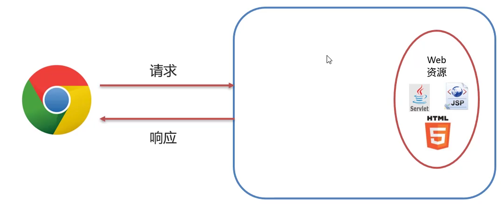

而在访问到这些资源之前可以使过滤器拦截来下，也就是说在访问资源之前会先经过 Filter，如下图

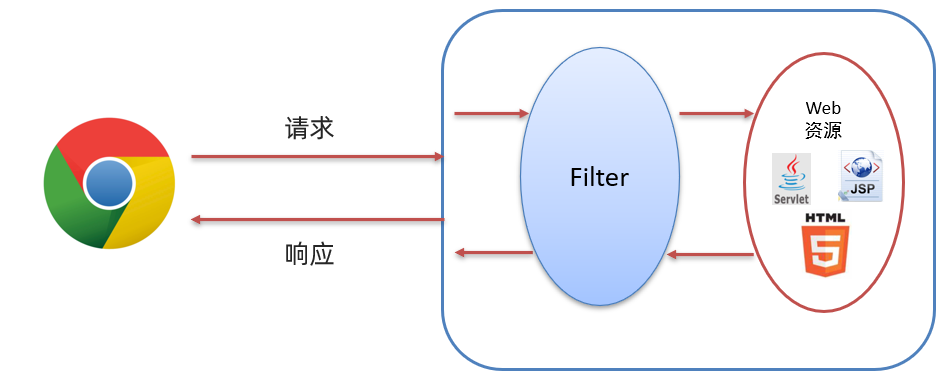

拦截器拦截到后可以做什么功能呢？

==过滤器一般完成一些通用的操作。==比如每个资源都要写一些代码完成某个功能，我们总不能在每个资源中写这样的代码吧，而此时我们可以将这些代码写在过滤器中，因为请求每一个资源都要经过过滤器。

我们之前做的品牌数据管理的案例中就已经做了登陆的功能，而如果我们不登录能不能访问到数据呢？我们可以在浏览器直接访问首页 ，可以看到 `查询所有` 的超链接


当我点击该按钮，居然可以看到品牌的数据


这显然和我们的要求不符。我们希望实现的效果是用户如果登陆过了就跳转到品牌数据展示的页面；如果没有登陆就跳转到登陆页面让用户进行登陆，要实现这个效果需要在每一个资源中都写上这段逻辑，而像这种通用的操作，我们就可以放在过滤器中进行实现。这个就是==权限控制==，以后我们还会进行细粒度权限控制。过滤器还可以做 `统一编码处理`、 `敏感字符处理` 等等…

### 1.2  Filter快速入门

#### 1.2.1  开发步骤

进行 `Filter` 开发分成以下三步实现

* 定义类，实现 Filter接口，并重写其所有方法

  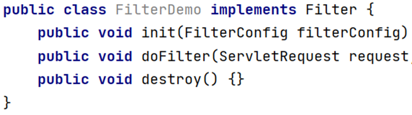

* 配置Filter拦截资源的路径：在类上定义 `@WebFilter` 注解。而注解的 `value` 属性值 `/*` 表示拦截所有的资源

  

* 在doFilter方法中输出一句话，并放行

  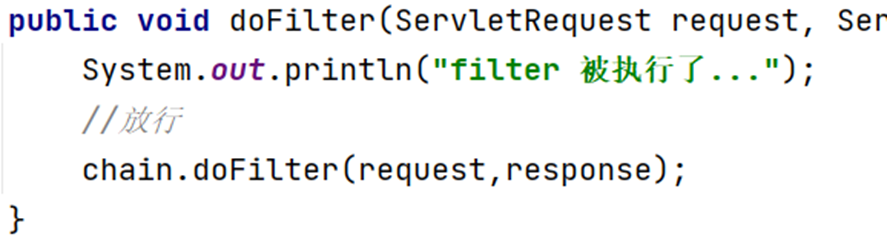

  > 上述代码中的 `chain.doFilter(request,response);` 就是放行，也就是让其访问本该访问的资源。

#### 1.2.2  代码演示

创建一个项目，项目下有一个 `hello.jsp` 页面，项目结构如下：


`pom.xml` 配置文件内容如下：

```xml
<?xml version="1.0" encoding="UTF-8"?>
<project xmlns="http://maven.apache.org/POM/4.0.0"
         xmlns:xsi="http://www.w3.org/2001/XMLSchema-instance"
         xsi:schemaLocation="http://maven.apache.org/POM/4.0.0 http://maven.apache.org/xsd/maven-4.0.0.xsd">
    <modelVersion>4.0.0</modelVersion>

    <groupId>org.example</groupId>
    <artifactId>filter-demo</artifactId>
    <version>1.0-SNAPSHOT</version>
    <packaging>war</packaging>

    <properties>
        <maven.compiler.source>8</maven.compiler.source>
        <maven.compiler.target>8</maven.compiler.target>
    </properties>

    <dependencies>
        <dependency>
            <groupId>javax.servlet</groupId>
            <artifactId>javax.servlet-api</artifactId>
            <version>3.1.0</version>
            <scope>provided</scope>
        </dependency>
    </dependencies>

    <build>
        <plugins>
            <plugin>
                <groupId>org.apache.tomcat.maven</groupId>
                <artifactId>tomcat7-maven-plugin</artifactId>
                <version>2.2</version>
                <configuration>
                    <port>80</port>
                </configuration>
            </plugin>
        </plugins>
    </build>
</project>
```

`hello.jsp` 页面内容如下：

```jsp
<%@ page contentType="text/html;charset=UTF-8" language="java" %>
<html>
<head>
    <title>Title</title>
</head>
<body>
    <h1>hello JSP~</h1>
</body>
</html>
```

我们现在在浏览器输入 `http://localhost/filter-demo/hello.jsp` 访问 `hello.jsp` 页面，这里是可以访问到 `hello.jsp` 页面内容的。


接下来编写过滤器。过滤器是 Web 三大组件之一，所以我们将 `filter` 创建在 `com.itheima.web.filter` 包下，起名为 `FilterDemo`

```java
@WebFilter("/*")
public class FilterDemo implements Filter {

    @Override
    public void doFilter(ServletRequest request, ServletResponse response, FilterChain chain) throws IOException, ServletException {
        System.out.println("FilterDemo...");
    }

    @Override
    public void init(FilterConfig filterConfig) throws ServletException {
    }

    @Override
    public void destroy() {
    }
}

```

重启启动服务器，再次重新访问 `hello.jsp` 页面，这次发现页面没有任何效果，但是在 `idea` 的控制台可以看到如下内容

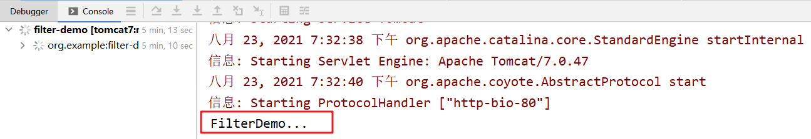

上述效果说明 `FilterDemo` 这个过滤器的 `doFilter()` 方法执行了，但是为什么在浏览器上看不到 `hello.jsp` 页面的内容呢？这是因为在 `doFilter()` 方法中添加放行的方法才能访问到 `hello.jsp` 页面。那就在 `doFilter()` 方法中添加放行的代码

```java
//放行
 chain.doFilter(request,response);
```

再次重启服务器并访问 `hello.jsp` 页面，发现这次就可以在浏览器上看到页面效果。

**`FilterDemo` 过滤器完整代码如下：**

```java
@WebFilter("/*")
public class FilterDemo implements Filter {

    @Override
    public void doFilter(ServletRequest request, ServletResponse response, FilterChain chain) throws IOException, ServletException {
        System.out.println("1.FilterDemo...");
        //放行
        chain.doFilter(request,response);
    }

    @Override
    public void init(FilterConfig filterConfig) throws ServletException {
    }

    @Override
    public void destroy() {
    }
}

```

### 1.3  Filter执行流程

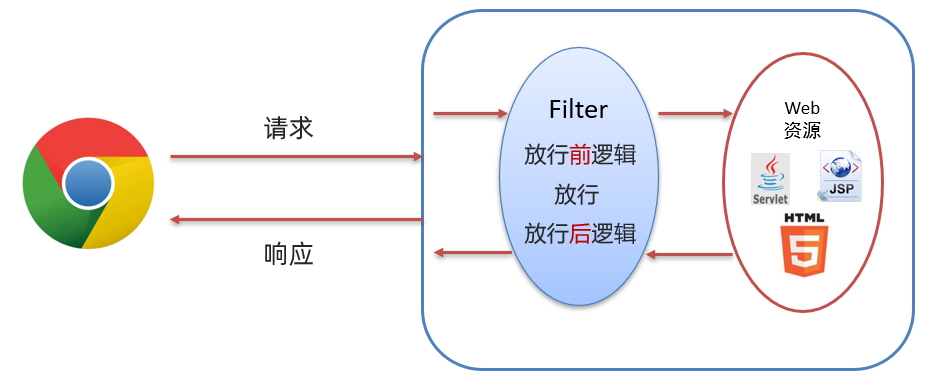

如上图是使用过滤器的流程，我们通过以下问题来研究过滤器的执行流程：

* 放行后访问对应资源，资源访问完成后，还会回到Filter中吗？

  从上图就可以看出肯定 ==会== 回到Filter中

* 如果回到Filter中，是重头执行还是执行放行后的逻辑呢？

  如果是重头执行的话，就意味着 `放行前逻辑` 会被执行两次，肯定不会这样设计了；所以访问完资源后，会回到 `放行后逻辑`，执行该部分代码。

通过上述的说明，我们就可以总结Filter的执行流程如下：


接下来我们通过代码验证一下，在 `doFilter()` 方法前后都加上输出语句，如下


同时在 `hello.jsp` 页面加上输出语句，如下

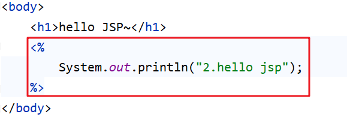

执行访问该资源打印的顺序是按照我们标记的标号进行打印的话，说明我们上边总结出来的流程是没有问题的。启动服务器访问 `hello.jsp` 页面，在控制台打印的内容如下：

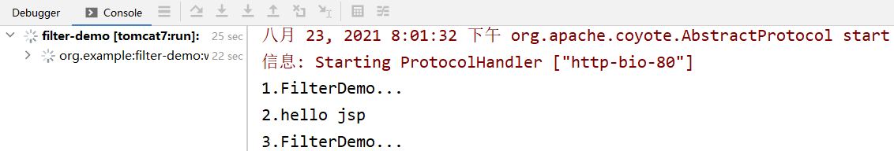

以后我们可以将对请求进行处理的代码放在放行之前进行处理，而如果请求完资源后还要对响应的数据进行处理时可以在放行后进行逻辑处理。

### 1.4  Filter拦截路径配置

拦截路径表示 Filter 会对请求的哪些资源进行拦截，使用 `@WebFilter` 注解进行配置。如：`@WebFilter("拦截路径")` 

拦截路径有如下四种配置方式：

* 拦截具体的资源：/index.jsp：只有访问index.jsp时才会被拦截
* 目录拦截：/user/*：访问/user下的所有资源，都会被拦截
* 后缀名拦截：*.jsp：访问后缀名为jsp的资源，都会被拦截
* 拦截所有：/*：访问所有资源，都会被拦截

通过上面拦截路径的学习，大家会发现拦截路径的配置方式和 `Servlet` 的请求资源路径配置方式一样，但是表示的含义不同。

### 1.5  过滤器链

#### 1.5.1  概述

过滤器链是指在一个Web应用，可以配置多个过滤器，这多个过滤器称为过滤器链。

如下图就是一个过滤器链，我们学习过滤器链主要是学习过滤器链执行的流程


上图中的过滤器链执行是按照以下流程执行：

1. 执行 `Filter1` 的放行前逻辑代码
2. 执行 `Filter1` 的放行代码
3. 执行 `Filter2` 的放行前逻辑代码
4. 执行 `Filter2` 的放行代码
5. 访问到资源
6. 执行 `Filter2` 的放行后逻辑代码
7. 执行 `Filter1` 的放行后逻辑代码

以上流程串起来就像一条链子，故称之为过滤器链。

#### 1.5.2  代码演示

* 编写第一个过滤器 `FilterDemo` ，配置成拦截所有资源

  ```java
  @WebFilter("/*")
  public class FilterDemo implements Filter {
  
      @Override
      public void doFilter(ServletRequest request, ServletResponse response, FilterChain chain) throws IOException, ServletException {
  
          //1. 放行前，对 request数据进行处理
          System.out.println("1.FilterDemo...");
          //放行
          chain.doFilter(request,response);
          //2. 放行后，对Response 数据进行处理
          System.out.println("3.FilterDemo...");
      }
  
      @Override
      public void init(FilterConfig filterConfig) throws ServletException {
      }
  
      @Override
      public void destroy() {
      }
  }
  ```

* 编写第二个过滤器 `FilterDemo2` ，配置炒年糕拦截所有资源

  ```java
  @WebFilter("/*")
  public class FilterDemo2 implements Filter {
  
      @Override
      public void doFilter(ServletRequest request, ServletResponse response, FilterChain chain) throws IOException, ServletException {
  
          //1. 放行前，对 request数据进行处理
          System.out.println("2.FilterDemo...");
          //放行
          chain.doFilter(request,response);
          //2. 放行后，对Response 数据进行处理
          System.out.println("4.FilterDemo...");
      }
  
      @Override
      public void init(FilterConfig filterConfig) throws ServletException {
      }
  
      @Override
      public void destroy() {
      }
  }
  
  ```

* 修改 `hello.jsp` 页面中脚本的输出语句

  ```jsp
  <%@ page contentType="text/html;charset=UTF-8" language="java" %>
  <html>
  <head>
      <title>Title</title>
  </head>
  <body>
      <h1>hello JSP~</h1>
      <%
          System.out.println("3.hello jsp");
      %>
  </body>
  </html>
  ```

* 启动服务器，在浏览器输入 `http://localhost/filter-demo/hello.jsp` 进行测试，在控制台打印内容如下

  

  

  从结果可以看到确实是按照我们之前说的执行流程进行执行的。

#### 1.5.3  问题

上面代码中为什么是先执行 `FilterDemo` ，后执行 `FilterDemo2` 呢？

我们现在使用的是注解配置Filter，而这种配置方式的优先级是按照过滤器类名(字符串)的自然排序。

比如有如下两个名称的过滤器 ： `BFilterDemo` 和 `AFilterDemo` 。那一定是 `AFilterDemo` 过滤器先执行。

### 1.6  案例

#### 1.6.1  需求

访问服务器资源时，需要先进行登录验证，如果没有登录，则自动跳转到登录页面

#### 1.6.2  分析

我们要实现该功能是在每一个资源里加入登陆状态校验的代码吗？显然是不需要的，只需要写一个 `Filter` ，在该过滤器中进行登陆状态校验即可。而在该 `Filter` 中逻辑如下：

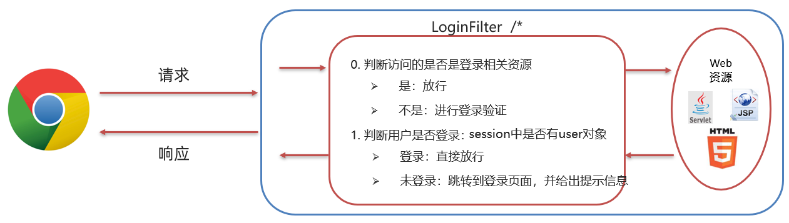

#### 1.6.3  代码实现

##### 1.6.3.1  创建Filter

在 `brand-demo` 工程创建 `com.itheima.web.filter`  包，在该下创建名为 `LoginFilter` 的过滤器

```java
@WebFilter("/*")
public class LoginFilter implements Filter {
    @Override
    public void doFilter(ServletRequest request, ServletResponse response, FilterChain chain) throws ServletException, IOException {
      
    }

    public void init(FilterConfig config) throws ServletException {
    }

    public void destroy() {
    }
}
```

##### 1.6.3.2  编写逻辑代码

在 `doFilter()` 方法中编写登陆状态校验的逻辑代码。

我们首先需要从 `session` 对象中获取用户信息，但是 `ServletRequest` 类型的 requset 对象没有获取 session 对象的方法，所以此时需要将 request对象强转成 `HttpServletRequest` 对象。

```java
HttpServletRequest req = (HttpServletRequest) request;
```

然后完成以下逻辑

* 获取Session对象
* 从Session对象中获取名为 `user` 的数据
* 判断获取到的数据是否是 null
  * 如果不是，说明已经登陆，放行
  * 如果是，说明尚未登陆，将提示信息存储到域对象中并跳转到登陆页面

代码如下：

```java
@WebFilter("/*")
public class LoginFilter implements Filter {
    @Override
    public void doFilter(ServletRequest request, ServletResponse response, FilterChain chain) throws ServletException, IOException {
        HttpServletRequest req = (HttpServletRequest) request;
   
        //1. 判断session中是否有user
        HttpSession session = req.getSession();
        Object user = session.getAttribute("user");

        //2. 判断user是否为null
        if(user != null){
            // 登录过了
            //放行
            chain.doFilter(request, response);
        }else {
            // 没有登陆，存储提示信息，跳转到登录页面

            req.setAttribute("login_msg","您尚未登陆！");
            req.getRequestDispatcher("/login.jsp").forward(req,response);
        }
    }

    public void init(FilterConfig config) throws ServletException {
    }

    public void destroy() {
    }
}
```

##### 1.6.3.3  测试并抛出问题

在浏览器上输入 `http://localhost:8080/brand-demo/` ，可以看到如下页面效果

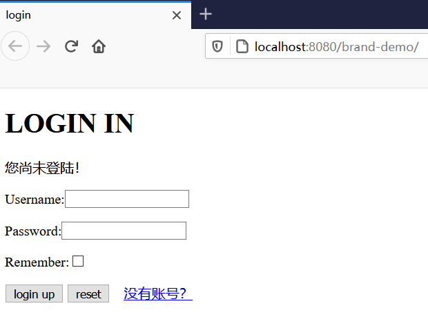

从上面效果可以看出没有登陆确实是跳转到登陆页面了，但是登陆页面为什么展示成这种效果了呢？

##### 1.6.3.4  问题分析及解决

因为登陆页面需要 `css/login.css` 这个文件进行样式的渲染，下图是登陆页面引入的css文件图解

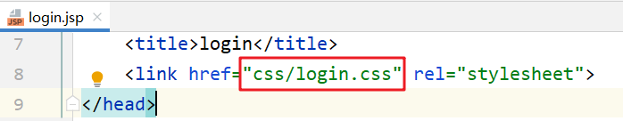

而在请求这个css资源时被过滤器拦截，就相当于没有加载到样式文件导致的。解决这个问题，只需要对所以的登陆相关的资源进行放行即可。还有一种情况就是当我没有用户信息时需要进行注册，而注册时也希望被过滤器放行。

综上，我们需要在判断session中是否包含用户信息之前，应该加上对登陆及注册相关资源放行的逻辑处理

```java
//判断访问资源路径是否和登录注册相关
//1,在数组中存储登陆和注册相关的资源路径
String[] urls = {"/login.jsp","/imgs/","/css/","/loginServlet","/register.jsp","/registerServlet","/checkCodeServlet"};
//2,获取当前访问的资源路径
String url = req.getRequestURL().toString(); 

//3,遍历数组，获取到每一个需要放行的资源路径
for (String u : urls) {
    //4,判断当前访问的资源路径字符串是否包含要放行的的资源路径字符串
    /*
    	比如当前访问的资源路径是  /brand-demo/login.jsp
    	而字符串 /brand-demo/login.jsp 包含了  字符串 /login.jsp ，所以这个字符串就需要放行
    */
    if(url.contains(u)){
        //找到了，放行
        chain.doFilter(request, response);
        //break;
        return;
    }
}
```

##### 1.6.3.5  过滤器完整代码

```java
@WebFilter("/*")
public class LoginFilter implements Filter {
    @Override
    public void doFilter(ServletRequest request, ServletResponse response, FilterChain chain) throws ServletException, IOException {
        HttpServletRequest req = (HttpServletRequest) request;
        
        //判断访问资源路径是否和登录注册相关
        //1,在数组中存储登陆和注册相关的资源路径
        String[] urls = {"/login.jsp","/imgs/","/css/","/loginServlet","/register.jsp","/registerServlet","/checkCodeServlet"};
        //2,获取当前访问的资源路径
        String url = req.getRequestURL().toString(); 

        //3,遍历数组，获取到每一个需要放行的资源路径
        for (String u : urls) {
            //4,判断当前访问的资源路径字符串是否包含要放行的的资源路径字符串
            /*
                比如当前访问的资源路径是  /brand-demo/login.jsp
                而字符串 /brand-demo/login.jsp 包含了  字符串 /login.jsp ，所以这个字符串就需要放行
            */
            if(url.contains(u)){
                //找到了，放行
                chain.doFilter(request, response);
                //break;
                return;
            }
        }
   
        //1. 判断session中是否有user
        HttpSession session = req.getSession();
        Object user = session.getAttribute("user");

        //2. 判断user是否为null
        if(user != null){
            // 登录过了
            //放行
            chain.doFilter(request, response);
        }else {
            // 没有登陆，存储提示信息，跳转到登录页面

            req.setAttribute("login_msg","您尚未登陆！");
            req.getRequestDispatcher("/login.jsp").forward(req,response);
        }
    }

    public void init(FilterConfig config) throws ServletException {
    }

    public void destroy() {
    }
}
```

## 2，Listener

### 2.1  概述

* Listener 表示监听器，是 JavaWeb 三大组件(Servlet、Filter、Listener)之一。

* 监听器可以监听就是在 `application`，`session`，`request` 三个对象创建、销毁或者往其中添加修改删除属性时自动执行代码的功能组件。

  request 和 session 我们学习过。而 `application` 是 `ServletContext` 类型的对象。

  `ServletContext` 代表整个web应用，在服务器启动的时候，tomcat会自动创建该对象。在服务器关闭时会自动销毁该对象。

### 2.2  分类

JavaWeb 提供了8个监听器：


这里面只有 `ServletContextListener` 这个监听器后期我们会接触到，`ServletContextListener` 是用来监听 `ServletContext` 对象的创建和销毁。

`ServletContextListener` 接口中有以下两个方法

* `void contextInitialized(ServletContextEvent sce)`：`ServletContext` 对象被创建了会自动执行的方法
* `void contextDestroyed(ServletContextEvent sce)`：`ServletContext` 对象被销毁时会自动执行的方法

### 2.3  代码演示

我们只演示一下 `ServletContextListener` 监听器

* 定义一个类，实现`ServletContextListener` 接口
* 重写所有的抽象方法
* 使用 `@WebListener` 进行配置

代码如下：

```java
@WebListener
public class ContextLoaderListener implements ServletContextListener {
    @Override
    public void contextInitialized(ServletContextEvent sce) {
        //加载资源
        System.out.println("ContextLoaderListener...");
    }

    @Override
    public void contextDestroyed(ServletContextEvent sce) {
        //释放资源
    }
}
```

启动服务器，就可以在启动的日志信息中看到 `contextInitialized()` 方法输出的内容，同时也说明了 `ServletContext` 对象在服务器启动的时候被创建了。

## 3，Ajax

### 3.1  概述

==`AJAX` (Asynchronous JavaScript And XML)：异步的 JavaScript 和 XML。==

我们先来说概念中的 `JavaScript` 和 `XML`，`JavaScript` 表明该技术和前端相关；`XML` 是指以此进行数据交换。而这两个我们之前都学习过。

#### 3.1.1  作用

AJAX 作用有以下两方面：

1. **与服务器进行数据交换**：通过AJAX可以给服务器发送请求，服务器将数据直接响应回给浏览器。如下图

我们先来看之前做功能的流程，如下图：


如上图，`Servlet` 调用完业务逻辑层后将数据存储到域对象中，然后跳转到指定的 `jsp` 页面，在页面上使用 `EL表达式` 和 `JSTL` 标签库进行数据的展示。

而我们学习了AJAX 后，就可以==使用AJAX和服务器进行通信，以达到使用 HTML+AJAX来替换JSP页面==了。如下图，浏览器发送请求servlet，servlet 调用完业务逻辑层后将数据直接响应回给浏览器页面，页面使用 HTML 来进行数据展示。


2. **异步交互**：可以在==不重新加载整个页面==的情况下，与服务器交换数据并==更新部分网页==的技术，如：搜索联想、用户名是否可用校验，等等…

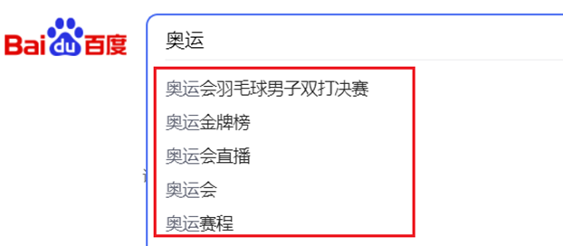

上图所示的效果我们经常见到，在我们输入一些关键字（例如 `奥运`）后就会在下面联想出相关的内容，而联想出来的这部分数据肯定是存储在百度的服务器上，而我们并没有看出页面重新刷新，这就是 ==更新局部页面== 的效果。再如下图：

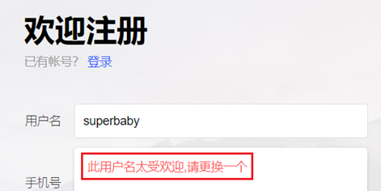

我们在用户名的输入框输入用户名，当输入框一失去焦点，如果用户名已经被占用就会在下方展示提示的信息；在这整个过程中也没有页面的刷新，只是在局部展示出了提示信息，这就是 ==更新局部页面== 的效果。

#### 3.1.2  同步和异步

知道了局部刷新后，接下来我们再聊聊同步和异步:

* 同步发送请求过程如下

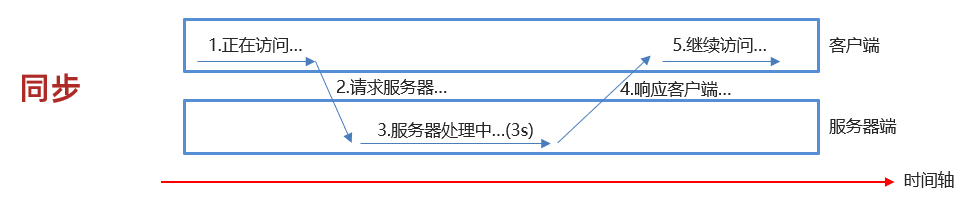

​	浏览器页面在发送请求给服务器，在服务器处理请求的过程中，浏览器页面不能做其他的操作。只能等到服务器响应结束后才能，浏览器页面才能继续做其他的操作。

* 异步发送请求过程如下

  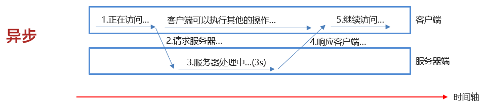

  浏览器页面发送请求给服务器，在服务器处理请求的过程中，浏览器页面还可以做其他的操作。

### 3.2  快速入门

#### 3.2.1 服务端实现

在项目的创建 `com.itheima.web.servlet` ，并在该包下创建名为  `AjaxServlet` 的servlet

```java
@WebServlet("/ajaxServlet")
public class AjaxServlet extends HttpServlet {
    @Override
    protected void doGet(HttpServletRequest request, HttpServletResponse response) throws ServletException, IOException {
        //1. 响应数据
        response.getWriter().write("hello ajax~");
    }

    @Override
    protected void doPost(HttpServletRequest request, HttpServletResponse response) throws ServletException, IOException {
        this.doGet(request, response);
    }
}
```

#### 3.2.2  客户端实现

在 `webapp` 下创建名为 `01-ajax-demo1.html` 的页面，在该页面书写 `ajax` 代码

* 创建核心对象，不同的浏览器创建的对象是不同的

  ```js
   var xhttp;
  if (window.XMLHttpRequest) {
      xhttp = new XMLHttpRequest();
  } else {
      // code for IE6, IE5
      xhttp = new ActiveXObject("Microsoft.XMLHTTP");
  }
  ```

* 发送请求

  ```js
  //建立连接
  xhttp.open("GET", "http://localhost:8080/ajax-demo/ajaxServlet");
  //发送请求
  xhttp.send();
  ```

* 获取响应

  ```js
  xhttp.onreadystatechange = function() {
      if (this.readyState == 4 && this.status == 200) {
          // 通过 this.responseText 可以获取到服务端响应的数据
          alert(this.responseText);
      }
  };
  ```

**完整代码如下：**

```html
<!DOCTYPE html>
<html lang="en">
<head>
    <meta charset="UTF-8">
    <title>Title</title>
</head>
<body>

<script>
    //1. 创建核心对象
    var xhttp;
    if (window.XMLHttpRequest) {
        xhttp = new XMLHttpRequest();
    } else {
        // code for IE6, IE5
        xhttp = new ActiveXObject("Microsoft.XMLHTTP");
    }
    //2. 发送请求
    xhttp.open("GET", "http://localhost:8080/ajax-demo/ajaxServlet");
    xhttp.send();

    //3. 获取响应
    xhttp.onreadystatechange = function() {
        if (this.readyState == 4 && this.status == 200) {
            alert(this.responseText);
        }
    };
</script>
</body>
</html>
```

#### 3.2.3  测试

在浏览器地址栏输入 `http://localhost:8080/ajax-demo/01-ajax-demo1.html` ，在 `01-ajax-demo1.html`加载的时候就会发送 `ajax` 请求，效果如下


我们可以通过 `开发者模式` 查看发送的 AJAX 请求。在浏览器上按 `F12` 快捷键


这个是查看所有的请求，如果我们只是想看 异步请求的话，点击上图中 `All` 旁边的 `XHR`，会发现只展示 Type 是 `xhr` 的请求。如下图：

 

### 3.3 案例

需求：在完成用户注册时，当用户名输入框失去焦点时，校验用户名是否在数据库已存在

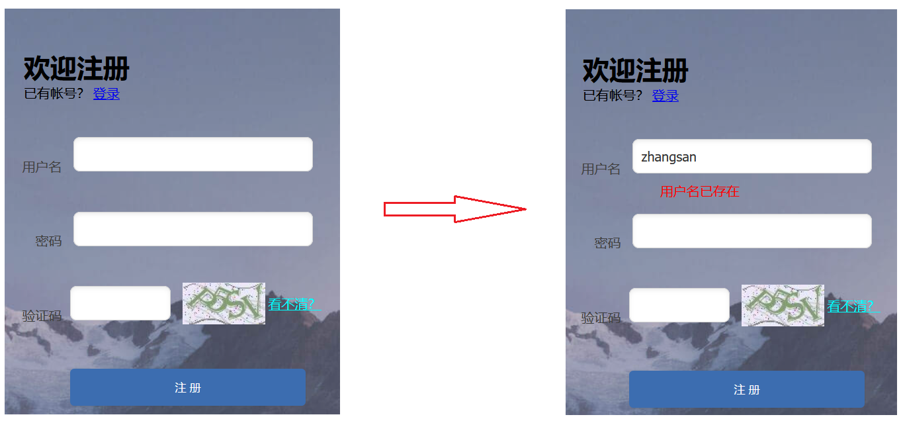

#### 3.3.1  分析

* **前端完成的逻辑**
  1.  给用户名输入框绑定光标失去焦点事件 `onblur`
  2. 发送 ajax请求，携带username参数
  3. 处理响应：是否显示提示信息
* **后端完成的逻辑**
  1. 接收用户名
  2. 调用service查询User。此案例是为了演示前后端异步交互，所以此处我们不做业务逻辑处理
  3. 返回标记

整体流程如下：

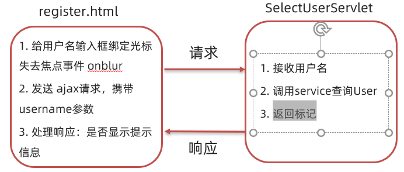

#### 3.3.2  后端实现

在 `com.ithiema.web.servlet` 包中定义名为 `SelectUserServlet`  的servlet。代码如下：

```java
@WebServlet("/selectUserServlet")
public class SelectUserServlet extends HttpServlet {
    @Override
    protected void doGet(HttpServletRequest request, HttpServletResponse response) throws ServletException, IOException {
        //1. 接收用户名
        String username = request.getParameter("username");
        //2. 调用service查询User对象，此处不进行业务逻辑处理，直接给 flag 赋值为 true，表明用户名占用
        boolean flag = true;
        //3. 响应标记
        response.getWriter().write("" + flag);
    }

    @Override
    protected void doPost(HttpServletRequest request, HttpServletResponse response) throws ServletException, IOException {
        this.doGet(request, response);
    }
}
```

#### 3.3.3  前端实现

将 `04-资料\1. 验证用户名案例\1. 静态页面` 下的文件整体拷贝到项目下 `webapp` 下。并在 `register.html` 页面的 `body` 结束标签前编写 `script` 标签，在该标签中实现如下逻辑

**第一步：给用户名输入框绑定光标失去焦点事件 `onblur`**

```js
//1. 给用户名输入框绑定 失去焦点事件
document.getElementById("username").onblur = function () {
    
}
```

**第二步：发送 ajax请求，携带username参数**

在 `第一步` 绑定的匿名函数中书写发送 ajax 请求的代码

```js
//2. 发送ajax请求
//2.1. 创建核心对象
var xhttp;
if (window.XMLHttpRequest) {
    xhttp = new XMLHttpRequest();
} else {
    // code for IE6, IE5
    xhttp = new ActiveXObject("Microsoft.XMLHTTP");
}
//2.2. 发送请求
xhttp.open("GET", "http://localhost:8080/ajax-demo/selectUserServlet);
xhttp.send();

//2.3. 获取响应
xhttp.onreadystatechange = function() {
    if (this.readyState == 4 && this.status == 200) {
        //处理响应的结果
    }
};
```

由于我们发送的是 GET 请求，所以需要在 URL 后拼接从输入框获取的用户名数据。而我们在 `第一步` 绑定的匿名函数中通过以下代码可以获取用户名数据

```js
// 获取用户名的值
var username = this.value;  //this ： 给谁绑定的事件，this就代表谁
```

而携带数据需要将 URL 修改为：

```js
xhttp.open("GET", "http://localhost:8080/ajax-demo/selectUserServlet?username="+username);
```

**第三步：处理响应：是否显示提示信息**

当 `this.readyState == 4 && this.status == 200` 条件满足时，说明已经成功响应数据了。

此时需要判断响应的数据是否是 "true" 字符串，如果是说明用户名已经占用给出错误提示；如果不是说明用户名未被占用清除错误提示。代码如下

```js
//判断
if(this.responseText == "true"){
    //用户名存在，显示提示信息
    document.getElementById("username_err").style.display = '';
}else {
    //用户名不存在 ，清楚提示信息
    document.getElementById("username_err").style.display = 'none';
}
```

**综上所述，前端完成代码如下：**

```js
//1. 给用户名输入框绑定 失去焦点事件
document.getElementById("username").onblur = function () {
    //2. 发送ajax请求
    // 获取用户名的值
    var username = this.value;

    //2.1. 创建核心对象
    var xhttp;
    if (window.XMLHttpRequest) {
        xhttp = new XMLHttpRequest();
    } else {
        // code for IE6, IE5
        xhttp = new ActiveXObject("Microsoft.XMLHTTP");
    }
    //2.2. 发送请求
    xhttp.open("GET", "http://localhost:8080/ajax-demo/selectUserServlet?username="+username);
    xhttp.send();

    //2.3. 获取响应
    xhttp.onreadystatechange = function() {
        if (this.readyState == 4 && this.status == 200) {
            //alert(this.responseText);
            //判断
            if(this.responseText == "true"){
                //用户名存在，显示提示信息
                document.getElementById("username_err").style.display = '';
            }else {
                //用户名不存在 ，清楚提示信息
                document.getElementById("username_err").style.display = 'none';
            }
        }
    };
}
```

## 4，axios

Axios 对原生的AJAX进行封装，简化书写。

Axios官网是：`https://www.axios-http.cn`

### 4.1  基本使用

axios 使用是比较简单的，分为以下两步：

* 引入 axios 的 js 文件

  ```html
  <script src="js/axios-0.18.0.js"></script>
  ```

* 使用axios 发送请求，并获取响应结果

  * 发送 get 请求

    ```js
    axios({
        method:"get",
        url:"http://localhost:8080/ajax-demo1/aJAXDemo1?username=zhangsan"
    }).then(function (resp){
        alert(resp.data);
    })
    ```

  * 发送 post 请求

    ```js
    axios({
        method:"post",
        url:"http://localhost:8080/ajax-demo1/aJAXDemo1",
        data:"username=zhangsan"
    }).then(function (resp){
        alert(resp.data);
    });
    ```

`axios()` 是用来发送异步请求的，小括号中使用 js 对象传递请求相关的参数：

* `method` 属性：用来设置请求方式的。取值为 `get` 或者 `post`。
* `url` 属性：用来书写请求的资源路径。如果是 `get` 请求，需要将请求参数拼接到路径的后面，格式为： `url?参数名=参数值&参数名2=参数值2`。
* `data` 属性：作为请求体被发送的数据。也就是说如果是 `post` 请求的话，数据需要作为 `data` 属性的值。

`then()` 需要传递一个匿名函数。我们将 `then()` 中传递的匿名函数称为 ==回调函数==，意思是该匿名函数在发送请求时不会被调用，而是在成功响应后调用的函数。而该回调函数中的 `resp` 参数是对响应的数据进行封装的对象，通过 `resp.data` 可以获取到响应的数据。

### 4.2  快速入门

#### 4.2.1  后端实现

定义一个用于接收请求的servlet，代码如下：

```java
@WebServlet("/axiosServlet")
public class AxiosServlet extends HttpServlet {
    @Override
    protected void doGet(HttpServletRequest request, HttpServletResponse response) throws ServletException, IOException {
        System.out.println("get...");
        //1. 接收请求参数
        String username = request.getParameter("username");
        System.out.println(username);
        //2. 响应数据
        response.getWriter().write("hello Axios~");
    }

    @Override
    protected void doPost(HttpServletRequest request, HttpServletResponse response) throws ServletException, IOException {
        System.out.println("post...");
        this.doGet(request, response);
    }
}
```

#### 4.2.2  前端实现

* 引入 js 文件

  ```js
  <script src="js/axios-0.18.0.js"></script>
  ```

* 发送 ajax 请求

  * get 请求

    ```js
    axios({
        method:"get",
        url:"http://localhost:8080/ajax-demo/axiosServlet?username=zhangsan"
    }).then(function (resp) {
        alert(resp.data);
    })
    ```

  * post 请求

    ```js
    axios({
        method:"post",
        url:"http://localhost:8080/ajax-demo/axiosServlet",
        data:"username=zhangsan"
    }).then(function (resp) {
        alert(resp.data);
    })
    ```

**整体页面代码如下：**

```html
<!DOCTYPE html>
<html lang="en">
<head>
    <meta charset="UTF-8">
    <title>Title</title>
</head>
<body>

<script src="js/axios-0.18.0.js"></script>
<script>
    //1. get
   /* axios({
        method:"get",
        url:"http://localhost:8080/ajax-demo/axiosServlet?username=zhangsan"
    }).then(function (resp) {
        alert(resp.data);
    })*/

    //2. post  在js中{} 表示一个js对象，而这个js对象中有三个属性
    axios({
        method:"post",
        url:"http://localhost:8080/ajax-demo/axiosServlet",
        data:"username=zhangsan"
    }).then(function (resp) {
        alert(resp.data);
    })
</script>
</body>
</html>
```

### 4.3  请求方法别名

为了方便起见， Axios 已经为所有支持的请求方法提供了别名。如下：

* `get` 请求 ： `axios.get(url[,config])`

* `delete` 请求 ： `axios.delete(url[,config])`

* `head` 请求 ： `axios.head(url[,config])`

* `options` 请求 ： `axios.option(url[,config])`

* `post` 请求：`axios.post(url[,data[,config])`

* `put` 请求：`axios.put(url[,data[,config])`

* `patch` 请求：`axios.patch(url[,data[,config])`

而我们只关注 `get` 请求和 `post` 请求。

入门案例中的 `get` 请求代码可以改为如下：

```js
axios.get("http://localhost:8080/ajax-demo/axiosServlet?username=zhangsan").then(function (resp) {
    alert(resp.data);
});
```

入门案例中的 `post` 请求代码可以改为如下：

```js
axios.post("http://localhost:8080/ajax-demo/axiosServlet","username=zhangsan").then(function (resp) {
    alert(resp.data);
})
```

## 5，JSON

### 5.1  概述

==概念：`JavaScript Object Notation`。JavaScript 对象表示法.==

如下是 `JavaScript` 对象的定义格式：

```js
{
	name:"zhangsan",
	age:23,
	city:"北京"
}
```

接下来我们再看看 `JSON` 的格式：

```json
{
	"name":"zhangsan",
	"age":23,
	"city":"北京"
}
```

通过上面 js 对象格式和 json 格式进行对比，发现两个格式特别像。只不过 js 对象中的属性名可以使用引号（可以是单引号，也可以是双引号）；而 `json` 格式中的键要求必须使用双引号括起来，这是 `json` 格式的规定。`json` 格式的数据有什么作用呢？

作用：由于其语法格式简单，层次结构鲜明，现多用于作为==数据载体==，在网络中进行数据传输。如下图所示就是服务端给浏览器响应的数据，这个数据比较简单，如果现需要将 JAVA 对象中封装的数据响应回给浏览器的话，应该以何种数据传输呢？


大家还记得 `ajax` 的概念吗？ 是 ==异步的 JavaScript 和 xml==。这里的 xml就是以前进行数据传递的方式，如下：

```xml
<student>
    <name>张三</name>
    <age>23</age>
    <city>北京</city>
</student>
```

再看 `json` 描述以上数据的写法：

```json
{	
	"name":"张三",
    "age":23,
    "city":"北京"
}
```

上面两种格式进行对比后就会发现 `json` 格式数据的简单，以及所占的字节数少等优点。

### 5.2  JSON 基础语法

#### 5.2.1  定义格式

`JSON` 本质就是一个字符串，但是该字符串内容是有一定的格式要求的。 定义格式如下：

```js
var 变量名 = '{"key":value,"key":value,...}';
```

`JSON` 串的键要求必须使用双引号括起来，而值根据要表示的类型确定。value 的数据类型分为如下

* 数字（整数或浮点数）
* 字符串（使用双引号括起来）
* 逻辑值（true或者false）
* 数组（在方括号中）
* 对象（在花括号中）
* null

示例：

```js
var jsonStr = '{"name":"zhangsan","age":23,"addr":["北京","上海","西安"]}'
```

#### 5.2.2  代码演示

创建一个页面，在该页面的 `<script>` 标签中定义json字符串

```html
<!DOCTYPE html>
<html lang="en">
<head>
    <meta charset="UTF-8">
    <title>Title</title>
</head>
<body>
<script>
    //1. 定义JSON字符串
    var jsonStr = '{"name":"zhangsan","age":23,"addr":["北京","上海","西安"]}'
    alert(jsonStr);

</script>
</body>
</html>
```

通过浏览器打开，页面效果如下图所示


现在我们需要获取到该 `JSON` 串中的 `name` 属性值，应该怎么处理呢？

如果它是一个 js 对象，我们就可以通过 `js对象.属性名` 的方式来获取数据。JS 提供了一个对象 `JSON` ，该对象有如下两个方法：

* `parse(str)` ：将 JSON串转换为 js 对象。使用方式是： ==`var jsObject = JSON.parse(jsonStr);`==
* `stringify(obj)` ：将 js 对象转换为 JSON 串。使用方式是：==`var jsonStr = JSON.stringify(jsObject)`==

代码演示：

```html
<!DOCTYPE html>
<html lang="en">
<head>
    <meta charset="UTF-8">
    <title>Title</title>
</head>
<body>
<script>
    //1. 定义JSON字符串
    var jsonStr = '{"name":"zhangsan","age":23,"addr":["北京","上海","西安"]}'
    alert(jsonStr);

    //2. 将 JSON 字符串转为 JS 对象
    let jsObject = JSON.parse(jsonStr);
    alert(jsObject)
    alert(jsObject.name)
    //3. 将 JS 对象转换为 JSON 字符串
    let jsonStr2 = JSON.stringify(jsObject);
    alert(jsonStr2)
</script>
</body>
</html>
```

#### 5.2.3  发送异步请求携带参数

后面我们使用 `axios` 发送请求时，如果要携带复杂的数据时都会以 `JSON` 格式进行传递，如下

```js
axios({
    method:"post",
    url:"http://localhost:8080/ajax-demo/axiosServlet",
    data:"username=zhangsan"
}).then(function (resp) {
    alert(resp.data);
})
```

请求参数不可能由我们自己拼接字符串吧？肯定不用，可以提前定义一个 js 对象，用来封装需要提交的参数，然后使用 `JSON.stringify(js对象)` 转换为 `JSON` 串，再将该 `JSON` 串作为 `axios` 的 `data` 属性值进行请求参数的提交。如下：

```js
var jsObject = {name:"张三"};

axios({
    method:"post",
    url:"http://localhost:8080/ajax-demo/axiosServlet",
    data: JSON.stringify(jsObject)
}).then(function (resp) {
    alert(resp.data);
})
```

而 `axios` 是一个很强大的工具。我们只需要将需要提交的参数封装成 js 对象，并将该 js 对象作为 `axios` 的 `data` 属性值进行，它会自动将 js 对象转换为 `JSON` 串进行提交。如下：

```js
var jsObject = {name:"张三"};

axios({
    method:"post",
    url:"http://localhost:8080/ajax-demo/axiosServlet",
    data:jsObject  //这里 axios 会将该js对象转换为 json 串的
}).then(function (resp) {
    alert(resp.data);
})
```

> ==注意：==
>
> * js 提供的 `JSON` 对象我们只需要了解一下即可。因为 `axios` 会自动对 js 对象和 `JSON` 串进行想换转换。
> * 发送异步请求时，如果请求参数是 `JSON` 格式，那请求方式必须是 `POST`。因为 `JSON` 串需要放在请求体中。

### 5.3  JSON串和Java对象的相互转换

学习完 json 后，接下来聊聊 json 的作用。以后我们会以 json 格式的数据进行前后端交互。前端发送请求时，如果是复杂的数据就会以 json 提交给后端；而后端如果需要响应一些复杂的数据时，也需要以 json 格式将数据响应回给浏览器。

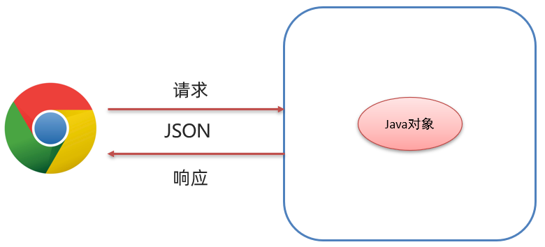

在后端我们就需要重点学习以下两部分操作：

* 请求数据：JSON字符串转为Java对象
* 响应数据：Java对象转为JSON字符串

接下来给大家介绍一套 API，可以实现上面两部分操作。这套 API 就是 `Fastjson`

#### 5.3.1  Fastjson 概述

`Fastjson` 是阿里巴巴提供的一个Java语言编写的高性能功能完善的 `JSON` 库，是目前Java语言中最快的 `JSON` 库，可以实现 `Java` 对象和 `JSON` 字符串的相互转换。

#### 5.3.2  Fastjson 使用

`Fastjson` 使用也是比较简单的，分为以下三步完成

1. **导入坐标**

   ```xml
   <dependency>
       <groupId>com.alibaba</groupId>
       <artifactId>fastjson</artifactId>
       <version>1.2.62</version>
   </dependency>
   ```

2. **Java对象转JSON**

   ```java
   String jsonStr = JSON.toJSONString(obj);
   ```

   将 Java 对象转换为 JSON 串，只需要使用 `Fastjson` 提供的 `JSON` 类中的 `toJSONString()` 静态方法即可。

3. **JSON字符串转Java对象**

   ```java
   User user = JSON.parseObject(jsonStr, User.class);
   ```

   将 json 转换为 Java 对象，只需要使用 `Fastjson` 提供的 `JSON` 类中的 `parseObject()` 静态方法即可。

#### 5.3.3  代码演示

* 引入坐标

* 创建一个类，专门用来测试 Java 对象和 JSON 串的相互转换，代码如下：

  ```java
  public class FastJsonDemo {
  
      public static void main(String[] args) {
          //1. 将Java对象转为JSON字符串
          User user = new User();
          user.setId(1);
          user.setUsername("zhangsan");
          user.setPassword("123");
  
          String jsonString = JSON.toJSONString(user);
          System.out.println(jsonString);//{"id":1,"password":"123","username":"zhangsan"}
  
  
          //2. 将JSON字符串转为Java对象
          User u = JSON.parseObject("{\"id\":1,\"password\":\"123\",\"username\":\"zhangsan\"}", User.class);
          System.out.println(u);
      }
  }
  ```

  

## 6，案例

### 6.1  需求

使用Axios + JSON 完成品牌列表数据查询和添加。页面效果还是下图所示：

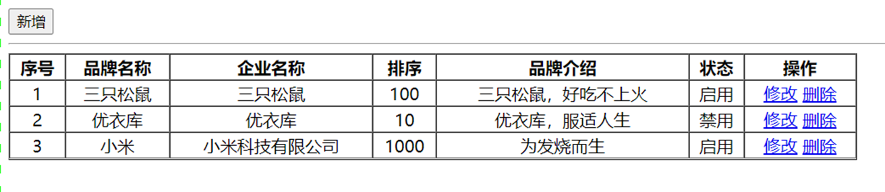

### 6.2  查询所有功能

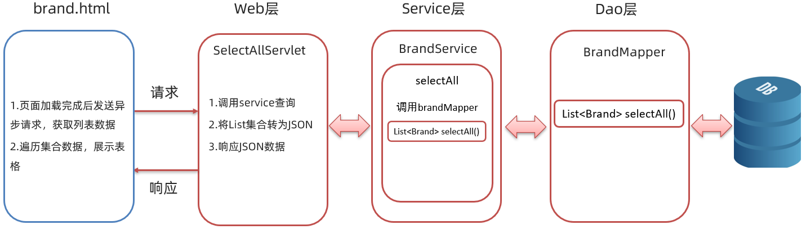

如上图所示就该功能的整体流程。前后端需以 JSON 格式进行数据的传递；由于此功能是查询所有的功能，前端发送 ajax 请求不需要携带参数，而后端响应数据需以如下格式的 json 数据

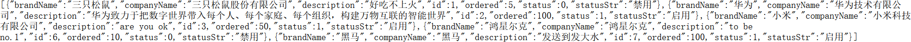

#### 6.2.1  环境准备

将 `02-AJAX\04-资料\3. 品牌列表案例\初始工程` 下的 `brand-demo` 工程拷贝到我们自己 `工作空间` ，然后再将项目导入到我们自己的 Idea 中。工程目录结构如下：

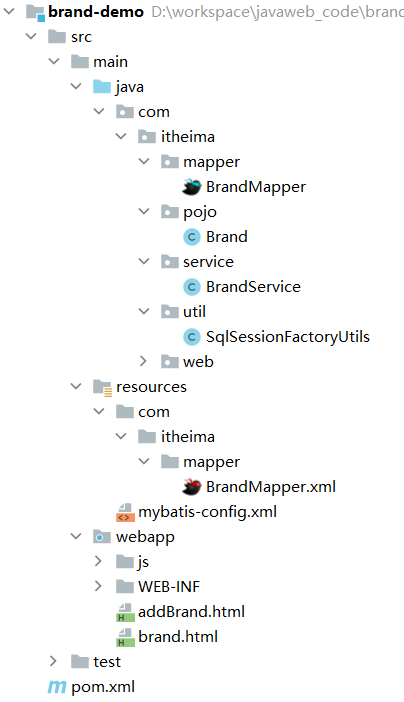

==注意：==

* 在给定的原始工程中已经给定一些代码。而在此案例中我们只关注前后端交互代码实现
* 要根据自己的数据库环境去修改连接数据库的信息，在 `mybatis-config.xml` 核心配置文件中修改

#### 6.2.2  后端实现

在 `com.itheima.web` 包下创建名为 `SelectAllServlet` 的 `servlet`，具体的逻辑如下：

* 调用 service 的 `selectAll()` 方法进行查询所有的逻辑处理
* 将查询到的集合数据转换为 json 数据。我们将此过程称为 ==序列化==；如果是将 json 数据转换为 Java 对象，我们称之为 ==反序列化==
* 将 json 数据响应回给浏览器。这里一定要设置响应数据的类型及字符集 `response.setContentType("text/json;charset=utf-8");`

`SelectAllServlet` 代码如下：

```java
@WebServlet("/selectAllServlet")
public class SelectAllServlet extends HttpServlet {
    private BrandService brandService = new BrandService();

    @Override
    protected void doGet(HttpServletRequest request, HttpServletResponse response) throws ServletException, IOException {
        //1. 调用Service查询
        List<Brand> brands = brandService.selectAll();

        //2. 将集合转换为JSON数据   序列化
        String jsonString = JSON.toJSONString(brands);

        //3. 响应数据  application/json   text/json
        response.setContentType("text/json;charset=utf-8");
        response.getWriter().write(jsonString);
    }

    @Override
    protected void doPost(HttpServletRequest request, HttpServletResponse response) throws ServletException, IOException {
        this.doGet(request, response);
    }
}
```


#### 6.2.3  前端实现

1. **引入 js 文件**

在 `brand.html` 页面引入 `axios` 的 js 文件

```html
<script src="js/axios-0.18.0.js"></script>
```

2. **绑定 `页面加载完毕` 事件**

在 `brand.html` 页面绑定加载完毕事件，该事件是在页面加载完毕后被触发，代码如下

```js
window.onload = function() {
	
}
```

3. **发送异步请求**

在页面加载完毕事件绑定的匿名函数中发送异步请求，代码如下：

```js
 //2. 发送ajax请求
axios({
    method:"get",
    url:"http://localhost:8080/brand-demo/selectAllServlet"
}).then(function (resp) {

});
```

4. **处理响应数据**

在 `then` 中的回调函数中通过 `resp.data` 可以获取响应回来的数据，而数据格式如下

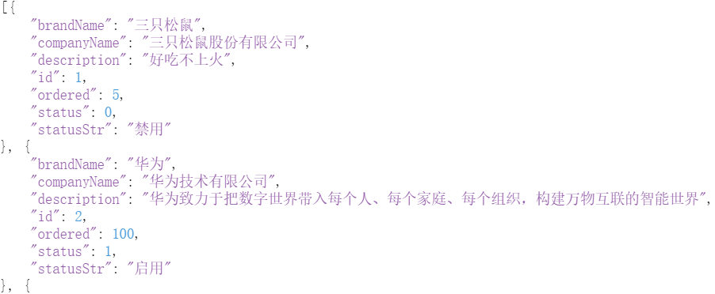

现在我们需要拼接字符串，将下面表格中的所有的 `tr` 拼接到一个字符串中，然后使用 `document.getElementById("brandTable").innerHTML = 拼接好的字符串`  就可以动态的展示出用户想看到的数据

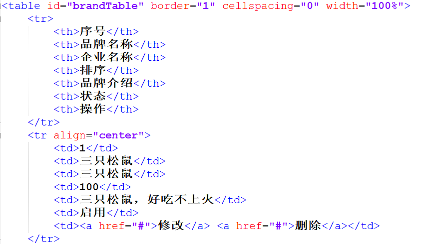

而表头行是固定的，所以先定义初始值是表头行数据的字符串，如下

```js
//获取数据
let brands = resp.data;
let tableData = " <tr>\n" +
    "        <th>序号</th>\n" +
    "        <th>品牌名称</th>\n" +
    "        <th>企业名称</th>\n" +
    "        <th>排序</th>\n" +
    "        <th>品牌介绍</th>\n" +
    "        <th>状态</th>\n" +
    "        <th>操作</th>\n" +
    "    </tr>";
```

接下来遍历响应回来的数据 `brands` ，拿到每一条品牌数据

```js
for (let i = 0; i < brands.length ; i++) {
    let brand = brands[i];
	
}
```

紧接着就是从 `brand` 对象中获取数据并且拼接 `数据行`，累加到 `tableData` 字符串变量中

```js
tableData += "\n" +
    "    <tr align=\"center\">\n" +
    "        <td>"+(i+1)+"</td>\n" +
    "        <td>"+brand.brandName+"</td>\n" +
    "        <td>"+brand.companyName+"</td>\n" +
    "        <td>"+brand.ordered+"</td>\n" +
    "        <td>"+brand.description+"</td>\n" +
    "        <td>"+brand.status+"</td>\n" +
    "\n" +
    "        <td><a href=\"#\">修改</a> <a href=\"#\">删除</a></td>\n" +
    "    </tr>";
```

最后再将拼接好的字符串写到表格中

```js
// 设置表格数据
document.getElementById("brandTable").innerHTML = tableData;
```

**整体页面代码如下：**

```html
<!DOCTYPE html>
<html lang="en">
<head>
    <meta charset="UTF-8">
    <title>Title</title>
</head>
<body>
<a href="addBrand.html"><input type="button" value="新增"></a><br>
<hr>
<table id="brandTable" border="1" cellspacing="0" width="100%">
   
</table>

<script src="js/axios-0.18.0.js"></script>

<script>
    //1. 当页面加载完成后，发送ajax请求
    window.onload = function () {
        //2. 发送ajax请求
        axios({
            method:"get",
            url:"http://localhost:8080/brand-demo/selectAllServlet"
        }).then(function (resp) {
            //获取数据
            let brands = resp.data;
            let tableData = " <tr>\n" +
                "        <th>序号</th>\n" +
                "        <th>品牌名称</th>\n" +
                "        <th>企业名称</th>\n" +
                "        <th>排序</th>\n" +
                "        <th>品牌介绍</th>\n" +
                "        <th>状态</th>\n" +
                "        <th>操作</th>\n" +
                "    </tr>";

            for (let i = 0; i < brands.length ; i++) {
                let brand = brands[i];

                tableData += "\n" +
                    "    <tr align=\"center\">\n" +
                    "        <td>"+(i+1)+"</td>\n" +
                    "        <td>"+brand.brandName+"</td>\n" +
                    "        <td>"+brand.companyName+"</td>\n" +
                    "        <td>"+brand.ordered+"</td>\n" +
                    "        <td>"+brand.description+"</td>\n" +
                    "        <td>"+brand.status+"</td>\n" +
                    "\n" +
                    "        <td><a href=\"#\">修改</a> <a href=\"#\">删除</a></td>\n" +
                    "    </tr>";
            }
            // 设置表格数据
            document.getElementById("brandTable").innerHTML = tableData;
        })
    }
</script>
</body>
</html>
```

### 6.3  添加品牌功能

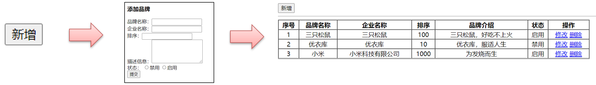

如上所示，当我们点击 `新增` 按钮，会跳转到 `addBrand.html` 页面。在 `addBrand.html` 页面输入数据后点击 `提交` 按钮，就会将数据提交到后端，而后端将数据保存到数据库中。

具体的前后端交互的流程如下：

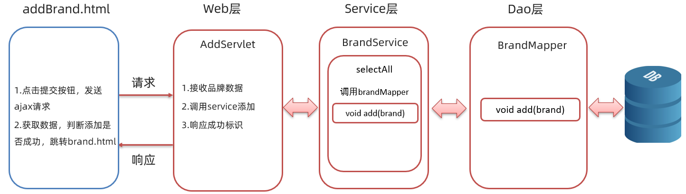

==说明：==

前端需要将用户输入的数据提交到后端，这部分数据需要以 json 格式进行提交，数据格式如下：


#### 6.3.1  后端实现

在 `com.itheima.web` 包下创建名为 `AddServlet` 的 `servlet`，具体的逻辑如下：

* 获取请求参数

  由于前端提交的是 json 格式的数据，所以我们不能使用 `request.getParameter()` 方法获取请求参数

  * 如果提交的数据格式是 `username=zhangsan&age=23` ，后端就可以使用 `request.getParameter()` 方法获取
  * 如果提交的数据格式是 json，后端就需要通过 request 对象获取输入流，再通过输入流读取数据 

* 将获取到的请求参数（json格式的数据）转换为 `Brand` 对象

* 调用 service 的 `add()` 方法进行添加数据的逻辑处理
* 将 json 数据响应回给浏览器。

`AddServlet` 代码如下：

```java
@WebServlet("/addServlet")
public class AddServlet extends HttpServlet {

    private BrandService brandService = new BrandService();

    @Override
    protected void doGet(HttpServletRequest request, HttpServletResponse response) throws ServletException, IOException {

        //1. 接收数据,request.getParameter 不能接收json的数据
       /* String brandName = request.getParameter("brandName");
        System.out.println(brandName);*/

        // 获取请求体数据
        BufferedReader br = request.getReader();
        String params = br.readLine();
        // 将JSON字符串转为Java对象
        Brand brand = JSON.parseObject(params, Brand.class);
        //2. 调用service 添加
        brandService.add(brand);
        //3. 响应成功标识
        response.getWriter().write("success");
    }

    @Override
    protected void doPost(HttpServletRequest request, HttpServletResponse response) throws ServletException, IOException {
        this.doGet(request, response);
    }
}
```

#### 6.3.2  前端实现

在 `addBrand.html` 页面给 `提交` 按钮绑定点击事件，并在绑定的匿名函数中发送异步请求，代码如下：

```js
//1. 给按钮绑定单击事件
document.getElementById("btn").onclick = function () {
    //2. 发送ajax请求
    axios({
        method:"post",
        url:"http://localhost:8080/brand-demo/addServlet",
        data:???
    }).then(function (resp) {
        // 判断响应数据是否为 success
        if(resp.data == "success"){
            location.href = "http://localhost:8080/brand-demo/brand.html";
        }
    })
}
```

现在我们只需要考虑如何获取页面上用户输入的数据即可。

首先我们先定义如下的一个 js 对象，该对象是用来封装页面上输入的数据，并将该对象作为上面发送异步请求时 `data` 属性的值。

```js
// 将表单数据转为json
var formData = {
    brandName:"",
    companyName:"",
    ordered:"",
    description:"",
    status:"",
};
```

接下来获取输入框输入的数据，并将获取到的数据赋值给 `formData` 对象指定的属性。比如获取用户名的输入框数据，并把该数据赋值给 `formData` 对象的 `brandName` 属性

```js
// 获取表单数据
let brandName = document.getElementById("brandName").value;
// 设置数据
formData.brandName = brandName;
```

==说明：其他的输入框都用同样的方式获取并赋值。==但是有一个比较特殊，就是状态数据，如下图是页面内容


我们需要判断哪儿个被选中，再将选中的单选框数据赋值给 `formData` 对象的 `status` 属性，代码实现如下：

```js
let status = document.getElementsByName("status");
for (let i = 0; i < status.length; i++) {
    if(status[i].checked){
        //
        formData.status = status[i].value ;
    }
}
```

**整体页面代码如下：**

```html
<!DOCTYPE html>
<html lang="en">

<head>
    <meta charset="UTF-8">
    <title>添加品牌</title>
</head>
<body>
<h3>添加品牌</h3>
<form action="" method="post">
    品牌名称：<input id="brandName" name="brandName"><br>
    企业名称：<input id="companyName" name="companyName"><br>
    排序：<input id="ordered" name="ordered"><br>
    描述信息：<textarea rows="5" cols="20" id="description" name="description"></textarea><br>
    状态：
    <input type="radio" name="status" value="0">禁用
    <input type="radio" name="status" value="1">启用<br>

    <input type="button" id="btn"  value="提交">
</form>

<script src="js/axios-0.18.0.js"></script>

<script>
    //1. 给按钮绑定单击事件
    document.getElementById("btn").onclick = function () {
        // 将表单数据转为json
        var formData = {
            brandName:"",
            companyName:"",
            ordered:"",
            description:"",
            status:"",
        };
        // 获取表单数据
        let brandName = document.getElementById("brandName").value;
        // 设置数据
        formData.brandName = brandName;

        // 获取表单数据
        let companyName = document.getElementById("companyName").value;
        // 设置数据
        formData.companyName = companyName;

        // 获取表单数据
        let ordered = document.getElementById("ordered").value;
        // 设置数据
        formData.ordered = ordered;

        // 获取表单数据
        let description = document.getElementById("description").value;
        // 设置数据
        formData.description = description;

        let status = document.getElementsByName("status");
        for (let i = 0; i < status.length; i++) {
            if(status[i].checked){
                //
                formData.status = status[i].value ;
            }
        }
        //console.log(formData);
        //2. 发送ajax请求
        axios({
            method:"post",
            url:"http://localhost:8080/brand-demo/addServlet",
            data:formData
        }).then(function (resp) {
            // 判断响应数据是否为 success
            if(resp.data == "success"){
                location.href = "http://localhost:8080/brand-demo/brand.html";
            }
        })
    }
</script>
</body>
</html>
```

==说明：==

`查询所有` 功能和 `添加品牌` 功能就全部实现，大家肯定会感觉前端的代码很复杂；而这只是暂时的，后面学习了 `vue` 前端框架后，这部分前端代码就可以进行很大程度的简化。

# JSP

**今日目标：**

> * 理解 JSP 及 JSP 原理
> * 能在 JSP中使用 `EL表达式` 和 `JSTL标签`
> * 理解 `MVC模式` 和 `三层架构`
> * 能完成品牌数据的增删改查功能

## 1，JSP 概述

==JSP（全称：Java Server Pages）：Java 服务端页面。==是一种动态的网页技术，其中既可以定义 HTML、JS、CSS等静态内容，还可以定义 Java代码的动态内容，也就是 `JSP = HTML + Java`。如下就是jsp代码

```jsp
<html>
    <head>
        <title>Title</title>
    </head>
    <body>
        <h1>JSP,Hello World</h1>
        <%
        	System.out.println("hello,jsp~");
        %>
    </body>
</html>
```

上面代码 `h1` 标签内容是展示在页面上，而 Java 的输出语句是输出在 idea 的控制台。

那么，JSP 能做什么呢？现在我们只用 `servlet` 实现功能，看存在什么问题。如下图所示，当我们登陆成功后，需要在页面上展示用户名

 

上图的用户名是动态展示，也就是谁登陆就展示谁的用户名。只用 `servlet` 如何实现呢？在今天的资料里已经提供好了一个 `LoginServlet` ，该 `servlet` 就是实现这个功能的，现将资料中的 `LoginServlet.java` 拷贝到 `request-demo` 项目中来演示。接下来启动服务器并访问登陆页面


输入了 `zhangsan` 用户的登陆信息后点击 `登陆` 按钮，就能看到如下图效果


当然如果是 `lisi` 登陆的，在该页面展示的就是 `lisi,欢迎您`，动态的展示效果就实现了。那么 `LoginServlet` 到底是如何实现的，我们看看它里面的内容


上面的代码有大量使用到 `writer` 对象向页面写标签内容，这样我们的代码就显得很麻烦；将来如果展示的效果出现了问题，排错也显得有点力不从心。而 JSP 是如何解决这个问题的呢？在资料中也提供了一个 `login.jsp` 页面，该页面也能实现该功能，现将该页面拷贝到项目的 `webapp`下，需要修改 `login.html` 中表单数据提交的路径为下图


重新启动服务器并进行测试，发现也可以实现同样的功能。那么 `login.jsp` 又是如何实现的呢？那我们来看看 `login.jsp` 的代码


上面代码可以看到里面基本都是 `HTML` 标签，而动态数据使用 Java 代码进行展示；这样操作看起来要比用 `servlet` 实现要舒服很多。

JSP 作用：简化开发，避免了在Servlet中直接输出HTML标签。

## 2，JSP 快速入门

接下来我们做一个简单的快速入门代码。

### 2.1  搭建环境

创建一个maven的 web 项目，项目结构如下：


`pom.xml` 文件内容如下：

```xml
<?xml version="1.0" encoding="UTF-8"?>
<project xmlns="http://maven.apache.org/POM/4.0.0"
         xmlns:xsi="http://www.w3.org/2001/XMLSchema-instance"
         xsi:schemaLocation="http://maven.apache.org/POM/4.0.0 http://maven.apache.org/xsd/maven-4.0.0.xsd">
    <modelVersion>4.0.0</modelVersion>

    <groupId>org.example</groupId>
    <artifactId>jsp-demo</artifactId>
    <version>1.0-SNAPSHOT</version>
    <packaging>war</packaging>

    <properties>
        <maven.compiler.source>8</maven.compiler.source>
        <maven.compiler.target>8</maven.compiler.target>
    </properties>

    <dependencies>
      <dependency>
            <groupId>javax.servlet</groupId>
            <artifactId>javax.servlet-api</artifactId>
            <version>3.1.0</version>
            <scope>provided</scope>
        </dependency>
    </dependencies>

    <build>
        <plugins>
            <plugin>
                <groupId>org.apache.tomcat.maven</groupId>
                <artifactId>tomcat7-maven-plugin</artifactId>
                <version>2.2</version>
            </plugin>
        </plugins>
    </build>
</project>
```

### 2.2  导入 JSP 依赖

在 `dependencies` 标签中导入 JSP 的依赖，如下

```xml
<dependency>
    <groupId>javax.servlet.jsp</groupId>
    <artifactId>jsp-api</artifactId>
    <version>2.2</version>
    <scope>provided</scope>
</dependency>
```

该依赖的 `scope` 必须设置为 `provided`，因为 tomcat 中有这个jar包了，所以在打包时我们是不希望将该依赖打进到我们工程的war包中。

### 2.3  创建 jsp 页面

在项目的 `webapp` 下创建jsp页面


通过上面方式创建一个名为 `hello.jsp` 的页面。

### 2.4  编写代码

在 `hello.jsp` 页面中书写 `HTML` 标签和 `Java` 代码，如下

```jsp
<%@ page contentType="text/html;charset=UTF-8" language="java" %>
<html>
<head>
    <title>Title</title>
</head>
<body>
    <h1>hello jsp</h1>

    <%
        System.out.println("hello,jsp~");
    %>
</body>
</html>
```

### 2.5  测试

启动服务器并在浏览器地址栏输入 `http://localhost:8080/jsp-demo/hello.jsp`，我们可以在页面上看到如下内容


同时也可以看到在 `idea` 的控制台看到输出的 `hello,jsp~` 内容。

## 3，JSP 原理

我们之前说 JSP 就是一个页面，那么在 JSP 中写 `html` 标签，我们能理解，但是为什么还可以写 `Java` 代码呢？

因为 ==JSP 本质上就是一个 Servlet。==接下来我们聊聊访问jsp时的流程


1. 浏览器第一次访问 `hello.jsp` 页面
2. `tomcat` 会将 `hello.jsp` 转换为名为 `hello_jsp.java` 的一个 `Servlet`
3. `tomcat` 再将转换的 `servlet` 编译成字节码文件 `hello_jsp.class`
4. `tomcat` 会执行该字节码文件，向外提供服务

我们可以到项目所在磁盘目录下找 `target\tomcat\work\Tomcat\localhost\jsp-demo\org\apache\jsp` 目录，而这个目录下就能看到转换后的 `servlet`


打开 `hello_jsp.java` 文件，来查看里面的代码


由上面的类的继承关系可以看到继承了名为 `HttpJspBase` 这个类，那我们在看该类的继承关系。到资料中的找如下目录： `资料\tomcat源码\apache-tomcat-8.5.68-src\java\org\apache\jasper\runtime` ，该目录下就有 `HttpJspBase` 类，查看该类的继承关系


可以看到该类继承了 `HttpServlet` ；那么 `hello_jsp` 这个类就间接的继承了 `HttpServlet` ，也就说明 `hello_jsp` 是一个 `servlet`。

继续阅读 `hello_jsp` 类的代码，可以看到有一个名为 `_jspService()` 的方法，该方法就是每次访问 `jsp` 时自动执行的方法，和 `servlet` 中的 `service` 方法一样 。

而在 `_jspService()` 方法中可以看到往浏览器写标签的代码：


以前我们自己写 `servlet` 时，这部分代码是由我们自己来写，现在有了 `jsp` 后，由tomcat完成这部分功能。

## 4，JSP 脚本

JSP脚本用于在 JSP页面内定义 Java代码。在之前的入门案例中我们就在 JSP 页面定义的 Java 代码就是 JSP 脚本。

### 4.1  JSP 脚本分类

JSP 脚本有如下三个分类：

* <%...%>：内容会直接放到_jspService()方法之中
* <%=…%>：内容会放到out.print()中，作为out.print()的参数
* <%!…%>：内容会放到_jspService()方法之外，被类直接包含

**代码演示：**

在 `hello.jsp` 中书写

```jsp
<%
    System.out.println("hello,jsp~");
    int i = 3;
%>
```

通过浏览器访问 `hello.jsp` 后，查看转换的 `hello_jsp.java` 文件，i 变量定义在了 `_jspService()` 方法中


在 `hello.jsp` 中书写

```jsp
<%="hello"%>
<%=i%>
```

通过浏览器访问 `hello.jsp` 后，查看转换的 `hello_jsp.java` 文件，该脚本的内容被放在了 `out.print()` 中，作为参数


在 `hello.jsp` 中书写

```jsp
<%!
    void  show(){}
	String name = "zhangsan";
%>
```

通过浏览器访问 `hello.jsp` 后，查看转换的 `hello_jsp.java` 文件，该脚本的内容被放在了成员位置


### 4.2  案例

#### 4.2.1  需求

使用JSP脚本展示品牌数据


说明：

* 在资料 `资料\1. JSP案例素材` 中提供了 `brand.html` 静态页面
* 在该案例中数据不从数据库中查询，而是在 JSP 页面上写死

#### 4.2.2  实现

* 将资料 `资料\1. JSP案例素材` 中的 `Brand.java` 文件放置到项目的 `com.itheima.pojo` 包下

* 在项目的 `webapp` 中创建 `brand.jsp` ，并将 `brand.html`页面中的内容拷贝过来。`brand.jsp` 内容如下

	```jsp
	<%@ page contentType="text/html;charset=UTF-8" language="java" %>
	<!DOCTYPE html>
	<html lang="en">
	<head>
	    <meta charset="UTF-8">
	    <title>Title</title>
	</head>
	<body>
	<input type="button" value="新增"><br>
	<hr>
	    <table border="1" cellspacing="0" width="800">
	        <tr>
	            <th>序号</th>
	            <th>品牌名称</th>
	            <th>企业名称</th>
	            <th>排序</th>
	            <th>品牌介绍</th>
	            <th>状态</th>
	            <th>操作</th>
	
	        </tr>
	        <tr align="center">
	            <td>1</td>
	            <td>三只松鼠</td>
	            <td>三只松鼠</td>
	            <td>100</td>
	            <td>三只松鼠，好吃不上火</td>
	            <td>启用</td>
	            <td><a href="#">修改</a> <a href="#">删除</a></td>
	        </tr>
	
	        <tr align="center">
	            <td>2</td>
	            <td>优衣库</td>
	            <td>优衣库</td>
	            <td>10</td>
	            <td>优衣库，服适人生</td>
	            <td>禁用</td>
	
	            <td><a href="#">修改</a> <a href="#">删除</a></td>
	        </tr>
	
	        <tr align="center">
	            <td>3</td>
	            <td>小米</td>
	            <td>小米科技有限公司</td>
	            <td>1000</td>
	            <td>为发烧而生</td>
	            <td>启用</td>
	
	            <td><a href="#">修改</a> <a href="#">删除</a></td>
	        </tr>
	    </table>
	</body>
	</html>
	```

	现在页面中的数据都是假数据。

* 在 `brand.jsp` 中准备一些数据

	```jsp
	<%
	    // 查询数据库
	    List<Brand> brands = new ArrayList<Brand>();
	    brands.add(new Brand(1,"三只松鼠","三只松鼠",100,"三只松鼠，好吃不上火",1));
	    brands.add(new Brand(2,"优衣库","优衣库",200,"优衣库，服适人生",0));
	    brands.add(new Brand(3,"小米","小米科技有限公司",1000,"为发烧而生",1));
	%>
	```

	> ==注意：==这里的类是需要导包的

* 将 `brand.jsp` 页面中的 `table` 标签中的数据改为动态的

	```jsp
	<table border="1" cellspacing="0" width="800">
	    <tr>
	        <th>序号</th>
	        <th>品牌名称</th>
	        <th>企业名称</th>
	        <th>排序</th>
	        <th>品牌介绍</th>
	        <th>状态</th>
	        <th>操作</th>
	
	    </tr>
	    
	    <%
	     for (int i = 0; i < brands.size(); i++) {
	         //获取集合中的 每一个 Brand 对象
	         Brand brand = brands.get(i);
	     }
	    %>
	    <tr align="center">
	        <td>1</td>
	        <td>三只松鼠</td>
	        <td>三只松鼠</td>
	        <td>100</td>
	        <td>三只松鼠，好吃不上火</td>
	        <td>启用</td>
	        <td><a href="#">修改</a> <a href="#">删除</a></td>
	    </tr>
	</table>
	```

	上面的for循环需要将 `tr` 标签包裹起来，这样才能实现循环的效果，代码改进为

	```jsp
	<table border="1" cellspacing="0" width="800">
	    <tr>
	        <th>序号</th>
	        <th>品牌名称</th>
	        <th>企业名称</th>
	        <th>排序</th>
	        <th>品牌介绍</th>
	        <th>状态</th>
	        <th>操作</th>
	
	    </tr>
	    
	    <%
	     for (int i = 0; i < brands.size(); i++) {
	         //获取集合中的 每一个 Brand 对象
	         Brand brand = brands.get(i);
	    %>
	    	 <tr align="center">
	            <td>1</td>
	            <td>三只松鼠</td>
	            <td>三只松鼠</td>
	            <td>100</td>
	            <td>三只松鼠，好吃不上火</td>
	            <td>启用</td>
	            <td><a href="#">修改</a> <a href="#">删除</a></td>
	        </tr>
	    <%
	     }
	    %>
	   
	</table>
	```

	> 注意：<%%> 里面写的是 Java 代码，而外边写的是 HTML 标签

	上面代码中的 `td` 标签中的数据都需要是动态的，所以还需要改进

	```jsp
	<table border="1" cellspacing="0" width="800">
	    <tr>
	        <th>序号</th>
	        <th>品牌名称</th>
	        <th>企业名称</th>
	        <th>排序</th>
	        <th>品牌介绍</th>
	        <th>状态</th>
	        <th>操作</th>
	
	    </tr>
	    
	    <%
	     for (int i = 0; i < brands.size(); i++) {
	         //获取集合中的 每一个 Brand 对象
	         Brand brand = brands.get(i);
	    %>
	    	 <tr align="center">
	            <td><%=brand.getId()%></td>
	            <td><%=brand.getBrandName()%></td>
	            <td><%=brand.getCompanyName()%></td>
	            <td><%=brand.getOrdered()%></td>
	            <td><%=brand.getDescription()%></td>
	            <td><%=brand.getStatus() == 1 ? "启用":"禁用"%></td>
	            <td><a href="#">修改</a> <a href="#">删除</a></td>
	        </tr>
	    <%
	     }
	    %>
	   
	</table>
	```

#### 4.2.3  成品代码

```jsp
<%@ page import="com.itheima.pojo.Brand" %>
<%@ page import="java.util.List" %>
<%@ page import="java.util.ArrayList" %>
<%@ page contentType="text/html;charset=UTF-8" language="java" %>

<%
    // 查询数据库
    List<Brand> brands = new ArrayList<Brand>();
    brands.add(new Brand(1,"三只松鼠","三只松鼠",100,"三只松鼠，好吃不上火",1));
    brands.add(new Brand(2,"优衣库","优衣库",200,"优衣库，服适人生",0));
    brands.add(new Brand(3,"小米","小米科技有限公司",1000,"为发烧而生",1));

%>


<!DOCTYPE html>
<html lang="en">
<head>
    <meta charset="UTF-8">
    <title>Title</title>
</head>
<body>
<input type="button" value="新增"><br>
<hr>
<table border="1" cellspacing="0" width="800">
    <tr>
        <th>序号</th>
        <th>品牌名称</th>
        <th>企业名称</th>
        <th>排序</th>
        <th>品牌介绍</th>
        <th>状态</th>
        <th>操作</th>
    </tr>
    <%
        for (int i = 0; i < brands.size(); i++) {
            Brand brand = brands.get(i);
    %>

    <tr align="center">
        <td><%=brand.getId()%></td>
        <td><%=brand.getBrandName()%></td>
        <td><%=brand.getCompanyName()%></td>
        <td><%=brand.getOrdered()%></td>
        <td><%=brand.getDescription()%></td>
		<td><%=brand.getStatus() == 1 ? "启用":"禁用"%></td>
        <td><a href="#">修改</a> <a href="#">删除</a></td>
    </tr>

    <%
        }
    %>
</table>
</body>
</html>
```

#### 4.2.4  测试

在浏览器地址栏输入 `http://localhost:8080/jsp-demo/brand.jsp` ，页面展示效果如下


### 4.3  JSP 缺点

通过上面的案例，我们可以看到 JSP 的很多缺点。

由于 JSP页面内，既可以定义 HTML 标签，又可以定义 Java代码，造成了以下问题：

* 书写麻烦：特别是复杂的页面

	既要写 HTML 标签，还要写 Java 代码

* 阅读麻烦

	上面案例的代码，相信你后期再看这段代码时还需要花费很长的时间去梳理

* 复杂度高：运行需要依赖于各种环境，JRE，JSP容器，JavaEE…

* 占内存和磁盘：JSP会自动生成.java和.class文件占磁盘，运行的是.class文件占内存

* 调试困难：出错后，需要找到自动生成的.java文件进行调试

* 不利于团队协作：前端人员不会 Java，后端人员不精 HTML

	如果页面布局发生变化，前端工程师对静态页面进行修改，然后再交给后端工程师，由后端工程师再将该页面改为 JSP 页面

由于上述的问题， ==JSP 已逐渐退出历史舞台，==以后开发更多的是使用 ==HTML +  Ajax== 来替代。Ajax 是我们后续会重点学习的技术。有个这个技术后，前端工程师负责前端页面开发，而后端工程师只负责前端代码开发。下来对技术的发展进行简单的说明


1. 第一阶段：使用 `servlet` 即实现逻辑代码编写，也对页面进行拼接。这种模式我们之前也接触过

2. 第二阶段：随着技术的发展，出现了 `JSP` ，人们发现 `JSP` 使用起来比 `Servlet` 方便很多，但是还是要在 `JSP` 中嵌套 `Java` 代码，也不利于后期的维护

3. 第三阶段：使用 `Servlet` 进行逻辑代码开发，而使用 `JSP` 进行数据展示

	

4. 第四阶段：使用 `servlet` 进行后端逻辑代码开发，而使用 `HTML` 进行数据展示。而这里面就存在问题，`HTML` 是静态页面，怎么进行动态数据展示呢？这就是 `ajax` 的作用了。

那既然 JSP 已经逐渐的退出历史舞台，那我们为什么还要学习 `JSP` 呢？原因有两点：

* 一些公司可能有些老项目还在用 `JSP` ，所以要求我们必须动 `JSP`
* 我们如果不经历这些复杂的过程，就不能体现后面阶段开发的简单

接下来我们来学习第三阶段，使用 `EL表达式` 和 `JSTL` 标签库替换 `JSP` 中的 `Java` 代码。

## 5，EL 表达式

### 5.1  概述

EL（全称Expression Language ）表达式语言，用于简化 JSP 页面内的 Java 代码。

EL 表达式的主要作用是 ==获取数据==。其实就是从域对象中获取数据，然后将数据展示在页面上。

而 EL 表达式的语法也比较简单，==${expression}== 。例如：${brands} 就是获取域中存储的 key 为 brands 的数据。

### 5.2  代码演示

* 定义servlet，在 servlet 中封装一些数据并存储到 request 域对象中并转发到 `el-demo.jsp` 页面。

	```java
	@WebServlet("/demo1")
	public class ServletDemo1 extends HttpServlet {
	    @Override
	    protected void doGet(HttpServletRequest request, HttpServletResponse response) throws ServletException, IOException {
	        //1. 准备数据
	        List<Brand> brands = new ArrayList<Brand>();
	        brands.add(new Brand(1,"三只松鼠","三只松鼠",100,"三只松鼠，好吃不上火",1));
	        brands.add(new Brand(2,"优衣库","优衣库",200,"优衣库，服适人生",0));
	        brands.add(new Brand(3,"小米","小米科技有限公司",1000,"为发烧而生",1));
	
	        //2. 存储到request域中
	        request.setAttribute("brands",brands);
	
	        //3. 转发到 el-demo.jsp
	        request.getRequestDispatcher("/el-demo.jsp").forward(request,response);
	    }
	
	    @Override
	    protected void doPost(HttpServletRequest request, HttpServletResponse response) throws ServletException, IOException {
	        this.doGet(request, response);
	    }
	}
	```

	> ==注意：== 此处需要用转发，因为转发才可以使用 request 对象作为域对象进行数据共享

* 在 `el-demo.jsp` 中通过 EL表达式 获取数据

	```jsp
	<%@ page contentType="text/html;charset=UTF-8" language="java" %>
	<html>
	<head>
	    <title>Title</title>
	</head>
	<body>
	    ${brands}
	</body>
	</html>
	```

* 在浏览器的地址栏输入 `http://localhost:8080/jsp-demo/demo1` ，页面效果如下：

	

### 5.3  域对象

JavaWeb中有四大域对象，分别是：

* page：当前页面有效
* request：当前请求有效
* session：当前会话有效
* application：当前应用有效

el 表达式获取数据，会依次从这4个域中寻找，直到找到为止。而这四个域对象的作用范围如下图所示


例如： ${brands}，el 表达式获取数据，会先从page域对象中获取数据，如果没有再到 requet 域对象中获取数据，如果再没有再到 session 域对象中获取，如果还没有才会到 application 中获取数据。

## 6，JSTL标签

### 6.1  概述

JSP标准标签库(Jsp Standarded Tag Library) ，使用标签取代JSP页面上的Java代码。如下代码就是JSTL标签

```jsp
<c:if test="${flag == 1}">
    男
</c:if>
<c:if test="${flag == 2}">
    女
</c:if>
```

上面代码看起来是不是比 JSP 中嵌套 Java 代码看起来舒服好了。而且前端工程师对标签是特别敏感的，他们看到这段代码是能看懂的。

JSTL 提供了很多标签，如下图


我们只对两个最常用的标签进行讲解，`<c:forEach>` 标签和 `<c:if>` 标签。

JSTL 使用也是比较简单的，分为如下步骤：

* 导入坐标

	```xml
	<dependency>
	    <groupId>jstl</groupId>
	    <artifactId>jstl</artifactId>
	    <version>1.2</version>
	</dependency>
	<dependency>
	    <groupId>taglibs</groupId>
	    <artifactId>standard</artifactId>
	    <version>1.1.2</version>
	</dependency>
	```

* 在JSP页面上引入JSTL标签库

	```jsp
	<%@ taglib prefix="c" uri="http://java.sun.com/jsp/jstl/core" %> 
	```

* 使用标签

### 6.2  if 标签

`<c:if>`：相当于 if 判断

* 属性：test，用于定义条件表达式

```jsp
<c:if test="${flag == 1}">
    男
</c:if>
<c:if test="${flag == 2}">
    女
</c:if>
```

**代码演示：**

* 定义一个 `servlet` ，在该 `servlet` 中向 request 域对象中添加 键是 `status` ，值为 `1` 的数据

	```java
	@WebServlet("/demo2")
	public class ServletDemo2 extends HttpServlet {
	    @Override
	    protected void doGet(HttpServletRequest request, HttpServletResponse response) throws ServletException, IOException {
	        //1. 存储数据到request域中
	        request.setAttribute("status",1);
	
	        //2. 转发到 jstl-if.jsp
	        数据request.getRequestDispatcher("/jstl-if.jsp").forward(request,response);
	    }
	
	    @Override
	    protected void doPost(HttpServletRequest request, HttpServletResponse response) throws ServletException, IOException {
	        this.doGet(request, response);
	    }
	}
	```

* 定义 `jstl-if.jsp` 页面，在该页面使用 `<c:if>` 标签

	```jsp
	<%@ page contentType="text/html;charset=UTF-8" language="java" %>
	<%@ taglib prefix="c" uri="http://java.sun.com/jsp/jstl/core" %>
	<html>
	<head>
	    <title>Title</title>
	</head>
	<body>
	    <%--
	        c:if：来完成逻辑判断，替换java  if else
	    --%>
	    <c:if test="${status ==1}">
	        启用
	    </c:if>
	
	    <c:if test="${status ==0}">
	        禁用
	    </c:if>
	</body>
	</html>
	```

	> ==注意：== 在该页面已经要引入 JSTL核心标签库
	>
	> `<%@ taglib prefix="c" uri="http://java.sun.com/jsp/jstl/core" %>`

### 6.3  forEach 标签

`<c:forEach>`：相当于 for 循环。java中有增强for循环和普通for循环，JSTL 中的 `<c:forEach>` 也有两种用法

#### 6.3.1  用法一

类似于 Java 中的增强for循环。涉及到的 `<c:forEach>` 中的属性如下

* items：被遍历的容器

* var：遍历产生的临时变量

* varStatus：遍历状态对象

如下代码，是从域对象中获取名为 brands 数据，该数据是一个集合；遍历遍历，并给该集合中的每一个元素起名为 `brand`，是 Brand对象。在循环里面使用 EL表达式获取每一个Brand对象的属性值

```jsp
<c:forEach items="${brands}" var="brand">
    <tr align="center">
        <td>${brand.id}</td>
        <td>${brand.brandName}</td>
        <td>${brand.companyName}</td>
        <td>${brand.description}</td>
    </tr>
</c:forEach>
```

**代码演示：**

* `servlet` 还是使用之前的名为 `ServletDemo1` 。

* 定义名为 `jstl-foreach.jsp` 页面，内容如下：

	```jsp
	<%@ page contentType="text/html;charset=UTF-8" language="java" %>
	<%@ taglib prefix="c" uri="http://java.sun.com/jsp/jstl/core" %>
	
	<!DOCTYPE html>
	<html lang="en">
	<head>
	    <meta charset="UTF-8">
	    <title>Title</title>
	</head>
	<body>
	<input type="button" value="新增"><br>
	<hr>
	<table border="1" cellspacing="0" width="800">
	    <tr>
	        <th>序号</th>
	        <th>品牌名称</th>
	        <th>企业名称</th>
	        <th>排序</th>
	        <th>品牌介绍</th>
	        <th>状态</th>
	        <th>操作</th>
	    </tr>
	
	    <c:forEach items="${brands}" var="brand" varStatus="status">
	        <tr align="center">
	            <%--<td>${brand.id}</td>--%>
	            <td>${status.count}</td>
	            <td>${brand.brandName}</td>
	            <td>${brand.companyName}</td>
	            <td>${brand.ordered}</td>
	            <td>${brand.description}</td>
	            <c:if test="${brand.status == 1}">
	                <td>启用</td>
	            </c:if>
	            <c:if test="${brand.status != 1}">
	                <td>禁用</td>
	            </c:if>
	            <td><a href="#">修改</a> <a href="#">删除</a></td>
	        </tr>
	    </c:forEach>
	</table>
	</body>
	</html>
	```

#### 6.3.2  用法二

类似于 Java 中的普通for循环。涉及到的 `<c:forEach>` 中的属性如下

* begin：开始数

* end：结束数

* step：步长

实例代码：

从0循环到10，变量名是 `i` ，每次自增1

```jsp
<c:forEach begin="0" end="10" step="1" var="i">
    ${i}
</c:forEach>
```

## 7，MVC模式和三层架构

MVC 模式和三层架构是一些理论的知识，将来我们使用了它们进行代码开发会让我们代码维护性和扩展性更好。

### 7.1  MVC模式

MVC 是一种分层开发的模式，其中：

* M：Model，业务模型，处理业务

* V：View，视图，界面展示

* C：Controller，控制器，处理请求，调用模型和视图


控制器（serlvlet）用来接收浏览器发送过来的请求，控制器调用模型（JavaBean）来获取数据，比如从数据库查询数据；控制器获取到数据后再交由视图（JSP）进行数据展示。

**MVC 好处：**

* 职责单一，互不影响。每个角色做它自己的事，各司其职。

* 有利于分工协作。

* 有利于组件重用

### 7.2  三层架构

三层架构是将我们的项目分成了三个层面，分别是 `表现层`、`业务逻辑层`、`数据访问层`。


* 数据访问层：对数据库的CRUD基本操作
* 业务逻辑层：对业务逻辑进行封装，组合数据访问层层中基本功能，形成复杂的业务逻辑功能。例如 `注册业务功能` ，我们会先调用 `数据访问层` 的 `selectByName()` 方法判断该用户名是否存在，如果不存在再调用 `数据访问层` 的 `insert()` 方法进行数据的添加操作
* 表现层：接收请求，封装数据，调用业务逻辑层，响应数据

而整个流程是，浏览器发送请求，表现层的Servlet接收请求并调用业务逻辑层的方法进行业务逻辑处理，而业务逻辑层方法调用数据访问层方法进行数据的操作，依次返回到serlvet，然后servlet将数据交由 JSP 进行展示。

三层架构的每一层都有特有的包名称：

* 表现层： `com.itheima.controller` 或者 `com.itheima.web`
* 业务逻辑层：`com.itheima.service`
* 数据访问层：`com.itheima.dao` 或者 `com.itheima.mapper`

后期我们还会学习一些框架，不同的框架是对不同层进行封装的


### 7.3  MVC 和 三层架构

通过 MVC 和 三层架构 的学习，有些人肯定混淆了。那他们有什么区别和联系？


如上图上半部分是 MVC 模式，上图下半部分是三层架构。 `MVC 模式` 中的 C（控制器）和 V（视图）就是 `三层架构` 中的表现层，而 `MVC 模式` 中的 M（模型）就是 `三层架构` 中的 业务逻辑层 和 数据访问层。

可以将 `MVC 模式` 理解成是一个大的概念，而 `三层架构` 是对 `MVC 模式` 实现架构的思想。 那么我们以后按照要求将不同层的代码写在不同的包下，每一层里功能职责做到单一，将来如果将表现层的技术换掉，而业务逻辑层和数据访问层的代码不需要发生变化。

## 8，案例

**需求：完成品牌数据的增删改查操作**


这个功能我们之前一直在做，而这个案例是将今天学习的所有的内容（包含 MVC模式 和 三层架构）进行应用，并将整个流程贯穿起来。

### 8.1  环境准备

环境准备工作，我们分以下步骤实现：

* 创建新的模块 brand_demo，引入坐标

* 创建三层架构的包结构

* 数据库表 tb_brand

* 实体类 Brand

* MyBatis 基础环境

	* Mybatis-config.xml

	* BrandMapper.xml

	* BrandMapper接口

#### 8.1.1  创建工程

创建新的模块 brand_demo，引入坐标。我们只要分析出要用到哪儿些技术，那么需要哪儿些坐标也就明确了

* 需要操作数据库。mysql的驱动包
* 要使用mybatis框架。mybaits的依赖包
* web项目需要用到servlet和jsp。servlet和jsp的依赖包
* 需要使用 jstl 进行数据展示。jstl的依赖包

`pom.xml` 内容如下：

```xml
<?xml version="1.0" encoding="UTF-8"?>
<project xmlns="http://maven.apache.org/POM/4.0.0"
         xmlns:xsi="http://www.w3.org/2001/XMLSchema-instance"
         xsi:schemaLocation="http://maven.apache.org/POM/4.0.0 http://maven.apache.org/xsd/maven-4.0.0.xsd">
    <modelVersion>4.0.0</modelVersion>
    <groupId>org.example</groupId>
    <artifactId>brand-demo</artifactId>
    <version>1.0-SNAPSHOT</version>
    <packaging>war</packaging>

    <properties>
        <maven.compiler.source>8</maven.compiler.source>
        <maven.compiler.target>8</maven.compiler.target>
    </properties>

    <dependencies>
        <!-- mybatis -->
        <dependency>
            <groupId>org.mybatis</groupId>
            <artifactId>mybatis</artifactId>
            <version>3.5.5</version>
        </dependency>

        <!--mysql-->
        <dependency>
            <groupId>mysql</groupId>
            <artifactId>mysql-connector-java</artifactId>
            <version>5.1.34</version>
        </dependency>

        <!--servlet-->
        <dependency>
            <groupId>javax.servlet</groupId>
            <artifactId>javax.servlet-api</artifactId>
            <version>3.1.0</version>
            <scope>provided</scope>
        </dependency>

        <!--jsp-->
        <dependency>
            <groupId>javax.servlet.jsp</groupId>
            <artifactId>jsp-api</artifactId>
            <version>2.2</version>
            <scope>provided</scope>
        </dependency>

        <!--jstl-->
        <dependency>
            <groupId>jstl</groupId>
            <artifactId>jstl</artifactId>
            <version>1.2</version>
        </dependency>
        <dependency>
            <groupId>taglibs</groupId>
            <artifactId>standard</artifactId>
            <version>1.1.2</version>
        </dependency>
    </dependencies>

    <build>
        <plugins>
            <plugin>
                <groupId>org.apache.tomcat.maven</groupId>
                <artifactId>tomcat7-maven-plugin</artifactId>
                <version>2.2</version>
            </plugin>
        </plugins>
    </build>
</project>
```

#### 8.1.2  创建包

创建不同的包结构，用来存储不同的类。包结构如下


#### 8.1.3  创建表

```sql
-- 删除tb_brand表
drop table if exists tb_brand;
-- 创建tb_brand表
create table tb_brand
(
    -- id 主键
    id           int primary key auto_increment,
    -- 品牌名称
    brand_name   varchar(20),
    -- 企业名称
    company_name varchar(20),
    -- 排序字段
    ordered      int,
    -- 描述信息
    description  varchar(100),
    -- 状态：0：禁用  1：启用
    status       int
);
-- 添加数据
insert into tb_brand (brand_name, company_name, ordered, description, status)
values ('三只松鼠', '三只松鼠股份有限公司', 5, '好吃不上火', 0),
       ('华为', '华为技术有限公司', 100, '华为致力于把数字世界带入每个人、每个家庭、每个组织，构建万物互联的智能世界', 1),
       ('小米', '小米科技有限公司', 50, 'are you ok', 1);
```

#### 8.1.4  创建实体类

在 `pojo` 包下创建名为 `Brand` 的类。

```java
public class Brand {
    // id 主键
    private Integer id;
    // 品牌名称
    private String brandName;
    // 企业名称
    private String companyName;
    // 排序字段
    private Integer ordered;
    // 描述信息
    private String description;
    // 状态：0：禁用  1：启用
    private Integer status;


    public Brand() {
    }

    public Brand(Integer id, String brandName, String companyName, String description) {
        this.id = id;
        this.brandName = brandName;
        this.companyName = companyName;
        this.description = description;
    }

    public Brand(Integer id, String brandName, String companyName, Integer ordered, String description, Integer status) {
        this.id = id;
        this.brandName = brandName;
        this.companyName = companyName;
        this.ordered = ordered;
        this.description = description;
        this.status = status;
    }

    public Integer getId() {
        return id;
    }

    public void setId(Integer id) {
        this.id = id;
    }

    public String getBrandName() {
        return brandName;
    }

    public void setBrandName(String brandName) {
        this.brandName = brandName;
    }

    public String getCompanyName() {
        return companyName;
    }

    public void setCompanyName(String companyName) {
        this.companyName = companyName;
    }

    public Integer getOrdered() {
        return ordered;
    }

    public void setOrdered(Integer ordered) {
        this.ordered = ordered;
    }

    public String getDescription() {
        return description;
    }

    public void setDescription(String description) {
        this.description = description;
    }

    public Integer getStatus() {
        return status;
    }

    public void setStatus(Integer status) {
        this.status = status;
    }

    @Override
    public String toString() {
        return "Brand{" +
                "id=" + id +
                ", brandName='" + brandName + '\'' +
                ", companyName='" + companyName + '\'' +
                ", ordered=" + ordered +
                ", description='" + description + '\'' +
                ", status=" + status +
                '}';
    }
}

```

#### 8.1.5   准备mybatis环境

定义核心配置文件 `Mybatis-config.xml` ，并将该文件放置在 `resources` 下

```xml
<?xml version="1.0" encoding="UTF-8" ?>
<!DOCTYPE configuration
        PUBLIC "-//mybatis.org//DTD Config 3.0//EN"
        "http://mybatis.org/dtd/mybatis-3-config.dtd">
<configuration>
    <!--起别名-->
    <typeAliases>
        <package name="com.itheima.pojo"/>
    </typeAliases>

    <environments default="development">
        <environment id="development">
            <transactionManager type="JDBC"/>
            <dataSource type="POOLED">
                <property name="driver" value="com.mysql.jdbc.Driver"/>
                <property name="url" value="jdbc:mysql:///db1?useSSL=false&amp;useServerPrepStmts=true"/>
                <property name="username" value="root"/>
                <property name="password" value="1234"/>
            </dataSource>
        </environment>
    </environments>
    <mappers>
        <!--扫描mapper-->
        <package name="com.itheima.mapper"/>
    </mappers>
</configuration>
```

在 `resources` 下创建放置映射配置文件的目录结构 `com/itheima/mapper`，并在该目录下创建映射配置文件 `BrandMapper.xml`

```xml
<?xml version="1.0" encoding="UTF-8" ?>
<!DOCTYPE mapper
        PUBLIC "-//mybatis.org//DTD Mapper 3.0//EN"
        "http://mybatis.org/dtd/mybatis-3-mapper.dtd">
<mapper namespace="com.itheima.mapper.BrandMapper">
    
</mapper>
```

### 8.2  查询所有


当我们点击 `index.html` 页面中的 `查询所有` 这个超链接时，就能查询到上图右半部分的数据。

对于上述的功能，点击 `查询所有` 超链接是需要先请后端的 `servlet` ，由 `servlet` 跳转到对应的页面进行数据的动态展示。而整个流程如下图：


#### 8.2.1  编写BrandMapper

在 `mapper` 包下创建创建 `BrandMapper` 接口，在接口中定义 `selectAll()` 方法

```java
/**
  * 查询所有
  * @return
  */
@Select("select * from tb_brand")
List<Brand> selectAll();
```

#### 8.2.2  编写工具类

在 `com.itheima` 包下创建 `utils` 包，并在该包下创建名为 `SqlSessionFactoryUtils` 工具类

```java
public class SqlSessionFactoryUtils {

    private static SqlSessionFactory sqlSessionFactory;

    static {
        //静态代码块会随着类的加载而自动执行，且只执行一次
        try {
            String resource = "mybatis-config.xml";
            InputStream inputStream = Resources.getResourceAsStream(resource);
            sqlSessionFactory = new SqlSessionFactoryBuilder().build(inputStream);
        } catch (IOException e) {
            e.printStackTrace();
        }
    }

    public static SqlSessionFactory getSqlSessionFactory(){
        return sqlSessionFactory;
    }
}
```

#### 8.2.3  编写BrandService

在 `service` 包下创建 `BrandService` 类

```java
public class BrandService {
    SqlSessionFactory factory = SqlSessionFactoryUtils.getSqlSessionFactory();

    /**
     * 查询所有
     * @return
     */
    public List<Brand> selectAll(){
        //调用BrandMapper.selectAll()

        //2. 获取SqlSession
        SqlSession sqlSession = factory.openSession();
        //3. 获取BrandMapper
        BrandMapper mapper = sqlSession.getMapper(BrandMapper.class);

        //4. 调用方法
        List<Brand> brands = mapper.selectAll();

        sqlSession.close();

        return brands;
    }
}
```

#### 8.2.4  编写Servlet

在 `web` 包下创建名为 `SelectAllServlet` 的 `servlet`，该 `servlet` 的逻辑如下：

* 调用 `BrandService` 的 `selectAll()` 方法进行业务逻辑处理，并接收返回的结果
* 将上一步返回的结果存储到 `request` 域对象中
* 跳转到 `brand.jsp` 页面进行数据的展示

具体的代码如下：

```java
@WebServlet("/selectAllServlet")
public class SelectAllServlet extends HttpServlet {
    private  BrandService service = new BrandService();

    @Override
    protected void doGet(HttpServletRequest request, HttpServletResponse response) throws ServletException, IOException {

        //1. 调用BrandService完成查询
        List<Brand> brands = service.selectAll();
        //2. 存入request域中
        request.setAttribute("brands",brands);
        //3. 转发到brand.jsp
        request.getRequestDispatcher("/brand.jsp").forward(request,response);
    }

    @Override
    protected void doPost(HttpServletRequest request, HttpServletResponse response) throws ServletException, IOException {
        this.doGet(request, response);
    }
}
```

#### 8.2.5  编写brand.jsp页面

将资料 `资料\2. 品牌增删改查案例\静态页面` 下的 `brand.html` 页面拷贝到项目的 `webapp` 目录下，并将该页面改成 `brand.jsp` 页面，而 `brand.jsp` 页面在表格中使用 `JSTL` 和 `EL表达式` 从request域对象中获取名为 `brands` 的集合数据并展示出来。页面内容如下：

```jsp
<%@ page contentType="text/html;charset=UTF-8" language="java" %>
<%@ taglib prefix="c" uri="http://java.sun.com/jsp/jstl/core" %>

<!DOCTYPE html>
<html lang="en">
<head>
    <meta charset="UTF-8">
    <title>Title</title>
</head>
<body>
<hr>
<table border="1" cellspacing="0" width="80%">
    <tr>
        <th>序号</th>
        <th>品牌名称</th>
        <th>企业名称</th>
        <th>排序</th>
        <th>品牌介绍</th>
        <th>状态</th>
        <th>操作</th>
    </tr>

    <c:forEach items="${brands}" var="brand" varStatus="status">
        <tr align="center">
            <%--<td>${brand.id}</td>--%>
            <td>${status.count}</td>
            <td>${brand.brandName}</td>
            <td>${brand.companyName}</td>
            <td>${brand.ordered}</td>
            <td>${brand.description}</td>
            <c:if test="${brand.status == 1}">
                <td>启用</td>
            </c:if>
            <c:if test="${brand.status != 1}">
                <td>禁用</td>
            </c:if>
            <td><a href="/brand-demo/selectByIdServlet?id=${brand.id}">修改</a> <a href="#">删除</a></td>
        </tr>
    </c:forEach>
</table>
</body>
</html>
```

#### 8.2.6  测试

启动服务器，并在浏览器输入 `http://localhost:8080/brand-demo/index.html`，看到如下 `查询所有` 的超链接，点击该链接就可以查询出所有的品牌数据


为什么出现这个问题呢？是因为查询到的字段名和实体类对象的属性名没有一一对应。相比看到这大家一定会解决了，就是在映射配置文件中使用 `resultMap` 标签定义映射关系。映射配置文件内容如下：

```xml
<?xml version="1.0" encoding="UTF-8" ?>
<!DOCTYPE mapper
        PUBLIC "-//mybatis.org//DTD Mapper 3.0//EN"
        "http://mybatis.org/dtd/mybatis-3-mapper.dtd">
<mapper namespace="com.itheima.mapper.BrandMapper">

    <resultMap id="brandResultMap" type="brand">
        <result column="brand_name" property="brandName"></result>
        <result column="company_name" property="companyName"></result>
    </resultMap>
</mapper>
```

并且在 `BrandMapper` 接口中的 `selectAll()` 上使用 `@ResuleMap` 注解指定使用该映射

```java
/**
  * 查询所有
  * @return
  */
@Select("select * from tb_brand")
@ResultMap("brandResultMap")
List<Brand> selectAll();
```

重启服务器，再次访问就能看到我们想要的数据了


### 8.3  添加


上图是做 添加 功能流程。点击 `新增` 按钮后，会先跳转到 `addBrand.jsp` 新增页面，在该页面输入要添加的数据，输入完毕后点击 `提交` 按钮，需要将数据提交到后端，而后端进行数据添加操作，并重新将所有的数据查询出来。整个流程如下：


接下来我们根据流程来实现功能：

#### 8.3.1  编写BrandMapper方法

在 `BrandMapper` 接口，在接口中定义 `add(Brand brand)` 方法

```java
@Insert("insert into tb_brand values(null,#{brandName},#{companyName},#{ordered},#{description},#{status})")
void add(Brand brand);
```

#### 8.3.2  编写BrandService方法

在 `BrandService` 类中定义添加品牌数据方法 `add(Brand brand)`

```java
 	/**
     * 添加
     * @param brand
     */
    public void add(Brand brand){

        //2. 获取SqlSession
        SqlSession sqlSession = factory.openSession();
        //3. 获取BrandMapper
        BrandMapper mapper = sqlSession.getMapper(BrandMapper.class);

        //4. 调用方法
        mapper.add(brand);

        //提交事务
        sqlSession.commit();
        //释放资源
        sqlSession.close();
    }
```

#### 8.3.3  改进brand.jsp页面

我们需要在该页面表格的上面添加 `新增` 按钮

```html
<input type="button" value="新增" id="add"><br>
```

并给该按钮绑定单击事件，当点击了该按钮需要跳转到 `brand.jsp` 添加品牌数据的页面

```html
<script>
    document.getElementById("add").onclick = function (){
        location.href = "/brand-demo/addBrand.jsp";
    }
</script>
```

> ==注意：==该 `script` 标签建议放在 `body` 结束标签前面。

#### 8.3.4  编写addBrand.jsp页面

从资料 `资料\2. 品牌增删改查案例\静态页面` 中将 `addBrand.html` 页面拷贝到项目的 `webapp` 下，并改成 `addBrand.jsp` 动态页面

```jsp
<%@ page contentType="text/html;charset=UTF-8" language="java" %>
<!DOCTYPE html>
<html lang="en">

<head>
    <meta charset="UTF-8">
    <title>添加品牌</title>
</head>
<body>
<h3>添加品牌</h3>
<form action="/brand-demo/addServlet" method="post">
    品牌名称：<input name="brandName"><br>
    企业名称：<input name="companyName"><br>
    排序：<input name="ordered"><br>
    描述信息：<textarea rows="5" cols="20" name="description"></textarea><br>
    状态：
    <input type="radio" name="status" value="0">禁用
    <input type="radio" name="status" value="1">启用<br>

    <input type="submit" value="提交">
</form>
</body>
</html>
```

#### 8.3.5  编写servlet

在 `web` 包下创建 `AddServlet` 的 `servlet`，该 `servlet` 的逻辑如下:

* 设置处理post请求乱码的字符集
* 接收客户端提交的数据
* 将接收到的数据封装到 `Brand` 对象中
* 调用 `BrandService` 的`add()` 方法进行添加的业务逻辑处理
* 跳转到 `selectAllServlet` 资源重新查询数据

具体的代码如下：

```java
@WebServlet("/addServlet")
public class AddServlet extends HttpServlet {
    private BrandService service = new BrandService();


    @Override
    protected void doGet(HttpServletRequest request, HttpServletResponse response) throws ServletException, IOException {

        //处理POST请求的乱码问题
        request.setCharacterEncoding("utf-8");

        //1. 接收表单提交的数据，封装为一个Brand对象
        String brandName = request.getParameter("brandName");
        String companyName = request.getParameter("companyName");
        String ordered = request.getParameter("ordered");
        String description = request.getParameter("description");
        String status = request.getParameter("status");

        //封装为一个Brand对象
        Brand brand = new Brand();
        brand.setBrandName(brandName);
        brand.setCompanyName(companyName);
        brand.setOrdered(Integer.parseInt(ordered));
        brand.setDescription(description);
        brand.setStatus(Integer.parseInt(status));

        //2. 调用service 完成添加
        service.add(brand);

        //3. 转发到查询所有Servlet
        request.getRequestDispatcher("/selectAllServlet").forward(request,response);
    }

    @Override
    protected void doPost(HttpServletRequest request, HttpServletResponse response) throws ServletException, IOException {
        this.doGet(request, response);
    }
}
```

#### 8.3.6  测试

 点击 `brand.jsp` 页面的 `新增` 按钮，会跳转到 `addBrand.jsp`页面


点击 `提交` 按钮，就能看到如下页面，里面就包含我们刚添加的数据


### 8.4  修改 


点击每条数据后面的 `编辑` 按钮会跳转到修改页面，如下图：


在该修改页面我们可以看到将 `编辑` 按钮所在行的数据 ==回显== 到表单，然后需要修改那个数据在表单中进行修改，然后点击 `提交` 的按钮将数据提交到后端，后端再将数据存储到数据库中。

从上面的例子我们知道 `修改` 功能需要从两方面进行实现，数据回显和修改操作。

#### 8.4.1  回显数据


上图就是回显数据的效果。要实现这个效果，那当点击 `修改` 按钮时不能直接跳转到 `update.jsp` 页面，而是需要先带着当前行数据的 `id` 请求后端程序，后端程序根据 `id` 查询数据，将数据存储到域对象中跳转到 `update.jsp` 页面进行数据展示。整体流程如下


##### 8.4.1.1  编写BrandMapper方法

在 `BrandMapper` 接口，在接口中定义 `selectById(int id)` 方法

```java
	/**
     * 根据id查询
     * @param id
     * @return
     */
    @Select("select * from tb_brand where id = #{id}")
    @ResultMap("brandResultMap")
    Brand selectById(int id);
```

##### 8.4.1.2  编写BrandService方法

在 `BrandService` 类中定义根据id查询数据方法 `selectById(int id)` 

```java
    /**
     * 根据id查询
     * @return
     */
    public Brand selectById(int id){
        //调用BrandMapper.selectAll()
        //2. 获取SqlSession
        SqlSession sqlSession = factory.openSession();
        //3. 获取BrandMapper
        BrandMapper mapper = sqlSession.getMapper(BrandMapper.class);
        //4. 调用方法
        Brand brand = mapper.selectById(id);
        sqlSession.close();
        return brand;
    }
```

##### 8.4.1.3  编写servlet

在 `web` 包下创建 `SelectByIdServlet` 的 `servlet`，该 `servlet` 的逻辑如下:

* 获取请求数据 `id`
* 调用 `BrandService` 的 `selectById()` 方法进行数据查询的业务逻辑
* 将查询到的数据存储到 request 域对象中
* 跳转到 `update.jsp` 页面进行数据真实

具体代码如下：

```java
@WebServlet("/selectByIdServlet")
public class SelectByIdServlet extends HttpServlet {
    private  BrandService service = new BrandService();

    @Override
    protected void doGet(HttpServletRequest request, HttpServletResponse response) throws ServletException, IOException {
        //1. 接收id
        String id = request.getParameter("id");
        //2. 调用service查询
        Brand brand = service.selectById(Integer.parseInt(id));
        //3. 存储到request中
        request.setAttribute("brand",brand);
        //4. 转发到update.jsp
        request.getRequestDispatcher("/update.jsp").forward(request,response);
    }

    @Override
    protected void doPost(HttpServletRequest request, HttpServletResponse response) throws ServletException, IOException {
        this.doGet(request, response);
    }
}
```

##### 8.4.1.4  编写update.jsp页面

拷贝 `addBrand.jsp` 页面，改名为 `update.jsp` 并做出以下修改：

* `title` 标签内容改为 `修改品牌`

* `form` 标签的 `action` 属性值改为 `/brand-demo/updateServlet`

* `input` 标签要进行数据回显，需要设置 `value` 属性

	```jsp
	品牌名称：<input name="brandName" value="${brand.brandName}"><br>
	企业名称：<input name="companyName" value="${brand.companyName}"><br>
	排序：<input name="ordered" value="${brand.ordered}"><br>
	```

* `textarea` 标签要进行数据回显，需要在标签体中使用 `EL表达式`

	```jsp
	描述信息：<textarea rows="5" cols="20" name="description">${brand.description} </textarea><br>
	```

* 单选框使用 `if` 标签需要判断 `brand.status` 的值是 1 还是 0 在指定的单选框上使用 `checked` 属性，表示被选中状态

	```jsp
	状态：
	<c:if test="${brand.status == 0}">
	    <input type="radio" name="status" value="0" checked>禁用
	    <input type="radio" name="status" value="1">启用<br>
	</c:if>
	
	<c:if test="${brand.status == 1}">
	    <input type="radio" name="status" value="0" >禁用
	    <input type="radio" name="status" value="1" checked>启用<br>
	</c:if>
	```

综上，`update.jsp` 代码如下：

```jsp
<%@ page contentType="text/html;charset=UTF-8" language="java" %>
<%@ taglib prefix="c" uri="http://java.sun.com/jsp/jstl/core" %>
<!DOCTYPE html>
<html lang="en">
<head>
    <meta charset="UTF-8">
    <title>修改品牌</title>
</head>
<body>
<h3>修改品牌</h3>
<form action="/brand-demo/updateServlet" method="post">

    品牌名称：<input name="brandName" value="${brand.brandName}"><br>
    企业名称：<input name="companyName" value="${brand.companyName}"><br>
    排序：<input name="ordered" value="${brand.ordered}"><br>
    描述信息：<textarea rows="5" cols="20" name="description">${brand.description} </textarea><br>
    状态：
    <c:if test="${brand.status == 0}">
        <input type="radio" name="status" value="0" checked>禁用
        <input type="radio" name="status" value="1">启用<br>
    </c:if>

    <c:if test="${brand.status == 1}">
        <input type="radio" name="status" value="0" >禁用
        <input type="radio" name="status" value="1" checked>启用<br>
    </c:if>

    <input type="submit" value="提交">
</form>
</body>
</html>
```

#### 8.4.2  修改数据

做完回显数据后，接下来我们要做修改数据了，而下图是修改数据的效果：


在修改页面进行数据修改，点击 `提交` 按钮，会将数据提交到后端程序，后端程序会对表中的数据进行修改操作，然后重新进行数据的查询操作。整体流程如下：


##### 8.4.2.1  编写BrandMapper方法

在 `BrandMapper` 接口，在接口中定义 `update(Brand brand)` 方法

```java
/**
  * 修改
  * @param brand
  */
@Update("update tb_brand set brand_name = #{brandName},company_name = #{companyName},ordered = #{ordered},description = #{description},status = #{status} where id = #{id}")
void update(Brand brand);
```

##### 8.4.2.2  编写BrandService方法

在 `BrandService` 类中定义根据id查询数据方法 `update(Brand brand)` 

```java
	/**
     * 修改
     * @param brand
     */
    public void update(Brand brand){
        //2. 获取SqlSession
        SqlSession sqlSession = factory.openSession();
        //3. 获取BrandMapper
        BrandMapper mapper = sqlSession.getMapper(BrandMapper.class);
        //4. 调用方法
        mapper.update(brand);
        //提交事务
        sqlSession.commit();
        //释放资源
        sqlSession.close();
    }
```

##### 8.4.2.3  编写servlet

在 `web` 包下创建 `AddServlet` 的 `servlet`，该 `servlet` 的逻辑如下:

* 设置处理post请求乱码的字符集
* 接收客户端提交的数据
* 将接收到的数据封装到 `Brand` 对象中
* 调用 `BrandService` 的`update()` 方法进行添加的业务逻辑处理
* 跳转到 `selectAllServlet` 资源重新查询数据

具体的代码如下：

```java
@WebServlet("/updateServlet")
public class UpdateServlet extends HttpServlet {
    private BrandService service = new BrandService();

    @Override
    protected void doGet(HttpServletRequest request, HttpServletResponse response) throws ServletException, IOException {

        //处理POST请求的乱码问题
        request.setCharacterEncoding("utf-8");
        //1. 接收表单提交的数据，封装为一个Brand对象
        String id = request.getParameter("id");
        String brandName = request.getParameter("brandName");
        String companyName = request.getParameter("companyName");
        String ordered = request.getParameter("ordered");
        String description = request.getParameter("description");
        String status = request.getParameter("status");

        //封装为一个Brand对象
        Brand brand = new Brand();
        brand.setId(Integer.parseInt(id));
        brand.setBrandName(brandName);
        brand.setCompanyName(companyName);
        brand.setOrdered(Integer.parseInt(ordered));
        brand.setDescription(description);
        brand.setStatus(Integer.parseInt(status));

        //2. 调用service 完成修改
        service.update(brand);

        //3. 转发到查询所有Servlet
        request.getRequestDispatcher("/selectAllServlet").forward(request,response);
    }

    @Override
    protected void doPost(HttpServletRequest request, HttpServletResponse response) throws ServletException, IOException {
        this.doGet(request, response);
    }
}
```

==存在问题：update.jsp 页面提交数据时是没有携带主键数据的，而后台修改数据需要根据主键进行修改。==

针对这个问题，我们不希望页面将主键id展示给用户看，但是又希望在提交数据时能将主键id提交到后端。此时我们就想到了在学习 HTML 时学习的隐藏域，在 `update.jsp` 页面的表单中添加如下代码：

```jsp
<%--隐藏域，提交id--%>
<input type="hidden" name="id" value="${brand.id}">
```

`update.jsp` 页面的最终代码如下：

```jsp
<%@ page contentType="text/html;charset=UTF-8" language="java" %>
<%@ taglib prefix="c" uri="http://java.sun.com/jsp/jstl/core" %>
<!DOCTYPE html>
<html lang="en">
<head>
    <meta charset="UTF-8">
    <title>修改品牌</title>
</head>
<body>
<h3>修改品牌</h3>
<form action="/brand-demo/updateServlet" method="post">

    <%--隐藏域，提交id--%>
    <input type="hidden" name="id" value="${brand.id}">

    品牌名称：<input name="brandName" value="${brand.brandName}"><br>
    企业名称：<input name="companyName" value="${brand.companyName}"><br>
    排序：<input name="ordered" value="${brand.ordered}"><br>
    描述信息：<textarea rows="5" cols="20" name="description">${brand.description} </textarea><br>
    状态：
    <c:if test="${brand.status == 0}">
        <input type="radio" name="status" value="0" checked>禁用
        <input type="radio" name="status" value="1">启用<br>
    </c:if>

    <c:if test="${brand.status == 1}">
        <input type="radio" name="status" value="0" >禁用
        <input type="radio" name="status" value="1" checked>启用<br>
    </c:if>
    <input type="submit" value="提交">
</form>
</body>
</html>
```


# 会话技术

**今日目标** 

> * 理解什么是会话跟踪技术
>
> * 掌握Cookie的使用
> * 掌握Session的使用
> * 完善用户登录注册案例的功能

## 1，会话跟踪技术的概述

对于`会话跟踪`这四个词，我们需要拆开来进行解释，首先要理解什么是`会话`，然后再去理解什么是`会话跟踪`:

* 会话:用户打开浏览器，访问web服务器的资源，会话建立，直到有一方断开连接，会话结束。在一次会话中可以包含==多次==请求和响应。

	* 从浏览器发出请求到服务端响应数据给前端之后，一次会话(在浏览器和服务器之间)就被建立了
	* 会话被建立后，如果浏览器或服务端都没有被关闭，则会话就会持续建立着
	* 浏览器和服务器就可以继续使用该会话进行请求发送和响应，上述的整个过程就被称之为==会话==。

	用实际场景来理解下会话，比如在我们访问京东的时候，当打开浏览器进入京东首页后，浏览器和京东的服务器之间就建立了一次会话，后面的搜索商品,查看商品的详情,加入购物车等都是在这一次会话中完成。

	思考:下图中总共建立了几个会话?

	

	每个浏览器都会与服务端建立了一个会话，加起来总共是==3==个会话。

* 会话跟踪:一种维护浏览器状态的方法，服务器需要识别多次请求是否来自于同一浏览器，以便在同一次会话的多次请求间==共享数据==。

	* 服务器会收到多个请求，这多个请求可能来自多个浏览器，如上图中的6个请求来自3个浏览器
	* 服务器需要用来识别请求是否来自同一个浏览器
	* 服务器用来识别浏览器的过程，这个过程就是==会话跟踪==
	* 服务器识别浏览器后就可以在同一个会话中多次请求之间来共享数据

	那么我们又有一个问题需要思考，一个会话中的多次请求为什么要共享数据呢?有了这个数据共享功能后能实现哪些功能呢?

	* 购物车: `加入购物车`和`去购物车结算`是两次请求，但是后面这次请求要想展示前一次请求所添加的商品，就需要用到数据共享。

		

	* 页面展示用户登录信息:很多网站，登录后访问多个功能发送多次请求后，浏览器上都会有当前登录用户的信息[用户名]，比如百度、京东、码云等。

		

	* 网站登录页面的`记住我`功能:当用户登录成功后，勾选`记住我`按钮后下次再登录的时候，网站就会自动填充用户名和密码，简化用户的登录操作，多次登录就会有多次请求，他们之间也涉及到共享数据

		

	* 登录页面的验证码功能:生成验证码和输入验证码点击注册这也是两次请求，这两次请求的数据之间要进行对比，相同则允许注册，不同则拒绝注册，该功能的实现也需要在同一次会话中共享数据。

		

通过这几个例子的讲解，相信大家对`会话追踪`技术已经有了一定的理解，该技术在实际开发中也非常重要。那么接下来我们就需要去学习下`会话跟踪`技术，在学习这些技术之前，我们需要思考:为什么现在浏览器和服务器不支持数据共享呢?

* 浏览器和服务器之间使用的是HTTP请求来进行数据传输
* HTTP协议是==无状态==的，每次浏览器向服务器请求时，服务器都会将该请求视为==新的==请求
* HTTP协议设计成无状态的目的是让每次请求之间相互独立，互不影响
* 请求与请求之间独立后，就无法实现多次请求之间的数据共享

分析完具体的原因后，那么该如何实现会话跟踪技术呢? 具体的实现方式有:

(1)客户端会话跟踪技术：==Cookie==

(2)服务端会话跟踪技术：==Session==

这两个技术都可以实现会话跟踪，它们之间最大的区别:==Cookie是存储在浏览器端而Session是存储在服务器端==

具体的学习思路为:

* CooKie的基本使用、原理、使用细节
* Session的基本使用、原理、使用细节
* Cookie和Session的综合案例

**小结**

在这节中，我们主要介绍了下什么是会话和会话跟踪技术，需要注意的是:

* HTTP协议是无状态的，靠HTTP协议是无法实现会话跟踪
* 想要实现会话跟踪，就需要用到Cookie和Session

这个Cookie和Session具体该如何使用，接下来就先从Cookie来学起。

## 2，Cookie

学习Cookie，我们主要解决下面几个问题:

* 什么是Cookie?
* Cookie如何来使用?
* Cookie是如何实现的?
* Cookie的使用注意事项有哪些?

### 2.1 Cookie的基本使用

**1.概念**

==Cookie==：客户端会话技术，将数据保存到客户端，以后每次请求都携带Cookie数据进行访问。

**2.Cookie的工作流程**

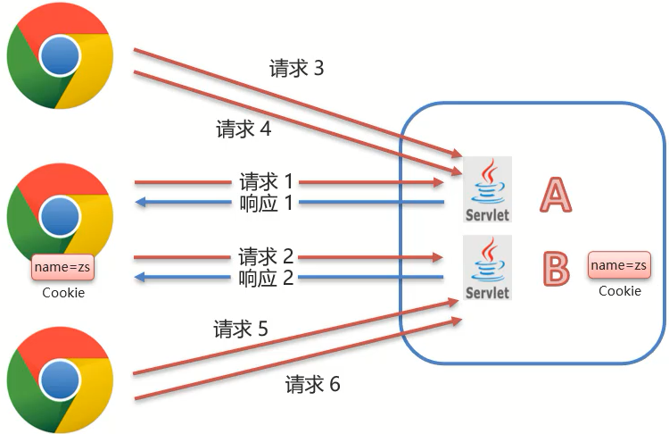

* 服务端提供了两个Servlet，分别是ServletA和ServletB
* 浏览器发送HTTP请求1给服务端，服务端ServletA接收请求并进行业务处理
* 服务端ServletA在处理的过程中可以创建一个Cookie对象并将`name=zs`的数据存入Cookie
* 服务端ServletA在响应数据的时候，会把Cookie对象响应给浏览器
* 浏览器接收到响应数据，会把Cookie对象中的数据存储在浏览器内存中，此时浏览器和服务端就==建立了一次会话==
* ==在同一次会话==中浏览器再次发送HTTP请求2给服务端ServletB，浏览器会携带Cookie对象中的所有数据
* ServletB接收到请求和数据后，就可以获取到存储在Cookie对象中的数据，这样同一个会话中的多次请求之间就实现了数据共享

**3.Cookie的基本使用**

对于Cookie的使用，我们更关注的应该是后台代码如何操作Cookie，对于Cookie的操作主要分两大类，本别是==发送Cookie==和==获取Cookie==,对于上面这两块内容，分别该如何实现呢?

3.1 发送Cookie

* 创建Cookie对象，并设置数据

```
Cookie cookie = new Cookie("key","value");
```

* 发送Cookie到客户端：使用==response==对象

```
response.addCookie(cookie);
```

介绍完发送Cookie对应的步骤后，接下面通过一个案例来完成Cookie的发送，具体实现步骤为:

> 需求:在Servlet中生成Cookie对象并存入数据，然后将数据发送给浏览器
>
> 1.创建Maven项目,项目名称为cookie-demo，并在pom.xml添加依赖
>
> 2.编写Servlet类，名称为AServlet
>
> 3.在AServlet中创建Cookie对象，存入数据，发送给前端
>
> 4.启动测试，在浏览器查看Cookie对象中的值

(1)创建Maven项目cookie-demo，并在pom.xml添加依赖

```xml
<properties>
    <maven.compiler.source>8</maven.compiler.source>
    <maven.compiler.target>8</maven.compiler.target>
</properties>

<dependencies>
    <!--servlet-->
    <dependency>
        <groupId>javax.servlet</groupId>
        <artifactId>javax.servlet-api</artifactId>
        <version>3.1.0</version>
        <scope>provided</scope>
    </dependency>
    <!--jsp-->
    <dependency>
        <groupId>javax.servlet.jsp</groupId>
        <artifactId>jsp-api</artifactId>
        <version>2.2</version>
        <scope>provided</scope>
    </dependency>
    <!--jstl-->
    <dependency>
        <groupId>jstl</groupId>
        <artifactId>jstl</artifactId>
        <version>1.2</version>
    </dependency>
    <dependency>
        <groupId>taglibs</groupId>
        <artifactId>standard</artifactId>
        <version>1.1.2</version>
    </dependency>
</dependencies>
<build>
    <plugins>
        <plugin>
            <groupId>org.apache.tomcat.maven</groupId>
            <artifactId>tomcat7-maven-plugin</artifactId>
            <version>2.2</version>
        </plugin>
    </plugins>
</build>
```

(2)编写Servlet类，名称为AServlet

```java
@WebServlet("/aServlet")
public class AServlet extends HttpServlet {
    @Override
    protected void doGet(HttpServletRequest request, HttpServletResponse response) throws ServletException, IOException {

    }

    @Override
    protected void doPost(HttpServletRequest request, HttpServletResponse response) throws ServletException, IOException {
        this.doGet(request, response);
    }
}
```

(3)在Servlet中创建Cookie对象，存入数据，发送给前端

```java
@WebServlet("/aServlet")
public class AServlet extends HttpServlet {
    @Override
    protected void doGet(HttpServletRequest request, HttpServletResponse response) throws ServletException, IOException {
        //发送Cookie
        //1. 创建Cookie对象
        Cookie cookie = new Cookie("username","zs");
        //2. 发送Cookie，response
        response.addCookie(cookie);
    }

    @Override
    protected void doPost(HttpServletRequest request, HttpServletResponse response) throws ServletException, IOException {
        this.doGet(request, response);
    }
}
```

（4）启动测试，在浏览器查看Cookie对象中的值

访问`http://localhost:8080/cookie-demo/aServlet`

chrome浏览器查看Cookie的值，有两种方式,分布式:

方式一:


方式二:选中打开开发者工具或者 使用快捷键F12 或者 Ctrl+Shift+I


3.2 获取Cookie

- 获取客户端携带的所有Cookie，使用==request==对象

```
Cookie[] cookies = request.getCookies();
```

- 遍历数组，获取每一个Cookie对象：for
- 使用Cookie对象方法获取数据

```
cookie.getName();
cookie.getValue();
```

介绍完获取Cookie对应的步骤后，接下面再通过一个案例来完成Cookie的获取，具体实现步骤为:

> 需求:在Servlet中获取前一个案例存入在Cookie对象中的数据
>
> 1.编写一个新Servlet类，名称为BServlet
>
> 2.在BServlet中使用request对象获取Cookie数组，遍历数组，从数据中获取指定名称对应的值
>
> 3.启动测试，在控制台打印出获取的值

(1)编写一个新Servlet类，名称为BServlet

```java
@WebServlet("/bServlet")
public class BServlet extends HttpServlet {
    @Override
    protected void doGet(HttpServletRequest request, HttpServletResponse response) throws ServletException, IOException {

    }

    @Override
    protected void doPost(HttpServletRequest request, HttpServletResponse response) throws ServletException, IOException {
        this.doGet(request, response);
    }
}
```

（2）在BServlet中使用request对象获取Cookie数组，遍历数组，从数据中获取指定名称对应的值

```java
@WebServlet("/bServlet")
public class BServlet extends HttpServlet {
    @Override
    protected void doGet(HttpServletRequest request, HttpServletResponse response) throws ServletException, IOException {
        //获取Cookie
        //1. 获取Cookie数组
        Cookie[] cookies = request.getCookies();
        //2. 遍历数组
        for (Cookie cookie : cookies) {
            //3. 获取数据
            String name = cookie.getName();
            if("username".equals(name)){
                String value = cookie.getValue();
                System.out.println(name+":"+value);
                break;
            }
        }

    }

    @Override
    protected void doPost(HttpServletRequest request, HttpServletResponse response) throws ServletException, IOException {
        this.doGet(request, response);
    }
}
```

（3）启动测试，在控制台打印出获取的值

访问`http://localhost:8080/cookie-demo/bServlet`

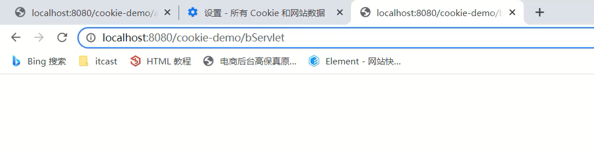

在IDEA控制台就能看到输出的结果:

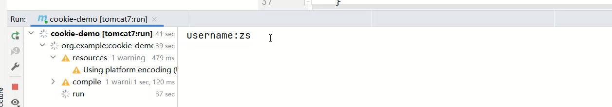

==思考:==测试的时候

* 在访问AServlet和BServlet的中间把关闭浏览器,重启浏览器后访问BServlet能否获取到Cookie中的数据?

这个问题，我们会在Cookie的使用细节中讲，大家可以动手先试下。

**小结**

在这节中，我们主要讲解了Cookie的基本使用,包含两部分内容

- 发送Cookie:
	- 创建Cookie对象，并设置值:Cookie cookie = new Cookie("key","value");
	- 发送Cookie到客户端使用的是Reponse对象:response.addCookie(cookie);
- 获取Cookie:
	- 使用Request对象获取Cookie数组:Cookie[] cookies = request.getCookies();
	- 遍历数组
	- 获取数组中每个Cookie对象的值:cookie.getName()和cookie.getValue()

介绍完Cookie的基本使用之后，那么Cookie的底层到底是如何实现一次会话两次请求之间的数据共享呢?

### 2.2 Cookie的原理分析

对于Cookie的实现原理是基于HTTP协议的,其中设计到HTTP协议中的两个请求头信息:

* 响应头:set-cookie
* 请求头: cookie


* 前面的案例中已经能够实现，AServlet给前端发送Cookie,BServlet从request中获取Cookie的功能
* 对于AServlet响应数据的时候，Tomcat服务器都是基于HTTP协议来响应数据
* 当Tomcat发现后端要返回的是一个Cookie对象之后，Tomcat就会在响应头中添加一行数据==`Set-Cookie:username=zs`==
* 浏览器获取到响应结果后，从响应头中就可以获取到`Set-Cookie`对应值`username=zs`,并将数据存储在浏览器的内存中
* 浏览器再次发送请求给BServlet的时候，浏览器会自动在请求头中添加==`Cookie: username=zs`==发送给服务端BServlet
* Request对象会把请求头中cookie对应的值封装成一个个Cookie对象，最终形成一个数组
* BServlet通过Request对象获取到Cookie[]后，就可以从中获取自己需要的数据

接下来，使用刚才的案例，把上述结论验证下:

(1)访问AServlet对应的地址`http://localhost:8080/cookie-demo/aServlet`

使用Chrom浏览器打开开发者工具(F12或Crtl+Shift+I)进行查看==响应头==中的数据


（2）访问BServlet对应的地址`http://localhost:8080/cookie-demo/bServlet

使用Chrom浏览器打开开发者工具(F12或Crtl+Shift+I)进行查看==请求头==中的数据


### 2.3 Cookie的使用细节

在这节我们主要讲解两个知识，第一个是Cookie的存活时间，第二个是Cookie如何存储中文，首先来学习下Cookie的存活时间。

#### 2.3.1 Cookie的存活时间

前面让大家思考过一个问题:

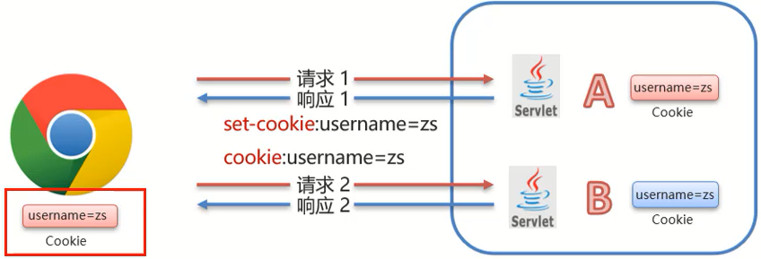

(1)浏览器发送请求给AServlet,AServlet会响应一个存有`usernanme=zs`的Cookie对象给浏览器

(2)浏览器接收到响应数据将cookie存入到浏览器内存中

(3)当浏览器再次发送请求给BServlet,BServlet就可以使用Request对象获取到Cookie数据

(4)在发送请求到BServlet之前，如果把浏览器关闭再打开进行访问，BServlet能否获取到Cookie数据?

==注意：浏览器关闭再打开不是指打开一个新的选显卡，而且必须是先关闭再打开，顺序不能变。==

针对上面这个问题，通过演示，会发现，BServlet中无法再获取到Cookie数据，这是为什么呢?

* 默认情况下，Cookie存储在浏览器内存中，当浏览器关闭，内存释放，则Cookie被销毁

这个结论就印证了上面的演示效果，但是如果使用这种默认情况下的Cookie,有些需求就无法实现，比如:

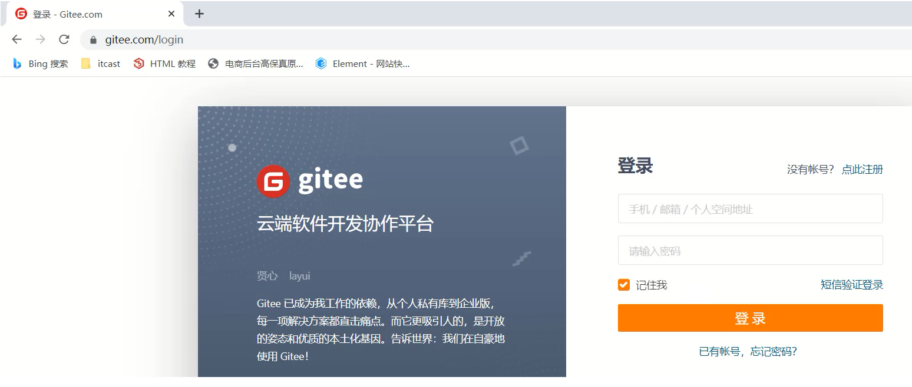

上面这个网站的登录页面上有一个`记住我`的功能，这个功能大家都比较熟悉

* 第一次输入用户名和密码并勾选`记住我`然后进行登录
* 下次再登陆的时候，用户名和密码就会被自动填充，不需要再重新输入登录
* 比如`记住我`这个功能需要记住用户名和密码一个星期，那么使用默认情况下的Cookie就会出现问题
* 因为默认情况，浏览器一关，Cookie就会从浏览器内存中删除，对于`记住我`功能就无法实现

所以我们现在就遇到一个难题是如何将Cookie持久化存储?

Cookie其实已经为我们提供好了对应的API来完成这件事，这个API就是==setMaxAge==,

* 设置Cookie存活时间

```
setMaxAge(int seconds)
```

参数值为:

1.正数：将Cookie写入浏览器所在电脑的硬盘，持久化存储。到时间自动删除

2.负数：默认值，Cookie在当前浏览器内存中，当浏览器关闭，则Cookie被销毁

3.零：删除对应Cookie

接下来，咱们就在AServlet中去设置Cookie的存活时间。

```java
@WebServlet("/aServlet")
public class AServlet extends HttpServlet {
    @Override
    protected void doGet(HttpServletRequest request, HttpServletResponse response) throws ServletException, IOException {
        //发送Cookie
        //1. 创建Cookie对象
        Cookie cookie = new Cookie("username","zs");
        //设置存活时间   ，1周 7天
        cookie.setMaxAge(60*60*24*7); //易阅读，需程序计算
		//cookie.setMaxAge(604800); //不易阅读(可以使用注解弥补)，程序少进行一次计算
        //2. 发送Cookie，response
        response.addCookie(cookie);
    }

    @Override
    protected void doPost(HttpServletRequest request, HttpServletResponse response) throws ServletException, IOException {
        this.doGet(request, response);
    }
}
```

修改完代码后，启动测试，访问`http://localhost:8080/cookie-demo/aServlet`

* 访问一个AServlet后，把浏览器关闭重启后，再去访问`http://localhost:8080/cookie-demo/bServet`,能在控制台打印出`username:zs`,说明Cookie没有随着浏览器关闭而被销毁
* 通过浏览器查看Cookie的内容，会发现Cookie的相关信息


#### 2.3.2 Cookie存储中文

首先，先来演示一个效果，将之前`username=zs`的值改成`username=张三`，把汉字`张三`存入到Cookie中，看是什么效果:

```java
@WebServlet("/aServlet")
public class AServlet extends HttpServlet {
    @Override
    protected void doGet(HttpServletRequest request, HttpServletResponse response) throws ServletException, IOException {
 		//发送Cookie
        String value = "张三";
        Cookie cookie = new Cookie("username",value);
        //设置存活时间   ，1周 7天
        cookie.setMaxAge(60*60*24*7);
        //2. 发送Cookie，response
        response.addCookie(cookie);
    }

    @Override
    protected void doPost(HttpServletRequest request, HttpServletResponse response) throws ServletException, IOException {
        this.doGet(request, response);
    }
}
```

启动访问测试，访问`http://localhost:8080/cookie-demo/aServlet`会发现浏览器会提示错误信息

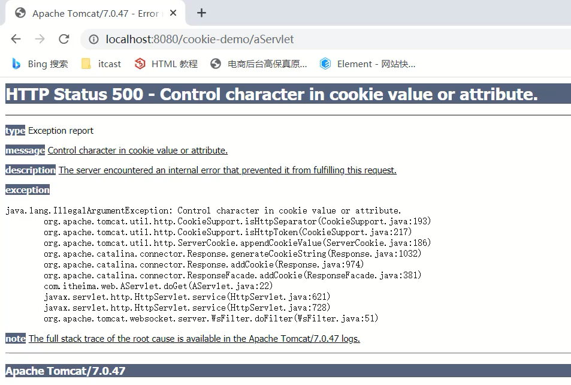

通过上面的案例演示，我们得到一个结论:

* Cookie不能直接存储中文

Cookie不能存储中文，但是如果有这方面的需求，这个时候该如何解决呢?

这个时候，我们可以使用之前学过的一个知识点叫`URL编码`，所以如果需要存储中文，就需要进行转码，具体的实现思路为:

> 1.在AServlet中对中文进行URL编码，采用URLEncoder.encode()，将编码后的值存入Cookie中
>
> 2.在BServlet中获取Cookie中的值,获取的值为URL编码后的值
>
> 3.将获取的值在进行URL解码,采用URLDecoder.decode()，就可以获取到对应的中文值

(1)在AServlet中对中文进行URL编码

```java
@WebServlet("/aServlet")
public class AServlet extends HttpServlet {
    @Override
    protected void doGet(HttpServletRequest request, HttpServletResponse response) throws ServletException, IOException {
        //发送Cookie
        String value = "张三";
        //对中文进行URL编码
        value = URLEncoder.encode(value, "UTF-8");
        System.out.println("存储数据："+value);
        //将编码后的值存入Cookie中
        Cookie cookie = new Cookie("username",value);
        //设置存活时间   ，1周 7天
        cookie.setMaxAge(60*60*24*7);
        //2. 发送Cookie，response
        response.addCookie(cookie);
    }

    @Override
    protected void doPost(HttpServletRequest request, HttpServletResponse response) throws ServletException, IOException {
        this.doGet(request, response);
    }
}
```

(2)在BServlet中获取值，并对值进行解码

```java
@WebServlet("/bServlet")
public class BServlet extends HttpServlet {
    @Override
    protected void doGet(HttpServletRequest request, HttpServletResponse response) throws ServletException, IOException {
        //获取Cookie
        //1. 获取Cookie数组
        Cookie[] cookies = request.getCookies();
        //2. 遍历数组
        for (Cookie cookie : cookies) {
            //3. 获取数据
            String name = cookie.getName();
            if("username".equals(name)){
                String value = cookie.getValue();//获取的是URL编码后的值 %E5%BC%A0%E4%B8%89
                //URL解码
                value = URLDecoder.decode(value,"UTF-8");
                System.out.println(name+":"+value);//value解码后为 张三
                break;
            }
        }

    }

    @Override
    protected void doPost(HttpServletRequest request, HttpServletResponse response) throws ServletException, IOException {
        this.doGet(request, response);
    }
}
```

至此，我们就可以将中文存入Cookie中进行使用。

**小结**

Cookie的使用细节中，我们讲了Cookie的`存活时间`和`存储中文`:

* 存活时间，需要掌握setMaxAage()API的使用

* 存储中文，需要掌握URL编码和解码的使用

## 3，Session

Cookie已经能完成一次会话多次请求之间的数据共享，之前我们还提到过Session也可以实现，那么:

- 什么是Session?
- Session如何来使用?
- Session是如何实现的?
- Session的使用注意事项有哪些?

### 3.1 Session的基本使用

**1.概念**

==Session==：服务端会话跟踪技术：将数据保存到服务端。

* Session是存储在服务端而Cookie是存储在客户端
* 存储在客户端的数据容易被窃取和截获，存在很多不安全的因素
* 存储在服务端的数据相比于客户端来说就更安全

**2.Session的工作流程**

 

* 在服务端的AServlet获取一个Session对象，把数据存入其中
* 在服务端的BServlet获取到相同的Session对象，从中取出数据
* 就可以实现一次会话中多次请求之间的数据共享了
* 现在最大的问题是如何保证AServlet和BServlet使用的是同一个Session对象(在原理分析会讲解)?

**3.Session的基本使用**

在JavaEE中提供了HttpSession接口，来实现一次会话的多次请求之间数据共享功能。

具体的使用步骤为:

* 获取Session对象,使用的是request对象

```
HttpSession session = request.getSession();
```

* Session对象提供的功能:

	* 存储数据到 session 域中

		```
		void setAttribute(String name, Object o)
		```

	* 根据 key，获取值

		```
		Object getAttribute(String name)
		```

	* 根据 key，删除该键值对

		```
		void removeAttribute(String name)
		```

介绍完Session相关的API后，接下来通过一个案例来完成对Session的使用，具体实现步骤为:

> 需求:在一个Servlet中往Session中存入数据，在另一个Servlet中获取Session中存入的数据
>
> 1.创建名为SessionDemo1的Servlet类
>
> 2.创建名为SessionDemo2的Servlet类
>
> 3.在SessionDemo1的方法中:获取Session对象、存储数据
>
> 4.在SessionDemo2的方法中:获取Session对象、获取数据
>
> 5.启动测试

(1)创建名为SessionDemo1的Servlet类

```java
@WebServlet("/demo1")
public class SessionDemo1 extends HttpServlet {
    @Override
    protected void doGet(HttpServletRequest request, HttpServletResponse response) throws ServletException, IOException {
    
    }

    @Override
    protected void doPost(HttpServletRequest request, HttpServletResponse response) throws ServletException, IOException {
        this.doGet(request, response);
    }
}
```

(2)创建名为SessionDemo2的Servlet类

```java
@WebServlet("/demo2")
public class SessionDemo2 extends HttpServlet {
    @Override
    protected void doGet(HttpServletRequest request, HttpServletResponse response) throws ServletException, IOException {
    
    }

    @Override
    protected void doPost(HttpServletRequest request, HttpServletResponse response) throws ServletException, IOException {
        this.doGet(request, response);
    }
}
```

(3)SessionDemo1:获取Session对象、存储数据

```java
@WebServlet("/demo1")
public class SessionDemo1 extends HttpServlet {
    @Override
    protected void doGet(HttpServletRequest request, HttpServletResponse response) throws ServletException, IOException {
    	//存储到Session中
        //1. 获取Session对象
        HttpSession session = request.getSession();
        //2. 存储数据
        session.setAttribute("username","zs");
    }

    @Override
    protected void doPost(HttpServletRequest request, HttpServletResponse response) throws ServletException, IOException {
        this.doGet(request, response);
    }
}
```

(4)SessionDemo2:获取Session对象、获取数据

```java
@WebServlet("/demo2")
public class SessionDemo2 extends HttpServlet {
    @Override
    protected void doGet(HttpServletRequest request, HttpServletResponse response) throws ServletException, IOException {
        //获取数据，从session中
        //1. 获取Session对象
        HttpSession session = request.getSession();
        //2. 获取数据
        Object username = session.getAttribute("username");
        System.out.println(username);
    }

    @Override
    protected void doPost(HttpServletRequest request, HttpServletResponse response) throws ServletException, IOException {
        this.doGet(request, response);
    }
}
```

(5)启动测试，

* 先访问`http://localhost:8080/cookie-demo/demo1`,将数据存入Session
* 在访问`http://localhost:8080/cookie-demo/demo2`,从Session中获取数据
* 查看控制台


通过案例的效果，能看到Session是能够在一次会话中两次请求之间共享数据。

**小结**

至此Session的基本使用就已经完成了，重点要掌握的是:

* Session的获取

	```
	HttpSession session = request.getSession();
	```

* Session常用方法的使用

	```
	void setAttribute(String name, Object o)
	Object getAttribute(String name)
	```

	**注意:**Session中可以存储的是一个Object类型的数据，也就是说Session中可以存储任意数据类型。

介绍完Session的基本使用之后，那么Session的底层到底是如何实现一次会话两次请求之间的数据共享呢?

### 3.2 Session的原理分析

* Session是基于Cookie实现的

这句话其实不太能详细的说明Session的底层实现，接下来，咱们一步步来分析下Session的具体实现原理:

(1)前提条件

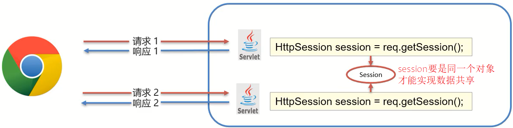

Session要想实现一次会话多次请求之间的数据共享，就必须要保证多次请求获取Session的对象是同一个。

那么它们是一个对象么？要验证这个结论也很简单，只需要在上面案例中的两个Servlet中分别打印下Session对象

SessionDemo1

```java
@WebServlet("/demo1")
public class SessionDemo1 extends HttpServlet {
    @Override
    protected void doGet(HttpServletRequest request, HttpServletResponse response) throws ServletException, IOException {
    	//存储到Session中
        //1. 获取Session对象
        HttpSession session = request.getSession();
        System.out.println(session);
        //2. 存储数据
        session.setAttribute("username","zs");
    }

    @Override
    protected void doPost(HttpServletRequest request, HttpServletResponse response) throws ServletException, IOException {
        this.doGet(request, response);
    }
}
```

SessionDemo2

```java
@WebServlet("/demo2")
public class SessionDemo2 extends HttpServlet {
    @Override
    protected void doGet(HttpServletRequest request, HttpServletResponse response) throws ServletException, IOException {
        //获取数据，从session中
        //1. 获取Session对象
        HttpSession session = request.getSession();
        System.out.println(session);
        //2. 获取数据
        Object username = session.getAttribute("username");
        System.out.println(username);
    }

    @Override
    protected void doPost(HttpServletRequest request, HttpServletResponse response) throws ServletException, IOException {
        this.doGet(request, response);
    }
}
```

启动测试，分别访问

`http://localhost:8080/cookie-demo/demo1`

`http://localhost:8080/cookie-demo/demo2`

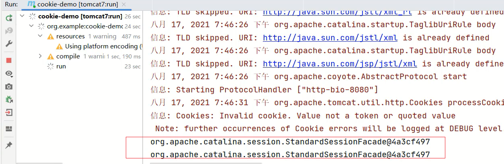

通过打印可以得到如下结论:

* 两个Servlet类中获取的Session对象是同一个
* 把demo1和demo2请求刷新多次，控制台最终打印的结果都是同一个

那么问题又来了，如果新开一个浏览器，访问demo1或者demo2,打印在控制台的Session还是同一个对象么?


==注意:在一台电脑上演示的时候，如果是相同的浏览器必须要把浏览器全部关掉重新打开，才算新开的一个浏览器。==

当然也可以使用不同的浏览器进行测试，就不需要把之前的浏览器全部关闭。

测试的结果：如果是不同浏览器或者重新打开浏览器后，打印的Session就不一样了。

所以Session实现的也是一次会话中的多次请求之间的数据共享。

那么最主要的问题就来了，Session是如何保证在一次会话中获取的Session对象是同一个呢?


(1)demo1在第一次获取session对象的时候，session对象会有一个唯一的标识，假如是`id:10`

(2)demo1在session中存入其他数据并处理完成所有业务后，需要通过Tomcat服务器响应结果给浏览器

(3)Tomcat服务器发现业务处理中使用了session对象，就会把session的唯一标识`id:10`当做一个cookie，添加`Set-Cookie:JESSIONID=10`到响应头中，并响应给浏览器

(4)浏览器接收到响应结果后，会把响应头中的coookie数据存储到浏览器的内存中

(5)浏览器在同一会话中访问demo2的时候，会把cookie中的数据按照`cookie: JESSIONID=10`的格式添加到请求头中并发送给服务器Tomcat

(6)demo2获取到请求后，从请求头中就读取cookie中的JSESSIONID值为10，然后就会到服务器内存中寻找`id:10`的session对象，如果找到了，就直接返回该对象，如果没有则新创建一个session对象

(7)关闭打开浏览器后，因为浏览器的cookie已被销毁，所以就没有JESSIONID的数据，服务端获取到的session就是一个全新的session对象

至此，`Session是基于Cookie来实现的`这就话，我们就解释完了，接下来通过实例来演示下:

(1)使用chrome浏览器访问`http://localhost:8080/cookie-demo/demo1`,打开开发者模式(F12或Ctrl+Shift+I),查看==响应头(Response Headers)==数据:


(2)使用chrome浏览器再次访问`http://localhost:8080/cookie-demo/demo2`，查看==请求头(Request Headers)==数据:

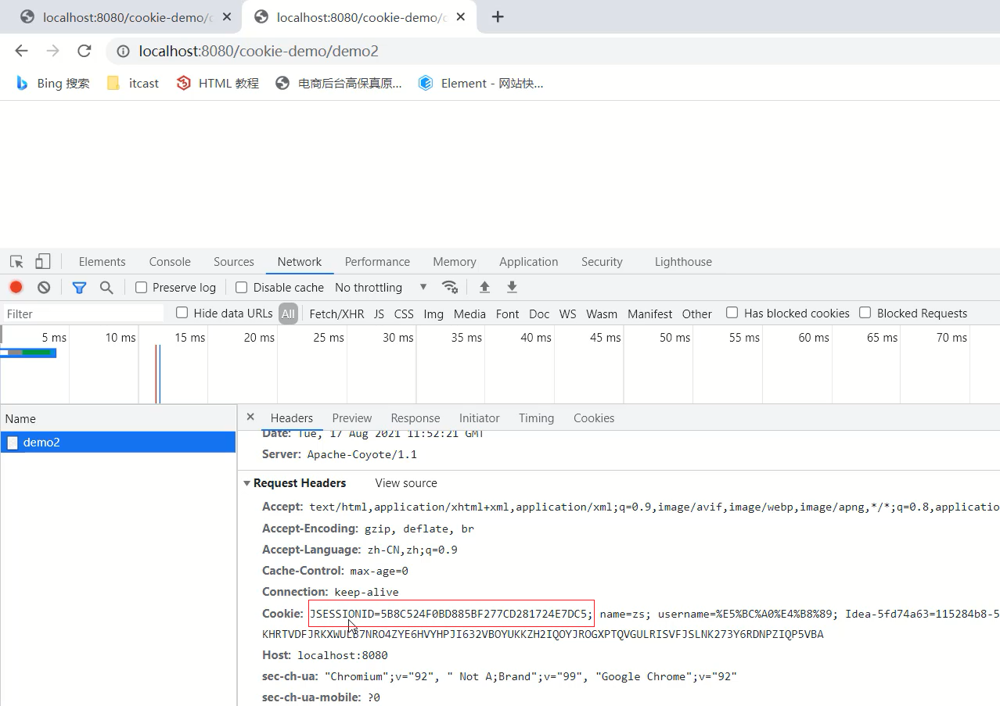

**小结**

介绍完Session的原理，我们只需要记住

* Session是基于Cookie来实现的

### 3.3 Session的使用细节

这节我们会主要讲解两个知识，第一个是Session的钝化和活化，第二个是Session的销毁，首先来学习什么是Session的钝化和活化？

#### 3.3.1 Session钝化与活化

首先需要大家思考的问题是: 

* 服务器重启后，Session中的数据是否还在?

要想回答这个问题，我们可以先看下下面这幅图，

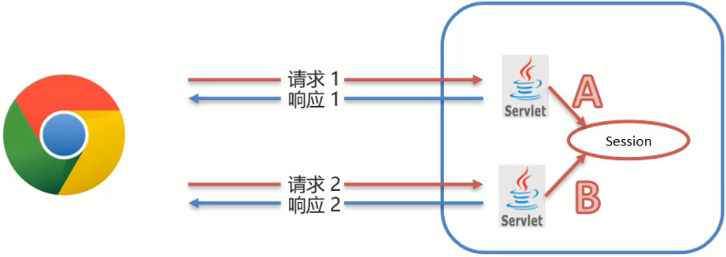 

(1)服务器端AServlet和BServlet共用的session对象应该是存储在服务器的内存中

(2)服务器重新启动后，内存中的数据应该是已经被释放，对象也应该都销毁了

所以session数据应该也已经不存在了。但是如果session不存在会引发什么问题呢?

举个例子说明下，

(1)用户把需要购买的商品添加到购物车，因为要实现同一个会话多次请求数据共享，所以假设把数据存入Session对象中

(2)用户正要付钱的时候接到一个电话，付钱的动作就搁浅了

(3)正在用户打电话的时候，购物网站因为某些原因需要重启

(4)重启后session数据被销毁，购物车中的商品信息也就会随之而消失

(5)用户想再次发起支付，就会出为问题

所以说对于session的数据，我们应该做到就算服务器重启了，也应该能把数据保存下来才对。

分析了这么多，那么Tomcat服务器在重启的时候，session数据到底会不会保存以及是如何保存的，我们可以通过实际案例来演示下:

==注意:这里所说的关闭和启动应该要确保是正常的关闭和启动。==

那如何才是正常关闭Tomcat服务器呢?

需要使用命令行的方式来启动和停止Tomcat服务器:

==启动==:进入到项目pom.xml所在目录，执行`tomcat7:run`

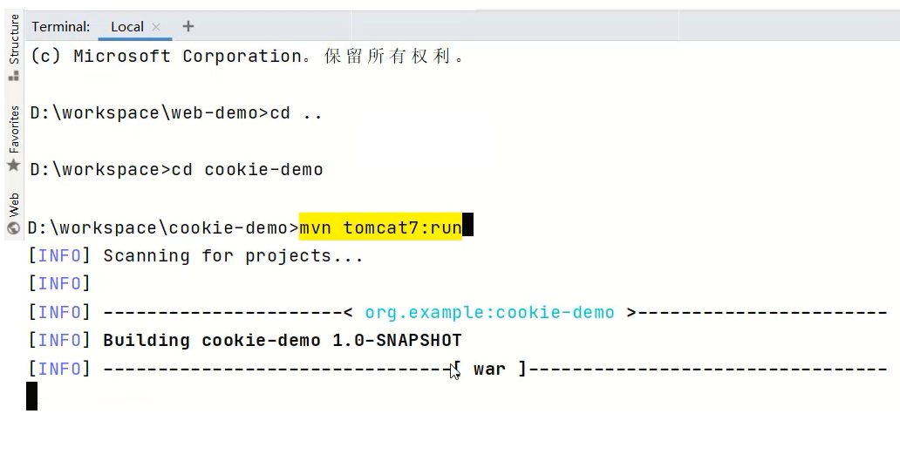

==停止==:在启动的命令行界面，输入`ctrl+c`


有了上述两个正常启动和关闭的方式后，接下来的测试流程是:

(1)先启动Tomcat服务器

(2)访问`http://localhost:8080/cookie-demo/demo1`将数据存入session中

(3)正确停止Tomcat服务器

(4)再次重新启动Tomcat服务器

(5)访问`http://localhost:8080/cookie-demo/demo2` 查看是否能获取到session中的数据

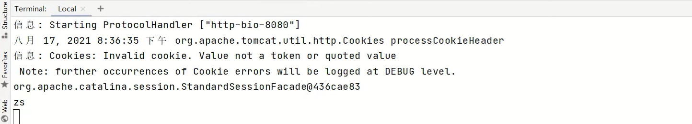

经过测试，会发现只要服务器是正常关闭和启动，session中的数据是可以被保存下来的。

那么Tomcat服务器到底是如何做到的呢?

具体的原因就是:Session的钝化和活化:

* 钝化：在服务器正常关闭后，Tomcat会自动将Session数据写入硬盘的文件中

	* 钝化的数据路径为:`项目目录\target\tomcat\work\Tomcat\localhost\项目名称\SESSIONS.ser`

		

* 活化：再次启动服务器后，从文件中加载数据到Session中

	* 数据加载到Session中后，路径中的`SESSIONS.ser`文件会被删除掉

对于上述的整个过程，大家只需要了解下即可。因为所有的过程都是Tomcat自己完成的，不需要我们参与。

**小结**

Session的钝化和活化介绍完后，需要我们注意的是:

* session数据存储在服务端，服务器重启后，session数据会被保存

* 浏览器被关闭启动后，重新建立的连接就已经是一个全新的会话，获取的session数据也是一个新的对象

* session的数据要想共享，浏览器不能关闭，所以session数据不能长期保存数据
* cookie是存储在客户端，是可以长期保存

#### 3.3.2 Session销毁

session的销毁会有两种方式:

* 默认情况下，无操作，30分钟自动销毁

	* 对于这个失效时间，是可以通过配置进行修改的

		* 在项目的web.xml中配置

			```xml
			<?xml version="1.0" encoding="UTF-8"?>
			<web-app xmlns="http://xmlns.jcp.org/xml/ns/javaee"
			         xmlns:xsi="http://www.w3.org/2001/XMLSchema-instance"
			         xsi:schemaLocation="http://xmlns.jcp.org/xml/ns/javaee http://xmlns.jcp.org/xml/ns/javaee/web-app_3_1.xsd"
			         version="3.1">
			
			    <session-config>
			        <session-timeout>100</session-timeout>
			    </session-config>
			</web-app>
			```

		* 如果没有配置，默认是30分钟，默认值是在Tomcat的web.xml配置文件中写死的

			

* 调用Session对象的invalidate()进行销毁

	* 在SessionDemo2类中添加session销毁的方法

		```java
		@WebServlet("/demo2")
		public class SessionDemo2 extends HttpServlet {
		    @Override
		    protected void doGet(HttpServletRequest request, HttpServletResponse response) throws ServletException, IOException {
		        //获取数据，从session中
		
		        //1. 获取Session对象
		        HttpSession session = request.getSession();
		        System.out.println(session);
		
		        // 销毁
		        session.invalidate();
		        //2. 获取数据
		        Object username = session.getAttribute("username");
		        System.out.println(username);
		    }
		
		    @Override
		    protected void doPost(HttpServletRequest request, HttpServletResponse response) throws ServletException, IOException {
		        this.doGet(request, response);
		    }
		}
		```

	* 启动访问测试，先访问demo1将数据存入到session，再次访问demo2从session中获取数据

		

	* 该销毁方法一般会在用户退出的时候，需要将session销毁掉。

**Cookie和Session小结**

* Cookie 和 Session 都是来完成一次会话内多次请求间==数据共享==的。

所需两个对象放在一块，就需要思考:

Cookie和Session的区别是什么?

Cookie和Session的应用场景分别是什么?

* 区别:
	* 存储位置：Cookie 是将数据存储在客户端，Session 将数据存储在服务端
	* 安全性：Cookie不安全，Session安全
	* 数据大小：Cookie最大3KB，Session无大小限制
	* 存储时间：Cookie可以通过setMaxAge()长期存储，Session默认30分钟
	* 服务器性能：Cookie不占服务器资源，Session占用服务器资源
* 应用场景:
	* 购物车:使用Cookie来存储
	* 以登录用户的名称展示:使用Session来存储
	* 记住我功能:使用Cookie来存储
	* 验证码:使用session来存储
* 结论
	* Cookie是用来保证用户在未登录情况下的身份识别
	* Session是用来保存用户登录后的数据

介绍完Cookie和Session以后，具体用哪个还是需要根据具体的业务进行具体分析。

## 4，用户登录注册案例

### 4.1 需求分析

 需求说明：

1. 完成用户登录功能，如果用户勾选“记住用户” ，则下次访问登录页面==自动==填充用户名密码

2. 完成注册功能，并实现==验证码==功能

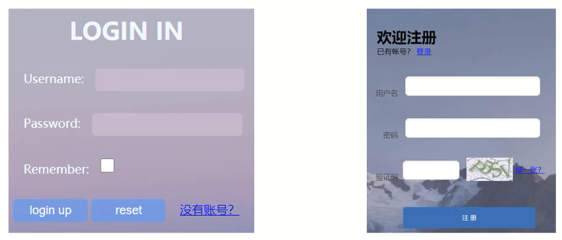

### 4.2 用户登录功能

1. 需求:

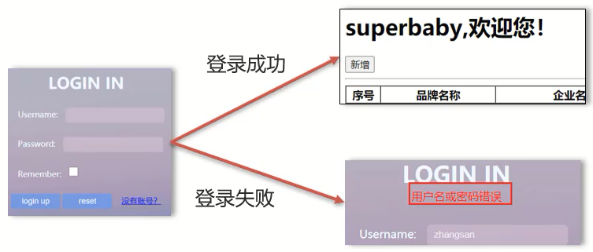

* 用户登录成功后，跳转到列表页面，并在页面上展示当前登录的用户名称
* 用户登录失败后，跳转回登录页面，并在页面上展示对应的错误信息

2. 实现流程分析


(1)前端通过表单发送请求和数据给Web层的LoginServlet

(2)在LoginServlet中接收请求和数据[用户名和密码]

(3)LoginServlet接收到请求和数据后，调用Service层完成根据用户名和密码查询用户对象

(4)在Service层需要编写UserService类，在类中实现login方法，方法中调用Dao层的UserMapper

(5)在UserMapper接口中，声明一个根据用户名和密码查询用户信息的方法

(6)Dao层把数据查询出来以后，将返回数据封装到User对象，将对象交给Service层

(7)Service层将数据返回给Web层

(8)Web层获取到User对象后，判断User对象，如果为Null,则将错误信息响应给登录页面，如果不为Null，则跳转到列表页面，并把当前登录用户的信息存入Session携带到列表页面。

3. 具体实现

(1)完成Dao层的代码编写

(1.1)将`04-资料\1. 登录注册案例\2. MyBatis环境\UserMapper.java`放到com.itheima.mapper`包下:

```java
public interface UserMapper {
    /**
     * 根据用户名和密码查询用户对象
     * @param username
     * @param password
     * @return
     */
    @Select("select * from tb_user where username = #{username} and password = #{password}")
    User select(@Param("username") String username,@Param("password")  String password);

    /**
     * 根据用户名查询用户对象
     * @param username
     * @return
     */
    @Select("select * from tb_user where username = #{username}")
    User selectByUsername(String username);

    /**
     * 添加用户
     * @param user
     */
    @Insert("insert into tb_user values(null,#{username},#{password})")
    void add(User user);
}
```

(1.2)将`04-资料\1. 登录注册案例\2. MyBatis环境\User.java`放到`com.itheima.pojo`包下:

```java
public class User {

    private Integer id;
    private String username;
    private String password;

    public Integer getId() {
        return id;
    }

    public void setId(Integer id) {
        this.id = id;
    }

    public String getUsername() {
        return username;
    }

    public void setUsername(String username) {
        this.username = username;
    }

    public String getPassword() {
        return password;
    }

    public void setPassword(String password) {
        this.password = password;
    }

    @Override
    public String toString() {
        return "User{" +
                "id=" + id +
                ", username='" + username + '\'' +
                ", password='" + password + '\'' +
                '}';
    }
}
```

(1.3)将`04-资料\1. 登录注册案例\2. MyBatis环境\UserMapper.xml`放入到resources/com/itheima/mapper`目录下:

```xml
<?xml version="1.0" encoding="UTF-8" ?>
<!DOCTYPE mapper
        PUBLIC "-//mybatis.org//DTD Mapper 3.0//EN"
        "http://mybatis.org/dtd/mybatis-3-mapper.dtd">
<mapper namespace="com.itheima.mapper.UserMapper">

</mapper>
```

(2)完成Service层的代码编写

(2.1)在`com.itheima.service`包下，创建UserService类

```java
public class UserService {
    //1.使用工具类获取SqlSessionFactory
    SqlSessionFactory factory = SqlSessionFactoryUtils.getSqlSessionFactory();
    /**
     * 登录方法
     * @param username
     * @param password
     * @return
     */
    public User login(String username,String password){
        //2. 获取SqlSession
        SqlSession sqlSession = factory.openSession();
        //3. 获取UserMapper
        UserMapper mapper = sqlSession.getMapper(UserMapper.class);
        //4. 调用方法
        User user = mapper.select(username, password);
        //释放资源
        sqlSession.close();

        return  user;
    }
}
```

(3)完成页面和Web层的代码编写

(3.1)将`04-资料\1. 登录注册案例\1. 静态页面`拷贝到项目的`webapp`目录下:

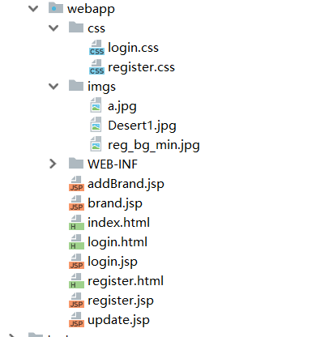

(3.2)将login.html内容修改成login.jsp

```jsp
<%@ page contentType="text/html;charset=UTF-8" language="java" %>
<!DOCTYPE html>
<html lang="en">

<head>
    <meta charset="UTF-8">
    <title>login</title>
    <link href="css/login.css" rel="stylesheet">
</head>

<body>
<div id="loginDiv" style="height: 350px">
    <form action="/brand-demo/loginServlet" method="post" id="form">
        <h1 id="loginMsg">LOGIN IN</h1>
        <div id="errorMsg">用户名或密码不正确</div>
        <p>Username:<input id="username" name="username" type="text"></p>
        <p>Password:<input id="password" name="password" type="password"></p>
        <p>Remember:<input id="remember" name="remember" type="checkbox"></p>
        <div id="subDiv">
            <input type="submit" class="button" value="login up">
            <input type="reset" class="button" value="reset">&nbsp;&nbsp;&nbsp;
            <a href="register.html">没有账号？</a>
        </div>
    </form>
</div>
</body>
</html>
```

(3.3)创建LoginServlet类

```java
@WebServlet("/loginServlet")
public class LoginServlet extends HttpServlet {
    private UserService service = new UserService();

    @Override
    protected void doGet(HttpServletRequest request, HttpServletResponse response) throws ServletException, IOException {
        //1. 获取用户名和密码
        String username = request.getParameter("username");
        String password = request.getParameter("password");
   
        //2. 调用service查询
        User user = service.login(username, password);

        //3. 判断
        if(user != null){
            //登录成功，跳转到查询所有的BrandServlet
            
            //将登陆成功后的user对象，存储到session
            HttpSession session = request.getSession();
            session.setAttribute("user",user);
            
            String contextPath = request.getContextPath();
            response.sendRedirect(contextPath+"/selectAllServlet");
        }else {
            // 登录失败,
            // 存储错误信息到request
            request.setAttribute("login_msg","用户名或密码错误");
            // 跳转到login.jsp
            request.getRequestDispatcher("/login.jsp").forward(request,response);

        }
    }

    @Override
    protected void doPost(HttpServletRequest request, HttpServletResponse response) throws ServletException, IOException {
        this.doGet(request, response);
    }
}
```

(3.4)在brand.jsp中<body>标签下添加欢迎当前用户的提示信息:

```jsp
<h1>${user.username},欢迎您</h1>
```

(3.5) 修改login.jsp，将错误信息使用EL表达式来获取

```jsp
修改前内容:<div id="errorMsg">用户名或密码不正确</div>
修改后内容: <div id="errorMsg">${login_msg}</div>
```

(4)启动，访问测试

(4.1) 进入登录页面，输入错误的用户名或密码

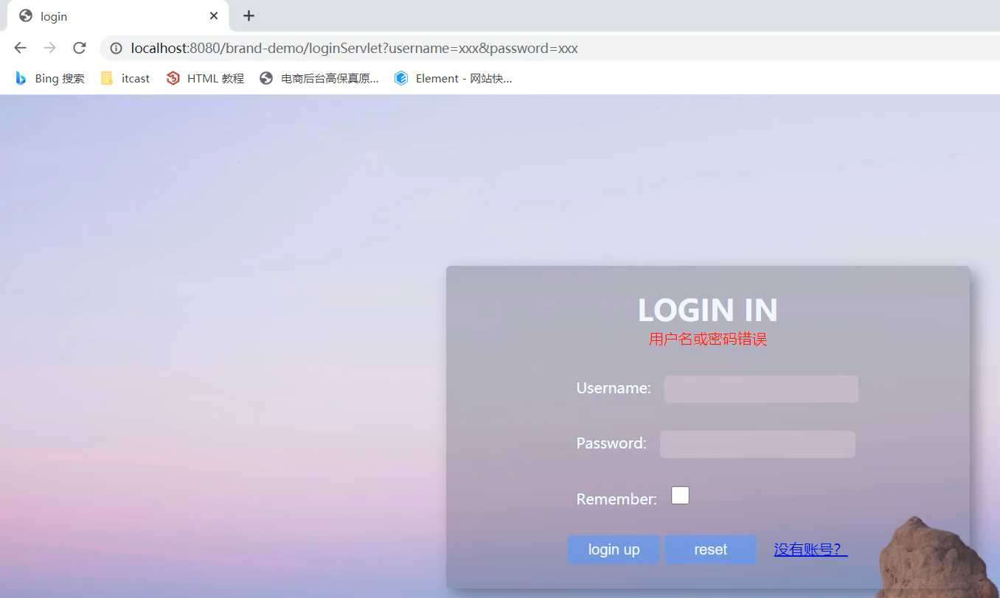

(4.2)输入正确的用户和密码信息

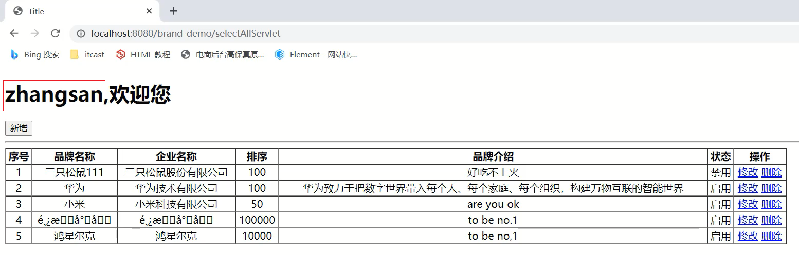

**小结**

* 在LoginServlet中，将登录成功的用户数据存入session中，方法在列表页面中获取当前登录用户信息进行展示
* 在LoginServlet中，将登录失败的错误信息存入到request中，如果存入到session中就会出现这次会话的所有请求都有登录失败的错误信息，这个是不需要的，所以不用存入到session中

### 4.3 记住我-设置Cookie

1. 需求:

如果用户勾选“记住用户” ，则下次访问登陆页面自动填充用户名密码。这样可以提升用户的体验。


对应上面这个需求，最大的问题就是: 如何自动填充用户名和密码?

2. 实现流程分析

因为`记住我`功能要实现的效果是，就算用户把浏览器关闭过几天再来访问也能自动填充，所以需要将登陆信息存入一个可以长久保存，并且能够在浏览器关闭重新启动后依然有效的地方，就是我们前面讲的==Cookie==,所以:

* 将用户名和密码写入==Cookie==中，并且持久化存储Cookie,下次访问浏览器会自动携带Cookie

* 在页面获取Cookie数据后，设置到用户名和密码框中

* 何时写入Cookie?
	* 用户必须登陆成功后才需要写
	* 用户必须在登录页面勾选了`记住我`的复选框

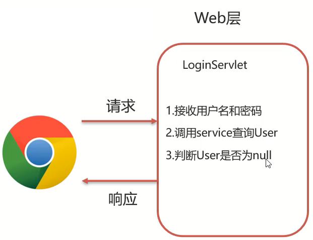

(1)前端需要在发送请求和数据的时候，多携带一个用户是否勾选`Remember`的数据

(2)LoginServlet获取到数据后，调用Service完成用户名和密码的判定

(3)登录成功，并且用户在前端勾选了`记住我`，需要往Cookie中写入用户名和密码的数据，并设置Cookie存活时间

(4)设置成功后，将数据响应给前端

3. 具体实现

(1)在login.jsp为复选框设置值

```jsp
<%@ page contentType="text/html;charset=UTF-8" language="java" %>
<!DOCTYPE html>
<html lang="en">

<head>
    <meta charset="UTF-8">
    <title>login</title>
    <link href="css/login.css" rel="stylesheet">
</head>

<body>
<div id="loginDiv" style="height: 350px">
    <form action="/brand-demo/loginServlet" method="post" id="form">
        <h1 id="loginMsg">LOGIN IN</h1>
        <div id="errorMsg">${login_msg}</div>
        <p>Username:<input id="username" name="username" type="text"></p>
        <p>Password:<input id="password" name="password" type="password"></p>
        <p>Remember:<input id="remember" name="remember" value="1" type="checkbox"></p>
        <div id="subDiv">
            <input type="submit" class="button" value="login up">
            <input type="reset" class="button" value="reset">&nbsp;&nbsp;&nbsp;
            <a href="register.html">没有账号？</a>
        </div>
    </form>
</div>
</body>
</html>
```

(2)在LoginServlet获取复选框的值并在登录成功后进行设置Cookie

```java
@WebServlet("/loginServlet")
public class LoginServlet extends HttpServlet {
    private UserService service = new UserService();

    @Override
    protected void doGet(HttpServletRequest request, HttpServletResponse response) throws ServletException, IOException {
        //1. 获取用户名和密码
        String username = request.getParameter("username");
        String password = request.getParameter("password");

        //获取复选框数据
        String remember = request.getParameter("remember");

        //2. 调用service查询
        User user = service.login(username, password);

        //3. 判断
        if(user != null){
            //登录成功，跳转到查询所有的BrandServlet

            //判断用户是否勾选记住我，字符串写前面是为了避免出现空指针异常
            if("1".equals(remember)){
                //勾选了，发送Cookie
                //1. 创建Cookie对象
                Cookie c_username = new Cookie("username",username);
                Cookie c_password = new Cookie("password",password);
                // 设置Cookie的存活时间
                c_username.setMaxAge( 60 * 60 * 24 * 7);
                c_password.setMaxAge( 60 * 60 * 24 * 7);
                //2. 发送
                response.addCookie(c_username);
                response.addCookie(c_password);
            }

            //将登陆成功后的user对象，存储到session
            HttpSession session = request.getSession();
            session.setAttribute("user",user);

            String contextPath = request.getContextPath();
            response.sendRedirect(contextPath+"/selectAllServlet");
        }else {
            // 登录失败,

            // 存储错误信息到request
            request.setAttribute("login_msg","用户名或密码错误");

            // 跳转到login.jsp
            request.getRequestDispatcher("/login.jsp").forward(request,response);

        }
    }

    @Override
    protected void doPost(HttpServletRequest request, HttpServletResponse response) throws ServletException, IOException {
        this.doGet(request, response);
    }
}
```

(3)启动访问测试，

只有当前用户名和密码输入正确，并且勾选了Remeber的复选框，在响应头中才可以看得cookie的相关数据


### 4.4 记住我-获取Cookie

1. 需求

登录成功并勾选了Remeber后，后端返回给前端的Cookie数据就已经存储好了，接下来就需要在页面获取Cookie中的数据，并把数据设置到登录页面的用户名和密码框中。


如何在页面直接获取Cookie中的值呢?

2. 实现流程分析

在页面可以使用EL表达式，${cookie.==key==.value}

key:指的是存储在cookie中的键名称


(1)在login.jsp用户名的表单输入框使用value值给表单元素添加默认值，value可以使用`${cookie.username.value}`

(2)在login.jsp密码的表单输入框使用value值给表单元素添加默认值，value可以使用`${cookie.password.value}`

3. 具体实现

(1)修改login.jsp页面

```jsp
<%@ page contentType="text/html;charset=UTF-8" language="java" %>
<!DOCTYPE html>
<html lang="en">

<head>
    <meta charset="UTF-8">
    <title>login</title>
    <link href="css/login.css" rel="stylesheet">
</head>

<body>
<div id="loginDiv" style="height: 350px">
    <form action="/brand-demo/loginServlet" method="post" id="form">
        <h1 id="loginMsg">LOGIN IN</h1>
        <div id="errorMsg">${login_msg}</div>
        <p>Username:<input id="username" name="username" value="${cookie.username.value}" type="text"></p>

        <p>Password:<input id="password" name="password" value="${cookie.password.value}" type="password"></p>
        <p>Remember:<input id="remember" name="remember" value="1" type="checkbox"></p>
        <div id="subDiv">
            <input type="submit" class="button" value="login up">
            <input type="reset" class="button" value="reset">&nbsp;&nbsp;&nbsp;
            <a href="register.html">没有账号？</a>
        </div>
    </form>
</div>
</body>
</html>
```

4. 访问测试，重新访问登录页面，就可以看得用户和密码已经被填充。

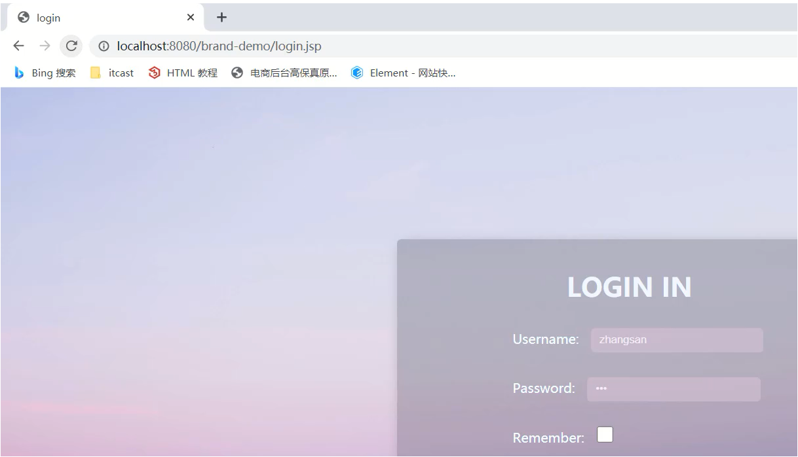

### 4.5 用户注册功能

1. 需求

* 注册功能：保存用户信息到数据库
* 验证码功能
	* 展示验证码：展示验证码图片，并可以点击切换
	* 校验验证码：验证码填写不正确，则注册失败

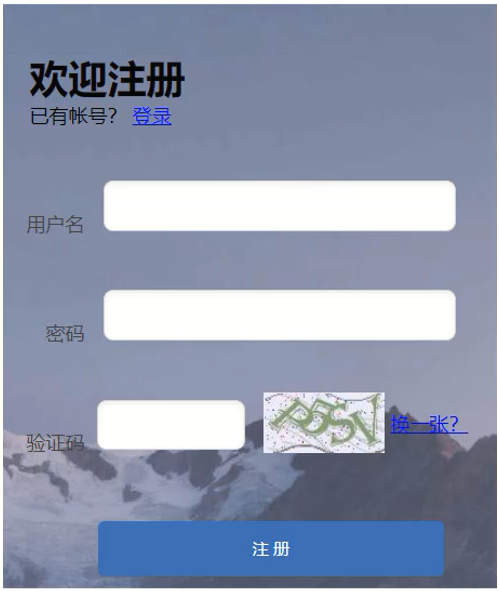

2. 实现流程分析


(1)前端通过表单发送请求和数据给Web层的RegisterServlet

(2)在RegisterServlet中接收请求和数据[用户名和密码]

(3)RegisterServlet接收到请求和数据后，调用Service层完成用户信息的保存

(4)在Service层需要编写UserService类，在类中实现register方法，需要判断用户是否已经存在，如果不存在，则完成用户数据的保存

(5)在UserMapper接口中，声明两个方法，一个是根据用户名查询用户信息方法，另一个是保存用户信息方法

(6)在UserService类中保存成功则返回true，失败则返回false,将数据返回给Web层

(7)Web层获取到结果后，如果返回的是true,则提示`注册成功`，并转发到登录页面，如果返回false则提示`用户名已存在`并转发到注册页面

3. 具体实现

(1)Dao层代码参考资料中的内容完成

(2)编写Service层代码

```java
public class UserService {
    //1.使用工具类获取SqlSessionFactory
    SqlSessionFactory factory = SqlSessionFactoryUtils.getSqlSessionFactory();
    /**
     * 注册方法
     * @return
     */

    public boolean register(User user){
        //2. 获取SqlSession
        SqlSession sqlSession = factory.openSession();
        //3. 获取UserMapper
        UserMapper mapper = sqlSession.getMapper(UserMapper.class);
        //4. 判断用户名是否存在
        User u = mapper.selectByUsername(user.getUsername());

        if(u == null){
            // 用户名不存在，注册
            mapper.add(user);
            sqlSession.commit();
        }
        sqlSession.close();

        return u == null;

    }
}
```

(3)完成页面和Web层的代码编写

(3.1)将register.html内容修改成register.jsp

```jsp
<%@ page contentType="text/html;charset=UTF-8" language="java" %>
<!DOCTYPE html>
<html lang="en">
<head>
    <meta charset="UTF-8">
    <title>欢迎注册</title>
    <link href="css/register.css" rel="stylesheet">
</head>
<body>
<div class="form-div">
    <div class="reg-content">
        <h1>欢迎注册</h1>
        <span>已有帐号？</span> <a href="login.html">登录</a>
    </div>
    <form id="reg-form" action="/brand-demo/registerServlet" method="post">
        <table>
            <tr>
                <td>用户名</td>
                <td class="inputs">
                    <input name="username" type="text" id="username">
                    <br>
                    <span id="username_err" class="err_msg" style="display:none">用户名不太受欢迎</span>
                </td>
            </tr>
            <tr>
                <td>密码</td>
                <td class="inputs">
                    <input name="password" type="password" id="password">
                    <br>
                    <span id="password_err" class="err_msg" style="display: none">密码格式有误</span>
                </td>
            </tr>
            <tr>
                <td>验证码</td>
                <td class="inputs">
                    <input name="checkCode" type="text" id="checkCode">
                    
                    <a href="#" id="changeImg" >看不清？</a>
                </td>
            </tr>
        </table>
        <div class="buttons">
            <input value="注 册" type="submit" id="reg_btn">
        </div>
        <br class="clear">
    </form>
</div>
</body>
</html>
```

(3.2)编写RegisterServlet

```java
@WebServlet("/registerServlet")
public class RegisterServlet extends HttpServlet {
    private UserService service = new UserService();

    @Override
    protected void doGet(HttpServletRequest request, HttpServletResponse response) throws ServletException, IOException {
       //1. 获取用户名和密码数据
        String username = request.getParameter("username");
        String password = request.getParameter("password");
        
        User user = new User();
        user.setUsername(username);
        user.setPassword(password);

        //2. 调用service 注册
        boolean flag = service.register(user);
        //3. 判断注册成功与否
        if(flag){
             //注册功能，跳转登陆页面
            request.setAttribute("register_msg","注册成功，请登录");
            request.getRequestDispatcher("/login.jsp").forward(request,response);
        }else {
            //注册失败，跳转到注册页面

            request.setAttribute("register_msg","用户名已存在");
            request.getRequestDispatcher("/register.jsp").forward(request,response);
        }


    }

    @Override
    protected void doPost(HttpServletRequest request, HttpServletResponse response) throws ServletException, IOException {
        this.doGet(request, response);
    }
}
```

(3.3)需要在页面上展示后台返回的错误信息，需要修改register.jsp

```jsp
修改前:<span id="username_err" class="err_msg" style="display:none">用户名不太受欢迎</span>
修改后:<span id="username_err" class="err_msg">${register_msg}</span>
```

(3.4)如果注册成功，需要把成功信息展示在登录页面，所以也需要修改login.jsp

```jsp
修改前:<div id="errorMsg">${login_msg}</div>
修改后:<div id="errorMsg">${login_msg} ${register_msg}</div>
```

(3.5)修改login.jsp，将注册跳转地址修改为register.jsp

```jsp
修改前：<a href="register.html">没有账号？</a>
修改后: <a href="register.jsp">没有账号？</a>
```

(3.6)启动测试，

如果是注册的用户信息已经存在:


如果注册的用户信息不存在，注册成功:


### 4.6 验证码-展示

1. 需求分析

展示验证码：展示验证码图片，并可以点击切换

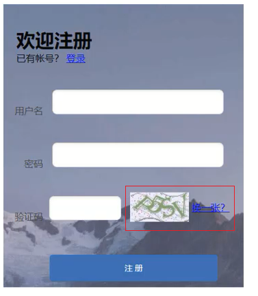

验证码的生成是通过工具类来实现的，具体的工具类参考

`04-资料\1. 登录注册案例\CheckCodeUtil.java`

在该工具类中编写main方法进行测试:

```java
public static void main(String[] args) throws IOException {
    //生成验证码的图片位置
    OutputStream fos = new FileOutputStream("d://a.jpg");
    //checkCode为最终验证码的数据
    String checkCode = CheckCodeUtil.outputVerifyImage(100, 50, fos, 4);
    System.out.println(checkCode);
}

```

生成完验证码以后，我们就可以知晓:

* 验证码就是使用Java代码生成的一张图片
* 验证码的作用:防止机器自动注册，攻击服务器

2. 实现流程分析

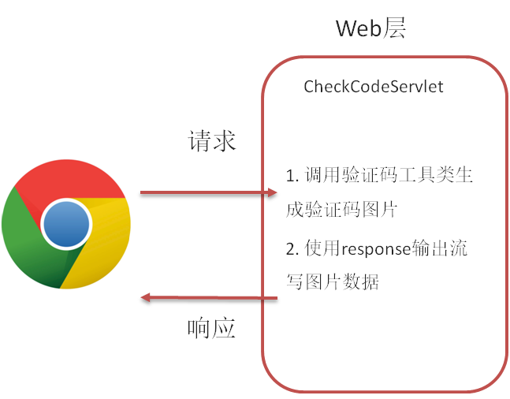

(1)前端发送请求给CheckCodeServlet

(2)CheckCodeServlet接收到请求后，生成验证码图片，将图片用Reponse对象的输出流写回到前端

思考:如何将图片写回到前端浏览器呢?

(1)Java中已经有工具类生成验证码图片，测试类中只是把图片生成到磁盘上
(2)生成磁盘的过程中使用的是OutputStream流，如何把这个图片生成在页面呢?
(3)前面在将Reponse对象的时候，它有一个方法可以获取其字节输出流，getOutputStream()
(4)综上所述，我们可以把写往磁盘的流对象更好成Response的字节流，即可完成图片响应给前端

3. 具体实现

(1)修改Register.jsp页面，将验证码的图片从后台获取

```jsp
<tr>
    <td>验证码</td>
        <td class="inputs">
        <input name="checkCode" type="text" id="checkCode">
        
        <a href="#" id="changeImg" >看不清？</a>
    </td>
</tr>

<script>
    document.getElementById("changeImg").onclick = function () {
       	//路径后面添加时间戳的目的是避免浏览器进行缓存静态资源
        document.getElementById("checkCodeImg").src = "/brand-demo/checkCodeServlet?"+new Date().getMilliseconds();
    }
</script>
```

(2)编写CheckCodeServlet类，用来接收请求生成验证码

```java
@WebServlet("/checkCodeServlet")
public class CheckCodeServlet extends HttpServlet {
    @Override
    protected void doGet(HttpServletRequest request, HttpServletResponse response) throws ServletException, IOException {
        // 生成验证码
        ServletOutputStream os = response.getOutputStream();
        String checkCode = CheckCodeUtil.outputVerifyImage(100, 50, os, 4);
    }

    @Override
    protected void doPost(HttpServletRequest request, HttpServletResponse response) throws ServletException, IOException {
        this.doGet(request, response);
    }
}
```

### 4.7验证码-校验

1. 需求

* 判断程序生成的验证码 和 用户输入的验证码 是否一样，如果不一样，则阻止注册
* 验证码图片访问和提交注册表单是==两次==请求，所以要将程序生成的验证码存入Session中

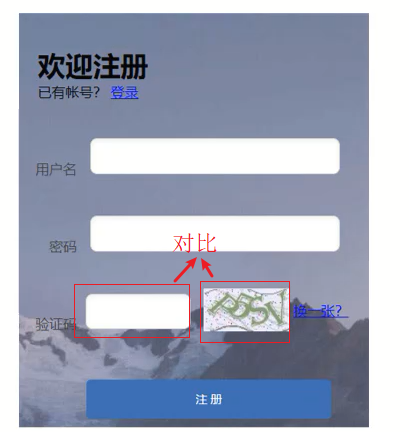

思考:为什么要把验证码数据存入到Session中呢?

* 生成验证码和校验验证码是两次请求，此处就需要在一个会话的两次请求之间共享数据
* 验证码属于安全数据类的，所以我们选中Session来存储验证码数据。

2. 实现流程分析


(1)在CheckCodeServlet中生成验证码的时候，将验证码数据存入Session对象

(2)前端将验证码和注册数据提交到后台，交给RegisterServlet类

(3)RegisterServlet类接收到请求和数据后，其中就有验证码，和Session中的验证码进行对比

(4)如果一致，则完成注册，如果不一致，则提示错误信息

3. 具体实现

(1)修改CheckCodeServlet类，将验证码存入Session对象

```java
@WebServlet("/checkCodeServlet")
public class CheckCodeServlet extends HttpServlet {
    @Override
    protected void doGet(HttpServletRequest request, HttpServletResponse response) throws ServletException, IOException {

        // 生成验证码
        ServletOutputStream os = response.getOutputStream();
        String checkCode = CheckCodeUtil.outputVerifyImage(100, 50, os, 4);

        // 存入Session
        HttpSession session = request.getSession();
        session.setAttribute("checkCodeGen",checkCode);


    }

    @Override
    protected void doPost(HttpServletRequest request, HttpServletResponse response) throws ServletException, IOException {
        this.doGet(request, response);
    }
}
```

(2)在RegisterServlet中，获取页面的和session对象中的验证码，进行对比

```java
package com.itheima.web;

import com.itheima.pojo.User;
import com.itheima.service.UserService;

import javax.servlet.ServletException;
import javax.servlet.annotation.WebServlet;
import javax.servlet.http.*;
import java.io.IOException;

@WebServlet("/registerServlet")
public class RegisterServlet extends HttpServlet {
    private UserService service = new UserService();

    @Override
    protected void doGet(HttpServletRequest request, HttpServletResponse response) throws ServletException, IOException {
       //1. 获取用户名和密码数据
        String username = request.getParameter("username");
        String password = request.getParameter("password");

        User user = new User();
        user.setUsername(username);
        user.setPassword(password);

        // 获取用户输入的验证码
        String checkCode = request.getParameter("checkCode");

        // 程序生成的验证码，从Session获取
        HttpSession session = request.getSession();
        String checkCodeGen = (String) session.getAttribute("checkCodeGen");

        // 比对
        if(!checkCodeGen.equalsIgnoreCase(checkCode)){

            request.setAttribute("register_msg","验证码错误");
            request.getRequestDispatcher("/register.jsp").forward(request,response);

            // 不允许注册
            return;
        }
        //2. 调用service 注册
        boolean flag = service.register(user);
        //3. 判断注册成功与否
        if(flag){
             //注册功能，跳转登陆页面

            request.setAttribute("register_msg","注册成功，请登录");
            request.getRequestDispatcher("/login.jsp").forward(request,response);
        }else {
            //注册失败，跳转到注册页面

            request.setAttribute("register_msg","用户名已存在");
            request.getRequestDispatcher("/register.jsp").forward(request,response);
        }


    }

    @Override
    protected void doPost(HttpServletRequest request, HttpServletResponse response) throws ServletException, IOException {
        this.doGet(request, response);
    }
}
```

至此，用户的注册登录功能就已经完成了。

# MySQL基础

**今日目标：**

> * 完成MySQL的安装及登陆基本操作
> * 能通过SQL对数据库进行CRUD
> * 能通过SQL对表进行CRUD
> * 能通过SQL对数据进行CRUD

## 1，数据库相关概念

以前我们做系统，数据持久化的存储采用的是文件存储。存储到文件中可以达到系统关闭数据不会丢失的效果，当然文件存储也有它的弊端。

假设在文件中存储以下的数据：

```
姓名	年龄	性别	住址
张三	23	男	北京西三旗
李四	24	女	北京西二旗
王五	25	男	西安软件新城
```

现要修改李四这条数据的性别数据改为男，我们现学习的IO技术可以通过将所有的数据读取到内存中，然后进行修改再存到该文件中。通过这种方式操作存在很大问题，现在只有三条数据，如果文件中存储1T的数据，那么就会发现内存根本就存储不了。

现需要既能持久化存储数据，也要能避免上述问题的技术使用在我们的系统中。数据库就是这样的一门技术。

### 1.1  数据库

* ==存储和管理数据的仓库，数据是有组织的进行存储。==

* 数据库英文名是 DataBase，简称DB。

数据库就是将数据存储在硬盘上，可以达到持久化存储的效果。那又是如何解决上述问题的？使用数据库管理系统。

### 1.2  数据库管理系统

* ==管理数据库的大型软件==
* 英文：DataBase Management System，简称 DBMS

在电脑上安装了数据库管理系统后，就可以通过数据库管理系统创建数据库来存储数据，也可以通过该系统对数据库中的数据进行数据的增删改查相关的操作。我们平时说的MySQL数据库其实是MySQL数据库管理系统。

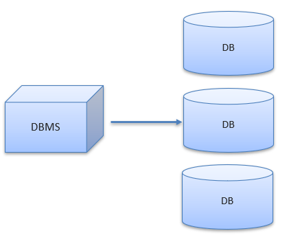

通过上面的描述，大家应该已经知道了 `数据库管理系统` 和 `数据库` 的关系。那么有有哪些常见的数据库管理系统呢？

### 1.3  常见的数据库管理系统


接下来对上面列举的数据库管理系统进行简单的介绍：

* Oracle：收费的大型数据库，Oracle 公司的产品
* ==MySQL==： 开源免费的中小型数据库。后来 Sun公司收购了 MySQL，而 Sun 公司又被 Oracle 收购
* SQL Server：MicroSoft 公司收费的中型的数据库。C#、.net 等语言常使用
* PostgreSQL：开源免费中小型的数据库
* DB2：IBM 公司的大型收费数据库产品
* SQLite：嵌入式的微型数据库。如：作为 Android 内置数据库
* MariaDB：开源免费中小型的数据库

我们课程上学习的是MySQL数据库管理系统，PostgreSQL在一些公司也有使用，此时大家肯定会想以后在公司中如果使用我们没有学习过程的PostgreSQL数据库管理系统怎么办？这点大家大可不必担心，如下图所示：

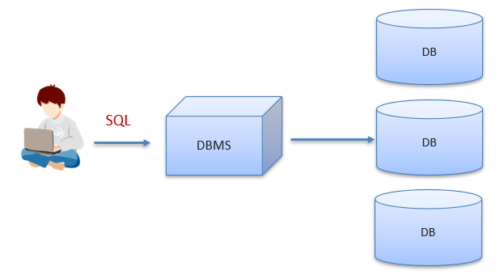

我们可以通过数据库管理系统操作数据库，对数据库中的数据进行增删改查操作，而怎么样让用户跟数据库管理系统打交道呢？就可以通过一门编程语言（SQL）来实现。

### 1.4  SQL

* 英文：Structured Query Language，简称 SQL，结构化查询语言
* 操作关系型数据库的编程语言
* 定义操作所有关系型数据库的统一标准，可以使用SQL操作所有的关系型数据库管理系统，以后工作中如果使用到了其他的数据库管理系统，也同样的使用SQL来操作。


## 2，MySQL

### 2.1  MySQL安装

> **安装环境:Win10 64位**
> **软件版本:MySQL 5.7.24 解压版**

#### 2.1.1  下载

https://downloads.mysql.com/archives/community/

点开上面的链接就能看到如下界面：


选择选择和自己**系统位数**相对应的版本点击右边的`Download`，此时会进到另一个页面，同样在接近页面底部的地方找到如下图所示的位置：


不用理会上面的登录和注册按钮，直接点击 `No thanks, just start my download.` 就可以下载。


#### 2.1.2  安装(解压)

下载完成后我们得到的是一个压缩包，将其解压，我们就可以得到MySQL 5.7.24的软件本体了(就是一个文件夹)，我们可以把它放在你想安装的位置。

------


### 2.2  MySQL卸载

如果你想卸载MySQL，也很简单。

右键开始菜单，选择`命令提示符(管理员)`，打开黑框。

1. 敲入`net stop mysql`，回车。

```
net stop mysql
```


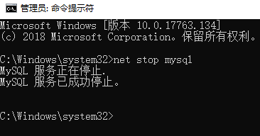

2. 再敲入`mysqld -remove mysql`，回车。

```
mysqld -remove mysql
```


3. 最后删除MySQL目录及相关的环境变量。

**至此，MySQL卸载完成！**


### 2.3  MySQL配置

#### 2.3.1  添加环境变量

> 环境变量里面有很多选项，这里我们只用到`Path`这个参数。为什么在初始化的开始要添加环境变量呢？
> 在黑框(即CMD)中输入一个可执行程序的名字，Windows会先在环境变量中的`Path`所指的路径中寻找一遍，如果找到了就直接执行，没找到就在当前工作目录找，如果还没找到，就报错。我们添加环境变量的目的就是能够在任意一个黑框直接调用MySQL中的相关程序而不用总是修改工作目录，大大简化了操作。


右键`此电脑`→`属性`，点击`高级系统设置`

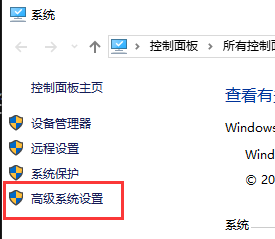

点击`环境变量`


在`系统变量`中新建MYSQL_HOME

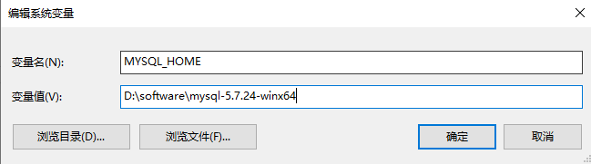

在`系统变量`中找到并**双击**`Path`

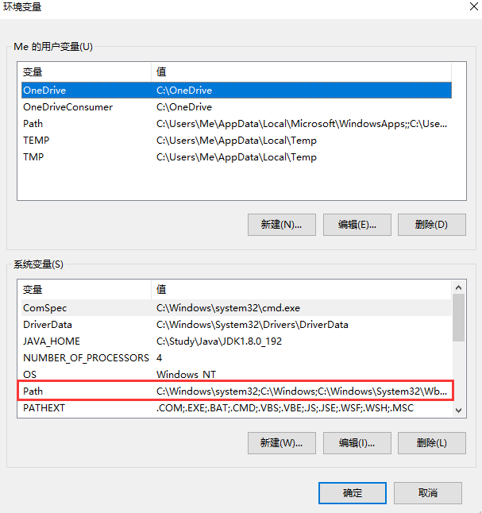

点击`新建`


最后点击确定。

**如何验证是否添加成功？**

右键开始菜单(就是屏幕左下角)，选择`命令提示符(管理员)`，打开黑框，敲入`mysql`，回车。
如果提示`Can't connect to MySQL server on 'localhost'`则证明添加成功；
如果提示`mysql不是内部或外部命令，也不是可运行的程序或批处理文件`则表示添加添加失败，请重新检查步骤并重试。

#### 2.3.2  新建配置文件

新建一个文本文件，内容如下：

```properties
[mysql]
default-character-set=utf8

[mysqld]
character-set-server=utf8
default-storage-engine=INNODB
sql_mode=STRICT_TRANS_TABLES,NO_ZERO_IN_DATE,NO_ZERO_DATE,ERROR_FOR_DIVISION_BY_ZERO,NO_AUTO_CREATE_USER,NO_ENGINE_SUBSTITUTION
```

把上面的文本文件另存为，在保存类型里选`所有文件 (*.*)`，文件名叫`my.ini`，存放的路径为MySQL的`根目录`(例如我的是`D:\software\mysql-5.7.24-winx64`,根据自己的MySQL目录位置修改)。

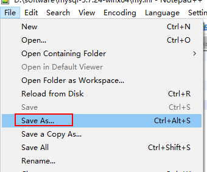

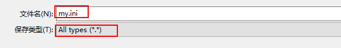

上面代码意思就是配置数据库的默认编码集为utf-8和默认存储引擎为INNODB。

#### 2.3.3  初始化MySQL

在刚才的黑框中敲入`mysqld --initialize-insecure`，回车，稍微等待一会，如果出现没有出现报错信息(如下图)则证明data目录初始化没有问题，此时再查看MySQL目录下已经有data目录生成。

```
mysqld --initialize-insecure
```

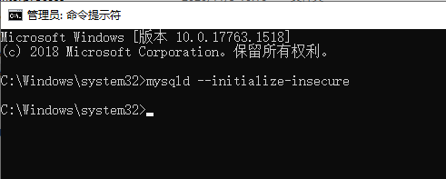


tips：如果出现如下错误

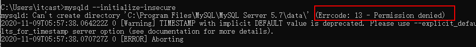

是由于权限不足导致的，去`C:\Windows\System32` 下以管理员方式运行 cmd.exe


#### 2.3.4  注册MySQL服务

在黑框里敲入`mysqld -install`，回车。

```
mysqld -install
```


现在你的计算机上已经安装好了MySQL服务了。

MySQL服务器


#### 2.3.5  启动MySQL服务

在黑框里敲入`net start mysql`，回车。

```java
net start mysql  // 启动mysql服务
    
net stop mysql  // 停止mysql服务
```


#### 2.3.6  修改默认账户密码

在黑框里敲入`mysqladmin -u root password 1234`，这里的`1234`就是指默认管理员(即root账户)的密码，可以自行修改成你喜欢的。

```
mysqladmin -u root password 1234
```


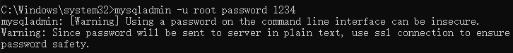

**至此，MySQL 5.7 解压版安装完毕！**


### 2.4  MySQL登陆和退出

#### 2.4.1  登陆

右键开始菜单，选择`命令提示符`，打开黑框。
在黑框中输入，`mysql -uroot -p1234`，回车，出现下图且左下角为`mysql>`，则登录成功。

```
mysql -uroot -p1234
```


**到这里你就可以开始你的MySQL之旅了！**

登陆参数：

```
mysql -u用户名 -p密码 -h要连接的mysql服务器的ip地址(默认127.0.0.1) -P端口号(默认3306)
```


#### 2.4.2  退出

退出mysql：

```
exit
quit
```


### 2.5  MySQL数据模型

**关系型数据库：**

> 关系型数据库是建立在关系模型基础上的数据库，简单说，关系型数据库是由多张能互相连接的 二维表 组成的数据库

如下图，`订单信息表` 和 `客户信息表` 都是有行有列二维表我们将这样的称为关系型数据库。

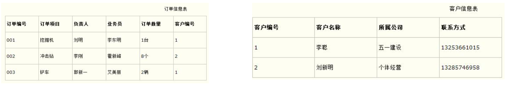

接下来看关系型数据库的优点：

* 都是使用表结构，格式一致，易于维护。
* 使用通用的 SQL 语言操作，使用方便，可用于复杂查询。
	* 关系型数据库都可以通过SQL进行操作，所以使用方便。
	* 复杂查询。现在需要查询001号订单数据，我们可以看到该订单是1号客户的订单，而1号订单是李聪这个客户。以后也可以在一张表中进行统计分析等操作。
* 数据存储在磁盘中，安全。

**数据模型：**

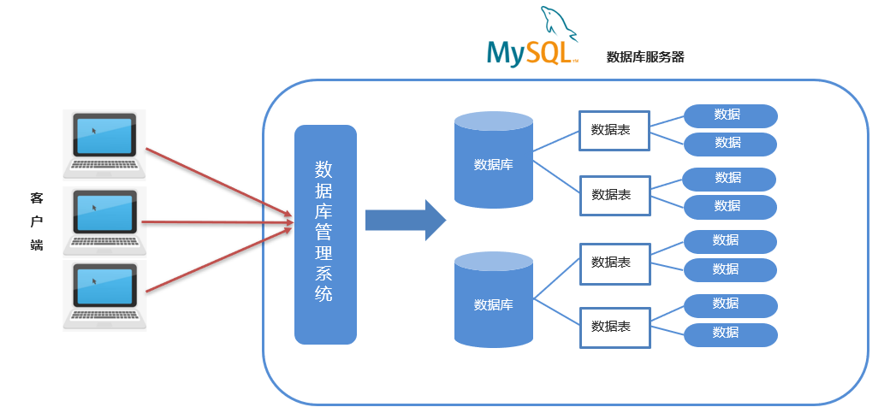

如上图，我们通过客户端可以通过数据库管理系统创建数据库，在数据库中创建表，在表中添加数据。创建的每一个数据库对应到磁盘上都是一个文件夹。比如可以通过SQL语句创建一个数据库（数据库名称为db1），语句如下。该语句咱们后面会学习。


我们可以在数据库安装目录下的data目录下看到多了一个 `db1` 的文件夹。所以，**在MySQL中一个数据库对应到磁盘上的一个文件夹。**

而一个数据库下可以创建多张表，我们到MySQL中自带的mysql数据库的文件夹目录下：


而上图中右边的 `db.frm` 是表文件，`db.MYD` 是数据文件，通过这两个文件就可以查询到数据展示成二维表的效果。

**小结：**

* MySQL中可以创建多个数据库，每个数据库对应到磁盘上的一个文件夹
* 在每个数据库中可以创建多个表，每张都对应到磁盘上一个 frm 文件
* 每张表可以存储多条数据，数据会被存储到磁盘中  MYD 文件中


## 3，SQL概述

了解了数据模型后，接下来我们就学习SQL语句，通过SQL语句对数据库、表、数据进行增删改查操作。 

### 3.1  SQL简介

* 英文：Structured Query Language，简称 SQL
* 结构化查询语言，一门操作关系型数据库的编程语言
* 定义操作所有关系型数据库的统一标准
* 对于同一个需求，每一种数据库操作的方式可能会存在一些不一样的地方，我们称为“方言”

### 3.2  通用语法

* SQL 语句可以单行或多行书写，以分号结尾。

	 

	如上，以分号结尾才是一个完整的sql语句。

* MySQL 数据库的 SQL 语句不区分大小写，关键字建议使用大写。

	同样的一条sql语句写成下图的样子，一样可以运行处结果。

	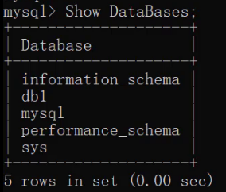 

* 注释

	* 单行注释: -- 注释内容 或 #注释内容(MySQL 特有) 

		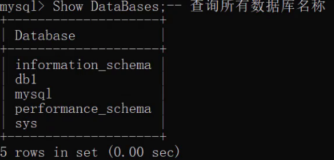 

		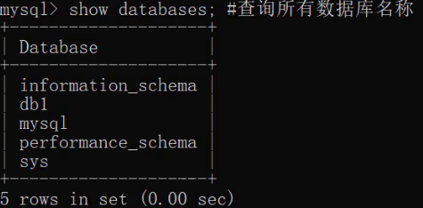 

		> 注意：使用-- 添加单行注释时，--后面一定要加空格，而#没有要求。

	* 多行注释: /* 注释 */

### 3.3  SQL分类

* DDL(Data Definition Language) ： 数据定义语言，用来定义数据库对象：数据库，表，列等

	DDL简单理解就是用来操作数据库，表等

	

* DML(Data Manipulation Language) 数据操作语言，用来对数据库中表的数据进行增删改

	DML简单理解就对表中数据进行增删改

	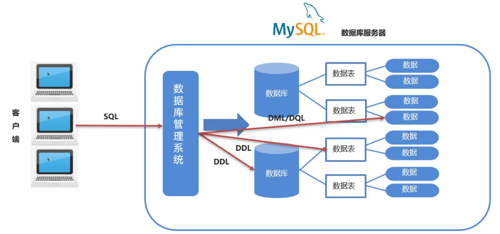

* DQL(Data Query Language) 数据查询语言，用来查询数据库中表的记录(数据)

	DQL简单理解就是对数据进行查询操作。从数据库表中查询到我们想要的数据。

* DCL(Data Control Language) 数据控制语言，用来定义数据库的访问权限和安全级别，及创建用户

	DML简单理解就是对数据库进行权限控制。比如我让某一个数据库表只能让某一个用户进行操作等。

> 注意： 以后我们最常操作的是 `DML` 和 `DQL`  ，因为我们开发中最常操作的就是数据。

## 4，DDL:操作数据库

我们先来学习DDL来操作数据库。而操作数据库主要就是对数据库的增删查操作。

### 4.1  查询

查询所有的数据库

```sql
SHOW DATABASES;
```

运行上面语句效果如下：


上述查询到的是的这些数据库是mysql安装好自带的数据库，我们以后不要操作这些数据库。

### 4.2  创建数据库

* **创建数据库**：

```sql
CREATE DATABASE 数据库名称;
```

运行语句效果如下：

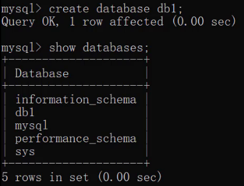

而在创建数据库的时候，我并不知道db1数据库有没有创建，直接再次创建名为db1的数据库就会出现错误。


为了避免上面的错误，在创建数据库的时候先做判断，如果不存在再创建。

* **创建数据库(判断，如果不存在则创建)**

```sql
CREATE DATABASE IF NOT EXISTS 数据库名称;
```

运行语句效果如下：


从上面的效果可以看到虽然db1数据库已经存在，再创建db1也没有报错，而创建db2数据库则创建成功。

### 4.3  删除数据库

* **删除数据库**

```sql
DROP DATABASE 数据库名称;
```

* **删除数据库(判断，如果存在则删除)**

```sql
DROP DATABASE IF EXISTS 数据库名称;
```

运行语句效果如下：


### 4.4  使用数据库

数据库创建好了，要在数据库中创建表，得先明确在哪儿个数据库中操作，此时就需要使用数据库。

* **使用数据库**

```sql
USE 数据库名称;
```

* **查看当前使用的数据库**

```sql
SELECT DATABASE();
```

运行语句效果如下：

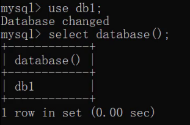

## 5，DDL:操作表

操作表也就是对表进行增（Create）删（Retrieve）改（Update）查（Delete）。

### 5.1  查询表

* **查询当前数据库下所有表名称**

```sql
SHOW TABLES;
```

我们创建的数据库中没有任何表，因此我们进入mysql自带的mysql数据库，执行上述语句查看

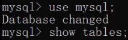

* **查询表结构**

```sql
DESC 表名称;
```

查看mysql数据库中func表的结构，运行语句如下：


### 5.2  创建表

* **创建表**

```sql
CREATE TABLE 表名 (
	字段名1  数据类型1,
	字段名2  数据类型2,
	…
	字段名n  数据类型n
);

```

> 注意：最后一行末尾，不能加逗号

知道了创建表的语句，那么我们创建创建如下结构的表

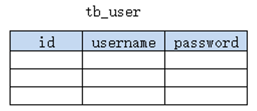

```sql
create table tb_user (
	id int,
    username varchar(20),
    password varchar(32)
);
```

运行语句如下：


### 5.3  数据类型

MySQL 支持多种类型，可以分为三类：

* 数值

	```sql
	tinyint : 小整数型，占一个字节
	int	： 大整数类型，占四个字节
		eg ： age int
	double ： 浮点类型
		使用格式： 字段名 double(总长度,小数点后保留的位数)
		eg ： score double(5,2)   
	```

* 日期

	```sql
	date ： 日期值。只包含年月日
		eg ：birthday date ： 
	datetime ： 混合日期和时间值。包含年月日时分秒
	```

* 字符串

	```sql
	char ： 定长字符串。
		优点：存储性能高
		缺点：浪费空间
		eg ： name char(10)  如果存储的数据字符个数不足10个，也会占10个的空间
	varchar ： 变长字符串。
		优点：节约空间
		缺点：存储性能底
		eg ： name varchar(10) 如果存储的数据字符个数不足10个，那就数据字符个数是几就占几个的空间	
	```

> 注意：其他类型参考资料中的《MySQL数据类型].xlsx》

**案例：**

```
需求：设计一张学生表，请注重数据类型、长度的合理性
	1. 编号
	2. 姓名，姓名最长不超过10个汉字
	3. 性别，因为取值只有两种可能，因此最多一个汉字
	4. 生日，取值为年月日
	5. 入学成绩，小数点后保留两位
	6. 邮件地址，最大长度不超过 64
	7. 家庭联系电话，不一定是手机号码，可能会出现 - 等字符
	8. 学生状态（用数字表示，正常、休学、毕业...）
```

语句设计如下：

```sql
create table student (
	id int,
    name varchar(10),
    gender char(1),
    birthday date,
    score double(5,2),
    email varchar(15),
    tel varchar(15),
    status tinyint
);
```

### 5.4  删除表

* **删除表**

```sql
DROP TABLE 表名;
```

* **删除表时判断表是否存在**

```sql
DROP TABLE IF EXISTS 表名;
```

运行语句效果如下：

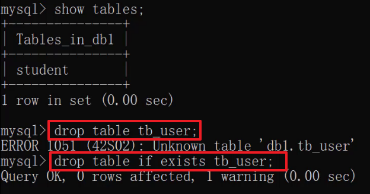

### 5.5  修改表

* **修改表名**

```sql
ALTER TABLE 表名 RENAME TO 新的表名;

-- 将表名student修改为stu
alter table student rename to stu;
```

* **添加一列**

```sql
ALTER TABLE 表名 ADD 列名 数据类型;

-- 给stu表添加一列address，该字段类型是varchar(50)
alter table stu add address varchar(50);
```

* **修改数据类型**

```sql
ALTER TABLE 表名 MODIFY 列名 新数据类型;

-- 将stu表中的address字段的类型改为 char(50)
alter table stu modify address char(50);
```

* **修改列名和数据类型**

```sql
ALTER TABLE 表名 CHANGE 列名 新列名 新数据类型;

-- 将stu表中的address字段名改为 addr，类型改为varchar(50)
alter table stu change address addr varchar(50);
```

* **删除列**

```sql
ALTER TABLE 表名 DROP 列名;

-- 将stu表中的addr字段 删除
alter table stu drop addr;
```


## 6，navicat使用

通过上面的学习，我们发现在命令行中写sql语句特别不方便，尤其是编写创建表的语句，我们只能在记事本上写好后直接复制到命令行进行执行。那么有没有刚好的工具提供给我们进行使用呢？ 有。

### 6.1  navicat概述

* Navicat for MySQL 是管理和开发 MySQL 或 MariaDB 的理想解决方案。
* 这套全面的前端工具为数据库管理、开发和维护提供了一款直观而强大的图形界面。
* 官网： [http://www.navicat.com.cn](http://www.navicat.com.cn/) 

### 6.2  navicat安装

参考 : 资料\navicat安装包\navicat_mysql_x86\navicat安装步骤.md

### 6.3  navicat使用

#### 6.3.1  建立和mysql服务的连接

第一步： 点击连接，选择MySQL


第二步：填写连接数据库必要的信息

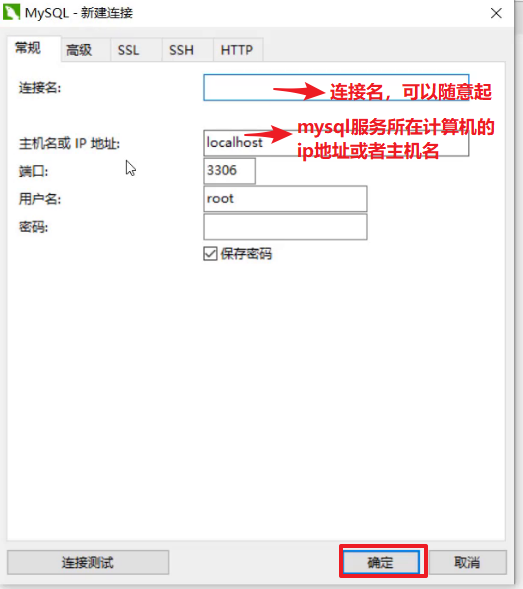

以上操作没有问题就会出现如下图所示界面：

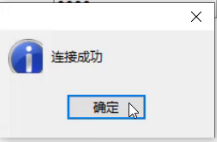

#### 6.3.2  操作

连接成功后就能看到如下图界面：

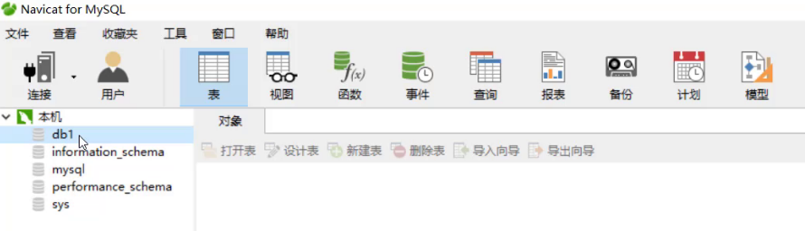

* **修改表结构**

通过下图操作修改表结构：

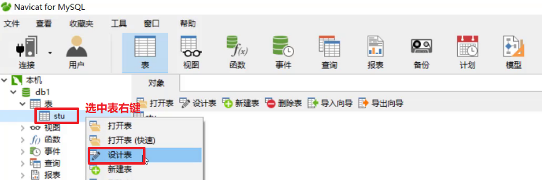

点击了设计表后即出现如下图所示界面，在图中红框中直接修改字段名，类型等信息：

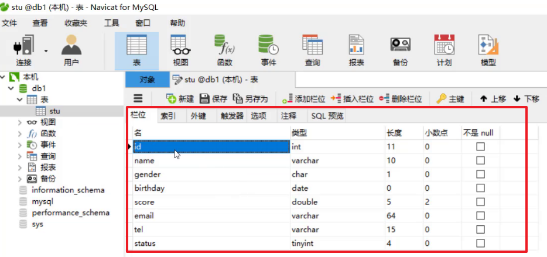

* **编写SQL语句并执行**

按照如下图所示进行操作即可书写SQL语句并执行sql语句。

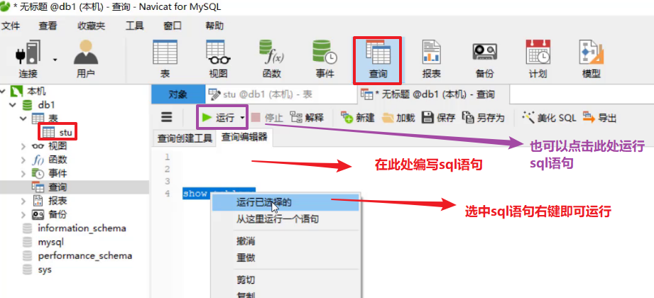

## 7，DML

DML主要是对数据进行增（insert）删（delete）改（update）操作。

### 7.1  添加数据

* **给指定列添加数据**

```sql
INSERT INTO 表名(列名1,列名2,…) VALUES(值1,值2,…);
```

* **给全部列添加数据**

```sql
INSERT INTO 表名 VALUES(值1,值2,…);
```

* **批量添加数据**

```sql
INSERT INTO 表名(列名1,列名2,…) VALUES(值1,值2,…),(值1,值2,…),(值1,值2,…)…;
INSERT INTO 表名 VALUES(值1,值2,…),(值1,值2,…),(值1,值2,…)…;
```


* **练习**

为了演示以下的增删改操作是否操作成功，故先将查询所有数据的语句介绍给大家：

```sql
select * from stu;
```


```sql
-- 给指定列添加数据
INSERT INTO stu (id, NAME) VALUES (1, '张三');
-- 给所有列添加数据，列名的列表可以省略的
INSERT INTO stu (id,NAME,sex,birthday,score,email,tel,STATUS) VALUES (2,'李四','男','1999-11-11',88.88,'lisi@itcast.cn','13888888888',1);

INSERT INTO stu VALUES (2,'李四','男','1999-11-11',88.88,'lisi@itcast.cn','13888888888',1);

-- 批量添加数据
INSERT INTO stu VALUES 
	(2,'李四','男','1999-11-11',88.88,'lisi@itcast.cn','13888888888',1),
	(2,'李四','男','1999-11-11',88.88,'lisi@itcast.cn','13888888888',1),
	(2,'李四','男','1999-11-11',88.88,'lisi@itcast.cn','13888888888',1);
```


### 7.2  修改数据

* **修改表数据**

```sql
UPDATE 表名 SET 列名1=值1,列名2=值2,… [WHERE 条件] ;
```

> 注意：
>
> 1. 修改语句中如果不加条件，则将所有数据都修改！
> 2. 像上面的语句中的中括号，表示在写sql语句中可以省略这部分


* **练习**

	*  将张三的性别改为女

		```sql
		update stu set sex = '女' where name = '张三';
		```

	* 将张三的生日改为 1999-12-12 分数改为99.99

		```sql
		update stu set birthday = '1999-12-12', score = 99.99 where name = '张三';
		```

	* 注意：如果update语句没有加where条件，则会将表中所有数据全部修改！

		```sql
		update stu set sex = '女';
		```

		上面语句的执行完后查询到的结果是：

		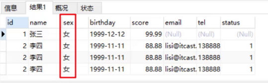


### 7.3  删除数据

* **删除数据**

```sql
DELETE FROM 表名 [WHERE 条件] ;
```

* **练习**

```sql
-- 删除张三记录
delete from stu where name = '张三';

-- 删除stu表中所有的数据
delete from stu;
```


## 8，DQL

下面是黑马程序员展示试题库数据的页面

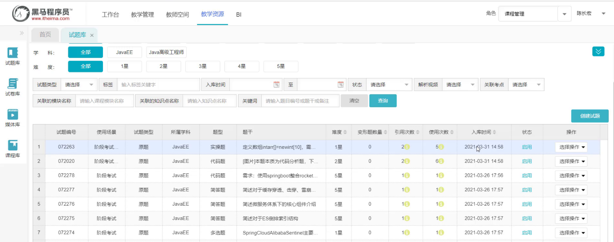

页面上展示的数据肯定是在数据库中的试题库表中进行存储，而我们需要将数据库中的数据查询出来并展示在页面给用户看。上图中的是最基本的查询效果，那么数据库其实是很多的，不可能在将所有的数据在一页进行全部展示，而页面上会有分页展示的效果，如下：

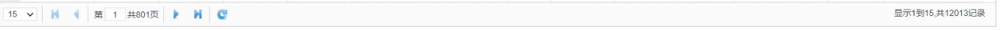

当然上图中的难度字段当我们点击也可以实现排序查询操作。从这个例子我们就可以看出，对于数据库的查询时灵活多变的，需要根据具体的需求来实现，而数据库查询操作也是最重要的操作，所以此部分需要大家重点掌握。

接下来我们先介绍查询的完整语法：

```sql
SELECT 
    字段列表
FROM 
    表名列表 
WHERE 
    条件列表
GROUP BY
    分组字段
HAVING
    分组后条件
ORDER BY
    排序字段
LIMIT
    分页限定
```

为了给大家演示查询的语句，我们需要先准备表及一些数据：

```sql
-- 删除stu表
drop table if exists stu;


-- 创建stu表
CREATE TABLE stu (
 id int, -- 编号
 name varchar(20), -- 姓名
 age int, -- 年龄
 sex varchar(5), -- 性别
 address varchar(100), -- 地址
 math double(5,2), -- 数学成绩
 english double(5,2), -- 英语成绩
 hire_date date -- 入学时间
);

-- 添加数据
INSERT INTO stu(id,NAME,age,sex,address,math,english,hire_date) 
VALUES 
(1,'马运',55,'男','杭州',66,78,'1995-09-01'),
(2,'马花疼',45,'女','深圳',98,87,'1998-09-01'),
(3,'马斯克',55,'男','香港',56,77,'1999-09-02'),
(4,'柳白',20,'女','湖南',76,65,'1997-09-05'),
(5,'柳青',20,'男','湖南',86,NULL,'1998-09-01'),
(6,'刘德花',57,'男','香港',99,99,'1998-09-01'),
(7,'张学右',22,'女','香港',99,99,'1998-09-01'),
(8,'德玛西亚',18,'男','南京',56,65,'1994-09-02');
```

接下来咱们从最基本的查询语句开始学起。

### 8.1  基础查询

#### 8.1.1  语法

* **查询多个字段**

```sql
SELECT 字段列表 FROM 表名;
SELECT * FROM 表名; -- 查询所有数据
```

* **去除重复记录**

```sql
SELECT DISTINCT 字段列表 FROM 表名;
```

* **起别名**

```sql
AS: AS 也可以省略
```


#### 8.1.2  练习

* 查询name、age两列

	```sql
	select name,age from stu;
	```

* 查询所有列的数据，列名的列表可以使用*替代

	```sql
	select * from stu;
	```

	上面语句中的\*不建议大家使用，因为在这写\*不方便我们阅读sql语句。我们写字段列表的话，可以添加注释对每一个字段进行说明

	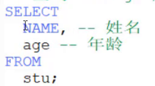

	而在上课期间为了简约课程的时间，老师很多地方都会写*。

* 查询地址信息

	```sql
	select address from stu;
	```

	执行上面语句结果如下：

	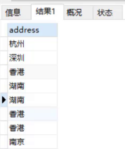

	从上面的结果我们可以看到有重复的数据，我们也可以使用 `distinct` 关键字去重重复数据。

* 去除重复记录

	```sql
	select distinct address from stu;
	```

* 查询姓名、数学成绩、英语成绩。并通过as给math和english起别名（as关键字可以省略）

	```sql
	select name,math as 数学成绩,english as 英文成绩 from stu;
	select name,math 数学成绩,english 英文成绩 from stu;
	```

	

### 8.2  条件查询

#### 8.2.1  语法

```sql
SELECT 字段列表 FROM 表名 WHERE 条件列表;
```

* **条件**

条件列表可以使用以下运算符

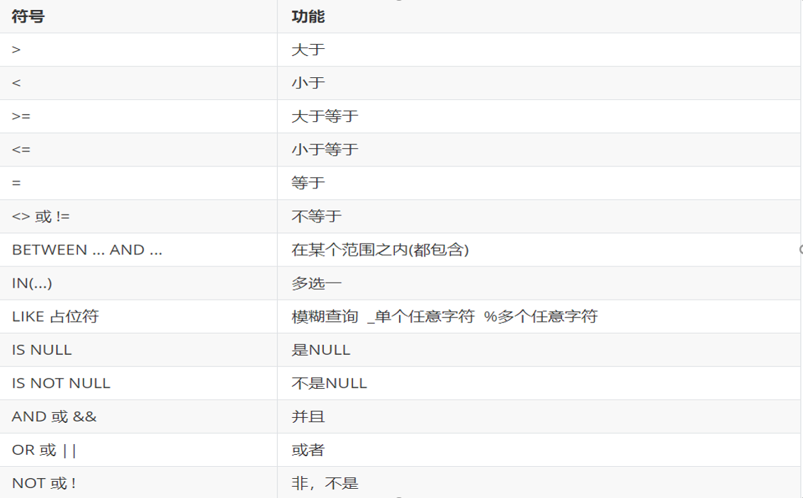

#### 8.2.2  条件查询练习

* 查询年龄大于20岁的学员信息

	```sql
	select * from stu where age > 20;
	```

* 查询年龄大于等于20岁的学员信息

	```sql
	select * from stu where age >= 20;
	```

* 查询年龄大于等于20岁 并且 年龄 小于等于 30岁 的学员信息

	```sql
	select * from stu where age >= 20 &&  age <= 30;
	select * from stu where age >= 20 and  age <= 30;
	```

	> 上面语句中 &&  和  and  都表示并且的意思。建议使用 and 。
	>
	> 也可以使用  between ... and 来实现上面需求

	```sql
	select * from stu where age BETWEEN 20 and 30;
	```

* 查询入学日期在'1998-09-01' 到 '1999-09-01'  之间的学员信息

	```sql
	select * from stu where hire_date BETWEEN '1998-09-01' and '1999-09-01';
	```

* 查询年龄等于18岁的学员信息

	```sql
	select * from stu where age = 18;
	```

* 查询年龄不等于18岁的学员信息

	```sql
	select * from stu where age != 18;
	select * from stu where age <> 18;
	```

* 查询年龄等于18岁 或者 年龄等于20岁 或者 年龄等于22岁的学员信息

	```sql
	select * from stu where age = 18 or age = 20 or age = 22;
	select * from stu where age in (18,20 ,22);
	```

* 查询英语成绩为 null的学员信息

	null值的比较不能使用 =  或者 != 。需要使用 is  或者 is not

	```sql
	select * from stu where english = null; -- 这个语句是不行的
	select * from stu where english is null;
	select * from stu where english is not null;
	```

#### 8.2.3  模糊查询练习

> 模糊查询使用like关键字，可以使用通配符进行占位:
>
> （1）_ : 代表单个任意字符
>
> （2）% : 代表任意个数字符

* 查询姓'马'的学员信息

	```sql
	select * from stu where name like '马%';
	```

* 查询第二个字是'花'的学员信息  

	```sql
	select * from stu where name like '_花%';
	```

* 查询名字中包含 '德' 的学员信息

	```sql
	select * from stu where name like '%德%';
	```

	

### 8.3  排序查询

#### 8.3.1  语法

```sql
SELECT 字段列表 FROM 表名 ORDER BY 排序字段名1 [排序方式1],排序字段名2 [排序方式2] …;
```

上述语句中的排序方式有两种，分别是：

* ASC ： 升序排列 **（默认值）**
* DESC ： 降序排列

> 注意：如果有多个排序条件，当前边的条件值一样时，才会根据第二条件进行排序


#### 8.3.2  练习

* 查询学生信息，按照年龄升序排列 

	```sql
	select * from stu order by age ;
	```

* 查询学生信息，按照数学成绩降序排列

	```sql
	select * from stu order by math desc ;
	```

* 查询学生信息，按照数学成绩降序排列，如果数学成绩一样，再按照英语成绩升序排列

	```sql
	select * from stu order by math desc , english asc ;
	```

	

### 8.4  聚合函数

#### 8.4.1  概念

 ==将一列数据作为一个整体，进行纵向计算。==

如何理解呢？假设有如下表

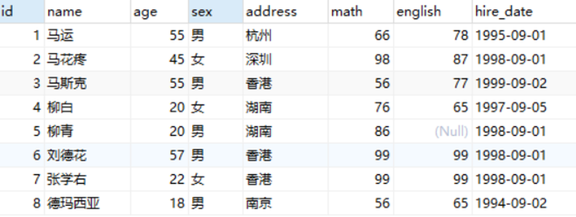

现有一需求让我们求表中所有数据的数学成绩的总和。这就是对math字段进行纵向求和。

#### 8.4.2  聚合函数分类

| 函数名      | 功能                             |
| ----------- | -------------------------------- |
| count(列名) | 统计数量（一般选用不为null的列） |
| max(列名)   | 最大值                           |
| min(列名)   | 最小值                           |
| sum(列名)   | 求和                             |
| avg(列名)   | 平均值                           |

#### 8.4.3  聚合函数语法

```sql
SELECT 聚合函数名(列名) FROM 表;
```

> 注意：null 值不参与所有聚合函数运算


#### 8.4.4  练习

* 统计班级一共有多少个学生

	```sql
	select count(id) from stu;
	select count(english) from stu;
	```

	上面语句根据某个字段进行统计，如果该字段某一行的值为null的话，将不会被统计。所以可以在count(*) 来实现。\* 表示所有字段数据，一行中也不可能所有的数据都为null，所以建议使用 count(\*)

	```sql
	select count(*) from stu;
	```

* 查询数学成绩的最高分

	```sql
	select max(math) from stu;
	```

* 查询数学成绩的最低分

	```sql
	select min(math) from stu;
	```

* 查询数学成绩的总分

	```sql
	select sum(math) from stu;
	```

* 查询数学成绩的平均分

	```sql
	select avg(math) from stu;
	```

* 查询英语成绩的最低分

	```sql
	select min(english) from stu;
	```

	

### 8.5  分组查询

#### 8.5.1  语法

```sql
SELECT 字段列表 FROM 表名 [WHERE 分组前条件限定] GROUP BY 分组字段名 [HAVING 分组后条件过滤];
```

> 注意：分组之后，查询的字段为聚合函数和分组字段，查询其他字段无任何意义


#### 8.5.2  练习

* 查询男同学和女同学各自的数学平均分

	```sql
	select sex, avg(math) from stu group by sex;
	```

	> 注意：分组之后，查询的字段为聚合函数和分组字段，查询其他字段无任何意义

	```sql
	select name, sex, avg(math) from stu group by sex;  -- 这里查询name字段就没有任何意义
	```

* 查询男同学和女同学各自的数学平均分，以及各自人数

	```sql
	select sex, avg(math),count(*) from stu group by sex;
	```

* 查询男同学和女同学各自的数学平均分，以及各自人数，要求：分数低于70分的不参与分组

	```sql
	select sex, avg(math),count(*) from stu where math > 70 group by sex;
	```

* 查询男同学和女同学各自的数学平均分，以及各自人数，要求：分数低于70分的不参与分组，分组之后人数大于2个的

	```sql
	select sex, avg(math),count(*) from stu where math > 70 group by sex having count(*)  > 2;
	```

	

**where 和 having 区别：**

* 执行时机不一样：where 是分组之前进行限定，不满足where条件，则不参与分组，而having是分组之后对结果进行过滤。

* 可判断的条件不一样：where 不能对聚合函数进行判断，having 可以。


### 8.6  分页查询

如下图所示，大家在很多网站都见过类似的效果，如京东、百度、淘宝等。分页查询是将数据一页一页的展示给用户看，用户也可以通过点击查看下一页的数据。

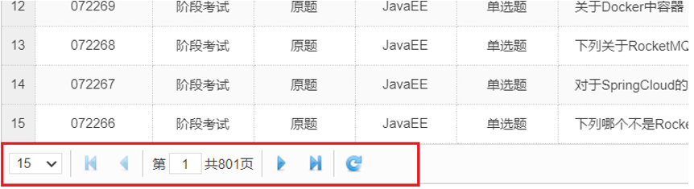

接下来我们先说分页查询的语法。

#### 8.6.1  语法

```sql
SELECT 字段列表 FROM 表名 LIMIT  起始索引 , 查询条目数;
```

> 注意： 上述语句中的起始索引是从0开始


#### 8.6.2  练习

* 从0开始查询，查询3条数据

	```sql
	select * from stu limit 0 , 3;
	```

* 每页显示3条数据，查询第1页数据

	```sql
	select * from stu limit 0 , 3;
	```

* 每页显示3条数据，查询第2页数据

	```sql
	select * from stu limit 3 , 3;
	```

* 每页显示3条数据，查询第3页数据

	```sql
	select * from stu limit 6 , 3;
	```

从上面的练习推导出起始索引计算公式：

```sql
起始索引 = (当前页码 - 1) * 每页显示的条数
```

# mysql高级

**今日目标**

> * 掌握约束的使用
>
> * 掌握表关系及建表原则
>
> * 重点掌握多表查询操作
> * 掌握事务操作

## 1，约束


上面表中可以看到表中数据存在一些问题：

* id 列一般是用标示数据的唯一性的，而上述表中的id为1的有三条数据，并且 `马花疼` 没有id进行标示
* `柳白` 这条数据的age列的数据是3000，而人也不可能活到3000岁
* `马运`  这条数据的math数学成绩是-5，而数学学得再不好也不可能出现负分

* `柳青` 这条数据的english列（英文成绩）值为null，而成绩即使没考也得是0分

针对上述数据问题，我们就可以从数据库层面在添加数据的时候进行限制，这个就是约束。

### 1.1  概念

* 约束是作用于表中列上的规则，用于限制加入表的数据

	例如：我们可以给id列加约束，让其值不能重复，不能为null值。

* 约束的存在保证了数据库中数据的正确性、有效性和完整性

	添加约束可以在添加数据的时候就限制不正确的数据，年龄是3000，数学成绩是-5分这样无效的数据，继而保障数据的完整性。

### 1.2  分类

*  **非空约束： 关键字是 NOT NULL**

	保证列中所有的数据不能有null值。

	例如：id列在添加 `马花疼` 这条数据时就不能添加成功。

* **唯一约束：关键字是  UNIQUE**

	保证列中所有数据各不相同。

	例如：id列中三条数据的值都是1，这样的数据在添加时是绝对不允许的。

*  **主键约束： 关键字是  PRIMARY KEY**

	主键是一行数据的唯一标识，要求非空且唯一。一般我们都会给没张表添加一个主键列用来唯一标识数据。

	例如：上图表中id就可以作为主键，来标识每条数据。那么这样就要求数据中id的值不能重复，不能为null值。

* **检查约束： 关键字是  CHECK** 

	保证列中的值满足某一条件。

	例如：我们可以给age列添加一个范围，最低年龄可以设置为1，最大年龄就可以设置为300，这样的数据才更合理些。

	> 注意：MySQL不支持检查约束。
	>
	> 这样是不是就没办法保证年龄在指定的范围内了？从数据库层面不能保证，以后可以在java代码中进行限制，一样也可以实现要求。

* **默认约束： 关键字是   DEFAULT**

	保存数据时，未指定值则采用默认值。

	例如：我们在给english列添加该约束，指定默认值是0，这样在添加数据时没有指定具体值时就会采用默认给定的0。

* **外键约束： 关键字是  FOREIGN KEY**

	外键用来让两个表的数据之间建立链接，保证数据的一致性和完整性。

	外键约束现在可能还不太好理解，后面我们会重点进行讲解。

### 1.3  非空约束

* 概念

	非空约束用于保证列中所有数据不能有NULL值

* 语法

	* 添加约束

		```sql
		-- 创建表时添加非空约束
		CREATE TABLE 表名(
		   列名 数据类型 NOT NULL,
		   …
		); 
		
		```

		```sql
		-- 建完表后添加非空约束
		ALTER TABLE 表名 MODIFY 字段名 数据类型 NOT NULL;
		```

	* 删除约束

		```sql
		ALTER TABLE 表名 MODIFY 字段名 数据类型;
		```

### 1.4  唯一约束

* 概念

	唯一约束用于保证列中所有数据各不相同

* 语法

	* 添加约束

		```sql
		-- 创建表时添加唯一约束
		CREATE TABLE 表名(
		   列名 数据类型 UNIQUE [AUTO_INCREMENT],
		   -- AUTO_INCREMENT: 当不指定值时自动增长
		   …
		); 
		CREATE TABLE 表名(
		   列名 数据类型,
		   …
		   [CONSTRAINT] [约束名称] UNIQUE(列名)
		); 
		```

		```sql
		-- 建完表后添加唯一约束
		ALTER TABLE 表名 MODIFY 字段名 数据类型 UNIQUE;
		```

	* 删除约束

		```sql
		ALTER TABLE 表名 DROP INDEX 字段名;
		```

### 1.5  主键约束

* 概念

	主键是一行数据的唯一标识，要求非空且唯一

	一张表只能有一个主键

* 语法

	* 添加约束

		```sql
		-- 创建表时添加主键约束
		CREATE TABLE 表名(
		   列名 数据类型 PRIMARY KEY [AUTO_INCREMENT],
		   …
		); 
		CREATE TABLE 表名(
		   列名 数据类型,
		   [CONSTRAINT] [约束名称] PRIMARY KEY(列名)
		); 
		
		```

		```sql
		-- 建完表后添加主键约束
		ALTER TABLE 表名 ADD PRIMARY KEY(字段名);
		```

	* 删除约束

		```sql
		ALTER TABLE 表名 DROP PRIMARY KEY;
		```

### 1.6  默认约束

* 概念

	保存数据时，未指定值则采用默认值

* 语法

	* 添加约束

		```sql
		-- 创建表时添加默认约束
		CREATE TABLE 表名(
		   列名 数据类型 DEFAULT 默认值,
		   …
		); 
		```

		```sql
		-- 建完表后添加默认约束
		ALTER TABLE 表名 ALTER 列名 SET DEFAULT 默认值;
		```

	* 删除约束

		```sql
		ALTER TABLE 表名 ALTER 列名 DROP DEFAULT;
		```

### 1.7  约束练习

**根据需求，为表添加合适的约束**

```sql
-- 员工表
CREATE TABLE emp (
	id INT,  -- 员工id，主键且自增长
    ename VARCHAR(50), -- 员工姓名，非空且唯一
    joindate DATE,  -- 入职日期，非空
    salary DOUBLE(7,2),  -- 工资，非空
    bonus DOUBLE(7,2)  -- 奖金，如果没有将近默认为0
);
```

上面一定给出了具体的要求，我们可以根据要求创建这张表，并为每一列添加对应的约束。建表语句如下：

```sql
DROP TABLE IF EXISTS emp;

-- 员工表
CREATE TABLE emp (
  id INT PRIMARY KEY, -- 员工id，主键且自增长
  ename VARCHAR(50) NOT NULL UNIQUE, -- 员工姓名，非空并且唯一
  joindate DATE NOT NULL , -- 入职日期，非空
  salary DOUBLE(7,2) NOT NULL , -- 工资，非空
  bonus DOUBLE(7,2) DEFAULT 0 -- 奖金，如果没有奖金默认为0
);
```

通过上面语句可以创建带有约束的 `emp` 表，约束能不能发挥作用呢。接下来我们一一进行验证，先添加一条没有问题的数据

```sql
INSERT INTO emp(id,ename,joindate,salary,bonus) values(1,'张三','1999-11-11',8800,5000);
```

* **验证主键约束，非空且唯一**

```sql
INSERT INTO emp(id,ename,joindate,salary,bonus) values(null,'张三','1999-11-11',8800,5000);
```

执行结果如下：

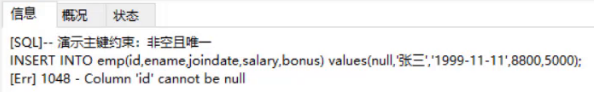

从上面的结果可以看到，字段 `id` 不能为null。那我们重新添加一条数据，如下：

```sql
INSERT INTO emp(id,ename,joindate,salary,bonus) values(1,'张三','1999-11-11',8800,5000);
```

执行结果如下：

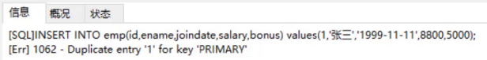

从上面结果可以看到，1这个值重复了。所以主键约束是用来限制数据非空且唯一的。那我们再添加一条符合要求的数据

```sql
INSERT INTO emp(id,ename,joindate,salary,bonus) values(2,'李四','1999-11-11',8800,5000);
```

执行结果如下：

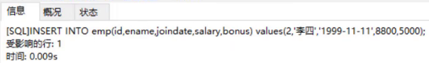

* **验证非空约束**

```sql
INSERT INTO emp(id,ename,joindate,salary,bonus) values(3,null,'1999-11-11',8800,5000);
```

执行结果如下：

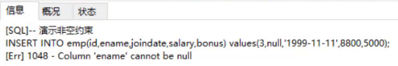

从上面结果可以看到，`ename` 字段的非空约束生效了。

* **验证唯一约束**

```sql
INSERT INTO emp(id,ename,joindate,salary,bonus) values(3,'李四','1999-11-11',8800,5000);
```

执行结果如下：

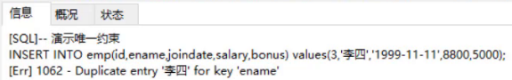

从上面结果可以看到，`ename` 字段的唯一约束生效了。

* **验证默认约束**

```sql
INSERT INTO emp(id,ename,joindate,salary) values(3,'王五','1999-11-11',8800);
```

执行完上面语句后查询表中数据，如下图可以看到王五这条数据的bonus列就有了默认值0。


==注意：默认约束只有在不给值时才会采用默认值。如果给了null，那值就是null值。==

如下：

```sql
INSERT INTO emp(id,ename,joindate,salary,bonus) values(4,'赵六','1999-11-11',8800,null);
```

执行完上面语句后查询表中数据，如下图可以看到赵六这条数据的bonus列的值是null。

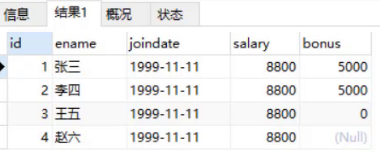

* **验证自动增长： auto_increment  当列是数字类型 并且唯一约束**

重新创建 `emp` 表，并给id列添加自动增长

```sql
-- 员工表
CREATE TABLE emp (
  id INT PRIMARY KEY auto_increment, -- 员工id，主键且自增长
  ename VARCHAR(50) NOT NULL UNIQUE, -- 员工姓名，非空并且唯一
  joindate DATE NOT NULL , -- 入职日期，非空
  salary DOUBLE(7,2) NOT NULL , -- 工资，非空
  bonus DOUBLE(7,2) DEFAULT 0 -- 奖金，如果没有奖金默认为0
);
```

接下来给emp添加数据，分别验证不给id列添加值以及给id列添加null值，id列的值会不会自动增长：

```sql
INSERT INTO emp(ename,joindate,salary,bonus) values('赵六','1999-11-11',8800,null);
INSERT INTO emp(id,ename,joindate,salary,bonus) values(null,'赵六2','1999-11-11',8800,null);
INSERT INTO emp(id,ename,joindate,salary,bonus) values(null,'赵六3','1999-11-11',8800,null);
```


### 1.8  外键约束

#### 1.8.1  概述

外键用来让两个表的数据之间建立链接，保证数据的一致性和完整性。

如何理解上面的概念呢？如下图有两张表，员工表和部门表：


员工表中的dep_id字段是部门表的id字段关联，也就是说1号学生张三属于1号部门研发部的员工。现在我要删除1号部门，就会出现错误的数据（员工表中属于1号部门的数据）。而我们上面说的两张表的关系只是我们认为它们有关系，此时需要通过外键让这两张表产生数据库层面的关系，这样你要删除部门表中的1号部门的数据将无法删除。

#### 1.8.2  语法

* 添加外键约束

```sql
-- 创建表时添加外键约束
CREATE TABLE 表名(
   列名 数据类型,
   …
   [CONSTRAINT] [外键名称] FOREIGN KEY(外键列名) REFERENCES 主表(主表列名) 
); 
```

```sql
-- 建完表后添加外键约束
ALTER TABLE 表名 ADD CONSTRAINT 外键名称 FOREIGN KEY (外键字段名称) REFERENCES 主表名称(主表列名称);
```

* 删除外键约束

```sql
ALTER TABLE 表名 DROP FOREIGN KEY 外键名称;
```


#### 1.8.3  练习

根据上述语法创建员工表和部门表，并添加上外键约束：

```sql
-- 删除表
DROP TABLE IF EXISTS emp;
DROP TABLE IF EXISTS dept;

-- 部门表
CREATE TABLE dept(
	id int primary key auto_increment,
	dep_name varchar(20),
	addr varchar(20)
);
-- 员工表 
CREATE TABLE emp(
	id int primary key auto_increment,
	name varchar(20),
	age int,
	dep_id int,

	-- 添加外键 dep_id,关联 dept 表的id主键
	CONSTRAINT fk_emp_dept FOREIGN KEY(dep_id) REFERENCES dept(id)	
);
```

添加数据

```sql
-- 添加 2 个部门
insert into dept(dep_name,addr) values
('研发部','广州'),('销售部', '深圳');

-- 添加员工,dep_id 表示员工所在的部门
INSERT INTO emp (NAME, age, dep_id) VALUES 
('张三', 20, 1),
('李四', 20, 1),
('王五', 20, 1),
('赵六', 20, 2),
('孙七', 22, 2),
('周八', 18, 2);
```

此时删除 `研发部` 这条数据，会发现无法删除。

删除外键

```sql
alter table emp drop FOREIGN key fk_emp_dept;
```

重新添加外键

```sql
alter table emp add CONSTRAINT fk_emp_dept FOREIGN key(dep_id) REFERENCES dept(id);
```


## 2，数据库设计

### 2.1  数据库设计简介

* 软件的研发步骤

	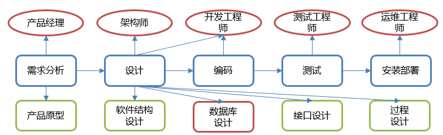

* 数据库设计概念

	* 数据库设计就是根据业务系统的具体需求，结合我们所选用的DBMS，为这个业务系统构造出最优的数据存储模型。
	* 建立数据库中的==表结构==以及==表与表之间的关联关系==的过程。
	* 有哪些表？表里有哪些字段？表和表之间有什么关系？

* 数据库设计的步骤

	* 需求分析（数据是什么? 数据具有哪些属性? 数据与属性的特点是什么）

	* 逻辑分析（通过ER图对数据库进行逻辑建模，不需要考虑我们所选用的数据库管理系统）

		如下图就是ER(Entity/Relation)图：

		

	* 物理设计（根据数据库自身的特点把逻辑设计转换为物理设计）

	* 维护设计（1.对新的需求进行建表；2.表优化）

* 表关系

	* 一对一

		* 如：用户 和 用户详情
		* 一对一关系多用于表拆分，将一个实体中经常使用的字段放一张表，不经常使用的字段放另一张表，用于提升查询性能

		

		上图左边是用户的详细信息，而我们真正在展示用户信息时最长用的则是上图右边红框所示，所以我们会将详细信息查分成两周那个表。

	* 一对多

		* 如：部门 和 员工

		* 一个部门对应多个员工，一个员工对应一个部门。如下图：

			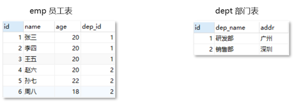

	* 多对多

		* 如：商品 和 订单

		* 一个商品对应多个订单，一个订单包含多个商品。如下图：

			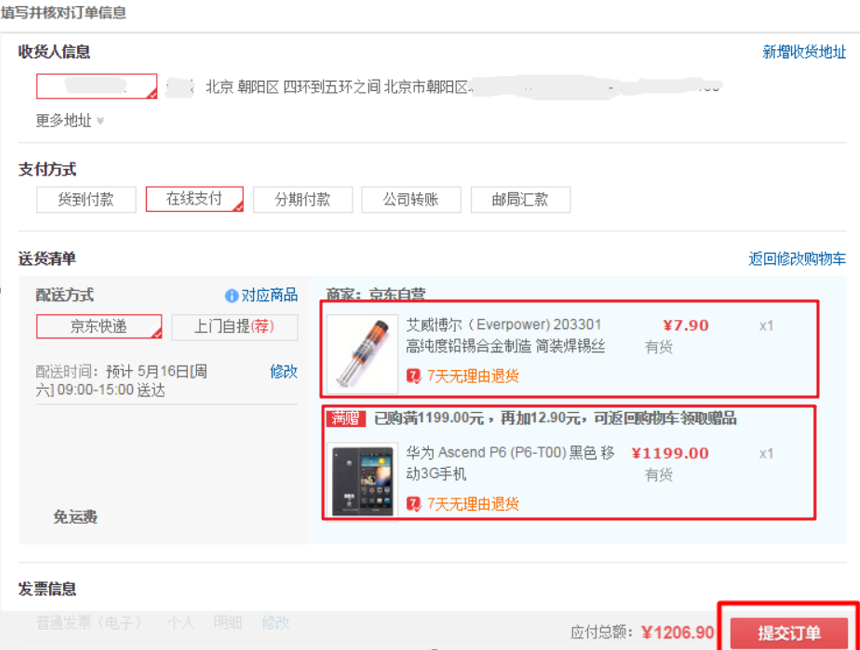

### 2.2  表关系(一对多)

* 一对多

	* 如：部门 和 员工
	* 一个部门对应多个员工，一个员工对应一个部门。

* 实现方式

	==在多的一方建立外键，指向一的一方的主键==

* 案例

	我们还是以 `员工表` 和 `部门表` 举例:

	

	经过分析发现，员工表属于多的一方，而部门表属于一的一方，此时我们会在员工表中添加一列（dep_id），指向于部门表的主键（id）：

	

	建表语句如下：

	```sql
	-- 删除表
	DROP TABLE IF EXISTS tb_emp;
	DROP TABLE IF EXISTS tb_dept;
	
	-- 部门表
	CREATE TABLE tb_dept(
		id int primary key auto_increment,
		dep_name varchar(20),
		addr varchar(20)
	);
	-- 员工表 
	CREATE TABLE tb_emp(
		id int primary key auto_increment,
		name varchar(20),
		age int,
		dep_id int,
	
		-- 添加外键 dep_id,关联 dept 表的id主键
		CONSTRAINT fk_emp_dept FOREIGN KEY(dep_id) REFERENCES tb_dept(id)	
	);
	```

	查看表结构模型图：

	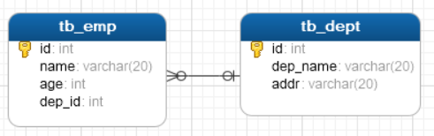

### 2.3  表关系(多对多)

* 多对多

	* 如：商品 和 订单
	* 一个商品对应多个订单，一个订单包含多个商品

* 实现方式

	==建立第三张中间表，中间表至少包含两个外键，分别关联两方主键==

* 案例

	我们以 `订单表` 和 `商品表` 举例：

	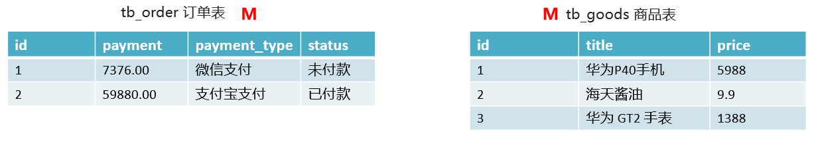

	经过分析发现，订单表和商品表都属于多的一方，此时需要创建一个中间表，在中间表中添加订单表的外键和商品表的外键指向两张表的主键：

	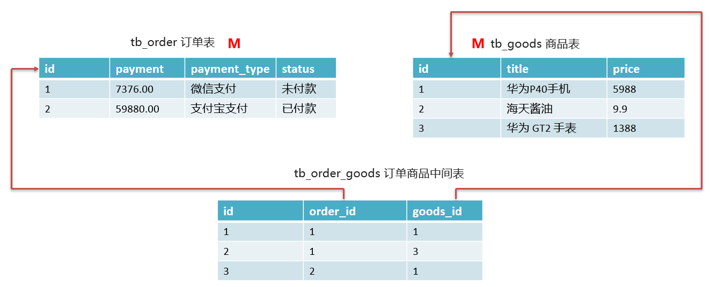

	建表语句如下：

	```sql
	-- 删除表
	DROP TABLE IF EXISTS tb_order_goods;
	DROP TABLE IF EXISTS tb_order;
	DROP TABLE IF EXISTS tb_goods;
	
	-- 订单表
	CREATE TABLE tb_order(
		id int primary key auto_increment,
		payment double(10,2),
		payment_type TINYINT,
		status TINYINT
	);
	
	-- 商品表
	CREATE TABLE tb_goods(
		id int primary key auto_increment,
		title varchar(100),
		price double(10,2)
	);
	
	-- 订单商品中间表
	CREATE TABLE tb_order_goods(
		id int primary key auto_increment,
		order_id int,
		goods_id int,
		count int
	);
	
	-- 建完表后，添加外键
	alter table tb_order_goods add CONSTRAINT fk_order_id FOREIGN key(order_id) REFERENCES tb_order(id);
	alter table tb_order_goods add CONSTRAINT fk_goods_id FOREIGN key(goods_id) REFERENCES tb_goods(id);
	```

	查看表结构模型图：

	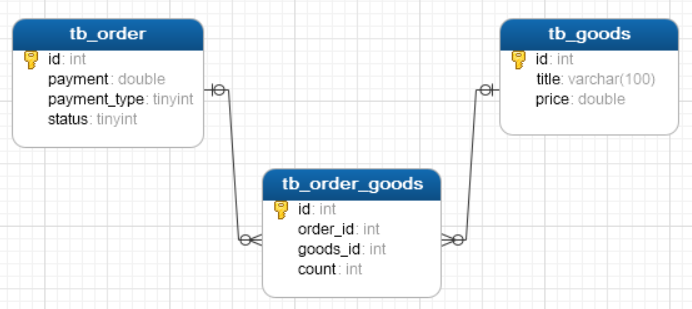

### 2.4  表关系(一对一)

* 一对一

	* 如：用户 和 用户详情
	* 一对一关系多用于表拆分，将一个实体中经常使用的字段放一张表，不经常使用的字段放另一张表，用于提升查询性能

* 实现方式

	==在任意一方加入外键，关联另一方主键，并且设置外键为唯一(UNIQUE)==

* 案例

	我们以 `用户表` 举例：

	

	而在真正使用过程中发现 id、photo、nickname、age、gender 字段比较常用，此时就可以将这张表查分成两张表。

​	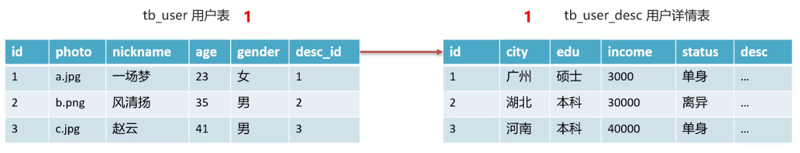

​	

​	建表语句如下：

```sql
create table tb_user_desc (
	id int primary key auto_increment,
	city varchar(20),
	edu varchar(10),
	income int,
	status char(2),
	des varchar(100)
);

create table tb_user (
	id int primary key auto_increment,
	photo varchar(100),
	nickname varchar(50),
	age int,
	gender char(1),
	desc_id int unique,
	-- 添加外键
	CONSTRAINT fk_user_desc FOREIGN KEY(desc_id) REFERENCES tb_user_desc(id)	
);
```

​	查看表结构模型图：


### 2.5  数据库设计案例

根据下图设计表及表和表之间的关系：


经过分析，我们分为 `专辑表`  `曲目表`  `短评表`  `用户表`   4张表。

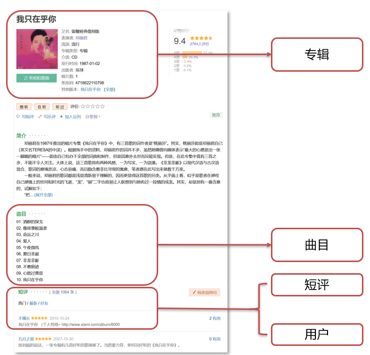

一个专辑可以有多个曲目，一个曲目只能属于某一张专辑，所以专辑表和曲目表的关系是==一对多==。

一个专辑可以被多个用户进行评论，一个用户可以对多个专辑进行评论，所以专辑表和用户表的关系是 ==多对多==。

一个用户可以发多个短评，一个短评只能是某一个人发的，所以用户表和短评表的关系是 ==一对多==。

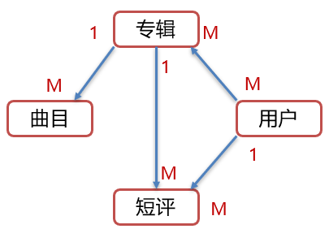


## 3，多表查询

多表查询顾名思义就是从多张表中一次性的查询出我们想要的数据。我们通过具体的sql给他们演示，先准备环境

```sql
DROP TABLE IF EXISTS emp;
DROP TABLE IF EXISTS dept;


# 创建部门表
	CREATE TABLE dept(
        did INT PRIMARY KEY AUTO_INCREMENT,
        dname VARCHAR(20)
    );

	# 创建员工表
	CREATE TABLE emp (
        id INT PRIMARY KEY AUTO_INCREMENT,
        NAME VARCHAR(10),
        gender CHAR(1), -- 性别
        salary DOUBLE, -- 工资
        join_date DATE, -- 入职日期
        dep_id INT,
        FOREIGN KEY (dep_id) REFERENCES dept(did) -- 外键，关联部门表(部门表的主键)
    );
	-- 添加部门数据
	INSERT INTO dept (dNAME) VALUES ('研发部'),('市场部'),('财务部'),('销售部');
	-- 添加员工数据
	INSERT INTO emp(NAME,gender,salary,join_date,dep_id) VALUES
	('孙悟空','男',7200,'2013-02-24',1),
	('猪八戒','男',3600,'2010-12-02',2),
	('唐僧','男',9000,'2008-08-08',2),
	('白骨精','女',5000,'2015-10-07',3),
	('蜘蛛精','女',4500,'2011-03-14',1),
	('小白龙','男',2500,'2011-02-14',null);	
```

执行下面的多表查询语句

```sql
select * from emp , dept;  -- 从emp和dept表中查询所有的字段数据
```

结果如下：

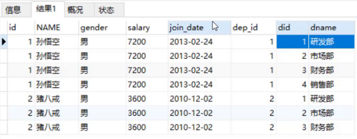

从上面的结果我们看到有一些无效的数据，如 `孙悟空` 这个员工属于1号部门，但也同时关联的2、3、4号部门。所以我们要通过限制员工表中的 `dep_id` 字段的值和部门表 `did` 字段的值相等来消除这些无效的数据，

```sql
select * from emp , dept where emp.dep_id = dept.did;
```

执行后结果如下：

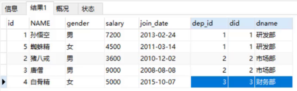

上面语句就是连接查询，那么多表查询都有哪些呢？

* 连接查询

	 

	* 内连接查询 ：相当于查询AB交集数据
	* 外连接查询
		* 左外连接查询 ：相当于查询A表所有数据和交集部门数据
		* 右外连接查询 ： 相当于查询B表所有数据和交集部分数据

* 子查询

### 3.1  内连接查询

* 语法

```sql
-- 隐式内连接
SELECT 字段列表 FROM 表1,表2… WHERE 条件;

-- 显示内连接
SELECT 字段列表 FROM 表1 [INNER] JOIN 表2 ON 条件;
```

> 内连接相当于查询 A B 交集数据


* 案例

	* 隐式内连接

		```sql
		SELECT
			*
		FROM
			emp,
			dept
		WHERE
			emp.dep_id = dept.did;
		```

		执行上述语句结果如下：

		

	* 查询 emp的 name， gender，dept表的dname

		```sql
		SELECT
			emp. NAME,
			emp.gender,
			dept.dname
		FROM
			emp,
			dept
		WHERE
			emp.dep_id = dept.did;
		```

		执行语句结果如下：

		

		上面语句中使用表名指定字段所属有点麻烦，sql也支持给表指别名，上述语句可以改进为

		```sql
		SELECT
			t1. NAME,
			t1.gender,
			t2.dname
		FROM
			emp t1,
			dept t2
		WHERE
			t1.dep_id = t2.did;
		```

	* 显式内连接

		```sql
		select * from emp inner join dept on emp.dep_id = dept.did;
		-- 上面语句中的inner可以省略，可以书写为如下语句
		select * from emp  join dept on emp.dep_id = dept.did;
		```

		执行结果如下：

		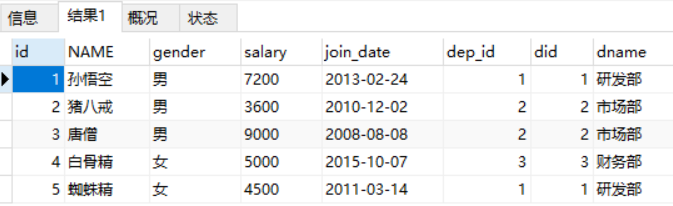

### 3.2  外连接查询

* 语法

	```sql
	-- 左外连接
	SELECT 字段列表 FROM 表1 LEFT [OUTER] JOIN 表2 ON 条件;
	
	-- 右外连接
	SELECT 字段列表 FROM 表1 RIGHT [OUTER] JOIN 表2 ON 条件;
	```

	> 左外连接：相当于查询A表所有数据和交集部分数据
	>
	> 右外连接：相当于查询B表所有数据和交集部分数据

	

* 案例

	* 查询emp表所有数据和对应的部门信息（左外连接）

		```sql
		select * from emp left join dept on emp.dep_id = dept.did;
		```

		执行语句结果如下：

		

		结果显示查询到了左表（emp）中所有的数据及两张表能关联的数据。

	* 查询dept表所有数据和对应的员工信息（右外连接）

		```sql
		select * from emp right join dept on emp.dep_id = dept.did;
		```

		执行语句结果如下：

		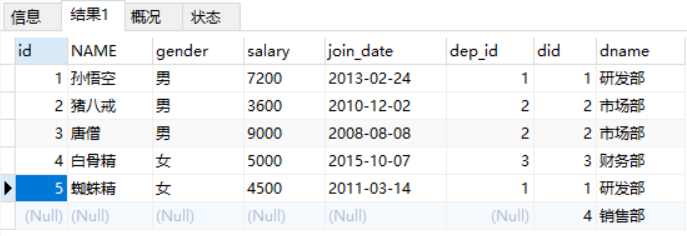

		结果显示查询到了右表（dept）中所有的数据及两张表能关联的数据。

		要查询出部门表中所有的数据，也可以通过左外连接实现，只需要将两个表的位置进行互换：

		```sql
		select * from dept left join emp on emp.dep_id = dept.did;
		```

		

### 3.3  子查询

* 概念

	==查询中嵌套查询，称嵌套查询为子查询。==

	什么是查询中嵌套查询呢？我们通过一个例子来看：

	**需求：查询工资高于猪八戒的员工信息。**

	来实现这个需求，我们就可以通过二步实现，第一步：先查询出来 猪八戒的工资

	```sql
	select salary from emp where name = '猪八戒'
	```

	 第二步：查询工资高于猪八戒的员工信息

	```sql
	select * from emp where salary > 3600;
	```

	第二步中的3600可以通过第一步的sql查询出来，所以将3600用第一步的sql语句进行替换

	```sql
	select * from emp where salary > (select salary from emp where name = '猪八戒');
	```

	这就是查询语句中嵌套查询语句。

* 子查询根据查询结果不同，作用不同

	* 子查询语句结果是单行单列，子查询语句作为条件值，使用 =  !=  >  <  等进行条件判断
	* 子查询语句结果是多行单列，子查询语句作为条件值，使用 in 等关键字进行条件判断
	* 子查询语句结果是多行多列，子查询语句作为虚拟表

* 案例

	* 查询 '财务部' 和 '市场部' 所有的员工信息

		```sql
		-- 查询 '财务部' 或者 '市场部' 所有的员工的部门did
		select did from dept where dname = '财务部' or dname = '市场部';
		
		select * from emp where dep_id in (select did from dept where dname = '财务部' or dname = '市场部');
		```

	* 查询入职日期是 '2011-11-11' 之后的员工信息和部门信息

		```sql
		-- 查询入职日期是 '2011-11-11' 之后的员工信息
		select * from emp where join_date > '2011-11-11' ;
		-- 将上面语句的结果作为虚拟表和dept表进行内连接查询
		select * from (select * from emp where join_date > '2011-11-11' ) t1, dept where t1.dep_id = dept.did;
		```


### 3.4  案例

* 环境准备：

```sql
DROP TABLE IF EXISTS emp;
DROP TABLE IF EXISTS dept;
DROP TABLE IF EXISTS job;
DROP TABLE IF EXISTS salarygrade;

-- 部门表
CREATE TABLE dept (
  did INT PRIMARY KEY PRIMARY KEY, -- 部门id
  dname VARCHAR(50), -- 部门名称
  loc VARCHAR(50) -- 部门所在地
);

-- 职务表，职务名称，职务描述
CREATE TABLE job (
  id INT PRIMARY KEY,
  jname VARCHAR(20),
  description VARCHAR(50)
);

-- 员工表
CREATE TABLE emp (
  id INT PRIMARY KEY, -- 员工id
  ename VARCHAR(50), -- 员工姓名
  job_id INT, -- 职务id
  mgr INT , -- 上级领导
  joindate DATE, -- 入职日期
  salary DECIMAL(7,2), -- 工资
  bonus DECIMAL(7,2), -- 奖金
  dept_id INT, -- 所在部门编号
  CONSTRAINT emp_jobid_ref_job_id_fk FOREIGN KEY (job_id) REFERENCES job (id),
  CONSTRAINT emp_deptid_ref_dept_id_fk FOREIGN KEY (dept_id) REFERENCES dept (id)
);
-- 工资等级表
CREATE TABLE salarygrade (
  grade INT PRIMARY KEY,   -- 级别
  losalary INT,  -- 最低工资
  hisalary INT -- 最高工资
);
				
-- 添加4个部门
INSERT INTO dept(did,dname,loc) VALUES 
(10,'教研部','北京'),
(20,'学工部','上海'),
(30,'销售部','广州'),
(40,'财务部','深圳');

-- 添加4个职务
INSERT INTO job (id, jname, description) VALUES
(1, '董事长', '管理整个公司，接单'),
(2, '经理', '管理部门员工'),
(3, '销售员', '向客人推销产品'),
(4, '文员', '使用办公软件');


-- 添加员工
INSERT INTO emp(id,ename,job_id,mgr,joindate,salary,bonus,dept_id) VALUES 
(1001,'孙悟空',4,1004,'2000-12-17','8000.00',NULL,20),
(1002,'卢俊义',3,1006,'2001-02-20','16000.00','3000.00',30),
(1003,'林冲',3,1006,'2001-02-22','12500.00','5000.00',30),
(1004,'唐僧',2,1009,'2001-04-02','29750.00',NULL,20),
(1005,'李逵',4,1006,'2001-09-28','12500.00','14000.00',30),
(1006,'宋江',2,1009,'2001-05-01','28500.00',NULL,30),
(1007,'刘备',2,1009,'2001-09-01','24500.00',NULL,10),
(1008,'猪八戒',4,1004,'2007-04-19','30000.00',NULL,20),
(1009,'罗贯中',1,NULL,'2001-11-17','50000.00',NULL,10),
(1010,'吴用',3,1006,'2001-09-08','15000.00','0.00',30),
(1011,'沙僧',4,1004,'2007-05-23','11000.00',NULL,20),
(1012,'李逵',4,1006,'2001-12-03','9500.00',NULL,30),
(1013,'小白龙',4,1004,'2001-12-03','30000.00',NULL,20),
(1014,'关羽',4,1007,'2002-01-23','13000.00',NULL,10);


-- 添加5个工资等级
INSERT INTO salarygrade(grade,losalary,hisalary) VALUES 
(1,7000,12000),
(2,12010,14000),
(3,14010,20000),
(4,20010,30000),
(5,30010,99990);
```

* 需求

	1. 查询所有员工信息。查询员工编号，员工姓名，工资，职务名称，职务描述

		```sql
		/*
			分析：
				1. 员工编号，员工姓名，工资 信息在emp 员工表中
				2. 职务名称，职务描述 信息在 job 职务表中
				3. job 职务表 和 emp 员工表 是 一对多的关系 emp.job_id = job.id
		*/
		-- 方式一 ：隐式内连接
		SELECT
			emp.id,
			emp.ename,
			emp.salary,
			job.jname,
			job.description
		FROM
			emp,
			job
		WHERE
			emp.job_id = job.id;
		
		-- 方式二 ：显式内连接
		SELECT
			emp.id,
			emp.ename,
			emp.salary,
			job.jname,
			job.description
		FROM
			emp
		INNER JOIN job ON emp.job_id = job.id;
		```

	2. 查询员工编号，员工姓名，工资，职务名称，职务描述，部门名称，部门位置

		```sql
		/*
			分析：
				1. 员工编号，员工姓名，工资 信息在emp 员工表中
				2. 职务名称，职务描述 信息在 job 职务表中
				3. job 职务表 和 emp 员工表 是 一对多的关系 emp.job_id = job.id
		
				4. 部门名称，部门位置 来自于 部门表 dept
				5. dept 和 emp 一对多关系 dept.id = emp.dept_id
		*/
		
		-- 方式一 ：隐式内连接
		SELECT
			emp.id,
			emp.ename,
			emp.salary,
			job.jname,
			job.description,
			dept.dname,
			dept.loc
		FROM
			emp,
			job,
			dept
		WHERE
			emp.job_id = job.id
			and dept.id = emp.dept_id
		;
		
		-- 方式二 ：显式内连接
		SELECT
			emp.id,
			emp.ename,
			emp.salary,
			job.jname,
			job.description,
			dept.dname,
			dept.loc
		FROM
			emp
		INNER JOIN job ON emp.job_id = job.id
		INNER JOIN dept ON dept.id = emp.dept_id
		```

	3. 查询员工姓名，工资，工资等级

		```sql
		/*
			分析：
				1. 员工姓名，工资 信息在emp 员工表中
				2. 工资等级 信息在 salarygrade 工资等级表中
				3. emp.salary >= salarygrade.losalary  and emp.salary <= salarygrade.hisalary
		*/
		SELECT
			emp.ename,
			emp.salary,
			t2.*
		FROM
			emp,
			salarygrade t2
		WHERE
			emp.salary >= t2.losalary
		AND emp.salary <= t2.hisalary
		```

	4. 查询员工姓名，工资，职务名称，职务描述，部门名称，部门位置，工资等级

		```sql
		/*
			分析：
				1. 员工编号，员工姓名，工资 信息在emp 员工表中
				2. 职务名称，职务描述 信息在 job 职务表中
				3. job 职务表 和 emp 员工表 是 一对多的关系 emp.job_id = job.id
		
				4. 部门名称，部门位置 来自于 部门表 dept
				5. dept 和 emp 一对多关系 dept.id = emp.dept_id
				6. 工资等级 信息在 salarygrade 工资等级表中
				7. emp.salary >= salarygrade.losalary  and emp.salary <= salarygrade.hisalary
		*/
		SELECT
			emp.id,
			emp.ename,
			emp.salary,
			job.jname,
			job.description,
			dept.dname,
			dept.loc,
			t2.grade
		FROM
			emp
		INNER JOIN job ON emp.job_id = job.id
		INNER JOIN dept ON dept.id = emp.dept_id
		INNER JOIN salarygrade t2 ON emp.salary BETWEEN t2.losalary and t2.hisalary;
		```

	5. 查询出部门编号、部门名称、部门位置、部门人数

		```sql
		/*
			分析：
				1. 部门编号、部门名称、部门位置 来自于部门 dept 表
				2. 部门人数: 在emp表中 按照dept_id 进行分组，然后count(*)统计数量
				3. 使用子查询，让部门表和分组后的表进行内连接
		*/
		-- 根据部门id分组查询每一个部门id和员工数
		select dept_id, count(*) from emp group by dept_id;
		
		SELECT
			dept.id,
			dept.dname,
			dept.loc,
			t1.count
		FROM
			dept,
			(
				SELECT
					dept_id,
					count(*) count
				FROM
					emp
				GROUP BY
					dept_id
			) t1
		WHERE
			dept.id = t1.dept_id
		```

		

## 4，事务

### 4.1  概述

> 数据库的事务（Transaction）是一种机制、一个操作序列，包含了==一组数据库操作命令==。
>
> 事务把所有的命令作为一个整体一起向系统提交或撤销操作请求，即这一组数据库命令==要么同时成功，要么同时失败==。
>
> 事务是一个不可分割的工作逻辑单元。

这些概念不好理解，接下来举例说明，如下图有一张表

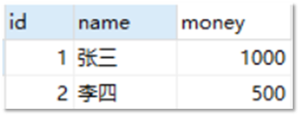

张三和李四账户中各有100块钱，现李四需要转换500块钱给张三，具体的转账操作为

* 第一步：查询李四账户余额
* 第二步：从李四账户金额 -500
* 第三步：给张三账户金额 +500

现在假设在转账过程中第二步完成后出现了异常第三步没有执行，就会造成李四账户金额少了500，而张三金额并没有多500；这样的系统是有问题的。如果解决呢？使用事务可以解决上述问题

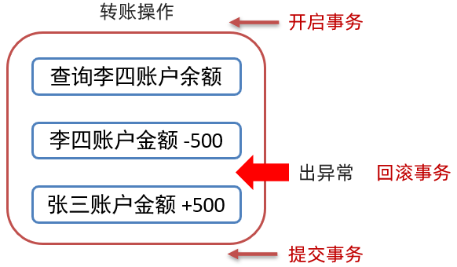

从上图可以看到在转账前开启事务，如果出现了异常回滚事务，三步正常执行就提交事务，这样就可以完美解决问题。

### 4.2  语法

* 开启事务

	```sql
	START TRANSACTION;
	或者  
	BEGIN;
	```

* 提交事务

	```sql
	commit;
	```

* 回滚事务

	```sql
	rollback;
	```

	

### 4.3  代码验证

* 环境准备

	```sql
	DROP TABLE IF EXISTS account;
	
	-- 创建账户表
	CREATE TABLE account(
		id int PRIMARY KEY auto_increment,
		name varchar(10),
		money double(10,2)
	);
	
	-- 添加数据
	INSERT INTO account(name,money) values('张三',1000),('李四',1000);
	```

	

* 不加事务演示问题

	```sql
	-- 转账操作
	-- 1. 查询李四账户金额是否大于500
	
	-- 2. 李四账户 -500
	UPDATE account set money = money - 500 where name = '李四';
	
	出现异常了...  -- 此处不是注释，在整体执行时会出问题，后面的sql则不执行
	-- 3. 张三账户 +500
	UPDATE account set money = money + 500 where name = '张三';
	```

	整体执行结果肯定会出问题，我们查询账户表中数据，发现李四账户少了500。

	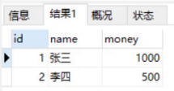

* 添加事务sql如下：

	```sql
	-- 开启事务
	BEGIN;
	-- 转账操作
	-- 1. 查询李四账户金额是否大于500
	
	-- 2. 李四账户 -500
	UPDATE account set money = money - 500 where name = '李四';
	
	出现异常了...  -- 此处不是注释，在整体执行时会出问题，后面的sql则不执行
	-- 3. 张三账户 +500
	UPDATE account set money = money + 500 where name = '张三';
	
	-- 提交事务
	COMMIT;
	
	-- 回滚事务
	ROLLBACK;
	```

	上面sql中的执行成功进选择执行提交事务，而出现问题则执行回滚事务的语句。以后我们肯定不可能这样操作，而是在java中进行操作，在java中可以抓取异常，没出现异常提交事务，出现异常回滚事务。

### 4.4  事务的四大特征

* 原子性（Atomicity）: 事务是不可分割的最小操作单位，要么同时成功，要么同时失败

* 一致性（Consistency） :事务完成时，必须使所有的数据都保持一致状态

* 隔离性（Isolation） :多个事务之间，操作的可见性

* 持久性（Durability） :事务一旦提交或回滚，它对数据库中的数据的改变就是永久的

> ==说明：==
>
> mysql中事务是自动提交的。
>
> 也就是说我们不添加事务执行sql语句，语句执行完毕会自动的提交事务。
>
> 可以通过下面语句查询默认提交方式：
>
> ```java
> SELECT @@autocommit;
> ```
>
> 查询到的结果是1 则表示自动提交，结果是0表示手动提交。当然也可以通过下面语句修改提交方式
>
> ```sql
> set @@autocommit = 0;
> ```

# JDBC

**今日目标**

> * 掌握JDBC的的CRUD
> * 理解JDBC中各个对象的作用
> * 掌握Druid的使用

## 1，JDBC概述

在开发中我们使用的是java语言，那么势必要通过java语言操作数据库中的数据。这就是接下来要学习的JDBC。

### 1.1  JDBC概念

> JDBC   就是使用Java语言操作关系型数据库的一套API
>
> 全称：( Java DataBase Connectivity ) Java 数据库连接

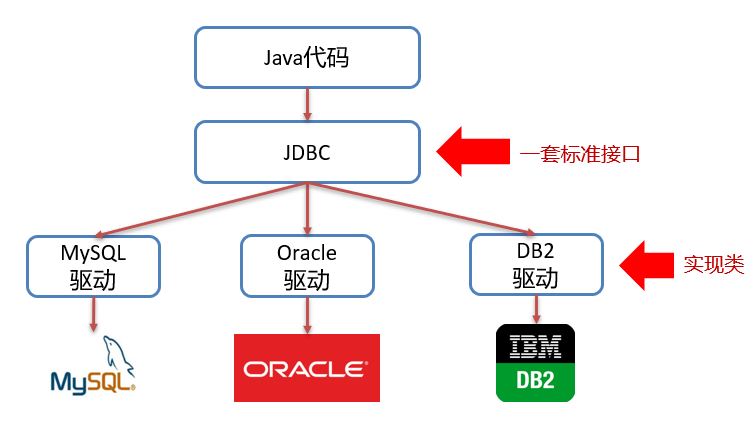

我们开发的同一套Java代码是无法操作不同的关系型数据库，因为每一个关系型数据库的底层实现细节都不一样。如果这样，问题就很大了，在公司中可以在开发阶段使用的是MySQL数据库，而上线时公司最终选用oracle数据库，我们就需要对代码进行大批量修改，这显然并不是我们想看到的。我们要做到的是同一套Java代码操作不同的关系型数据库，而此时sun公司就指定了一套标准接口（JDBC），JDBC中定义了所有操作关系型数据库的规则。众所周知接口是无法直接使用的，我们需要使用接口的实现类，而这套实现类（称之为：驱动）就由各自的数据库厂商给出。

### 1.2  JDBC本质

* 官方（sun公司）定义的一套操作所有关系型数据库的规则，即接口
* 各个数据库厂商去实现这套接口，提供数据库驱动jar包
* 我们可以使用这套接口（JDBC）编程，真正执行的代码是驱动jar包中的实现类

### 1.3  JDBC好处

* 各数据库厂商使用相同的接口，Java代码不需要针对不同数据库分别开发
* 可随时替换底层数据库，访问数据库的Java代码基本不变

以后编写操作数据库的代码只需要面向JDBC（接口），操作哪儿个关系型数据库就需要导入该数据库的驱动包，如需要操作MySQL数据库，就需要再项目中导入MySQL数据库的驱动包。如下图就是MySQL驱动包


## 2，JDBC快速入门

先来看看通过Java操作数据库的流程

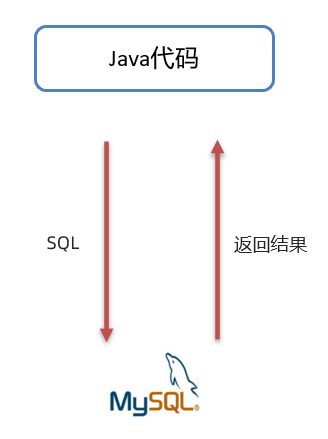

第一步：编写Java代码

第二步：Java代码将SQL发送到MySQL服务端

第三步：MySQL服务端接收到SQL语句并执行该SQL语句

第四步：将SQL语句执行的结果返回给Java代码

### 2.1  编写代码步骤

* 创建工程，导入驱动jar包

	

*  注册驱动

	```sql
	Class.forName("com.mysql.jdbc.Driver");
	```

* 获取连接

	```sql
	Connection conn = DriverManager.getConnection(url, username, password);
	```

	Java代码需要发送SQL给MySQL服务端，就需要先建立连接

* 定义SQL语句

	```sql
	String sql =  “update…” ;
	```

* 获取执行SQL对象

	执行SQL语句需要SQL执行对象，而这个执行对象就是Statement对象

	```sql
	Statement stmt = conn.createStatement();
	```

* 执行SQL

	```sql
	stmt.executeUpdate(sql);  
	```

* 处理返回结果

* 释放资源

### 2.2  具体操作

* 创建新的空的项目

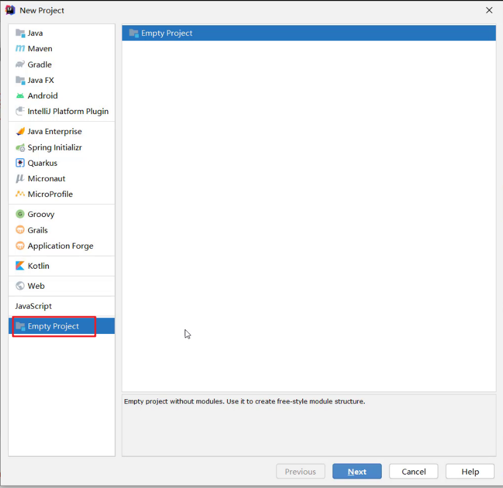

* 定义项目的名称，并指定位置


* 对项目进行设置，JDK版本、编译版本

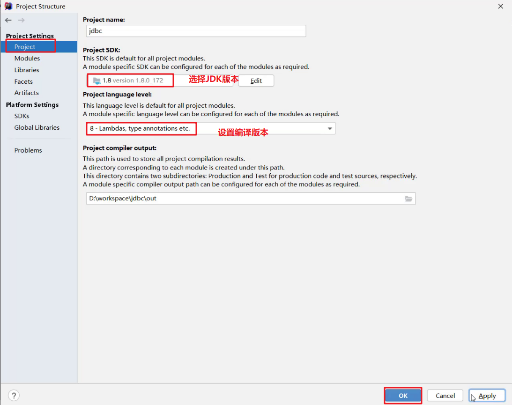

* 创建模块，指定模块的名称及位置

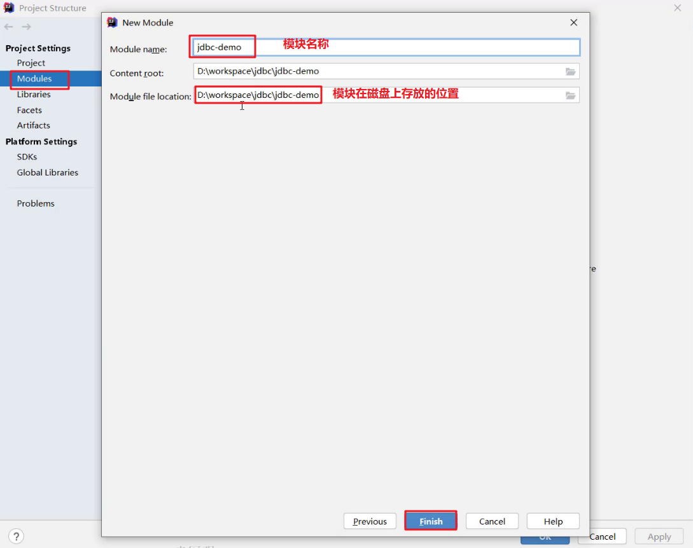

* 导入驱动包

	将mysql的驱动包放在模块下的lib目录（随意命名）下，并将该jar包添加为库文件


* 在添加为库文件的时候，有如下三个选项
	* Global Library  ： 全局有效
	* Project Library :   项目有效
	* Module Library ： 模块有效


* 在src下创建类


* 编写代码如下

```java
/**
 * JDBC快速入门
 */
public class JDBCDemo {

    public static void main(String[] args) throws Exception {
        //1. 注册驱动
        //Class.forName("com.mysql.jdbc.Driver");
        //2. 获取连接
        String url = "jdbc:mysql://127.0.0.1:3306/db1";
        String username = "root";
        String password = "1234";
        Connection conn = DriverManager.getConnection(url, username, password);
        //3. 定义sql
        String sql = "update account set money = 2000 where id = 1";
        //4. 获取执行sql的对象 Statement
        Statement stmt = conn.createStatement();
        //5. 执行sql
        int count = stmt.executeUpdate(sql);//受影响的行数
        //6. 处理结果
        System.out.println(count);
        //7. 释放资源
        stmt.close();
        conn.close();
    }
}
```


## 3，JDBC API详解

### 3.1  DriverManager

DriverManager（驱动管理类）作用：

* 注册驱动

	

	registerDriver方法是用于注册驱动的，但是我们之前做的入门案例并不是这样写的。而是如下实现

	```sql
	Class.forName("com.mysql.jdbc.Driver");
	```

	我们查询MySQL提供的Driver类，看它是如何实现的，源码如下：

	

	在该类中的静态代码块中已经执行了 `DriverManager` 对象的 `registerDriver()` 方法进行驱动的注册了，那么我们只需要加载 `Driver` 类，该静态代码块就会执行。而 `Class.forName("com.mysql.jdbc.Driver");` 就可以加载 `Driver` 类。

	> ==提示：==
	>
	> * MySQL 5之后的驱动包，可以省略注册驱动的步骤
	> * 自动加载jar包中META-INF/services/java.sql.Driver文件中的驱动类

* 获取数据库连接

	

	参数说明：

	* url ： 连接路径

		> 语法：jdbc:mysql://ip地址(域名):端口号/数据库名称?参数键值对1&参数键值对2…
		>
		> 示例：jdbc:mysql://127.0.0.1:3306/db1
		>
		> ==细节：==
		>
		> * 如果连接的是本机mysql服务器，并且mysql服务默认端口是3306，则url可以简写为：jdbc:mysql:///数据库名称?参数键值对
		>
		> * 配置 useSSL=false 参数，禁用安全连接方式，解决警告提示

	* user ：用户名

	* poassword ：密码

### 3.2  Connection

Connection（数据库连接对象）作用：

* 获取执行 SQL 的对象
* 管理事务

#### 3.2.1  获取执行对象

* 普通执行SQL对象

	```sql
	Statement createStatement()
	```

	入门案例中就是通过该方法获取的执行对象。

* 预编译SQL的执行SQL对象：防止SQL注入

	```sql
	PreparedStatement  prepareStatement(sql)
	```

	通过这种方式获取的 `PreparedStatement` SQL语句执行对象是我们一会重点要进行讲解的，它可以防止SQL注入。

* 执行存储过程的对象

	```sql
	CallableStatement prepareCall(sql)
	```

	通过这种方式获取的 `CallableStatement` 执行对象是用来执行存储过程的，而存储过程在MySQL中不常用，所以这个我们将不进行讲解。

#### 3.2.2  事务管理

先回顾一下MySQL事务管理的操作：

* 开启事务 ： BEGIN; 或者 START TRANSACTION;
* 提交事务 ： COMMIT;
* 回滚事务 ： ROLLBACK;

> MySQL默认是自动提交事务

接下来学习JDBC事务管理的方法。

Connection几口中定义了3个对应的方法：

* 开启事务

	

	参与autoCommit 表示是否自动提交事务，true表示自动提交事务，false表示手动提交事务。而开启事务需要将该参数设为为false。

* 提交事务

	

* 回滚事务

	

具体代码实现如下：

```sql
/**
 * JDBC API 详解：Connection
 */
public class JDBCDemo3_Connection {

    public static void main(String[] args) throws Exception {
        //1. 注册驱动
        //Class.forName("com.mysql.jdbc.Driver");
        //2. 获取连接：如果连接的是本机mysql并且端口是默认的 3306 可以简化书写
        String url = "jdbc:mysql:///db1?useSSL=false";
        String username = "root";
        String password = "1234";
        Connection conn = DriverManager.getConnection(url, username, password);
        //3. 定义sql
        String sql1 = "update account set money = 3000 where id = 1";
        String sql2 = "update account set money = 3000 where id = 2";
        //4. 获取执行sql的对象 Statement
        Statement stmt = conn.createStatement();

        try {
            // ============开启事务==========
            conn.setAutoCommit(false);
            //5. 执行sql
            int count1 = stmt.executeUpdate(sql1);//受影响的行数
            //6. 处理结果
            System.out.println(count1);
            int i = 3/0;
            //5. 执行sql
            int count2 = stmt.executeUpdate(sql2);//受影响的行数
            //6. 处理结果
            System.out.println(count2);

            // ============提交事务==========
            //程序运行到此处，说明没有出现任何问题，则需求提交事务
            conn.commit();
        } catch (Exception e) {
            // ============回滚事务==========
            //程序在出现异常时会执行到这个地方，此时就需要回滚事务
            conn.rollback();
            e.printStackTrace();
        }

        //7. 释放资源
        stmt.close();
        conn.close();
    }
}
```

### 3.3  Statement

#### 3.3.1  概述

Statement对象的作用就是用来执行SQL语句。而针对不同类型的SQL语句使用的方法也不一样。

* 执行DDL、DML语句

	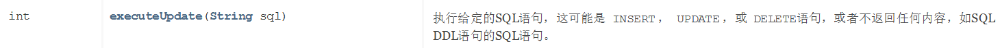

* 执行DQL语句

	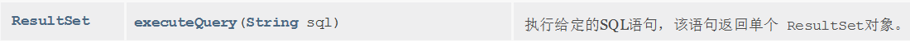

	该方法涉及到了 `ResultSet` 对象，而这个对象我们还没有学习，一会再重点讲解。


#### 3.3.2  代码实现

* 执行DML语句

	```java
	/**
	  * 执行DML语句
	  * @throws Exception
	  */
	@Test
	public void testDML() throws  Exception {
	    //1. 注册驱动
	    //Class.forName("com.mysql.jdbc.Driver");
	    //2. 获取连接：如果连接的是本机mysql并且端口是默认的 3306 可以简化书写
	    String url = "jdbc:mysql:///db1?useSSL=false";
	    String username = "root";
	    String password = "1234";
	    Connection conn = DriverManager.getConnection(url, username, password);
	    //3. 定义sql
	    String sql = "update account set money = 3000 where id = 1";
	    //4. 获取执行sql的对象 Statement
	    Statement stmt = conn.createStatement();
	    //5. 执行sql
	    int count = stmt.executeUpdate(sql);//执行完DML语句，受影响的行数
	    //6. 处理结果
	    //System.out.println(count);
	    if(count > 0){
	        System.out.println("修改成功~");
	    }else{
	        System.out.println("修改失败~");
	    }
	    //7. 释放资源
	    stmt.close();
	    conn.close();
	}
	```

* 执行DDL语句

	```java
	/**
	  * 执行DDL语句
	  * @throws Exception
	  */
	@Test
	public void testDDL() throws  Exception {
	    //1. 注册驱动
	    //Class.forName("com.mysql.jdbc.Driver");
	    //2. 获取连接：如果连接的是本机mysql并且端口是默认的 3306 可以简化书写
	    String url = "jdbc:mysql:///db1?useSSL=false";
	    String username = "root";
	    String password = "1234";
	    Connection conn = DriverManager.getConnection(url, username, password);
	    //3. 定义sql
	    String sql = "drop database db2";
	    //4. 获取执行sql的对象 Statement
	    Statement stmt = conn.createStatement();
	    //5. 执行sql
	    int count = stmt.executeUpdate(sql);//执行完DDL语句，可能是0
	    //6. 处理结果
	    System.out.println(count);
	
	    //7. 释放资源
	    stmt.close();
	    conn.close();
	}
	```

	> 注意：
	>
	> * 以后开发很少使用java代码操作DDL语句

### 3.4  ResultSet

#### 3.4.1  概述

ResultSet（结果集对象）作用：

* ==封装了SQL查询语句的结果。==

而执行了DQL语句后就会返回该对象，对应执行DQL语句的方法如下：

```sql
ResultSet  executeQuery(sql)：执行DQL 语句，返回 ResultSet 对象
```

那么我们就需要从 `ResultSet` 对象中获取我们想要的数据。`ResultSet` 对象提供了操作查询结果数据的方法，如下：

> boolean  next()
>
> * 将光标从当前位置向前移动一行 
> * 判断当前行是否为有效行
>
> 方法返回值说明：
>
> * true  ： 有效航，当前行有数据
> * false ： 无效行，当前行没有数据

> xxx  getXxx(参数)：获取数据
>
> * xxx : 数据类型；如： int getInt(参数) ；String getString(参数)
> * 参数
> 	* int类型的参数：列的编号，从1开始
> 	* String类型的参数： 列的名称 

如下图为执行SQL语句后的结果

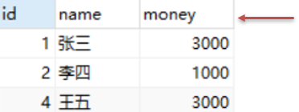

一开始光标指定于第一行前，如图所示红色箭头指向于表头行。当我们调用了 `next()` 方法后，光标就下移到第一行数据，并且方法返回true，此时就可以通过 `getInt("id")` 获取当前行id字段的值，也可以通过 `getString("name")` 获取当前行name字段的值。如果想获取下一行的数据，继续调用 `next()`  方法，以此类推。

#### 3.4.2  代码实现

```java
/**
  * 执行DQL
  * @throws Exception
  */
@Test
public void testResultSet() throws  Exception {
    //1. 注册驱动
    //Class.forName("com.mysql.jdbc.Driver");
    //2. 获取连接：如果连接的是本机mysql并且端口是默认的 3306 可以简化书写
    String url = "jdbc:mysql:///db1?useSSL=false";
    String username = "root";
    String password = "1234";
    Connection conn = DriverManager.getConnection(url, username, password);
    //3. 定义sql
    String sql = "select * from account";
    //4. 获取statement对象
    Statement stmt = conn.createStatement();
    //5. 执行sql
    ResultSet rs = stmt.executeQuery(sql);
    //6. 处理结果， 遍历rs中的所有数据
    /* // 6.1 光标向下移动一行，并且判断当前行是否有数据
        while (rs.next()){
            //6.2 获取数据  getXxx()
            int id = rs.getInt(1);
            String name = rs.getString(2);
            double money = rs.getDouble(3);

            System.out.println(id);
            System.out.println(name);
            System.out.println(money);

            System.out.println("--------------");

        }*/
    // 6.1 光标向下移动一行，并且判断当前行是否有数据
    while (rs.next()){
        //6.2 获取数据  getXxx()
        int id = rs.getInt("id");
        String name = rs.getString("name");
        double money = rs.getDouble("money");

        System.out.println(id);
        System.out.println(name);
        System.out.println(money);

        System.out.println("--------------");
    }

    //7. 释放资源
    rs.close();
    stmt.close();
    conn.close();
}
```

### 3.5  案例

* 需求：查询account账户表数据，封装为Account对象中，并且存储到ArrayList集合中

	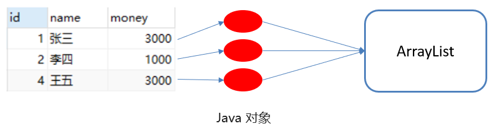

* 代码实现

	```java
	/**
	  * 查询account账户表数据，封装为Account对象中，并且存储到ArrayList集合中
	  * 1. 定义实体类Account
	  * 2. 查询数据，封装到Account对象中
	  * 3. 将Account对象存入ArrayList集合中
	  */
	@Test
	public void testResultSet2() throws  Exception {
	    //1. 注册驱动
	    //Class.forName("com.mysql.jdbc.Driver");
	    //2. 获取连接：如果连接的是本机mysql并且端口是默认的 3306 可以简化书写
	    String url = "jdbc:mysql:///db1?useSSL=false";
	    String username = "root";
	    String password = "1234";
	    Connection conn = DriverManager.getConnection(url, username, password);
	
	    //3. 定义sql
	    String sql = "select * from account";
	
	    //4. 获取statement对象
	    Statement stmt = conn.createStatement();
	
	    //5. 执行sql
	    ResultSet rs = stmt.executeQuery(sql);
	
	    // 创建集合
	    List<Account> list = new ArrayList<>();
	   
	    // 6.1 光标向下移动一行，并且判断当前行是否有数据
	    while (rs.next()){
	        Account account = new Account();
	
	        //6.2 获取数据  getXxx()
	        int id = rs.getInt("id");
	        String name = rs.getString("name");
	        double money = rs.getDouble("money");
	
	        //赋值
	        account.setId(id);
	        account.setName(name);
	        account.setMoney(money);
	
	        // 存入集合
	        list.add(account);
	    }
	
	    System.out.println(list);
	
	    //7. 释放资源
	    rs.close();
	    stmt.close();
	    conn.close();
	}
	```


### 3.6  PreparedStatement

> PreparedStatement作用：
>
> * 预编译SQL语句并执行：预防SQL注入问题

对上面的作用中SQL注入问题大家肯定不理解。那我们先对SQL注入进行说明.

#### 3.6.1  SQL注入

> SQL注入是通过操作输入来修改事先定义好的SQL语句，用以达到执行代码对服务器进行攻击的方法。

在今天资料下的 `day03-JDBC\资料\2. sql注入演示` 中修改 `application.properties` 文件中的用户名和密码，文件内容如下：

```properties
spring.datasource.driver-class-name=com.mysql.cj.jdbc.Driver
spring.datasource.url=jdbc:mysql://localhost:3306/test?useSSL=false&useUnicode=true&characterEncoding=UTF-8
spring.datasource.username=root
spring.datasource.password=1234
```

在MySQL中创建名为 `test` 的数据库

```sql
create database test;
```

在命令提示符中运行今天资料下的 `day03-JDBC\资料\2. sql注入演示\sql.jar` 这个jar包。

 

此时我们就能在数据库中看到user表


接下来在浏览器的地址栏输入 `localhost:8080/login.html` 就能看到如下页面


我们就可以在如上图中输入用户名和密码进行登陆。用户名和密码输入正确就登陆成功，跳转到首页。用户名和密码输入错误则给出错误提示，如下图

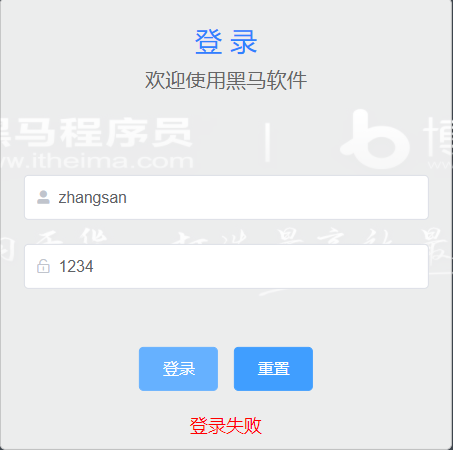

但是我可以通过输入一些特殊的字符登陆到首页。

用户名随意写，密码写成 `' or '1' ='1`

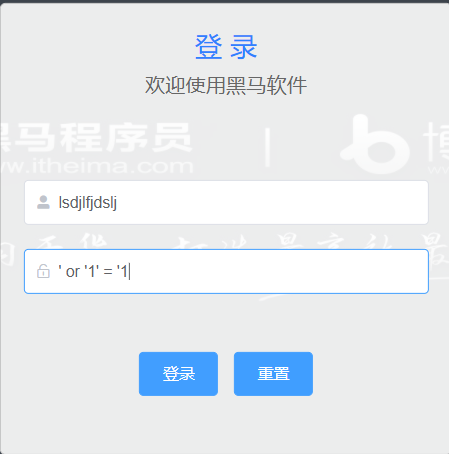

这就是SQL注入漏洞，也是很危险的。当然现在市面上的系统都不会存在这种问题了，所以大家也不要尝试用这种方式去试其他的系统。

那么该如何解决呢？这里就可以将SQL执行对象 `Statement` 换成 `PreparedStatement` 对象。

#### 3.6.2  代码模拟SQL注入问题

```java
@Test
public void testLogin() throws  Exception {
    //2. 获取连接：如果连接的是本机mysql并且端口是默认的 3306 可以简化书写
    String url = "jdbc:mysql:///db1?useSSL=false";
    String username = "root";
    String password = "1234";
    Connection conn = DriverManager.getConnection(url, username, password);

    // 接收用户输入 用户名和密码
    String name = "sjdljfld";
    String pwd = "' or '1' = '1";
    String sql = "select * from tb_user where username = '"+name+"' and password = '"+pwd+"'";
    // 获取stmt对象
    Statement stmt = conn.createStatement();
    // 执行sql
    ResultSet rs = stmt.executeQuery(sql);
    // 判断登录是否成功
    if(rs.next()){
        System.out.println("登录成功~");
    }else{
        System.out.println("登录失败~");
    }

    //7. 释放资源
    rs.close();
    stmt.close();
    conn.close();
}
```

上面代码是将用户名和密码拼接到sql语句中，拼接后的sql语句如下

```sql
select * from tb_user where username = 'sjdljfld' and password = ''or '1' = '1'
```

从上面语句可以看出条件 `username = 'sjdljfld' and password = ''` 不管是否满足，而 `or` 后面的 `'1' = '1'` 是始终满足的，最终条件是成立的，就可以正常的进行登陆了。

接下来我们来学习PreparedStatement对象.

#### 3.6.3  PreparedStatement概述

> PreparedStatement作用：
>
> * 预编译SQL语句并执行：预防SQL注入问题

* 获取 PreparedStatement 对象

	```java
	// SQL语句中的参数值，使用？占位符替代
	String sql = "select * from user where username = ? and password = ?";
	// 通过Connection对象获取，并传入对应的sql语句
	PreparedStatement pstmt = conn.prepareStatement(sql);
	```

* 设置参数值

	上面的sql语句中参数使用 ? 进行占位，在之前之前肯定要设置这些 ?  的值。

	> PreparedStatement对象：setXxx(参数1，参数2)：给 ? 赋值
	>
	> * Xxx：数据类型 ； 如 setInt (参数1，参数2)
	>
	> * 参数：
	>
	> 	* 参数1： ？的位置编号，从1 开始
	>
	> 	* 参数2： ？的值

* 执行SQL语句

	> executeUpdate();  执行DDL语句和DML语句
	>
	> executeQuery();  执行DQL语句
	>
	> ==注意：==
	>
	> * 调用这两个方法时不需要传递SQL语句，因为获取SQL语句执行对象时已经对SQL语句进行预编译了。

#### 3.6.4  使用PreparedStatement改进

```java
 @Test
public void testPreparedStatement() throws  Exception {
    //2. 获取连接：如果连接的是本机mysql并且端口是默认的 3306 可以简化书写
    String url = "jdbc:mysql:///db1?useSSL=false";
    String username = "root";
    String password = "1234";
    Connection conn = DriverManager.getConnection(url, username, password);

    // 接收用户输入 用户名和密码
    String name = "zhangsan";
    String pwd = "' or '1' = '1";

    // 定义sql
    String sql = "select * from tb_user where username = ? and password = ?";
    // 获取pstmt对象
    PreparedStatement pstmt = conn.prepareStatement(sql);
    // 设置？的值
    pstmt.setString(1,name);
    pstmt.setString(2,pwd);
    // 执行sql
    ResultSet rs = pstmt.executeQuery();
    // 判断登录是否成功
    if(rs.next()){
        System.out.println("登录成功~");
    }else{
        System.out.println("登录失败~");
    }
    //7. 释放资源
    rs.close();
    pstmt.close();
    conn.close();
}
```

执行上面语句就可以发现不会出现SQL注入漏洞问题了。那么PreparedStatement又是如何解决的呢？它是将特殊字符进行了转义，转义的SQL如下：

```sql
select * from tb_user where username = 'sjdljfld' and password = '\'or \'1\' = \'1'
```


#### 3.6.5  PreparedStatement原理

> PreparedStatement 好处：
>
> * 预编译SQL，性能更高
> * 防止SQL注入：==将敏感字符进行转义==


Java代码操作数据库流程如图所示：

* 将sql语句发送到MySQL服务器端

* MySQL服务端会对sql语句进行如下操作

	* 检查SQL语句

		检查SQL语句的语法是否正确。

	* 编译SQL语句。将SQL语句编译成可执行的函数。

		检查SQL和编译SQL花费的时间比执行SQL的时间还要长。如果我们只是重新设置参数，那么检查SQL语句和编译SQL语句将不需要重复执行。这样就提高了性能。

	* 执行SQL语句

接下来我们通过查询日志来看一下原理。

* 开启预编译功能

	在代码中编写url时需要加上以下参数。而我们之前根本就没有开启预编译功能，只是解决了SQL注入漏洞。

	```sql
	useServerPrepStmts=true
	```

* 配置MySQL执行日志（重启mysql服务后生效）

	在mysql配置文件（my.ini）中添加如下配置

	```
	log-output=FILE
	general-log=1
	general_log_file="D:\mysql.log"
	slow-query-log=1
	slow_query_log_file="D:\mysql_slow.log"
	long_query_time=2
	```

* java测试代码如下：

	```java
	 /**
	   * PreparedStatement原理
	   * @throws Exception
	   */
	@Test
	public void testPreparedStatement2() throws  Exception {
	
	    //2. 获取连接：如果连接的是本机mysql并且端口是默认的 3306 可以简化书写
	    // useServerPrepStmts=true 参数开启预编译功能
	    String url = "jdbc:mysql:///db1?useSSL=false&useServerPrepStmts=true";
	    String username = "root";
	    String password = "1234";
	    Connection conn = DriverManager.getConnection(url, username, password);
	
	    // 接收用户输入 用户名和密码
	    String name = "zhangsan";
	    String pwd = "' or '1' = '1";
	
	    // 定义sql
	    String sql = "select * from tb_user where username = ? and password = ?";
	
	    // 获取pstmt对象
	    PreparedStatement pstmt = conn.prepareStatement(sql);
	
	    Thread.sleep(10000);
	    // 设置？的值
	    pstmt.setString(1,name);
	    pstmt.setString(2,pwd);
	    ResultSet rs = null;
	    // 执行sql
	    rs = pstmt.executeQuery();
	
	    // 设置？的值
	    pstmt.setString(1,"aaa");
	    pstmt.setString(2,"bbb");
	    // 执行sql
	    rs = pstmt.executeQuery();
	
	    // 判断登录是否成功
	    if(rs.next()){
	        System.out.println("登录成功~");
	    }else{
	        System.out.println("登录失败~");
	    }
	
	    //7. 释放资源
	    rs.close();
	    pstmt.close();
	    conn.close();
	}
	```

	

* 执行SQL语句，查看 `D:\mysql.log` 日志如下:

	

	上图中第三行中的 `Prepare` 是对SQL语句进行预编译。第四行和第五行是执行了两次SQL语句，而第二次执行前并没有对SQL进行预编译。

> ==小结：==
>
> * 在获取PreparedStatement对象时，将sql语句发送给mysql服务器进行检查，编译（这些步骤很耗时）
> * 执行时就不用再进行这些步骤了，速度更快
> * 如果sql模板一样，则只需要进行一次检查、编译

## 4，数据库连接池

### 4.1  数据库连接池简介

> * 数据库连接池是个容器，负责分配、管理数据库连接(Connection)
>
> * 它允许应用程序重复使用一个现有的数据库连接，而不是再重新建立一个；
>
> * 释放空闲时间超过最大空闲时间的数据库连接来避免因为没有释放数据库连接而引起的数据库连接遗漏
> * 好处
> 	* 资源重用
> 	* 提升系统响应速度
> 	* 避免数据库连接遗漏

之前我们代码中使用连接是没有使用都创建一个Connection对象，使用完毕就会将其销毁。这样重复创建销毁的过程是特别耗费计算机的性能的及消耗时间的。

而数据库使用了数据库连接池后，就能达到Connection对象的复用，如下图


连接池是在一开始就创建好了一些连接（Connection）对象存储起来。用户需要连接数据库时，不需要自己创建连接，而只需要从连接池中获取一个连接进行使用，使用完毕后再将连接对象归还给连接池；这样就可以起到资源重用，也节省了频繁创建连接销毁连接所花费的时间，从而提升了系统响应的速度。

### 4.2  数据库连接池实现

* 标准接口：==DataSource==

	官方(SUN) 提供的数据库连接池标准接口，由第三方组织实现此接口。该接口提供了获取连接的功能：

	```java
	Connection getConnection()
	```

	那么以后就不需要通过 `DriverManager` 对象获取 `Connection` 对象，而是通过连接池（DataSource）获取 `Connection` 对象。

* 常见的数据库连接池

	* DBCP
	* C3P0
	* Druid

	我们现在使用更多的是Druid，它的性能比其他两个会好一些。

* Druid（德鲁伊）

	* Druid连接池是阿里巴巴开源的数据库连接池项目 

	* 功能强大，性能优秀，是Java语言最好的数据库连接池之一

### 4.3  Driud使用

> * 导入jar包 druid-1.1.12.jar
> * 定义配置文件
> * 加载配置文件
> * 获取数据库连接池对象
> * 获取连接

现在通过代码实现，首先需要先将druid的jar包放到项目下的lib下并添加为库文件


项目结构如下：


编写配置文件如下：

```properties
driverClassName=com.mysql.jdbc.Driver
url=jdbc:mysql:///db1?useSSL=false&useServerPrepStmts=true
username=root
password=1234
# 初始化连接数量
initialSize=5
# 最大连接数
maxActive=10
# 最大等待时间
maxWait=3000
```

使用druid的代码如下：

```java
/**
 * Druid数据库连接池演示
 */
public class DruidDemo {

    public static void main(String[] args) throws Exception {
        //1.导入jar包
        //2.定义配置文件
        //3. 加载配置文件
        Properties prop = new Properties();
        prop.load(new FileInputStream("jdbc-demo/src/druid.properties"));
        //4. 获取连接池对象
        DataSource dataSource = DruidDataSourceFactory.createDataSource(prop);

        //5. 获取数据库连接 Connection
        Connection connection = dataSource.getConnection();
        System.out.println(connection); //获取到了连接后就可以继续做其他操作了

        //System.out.println(System.getProperty("user.dir"));
    }
}
```

## 5，JDBC练习

### 5.1  需求

完成商品品牌数据的增删改查操作

* 查询：查询所有数据
* 添加：添加品牌
* 修改：根据id修改
* 删除：根据id删除

### 5.2  案例实现

#### 5.2.1  环境准备

* 数据库表 `tb_brand`

	```sql
	-- 删除tb_brand表
	drop table if exists tb_brand;
	-- 创建tb_brand表
	create table tb_brand (
	    -- id 主键
	    id int primary key auto_increment,
	    -- 品牌名称
	    brand_name varchar(20),
	    -- 企业名称
	    company_name varchar(20),
	    -- 排序字段
	    ordered int,
	    -- 描述信息
	    description varchar(100),
	    -- 状态：0：禁用  1：启用
	    status int
	);
	-- 添加数据
	insert into tb_brand (brand_name, company_name, ordered, description, status)
	values ('三只松鼠', '三只松鼠股份有限公司', 5, '好吃不上火', 0),
	       ('华为', '华为技术有限公司', 100, '华为致力于把数字世界带入每个人、每个家庭、每个组织，构建万物互联的智能世界', 1),
	       ('小米', '小米科技有限公司', 50, 'are you ok', 1);
	```

* 在pojo包下实体类 Brand

	```java
	/**
	 * 品牌
	 * alt + 鼠标左键：整列编辑
	 * 在实体类中，基本数据类型建议使用其对应的包装类型
	 */
	public class Brand {
	    // id 主键
	    private Integer id;
	    // 品牌名称
	    private String brandName;
	    // 企业名称
	    private String companyName;
	    // 排序字段
	    private Integer ordered;
	    // 描述信息
	    private String description;
	    // 状态：0：禁用  1：启用
	    private Integer status;
	
	    public Integer getId() {
	        return id;
	    }
	
	    public void setId(Integer id) {
	        this.id = id;
	    }
	
	    public String getBrandName() {
	        return brandName;
	    }
	
	    public void setBrandName(String brandName) {
	        this.brandName = brandName;
	    }
	
	    public String getCompanyName() {
	        return companyName;
	    }
	
	    public void setCompanyName(String companyName) {
	        this.companyName = companyName;
	    }
	
	    public Integer getOrdered() {
	        return ordered;
	    }
	
	    public void setOrdered(Integer ordered) {
	        this.ordered = ordered;
	    }
	
	    public String getDescription() {
	        return description;
	    }
	
	    public void setDescription(String description) {
	        this.description = description;
	    }
	
	    public Integer getStatus() {
	        return status;
	    }
	
	    public void setStatus(Integer status) {
	        this.status = status;
	    }
	
	    @Override
	    public String toString() {
	        return "Brand{" +
	                "id=" + id +
	                ", brandName='" + brandName + '\'' +
	                ", companyName='" + companyName + '\'' +
	                ", ordered=" + ordered +
	                ", description='" + description + '\'' +
	                ", status=" + status +
	                '}';
	    }
	}
	```

#### 5.2.2  查询所有

```java
 /**
   * 查询所有
   * 1. SQL：select * from tb_brand;
   * 2. 参数：不需要
   * 3. 结果：List<Brand>
   */

@Test
public void testSelectAll() throws Exception {
    //1. 获取Connection
    //3. 加载配置文件
    Properties prop = new Properties();
    prop.load(new FileInputStream("jdbc-demo/src/druid.properties"));
    //4. 获取连接池对象
    DataSource dataSource = DruidDataSourceFactory.createDataSource(prop);

    //5. 获取数据库连接 Connection
    Connection conn = dataSource.getConnection();
    //2. 定义SQL
    String sql = "select * from tb_brand;";
    //3. 获取pstmt对象
    PreparedStatement pstmt = conn.prepareStatement(sql);
    //4. 设置参数
    //5. 执行SQL
    ResultSet rs = pstmt.executeQuery();
    //6. 处理结果 List<Brand> 封装Brand对象，装载List集合
    Brand brand = null;
    List<Brand> brands = new ArrayList<>();
    while (rs.next()){
        //获取数据
        int id = rs.getInt("id");
        String brandName = rs.getString("brand_name");
        String companyName = rs.getString("company_name");
        int ordered = rs.getInt("ordered");
        String description = rs.getString("description");
        int status = rs.getInt("status");
        //封装Brand对象
        brand = new Brand();
        brand.setId(id);
        brand.setBrandName(brandName);
        brand.setCompanyName(companyName);
        brand.setOrdered(ordered);
        brand.setDescription(description);
        brand.setStatus(status);

        //装载集合
        brands.add(brand);
    }
    System.out.println(brands);
    //7. 释放资源
    rs.close();
    pstmt.close();
    conn.close();
}
```

#### 5.2.3  添加数据

```java
/**
  * 添加
  * 1. SQL：insert into tb_brand(brand_name, company_name, ordered, description, status) values(?,?,?,?,?);
  * 2. 参数：需要，除了id之外的所有参数信息
  * 3. 结果：boolean
  */
@Test
public void testAdd() throws Exception {
    // 接收页面提交的参数
    String brandName = "香飘飘";
    String companyName = "香飘飘";
    int ordered = 1;
    String description = "绕地球一圈";
    int status = 1;

    //1. 获取Connection
    //3. 加载配置文件
    Properties prop = new Properties();
    prop.load(new FileInputStream("jdbc-demo/src/druid.properties"));
    //4. 获取连接池对象
    DataSource dataSource = DruidDataSourceFactory.createDataSource(prop);
    //5. 获取数据库连接 Connection
    Connection conn = dataSource.getConnection();
    //2. 定义SQL
    String sql = "insert into tb_brand(brand_name, company_name, ordered, description, status) values(?,?,?,?,?);";
    //3. 获取pstmt对象
    PreparedStatement pstmt = conn.prepareStatement(sql);
    //4. 设置参数
    pstmt.setString(1,brandName);
    pstmt.setString(2,companyName);
    pstmt.setInt(3,ordered);
    pstmt.setString(4,description);
    pstmt.setInt(5,status);

    //5. 执行SQL
    int count = pstmt.executeUpdate(); // 影响的行数
    //6. 处理结果
    System.out.println(count > 0);

    //7. 释放资源
    pstmt.close();
    conn.close();
}
```

#### 5.2.4  修改数据

```java
/**
  * 修改
  * 1. SQL：

     update tb_brand
         set brand_name  = ?,
         company_name= ?,
         ordered     = ?,
         description = ?,
         status      = ?
     where id = ?

   * 2. 参数：需要，所有数据
   * 3. 结果：boolean
   */

@Test
public void testUpdate() throws Exception {
    // 接收页面提交的参数
    String brandName = "香飘飘";
    String companyName = "香飘飘";
    int ordered = 1000;
    String description = "绕地球三圈";
    int status = 1;
    int id = 4;

    //1. 获取Connection
    //3. 加载配置文件
    Properties prop = new Properties();
    prop.load(new FileInputStream("jdbc-demo/src/druid.properties"));
    //4. 获取连接池对象
    DataSource dataSource = DruidDataSourceFactory.createDataSource(prop);
    //5. 获取数据库连接 Connection
    Connection conn = dataSource.getConnection();
    //2. 定义SQL
    String sql = " update tb_brand\n" +
        "         set brand_name  = ?,\n" +
        "         company_name= ?,\n" +
        "         ordered     = ?,\n" +
        "         description = ?,\n" +
        "         status      = ?\n" +
        "     where id = ?";

    //3. 获取pstmt对象
    PreparedStatement pstmt = conn.prepareStatement(sql);

    //4. 设置参数
    pstmt.setString(1,brandName);
    pstmt.setString(2,companyName);
    pstmt.setInt(3,ordered);
    pstmt.setString(4,description);
    pstmt.setInt(5,status);
    pstmt.setInt(6,id);

    //5. 执行SQL
    int count = pstmt.executeUpdate(); // 影响的行数
    //6. 处理结果
    System.out.println(count > 0);

    //7. 释放资源
    pstmt.close();
    conn.close();
}
```

#### 5.2.5  删除数据

```java
/**
  * 删除
  * 1. SQL：
            delete from tb_brand where id = ?
  * 2. 参数：需要，id
  * 3. 结果：boolean
  */
@Test
public void testDeleteById() throws Exception {
    // 接收页面提交的参数
    int id = 4;
    //1. 获取Connection
    //3. 加载配置文件
    Properties prop = new Properties();
    prop.load(new FileInputStream("jdbc-demo/src/druid.properties"));
    //4. 获取连接池对象
    DataSource dataSource = DruidDataSourceFactory.createDataSource(prop);
    //5. 获取数据库连接 Connection
    Connection conn = dataSource.getConnection();
    //2. 定义SQL
    String sql = " delete from tb_brand where id = ?";
    //3. 获取pstmt对象
    PreparedStatement pstmt = conn.prepareStatement(sql);
    //4. 设置参数
    pstmt.setInt(1,id);
    //5. 执行SQL
    int count = pstmt.executeUpdate(); // 影响的行数
    //6. 处理结果
    System.out.println(count > 0);

    //7. 释放资源
    pstmt.close();
    conn.close();
}
```

# Maven&MyBatis

**目标**

> * 能够使用Maven进行项目的管理
> * 能够完成Mybatis代理方式查询数据
> * 能够理解Mybatis核心配置文件的配置

## 1，Maven

Maven是专门用于管理和构建Java项目的工具，它的主要功能有：

* 提供了一套标准化的项目结构

* 提供了一套标准化的构建流程（编译，测试，打包，发布……）

* 提供了一套依赖管理机制

**标准化的项目结构：**

项目结构我们都知道，每一个开发工具（IDE）都有自己不同的项目结构，它们互相之间不通用。我再eclipse中创建的目录，无法在idea中进行使用，这就造成了很大的不方便，如下图:前两个是以后开发经常使用的开发工具


而Maven提供了一套标准化的项目结构，所有的IDE使用Maven构建的项目完全一样，所以IDE创建的Maven项目可以通用。如下图右边就是Maven构建的项目结构。


**标准化的构建流程：**


如上图所示我们开发了一套系统，代码需要进行编译、测试、打包、发布，这些操作如果需要反复进行就显得特别麻烦，而Maven提供了一套简单的命令来完成项目构建。

**依赖管理：**

依赖管理其实就是管理你项目所依赖的第三方资源（jar包、插件）。如之前我们项目中需要使用JDBC和Druid的话，就需要去网上下载对应的依赖包（当前之前是老师已经下载好提供给大家了），复制到项目中，还要将jar包加入工作环境这一系列的操作。如下图所示


而Maven使用标准的 ==坐标== 配置来管理各种依赖，只需要简单的配置就可以完成依赖管理。

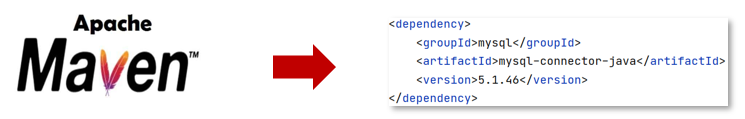

如上图右边所示就是mysql驱动包的坐标，在项目中只需要写这段配置，其他都不需要我们担心，Maven都帮我们进行操作了。

市面上有很多构建工具，而Maven依旧还是主流构建工具，如下图是常用构建工具的使用占比

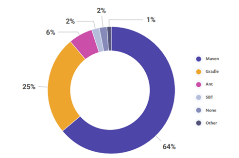

### 1.1  Maven简介

> ==Apache Maven== 是一个项目管理和构建==工具==，它基于项目对象模型(POM)的概念，通过一小段描述信息来管理项目的构建、报告和文档。
>
> 官网 ：http://maven.apache.org/ 

通过上面的描述大家只需要知道Maven是一个工具即可。Apache 是一个开源组织，将来我们会学习很多Apache提供的项目。

#### 1.1.1  Maven模型

* 项目对象模型 (Project Object Model)
* 依赖管理模型(Dependency)
* 插件(Plugin)


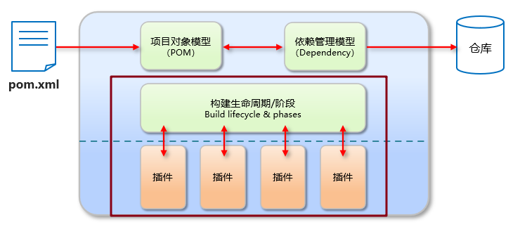

如上图所示就是Maven的模型，而我们先看紫色框框起来的部分，他就是用来完成 `标准化构建流程` 。如我们需要编译，Maven提供了一个编译插件供我们使用，我们需要打包，Maven就提供了一个打包插件提供我们使用等。


上图中紫色框起来的部分，项目对象模型就是将我们自己抽象成一个对象模型，有自己专属的坐标，如下图所示是一个Maven项目：


依赖管理模型则是使用坐标来描述当前项目依赖哪儿些第三方jar包，如下图所示

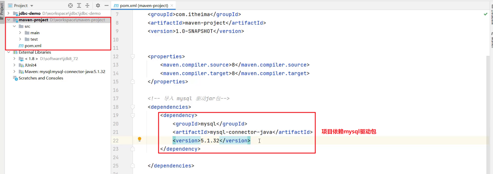

上述Maven模型图中还有一部分是仓库。如何理解仓库呢？

#### 1.1.2  仓库

大家想想这样的场景，我们创建Maven项目，在项目中使用坐标来指定项目的依赖，那么依赖的jar包到底存储在什么地方呢？其实依赖jar包是存储在我们的本地仓库中。而项目运行时从本地仓库中拿需要的依赖jar包。

**仓库分类：**

* 本地仓库：自己计算机上的一个目录

* 中央仓库：由Maven团队维护的全球唯一的仓库

	* 地址： https://repo1.maven.org/maven2/

* 远程仓库(私服)：一般由公司团队搭建的私有仓库

	今天我们只学习远程仓库的使用，并不会搭建。

当项目中使用坐标引入对应依赖jar包后，首先会查找本地仓库中是否有对应的jar包：

* 如果有，则在项目直接引用;

* 如果没有，则去中央仓库中下载对应的jar包到本地仓库。


如果还可以搭建远程仓库，将来jar包的查找顺序则变为：

> 本地仓库 --> 远程仓库--> 中央仓库


### 1.2  Maven安装配置

* 解压 apache-maven-3.6.1.rar 既安装完成

	

	> 建议解压缩到没有中文、特殊字符的路径下。如课程中解压缩到 `D:\software` 下。

	解压缩后的目录结构如下：

	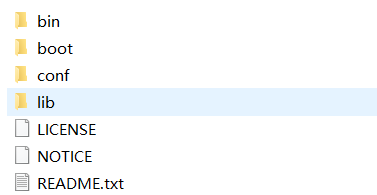

	* bin目录 ： 存放的是可执行命令。mvn 命令重点关注。
	* conf目录 ：存放Maven的配置文件。`settings.xml` 配置文件后期需要修改。
	* lib目录 ：存放Maven依赖的jar包。Maven也是使用java开发的，所以它也依赖其他的jar包。

* 配置环境变量 MAVEN_HOME 为安装路径的bin目录

	`此电脑` 右键  -->  `高级系统设置`  -->  `高级`  -->  `环境变量`

	在系统变量处新建一个变量 `MAVEN_HOME`

	

	在 `Path` 中进行配置

	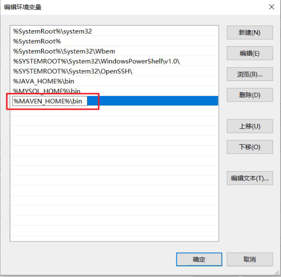

	打开命令提示符进行验证，出现如图所示表示安装成功

	

* 配置本地仓库

	修改 conf/settings.xml 中的 <localRepository> 为一个指定目录作为本地仓库，用来存储jar包。

	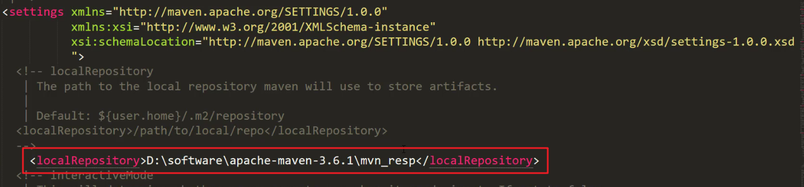

* 配置阿里云私服

	中央仓库在国外，所以下载jar包速度可能比较慢，而阿里公司提供了一个远程仓库，里面基本也都有开源项目的jar包。

	修改 conf/settings.xml 中的 <mirrors>标签，为其添加如下子标签：

	```xml
	<mirror>  
	    <id>alimaven</id>  
	    <name>aliyun maven</name>  
	    <url>http://maven.aliyun.com/nexus/content/groups/public/</url>
	    <mirrorOf>central</mirrorOf>          
	</mirror>
	```


### 1.3  Maven基本使用

#### 1.3.1  Maven 常用命令

> * compile ：编译
>
> * clean：清理
>
> * test：测试
>
> * package：打包
>
> * install：安装

**命令演示：**

在 `资料\代码\maven-project` 提供了一个使用Maven构建的项目，项目结构如下：


而我们使用上面命令需要在磁盘上进入到项目的 `pom.xml` 目录下，打开命令提示符


**编译命令演示：**

```java
compile ：编译
```

执行上述命令可以看到：

* 从阿里云下载编译需要的插件的jar包，在本地仓库也能看到下载好的插件
* 在项目下会生成一个 `target` 目录

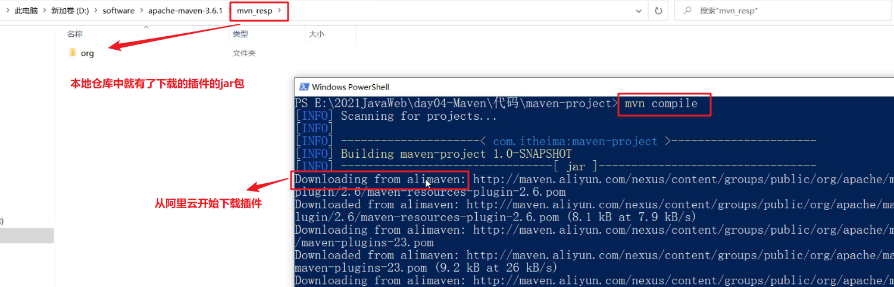

同时在项目下会出现一个 `target` 目录，编译后的字节码文件就放在该目录下

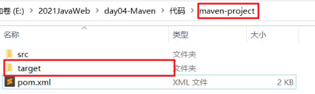

**清理命令演示：**

```
mvn clean
```

执行上述命令可以看到

* 从阿里云下载清理需要的插件jar包
* 删除项目下的 `target` 目录

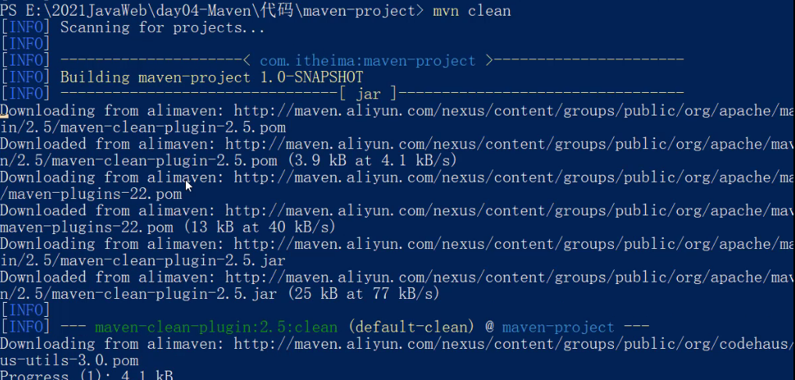

**打包命令演示：**

```
mvn package
```

执行上述命令可以看到：

* 从阿里云下载打包需要的插件jar包
* 在项目的 `terget` 目录下有一个jar包（将当前项目打成的jar包）


**测试命令演示：**

```
mvn test  
```

该命令会执行所有的测试代码。执行上述命令效果如下

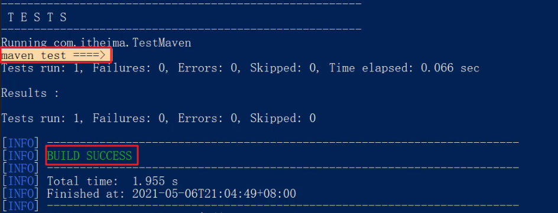

**安装命令演示：**

```
mvn install
```

该命令会将当前项目打成jar包，并安装到本地仓库。执行完上述命令后到本地仓库查看结果如下：


#### 1.3.2  Maven 生命周期

Maven 构建项目生命周期描述的是一次构建过程经历经历了多少个事件

Maven 对项目构建的生命周期划分为3套：

* clean ：清理工作。
* default ：核心工作，例如编译，测试，打包，安装等。
* site ： 产生报告，发布站点等。这套声明周期一般不会使用。

同一套生命周期内，执行后边的命令，前面的所有命令会自动执行。例如默认（default）生命周期如下：


当我们执行 `install`（安装）命令时，它会先执行 `compile`命令，再执行 `test ` 命令，再执行 `package` 命令，最后执行 `install` 命令。

当我们执行 `package` （打包）命令时，它会先执行 `compile` 命令，再执行 `test` 命令，最后执行 `package` 命令。

默认的生命周期也有对应的很多命令，其他的一般都不会使用，我们只关注常用的：


### 1.4  IDEA使用Maven

以后开发中我们肯定会在高级开发工具中使用Maven管理项目，而我们常用的高级开发工具是IDEA，所以接下来我们会讲解Maven在IDEA中的使用。

#### 1.4.1  IDEA配置Maven环境

我们需要先在IDEA中配置Maven环境：

* 选择 IDEA中 File --> Settings

	

* 搜索 maven 

	

* 设置 IDEA 使用本地安装的 Maven，并修改配置文件路径

	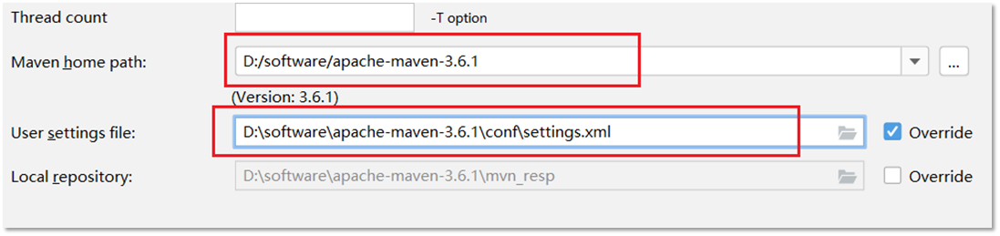

#### 1.4.2  Maven 坐标详解

**什么是坐标？**

* Maven 中的坐标是==资源的唯一标识==
* 使用坐标来定义项目或引入项目中需要的依赖

**Maven 坐标主要组成**

* groupId：定义当前Maven项目隶属组织名称（通常是域名反写，例如：com.itheima）
* artifactId：定义当前Maven项目名称（通常是模块名称，例如 order-service、goods-service）
* version：定义当前项目版本号

如下图就是使用坐标表示一个项目：


> ==注意：==
>
> * 上面所说的资源可以是插件、依赖、当前项目。
> * 我们的项目如果被其他的项目依赖时，也是需要坐标来引入的。

#### 1.4.3  IDEA 创建 Maven项目

* 创建模块，选择Maven，点击Next

	

* 填写模块名称，坐标信息，点击finish，创建完成

	

	创建好的项目目录结构如下：

	

* 编写 HelloWorld，并运行

#### 1.4.4  IDEA 导入 Maven项目

大家在学习时可能需要看老师的代码，当然也就需要将老师的代码导入到自己的IDEA中。我们可以通过以下步骤进行项目的导入：

* 选择右侧Maven面板，点击 + 号

	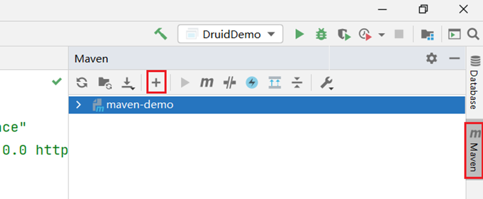

* 选中对应项目的pom.xml文件，双击即可

	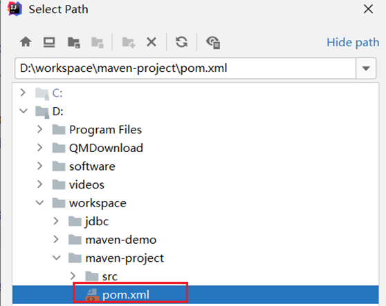

* 如果没有Maven面板，选择

	View --> Appearance --> Tool Window Bars

	


可以通过下图所示进行命令的操作：


**配置 Maven-Helper 插件** 

* 选择 IDEA中 File --> Settings

	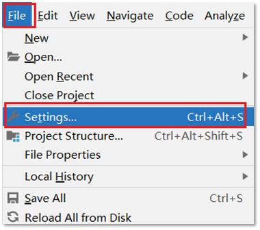

* 选择 Plugins

	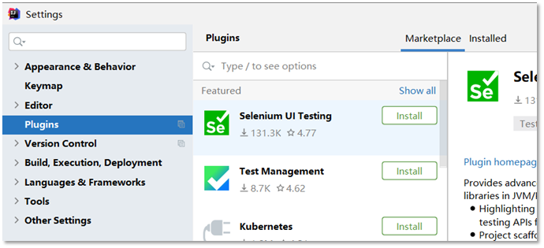

* 搜索 Maven，选择第一个 Maven Helper，点击Install安装，弹出面板中点击Accept

	

* 重启 IDEA

安装完该插件后可以通过 选中项目右键进行相关命令操作，如下图所示：


### 1.5  依赖管理

#### 1.5.1  使用坐标引入jar包

**使用坐标引入jar包的步骤：**

* 在项目的 pom.xml 中编写 <dependencies> 标签

* 在 <dependencies> 标签中 使用 <dependency> 引入坐标

* 定义坐标的 groupId，artifactId，version

	

* 点击刷新按钮，使坐标生效

	

>  注意：
>
>  * 具体的坐标我们可以到如下网站进行搜索
>  * https://mvnrepository.com/

**快捷方式导入jar包的坐标：**

每次需要引入jar包，都去对应的网站进行搜索是比较麻烦的，接下来给大家介绍一种快捷引入坐标的方式

* 在 pom.xml 中 按 alt + insert，选择 Dependency

	

* 在弹出的面板中搜索对应坐标，然后双击选中对应坐标

	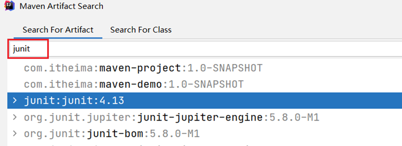

* 点击刷新按钮，使坐标生效

	

**自动导入设置：**

上面每次操作都需要点击刷新按钮，让引入的坐标生效。当然我们也可以通过设置让其自动完成

* 选择 IDEA中 File --> Settings

	

* 在弹出的面板中找到 Build Tools

	

* 选择 Any changes，点击 ok 即可生效

#### 1.5.2  依赖范围

通过设置坐标的依赖范围(scope)，可以设置 对应jar包的作用范围：编译环境、测试环境、运行环境。

如下图所示给 `junit` 依赖通过 `scope` 标签指定依赖的作用范围。 那么这个依赖就只能作用在测试环境，其他环境下不能使用。


那么 `scope` 都可以有哪些取值呢？

| **依赖范围** | 编译classpath | 测试classpath | 运行classpath | 例子              |
| ------------ | ------------- | ------------- | ------------- | ----------------- |
| **compile**  | Y             | Y             | Y             | logback           |
| **test**     | -             | Y             | -             | Junit             |
| **provided** | Y             | Y             | -             | servlet-api       |
| **runtime**  | -             | Y             | Y             | jdbc驱动          |
| **system**   | Y             | Y             | -             | 存储在本地的jar包 |

* compile ：作用于编译环境、测试环境、运行环境。
* test ： 作用于测试环境。典型的就是Junit坐标，以后使用Junit时，都会将scope指定为该值
* provided ：作用于编译环境、测试环境。我们后面会学习 `servlet-api` ，在使用它时，必须将 `scope` 设置为该值，不然运行时就会报错
* runtime  ： 作用于测试环境、运行环境。jdbc驱动一般将 `scope` 设置为该值，当然不设置也没有任何问题 

> 注意：
>
> * 如果引入坐标不指定 `scope` 标签时，默认就是 compile  值。以后大部分jar包都是使用默认值。

## 2，Mybatis

### 2.1  Mybatis概述

#### 2.1.1  Mybatis概念

> * MyBatis 是一款优秀的==持久层框架==，用于简化 JDBC 开发
>
> * MyBatis 本是 Apache 的一个开源项目iBatis, 2010年这个项目由apache software foundation 迁移到了google code，并且改名为MyBatis 。2013年11月迁移到Github
>
> * 官网：https://mybatis.org/mybatis-3/zh/index.html 

**持久层：**

* 负责将数据到保存到数据库的那一层代码。

	以后开发我们会将操作数据库的Java代码作为持久层。而Mybatis就是对jdbc代码进行了封装。

* JavaEE三层架构：表现层、业务层、持久层

	三层架构在后期会给大家进行讲解，今天先简单的了解下即可。

**框架：**

* 框架就是一个半成品软件，是一套可重用的、通用的、软件基础代码模型
* 在框架的基础之上构建软件编写更加高效、规范、通用、可扩展

举例给大家简单的解释一下什么是半成品软件。大家小时候应该在公园见过给石膏娃娃涂鸦


如下图所示有一个石膏娃娃，这个就是一个半成品。你可以在这个半成品的基础上进行不同颜色的涂鸦


了解了什么是Mybatis后，接下来说说以前 `JDBC代码` 的缺点以及Mybatis又是如何解决的。

#### 2.1.2  JDBC 缺点

下面是 JDBC 代码，我们通过该代码分析都存在什么缺点：

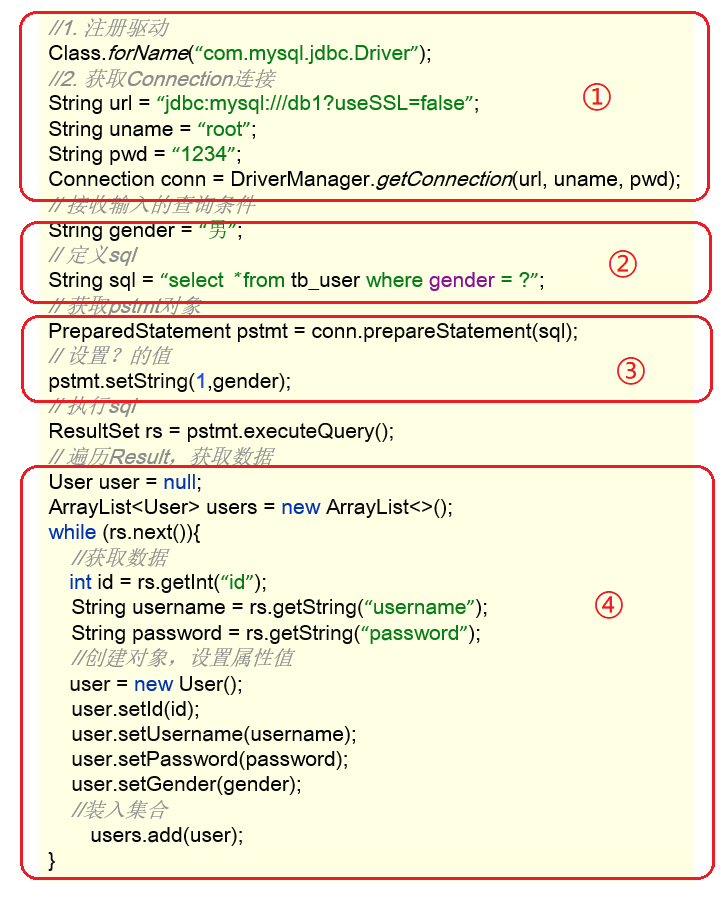

* 硬编码

	* 注册驱动、获取连接

		上图标1的代码有很多字符串，而这些是连接数据库的四个基本信息，以后如果要将Mysql数据库换成其他的关系型数据库的话，这四个地方都需要修改，如果放在此处就意味着要修改我们的源代码。

	* SQL语句

		上图标2的代码。如果表结构发生变化，SQL语句就要进行更改。这也不方便后期的维护。

* 操作繁琐

	* 手动设置参数

	* 手动封装结果集

		上图标4的代码是对查询到的数据进行封装，而这部分代码是没有什么技术含量，而且特别耗费时间的。

#### 2.1.3  Mybatis 优化

* 硬编码可以配置到==配置文件==
* 操作繁琐的地方mybatis都==自动完成==

如图所示


下图是持久层框架的使用占比。


### 2.2  Mybatis快速入门

**需求：查询user表中所有的数据**

* 创建user表，添加数据

	```sql
	create database mybatis;
	use mybatis;
	
	drop table if exists tb_user;
	
	create table tb_user(
		id int primary key auto_increment,
		username varchar(20),
		password varchar(20),
		gender char(1),
		addr varchar(30)
	);
	
	INSERT INTO tb_user VALUES (1, 'zhangsan', '123', '男', '北京');
	INSERT INTO tb_user VALUES (2, '李四', '234', '女', '天津');
	INSERT INTO tb_user VALUES (3, '王五', '11', '男', '西安');
	```

* 创建模块，导入坐标

	在创建好的模块中的 pom.xml 配置文件中添加依赖的坐标

	```xml
	<dependencies>
	    <!--mybatis 依赖-->
	    <dependency>
	        <groupId>org.mybatis</groupId>
	        <artifactId>mybatis</artifactId>
	        <version>3.5.5</version>
	    </dependency>
	
	    <!--mysql 驱动-->
	    <dependency>
	        <groupId>mysql</groupId>
	        <artifactId>mysql-connector-java</artifactId>
	        <version>5.1.46</version>
	    </dependency>
	
	    <!--junit 单元测试-->
	    <dependency>
	        <groupId>junit</groupId>
	        <artifactId>junit</artifactId>
	        <version>4.13</version>
	        <scope>test</scope>
	    </dependency>
	
	    <!-- 添加slf4j日志api -->
	    <dependency>
	        <groupId>org.slf4j</groupId>
	        <artifactId>slf4j-api</artifactId>
	        <version>1.7.20</version>
	    </dependency>
	    <!-- 添加logback-classic依赖 -->
	    <dependency>
	        <groupId>ch.qos.logback</groupId>
	        <artifactId>logback-classic</artifactId>
	        <version>1.2.3</version>
	    </dependency>
	    <!-- 添加logback-core依赖 -->
	    <dependency>
	        <groupId>ch.qos.logback</groupId>
	        <artifactId>logback-core</artifactId>
	        <version>1.2.3</version>
	    </dependency>
	</dependencies>
	```

	注意：需要在项目的 resources 目录下创建logback的配置文件

* 编写 MyBatis 核心配置文件 -- > 替换连接信息 解决硬编码问题

	在模块下的 resources 目录下创建mybatis的配置文件 `mybatis-config.xml`，内容如下：

	```xml
	<?xml version="1.0" encoding="UTF-8" ?>
	<!DOCTYPE configuration
	        PUBLIC "-//mybatis.org//DTD Config 3.0//EN"
	        "http://mybatis.org/dtd/mybatis-3-config.dtd">
	<configuration>
	
	    <typeAliases>
	        <package name="com.itheima.pojo"/>
	    </typeAliases>
	    
	    <!--
	    environments：配置数据库连接环境信息。可以配置多个environment，通过default属性切换不同的environment
	    -->
	    <environments default="development">
	        <environment id="development">
	            <transactionManager type="JDBC"/>
	            <dataSource type="POOLED">
	                <!--数据库连接信息-->
	                <property name="driver" value="com.mysql.jdbc.Driver"/>
	                <property name="url" value="jdbc:mysql:///mybatis?useSSL=false"/>
	                <property name="username" value="root"/>
	                <property name="password" value="1234"/>
	            </dataSource>
	        </environment>
	
	        <environment id="test">
	            <transactionManager type="JDBC"/>
	            <dataSource type="POOLED">
	                <!--数据库连接信息-->
	                <property name="driver" value="com.mysql.jdbc.Driver"/>
	                <property name="url" value="jdbc:mysql:///mybatis?useSSL=false"/>
	                <property name="username" value="root"/>
	                <property name="password" value="1234"/>
	            </dataSource>
	        </environment>
	    </environments>
	    <mappers>
	       <!--加载sql映射文件-->
	       <mapper resource="UserMapper.xml"/>
	    </mappers>
	</configuration>
	```

* 编写 SQL 映射文件 --> 统一管理sql语句，解决硬编码问题

	在模块的 `resources` 目录下创建映射配置文件 `UserMapper.xml`，内容如下：

	```xml
	<?xml version="1.0" encoding="UTF-8" ?>
	<!DOCTYPE mapper PUBLIC "-//mybatis.org//DTD Mapper 3.0//EN" "http://mybatis.org/dtd/mybatis-3-mapper.dtd">
	<mapper namespace="test">
	    <select id="selectAll" resultType="com.itheima.pojo.User">
	        select * from tb_user;
	    </select>
	</mapper>
	```

* 编码

	* 在 `com.itheima.pojo` 包下创建 User类

		```java
		public class User {
		    private int id;
		    private String username;
		    private String password;
		    private String gender;
		    private String addr;
		    
		    //省略了 setter 和 getter
		}
		```

	* 在 `com.itheima` 包下编写 MybatisDemo 测试类

		```java
		public class MyBatisDemo {
		
		    public static void main(String[] args) throws IOException {
		        //1. 加载mybatis的核心配置文件，获取 SqlSessionFactory
		        String resource = "mybatis-config.xml";
		        InputStream inputStream = Resources.getResourceAsStream(resource);
		        SqlSessionFactory sqlSessionFactory = new SqlSessionFactoryBuilder().build(inputStream);
		
		        //2. 获取SqlSession对象，用它来执行sql
		        SqlSession sqlSession = sqlSessionFactory.openSession();
		        //3. 执行sql
		        List<User> users = sqlSession.selectList("test.selectAll"); //参数是一个字符串，该字符串必须是映射配置文件的namespace.id
		        System.out.println(users);
		        //4. 释放资源
		        sqlSession.close();
		    }
		}
		```

**解决SQL映射文件的警告提示：**

在入门案例映射配置文件中存在报红的情况。问题如下：


* 产生的原因：Idea和数据库没有建立连接，不识别表信息。但是大家一定要记住，它并不影响程序的执行。
* 解决方式：在Idea中配置MySQL数据库连接。

IDEA中配置MySQL数据库连接

* 点击IDEA右边框的 `Database` ，在展开的界面点击 `+` 选择 `Data Source` ，再选择 `MySQL`

	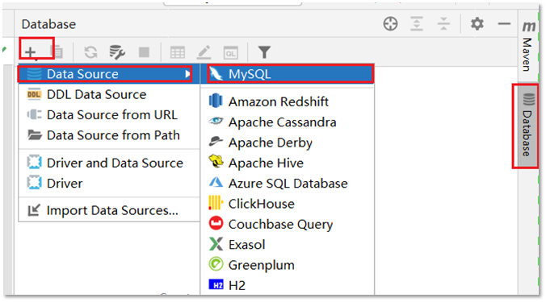

* 在弹出的界面进行基本信息的填写

	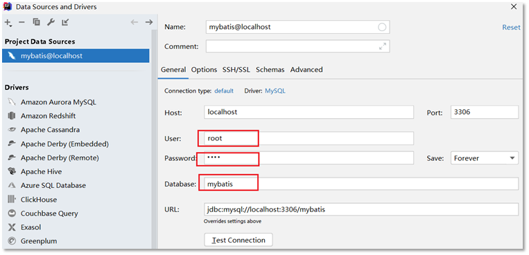

* 点击完成后就能看到如下界面

	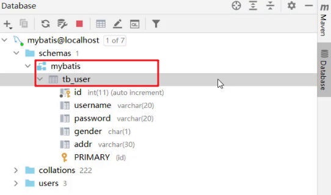

	而此界面就和 `navicat` 工具一样可以进行数据库的操作。也可以编写SQL语句

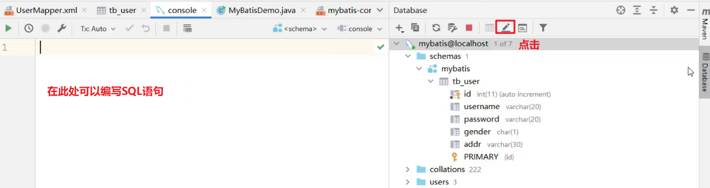

### 2.3  Mapper代理开发

#### 2.3.1  Mapper代理开发概述

之前我们写的代码是基本使用方式，它也存在硬编码的问题，如下：


这里调用 `selectList()` 方法传递的参数是映射配置文件中的 namespace.id值。这样写也不便于后期的维护。如果使用 Mapper 代理方式（如下图）则不存在硬编码问题。


通过上面的描述可以看出 Mapper 代理方式的目的：

* 解决原生方式中的硬编码
* 简化后期执行SQL

Mybatis 官网也是推荐使用 Mapper 代理的方式。下图是截止官网的图片

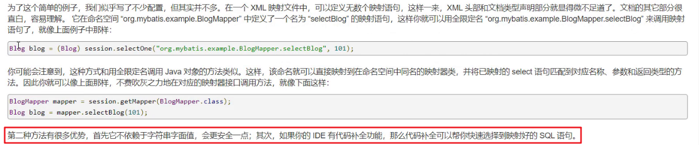


#### 2.3.2  使用Mapper代理要求

使用Mapper代理方式，必须满足以下要求：

* 定义与SQL映射文件同名的Mapper接口，并且将Mapper接口和SQL映射文件放置在同一目录下。如下图：

	

* 设置SQL映射文件的namespace属性为Mapper接口全限定名

	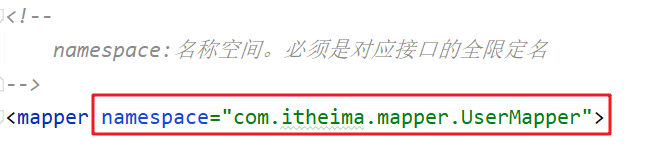

* 在 Mapper 接口中定义方法，方法名就是SQL映射文件中sql语句的id，并保持参数类型和返回值类型一致

	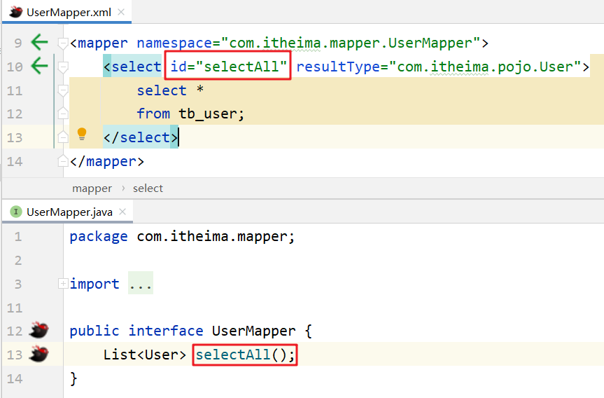

#### 2.3.3  案例代码实现

* 在 `com.itheima.mapper` 包下创建 UserMapper接口，代码如下：

	```java
	public interface UserMapper {
	    List<User> selectAll();
	    User selectById(int id);
	}
	```

* 在 `resources` 下创建 `com/itheima/mapper` 目录，并在该目录下创建 UserMapper.xml 映射配置文件

	```xml
	<!--
	    namespace:名称空间。必须是对应接口的全限定名
	-->
	<mapper namespace="com.itheima.mapper.UserMapper">
	    <select id="selectAll" resultType="com.itheima.pojo.User">
	        select *
	        from tb_user;
	    </select>
	</mapper>
	```

* 在 `com.itheima` 包下创建 MybatisDemo2 测试类，代码如下：

	```java
	/**
	 * Mybatis 代理开发
	 */
	public class MyBatisDemo2 {
	
	    public static void main(String[] args) throws IOException {
	
	        //1. 加载mybatis的核心配置文件，获取 SqlSessionFactory
	        String resource = "mybatis-config.xml";
	        InputStream inputStream = Resources.getResourceAsStream(resource);
	        SqlSessionFactory sqlSessionFactory = new SqlSessionFactoryBuilder().build(inputStream);
	
	        //2. 获取SqlSession对象，用它来执行sql
	        SqlSession sqlSession = sqlSessionFactory.openSession();
	        //3. 执行sql
	        //3.1 获取UserMapper接口的代理对象
	        UserMapper userMapper = sqlSession.getMapper(UserMapper.class);
	        List<User> users = userMapper.selectAll();
	
	        System.out.println(users);
	        //4. 释放资源
	        sqlSession.close();
	    }
	}
	```

==注意：==

如果Mapper接口名称和SQL映射文件名称相同，并在同一目录下，则可以使用包扫描的方式简化SQL映射文件的加载。也就是将核心配置文件的加载映射配置文件的配置修改为

```xml
<mappers>
    <!--加载sql映射文件-->
    <!-- <mapper resource="com/itheima/mapper/UserMapper.xml"/>-->
    <!--Mapper代理方式-->
    <package name="com.itheima.mapper"/>
</mappers>
```


### 2.4  核心配置文件

核心配置文件中现有的配置之前已经给大家进行了解释，而核心配置文件中还可以配置很多内容。我们可以通过查询官网看可以配置的内容


接下来我们先对里面的一些配置进行讲解。

#### 2.4.1  多环境配置

在核心配置文件的 `environments` 标签中其实是可以配置多个 `environment` ，使用 `id` 给每段环境起名，在 `environments` 中使用 `default='环境id'` 来指定使用哪儿段配置。我们一般就配置一个 `environment` 即可。

```xml
<environments default="development">
    <environment id="development">
        <transactionManager type="JDBC"/>
        <dataSource type="POOLED">
            <!--数据库连接信息-->
            <property name="driver" value="com.mysql.jdbc.Driver"/>
            <property name="url" value="jdbc:mysql:///mybatis?useSSL=false"/>
            <property name="username" value="root"/>
            <property name="password" value="1234"/>
        </dataSource>
    </environment>

    <environment id="test">
        <transactionManager type="JDBC"/>
        <dataSource type="POOLED">
            <!--数据库连接信息-->
            <property name="driver" value="com.mysql.jdbc.Driver"/>
            <property name="url" value="jdbc:mysql:///mybatis?useSSL=false"/>
            <property name="username" value="root"/>
            <property name="password" value="1234"/>
        </dataSource>
    </environment>
</environments>=
```

#### 2.4.2  类型别名

在映射配置文件中的 `resultType` 属性需要配置数据封装的类型（类的全限定名）。而每次这样写是特别麻烦的，Mybatis 提供了 `类型别名`(typeAliases) 可以简化这部分的书写。

首先需要现在核心配置文件中配置类型别名，也就意味着给pojo包下所有的类起了别名（别名就是类名），不区分大小写。内容如下：

```xml
<typeAliases>
    <!--name属性的值是实体类所在包-->
    <package name="com.itheima.pojo"/> 
</typeAliases>
```

通过上述的配置，我们就可以简化映射配置文件中 `resultType` 属性值的编写

```xml
<mapper namespace="com.itheima.mapper.UserMapper">
    <select id="selectAll" resultType="user">
        select * from tb_user;
    </select>
</mapper>
```

