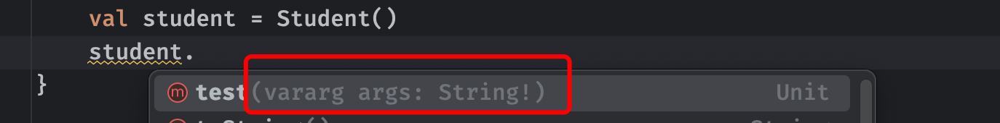
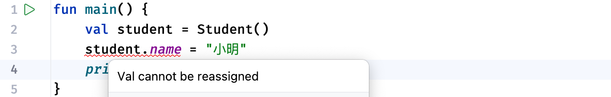
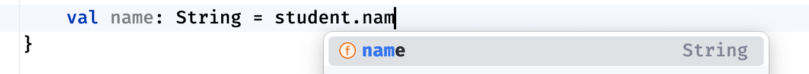
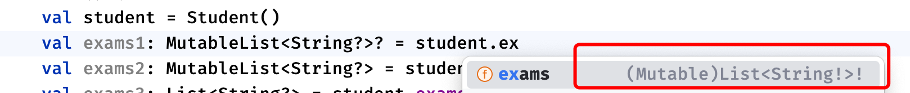
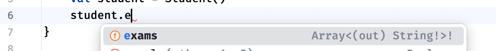
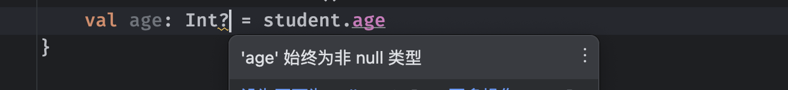

# Kotlin程序设计（扩展一）

**注意：**开启本视频学习前，需要先完成以下内容的学习：

* 请先完成《Kotlin程序设计》视频教程。
* 请先完成《JavaSE》视频教程。

Kotlin在设计时考虑到了与Java的互操作性，现有的Java代码可以自然地调用Kotlin代码，而Kotlin代码也可以轻松兼容Java的调用。在本扩展篇中，我们会讲解如何通过Kotlin调用Java代码。

## Kotlin调用Java

我们先从最基本的内容说起，现在需要让Kotlin与Java互相兼容，并不是直接就可以使用的，我们还要遵循某些约定才可以使得Java兼容Kotlin的语法。

### 类的定义和使用

在Java中，最关键的就是类，我们来看看如何在Kotlin中进行使用。

我们在Java中定义的类型，可以非常轻松地被Kotlin使用，比如下面这个由Java语言定义的类型：

```java
public class Student {
  	int age;
    String name;
}
```

在Kotlin中，我们可以直接使用这个类，就像是在Kotlin中定义的那样：

```kotlin
fun main() {
    val student: Student = Student()   //直接使用Java中的类型，无缝衔接
    student.name = "小明"
    println(student.name)  //这里得到的Java中的String类型，可以直接当做Kotlin中的使用
}
```

以及Kotlin中我们提到的一些基本类型，都可以与Java中的基本类型互相转换：

```kotlin
fun main() {
    val student = Student()
    val age: Int = student.age   //Java中的int/Integer对应了Kotlin中的Int
}
```

几乎Java中所有基本类型在Kotlin中都存在对应的类型，所以说直接转换为Kotlin支持的基本类型也是可以的。

包括我们在类中定义的方法，也可以在Kotlin中被当做函数使用：

```kotlin
public class Student {
    String name;

    public void hello() {
        System.out.println("大家好，我叫" + name);
    }
}
```

```kotlin
fun main() {
    val student = Student()
    student.name = "小明"
    student.hello()   //函数调用
}
```

注意，如果方法的返回类型是void，那么它对应的就是Kotlin中的Unit类型。

包括在Java中定义的构造方法，也可以被Kotlin当做构造函数使用，因为它们的语法其实差不多，可以很轻松完成兼容：

```java
public class Student {
    String name;
    
    public Student(String name) {
        this.name = name;
    }
}
```

```kotlin
fun main() {
    val student = Student("小明")
}
```

可以看到，这些内容几乎是没有多少学习成本的，包括在Java类中定义的静态内容：

```java
public class Student {
    public static void test() {
        System.out.println("我是测试静态函数");
    }
}
```

这些静态属性就像使用Kotlin中的伴生对象一样，可以直接通过类名进行调用，这跟Java中是一样的：

```kotlin
fun main() {
    Student.test()
}
```

还有，由于Kotlin与Java中的关键字存在差异，我们在Java中定义的某些属性名称可能会成为Kt的关键字：

```kotlin
import java.io.InputStream;
public class Student {
    InputStream in;  //Java中没有问题，因为in不是关键字
}
```

```kotlin
fun main() {
    val student = Student()
  	//在Kotlin中，由于in是关键字，因此我们需要对其进行转义来消除冲突
  	//使用``字符来完成转义
    student.`in` = FileInputStream("C://")
}
```

包括Java中的可变参数，也是可以直接兼容的：

```java
public class Student {
    public void test(String... args) {
        
    }
}
```



我们也可以直接继承Java中提供的类型：

```java
public class Student {

}
```

```kotlin
class ArtStudent: Student()   //语法与之前是一样的
```

在后续的学习中，我们再来继续认识更多高级的内容。

### Getter和Setter

在Kotlin基础教程中我们说到，类中的成员属性可以具有自己的Getter和Setter函数，比如：

```kotlin
class Student {
    var name: String = ""
        get() = field
        set(value) {
            field = value
        }
}
```

这样我们就可以实现对于这个变量赋值和获取的进一步控制，比如我们希望在赋值时打印内容：

```kotlin
var name: String = ""
    get() = field
    set(value){
        println("我被赋值了！")   //由于get和set本质上编译后是函数，因此可以自定义
        field = value
    }
```

而我们知道，在Java中，一个类的属性并不能像这样去编写：

```kotlin
public class Student {
    String name;   //只能定义一个变量，非常简单
}
```

我们可以对Java中的这个属性进行封装，使得其支持像Kotlin中那样存在Getter和Setter函数：

```kotlin
public class Student {
    private String name;   //将name属性private掉

    public String getName() {  //自定义Get和Set方法设置name属性
        return name;
    }

    public void setName(String name) {
        this.name = name;
    }
}
```

```kotlin
fun main() {
    val student = Student()
    student.name = "小明"
    println(student.name)
}
```

这样编写之后，我们同样可以在Kotlin中直接使用对应属性的名称进行访问，但是这本质上是通过其Get和Set函数来完成的，在获取属性时，会调用getName()方法得到对应的结果，设置同理。

> 注意：这个Get和Set必须遵循命名规则，比如这里我们要为name属性添加Getter方法，那么必须要命名为get + Name这样的名称，来表示对name属性的命名，必须以get开头，而Setter必须以set开头。
>
> 如果返回值类型是一个Boolean类型，那么Getter方法名称需要以is开头，而Setter同上。

注意，由于此时`name`属性由于存在访问权限控制，无法被外部访问，如果我们去掉Setter或是Getter函数，将导致变量只能被赋值或是不可用，比如去掉set方法后：



**注意：** 如果直接去掉Getter方法，无论是否保留Setter方法，都会导致这个变量不可用，因为Kotlin不支持仅`set-only`属性。

### 空安全处理

由于在Java中的任何引用类型值都可能是`null`，这使得Kotlin对来自Java的对象进行空安全检测不太方便。因此，对于Java声明的类型会在Kotlin中以特定方式处理，我们称为*平台类型*。对于这种类型，空检查是放宽的，因此它们的安全保证与Java相同，也就是说部分情况下不会进行空安全检查。

比如下面这个例子：

```kotlin
public class Student {
    String name;   //默认情况下name属性的值就是null
}
```

```kotlin
fun main() {
    val student = Student()
  	//此时name在Kotlin中为平台类型，不会进行空安全检查，这里可以编译通过
    println(student.name.uppercase())
}
```

很明显，上面的代码出现了空指针异常，因为这里没有进行任何的空安全检查。

对于这种平台类型，IDEA会给我们明确指出，比如这里的name属性时`String!`类型的，它表示这个类型可能是`Srting`或`String?`的其中一种：


我们在接受这个属性的时候，由于其特殊性，也可以使用两种：

```kotlin
fun main() {
    val student = Student()
    val name: String = student.name  //直接使用不可空类型接受，但是可能会出错
    val name2: String? = student.name  //直接使用可空类型接受
  	test(student.name)  //函数同样适用此规则
}

fun test(str: String) {  }
```

如果我们使用了一个不可空类型接受到来自Java的null值，会直接得到一个空指针异常，这可以防止Kotlin的不可空变量持有空值，包括传递函数参数时也同样适用，总的来说，编译器在尽最大努力防止空值在Kotlin程序中传播。

注意，在某些情况下，持有可空注解的Java类型不会表现为平台类型，比如：

```java
public class Student {
    @NotNull String name;  //由JetBrains提供的注解
}
```



这些注解包括：

- JetBrains（来自`org.jetbrains.annotations`包下的@`@Nullable`和`@NotNull`）
- JSpecify（`org.jspecify.nullness`）
- Android（`com.android.annotations`和`android.support.annotations`）
- JSR-305（`javax.annotation`）
- FindBugs（`edu.umd.cs.findbugs.annotations`）
- Eclipse（`org.eclipse.jdt.annotation`）
- Lombok（`lombok.NonNull`）
- RxJava 3（`io.reactivex.rxjava3.annotations`）

同样的，对于一些泛型类，也存在一些空类型检查问题，这里以List为例：

```java
public class Student {
    List<String> exams;
}
```

```kotlin
fun main() {
    val student = Student()
    val exams1: MutableList<String?>? = student.exams  //支持多种方式
  	val exams2: MutableList<String?> = student.exams
  	val exams3: List<String?>? = student.exams
  	...
}
```

可以看到，在我们使用Java中提供的List时，会得到：



这里的`(Mutable)List<String!>!`包含了很多信息，我们依次来解读一下：

* 首先Mutable表示这个List可以是可变的也可以是不可变的，因为在Java中并没有明确划分可变或是不可变的数组。
* 然后这里的类型参数String和List都带有`!`表示他们都可以是可空类型也可以是不可空类型。

我们同样可以使用非空注解来提醒编译器这里一定不会为null防止被认定为平台类型：

```kotlin
public class Student {
    @NotNull List<String> exams;
}
```

以及在Java中的数组类型，对应的就是Kotlin中的Array类型：

```java
public class Student {
    String[] exams;
}
```



由于数组在Java支持协变（这与Kotlin存在不同）因此，这里我们使用Java中的数组时，可以将其当做一个抗变或是协变的String类型进行使用：

```kotlin
fun main() {
    val student = Student()
    val exams1: Array<String>  = student.exams
    val exams2: Array<out String?>  = student.exams
    val exams3: Array<out String?>?  = student.exams
}
```

这里的到的Array可以是可空也可以是不可空，里面的类型参数String同样可以是可空或是不可空，并且可以是协变也可以是抗变的。

### 类型对照表

前面我们提到，在Kotlin中存在Java中相应的基本类型，我们在使用Java提供的类型时，可以直接转换使用：

| **Java类型** | Java包装类型          | **Kotlin类型**   |
| ------------ | --------------------- | ---------------- |
| `byte`       | `java.lang.Byte`      | `kotlin.Byte`    |
| `short`      | `java.lang.Short`     | `kotlin.Short`   |
| `int`        | `java.lang.Integer`   | `kotlin.Int`     |
| `long`       | `java.lang.Long`      | `kotlin.Long`    |
| `char`       | `java.lang.Character` | `kotlin.Char`    |
| `float`      | `java.lang.Float`     | `kotlin.Float`   |
| `double`     | `java.lang.Double`    | `kotlin.Double`  |
| `boolean`    | `java.lang.Boolean`   | `kotlin.Boolean` |

注意，虽然Java类型可以映射到Kotlin对应的类型，但是平台类型性质依然保留：

```java
public class Student {
    Integer age;
}
```


可以看到，对于Java中的包装类型Integer，这里虽然可以直接转换为Int类型，但是它依然可以是Int?或是Int这两种类型。只不过，对于Java中的基本类型来说，由于不存在null这种结果，因此我们可以安全的将其当做不可空类型使用：

```java
public class Student {
    int age;
}
```



除了这些基本类型之外，实际上Kotlin中还有很多其他类型也可以直接映射：

| **Java类型**                      | **Kotlin类型**         |
| --------------------------------- | ---------------------- |
| `java.lang.Object`                | `kotlin.Any!`          |
| `java.lang.Cloneable`             | `kotlin.Cloneable!`    |
| `java.lang.Comparable`            | `kotlin.Comparable!`   |
| `java.lang.Enum`                  | `kotlin.Enum!`         |
| `java.lang.annotation.Annotation` | `kotlin.Annotation!`   |
| `java.lang.CharSequence`          | `kotlin.CharSequence!` |
| `java.lang.String`                | `kotlin.String!`       |
| `java.lang.Number`                | `kotlin.Number!`       |
| `java.lang.Throwable`             | `kotlin.Throwable!`    |

集合类型在Kotlin中可以是只读的或可变的，因此Java的集合映射如下（此表中的所有Kotlin类型都定义在`kotlin.collections`包中）

| **Java类型**      | **Kotlin只读类型** | **Kotlin可变类型**             | **转换平台类型**                     |
| ----------------- | ------------------ | ------------------------------ | ------------------------------------ |
| `Iterator<T>`     | `Iterator<T>`      | `MutableIterator<T>`           | `(Mutable)Iterator<T>!`              |
| `Iterable<T>`     | `Iterable<T>`      | `MutableIterable<T>`           | `(Mutable)Iterable<T>!`              |
| `Collection<T>`   | `Collection<T>`    | `MutableCollection<T>`         | `(Mutable)Collection<T>!`            |
| `Set<T>`          | `Set<T>`           | `MutableSet<T>`                | `(Mutable)Set<T>!`                   |
| `List<T>`         | `List<T>`          | `MutableList<T>`               | `(Mutable)List<T>!`                  |
| `ListIterator<T>` | `ListIterator<T>`  | `MutableListIterator<T>`       | `(Mutable)ListIterator<T>!`          |
| `Map<K, V>`       | `Map<K, V>`        | `MutableMap<K, V>`             | `(Mutable)Map<K, V>!`                |
| `Map.Entry<K, V>` | `Map.Entry<K, V>`  | `MutableMap.MutableEntry<K,V>` | `(Mutable)Map.(Mutable)Entry<K, V>!` |

以及数组的映射如下，基本类型的数组会被直接映射为基本类型专用的Array类型：

| **Java类型** | **Kotlin类型**                |
| ------------ | ----------------------------- |
| `int[]`      | `kotlin.IntArray!`            |
| `String[]`   | `kotlin.Array<(out) String>!` |

注意，在Java中，这些类型可能存在一些静态属性，如果我们需要调用对应的静态属性，需要使用Java中类型的名称进行调用：

```java
//在Integer中定义的静态方法
public static int parseInt(String s) throws NumberFormatException {
    return parseInt(s,10);
}
```

```kotlin
fun main() {
    Integer.parseInt("666")  //需要使用原本的名称，而不是转换之后的Int
}
```

### 泛型转换

Kotlin的泛型与Java型有点不同，当将Java类型导入Kotlin时，将完成以下转换：

- Java的通配符转换：
  - `Foo<? extends Bar>`成为`Foo<out Bar!>!`
  - `Foo<? super Bar>`成为`Foo<in Bar!>!`

```java
public class Student {
    List<? extends Number> data;  //此时泛型上界为Number
    List<? super Integer> data2;  //此时泛型下界为Integer
}
```

当这些类型在Kotlin中使用时，会自动被划分为协变或抗变类型：

```kotlin
fun main() {
    val student = Student()
  	//Java中的泛型上界对应Kotlin的协变类型
    val data: MutableList<out Number> = student.data
  	//Java中的泛型下界对应Kotlin的抗变类型
    val data2: MutableList<in Int> = student.data2
}
```

由于在Kotlin中对in和out进行了严格的使用限制，因此无法像Java那样随意使用。

- Java的原始类型被转换为星形投影：
  - `List`当做`List<*>!`也就是`List<out Any?>!`

```java
public class Student {
    List data;   //对List的原始使用
}
```

```kotlin
fun main() {
    val student = Student()
  	//在Kotlin中直接以Any?作为实际类型使用，因为没有明确具体类型
    val data: MutableList<Any?>? = student.data
}
```

与Java一样，Kotlin的泛型不会在运行时保留，也就是说对象不会带有任何实际类型参数的信息，详情请见基础篇。

### 运算符重载

由于Java不支持运算符重载，我们无法通过关键字支持像Kotlin这样的运算符重载，但是，只要符合我们前面所说的那些运算符重载函数名称的方法，依然可以作为运算符重载函数使用：

```java
public class Student {
    public Student plus(Student other) {
        return this;
    }
}
```

可以看到，以上代码与Kotlin中`+`运算符重载函数的定义相同，满足规范，因此，在Kotlin中，可以直接支持使用：

```kotlin
fun main() {
    var student = Student()
    student = student + student
}
```

### 异常检查

在Kotlin中，所有异常都不会主动进行检查，这意味着编译器不会强迫您捕获任何异常。因此，当您调用声明了异常的Java方法时，Kotlin不会强制要求进行捕获：

```java
public class Student {
    public void test() throws IOException {
        
    }
}
```

```kotlin
fun main() {
    var student = Student()
    student.test()
}
```

### Object类型

当Java对象在Kotlin中使用时，`Object`类型的所有引用都会变成`Any`类型。由于`Any`类型不是特定于某一个平台的，考虑到对其他语言的兼容性，因此，它只声明`toString()``hashCode()`和`equals()`函数作为其成员，而在Java中，Object存在很多其他的成员方法：

```java
public final native Class<?> getClass();
public final native void notify();
public final native void notifyAll();
...
```

如果需要让`Object`类中的其他成员方法可用，可以像下面这样：

```kotlin
fun main() {
    val student = Student()
  	//将student类型转换为Object再调用其
    (student as Object).wait()
}
```

不过，在Kotlin中不鼓励使用`wait()`和`notify()`等线程相关方法，使用JUC中提供的类型效果更佳（详情请见Java JUC篇视频教程）

如果我们要获取某个类的Class对象：

```kotlin
fun main() {
    val student = Student()
    val clazz: Class<Student> = student.javaClass  //使用.javaClass获取到对应的Java类对象
}
```

### 函数式接口

Kotlin支持Java的SAM转换，只要是Java中满足要求的函数式接口，都可以开箱即用：

```java
@FunctionalInterface
public interface Runnable {
    public abstract void run();
}
```

```kotlin
fun main() {
  	//使用Java中的Runnable接口
    val runnable: Runnable = Runnable {
        println("Hello World")
    }
}
```

包括我们在函数中一样可以像这样使用：

```kotlin
import java.util.concurrent.ThreadPoolExecutor

fun main() {
    val executor = ThreadPoolExecutor()
    // Java方法定义: void execute(Runnable command)
    executor.execute { println("This runs in a thread pool") }
}
```

## Java调用Kotlin

前面我们介绍了Kotlin如何调用现成的Java代码，我们接着来看Java如何调用Kotlin代码。由于Java和Kotlin之间存在某些差异，在将Kotlin代码集成到Java中时需要注意很多东西。

### 对象属性

在Kotlin中定义的类型，到了Java中依然可以直接创建其对象：

```kotlin
class Student(var name: String)
```

```java
public static void main(String[] args) {
    Student student = new Student("小明");   //Kt构造函数就是构造方法
}
```

只不过，对于类的属性，由于Kotlin中本质是以get和set函数的形式存在的，因此，我们只能使用对应的Getter和Setter方法来进行调用：

```java
public static void main(String[] args) {
    Student student = new Student("小明");
    student.getName();
    student.setName("大明");   //set方法仅在属性为var时可用
}
```

如果实在是需要在Java中像使用普通变量那样，我们可以添加一个特殊的注解使其支持：

```kotlin
class Student(@JvmField var name: String)
```

包括懒加载属性也支持：

```kotlin
class Student {
    lateinit var name: String
}
```

```java
public static void main(String[] args) {
    Student student = new Student("小明");
    student.name = "";
}
```

当然，这个属性不得是 open`、`override`或`const 其中一种，也不能是委托属性。

同时，由于Java中不存在空类型处理，因此，在Kotlin中定义的无论是否为可空类型都可以在Java中直接使用：

```kotlin
class Student {
    var name: String? = null
}
```

```java
public static void main(String[] args) {
    Student student = new Student();
    student.getName().toUpperCase();   //直接空指针异常
}
```

### 静态属性

如果是Kotlin文件中直接编写的顶层定义，可以当做特定文件的静态属性来使用：

```kotlin
fun test() {
    println("Hello World")
}
```

在编译之后，它本质上就是一个Java中的静态方法，而对应类的名称就是源文件名称+Kt，这里Main.kt对应的名称就是MainKt了：

```java
public static void main(String[] args) {
    MainKt.test();
}
```

我们也可以使用注解来明确生成的Java字节码文件名称：

```kotlin
@file:JvmName("LBWNB")
```

```java
public static void main(String[] args) {
    LBWNB.test();
}
```

对于伴生对象以及单例对象，在Java中使用起来可能会有些别扭：

```kotlin
class Student {
    companion object {
        fun test() {}
    }
}

object Test {
    fun hello() {}
}
```

```java
public static void main(String[] args) {
    Student.Companion.test();
  	Test.INSTANCE.hello();
}
```

这并不是我们希望的样子，在Kotlin中我们可以直接使用Student.的形式来直接调用，而在Java中却有一些出入，我们可以为这些函数添加`@JvmStatic`注解来完成：

```kotlin
class Student {
    companion object {
        @JvmStatic fun test() {}
    }
}
```

对于伴生对象中的字段，我们也可以为其添加@JvmField注解来使得其可以直接使用，这会在编译时使得此函数作为Student的静态属性存在：

```java
public static void main(String[] args) {
    Student.test();
}
```

同样的，对于伴生对象中的属性来说，我们也像上一小节那样添加@JvmField注解：

```kotlin
class Student {
    companion object {
        @JvmField var name: String = ""
    }
}
```

```java
public static void main(String[] args) {
    Student.name = "";   //此时name就是Student的静态属性
}
```