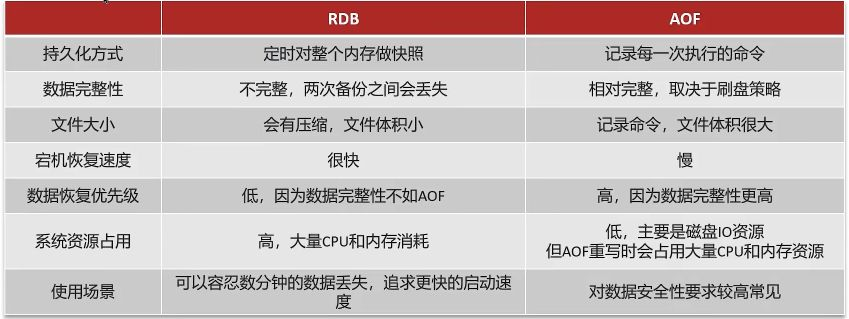
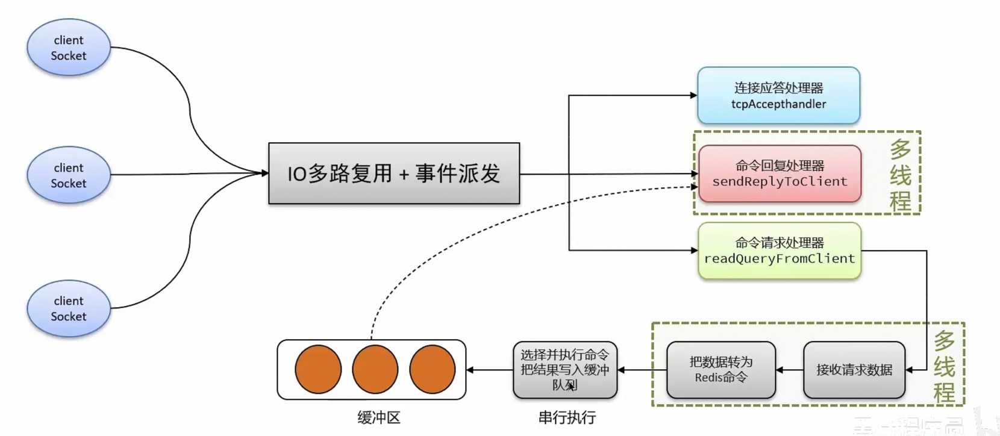
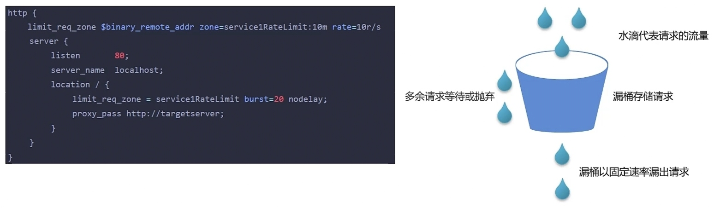
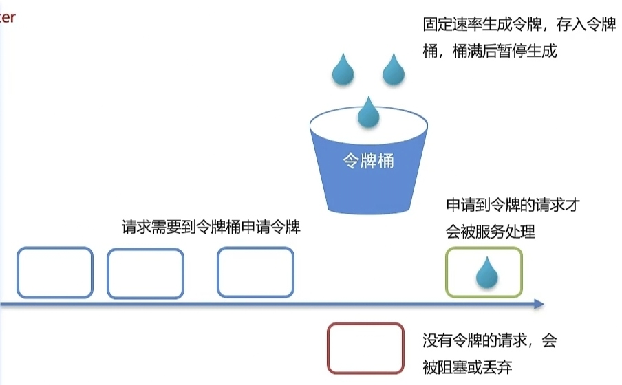
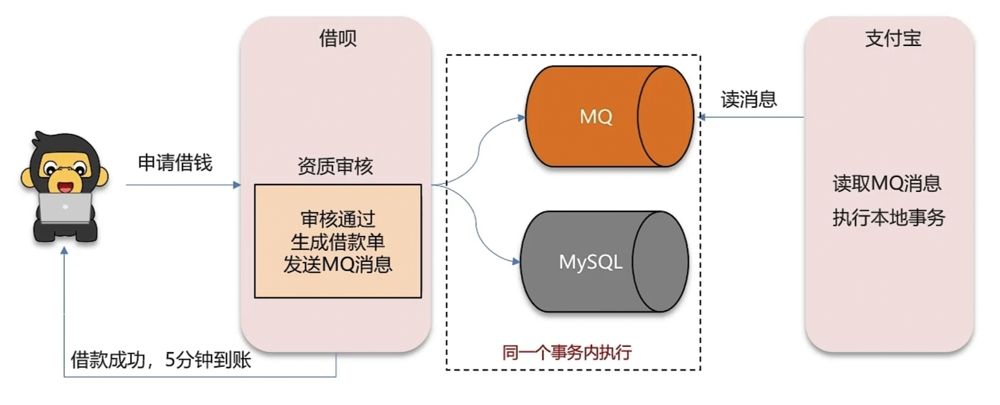
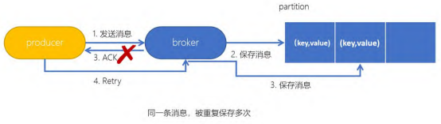
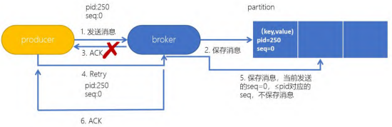
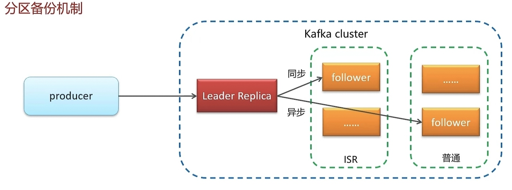
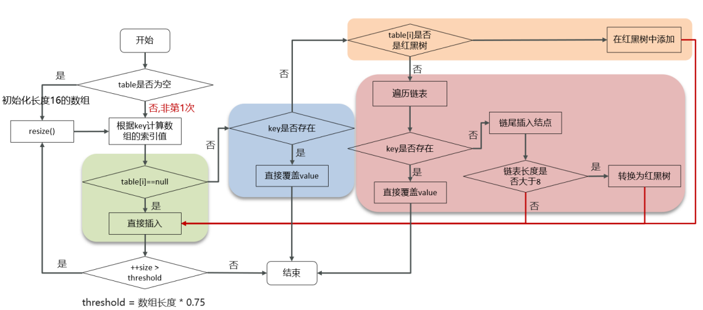
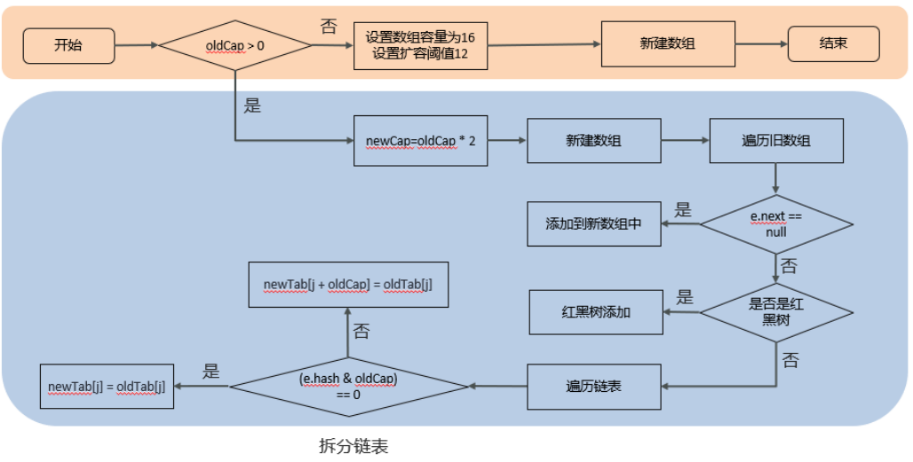

# Java

## 重载和重写

方法的重载和重写都是实现多态的方式，区别在于前者实现的是**编译时的多态性**， 而后者实现的是**运行时的多态性**。

重载发生在一个类中，同名的方法如果有不同 的参数列表（参数类型不同、参数个数不同或者二者都不同）则视为重载；

重写发生在子类与父类之间，重写要求子类被重写方法与父类被重写方法有相同的返回类型，比父类被重写方法更好访问，不能比父类被重写方法声明更多的异常（里氏替换原则）。重载对返回类型没有特殊的要求。

为什么不能根据返回类型来 区分重载？

> 对于`int max(int a, int b)`和`chat max(int a, int b)`，如果调用时没有使用返回值，编译器并不能知道程序员想调用的是哪个方法。
>
> 在《深入理解Java虚拟机》中第6.3.6章节有这样一段：在Java语言中，要重载一个方法，除了要与原方法具有相同的简单名称之外，还要求必须拥有一个与原方法不同的特征签名；
>
> 特征签名就是一个方法中各个参数在常量池中的字段符号引用的集合，也就是因为返回值不会包含在特征签名之中，因此Java语言里面是无法仅仅依靠返回值的不同来对一个已有方法进行重载。但Class文件中，返回值类型也作为特征签名的一部分。
>
> 方法特征签名：用于区分两个不同方法的语法符号。
>
> - **Java语言层面的方法特征签名：** 特征签名 = 方法名 + 参数类型 + 参数顺序
> - **JVM层面的方法特征签名：**特征签名 = 方法名 + 参数类型 + 参数顺序 + 返回值类型

## stream

Java的Stream API是Java 8引入的一个新特性，它允许你以声明性方式处理数据集合（如列表、集合等）。Stream API提供了一种高效且易于阅读的方式来执行复杂的集合操作，如过滤、映射、排序、聚合等。

**创建方法**：`Arrays.steam(array)`、`Collection.stream()`、`Stream.builder()...build()`等。

**中间操作**：

- 过滤：`stream.filter(s -> s.startsWith("a"));`
- 映射：`stream.map(String::toUpperCase);`
- 排序：`stream.sorted();` 或 `stream.sorted(Comparator.reverseOrder());`
- 去重：`stream.distinct();`
- 截取：`stream.limit(5);`
- 跳过：`stream.skip(3);`

**终端操作**：

- 收集到集合：`List<String> result = stream.collect(Collectors.toList());`
- 匹配：`boolean anyMatch = stream.anyMatch(s -> s.isEmpty());`
- 查找：`Optional<String> first = stream.findFirst();`
- 计数：`long count = stream.count();`
- 聚合：`Integer sum = stream.mapToInt(Integer::intValue).sum();`

**注意事项**

- 一旦流被消费（即调用了终端操作），它就不能再被重新使用。
- 流操作不会修改原始数据源。它们返回一个新的流或结果。
- 并行流在处理具有无状态、独立元素的流时效果最佳。在处理具有依赖关系的元素时，可能会导致错误的结果。

# Redis

## 总结

### 使用场景

- 缓存：
	- 缓存穿透、缓存击穿、缓存雪崩
	- 双写一致、持久化
	- 数据过期、淘汰策略
- 分布式锁
	- setnx
	- redisson
- 计算器
- 保存token
- 消息队列
- 延迟队列

### 其他面试题

- 集群
	- 主从
	- 哨兵
	- 集群
- 事务
- Redis为什么快

## 具体题目

### 缓存三兄弟

穿透无中生有key，布隆过滤null隔离。

缓存击穿过期key，锁于非期解难题。

雪崩大量过期key，过期时间要随机。

面试必考三兄弟，可用限流来保底。

#### 缓存穿透

查询一个不存在的数据，mysql查询不到数据，就不会写入缓存，导致每次请求都查询数据库，这可能导致DB挂掉。

解决方案：

- 方法1：缓存空数据
	- 优点：实现简单
	- 缺点：浪费内存，可能发生数据不一致问题
	- 优化：缓存空数据时，加上过期时间
- 方法2：使用布隆过滤器
	- 布隆过滤器对key进行哈希值的计算，存储到位图中，通过检查数据key的哈希值是否在位图中，来过滤空数据
	- 误判率：位图数组越大，哈希冲突概率越小，误判率越小
	- 优点：内存占用少，没有多余key
	- 缺点：实现复杂，并且存在误判

#### 缓存击穿

某个key过期时，正好来了大量对该key的请求，而缓存的更新需要一定的时间；这样会让请求全部查询了数据库，造成对数据库的压力，可能把数据库压垮。

解决方案：

- 方法1：互斥锁（分布式锁）
	- 可以使用setnx/redisson设置锁，第一个获取锁的线程在查询数据库的同时去重建缓存，缓存重建完后才会释放锁，其他休眠重试的线程才能获得锁，从而查询到新的缓存中的数据。
	- 特点：强一致性，但性能差
- 方法2：逻辑过期（或不过期）
	- 查询缓存时，发现数据已经逻辑过期就直接返回旧数据，并获取互斥锁后，开启新的线程去更新缓存；其他发现数据逻辑过期的线程在获取锁失败后，也直接返回旧数据。
	- 特点：最终一致性，高可用，性能好

#### 缓存雪崩

同一时段大量key同时过期或redis服务器宕机，导致大量请求到达数据库，带来巨大压力，可能使数据库挂掉。

解决方案：

- 给不同key设置不同的过期时间（TTL）
	- 在原有失效时间基础上加上一个随机值
- 利用Redis集群提高服务的可用性
	- 哨兵模式
	- 集群模式（分片集群）
- 给缓存业务添加降级限流策略（降级可作为系统的保底策略，适用于穿透、击穿、雪崩）
	- nginx
	- spring cloud gateway
- 给业务添加多级缓存
	- Guave 
	- Caffeine

### 双写一致性

当修改了数据库的数据时，也要同时更新缓存的数据，缓存和数据库的数据要保持一致。

#### 延迟双删

读操作：缓存命中，直接返回；缓存未命中，则查询数据库，并写入缓存，设定超时时间

写操作：延迟双删（缓存要删除两次）

- 延迟双删：删除缓存 --> 修改数据库 ---延迟-->  删除缓存
- 为什么删两次：不管先删除缓存还是先修改数据库，在并发环境，都有可能出现脏数据
- 为什么延迟：数据库一般是主从，需要等待从数据库也更新数据（但这个延迟时间不好设置）
- 该方法不能完全避免有脏数据的风险；但不加锁性能好；小概率产生脏数据，延迟越久概率越小

#### 读写锁

由于一般放入缓存的数据都是读多写少，此时可以用redisson提供的读写锁来保证数据的同步。

特点：强一致性，性能低。

锁：

- 共享锁：读锁readLock，加锁之后，其他线程可以共享读操作。

- 排他锁：独占锁writeLock，加锁之后，阻塞其他线程读写操作。

使用方法：

- 读数据用共享锁：读读不互斥，写互斥
- 写数据用排他锁：读写互斥

#### 异步通知

通过异步通知保证数据的最终一致性，适合允许延迟一致的业务。

- 使用MQ中间件，更新数据后，通知缓存删除
- 利用canal中间件，不需要修改业务代码，伪装为mysql的一个从节点，canal通过读取binlog数据通知缓存删除

流程图：

- 基于MQ的异步通知：需要保证MQ的可靠性

~~~mermaid
graph TB
开始 --修改数据--> item-service
item-service --1.1 写入数据--> MySQL
item-service --1.2 发布消息--> MQ
MQ --2.1 监听消息--> cache-service
cache-service --2.2 更新缓存--> Redis
~~~

- 基于Canal的异步通知：canal是基于mysql的主从同步实现的

~~~mermaid
graph TB
开始 --修改数据--> item-service
item-service --1 写入数据--> MySQL
MySQL --2.1 监听mysql的binlog--> canal
canal --2.2 通知数据变更情况--> cache-service
cache-service --2.3 更新缓存--> Redis
~~~

### 数据持久化

#### RDB

Redis Database Backup file（Redis数据备份文件），也叫Redis数据快照。简单来说就是把内存中的数据都记录到磁盘中，但Redis实例故障重启后，从磁盘读取快照文件，恢复数据。

redis命令：（先通过`redis-cli`进入redis命令窗口）

- `save`：有Redis主进程来执行RDB，会阻塞所有命令。
- `bgsave`：开启子进程执行RDB，避免主进程受到影响。

Redis内部有触发RDB的机制，在`redis.conf`中：

~~~bash
save 900 1	# 900s内，如果至少1个key被修改就bgsave
save 300 10	# 300s内，如果至少10个key被修改就bgsave
save 60 10000
~~~

`bgsave`执行原理：开始时会fork主进程得到子进程，子进程共享主进程的内存数据。完成fork后读取内存数据并写入RDB文件，用新RDB替换旧RDB文件。

- 主进程通过页表对物理内存进行操作，fork时会产生一个子进程并复制页表给它。
- 页表：记录虚拟地址与物理地址的映射关系。

fork采用的是`copy-on-write`技术：从而避免脏写问题

- 当主进程执行读操作时，访问共享内存。
- 当主进程进行写操作时，则会拷贝一份数据副本，执行写操作。

#### AOF

Append Only File（追加文件），Redis处理的每一个命令都记录在AOF文件，可以看做是命令日志。

AOF默认是关闭的，需要修改redis.conf配置文件来开启AOF

~~~bash
appendonly yes	# 默认是no
# AOF文件的名称
appendfilename "appendonly.aof"
~~~

AOF的命令记录的频率也可以通过该文件配置：

~~~bash
# 表示每执行一次写命令就立刻记录到AOF
appendfsync always
# 写命令执行完先放入AOF缓冲区，然后每隔1秒将缓冲数据写入AOF，默认方案
appendfsync everysec
# 写命令执行完先放入AOF缓冲区,由操作系统决定何时将缓冲数据写入AOF
appendfsync no
~~~

| 配置项   | 刷盘时机     | 优点                   | 缺点                         |
| -------- | ------------ | ---------------------- | ---------------------------- |
| always   | 同步刷盘     | 可靠性高，几乎不丢数据 | 性能影响大                   |
| everysec | 每秒刷盘     | 性能适中               | 最多丢失1秒数据              |
| no       | 操作系统控制 | 性能最好               | 可靠性较差，可能丢失大量数据 |

因为是记录文件，AOF文件会比RDB文件大的多，而且AOF会记录对同一个key的多次写操作，但实际只有最后一次写操作才有意义。

通过`bgrewriteaof`命令，可以重写AOF文件，用最少的命令达到同样效果。

Redis也会在触发阈值时自动重写AOF文件，在redis.conf中配置：

~~~bash
# AOF文件比上次文件增长超过多少百分比时触发重写
auto-aof-rewrite-percentage 100
# AOF文件体积最小多大时才触发重写
auto-aof-rewrite-min-size 64mb
~~~

### 数据过期策略

- 惰性删除：获取该key时，redis才会检查其是否过期，过期就删除，返回null

	- 优点：读CPU友好，只会在使用该key时进行检查。

	- 缺点：对内存不友好，如果一个key过期了，但却一直没被使用，就不会被删除。

- 定期删除：每隔一段时间，就对一些key进行检查，删除里面过期的key

	- 每次检查一定量的key，随时间推移，最终会遍历一遍所有key
	- 两种模式：
		- SLOW模式：定时任务，执行频率默认10hz（1s执行10次），每次执行不超过25ms，执行频率可以通过`redis.conf`的的`hz`选项来改变。
		- FAST模式：执行频率不固定，但两次间隔不低于2ms，每次耗时不超过1ms。
	- 优点：可以通过限制删除操作执行的时长和频率来减少删除操作对CPU的影响。能有效释放内存。
	- 缺点：难以确定删除操作执行的时长和频率。

Redis的过期删除策略：惰性删除 + 定期删除 进行配合使用。

### 数据淘汰策略

当Redis的内存不够用时，此时添加新的key时，Redis会按淘汰策略将内存的一些数据删除。

redis支持8种淘汰策略：

~~~bash
#redis.conf可以看到该配置项：
# maxmemory-policy noeviction
~~~

- noeviction：不淘汰任何key，内存满时不允许写入新数据，内存不足时会报错。（默认策略）
- volatile-ttl：删除设置了TTL的key，选择剩余TTL值小的删除。
- allkeys-random：对所有key进行随机淘汰。
- volatile-random：对设置了TTL的key进行随机淘汰。
- allkeys-lru：对全体key，基于LRU算法进行淘汰。
	- LRU：最近最少使用。用当前时间减去最后一次访问时间，这个值越大则淘汰优先级高。
- volatile-lru：对设置了TTL的key，基于LRU淘汰。
- allkeys-lfu：对全体key，基于LFU算法进行淘汰。
	- LFU：最少频率使用。会统计每个key的访问频率，值越小淘汰优先级越高。
- volatile-lfu：对设置了TTL的key，基于LFU淘汰。

使用建议：

- 优先使用`allkeys-lru`，如果数据没有明显的冷热区分，建议使用。
- 如果业务中数据访问频率差别不大，没有明显冷热数据区分，建议使用`allkeys-random`。
- 如果业务中有置顶需求，可以使用`volatile-lru`，同时置顶数据不设置过期时间。
- 如果业务中有短时高频访问的数据，可以使用`allkeys-lfu`或`volatile-lfu`。

### 分布式锁

通常使用场景：集群情况下的定时任务、抢单、幂等性等。（单体项目使用java中的锁即可）

#### setnx

set if not exists，如果不存在，则set。

获取锁：`SET lock value NX EX 10`，NX-互斥、EX-过期时间。

- 过期时间需要同时设置，分开设置不能保证原子性。
- 不设置过期时间，可能出现死锁（服务器宕机时）。

释放锁：`DEL key`

新的问题：业务超时或服务器宕机导致业务没有执行完，锁就释放了，不能保证原子性。那么如何合理控制锁的有效时长。

- 方法1：根据业务执行时间估计
- 方法2：给锁续期

#### Redisson

redisson的分布式锁可以自动给锁续期。当加锁成功后，它会开启新的线程监控持有锁的线程，每隔`releaseTime / 3`的时间做一次续期，直到线程释放锁。该机制被称为`Watch dog`。（releaseTime默认30s）

并且redisson对其他线程获取锁的操作提供了重试机制，当获取锁失败时，会`while`尝试重新获取锁，但一定时间内仍获取失败，就会不再尝试。

redisson加锁、设置过期时间等操作都是用Lua脚本完成，可以保证redis多条命令执行的原子性。

~~~java
// 获取锁(重入锁)
RLock lock = redissonClient.getLock("lock");
// 尝试获取锁’，最大等待时间10s（期间会重试）
boolean isLock = lock .tryLock(10, TimeUnit.SECONDS);
if (isLock) {
    try { System.out.println("执行业务") }
    finally { lock.unlock() }
}
~~~

##### 可重入性

redis的setnx是不可重入锁，redissin实现的分布式锁是可重入锁，它通过**hash**结构记录**线程id**和**重入次数**实现可重入。（同线程重复加锁，重入次数+1）

##### 主从一致性

问题场景：如果线程1获取到了Redis1的锁成功后，Redis1宕机了；而Redis1的锁数据还没有同步到从节点Redis2中，则线程2可以从Redis2中也会获取锁成功。此时不能保证业务的原子性，可能出现脏数据。

解决方法：Redisson提供了`RedLock(红锁)`来解决这种问题。

- 红锁：不能只在一个redis实例上创建锁，应该在多个redis实例上创建锁 $(n / 2 + 1)$。
- 缺点：实现复杂、性能差、运维繁琐。
- 实际：宕机概率很小，并且Redis集群的思想是AP思想，优先保证高可用性，最终一致性；若是需要强一致性的业务，需要使用基于CP思想的**zookeeper**。

### 集群方案

#### 主从集群

单节点Redis的并发能力是有上限的，要进一步提高Redis的并发能力，就需要搭建主从集群，实现读写分离。

redis是读多写少的，可以让master(一个节点)进行写操作，slave/replica(多个节点)进行读操作，master负责把数据同步到从节点上。

主从数据同步原理：

- 全量同步：从节点第一次同步。
	- **master判断一个节点是否是第一次同步的依据，就是看replid是否一致**。

- 增量同步：slave重启或master数据变化了。
	- 基于事件和实时的

> - **Replication Id**：简称replid，是数据集的标记，id一致则说明是同一数据集。每一个master都有唯一的replid，slave则会继承master节点的replid
> - **offset**：偏移量，随着记录在repl_baklog中的数据增多而逐渐增大。slave完成同步时也会记录当前同步的offset。如果slave的offset小于master的offset，说明slave数据落后于master，需要更新。
> - repl_baklog文件：固定大小的环形数组，当出现主offset覆盖了从offset，则说明覆盖了旧的未同步数据。此时从offset会丢失，没有offset就只能进行全量同步了。
>
> 流程：
>
> - slave节点请求增量同步
> - master节点判断replid，发现不一致，拒绝增量同步
> - master将完整内存数据生成RDB，发送RDB给slave
> - slave清空本地数据，加载master的RDB
> - master将RDB期间的命令记录在repl_baklog，并持续将log中的命令发送给slave
> - slave执行接收到的命令，保持与master之间的同步

#### 哨兵模式

哨兵`Sentinel`机制用于实现主从集群的自动故障恢复。Sentinel节点一般最少3个。

- 监控：Sentinel会不断检查master和slave是否按照预期工作。
- 自动故障恢复：如果master故障，Sentinel会将一个slave选举为master；即使故障恢复后，主节点仍是新master。
- 通知：Sentinel充当Redis客户端的服务发现来源，当集群发生故障转移时，会将最新消息推送给Redis客户端。

服务状态监控：Sentinel基于心跳机制监测服务状态，每个哨兵每隔1秒向集群的每个实例发送ping命令。

- 主观下线：如果某sentinel节点发现某实例未在规定时间内响应，则认为该实例主观下线。
- 客观下线：若超过指定数量（quorum）的sentinel都认为该实例主观下线，则该实例客观下线。quorum值最好超过Sentinel实例的一半。

哨兵选主规则：

- 首先判断主与从节点断开时间的长短，若超过配置的指定值，则该从节点不参与选举；
- 然后判断从节点的`slave-priority`值，越小优先级越高；
- **如果优先级一样，则判断salve节点的offset值，越大优先级越高；**
- 最后判断slave节点的运行id大小，越小优先级越高。

哨兵模式的脑裂：如果由于网络分区，虽然master正常运行和执行写操作，但sentinel无法感知到主节点，从节点中选出了新的master；当网络恢复后，原master会被强制降为slave，并清空自己的数据去同步新master的数据，此时可能会丢失大量数据。

解决方法：redis有两个配置参数，合理配置可以避免大量数据的丢失。

- `min-replicas-to-write1`：表示最少的slave节点为1个。
- `min-replicas-max-lag 5`：表示数据复制和同步的延迟不能超过5秒。

#### 分片集群

主从哨兵可以解决高可用、高并发读的问题，但不能解决海量数据存储问题和高并发写的问题，此时需要使用分片集群。

分片集群下：

- 集群中有多个master，每个master保存不同的数据。
- 每个master都可以有多个slave节点。
- master之间通过ping检测彼此健康状态，如某master挂了，会从该master的slave中选出新master。
- 客户端请求访问集群任意节点，都会被转发到正确节点上。

数据读写：分片集群引入了哈希槽，集群总共有16384（2^14）个哈希槽，每个key通过CRC16校验后对16384取模来决定放哪个槽，集群的每个master负责一部分hash槽。

- 若key的显示为：{有效部分}key，则用有效部分做CRC16校验和取模，没有才用key。
- 为什么不对master节点数取模：这样可以通过控制不同节点的槽数来控制不同节点保存的数据。

### 单线程

Redis是单线程的（4.0、6.0分别引入了多线程），为什么那么快？

- Redis是纯内存操作，执行速度非常快。
- 采用单线程，避免了不必要的上下切换带来的损耗，并且不需要考虑线程安全问题，就不会因为引入线程锁等安全手段而影响性能。
- 使用了I/O多路复用模型，NIO。

IO多路复用：利用单个线程同时监听多个Socket，在某个Sokcet可读时/可写时得到通知，socket之间没有先后关系，从而避免无效等待。监听socket和通知的方式有多种实现，常见的有：select、poll、epoll。

- select和poll只会通知用户进程有socket就绪，用户进程需要逐个遍历才能知道具体是哪个socket就绪
- epoll则会通知用户进程socket就绪的同时，把已就绪的socket写入用户空间。

Reids网络模型：使用I/O多路复用结合事件的处理器来应对多个Socket请求。

- 连接应答器
- 命令回复处理器：6.0后，使用了多线程来处理回复事件。
- 命令请求处理器：6.0后，命令的转换使用了多线程，提供命令转换速度，命令执行仍是单线程。

# Mysql

## 总结

- 优化
	- 定位慢查询
	- SQL执行计划
	- 索引
		- 存储引擎
		- 索引底层数据结构
		- 聚簇和非聚簇索引
		- 索引创建原则
		- 索引失效场景
	- SQL优化经验

- 其他
	- 事务相关
		- 事务特性
		- 隔离级别
		- MVCC
	- 主从同步原理
	- 分库分表

## 具体题目

### 定位慢查询

表现：页面加载过慢、接口压测响应时间过长（超过1s）。

方案一：

- 调试工具：Arthas
- 运维工具：Prometheus、Skywalking

方案二：

- MySQL自带慢日志：慢查询日志记录了所有执行时间超过指定参数（long_query_time，单位秒，默认10s）的SQL语句。

	- 调试阶段才开启，它会损耗mysql一定的性能。
	- 开启慢查询日志，需要在配置文件`/etc/my.cnf`中配置：

	~~~bash
	slow_query_log=1	#1-开启、0-关闭慢查询
	long_query_time=2
	~~~

### 优化

#### 优化查询

优化方法：遵循索引设计原则和避免出现索引失效。

对于执行慢的聚合查询、多表查询、表数据量过大的查询，可以通过分析SQL执行计划找到慢的原因。

通过`explain`或`desc`命令可以获取sql执行select语句的信息。

- possible_key：当前key可能会使用到的索引。
- key：当前sql实际命中的索引。
- key_len：索引占用的大小。
	- 通过key和key_len可以判断是否命中索引。
- Extra：额外的优化建议。
	- Using where; Using Index：查询使用了索引，需要的数据都在索引列中能找到，不需要回表查询。
	- Using index condition：查询使用了索引，但是需要回表查询。
	- 出现了回表查询，可以尝试添加索引或修改返回字段来优化。
- type：该sql的连接类型，性能由好到差：null -> system -> const -> eq_ref -> ref -> range -> index -> all
	- null：无需连接表（如select 'A') 
	- system：系统表，少量数据，往往不需要进行磁盘IO（内存中的系统变量） 
	- const：常量连接（命中主键或者唯一索引,被连接的是一个常量值，select * from xx where id = 1，索引一次找到） 
	- eq_ref：主键索引或者非空唯一索引等值扫描（联表查询，命中主键或非空唯一索引，等值连接，扫描一行) 
	- ref：非主键非唯一索引等值扫描（联表查询，普通非唯一索引，扫描多行） 
	- range：范围扫描（between、in、>、>=、<、<=等） 
	- index：索引树扫描（扫描索引的全部key，只比全表扫描快一点，如count(*)） 
	- ALL：全表扫描(full table scan)

#### 表设计

（可参考阿里开发手册《嵩山版》）

- 设置合适的类型（tinyint、int、bigint；char、varchar）。
- char定长效率高，varchar可变效率稍低。

#### SQL

- select语句务必指明字段名称（避免直接使用*）。
- SQL语句要避免造成索引失效的写法。
- 尽量使用`union all`代替`union`，后者会多一次过滤，效率低。
- 避免在where字句对字段进行表达式操作。
- 能使用`inner join`就不用`left right join`，如果必须使用，则一定要以小表驱动。
	- 内连接会优化，优先把小表放外边，大表放里边；外连接不会重新调整顺序。

#### 读写分离

如果数据库的读操作较多，为避免写操作对读操作造成性能影响，可以采用读写分离的架构。

master负责写操作，slave负责读操作；master要把数据同步给slave。

### 索引

- 索引是帮助mysql高效获取数据的数据结构（有序）。
- 提高了数据检索的效率，降低数据库的IO成本（不需全表扫描）。
- 通过索引列对数据进行排序，降低数据排序的成本，降低了CPU消耗。

在数据之外，数据库系统还维护着满足特定查找算法的数据结构B+树。非叶子节点只存储key，叶子节点key和value都存储，并且叶子节点是一个双向链表。

B+数相比其他数据结构：二叉树、红黑数、B树

- 磁盘读写代价更低：阶数更多，路径更短
- 查询效率更稳定（因为要一直找到叶子节点才停止）
- 便于扫库和区间查询（叶子节点是排好序的双向链表）

#### 聚簇索引

也叫聚集索引（clustered index）：将数据与索引放一块，索引结构的叶子节点保存了行数据。

- 特点：必须有，且只有一个。

非聚集索引（二级索引-Secondary index）：将数据与索引分开存储，索引结构的叶子节点关联到对应数据的主键。

- 特点：可以存在多个。

聚集索引选取规则：

- 存在主键，即聚集索引就是主键索引。
- 不存在主键，使用第一个唯一（unique）索引作为聚集索引。
- 也没有唯一索引，则InnoDB会自动生成一个rowid作为隐藏的聚集索引。

##### 回表查询

通过二级索引找到对应的主键值，在到聚集索引中根据主键值找到整行数据，该过程就是回表。

##### 覆盖索引

查询使用了索引，而需要返回的列，在该索引中已经能全部找到。（即不需要回表查询）

#### 分页查询

在数据量较大时，limit分页查询，需要对数据进行排序，效率低。

优化思路：

- 通过**覆盖索引**加**子查询**形式进行优化。

~~~sql
select * from tb where id in
(select id from tb limit 10000, 10)
~~~

- 使用游标分页：分页查询时，记录上一次查询的最大id，下一次查询使用`where`以此id为起点，向后查询

~~~sql
SELECT * FROM tb WHERE id > last_max_id ORDER BY id LIMIT 10;
~~~

> 注：由于跳页时不知道指定页的第一天数据的id，所以这种方式不支持跳页；但现在很多业务都使用瀑布流方式，所有此方法很常用

- 其他优化：
	- 分区表优化：分区表将大表按某个字段分成多个小表，查询时只需访问相关分区，减少查询范围，提高查询效率。
	- 缓存分页结果（redis）

#### 创建原则

- 针对于数据量较大，且查询比较频繁的表建立索引。（单表超过10w）
- 针对于常作为查询条件（where）、排序（order by）、（group by）操作的字段建立索引。
- 尽量选择区分度高的列作为索引，尽量建立唯一索引；区分度越高，使用索引的效率越高。
- 如果是字符串类型字段，且字段长度较长，可以针对字段特点，建立前缀索引。
- 尽量使用联合索引，减少单列索引；查询时，联合索引很多时候可以覆盖索引，节省存储空间，避免回表。
- 要控制索引的数目，索引越多，维护成本越大，会影响增删改的效率。
- 如果索引列不能存储NULL值，创建表时要使用NOT NULL约束它；当优化器知道每列是否包含NULL值，可以更好确定哪个索引用于查询最有效。

#### 索引失效

例如：索引`index`，联合了列`name,state,city`

- 违背最左前缀法则：查询时跳过了索引的某列进行查询。
	- 两种情况
		- 完全失效：跳过了第一列进行查询 (eq=state)。
		- 部分生效：只跳过了中间列进行查询 (eq=name,city)。
	- 最左前缀法则：索引了多列时，查询会从索引的最左列开始匹配，不会跳过索引的列进行匹配。
- 对于联合索引，范围查询时，右侧列索引失效。
	- `<`或`>`：`eq=name, state>1, eq=city`，city索引部分失效。
	- `<=`或`>=`：会走索引，所以尽可能使用带等于的范围查询。
- 索引列上进行运算操作
	- 解决：可以对运算的结果添加索引。
- 字符串不加引号：mysql默认隐式转换是从字符串->数字，但字符串为数字且不加引号时，不会自动转换为字符串。
- 模糊查询：尾部模糊匹配，不会失效；头部模糊匹配会失效。

### 事务

#### 特性ACID

- 原子性（Atomicity）：事务是不可分割的最小操作单元，要么全部成功，要么全部失败。
- 一致性（Consistency）：事务完成时，必须使所有的数据都保持一致状态。 
- 隔离性（Isolation）：数据库系统提供的隔离机制，保证事务在不受外部并发操作影响的独立环境下运行。 
- 持久性（Durability）：事务一旦提交或回滚，它对数据库中的数据的改变就是永久的。

#### 并发事务

并发事务问题：

- 脏读：一个事物读到另外一个事物还没有提交的数据。
- 不可重复读：一个事物先后读取同一条记录，获取数据不同。
- 幻读：一个事物按某条件查询不到对应数据行，但插入时，这行数据又存在，(再查询时仍没有) 好像出现了“幻影”。
- 注：每一个问题都是在解决前一个问题的基础上出现的。

隔离级别：

- 读未提交：三个问题都未解决。
- 读已提交：解决了脏读问题。
- 可重复读：解决了脏读和不可重复读问题。
- 串行化：三个问题都能解决，但性能最差。

mysql默认隔离级别：可重复读。

#### log

缓冲池（buffer pool）：主内存中的一个区域，里面可以缓存磁盘上经常操作的真实数据；执行增删改查时，先操作池中数据（没有从磁盘加载并缓存）；然后以一定频率刷新到磁盘，从而减少磁盘IO，加快处理速度。

数据页（page）：是InnoDB存储引擎磁盘管理的最小单位，每个页默认大小16KB；页中存储行数据。

##### redo-log

重做日志，记录的是事务提交时数据页的物理修改，是用来实现事务的持久性。 

该日志文件由两部分组成：重做日志缓冲（redo log buffer）以及重做日志文件（redo log file）,前者是在内存中，后者在磁盘中。当事务提交之后会把所有修改信息都存到该日志文件中, 用 于在刷新脏页到磁盘,发生错误时, 进行数据恢复使用。

缓冲区的脏页数据并不是实时刷新的，而是一段时间之后 将缓冲区的数据刷新到磁盘中，假如刷新到磁盘的过程出错了，而提示给用户事务提交成功，而数据却没有持久化下来，这就出现问题了，没有保证事务的持久性。

有了redolog之后，当对缓冲区的数据进行增删改之后，会首先将操作的数据页的变化，记录在`redo log buffer`中。在事务提交时，会将`redo log buffer`中的数据刷新到`redo log`磁盘文件中。 过一段时间之后，如果刷新缓冲区的脏页到磁盘时，发生错误，此时就可以借助于`redo log`进行数据恢复，这样就保证了事务的持久性。 而如果脏页成功刷新到磁盘或涉及到的数据已经落盘，此 时`redo log`就没有作用了，就可以删除了，所以存在的两个`redo log`文件是循环写的。

那为什么每一次提交事务，要刷新redo log 到磁盘中呢，而不是直接将`buffer pool`中的脏页刷新到磁盘呢 ?

> 因为在业务操作中，我们操作数据一般都是随机读写磁盘的，而不是顺序读写磁盘。 而redo log在 往磁盘文件中写入数据，由于是日志文件，所以都是顺序写的。顺序写的效率，要远大于随机写。 这 种先写日志的方式，称之为 WAL（Write-Ahead Logging）。

##### undo-log

回滚日志，用于记录数据被修改前的信息 , 作用包含两个 : 提供回滚(保证事务的原子性) 和 MVCC(多版本并发控制) 。

它可以实现事务的一致性（和redo-log）和原子性。

`undo log`和`redo log`记录物理日志不一样，它是逻辑日志。可以认为当delete一条记录时，`undo log`中会记录一条对应的insert记录，反之亦然，当update一条记录时，它记录一条对应相反的 update记录。当执行`rollback`时，就可以从`undo log`中的逻辑记录读取到相应的内容并进行回滚。 

`Undo log`销毁：`undo log`在事务执行时产生，事务提交时，并不会立即删除`undo log`，因为这些 日志可能还用于MVCC。 

`Undo log`存储：`undo log`采用段的方式进行管理和记录，存放在前面介绍的 `rollback segment` 回滚段中，内部包含1024个`undo log segment`。

#### mvcc

多版本并发控制（Multi-Version Concurrency Control），指维护一个数据的多个版本，使得读写操作没有冲突。

MVCC的具体实现依赖数据库记录中的隐藏字段、undo-log日志、readView。

##### 隐藏字段

- DB_TRX_ID：最近修改事务ID，记录插入这条记录或最后一次修改该记录的事务ID。 
- DB_ROLL_PTR：回滚指针，指向这条记录的上一个版本，用于配合undo log，指向上一个版 本。 
- DB_ROW_ID：隐藏主键，如果表结构没有指定主键，将会生成该隐藏字段。

##### 回滚日志

在insert、update、delete的时候产生的便于数据回滚的日志。

-  当insert的时候，产生的undo log日志只在回滚时需要，在事务提交后，可被立即删除。
- 而update、delete的时候，产生的undo log日志不仅在回滚时需要，在快照读时也需要，不会立即被删除。

版本链：不同事务或相同事务对同一条记录进行修改，会导致该记录的undo-log生成一条**记录版本链表**，链表的头部是最新的旧记录，链表尾部是最早的旧记录。

##### readView

ReadView（读视图：快照读 SQL执行时MVCC提取数据的依据，记录并维护系统当前活跃的事务 （未提交的）id。

- m_ids：当前活跃的事务ID集合。
- min_trx_id：最小活跃事务ID。
- max_trx_id：预分配事务ID，当前最大事务ID+1（因为事务ID是自增的）。
- creator_trx_id：ReadView创建者的事务ID。

当前读：读取的是记录的最新版本，读取时还要保证其他并发事务不能修改当前记录，会对读取的记录进行加锁。对于我们日常的操作，如：select ... lock in share mode(共享锁)，select ... for update、update、insert、delete(排他锁)都是一种当前读。

快照读：简单的select（不加锁）就是快照读，快照读，读取的是记录数据的可见版本，有可能是历史数据， 不加锁，是非阻塞读。 

- Read Committed：每次select，都生成一个快照读。  
- Repeatable Read：开启事务后第一个select语句才是快照读的地方。
- Serializable：快照读会退化为当前读。

版本链数据的访问规则：（trx_id 代表当前undolog版本链对应事务ID）

- trx_id == creator_trx_id：可以访问该版本。成立，说明数据是当前这个事务更改的。 
- trx_id < min_trx_id：可以访问该版本。成立，说明数据已经提交了。 
- trx_id > max_trx_id：不可以访问该版本。成立，说明该事务是在 ReadView生成后才开启。 
- min_trx_id <= trx_id <= max_trx_id：如果trx_id不在m_ids中， 是可以访问该版本的。 成立，说明数据已经提交。

不同的隔离级别，生成ReadView的时机不同：

- READ COMMITTED ：在事务中每一次执行快照读时生成ReadView。 
- REPEATABLE READ：仅在事务中第一次执行快照读时生成ReadView，后续复用该ReadView。

### 主从同步

MySQL主从复杂的核心就是二进制日志。

二进制日志（BINLOG）记录了所有的DDL语句和DML语句，但不包括DQL语句（select、show）。

复制分三步：

1. master在事务提交时，会把数据变更记录到二进制日志文件Binglog中。

2. slave读取master的Binlog，写入到slave的中继日志`Relay Log`。
3. slave重做中继日志中的事件，改变自己的数据。

### 分库分表

分库分表的时机：

- 前提：项目业务数据过多（单表数据达1000W或20G以后）。
- 优化（如读写分离、索引）已解决不了性能问题。
- 两个瓶颈：IO瓶颈（磁盘和网络）、CPU瓶颈（聚合查询、连接数太多）。

拆分策略：

- 垂直拆分
	- 垂直分库：以表为依据，根据业务将不同表拆分到不同库中。
		- 特点：按业务对数据分级管理、维护、监控、扩展；在高并发下，提高了磁盘IO和数据连接数。
	- 垂直分表：以字段为依据，根据字段属性将不同字段拆分到不同表中。
		- 规则：把不常用的字段单独放在一张表中；把text、blob等大字段拆分出来放在附表中。
		- 特点：冷热数据分离；减少IO争抢，两表互不影响。
- 水平拆分
	- 水平分库：将一个库的数据拆分到多个库中。
		- 路由规则：根据节点id取模；按数据范围路由。
		- 特点：解决了单库大数量，高并发的性能瓶颈问题；提高了系统的稳定性和可用性。
	- 水平分表：将一个表的数据拆分到多个表中。
		- 特点：优化单一表数据量过大而产生的性能问题；避免IO争抢并减少锁表的几率。

分库后的问题：

- 分布式事务一致性问题。
- 跨节点关联查询。
- 跨节点分页、排序函数。
- 主键避重。
- 解决方法：使用分库分表中间件（sharding-sphere、mycat）

# 框架

## 总结

Spring

- spring
	- Bean线程安全问题
	- AOP：事务原理、事务失效
	- Bean的生命周期
	- 循环依赖
- springmvc：执行流程
- springboot：自动配置原理

Mybatis

- 执行流程
- 延迟加载
- 一二级缓存

## 具体题目

### Bean

##### 线程安全

单例Bean本身是线程安全的，因为它是无状态的（不能被修改）。

但如果在bean中定义了可修改的成员变量，是要考虑线程安全问题的，可以使用多例或加锁来解决。

##### 生命周期

步骤2-6都是在进行初始化和赋值。Bean的创建和初始化赋值是分开的。

1. 构造函数：BeanDefinition
2. 依赖注入
3. Aware接口：BeanNameAware、BeanFactoryAware、ApplicationContextAware
4. BeanPostProcessor#before
5. 初始化方法：InitializingBean、自定义init方法
6. BeanPostProcessor#after：AOP（动态代理JDK\CGLIB）
7. 销毁bean。

对应：

1. 通过BeanDefinition获取bean的定义信息。
2. 调用构造函数实例化bean。
3. bean的依赖注入。
4. 处理Aware接口。
5. Bean的后置处理器BeanPostProcessor-前置。
6. 初始化方法（InitializingBean、init-method）。
7. Bean的后置处理器BeanPostProcessor-后置。
8. 销毁bean。

### AOP

AOP面向切面编程，用于将哪些与业务无关，但却对多个对象产生影响的公共行为与逻辑，抽取并封装为一个可重用的模块，这个模块被命名为“切面aspect”，减少了系统中的重复代码，降低了模块间的耦合度，提高了系统的可维护性。

常见AOP使用场景：

- 记录操作日志：使用环绕通知+切点表达式（自定义注解）
- 缓存处理。
- Spring内置的事务处理。

### 事务

spring支持编程式事务管理和声明式事务管理两种。

- 编程式事务控制：需要使用TransactionTemplate来实现，对业务代码有侵入性，很少使用。
- 声明式事务管理：本质是通过AOP，对方法前后进行拦截，将事务处理的功能编织到拦截的方法中；即方法开始前加入事务，执行完根据情况提交事务或回滚事务。

事务失效场景：

- 异常捕获处理：自己捕获了异常，并且没有抛出。
- 抛出检查异常：spring默认只会回滚非检查异常。
	- 解决方法：@Transaction注解使用rollbackFor属性指定对哪些异常进行回滚。
- 非public方法：spring只代理public的方法。
- 类内部调用事务方法：不会走代理，事务失效。
- propagation事务传播行为配置错误：如果事务的传播行为配置错误，例如设置为不支持事务的传播类型，那么方法执行时就不会启动新的事务，也不会加入到已有的事务中，导致事务失效。
- 数据库本身不支持事务：使用的数据库或存储引擎不支持事务（例如MySQL的MyISAM引擎）
- ......

### 循环依赖

spring三级缓存解决了大部分的循环依赖问题，但解决不了构造方法依赖注入造成的循环依赖问题；此时可以用@Lazy注解，通过懒加载解决该问题。

循环依赖：两个或两个以上的bean互相持有对方，最终形成闭环。

- 一级缓存：单例池，缓存已经经历了完整的生命周期，已经初始化完成的bean对象。
- 二级缓存：缓存早期(半成品)的bean对象（生命周期还没走完）。
- 三级缓存：缓存的是ObjectFactory，表示对象工厂（用来创建某个(代理)对象的）。

过程：A<-->B（无AOP --> 非代理对象）

1. A实例化放入三级缓存 --> 需要B --> 一级缓存无且不在创建中
2. B实例化放入三级缓存 --> 需要A --> 一级缓存无但在创建中
3. 从二级缓存找A --> 无 --> 从三级缓存找 --> 获取成功
4. 将A从三级缓存移除，放入二级缓存 --> 给B注入A
5. B成为成品 --> 三级缓存移除B，放入一级缓存 
6. 给A注入B --> 二级缓存移除A，放入一级缓存

### mvc流程

视图版本：Jsp

1. 用户发送请求到前端控制器DispatcherServlet。
2. DispatcherServlet收到请求调用HandlerMapping（处理器映射器）。
3. HandleMapping找到具体的处理器(如controller)，生成处理器对象及处理器拦截器(如果有，是一个执行链)，再一起返回给DispatcherServlet。
4. DispatcherServlet调用HandlerAdapter（处理器适配器）。
5. HandleAdapter经过适配调用处理器（Handler/Controller）的具体方法。
6. 处理器方法执行完成返回ModelAndView对象。
7. HandlerAdapter将ModelAndView返回给DispatcherServlet。
8. DispatcherServlet将ModelAndView传给ViewReslover（视图解析器）。
9. ViewReslover解析后返回具体View（视图）。
10. DispatcherServlet根据View进行渲染视图。
11. DispatcherServlet响应用户。

前后端分离开发，接口开发：

1. 用户发送出请求到前端控制器DispatcherServlet。
2. DisPatcherServlet收到请求调用HandlerMapping（处理器映射器）。
3. HandlerMapping找到具体的处理器，生成处理器对象及处理器拦截器(如果有)，再一起返回给DispatcherServlet。
4. DispacherServlet调用HandlerAdapter（处理器适配器）。
5. HandlerAdapter经过适配调用（Handler/Controller）的具体方法。
6. 方法上添加了@ResponseBody。
7. 通过HttpMessageConverter来返回结果转换为JSON并响应。

### 自动配置

1. springboot项目引导类上有一个注解@SpringBootApplication，这个注解对三个注解进行了封装：
	- @SpringBootConfiguration
	- @EnableAutoConfiguration
	- @ComponentScan
2. 其中@EnableAutoConfiguration是实现自动化配置的核心注解。该注解通过@Import注解导入对应的配置选择器：`@Import({AutoConfigurationImportSelector.class})`。（它会读取该项目和该项目引用的jar包的classpath路径下META-INF/spring.factories文件中所配置的类的全类名。这些配置类中所定义的bean会根据条件注解所指定的条件来决定是否将该配置类定义的bean导入到spring容器中）
3. 条件判断会有像@ConditionalOnClass这样的注解，它会判断是否有对应的class文件，有则加载此类，把此配置类定义的bean放入spring容器中。

### 常用注解

spring：

- @Component、@Controller、@Service、@Repository：使用在类上，用于实例化Bean。
- @Autowired：使用在字段上用于根据类型依赖注入。
- @Qualifier：结合@Autowired用于根据名称进行依赖注入。
- @Scope：标注Bean的作用范围。
- @Configuration：指定当前类时配置类。
- @ComponentScan：用于指定spring在初始化容器时要扫描的包。
- @Bean：可以将方法参数作为bean放入spring容器。
- @Import：使用@Import导入的类会被加载到IOC容器中。
- @Aspect、@Before、@After、@Around、@Pointcut：用于切面编程。

springmvc

- @RequestMapping：用于映射请求路径，可以定义在类上和方法上。
- @RequestBody：参数注解，将json转换为对象。
- @RequestParam：参数注解，指定请求参数的名称。
- @PathViriable：参数注解，指定并关联路径参数名称。
- @ResponseBody：将controller返回对象转换为json响应。
- @RequestHeader：获取指定请求头数据。
- @RestController：@Controller + @ResponseBody

springboot

- @SpringBootConfiguration：组合了@Configuration，实现配置文件的功能。
- @EnableAutoConfiguration：打开自动配置的功能。
- @ComponentScan：spring组件扫描。 

### mybatis

#### 执行流程

1. 读取Mybatis配置文件`mybatis-config.xml`，加载运行环境和映射文件。
2. 构造会话工厂SqlSessionFactory（全局唯一）。
3. 会话工厂创建SqlSession对象（包含了执行SQL语句的所有方法）。
4. Executor执行器，MyBatis核心，负责SQL语句的生成和查询缓存的维护，它将根据SqlSession传递的参数动态地生成需要执行的SQL语句，同时负责查询缓存的维护。
5. Executor接口的执行方法中有一个MapperStatement类型的参数，封装了映射信息。（MappedStatement是对解析的SQL的语句封装，一个MappedStatement代表了一个sql语句标签）
6. 输入参数映射。
7. 输出结果映射。

#### 延迟加载

Mybatis支持延迟加载，但默认未开启。 延迟加载即某属性不用时不查询数据库，用时在查询数据库。

mybatis支持一对一关联对象和一对多关联集合对象的延迟加载。

开启方法（底层是动态代理了get方法，发现为null，就执行sql）：

- 局部：给相应SQL语句标签加上属性`fetchType="lazy"`。
- 全局：在`mybatis-config.xml`的settings标签里加上：`<setting name="lazyLoadingEnabled" value"true" />`

#### 缓存

本地缓存，基于PerpetualCache，本质是一个HashMap。

一级缓存：作用域是session级别。

二级缓存：作用域是namespace和mapper的作用域，不依赖于session。

##### 一级缓存

基于PerpetualCache的HashMap本地缓存，存储作用域为session，但session进行flush或close之后，该session的cache就将被清空，默认打开了一级缓存。

##### 二级缓存

基于namespace和mapper的作用域其作用的，不依赖于sqlSession，默认也是采用PerpetualCache的HashMap存储。

开启方法（默认关闭）：

1. 全局配置文件`mybatis-config.xml`的settings标签里加：`<setting name="cacheEnabled" value=“true”/>`
2. 映射文件中使用cache标签让当前mapper生效二级缓存。

注意：

- 当某个作用域(一级/二级)内进行了增删改操作，默认该作用域所有select缓存都被clear。
- 二级缓存只能缓存实现了Serializable接口的数据。
- 只有会话提交或关闭后，一级缓存的数据才会转移到二级缓存。

# 微服务

## 总结

spring cloud

- 服务注册：nacos、eureka
- 负载均衡：Ribbon负载均衡策略、自定义负载均衡
- 熔断、降级
- 监控：skywalking

业务相关

- 线程隔离：线程池隔离、信号量隔离

- 限流：滑动窗口计数算法、漏桶算法、令牌桶算法
- 分布式事务：CAP和BASE、分布式事务解决方案、seata
- 分布式服务接口幂等
- 分布式任务调度：xxl-job

消息中间件

- RabbitMQ
- Kafka

## 具体题目

### 5大组件

springCloud的5大组件是什么？

- 传统

	- 注册中心：eureka 

	- 负载均衡：ribbon

	- 远程调用：Feign

	- 服务熔断：Hystrix

	- 网关：zuul / gateway

- springCloudAlibaba

	- 注册中心/配置中心：nacos
	- 负载均衡：ribbon
	- 服务调用：feign
	- 服务保护：sentinel
	- 服务网关：gateway

### 服务注册发现

常见的注册中心：**eureka**、**nocas**、zookeeper

**服务提供者**注册服务信息到注册中心，**服务消费者**从注册中心拉取服务提供者信息。

注册中心的核心作用是：服务注册和发现。对于eureka：

- 服务注册：服务提供者需要把自己的信息注册到eureka，让注册中心来保存服务名称、ip、端口等信息。
- 服务发现：消费者向eureka拉取服务列表信息，如果服务提供者有集群，则消费者会利用负载均衡算法，选择一个发起调用。
- 服务监控：服务提供者会每隔30s向注册中心发送心跳，报告健康状态，进行心跳续约；例如eureka服务90s没接收到心跳，会移除该服务。

nacos与eureka区别：

- 同：
	- 都支持服务注册和服务拉取。
	- 都支持服务提供者心跳方式做健康检测。
- 异：
	- 支持服务端主动检测提供者状态：临时实例采用心跳模式，非临时实例采用主动模式。
	- 临时实例心跳不正常会被剔除，非临时实例则不会被剔除。
	- 支持服务列表变更的消息推送模式，服务列表更新更及时（既支持pull，又支持push）。
	- 默认采用AP方式，当集群中存在非临时实例，采用CP模式；eureka采用AP方式。
	- 还支持配置中心，eureka只支持注册中心。

### 负载均衡

Ribbon负载均衡流程：

1. 服务消费者发起请求 --> 调用Ribbon组件；
2. Ribbon --> 向注册中心拉取服务列表；
3. Ribbon拉取到服务列表后，进行负载均衡（例如轮询）；
4. Ribbon轮询到服务8081 --> 远程调用服务。

Ribbon负载均衡策略：

- **RoundRobinRule**：简单轮询服务列表。

- **WeightedResponseTimeRule**：按照权重来选择服务器，响应时间越长，权重越小。

- **RandomRule**：随机选择一个可用的服务。

- BestAvailableRule：忽略短路的服务器，选择当前并发数较低的服务器。

- RetryRule：重试机制的选择逻辑。

- AvailabilityFilteringRule：可用性敏感策略，先过滤非健康的，在选择连接数较少的实例。

- **ZoneAvoidanceRule**：以区域可用的服务器为基础进行服务的选择。使用Zone对服务器进行分类（一个机房/机架），然后对zone内的多个服务做轮询。（默认）

- 自定义：创建类实现IRule接口，然后通过配置类/配置文件配置好即可。

	- 全局

	~~~java
	@Bean
	public IRule randomRule() {
	    return new RandomRule();
	}
	~~~

	- 局部：指定某消费者服务的负载均衡策略。

	~~~yml
	user_service:
	  ribbon:
	    NFLoadBalancerRuleClassName: com.netflix.loadbalancer.RandomRule
	~~~

### 服务雪崩

一个服务失败，导致整条服务链都失败的情形。

解决方法：熔断降级（Hystrix服务熔断降级）

- 服务降级：服务自我保护或保护下级服务的一种方式，用于确保服务不会受请求突增影响变得不可用，确保服务不会崩溃。一般于feign接口整合，编写降级逻辑；如果降级太多，会触发熔断机制。（针对某接口）
- 服务熔断：Hystrix熔断机制，用于监控微服务调用情况，默认关闭；开启方法是在引导类上加上注解@EnableCircuitBreaker，如果10s内请求的失败率超过50%，就触发熔断机制（例如快速失败），之后每隔5s重新尝试请求（放行一次请求）微服务，如果微服务不能响应，则继续走熔断机制；否则关闭熔断机制，恢复正常请求。（针对某服务）

预防：限流

### 服务监控

为什么需要监控：

- 问题定位
- 性能分析
- 服务关系
- 服务告警

常用监控工具：

- springboot-admin：搭建简单、功能单一
- prometheus+Grafana：企业常用、功能强大、搭建复杂
- zipkin：跟代码有耦合（链路追踪工具）
- skywalking：（链路追踪工具）

skywalking：分布式系统的应用程序性能监控工具（Application Performance Managment），提供了完善的链路追踪能力，apache顶级项目（前华为产品经理主导开源）。

- 服务（service）：业务资源应用系统（微服务）
- 端点（endpoint）：应用系统对外暴露的功能接口（接口）
- 实例（instance）：物理机
- 告警：配置文件中预定义的告警规则如下
	- 过去10分钟的3分钟内服务平均响应时间超过1s达3次
	- 过去10分钟内服务成功率低于80%达2次
	- 过去10分钟内服务90%响应时间低于1s达3次
	- 过去10分钟内服务的响应时间超1s达2次
	- 过去10分钟内端点的响应时间超过1s达2次

### 线程隔离

Hystix和Sentinel都支持线程隔离，前者默认使用线程池隔离，后者默认使用信号量隔离。

- **线程池****隔离**：给每个服务调用业务分配一个线程池，利用线程池本身实现隔离效果
	- 特点：每个被隔离的业务都需要创建一个独立线程池，会带来过多的CPU开销，性能一般，但隔离性强。
- **信号量****隔离**：不创建线程池，而是计数器模式，记录业务使用的线程数量，达到信号量上限时，禁止新的请求
	- 特点：不用创建线程池，性能较好，但隔离性一般。

### 限流

为什么限流：

- 并发比较大（突发流量）
- 防止用户恶意刷接口

限流的实现方式：

- Tomcat：可以设置最大连接数。
- Sentinel：滑动窗口计数算法、漏桶算法、令牌桶算法
- Nginx：漏桶算法
- 网关：令牌桶算法
- 自定义拦截器

#### sentinel限流

- sentinel默认限流模式和断路器的计数都基于滑动时间窗口算法。
- 限流后可以快速失败和排队等待，其排队等待基于漏桶算法实现。
- 热点参数限流基于令牌桶算法。

固定时间窗口算法中窗口有很多，其跨度和位置是与时间区间绑定，因此是很多固定不动的窗口。而滑动时间窗口算法中只包含1个固定跨度的窗口，但窗口是可移动动的，与时间区间无关。

具体规则如下：

- 窗口时间跨度`Interval`大小固定，例如1秒
- 时间区间跨度为`Interval / n` ，例如n=2，则时间区间跨度为500ms
- 窗口会随着当前请求所在时间`currentTime`移动，窗口范围从`currentTime-Interval`时刻之后的第一个时区开始，到`currentTime`所在时区结束。

这就是滑动窗口计数的原理，解决了我们之前所说的问题。而且滑动窗口内划分的时区越多，这种统计就越准确。

#### nginx限流

漏桶的优势就是**流量整型**，不管并发量如何波动，经过漏桶处理后的请求一定是相对平滑的曲线。

- 使用场景用于需要严格控制输出速率的场景，如防止网络拥塞、限制带宽使用等。由于漏桶算法的漏出速率是固定的，因此它可以为网络提供一个稳定的流量。
- 特点：具有强制性和稳定性，能够确保网络流量不会超过预定的限制，从而避免网络拥塞和性能下降。

- 语法：limit_req_zone key zone rate
- key定义限流对象，binary_remote_addr就是一种key，基于客户端ip限流。
- Zone：定义共享存储区来存储访问信息，10m可以存储16w ip地址访问信息。
- Rate：最大访问速率，rate=10r/s，表示每秒最多请求10个。
- burst=20：相当于桶的大小。
- Nodelay：快速处理。

控制并发连接数

~~~nginx
http {
    limit_conn_zone $binary_remote_addr zone=perip:10m;
	limit_conn_zone $server_name zone=perserver:10m;

	server {
		listen 80;
        server_name localhost;
        location / {
            ...
            #对应key是$binary_remote_addr，表示单个ip同时最多能持有20个连接数
            limit_conn perip 20;
            #对应key是$server_name，表示虚拟主机（server）同时能处理并发连接的总数
            limit_conn perserver 100;
            proxy_pass http://targetserver;
        }
    }
}
~~~

#### 网关限流

采用了基于Redis实现的令牌桶算法。

- 介绍：每秒产生的令牌数量基本就是QPS上限，但可能出现某秒放行2N个请求的现象，因此尽量不要将令牌上限设定到服务能承受的QPS上限。而是预留一定的波动空间，这样我们才能应对突发流量。

- 应用场景：适用于具有突发特性的流量，如网络视频、实时交互应用等。在这些场景中，流量可能会在短时间内出现高峰，但平均速率仍然需要控制在一定范围内。

- 特点：具有更大的灵活性，可以根据需要配置平均发送速率和突发门限，以适应不同流量的需求。

yml配置文件中，微服务路由设置添加局部过滤器`RequestRateLimiter`

~~~yml
- id: gateway-consumer
  url: 1b://GATEWAY-CONSUMER
  predicates:
  - Path=/order/**
  filters:
    - name: RequestRateLimiter
      args:
        # 使用SpEL从容器中获取对象
        key-resolver: '#{@pathKeyResolver}'
        # 令牌桶每秒填充平均速率
        redis-rete-limiter-replenishRate: 1
        # 令牌桶的上限
        redis-rate-limter.burstCapacity: 3
~~~

- key-resolver：定义限流对象（ip、路径、参数），需代码实现，使用spel表达式获取。
- replenishRate：令牌桶每秒填充平均速率。
- burstCapacity：令牌桶总容量。

### 事务理论

#### CAP定理

1998年，加州大学的计算机科学家 Eric Brewer 提出，分布式系统有三个指标。

> - Consistency（一致性）：用户访问分布式系统中的任意节点，得到的数据必须一致。
> - Availability（可用性）：用户访问集群中的任意健康节点，必须能得到响应，而不是超时或拒绝。
> - Partition tolerance （分区容错性）
> 	- **Partition（分区）**：因为网络故障或其它原因导致分布式系统中的部分节点与其它节点失去连接，形成独立分区。
> 	- **Tolerance（容错）**：在集群出现分区时，整个系统也要持续对外提供服务

这三个指标不可能同时做到。这个结论就叫做 CAP 定理。

#### BASE理论

BASE理论是对CAP的一种解决思路，包含三个思想：

- **Basically Available** **（基本可用）**：分布式系统在出现故障时，允许损失部分可用性，即保证核心可用。
- **Soft State（软状态）：**在一定时间内，允许出现中间状态，比如临时的不一致状态。
- **Eventually Consistent（最终一致性）**：虽然无法保证强一致性，但是在软状态结束后，最终达到数据一致。

#### 解决思路

借鉴CAP定理和BASE理论，有两种解决思路：

- AP模式：各子事务分别执行和提交，允许出现结果不一致，然后采用弥补措施恢复数据即可，实现最终一致。

- CP模式：各个子事务执行后互相等待，同时提交，同时回滚，达成强一致。但事务等待过程中，处于弱可用状态。

但不管是哪一种模式，都需要在子系统事务之间互相通讯，协调事务状态，也就是需要一个**事务协调者(TC)**；这里的子系统事务，称为**分支事务**；有关联的各个分支事务在一起称为**全局事务**。

#### 解决方案

Seata事务管理中有三个重要的角色：

- **TC (Transaction Coordinator) -** **事务协调者：**维护全局和分支事务的状态，协调全局事务提交或回滚。

- **TM (Transaction Manager) -** **事务管理器：**定义全局事务的范围、开始全局事务、提交或回滚全局事务。

- **RM (Resource Manager) -** **资源管理器：**管理分支事务处理的资源，与TC交谈以注册分支事务和报告分支事务的状态，并驱动分支事务提交或回滚。

Seata基于上述架构提供了四种不同的分布式事务解决方案：

- XA模式：强一致性分阶段事务模式，牺牲了一定的可用性，无业务侵入
- TCC模式：最终一致的分阶段事务模式，有业务侵入
- AT模式：最终一致的分阶段事务模式，无业务侵入，也是Seata的默认模式
- SAGA模式：长事务模式，有业务侵入

无论哪种方案，都离不开TC，也就是事务的协调者。

##### XA模式

Seata对原始的XA模式做了简单的封装和改造，以适应自己的事务模型，基本架构如图：

RM一阶段的工作：

​	① 注册分支事务到TC

​	② 执行分支业务sql但不提交

​	③ 报告执行状态到TC

TC二阶段的工作：

- TC检测各分支事务执行状态

	a.如果都成功，通知所有RM提交事务

	b.如果有失败，通知所有RM回滚事务

RM二阶段的工作：

- 接收TC指令，提交或回滚事务

> XA模式的优点是什么？
>
> - 事务的强一致性，满足ACID原则。
> - 常用数据库都支持，实现简单，并且没有代码侵入
>
> XA模式的缺点是什么？
>
> - 因为一阶段需要锁定数据库资源，等待二阶段结束才释放，性能较差
> - 依赖关系型数据库实现事务

##### AT模式

AT模式同样是非阶段提交的事务模型，不过弥补了XA模型中资源锁定周期过长的缺陷。

阶段一RM的工作：

- 注册分支事务
- 记录undo-log（数据快照）
- 执行业务sql并提交
- 报告事务状态

阶段二提交时RM的工作：

- 删除undo-log即可

阶段二回滚时RM的工作：

- 根据undo-log恢复数据到更新前

> AT模式与XA模式的区别如下：
>
> - XA模式一阶段不提交事务，锁定资源；AT模式一阶段直接提交，不锁定资源。
> - XA模式依赖数据库机制实现回滚；AT模式利用数据快照实现数据回滚。
> - XA模式强一致；AT模式最终一致
>
> AT模式的优点：
>
> - 一阶段完成直接提交事务，释放数据库资源，性能比较好
> - 利用全局锁实现读写隔离
> - 没有代码侵入，框架自动完成回滚和提交
>
> AT模式的缺点：
>
> - 两阶段之间属于软状态，属于最终一致
> - 框架的快照功能会影响性能，但比XA模式要好很多

##### TCC模式

Seata中的TCC模型依然延续之前的事务架构，如图：

TCC模式与AT模式非常相似，每阶段都是独立事务，不同的是TCC通过人工编码来实现数据恢复。需要实现三个方法：

- Try：资源的检测和预留； 

- Confirm：完成资源操作业务；要求 Try 成功 Confirm 一定要能成功。

- Cancel：预留资源释放，可以理解为try的反向操作。

> TCC的优点是什么？
>
> - 一阶段完成直接提交事务，释放数据库资源，性能好
> - 相比AT模型，无需生成快照，无需使用全局锁，性能最强
> - 不依赖数据库事务，而是依赖补偿操作，可以用于非事务型数据库
>
> TCC的缺点是什么？
>
> - 有代码侵入，需要人为编写try、Confirm和Cancel接口，太麻烦
> - 软状态，事务是最终一致
> - 需要考虑Confirm和Cancel的失败情况，做好幂等处理

##### MQ事务消息

MQ实现分布式事务，在A服务写数据时，需要在同一个事务内发送消息到另一个事物，异步，性能最好。

### 接口幂等性

幂等：多次调用方法或接口不会改变业务状态，可以保证重复调用的结果和单次调用的结果一致。

需要幂等场景：

- 用户重复点击（网络波动）
- MQ消息重复
- 应用使用失败或超时重试机制

基于Restful API的角度对部分常见类型请求的幂等性特点进行分析：

| 请求方式 | 说明                                                         |
| -------- | ------------------------------------------------------------ |
| GET      | 查询操作，天然幂等                                           |
| POST     | 新增操作，请求一次与请求多次造成的结果不同，不是幂等的       |
| PUT      | 更新操作，如果是以全量方式更新，是幂等的；如果是通过增量方式更新，则不是幂等的 |
| DELETE   | 删除操作，根据唯一值删除，是幂等的                           |

解决方法：

- 数据库唯一索引：可以解决新增的幂等问题。
- token+redis：新增、修改（性能好）
	- 第一次请求，生成token，返回给前端
	- 第二次请求进行业务处理，携带token到redis验证：存在，执行业务，删除token；不存在，直接返回，不处理业务。
- 分布式锁：新增、修改（性能低）

### 任务调度

xxl-job解决的问题：

- 解决集群任务的重复执行问题
- cron表达式定义灵活
- 定时任务失败了，重试和统计
- 任务量大，分片执行

xxl-job路由策略：

- FIRST (第一个)：固定选择第一个机器;
- LAST (最后一个)：固定选择最后一个机器;
- ROUND (轮询)
- RANDOM (随机)：随机选择在线的机器;
- CONSISTENT_ HASH (一致性HASH)：每个任务按照Hash算法固定选择某台机器，且所有任务均匀散列在不同机器上。
- LEAST_ FREQUENTLY_ USED (最不经常使用)：使用频率最低的机器优先被选举;
- LEAST_ RECENTLY_ _USED (最近最久未使用)：最久未使用的机器优先被选举;
- FAILOVER (故障转移)：按照顺序依次进行心跳检测，第一个心跳检测成功的机器选定为目标执行器并发起调度;
- BUSYOVER (忙碌转移)：按照顺序依次进行空闲检测，第一一个空闲检测 成功的机器选定为目标执行器并发起调度;
- SHARDING_ BROADCAST(分片广 播)：广播触发对应集群中所有机器执行一次任务，同时系统自动传递分片参数；可根据分片参数开发分片任务

xxl-job任务执行失败怎么解决：

故障转移+失败重试，查看日志分析 --> 邮件告警

如果有大数据量的任务同时都需要执行，怎么解决？

执行器集群部署时，任务路由策略选择分片广播情况下，一次任务调度将会广播触发对应集群中所有执行器执行一次任务。

# 消息中间件

## RabbitMQ

RabbitMQ主要是推模式的消息队列，由MQ主动推送消息给消费者。

### 消息丢失

消息丢失可能场景：

- 消息未到达exchange交换机，或未达到队列queue。
- mq宕机，队列中消息丢失。
- 消费者宕机，消费者丢失消息。

解决方法：

- 开启生产者确认机制，确保生产者的消息能到达队列，如果报错可以先记录到日志中，再去修复数据
	- 可以先开启生产者重连机制，解决网络波动造成的发送消息失败问题，但重试默认是同步的，性能差。

- 开启持久化功能，确保消息未消费前在队列中不会丢失，其中的交换机、队列、和消息都要做持久化
	- 消息默认是保存到内存中的，mq宕机会丢失消息。
	- 内存空间有限，消费者故障或处理过慢，导致消息积压，引发MQ堵塞。（把老消息先存磁盘以腾出空间）
	- 交换机或队列没做持久化，就是临时的，重启mq就没了。（spring创建交换机、队列和消息默认是持久化的）
	- 解决方法：持久化 或 使用懒惰队列
		- 消息持久化：配置properties `delivery_mode: 2`
		- 推荐使用LazyQueue，它持久化最快。

- 开启消费者确认机制为auto，由spring确认消息处理成功后完成ack；为防止消息一直重发，还需开启消费者重试机制。

	- 设置一定的重试次数，如重试3次仍失败就将消息投递到异常交换机，交由人工处理

		- 重试次数耗尽后会由MessageRecoverer接口处理，它有三个实现，默认`RejectXXXRecoverer`是直接reject，一般使用`RepublishXXXRecoverer`，投递到指定交换机中。

	- none：不处理，立即ack，默认值
	- manual：手动，需手动发送ack或reject，有业务侵入
	- auto：SpringAMQP使用AOP自动ack、nack、reject

		- 业务异常：发送nack
		- 消息处理或校验异常：发送reject

#### 生产者确认

rabbitmq提供了`publisher confirm`机制来避免消息发送到MQ过程中丢失。消息发送到MQ以后，会返回一个结果给发送者，表示消息是否处理成功。

- 成功响应`ack publish-confir`
- 失败：
	- publisher --> exchange：`nack publish-confirm`
	- exchange --> queue： `ack publish-return`

消息失败如何处理：

- 回调方法即时重发。
- 记录日志。
- 保存到数据库然后定时发，成功发送后即刻删除表中的数据。

#### 消息持久化

MQ默认是内存存储信息，开启持久化功能可以确保缓存在MQ中的消息不丢失。

- 交换机持久化。

~~~kotlin
@Bean
fun simpleExchange(): DirectExchange {
    //三个参数：交换机名称、是否持久化、当没有queue与其绑定时是否自动删除
    return DirectExchange("simple.direct", true, false)
}
~~~

- 队列持久化。

~~~kotlin
@Bean
fun simpleQueue(): Queue {
    // 使用QueueBuilder构建队列，durable是持久化的
    return QueueBuilder.durable("simple.queue").build()
}
~~~

- 消息持久化。

~~~kotlin
val msg = MessageBuilder.withBody(message
	.getBytes(StandardCharsets.UTF_8))	//消息体
	.setDeliveryMode(MessageDeliveryMode.PERSISTENT)	//持久化
	.build()
~~~

#### 消费者确认

RabbitMQ支持消费者确认机制，即消费者处理消息后可以向MQ发送ack回执，MQ收到ack回执后才会删除该消息。springAMQP支持配置三种确认模式：

- manual：手动ack，需要在业务代码结束后，调用api发送ack。
- auto：自动ack，由spring监测listener代码是否出现异常，没有则返回ack，抛出异常则返回nack。（一般用这个）
- none：关闭ack，MQ假定消费者获取消息后会成功处理，消息投递后立即被删除。

利用spring的retry机制，在消费者出现异常时利用本地重试（可以设置重试次数），当次数达到设置值，如果消息依然失败，就会把消息投递到异常交换机，交由人工处理。

### 重复消费

出现可能情况：

- 网络抖动
- 消费者宕机

解决方案：

- 每条消息设置一个唯一的标识id
	- `MessageConverter.setCreateMessageIds(true)`

- 基于业务本身做判断
- 幂等方案【分布式锁、数据库锁（悲观锁、乐观锁）】

### 消费堆积

当生产者发送消息的速度超过了消费者处理消息的速度，就会导致队列中的消息堆积，直到队列存储消息到达上限。之后发送的消息就会成为死信，可能会被丢弃，这就是消息堆积问题。

解决方法：

- 增加更多消费者，提高消费速度。
	- Work模型：
		- 多个消费者绑定到一个队列，同一条消息只会被一个消费者处理
		- 通过设置prefetch来控制消费者预取的消息数量（为1，能者多劳）

- 在消费者内开启线程池加快消息处理速度。
- 扩大队列容积，提高堆积上限。（使用惰性队列）

惰性队列：

- 接收到消息后直接存入磁盘而非内存，存储上限高。
- 消费者要消费消息时才会从磁盘中读取并加载到内存中。
- 支持数百万的消息存储。
- 性能比较稳定，但受限于磁盘IO，时效性会降低。
- 开启方式：

~~~kotlin
@Bean	//代码方式
fun lazyQueue(): Queue {
    return QueueBuilder.durable("lazy.queue")
    	.lazy()	//开启x-queue-mode为lazy
    	.build()
}
//注解方式
@RabbitListener(queryToDeclare = @Queue(
    name = "lazy.queue",
    durable = "true",
    arguments = @Argument(name = "x-queue-mode", value = "lazy")
))
fun listenLazyQueue(msg: String) {...}
~~~

### 消费顺序性

- 拆分成多个`queue`，每个`queue`一个`consumer`，就是多一些`queue`而已，确实是麻烦点；这样也会造成吞吐量下降，可以在消费者内部采用多线程的方式取消费。
- 一个`queue`对应一个`consumer`，然后这个`consumer`内部用内存队列做排队，然后分发给底层不同的`worker`来处理
- 创建优先级队列（Priority Queue）/ 发送带有优先级属性的消息 / 创建优先级消费者
	- 在创建队列时，可以通过设置x-max-priority参数来指定队列的最大优先级。例如，使用 RabbitMQ 的管理界面或 AMQP 协议创建队列时，可以添加参数 x-max-priority: priority，其中priority是一个整数值。
	- 在生产者发送消息时，可以为每个消息设置优先级属性；可以在消息的属性中包含一个priority字段，用于表示消息的优先级；优先级的消息将会在消费者端被优先处理。
	- 在消费者端，需要创建一个支持优先级消费的消费者。首先，确保消费者连接到队列，并且可以接收到消息；然后，在消费者的基础上设置消费者的prefetch_count属性，以限制一次只处理一个消息；这样可以确保消费者按照优先级逐个处理消息，而不是同时处理多个消息。

### 延迟消息

- 使用死信交换机，较复杂。
	- RabbitMQ的消息过期是基于追溯方式来实现的，也就是说当一个消息的TTL到期以后不一定会被移除或投递到死信交换机，而是在消息恰好处于队首时才会被处理。
		当队列中消息堆积很多的时候，过期消息可能不会被按时处理，因此你设置的TTL时间不一定准确。
- 使用官方延迟消息插件，比原生方法简单多了。
	- 延迟消息插件内部会维护一个本地数据库表，同时使用Elang Timers功能实现计时。如果消息的延迟时间设置较长，可能会导致堆积的延迟消息非常多，会带来较大的CPU开销，同时延迟消息的时间会存在误差。
		因此，**不建议设置延迟时间过长的延迟消息**。

当一个队列中的消息满足下列情况之一时，可以成为死信（dead letter）：

- 消费者使用`basic.reject`或 `basic.nack`声明消费失败，并且消息的`requeue`参数设置为false
- 消息是一个过期消息，超时无人消费
- 要投递的队列消息满了，无法投递

如果一个队列中的消息已经成为死信，并且这个队列通过`dead-letter-exchange`属性指定了一个交换机，那么队列中的死信就会投递到这个交换机中，而这个交换机就称为**死信交换机**（Dead Letter Exchange）。而此时如果有队列与死信交换机绑定，则最终死信就会被投递到这个队列中。

死信交换机有什么作用呢？

1. 收集那些因处理失败而被拒绝的消息
2. 收集那些因队列满了而被拒绝的消息
3. 收集因TTL（有效期）到期的消息

### 高可用

#### 普通集群

又叫标准集群（classic cluster），特点：

- 会在集群的各个节点间共享部分数据，包括：交换机、队列原信息。不包含队列中的消息。
- 当访问集群某个节点时，如果队列不在该节点，会从数据所在节点传递到当前节点并返回。
- 队列所在节点宕机，队列中的消息就会丢失。

#### 镜像集群

本质是主从模式。特点：

- 交换机、队列、队列中的消息会在各个mq的镜像节点之间同步备份。
- 创建队列的节点被称为该队列主节点，备份到的其他节点叫做该队列的镜像节点。
- 一个队列的主节点可能是另一个队列的镜像节点。
- 所有操作都是主节点完成，然后同步给镜像节点。
- 主宕机后，镜像节点会替代成新的主。
	- 如果主从同步完成前，主宕机，可能丢失数据。

#### 仲裁队列

它是3.8版本后才有的新功能，用来代替镜像队列，特点：

- 与镜像队列一样，都是主从模式，支持主从数据同步。
- 使用非常简单，没有复杂的配置。
- 主从同步基于Raft协议，强一致。
	- 可以解决镜像队列中丢失数据的问题。

~~~kotlin
@Bean 
fun quorumQueue(): Queue {
    return QueueBuilder
    	.durable("quorum.queue")	//持久化
    	.quorum()	//仲裁队列
    	.build()
}
~~~

## Kafka

kafka主要是拉模式的消息队列，由消费者拉取生产者的消息。

同个消费者组中，一个分区的数据只能被一个消费者消费。

### 消息丢失

1、生产者发送消息到broker丢失

- 设置异步发送。

~~~kotlin
//同步发送
val recordMetadata = kafkaProducer.send(record).get()
//异步发送
kafkaProducer.send(record, object: Callback {
    override.onCompletion(recordMetadata: RecordMetadata, e: Exception) {
        if (e != null) println("消息发送失败")
        val offset = recordMetadata.offset()
        val partition = recordMetadata.partition()
        val topic = recordMetadata.topic()
    }
})
~~~

- 消息重试：设置消息重试次数10次

~~~kotlin
prop.put(ProducerConfig.RETRIES_CONFIG, 10)
~~~

2、消息在broker中存储丢失。

- 发送确认机制acks（默认值1）

| 确认机制 | 说明                                                         |
| -------- | ------------------------------------------------------------ |
| acks=0   | 生产者在成功写入消息之前不会等待任何来自服务器的响应，消息有丢失风险，但速度快。 |
| acks=1   | 只要集群首领节点收到消息，生产者就收到一个来自服务器的成功响应。 |
| acks=all | 只有当所有参与赋值的节点全部收到消息时，生产者才会收到一个来自服务器的成功响应。 |

3、消费者从broker接收信息丢失。

- kafka的分区机制指的是将每个topic划分为多个partition。

- topic分区中消息只能由消费者组中唯一 一个消费者处理，不同的分区分配给不同的消费者（同一个消费者组）。

- 消费者默认是自动按期提交已经消费的偏移量，默认是每5s提交一次，如果出现重平衡的情况，可能会重复消费或丢失数据。

	- 解决方法：禁用自动提交偏移量，改为手动。

	  - 同步提交
	  - 异步提交
	  - 同步+异步组合提交（推荐）

	  ~~~kotlin
	  try {异步提交} finally {同步提交}
	  ~~~
	
	- 消费者分区分配策略使用`stricky`粘性分配策略，发生rebalance时，分区的分配尽可能与上次一样。

总结：

- 生产者发送消息到broker丢失
	- 设置异步发送，发送失败使用回调进行记录或重发。
	- 失败重试，参数配置，可以设置重试次数。
- 消息在broker中存储丢失
	- 发送确认acks，选择all，让所有的副本都参与保存数据后的确认。（acks默认1，只需leader确认,0不需确认）
- 消费者从broker接收信息丢失
	- 关闭自动提交偏移量，开启手动提交偏移量。
	- 提交方式最好是：同步 + 异步提交。
	- 消费者分区分配策略使用`stricky`粘性分配策略

### 重复消费

kafka消费消息都是按照offset进行标记消费的，消费者默认是自动按期提交已经消费的偏移量，默认是每隔5s提交一次，如果出现重平衡的情况，可能会重复消费或丢失数据。我们一般都会禁用掉自动提价偏移量，改为手动提交，当消费成功以后再报告给broker消费的位置，这样就可以避免消息丢失和重复消费了

为了消息的幂等，我们也可以设置唯一主键来进行区分，或者是加锁，数据库的锁，或者是redis分布式锁，都能解决幂等的问题。

- 关闭自动提交偏移量，开启手动提交偏移量。
- 提交方式，最好是同步 + 异步提交。
- 消费者分区分配策略使用`stricky`粘性分配策略
	- 默认是`rangeAssignor`范围分配策略，最后一种是`roundRobin`轮询分配策略。
	- 默认分配方式算法：
		- n：分区数量 / 消费者数量
		- m：分区数量 % 消费者数量
		- 前 m 个消费者每个消费 n+1 个分区
		- 剩余消费者每个消费 n 个分区。

- 幂等方案。

### 生产者幂等性

生产者重试机制可能导致kafka重复保存同一条消息，可以配置kafka的幂等性来解决此问题。

配置方法：`props.put("enable.idempotence", true)`

原理：为了实现生产者的幂等性，kafka引入了`Producer(PID)`和`Sequence Number`的概念。

- PID：每个Producer在初始化时，都会分配唯一的PID。
- Sequence Number：针对每个PID发送到指定主题分区的消息都对应一个从0递增的`Sequence Number`。

### 消费顺序性

topic分区消息只能由消费者组的唯一 一个消费者处理，所以可以保证topic的一个分区顺序处理，但不能保证跨分区的消息先后处理顺序。解决方法：

- 对需要保证顺序的消息：都放入同一分区 或 指定同样的key。
- 默认情况下，根据key的哈希值决定该消息应放入的分区；key为null时，则使用轮询分配策略。
- 生产者分区写入策略：指定了分区按分区写入消息；没有指定分区但指定了key，使用按key分配策略；分区和key都没指定，则使用轮询策略。
- 轮询策略和随机策略会出现乱序问题，按key分配策略可能出现数据倾斜。

### 事务

kafka事务主要应用在**流式应用程序**中。

比如主题A的消息A过来，消费者的**消费逻辑**是发送消息B给主题B。所以我们要确保消费者**成功提交偏移量、新消息成功写入**，这两步操作要么成功要么都不成功。

如果不使用事务，可能会出现重复消费的问题。

比如消费消息A，新消息被成功写入，但**提交偏移量失败了**。Broker会认为该消息未被消费，此时消息A会发给其他消费者**重复消费**。

kafka事务使用场景：例如**支付场景**下有很多流程步骤，用户支付后，发送支付消息过来。消费者扣款后，还需要发送另一个消息去给商家转账。

### 高可用

#### 集群模式

- kafka的服务器端由被称为Broker的服务进程构成，即一个kafka集群由多个broker组成。
- 如果集群中某一台机器宕机，其他机器上的broker也依然能够对外提供服务。这其实就是kafka提供高可用的手段之一。

#### 分区备份机制

- 一个topic有多个分区，每个分区有多个副本，其中有一个leader，其余的是follower，副本存储在不同的broker中。
- 所有的分区副本的内容都是相同的，如果leader发生故障，会自动将其中一个follower提升为leader。

- ISR（in-sync replica）：与leader副本保持同步的follower副本集合。
- 如果leader生效后，需要选出新的leader，选举原则如下：
	- 第一：选举时优先从ISP中选定，因为这个列表中follower的数据时与leader同步的。
	- 第二：如果ISP列表中的follower都不行了，就只能从其他follower中选取。

### 数据清理

#### 文件存储机制

- 存储结构

	- 每个partition分为多个段，每个段对应3个文件。
		- .index：索引文件
		- .log：数据文件
		- .timeindex：时间索引文件
	- 分段原因
		- 删除无用文件方便，提高磁盘利用率。
		- 查找数据便捷。

- 数据清理机制

	- 根据消息的保留时间，当消息在kafka中保存的时间超过了指定的时间，就会触发清理过程。

	~~~bash
	log.retention.hours=168
	~~~

	- 根据topic存储的数据大小，当topic所占的日志文件大小大于一定的阈值，则开始删除最久的消息。需手动开启。

	~~~bash
	#log.retention.bytes=1073741824
	~~~

### 高性能设计

- 消息分区：不受单台服务器的限制，可以不受限的处理更多的数据。
- 顺序读写：磁盘顺序读写，提升读写效率。
- 页缓存：把磁盘中的数据缓存到内存中，把对磁盘的访问变为对内存的访问。
- 零拷贝：减少上下文切换及数据拷贝。
	- 原：4次，磁盘->页缓存->用户空间->socket缓冲->网卡
	- 现：2次，磁盘 --> 页缓存 --> 网卡
- 消息压缩：减少磁盘IO和网络IO。
- 分批发送：将消息打包批量发送，减少网络开销。

# 集合

## 总结

Collection：单列集合

- List：有序、可重复
	- Vector：数组结构、线程安全。
	- ArrayList：数组结构、非线程安全。
		- 动态数组实现。
		- 没给容量，初始化容量为0，第一次添加数据时容量才扩容为10；给了容量，直接创建容量大小的数组，无需扩容。
		- grow方法扩容，进行数组拷贝，扩容为1.5倍。
	- LinkedList：链表结构、非线程安全。
		- 双向链表
- Set：无序、唯一
	- HashSet：哈希表结构。
	- LinkedHashSet：哈希表和链表结构；继承HashSet。
	- TreeSet：红黑树结构。

Map：双列集合

- HashTable：哈希表结构、线程安全（不推荐）。
	- Properties
- HashMap：哈希表结构、非线程安全。
	- 懒惰加载，无参构造创建时没有初始化数组。
	- 默认加载因子为0.75，即容量达到3/4扩容。
	- 添加数据时table为空则初始化长度为16的数组。
	- 1.8后尾插，1.7头插并发环境下会形成循环链表。
	- 插入完数据后会检查当前长度是否大于容量的3/4，大于则扩容为原来的两倍。
- LinkedHashMap：哈希表和链表结构；继承HashMap。
- ConcurrentHashMap：哈希表结构、线程安全。
- TreeMap：红黑树结构。

## HashMap

#### 添加流程

#### 扩容流程

# 多线程

