# Gradle依赖管理（基于Kotlin DSL）

> **注意：**如果不是工作原因或是编写安卓项目必须要用Gradle，建议学习Maven即可，Gradle的学习成本相比Maven高很多，而且学了有没有用还是另一回事，所以，作为过来人我不希望浪费大家这几个小时的时间。

欢迎各位小伙伴来到Gradle的学习课程，在开始本课程之前，您需要完成以下前置课程：

* **SpringBoot教程：** 本Gradle教程全篇以构建Java项目为例进行讲解，建议至少学习到SpringBoot及之后再观看。
* **Kotlin程序设计教程：** Gradle脚本基于Kotlin DSL编写，必须掌握Kotlin程序设计基础知识。
* **Maven依赖管理教程：** 推荐先了解一下更简单的Maven依赖管理，会更加容易理解。
* **（可选）SpringCloud视频教程：** 包含对于多模块项目的介绍。

Gradle构建工具是一个快速、可靠和适应性强的开源构建自动化工具，具有优雅和可扩展的声明性构建语言，Gradle包含许多优势：

- Gradle是JVM平台最受欢迎的构建系统，也是Android和Kotlin多平台项目的默认选择，它拥有丰富的社区插件生态系统。
- Gradle可以使用其内置函数、第三方插件或自定义构建逻辑自动执行各种软件构建场景。
- Gradle提供了一种高级、声明式和富有表现力的构建语言，使阅读和编写构建逻辑变得很轻松。
- Gradle快速、可扩展，可以构建任意规模和复杂度的项目。
- Gradle产生可靠的结果，同时受益于增量构建、构建缓存和并行执行等优化。

Gradle支持Android、Java、Kotlin Multiplatform、Groovy、Scala、Javascript和C/C++等热门语言的构建工作：


所有常见的IDE都支持Gradle，包括Android Studio、IntelliJ IDEA、Visual Studio Code、Eclipse和NetBeans。


接下来就让我们开始学习Gradle吧。

## 走进Gradle

这一部分我们来学习Gradle的安装和初始化。

### 安装Gradle环境

在使用Gradle之前，我们先来看看如何安装，这里演示Windows环境下，如何进行安装，其他平台请参考官方文档：https://docs.gradle.org/current/userguide/installation.html#installation

在开始安装之前，首先确保您已经安装好Java环境（使用`java --version`命令进行查看）版本不能低于Java 8，本教程使用的是Java 17版本：

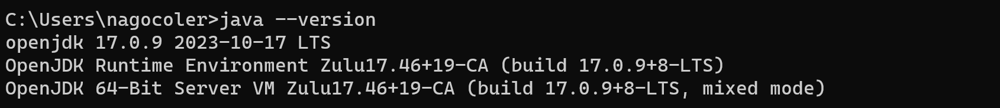

确认无误后，我们进入到Gradle官网下载最新版本：[下载地址](https://gradle.org/releases/?_gl=1*bycxul*_ga*MTkwMDMxNTMyMS4xNzAzNjkxNjA5*_ga_7W7NC6YNPT*MTcwMzc2MDE2OS4yLjEuMTcwMzc2MTE0OS4zNi4wLjA.)，这里我们选择直接下载已经编译好的二进制文件：


**注意：** 本教程教学采用的是8.5版本，如果各位小伙伴在学习时官方已经推出了新的版本，请务必选择跟教程相同的版本，因为Gradle的版本兼容性很差，不同版本出现特性变化的情况很常见，容易出现不兼容的情况。

下载完成后解压，然后将解压得到的目录拖到你想要安装的位置，本教程就放到`C:\Program Files`目录下：

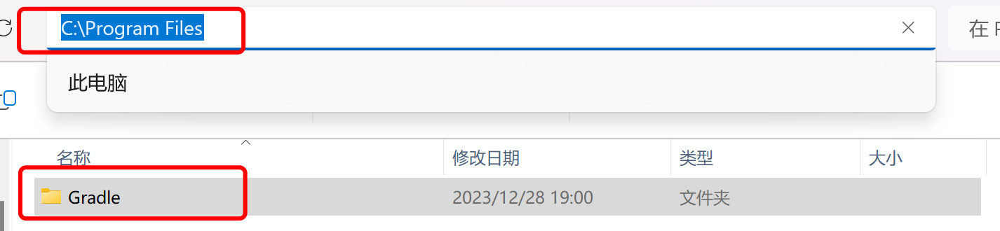

接着我们需要配置相应的环境变量才能使用，打开环境变量配置面板：

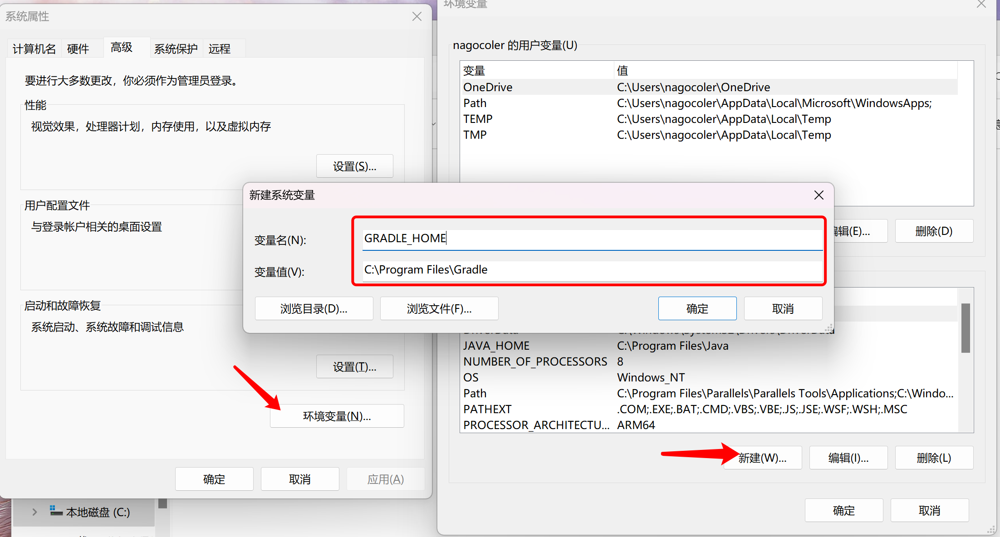

添加环境变量`GRADLE_HOME`，变量值为刚刚存放的Gradle文件夹位置。接着我们在Path环境变量中添加对应的bin目录：

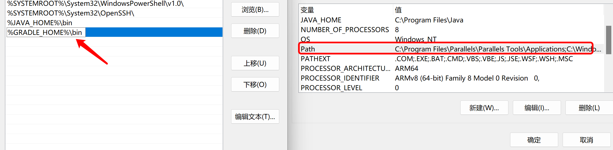

添加完成后，我们打开一个新的命令窗口，输入`gradle -v`命令查看是否配置生效：

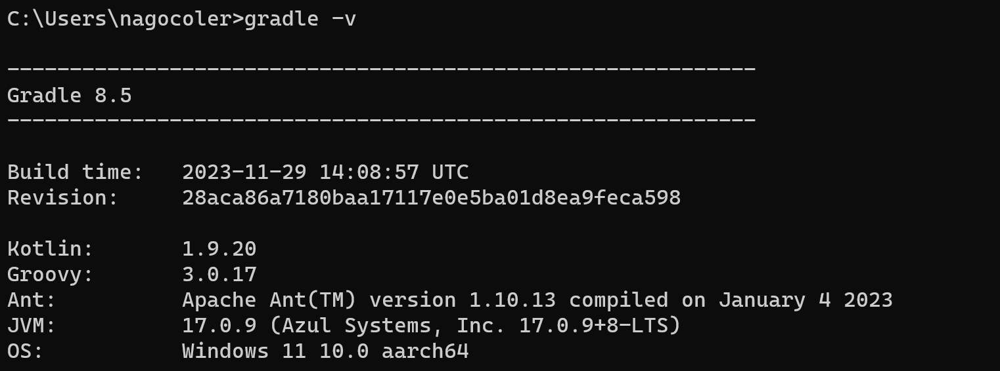

可以看到当前的Gradle相关版本信息已经打印到控制台了。

**注意：** 如果配置没有生效，可以尝试重启电脑或者查看是否路径编写错误。

### 初始化Gradle项目

安装完成Gradle之后，我们就可以开始正式进行学习了，首先我们还是来尝试创建一个Gradle项目。

这里我们创建一个新的空文件夹用于测试：

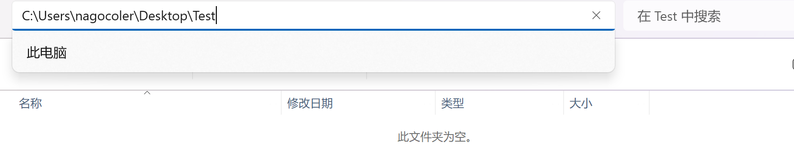

接着，我们在当前目录打开CMD窗口，并执行以下命令：

```shell
gradle init
```

出现以下内容，让我们选择当前项目的类型，这里我们选择`2`应用类型：

```sh
> Task :wrapper

Select type of project to generate:
  1: basic
  2: application
  3: library
  4: Gradle plugin
Enter selection (default: basic) [1..4] 2
```

接着是选择我们程序使用的语言类型，本教程统一使用Java语言讲解，选择`3`号：

```sh
> Task :init

Select implementation language:
  1: C++
  2: Groovy
  3: Java
  4: Kotlin
  5: Scala
  6: Swift
Enter selection (default: Java) [1..6] 3
```

接着是是否生成多个子项目结构，我们先按照最简单的单个项目进行讲解，这里直接选择`no`即可：

```sh
Generate multiple subprojects for application? (default: no) [yes, no] no
```

接着是编写Gradle脚本采用的语言，目前Gradle支持Kotlin和Groovy两种，且目前官方推荐的是Kotlin语言，所以这里就选择`1`号：

```sh
Select build script DSL:
  1: Kotlin
  2: Groovy
Enter selection (default: Kotlin) [1..2] 1
```

Gradle还需要配置一个测试使用的框架，这里我们选择默认的就行：

```sh
Select test framework:
  1: JUnit 4
  2: TestNG
  3: Spock
  4: JUnit Jupiter
Enter selection (default: JUnit Jupiter) [1..4] 
```

接着是当前项目的名称以及包名，默认就是当前目录名字，这个自己根据情况选择吧：

```sh
Project name (default: Test):

Source package (default: test): com.test
```

最后是采用的Java版本，因为这里我们安装的是Java17，所以直接输入17即可，还有是否选择使用新特性直接`no`就好了：

```sh
Enter target version of Java (min. 7) (default: 17): 17

Generate build using new APIs and behavior (some features may change in the next minor release)? (default: no) [yes, no]
```

接着我们可以看到项目成功完成了初始化操作：
```sh
> Task :init
To learn more about Gradle by exploring our Samples at https://docs.gradle.org/8.5/samples/sample_building_java_applications.html

BUILD SUCCESSFUL in 12m 38s
2 actionable tasks: 2 executed
```

现在回到我们的文件夹中，可以看到已经生成了大大小小的文件了：


**注意：** 不同版本的Gradle对我们使用的IDEA版本同样存在兼容性问题，这里推荐使用`IntelliJ IDEA 2023.3`或更高版本，旧版本的IDEA可能会不支持当前的Gradle 8.5版本。

我们可以直接在IDEA中打开这个项目，打开后正常情况下会自动开始初始化，初始化过程中会下载很多东西，包括Gradle当前版本本身，以及它所需要的所有依赖包以及Kotlin相关库：


不对啊，我们本地不是已经安装了Gradle吗，怎么初始化项目的时候又要下载一次呢？这是因为Gradle Wrapper的作用，由于Gradle的跨版本兼容性很差，因此它指定了当前项目中使用的Gradle版本，使得不同的开发人员或CI/CD系统都能使用相同的Gradle版本来构建项目，从而提高项目的一致性和可移植性。Gradle Wrapper的另一个好处是，它可以自动下载和使用正确版本的Gradle，无需手动安装或配置Gradle，使得项目的维护和协作更加方便，后续别人拿到我们这个项目的时候，不需要自己在系统中部署Gradle环境。

这个过程中可能会很卡，因为服务器在国外（建议挂梯）直到出现`BUILD SUCCESSFUL`之后，表示初始化完成：

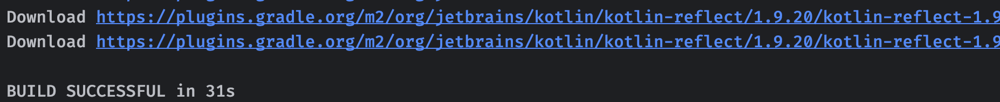

此时我们的项目目录里面已经存在这些内容了：


我们来依次介绍一下这些内容分别代表什么以及有什么作用：

* `.gradle`：Gradle自动生成的项目缓存目录。
* `.idea`：这个是IDEA的项目配置目录，跟Gradle生成的没关系，无视掉就行。
* `app`：存放整个项目的源代码、测试等，这里面就是我们写代码的地方了。
  * `build.gradle.kts`：项目的gradle构建脚本。
  * `src`：存放源代码和测试代码。
    * `main`：编写所有项目核心代码。
    * `test`：编写项目测试代码。
* `gradle`：包含JAR文件和Gradle Wrapper的配置。
* `gradlew`：适用于macOS和Linux的使用Gradle Wrapper执行构建的脚本（这里的版本就是GradleWrapper指定的版本）
* `gradlew.bat`：适用于Windows的使用Gradle Wrapper执行构建的脚本。
* `settings.gradle.kts`：定义子项目列表的项目配置文件，也是最关键的设置文件。

除了以上文件以外的其他文件，一般都是一些额外的Git文件，例如`.gitignore`，不属于Gradle的范畴，无视掉就可以了。

Gradle项目在生成时默认为我们创建了一个测试的主类：

```java
/*
 * This Java source file was generated by the Gradle 'init' task.
 */
package com.test;

public class App {
    public String getGreeting() {
        return "Hello World!";
    }

    public static void main(String[] args) {
        System.out.println(new App().getGreeting());
    }
}
```

我们可以在IDEA中尝试直接运行：

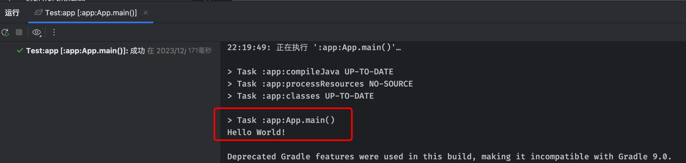

这样，咱们的第一个Gradle项目就成功创建并运行了。

### Gradle常用命令

我们在一开始就说了，Gradle最主要的目的就是为了构建大型项目，其中构建项目的常用命令非常关键，我们这节课就来学习一下。

首先我们可以查看一下所有Gradle支持的任务，这里我们使用GradleWapper提供的`gradlew`进行操作，使用方式其实和`gradle`命令是一样的，只是这里用的是生成的（注意Windows平台下需要使用gradlew.bat来运行）

```
./gradlew.bat task
```

```sh
./gradlew task
```

其中包含了大量的命令操作：

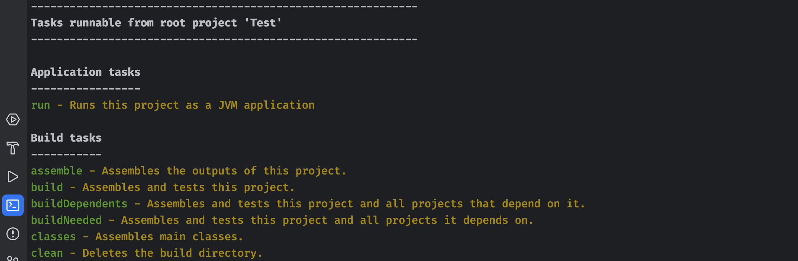

比如第一个`run`命令就可以将当前项目以JVM应用程序的形式运行：

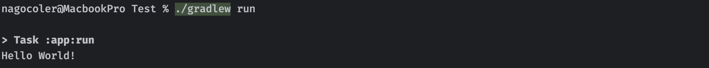

这个命令会自动编译并运行我们的项目，我们也可以手动执行其中的每一步，现在就来尝试一下吧，首先先执行一次清理命令，将整个项目目录进行一次清理，主要清理掉的就是构建出来的文件：

```sh
./gradlew clean
```

我们在编写好一个Java项目之后，第一步就是编译成class文件，然后才能开始运行，所以，我们可以使用以下命令来编译代码：

```sh
./gradlew classes
./gradlew classes -q  #安静模式，只执行，不打印日志
```

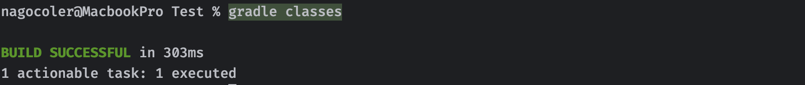

执行完成之后，如果出现`BUILD SUCCESSFUL`表示编译成功，此时在app目录下会生成一个新的build目录，此目录中存放的就是编译之后的相关文件了，其中classes目录存放的就是所有编译之后的class文件：

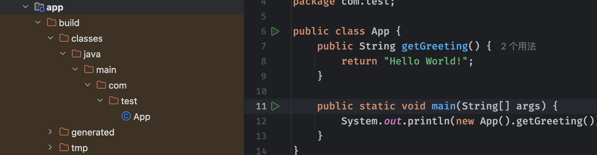

有些时候我们的项目可能需要在编译之后运行一些测试用例，来快速查看是否存在一些问题，这在开发过程中非常常见，我们可以看到Gradle默认情况下为我们生成了一个简易的测试用例：

```kotlin
class AppTest {
  	//默认使用的是JUnit作为单元测试工具
    @Test void appHasAGreeting() {
        App classUnderTest = new App();
      	//这里是判断如果结果为Null的话就抛出异常
        assertNotNull(classUnderTest.getGreeting(), "app should have a greeting");
    }
}
```

我们可以将App类中的getGreeting方法的返回值设置为null试试看：

```java
public class App {
    public String getGreeting() {
        return null;
    }
    ...
}
```

使用以下命令来执行测试：

```sh
./gradlew test
```

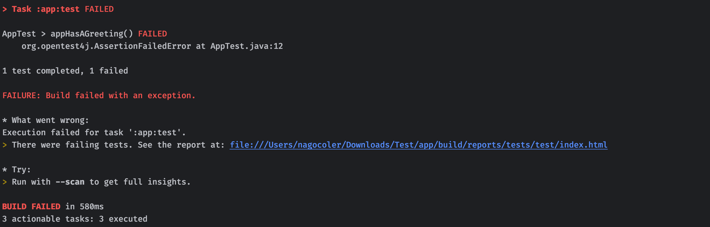

可以看到测试失败了，并且Gradle还自动为我们生成了一个错误报告，其中明确指出了我们出现错误的测试用例：

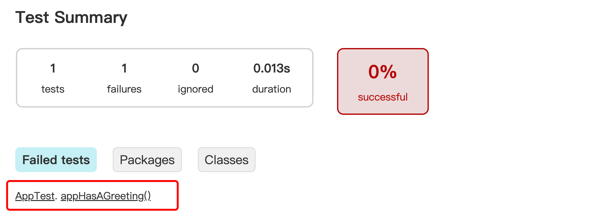

我们也可以快速执行一个完整的编译+测试流程来构建整个项目，并得到打包好的jar等文件，使用以下命令来完成：

```sh
./gradlew build
```

如果某些时候我们不想执行测试，只想构建整个项目，也可以添加参数跳过：

```sh
./gradlew build -x test
```

只不过这样去敲命令实在是太累了，在IDEA中已经自动帮助我们继承了Gradle插件，我们可以直接展开右侧工具栏，双击就能使用Gradle命令了，非常方便：

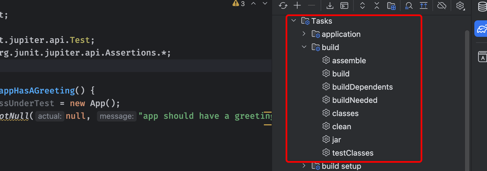

## 项目配置

前面我们介绍了Gradle项目的搭建与使用，我们先来看一下整个Gradle项目构建的流程：

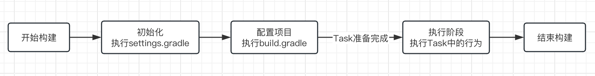

大概清楚构建流程后，我们接着就来了解一下Gradle项目是如何进行配置的。

### 配置文件介绍

设置文件`settings.gradle`是整个Gradle项目的入口点：

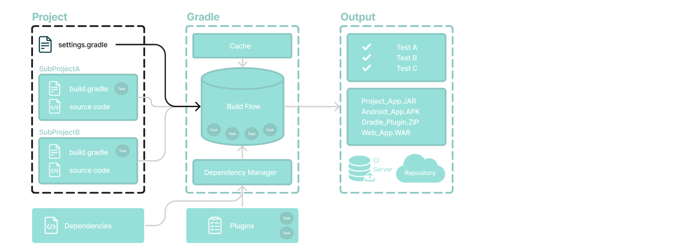

*设置文件*用于定义所有的子项目，并让它们参与到构建中，Gradle支持单项目和多项目的构建：

- 对于单个项目构建，设置文件是可选的。
- 对于多项目构建，设置文件必须存在，并在其中定义所有子项目。

设置文件可以使用Groovy语言（名称为`settings.gradle`）或是Kotlin语言（名称为`settings.gradle.kts`）编写，本教程一律采用Kotlin语言进行讲解，设置文件通常位于项目的根目录中：

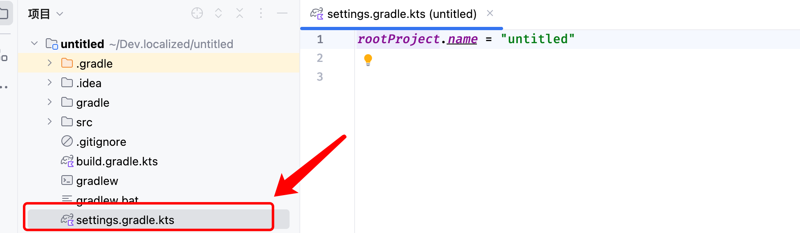

一个标准的Gradle设置文件按照以下样式进行编写，这里使用Kotlin语言介绍：

```kotlin
rootProject.name = "root-project"   //rootProject对象代表当前这个项目，其name属性就是当前项目的名称

include("sub-project-a")     //所有的子项目使用include()函数进行添加，如果没有子项目可以不写
include("sub-project-b")
include("sub-project-c")
```

接着我们来看针对于单个项目的构建文件，其中`gradle.build`文件就是对应的构建配置，这里我们使用的是Kotlin语言，因此项目中会存在一个`gradle.build.kts`文件：

```kotlin
plugins {
    id("java")
}

group = "cn.itbaima"
version = "1.0-SNAPSHOT"

repositories {
    mavenCentral()
}

dependencies {
    testImplementation(platform("org.junit:junit-bom:5.9.1"))
    testImplementation("org.junit.jupiter:junit-jupiter")
}

tasks.test {
    useJUnitPlatform()
}
```

可以看到，在这个配置文件中存在大量的Lambda语句，这也使得整个配置文件写起来更加简介美观，所以说虽然Gradle依赖于JVM平台，但是仅支持Kotlin和Groovy，它们相比Java在语法上存在更大的优势，更适合编写这种类似脚本一样的配置文件。

我们首先来看最顶上的plugins函数，后面的Lambda中编写了当前项目需要使用到的插件：

```kotlin
plugins {
    id("java")
}
```

使用`id()`函数指定需要使用的插件，这里使用的是`java`插件，`java`插件将Java编译以及测试和捆绑功能添加到项目中，为建任何类型的 Java 项目提供支持。

当然，除了java插件之外，我们如果需要构建其他类型的项目，也可以使用多种多样的插件：

```kotlin
plugins {
    id("cpp-application")   //用于构建C++应用程序  
}
```

```kotlin
plugins {
    id("swift-application")   //用于在MacOS构建Swift应用程序
}
```

```kotlin
plugins {
    id("org.jetbrains.kotlin.jvm") version "1.9.0"  //使用version中缀函数为id指定的插件添加版本
}
```

有关插件相关的内容，我们会在后面的部分深入为大家介绍，不同的插件会为Gradle添加不同的任务。

这里的group和version分别设置了当前项目所属的组名称和版本：

```kotlin
group = "cn.itbaima"
version = "1.0-SNAPSHOT"
```

接着是所有依赖的仓库配置，默认使用的是Maven中心仓库：

```kotlin
repositories {
    mavenCentral()
}
```

接着是所有的依赖列表，这里默认为我们导入了JUnit相关依赖用于测试：

```kotlin
dependencies {
    testImplementation(platform("org.junit:junit-bom:5.9.1"))
    testImplementation("org.junit.jupiter:junit-jupiter")
}
```

最后是任务相关配置，这里对`test`任务进行了相关配置：

```kotlin
tasks.test {
    useJUnitPlatform()
}
```

从下节课开始我们来详细介绍一下各个部分。

### 编写设置文件

我们前面介绍了Gradle构建的大致流程和配置文件各个部分，而设置文件`settings.gradle.kts`则是整个构建的入口点，在Gradle构建生命周期的早期，初始化阶段会在项目根目录中找到设置文件。

当找到设置文件`settings.gradle(.kts)`时，Gradle会实例化一个[`Settings`](https://docs.gradle.org/current/dsl/org.gradle.api.initialization.Settings.html)对象，我们可以通过此对象来声明要包含在构建中的所有项目，包括我们项目名称的声明也是通过它来完成：

```kotlin
settings.rootProject.name = "untitled"
```

我们也可以省略掉settings直接使用其提供的属性：

```kotlin
rootProject.name = "untitled"
```

其中，Settings对象包含以下常用属性：

| 姓名          | 描述                                           |
| :------------ | :--------------------------------------------- |
| `buildCache`  | 项目构建所用缓存配置。                         |
| `plugins`     | 用于设置的插件。                               |
| `rootDir`     | 项目构建的根目录，根目录是整个项目目录最外层。 |
| `rootProject` | 构建的根项目。                                 |
| `settings`    | 返回设置对象。                                 |

Settings对象也包含以下方法可供调用：

| 姓名             | 描述                                         |
| :--------------- | :------------------------------------------- |
| `include()`      | 将指定名称的项目添加到构建列表中。           |
| `includeBuild()` | 添加指定路径上的其他Gradle项目到构建列表中。 |

我们在编写配置文件时，本质上是对Gradle API的一系列方法调用，结合Groovy或Kotlin的`{...}`语法（在Groovy中称作闭包，Kotlin中称为Lambda）能够轻松编写非常简洁的配置，比如配置插件：

```kotlin
rootProject.name = "untitled"

plugins {  //使用plugins函数配置插件，结合Lambda表达式可以使用简洁语法完成配置
    id("test")   //瞎写的一个
}
```

在配置文件中定义的语句，Gradle会一行一行地向下执行，就像一个脚本那样。实际上，我们编写的配置文件在执行Gradle构建时会编译为对应的class文件加载执行，这些文件存放在Gradle的缓存目录中：

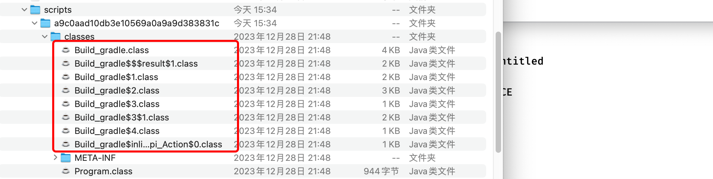

因此，我们直接在Gradle配置中编写的自定义语句也可以执行：

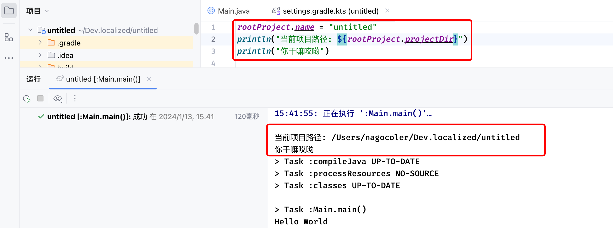

这里我们执行了自定义的打印语句，包括可以通过`rootProject`对象拿到当前的项目文件File对象等。

在Gradle中，和Maven一样也分为插件和依赖，我们可以在`settings.gradle.kt`中可以为所有的项目进行统一配置，比如要修改获取插件的仓库位置：

```kotlin
pluginManagement {   //使用pluginManagement函数配置插件仓库列表
    repositories {   //在repositories函数中配置需要用的仓库
        gradlePluginPortal()   //Gradle插件仓库
        google()    //Google插件仓库
    }
}
```

我们也可以修改为国内的阿里云镜像：

```kotlin
pluginManagement {
    repositories {
      	//手动指定maven仓库地址，修改URL地址
        maven {
            setUrl("https://maven.aliyun.com/repository/public/")
        }
    }
}
```

同样的，对于所有的依赖，也可以直接配置为国内的阿里云镜像仓库：

```kotlin
dependencyResolutionManagement {   //依赖解析管理中可以配置全局依赖仓库
    repositories {  //只不过这种方式目前还在孵化阶段，可能会在未来某个版本移除
        maven {
            setUrl("https://maven.aliyun.com/repository/public/")
        }
    }
}
```

不过，除了在`settings.gradle.kts`中配置三方仓库之外，我们更推荐在之后学习的`build.gradle.kts`中对仓库进行配置。

与Maven一样，Gradle插件可以帮助我们在构建过程中实现各种各样的高级功能，它是用于增加和扩展任务（tasks）或构建逻辑的一种特殊类型的模块，在`settings.gradle.kts`中可以配置插件，只不通常被用于需要对多个项目进行操作的插件，或者需要在构建开始之前进行一些配置的情况：

```kotlin
plugins {   //使用id明确插件名称，使用version中缀函数明确插件版本
    id("org.gradle.toolchains.fake") version "0.6.0"
}
```

一般很少见有项目在这里配置插件。

对于多个子项目的大型项目而言，我们还需要在这里添加所有的子项目：

```kotlin
include("app")
include("business-logic")
include("data-model")
```

有关多项目的详细介绍，我们会放在下一个章节，本章节主要以单项目为主。

除了以上提到的内容，`Settings`对象上还有更多属性和方法，您可以使用它们来配置构建。不过，虽然许多Gradle脚本通常以简短的Groovy或Kotlin语法编写，但设置脚本中的每个操作都是在`Settings`对象上调用方法：

```kotlin
include("app")
settings.include("app")   //实际上是这样的，只是说settings可以省掉
```

### 编写构建脚本

前面我们介绍了设置文件的编写，它是我们整个项目的构建起点，包含了所有基本内容的配置。

我们接着来看针对于我们每一个项目的构建脚本`build.gradle.kts`文件：

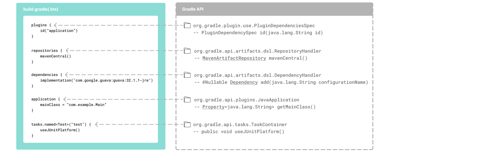

对于设置文件中包含的每个项目，Gradle都会为其创建一个`Project`实例对象，我们可以直接在`build.gradle.kts`中使用，跟之前一样，可以省略：

```kotlin
group = "cn.itbaima"
version = "1.0-SNAPSHOT"
```

```kotlin
project.group = "cn.itbaima"   //本质上就是project的属性
project.version = "1.0-SNAPSHOT"
```

在此对象中，包含以下常见属性：

| 姓名           | 类型                | 描述                               |
| :------------- | :------------------ | :--------------------------------- |
| `name`         | `String`            | 项目目录的名称。                   |
| `path`         | `String`            | 该项目的完全限定名称。             |
| `description`  | `String`            | 该项目的描述。                     |
| `dependencies` | `DependencyHandler` | 配置项目的依赖列表。               |
| `repositories` | `RepositoryHandler` | 配置项目的依赖仓库。               |
| `layout`       | `ProjectLayout`     | 通过此对象来访问项目中的关键位置。 |
| `group`        | `Object`            | 项目的组。                         |
| `version`      | `Object`            | 项目的版本。                       |

我们依次来看每个部分是如何进行编写的。

首先是整个项目所采用的插件，我们可以像下面这样编写：

```kotlin
plugins {
    id("org.jetbrains.kotlin.jvm") version "1.9.0"
    id("application")
}
```

其中，插件`application`是由官方内置的插件，可以直接使用`id()`函数来选择，而上面的`org.jetbrains.kotlin.jvm`插件没有被官方内置，需要我们手动使用`version`中缀函数指定其版本，这样Gradle才能在仓库中正确找到它。

一般情况下，我们普通的Java项目可以直接使用`java`插件，它能够直接完成编译和打包Java代码：

```kotlin
plugins {
    id("java")
}
```

我们也可以对这个插件进行一些配置，比如我们要生成目标的Java版本等：

```kotlin
configure<JavaPluginExtension> {
    targetCompatibility = JavaVersion.VERSION_17    //编译目标版本
    sourceCompatibility = JavaVersion.VERSION_17    //源代码版本（会导致只能使用对应版本具有的特性，如果使用更高版本的特性或语法将无法通过编译）
}
```

如果我们需要将项目打包为一个可执行的文件，也可以使用`application`插件，它包含`java`插件的全部功能，同样支持编译和打包Java代码，并且支持生成可执行的应用程序：

```kotlin
plugins {
    id("application")
}

java {   //configure<JavaApplication> 也可以直接写成 java 这个扩展函数，效果一样
    targetCompatibility = JavaVersion.VERSION_17
    sourceCompatibility = JavaVersion.VERSION_17
}

application {   //同configure<JavaApplication>
    mainClass = "com.test.Main"  //配置主类
}
```

配置完成后，我们直接执行`build`构建项目，生成以下文件：

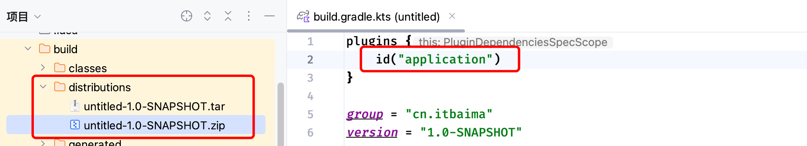

可以看到这里生成的压缩包的形式，我们可以直接解压，得到一系列文件：

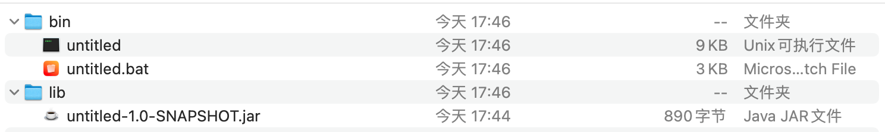

可以看到，在bin目录中已经生成了用于运行我们Java项目的脚本（Mac/Linux是项目名称的脚本，Windows是bat脚本）然后在lib目录中是已经帮我们打包好的项目jar文件，如果我们项目中还存在其他的依赖，也会包含在这个lib中。我们可以直接运行：


这跟我们前面学习的Maven其实非常相似，同样可以通过插件实现打包，只不过这里是采用编程的形式配置，而Maven统一采用XML形式进行配置。

接着我们来看如何配置项目中的依赖项，首先是对于依赖仓库的选择，默认情况下生成的代码选择的是Maven中心仓库：

```kotlin
repositories {
    mavenCentral()  //Maven中心仓库
    google()   //谷歌仓库
}
```

我们可以自己定义，比如只使用本地仓库中的包：

```kotlin
repositories {
    mavenLocal()   //只使用Maven本地仓库中的软件包
}
```

我们可以通过`maven`函数来直接指定第三方仓库：

```kotlin
repositories {
    maven {
      	//修改其url属性来指定一个第三方仓库地址
        setUrl("https://maven.aliyun.com/repository/public/")
    }
}
```

配置好仓库地址后，我们就可以开始添加需要的依赖了，在`dependencies`中进行编写，默认情况下添加了一些测试相关的依赖：

```kotlin
dependencies {
    testImplementation(platform("org.junit:junit-bom:5.9.1"))
    testImplementation("org.junit.jupiter:junit-jupiter")
}
```

这里我们可以使用两种不同的函数导入依赖：

* `implementation`导入依赖，用于编译和运行*生产*代码。
* `testImplementation`导入依赖，用于编译和运行*测试*代码。

其中填写的字符串就是我们依赖的组、名称以及其对应的版本号：

* `org.junit:junit-bom:5.9.1`对应的组为`org.junit`，依赖名称为：`junit-bom`，版本号为：`5.9.1`

我们可以尝试一下添加自己需要的依赖，比如这里我们添加一个Spring框架的核心依赖，首先我们可以在这里找到需要的包：https://central.sonatype.com，找到后选择：

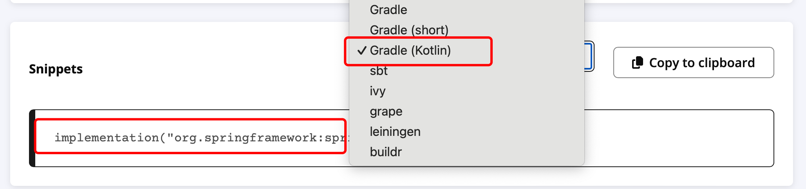

然后直接粘贴到依赖列表里面即可：

```kotlin
//使用implementation来添加依赖
implementation("org.springframework:spring-context:6.1.3")
```

更新后，就可以直接使用了：

```java
@Configuration
public class Main {

    @Bean
    public String string() {
        return "Hello World!";
    }

    public static void main(String[] args) {
        ApplicationContext context = new AnnotationConfigApplicationContext(Main.class);
        System.out.println(context.getBean(String.class));
    }
}
```

使用起来跟Maven其实差别不是很大。

当然，除了像这样写在一起之外，我们也可以分开进行编写，把组、名称和版本填写为三个参数：

```kotlin
implementation("org.springframework", "spring-context", "6.1.3")
```

我们有些时候希望一直使用最新版本的依赖，也可以直接将版本设置为`+`来始终使用最新版本：

```kotlin
implementation("org.springframework:spring-context:+")  
//生产环境下不推荐这样写，万一新版改了啥东西导致项目出大问题就得不偿失了
```

下一节我们将继续深入依赖的相关配置，了解更多配置细节。

### 深入依赖配置

上一部分我们介绍了如何导入依赖，我们接着来看导入依赖之后的更多操作。

除了通过直接编写Maven坐标的形式来引入仓库中的依赖之外，我们也可以直接将一个本地的Jar包引入到项目中，这里我们在项目根目录下新建一个`lib`目录，用于存放我们需要引用的Jar包：

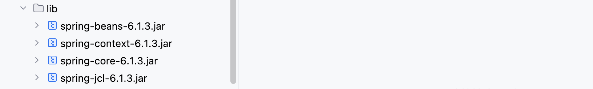

接着我们在依赖中编写引入的语句：

```kotlin
dependencies {
  	//使用files方法来指定一个文件进行导入
    implementation(files("lib/spring-context-6.1.3.jar", 
        "lib/spring-core-6.1.3.jar", "lib/spring-beans-6.1.3.jar", "lib/spring-jcl-6.1.3.jar"))
    ...
}
```

```java
public static void main(String[] args) {
    ApplicationContext context = new FileSystemXmlApplicationContext();
}
```

如果我们一个目录下的jar包太多，需要全部导入，像上面这样一个一个写太累了，我们可以直接使用fileTree方法来统一获取：

```kotlin
implementation(fileTree("lib"))  //直接引入lib下全部jar包
```

效果和上面一个一个导入一样。

我们接着来看依赖的排除，在之前Maven的学习中我们知道，一个依赖的内部可能又会存在多个依赖，在使用一些依赖时，我们可能希望排除其中某些不需要的依赖或是与其他依赖冲突的依赖，我们可以对依赖进行排除操作：

```kotlin
implementation("org.springframework:spring-context:6.1.3") {
  	//在Lambda中使用exclude来排除不需要的依赖
    exclude("org.springframework", "spring-aop")
}
```

这里我们在引入`spring-context`之后，不需要其中的AOP模块，因此我们可以直接使用exclude函数将其排除，此时AOP模块就不存在于外部库中了：


我们再来看下面这种情况：

```kotlin
implementation("org.springframework:spring-context:6.1.3")
implementation("org.springframework:spring-aop:6.1.1")
```

此时我们的项目中不仅依靠`spring-context`引入了`spring-aop`的6.1.3版本，也手动引入了`spring-aop`的6.1.1版本，此时Gradle会优先使用更新的版本作为依赖，所以这里实际引入使用的也是6.1.3版本。

如果我们执意要使用旧版本的依赖，可以通过上面的方式进行依赖的排除，或是给版本号添加感叹号表示强制使用：

```kotlin
implementation("org.springframework:spring-context:6.1.3") {
    exclude("org.springframework", "spring-aop")  //直接排除掉新版本的
}
implementation("org.springframework:spring-aop:6.1.1")
```

```kotlin
implementation("org.springframework:spring-context:6.1.3") 
implementation("org.springframework:spring-aop:6.1.1!!")   //添加双感叹号
```

最后我们来列举一下DependencyHandlerScope里面包含的方法：

1. `implementation`: 用于添加项目的依赖项，这是最常用的方法。
2. `api`: 与 `implementation` 类似，但它会暴露依赖项给项目的所有模块（多项目配置中讲解）
3. `compileOnly`: 用于指定编译时依赖，但不会在运行时包含在最终构建结果中。
4. `testImplementation`: 用于添加测试时需要的依赖项。
5. `androidTestImplementation`: 用于添加Android测试时需要的依赖项。
6. `kapt`: 用于添加 Kotlin 注解处理器依赖项。
7. `annotationProcessor`: 用于添加 Java 注解处理器依赖项。
8. `runtimeOnly`：仅在运行时使用，不用于编译

相信各位小伙伴对于`implementation`已经非常熟悉了，它其实是Java插件提供的方法，我们可以使用它来引入依赖，并且在打包之后也会附带我们引入的依赖：


我们来看看其他的导入方式，首先是`compileOnly`，它表示导入的依赖仅在编译时可用，编译完成后不会将依赖一起打包：

```kotlin
compileOnly("org.springframework:spring-context:6.1.3")
```

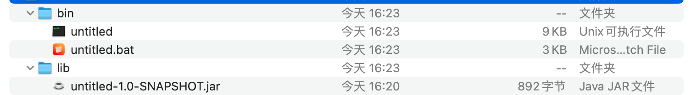

接着是`runtimeOnly`，它表示导入的依赖仅在运行时可用，比如MySQL驱动这类我们不需要在项目中直接使用，但是在项目运行时又需要用到的依赖就非常适合：

```kotlin
runtimeOnly("org.springframework:spring-context:6.1.3")
```

此时，由于此依赖仅存在于运行时，项目中是无法使用的：

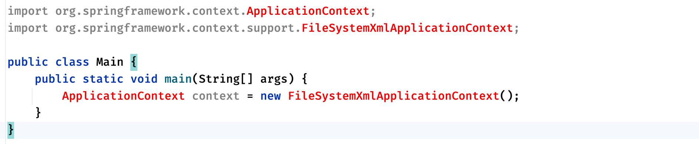

但是我们去掉这些不可用的代码，在编译之后，这些依赖却会被打包在一起。

### 自定义任务

Gradle可以在项目上完成的工作由一个或多个*任务*定义，任务代表构建执行的某些独立工作单元，比如编译一些类，创建jar包，生成Javadoc文档，或将一些内容发布到代码仓库，这些任务通常由插件提供，我们在项目中引入插件后就可以直接执行对应的任务了，在不引入任何插件的情况下，只会包含一些内置的默认任务：

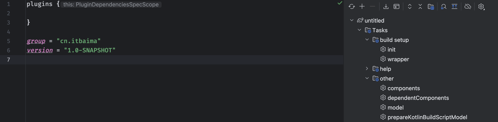

在引入`java`插件后，就出现了各种Java相关的任务，比如编译、构建、打包jar包等：

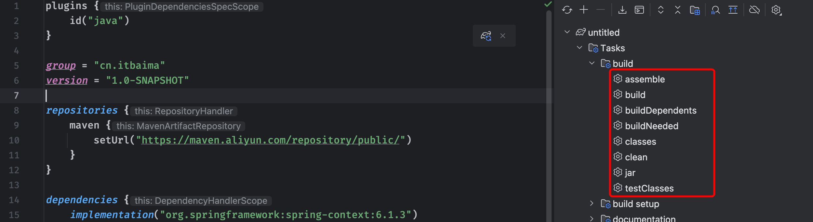

可以看到，这些任务都是由插件为我们提供的，因此，大部分情况下我们引入插件之后就可以直接执行相关的任务了。我们在执行某一个大任务的时候，就会执行一系列的任务，比如`build`命令，它不仅完成构建，还将所有的任务依赖关系进行完整的建立，可以看到：

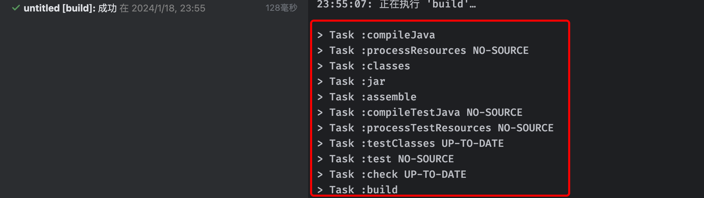

在整个build任务执行的过程中，依次按顺序执行了各种各样的任务：

1. compileJava：编译所有Java源代码文件。
2. processResources：处理所有资源文件，由于这个项目没有资源文件，提示 NO-SOURCE
3. ...

通过这一系列小任务，就完成了编译、构建、打包等一系列操作，只需要执行：`./gradlew build` 即可。

当然，如果各位小伙伴觉得插件提供的任务不太够，需要自定义添加，我们也可以在`build.gradle.kts`中编写自定义任务：

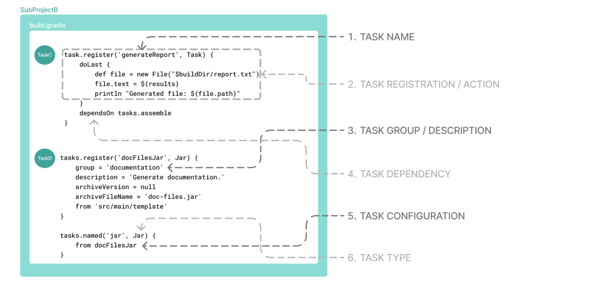

注册任务需要使用`register`或`create`函数来完成，一个最简单的任务可以像下面这样编写：

```kotlin
tasks.register("hello") {   //第一个参数为任务名称，第二个参数使用Lambda编写任务具体操作
  	//任务包含一个完整的操作列表，我们需要传入对应的Action到队列中，这样就可以依次执行了
    doFirst {   //使用doFirst向任务队列首部插入新的Action，也就是要执行的内容
        println("我是自定义的任务开始")
    }
    doLast {   //向队列尾部插入Action
        println("我是自定义的任务结束")
    }
}
```

可以看到，刷新之后任务列表就出现了我们自定义的任务，执行之后也是我们自定义的内容：

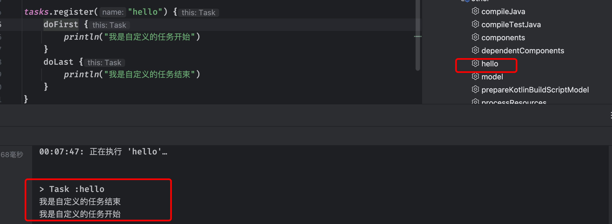

我们也可以通过指令的形式直接运行：


在执行命令时，我们还可以添加额外的项目参数，在脚本中可以直接获取：

```
tasks.register("hello") {
    println("获取到自定义参数: ${project.properties["test"]}")
    ...
}
```


我们还可以配置此任务所属的组别，以及其它描述信息：

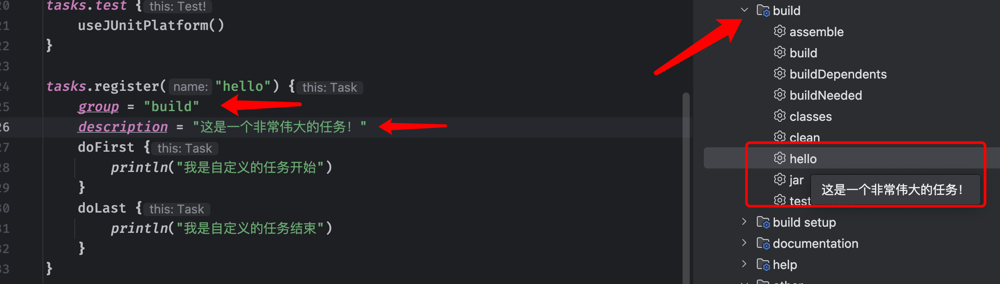

我们还可以将一个任务作为`gradle`执行的默认任务，也就是说直接执行gradle命令就可以运行我们的任务了：

```kotlin
defaultTasks("hello")
```


一个任务还可以依赖于其他任务，比如我们的自定义任务在执行之前需要先完成源代码的编译操作：

```kotlin
tasks.register("hello") {
    group = "build"
    description = "这是一个非常伟大的任务！"
    dependsOn(tasks.compileJava)   //使用dependsOn函数来指定前置任务，可以是其他插件提供的，也可以是我们自己定义的，这个参数也可以传字符串
    ...
}
```

在执行时，会先完成前置任务之后再执行当前任务：


我们也可以让已经存在的任务来依赖我们的任务或是直接为其添加额外的操作：

```kotlin
tasks.named("build") {   //根据名称进行查找
    dependsOn("hello")   //直接配置依赖
  	doLast { ... }   //添加新的Action到列表中
}

tasks.build {   //直接从tasks中获取，这仅限于插件提供的任务
    dependsOn("hello")
}
```

这样，我们就为任务`build`添加了前置任务到前置任务列表中：

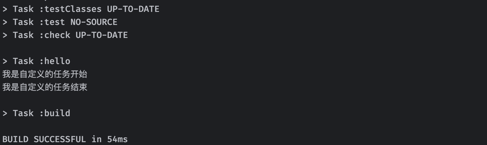

在Gradle中，实际上所有的任务都是Task的子类，除了向上面这样直接编写Task类型，包括我们在前面使用的`register`方法，默认也是在Lambda中为我们提供一个Task类型的对象：

```java
@Override
TaskProvider<Task> register(String name, Action<? super Task> configurationAction) throws InvalidUserDataException;
//这里Action的默认提供类型就是Task
```

我们也可以自行创建Task的子类，来编写自定义的任务类型：

```kotlin
// 继承 DefaultTask 类来创建一个自定义的 HelloTask 类，注意这个类必须要可继承，要么open要么直接抽象类
open class HelloTask : DefaultTask() {
    private var name: String = ""

    @TaskAction   //添加@TaskAction注解来声明此函数为任务的Action
    fun hello() {
        println("${name}: 卡布奇诺今犹在，不见当年倒茶人")
    }

    fun user(name: String) {   //类中也可以具有其他的函数
        this.name = name
    }
}

tasks.register<HelloTask>("hello") {   //使用register时指明我们自定义的任务类
    user("卢本伟")   //此时this就是HelloTask类型了，我们可以直接使用自定义的函数
}
```

通过这种方式也可以实现任务的自定义：


除了通过插件或是我们自定义的形式编写任务之外，Gradle也为我们提供了一些内置的任务类型，这些任务通常是一些经常会用到的操作，我们可以来使用一下，比如复制任务：

```kotlin
tasks.register<Copy>("hello") {   //这里使用Copy类型
    from("build/classes")   //使用from和into设置复制的目录和目标位置
    into("test")
  	dependsOn(tasks.build)   //依赖一下build
}
```

执行我们自定义的hello任务，就可以完成构建 + 拷贝了：


除了这里演示才Copy操作，开发人员还可以利用许多任务类型，包括`GroovyDoc`、`Zip`、`Jar`、`JacocoReport`、`Sign`或`Delete`等。

### 生命周期钩子

有些时候我们希望在Gradle的整个生命周期中的不同时段执行一些操作，我们可以使用官方提供的生命周期钩子函数。

1. 构建初始阶段
   * `gradle.settingsEvaluated()` 完成项目的配置阶段之后调用（只能定义在 setting.gradle 或 init.gradle 脚本中）
   * `gradle.projectsLoaded()` 所有项目加载之后调用（只能定义在 setting.gradle 或 init.gradle 脚本中）
2. 配置阶段
   * `gradle.beforeProject()` 每个项目完成配置之前调用（只能定义在 setting.gradle 或 init.gradle 脚本中）
   * `gradle.afterProject()` 每个项目完成配置之后调用
   * `gradle.projectEvaluated()` 所有项目全部完成配置之后调用
   * `gradle.afterEvaluate()`  整个配置阶段完成后调用
   * `gradle.taskGraph.whenReady` 全部任务图已经构建完成可以就绪后调用
3. 执行阶段
   * `gradle.taskGraph.beforeTask` 执行每一个任务之前调用
   * `gradle.taskGraph.afterTask` 每一个任务执行完成之后调用
   * `gradle.buildFinished` 整个构建全部结束后调用

这里我们可以尝试编写一个钩子函数试试看：

```kotlin
gradle.settingsEvaluated {
    println("开始构建")
}

gradle.buildFinished {
    println("构建结束")
}
```


这样，我们就可以在不同的阶段执行自定义的内容了。比如，我们可以利用这种特性来统计某一个阶段或是任务耗费的时间：

```kotlin
var time: Long = 0
gradle.taskGraph.beforeTask {
    time = System.currentTimeMillis()
}

gradle.taskGraph.afterTask {
    val takeTime = System.currentTimeMillis() - time
    println("任务: $name 执行耗时: ${takeTime}ms")
}
```

得到的结果就会自动计算每个任务的执行时间了：


### 项目发布

我们也可以将自己的的Gradle项目发布到的Maven仓库中，这里我们以发布到本地仓库为例：

```kotlin
plugins {
    id("java")
    id("maven-publish")   //首先引入maven-publish插件
}
```

接着我们来配置发布相关的内容：

```kotlin
publishing {
    publications {
        create<MavenPublication>("library") {   //发布的相关信息Maven坐标信息
            groupId = "cn.itbaima"
            artifactId = "hello"
            version = "0.0.1"
            from(components["java"])   //发布为jar包形式
        }
    }

    repositories {
        mavenLocal()    //指定为本地Maven仓库
    }
}
```

接着我们执行`publish`任务即可发布项目到本地仓库了：


此时在`.m2`目录中已经存在我们发布的项目了：

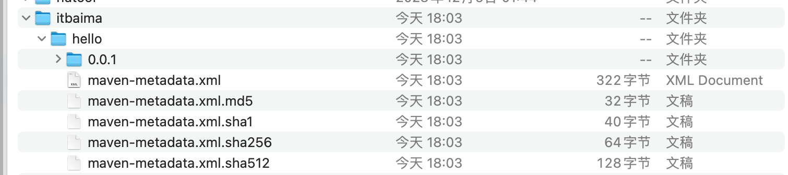

### 创建SpringBoot项目

通过IDEA或是前往SpringBoot官网就可以自动为我们创建一个基于Gradle的SpringBoot项目：https://start.spring.io/

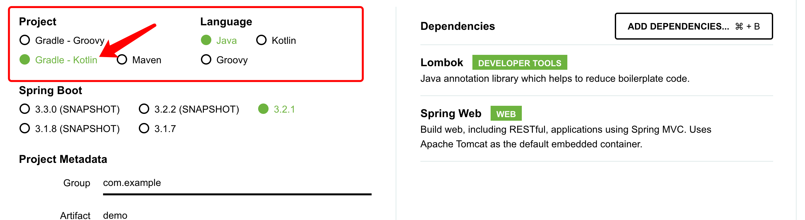

创建完成后，使用IDEA打开会自动下载GradleWrapper指定的版本，并同时下载相关的插件：


这里自动生成了项目的`build.gradle.kts`文件：

```kotlin
plugins {   //首先是插件配置
    java  //最基础的Java插件
    id("org.springframework.boot") version "3.2.1"   //SpringBoot插件
    id("io.spring.dependency-management") version "1.1.4"   //Spring依赖管理插件
}

group = "cn.itbaima"   //不用说了吧
version = "0.0.1-SNAPSHOT"

java {
    sourceCompatibility = JavaVersion.VERSION_17   //配置Java源代码编译版本
}

configurations {
    compileOnly {   //注解处理相关配置，用于Lombok
        extendsFrom(configurations.annotationProcessor.get())
    }
}

repositories {   //使用Maven中心仓库
    mavenCentral()
}

dependencies {   //包含SpringBoot相关依赖，以及Lombok依赖
    implementation("org.springframework.boot:spring-boot-starter-web")
    compileOnly("org.projectlombok:lombok")
    annotationProcessor("org.projectlombok:lombok")
    testImplementation("org.springframework.boot:spring-boot-starter-test")
}

tasks.withType<Test> {
    useJUnitPlatform()
}
```

相信各位小伙伴现在应该能够看懂SpringBoot项目为我们自动生成的Gradle构建文件了。

### JVM语言混合编程

对于某些需要使用多种JVM语言进行编程的项目，我们可以同时配置多种插件，这里我们以Java与Kotlin混合编程为例进行讲解：

```kotlin
plugins {   //同时配置Java和Kotlin/JVM插件
    id("java")
    kotlin("jvm") version "1.9.21"
}
```

编写好插件后，我们直接刷新项目，接着就可以在src下的main和test目录中同时创建两个源代码目录：

* java：存放Java源代码文件
* kotlin：存放Kotlin源代码文件

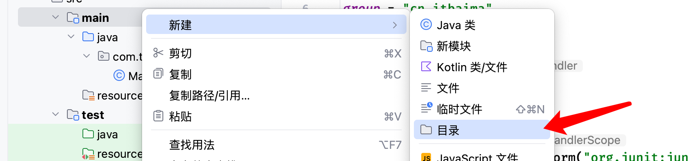

这里我们的项目已经是一个Java项目了，我们可以直接右键`main`点击新建目录，然后直接选择Gradle集源中的kotlin目录：


此时就可以在kotlin目录下编写Kotlin相关的源代码了：

```kotlin
//位置：src/main/kotlin/com/test/Student.kt

package com.test

data class Student(var name: String, var age: Int)
```

```java
//位置：src/main/java/com/test/Main.java
package com.test;

public class Main {
    public static void main(String[] args) {
        Student student = new Student("小明", 18);
        System.out.println(student);
    }
}
```

编写好之后，点击main方法旁边的运行按钮，可以看到一起编译了Java和Kotlin源代码，并成功运行：


如果要打包为可执行的应用，也可以直接使用`application`插件：

```kotlin
plugins {
    id("application")
    kotlin("jvm") version "1.9.21"
}
```

打包之后，已经自动将Kotlin标准库依赖集成了，也可以直接使用：

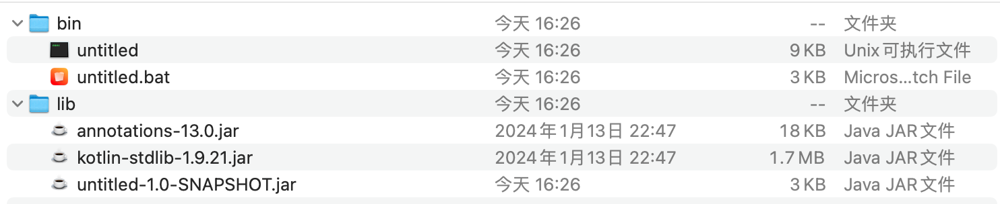


这样，我们就可以愉快地进行混合编程了。

## 多项目配置

前面我们介绍的是单个项目的布局，现在我们接着来看多个项目的布局。

通常对于一些大型的分布式项目来说，我们会在一个项目中包含多个模块，不同的模块负责不同的功能，并且不同模块的代码独立进行编写，这时整个Gradle项目就会存在多个子项目：

```kotlin
large-project
|
├── auth-service
│   ...
│   └── build.gradle.kts
├── chat-service
│   ...
│   └── build.gradle.kts
└── settings.gradle.kts
```

可以看到，在根项目下，只存在`settings.gradle.kts`用于全局配置，而具体的`build.gradle.kts`构建文件存在于各个子项目中分别进行编写。

我们也可以按照这样的结构去搭建我们的多模块项目。

### 项目创建

要创建一个多模块项目，我们可以先使用IDEA创建一个简单的Gradle项目出来：

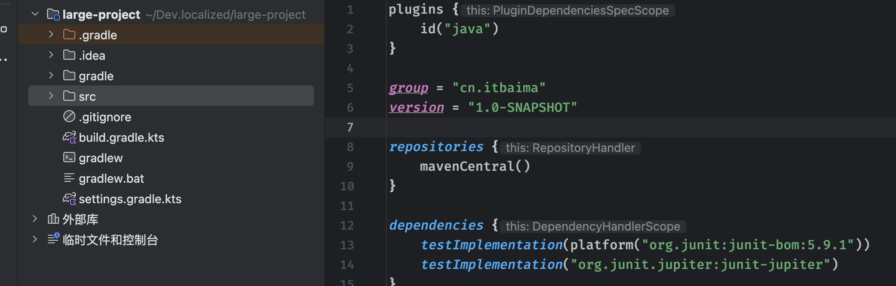

接着我们删除不需要的内容，比如：`src`目录、`build.gradle.kts`文件等，接着右键最外层项目，创建一个新的子项目，此时我们需要选择最外层项目为我们的父项目：

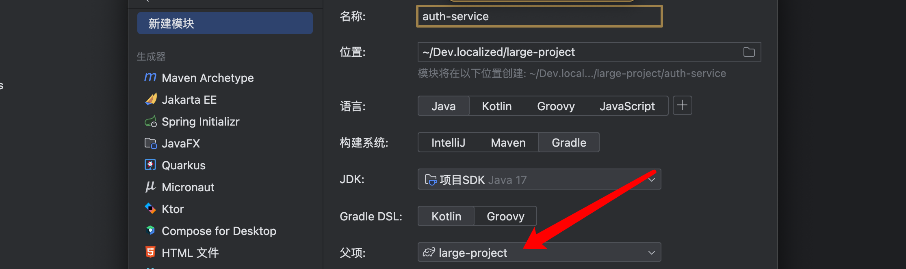

创建完成后，我们可以打开最外层的`settings.gradle.kts`文件，IDEA已经自动为我们添加了模块引入：

```kotlin
rootProject.name = "large-project"
include("auth-service")
```

此时，父子项目的层级已经明确划分出来了：

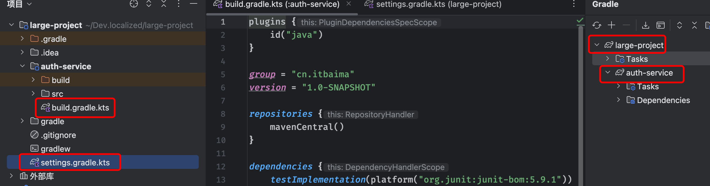

可以看到，`build.gradle.kts`现在由子模块进行配置，每个子模块都可以单独处理。

在存在多个子项目的时候，我们可以直接在根项目中执行指令，会生效于全部的子项目：


可以看到，这里的项目名称前面都加了一个`:`符号。

我们也可以配置项目之间的依赖，我们只需在`dependencies`中进行配置：

```kotlin
dependencies {
    implementation(project(":common"))   //使用project方法来引用其他项目作为依赖，项目名称前需要添加单引号
    testImplementation(platform("org.junit:junit-bom:5.9.1"))
    testImplementation("org.junit.jupiter:junit-jupiter")
}
```

有些时候，我们可能需要将一些部分统一进行配置，比如配置代码仓库地址，以及项目用到的插件，我们可以直接在根项目创建一个`build.gradle.kts`来统一编写内容：

```kotlin
subprojects {   //subprojects表示对所有的子项目生效
    apply(plugin = "java")   //定义插件需要使用apply来完成，plugin{}在这里不行

    group = "cn.itbaima"   //定义组
    version = "unspecified"  //定义版本

    repositories {   //定义自定义仓库地址
        maven {
            setUrl("https://maven.aliyun.com/repository/public/")
        }
    }
}
```

这样，我们即使不在子项目中编写这些，就可以直接得到根项目的配置：

```kotlin
dependencies {
    testImplementation(platform("org.junit:junit-bom:5.9.1"))
    testImplementation("org.junit.jupiter:junit-jupiter")
}

tasks.test {
    useJUnitPlatform()
}
```

### 依赖的传递

我们在使用多模块时可能会遇到这样的一个问题，现在有三个模块，并且具有以下依赖关联：

* service-a
* service-b implementation(service-a)
* service-c implementation(service-b)

此时，从链式的依赖关系上来看，它们长这样：`service-a -> service-b -> service-c `

按照正常的传递关系来说，在B中应该是可以直接使用A中定义的内容的，因为依赖了A模块，同时，由于C依赖了B模块，那么理所应当，C也应该可以直接使用A中定义的内容，我们来看看是否真的如此：

```kotlin
//A模块中定义
public class Test {
    public static void test() {
        System.out.println("Hello World!");
    }
}
```

```java
//B模块中定义
public class Main {
    public static void main(String[] args) {
        Test.test();
    }
}
```

```java
//C模块中定义
public class Main {
    public static void main(String[] args) {
        Test.test();   //找不到类Test，编译失败
    }
}
```

这就很奇怪了，在Maven中是完全可以实现传递依赖的，为什么到Gradle就不行了呢？这是因为`implementation`不支持依赖传递，因此，即使我们改变了B模块的依赖，此时C也无法通过传递的形式得到B包含的依赖，由于不需要处理传递依赖，在编译时只需要处理一层，因此速度会非常快，大部分情况下非常推荐使用`implementation`来进行依赖导入。

如果各位小伙伴需要实现传递依赖的效果，我们需要使用另一个插件提供的方法来导入依赖：

```kotlin
plugins {
    `java-library`   //java-library提供了传递依赖api函数
}

dependencies {
    api(project(":common"))   //与implementation效果一样，但是支持传递依赖
    testImplementation(platform("org.junit:junit-bom:5.9.1"))
    testImplementation("org.junit.jupiter:junit-jupiter")
}
```

此时，模块B的依赖由于使用了api进行导入，我们在模块C中无论是使用`api`导入还是`implementation`导入B，都可以使用B中api函数导入的依赖了。

### 使用buildSrc模块

在Gradle中有一个特殊机制，我们可以创建一个名为`buildSrc`的模块，它支持我们自己定义能够在`kts`脚本中使用的内容。

这里我们直接创建这样的一个项目：

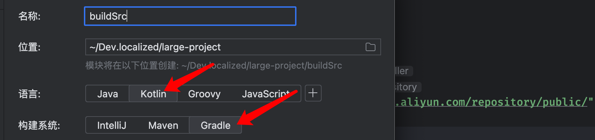

注意在创建之后我们需要移除`settings.gradle.kts`中的包含关系：

```kotlin
rootProject.name = "large-project"
include("auth-service", "chat-service", "common")
include("buildSrc")   //不能作为子项目存在
```

接着我们修改一下`build.gradle.kts`文件：

```kotlin
plugins {
    `kotlin-dsl`
}

repositories {
    mavenCentral()
}
```

此时我们就可以编写我们需要使用的部分了，比如我们希望吧阿里云Maven仓库封装成一个函数的形式，直接使用，就像`mavenCentral()`那样，不然每次都要写一个完整地址，很麻烦，这里我们直接开一个新的kt文件编写扩展函数：

```kotlin
import org.gradle.api.artifacts.dsl.RepositoryHandler

//由于repositories函数中提供的this为RepositoryHandler类型的对象
//这里我们直接为其编写扩展函数
fun RepositoryHandler.mavenAlibaba() = maven {
    setUrl("https://maven.aliyun.com/repository/public/")
}
```

接着，我们就可以在其他的kts脚本中使用我们定义的内容了，比如根项目的配置：

```kotlin
subprojects {
    apply(plugin = "java")

    group = "cn.itbaima"
    version = "unspecified"

    repositories {
        mavenAlibaba()   //直接使用自定义的
    }
}
```

是不是感觉很方便？我们也可以使用这种方式定义所有需要使用的依赖版本，实现统一管理，比如编译版本的管理：

```kotlin
import org.gradle.api.JavaVersion

object Version {
    val sourceVersion = JavaVersion.VERSION_17
    val targetVersion = JavaVersion.VERSION_17
}
```

```kotlin
subprojects {
    ...

    configure<JavaPluginExtension> {
        targetCompatibility = Version.targetVersion   //直接使用Version类获取版本
        sourceCompatibility = Version.sourceVersion
    }
}
```

包括如果我们需要使用一些第三方的依赖，也可以统一管理版本：

```kotlin
object Version {
    ...
    val springVersion = "6.1.3"   //统一Spring相关依赖的版本
}
```

```kotlin
dependencies {
    implementation("org.springframework:spring-beans:${Version.springVersion}")   //直接从Version中获取版本
    implementation("org.springframework:spring-aop:${Version.springVersion}")
    implementation("org.springframework:spring-web:${Version.springVersion}")
    testImplementation(platform("org.junit:junit-bom:5.9.1"))
    testImplementation("org.junit.jupiter:junit-jupiter")
}
```

除了以上用法之外，我们也可以在buildSrc模块中编写自定义的插件并使用，这里我们创建一个新的插件类：

```kotlin
package com.plugin

import org.gradle.api.Plugin
import org.gradle.api.Project

class MyPlugin: Plugin<Project> {
    override fun apply(target: Project) {   //插件应用时会直接调用apply函数
        println("插件生效了")
    }
}
```

接着我们需要在buildSrc的构建脚本中声明此插件：

```kotlin
gradlePlugin {
    plugins {
        create("my-custom-plugin") {   //创建一个新的Plugin
            id = "my-plugin"  //插件的ID
            implementationClass = "com.plugin.MyPlugin"   //插件的实现类
        }
    }
}
```

声明之后，我们就可以在项目中使用了：

```kotlin
plugins {
  	...
    id("my-plugin")   //直接通过id使用插件
}
```


利用插件，我们可以快速为项目添加各种任务，这里我们魔改一下上面写的插件：

```kotlin
class MyPlugin: Plugin<Project> {
    override fun apply(target: Project) {  //直接在apply中注册新的任务，这样插件加载之后就具有这些任务了
        target.tasks.register("a") {
            doLast { println("你干嘛") }
        }

        target.tasks.register("b") {
            doLast { println("哎哟") }
            dependsOn(target.tasks.named("a"))
        }
    }
}
```

此时项目中已经存在我们自定义的两个任务了：


相信大家也应该明白为什么官方插件导入之后会多出来这么多任务了。
