#  Kotlin程序设计高级篇

在学习了前面的内容之后，相信各位小伙伴应该对Kotlin这门语言有了一些全新的认识，我们已经了解了大部分的基本内容，从本章开始，就是对我们之前所学的基本内容的进一步提升。

## 泛型

在前面我们学习了最重要的类和对象，了解了面向对象编程的思想，注意，非常重要，面向对象是必须要深入理解和掌握的内容，不能草草结束。在本章节，我们还会继续深入，从泛型开始，再到我们的集合类学习，循序渐进。

### 什么是泛型

为了统计学生成绩，要求设计一个Score对象，包括课程名称、课程号、课程成绩，但是成绩分为两种，一种是以`优秀、良好、合格` 来作为结果，还有一种就是 `60.0、75.5、92.5` 这样的数字分数，可能高等数学这门课是以数字成绩进行结算，而计算机网络实验这门课是以等级进行结算，这两种分数类型都有可能出现，那么现在该如何去设计这样的一个Score类呢？

现在的问题就是，成绩可能是`String`类型，也可能是`Int`类型，如何才能更好的去存可能出现的两种类型呢？

```kotlin
class Score(var name: String, var id: String, var value: Any) {
    //因为Any是所有类型的父类，因此既可以存放Int也能存放String
}

fun main() {
    Score("数据结构与算法基础", "EP074512", "优秀")  //文字和数字都可以存
    Score("计算机操作系统", "EP074533", 95)
}
```

虽然这样看起来很不错，但是Any毕竟是所有类型的顶级父类，在编译阶段并不具有良好的类型判断能力，很容易出现以下的情况：

```kotlin
fun main() {
    val score = Score("数据结构与算法基础", "EP074512", "优秀")
  	...
    val a: Int = score.value as Int   //获取成绩需要进行强制类型转换
}
```

使用Any类型作为引用虽然可以做到任意类型存储，但是对于使用者来说，由于是Any类型，所以说并不能直接判断存储的类型到底是String还是Int，取值只能进行强制类型转换，显然无法在编译期确定类型是否安全，项目中代码量非常之大，进行类型比较又会导致额外的开销和增加代码量，如果不经比较就很容易出现类型转换异常，代码的健壮性有所欠缺。

所以说这种解决办法虽然可行，但并不是最好的方案，我们需要使用一个更好的东西来实现： **泛型**

泛型其实就一个待定类型，我们可以使用一个特殊的名字表示泛型，泛型在定义时并不明确是什么类型，而是需要到使用时才会确定对应的泛型类型，Kotlin中的类可以具有类型参数：

```kotlin
class Score<T>(var name: String)
//这里的T就是一个待定的类型，同样是这个类具有的，我们称为泛型参数
```

可以看到，它相比普通的类型，仅仅多了一个`<T>`表示类型参数，那么如何使用呢？

```kotlin
fun main() {
  	//在创建对象时，再来明确使用的是什么类型，同样使用尖括号填写
    val score = Score<Int>("数据结构与算法")
}
```

既然可以做到使用时明确，那现在我们应该怎么去设计这个类呢？

```kotlin
class Score<T>(var name: String, var id: String, var value: T)
//我们在定义类型参数后，T就是一个待定类型，我们可以直接将value属性的类型定义为T

fun main() {
    val score = Score<String>("数据结构与算法基础", "EP074512", "优秀")  
  	//在使用时，使用<String>来明确Score的值类型，此时value的类型也会变成String
    val value: String = score.value  //得到的直接就是String类型的结果
}
```

泛型将数据类型的确定控制在了编译阶段，在编写代码的时候就能明确泛型的类型，如果类型不符合，将无法通过编译，同时，如果我们这里填入的参数明确是一个String类型的值，创建时不需要指定T的类型也会自动匹配：

```kotlin
val score = Score("数据结构与算法基础", "EP074512", "优秀")  //自动匹配为String类型
```

而泛型类型在类内部使用时，由于无法确定具体类型，也只能当做Any类去使用：

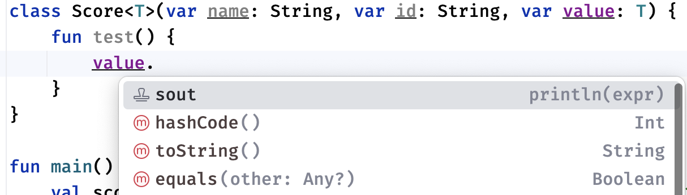

因为泛型本身就是对某些待定类型的简单处理，如果都明确要使用什么类型了，那大可不必使用泛型。还有，不能通过这个不确定的类型变量就去直接创建对象：

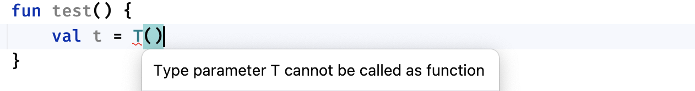

还有，由于泛型在创建时就已经确定，因此即使都是Score类，由于类型参数的不同也会导致不通用：

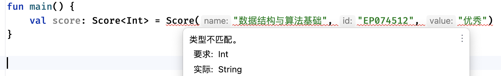

有了泛型之后，我们再来使用一些类型就非常方便了，并且泛型并不是每个类只能存在一个，我们可以一次性定义多个类型参数：

```kotlin
class Test<K, V>(val key: K, val value: V)
```

多个不同的类型参数代表不同的类型，这些都可以在使用时明确，并且互不影响。

> Kotlin还提供了下划线运算符可以自动推断类型：
> ```kotlin
> fun <K: Comparable<V>, V> test() {  }   //类型参数中第一个类型参数可以直接推断得到
> 
> fun main() {
>     test<Int, _>()  //由于前面的类型本身就是Comparable<Int>的子类，已经明确了V的类型，后面就没必要再写一次了，直接使用下划线运算符进行推断即可
> }
> ```
>
> 感觉使用场景应该比较少，了解就行。

当然，不只是类，包括接口、抽象类，都是可以支持泛型的：

```kotlin
interface Test<T> {
    
}
```

子类在继承时，可以选择将父类的泛型参数给明确为某一类型，或是使用子类定义的泛型参数作为父类泛型参数的实参使用：

```kotlin
abstract class A<T> {
    abstract fun test(): T
}

class B: A<String>() {  //子类直接明确为String类型
    override fun test(): String = "Hello World" //明确后所有用到泛型的地方都要变成具体类型
}

abstract class C<D>: A<D>() {  //子类也有泛型参数D
    abstract override fun test(): D
}

fun main() {
    val b = B()
    println(b.test())
}
```

除了在类上定义泛型之外，我们也可以在函数上定义：

```kotlin
//在函数名称前添加<T>来增加类型参数，之后函数的返回值或是参数都可以使用这个类型
fun <T> test(t: T): T = t

fun main() {
    val value: String = test("Hello World")  //调用函数时自动明确类型
}
```

甚至在使用函数类型的参数时，我们可以使用泛型来代表不确定的类型：

```kotlin
fun <T> test(func: (Int) -> T) : T {  //只要是有类型的地方都可以用T代替
 		...
}

fun <T> test2(func: T.() -> Unit) {  //甚至还可以是T类型的扩展函数
		...
}
```

在这之后，我们还会遇到更多官方提供的泛型函数，尤其是下一章的数组和集合部分。

### 官方高阶扩展函数

为了我们开发的便利，官方提供了一系列内置的高阶函数，大部分都是通过扩展函数形式定义，我们可以使用来简化我们的代码。

我们之前在使用时或许就已经发现了：

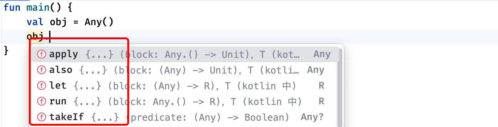

那么怎么依靠它们来简化我们的代码呢？比如下面的代码：

```kotlin
class Student(var name: String, var age: Int) {
    fun hello() = println("大家好，我是$name")
}

fun test(student: Student?): Student? {
    student?.name = "小明"  //不优雅！！！！
    student?.age = 18
    student?.hello()
  	returun student;
}
```

由于传入的是一个可空类型，这导致我们在使用时非常不方便，每次都需要进行判断，有没有更优雅一点的方式来处理呢？

```kotlin
fun test(student: Student?): Student? = student?.apply {
    this.name = "小明"
    this.age = 18
    this.hello()
}
```

太优雅了，同样的操作，原本繁杂的调用直接简化成了简单的几句代码，真是舒服啊！

我们来介绍一下这些函数时如何使用的，这里以apply为例，这个函数功能是简化我们对某个对象的操作并在最后返回对象本身，在Standard.kt中是这样定义的：

```kotlin
public inline fun <T> T.apply(block: T.() -> Unit): T {
    ...
    block()   //调用我们传入的函数
    return this   //返回当前T类型对象本身
}
```

可以看到，这个函数也是以扩展函数定义的T可以代表任何类型，所有的类都可以使用这个预设的扩展函数，并且它的参数是一个`T.() -> Unit`函数类型的，很明显这是一个高阶函数，并且最后一个参数就是函数类型，后续可以结合我们之前讲解的简化代码。

这个参数非常有意思，比如我们原来需要这样编写：

```kotlin
fun main() {
    val student: Student = Student("小明", 18)
    student.name = "大明"
    student.hello()
}
```

我们现在可以进行代码优化：

```kotlin
fun main() {
    Student("小明", 18).apply { 
        this.name = "大明"
    }.hello()
}
```

什么鬼，怎么突然就变得这么简单了？我们一个一个来看：

```kotlin
Student("小明", 18).apply{  }  //调用Apply后，我们需要传入一个Lambda表达式，也就是我们要如何操作这个对象
```

我们可以直接将对这个对象全部的操作搬进来，然后在一个Lambda里面就能完成，接着我们对这个对象的其他操作，可以直接在后续编写，因为返回的也是这个对象本身，所以，使用这些预设的高阶函数，在很多情况下都能省掉我们不少代码量。

这里我们来看几个比较常用的：

1. `let`：用于执行一个lambda表达式并将得到的结果作为返回值返回。

   ```kotlin
   //对当前对象进行操作，得到一个新的类型值并作为结果返回
   public inline fun <T, R> T.let(block: (T) -> R): R {
      	...
       return block(this)  //调用我们传入的函数，并将结果作为let返回值
   }
   ```

2. `also`：用于执行一个lambda表达式并返回对象本身，跟apply功能一致像，但是采用的是it参数形式传递给Lambda当前对象。

   ```kotlin
   //对当前对象进行操作，并返回当前对象本身
   public inline fun <T> T.also(block: (T) -> Unit): T {
       ...
       block(this)   //调用我们传入的函数
       return this   //返回当前T类型对象本身
   }
   ```

3. `run`：用于执行一个lambda表达式并将得到的结果作为返回值返回，它跟let一样，使用this传递当前对象，可以看到接受的参数是一个扩展函数。

   ```kotlin
   public inline fun <T, R> T.run(block: T.() -> R): R {
       ...
       return block()
   }
   ```

由此可见，let和run功能相近，apply和also功能相近，只是它们传递对象方式不同，所以说这个就别搞混了。

还有一个比较好用的是，有时候我们可能需要对象满足某些条件才处理，我们可以使用takeIf来完成：

```kotlin
public inline fun <T> T.takeIf(predicate: (T) -> Boolean): T? {
    ...
    return if (predicate(this)) this else null  //传入一个用于判断的函数，根据结果返回对象本身或是null
}

public inline fun <T> T.takeUnless(predicate: (T) -> Boolean): T? {
    ...
    return if (!predicate(this)) this else null  //跟上面相反
}
```

对于takeIf的使用就像下面这样：

```kotlin
fun main() {
    val str = "Hello World"
  	//判断字符串长度是否大于7，大于就返回一个重复一次的字符串，否则原样返回
    val myStr = str.takeIf { it.length > 7 }?.let { it + it } ?: str
}
```

一个很复杂的工作，可能需要很多行代码才能搞定，但是现在借助这些预设的高阶扩展函数，我们就可以以更简短的代码完成。

还有一个比较有意思的：

```kotlin
public inline fun <T, R> with(receiver: T, block: T.() -> R): R {
    ...
    return receiver.block()  //手动传入一个现有的变量，然后通过这个变量去调用传入的Lamdba
}
```

用起来就像这样：

```kotlin
fun main() {
    val str = "Hello World"
    val len = with(str) { this.length } 
}
```

除了我们上面提到的这些，其实在Standard.kt还提供了更多有意思的工具函数，由于篇幅有限，还请各位小伙伴自行探索。

### 协变与逆变*

**注意：** 这一部分相当有难度，请务必将前面的泛型概念理解到位，否则很难继续学习。

我们在前面介绍了泛型的基本使用，实际上就是一个待定的类型，我们在使用时可以指定具体的类型，并在编译时检查类型是否匹配，保证运行时类型的安全性，就像下面这样：

```kotlin
class Test<T>(var data: T) 

fun main() {
    val test1: Test<String> = Test("Hello")
    val test2: Test<Int> = Test(10)
}
```

一旦泛型变量类型确定，后续将一直固定使用此类型，并且不兼容其他类型：

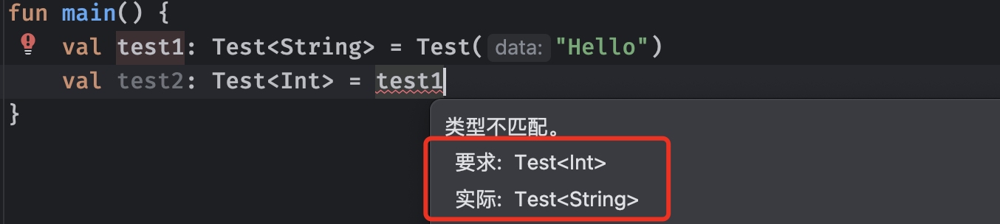

但是现在存在这样一个问题，我们如果使用某个类型的父类呢，会不会出现类型不匹配的情况？

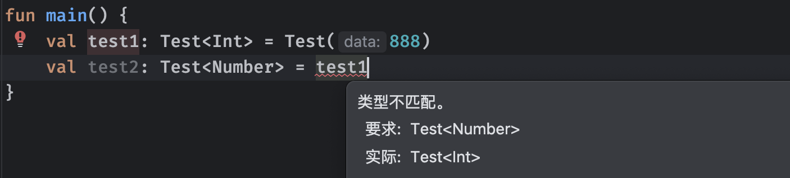

可以看到，即使是Int类型的父类Number，也无法接收其子类类型的结果，这就很奇怪了，我们前面说过一个类可以被当做其父类使用（因为父类具有属性什么子类一定也有）会自动完成隐式类型转换，但是为什么到了泛型这里就不行了呢？

> 在java里，这些写法同样会报错，但可以使用泛型通配符解决：
>
> `List<? extends Number> = List<Integer>`

为了探究这个问题，我们先从几个概念开始说起，假设Int类型是Number类型的子类，正常情况下只能子类转换为父类，泛型类型`Test<T>`存在以下几种形变：

* 协变 (Covariance)：因为Int是Number的子类，所以`Test<Int>`同样是`Test<Number>`的子类，可以直接转换
* 逆变(Contravariance)：跟上面相反，`Test<Number>`可以直接转换为`Test<Int>`，前置是后者的子类
* 抗变 (Invariant)：`Test<Int>`跟`Test<Number>`没半毛钱关系，无法互相转换

而在Kotlin的泛型中，默认就是抗变的，即使两个类型存在父子关系，到编译器这里也不认账，但是实际上我们需要的可能是协变或是逆变，为了处理这种情况，Kotlin提供了两个关键字供我们使用：

* `out` 关键字用于标记一个类型参数作为协变，可以实现子类到父类的转换。
* `in` 关键字用于标记一个类型参数作为逆变，可以实现父类到子类的转换。

那么该怎么使用呢，非常简单：

```kotlin
fun main() {
    val test1: Test<Int> = Test(888)
  	//使用out关键字使得此类型协变，可以代表Number及其子类
    val test2: Test<out Number> = test1  //此时就可以正常接受子类Int了
}
```

虽然看上去非常难理解，但是简单来说，其实就是为类型添加一个可以转换子类的性质，`out`作用就是使类型支持协变，可以支持泛型从父类转换为子类（类似java中的`? extends xx`），但是不能子类转父类，比如这里使用Any就没法成功接受。相反的，如果我们标记某个类型为`in`，那么这个类型就是逆变的，可以由父类向下转化（类似java中的`? super xx`）：

```kotlin
fun main() {
    val test1: Test<Any> = Test(888)
  	//使用in关键字使得此类型逆变，可以代表Number及其父类
    val test2: Test<in Number> = test1  //Any是Number的父类，逆变
}
```

用树形图展示，关系如下：

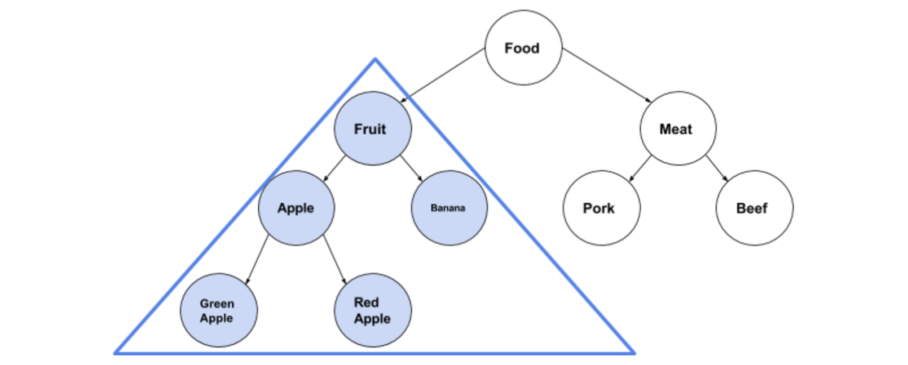

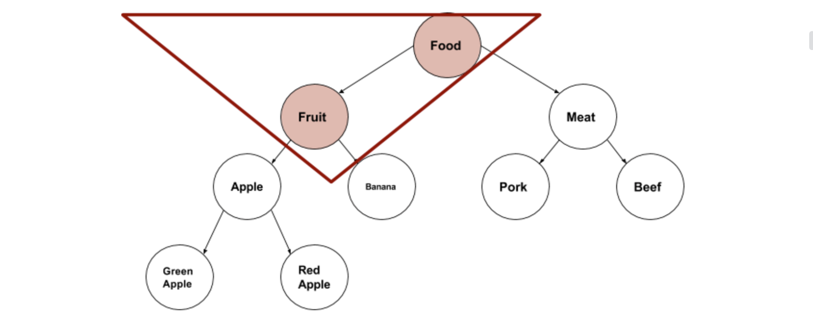

在使用这种协变或逆变类型时，具体使用的类型就变得不确定了，导致不同的界限会有不同的效果，比如下面：

```kotlin
fun main() {
  	//协变类型在使用时会变成上界，因为无论子类是什么，都是继承自上界类型的
    val test: Test<out Number> = Test(888)
    var data: Number = test.data
}
```

```kotlin
fun main() {
  	//逆变类型在使用时由于没有上界，具体使用哪个父类也不清楚，所以只能是Any?类型了
    val test: Test<in Number> = Test(888)
    var data: Any? = test.data
}
```

在使用`out`和`in`之后，类型的使用就可以更加灵活，但是这样会存在一定的安全隐患，比如下面的代码：

```kotlin
open class A
class B: A()
class C: A()

fun main() {
    val test1: Test<B> = Test(B())  //这里存放的都是B类型的数据
    val test2: Test<out A> = test1  //此时test2与test1是同一个对象，但是test2是out A
    test2.data = C()  //由于C是A的子类，按照正常情况来说可以直接用（但实际上这句会报错）
  	val data: B = test1.data  //这下搞笑了，拿到的类型应该是C，结果接收的类型是B
}
```

为了解决这种情况，Kotlin对于out或in的类型进行了限制，比如设置了out的情况下：

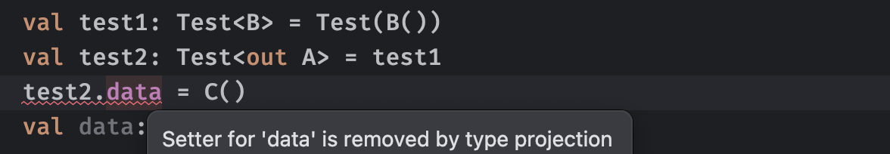

属性的setter操作被限制，无法通过编译，因为这可能会导致不安全的操作发生，而in也是同理的：

```kotlin
fun main() {
    val test1: Test<A> = Test(B())  //这里存的是B类型的对象
    val test2: Test<in C> = test1   //直接使用in C接收得到
    val data: C = test2.data   //此时得到的结果应该也可以是C才对，那肯定是错的
}
```

因此，在使用`in`时，属性的getter操作被限制，会提示类型不匹配，得到的类型也是Any? 无法通过编译，同样是因为可能存在不安全的操作。不仅仅是属性，包括所有函数的参数、返回值，都会受到限制：

```kotlin
fun main() {
    val test1: Test<B> = Test(B())
    val test2: Test<out A> = test1
    test2.test(C())  //报错，因为这里存在消费行为
}
```

因此，对于in和out来说，协变和逆变的属性将其限制为了生产者和消费者：

* 使用`out`修饰的泛型不能用作函数的参数，对应类型的成员变量setter也会被限制，只能当做一个生产者使用。
* 使用`in`修饰的泛型不能用作函数的返回值，对应类型的成员变量getter也会被限制，只能当做一个消费者使用。

在了解了这么多泛型的知识之后，相信各位小伙伴已经感受到泛型的巧妙而又复杂的设计了。

最后，在有些时候，我们可能并不在乎到底使用哪一个类型，我们希望一个变量可以接受任意类型的结果，而不是去定义某一个特定的上界或下界。在Kotlin泛型中，星号（`*`）代表了一种特殊的类型投影，可以代表任意类型：

```kotlin
fun main() {
    var test: Test<*> = Test(888)  //由于此时使用了*表示任意类型，无论类型如何变化，都可以被此变量接收
    test = Test("Hello")
}
```

同样的，由于不确定具体类型，使用时只能是Any?类型，跟上面in的情况一样，这里就不做演示了，下一章我们还会继续探讨更多`*`的默认情况。

### 泛型界限*

**注意：** 这一部分相当有难度，请务必将前面的泛型概念理解到位，否则很难继续学习。

前面我们介绍了协变和逆变，使得泛型的类型可以灵活变化使用，而我们在定义类的时候，在类型参数位置也可以进行限制。

比如有一个新的需求，现在没有String类型的成绩了，但是成绩依然可能是整数，也可能是小数，这时我们不希望用户将泛型指定为除数字类型外的其他类型，这又该怎么去实现呢？

```kotlin
//设定类型参数上界，必须是Number或是Number的子类
class Score<T : Number>(private val name: String, private val id: String, val value: T)
```

使用类似于继承的语法来完成类型的上界限制，定义后，使用时的具体类型只能是我们指定的上界类型或是上界类型的子类，不得是其他类型，否则一律报错：

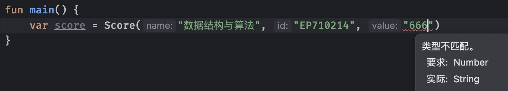

在默认情况下，如果我们不指定，那么上界类型就是Any?，而现在，我们在使用时就只能将类型指定为Number的子类了。

如果我们需要设定多个上界，比如必须同时是某两个类型的子类（或接口实现）像这样多个约束设定，我们需要使用`where`关键字：

```kotlin
class Score<T>(private val name: String, private val id: String, val value: T)
        where T : Comparable<T>, T : Number
				//where后跟上多个需要同时匹配的类型

fun main() {
  	//由于Int同时实现了Comparable接口以及继承自Number，所以满足多个条件，可以使用
    var score: Score<Int> = Score("数据结构与算法", "EP710214", 6)
}
```

通过设定上界，能够更加规范类的使用。

有时候为了方便，我们也可以直接在类定义的时候直接将类型参数指定为`out`或是`in`来使得其协变或逆变：

```kotlin
interface Test<out T> {
    fun test(): T   //使用T类型作为返回值
}

interface Test<in T> {
    fun test(t: T)  //使用T类型作为参数
}
```

这样我们使用时就可以实现类型自动适应：

```kotlin
interface Test<out T> {
    fun test(): T
}

fun test(test: Test<Int>) {
    val a: Test<Number> = test  //协变
}
```

同样的，我们前面说了在添加`in`或`out`后会限制相应的行为来保证类型的安全性，在定义类的一些函数或属性的时候都会得到警告：

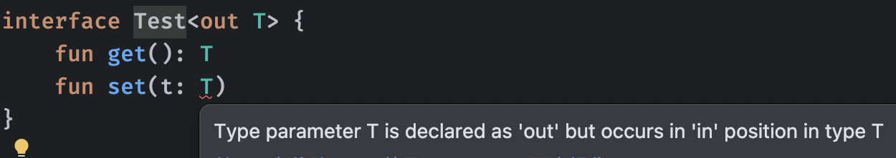

在了解了类型界限相关内容之后，我们再来看看`*`类型投影在不同情况下的默认类型，比如：

* 对于`Foo<out T : TUpper>`，其中`T`是与上界`TUpper`的协变类型参数，`Foo<*>`等价于`Foo<out TUpper>`，就像下面这样：

  ```kotlin
  class Test<out T : Number>(val data: T)  //因为限制了out，因此作为生产者，这里只能使用val
  
  fun main() {
      val test: Test<*> = Test(10)  //虽然使用了*表示不确定，但是由于类型参数本身存在上界
      var data: Number = test.data  //所以类型读取后可以直接当做上界类型Number使用
  }
  ```

* 对于`Foo<in T>`，其中`T`是逆变类型参数，`Foo<*>`等价于`Foo<in Nothing>`，无法安全地将属性给到消费者消费：

  ```kotlin
  class Test<in T> {
      fun set(t: T) { }   //因为限制了in，因此只能作为消费者，这里用函数的形式
  }
  
  fun main() {
      val test: Test<*> = Test<Int>()
      test.set(10)   //编译错误，set中参数类型为Nothing，不允许任何值
  }
  ```

* 对于`Foo<T : TUpper>`，其中`T`是具有上界`TUpper`的抗变类型参数，在读取数据时`Foo<*>`等价于`Foo<out TUpper>`，写入数据时等价于`Foo<in Nothing>`，就像这样：

  ```kotlin
  class Test<T: Number>(var data: T)
  
  fun main() {
      val test: Test<*> = Test(10)
      var data: Number = test.data  //正常通过
      test.data = 10   //编译错误，Setter for 'data' is removed by type projection
  }
  ```

如果一个泛型类有多个类型参数，每个类型参数都可以独立使用*表示不确定，例如类型为`interface Function<in T, out U>`，您可以使用以下星形投影：

- `Function<*, String>`等价于`Function<in Nothing, String>`。
- `Function<Int, *>`等价于`Function<Int, out Any?>`。
- `Function<*, *>`等价于`Function<in Nothing, out Any?>`。

泛型的使用可以很简单也可以很复杂，想要完全把这个搞明白还是需要多练多理解才能达到。

### 类型擦除*

**注意：** 这一部分相当有难度，请务必将前面的泛型概念理解到位，否则很难继续学习。

前面我们介绍了泛型的使用，以及各种高级功能，但是实际上，泛型的类型检查仅仅只存在于编译阶段，在源代码编译之后，实际上并不会保留任何关于泛型类型的内容，这便是类型擦除。

比如下面的类型：

```kotlin
class Test<T>(private var data: T) {
    fun test(t: T) : T {
        val tmp = data
        data = t
        return tmp
    }
}
```

在编译时候，会自动擦除类型：

```kotlin
class Test(private var data: Any?) {  //最后还是全部变成Any?类型了
    fun test(t: Any?) : Any? {
        val tmp = data
        data = t
        return tmp
    }
}
```

如果存在上界，那么擦除后会是上界的类型：

```kotlin
class Test<T : Number>(private var data: T) 
```

```kotlin
class Test(private var data: Number)   //擦除后类型变成上界类型
```

由于在运行时不存在泛型的概念，因此，很多操作都是不允许的，比如类型判断：

```kotlin
class Test<T>(private var data: T) {
    fun isType(obj: Any) : Boolean {
        return obj is T   //编译错误，由于类型擦除，运行时根本不存在T的类型
    }
}
```

包括我们在使用这个泛型类时：

```kotlin
fun main() {
    val test: Test<Int> = Test(10)
    println(test is Test<Double>)   //编译错误，由于类型擦除，无法判断具体的类型
  	println(test is Test)  //编译通过，判断是不是这个类还是没问题的
}
```

因此，正是为了保证类型擦除之后程序能够安全运行，才有了上面这么多限制。

对于内联函数，泛型擦除的处理会有一些不同，得益于它的内联性质，内联函数的代码是在编译时期直接插入到调用处的，在编译之后具体类型必须要存在，否则会出现问题（因为类型可以明确）因此其泛型参数的具体类型信息是可用的，编译器可以使用这些信息来生成更具体的字节码。这意味着，对于内联函数的泛型参数，并不会像非内联函数那样发生类型擦除。

```kotlin
inline fun <T> test(value: T): T {
    val value2 : T = value
    return value2
}

fun main() {
    val data: String = test("Hello World!")
}
```

内联函数编译后，类型直接保留：

```kotlin
fun main() {
    val value: String = "Hello World!"
    val value2: String = value   //直接以String类型变量编译到程序中
    val data: String = value2
}
```

Kotlin的内联函数还有一个功能是可以使用具化的类型参数（`reified` 关键字）具化类型参数允许在函数体内部检测泛型类型，因为这些类型信息会被编译器内嵌在调用点。但是，这只适用于内联函数，因为类型信息在编译时是可知的，并且实际类型会被编译到使用它们的地方，使用也很简单：

```kotlin
//添加reified关键字具化类型参数
inline fun <reified T> isType(value: Any): Boolean {
    return value is T  //这样就可以在函数里面使用这个类型了
}

fun main() {
    println(isType<String>("666"))
}
```

具化类型参数仅适用于内联函数。

## 数组

前面我们介绍了泛型，它可以实现在编写代码阶段的类型检查，现在我们就可以正式进入到数组的学习当中了。

假设出现一种情况，我们想记录100个数字，要是采用定义100个变量的方式可以吗？是不是有点太累了？这种情况我们就可以使用数组来存放一组相同类型的数据。

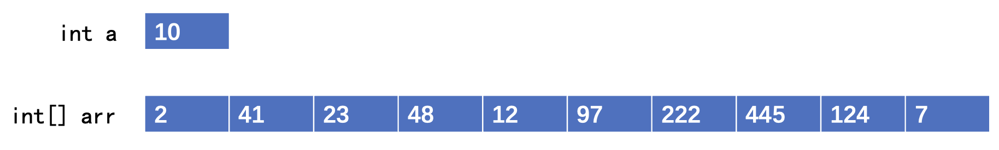

在Kotlin中，数组是Array类型的对象。

### 创建数组

数组是相同类型数据的有序集合，数组可以代表任何相同类型的一组内容，其中存放的每一个数据称为数组的一个元素，我们来看看如何创建一个数组，在Kotlin中有两种创建方式：

- 官方预设工具函数，如[`arrayOf()`](https://kotlinlang.org/api/latest/jvm/stdlib/kotlin/array-of.html)、[`arrayOfNulls()`](https://kotlinlang.org/api/latest/jvm/stdlib/kotlin/array-of-nulls.html#kotlin$arrayOfNulls(kotlin.Int))以及[`emptyArray()`](https://kotlinlang.org/api/latest/jvm/stdlib/kotlin/empty-array.html)
- 使用类`Array`构造函数创建。

比如我们要创建一个包含5个数字的数组，那么我们可以像这样：

```kotlin
val array: Array<Int> = arrayOf(7, 3, 9, 1, 6)  //直接在arrayOf函数中添加每一个元素
```

这里得到的结果类型为Array，它是一个泛型类

```kotlin
public class Array<T> {
    //构造函数，包括数组大小、元素初始化函数
    public inline constructor(size: Int, init: (Int) -> T)

    //重载[]运算符
    public operator fun get(index: Int): T
    public operator fun set(index: Int, value: T): Unit

    //当前数组大小（可以看到是val类型的，一旦确定不可修改）
    public val size: Int

    //迭代运算重载（后面讲解）
    public operator fun iterator(): Iterator<T>
}
```

可以看到，数组本质就是一个Array类型的对象，其类型参数就是我们存储的元素类型，由于使用构造函数创建数组稍微有些复杂，我们将其放到后面进行介绍。

**注意：** 数组在创建完成之后，数组容量和元素类型是固定不变的，后续无法进行修改。

```kotlin
fun main() {
    val array: Array<Int> = arrayOf(7, 3, 9, 1, 6)
    array.size = 10   //编译错误，长度不可修改
    val arr: Array<String> = array  //编译错误，类型不匹配
}
```

既然现在创建好了数组，那么该如何去访问数组里面的内容呢？

```kotlin
fun main() {
    val array: Array<Int> = arrayOf(7, 3, 9, 1, 6)
    println(array[0])   //使用[]运算符来访问指定下标上的元素
}
```

由于数组存放的是一组元素，我们在访问每个元素时需要告诉程序我们要访问的是哪一个，而每个元素都有一个自己的下标地址，下标从0开始从左往右依次递增排列，比如我们要访问第一个元素那么下标就是0，第三个元素下标就是2，以此类推：

```kotlin
fun main() {
    val array: Array<Int> = arrayOf(7, 3, 9, 1, 6)
    println("数组中的第二个元素是${array[1]}")
}
```

注意，在使用数组时，我们只能访问数组可以访问的范围，如果我们获取一个范围之外的元素，会得到错误，比如当前的数组的大小是5那么也就只能包含5个元素，此时我们去访问第六个元素，显然是错误的：

```kotlin
println("数组中的第六个元素是${array[5]}")  //已经超出可访问范围了
println("数组中的第?个元素是${array[-1]}")  //下标从0开始，怎么可能有-1呢
```

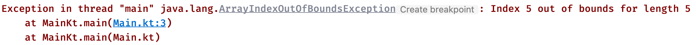

我们也可以使用`[]`修改数组中指定下标元素的值：

```kotlin
fun main() {
    val array: Array<Int> = arrayOf(7, 3, 9, 1, 6)
    array[0] = 10  //修改第一个元素的值
    println("数组中的第一个元素是${array[0]}")
}
```

还有一个要注意的是，我们直接打印这个数组对象并不能得到数组里面每个元素的值，而是一堆看不懂的东西：

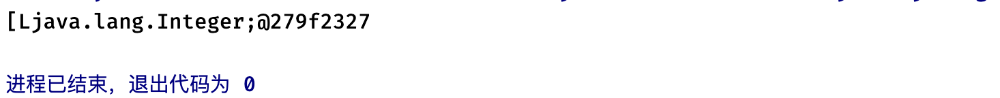

具体原因可以通过学习Java后进行了解，如果各位小伙伴需要打印数组中的每一个元素，我们只能一个一个打印，可以使用一个for循环语句来完成：

```kotlin
fun main() {
    val array: Array<Int> = arrayOf(7, 3, 9, 1, 6)
    for (i in 0..<array.size) {   //从0循环到array.size前一位
        println(array[i])   //每一个依次打印即可
    }
}
```

不过，在Kotlin中，这样编写并不优雅，我们有更好的方式去遍历数组中的每一个元素，在之前我们学习for循环语句时，谈到使用in来遍历一个可遍历的目标，而数组就是满足这个条件的，我们可以直接遍历它：

```kotlin
fun main() {
    val array: Array<Int> = arrayOf(7, 3, 9, 1, 6)
    for (element in array) {
        println(element)   //从第一个元素开始依次遍历，element就是每一个元素了
    }
}
```

当然，如果我们还是希望按照数组的索引进行遍历，也可以使用：

```kotlin
val array: Array<Int> = arrayOf(7, 3, 9, 1, 6)
for (i in array.indices) {   //indices返回的是数组的有效索引范围，这里就是0 ~ 4
    println(array[i])
}
```

如果你想同时遍历索引和元素本身，也可以使用withIndex函数，它会生成一系列IndexedValue对象：

```kotlin
//关于data class我们会在下一篇中讲解
public data class IndexedValue<out T>(public val index: Int, public val value: T) //包含元素本身和索引
```

在使用forin时，我们也可以对待遍历的元素进行结构操作，当然，前提是这些对象类型支持解构，比如这里的IndexedValue就支持解构，所以我们可以在遍历时直接使用解构之后的变量进行操作：

```kotlin
val array: Array<Int> = arrayOf(7, 3, 9, 1, 6)
for ((index, item) in array.withIndex()) {  //使用withIndex解构后可以同时遍历索引和元素
    println("元素$item，位置: $index")
}
```

如果需要使用Lambda表达式快速处理里面的每一个元素，也可以使用`forEach`高阶函数：

```kotlin
val array: Array<Int> = arrayOf(7, 3, 9, 1, 6)
array.forEach { println(it) }   //只带元素的
array.forEachIndexed { index, item ->   //同时带索引和元素的
    println("元素$item，位置: $index")
}
```

如果只是想打印数组里面的内容，快速查看，我们可以使用：

```kotlin
val array: Array<Int> = arrayOf(7, 3, 9, 1, 6)
println(array.joinToString())  //使用joinToString将数组中的元素转换为字符串，默认使用逗号隔开：7, 3, 9, 1, 6
println(array.joinToString(" - ", "> ", " <"))  //自定义分隔符，前后缀: > 7 - 3 - 9 - 1 - 6 <
println(array.joinToString(limit = 1, truncated = "..."))  //甚至可以限制数量，多余的用自定义的字符串...代替: 7, ...
println(array.joinToString() { (it * it).toString() })   //自定义每一个元素转换为字符串的结果
```

我们接着来看一下如何使用构造函数来创建数组，首先构造函数时这样定义的：

```kotlin
/**
 * size: 不必多说，数组的大小
 * init: 初始化操作，这个操作会根据数组大小，循环调用传入的函数size次，并且将对应的下标作为参数，我们需要在函数中返回当前数组元素类型的结果，这样就会自动填充到数组的对应位置上
 */
public inline constructor(size: Int, init: (Int) -> T)
```

比如我们希望创建一个字符串数组：

```kotlin
fun main() {
    val array: Array<String> = Array(5) { "我是元素$it" }   //其中返回值为自定义的字符串，这样就会自动填充到对应位置
    for (s in array) {
        println(s)
    }
}
```

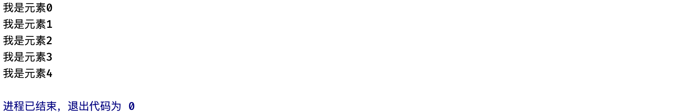

利用这种特性，我们可以快速创建一个全是同一个值的数组：

```kotlin
val array: Array<Double> = Array(5) { 1.5 }  // 1.5, 1.5, 1.5, 1.5 ...
```

还可以快速搞一个平方数数组：

```kotlin
val array: Array<Int> = Array(10) { it * it }   // 0, 1, 4, 9, 16 ...
```

不过，其实一般情况下使用`arrayOf`都可以解决大部分情况了，还有它的变种，大概介绍一下：

```kotlin
val array: Array<Int> = emptyArray<Int>()   //创建容量为0的数组
val array: Array<Int?> = arrayOfNulls(10)   //创建元素可空的数组
```

下一节课我们接着学习更多数组的操作。

### 使用数组

现在我们已经学习了如何创建数组，实际上官方库提供了很多数组的扩展函数，方便我们对于数组的使用，我们现在就来看看吧。

对于两个数组来说，如果我们要比较它们之间是否包含相同的内容，需要使用特殊的比较函数：

```kotlin
fun main() {
    val array1: Array<Int> = arrayOf(1, 2, 3, 4, 5)  //两个内容相同的数组
    val array2: Array<Int> = arrayOf(1, 2, 3, 4, 5)
    println(array1 == array2)   //不可以使用==来判断数组内容是否相同，不支持
    println(array1.contentEquals(array2))   //需要使用扩展函数contentEquals来进行内容比较
}
```

要拷贝一个数组的内容并生成一个新的数组，可以：

```kotlin
fun main() {
    val array1: Array<Int> = arrayOf(1, 2, 3, 4, 5)
    val array2: Array<Int> = array1.copyOf()   //使用copyOf来拷贝数据内容并创建一个新的数组存储
    println(array2 === array1)  //false，不是同一个对象
}
```

copyOf函数可以指定拷贝的长度或是拷贝的范围，使用更加灵活一些：

```kotlin
val array2: Array<Int?> = array1.copyOf(10)
//在拷贝时指定要拷贝的长度，如果小于数组长度则只保留前面一部分内容，如果大于则在末尾填充null，因此返回的类型是Int?可空
```

```kotlin
val array2: Array<Int> = array1.copyOfRange(1, 3)  //从第二个元素开始拷贝到第四个元素前为止，共2个元素
//使用copyOfRange拷贝指定下标范围上的元素
```

还有一个比较类似操作，但是可以使用Range进行分割：

```kotlin
val array1 = arrayOf(1, 2, 3, 4, 5)
val array2 = array1.sliceArray(1..3)   //从第二个元素到第四个元素共三个元素的数组
```

两个数组也可以直接拼接到一起，形成一个长度为10的新数组，按顺序拼接：

```kotlin
val array1 = arrayOf(1, 2, 3, 4, 5)
val array2 = arrayOf(6, 7, 8, 9, 10)
val array3 = array1 + array2
```

快速查找元素肯定也是不在话下的：

```kotlin
val array = arrayOf(13, 16, 27, 32, 38)
println(array.contains(13))   //判断数组中是否包含3这个元素
println(array in 13)   //跟contains函数效果一样，判断数组中是否包含3这个元素
println(array.indexOf(26))    //寻找指定元素的下标位置
println(array.binarySearch(16))    //二分搜索某个元素的下标位置（效率吊打上面那个函数，但是需要数组元素有序，具体原因可以学习数据结构与算法了解）
```

不过，可能会有小伙伴好奇，这里的`contains`函数传入的对象，是如何进行判断的？比如我要删除某一个元素，程序是如何将数组内的对象与传入的对象进行比较得出是相同的元素呢？我们来看下面这个例子：

```kotlin
class Student(val name: String, val age: Int)

fun main() {
    val array = arrayOf(Student("小明", 18), Student("小红", 17))
    println(array.contains(Student("小明", 18)))   //结果为false
}
```

怎么回事？我们这明明传入的是两个内容一样的对象啊，为什么是false呢？直接看源码：

```kotlin
public operator fun <@kotlin.internal.OnlyInputTypes T> Array<out T>.contains(element: T): Boolean {
    return indexOf(element) >= 0  //调用内部indexOf函数看看能不能找到这个元素的下标
}

public fun <@kotlin.internal.OnlyInputTypes T> Array<out T>.indexOf(element: T): Int {
    if (element == null) {
       ...
    } else {
        for (index in indices) {   //直接通过遍历的形式对数组内的元素一个一个进行判断
            if (element == this[index]) {   //可以看到，这里判断使用的是==运算符，这下就好说了
                return index
            }
        }
    }
    return -1
}
```

我们在前面介绍过，使用==的判断实际上取决于equals函数的重写，如果要让两个对象实现我们自定义的判断，需要重写对应类型的equals函数，否则无法实现自定义比较，默认情况下判断的是两个对象是否为同一个对象，所以，我们可以尝试重写一下：

```kotlin
class Student(val name: String, val age: Int) {
    override fun equals(other: Any?): Boolean {
        if(this === other) return true  //如果引用的是同一个对象，肯定是true不多逼逼
        if(other !is Student) return false //如果要判断的对象根本不是Student类型的，那也不用继续了
        if(name != other.name) return false  //判断名字是否相同
        if(age != other.age) return false  //判断年龄是否相同
        return true   //都没问题，那就是相等了
    }
}
```

现在得到的结果就是我们希望的样子了。

也可以快速判断和获取元素：

```kotlin
val array = arrayOf(1, 2, 3, 4, 5)
println(array.any())   //判断数组是否为空数组（容量为0）
println(array.first())   //快速获取首个元素
println(array.last())    //快速获取最后一个元素
```

我们也可以快速将一个数组的内容进行倒序排放：

```kotlin
val array1: Array<Int> = arrayOf(1, 2, 3, 4, 5)
val array2: Array<Int> = array1.reversedArray()   //翻转数组元素顺序，并生成新的数组
```

```kotlin
val array1: Array<Int> = arrayOf(1, 2, 3, 4, 5)
array1.reverse()   //直接在原数组上进行元素顺序翻转
array1.reverse(1, 3)   //仅翻转指定下标范围内的元素
```

如果我们想要直接将数组中元素打乱，也有一个快速洗牌的函数将所有元素顺序重新随机分配：

```kotlin
val array1: Array<Int> = arrayOf(1, 2, 3, 4, 5)
array1.shuffle()  //使用shuffle函数将数组中元素顺序打乱
```

打乱了想重新还原成有序的数组咋办？

```kotlin
array1.sort()   //使用sort函数对数组中元素进行排序，排序规则可以自定义
array1.sort(1, 3)   //仅排序指定下标范围内的元素
array1.sortDescending()   //按相反顺序排序
```

注意，排序操作并不是任何类型上来就支持的，由于这里我们使用的是基本类型Int，它默认实现了Comparable接口，这个接口用于告诉程序我们的排序规则，所以，如果数组中的元素是未实现Comparable接口的类型，那么无法支持排序操作。

我们可以来尝试实现一下：

```kotlin
//首先类型需要实现Comparable接口，泛型参数T填写为当前类型
class Student(private val name: String, private val age: Int) : Comparable<Student> {
  	//接口中就这样一个函数需要实现，这个是比较的核心算法，要参数是另一个需要比较的元素，然后返回值是一个Int
  	//使用当前对象this和给定对象other进行比较，如果返回小于0的数，说明当前对象应该排在前面，反之排后面，返回0表示同样的级别
    override fun compareTo(other: Student): Int = this.age - other.age
    override fun toString(): String = "$name ($age)"
}
```

这样，我们自定义的类型就支持比较和排序了：

```kotlin
val array1 = arrayOf(Student("小明", 18), Student("小红", 17))
array1.sort()
```

还有可以快速填充数组内容的函数：

```kotlin
val array1 = arrayOf(1, 2, 3, 4, 5)
array1.fill(10)   //重新将数组内部元素全部填充为10
```

好了，就先介绍这么多吧，到这里也才介绍了数组操作的一半，后面到了集合类我们再来介绍更多使用的扩展函数，因为集合数组都是支持的。

### 可变长参数

前面我们介绍了数组的使用，不知道各位小伙伴有没有疑惑，在使用arrayOf时，里面的参数为什么可以随意填写不同数量？

```kotlin
arrayOf(1, 2, 3, 4, 5)
arrayOf(1, 2, 3)
arrayOf(1, 2, 3, 4, 5, 6, 7, 8, 9)
```

函数的参数数量不是固定的吗？怎么还能动态加？难道我们前面学的是假的函数？这其实是因为这个函数使用了可变长参数的原因，它可以实现同一个类型的参数任意填写：

```kotlin
fun test(vararg strings: String) {
	//使用vararg关键字将参数标记为可变长参数
}

fun main() {
    test("AAA", "BBB", "CCC")   //在使用时，只要是同类型的参数可以填写任意数量
}
```

但是需要注意的事，可变长参数在函数的形参列表里面只能存在一个，下面这几种情况：

```kotlin
fun test(vararg strings: String, a: Int) { ... }   //编译通过
fun test(a: Int, vararg strings: String) { ... }   //编译通过
fun test(vararg a: Int, vararg strings: String) { ... }    //编译错误，存在多个可变长参数
```

那么，这种可变长参数在函数中如何使用呢？我们可以将其当做一个Array来使用：

```kotlin
fun test(vararg strings: String) {
    var str: Array<out String> = strings  //在函数中得到的是一个Array<out String>类型的数组
}
```

这样一看就简单多了，可变长参数本质就是一个数组。

那么既然可变长参数是一个数组，我们可不可以直接把数组作为参数给到一个可变长参数中呢？

```kotlin
fun main() {
    val array = arrayOf("AAA", "BBB", "CCC")
    test(array)   //编译错误，这里需要的是多个String，但是传入的类型是Array<String>
}
```

这就有点不太合理了，反正都是数组为啥我不能直接传个数组进去当做实参呢，因此Kotlin给我们提供了一个*扩展*运算符（`*`）此运算符将数组的每个元素作为单个参数传递：

```kotlin
fun main() {
    val array = arrayOf("AAA", "BBB", "CCC")
    test(*array)   //编译通过，虽然看起来有点像C语言的指针
}
```

别急，你以为这样就结束了吗，它还可以混着用：

```kotlin
val array = arrayOf("AAA", "BBB", "CCC")
test("111", *array, "DDD", "EEE")   //前面后面甚至还能继续写
```

因此，如果我们需要将一个数组的内容复制到一个新的数组中，直接这样操作就好了：

```kotlin
val array = arrayOf("AAA", "BBB", "CCC")
val array2 = arrayOf(*array)
```

### 原生类型数组

在之前，我们使用了大量基本类型数组，比如`Array<Int>`、`Array<Double>`、`Array<Char>`等等，这些包含基本类型的数组往往在编译时可以得到优化（比如JVM平台会直接编译为基本类型数组，如`int[]`、`double[]`等，可以免去装箱拆箱开销）Kotlin提供了预设的原生类型数组：

| 原生类型数组                                                 | 相当于Java  |
| ------------------------------------------------------------ | ----------- |
| [`BooleanArray`](https://kotlinlang.org/api/latest/jvm/stdlib/kotlin/-boolean-array/) | `boolean[]` |
| [`ByteArray`](https://kotlinlang.org/api/latest/jvm/stdlib/kotlin/-byte-array/) | `byte[]`    |
| [`CharArray`](https://kotlinlang.org/api/latest/jvm/stdlib/kotlin/-char-array/) | `char[]`    |
| [`DoubleArray`](https://kotlinlang.org/api/latest/jvm/stdlib/kotlin/-double-array/) | `double[]`  |
| [`FloatArray`](https://kotlinlang.org/api/latest/jvm/stdlib/kotlin/-float-array/) | `float[]`   |
| [`IntArray`](https://kotlinlang.org/api/latest/jvm/stdlib/kotlin/-int-array/) | `int[]`     |
| [`LongArray`](https://kotlinlang.org/api/latest/jvm/stdlib/kotlin/-long-array/) | `long[]`    |
| [`ShortArray`](https://kotlinlang.org/api/latest/jvm/stdlib/kotlin/-short-array/) | `short[]`   |

这些类型与Array类型没有任何继承关系，但是它们有同样的方法属性集，使用起来区别不大，优先使用基本类型数组，可以使得程序免得到一定优化，增加效率：

```kotlin
fun main() {
  	//使用arrayOf的变种intArrayOf快速生成IntArray
    val array: IntArray = intArrayOf(7, 3, 9, 1, 6)
    array.forEach { println(it) }
}
```

这些原生类型数组也有一些额外的扩展，比如快速求和：

```kotlin
val array: IntArray = intArrayOf(7, 3, 9, 1, 6)
println(array.sum())  //快速求和操作，获得数组中所有元素之和
```

还有求平均值之类的：

```kotlin
val array: IntArray = intArrayOf(7, 3, 9, 1, 6)
println(array.average())   //求整个数组的平均数
```

快速获取最大值和最小值：

```kotlin
val array: IntArray = intArrayOf(7, 3, 9, 1, 6)
println(array.min())
println(array.max())
```

其他使用基本一致，这里就不多进行介绍了。

### 嵌套数组

有些时候，单个维度的数组似乎无法满足我们的需求。比如我们现在6个元素为一组存储，现在共需要存储4组这样的数据，我们不可能去定义4个一样的数组吧？这个时候就需要用到嵌套数组了。

存放数组的数组，相当于将维度进行了提升，比如下面的就是一个2x10的数组：

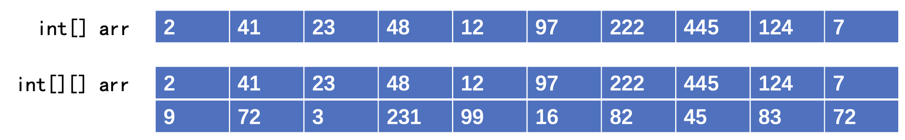

二维数组看起来更像是一个平面，同理，三维数组就是一个立方体空间，四位数组就进入到我们人类无法理解的范围了，由很多个三维组成（物理上解释或许是时间轴？）

那么像这样的多维度数组如何创建呢？这里我们以二维数组为例，三维四维同理：

```kotlin
val arr: Array<IntArray> = arrayOf(intArrayOf(1, 2), intArrayOf(3, 4), intArrayOf(5, 6))
```

可以看到，我们使用arrayOf去囊括多个IntArray，这样，最外层的Array相当于是保存多个IntArray的Array，也就实现了我们上面的二维数组效果了。当然像这样也是可以的：

```kotlin
//存放9个Array<Int>数组的数组，其中每个Array<Int>的长度为4，内容为0填充
// { {0,0,0,0}, {0,0,0,0}, {0,0,0,0} ... }
val arr: Array<Array<Int>> = Array(9) { Array(4) { 0 } }
```

嵌套数组看起来可能有些绕，但是其实仔细分析之后还是比较简单的。

我们在使用二维数组时：

```kotlin
val arr: Array<IntArray> = arrayOf(intArrayOf(1, 2), intArrayOf(3, 4), intArrayOf(5, 6))
val array: IntArray = arr[0]   //获取二维数组的第一个元素，得到内层存放的数组
val item: Int = array[0]   //再从内存存放的数组中拿到第一个元素
```

所以，如果我们要获取位于整个二维矩阵左上角的第一个元素，可以像这样：

```kotlin
val arr: Array<IntArray> = arrayOf(intArrayOf(1, 2), intArrayOf(3, 4), intArrayOf(5, 6))
//这里使用了两个[]运算符，第一个处理最外层数组，第二个才是对内层数组的操作
val item: Int = arr[0][0]
```

对于这种二维数组，如果需要遍历，我们同样可以使用for循环来完成，不过需要两层for才可以搞定：

```kotlin
val arr: Array<IntArray> = arrayOf(intArrayOf(1, 2), intArrayOf(3, 4), intArrayOf(5, 6))
for (ints in arr) {   //最外层遍历外层数组中存放的每一个内层数组
    for (int in ints) {     //内层循环遍历每一个内层数组
        println(int)   //得到每一个内层数组的值
    }
}
```

由于现在数组内存放的是数组，我们在比较两个嵌套数组的内容是否相同时，需要使用深度比较：

```kotlin
fun main() {
    val arr1: Array<IntArray> = arrayOf(intArrayOf(1, 2), intArrayOf(3, 4), intArrayOf(5, 6))
    val arr2: Array<IntArray> = arrayOf(intArrayOf(1, 2), intArrayOf(3, 4), intArrayOf(5, 6))
    println(arr1.contentEquals(arr2))   //此函数只会简单比较里面的每一个元素，当里面每个元素是数组时不会再继续去比较第二层第三层等
    println(arr1.contentDeepEquals(arr2))  //此函数会一直深入比较每一层，多维使用这个比较
}
```

这里还有一个知识误区，虽然我们使用的看起来确实类似于二维数组，但是每一个数组的长度并不需要是相同的：

```kotlin
val arr: Array<IntArray> = arrayOf(intArrayOf(1, 3, 4, 5), intArrayOf(2, 9))
//这里第一个数组长度为4，第二个为2
```

甚至类型也可以不一样：

```kotlin
//只要内层使用Any类型，就可以接收所有类型的嵌套数组
val arr: Array<Array<out Any>> = arrayOf(arrayOf(1, 3, 4, 5), arrayOf("AAA", "BBB"))
```

不过正常情况下，我们还是会按照标准的二维数组来使用，这样更加规范一些。

## 集合类

前面我们学习了数组的使用，虽然数组可以很方便地存储一组数据，但是它存在诸多限制：

* 长度是固定的，无法扩展
* 无法做到在数组中像列表那样插入或者删除元素

显然，在很多情况下，数组虽然可以存储一组数据，但是它并不好用，我们需要借助更加强大的集合类来实现更多高级功能。在Kotlin中，默认提供了以下类型的集合：

- **List：** 有序的集合，通过索引访问元素，可以包含重复元素，比如电话号码：它就是一组数字，并且顺序很重要，而且数字可以重复。
- **Set：** 不包含重复元素的集合，它更像是数学中的集合，一般情况下不维护元素顺序，例如，彩票上的数字：都是独一无二的，并且它们的顺序不重要。
- **Map：** 是一组键值对，其中每一个键不可重复存在，每个键都映射到恰好一个值（值可以重复存在）这跟数学上的映射关系很像。它经常用于存储（员工ID -> 员工具体信息）这样的结构。

所有集合类都是继承自Collection接口（Map除外）我们可以看看这个接口的定义：

```kotlin
public interface Collection<out E> : Iterable<E> {  //继承了可迭代接口（后面讲解）
    //集合的大小
    public val size: Int
    //判断集合是否为空
    public fun isEmpty(): Boolean
    //集合是否包含某个元素，可用in运算符判断
    public operator fun contains(element: @UnsafeVariance E): Boolean
  	//生成迭代器（后面讲解）
    override fun iterator(): Iterator<E>
  	//是否包含另一个集合中所有的内容
    public fun containsAll(elements: Collection<@UnsafeVariance E>): Boolean
}
```

这个接口定义了集合的基本操作，以及核心属性，而由集合顶层接口衍生的不同集合类，也都有自己的定义。集合类一般都是以接口类型的变量进行使用，因为不同的集合可能存在不同的集合实现类，为了使用起来更加通用，我们往往会使用集合类的接口进行操作。

下面就让我们一个一个认识吧。

### List集合

List就像它的名字一样，就是一个列表，它存储一组有序的数据，比如我们看到的餐厅菜单，还有游戏的排行榜，每一道菜、每一个玩家都是按顺序向下排列的，并且根据情况，我们可以自由地在某个位置插入或删除一个新的元素，列表的长度也会动态发生变化，List集合就是为了这些功能而生的。


要创建一个List集合非常简单，就跟我们之前创建数组一样：

```kotlin
fun main() {
    val list: MutableList<String> = mutableListOf(1, 2, 3, 4)   //使用mutableListOf来创建一个可修改的List集合
    list[0] = 10   //修改某个位置上的元素
    println(list[1])   //获取某个位置上的元素
    println(list)    //打印出来的结果也是非常标准的: [10, 2, 3, 4]
}
```

我们发现，使用List集合之后，很多操作其实跟数组是基本一样的，它同样可以存储一组元素，以及修改。

除了可以使用数组支持的操作之外，为了能够作为列表使用，还有很多新的操作，比如我们希望在末尾添加一个新的元素到列表中：

```kotlin
val list = mutableListOf(1, 2, 3, 4)
list.add(5)   //使用add函数添加一个新的元素到列表末尾
println(list)   //列表自动增长，得到[1, 2, 3, 4, 5]
```

我们可以在整个列表之间的任意位置插入，但是同样不能出现越界的情况：


```kotlin
val list = mutableListOf(1, 2, 3, 4)
list.add(2, 666)   //将666插入到第三个元素的位置上去
```

既然可以插入元素，同样的也可以删除元素：

```kotlin
val list = mutableListOf("AAA", "BBB", "CCC", "DDD")
list.removeAt(2)  //使用removeAt可以删除指定位置上的元素
list.remove("DDD")    //使用remove可以删除指定元素
```

可以看到，列表相比我们传统的数组来说，完整地支持了增删改查这四个操作，使用起来也会更加方便。

当然，有些时候可能我们希望获取一个只读的列表：

```kotlin
val list: List<String> = listOf("AAA", "BBB", "CCC", "DDD")  //使用listOf生成的列表是只读的
list[0] = "XXX"   //在修改时会直接提示不支持
```

类似于数组，还有多种列表创建函数：

```kotlin
val array = arrayOf("AAA", null, "CCC", "DDD")
val list: List<String> = listOfNotNull(*array)   //使用listOfNotNull可以自动去除所有null的元素，再创建只读列表
```

```kotlin
val list: List<String> = emptyList()   //返回空列表
```

或是使用构造函数（实际不是构造函数，List是接口）来创建一个列表：

```kotlin
val list: List<String> = List(3){ "TZ" }  //跟数组一样，不多说了
println(list) 
```

如果我们需要遍历一个列表，同样很简单，跟数组完全一样：

```kotlin
val list: List<String> = listOf("AAA", "BBB", "CCC", "DDD")
for (s in list) {  //使用forin来快速遍历数组中的每一个元素
    println(s)
}
test1.forEach(::println)	//使用forEach方法遍历

for ((index, item) in list.withIndex()) {
    println("元素$item, 下标: $index")
}
```

集合也支持加法和减法运算：

```kotlin
fun main() {
    val l1 = listOf("AAA", "DDD", "CCC")
    val l2 = listOf("BBB", "CCC", "EEE")
    println(l1 + l2)   //合并两个List的内容，顺序直接在后面拼接: [AAA, DDD, CCC, BBB, CCC, EEE]
    println(l1 - l2)   //让前面的集合减去与后面集合存在重复内容的部分: [AAA, DDD]
}
```

使用还是非常简单的。

### Set集合

Set集合非常特殊，虽然它也可以保存一组数据，但是它不允许存在重复元素，我们无法让Set集合中同时存在两个一样的元素，这在一些需要去重的场景中非常实用，这跟数学中定义的集合非常相似。

创建一个Set集合很简单：

```kotlin
fun main() {
  	//使用mutableSetOf来创建一个Set集合
    val set: Set<String> = mutableSetOf("AAA", "BBB", "BBB", "CCC")
    println(set)   //由于不允许出现重复元素，得到 [AAA, BBB, CCC]
}
```

与列表一样，可以随意插入元素，元素默认在尾部插入，顺序为插入顺序：

```kotlin
val set: MutableSet<String> = mutableSetOf("AAA", "DDD", "CCC")
set.add("BBB")
```

不过Set默认不支持在指定位置插入元素，只能尾插，同时我们也不能通过下标去访问Set中的元素，这是因为Set底层采用的并不是线性数据结构存储，而是用了哈希表或是树形结构（感兴趣的小伙伴可以看一下另一期数据结构与算法篇教程）而内部元素的顺序则是采用的其他形式进行维护的。

不过，我们到是可以借助迭代器来获取当前顺序上的第N个元素：

```kotlin
val set = linkedSetOf("AAA", "DDD", "CCC")
println(set.elementAt(1))   //elementAt是通过迭代器的遍历顺序取得对应位置的元素
```

有关迭代器的知识，我们放在后面进行讲解。

同时，由于Set更接近于数学上的集合概念，Kotlin为我们准备了很多集合之间的操作：

```kotlin
val set1 = mutableSetOf("AAA", "DDD", "CCC")
val set2 = mutableSetOf("BBB", "CCC", "EEE")
println(set1 union set2)   //求两个集合的并集: [AAA, DDD, CCC, BBB, EEE]  Set的+运算与这个效果一样
println(set1 intersect set2)   //求两个集合的交集: [CCC]
println(set1 subtract set2)  //求集合1在集合2中的的差集: [AAA, DDD]  Set的-运算与这个效果一样
println((set1 - set2) union (set2 - set1))   //并集减去交集
```

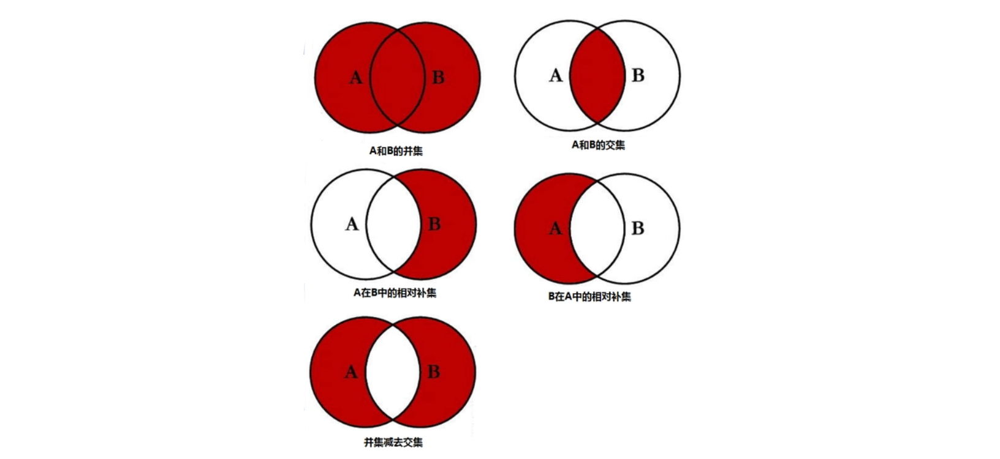

虽然集合相关操作也可以应用于List集合，但是计算得到的结果始终是Set集合：

```kotlin
fun main() {
    val l1 = listOf("AAA", "DDD", "CCC")
    val l2 = listOf("BBB", "CCC", "EEE")
    val set: Set<String> = l1 union l2   //得到的结果是一个Set集合
    println(set)
}
```

对于Set集合，官方也有很多预设的函数用于创建：

```kotlin
val set = hashSetOf("AAA", "DDD", "BBB")   //创一个不重复且无序的Set集合
println(set)   //遍历顺序并不是添加顺序: [AAA, BBB, DDD]
```

```kotlin
val set = linkedSetOf("AAA", "DDD", "BBB")  //跟mutableSetOf一样得到一个不重复且有序的Set集合
println(set)
```

```kotlin
val set1 = setOf("AAA", "DDD", "BBB")   //只读的Set集合
val set2 = setOfNotNull("AAA", "DDD", "BBB", null)   //自动过滤Null元素的Set集合
```

```kotlin
val set = sortedSetOf("AAA", "DDD", "BBB")   //元素自动排序的Set集合，可以自定义排序规则
```

```kotlin
val hashSet = HashSet<String>()  //创一个不重复且无序的Set集合
val linkedHashSet = LinkedHashSet<String>()   //跟mutableSetOf一样得到一个不重复且有序的Set集合 
```

最后我们来讲解一个前面就埋下伏笔的问题，这里我们创建了一个Student类型的Set集合：

```kotlin
class Student(private val name: String, private val age: Int) {
    override fun toString(): String = "$name ($age)"
}

fun main() {
    val set = mutableSetOf(Student("小明", 18))
    set.add(Student("小明", 18))
    println(set)
}
```

虽然我们插入了两个相同的数据，但是它们本质上是两个对象，只是内容相同，所以，Set中会认为它们不同，同时得到保存：

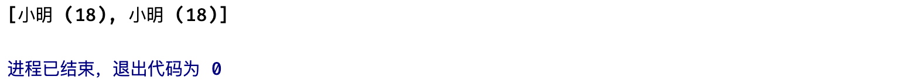

为了解决这种问题，我们之前采用的是重写`equals`函数来重新定义比较规则，这样就可以实现内容相同判断为同一个了：

```kotlin
class Student(private val name: String, private val age: Int) {
    override fun toString(): String = "$name ($age)"
    override fun equals(other: Any?): Boolean {   //跟之前一样，添加自定义的比较方式
        if(this === other) return true
        if(other !is Student) return false
        if(name != other.name) return false
        if(age != other.age) return false
        return true
    }
}
```

再次执行程序，我们发现似乎没什么卵用：


什么鬼，这明明都把比较规则给自定义了，怎么还是不能判断为同一个呢？我们之前难道学的是个假的吗？我们注意到类上有一个警告，提示我们没有重写了eq函数但是没有定义hashCode：

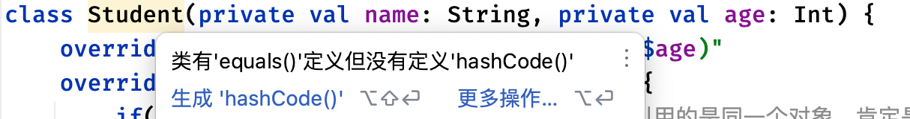

这个hashCode是什么鬼？实际上Set集合默认采用的是哈希表进行数据存储（详情请看数据结构与算法篇视频教程）而哈希表在存储数据时，需要通过一个哈希函数计算出对象的哈希值，如果两个对象的哈希值相同，那么在哈希表中就会认定为是同一个元素，如果不相同，那么会认定为不同的两个元素，因此，这里我们仅仅重写equals只能满足部分集合类的使用，而到了Set这里包括后面的Map就开始不行了。

我们可以看到，在Any类中确实定义了一个hashCode函数，这个就是用于计算对象的哈希值的：

```kotlin
/**
 * 计算并返回对象的哈希值，哈希函数的计算结果需要满足以下标准:
 *
 * * 标准1: 对同一个对象调用此函数时，应该始终返回同一个哈希值，除非重写过类的equals函数，修改过比较方式
 * * 标准2: 如果两个对象使用equals函数判断的结果为相同，那么它们计算得到的哈希值也应该相同
 */
public open fun hashCode(): Int
```

在默认情况下，对象的哈希值得到的结果是对象在内存中存放的地址，以Int类型表示：

```kotlin
println(Any().hashCode())   //结果为内存地址位置: 295530567
```

因此，上面两个对象由于存放在不同的地址，所以得到的哈希值肯定是不一样的，既然现在我们仅仅只是比较对象的名称和年龄是否相同，我们可以修改一下哈希函数的计算规则：

```kotlin
class Student(private val name: String, private val age: Int) {
    ...

    override fun hashCode(): Int {
        var result = name.hashCode()  //仅计算name和age属性的哈希值
        result = 31 * result + age.hashCode()
        return result   //这样，当name和age的哈希值与另一个对象的一致时，得到的结果就是一样的了
    }
}
```

现在再次进行操作：

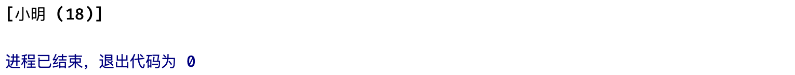

所以，以后我们在重写`equals`函数时，为了能够适配所有的集合类，我们还需将其hashCode函数一并重写，来保证一致性。

### Map映射

Map是一个非常特殊的集合类型，它存储了一些的键值对，那么什么是键值对呢？


可以看到，学校里面的学号对应了每一个学生，我们只需要知道某一个学生的学号，就可以快速查找这个学生的姓名、年龄、性别等信息，而Map就是为了存储这样的映射关系而存在的。

首先我们来看，如何定义一个键值对，官方为我们提供了一个非常方便的中缀函数：

```kotlin
public infix fun <A, B> A.to(that: B): Pair<A, B> = Pair(this, that)
```

我们只需要指定：

```kotlin
val pair: Pair<Int, String> = 10001 to "小明"   //得到一个由学号指向学生名称的键值对
```

这样，我们就成功创建出了一个映射关系，但是这仅仅是单个映射，如果我们想要存储所有学生的学号映射关系，需要使用Map来实现，使用Map也非常简单：

```kotlin
val map: MutableMap<Int, Student> = mutableMapOf(
    10001 to Student("小明", 18),
    10002 to Student("小红", 17),
    10003 to Student("小刚", 19)
)
//使用mutableMapOf可以放入多个键值对，并生成一个Map对象
```

这样我们就成功地将所有的键值对存储在Map中了，我们接着来看看如何去访问，比如现在我们要查找指定学号的学生：

```kotlin
val student: Student? = map[10001]   //使用[]运算符通过Key查找Value
```

可以看到，使用方式与前面的集合类和数组非常类似，只不过访问的不再是下标，而是对应的Key。同时，这里得到的结果是一个可空类型的对象，为什么会像这样呢？

```kotlin
val student1: Student? = map[10001]   //得到小明这个对象
val student2: Student? = map[10005]   //Map中根本没有键为10005的键值对，得到的结果是null
```

当Map中不存在指定Key时，会直接得到`null`作为结果，因此我们在处理从Map返回的Value时，需要考虑空指针问题。

```kotlin
map.contains(1)   //判断是否包含指定Key
map.containsKey(1)   //同上
10001 in map    //同上
map.containsValue(Student("小明", 18))   //判断是包含指定Value
```

**注意：** Map中的键值对存储，只能通过Key去访问Value，而不能通过Value来反向查找Key，映射关系是单向的。

我们可以直接获取到Key和Value的集合：

```kotlin
val keys: MutableSet<Int> = map.keys   //以Set形式存储的[10001, 10002, 10003]
val value: Collection<Student> = map.values    //以Collection接口类型返回的 [小明 (18), 小红 (17), 小刚 (19)] 具体类型是Map的内部类实现的
```

遍历一个Map也很简单：

```kotlin
map.forEach { (k, v) -> println("键: $k, 值 $v") }  //forEach提供两个参数，key和value

for (entry in map) {   //使用for循环也可以直接安排，这里得到的是一个entry
    entry.key
    entry.value
}

for ((key, value) in map) {  //也可以可以直接写成这样
    println("键: $key, 值 $value")
}
```

我们再来看看如何向Map中添加新的键值对：

```kotlin
map[10004] = Student("小强", 18)   //跟之前一样，直接对着赋值就行了
map.put(10004, Student("小强", 18))  //使用函数也可以，跟上面效果一样
```

你甚至还能像这样添加：

```kotlin
val newMap = map + (10004 to Student("小强", 18))   //添加新的键值对并生成一个新的Map
map += (10004 to Student("小强", 18))  //直接添加键值对到当前Map里面
map += mapOf(10004 to Student("小强", 18))  //或者添加其他Map到此Map中
map.putAll(mapOf(10004 to Student("小强", 18)))   //跟上面一样
map.putAll(setOf(10004 to Student("小强", 18)))   //键值对集合也可以的
```

不过需要注意的是，在Map中同样的Key只能存在一个，这跟Set是一样的：

```kotlin
map[10003] = Student("小强", 18)   //此时Map中已经存在Key为10003的键值对了，这会导致之前的结果被覆盖
println(map)   //结果为 {10001=小明 (18), 10002=小红 (17), 10003=小强 (18)}
```

当插入一个键值对时，如果存在相同Key会直接覆盖掉之前的键值对，我们可以通过函数的返回值来得到被覆盖的结果：

```kotlin
val old = map.put(10003, Student("小强", 18))   //put的返回值如果没有覆盖元素返回null，否则返回被覆盖的元素
println("被覆盖的$old")   //被覆盖的小刚 (19)
```

我们也可以直接移除不需要的键值对，同样是通过Key进行移除：

```kotlin
val old = map.remove(10001)   //使用remove函数移除指定键值对
println("被移除的$old")
```

各种花式移除：

```kotlin
map -= 10001   //等价于 map.remove(10001)
map -= listOf(10001, 10002)   //是的你没猜错，这个是批量移除
```

如果我们需要直接移除Value为某个Key的键值对，可以像这样：

```kotlin
map.values.remove(Student("小明", 18))   //直接从values中移除，会使得整个键值对被移除
```

```kotlin
val map: MutableMap<Int, Student> = mutableMapOf(
    10001 to Student("小明", 18),
    10002 to Student("小红", 17),
    10003 to Student("小明", 18)   //这里存在两个一样的元素
)
map.values.remove(Student("小明", 18))   //通过这种方式移除也只会移除按顺序下来的第一个
println(map)  // {10002=小红 (17), 10003=小明 (18)}
```

有些时候，Map返回的结果是可空类型给我们造成了很多麻烦，可以通过以下方式解决：

```kotlin
//使用getOrDefault在没有结果时返回给定的默认值
var student: Student = map.getOrDefault(10004, Student("小强", 16))
//跟上面一样，只不过是使用函数式返回默认值
var student: Student = map.getOrElse(10004){ Student("小强", 16) }
```

```kotlin
//这个不仅能返回默认值，还能顺手把默认值给加到Map里面去，很方便
var student: Student = map.getOrPut(10004){ Student("小强", 16) }
println(map)  //结果为 {10001=小明 (18), 10002=小红 (17), 10003=小刚 (19), 10004=小强 (16)}
```

有了Map之后，我们在处理一些映射关系的时候就很方便了。跟Set一样，官方也提供了多种多样的集合：

```kotlin
val map1 = mapOf(1 to "AAA")   //只读Map
val map2 = hashMapOf(1 to "AAA")   //不保存Key顺序的Map
val map3 = linkedMapOf(1 to "AAA")   //保存Key顺序的Map，跟mutableMapOf一样
val map4 = sortedMapOf(1 to "AAA")   //根据排序规则自动对Key排序的Map
val map5 = emptyMap<Int, String>()   //空Map
val hashMap = HashMap<Int, String>()   //采用构造函数创建的HashMap，不保存Key顺序的Map，同map2
val linkedHashSet = LinkedHashMap<Int, String>()   //采用构造函数创建的LinkedHashMap，保存Key顺序的Map，同map3
```

### 迭代器

我们在一开始提到，集合类型的顶层接口都是一个叫做Collection的接口：

```kotlin
public interface Collection<out E> : Iterable<E> {  //继承自Iterable接口
    ...
}
```

而在Iterable接口中，就定义了一个用于生成迭代器的函数：

```kotlin
public interface Iterable<out T> {
    /**
     * Returns an iterator over the elements of this object.
     */
    public operator fun iterator(): Iterator<T>
}
```

不仅仅是集合类，甚至在Array类中也定义了这样的函数：

```kotlin
public class Array<T> {
    ...

    /**
     * Creates an [Iterator] for iterating over the elements of the array.
     */
    public operator fun iterator(): Iterator<T>
}
```

迭代器是每个集合类、数组都可以生成的东西，它的作用很简单，就是用于对内容的遍历：

```kotlin
val list = listOf("AAA", "BBB", "CCC")
val iterator: Iterator<String> = list.iterator()   //通过iterator函数得到迭代器对象
```

那么这个迭代器该如何使用呢？先来看接口定义：

```kotlin
public interface Iterator<out T> {
    //获取下一个待遍历元素
    public operator fun next(): T

    //如果还有元素没有遍历，那么返回true否则返回false，而这个函数也是运算符重载函数正好对应着 for in 操作
    public operator fun hasNext(): Boolean
}
```

通过使用迭代器，我们就可以实现对集合中的元素的进行遍历，就像我们遍历数组那样，它的运作机制大概是：


一个新的迭代器就像上面这样，默认有一个指向集合中第一个元素的指针：


每一次`next`操作，都会将指针后移一位，直到完成每一个元素的遍历，此时再调用`next`将不能再得到下一个元素。至于为什么要这样设计，是因为集合类的实现方案有很多，可能是链式存储，也有可能是数组存储，不同的实现有着不同的遍历方式，而迭代器则可以将多种多样不同的集合类遍历方式进行统一，只需要各个集合类根据自己的情况进行对应实现就行了。

实际上迭代器的功能设计非常纯粹，就是看有没有下一个，有的话就拿出来，所以使用迭代器可以直接用一个while循环搞定：

```kotlin
val iterator: Iterator<String> = list.iterator()
while (iterator.hasNext()) {   //使用while不断判断是否存在下一个
    println(iterator.next())   //每次循环都取出一个
}
```

迭代器的出现，使得无论我们使用哪一种集合，都可以使用同样的方式对元素进行遍历，这统一了遍历操作的使用：

```kotlin
fun <T> forEach(iterator: Iterator<T>) {   //统一接收迭代器对象
    while (iterator.hasNext()) {
        println(iterator.next())
    }
}

fun main() {  //现在无论什么集合/数组都可以按照统一的方式去进行处理
    forEach(listOf("AAA", "BBB", "CCC").iterator()) 
    forEach(setOf("AAA", "BBB", "CCC").iterator())
    forEach(arrayOf("AAA", "BBB", "CCC").iterator())
    forEach(mapOf(1 to "AAA", 2 to "BBB",3 to "CCC").iterator())
}
```

注意，迭代器的使用是一次性的，用了之后就不能用了，如果需要再次进行遍历操作，那么需要重新生成一个迭代器对象。

只要是重写了`operator fun iterator()`函数的类型，都可以使用for..in这样的语法去进行遍历：

```kotlin
for (s in listOf("AAA", "BBB", "CCC")) {
   ...
}
```

因此，数组和集合类都支持使用for循环遍历也就不奇怪了，哪怕是我们自己定义的类，只要实现这个函数都是支持的：

```kotlin
class Test : Iterable<String> {    //这个接口实不实现其实都无所谓
  	//实现这个运算符重载函数iterator是必须要的，否则不支持
    override operator fun iterator(): Iterator<String> = TestIterator()

    class TestIterator: Iterator<String> {  //自己随便写一个迭代器实现
        override fun hasNext(): Boolean = true
        override fun next(): String = "666"
    }
}

fun main() {
    val test = Test()
    for (s in test) {
        println(s)
    }
}
```

包括我们前面使用的Range语法，其本身也是一个支持生成迭代器的类：

```kotlin
val range: IntRange = 1..3
val iterator: Iterator<Int> = range.iterator()
```

实际上，所有使用for..in语法的操作，最后都会被编译为使用迭代器的while操作：

```kotlin
val list = mutableListOf("AAA", "BBB", "CCC")   //编译前
for (s in list) {
    list.add("DDD")
}
```

```kotlin
val list = mutableListOf("AAA", "BBB", "CCC")   //编译后
val iterator: Iterator<String> = list.iterator()
while (iterator.hasNext()) {
    val next = iterator.next()
    println(next)
}
```

是不是突然觉得有点豁然开朗？至此，我们已经完成解释清楚for..in操作的原理了。

特别的，对于List来说，它还有一个非常特殊的ListIterator迭代器：

```kotlin
val iterator: ListIterator<String> = list.listIterator()   //使用listIterator函数来获取ListIterator
println(iterator.next())  //不仅可以正着迭代
println(iterator.nextIndex())   //还可以直接告诉你下一个迭代的是List的第几个元素
println(iterator.previous())   //还能反着来
```

ListIterator迭代器是普通迭代器的强化版本，它可以实现列表中元素的双向遍历，并且可以得到当前迭代的元素下标。

最后，我们再来探讨一个之前可能遇到过的问题：

```kotlin
val list = mutableListOf("AAA", "BBB", "CCC")
for (s in list) {   //在遍历List时，不断往里面添加新的元素
    list.add("DDD")
}
```

此程序运行会直接得到一个报错：


在JVM环境下，Kotlin默认不支持在迭代时修改集合里面的内容，无论是插入新的元素还是移除元素，都会触发并发修改异常。为了解决这个问题，Kotlin为所有的MutableCollection（所有非只读集合类）提供了一个特殊的用于生成MutableIterator的函数，只要我们使用的不是只读的集合类，都可以获得这个特殊的迭代器，它支持在遍历时对元素进行删除：

```kotlin
val list = mutableListOf("AAA", "BBB", "CCC")
val iterator: MutableIterator<String> = list.iterator()
while (iterator.hasNext()) {
  	iterator.next()
    iterator.remove()   //删除当前迭代器已经遍历的最后一个元素
}
```

有关迭代器的相关知识就先到这里了。

### 集合与数组扩展操作

前面我们介绍了Kotlin提供的几个常用集合类，我们在使用这些集合类的时候，为了更加方便，官方提供了很多用于集合、数组类型的扩展操作，我们来学习一下吧，因为这些扩展操作数组和集合都可以使用，我们就尽量以List为例进行讲解。

首先是数组跟集合的联动，有些时候我们可能拿到的是一个数组对象，但是我们希望将其转换为集合类进行操作，我们可以使用数组提供的集合快速转换函数来进行转换：

```kotlin
val array = arrayOf("AAA", "BBB", "CCC")
val list: List<String> = array.toList()
val list: MutableList<String> = array.toMutableList()
val set: Set<String> = array.toSet()
val set: MutableSet<String> = array.toMutableSet()
```

这样，如果我们发现数组无法满足我们对于其元素的操作，可以直接转换为集合类进行操作，方便你我。

接下来是映射操作（注意这里说的map跟我们前面说的集合Map是两个概念，别搞混了）它可以将集合类、数组的元素类型进行转换，比如我们现在有一个字符串集合，但是我们现在希望把它变成记录每一个字符串长度的Int集合，该怎么做呢？

```kotlin
val list = listOf("AAA", "BB", "CCCCC")
val lenList: List<Int> = list.map { it.length }   //使用map函数，传入自定义的转换操作函数，就可以对元素进行转换了
```

我们可以利用这种操作来为里面的每一个元素添加编号：

```kotlin
val list = listOf("AAA", "BBB", "CCC")  //使用mapIndexed还可以额外附带一个index参数
val mapList: List<String> = list.mapIndexed { index, it -> "$index.${it}" }
println(mapList)  //结果 [0.AAA, 1.BBB, 2.CCC] 快速编号操作
```

利用映射操作，我们可以快速对集合中是元素依次进行修改，也可以对集合中的元素进行类型转换，非常方便。

对于Map类型，我们还可以单独对所有Key或是Value进行操作：

```kotlin
val numbersMap = mapOf("key1" to 1, "key2" to 2, "key3" to 3)
println(numbersMap.mapKeys { it.key.uppercase() })   //对所有的Key进行Map操作
println(numbersMap.mapValues { it.value + it.key.length })
```

我们接着来看下一个，压缩操作，它可以将当前集合元素和另一个集合中具有相同索引的元素组合起来，生成一个装满Pair的列表：

```kotlin
val list1 = listOf(1, 2, 3)
val list2 = listOf("AAA", "BBB", "CCC")
val pairs: List<Pair<Int, String>> = list1.zip(list2)
println(pairs)
```

利用压缩操作我们可以快速将两个List集合揉成一个Map集合：

```kotlin
val map = mutableMapOf<Int, String>()
map.putAll(list1.zip(list2))
println(map)  //结果 {1=AAA, 2=BBB, 3=CCC}
```

既然能压缩还能解压：

```kotlin
val list = listOf(1 to "AAA", 2 to "BBB", 3 to "CCC")  //把合在一起的Pair每个元素都分开
val unzipList: Pair<List<Int>, List<String>> = list.unzip()  //转换出来是一个存放两个List的Pair
println(unzipList)
```

有些时候我们还可以使用另一种方式将普通集合转换为Map映射，比如associate操作：

```kotlin
val list = listOf("AAA", "BBB", "CCC")
//使用associateWith快速构建以列表中每个元素为Key的Map映射
val associate: Map<String, Int> = list.associateWith { it.length }   //提供一个函数，返回值作为生成的Map对应Key的Value
println(associate)  //结果 {AAA=3, BBB=3, CCC=3}
```

还有对应的反向操作：

```kotlin
val list = listOf("AAA", "BBB", "CCC")
//使用associateBy快速构建以列表中每个元素为Value的Map映射
val associate: Map<Int, String> = list.associateBy { it.length }   //提供一个函数，返回值作为生成的Map对应Value的Key
println(associate)   //结果{3=CCC}，因为上面生产出来的Key全是3，覆盖完只剩下最后一个了
```

如果你觉得以上两种方式都不是很灵活，你也可以自己根据情况自行构建一个Pair作为结果返回：

```kotlin
val associate: Map<String, Int> = list.associate { it to it.length }  //返回一个Pair
```

我们接着来看，对于一些嵌套集合和数组来说，有时候处理里面的数据会变得很棘手：

```kotlin
val list = listOf(listOf("AAA", "BBB"), listOf("CCC", "DDD"))
//现在我们想要遍历这个嵌套List中的每一个元素，需要两层for循环
list.forEach { it.forEach { item -> println(item) } }
```

那么有没有办法能够把这个嵌套的集合内所有的集合全部拆出来，全部存在一个不嵌套的集合中呢？我们可以使用扁平化操作：

```kotlin
val list = listOf(listOf("AAA", "BBB"), listOf("CCC", "DDD"))
val flatten: List<String> = list.flatten()   //使用flatten函数将嵌套集合扁平化
println(flatten)   //可以看到内容自动被展平了 [AAA, BBB, CCC, DDD]
```

结合之前学习的映射操作，我们还可以在展平元素的同时对元素进行映射，非常适合下面这种情况：

```kotlin
//把下面这个给展平
val list = listOf(Container(listOf("AAA", "BBB")), Container(listOf("CCC", "DDD")))
```

可以看到，这个List很恶心，它内层存放的集合是被套在一个对象中的，更准确的说，这是一个`List<Container>`类型的列表，但是现在我们希望的是取出里面每一个对象存储的List然后拿来展平，可以像这样：

```kotlin
//使用flatMap函数进行操作，支持自定义获取列表然后再进行扁平化操作
val flatList: List<String> = list.flatMap { it.list }   //通过Lambda将每一个Container映射为List
println(flatList)   //结果为：[AAA, BBB, CCC, DDD]
```

其实还有一个`joinToString`函数，但是前面数组部分已经讲解过了，使用方式是一样的，这里就不做介绍了。

有时候我们想要移除集合中某些不满足条件的元素，我们可以使用过滤操作来完成：

```kotlin
val list = listOf("AAA", "BB", "CCC")
//使用filter来过滤不满足条件的元素，这里的意思是只保留长度大于2的字符串
val filterList: List<String> = list.filter { it.length > 2 }
println(filterList)  //结果为：[AAA, CCC]
```

```kotlin
val numbersMap = mapOf("key1" to 1, "key2" to 2, "key3" to 3, "key11" to 11)
//Map同样支持这样的操作
val filteredMap = numbersMap.filter { (key, value) -> key.endsWith("1") && value > 10}
println(filteredMap)
```

还有快速过滤所有空值的操作：

```kotlin
val list = listOf("AAA", null, "BBB", null)
val filterList: List<String> = list.filterNotNull()
println(filterList)   //结果 [AAA, BBB]
```

甚至还可以快速过滤出指定类型的集合：

```kotlin
val list = listOf("AAA", Any(), "BBB", 123, 3.14)
val filterList: List<String> = list.filterIsInstance<String>()  //快速过滤出所有的String元素
println(filterList)   //结果 [AAA, BBB]
```

通过过滤操作可以快速筛选出我们需要的那些元素，当然，如果我们既需要筛选出来的元素，也需要筛选出去的元素，我们可以使用分区操作：

```kotlin
val list = listOf("AA", "BBB", "CC", "DDD")
//分区操作得到一个匹配列表和一个不匹配列表
val (match, mismatch) = list.partition { it.length > 2 }
println("匹配的列表: $match")
println("不匹配的列表: $mismatch")
```

不愧是Kotlin，甚至连一个筛选功能都可以做的这么全面。还有专门用于测试元素是否满足条件的：

```kotlin
val list = listOf("AA", "BBB", "CC", "DDD")
list.any { it.length > 2 }  //判断集合中是否至少存在一个元素满足条件
list.none { it.length > 2 }  //判断集合中是否不存在任何一个元素满足条件
list.all { it.length > 2 }   //判断集合中是否每一个元素都满足条件
```

我们接着来看非常实用的分组操作，它可以将元素按类别进行分组，以Map的形式返回：

```kotlin
val list = listOf("AA", "BBB", "CC", "DDD")
println(list.groupBy { it.length })  //按照字符串的长度进行分组
//得到 {2=[AA, CC], 3=[BBB, DDD]}
```

我们接着来看对于集合的裁剪相关操作，首先是对一个集合进行切片，比如我们只想要其中一段元素：

```kotlin
val list = listOf("AA", "BBB", "CC", "DDD")
println(list.slice(1..2))   //截取从第二个元素到第三个元素共两个元素的List片段，结果：[BBB, CC]
println(list.take(2))  //使用take获取从第一个元素开始的长度为N的元素片段，结果：[AA, BBB]
println(list.takeLast(2)) //同上，但是从尾部倒着来，结果：[CC, DDD]
println(list.drop(2))   //这个跟take是反着的，直接跳过前N个元素截取，结果：[CC, DDD]
println(list.dropLast(2))  //不用多说了吧
println(list.takeWhile { it.length <= 2 })   //从第一个元素开始，依次按照给定的函数进行判断，如果判断成功则添加到返回列表中，直到遇到一个不满足条件的就返回，这里的结果就是 [AA]
...
```

前面我们介绍了嵌套集合的扁平化，那有没有办法吧扁平化的集合给重新分块呢？

```kotlin
val list = listOf("AA", "BBB", "CC", "DDD")
//使用chunked进行分块，这里2个元素为一组进行分块，得到一个嵌套的集合
println(list.chunked(2))   //结果 [[AA, BBB], [CC, DDD]]
```

有关集合相关的扩展操作，我们就先介绍到这里了，想要了解更多集合特性的小伙伴请参考官网：https://kotlinlang.org/docs/collections-overview.html

### 序列

除了集合，Kotlin标准库还包含另一种类型：*序列*（[`Sequence`](https://kotlinlang.org/api/latest/jvm/stdlib/kotlin.sequences/-sequence/index.html)）与集合不同，序列不包含元素，它在运行时生成元素，Sequence与Iterable接口功能相似，接口定义如下，同样只包含一个生成迭代器的函数：

```kotlin
public interface Sequence<out T> {
    public operator fun iterator(): Iterator<T>
}
```

那既然功能一样，为什么要专门搞一个序列呢？这不是多此一举吗？序列实际上是一个延迟获取数据的集合，只有需要元素时才会生产元素并提供给外部，包括所有对元素操作，并不是一次性全部处理，而是根据情况选择合适的元素进行操作。使用序列能够在处理大量数据时获得显著的性能提升。

要创建一个序列非常简单，使用generateSequence函数即可：

```kotlin
val sequence: Sequence<Int> = generateSequence {
    println("生成一个新的元素")
    10   //返回值就是生成的元素
}
```

可以看到generateSequence得到的结果并没有在一开始执行println，因为序列的数据处理是惰性的，在我们添加

```kotlin
sequence.forEach { println(it) }
```

此时控制台才开始打印生成的Lambda函数。同样的，所有扩展操作同样是惰性的，我们可以来比较一下：

```kotlin
val list = listOf("AA", "BBB", "CCC", "DD", "EEE", "FF", "GGG", "HH")
//以下操作用于获取前两个长度大于2的字符串，并进行小写转换操作
val result = list.filter {
    println("进行过滤操作: $it")
    it.length > 2
}.map {
    println("进行小写转换操作")
    it.lowercase()
}.take(2)
```

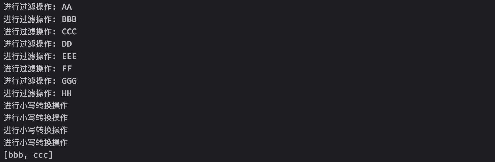

可以看到，在直接使用集合的情况下，整个工序是按照顺序在向下执行的，并且每一道工序都会对所有的元素依次进行操作，但是实际上根据我们的要求，最后只需要两个满足条件的即可，如果这个是一个数据量非常庞大的集合，会导致执行效率很低。我们现在换成序列试试看：

```kotlin
//使用asSequence函数将集合转换为一个序列
val result = list.asSequence().filter {
    println("进行过滤操作: $it")
    it.length > 2
}.map {
    println("进行小写转换操作")
    it.lowercase()
}.take(2)
println(result)  //如果这句不执行，不获取元素，以上整个操作都是不会进行的
```

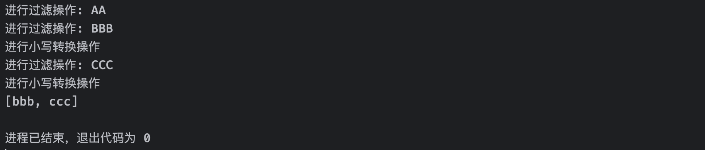

可以看到，序列根据我们的操作流程，对数据的操作也进行了优化，执行次数明显减少，并且使用序列后只有我们从序列读取数据时才会开始执行我们定义好的工序，可见，序列执行的各种操作，仅仅是记录到序列中，并没有在一开始就执行，而是需要的时候才开始获取，因此才可以做到上面这样的操作。

> 这与Java中的Stream非常相似。

当然，序列并不是随时随地都可以使用的，我们还是要根据实际情况决定是否要使用序列，如果在数据量特别庞大的情况下，使用序列处理会更好，但是如果数据量很小，使用序列反而会增加开销。

## 特殊类型介绍

除了我们之前学习的普通class类型之外，Kotlin还为我们提供了更多种类的类型，以应对不同的情况。

这些特殊类型本质上依然是class但是存在一些限制或是特殊情况。

### 数据类型

对于那些只需要保存数据的类型，我们常常需要为其重写`toString`、`equals`等函数，针对于这种情况下，Kotlin为我们提供了专门的数据类，数据类不仅能像普通类一样使用，并且自带我们需要的额外成员函数，比如打印到输出、比较实例、复制实例等。

声明一个数据类非常简单：

```kotlin
//在class前面添加data关键字表示为一个数据类
data class User(val name: String, val age: Int)
```

数据类声明后，编译器会根据主构造函数中声明的所有属性自动为其生成以下函数：

- `.equals()`/`.hashCode()`
- `.toString()`生成的字符串格式类似于`"User(name=John, age=42)"`
- `.componentN()`与按声明顺序自动生成用于解构的函数
- `.copy()`用于对对象进行拷贝

我们可以来试试看：

```kotlin
fun main() {
    val user1 = User("小明", 18)
    val user2 = User("小明", 18)
    println(user1)   //打印出来就是格式化的字符串 User(name=小明, age=18)
    println(user1 == user2)   //true，因为自动重写了equals函数
    val (name, age) = user1   //自动添加componentN函数，因此支持解构操作
    println("名称: $name, 年龄: $age")
}
```

当然，为了确保生成代码的一致性和有效性，数据类必须满足以下要求：

- 主构造函数中至少有一个参数。
- 主构造函数中的参数必须标记为`val`或`var`。
- 数据类不能是抽象的、开放的、密封的或内部的。

此外，数据类的成员属性生成遵循有关成员继承的以下规则：

- 如果数据类主体中`.equals()` `.hashCode()`或`.toString()`等函数存在显式（手动）实现，或者在父类中有`final`实现，则不会自动生成这些函数，并使用现有的实现。

  ```kotlin
  data class User(val name: String, val age: Int) {
    	//如果已经存在toString的情况下，不会自动生成
      override fun toString(): String = "我是自定义的toString"
  }
  
  fun main() {
      val user = User("小明", 18)
      println(user)   //结果: 我是自定义的toString
  }
  ```

- 如果超类型具有`open` `.componentN()`函数并返回兼容类型，则为数据类生成相应的函数，并覆盖超类型的函数。如果由于一些关键字导致无法重父类对应的函数会导致直接报错。

  ```kotlin
  abstract class AbstractUser {
    	//此函数必须是open的，否则无法被数据类继承
      open operator fun component1() = "卢本伟牛逼"
  }
  
  data class User(val name: String, val age: Int): AbstractUser()  //自动覆盖掉父类的component1函数
  ```

- 不允许为`.componentN()`和`.copy()`函数提供显式实现。

  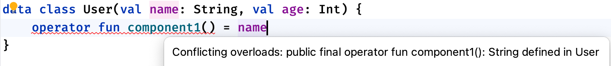

注意，编译器会且只会根据主构造函数中定义的属性生成对应函数，如果有些时候我们不希望某些属性被添加到自动生成的函数中，我们需要手动将其移出主构造函数：

```kotlin
data class Person(val name: String) {
    var age: Int = 0   //age属性不会被处理
}
```

此时生成的所有函数将不会再考虑age属性：

```kotlin
fun main() {
    val person1 = Person("John")
    val person2 = Person("John")
    person1.age = 10
    person2.age = 20

    println("person1 == person2: ${person1 == person2}")
    // person1 == person2: true
    println("person1 with age ${person1.age}: $person1")
    // person1 年龄为 10: Person(name=John)
    println("person2 with age ${person2.age}: $person2")
    // person2 年龄为 20: Person(name=John)
}
```

数据类自带一个拷贝对象的函数，使用`.copy()`函数复制对象，允许您更改其*一些*属性，而其余的保持不变。此函数对上述`User`类的实现如下：

```kotlin
data class User(val name: String, val age: Int)

fun main() {
    val user = User("小明", 18)
    val copyUser = user.copy()   //使用拷贝函数生成一个内容完全一样的新对象
    println(user == copyUser)
    println(user === copyUser)
}
```

在copy函数还可以在拷贝过程中手动指定属性的值：

```kotlin
val user = User("小明", 18)
println(user.copy(age = 17))   //结果为 User(name=小明, age=17)
```

### 枚举类型

我们知道，在Kotlin中有一个Boolean类型，它只有两种结果，要么为false要么为true，这代表它的两种状态真和假。有些时候，可能两种状态并不能满足我们的需求，比如一个交通信号灯，它具有三种状态：红灯、黄灯和绿灯。

如果我们想要存储和表示自定义的多种状态，使用枚举类型就非常合适：

```kotlin
//在类前面添加enum表示这是一个枚举类型
enum class LightState {
    GREEN, YELLOW, RED   //直接在枚举类内部写上所有枚举的名称，一般全部用大写字母命名
}
```

枚举类的值只能是我们在类中定义的那些枚举，不可以存在其他的结果，枚举类型同样也是一个普通的类，只是存在值的限制。

要使用一个枚举类的对象，可以通过类名直接获取定义好的枚举：

```kotlin
fun main() {
    val state: LightState = LightState.RED  //直接得到红灯
  	println(state.name)   //自带name属性，也就是我们编写的枚举名称，这里是RED
}
```

同样的，枚举类也可以具有成员：

```kotlin
//同样可以定义成员变量，但是不能命名为name，因为name拿来返回枚举名称了
enum class LightState(val color: String) {
    GREEN("绿灯"), YELLOW("黄灯"), RED("红灯");  //枚举在定义时也必须填写参数，如果后面还要编写成员函数之类的其他内容，还需在末尾添加分号结束
  
  	fun isGreen() = this == LightState.GREEN  //定义一个函数也是没问题的
}
```

我们可以像普通类那样正常使用枚举类的成员：

```kotlin
val state: LightState = LightState.RED
println("信号灯的颜色是: ${state.color}")
println("信号灯是否可以通行: ${state.isGreen()}")
```

枚举类型可以用于`when`表达式进行判断，因为它的状态是有限的：

```kotlin
val state: LightState = LightState.RED
val message: String = when(state) {
    LightState.RED -> "禁止通行"
    LightState.YELLOW -> "减速通行"
    LightState.GREEN -> "正常通行"
}
println(message)   //结果为: 禁止通行
```

在枚举类中也可以编写抽象函数，抽象函数需要由枚举自行实现：

```kotlin
enum class LightState(val color: String) {
    GREEN("绿灯"){
        override fun test() = println("我是绿灯，表示可以通过")
    }, YELLOW("黄灯") {
        override fun test() = println("我是黄灯，是让你减速，不是让你踩油门加速过去")
    }, RED("红灯") {
        override fun test() = println("我是红灯，禁止通行")
    };
    abstract fun test()   //抽象函数
}

fun main() {
    val state: LightState = LightState.RED
    state.test()   //调用函数: 我是红灯，禁止通行
}
```

如果枚举类实现了某个接口，同样可以像这样去实现：

```kotlin
interface Message {
    fun test()
}

enum class LightState(val color: String) : Message {
    GREEN("绿灯"){
        override fun test() = println("我是绿灯，表示可以通过")
    }, YELLOW("黄灯") {
        override fun test() = println("我是黄灯，是让你减速，不是让你踩油门加速过去")
    }, RED("红灯") {
        override fun test() = println("我是红灯，禁止通行")
    };
}
```

```kotlin
enum class LightState(val color: String) : Message {
    GREEN("绿灯"), YELLOW("黄灯"), RED("红灯");
    override fun test() = println("")
}
```

枚举类也为我们准备了很多的函数：

```kotlin
val state: LightState = LightState.valueOf("RED")   //通过valueOf函数以字符串名称的形式转换为对应名称的枚举
val state: LightState = enumValueOf<LightState>("RED")   //同上
println(state)
println(state.ordinal)   //枚举在第几个位置
println(state.name)   //枚举名称
```

```kotlin
val entries: EnumEntries<LightState> = LightState.entries  //一键获取全部枚举，得到的结果是EnumEntries类型的，他是List的子接口，因此可以当做List来使用
val values: Array<LightState> = enumValues<LightState>()   //或者像这样以Array形式获取到所有的枚举
println(entries)
```

### 匿名类和伴生对象

有些时候，可能我们并不需要那种通过`class`关键字定义的对象，而是以匿名的形式创建一个临时使用的对象，在使用完之后就不再需要了，这种情况完全没有必要定义一个完整的类型，我们可以使用匿名类的形式去编写。

```kotlin
val obj = object {   //使用object关键字声明一个匿名类并创建其对象，可以直接使用变量接收得到的对象
  	val name: String = ""
    override fun toString(): String = "我是一个匿名类"   //匿名类默认继承于Any，可以直接重写其toString
}
println(obj)
```

可以看到，匿名类除了没名字之外，也可以定义成员，只不过这种匿名类不能定义任何构造函数，因为它是直接创建的，这种写法我们也可以叫做*对象表达式*。

匿名类不仅可以直接定义，也可以作为某个类的子类定义，或是某个接口的实现：

```kotlin
interface Person {
    fun chat()
}

fun main() {
    val obj: Person = object : Person {   //直接实现Person接口
        override fun chat() = println("牛逼啊")
    }
    obj.chat()  //当做Person的实现类使用
}
```

```kotlin
interface Person
open class Human(val name: String)

fun main() {
    val obj: Human = object : Human("小明"), Person {   //继承类时，同样需要调用其构造函数
        override fun toString() = "我叫$name"   //因为是子类，直接使用父类的属性也是没问题的
    }
    println(obj)
}
```

可以看到，平时我们无法直接实例化的接口或是抽象类，可以通过匿名类的形式得到一个实例化对象。

我们再来看下面这种情况：

```kotlin
interface KRunnable {
    fun invoke()   //此类型是一个接口且只包含一个函数
}
```

根据我们上面学习的用法，如果我们想要使用其匿名类，可以像这样编写：

```kotlin
fun main() {
    val runnable = object : KRunnable {   //使用匿名类的形式编写KRunnable的实现类对象
        override fun invoke() {
            println("我是函数invoke的实现")
        }    
    }
    runnable.invoke()
}
```

特别的，对于只存在一个抽象函数的接口称为*函数式接口*或*单一抽象方法（SAM）接口*，函数式接口可以有N个非抽象成员，但是只能有一个抽象成员。对于函数式接口，可以使用我们前面介绍的Lambda表达式来使代码更简洁：

```kotlin
fun interface KRunnable {  //在接口声明前面添加fun关键字
    fun invoke()
}

...

fun main() {
    val runnable = KRunnable {   //支持使用Lambda替换
        println("我是函数invoke的实现")
    }
    runnable.invoke()
}
```

我们再来看下面这种情况：

```kotlin
fun interface Printer {
    fun print()
}

fun test(printer: Printer) {   //需要Printer接口实现对象
    printer.print()
}
```

我们在调用test时，也可以写的非常优雅：

```kotlin
fun main() {
    test {   //直接Lambda一步到位
        println("Hello World")
    }
}
```

正是因为有了匿名类，所以有些时候我们通过函数得到的结果，可能并不是某个具体定义的类型，也有可能是直接采用匿名形式创建的匿名类对象：

```kotlin
open class Human(val name: String)

fun test() = object: Human("小明") {  //返回的一个匿名类对象
  	val age: Int = 10
    override fun toString() = "我叫$name"
}

fun main() {
    println(test().name)
    println(test().age)  //编译错误，因为返回的类型是Human，由于其匿名特性，只能当做Human使用
}
```

`object`关键字除了用于声明匿名类型，也可以用于声明单例类。单例类是什么意思呢？就像它的名字一样，在整个程序中只能存在一个对象，也就是单个实例，不可以创建其他的对象，始终使用的只能是那一个对象。

```kotlin
object Singleton {   //声明的一个单例类
    private var name = "你干嘛"
    override fun toString() = "我叫$name"
}

fun main() {
    val singleton = Singleton  //通过类名直接得到此单例类的对象
  	//不可以通过构造函数的形式创建对象
    println(singleton)
}
```

```kotlin
object Singleton {
    fun test() = println("原神，启动！")
}

fun main() {
    Singleton.test()   //单例定义的函数直接使用类名即可调用
}
```

用起来与Java中的静态属性挺像的，只不过性质完全不一样。单例类的这种性质在很多情况下都很方便，比如我们要编写某些工具操作，可以直接使用单例类的形式编写。

现在我们希望一个类既支持单例类那样的直接调用，又支持像一个普通class那样使用，这时该怎么办呢？

我们可以使用伴生对象来完成，实际上就是将一个单例类写到某个类的内部：

```kotlin
class Student(val name: String, val age: Int) {
  	//使用companion关键字在内部编写一个伴生对象，它同样是单例的
    companion object Tools {
      	//伴生对象定义的函数可以直接通过外部类名调用
        fun create(name: String, age: Int) = Student(name, age)
    }
}

fun main() {
  	//现在Student不仅具有对象的函数，还可以通过类名直接调用其伴生对象通过的函数
    val student = Student.create("小明", 18)
  	println(student.toString())
}
```

伴生对象在Student类加载的时候就自动创建好了，因此我们可以实现直接使用。

### 委托模式

在有些时候，类的继承在属性的扩展上起到了很大的作用，通过继承我们可以直接获得某个类的全部属性，而不需要再次进行编写，不过，现在有了一个更好的继承替代方案，那就是*委托模式*（在设计模式中也有提及）名字虽然听着很高级，但是其实很简单，比如我们现在有一个接口：

```kotlin
interface Base {
    fun print()
}
```

正常情况下，我们需要编写一个它的实现类：

```kotlin
class BaseImpl(val x: Int) : Base {
    override fun print() = println(x)
}
```

现在我们换一个思路，我们再来创建一个实现类：

```kotlin
class Derived(val base: Base): Base {   //将一个Base的实现类作为属性保存到类中，同样实现Base接口
    override fun print() = base.print()   //真正去实现这个接口的，实际上并不是当前类，而是被拉进来的那个替身
}
```

这就是一个非常典型的委托模型，且大量实践已证明委托模式是实现继承的良好替代方案。

Kotlin对于这种模式同样给予了原生支持：

```kotlin
interface Base {
    fun print()
}

class BaseImpl(val x: Int) : Base {
    override fun print() = println(x)
}

class Derived(val b: Base): Base by b  //使用by关键字将所有接口待实现操作委托给指定成员
```

这样就可以轻松实现委托模式了。

除了类可以委托给其他对象之外，类的成员属性也可以委托给其他对象：

```kotlin
import kotlin.reflect.KProperty

class Example {
    var p: String by Delegate()  //属性也可以使用by关键字委托给其他对象
}

// 委托的类
class Delegate { 
  	//需要重载属性的获取和设置两个运算
    operator fun getValue(thisRef: Any?, property: KProperty<*>): String {
        return "$thisRef, 这里委托了 ${property.name} 属性"
    }

    operator fun setValue(thisRef: Any?, property: KProperty<*>, value: String) {
        println("$thisRef 的 ${property.name} 属性赋值为 $value")
    }
}

fun main() {
    println(Example().p)
}
```

不过，自己去定义一个类来进行委托实在是太麻烦了，Kotlin在标准库中也为我们提供了大量的预设函数：

```kotlin
class Example {
    val p: String by lazy { "牛逼啊" }   //lazy为我们生成一个委托对象，这样在获取属性值的时候就会执行lazy里面的操作了，看起来效果就像是延迟执行一样，由于只能获取，所以说只支持val变量
}

fun main() {
    println(Example().p)
}
```

也可以设置观察者，实时观察变量的变化：

```kotlin
class Example {
    var p: String by Delegates.observable("我是初始值") {
            prop, old, new ->
        println("检测到$prop 的值发生变化，旧值：$old -> 新值：$new")
    }
}

fun main() {
    Example().p = "你干嘛"
}
```

属性也可以直接将自己委托给另一个属性：

```kotlin
class Example(var a: String) {
    var p: String by ::a   //使用双冒号来委托给其他属性
}

fun main() {
    val example = Example("你干嘛")
    println(example.p)
}
```

相信各位应该能猜到，这样委托给其他属性，当前属性的值修改，会直接导致其他属性的值也会修改，相反同样它们已经被相互绑定了。

属性也可以被委托给一个Map来进行存储：

```kotlin
class User(map: MutableMap<String, Any>) {
    var name: String by map   //直接委托给外部传入的Map集合
    var age: Int by map   //变量的值从Map中进行存取
    override fun toString(): String = "名称: $name, 年龄: $age"
}

fun main() {
    val map: MutableMap<String, Any> = mutableMapOf(
        "name" to "John Doe",
        "age"  to 25
    )
    val user = User(map)
    println(user)   //名称: John Doe, 年龄: 25
  	map["age"] = 10   //映射的值修改会直接影响变量的值
    println(user)  //名称: John Doe, 年龄: 10
}
```

注意，在使用不可变的Map时，只能给val类型变量进行委托，因为不可修改。

### 密封类型

有些时候，我们可能会编写一些类给其他人使用，但是我们不希望他们随意继承使用我们提供的类，我们只希望在我们提供的框架内部自己进行使用，这时我们就可以将类或接口设定为密封的。

密封类的所有直接子类在编译时都是已知的。不得在定义密封类的模块和包之外出现其他子类。例如，第三方项目无法在其代码中扩展您的密封类。因此，密封类的每个实例都有一个来自预设好的类型，且该类型在编译该类时是已知的。

```kotlin
package com.test

sealed class A   //声明密封类很简单，直接添加sealed关键字即可
sealed class B: A()   //密封类同一个模块或包中可以随意继承，并且子类也可以是密封的
```

当我们在其他包中使用这个密封类，在其他包或模块中无法使用：

```kotlin
class C: A()   //编译错误，不在同一个模块

fun main() {
    val b = B()   //编译错误，不可以实例化
}
```

密封类将类的使用严格控制在了模块内部，包括密封接口及其实现也是如此：一旦编译了具有密封接口的模块，就不会出现新的实现类。

从某种意义上说，密封类类似于枚举类：枚举类型的值数量也受到限制，由我们自己定义，但每个枚举变量仅作为*单个实例*存在，而密封类的子类可以有*多个*实例，每个实例都有自己的状态。密封类本身也是抽象的，它不能直接实例化，并且可以具有`abstract`成员：

```kotlin
sealed class A
sealed class B: A() {
    abstract fun test()
}
```

密封类继承后也可以使其不继续密封，让外部可以正常使用：

```kotlin
sealed class A
class B: A()
class C: A()
class D: A() //不添加sealed关键字使其不再密封
```

但是由于类A是密封的，因此所有继承自A的类只能是我们自己写的，别人无法编写继承A的类，除非我们将某个继承A的类设定为open特性，允许继承。因此，这也进一步证明密封类在一开始就确定了有哪些子类。

由于密封类能够确定，所以在使用when进行类型判断时，也是有限的：

```kotlin
fun main() {
    val a: A = C()
    when(a) {
        is B -> println("是B")
        is C -> println("是C")
        is D -> println("是D")
    }
}
```

密封类的应用场景其实远不止这些，由于篇幅有限，这里就不展开讲解了。

## 异常机制

在理想的情况下，我们的程序会按照我们的思路去运行，按理说是不会出现问题的，但是，代码实际编写后并不一定是完美的，可能会有我们没有考虑到的情况，如果这些情况能够正常得到一个错误的结果还好，但是如果直接导致程序运行出现问题了呢？

我们来看下面这段代码：

```kotlin
fun main() {
    test(1, 0) //当b为0的时候，还能正常运行吗？
}

private fun test(a: Int, b: Int): Int {
    return a / b //没有任何的判断而是直接做计算
}
```

1怎么可能去除以0呢，数学上有明确规定，0不能做除数，所以这里得到一个异常：

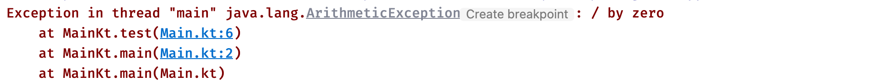

那么这个异常到底是什么样的一种存在呢？当程序运行出现我们没有考虑到的情况时，就有可能出现异常或是错误！它们在默认情况下会强行终止我们的程序。

### 异常的使用

我们在之前其实已经接触过一些异常了，比如数组越界异常，空指针异常，算术异常等，他们其实都是异常类型，我们的每一个异常也是一个类，他们都继承自`Throwable`类！异常类型本质依然类的对象，但是异常类型支持在程序运行出现问题时抛出（也就是上面出现的红色报错）也可以提前声明，告知使用者需要处理可能会出现的异常！

每个异常对象都包含一条消息、一个堆栈跟踪和一个可选原因。

我们自己也可以抛出异常，要抛出异常对象，请使用`throw`出表达式：

```kotlin
fun main() {
  	//Exception继承自Throwable类，作为普通的异常类型
    throw Exception("牛逼")
}
```

可以看到，控制台出现了下面的报错：

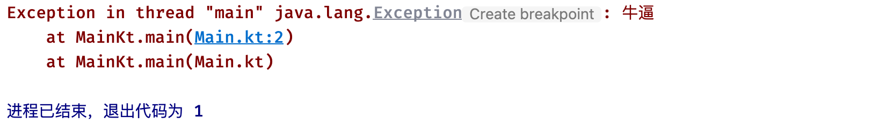

所以，我们平时看到的那些丰富多彩的异常，其实大部分都是由程序主动抛出的。

我们也可以依葫芦画瓢，自定义我们自己的异常类：

```kotlin
class TestException(message: String) : Exception(message)

fun main() {
    throw TestException("自定义异常")
}
```

是不是感觉很简单，异常的出现就是为了方便我们快速判断程序的错误。我们可以在异常打印出来的栈追踪信息中得到当前程序出现问题的位置：


这里指示的很明确，是我们的Main.kt文件第四行代码出现了异常。

### 异常的处理

当程序没有按照我们理想的样子运行而出现异常时（JVM平台下，默认会交给JVM来处理，JVM发现任何异常都会立即终止程序运行，并在控制台打印栈追踪信息）现在我们希望能够自己处理出现的问题，让程序继续运行下去，就需要对异常进行捕获，比如：

```kotlin
val array = arrayOf(1, 2, 3)
println(array[3])   //数组长度根本没有4，很明显这里会出现异常
```

现在我们希望能够手动处理这种情况，即使发生异常也要继续下去，我们可以使用try-catch语句块来完成：

```kotlin
fun main() {
    try {    //使用try-catch语句进行异常捕获
        val array = arrayOf(1, 2, 3)
        println(array[3])
    } catch (e: ArrayIndexOutOfBoundsException) {
        //因为异常本身也是一个对象，catch中实际上就是用一个局部变量去接收异常
    }
    println("程序继续正常运行！")
}
```

我们可以将代码编写到`try`语句块中，只要是在这个范围内发生的异常，都可以被捕获，使用`catch`关键字对指定的异常进行捕获，这里我们捕获的是ArrayIndexOutOfBoundsException数组越界异常：

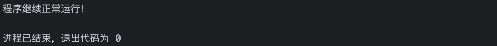

可以看到，当我们捕获异常之后，程序可以继续正常运行，并不会像之前一样直接结束掉。

注意，catch中捕获的类型只能是Throwable的子类，也就是说要么是抛出的异常，要么是错误，不能是其他的任何类型。

我们可以在`catch`语句块中对捕获到的异常进行处理：

```kotlin
fun main() {
    try {    //使用try-catch语句进行异常捕获
        val array = arrayOf(1, 2, 3)
        println(array[3])
    } catch (e: ArrayIndexOutOfBoundsException) {
        e.printStackTrace();   //打印栈追踪信息
        println("异常错误信息："+e.message);   //获取异常的错误信息
    }
    println("程序继续正常运行！")
}
```

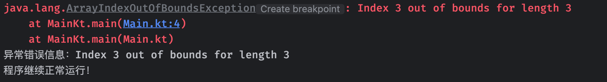

当代码可能出现多种类型的异常时，我们希望能够分不同情况处理不同类型的异常，就可以使用多重异常捕获：

```kotlin
try {
    //....
} catch (e: Exception) {  //父类型在前，会将子类的也捕获
  
} catch (e: NullPointerException) {   //因为NullPointerException是Exception的子类型，永远都不会进入这里
  
} catch (e: IndexOutOfBoundsException) {   //永远都不会进入这里
  
}
```

最后，当我们希望，程序运行时，无论是否出现异常，都会在最后执行任务，可以交给`finally`语句块来处理：

```kotlin
try {
    //....
} catch (e: Exception) {
    
} finally {
    println("lbwnb") //无论是否出现异常，都会在最后执行
}
```

注意：`try`语句块至少要配合`catch`或`finally`中的一个。

`try`也可以当做一个表达式使用，这意味着它可以有一个返回值：

```kotlin
fun main() {
    val input = readln()
    val a: Int? = try { input.toInt() } catch (e: NumberFormatException) { null }
    println(a)
}
```

针对于空类型，我们也可以在判断为空时直接抛出异常：

```kotlin
val s = person.name ?: throw IllegalArgumentException("Name required")
```

至此，有关Kotlin基础语言部分就全部完结了，后面我们还会继续讲解Kotlin的更多扩展知识，包括Kotlin与Java的交互、Kotlin协程、Kotlin反射等等，感谢各位小伙伴一直以来的支持。

# 补充

## 注解

kotlin中注解属性为数组的，表示形式从`{}`变成`[]`了，并且`Class`类型的属性用`KClass`替代了。

## 静态属性

在kotlin中，如果想要在类中定义静态变量，有两种方法（不算单例类）：

- 顶层级变量：在该类文件中类的外部定义变量
- 伴生对象变量：使用`companion object`关键字在类内部定义伴生对象，可以使用`@JvmStatic`注解简化操作。

## use方法

java7引入的try-with-resources语法糖可以自动关闭流对象，在kotlin中可以用use方法达到类似效果。

~~~kotlin
FileOutputStream(path).use { fos ->  
	try {  
		fos.write(data)  
		// 你可以在这里添加更多的文件操作代码  
	} catch (e: IOException) {  
		e.printStackTrace()  
		// 处理异常  
	}  
  }  
~~~

