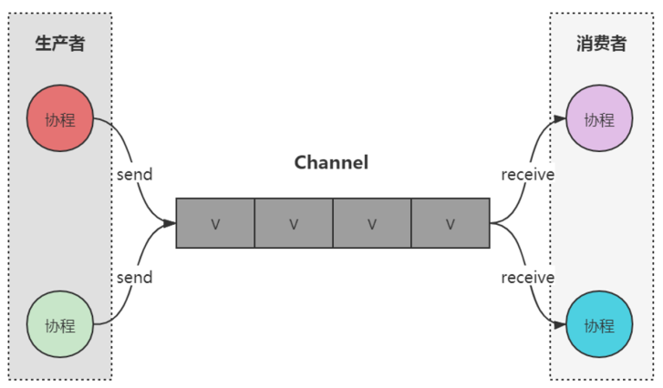

# 类与对象

## 获取类的class

~~~kotlin
val kClass: KClass<Any> = Any::class
val clazz: Class<Any> = Any::class.java
~~~

在 Kotlin 中，`::class` 和 `::class.java` 返回的类型和用途有所不同。前者用于 Java 的反射和与 Java 代码交互，后者用于 Kotlin 的类型检查和反射。

`KClass` 是 Kotlin 提供的运行时类型信息的类，它提供了很多关于类本身的信息，比如类名、父类、成员函数等。`KClass` 是类型安全的，并且只能用于 Kotlin 代码中。

`class` 是 Java 的运行时类型信息表示。`Class` 对象提供了 Java 反射 API 的入口，允许你在运行时查询和操作类的各种信息。这个对象通常用于与 Java 框架或库交互，或者当你需要使用 Java 的反射功能时。

## 静态属性

在kotlin中，如果想要在类中定义静态变量，有两种方法（不算单例类）：

- 顶层级变量：在该类文件中类的外部定义变量
- 伴生对象变量：使用`companion object`关键字在类内部定义伴生对象，可以使用`@JvmStatic`注解简化操作。

## 对象表达式

在Kotlin中，对象表达式允许你在不定义类的情况下创建一个对象的实例。对象表达式在语法上类似于一个匿名内部类，但更简洁。

~~~kotlin
interface MyInterface {  
    fun doSomething()  
}  
  
fun main() {  
    val myObject: MyInterface = object : MyInterface {  
        override fun doSomething() {  
            println("Doing something...")  
        }  
    }  
  
    myObject.doSomething() // 输出 "Doing something..."  
}
~~~

# 注解

## 数组属性

kotlin中注解属性为数组的，表示形式从`{}`变成`[]`了，并且`Class`类型的属性用`KClass`替代了。

# 常用函数

## use函数

java7引入的try-with-resources语法糖可以自动关闭流对象，在kotlin中可以用use方法达到类似效果。

~~~kotlin
FileOutputStream(path).use { fos ->  
	try {  
		fos.write(data)  
		// 你可以在这里添加更多的文件操作代码  
	} catch (e: IOException) {  
		e.printStackTrace()  
		// 处理异常  
	}  
  }  
~~~

# 协程

首先引入依赖：

-   gradle：`implementation 'org.jetbrains.kotlinx:kotlinx-coroutines-core:1.5.2'`
-   maven：

~~~xml
<dependency>
  <groupId>org.jetbrains.kotlinx</groupId>
  <artifactId>kotlinx-coroutines-core</artifactId>
  <version>1.7.2</version>
</dependency>
~~~

## 基本概念

### 定义

协程基于线程，是轻量级的线程。

我们用GlobalScope启动了一个新的协程，这意味着新协程的生命周期只受整个应用程序的生命周期限制。

~~~kotlin
import kotlinx.coroutines.GlobalScope
import kotlinx.coroutines.delay
import kotlinx.coroutines.launch
fun main() {
    GlobalScope.launch { // 在后台启动一个新的协程并继续
        delay(300) // 等待300毫秒
        "rustfisher.com".forEach {
            print(it)
            delay(200) // 每次打印都等待一下
        }
    }
    println("RustFisher")
    Thread.sleep(3000) // 阻塞主线程防止过快退出
}
// 输出结果：
//RustFisher
//rustfisher.com
~~~

协程不一定在同一个线程中，它们有在同一个线程的可能性。

~~~kotlin
import kotlinx.coroutines.GlobalScope
import kotlinx.coroutines.launch
import java.lang.Thread.sleep
fun main() {
    println("main线程信息 ${Thread.currentThread().id}")
    for (i in 1..20) { // 多启动几次协程
        GlobalScope.launch {
            println("协程启动#$i 所在线程id: ${Thread.currentThread().id}")
        }
    }
    sleep(5000) // 阻塞主线程防止过快退出
    println("RustFisher 示例结束")
}
~~~

输出结果：

~~~tex
协程启动#13 所在线程id: 34
协程启动#2 所在线程id: 22	---
协程启动#9 所在线程id: 30
......
协程启动#20 所在线程id: 27
协程启动#19 所在线程id: 22	---
RustFisher 示例结束
~~~

### 组成

kotlin的协程实现分为两个层次：

- 基础设施层：标准库的协程API，主要对协程提供了概念和语义上最基本的支持（如：kotlin.contracts.*）
- 业务框架层：协程的上层框架支持（如：kotlinx.contracts.*）

### 挂起和恢复

**常规函数**的基本操作包括：invoke（或call）和 return，协程新增了 suspend 和 resume。

- suspend：挂起/暂停，用于暂停当前协程，并保存所有基本变量
- resume：用于让已暂停的协程从暂停处继续执行

### 结构化并发

结构化并发（Structured Concurrency）是一种编程范式，用于编写易读、易维护的并发程序。在Kotlin协程中，结构化并发特别指的是协程之间的协作是有组织、有纪律的。这种并发模式允许开发者明确地定义协程的入口和出口，并管理协程之间的依赖关系和生命周期。

结构化并发的核心思想是，当一个协程内部创建了其他协程（子协程）时，这些子协程的生命周期应与父协程同步。具体来说，如果所有子协程在父协程的作用域结束前都已完成执行，则认为当前协程具备结构化并发。当父协程结束时，如果其子协程仍在运行，则父协程会阻塞自己，等待子协程运行完成后才退出。这种机制确保了即使在并发环境中，也能保持代码的清晰性和可维护性。

在Kotlin协程中，结构化并发主要依赖于`CoroutineScope`来实现。

当我们使用结构化并发后，可以做到：

- 取消任务：当某项任务不再需要时可以取消它
- 追踪任务：当任务正在执行时，可以追踪它
- 发出错误信号：当协程失败时，会发出错误信号表面有错误发生

定义协程时必须指定其 `CoroutineScope`，它是一个用于管理协程生命周期的接口，提供了创建和取消协程的方式。

常用的一些`CoroutineScope`：

- **GlobalScope**：进程级别的`CoroutineScope`，与应用进程同级；在`GlobalScope`中启动的协程不受任何特定生命周期的限制，即使Activity被销毁，协程任务也可以继续执行。通常用于后台任务，如网络请求、定时器等。
- **MainScope**：它与Activity的生命周期绑定，在`MainScope`中启动的协程会在Activity的`onDestroy`生命周期函数中取消。通常用于在UI线程上执行协程，如更新UI
- **ViewModelScope**
- **LifecycleScope**

注意：使用协程时，虽然它很轻量，并且不使用主线程，但仍会消耗一些内存资源。如果忘记保持对新启动的协程的引用，它还会继续运行，导致内存泄漏、资源泄露等问题。

### 协程构建器

- launch：它会立即返回一个`Job`对象，并在后台执行协程任务
- async：这个函数用于启动一个异步协程，并返回一个`Deferred`（继承Job）对象，你可以通过调用`await()`方法来获取异步协程的结果。
- …

###  作用域构建器

以下三种作用域构建器可以直接使用，它们都会继承父协程的 `coroutineScope`。自己创建的协程作用域对象，则是使用自己的作用域。

使用自己的作用域的例如：

- CoroutineScope实例对象
- Global.launch

可以记住：小写字母开头会继承，大写的不会

以下三种作用域构建器的异同，在 [这里](#start_method) 有详细说明。

- `runBlocking` 
- `coroutineScope`
- `supervisorScope`

~~~kotlin
import kotlinx.coroutines.*

fun main() = runBlocking {
	val scope = CoroutineScope(Dispatchers.Default)
	scope.launch {
		delay(1000)
		println("runBlocking 会等待CoroutineScope下协程的执行吗")
	}

	val job = GlobalScope.launch {
		delay(1000)
		println("runBlocking 会等待GlobalScope下协程的执行吗")
	}
}
// 控制台无打印结果，说明这两种方法的作用域没有继承父协程的
~~~

~~~kotlin
fun main() = runBlocking {
	coroutineScope {
		delay(1000)
		println("runBlocking 会等待coroutineScope下协程的执行吗")
	}

	supervisorScope {
		delay(1000)
		println("runBlocking 会等待supervisorScope下协程的执行吗")
	}
}
// 控制台把两句话都打印了，明这两种方法的作用域会继承父协程的
~~~

### 挂起函数

挂起函数（Suspend Function）是一个特殊类型的函数，它被标记为`suspend`，并且只能在协程中调用。挂起函数的主要特点是它们能够在执行过程中挂起（暂停）和恢复（继续执行），而不会阻塞当前线程。这使得挂起函数能够以一种非阻塞的方式执行异步操作，同时保持代码的清晰性和可读性。

挂起函数只能在协程体内或其他挂起函数内调用。

例如：将 launch { …… } 内部的代码块提取到独立的函数中。提取出来的函数需要 suspend 修饰符，它是**挂起函数**。

### 阻塞与非阻塞

#### runBlocking

delay 是非阻塞的， Thread.sleep 是阻塞的。显式使用 runBlocking 协程构建器来阻塞。

~~~kotlin
import kotlinx.coroutines.*
fun main() {
    GlobalScope.launch { // 在后台启动一个新的协程并继续
        delay(200)
        "rustfisher.com".forEach {
            print(it)
            delay(280)
        }
    }
    println("主线程中的代码会立即执行")
    runBlocking { // 这个表达式阻塞了主线程
        delay(3000L) //阻塞主线程防止过快退出
    }
    println("\n示例结束")
}
~~~

可以看到， runBlocking 里使用了 delay 来延迟。用了 runBlocking 的线程会一直阻塞直到 runBlocking 内部的协程执行完毕。 也就是 runBlocking{ delay } 实现了阻塞的效果。

我们也可以用 runBlocking 来包装主函数，runBlocking 中的Unit目前可以省略，并且runBlocking 也可用在测试中。

~~~kotlin
import kotlinx.coroutines.*
fun main() = runBlocking {
    delay(100) // 在这里可以用delay了
    GlobalScope.launch {
        delay(100)
        println("Fisher")
    }
    print("Rust ")
    delay(3000)
}
~~~

#### 全局协程像守护线程

我们在线程介绍中知道，如果进程中只剩下了守护线程，那么虚拟机会退出。 

前文那个打印 rustfisher.com 的例子，其实也能看到，字符没打印完程序就结束了。 在 GlobalScope 中启动的活动协程并不会使进程保活。它们就像守护线程。

### Job的生命周期

对于每一个创建的协程，会返回一个Job实例，该实例是协程的唯一标识，并且负责管理协程的生命周期。

1. **New（新创建）**：协程对象刚刚通过`launch`或`async`等函数创建，但尚未开始执行。
2. **Active（活跃）**：协程已经开始执行，但尚未完成。在这个阶段，协程可能会执行自己的任务，也可能会启动子协程。
3. **Completing（完成中）**：协程已经完成了自己的任务，但可能还在等待其子协程完成。这个阶段是短暂的，通常很快会过渡到下一个状态。
4. **Completed（已完成）**：这是协程的最终状态，表示协程**已经成功执行完毕**或**已被取消**。
5. **Cancelling（取消中）**：协程正在等待取消操作完成。这通常发生在调用`Job.cancel()`方法后，但取消操作可能需要一些时间才能完成。
6. **Cancelled（已取消）**：协程已经被取消。这可能是因为协程运行出错，或者显式调用了`Job.cancel()`方法。在已取消状态下，协程的执行将被终止，并且不会再次启动。

需要注意的是，虽然上述状态描述了协程的生命周期，但并非所有状态都是直接可访问的。相反，我们可以通过访问Job对象的属性（如`isActive`、`isCancelled` 和 `isCompleted`）来了解协程的当前状态。例如，如果 `isActive `为 `false `且 `isCancelled `为 `true`，则表示协程处于取消中（Cancelling）状态；

**注意**：如果 `isCompleted `为 `true`，则表示协程已完成（Completed）或已取消（Cancelled）。

## 常用函数

### 延时和等待

- `delay`：可以达到延时的效果，是一个特殊的挂起函数，它不会造成线程阻塞，但是会挂起协程，并且只能在协程中使用
- `job.join()`：该方法会挂起当前协程，等待`job`协程执行完成，可以用于协程之间的顺序执行
- `joinAll(job...)`：可以同时让多个Job调用join方法
- `job.await()`：该方法被join类似，但可以获取协程完成的结果

### 启动和取消

#### 启动

`launch` 和 `async` 协程构建器都用于启动新协程。

- lauch：返回一个 `Job` 并且不附带任何结果值。
- async：返回一个 `Deferred`，它也是 `Job`，但可以使用 `await()` 来获取协程执行完后的返回值。 

#### 取消

- `Job.cancel()`：用于取消协程。
- `Job.cancelAndJoin()`：同时具有 `cancel()` 和 `join()` 的作用。

### 暂停

`yield()`：用于让当前协程暂停执行，并将执行权交还给协程调度器，以便让其他协程有机会运行。

当你在协程中使用 `yield()` 时，当前协程会进入挂起状态，但不会释放其占用的资源（如内存栈）。当协程调度器决定再次执行该协程时，它会从 `yield()` 调用点恢复执行。

这个函数通常用于实现非阻塞的并发编程，特别是在处理密集计算的场景时，通过 `yield()` 可以避免长时间占用线程，从而提高应用的响应性和性能。

注意：`yield()` 并不保证一定会导致协程切换。它的行为取决于当前的调度策略和协程调度器的实现。

~~~kotlin
import kotlinx.coroutines.*

fun main() = runBlocking {
	launch {
		delay(1000L) // 等待1秒
		println("World!")
	}

	repeat(1000) { i ->
		println("Hello $i")
        //在每次打印500个Hello后，暂停当前协程，让hello有机会输出
		if (i % 500 == 0) {
			yield() 
		}
	}
}
~~~

## 协程启动

### 调度器

所有协程必须在调度器中运行。

- **Dispatchers.Main**：这是主线程调度器，用于处理UI交互和一些轻量级任务（调用挂起函数、UI函数，更新LiveData）
- **Dispatchers.Default**：这是默认调度器，通常用于CPU密集型任务，如大量计算或数据处理。它会使用共享后台线程的公共池来执行协程。
- **Dispatchers.IO**：这是用于IO密集型任务的调度器，如文件读写、网络请求等。它同样使用共享线程池，但专注于IO操作。
- **Dispatchers.Unconfined**：这是一个不限制协程执行线程的调度器。它不会将协程绑定到特定的线程或线程池，而是允许协程在任意线程中执行。通常，这个调度器在某些特殊场景下使用，比如你需要完全控制协程的执行线程。

### 启动方式

- **launch**：这是最常用的启动协程的方式。它会立即返回一个`Job`对象，并在后台执行协程任务。如果在启动协程时使用了`try-catch`块，异常会被捕获；否则，异常会传递给未捕获异常处理器进行处理。
- **async**：这个函数用于启动一个异步协程，并返回一个`Deferred`对象，你可以通过调用`await()`方法来获取异步协程的结果。
- **runBlocking**：这是一个阻塞式函数，通常用于测试和调试协程代码。它会启动一个新的协程，并等待其协程体以及所有子协程结束执行完毕后才会返回。在调用`runBlocking`时，当前线程会被阻塞，直到协程执行完毕。
- **coroutineScope**：它会创建一个协程作用域，并等待其协程体以及所有子协程结束。如果一个子协程失败了，当前域和域内的协程都会被取消。（子协程的异常会传播到父协程）
- **supervisorScope**：与 `coroutineScope` 一样，但它在子协程失败时，不会影响域内其他协程的执行（子协程的异常不会传播到父协程）

注： `runBlocking` 是常规函数，会堵塞住当前线程；`coroutineScope` 和 `supervisorScope` 是挂起函数，不会堵塞住当前线程。

~~~kotlin
import kotlinx.coroutines.*
import java.lang.RuntimeException

suspend fun main() {
    // 换成supervisorScope后，使用log都会被输出
	coroutineScope {
		val job1 = launch {
			delay(5000)
            // 以下输出无法执行
			println("Job1 完成")
		}
		launch {
			println("job2 执行了")
			throw RuntimeException()
		}
		delay(1000)
        // 以下输出无法执行
		println("会执行我吗？")
	}
}
~~~

### 启动模式

- **DEFAULT**：这是协程的默认启动模式。当协程创建后，它会立即开始调度。如果在调度前协程被取消，它会直接进入取消状态。
- **ATOMIC**：协程创建后会立即开始调度，协程在执行到第一个挂起点之前不响应取消。
- **LAZY**：协程只有在被需要时才会开始调度，如主动调用协程的`start`、`join`或`await`等函数时。如果协程在调度前被取消，它将直接进入异常结束状态。
- **UNDISPATCHED**：协程创建后会在**当前函数调用栈**中**立即执行**，直到遇到第一个真正挂起的点。

如果想要你的协程立刻执行，而不是等待调度，可以使用最后一个模式。

注：调度不等于执行。调度（scheduling）是指决定协程何时在哪个线程上开始或恢复执行的过程，而执行（execution）是指协程代码的实际运行。协程什么时候执行取决于调度器的当前状态和其他协程的优先级。

~~~kotlin
import kotlinx.coroutines.*

fun main() = runBlocking {
    // 默认模式下程序立刻就结束了，没有打印出log
    //ATOMIC模式下，log被打印
	val job1 = launch(start = CoroutineStart.ATOMIC) {
		Thread.sleep(5000)
		println("Job 完成")
	}
    // job2立刻就执行了，使用其他模式需要等待job1睡眠结束
    // 这是使用runBlocking启动方式的情况，使用coroutineScope则会立刻执行job2
    val job2 = launch(start = CoroutineStart.UNDISPATCHED) {
		println("立刻执行了")
	}
	job1.cancel()
}
~~~

注：使用`UNDISPATCHED`模式可以让你的协程调度器即使为`Dispatchers.IO`类型（使用后台线程），仍在主线程中执行。

### 协程上下文

`CoroutineContext` 是一个接口，用于描述协程的运行环境，包含了与协程执行相关的各种参数和配置信息。

`CoroutineContext` 主要包含以下几个方面的元素：

- **Job**：代表协程的生命周期。通过 Job，你可以控制协程的启动、取消和等待其完成。

- **CoroutineDispatcher**：协程调度器，用于向合适的线程分发任务。它决定了协程在哪个线程上执行。

- **CoroutineName**：协程的名称，主要用于调试目的。

- **CoroutineExceptionHandler**：处理协程中发生的(未被捕捉)异常。

有时我们需要在协程上下文中定义多个元素，可以用 `+` 操作符来实现。

例如：为一个协程指定一个调度器和名称

~~~kotlin
fun main() = runBlocking<Unit> {
	launch(Dispatchers.Default + CoroutineName("test")) {
		println("我工作在：${Thread.currentThread().name}")
	}
}
~~~

#### 继承定义

新创建的协程，它的 `CoroutineContext` 会包含一个全新的Job，并返回，用于控制新协程的生命周期。而它上下文中剩下的元素会从 **创建该协程的CoroutineScope** 或 **父协程**的 `CoroutineContext` 继承。

~~~kotlin
import kotlinx.coroutines.*

fun main() = runBlocking<Unit> {
	val scope = CoroutineScope(Job() + Dispatchers.IO + CoroutineName("test"))
	// 这里调用launch方法时继承了scope的上下文
	val job = scope.launch {
		println("job-launch：${coroutineContext[CoroutineName]} ${Thread.currentThread().name}")
		// 这里调用launch方法时继承了父协程的上下文
		val childJob = async {
			println("childJob-launch：${coroutineContext[CoroutineName]} ${Thread.currentThread().name}")
			coroutineContext[Job]
		}
		println("新协程的上下文中的Job对象 等于 返回的Job对象吗：" + (childJob == childJob.await()))	// 为true
	}
	job.join()
}
~~~

#### 继承公式

协程的上下文 = **默认值** + **继承的CoroutineScope** + **参数**

- 默认值：如 CoruoutineDispatchers 的默认值为 Dispatchers.Default
- 继承的继承的CoroutineScope是CoroutineScope或父协程的CoroutineContext
- 传入协程构建器的参数，其优先级高于继承的上下文参数，会覆盖对应的参数值

## 协程取消与超时

### 取消

我们可以在协程尚未结束时主动取消协程，协程在处于挂起点的时候就会被取消。

- 取消作用域时，会把它的子协程都取消
- 被取消的子协程不会影响其余兄弟协程
- 协程通过抛出一个异常 `CancellationException` 来处理取消操作
- kotlinx.coroutines 中的挂起函数都是可被取消的
- 取消协程时，抛出的异常会被静默处理，当作正常完成

#### 挂起点

当挂起函数被调用时，它们会暂停当前协程的执行，直到挂起函数的操作完成或需要等待某个条件满足。这些暂停点被称为挂起点（Suspension Points）。

协程只有在挂起点（即协程暂停执行并等待某些条件满足的点）才会检查其取消状态。这些挂起点通常是由挂起函数（如 `delay`、`withContext` 等）产生的。如果协程在挂起点发现它已经被取消，那么它通常会立即停止执行并抛出 `CancellationException`。

需要注意的是，挂起点不仅仅是挂起函数本身产生的，还包括了挂起函数内部可能调用的其他挂起函数。一个协程可能会在多个挂起点之间来回切换，直到最终完成。

另外，不是所有标记为 `suspend` 的函数都会产生挂起点。有些挂起函数可能会立即返回结果，而不会导致协程挂起。这取决于函数内部的实现和调用时的上下文。

#### 取消失败

如果协程在执行计算(cpu密集型)任务，并且没检查取消的话，那我们的取消尝试会失败。

~~~kotlin
import kotlinx.coroutines.*
fun main() = runBlocking {
    val startTime = System.currentTimeMillis()
    val job = launch(Dispatchers.Default) {
        var nextPrintTime = startTime
        var i = 0 // 模拟的控制循环数量
        while (i < 5) { // 模拟耗时计算
            if (System.currentTimeMillis() >= nextPrintTime) {
                println("[job] 模拟耗时计算中 ${i++} ...")
                nextPrintTime += 500L
            }
        }
    }
    delay(800) // 等待一会
    println("[rustfisher] 尝试取消协程")
    job.cancelAndJoin()
    println("程序退出 bye~")
}
~~~

~~~tex
[job] 模拟耗时计算中 0 ...
[job] 模拟耗时计算中 1 ...
[rustfisher] 尝试取消协程
[job] 模拟耗时计算中 2 ...
[job] 模拟耗时计算中 3 ...
[job] 模拟耗时计算中 4 ...
程序退出 bye~
~~~

可以看到，模拟耗时计算直到4，整个程序退出。而调用 cancelAndJoin() 并没有成功取消掉协程。

#### 可以取消

让协程可被取消的方法 

- 显式的检查取消状态，例如检查 isActive 变量 
- 使用 `ensureActive` 方法，如果 `Job` 处于非活跃状态，这个方法就会立即抛出异常 `CancellationException`
- 使用 `yield` 方法，它会检查协程的状态，如果状态为 `已取消` ，则抛出异常 `CancellationException`；它还会[让出线程的执行权](#yield)
- 补：使用 `delay(值>0)`，它会让协程处于挂起点

注：实际调用取消方法后，如果协程在挂起点则会抛出异常进行取消。原因是 Job 对象的 `isCancelled` 变为 `true`后，调用会使协程挂起的函数时都会抛出异常而成功取消掉协程。

对上面的代码进行一些改进。把 while (i < 5) 循环中的条件改成 while (isActive) 。修改后的代 码如下：

~~~kotlin
import kotlinx.coroutines.*
fun main() = runBlocking {
	val startTime = System.currentTimeMillis()
	val job = launch(Dispatchers.Default) {
		var nextPrintTime = startTime
		var i = 0
		while (i < 5 && isActive) { // 模拟耗时计算
            // 或者在这调用ensureActive、yield、delay(1)都会抛出异常取消掉任务，其他会使当前协程处于挂起点的函数
			if (System.currentTimeMillis() >= nextPrintTime) {
				println("[job] 模拟耗时计算中 ${i++} ...")
				nextPrintTime += 500L
			}
		}
	}
	delay(800) // 等待一会
	println("[rustfisher] 尝试取消协程")
	job.cancelAndJoin()
	println("程序退出 bye~")
}
~~~

~~~tex
[job] 模拟耗时计算中 0 ...
[job] 模拟耗时计算中 1 ...
[rustfisher] 尝试取消协程
程序退出 bye~
~~~

### 释放资源

#### finally块

取消协程时，**挂起函数**（使用suspend修饰的函数）会抛出异常：CancellationException。我们可以使用try-catch-finally来处理。并且在 finally块中释放资源。

~~~kotlin
import kotlinx.coroutines.*

fun main() = runBlocking {
	val job = launch {
		try {
			repeat(1000) { i ->
				println("[job]模拟计算次数 $i ...")
				delay(300L)
			}
		} catch (e: CancellationException) {
			println("[job] CancellationException ${e.message}")
		} finally {
			println("[job][finally] 释放资源..")
		}
	}
	delay(800) // 等待一会
	println("[rustfisher] 尝试取消协程")
	job.cancelAndJoin()
	println("[rustfisher] 程序退出 bye~")
}
~~~

### 不能取消

有时候，我们需要运行不能取消的代码块。

`withCotext(context){}`：使用给定的协程上下文调用指定的挂起块，挂起直到完成，然后返回结果。

`withContext(NonCancellable)` 可以创建一个无法取消的协程作用域，确保在这个作用域内执行的挂起函数不会被取消。这通常在资源释放或清理操作的上下文中使用，这些操作可能需要在协程被取消后仍然执行。

实际上，这里在finally块中调用了delay方法，它会检查协程 `isCancelled` 的值，发现为`true`就会抛出异常，导致执行完delay方法后面的代码无法执行。若把delay方法换成Thread.sleep方法，或在finally块中再捕捉一次一次，即使没使用`withContext(NonCancellable)` 也能保证finally块中的代码都被执行。

~~~kotlin
import kotlinx.coroutines.*

fun main() = runBlocking {
	val job = launch {
		try {
			repeat(1000) { i ->
				println("[job]模拟计算次数 $i ...")
				delay(300L)
			}
		} catch (e: CancellationException) {
			println("[job] CancellationException ${e.message}")
		} finally {
			withContext(NonCancellable) {
				println("[job][finally] 进入NonCancellable")
				delay(1000) // 假设这里还有一些耗时操作
				println("[job][finally] NonCancellable完毕")
			}
			println("[job][finally] 结束")
		}
	}
	delay(800) // 等待一会
	println("[rustfisher] 尝试取消协程")
	job.cancelAndJoin()
	println("[rustfisher] 程序退出 bye~")
}
~~~

运行结果如下：

~~~bash
[job]模拟计算次数 0 ...
[job]模拟计算次数 1 ...
[job]模拟计算次数 2 ...
[rustfisher] 尝试取消协程
[job] CancellationException StandaloneCoroutine was cancelled
[job][finally] 进入NonCancellable
# 如果没有使用withContext(NonCancellable)，则无法输出下面两行
[job][finally] NonCancellable完毕
[job][finally] 结束
[rustfisher] 程序退出 bye~
~~~

### 超时

#### withTimeout

我们可以用 `withTimeout(long)` 来指定超时时间。

超时后会抛出 `TimeoutCancellationException`，它是`CancellationException` 的子类。 

如果没有使用try-catch，控制台是看不到该异常的，因为在被取消的协程中 `CancellationException` 会被认为是协程执行结束的正常原因。

~~~kotlin
import kotlinx.coroutines.*

fun main() = runBlocking<Unit> {
	launch {
		try {
			withTimeout(400L) {
				val startTime = System.currentTimeMillis()
				repeat(1000) { i ->
					println("[job] 运行: $i, 累积运行时间:${System.currentTimeMillis() - startTime}毫秒")
					delay(100L)
				}
			}
		} catch (e: Exception) {
			println("异常: $e")
		}
	}
}
~~~

#### withTimeoutOrNull

`withTimeoutOrNull` 方法会在超时后返回null，如果成功执行则返回我们指定的值。

~~~kotlin
import kotlinx.coroutines.*

fun main() = runBlocking<Unit> {
	launch {
		val result1 = withTimeoutOrNull(1300L) {
			repeat(1000) { i ->
				println("[job1] 运行 $i ...")
				delay(500L)
			}
			"[1] Done" // 根据超时设置 执行不到这里
		}
		println("Result1: $result1")
		val result2 = withTimeoutOrNull(1300L) {
			repeat(2) { i ->
				println("[job2] 运行 $i ...")
				delay(500L)
			}
			"[2] Done" // 成功执行完毕后到这里
		}
		println("Result2: $result2")
	}
}
~~~

运行结果：

~~~bash
[job1] 运行 0 ...
[job1] 运行 1 ...
[job1] 运行 2 ...
Result1: null
[job2] 运行 0 ...
[job2] 运行 1 ...
Result2: [2] Done
~~~

## 协程的异常处理

### 异常的传播

协程构建器有两种形式：**自动传播异常**（launch于actor），**向用户暴露异常**（async和produce）。

（1）当这些构建器用于创建一个**根协程**（该协程不是另一个协程的子协程）时：

- 前者：异常会在它发生的第一时间抛出
- 后者：依赖用户最终来消费异常，例如通过 `await` 和 `receive`

~~~kotlin
fun main() = runBlocking<Unit> {
	val job1 = GlobalScope.launch {
		println("job1 --> 抛出异常")
		throw RuntimeException()
	}
	try {
		job1.join()
	} catch (e: Exception) {
		// 最终还是抛出异常，这里捕捉失败
		println("job1 --> 捕捉了异常")
	}
	val job2 = GlobalScope.async {
		println("job2 --> 抛出异常")
		throw RuntimeException()

	}
	try {
		job2.await()
	} catch (e: Exception) {
		// 这里捕捉异常成功
		println("job2 --> 捕捉了异常")
	}
}
~~~

（2）非**根协程**总是会被传播，抛给父级

### 异常的传播特性

当一个协程由于一个异常运行失败时，它会传播这个异常并传递给的父级。接下来父级会进行几部操作：

- 取消它自己的子级
- 取消它自己
- 将异常传播并传递给他的父级

### superviseJob

使用superviseJob时，子协程的失败不会影响到其他子协程。它不会传播异常给他的父级，而是让子协程**自己处理异常**。

~~~kotlin
fun main() = runBlocking<Unit> {
	val scope = CoroutineScope(SupervisorJob())
	val job1 = scope.launch {
		delay(100)
		println("job --> 1")
		throw RuntimeException()
	}
	val job2 = scope.launch {
		try {
			delay(Long.MAX_VALUE)
		} finally {
			// 参数为Job()时输出，为Supervisor()不输出
			println("job --> 2")
		}
	}
	joinAll(job1, job2)
}
~~~

或者使用 `supervisorScope` 作用域构建器

### 异常的捕获

当使用**CoroutineExceptionHandler**对协程的异常进行捕获时，以下条件被满足时，异常才会被捕获：

- 协程的上下文包含CoroutineExceptionHandler对象
	- 根协程抛出异常：直接作为参数传入该协程的上下文
	- 子协程抛出异常：要传入根协程的上下文，只传入子协程无法捕捉
		- 如果该协程有爸爸和爷爷，那么爷爷才是根协程
- 异常是被自动抛出异常的协程所抛出的（是launch，非async）

~~~kotlin
fun main() = runBlocking<Unit> {
	val handler = CoroutineExceptionHandler { _, throwable ->
		println("捕捉到：$throwable")
	}
	val job1 = GlobalScope.launch(handler) {
		throw RuntimeException("job --> 1")	// 成功打印
	}
	val job2 = GlobalScope.launch {
		// handler不在根协程中，异常捕捉不到，无打印
		launch(handler) {
			launch {
				throw RuntimeException("job --> 2")
			}
		}
	}
	// 协程时async构建器创建的，异常捕捉不到，无打印
	val job3 = GlobalScope.async(handler) {
		throw RuntimeException("job --> 3")
	}
	joinAll(job1, job2, job3)
    // job3需要用await方法才会在控制台显示其异常信息
}
~~~

### 全局异常处理

全局异常处理器可以获取到所有协程未处理的未捕获异常，但它并不会对异常进行捕获，所以不能阻止程序崩溃。但是它在程序程序调试和异常上报等场景中仍然有很大的用处。

添加方法：

1. 在classpath（例如resources目录）下面新建 **META-INF/services** 目录。
2. 在该目录下新建文件名为 `kotlinx.coroutines.CoroutineExceptionHandler` 的文件，文件内容填全局异常处理器的全类名。
3. 定义全局异常处理器，名称随意，需要继承 `CoroutineExceptionHandler`

~~~kotlin
class GlobalCoroutineExceptionHandler: CoroutineExceptionHandler {
	override val key = CoroutineExceptionHandler

	override fun handleException(context: CoroutineContext, exception: Throwable) {
		println("没有被捕捉的异常：$exception")
	}
}
~~~

### 取消与异常

- 协程内部使用 `CancellationException` 来进行取消，这个异常会被忽略。（没有手动捕捉时会自己静默处理）
- 子协程被取消时，不会取消它的父协程
- 如果一个协程遇到了 `CancellationExceptino` 以外的异常，则它会使用该异常取消它的父协程；父协程处理该异常时，需要先取消所有子协程，才会去处理异常

~~~kotlin
fun main() = runBlocking<Unit> {
	val handler = CoroutineExceptionHandler { _, e ->
		println("子协程都取消完成后，父协程开始处理异常")
	}
	val job1 = GlobalScope.launch(handler) {
		launch {
			try {
				delay(Long.MAX_VALUE)
			} finally {
				withContext(NonCancellable) {
					println("1号子协程 --> 开始被取消了")
					delay(100)
					println("1号子协程 --> 取消完毕")
				}
			}
		}
		launch {
			println("2号子协程 --> 开始抛出异常")
			throw RuntimeException()
		}
	}
	joinAll(job1)
}
~~~

结果：

~~~bash
2号子协程 --> 开始抛出异常
1号子协程 --> 开始被取消了
1号子协程 --> 取消完毕
子协程都取消完成后，父协程开始处理异常
~~~

### 异常聚合

当协程的多个子协程因为异常而失败时，一般情况下取第一个异常进行处理。在第一个异常之后发生的其他异常，都将会被绑定到第一个异常上。

~~~kotlin
fun main() = runBlocking<Unit> {
	val handler = CoroutineExceptionHandler { _, e ->
		println("捕捉到异常：$e，${e.suppressed.contentToString()}")
	}
	val job1 = GlobalScope.launch(handler) {
		launch {
			try {
				delay(Long.MAX_VALUE)
			} finally {
				throw RuntimeException("1号子协程")
			}
		}
		launch {
			delay(100)
			throw RuntimeException("2号子协程")
		}
	}
	joinAll(job1)
}
// 输出 --> 捕捉到异常：java.lang.RuntimeException: 2号子协程，[java.lang.RuntimeException: 1号子协程]
~~~

## 异步流Flow

### 作用

挂起函数只可以异步的返回单个值，但如果想要异步返回多个计算好的值则需要用到**Flow**。

- flow构建器使用后会返回一个Flow对象
	- 快速构建流可以用 `asFlow` 方法
- `flow{…}` 块中的代码可以挂起（可以自由使用挂起函数）
	- 序列只能使用它自己的挂起函数（例如无法用delay）
- 使用了它的函数不需要被标记为 `suspend`
- flow流 使用 `emit` 函数发射值，使用 `collect` 函数收集值

集合和序列也可以返回多个值，但它们每个值的返回不是异步的。

~~~kotlin
fun simpleFlow() = flow<Int> {
	for (i in 1..3) {
		delay(1000)
		emit(i)	// 产生一个元素
	}
}

fun simpleSeq() = sequence<Int> {
	for (i in 1..3) {
		Thread.sleep(1000)
		yield(i)	// 产生一个元素
	}
}

fun main() = runBlocking<Unit> {
	launch {
		for (i in 1..3) {
			println("我没有被堵塞")
			delay(1500)
		}
	}
    // 快速构建流：(1..3).asFlow()
	// 使用flow时，主协程没有被堵塞，两个任务都在执行
	simpleFlow().collect(::println)
    // 使用序列时，则发生堵塞，两个任务只能顺序执行
	simpleSeq().forEach(::println)
}
~~~

### 概念

#### 冷流

Flow是一种类似于序列的**冷流**，flow构建器中的代码直到被收集时才会开始执行（调用 `collect` 方法时才执行，类似懒加载）。

与之相对的是**热流**，StateFlow 和 ShareFlow 是热流，在垃圾回收之前，都是存在于内存之中，并且处于活跃状态的。

Flow中的收集可以重复进行，即 `collect` 方法可以多次调用。

#### 流的连续性

流的每次单独收集都是按顺序执行的，除非使用特殊操作符。

从上游到下游，每个过渡操作符都会处理每个发射出的值，然后再交给末端操作符。

#### 流构建器

- `flow`：直接使用 `flow {...}` 
- `flowOf`：该构建器定义了一个发射固定值集的流
- `.asFlow`：扩展函数，可以将各种集合与序列转换为流

~~~kotlin
fun main() = runBlocking<Unit> {
	flowOf("one", "two", "three")
    	.onEach { delay(1000) }.collect(::println)
	(1..3).asFlow()
    	.onEach { delay(1000) }.collect(::println)
}
~~~

#### 流上下文

- 流的收集总是在调用协程的上下文中发生，流的该属性称为**上下文保存**
- `flow{}` 构建器中的代码必须遵循上下文保存属性，并且不允许从其他上下文中发射（emit）
- **flowOn**操作符，该函数用于更改流发射的上下文
- **launchIn**，使用该函数替换`collect`，可以更改流收集时的上下文

即Flow的发射和收集默认会遵循同样的上下文，这将导致如果在主协程调用了收集方法，则它的发射也会在主协程里执行。这会影响主协程其他任务的执行。一般发射部分的代码是耗时操作，需要在后台协程中执行，就可能需要更改其上下文。

如果在对流进行收集时，还需要对流再进行一些耗时的操作（如过滤），则也需要更改其上下文。

~~~kotlin
fun simpleFlow() = flow<Int> {
	println("Flow start：${Thread.currentThread().name}")
	for (i in 1..2) {
		delay(1000)
		emit(i)	// 产生一个元素
	}
}.flowOn(Dispatchers.IO)	//IO型任务

fun main() = runBlocking<Unit> {
	println("main：${Thread.currentThread().name}")
	simpleFlow()
		.onEach { println("Flow collect：${Thread.currentThread().name}") }
		.launchIn(CoroutineScope(Dispatchers.Default))	//CPU密集型任务
		.join()	// 改变了收集的上下文，则该协程不受父级作用域管理，作用域指定this则不需要调用该方法
}
~~~

运行结果：

~~~tex
main：main
Flow start：DefaultDispatcher-worker-2
Flow collect：DefaultDispatcher-worker-1
Flow collect：DefaultDispatcher-worker-2
~~~

### 流的取消

流采用与协程同样的协作取消。流的收集可以在流所在协程被挂起时（处于挂起点）取消。

#### 取消检测

Flow其实为 `emit` 方法附加上了 `ensureActive` 方法，这意味着从 Flow 块发出的繁忙循环是可以取消的。（emit方法进行了取消检测）

处于性能原因，大多数其他的流操作是不会进行取消检测的，所有在协程处于繁忙循环时，最好显式的进行手动检测。

通过 **cancellable** 操作符可以进行取消检测，但会影响性能

~~~kotlin
fun simpleFlow() = flow<Int> {
	for (i in 1..5) {
		delay(1000)
		emit(i)	// 调用了emit方法，可以取消成功
	}
}

fun main() = runBlocking<Unit> {
	simpleFlow().collect {
		println(it)
		if (it == 3) cancel()
	}
    
    // 没有调用emit方法，取消失败
    (1..5).asFlow().collect {
		println(it)
		if (it == 3) cancel()
	}
    
    // 使用了cancellable操作符，取消成功
    (1..5).asFlow().cancellable().collect {
		println(it)
		if (it == 3) cancel()
	}
}
~~~

### 背压

当数据生产者的生产速率高于数据消费者的处理速率时，就会产生背压。这意味着生产者产生的数据量超过了消费者能够处理的数据量，造成了一种“阻塞”现象，数据在缓冲区中积压，从而产生了压力。

背压问题通常有两种解决方案：

- 降低数据生产者的生产速率，使其与消费者的处理速率相匹配。

- 提高数据消费者的处理速率，使其能够更快地处理生产者产生的数据。

Flow中有以下方法可以来解决背压问题：

- `buffer(int)`: 创建一个具有指定容量的缓冲区，当数据生产者的速度超过消费者的速度时，数据会被缓冲。（并发）
- 当必须更改上下文时，flowOn操作符使用了相同的缓存机制，但buffer函数是显式的请求缓存而不改变执行上下文。（并发）
- `onflate()`: 合并发射项，不对每个值进行处理（不懂）
- `collectLatest()`：会自动丢弃那些还未被消费者处理的数据项，只保留最新的数据项。（只拿最新的）

~~~kotlin
fun simpleFlow() = flow<Int> {
	for (i in 1..3) {
		delay(100)
		emit(i)
		println("start：${Thread.currentThread().name} --> $i")
	}
}

fun main() = runBlocking<Unit> {
	var time = measureTimeMillis {
		simpleFlow().collect {
			delay(300)
			println("collect：${Thread.currentThread().name} --> $it")
		}
	}
	println("花费了：$time ms")	//1254 ms = (300 + 100) * 3

	time = measureTimeMillis {
		simpleFlow().buffer().collect {
			delay(300)
			println("collect：${Thread.currentThread().name} --> $it")
		}
	}
	println("花费了：$time ms")	//1068 ms = 300 * 3 + 100

	time = measureTimeMillis {
		simpleFlow().flowOn(Dispatchers.Default).collect {
			delay(300)
			println("collect：${Thread.currentThread().name} --> $it")
		}
	}
    println("花费了：$time ms")	//1049 ms = 300 * 3 + 100
    
    time = measureTimeMillis {
		simpleFlow().conflate().collect {
			delay(300)
			println("collect：${Thread.currentThread().name} --> $it")
		}
	}
    // 元素2被丢弃了
	println("花费了：$time ms")	//778 ms
    
    time = measureTimeMillis {
		simpleFlow().collectLatest {
			delay(300)
			println("collect：${Thread.currentThread().name} --> $it")
		}
	}
    // 元素1、2都被丢弃了
	println("花费了：$time ms")	//660 ms
}
~~~

### 操作符

#### 转换操作符

**转换操作符（Transformation Operators）**用于转换流，它应用于上游流，并返回下游流。

这些操作符也是冷操作符，运行速度快，本身不是挂起函数，返回新的转换流的定义。

- `map`：将流中的每个元素转换为另一种形式（1对1）
- `transform`：可以转换发射的元素，可以一对多（通过emit方法）
- `take`：只接收指定数量的元素。

- `filter`：只保留满足特定条件的元素。
- `drop`：跳过指定数量的元素。
- `distinctUntilChanged`：只发出与上一个值不同的元素。

#### 末端操作符

末端操作符是在流中用于**启动流收集的挂起函数**。`collect` 是最基础的末端操作符。

- 转换为各种集合：`toList` 和 `toSet`
- 获取第一个元素：`first`
- 确保流发射单个值：`single`
- 将流规约到某值：
	- `reduce`：将流中的元素累积（或减少）为单个值
	- `fold`：类似reduce，但可以指定初始值和更改累加器的类型

#### 组合操作符

- **zip**：用于将两个流中的元素组合成对。（异步的组合）
- **combine**：用于将多个流中的元素组合成一个结果。

#### 展平操作符

流表示异步接收的值序列，容易到这样的情况：值序列1中每一个值都会触发对另一个值序列的请求。由于流是异步的，因此就需要不同的展平模式。（组合）

假设值序列1为：a，b，c ；值序列2为：A，B

- flatMapConcat：连接模式 ---> aA,aB,bA,bB,cA,cB
- flatMapMerge：合并模式 ---> aA,bA,cA,aB,bB,cB
- flatMapLatest：最新展平模式 ---> aA,bA,cA,cB

### 异常处理

当运算符中的发射器或代码抛出异常时，有两种处理异常的方法：

- try/catch 块：更适合捕捉下游异常
- catch 函数：更适合捕捉上游异常（可以进行恢复处理，如emit值）

Flow的设计原则是要保证异常的透明性的，即上游的异常也能传播到下游

### 流的完成

当流完成后（普通情况或异常情况），它可能需要执行一些操作。

- 命令式`finally`块：
- 声明式`onCompletion`函数：非正常完成时，可以获取异常信息，但无法捕获

## 通道和多路复用

### channel

channel实际上是一个**并发安全的队列**，它可以用来连接协程，实现不同协程的通信。

当channel队列中的缓冲区（默认大小0）满了，如果没有人调用 `receive` 取走值，`send` 函数就会挂起，直到有人调用 `receive`，才会继续 `send`。

~~~kotlin
fun main() = runBlocking<Unit> {
	val channel = Channel<Int>()
	val producer = GlobalScope.launch {
		var i = 0
		while (true) {
			delay(1000)
			channel.send(++i)
			println("send：$i")
		}
	}

	val consumer = GlobalScope.launch {
		while (true) {
            // 消费效率比生产效率慢，但并没有出现生产几个后才消费的情况
			delay(2000)
			val ele = channel.receive()
			println("receive：$ele")
		}
	}
	joinAll(producer, consumer)
}
~~~

channel是可以迭代的，可以获取它的 `iterator` 进行迭代。迭代channel一般用于生产效率高于消费效率时。

#### produce与actor

Produce和actor是构建生产者和消费者的便捷方法。

- 通过 `produce` 方法可以启动一个生产者协程，并返回一个 `ReceiveChannel`，其他协程可以用此channel来接收数据。
- 使用 `actor` 方法则可以启动一个消费者协程，并返回一个 `SendChannel`，其他协程可以用词channel来发送数据。

#### channel的关闭

produce 和 actor 返回的channel都会随着对应协程的执行完毕而关闭，因此 `channel` 被称为 **热数据流**。

对于一个channel，如果调用它的 `close` 方法，它会立刻停止接收新元素（此时它的 **isCloseForSend** 会立刻返回`true`）。但由于channel存在缓冲区，可能还有一些元素在缓冲区中没有处理完，因此要等所有的元素都被读取后 **isCloseForReceive** 才会返回`true`。

channel的生命周期最后有主导方来维护，建议由主导方实现关闭。

#### BroadcastChannel

发送端和接收端在Channel中可以存在一对多的情况，但就算有多个接收端存在，同一个数据只会被一个接收端接收。广播则可以让多个接收端接收到同一个数据。

注意：此 API 自 1.5.0 起已过时，自 1.7.0 起已弃用以删除 它被替换为 SharedFlow 和 StateFlow。

### 多路复用

多路复用（Multiplexing）是通信技术中的一个基本概念，它指的是在同一传输介质上同时传输多个不同信号源发出的信号，并且这些信号之间互不影响。这种技术的主要目的是提高介质的利用率，从而达到节省信道资源、降低传输成本和提高传输效率的目的。

在 Kotlin 协程中，多路复用通常指的是同时执行多个协程，并有效地管理和调度这些协程的执行。在协程中，可以通过复用多个 `await` 的方式实现多路复用。这意味着可以在一个协程中等待多个其他协程的完成，并根据需要选择性地处理它们的结果。

一个常见的应用场景是从不同的数据源（如网络和本地缓存）同时获取数据。例如，协程 A 可以从网络获取数据，而协程 B 可以从本地缓存获取数据。通过使用 `select` 代码块，可以同时执行这两个协程，并根据哪个协程先返回结果来选择性地使用它的数据。这种方式有效地利用了系统资源，提高了程序的响应速度和效率。

~~~kotlin
uspend fun CoroutineScope.getFromLocal() = async(Dispatchers.IO) {
	delay(1000)
	"本地文件读取成功"
}

suspend fun CoroutineScope.getFromRemote() = async(Dispatchers.IO) {
	delay(1200)
	"网络文件读取成功"
}

fun main() = runBlocking<Unit> {
	GlobalScope.launch {
		val localJob = getFromLocal()
		val remoteJob = getFromRemote()
		// 只会返回一个结果，返回最快的那个
		val result = select {
			localJob.onAwait {it}
			remoteJob.onAwait {it}
		}
		println(result)
	}.join()
}
// 这是await多路复用，还有channel多路复用
// Flow的多路复用：使用Flow的merge方法
~~~

#### SelectClause

可以被 `select` 的事件返回值都是 `SelectClauseN` 类型的，包括：

- SelectClause0：对应事件没有返回值，例如 join --> onJoin
- SelectClause1：对应事件有返回值，例如 onAwait 和 onReceive
- SelectClause2：对应事件有返回值，并需要额外参数，如 onSend

如果我们想要确认挂起函数是否支持select，只需要查看其是否存在返回值类型为 `SelectClauseN` 的函数即可。

## 并发安全

使用线程时会存在并发问题，如对某值的累加（因为它不是原子操作）。kotlin协程中同样会出现并发问题。

~~~kotlin
fun main() = runBlocking<Unit> {
	var count = 0
	List(1000) {
		GlobalScope.launch { count++ }
	}.joinAll()
	println(count)	// 值不为1000
	
	val count2 = AtomicInteger(0)
	List(1000) {
		GlobalScope.launch { count2.incrementAndGet() }
	}.joinAll()
	println(count2.get())	// 值为1000
}
~~~

除了我们在线程中常用的解决并发问题的手段之外（例如java提供的原子类），协程框架也提供了一下并发安全的工具，包括：

- **Channel**：并发安全的消息通道
- **Mutex**：轻量级锁，它的 `lock` 和 `unlock` 从语义上与协程锁比较类似，之所以轻量是因为它在获取不到锁时不会堵塞线程，而是挂起等待锁的释放
- **Semaphore**：轻量级信号量，信号量可以有多个，协程获取到信号量后即可执行并发操作。但`Semaphore`的参数为1时，效果等价于Mutex

~~~kotlin
fun main() = runBlocking<Unit> {
	var count = 0
	val mutex = Mutex()
	List(1000) {
		GlobalScope.launch {
			mutex.withLock { count++ }
		}
	}.joinAll()
	println(count)	// 值为1000

	count = 0
	val semaphore = Semaphore(1)
	List(1000) {
		GlobalScope.launch {
			semaphore.withPermit { count++ }
		}
	}.joinAll()
	println(count)	// 值为1000
}
~~~

#### 避免访问外部可变状态

编写函数时要求它不得访问外部状态，只能基于参数做运算，通过返回值提供运算结果。

~~~kotlin
fun main() = runBlocking<Unit> {
    val count = 0
	val result = count + List(1000) {
		GlobalScope.async { 1 }
	}.map { it.await() }.sum()
	println(r)	// 值为1000
}
~~~

