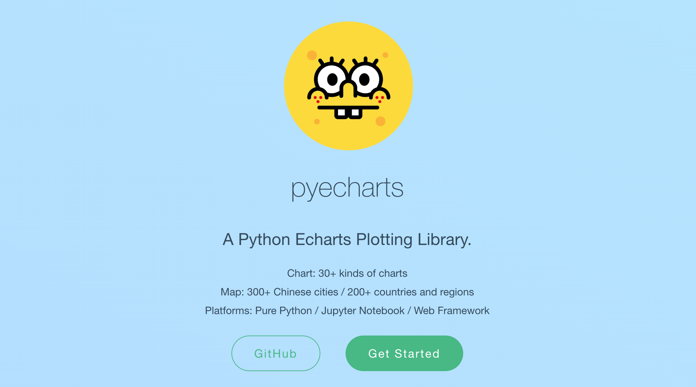

## PyEcharts数据可视化

> 作者：iJeff ( 锋哥 ) 
>
> 版本：QF1.0
>
> 版权：千锋Python教研院
>
> 公众号：Python专栏

####   强大的数据分析可视化工具




### 一、 PyEcharts介绍

##### 版本

- pyecharts 分为 v0.5.X 和 v1 两个大版本，v0.5.X 和 v1 间不兼容，v1 是一个全新的版本
- 经开发团队决定，0.5.x 版本将不再进行维护, 我们不再使用v0.5.x
- 新版本系列将从 v1.0.0 开始, 仅支持 Python3.6+
- 将来的新版本(V2)系列从 Echarts 4 切换到 Echarts 5, 支持 Python3.6 ~ Python 3.11

##### 安装

- 安装命令: 
  - pip install pyecharts -i https://pypi.tuna.tsinghua.edu.cn/simple
  - 本课程安装的PyEcharts版本是: v1.9.1

##### 课程介绍

- ECharts是一个由百度开源的数据可视化，凭借着良好的交互性，精巧的图表设计，得到了众多开发者的认可。而 Python 是一门富有表达力的语言，很适合用于数据处理。当数据分析遇上数据可视化时，PyEcharts诞生了。 
- PyEcharts官方网站: https://gallery.pyecharts.org/ 

##### 特性

- 简洁的 API 设计，使用如丝滑般流畅，支持链式调用
- 囊括了 30+ 种常见图表，应有尽有
- 支持主流 Notebook 环境，Jupyter Notebook 和 JupyterLab
- 可轻松集成至 Flask，Sanic，Django 等主流 Web 框架
- 高度灵活的配置项，可轻松搭配出精美的图表
- 详细的文档和示例，帮助开发者更快的上手项目
- 多达 400+ 地图文件，并且支持原生百度地图，为地理数据可视化提供强有力的支持


### 二、5分钟上手PyEcharts

##### 首先开始来绘制你的第一个图表

```python
from pyecharts.charts import Bar

bar = Bar()
bar.add_xaxis(["衬衫", "羊毛衫", "雪纺衫", "裤子", "高跟鞋", "袜子"])
bar.add_yaxis("商家A", [5, 20, 36, 10, 75, 90])

# render 会生成本地 HTML 文件，默认会在当前目录生成 render.html 文件
# 也可以传入路径参数，如 bar.render("mycharts.html")
bar.render()
```

##### pyecharts 所有方法均支持链式调用。

```python
from pyecharts.charts import Bar

bar = (
    Bar()
    .add_xaxis(["衬衫", "羊毛衫", "雪纺衫", "裤子", "高跟鞋", "袜子"])
    .add_yaxis("商家A", [5, 20, 36, 10, 75, 90])
)
bar.render()
```

##### 使用 options 配置项，在 pyecharts 中，一切皆 Options。

```python
from pyecharts.charts import Bar
from pyecharts import options as opts

# V1 版本开始支持链式调用
# 你所看到的格式其实是 `black` 格式化以后的效果
# 可以执行 `pip install black` 下载使用
bar = (
    Bar()
    .add_xaxis(["衬衫", "羊毛衫", "雪纺衫", "裤子", "高跟鞋", "袜子"])
    .add_yaxis("商家A", [5, 20, 36, 10, 75, 90])
    .set_global_opts(title_opts=opts.TitleOpts(title="主标题", subtitle="副标题"))
    # 或者直接使用字典参数
    # .set_global_opts(title_opts={"text": "主标题", "subtext": "副标题"})
)
bar.render()

# 不习惯链式调用的开发者依旧可以单独调用方法
bar = Bar()
bar.add_xaxis(["衬衫", "羊毛衫", "雪纺衫", "裤子", "高跟鞋", "袜子"])
bar.add_yaxis("商家A", [5, 20, 36, 10, 75, 90])
bar.set_global_opts(title_opts=opts.TitleOpts(title="主标题", subtitle="副标题"))
bar.render()
```

##### 渲染成图片文件

```python
from pyecharts.charts import Bar
from pyecharts.render import make_snapshot

# 使用 snapshot-selenium 渲染图片
from snapshot_selenium import snapshot

bar = (
    Bar()
    .add_xaxis(["衬衫", "羊毛衫", "雪纺衫", "裤子", "高跟鞋", "袜子"])
    .add_yaxis("商家A", [5, 20, 36, 10, 75, 90])
)
make_snapshot(snapshot, bar.render(), "bar.png")
```

##### 使用主题

pyecharts 提供了 10+ 种内置主题，开发者也可以定制自己喜欢的主题

```python
from pyecharts.charts import Bar
from pyecharts import options as opts
# 内置主题类型可查看 pyecharts.globals.ThemeType
from pyecharts.globals import ThemeType

bar = (
    Bar(init_opts=opts.InitOpts(theme=ThemeType.LIGHT))
    .add_xaxis(["衬衫", "羊毛衫", "雪纺衫", "裤子", "高跟鞋", "袜子"])
    .add_yaxis("商家A", [5, 20, 36, 10, 75, 90])
    .add_yaxis("商家B", [15, 6, 45, 20, 35, 66])
    .set_global_opts(title_opts=opts.TitleOpts(title="主标题", subtitle="副标题"))
)
```

> 在使用 Pandas和Numpy 时，请确保将数值类型转换为 python 原生的 int/float。
>
> 比如整数类型请确保为 int，而不是 numpy.int32

##### 使用 Notebook

当然你也可以采用更加酷炫的方式，使用 Notebook 来展示图表，matplotlib 有的，pyecharts 也会有的。pyecharts 支持 Jupyter Notebook / Jupyter Lab / Nteract / Zeppelin 四种环境的渲染。


### 三、PyEcharts配置项

#### 全局配置项

- 全局配置项可通过 `set_global_opts` 方法设置


##### InitOpts：初始化配置项

*class pyecharts.options.InitOpts*

```python
class InitOpts(
    # 图表画布宽度，css 长度单位。
    width: str = "900px",

    # 图表画布高度，css 长度单位。
    height: str = "500px",

    # 图表 ID，图表唯一标识，用于在多图表时区分。
    chart_id: Optional[str] = None,

    # 渲染风格，可选 "canvas", "svg"
    # # 参考 `全局变量` 章节
    renderer: str = RenderType.CANVAS,

    # 网页标题
    page_title: str = "Awesome-pyecharts",

    # 图表主题
    theme: str = "white",

    # 图表背景颜色
    bg_color: Optional[str] = None,
)
```

##### TitleOpts：标题配置项

*class pyecharts.options.TitleOpts*

```python
class TitleOpts(
    # 主标题文本，支持使用 \n 换行。
    title: Optional[str] = None,

    # 主标题跳转 URL 链接
    title_link: Optional[str] = None,

    # 主标题跳转链接方式
    # 默认值是: blank
    # 可选参数: 'self', 'blank'
    # 'self' 当前窗口打开; 'blank' 新窗口打开
    title_target: Optional[str] = None,

    # 副标题文本，支持使用 \n 换行。
    subtitle: Optional[str] = None,

    # 副标题跳转 URL 链接
    subtitle_link: Optional[str] = None,

    # 副标题跳转链接方式
    # 默认值是: blank
    # 可选参数: 'self', 'blank'
    # 'self' 当前窗口打开; 'blank' 新窗口打开
    subtitle_target: Optional[str] = None,

    # title 组件离容器左侧的距离。
    # left 的值可以是像 20 这样的具体像素值，可以是像 '20%' 这样相对于容器高宽的百分比，
    # 也可以是 'left', 'center', 'right'。
    # 如果 left 的值为'left', 'center', 'right'，组件会根据相应的位置自动对齐。
    pos_left: Optional[str] = None,

    # title 组件离容器右侧的距离。
    # right 的值可以是像 20 这样的具体像素值，可以是像 '20%' 这样相对于容器高宽的百分比。
    pos_right: Optional[str] = None,

    # title 组件离容器上侧的距离。
    # top 的值可以是像 20 这样的具体像素值，可以是像 '20%' 这样相对于容器高宽的百分比，
    # 也可以是 'top', 'middle', 'bottom'。
    # 如果 top 的值为'top', 'middle', 'bottom'，组件会根据相应的位置自动对齐。
    pos_top: Optional[str] = None,

    # title 组件离容器下侧的距离。
    # bottom 的值可以是像 20 这样的具体像素值，可以是像 '20%' 这样相对于容器高宽的百分比。
    pos_bottom: Optional[str] = None,

    # 标题内边距，单位px，默认各方向内边距为5，接受数组分别设定上右下左边距。
    # // 设置内边距为 5
    # padding: 5
    # // 设置上下的内边距为 5，左右的内边距为 10
    # padding: [5, 10]
    # // 分别设置四个方向的内边距
    # padding: [
    #     5,  // 上
    #     10, // 右
    #     5,  // 下
    #     10, // 左
    # ]
    padding: Union[Sequence, Numeric] = 5,

    # 主副标题之间的间距。
    item_gap: Numeric = 10,
)
```

##### DataZoomOpts：区域缩放配置项

*class pyecharts.options.DataZoomOpts*

```python
class DataZoomOpts(
    # 是否显示 组件。如果设置为 false，不会显示，但是数据过滤的功能还存在。
    is_show: bool = True,

    # 组件类型，可选 "slider", "inside"
    type_: str = "slider",

    # 拖动时，是否实时更新系列的视图。如果设置为 false，则只在拖拽结束的时候更新。
    is_realtime: bool = True,

    # 数据窗口范围的起始百分比。范围是：0 ~ 100。表示 0% ~ 100%。
    range_start: Union[Numeric, None] = 20,

    # 数据窗口范围的结束百分比。范围是：0 ~ 100
    range_end: Union[Numeric, None] = 80,

    # 布局方式是横还是竖。不仅是布局方式，对于直角坐标系而言，也决定了，缺省情况控制横向数轴还是纵向数轴
    # 可选值为：'horizontal', 'vertical'
    orient: str = "horizontal",

    # 是否锁定选择区域（或叫做数据窗口）的大小。
    # 如果设置为 true 则锁定选择区域的大小，也就是说，只能平移，不能缩放。
    is_zoom_lock: bool = False,

    # dataZoom-slider 组件离容器左侧的距离。
    # left 的值可以是像 20 这样的具体像素值，可以是像 '20%' 这样相对于容器高宽的百分比，
    # 也可以是 'left', 'center', 'right'。
    # 如果 left 的值为 'left', 'center', 'right'，组件会根据相应的位置自动对齐。
    pos_left: Optional[str] = None,

    # dataZoom-slider 组件离容器上侧的距离。
    # top 的值可以是像 20 这样的具体像素值，可以是像 '20%' 这样相对于容器高宽的百分比，
    # 也可以是 'top', 'middle', 'bottom'。
    # 如果 top 的值为 'top', 'middle', 'bottom'，组件会根据相应的位置自动对齐。
    pos_top: Optional[str] = None,

    # dataZoom-slider 组件离容器右侧的距离。
    # right 的值可以是像 20 这样的具体像素值，可以是像 '20%' 这样相对于容器高宽的百分比。
    # 默认自适应。
    pos_right: Optional[str] = None,

    # dataZoom-slider组件离容器下侧的距离。
    # bottom 的值可以是像 20 这样的具体像素值，可以是像 '20%' 这样相对于容器高宽的百分比。
    # 默认自适应。
    pos_bottom: Optional[str] = None,

    # dataZoom 的运行原理是通过数据过滤以及在内部设置轴的显示窗口来达到数据窗口缩放的效果。
    # 'filter'：当前数据窗口外的数据，被过滤掉。即会影响其他轴的数据范围。
    #  每个数据项，只要有一个维度在数据窗口外，整个数据项就会被过滤掉。
    # 'weakFilter'：当前数据窗口外的数据，被过滤掉。即会影响其他轴的数据范围。
    #  每个数据项，只有当全部维度都在数据窗口同侧外部，整个数据项才会被过滤掉。
    # 'empty'：当前数据窗口外的数据，被设置为空。即不会影响其他轴的数据范围。
    # 'none': 不过滤数据，只改变数轴范围。
    filter_mode: str = "filter"
)
```

##### LegendOpts：图例配置项

*class pyecharts.options.LegendOpts*

```python
class LegendOpts(
    # 图例的类型。可选值：
    # 'plain'：普通图例。缺省就是普通图例。
    # 'scroll'：可滚动翻页的图例。当图例数量较多时可以使用。
    type_: Optional[str] = None,

    # 图例选择的模式，控制是否可以通过点击图例改变系列的显示状态。默认开启图例选择，可以设成 false 关闭
    # 除此之外也可以设成 'single' 或者 'multiple' 使用单选或者多选模式。
    selected_mode: Union[str, bool, None] = None,

    # 是否显示图例组件
    is_show: bool = True,

    # 图例组件离容器左侧的距离。
    # left 的值可以是像 20 这样的具体像素值，可以是像 '20%' 这样相对于容器高宽的百分比，
    # 也可以是 'left', 'center', 'right'。
    # 如果 left 的值为'left', 'center', 'right'，组件会根据相应的位置自动对齐。
    pos_left: Union[str, Numeric, None] = None,

    # 图例组件离容器右侧的距离。
    # right 的值可以是像 20 这样的具体像素值，可以是像 '20%' 这样相对于容器高宽的百分比。
    pos_right: Union[str, Numeric, None] = None,

    # 图例组件离容器上侧的距离。
    # top 的值可以是像 20 这样的具体像素值，可以是像 '20%' 这样相对于容器高宽的百分比，
    # 也可以是 'top', 'middle', 'bottom'。
    # 如果 top 的值为'top', 'middle', 'bottom'，组件会根据相应的位置自动对齐。
    pos_top: Union[str, Numeric, None] = None,

    # 图例组件离容器下侧的距离。
    # bottom 的值可以是像 20 这样的具体像素值，可以是像 '20%' 这样相对于容器高宽的百分比。
    pos_bottom: Union[str, Numeric, None] = None,

    # 图例列表的布局朝向。可选：'horizontal', 'vertical'
    orient: Optional[str] = None,

    # 图例标记和文本的对齐。默认自动（auto）
    # 根据组件的位置和 orient 决定
    # 当组件的 left 值为 'right' 以及纵向布局（orient 为 'vertical'）的时候为右对齐，即为 'right'。
    # 可选参数: `auto`, `left`, `right`
    align: Optional[str] = None,

    # 图例内边距，单位px，默认各方向内边距为5
    padding: int = 5,

    # 图例每项之间的间隔。横向布局时为水平间隔，纵向布局时为纵向间隔。
    # 默认间隔为 10
    item_gap: int = 10,

    # 图例标记的图形宽度。默认宽度为 25
    item_width: int = 25,

    # 图例标记的图形高度。默认高度为 14
    item_height: int = 14,

    # 图例关闭时的颜色。默认是 #ccc
    inactive_color: Optional[str] = None,


    # 图例项的 icon。
    # ECharts 提供的标记类型包括 'circle', 'rect', 'roundRect', 'triangle', 'diamond', 'pin', 'arrow', 'none'
    # 可以通过 'image://url' 设置为图片，其中 URL 为图片的链接，或者 dataURI。
    # 可以通过 'path://' 将图标设置为任意的矢量路径。
    legend_icon: Optional[str] = None,
)
```

##### VisualMapOpts：视觉映射配置项

*class pyecharts.options.VisualMapOpts*

```python
class VisualMapOpts(
    # 是否显示视觉映射配置
    is_show: bool = True,

    # 映射过渡类型，可选，"color", "size"
    type_: str = "color",

    # 指定 visualMapPiecewise 组件的最小值。
    min_: Union[int, float] = 0,

    # 指定 visualMapPiecewise 组件的最大值。
    max_: Union[int, float] = 100,

    # 两端的文本，如['High', 'Low']。
    range_text: Union[list, tuple] = None,

    # visualMap 组件过渡颜色
    range_color: Union[Sequence[str]] = None,

    # visualMap 组件过渡 symbol 大小
    range_size: Union[Sequence[int]] = None,

    # visualMap 图元以及其附属物（如文字标签）的透明度。
    range_opacity: Optional[Numeric] = None,

    # 如何放置 visualMap 组件，水平（'horizontal'）或者竖直（'vertical'）。
    orient: str = "vertical",

    # visualMap 组件离容器左侧的距离。
    # left 的值可以是像 20 这样的具体像素值，可以是像 '20%' 这样相对于容器高宽的百分比，
    # 也可以是 'left', 'center', 'right'。
    # 如果 left 的值为'left', 'center', 'right'，组件会根据相应的位置自动对齐。
    pos_left: Optional[str] = None,

    # visualMap 组件离容器右侧的距离。
    # right 的值可以是像 20 这样的具体像素值，可以是像 '20%' 这样相对于容器高宽的百分比。
    pos_right: Optional[str] = None,

    # visualMap 组件离容器上侧的距离。
    # top 的值可以是像 20 这样的具体像素值，可以是像 '20%' 这样相对于容器高宽的百分比，
    # 也可以是 'top', 'middle', 'bottom'。
    # 如果 top 的值为'top', 'middle', 'bottom'，组件会根据相应的位置自动对齐。
    pos_top: Optional[str] = None,

    # visualMap 组件离容器下侧的距离。
    # bottom 的值可以是像 20 这样的具体像素值，可以是像 '20%' 这样相对于容器高宽的百分比。
    pos_bottom: Optional[str] = None,

    # 对于连续型数据，自动平均切分成几段。默认为5段。连续数据的范围需要 max 和 min 来指定
    split_number: int = 5,

    # 是否为分段型
    is_piecewise: bool = False,

    # 是否反转 visualMap 组件
    is_inverse: bool = False,
)
```

##### TooltipOpts：提示框配置项

*class pyecharts.options.TooltipOpts*

```python
class TooltipOpts(
    # 是否显示提示框组件，包括提示框浮层和 axisPointer。
    is_show: bool = True,

    # 触发类型。可选：
    # 'item': 数据项图形触发，主要在散点图，饼图等无类目轴的图表中使用。
    # 'axis': 坐标轴触发，主要在柱状图，折线图等会使用类目轴的图表中使用。
    # 'none': 什么都不触发
    trigger: str = "item",

    # 提示框触发的条件，可选：
    # 'mousemove': 鼠标移动时触发。
    # 'click': 鼠标点击时触发。
    # 'mousemove|click': 同时鼠标移动和点击时触发。
    # 'none': 不在 'mousemove' 或 'click' 时触发，
    trigger_on: str = "mousemove|click",

    # 是否显示提示框浮层，默认显示。
    # 只需 tooltip 触发事件或显示 axisPointer 而不需要显示内容时可配置该项为 false。
    is_show_content: bool = True,

    # 标签内容格式器，支持字符串模板和回调函数两种形式，字符串模板与回调函数返回的字符串均支持用 \n 换行。
    # 字符串模板 模板变量有：
    # {a}：系列名。
    # {b}：数据名。
    # {c}：数据值。
    # {@xxx}：数据中名为 'xxx' 的维度的值，如 {@product} 表示名为 'product'` 的维度的值。
    # {@[n]}：数据中维度 n 的值，如{@[3]}` 表示维度 3 的值，从 0 开始计数。
    # 示例：formatter: '{b}: {@score}'
    formatter: Optional[str] = None,

    # 提示框浮层的背景颜色。
    background_color: Optional[str] = None,

    # 提示框浮层的边框颜色。
    border_color: Optional[str] = None,

    # 提示框浮层的边框宽。
    border_width: Numeric = 0,
)
```

##### AxisLineOpts: 坐标轴轴线配置项

*class pyecharts.option.AxisLineOpts*

```python
class AxisLineOpts(
    # 是否显示坐标轴轴线。
    is_show: bool = True,
)
```

##### AxisTickOpts: 坐标轴刻度配置项

*class pyecharts.option.AxisTickOpts*

```python
class AxisTickOpts(
    # 是否显示坐标轴刻度。
    is_show: bool = True,
)
```

##### AxisOpts：坐标轴配置项

*class pyecharts.options.AxisOpts*

```python
class AxisOpts(
    # 坐标轴类型。可选：
    # 'value': 数值轴，适用于连续数据。
    # 'category': 类目轴，适用于离散的类目数据，为该类型时必须通过 data 设置类目数据。
    # 'time': 时间轴，适用于连续的时序数据，与数值轴相比时间轴带有时间的格式化，在刻度计算上也有所不同，
    # 例如会根据跨度的范围来决定使用月，星期，日还是小时范围的刻度。
    # 'log' 对数轴。适用于对数数据。
    type_: Optional[str] = None,

    # 坐标轴名称。
    name: Optional[str] = None,

    # 是否显示 x 轴。
    is_show: bool = True,
)
```


#### 系列配置项

##### ItemStyleOpts：图元样式配置项

*class pyecharts.options.ItemStyleOpts*

```python
class ItemStyleOpts(
    # 图形的颜色。
    # 颜色可以使用 RGB 表示，比如 'rgb(128, 128, 128)'，如果想要加上 alpha 通道表示不透明度，
    # 可以使用 RGBA，比如 'rgba(128, 128, 128, 0.5)'，也可以使用十六进制格式，比如 '#ccc'。
    # 除了纯色之外颜色也支持渐变色和纹理填充
    color: Optional[str] = None,

    # 图形透明度。支持从 0 到 1 的数字，为 0 时不绘制该图形。
    opacity: Optional[Numeric] = None,
)
```

##### LabelOpts：标签配置项

*class pyecharts.options.LabelOpts*

```python
class LabelOpts(
    # 是否显示标签。
    is_show: bool = True,

    # 标签的位置。可选
    # 'top'，'left'，'right'，'bottom'，'inside'，'insideLeft'，'insideRight'
    # 'insideTop'，'insideBottom'， 'insideTopLeft'，'insideBottomLeft'
    # 'insideTopRight'，'insideBottomRight'
    position: Union[str, Sequence] = "top",

    # 文字的颜色。
    # 如果设置为 'auto'，则为视觉映射得到的颜色，如系列色。
    color: Optional[str] = None,

    # 文字的字体大小
    font_size: Numeric = 12,

    # 文字字体的风格，可选：
    # 'normal'，'italic'，'oblique'
    font_style: Optional[str] = None,

    # 文字字体的粗细，可选：
    # 'normal'，'bold'，'bolder'，'lighter'
    font_weight: Optional[str] = None,

    # 文字的字体系列
    # 还可以是 'serif' , 'monospace', 'Arial', 'Courier New', 'Microsoft YaHei', ...
    font_family: Optional[str] = None,

    # 标签旋转。从 -90 度到 90 度。正值是逆时针。
    rotate: Optional[Numeric] = None,

    # 标签内容格式器，支持字符串模板和回调函数两种形式，字符串模板与回调函数返回的字符串均支持用 \n 换行。
    # 模板变量有 {a}, {b}，{c}，{d}，{e}，分别表示系列名，数据名，数据值等。 
    # 在 trigger 为 'axis' 的时候，会有多个系列的数据，此时可以通过 {a0}, {a1}, {a2} 这种后面加索引的方式表示系列的索引。 
    # 不同图表类型下的 {a}，{b}，{c}，{d} 含义不一样。 其中变量{a}, {b}, {c}, {d}在不同图表类型下代表数据含义为：

    # 折线（区域）图、柱状（条形）图、K线图 : {a}（系列名称），{b}（类目值），{c}（数值）, {d}（无）
    # 散点图（气泡）图 : {a}（系列名称），{b}（数据名称），{c}（数值数组）, {d}（无）
    # 地图 : {a}（系列名称），{b}（区域名称），{c}（合并数值）, {d}（无）
    # 饼图、仪表盘、漏斗图: {a}（系列名称），{b}（数据项名称），{c}（数值）, {d}（百分比）
    # 示例：formatter: '{b}: {@score}'
    formatter: Optional[str] = None,

    # 在 rich 里面，可以自定义富文本样式。利用富文本样式，可以在标签中做出非常丰富的效果
    # 具体配置可以参考一下 https://www.echartsjs.com/tutorial.html#%E5%AF%8C%E6%96%87%E6%9C%AC%E6%A0%87%E7%AD%BE
    rich: Optional[dict] = None,
)
```

##### LineStyleOpts：线样式配置项

*class pyecharts.options.LineStyleOpts*

```python
class LineStyleOpts(
    # 是否显示
    is_show: bool = True,

    # 线宽。
    width: Numeric = 1,

    # 图形透明度。支持从 0 到 1 的数字，为 0 时不绘制该图形。
    opacity: Numeric = 1,

    # 线的弯曲度，0 表示完全不弯曲
    curve: Numeric = 0,

    # 线的类型。可选：
    # 'solid', 'dashed', 'dotted'
    type_: str = "solid",

    # 线的颜色。
    # 颜色可以使用 RGB 表示，比如 'rgb(128, 128, 128)'，如果想要加上 alpha 通道表示不透明度，
    # 可以使用 RGBA，比如 'rgba(128, 128, 128, 0.5)'，也可以使用十六进制格式，比如 '#ccc'。
    # 除了纯色之外颜色也支持渐变色和纹理填充
    color: Union[str, Sequence, None] = None,
)
```


