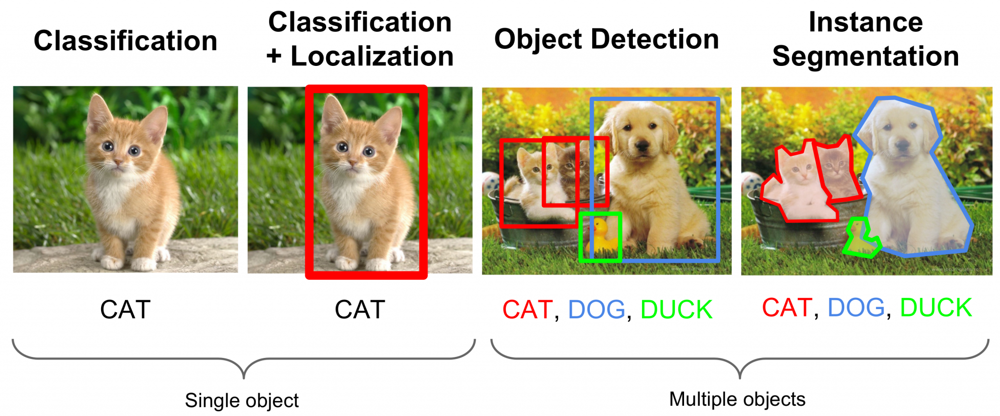
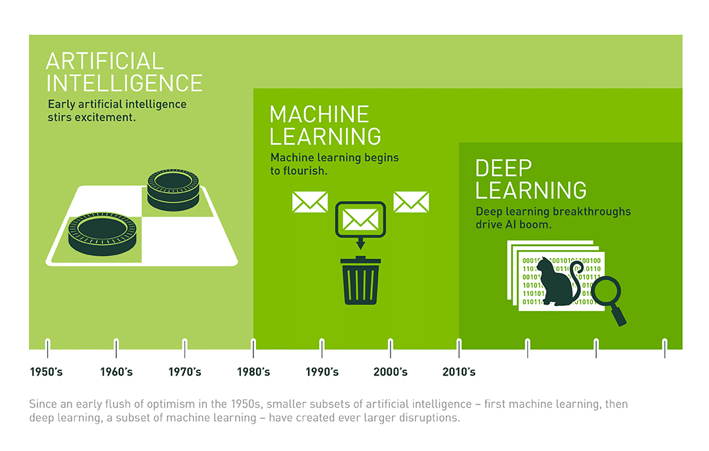
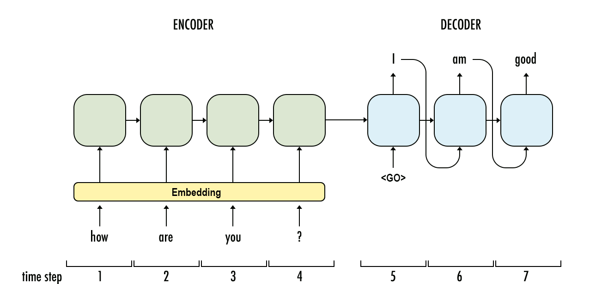
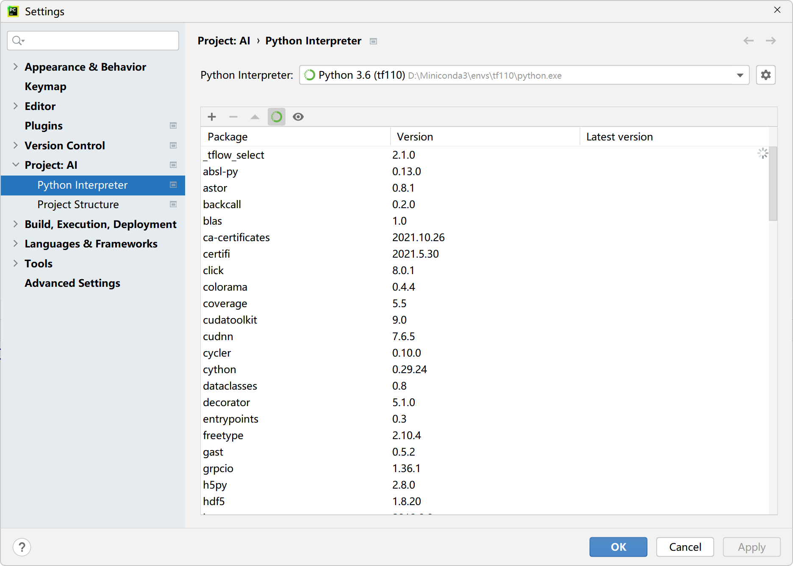
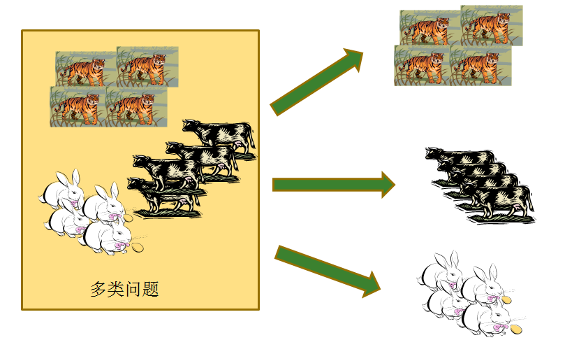
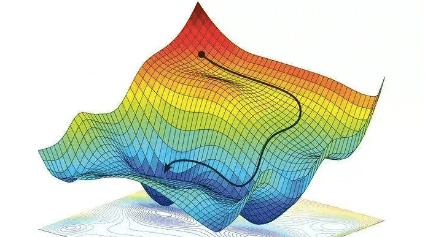
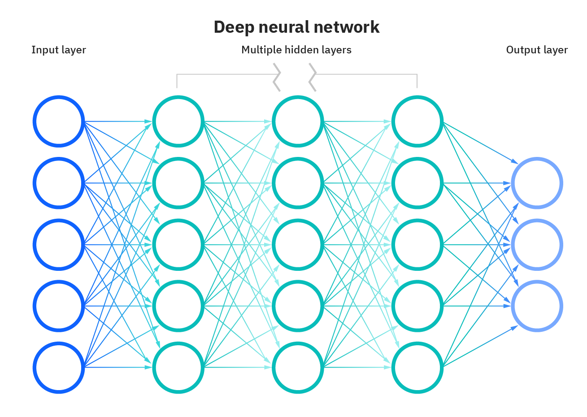
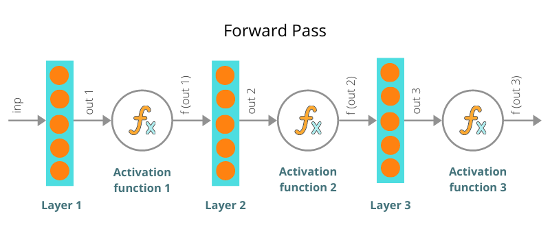

# 1.介绍

## 概念


随着人工智能技术的飞速发展，越来越多的人开始关注和学习人工智能。但对于初学者来说，人工智能的学习可能会感到困难和复杂。


那么，如何从零开始学习人工智能呢？下面就来分享一下快速入门攻略，帮助初学者快速掌握人工智能的基础知识。


-   了解人工智能的基本概念

在开始学习人工智能之前，首先需要了解人工智能的基本概念和定义。人工智能是指通过计算机技术实现类似于人类智能的能力，包括图像识别、自然语言处理等多个方面。掌握这些基本概念有助于初学者更好地理解人工智能的核心概念和技术。

-   学习编程语言

人工智能技术离不开编程语言，因此初学者需要掌握至少一门编程语言。Python是目前最流行的编程语言之一，也是人工智能领域中最常用的编程语言。初学者可以选择学习Python，并掌握Python的基本语法和编程思想。

-   学习机器学习和深度学习

机器学习和深度学习是人工智能领域中最核心的技术之一。机器学习是一种基于数据的方法，通过让机器从数据中学习模式和规律，来完成预测和决策等任务。深度学习是机器学习的一种特殊形式，通过构建深度神经网络来实现更加复杂的任务。初学者可以通过学习相关的课程，掌握机器学习和深度学习的基本原理和方法。

-   学习使用相关工具和框架

在实际应用中，人工智能技术离不开相关的工具和框架。例如，TensorFlow和PyTorch是目前最常用的深度学习框架，初学者可以学习使用这些工具和框架来进行人工智能的实践和应用。

-   实践和探索

学习人工智能最重要的是实践和探索。初学者可以通过完成相关的项目和练习，来深入理解人工智能的应用和技术。

## 应用

人工智能已经逐步渗透到生产生活中的方方面面，无论是医疗、教育、交通、物流，还是传统生产制造、金融、农业甚至是军事、游戏，人工智能的身影无处不在，并发挥着越来越重要的作用。


### 智能制造

<center class="half">


</center>


### 智慧城市


### 交通物流

<center class="half"></center>


### 智慧农业

<center class="half">
 
 
 
</center>


### 智慧医疗


### 智慧金融


### 泛互联网


### 智能机器人


<center class="half">


</center>


## 发展历史


- 人工智能（AI）是指计算机模拟人类智能的一种技术
- 早期的AI技术主要是基于规则的专家系统，难以应对复杂的任务和环境
- 随着机器学习和深度学习的兴起，AI取得了巨大的突破


**图灵测试**


图灵测试计算机科学家阿兰·图灵为机器智能提出的一个测试，如果机器可以让人认为它是个人，那么它就算是具有智能了。


**专家系统**


- 专家系统是早期的AI技术之一，基于一系列的规则和知识库进行推理和决策
- 专家系统的局限性在于需要手动编写规则和知识库，难以应对复杂的任务和环境


**机器学习**


- 机器学习是指让计算机通过大量数据和算法来自动学习和改进
- 机器学习的三种主要类型包括监督学习、无监督学习和强化学习
- 机器学习的应用包括图像识别、自然语言处理、语音识别等领域


**深度学习**


- 深度学习是机器学习的一种技术，通过多层神经网络来提高学习能力和性能
- 深度学习的应用包括计算机视觉、自然语言处理、语音识别等领域
- 深度学习的成功主要得益于计算能力的提升和数据量的增加


**图像识别**




**YOLO系列**


**Segment Anything Model**


**GPT系列**


- GPT（Generative Pre-trained Transformer）系列是一系列基于Transformer架构的预训练语言模型
- GPT系列的目标是学习自然语言的概率分布，从而能够生成具有语言连贯性的文本
- GPT-3是当前最大、最先进的预训练语言模型之一，具有惊人的语言生成能力和智能问答能力


**ChatGPT**


- ChatGPT是基于GPT系列的技术，用于生成自然语言对话
- ChatGPT可以通过学习大量对话数据和对话模式来模拟人类对话

## 自动化决策


机器学习 （ML） 采用算法和统计模型，使计算机系统能够在大量数据中找到模式，然后使用识别这些模式的模型对新数据进行预测或描述。



用最简单的术语来说，机器学习训练机器学习，而无需明确编程如何学习。作为人工智能的一个子集，机器学习以其最基本的形式使用算法来解析数据，从中学习，然后对现实世界中的某些事物做出预测或决定。

换句话说，机器学习使用算法从输入机器学习平台的数据自主创建模型。典型的编程或基于规则的系统捕获专家在编程规则方面的知识，但是当数据发生变化时，这些规则可能变得难以更新和维护。机器学习的优势在于能够从输入算法的越来越多的数据中学习，并且可以提供数据驱动的概率预测。


机器学习采用两种主要技术，将算法的使用分为不同的类型：有监督的、无监督的和这两者的混合。

监督学习算法使用标记数据，监督式机器学习（也称为预测分析）使用算法来训练模型，以在具有标签和特征的数据集中查找模式。然后，它使用经过训练的模型来预测新数据集特征上的标签。


监督学习可以进一步分为分类和回归。分类根据已知物料的标记示例标识物料所属的类别。在下面的简单示例中，逻辑回归用于根据已知欺诈性或非欺诈性的交易特征（交易金额、时间和上次交易的位置）估计信用卡交易是否欺诈的概率（标签）。


回归估计目标结果标签与一个或多个特征变量之间的关系，以预测连续数值。在下面的简单示例中，线性回归用于根据房屋大小（特征）估计房价（标签）。


无监督学习算法在未标记数据中查找模式。在聚类分析中，算法通过分析输入示例之间的相似性将输入分类。集群的一个例子是，一家公司希望细分其客户，以便更好地定制产品和产品。可以根据人口统计和购买历史记录等功能对客户进行分组。无监督学习的聚类通常与监督学习相结合，以获得更有价值的结果。


半监督学习使用标记和未标记数据的混合。

强化学习训练算法，以根据反馈最大化奖励。

## 深度学习


大家都知道人工智能AI也就是让机器的行为看起来像是人所表现出来的智慧行为一样，那我们怎么才能做到让机器行为看起来像是人一样的呢？


你会最常听到的就是机器学习和深度学习，首先我们先搞懂它们的关系是什么？我们可以利用同心圆来帮助我们理解，


AI是最外面的那个大圆，机器学习是中圆，深度学习会是小圆。

也就是说机器学习跟深度学习的关系是，深度学习是机器学习的一部分，机器学习和深度学习都只是人工智能AI的一部分而已；


不管是机器学习还是深度学习都是学习大量的数据，找出来数据中蕴含的模式，学习到的模式Pattern对应就是训练好的神经网络；

机器学习的年代还需要一些人工进行前期的数据预处理，到了深度学习的年代则是如何做数据预处理也作为神经网络算法需要去学习的一部分内容！

时至今日，深度学习已经称为AI界的主流，近十年人工智能火热也是得益于深度学习的突飞猛进，

比如大家熟知的下围棋的AlphaGO，深度学习+强化学习


ChatGPT，深度学习+NLP


无人驾驶，深度学习+图像识别


## 强化学习


最早开始关注强化学习是在 2016 年 3 月，韩国围棋高手李世石与 Google DeepMind团队开发AlphaGo 经过一番激战，以 1：4 的比分落败，被认为是人工智能历史上的一次里程碑事件，


这让大家开始认识到强化学习+深度学习的能力，俗称为深度强化学习。

后来又在2017年5月27日，最后一次击败了世界第一的柯洁，这次在乌镇依然没能带来一场胜利，最终以0：3 败给升级版的阿老师（AlphaGo）


其实强化学习在很多领域都有应用：

Atari游戏，经过几小时的训练，学到了好的策略去完成游戏


OPEN AI Bot Five 打 Dota2，击败顶级职业选手（OpenAI的强化学习bot在中路solo中击败职业选手Dendi）


自动驾驶，比如下图展示的是，训练30小时后，AI agent在模拟环境中学习到了最优的行为策略


火遍全球的ChatGPT训练也用到强化学习，


机器人，波士顿狗，从走路都不会，通过强化学习不断探索完成各种高难度动作


OpenAI 捉迷藏，学会2v2躲避策略，比如把门给堵上了


AI打王者荣耀，腾讯 AI Lab 开发的策略协作型“绝悟”，最强 AI 分分教你做人。


深度学习和强化学习方法训练机器人，可以使其能够抓取各种物体，甚至是训练中未出现过的物体。因此，可将其用于装配线上产品的制造。

针对抓取任务，谷歌AI用了4个月时间，使用7个机器人运行了800小时。

实验表明，在700次实验中，QT-Opt方法有96%的概率成功抓取陌生的物体，而之前的方法仅有78%的成功率。


作为 DARPA 的 AlphaDogfight 试验 (ADT) 的参与者，洛克希德马丁公司开发了一种基于强化学习的 F-16 自动驾驶仪飞行员，最终取得了最佳成绩。


强化学习是一个非常有趣且值得广泛研究的领域，RL技术的进步及其在现实各领域的应用势必将取得更大的成功。这里介绍了强化学习是什么以及可以去做什么，希望这能激发起你的好奇心，并引起你对RL的热爱和研究。

## 图像识别


图像识别是让机器“看”懂世界的一种能力，也被称为计算机视觉。图像识别技术的目的是使计算机能够理解和分析图像，并根据图像的内容进行分类、识别和标记。

<figure>    </figure>


图像识别技术在许多应用中都有重要的作用，如自动驾驶、智能监控、人脸识别、医学图像识别等。

图像识别的背后是深度学习和卷积神经网络（CNN）这些先进的人工智能技术。


CNN是一种专门用于处理图像的神经网络结构，它可以从输入的数字图像中提取出图像的特征。具体来说，CNN通过多次卷积运算和池化运算来对图像进行处理，从而识别出图像中的不同部分。卷积运算可以提取出图像中的局部特征，池化运算可以将图像的分辨率降低，减少计算量和内存占用。

在CNN中，还会使用一些激活函数、损失函数和优化算法等技术来提高图像识别的准确性和效率。激活函数用于在神经网络中引入非线性，损失函数用于度量神经网络的预测结果与真实结果之间的差异，优化算法用于调整神经网络的参数，以提高预测准确性。


当一个CNN模型经过训练之后，它就可以对新的数字图像进行分类和识别。具体来说，当一个数字图像被输入到CNN模型中时，模型会通过多次卷积和池化运算提取出图像的特征，并将这些特征输入到全连接层中进行分类。最终，模型会输出一个概率分布，表示该图像属于不同类别的概率大小。


总的来说，图像识别背后的秘密是通过使用深度学习和CNN这些先进的人工智能技术，让机器学会从数字图像中提取特征，并将这些特征用于分类和识别。


## 自然语言处理


自然语言处理（Natural Language Processing，简称NLP）是一种人工智能技术，它可以让机器能够理解和处理自然语言，也就是人们日常生活中使用的语言。

在NLP中，机器需要经过多个步骤来理解自然语言。这些步骤包括文本分词、词性标注、命名实体识别、句法分析和语义分析等。下面我来简单介绍一下这些步骤的含义和作用。

1.  文本分词：将一段文本分割成若干个词语或符号，也就是对文本进行分词。分词是NLP的基础工作，因为自然语言中的句子是由一个个词语组成的，只有将句子分成单独的词语，机器才能够理解其含义。

	

2.  词性标注：给每个词语标注其词性。词性标注的作用是帮助机器理解每个词语在句子中的作用，从而更好地理解句子的含义。

	

3.  命名实体识别：识别出文本中的人名、地名、组织机构名等命名实体。命名实体识别的作用是让机器能够识别出文本中的重要信息，从而更好地理解文本的含义。

	

4.  句法分析：分析句子中各个成分之间的关系。句法分析的作用是帮助机器理解句子的结构，从而更好地理解句子的含义。

	

5.  语义分析：分析句子的语义，即句子的意思。语义分析的作用是让机器能够理解句子的真正含义，从而更好地处理和回答用户的问题。

除了上述提到的文本分词、词性标注、命名实体识别、句法分析和语义分析等步骤外，自然语言处理还包括以下一些重要的技术和应用：

1.  文本分类：将文本分为不同的类别。例如，对新闻文章进行分类，可以将其分为政治、体育、财经等类别。

	

2.  文本聚类：将文本按照相似性进行分组。例如，将新闻文章按照主题进行聚类，可以将所有与体育有关的文章放在一起。

	

3.  情感分析：分析文本中的情感倾向，例如正面、中性或负面情感。情感分析可以用于监测社交媒体上的舆情或评估产品或服务的用户体验。

	

	

4.  文本摘要：将长篇文本压缩成简短的摘要。文本摘要可以用于自动化撰写新闻报道或简化用户手册等。

	

5.  机器翻译：将一种语言翻译成另一种语言。机器翻译是自然语言处理的重要应用之一，可以用于跨语言交流和全球化业务。

	

6.  智能问答：根据用户提出的问题，自动回答相关问题。智能问答是自然语言处理的应用之一，可以用于帮助用户解决问题或提供信息。

	

总的来说，自然语言处理是一种非常广泛应用的人工智能技术，它可以帮助机器理解自然语言，从而实现各种应用，例如机器翻译、智能客服、智能问答等。


RNN循环神经网络


LSTM长短时记忆


Seq2Seq



Attention注意力机制


Transformer


Bert GPT


## 说明


入门人工智能可以暂时不需要深入研究数学推导，是因为现代的人工智能技术已经非常成熟，提供了大量的高层次接口和工具，使得开发人员可以快速构建和部署机器学习模型，而无需对复杂的数学理论进行深入的推导。


例如，像TensorFlow和PyTorch这样的深度学习框架提供了一些高层次的API，这些API使得人们可以通过几行简单的代码构建深度学习模型，而无需了解背后的数学理论。此外，还有各种各样的自动化机器学习工具和云服务，它们可以帮助开发人员自动选择模型和参数，而无需对数学推导有深入的了解。


尽管如此，对于深入理解和创新，数学知识仍然是必不可少的。当你想要深入了解机器学习算法的运作原理、调试错误，优化算法等等时，数学推导是必须要了解的。因此，虽然不必在一开始就深入研究数学推导，但随着学习的深入，逐步掌握和理解数学知识是非常有益的。

然而，说是躲开了去学习一些数学知识，指的是不必大量时间系统的学习数学几门课。但是课程中还是会涉及到一点点数学计算的；


例如，在图像分类器中，你需要使用卷积神经网络（CNN）来处理图像。要了解CNN的工作原理，你需要了解卷积运算和池化运算，这些运算都涉及到线性代数中的矩阵乘法和微积分中的导数和偏导数。此外，你还需要了解激活函数、损失函数和优化算法等概念，这些概念同样涉及到微积分和概率论的知识。

因此，尽管你可以使用现成的高层次API来构建图像分类器，但如果你想要深入了解其背后的原理，你需要学习一些数学知识。通过理解这些数学概念，你可以更好地理解机器学习算法的工作原理，并且可以对算法进行优化和改进。

# 2.开始

## 搭建Python环境

Miniconda让你的AI之路畅通无阻！


在公司里面做为AI算法工程师，大部分工作时都会使用python语言，但是做人工智能不一定非要Python。


### 为何选择Miniconda


### 下载Miniconda

推荐从清华镜像下载安装包，因为从官网下载比较慢

https://mirrors.tuna.tsinghua.edu.cn/anaconda/miniconda/

打开网页后，下拉到最后找到Miniconda3-latest前缀的文件，或者网页中直接搜索Miniconda3-latest，都可以找到如下图这些安装文件。如果是windows 64位系统，则可以选择下载图中红色框中的安装文件，其它系统可以根据文件名称选择对应的安装文件。


温馨提示：

如果之前电脑中安装过原生python，建议先将原生python删除，


至少需要在环境变量中删除原生python对应项；

然后再去安装Miniconda；


### 安装Miniconda

2024新版参考：[最新版最详细Anaconda新手安装+配置+环境创建教程_anaconda配置-CSDN博客](https://blog.csdn.net/qq_44000789/article/details/142214660)


温馨提示：

请确保你使用的电脑用户对安装的Miniconda目录有完全控制权！


### 配置环境变量


**验证是否安装成功**

`cmd`打开命令行窗口，输入`conda info`，看到类似下图信息，说明安装成功


或者 输入框搜索anaconda，打开Anaconda Powershell Prompt应用


输入`conda info`，看到类似下图信息，说明安装成功


### 开发第一个Python程序

**第一步：使用记事本，编写代码**

```python
print("hello world! ")
```

在D盘下保存路径`d:/mycode`, 文件名`Welcome.py`


新建文件时，注意文件后缀


**第二步：运行阶段**

打开Anaconda Powershell Prompt，进入python文件所在目录；


执行：`python  Welcome.py`（就是运行python脚本），输出执行结果


##  开发工具

### Python开发环境


https://www.jetbrains.com/pycharm/


**第一步：下载与安装**


<center class="half">
    
    
</center>


<center class="half">
    
    
</center>


**第二步：创建项目并关联已有环境**


关于此项目的代码都将放在Location路径下，下图中三个点有可能是"Add Interpreter"


找到conda.exe后不要忘了点击一些右侧按钮"Load Environments"


如果是PyCharm老版本，


点击"create"创建项目后，如果想切换Python项目的运行环境，可以如下操作即可




如果是老版本是否可以升级到最新版本，而无需下载呢？两种方式


**第三步：创建项目下的python脚本**


**第四步：编写代码**

```python
print("hello world! ")
```


**第五步：执行代码**


### PyCharm快捷键


# 3.算法&实战

## 多元线性回归


根据历史数据训练模型，未来预测具体数值的任务就是回归任务，


1.  股票价格预测
2.  房价预测（影响因素：房屋的面积、卧室数量、浴室数量、车库数量等等）
3.  销售量预测
4.  贷款违约率预测

**多元线性回归**就是众多回归算法中的一个，也是最基础的一个

#### 何为多元？多个维度 multi dimensionality


更高的维度很难绘制出来；不过我们可以思考一下我们生活的世界是几维空间？

其实随时随地都能在脑海种构建一个多维空间。比如，房屋的售价取决于很多因素，比如房屋的面积、卧室数量、浴室数量、车库数量等等。


#### 何为线性？二维空间：直线


三维空间：平面


更高维度空间中呈现出来的"线性体"，我们统称为超平面hyper plane；


#### 何为回归？回归其实就是拟合

二维世界的一元线性回归：下图左

二维世界的一元非线性回归：下图右


三维世界的线性回归：


三维世界的非线性回归：


>   综上所述，多元线性回归顾名思义就是，在多元世界（多维空间）中使用线性体（直线、平面、超平面）对已有数据点进行拟合的一种方式方法（算法or函数）！


#### 线性回归公式（算法表达式）

一元线性回归
$$
\hat{Y}=w_0+w_1x_1
$$
多元线性回归
$$
\hat{Y}=w_0+w_1x_1+w_2x_2+\ldots+w_nx_n
$$


#### 何时使用线性回归？


1.  如果我们知道我们的数据$X={x_1\ldots x_n}$和$Y$大致是成线性变换关系的，当然使用线性回归算法显然是合适的！
2.  只要我们假设$X={x_1\ldots x_n}$和$Y$是成线性变换的，就可以尝试去使用线性回归算法去拟合，万一合适呢？


#### 使用几元线性回归？


使用几元线性回归决定了我们使用什么样的公式

这个由数据决定，数据$X={x_1\ldots x_n}$中的$n$将决定了是几维空间中的回归任务


#### 如何求解算法模型


根据数据我们知道是使用一元线性回归还是多元线性回归，


然后我们可以把数据中的$X={x_1\ldots x_n}$带入到算法公式中，
$$
\hat{Y}=w_0+w_1x_1+w_2x_2+\ldots+w_nx_n
$$
而我们的数据中有没有$Y$呢？必须有的，所以我们可以计算真实值$Y$和预测值$\hat{Y}$之间的均方差(Mean Squared Error)，


这是回归任务最常用的损失函数
$$
MSE=\frac{1}{m}\sum_{i=1}^{m}(Y_i-\hat{Y_i})^2
$$
不同的算法模型（公式参数）有不同的损失值，


我们需要计算机不断调整参数最后找出来最优解参数（最佳模型）

## 实战-糖尿病回归预测

首先在所使用的python环境中，


安装封装了机器学习算法库的python模块scikit-learn

`pip install scikit-learn`

接着就可以创建脚本，书写代码

```python
from sklearn import datasets
from sklearn.linear_model import LinearRegression
from sklearn.model_selection import train_test_split
from sklearn.metrics import mean_squared_error

# 加载糖尿病数据集
diabetes = datasets.load_diabetes()

# 将数据集拆分为训练集和测试集
X_train, X_test, y_train, y_test = train_test_split(diabetes.data, diabetes.target, test_size=0.2, random_state=0)

# 创建一个线性回归对象
lr = LinearRegression()

# 使用训练集训练模型
lr.fit(X_train, y_train)

# 对测试集进行预测
y_pred = lr.predict(X_test)

# 打印模型的均方误差
print("均方误差: %.2f" % mean_squared_error(y_test, y_pred))
```

我们首先从scikit-learn的内置数据集中加载糖尿病数据集。

然后，我们使用`train_test_split()`将数据集拆分为训练集和测试集。

接下来，我们创建一个`LinearRegression`对象，并使用训练数据集使用`fit()`方法训练模型。

我们使用`predict()`方法在测试集上进行预测，并使用scikit-learn的`metrics`模块中的`mean_squared_error()`函数计算模型的均方误差。

最后，我们打印出均方误差。

## 逻辑回归


大家千万不要被逻辑回归的名字所迷惑，其实logistic regression 并不是回归任务的算法，而是属于分类任务算法。

根据历史数据训练模型，未来预测样本属于哪一个类别的任务就是分类任务，

1.  垃圾邮件分类
2.  情感分析
3.  图像识别
4.  信用卡欺诈检测
5.  疾病诊断
6.  金融欺诈检测


### 逻辑回归是分类算法，为何名字中有回归二字？


我们知道回归是去拟合，而分类是找到类别之间的分界，可以是分界线，也可以是分界面；可以是线性的分界，也可以是非线性的分界。

逻辑回归算法的本质，其实是要通过数据（data）回归（拟合）出来分界！


### 逻辑回归算法表达式

$$
\hat{Y}=\frac{1}{1+e^{-(w_0+w_1x_1+w_2x_2+\ldots+w_nx_n)}}
$$

看到这个算法表达式，你不禁会想到多元线性回归，对么？
$$
z= w_0+w_1x_1+w_2x_2+\ldots+w_nx_n
\\ \hat{Y}=\frac{1}{1+e^{-z}}
$$
用下图来理解这里的算法表达式：


一个$S$型曲线（Sigmoid函数），将线性回归的值压缩到了0到1之间，这样就具备了概率含义；

而概率值大于0.5我们认为样本是正例，反之我们认为样本是负例，这样逻辑回归创建之初就是做二分类任务用的。


### 如何求解算法模型


我们可以把数据中的$X={x_1\ldots x_n}$带入到算法公式中，通过算法表达式计算模型预测值
$$
\hat{Y}=\frac{1}{1+e^{-(w_0+w_1x_1+w_2x_2+\ldots+w_nx_n)}}
$$
而我们的数据中有没有$Y$呢？必须有的，所以我们可以利用真实值$Y$和预测值$\hat{Y}$计算二分类交叉熵损失值（binary cross entropy）
$$
BCE=-\frac{1}{m}\sum_{i=1}^{m}[Y_i\cdot\log\hat{Y_i}+\left(1-Y_i\right)\cdot\log\left(1-\hat{Y_i}\right)]
$$
不同的算法模型（公式参数）有不同的损失值，我们需要计算机不断调整参数最后找出来最优解参数（最佳模型）


### 逻辑回归可以做多分类吗？


答案是肯定的，我们只需要将多分类数据集划分成多个二分类数据集即可；具体做法可以是OvR


多分类中的每一个二分类模型未来就可以预测某个样本属于某个类别的概率，比如3分类就有三个二分类模型，4分类就有4个二分类模型，


## Softmax回归



Softmax回归听名字，依然好像是做回归任务的算法，但其实它是去做多分类任务的算法。

1.  篮球比赛胜负是二分类，足球比赛胜平负就是多分类
2.  识别手写数字0和1是二分类，识别手写数字0-9就是多分类
3.  ......

Softmax回归算法是一种用于多分类问题的机器学习算法。它可以帮助我们预测一个样本属于哪一类，比如预测一张照片中的动物是狗、猫还是鸟。


### Softmax回归算法表达式

$$
P_i=\frac{e^{z_i}}{e^{z_1}+e^{z_2}+e^{z_3}+\ldots+e^{z_k}}
$$

假设你是一名动物园管理员，你想识别你们园区的动物。你拍了一些照片，其中包含狗、猫和鸟三种不同的动物。你需要一个算法来识别每张照片中的动物是哪一种。


在Softmax回归算法中，我们首先需要建立一个模型来描述每种动物的概率。
$$
P_i=\frac{e^{z_i}}{e^{z_1}+e^{z_2}+e^{z_3}}
$$
我们将每种动物的概率分别表示为p1、p2和p3，其中p1表示照片中的动物是狗的概率，p2表示是猫的概率，p3表示是鸟的概率。然后，我们使用Softmax函数将这些概率转换为0到1之间的概率值，使它们的和等于$1$：
$$
P_1=\frac{e^{z_1}}{e^{z_1}+e^{z_2}+e^{z_3}} \\ 
P_2=\frac{e^{z_2}}{e^{z_1}+e^{z_2}+e^{z_3}} \\ 
P_3=\frac{e^{z_3}}{e^{z_1}+e^{z_2}+e^{z_3}} \\
$$
其中，$z1$、$z2$和$z3$是多元线性回归方程：
$$
z1 = w10 + w11 * x1 + w12 * x2 + ... + w1n * xn
\\
z2 = w20 + w21 * x1 + w22 * x2 + ... + w2n * xn
\\
z3 = w30 + w31 * x1 + w32 * x2 + ... + w3n * xn
$$
其中，$w10,w11,w12,\ldots,w1n$是第一类动物的系数，$w20,w21,w22,\ldots,w2n$是第二类动物的系数，$w30,w31,w32,\ldots,w3n$是第三类动物的系数。$x1、x2、...、xn$是照片的各种特征。


前面提到的3组W参数，对应上图就是3个类别之间的分界线；与逻辑回归做多分类不同，


逻辑回归是一个分界线一个分界线分别去求的，Softmax回归是同时求出来3个分界线（3组参数）。


### 如何求解算法模型


我们可以把数据中的$X={x_1\ldots x_n}$带入到算法公式中，通过算法表达式计算模型预测值，
$$
P_1=\frac{e^{z_1}}{e^{z_1}+e^{z_2}+e^{z_3}+\ldots+e^{z_k}}
\\ 
P_2=\frac{e^{z_2}}{e^{z_1}+e^{z_2}+e^{z_3}+\ldots+e^{z_k}}
\\
\cdots
\\
P_k=\frac{e^{z_k}}{e^{z_1}+e^{z_2}+e^{z_3}+\ldots+e^{z_k}}
$$
而我们的数据中有没有$Y$呢？必须有的，所以我们可以利用真实值$Y$和预测值$\hat{Y}$计算多分类交叉熵损失值（multi-class cross entropy）
$$
logloss=-\frac{1}{m}\sum_{i=1}^{m}\sum_{j=1}^{k}Y_{ij}\log P_{ij}
$$
不同的算法模型（公式参数）有不同的损失值，我们需要计算机不断调整参数最后找出来最优解参数（最佳模型）


### MultiLabel与MultiClass


在多标签分类中，每个示例可以有多个标签，每个标签可能是二进制的（1表示有标签，0表示没有标签）或实数的（例如，表示一个图书对某个主题的相关度）。这种分类方式在许多现实世界的应用中非常有用，例如文本分类，其中一个文档可以属于多个类别（例如，"科技"和"健康"）。

在多类分类中，每个示例只能属于一个类别，因此每个类别之间是互斥的。这种分类方式通常适用于一些需要进行具体分类的问题，例如图像分类，将一张图像分类为"狗"、"猫"或"鸟"等类别。

总之，多标签分类和多类分类是机器学习中两种不同的分类方式，它们在分类的方法和应用场景上有所不同，需要根据具体问题的需求选择适当的方式。


1.  Softmax回归适合多分类模型，因为互斥就是各类别概率之和必须为1；
2.  逻辑回归多分类转多个二分类适合，因为各个二分类模型是相互独立的；


## 实战-鸢尾花分类预测

```python
from sklearn import datasets
from sklearn.linear_model import LogisticRegression
from sklearn.model_selection import train_test_split
from sklearn.metrics import accuracy_score

# 加载鸢尾花数据集
iris = datasets.load_iris()

# 将数据集拆分为训练集和测试集
X_train, X_test, y_train, y_test = train_test_split(iris.data, iris.target, test_size=0.2, random_state=0)

# 创建一个逻辑回归对象
lr = LogisticRegression()

# 使用训练集训练模型
lr.fit(X_train, y_train)

# 对测试集进行预测
y_pred = lr.predict(X_test)

# 打印模型的准确率
print("准确率: %.2f" % accuracy_score(y_test, y_pred))

```


在此代码中，我们首先从scikit-learn的内置数据集中加载鸢尾花数据集。

然后，我们使用`train_test_split()`将数据集拆分为训练集和测试集。

接下来，我们创建一个`LogisticRegression`对象，并使用训练数据集使用`fit()`方法训练模型。

我们使用`predict()`方法在测试集上进行预测，并使用scikit-learn的`metrics`模块中的`accuracy_score()`函数计算模型的准确率。

最后，我们打印出模型的准确率。

## 正则化技术


假设你正在学习如何打高尔夫球。你发现在练习时，有些细节会对你的成绩产生很大的影响，例如你的手握杆的力度、你的握杆姿势、你的身体姿势等等。但是，你也发现如果你把注意力全部集中在这些细节上，你很容易就会忘记打球的主要目标——把球打进洞里。


机器学习的正则化也是类似的概念。在机器学习中，我们通常会面临着过拟合和欠拟合的问题。


过拟合指的是模型过于复杂，以至于能够完美地拟合训练数据，但却不能很好地泛化到新的数据。欠拟合则相反，模型过于简单，不能很好地拟合数据。


为了解决这些问题，我们可以使用正则化技术。正则化的目标是保持模型简单，以避免过拟合。


正则化的方法通常是在损失函数中添加一个正则化项，这个正则化项会根据模型参数的大小来惩罚模型的复杂度。


你可以把这个过程想象成打高尔夫球时的情景。假设你在打高尔夫球时，你想确保你的注意力不会全部集中在细节上，以至于忘记了目标。正则化的方法就是将一定的注意力集中在细节上，但也不要完全忽略了目标，这样你的成绩就会更好。
$$
Loss = BaseLoss + Penalty
$$
回归任务：
$$
Loss = MeanSquaredError + Penalty
$$
二分类任务：
$$
Loss = BinaryCrossEntropy + Penalty
$$
多分类任务：
$$
Loss = MultiClassCrossEntropy + Penalty
$$


### L1、L2正则项

L1和L2正则项都是常用的正则化方法，它们通过在模型的损失函数中加入一个正则化项来控制模型的复杂度。
$$
Loss = BaseLoss + L1 \\
or \\
Loss = BaseLoss + L2
$$
L1正则化是指在模型的损失函数中加入L1范数，L1正则化会让一些特征的权重变为0，因此可以用来进行特征选择。在L1正则化中，正则化项的计算公式为：
$$
\lambda\sum_{i=1}^{n}|w_i|
$$
其中，$w_i$是模型中第$i$个特征的权重，$\lambda$是超参数，用于控制正则化的强度。

L1正则化的优点是可以减少特征的数量，因此可以避免过拟合。缺点是可能会过度惩罚某些特征，使得一些有用的特征被舍弃。

L2正则化是指在模型的损失函数中加入L2范数，L2正则化会让所有特征的权重都变得较小，但不为0。在L2正则化中，正则化项的计算公式为：
$$
\lambda\sum_{i=1}^{n}w_i^2
$$
其中，$w_i$是模型中第$i$个特征的权重，$\lambda$是超参数，用于控制正则化的强度。L2正则化的优点是可以降低所有特征的权重，防止过拟合。缺点是不会减少特征数量，因此不能用于特征选择。

L1和L2正则化在实际应用中都有着广泛的应用。例如，在线性回归中，可以通过添加L1或L2正则项来进行正则化。在神经网络中，也可以通过添加L1或L2正则项来控制模型的复杂度。在实际使用时，我们需要根据实际情况选择合适的正则化方法和超参数，以达到最优的模型效果。

如果是多元线性回归的损失函数改为，叫做Lasso回归：
$$
Loss = MSE + \lambda\sum_{i=1}^{n}|w_i|
$$
如果是多元线性回归的损失函数改为，叫做Ridge岭回归：
$$
Loss = MSE +\lambda\sum_{i=1}^{n}w_i^2
$$

## 实战-新闻分类

使用 scikit-learn 进行 20newsgroups 分类任务

```python
from sklearn.datasets import fetch_20newsgroups
from sklearn.feature_extraction.text import CountVectorizer
from sklearn.linear_model import LogisticRegression
from sklearn.pipeline import make_pipeline
from sklearn.metrics import accuracy_score

# 载入 20newsgroups 数据集
newsgroups_train = fetch_20newsgroups(subset='train')
newsgroups_test = fetch_20newsgroups(subset='test')

# 创建一个 Pipeline，用于文本特征提取和 logistic regression
pipeline = make_pipeline(CountVectorizer(), LogisticRegression())

# 使用训练集训练模型
pipeline.fit(newsgroups_train.data, newsgroups_train.target)

# 在测试集上进行预测
y_pred = pipeline.predict(newsgroups_test.data)

# 输出模型的准确率
print("Accuracy: %.2f" % accuracy_score(newsgroups_test.target, y_pred))

```

在这个代码中，我们首先使用 `fetch_20newsgroups()` 方法从 scikit-learn 自带的数据集中载入 20newsgroups 数据集。

然后，我们使用 `make_pipeline()` 方法创建了一个 Pipeline，其中包括了 CountVectorizer() 和 LogisticRegression()。

我们使用 `fit()` 方法在训练集上训练模型。之后，我们使用 `predict()` 方法对测试集进行预测，并使用 `accuracy_score()` 方法计算模型的准确率。

最后，我们打印出模型的准确率。

CountVectorizer() 是一个用于文本特征提取的方法，它将文本转换为单词计数的向量。

LogisticRegression() 是一种常用的分类算法，用于将输入特征映射到分类概率。

通过将 CountVectorizer() 和 LogisticRegression() 组合起来使用，我们可以很方便地完成文本分类任务。


`CountVectorizer`是scikit-learn中的一个文本特征提取方法，它将文本转换为单词计数的向量。其具体作用是将文本中的单词转换为特征向量，使得机器学习模型可以对文本进行分析和处理。

下面是一个例子，假设我们有以下三个文本：

```python
文本1: This is a sample text.
文本2: This text is another example text.
文本3: This is just another text.
```

我们可以使用`CountVectorizer`将它们转换为向量表示。首先，需要导入CountVectorizer：

```python
from sklearn.feature_extraction.text import CountVectorizer
```

然后，创建一个CountVectorizer对象，并将文本数据传递给它的`fit_transform()`方法：

```python
corpus = [
    'This is a sample text.',
    'This text is another example text.',
    'This is just another text.'
]

vectorizer = CountVectorizer()
X = vectorizer.fit_transform(corpus)
```

`X`现在是一个稀疏矩阵，每一行代表一个文本，每一列代表一个单词。单词的出现次数则在矩阵中体现。我们可以使用以下代码查看向量的表示：

```python
print(X.toarray())
```

```python
[[1 1 1 0 0 0 1 0 0]
 [0 2 0 1 0 1 1 0 1]
 [1 0 0 1 1 0 1 1 0]]
```

可以看到，矩阵中的每一行都是一个向量，每一列都代表一个单词。例如，第一行表示的向量是[1, 1, 1, 0, 0, 0, 1, 0, 0]，这个向量的第一个元素代表单词“a”在这个文本中出现了1次，第二个元素代表单词“another”在这个文本中出现了1次，以此类推。

通过`CountVectorizer`，我们可以将文本数据转换为数字向量，从而可以使用机器学习算法对文本进行分析和处理。

## 梯度下降法


假设你是一名山上的导游，有一个团队要跟随你攀登山峰。你的目标是带领大家快速、高效地到达山顶。但是，你没有地图和指南针，你只能依靠你的经验和感觉来找到最优的攀登路线。


梯度下降法就像是你攀登山峰的方式，你每次都会选择当前最陡峭的路线向上攀登。具体来说，你会根据当前位置的高度和周围的地形情况计算出一个下山最陡峭的方向，然后向这个方向走一小步，继续计算新位置的最陡峭方向，以此类推，直到你到达山顶。



在机器学习中，我们也需要找到一个函数的最小值。这个函数表示一个损失函数，表示模型预测与真实值之间的差距，我们需要找到最小化损失函数的参数。梯度下降法就是一种常用的优化算法，可以帮助我们找到函数的最小值。


### 梯度下降法的步骤


1.  初始化模型参数，例如随机初始化权重$\theta=w_0,w_1,w2,\ldots,w_n$

2.  根据当前的模型参数计算出损失函数的梯度。
	$$
	gradient=\frac{\partial J(\theta)}{\partial \theta}
	$$

3.  根据损失函数的梯度更新模型参数。
	$$
	\theta = \theta - \alpha \frac{\partial J(\theta)}{\partial \theta}
	$$


	其中，$\alpha$是学习率，用来控制每次迭代的步长。$\frac{\partial J(\theta)}{\partial \theta}$表示损失函数对参数$\theta$的梯度，也就是损失函数的变化率。如果梯度为正，那么我们需要减小$\theta$的值；如果梯度为负，那么我们需要增加$\theta$的值。


​	

4.  重复步骤2和3，直到满足终止条件。

	*达到设定的迭代次数*

	*loss变*化的幅度小于设定的阈值


这个过程就像是从山顶到山脚的下滑过程，我们需要不断沿着损失函数的梯度方向更新$\theta$的值，直到达到最小值点。当然，如果学习率太大，可能会导致迭代过程不稳定，甚至无法收敛；如果学习率太小，可能会导致收敛速度太慢。因此，在实际应用中，我们需要根据实际情况选择合适的学习率，以达到最优的模型效果。

总之，梯度下降法是一种非常重要的优化算法，它能够帮助我们在大规模的数据集上求解复杂的机器学习模型，通过不断的调参来逼近最优解模型。

### 小批量梯度下降


谈到小批量梯度下降，肯定躲不开梯度下降，梯度下降法我们知道是**训练模型**的时候使用的方法，通过不断的迭代使得模型参数逼近最优解；


如果我们把**训练模型**这件事情看成是培养一名厨师的话，那么厨师烹饪大量的菜品进行修炼，就好比机器读取大量的数据来进行训练；

<center class="half">   </center>

为了让每道菜的味道和质量越来越好，厨师需要不断地调整火候、烹饪时间、调料搭配比例等参数。而机器学习训练模型的过程中是要不断地通过梯度下降法来调整大量不同的参数$\{w_0,w_1,w_2,\ldots,w_n\}$


但是一次性做很多道菜会让人感到很吃力，所以你需要**分批处理**，每次只处理一小批菜品；机器学习训练也是如此，当数据量大的时候一次性读取训练集的所有数据进行一次梯度下降迭代，很有可能因为算力不足无法运行，即使可以运行一次迭代所需时间也会相对较长。


所以正如上图所示，我们可以将训练数据分成多个**批次**（batch），每个批次所包含数据量（samples）叫做**批次大小**（batch_size），梯度下降每次迭代使用一个批次的数据。
$$
\theta = \theta - \alpha \frac{1}{b} \sum_{i=1}^{b} \frac{\partial J_i(\theta)}{\partial \theta}
$$
这个过程就像是在烹饪菜品时，每次只处理一小批菜品，控制好火候、烹饪时间、调料等参数，让每道菜品的味道和质量都更好。


上图是对比全量梯度下降、随机梯度下降、小批量梯度下降；

还有一点大家经常发现，顶级的厨师往往年纪都不小，起码40+，手艺就是需要多年不断的磨练才能练出来，很好的掌握火候。


机器学习也是如此，训练数据交给机器从头到尾学习一遍往往是不够的，需要学习很多遍，每学习一遍我们称之为学习一个**轮次**（epoch），所以小批量梯度下降就是**分轮次分批次的训练**。


总结，

1.  初始化模型参数，例如随机初始化权重$\theta=w_0,w_1,w2,\ldots,w_n$

2.  根据当前的模型参数计算出损失函数的梯度。
	$$
	gradient=\frac{\partial J(\theta)}{\partial \theta}
	$$

3.  根据损失函数的梯度更新模型参数。
	$$
	\theta = \theta - \alpha \frac{\partial J(\theta)}{\partial \theta}
	$$


    其中，$\alpha$是学习率，用来控制每次迭代的步长。$\frac{\partial J(\theta)}{\partial \theta}$表示损失函数对参数$\theta$的梯度，也就是损失函数的变化率。如果梯度为正，那么我们需要减小$\theta$的值；如果梯度为负，那么我们需要增加$\theta$的值。

4.  重复步骤2和3，直到满足终止条件。

	*达到设定的迭代次数*

	*loss变*化的幅度小于设定的阈值

## 数据归一化


假设你正在准备去跑步比赛，你需要做好充分的准备，包括饮食、锻炼、休息等方面。


在锻炼方面，你需要注意不同部位的肌肉都要得到充分的训练。但是，如果你的身体某些部位的肌肉过于发达，就可能会影响整个身体的平衡性和协调性，进而影响跑步的效果。


类似的，机器学习中的数据归一化就是为了让不同特征之间的权重更加平衡，防止某些特征对模型的影响过大，影响模型的性能。

具体来说，数据归一化就是将数据中的每个特征按照一定的比例进行缩放，使得不同特征之间的值在相同的范围内波动，从而消除特征之间的量纲（单位）差异。


比如说，我们可能有一个特征表示身高，它的范围是几千，而另一个特征表示臂展，它的范围可能是几百。

这种特征之间的尺度和范围的不同会对机器学习算法的表现产生很大的影响。

1.  例如，在一个线性回归问题中，如果某个特征的范围很大，那么它对结果的影响就会比范围较小的特征更大，这可能会导致算法的结果出现偏差。例如，如果我们在一个广告点击率预测模型中同时使用了广告的点击量和广告的展示量，那么点击量的值通常会比展示量大得多。这就会导致模型更加重视点击量，而忽略了展示量。这显然是不合理的。
2.  类似地，在神经网络中，不同的特征也会对结果产生不同的影响，这可能会导致算法的收敛速度变慢，或者产生更多的错误。


### 具体做法

$$
x^{'}=\frac{x-min}{max-min}
$$


$$
x^{'}=\frac{x-\mu}{\sigma}
$$


-   异：最大值最小值归一化依赖某两个值最大和最小，标准归一化则依赖所有值
-   异：最大值最小值归一化变成[0-1]的区间内，标准归一化没有这个区间限制只是数据的均值为0方差为1
-   同：归一化目的都是为了使得不同度量的特征具有可比性


>   数据和特征决定了机器学习的上限，而模型和算法只是逼近这个上限而已！

## 实战-手写数字识别


```python
import numpy as np
from sklearn.datasets import fetch_openml
from sklearn.linear_model import LogisticRegression
from sklearn.model_selection import train_test_split
from sklearn.preprocessing import StandardScaler
from sklearn.metrics import accuracy_score
import matplotlib.pyplot as plt
from PIL import Image

# 载入 MNIST 手写数字图像数据集
mnist = fetch_openml('mnist_784')

# 数据预处理：标准归一化
scaler = StandardScaler()
X = scaler.fit_transform(mnist.data)

# 划分训练集和测试集
X_train, X_test, y_train, y_test = train_test_split(X, mnist.target, test_size=0.2, random_state=42)

# 创建 logistic regression 模型
model = LogisticRegression(max_iter=1000)

# 在训练集上训练模型
model.fit(X_train, y_train)

# 在测试集上进行预测
y_pred = model.predict(X_test)

# 输出模型的准确率
print("Accuracy: %.2f" % accuracy_score(y_test, y_pred))

# 读取测试图片
test_image = Image.open('test_image.png')

# 将图片转换为灰度图像
test_image_gray = test_image.convert('L')

# 将灰度图像转换为 numpy 数组
test_image_array = np.array(test_image_gray)

# 将 numpy 数组重塑为一维数组
test_image_flat = test_image_array.reshape(1, -1)

# 对测试图片进行标准归一化处理
test_image_scaled = scaler.transform(test_image_flat)

# 预测测试图片的数字
prediction = model.predict(test_image_scaled)

# 显示测试图片和预测结果
plt.imshow(test_image_gray, cmap='gray')
plt.title(f"Prediction: {prediction[0]}")
plt.axis('off')
plt.show()

```

## KMeans聚类


假设我们有一些数据点，我们想要将它们分成几个不同的组，使得每个组内的数据点相似度较高，组间数据点的相似度较低。


KMeans聚类就是一种常用的算法，它可以帮助我们对数据进行分组。

作为一种通用的无监督学习算法，KMeans聚类可以应用于各种不同的领域，比如图像分割、社交网络分析和推荐系统。


在图像分割中，KMeans聚类可以将图像中的像素点分为不同的聚类，从而实现图像分割。具体来说，它可以通过将像素点分组到最接近的聚类中心来实现图像分割。例如，假设你想将一张照片分成两个部分：人和背景。你可以使用KMeans聚类算法来将像素点分为两组，从而实现图像分割。


在社交网络分析中，KMeans聚类可以将社交网络中的用户分为不同的聚类。具体来说，它可以通过将用户分组到最接近的聚类中心来实现社交网络分析。例如，假设你想将社交网络中的用户分为三组：青年人、中年人和老年人。你可以使用KMeans聚类算法来将用户分为三组，并分析这些用户之间的联系。


在推荐系统中，KMeans聚类可以将用户和商品分为不同的聚类。具体来说，它可以通过将用户和商品分组到最接近的聚类中心来实现推荐系统。例如，假设你想向用户推荐他们可能喜欢的商品。你可以使用KMeans聚类算法将用户和商品分为不同的聚类，并根据聚类中心来推荐商品。


### KMeans算法具体流程

KMeans聚类的基本思想是将数据点分成K个不同的组，其中K是我们自己设定的。


1.  一开始，我们随机选择K个数据点作为聚类中心。
2.  然后，对于每个数据点，我们计算它和每个聚类中心的距离，将它分配到距离最近的那个聚类中心所在的组。
3.  接下来，我们更新每个组的聚类中心，计算每个组中所有数据点的平均值，并将其作为该组的新聚类中心。
4.  然后，我们重新计算每个数据点和每个新的聚类中心之间的距离，并将数据点重新分配到距离最近的那个组。
5.  我们重复这个过程，直到聚类中心不再变化，或者我们达到了设定的迭代次数。最终，我们得到了K个不同的聚类组。

### KMeans聚类得到的模型


## 实战-KMeans聚类实现

```python
import numpy as np
from sklearn.cluster import KMeans

# 生成数据集
X = np.array([[1, 2], [1, 4], [1, 0],
              [4, 2], [4, 4], [4, 0]])

# 初始化KMeans聚类器
kmeans = KMeans(n_clusters=2, random_state=0)

# 训练KMeans聚类器
kmeans.fit(X)

# 输出聚类结果
print(kmeans.labels_)

# 输出聚类中心点
print(kmeans.cluster_centers_)

```


以下是Python语言实现KMeans聚类算法的示例代码，不依赖任何机器学习库：

```python
import numpy as np
import matplotlib.pyplot as plt

def kmeans(X, k, max_iter=100):
    # 随机初始化k个中心点
    centers = X[np.random.choice(X.shape[0], k, replace=False)]
    labels = np.zeros(X.shape[0])
    
    for i in range(max_iter):
        # 分配样本到最近的中心点
        distances = np.sqrt(((X - centers[:, np.newaxis])**2).sum(axis=2))
        new_labels = np.argmin(distances, axis=0)
        
        # 更新中心点
        for j in range(k):
            centers[j] = X[new_labels == j].mean(axis=0)
            
        # 如果聚类结果没有变化，则提前结束迭代
        if (new_labels == labels).all():
            break
        else:
            labels = new_labels
            
    return labels, centers

# 生成数据集
X = np.vstack((np.random.randn(100, 2) * 0.75 + np.array([1, 0]), 
               np.random.randn(100, 2) * 0.25 + np.array([-0.5, 0.5]), 
               np.random.randn(100, 2) * 0.5 + np.array([-0.5, -0.5])))

# 运行KMeans聚类算法
labels, centers = kmeans(X, k=3)

# 可视化聚类结果
plt.scatter(X[:, 0], X[:, 1], c=labels)
plt.scatter(centers[:, 0], centers[:, 1], marker='x', s=200, linewidths=3, color='r')
plt.show()

```

## 高斯混合模型


高斯混合模型（Gaussian Mixture Model，简称GMM）是一种常用的机器学习算法，用于对数据进行聚类或者拟合。


1.  对无标签的数据集，可以使用高斯混合模型进行聚类；

	

	>   让我们假设你正在一个杂货店里，你看到一堆水果，有苹果、香蕉和橙子。你想把它们分成几组，以便更好地组织它们。GMM就像是一个聪明的小伙伴，可以帮助你快速地将这些水果分成不同的组。
	>
	>   -   首先，我们将选择一个初始的“猜测”，假设有3个簇，每个簇代表一种水果。然后，我们将随机选择几个数据点，这些数据点将被指定为每个簇的中心点。在我们的例子中，可能会选择一些苹果、香蕉和橙子作为中心点。
	>   -   接下来，我们将对数据进行多次迭代（EM算法），每次迭代会根据每个中心点附近的数据点调整中心点的位置，以便更好地拟合数据。在这个过程中，我们还会计算每个数据点属于每个簇的概率。
	>   -   最后，当迭代完成时，我们将得到一个最终的聚类结果，其中每个簇代表一种水果。这些簇的大小和位置将取决于初始猜测和迭代过程中的调整。

	

	

2.  对有标签的数据集进行，也可以直接高斯混合模型进行分类；

	>   让我们假设你正在一个杂货店里，你看到三堆水果，有苹果、香蕉和橙子。你想对它们三组水果分别建模，以便未来闭眼随手拿起一个水果（苹果 or 香蕉 or 橙子），不看也可以快速分类出来是哪一种。GMM就像是一个聪明的小伙伴，可以帮助你快速地将这些不同组的水果分成进行建模，未来当有新的水果进来时，给出新的水果属于不同类别的似然。


总之，GMM是一个非常强大的聚类算法，它可以帮助我们将数据分成多个簇，并估计每个簇的参数。在实际应用中，它可以用于图像分割、语音识别、金融分析等领域。

## 实战-说话人识别

### 识别1


对于语音数据来说，重要的是首先进行特征提取，简单来说就是把连续的语音信号，通过分帧、加窗等操作得到向量化的数据。


而这一系列语音信号数值化的操作，可以通过现成的模块帮助我们完成，例如

`pip install python_speech_features`

```python
import python_speech_features as mfcc
def get_MFCC(sr,audio):
    features = mfcc.mfcc(audio, sr, 0.025, 0.01, 13, appendEnergy = False)
    features = preprocessing.scale(features)
    return features
```

然后就可以将一条语音信号，变成20个维度的MFCC向量，

为了得到更多有用的特征，我们也可以将20个维度的MFCC向量进行扩充，(MFCCs + ΔMFCC)，它们是 20 个 MFCC 特征和 20 个 MFCC 特征的导数。 MFCC 的导数提供了 MFCC 随时间变化的动态信息。这样特征来到了40维度。

计算 ΔMFCC的公式，
$$
d_t = \frac{\sum_{n=1}^{N}n{(c_{t+n}-c_{t-n})}}{2\sum_{n=1}^{N}n^2}
$$

```python
import numpy as np
import python_speech_features as mfcc
from sklearn import preprocessing


def calculate_delta(array):
    rows, cols = array.shape
    deltas = np.zeros((rows, 20))
    N = 2
    for i in range(rows):
        index = []
        j = 1
        while j <= N:
            if i - j < 0:
                first = 0
            else:
                first = i - j
            if i + j > rows - 1:
                second = rows - 1
            else:
                second = i + j
            index.append((second, first))
            j += 1
        deltas[i] = (array[index[0][0]] - array[index[0][1]] + (2 * (array[index[1][0]] - array[index[1][1]]))) / 10
    return deltas


def extract_features(audio, rate):
    mfcc_feat = mfcc.mfcc(audio, rate, 0.025, 0.01, 20, appendEnergy=True)
    mfcc_feat = preprocessing.scale(mfcc_feat)
    delta = calculate_delta(mfcc_feat)
    combined = np.hstack((mfcc_feat, delta))
    return combined
    
```

读取数据并提取特征

```python
from scipy.io.wavfile import read
from speaker_features import extract_features

source = 'D:/data/speaker-identification/development_set/'

train_file = 'D:/data/speaker-identification/development_set_enroll.txt'

file_paths = open(train_file, 'r')

for path in file_paths:
    path = path.strip()
    print(source + path)

    # 一个个地读取了原声音文件
    sr, audio = read(source + path)

    # 提取40个维度特征（MFCC+ΔMFCC）
    vector = extract_features(audio, sr)

```

### 识别2

训练模型

```python
import numpy as np
from scipy.io.wavfile import read
from speaker_features import extract_features
from sklearn.mixture import GaussianMixture
import pickle

source = 'D:/data/speaker-identification/development_set/'
train_file = 'D:/data/speaker-identification/development_set_enroll.txt'

dest = './speaker_models/'

file_paths = open(train_file, 'r')

features = np.asarray(())

count = 1

for path in file_paths:
    path = path.strip()
    print(source + path)

    # 一个个地读取了原声音文件
    sr, audio = read(source + path)

    # 提取40个维度特征（MFCC+ΔMFCC）
    vector = extract_features(audio, sr)

    if features.size == 0:
        features = vector
    else:
        features = np.vstack((features, vector))

    # 训练集是每5个文件对应一个人
    if count == 5:
        # 这里就相对于是用一个人的5条语音文件，对应来使用一个GMM模型建模
        gmm = GaussianMixture(n_components=16, max_iter=200, covariance_type='diag', n_init=3)
        gmm.fit(features)

        # 落地保持每一个人对应的GMM模型
        picklefile = path.split('-')[0] + '.gmm'
        pickle.dump(gmm, open(dest+picklefile, 'wb'))

        features = np.asarray(())
        count = 0
    count = count + 1

```

测试模型

```python
import os
import pickle
import numpy as np
from scipy.io.wavfile import read
from speaker_features import extract_features
import warnings

warnings.filterwarnings("ignore")
import time

# 音频数据所存放的目录
source = 'D:/data/speaker-identification/development_set/'
# 模型文件存放的目录
modelpath = "./speaker_models/"
# 测试集文件的名称
test_file = 'D:/data/speaker-identification/development_set_test.txt'
file_paths = open(test_file, 'r')
# 得到每一个模型文件的路径
gmm_files = [os.path.join(modelpath, fname) for fname in
             os.listdir(modelpath) if fname.endswith('.gmm')]
# 通过路径加载每一个模型文件
models = [pickle.load(open(fname, 'rb')) for fname in gmm_files]
# 获取每一个人的人名
speakers = [fname.split("/")[-1].split(".gmm")[0] for fname
            in gmm_files]

for path in file_paths:

    path = path.strip()
    # 读取每一个测试音频
    sr, audio = read(source + path)
    # 进行特征的提取，每一个对应40个维度
    vector = extract_features(audio, sr)

    log_likelihood = np.zeros(len(models))

    # 使用模型
    for i in range(len(models)):
        gmm = models[i]
        scores = np.array(gmm.score(vector))
        log_likelihood[i] = scores.sum()

    winner = np.argmax(log_likelihood)
    print("\tdetected as - ", speakers[winner])
    time.sleep(1.0)

```

# 4.神经网络

## 感知机


当我们谈论神经网络时，很难不提到感知机。感知机是神经网络的起点，也是神经网络历史上的一个里程碑。


感知机是由美国学者Frank Rosenblatt在20世纪50年代提出的，它是一种简单的神经网络模型，其灵感来源于人类神经元之间的联系。


感知机的基本结构类似于生物神经元。它有多个输入，每个输入都有一个权重，表示这个输入的重要性。
$$
\hat{Y}=f(w_0+w_1\times x_1+w_2\times x_2+\ldots+w_n\times x_n)
$$
感知机将所有输入与它们的权重相乘，并将结果相加，然后使用阈值函数来确定输出是否激活。如果输出激活，则感知机会产生一个信号，否则它会保持静默。


为了更好地理解感知机是如何工作的，可以将其比作一个判断器。假设你想要教一个机器判断橙子和苹果。你可以将橙子和苹果的属性作为输入，如大小、颜色、形状等等，并赋予它们不同的权重。


当感知机接收到这些属性时，它会将它们相乘并相加，然后比较结果是否大于一个设定的阈值。如果是，它就会输出“这是一个橙子”，否则它会输出“这是一个苹果”。

![What is Perceptron? A Beginners Guide [Updated] | Simplilearn](imgs/Perceptron_work.png)

感知机的一个重要特点是它可以学习。学习过程中，感知机会根据输入和输出之间的误差来调整权重，以改进其预测能力。这个过程被称为感知机学习规则，它使用了梯度下降算法来优化权重。

## 神经网络


### 从神经元到神经网络


神经网络多层感知机（Multilayer Perceptron，简称 MLP）是一种比感知机更为复杂的神经网络结构，它是通过多层神经元来处理信息的。


想象一下，你要训练一个机器来识别猫、狗和鸟。在传统的感知机模型中，你需要手动提取猫、狗和鸟的各种特征，例如颜色、纹理和形状，然后将这些特征输入到模型中进行分类。


在多层感知机中，你可以直接将原始数据输入到模型中，而模型会自动提取出数据中的关键特征。这是因为多层感知机由多个层组成，每个层都由多个神经元组成，每个神经元都会对前一层的输出进行加权和，然后将这些加权和输入到激活函数中进行处理，输出结果。

1.  加入隐藏层，引入非线性变化
2.  可以有更多隐藏层，引入更加复杂的非线性变化；
3.  也可以同时预测多个输出；


通过这种方式，多层感知机可以处理非常复杂的数据，如图像、音频和文本等。例如，如果你想训练一个机器来识别手写数字，你可以将手写数字的像素值作为输入，然后使用多层感知机来提取关键特征，最终输出该数字的标签。

比如目标检测任务，就需要同时预测多个输出：


DNN（ANN/MLP）、CNN、RNN


CNN、RNN、GNN、GAN


## 激活函数


当我们在神经网络中传递数据时，我们需要一种函数来帮助我们在每一层中转换数据。这就是激活函数（Activation Function）。


就好比生活中从某一房间去到另一房间，要推开一扇门才可以过去，而推开的这扇门有一个传感器，只要给传感器一定的压力，门就会自动为你打开。这个传感器就是激活函数。


激活函数是一种非线性函数，它可以把输入的数据映射到一个新的输出值，这个输出值可以在下一层被用作输入。


激活函数的主要作用是为神经网络引入非线性因素，使得神经网络可以处理更加复杂的数据，提高网络的表示能力。如果没有激活函数，神经网络将只是一组线性方程的组合，无法处理非线性数据。



举个例子，想象一下你要用神经网络来预测一只猫的品种。你需要输入许多数据，如猫的图像、年龄、重量等。这些数据都是非线性的，因为它们可能会在不同的方向上对结果产生不同的影响。如果没有激活函数，神经网络将无法处理这些非线性数据，从而无法准确预测猫的品种。


在实际应用中，我们使用各种不同的激活函数，包括sigmoid函数、ReLU函数、tanh函数等。每种激活函数都有自己的优点和缺点，因此我们需要根据具体情况选择适合的激活函数。


1.  Sigmoid 函数：这个函数的形状像一个“S”形，通常被用于二分类问题。当输入趋近于正无穷时，它的输出会趋近于1；当输入趋近于负无穷时，它的输出会趋近于0。然而，Sigmoid 函数的导数在接近边缘处变得非常小，这使得梯度消失问题变得更加明显。

	

2.  ReLU 函数：这是一种非常流行的激活函数，它的全称是“整流线性单元”。ReLU 函数的特点是在输入大于0时，输出等于输入；在输入小于等于0时，输出等于0。它不仅速度快，而且很容易优化，因为它的导数恒为1或0。然而，ReLU 函数的一个缺点是可能会出现“神经元死亡”问题，这是因为当神经元的输入小于0时，该神经元的梯度将始终为0。

	

3.  Leaky ReLU 函数：这是一种对 ReLU 函数的改进。当输入小于0时，它的输出等于输入的一个小的斜率。这个小斜率通常设置为0.01或0.001。相对于 ReLU 函数，Leaky ReLU 函数的优势是可以避免神经元死亡问题。

	

4.  Tanh 函数：这个函数的形状类似于 Sigmoid 函数，但是它的输出范围是[-1, 1]。与 Sigmoid 函数类似，当输入趋近于正无穷时，它的输出会趋近于1；当输入趋近于负无穷时，它的输出会趋近于-1。与 Sigmoid 函数相比，Tanh 函数具有更强的非线性特性。

	

## 正反向传播

### 正向传播


1，先计算$X->\hat{Y}$，也就是将X带入计算图
$$
\hat{Y}=f_3\cdot (f_2\cdot (f_1\cdot (w_1\cdot x_1\cdot +w_2\cdot x_2\cdot +w_3\cdot x_3\cdot +b)+\ldots)\ldots)\ldots)
$$
2，再计算$\hat{Y}->Loss$，也就是将$Y$与$\hat{Y}$带入损失函数中
$$
\text{Total Loss}=Loss(\hat{Y},Y)=\sum_i^mloss(\hat{y_i},y_i)
$$
因此，正向传播整体上就是从$X->Loss$的过程，如果把 Forward Propagation 看成是一个函数的话，那么它无非就是一个复合函数
$$
Total Loss = FP(X) = Loss(f_3\cdot (f_2\cdot (f_1\cdot (w_1\cdot x_1\cdot +w_2\cdot x_2\cdot +w_3\cdot x_3\cdot +b)+\ldots)\ldots)\ldots), Y)
$$


### 反向传播


-   神经网络中反向传播是为了去调整参数使得损失函数值可以最小化
-   同时通过反向传播也是一种方式知道每个节点该对损失值负责多少

梯度是一个计算出来的数值，它可以帮助我们去知道如何调整神经网络的参数；一次迭代包含一次正向传播（计算predictions与loss）和一次反向传播（求梯度与调参），所谓训练就是多次迭代直到达到局部最小值，梯度下降法：
$$
W_{new}=W_{old}-\eta \frac{\part Loss}{\part W_{old}}
$$
这里回忆一下 Loss 是怎么得到的？不就是之前正向传播得到的，因此，对参数求导实际上就是复合函数求导，复合函数求导应用 chain rule，即链式求导法则。
$$
\frac{\part Loss}{\part W_{old}}=\frac{\part Loss(f_3\cdot (f_2\cdot (f_1\cdot (w_1\cdot x_1\cdot +w_2\cdot x_2\cdot +w_3\cdot x_3\cdot +b)+\ldots)\ldots)\ldots), Y)}{\part W_{old}}
$$
如果拿下面这个计算图来举例：


$$
\begin{align}
\frac{\part Loss}{\part W1_{old}}&=\frac{\part Loss}{\part y}\times \frac{\part y}{\part o5}\times \frac{\part o5}{\part o2}\times \frac{\part o2}{\part o1}\times \frac{\part o1}{\part W1_{old}} + \frac{\part Loss}{\part y}\times \frac{\part y}{\part o5}\times \frac{\part o5}{\part o3}\times \frac{\part o3}{\part o1}\times \frac{\part o1}{\part W1_{old}} \\
&=\frac{\part Loss}{\part y}\times \frac{\part y}{\part o5}\times \left(\frac{\part o5}{\part o2}\times \frac{\part o2}{\part o1}+ \frac{\part o5}{\part o3}\times \frac{\part o3}{\part o1} \right) \times \frac{\part o1}{\part W1_{old}}
\end{align}
$$

## 梯度消失问题


### 梯度消失


这个问题还是得从正向传播和反向传播谈起，




因为反向传播使用链式求导法则 chain rule，所以求梯度的计算是通过一些导函数的值连乘得到，如果导函数的值越接近0，那么连乘在一起就会更加接近0，例如：
$$
0.3 \times 0.2 \times 0.4 \times 0.1 = 0.0024
$$
拆解上面连乘过程到每一步，来看看输出值为什么越来越小：
$$
\begin{align}
step1&=>0.3\times 0.2=0.06 \\
step2&=>0.06\times 0.4 = 0.024 \\
step3&=>0.024\times 0.1=0.0024
\end{align}
$$
又因为反向传播求导是从后往前的，所以越靠近输入层的参数求导时，连乘在一起的项越多，越有可能一堆接近0的数值不断连乘，导致梯度值越来越接近0

当连乘之后的梯度值越接近0，$W_{new}=W_{old}-\eta \frac{\part Loss}{\part W_{old}}$ ，就会使得$W$参数调整越甚微，出现这种现象就叫做梯度消失问题。反过来另一个极端情况就叫做梯度爆炸。


### 避免梯度消失


1.  Using ReLU activation
2.  Batch normalization
3.  Residual Networks


在连乘的导函数里面会有许多激活函数的导函数出现，如果激活函数导函数不能给出相对大一些的值，那么就会很容易出现梯度消失了。

比如，我们将激活函数设置成Sigmoid或者Tanh，


Sigmoid函数导函数区间在0到0.25之间，Tanh函数导函数区间在0到1之间，它们输出的数值一直很小。


ReLU激活函数不会像Sigmoid函数或Tanh函数压扁输出在特定的范围，ReLU允许信号大于0的部分通过。因此，ReLU有更强的输出值。

当数值小于0的时候梯度是0，当数值大于0的时候梯度是1；梯度值是1确保了信号反向传播时保持强度。

在隐藏层中使用ReLU取代Sigmoid和Tanh，帮助避免梯度消失问题。

## 过拟合

### Dropout


Dropout是防止过拟合的手段之一

-   训练时每次迭代，从 Base Network 随机一个 Subnetwork 进行训练，多次迭代就训练了参数共享的 Subnetworks，只要迭代次数足够多，整个 Base Network 都将得到训练；
-   换个角度理解即，每个神经元有一定的概率（dropout rate）输出值置为0；
-   预测的时候不起任何作用，相当于神经网络中每个参数都参与计算；


Dropout是正则化中非常常用的技巧。我们把一部分神经元置零，置零指的是将神经元的激活函数置零。一般在全连接层中使用，在卷积层中也会见到，在卷积层中有时候并不是将神经元置零，而是将某些特征映射整体置零，比如讲颜色通道中的某几个整体置零。Dropout一定程度上消除了特征之间的依赖关系，这样网络就只能用一些学习到的零散特征来进行判断。


如何使用？

深度学习框架中会封装有 Dropout 层，这样需要将哪一层输出随机的丢弃一些，那么就在哪一层后面跟 Dropout 层即可。

自行实现？


Dropout整体代码只有四行，非常高效：


Tips：有一个很常见的技巧是反转Dropout（inverted dropout），我们希望测试集的代码保持不变，于是在训练集dropout的输出值之后除以p。这样也可以保持训练集输出期望和测试集一致。


## 实战

### PyTorch实战


### MNIST手写数字识别


导入模块

```python
import torch
import torch.nn as nn
import torch.nn.functional as F
import torch.optim as optim
from torchvision import datasets, transforms
```


检测CUDA是否可用

```python
use_cuda = torch.cuda.is_available()
```

设置device变量

```python
if use_cuda:
    device = torch.device("cuda")
else:
    device = torch.device("cpu")
```

# 5.项目实战

## MNIST数据集读取

MNIST数据集读取，让你轻松入门图像识别！

设置对数据进行处理的逻辑

```python
transform=transforms.Compose([
    transforms.ToTensor(),
    transforms.Normalize((0.1307,), (0.3081,))
    ])
```


读取数据

```python
dataset1 = datasets.MNIST('./data', train=True, download=True, transform=transform)
dataset2 = datasets.MNIST('./data', train=False, transform=transform)
```


设置数据加载器，顺带设置批次大小和是否打乱数据

```python
train_loader = torch.utils.data.DataLoader(dataset1, batch_size=128, shuffle=True)
test_loader = torch.utils.data.DataLoader(dataset2, batch_size=1000)
```

## 数据处理

求解数据集的均值和方差，方便对数据进行标准归一化

```python
for batch_idx, data in enumerate(train_loader, 0):
    inputs, targets = data
    # view在下一行会把我们的训练集(60000,1,28,28)转换成(60000,28*28)
    x = inputs.view(-1, 28*28)
    # 计算所有训练样本的标准差和均值
    x_std = x.std().item()
    x_mean = x.mean().item()

print('均值mean为：'+str(x_mean))
print('标准差std为：'+str(x_std))
```

## 构建深度模型

通过自定义类来构建模型

```python
class Net(nn.Module):
    def __init__(self):
        super(Net, self).__init__()
        self.dropout = nn.Dropout(0.2)
        self.fc1 = nn.Linear(784, 128)
        self.fc2 = nn.Linear(128, 10)

    def forward(self, x):
        x = torch.flatten(x, 1)
        x = self.fc1(x)
        x = F.relu(x)
        x = self.dropout(x)
        x = self.fc2(x)
        output = F.log_softmax(x, dim=1)
        return output
```

创建一个模型实例

```python
model = Net().to(device)
```

## 定义模型训练和测试

定义去训练模型的逻辑

```python
def train_step(data, target, model, optimizer):
    optimizer.zero_grad()
    output = model(data)
    loss = F.nll_loss(output, target)
    loss.backward()
    optimizer.step()
    return loss
```


定义测试模型的逻辑

```python
def test_step(data, target, model, test_loss, correct):
    output = model(data)
    test_loss += F.nll_loss(output, target, reduction='sum').item()  # 累积批次的损失
    pred = output.argmax(dim=1, keepdim=True)  # 获得对数概率最大值对应的索引号
    correct += pred.eq(target.view_as(pred)).sum().item()
    return test_loss, correct
```

## 分批次训练

创建训练调参使用的优化器

```python
optimizer = optim.Adam(model.parameters(), lr=0.001)
```


真正的分轮次训练

```python
EPOCHS = 5

for epoch in range(EPOCHS):
    model.train()
    for batch_idx, (data, target) in enumerate(train_loader):
        data, target = data.to(device), target.to(device)
        loss = train_step(data, target, model, optimizer)
        if batch_idx % 10 == 0:
            print('Train Epoch: {} [{}/{} ({:.0f}%)]\tLoss: {:.6f}'.format(
                epoch, batch_idx * len(data), len(train_loader.dataset),
                100. * batch_idx / len(train_loader), loss.item()))
            
    model.eval()
    test_loss = 0
    correct = 0
    with torch.no_grad():
        for data, target in test_loader:
            data, target = data.to(device), target.to(device)
            test_loss, correct = test_step(data, target, model, test_loss, correct)
            
    test_loss /= len(test_loader.dataset)

    print('\nTest set: Average loss: {:.4f}, Accuracy: {}/{} ({:.0f}%)\n'.format(
        test_loss, correct, len(test_loader.dataset),
        100. * correct / len(test_loader.dataset)))
```

