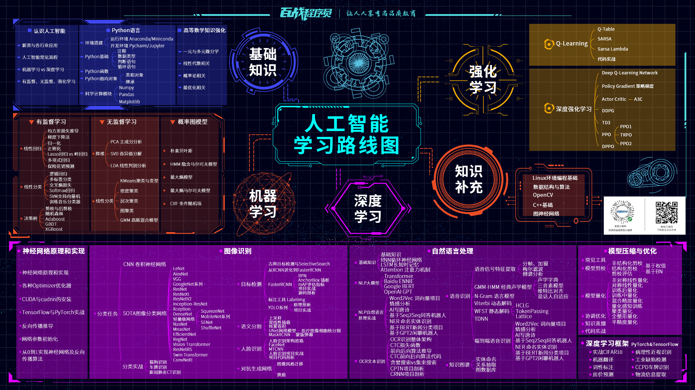

### 从0开始学人工智能，快速入门攻略大揭秘

随着人工智能技术的飞速发展，越来越多的人开始关注和学习人工智能。但对于初学者来说，人工智能的学习可能会感到困难和复杂。

那么，如何从零开始学习人工智能呢？下面就来分享一下快速入门攻略，帮助初学者快速掌握人工智能的基础知识。

-   了解人工智能的基本概念

在开始学习人工智能之前，首先需要了解人工智能的基本概念和定义。人工智能是指通过计算机技术实现类似于人类智能的能力，包括图像识别、自然语言处理等多个方面。掌握这些基本概念有助于初学者更好地理解人工智能的核心概念和技术。

-   学习编程语言

人工智能技术离不开编程语言，因此初学者需要掌握至少一门编程语言。Python是目前最流行的编程语言之一，也是人工智能领域中最常用的编程语言。初学者可以选择学习Python，并掌握Python的基本语法和编程思想。

-   学习机器学习和深度学习

机器学习和深度学习是人工智能领域中最核心的技术之一。机器学习是一种基于数据的方法，通过让机器从数据中学习模式和规律，来完成预测和决策等任务。深度学习是机器学习的一种特殊形式，通过构建深度神经网络来实现更加复杂的任务。初学者可以通过学习相关的课程，掌握机器学习和深度学习的基本原理和方法。

-   学习使用相关工具和框架

在实际应用中，人工智能技术离不开相关的工具和框架。例如，TensorFlow和PyTorch是目前最常用的深度学习框架，初学者可以学习使用这些工具和框架来进行人工智能的实践和应用。

-   实践和探索

学习人工智能最重要的是实践和探索。初学者可以通过完成相关的项目和练习，来深入理解人工智能的应用和技术。

