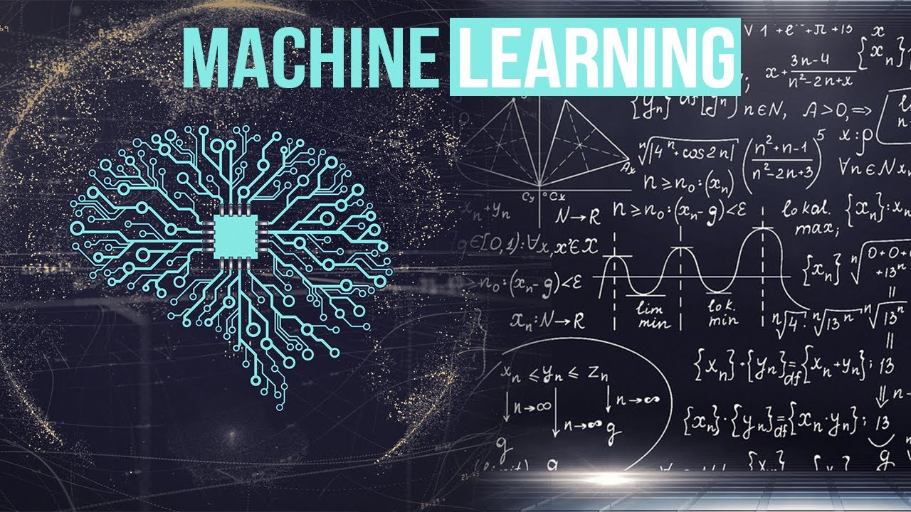

### 为什么暂时不讲数学推导

入门人工智能可以暂时不需要深入研究数学推导，是因为现代的人工智能技术已经非常成熟，提供了大量的高层次接口和工具，使得开发人员可以快速构建和部署机器学习模型，而无需对复杂的数学理论进行深入的推导。

例如，像TensorFlow和PyTorch这样的深度学习框架提供了一些高层次的API，这些API使得人们可以通过几行简单的代码构建深度学习模型，而无需了解背后的数学理论。此外，还有各种各样的自动化机器学习工具和云服务，它们可以帮助开发人员自动选择模型和参数，而无需对数学推导有深入的了解。

尽管如此，对于深入理解和创新，数学知识仍然是必不可少的。当你想要深入了解机器学习算法的运作原理、调试错误，优化算法等等时，数学推导是必须要了解的。因此，虽然不必在一开始就深入研究数学推导，但随着学习的深入，逐步掌握和理解数学知识是非常有益的。

然而，说是躲开了去学习一些数学知识，指的是不必大量时间系统的学习数学几门课。但是课程中还是会涉及到一点点数学计算的；

例如，在图像分类器中，你需要使用卷积神经网络（CNN）来处理图像。要了解CNN的工作原理，你需要了解卷积运算和池化运算，这些运算都涉及到线性代数中的矩阵乘法和微积分中的导数和偏导数。此外，你还需要了解激活函数、损失函数和优化算法等概念，这些概念同样涉及到微积分和概率论的知识。

因此，尽管你可以使用现成的高层次API来构建图像分类器，但如果你想要深入了解其背后的原理，你需要学习一些数学知识。通过理解这些数学概念，你可以更好地理解机器学习算法的工作原理，并且可以对算法进行优化和改进。