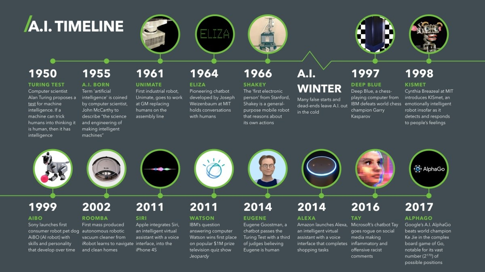
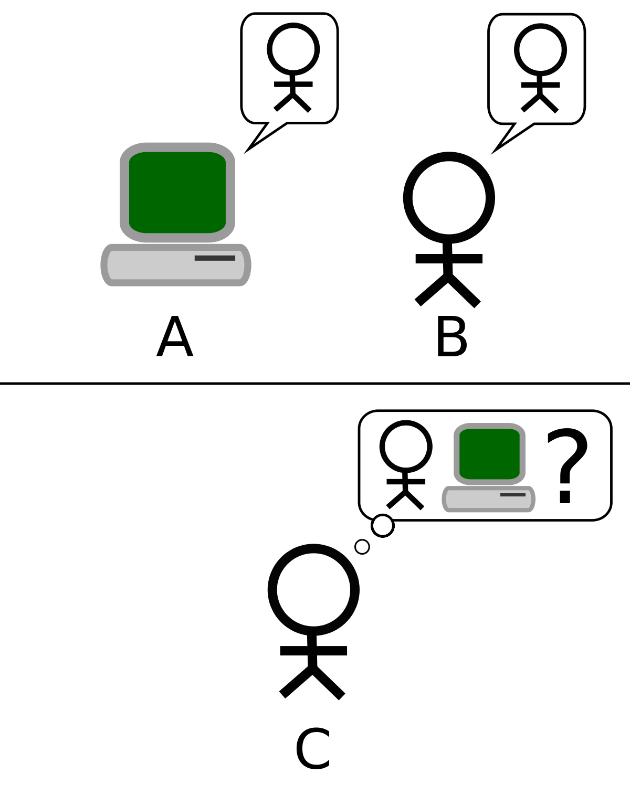
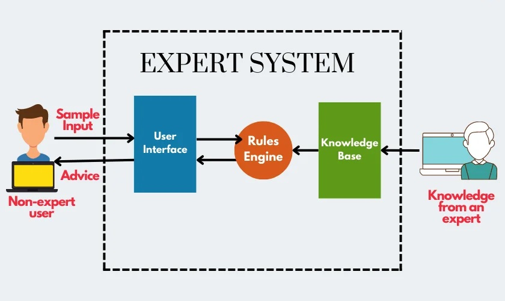
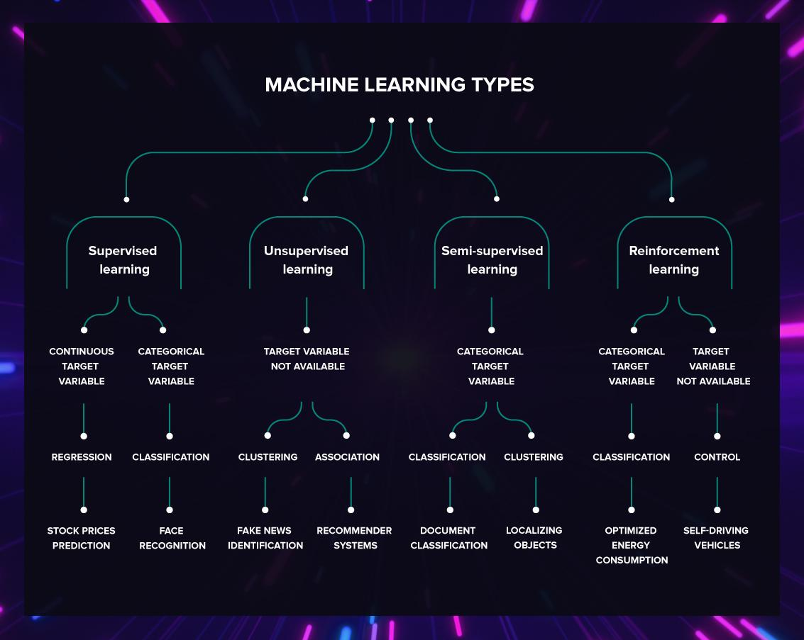
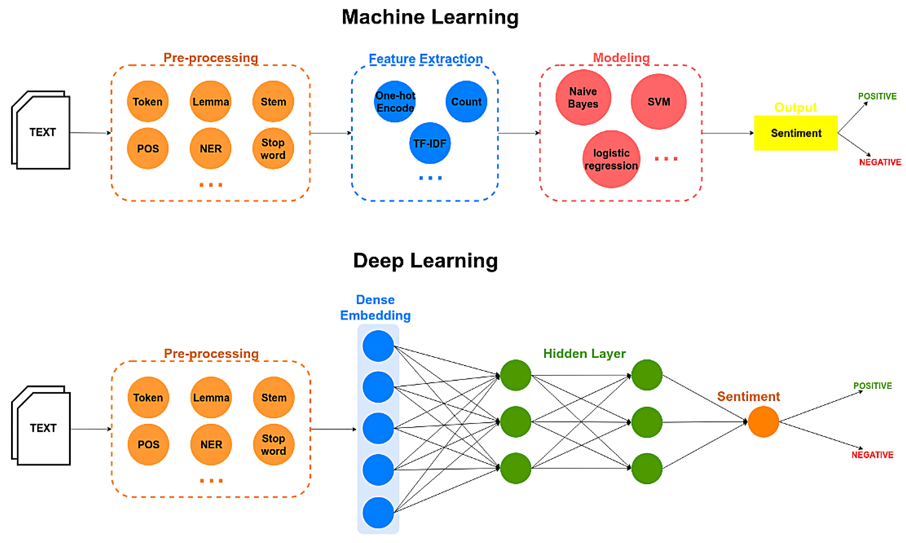
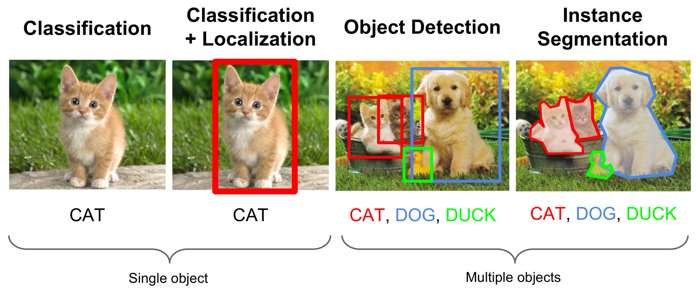
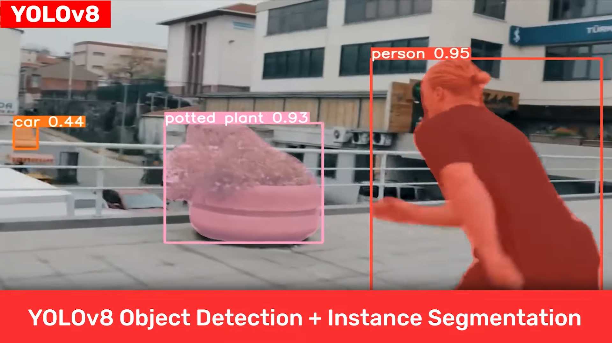
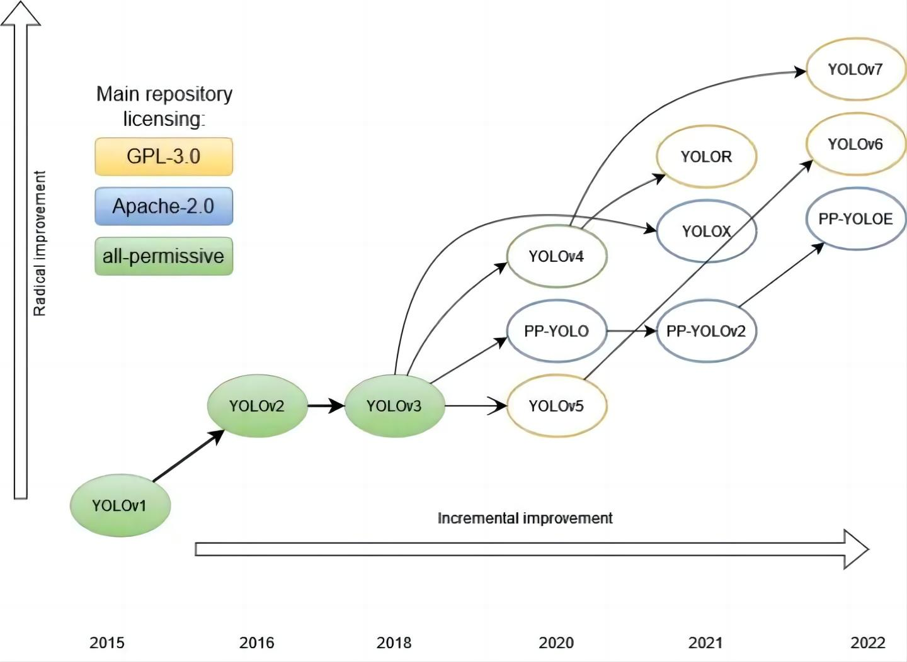
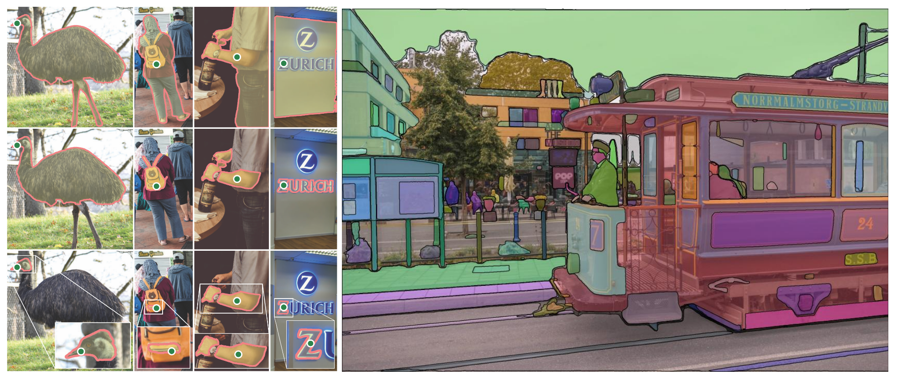
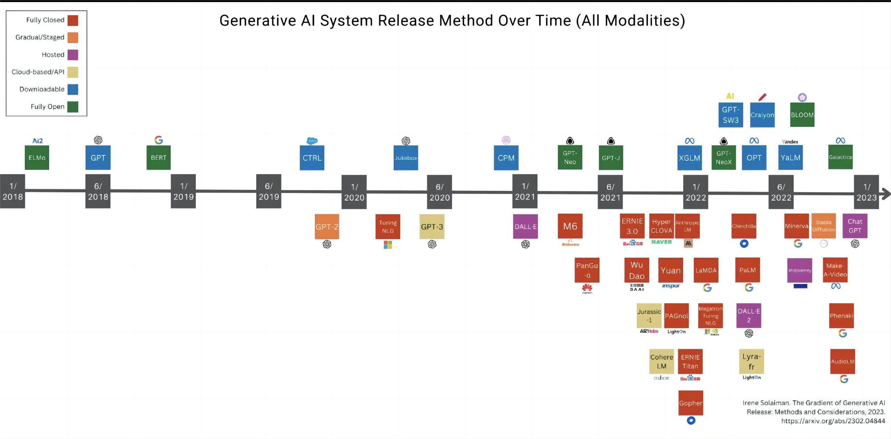

### 从图灵测试到ChatGPT

- 人工智能（AI）是指计算机模拟人类智能的一种技术
- 早期的AI技术主要是基于规则的专家系统，难以应对复杂的任务和环境
- 随着机器学习和深度学习的兴起，AI取得了巨大的突破

**图灵测试**

图灵测试计算机科学家阿兰·图灵为机器智能提出的一个测试，如果机器可以让人认为它是个人，那么它就算是具有智能了。

**专家系统**

- 专家系统是早期的AI技术之一，基于一系列的规则和知识库进行推理和决策
- 专家系统的局限性在于需要手动编写规则和知识库，难以应对复杂的任务和环境

**机器学习**

- 机器学习是指让计算机通过大量数据和算法来自动学习和改进
- 机器学习的三种主要类型包括监督学习、无监督学习和强化学习
- 机器学习的应用包括图像识别、自然语言处理、语音识别等领域

**深度学习**

- 深度学习是机器学习的一种技术，通过多层神经网络来提高学习能力和性能
- 深度学习的应用包括计算机视觉、自然语言处理、语音识别等领域
- 深度学习的成功主要得益于计算能力的提升和数据量的增加

**图像识别**

**YOLO系列**

**Segment Anything Model**

**GPT系列**

- GPT（Generative Pre-trained Transformer）系列是一系列基于Transformer架构的预训练语言模型
- GPT系列的目标是学习自然语言的概率分布，从而能够生成具有语言连贯性的文本
- GPT-3是当前最大、最先进的预训练语言模型之一，具有惊人的语言生成能力和智能问答能力

**ChatGPT**

- ChatGPT是基于GPT系列的技术，用于生成自然语言对话
- ChatGPT可以通过学习大量对话数据和对话模式来模拟人类对话