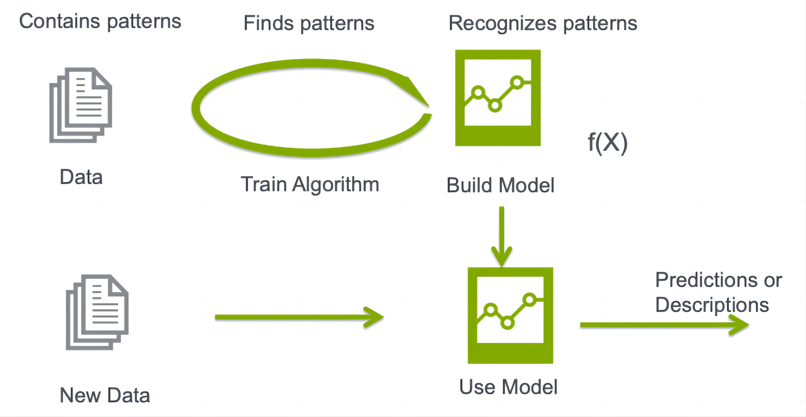
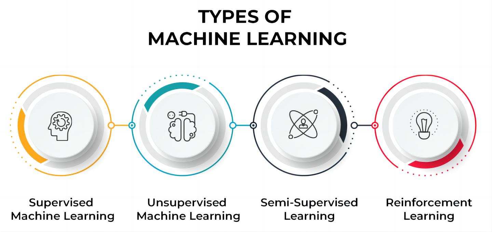
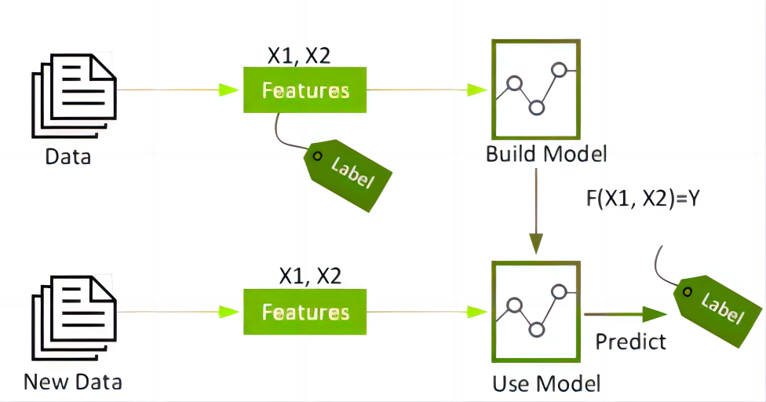
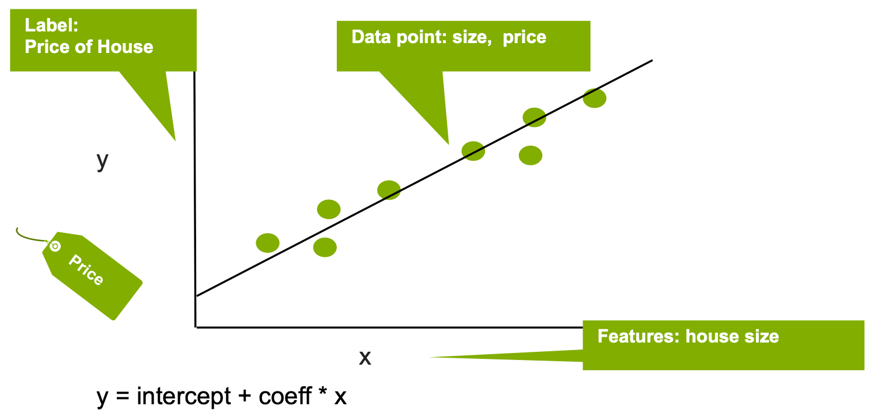
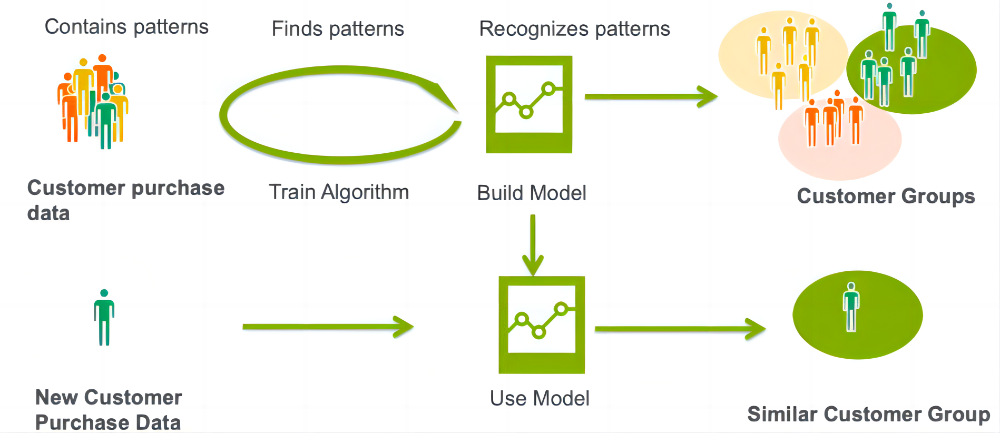

### 机器学习是如何实现自动化决策的？

机器学习 （ML） 采用算法和统计模型，使计算机系统能够在大量数据中找到模式，然后使用识别这些模式的模型对新数据进行预测或描述。

用最简单的术语来说，机器学习训练机器学习，而无需明确编程如何学习。作为人工智能的一个子集，机器学习以其最基本的形式使用算法来解析数据，从中学习，然后对现实世界中的某些事物做出预测或决定。

换句话说，机器学习使用算法从输入机器学习平台的数据自主创建模型。典型的编程或基于规则的系统捕获专家在编程规则方面的知识，但是当数据发生变化时，这些规则可能变得难以更新和维护。机器学习的优势在于能够从输入算法的越来越多的数据中学习，并且可以提供数据驱动的概率预测。

机器学习采用两种主要技术，将算法的使用分为不同的类型：有监督的、无监督的和这两者的混合。

监督学习算法使用标记数据，监督式机器学习（也称为预测分析）使用算法来训练模型，以在具有标签和特征的数据集中查找模式。然后，它使用经过训练的模型来预测新数据集特征上的标签。

监督学习可以进一步分为分类和回归。分类根据已知物料的标记示例标识物料所属的类别。在下面的简单示例中，逻辑回归用于根据已知欺诈性或非欺诈性的交易特征（交易金额、时间和上次交易的位置）估计信用卡交易是否欺诈的概率（标签）。

回归估计目标结果标签与一个或多个特征变量之间的关系，以预测连续数值。在下面的简单示例中，线性回归用于根据房屋大小（特征）估计房价（标签）。

无监督学习算法在未标记数据中查找模式。在聚类分析中，算法通过分析输入示例之间的相似性将输入分类。集群的一个例子是，一家公司希望细分其客户，以便更好地定制产品和产品。可以根据人口统计和购买历史记录等功能对客户进行分组。无监督学习的聚类通常与监督学习相结合，以获得更有价值的结果。

半监督学习使用标记和未标记数据的混合。

强化学习训练算法，以根据反馈最大化奖励。

