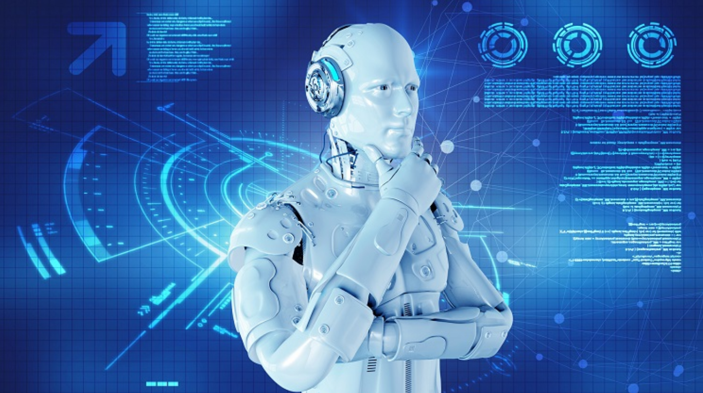
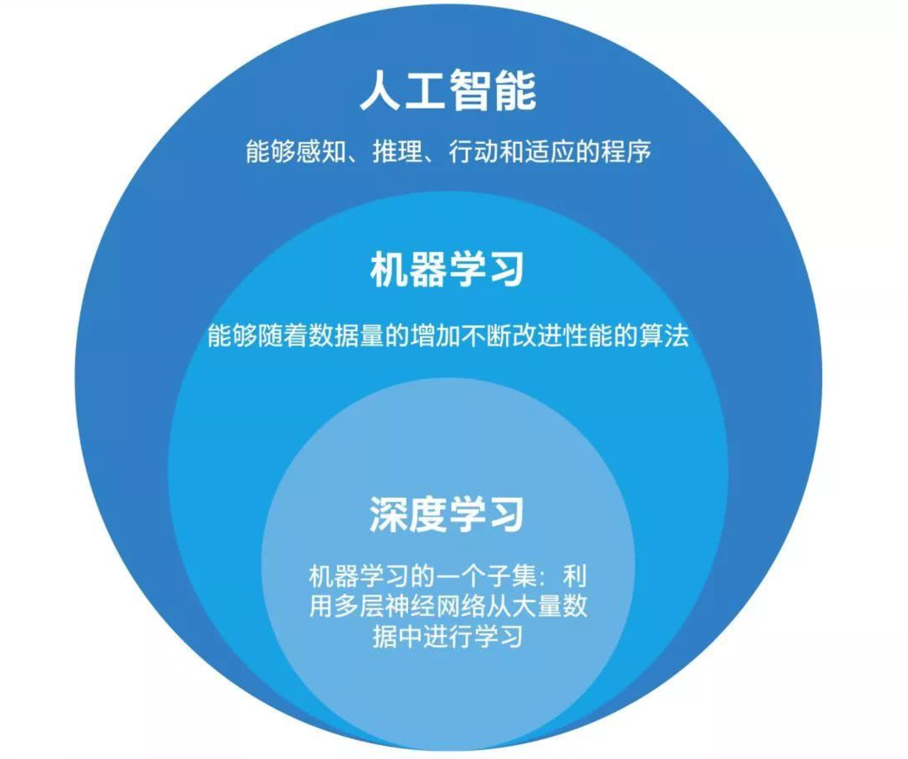
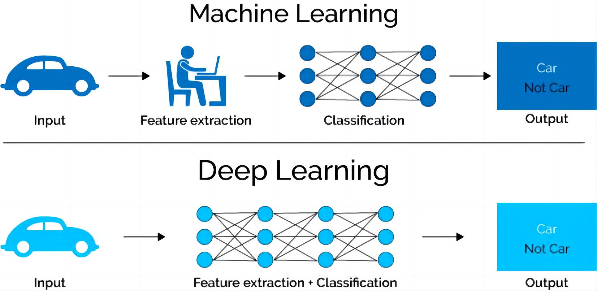
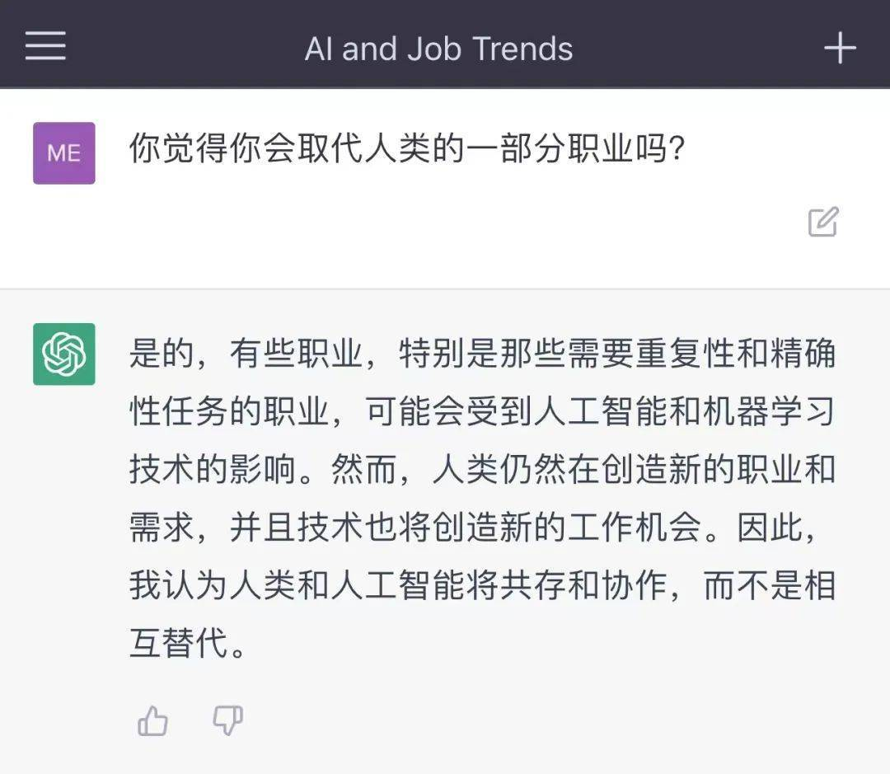
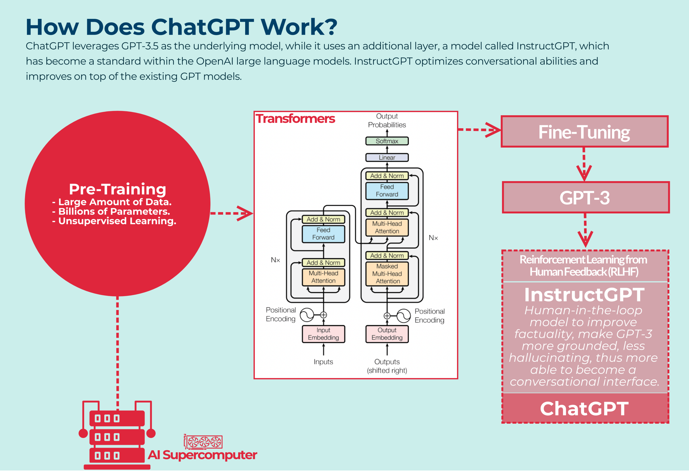

### 深度学习

大家都知道人工智能AI也就是让机器的行为看起来像是人所表现出来的智慧行为一样，那我们怎么才能做到让机器行为看起来像是人一样的呢？

你会最常听到的就是机器学习和深度学习，首先我们先搞懂它们的关系是什么？我们可以利用同心圆来帮助我们理解，

AI是最外面的那个大圆，机器学习是中圆，深度学习会是小圆。

也就是说机器学习跟深度学习的关系是，深度学习是机器学习的一部分，机器学习和深度学习都只是人工智能AI的一部分而已；

不管是机器学习还是深度学习都是学习大量的数据，找出来数据中蕴含的模式，学习到的模式Pattern对应就是训练好的神经网络；

机器学习的年代还需要一些人工进行前期的数据预处理，到了深度学习的年代则是如何做数据预处理也作为神经网络算法需要去学习的一部分内容！

时至今日，深度学习已经称为AI界的主流，近十年人工智能火热也是得益于深度学习的突飞猛进，

比如大家熟知的下围棋的AlphaGO，深度学习+强化学习

ChatGPT，深度学习+NLP

无人驾驶，深度学习+图像识别

