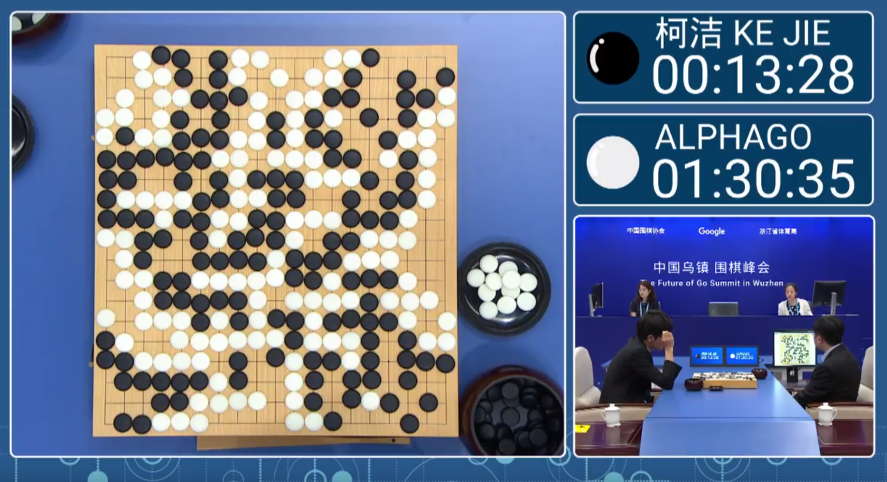
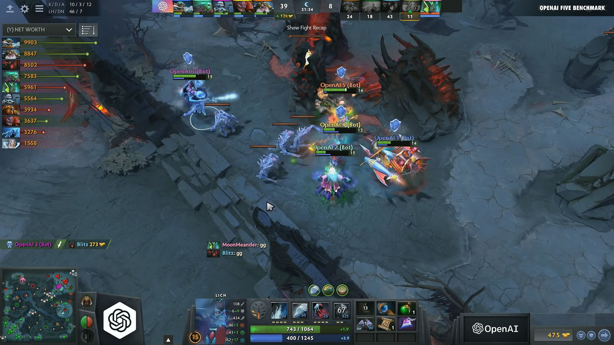

### 强化学习

最早开始关注强化学习是在 2016 年 3 月，韩国围棋高手李世石与 Google DeepMind团队开发AlphaGo 经过一番激战，以 1：4 的比分落败，被认为是人工智能历史上的一次里程碑事件，

这让大家开始认识到强化学习+深度学习的能力，俗称为深度强化学习。

后来又在2017年5月27日，最后一次击败了世界第一的柯洁，这次在乌镇依然没能带来一场胜利，最终以0：3 败给升级版的阿老师（AlphaGo）

其实强化学习在很多领域都有应用：

Atari游戏，经过几小时的训练，学到了好的策略去完成游戏

OPEN AI Bot Five 打 Dota2，击败顶级职业选手（OpenAI的强化学习bot在中路solo中击败职业选手Dendi）

自动驾驶，比如下图展示的是，训练30小时后，AI agent在模拟环境中学习到了最优的行为策略

火遍全球的ChatGPT训练也用到强化学习，

机器人，波士顿狗，从走路都不会，通过强化学习不断探索完成各种高难度动作

OpenAI 捉迷藏，学会2v2躲避策略，比如把门给堵上了

AI打王者荣耀，腾讯 AI Lab 开发的策略协作型“绝悟”，最强 AI 分分教你做人。

深度学习和强化学习方法训练机器人，可以使其能够抓取各种物体，甚至是训练中未出现过的物体。因此，可将其用于装配线上产品的制造。

针对抓取任务，谷歌AI用了4个月时间，使用7个机器人运行了800小时。

实验表明，在700次实验中，QT-Opt方法有96%的概率成功抓取陌生的物体，而之前的方法仅有78%的成功率。

作为 DARPA 的 AlphaDogfight 试验 (ADT) 的参与者，洛克希德马丁公司开发了一种基于强化学习的 F-16 自动驾驶仪飞行员，最终取得了最佳成绩。

### 最后

强化学习是一个非常有趣且值得广泛研究的领域，RL技术的进步及其在现实各领域的应用势必将取得更大的成功。这里介绍了强化学习是什么以及可以去做什么，希望这能激发起你的好奇心，并引起你对RL的热爱和研究。