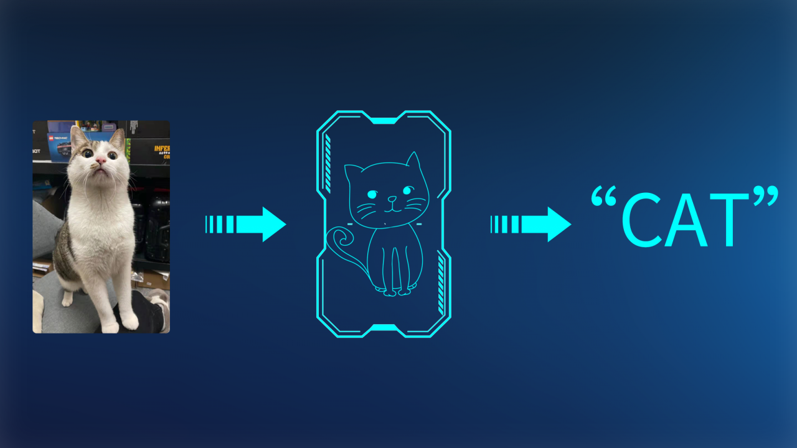
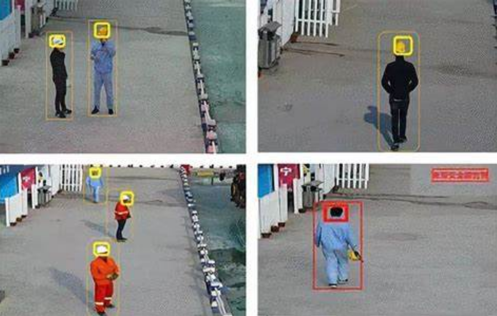
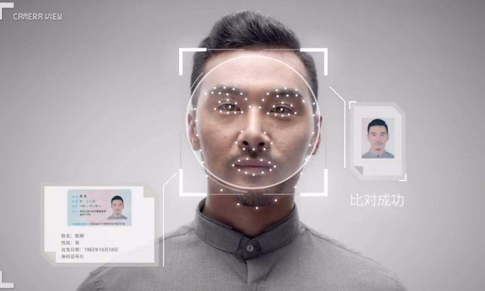
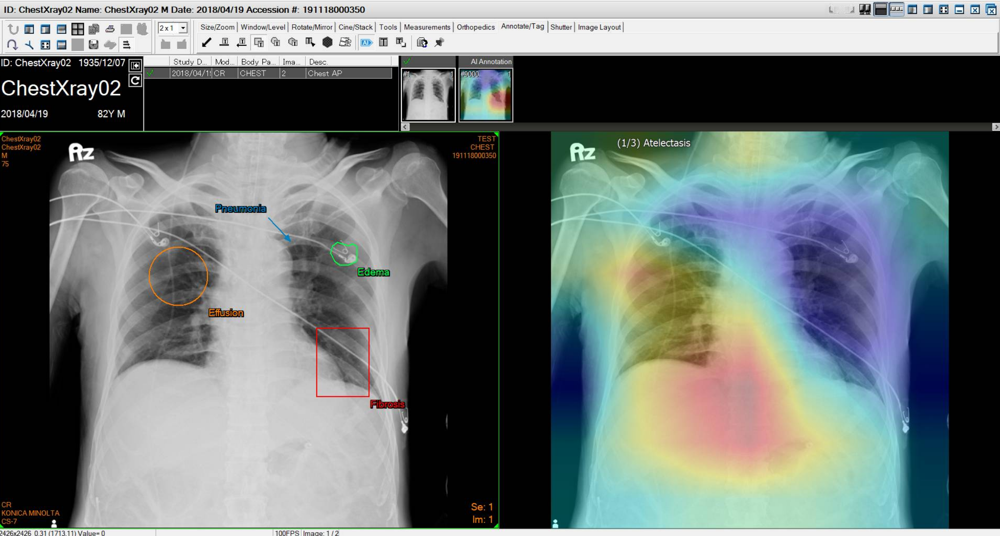
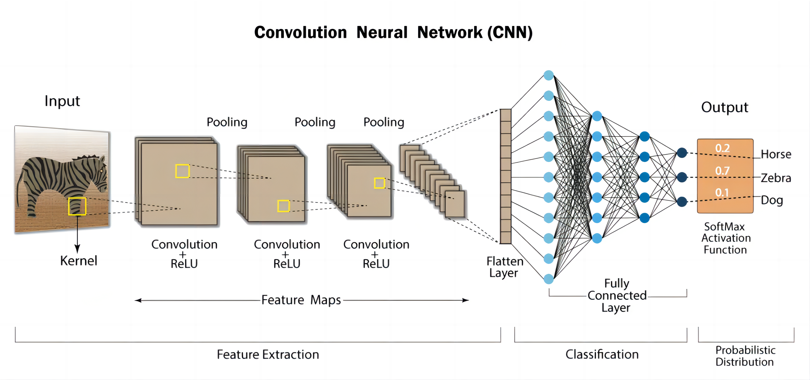
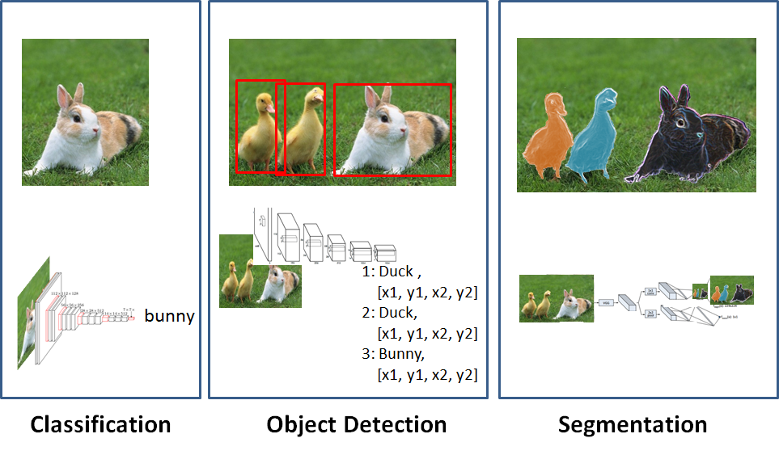
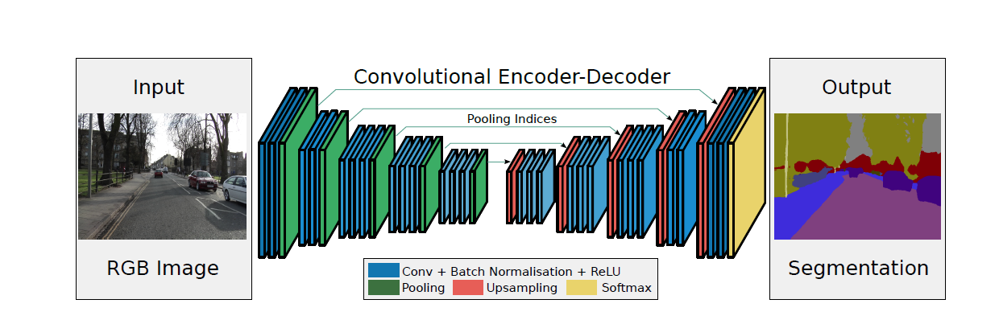

### 图像识别：如何让机器“看”懂世界

图像识别是让机器“看”懂世界的一种能力，也被称为计算机视觉。图像识别技术的目的是使计算机能够理解和分析图像，并根据图像的内容进行分类、识别和标记。

<figure>    </figure>

图像识别技术在许多应用中都有重要的作用，如自动驾驶、智能监控、人脸识别、医学图像识别等。

图像识别的背后是深度学习和卷积神经网络（CNN）这些先进的人工智能技术。

CNN是一种专门用于处理图像的神经网络结构，它可以从输入的数字图像中提取出图像的特征。具体来说，CNN通过多次卷积运算和池化运算来对图像进行处理，从而识别出图像中的不同部分。卷积运算可以提取出图像中的局部特征，池化运算可以将图像的分辨率降低，减少计算量和内存占用。

在CNN中，还会使用一些激活函数、损失函数和优化算法等技术来提高图像识别的准确性和效率。激活函数用于在神经网络中引入非线性，损失函数用于度量神经网络的预测结果与真实结果之间的差异，优化算法用于调整神经网络的参数，以提高预测准确性。

当一个CNN模型经过训练之后，它就可以对新的数字图像进行分类和识别。具体来说，当一个数字图像被输入到CNN模型中时，模型会通过多次卷积和池化运算提取出图像的特征，并将这些特征输入到全连接层中进行分类。最终，模型会输出一个概率分布，表示该图像属于不同类别的概率大小。

总的来说，图像识别背后的秘密是通过使用深度学习和CNN这些先进的人工智能技术，让机器学会从数字图像中提取特征，并将这些特征用于分类和识别。

