### 自然语言处理：探索机器语言的魅力，让机器能够理解你的言语和心思！

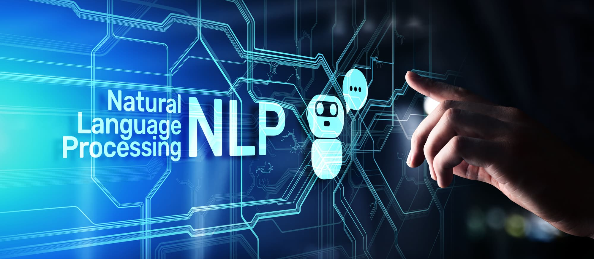

自然语言处理（Natural Language Processing，简称NLP）是一种人工智能技术，它可以让机器能够理解和处理自然语言，也就是人们日常生活中使用的语言。

在NLP中，机器需要经过多个步骤来理解自然语言。这些步骤包括文本分词、词性标注、命名实体识别、句法分析和语义分析等。下面我来简单介绍一下这些步骤的含义和作用。

1.  文本分词：将一段文本分割成若干个词语或符号，也就是对文本进行分词。分词是NLP的基础工作，因为自然语言中的句子是由一个个词语组成的，只有将句子分成单独的词语，机器才能够理解其含义。

    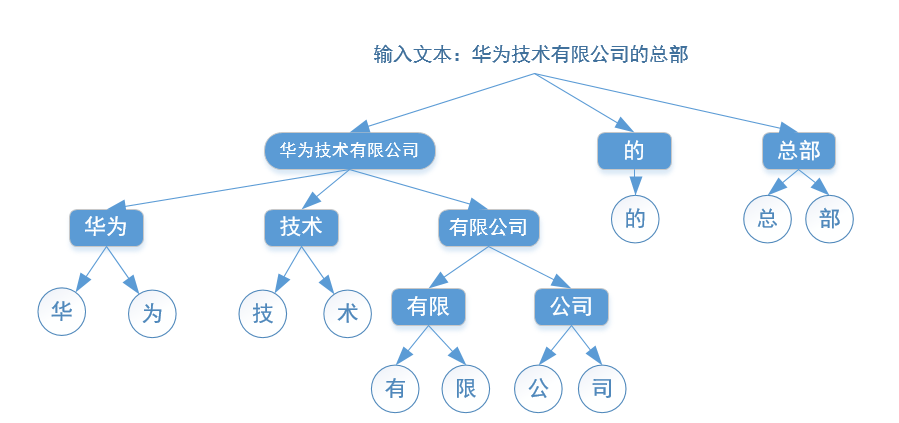

2.  词性标注：给每个词语标注其词性。词性标注的作用是帮助机器理解每个词语在句子中的作用，从而更好地理解句子的含义。

    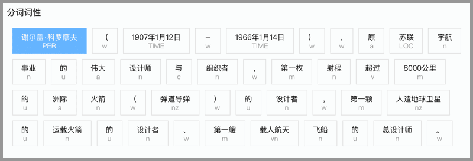

3.  命名实体识别：识别出文本中的人名、地名、组织机构名等命名实体。命名实体识别的作用是让机器能够识别出文本中的重要信息，从而更好地理解文本的含义。

    

4.  句法分析：分析句子中各个成分之间的关系。句法分析的作用是帮助机器理解句子的结构，从而更好地理解句子的含义。

    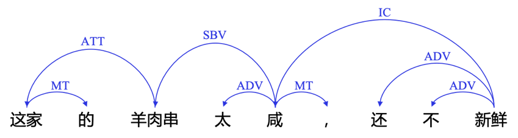

5.  语义分析：分析句子的语义，即句子的意思。语义分析的作用是让机器能够理解句子的真正含义，从而更好地处理和回答用户的问题。

除了上述提到的文本分词、词性标注、命名实体识别、句法分析和语义分析等步骤外，自然语言处理还包括以下一些重要的技术和应用：

1.  文本分类：将文本分为不同的类别。例如，对新闻文章进行分类，可以将其分为政治、体育、财经等类别。

    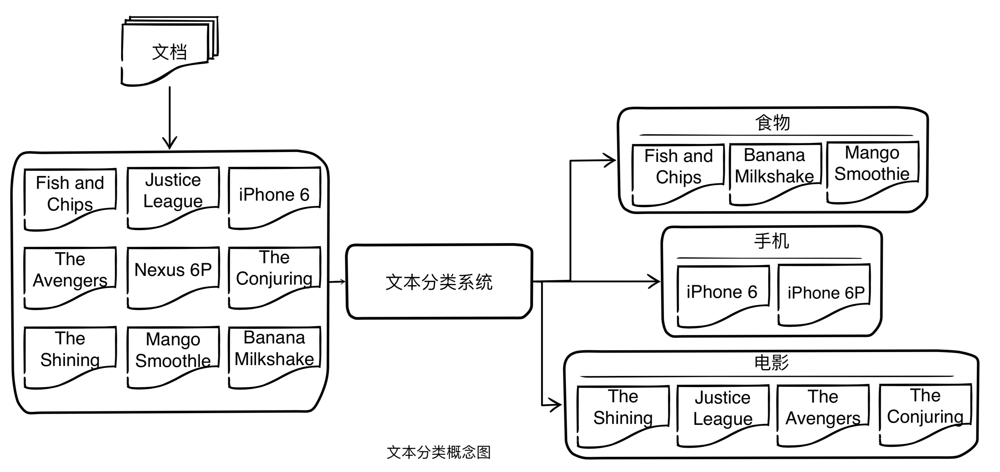

2.  文本聚类：将文本按照相似性进行分组。例如，将新闻文章按照主题进行聚类，可以将所有与体育有关的文章放在一起。

    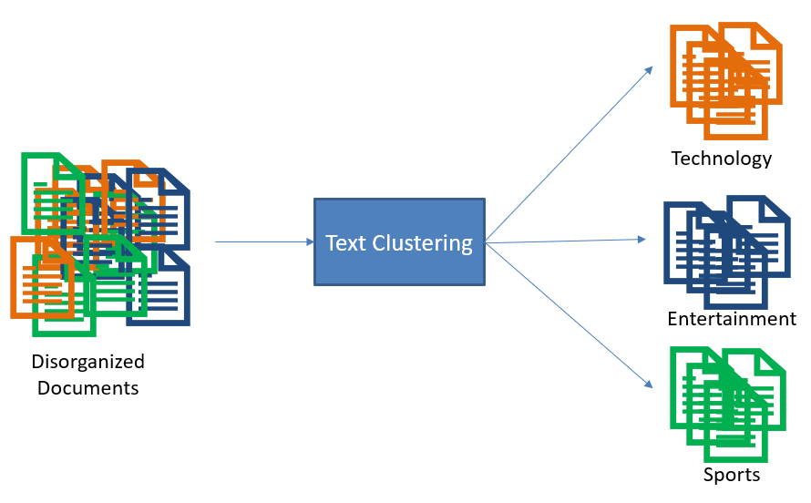

3.  情感分析：分析文本中的情感倾向，例如正面、中性或负面情感。情感分析可以用于监测社交媒体上的舆情或评估产品或服务的用户体验。

    

    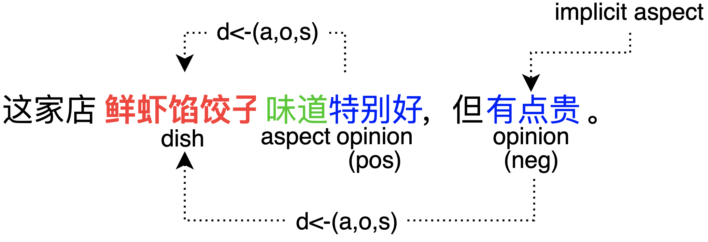

4.  文本摘要：将长篇文本压缩成简短的摘要。文本摘要可以用于自动化撰写新闻报道或简化用户手册等。

    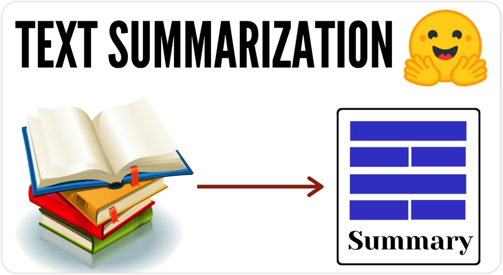

5.  机器翻译：将一种语言翻译成另一种语言。机器翻译是自然语言处理的重要应用之一，可以用于跨语言交流和全球化业务。

    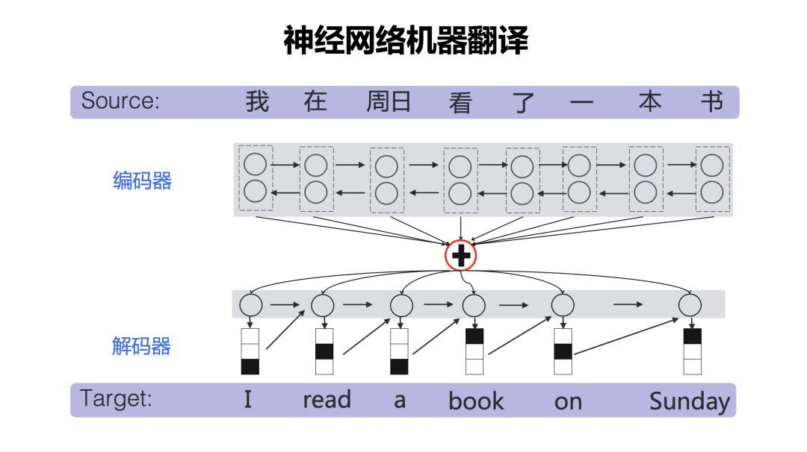

6.  智能问答：根据用户提出的问题，自动回答相关问题。智能问答是自然语言处理的应用之一，可以用于帮助用户解决问题或提供信息。

    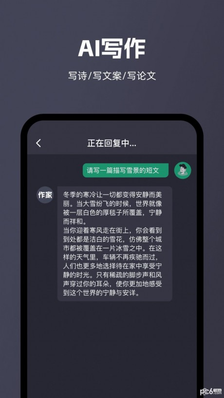

总的来说，自然语言处理是一种非常广泛应用的人工智能技术，它可以帮助机器理解自然语言，从而实现各种应用，例如机器翻译、智能客服、智能问答等。

RNN循环神经网络

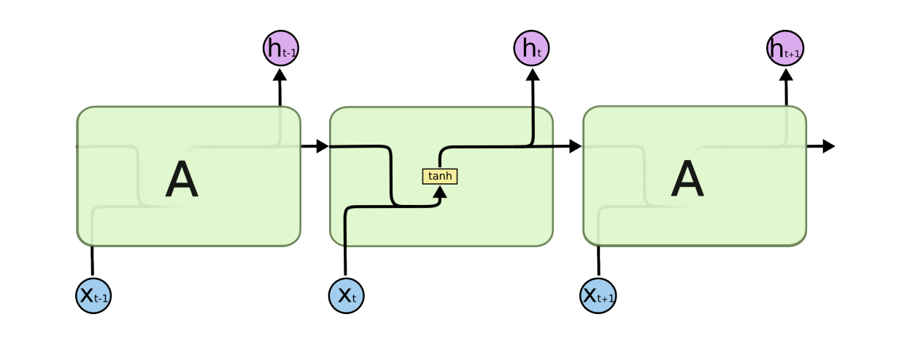

LSTM长短时记忆

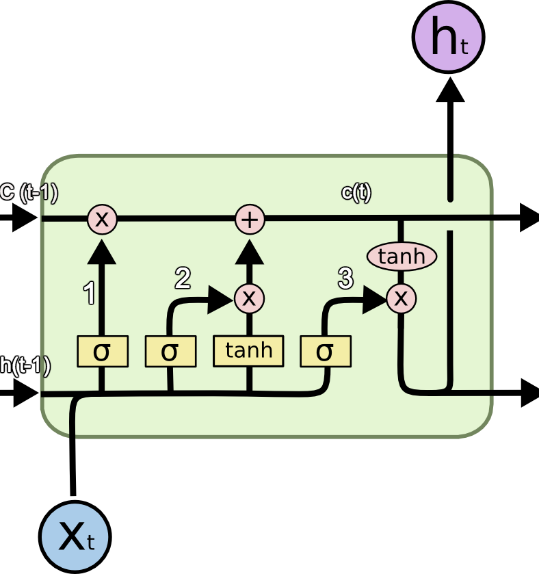

Seq2Seq

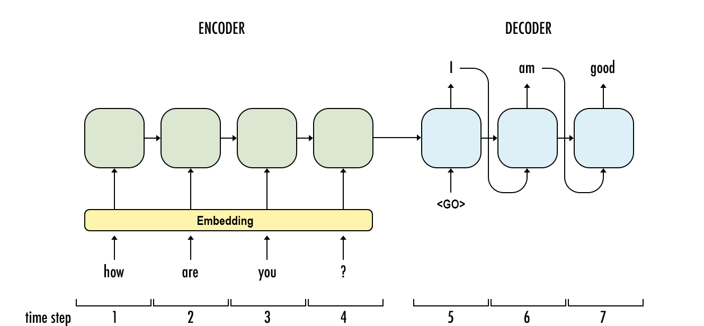

Attention注意力机制

Transformer

Bert GPT

