### Python开发环境


https://www.jetbrains.com/pycharm/


**第一步：下载与安装**

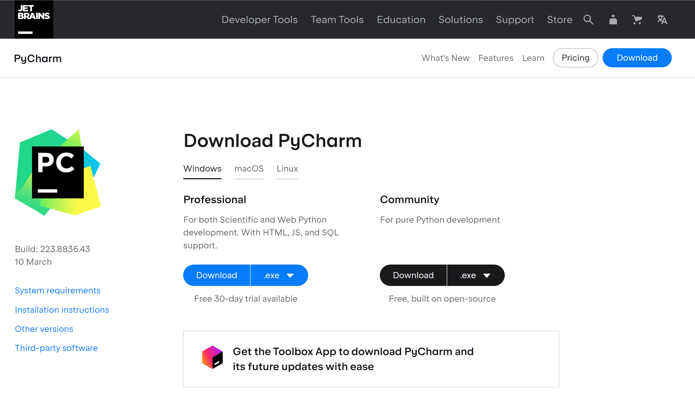

<center class="half">
    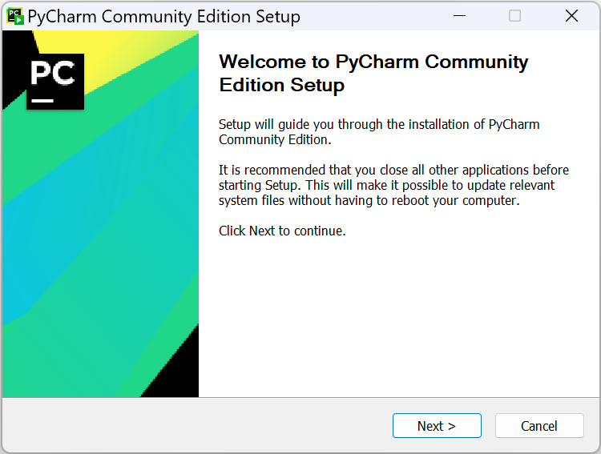
    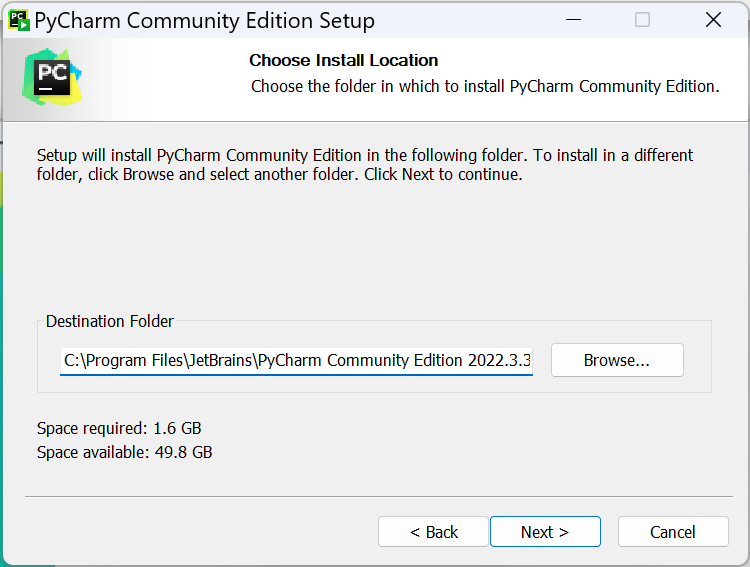
</center>

<center class="half">
    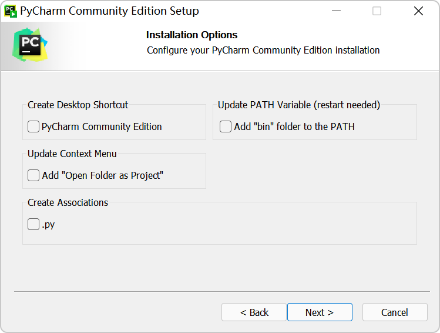
    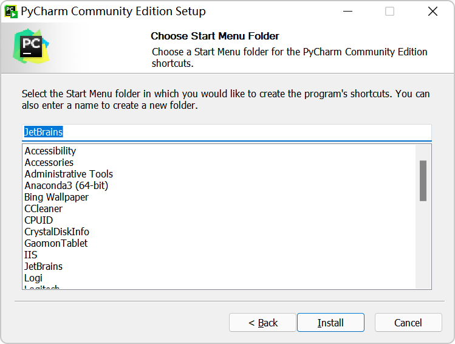
</center>


**第二步：创建项目并关联已有环境**

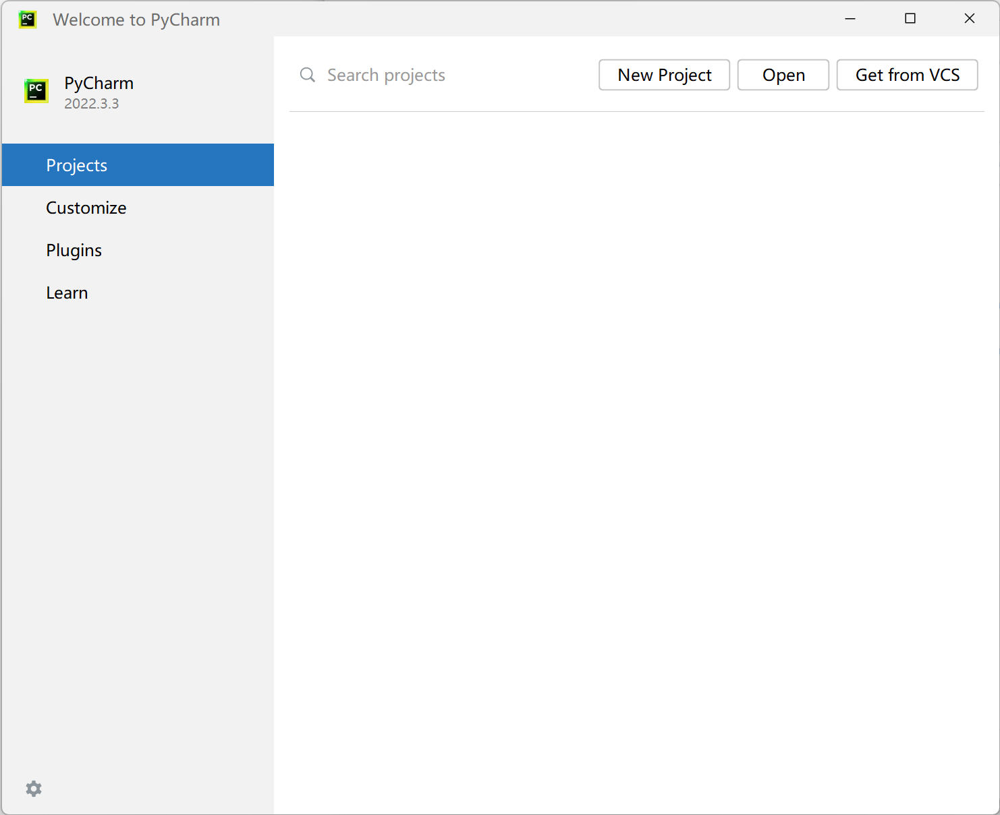

关于此项目的代码都将放在Location路径下，下图中三个点有可能是"Add Interpreter"

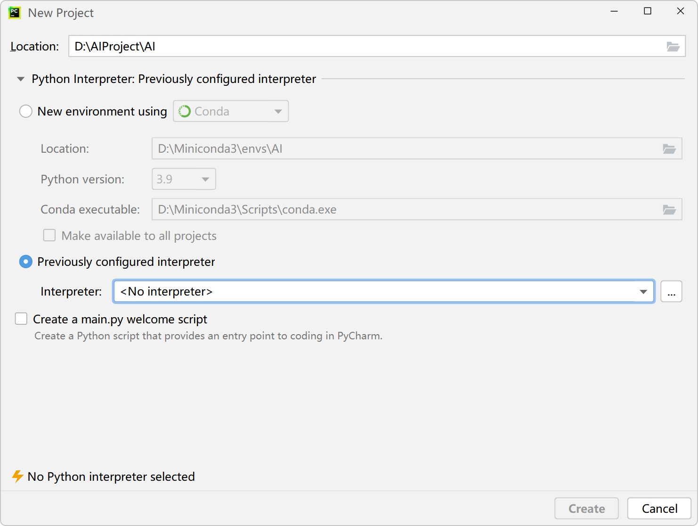

找到conda.exe后不要忘了点击一些右侧按钮"Load Environments"

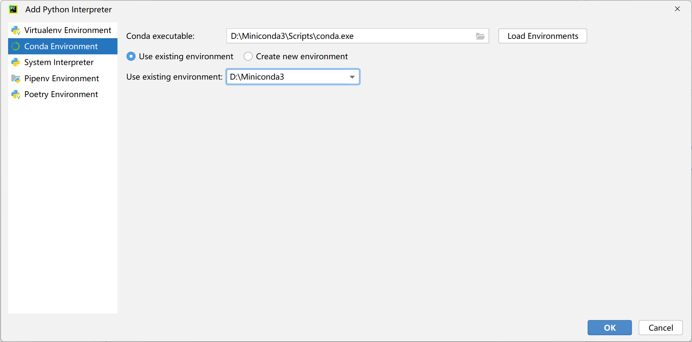

如果是PyCharm老版本，

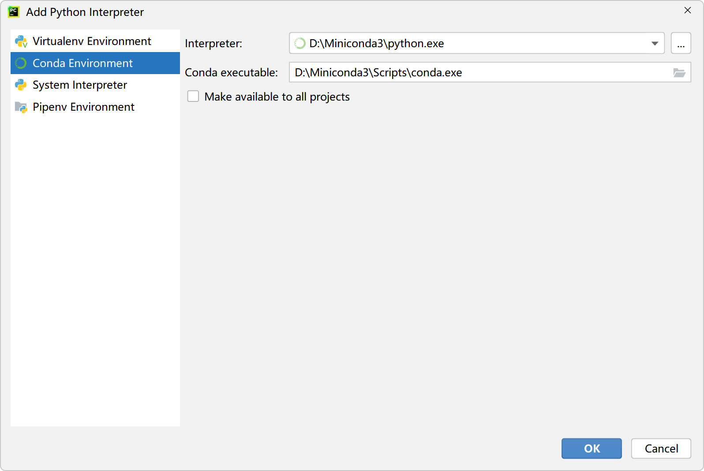

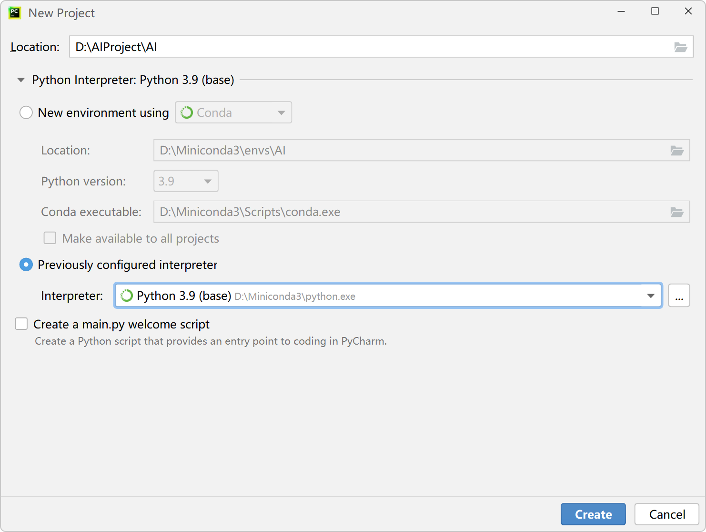

点击"create"创建项目后，如果想切换Python项目的运行环境，可以如下操作即可


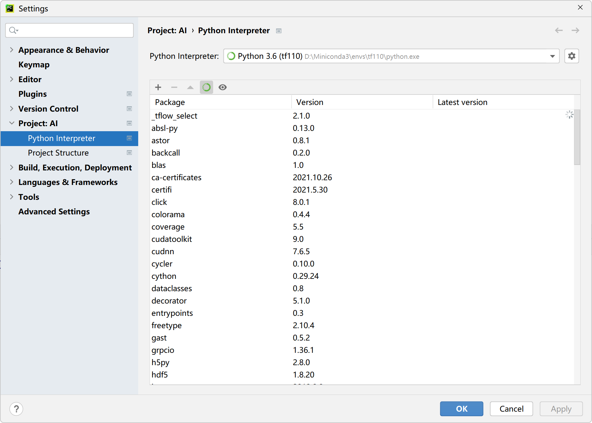

如果是老版本是否可以升级到最新版本，而无需下载呢？两种方式

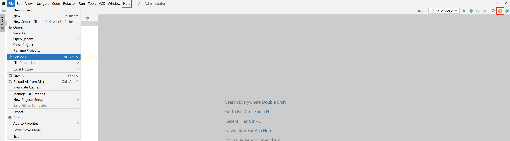


**第三步：创建项目下的python脚本**

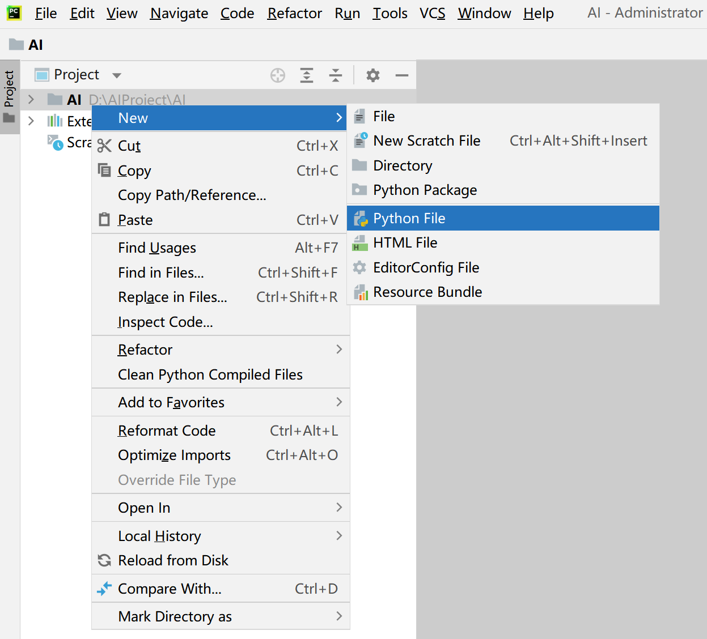

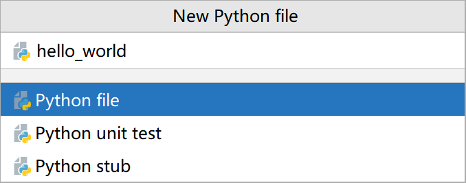


**第四步：编写代码**

```python
print("hello world! ")
```


**第五步：执行代码**


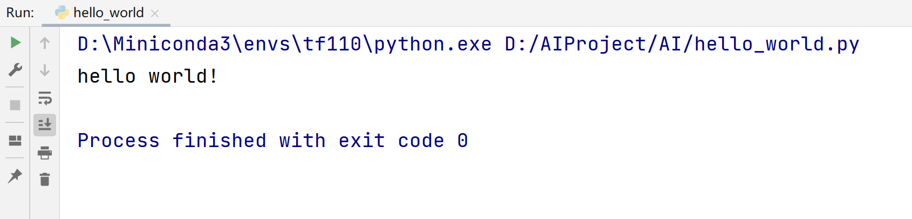


### PyCharm快捷键

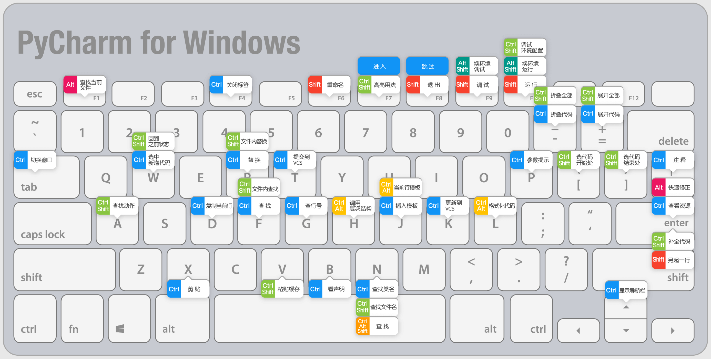