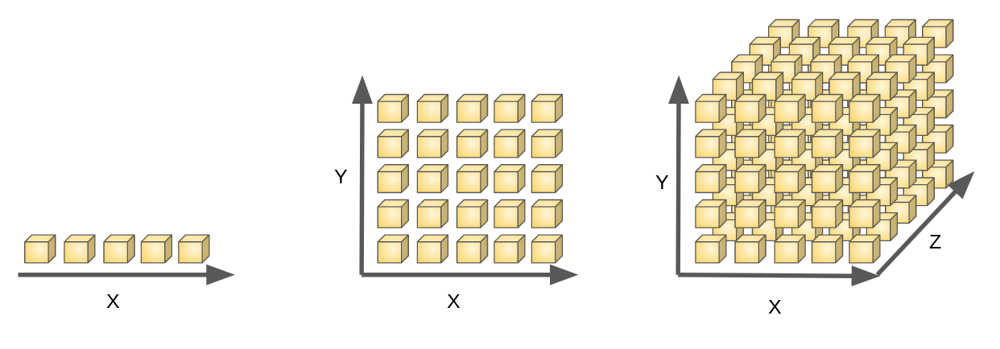
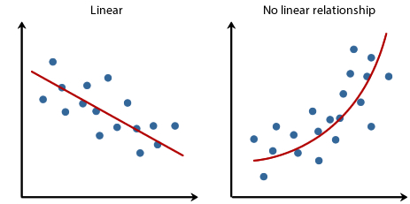
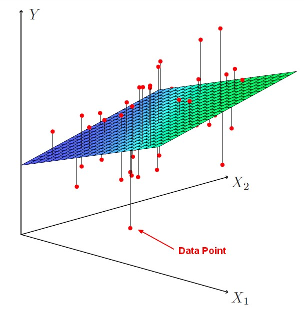

# 多元线性回归

根据历史数据训练模型，未来预测具体数值的任务就是回归任务，

1.  股票价格预测
2.  房价预测（影响因素：房屋的面积、卧室数量、浴室数量、车库数量等等）
3.  销售量预测
4.  贷款违约率预测

**多元线性回归**就是众多回归算法中的一个，也是最基础的一个

### 何为多元？多个维度 multi dimensionality

更高的维度很难绘制出来；不过我们可以思考一下我们生活的世界是几维空间？

其实随时随地都能在脑海种构建一个多维空间。比如，房屋的售价取决于很多因素，比如房屋的面积、卧室数量、浴室数量、车库数量等等。

### 何为线性？二维空间：直线

三维空间：平面

更高维度空间中呈现出来的"线性体"，我们统称为超平面hyper plane；

### 何为回归？回归其实就是拟合

二维世界的一元线性回归：下图左

二维世界的一元非线性回归：下图右

三维世界的线性回归：

三维世界的非线性回归：

>   综上所述，多元线性回归顾名思义就是，在多元世界（多维空间）中使用线性体（直线、平面、超平面）对已有数据点进行拟合的一种方式方法（算法or函数）！

### 线性回归公式（算法表达式）

一元线性回归
$$
\hat{Y}=w_0+w_1x_1
$$
多元线性回归
$$
\hat{Y}=w_0+w_1x_1+w_2x_2+\ldots+w_nx_n
$$

### 何时使用线性回归？

1.  如果我们知道我们的数据$X={x_1\ldots x_n}$和$Y$大致是成线性变换关系的，当然使用线性回归算法显然是合适的！
2.  只要我们假设$X={x_1\ldots x_n}$和$Y$是成线性变换的，就可以尝试去使用线性回归算法去拟合，万一合适呢？

### 使用几元线性回归？

使用几元线性回归决定了我们使用什么样的公式

这个由数据决定，数据$X={x_1\ldots x_n}$中的$n$将决定了是几维空间中的回归任务

### 如何求解算法模型

根据数据我们知道是使用一元线性回归还是多元线性回归，

然后我们可以把数据中的$X={x_1\ldots x_n}$带入到算法公式中，
$$
\hat{Y}=w_0+w_1x_1+w_2x_2+\ldots+w_nx_n
$$
而我们的数据中有没有$Y$呢？必须有的，所以我们可以计算真实值$Y$和预测值$\hat{Y}$之间的均方差(Mean Squared Error)，

这是回归任务最常用的损失函数
$$
MSE=\frac{1}{m}\sum_{i=1}^{m}(Y_i-\hat{Y_i})^2
$$
不同的算法模型（公式参数）有不同的损失值，

我们需要计算机不断调整参数最后找出来最优解参数（最佳模型）

