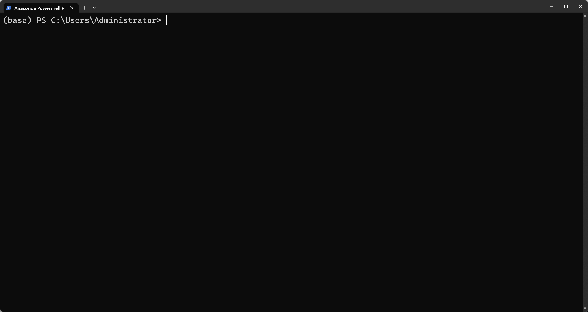

# 项目实战：糖尿病回归预测

首先在所使用的python环境中，



安装封装了机器学习算法库的python模块scikit-learn

`pip install scikit-learn`

接着就可以创建脚本，书写代码

```python
from sklearn import datasets
from sklearn.linear_model import LinearRegression
from sklearn.model_selection import train_test_split
from sklearn.metrics import mean_squared_error

# 加载糖尿病数据集
diabetes = datasets.load_diabetes()

# 将数据集拆分为训练集和测试集
X_train, X_test, y_train, y_test = train_test_split(diabetes.data, diabetes.target, test_size=0.2, random_state=0)

# 创建一个线性回归对象
lr = LinearRegression()

# 使用训练集训练模型
lr.fit(X_train, y_train)

# 对测试集进行预测
y_pred = lr.predict(X_test)

# 打印模型的均方误差
print("均方误差: %.2f" % mean_squared_error(y_test, y_pred))
```

我们首先从scikit-learn的内置数据集中加载糖尿病数据集。

然后，我们使用`train_test_split()`将数据集拆分为训练集和测试集。

接下来，我们创建一个`LinearRegression`对象，并使用训练数据集使用`fit()`方法训练模型。

我们使用`predict()`方法在测试集上进行预测，并使用scikit-learn的`metrics`模块中的`mean_squared_error()`函数计算模型的均方误差。

最后，我们打印出均方误差。