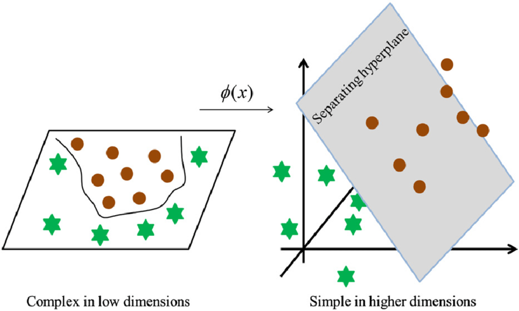

# 逻辑回归

大家千万不要被逻辑回归的名字所迷惑，其实logistic regression 并不是回归任务的算法，而是属于分类任务算法。

根据历史数据训练模型，未来预测样本属于哪一个类别的任务就是分类任务，

1.  垃圾邮件分类
2.  情感分析
3.  图像识别
4.  信用卡欺诈检测
5.  疾病诊断
6.  金融欺诈检测

### 逻辑回归是分类算法，为何名字中有回归二字？

我们知道回归是去拟合，而分类是找到类别之间的分界，可以是分界线，也可以是分界面；可以是线性的分界，也可以是非线性的分界。

逻辑回归算法的本质，其实是要通过数据（data）回归（拟合）出来分界！

### 逻辑回归算法表达式

$$
\hat{Y}=\frac{1}{1+e^{-(w_0+w_1x_1+w_2x_2+\ldots+w_nx_n)}}
$$

看到这个算法表达式，你不禁会想到多元线性回归，对么？
$$
z= w_0+w_1x_1+w_2x_2+\ldots+w_nx_n
\\ \hat{Y}=\frac{1}{1+e^{-z}}
$$
用下图来理解这里的算法表达式：

一个$S$型曲线（Sigmoid函数），将线性回归的值压缩到了0到1之间，这样就具备了概率含义；

而概率值大于0.5我们认为样本是正例，反之我们认为样本是负例，这样逻辑回归创建之初就是做二分类任务用的。

### 如何求解算法模型

我们可以把数据中的$X={x_1\ldots x_n}$带入到算法公式中，通过算法表达式计算模型预测值
$$
\hat{Y}=\frac{1}{1+e^{-(w_0+w_1x_1+w_2x_2+\ldots+w_nx_n)}}
$$
而我们的数据中有没有$Y$呢？必须有的，所以我们可以利用真实值$Y$和预测值$\hat{Y}$计算二分类交叉熵损失值（binary cross entropy）
$$
BCE=-\frac{1}{m}\sum_{i=1}^{m}[Y_i\cdot\log\hat{Y_i}+\left(1-Y_i\right)\cdot\log\left(1-\hat{Y_i}\right)]
$$
不同的算法模型（公式参数）有不同的损失值，我们需要计算机不断调整参数最后找出来最优解参数（最佳模型）

### 逻辑回归可以做多分类吗？

答案是肯定的，我们只需要将多分类数据集划分成多个二分类数据集即可；具体做法可以是OvR

多分类中的每一个二分类模型未来就可以预测某个样本属于某个类别的概率，比如3分类就有三个二分类模型，4分类就有4个二分类模型，

