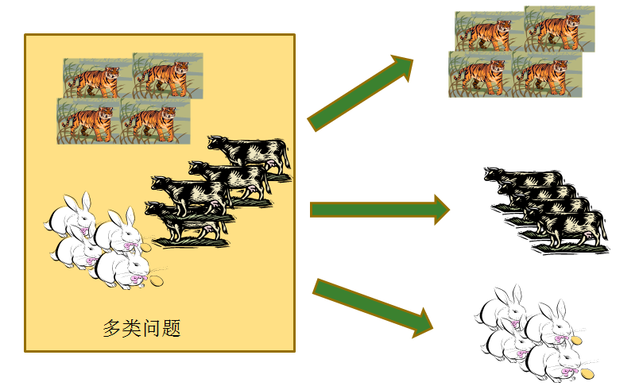
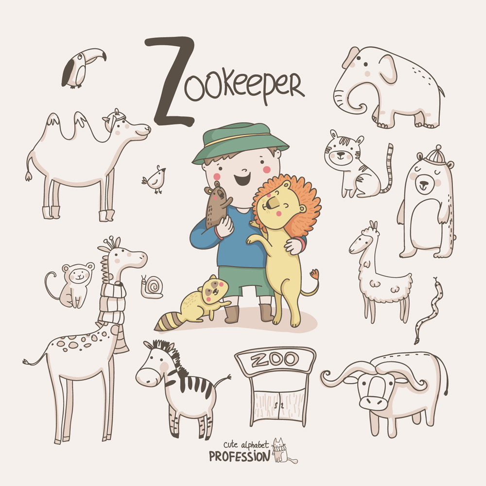
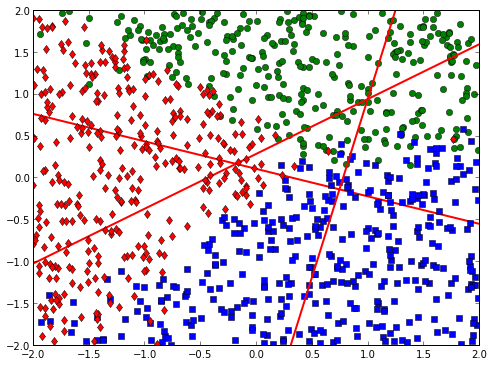
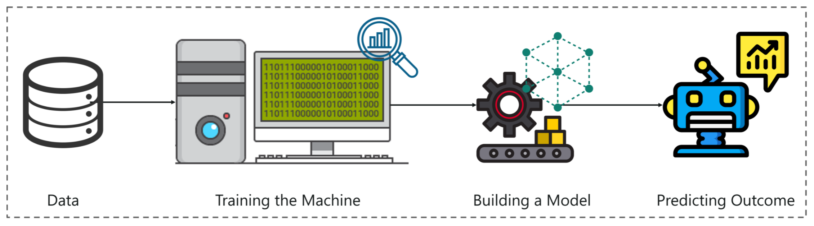
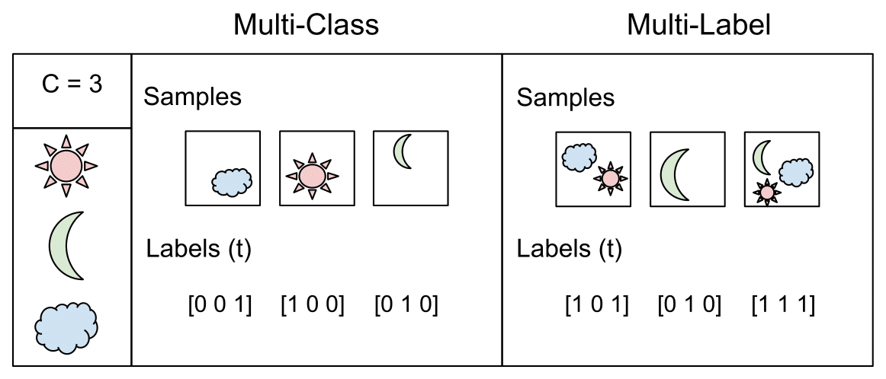

# Softmax回归

Softmax回归听名字，依然好像是做回归任务的算法，但其实它是去做多分类任务的算法。

1.  篮球比赛胜负是二分类，足球比赛胜平负就是多分类
2.  识别手写数字0和1是二分类，识别手写数字0-9就是多分类
3.  ......

Softmax回归算法是一种用于多分类问题的机器学习算法。它可以帮助我们预测一个样本属于哪一类，比如预测一张照片中的动物是狗、猫还是鸟。

### Softmax回归算法表达式

$$
P_i=\frac{e^{z_i}}{e^{z_1}+e^{z_2}+e^{z_3}+\ldots+e^{z_k}}
$$

假设你是一名动物园管理员，你想识别你们园区的动物。你拍了一些照片，其中包含狗、猫和鸟三种不同的动物。你需要一个算法来识别每张照片中的动物是哪一种。

在Softmax回归算法中，我们首先需要建立一个模型来描述每种动物的概率。
$$
P_i=\frac{e^{z_i}}{e^{z_1}+e^{z_2}+e^{z_3}}
$$
我们将每种动物的概率分别表示为p1、p2和p3，其中p1表示照片中的动物是狗的概率，p2表示是猫的概率，p3表示是鸟的概率。然后，我们使用Softmax函数将这些概率转换为0到1之间的概率值，使它们的和等于$1$：
$$
P_1=\frac{e^{z_1}}{e^{z_1}+e^{z_2}+e^{z_3}} \\ 
P_2=\frac{e^{z_2}}{e^{z_1}+e^{z_2}+e^{z_3}} \\ 
P_3=\frac{e^{z_3}}{e^{z_1}+e^{z_2}+e^{z_3}} \\
$$
其中，$z1$、$z2$和$z3$是多元线性回归方程：
$$
z1 = w10 + w11 * x1 + w12 * x2 + ... + w1n * xn
\\
z2 = w20 + w21 * x1 + w22 * x2 + ... + w2n * xn
\\
z3 = w30 + w31 * x1 + w32 * x2 + ... + w3n * xn
$$
其中，$w10,w11,w12,\ldots,w1n$是第一类动物的系数，$w20,w21,w22,\ldots,w2n$是第二类动物的系数，$w30,w31,w32,\ldots,w3n$是第三类动物的系数。$x1、x2、...、xn$是照片的各种特征。

前面提到的3组W参数，对应上图就是3个类别之间的分界线；与逻辑回归做多分类不同，

逻辑回归是一个分界线一个分界线分别去求的，Softmax回归是同时求出来3个分界线（3组参数）。

### 如何求解算法模型

我们可以把数据中的$X={x_1\ldots x_n}$带入到算法公式中，通过算法表达式计算模型预测值，
$$
P_1=\frac{e^{z_1}}{e^{z_1}+e^{z_2}+e^{z_3}+\ldots+e^{z_k}}
\\ 
P_2=\frac{e^{z_2}}{e^{z_1}+e^{z_2}+e^{z_3}+\ldots+e^{z_k}}
\\
\cdots
\\
P_k=\frac{e^{z_k}}{e^{z_1}+e^{z_2}+e^{z_3}+\ldots+e^{z_k}}
$$
而我们的数据中有没有$Y$呢？必须有的，所以我们可以利用真实值$Y$和预测值$\hat{Y}$计算多分类交叉熵损失值（multi-class cross entropy）
$$
logloss=-\frac{1}{m}\sum_{i=1}^{m}\sum_{j=1}^{k}Y_{ij}\log P_{ij}
$$
不同的算法模型（公式参数）有不同的损失值，我们需要计算机不断调整参数最后找出来最优解参数（最佳模型）

### MultiLabel与MultiClass

在多标签分类中，每个示例可以有多个标签，每个标签可能是二进制的（1表示有标签，0表示没有标签）或实数的（例如，表示一个图书对某个主题的相关度）。这种分类方式在许多现实世界的应用中非常有用，例如文本分类，其中一个文档可以属于多个类别（例如，"科技"和"健康"）。

在多类分类中，每个示例只能属于一个类别，因此每个类别之间是互斥的。这种分类方式通常适用于一些需要进行具体分类的问题，例如图像分类，将一张图像分类为"狗"、"猫"或"鸟"等类别。

总之，多标签分类和多类分类是机器学习中两种不同的分类方式，它们在分类的方法和应用场景上有所不同，需要根据具体问题的需求选择适当的方式。

1.  Softmax回归适合多分类模型，因为互斥就是各类别概率之和必须为1；
2.  逻辑回归多分类转多个二分类适合，因为各个二分类模型是相互独立的；

