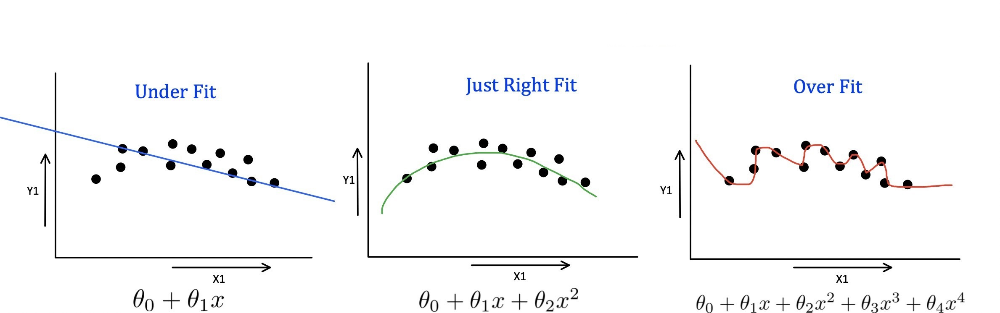
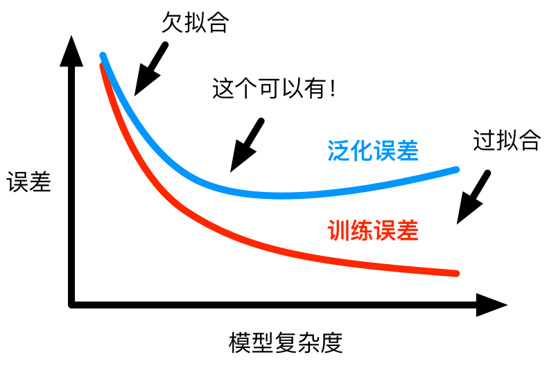

# 机器学习之正则化技术

假设你正在学习如何打高尔夫球。你发现在练习时，有些细节会对你的成绩产生很大的影响，例如你的手握杆的力度、你的握杆姿势、你的身体姿势等等。但是，你也发现如果你把注意力全部集中在这些细节上，你很容易就会忘记打球的主要目标——把球打进洞里。

机器学习的正则化也是类似的概念。在机器学习中，我们通常会面临着过拟合和欠拟合的问题。

过拟合指的是模型过于复杂，以至于能够完美地拟合训练数据，但却不能很好地泛化到新的数据。欠拟合则相反，模型过于简单，不能很好地拟合数据。

为了解决这些问题，我们可以使用正则化技术。正则化的目标是保持模型简单，以避免过拟合。

正则化的方法通常是在损失函数中添加一个正则化项，这个正则化项会根据模型参数的大小来惩罚模型的复杂度。

你可以把这个过程想象成打高尔夫球时的情景。假设你在打高尔夫球时，你想确保你的注意力不会全部集中在细节上，以至于忘记了目标。正则化的方法就是将一定的注意力集中在细节上，但也不要完全忽略了目标，这样你的成绩就会更好。
$$
Loss = BaseLoss + Penalty
$$
回归任务：
$$
Loss = MeanSquaredError + Penalty
$$
二分类任务：
$$
Loss = BinaryCrossEntropy + Penalty
$$
多分类任务：
$$
Loss = MultiClassCrossEntropy + Penalty
$$

### L1、L2正则项

L1和L2正则项都是常用的正则化方法，它们通过在模型的损失函数中加入一个正则化项来控制模型的复杂度。
$$
Loss = BaseLoss + L1 \\
or \\
Loss = BaseLoss + L2
$$
L1正则化是指在模型的损失函数中加入L1范数，L1正则化会让一些特征的权重变为0，因此可以用来进行特征选择。在L1正则化中，正则化项的计算公式为：
$$
\lambda\sum_{i=1}^{n}|w_i|
$$
其中，$w_i$是模型中第$i$个特征的权重，$\lambda$是超参数，用于控制正则化的强度。

L1正则化的优点是可以减少特征的数量，因此可以避免过拟合。缺点是可能会过度惩罚某些特征，使得一些有用的特征被舍弃。

L2正则化是指在模型的损失函数中加入L2范数，L2正则化会让所有特征的权重都变得较小，但不为0。在L2正则化中，正则化项的计算公式为：
$$
\lambda\sum_{i=1}^{n}w_i^2
$$
其中，$w_i$是模型中第$i$个特征的权重，$\lambda$是超参数，用于控制正则化的强度。L2正则化的优点是可以降低所有特征的权重，防止过拟合。缺点是不会减少特征数量，因此不能用于特征选择。

L1和L2正则化在实际应用中都有着广泛的应用。例如，在线性回归中，可以通过添加L1或L2正则项来进行正则化。在神经网络中，也可以通过添加L1或L2正则项来控制模型的复杂度。在实际使用时，我们需要根据实际情况选择合适的正则化方法和超参数，以达到最优的模型效果。

如果是多元线性回归的损失函数改为，叫做Lasso回归：
$$
Loss = MSE + \lambda\sum_{i=1}^{n}|w_i|
$$
如果是多元线性回归的损失函数改为，叫做Ridge岭回归：
$$
Loss = MSE +\lambda\sum_{i=1}^{n}w_i^2
$$
