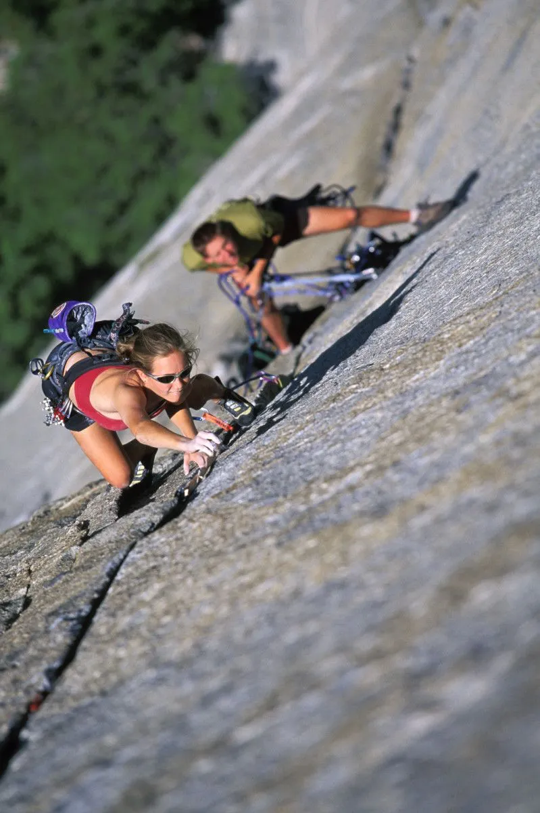
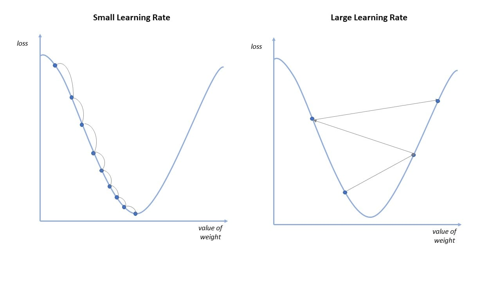

# 梯度下降法

假设你是一名山上的导游，有一个团队要跟随你攀登山峰。你的目标是带领大家快速、高效地到达山顶。但是，你没有地图和指南针，你只能依靠你的经验和感觉来找到最优的攀登路线。

梯度下降法就像是你攀登山峰的方式，你每次都会选择当前最陡峭的路线向上攀登。具体来说，你会根据当前位置的高度和周围的地形情况计算出一个下山最陡峭的方向，然后向这个方向走一小步，继续计算新位置的最陡峭方向，以此类推，直到你到达山顶。

在机器学习中，我们也需要找到一个函数的最小值。这个函数表示一个损失函数，表示模型预测与真实值之间的差距，我们需要找到最小化损失函数的参数。梯度下降法就是一种常用的优化算法，可以帮助我们找到函数的最小值。

### 梯度下降法的步骤

1.  初始化模型参数，例如随机初始化权重$\theta=w_0,w_1,w2,\ldots,w_n$

2.  根据当前的模型参数计算出损失函数的梯度。
    $$
    gradient=\frac{\partial J(\theta)}{\partial \theta}
    $$
    

3.  根据损失函数的梯度更新模型参数。
    $$
    \theta = \theta - \alpha \frac{\partial J(\theta)}{\partial \theta}
    $$
    

    其中，$\alpha$是学习率，用来控制每次迭代的步长。$\frac{\partial J(\theta)}{\partial \theta}$表示损失函数对参数$\theta$的梯度，也就是损失函数的变化率。如果梯度为正，那么我们需要减小$\theta$的值；如果梯度为负，那么我们需要增加$\theta$的值。

    

4.  重复步骤2和3，直到满足终止条件。

    *达到设定的迭代次数*

    *loss变*化的幅度小于设定的阈值

这个过程就像是从山顶到山脚的下滑过程，我们需要不断沿着损失函数的梯度方向更新$\theta$的值，直到达到最小值点。当然，如果学习率太大，可能会导致迭代过程不稳定，甚至无法收敛；如果学习率太小，可能会导致收敛速度太慢。因此，在实际应用中，我们需要根据实际情况选择合适的学习率，以达到最优的模型效果。

总之，梯度下降法是一种非常重要的优化算法，它能够帮助我们在大规模的数据集上求解复杂的机器学习模型，通过不断的调参来逼近最优解模型。