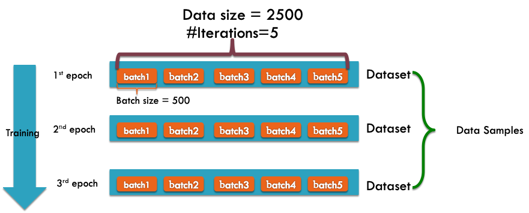

# 小批量梯度下降

谈到小批量梯度下降，肯定躲不开梯度下降，梯度下降法我们知道是**训练模型**的时候使用的方法，通过不断的迭代使得模型参数逼近最优解；

如果我们把**训练模型**这件事情看成是培养一名厨师的话，那么厨师烹饪大量的菜品进行修炼，就好比机器读取大量的数据来进行训练；

   

为了让每道菜的味道和质量越来越好，厨师需要不断地调整火候、烹饪时间、调料搭配比例等参数。而机器学习训练模型的过程中是要不断地通过梯度下降法来调整大量不同的参数$\{w_0,w_1,w_2,\ldots,w_n\}$

但是一次性做很多道菜会让人感到很吃力，所以你需要**分批处理**，每次只处理一小批菜品；机器学习训练也是如此，当数据量大的时候一次性读取训练集的所有数据进行一次梯度下降迭代，很有可能因为算力不足无法运行，即使可以运行一次迭代所需时间也会相对较长。

所以正如上图所示，我们可以将训练数据分成多个**批次**（batch），每个批次所包含数据量（samples）叫做**批次大小**（batch_size），梯度下降每次迭代使用一个批次的数据。
$$
\theta = \theta - \alpha \frac{1}{b} \sum_{i=1}^{b} \frac{\partial J_i(\theta)}{\partial \theta}
$$
这个过程就像是在烹饪菜品时，每次只处理一小批菜品，控制好火候、烹饪时间、调料等参数，让每道菜品的味道和质量都更好。

上图是对比全量梯度下降、随机梯度下降、小批量梯度下降；

还有一点大家经常发现，顶级的厨师往往年纪都不小，起码40+，手艺就是需要多年不断的磨练才能练出来，很好的掌握火候。

机器学习也是如此，训练数据交给机器从头到尾学习一遍往往是不够的，需要学习很多遍，每学习一遍我们称之为学习一个**轮次**（epoch），所以小批量梯度下降就是**分轮次分批次的训练**。

总结，

1.  初始化模型参数，例如随机初始化权重$\theta=w_0,w_1,w2,\ldots,w_n$

2.  根据当前的模型参数计算出损失函数的梯度。
    $$
    gradient=\frac{\partial J(\theta)}{\partial \theta}
    $$

3.  根据损失函数的梯度更新模型参数。
    $$
    \theta = \theta - \alpha \frac{\partial J(\theta)}{\partial \theta}
    $$

    其中，$\alpha$是学习率，用来控制每次迭代的步长。$\frac{\partial J(\theta)}{\partial \theta}$表示损失函数对参数$\theta$的梯度，也就是损失函数的变化率。如果梯度为正，那么我们需要减小$\theta$的值；如果梯度为负，那么我们需要增加$\theta$的值。

4.  重复步骤2和3，直到满足终止条件。

    *达到设定的迭代次数*

    *loss变*化的幅度小于设定的阈值