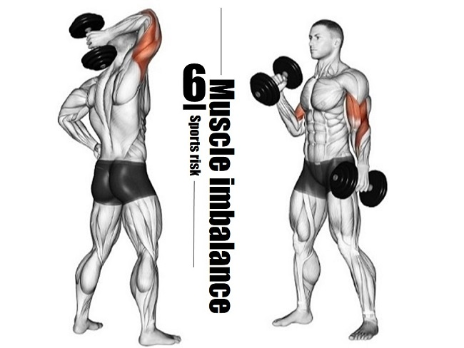
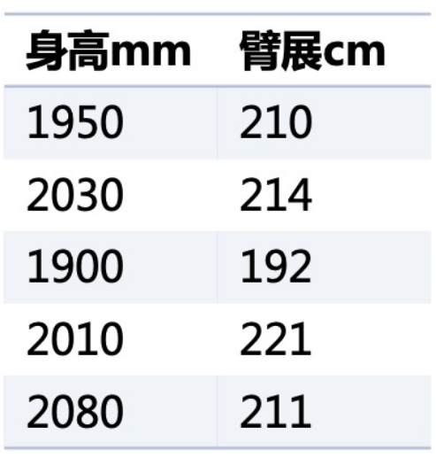
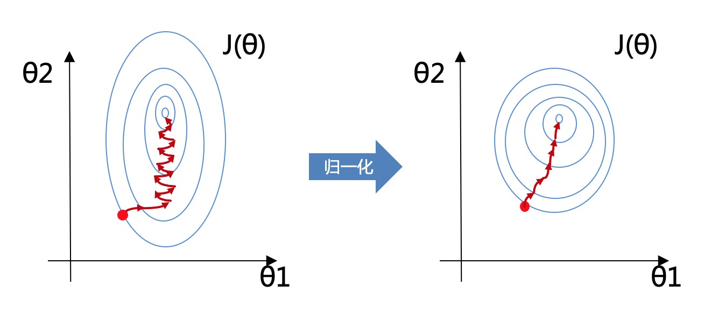
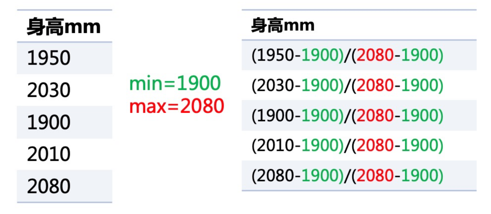
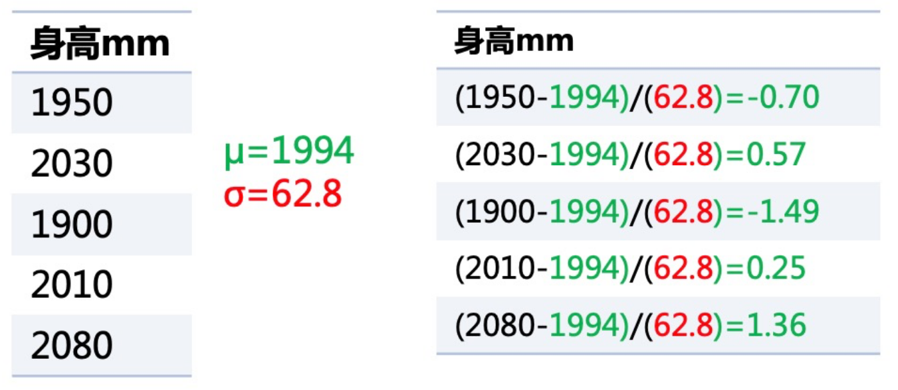

# 数据归一化

假设你正在准备去跑步比赛，你需要做好充分的准备，包括饮食、锻炼、休息等方面。

在锻炼方面，你需要注意不同部位的肌肉都要得到充分的训练。但是，如果你的身体某些部位的肌肉过于发达，就可能会影响整个身体的平衡性和协调性，进而影响跑步的效果。

类似的，机器学习中的数据归一化就是为了让不同特征之间的权重更加平衡，防止某些特征对模型的影响过大，影响模型的性能。

具体来说，数据归一化就是将数据中的每个特征按照一定的比例进行缩放，使得不同特征之间的值在相同的范围内波动，从而消除特征之间的量纲（单位）差异。

比如说，我们可能有一个特征表示身高，它的范围是几千，而另一个特征表示臂展，它的范围可能是几百。

这种特征之间的尺度和范围的不同会对机器学习算法的表现产生很大的影响。

1.  例如，在一个线性回归问题中，如果某个特征的范围很大，那么它对结果的影响就会比范围较小的特征更大，这可能会导致算法的结果出现偏差。例如，如果我们在一个广告点击率预测模型中同时使用了广告的点击量和广告的展示量，那么点击量的值通常会比展示量大得多。这就会导致模型更加重视点击量，而忽略了展示量。这显然是不合理的。
2.  类似地，在神经网络中，不同的特征也会对结果产生不同的影响，这可能会导致算法的收敛速度变慢，或者产生更多的错误。

### 具体做法

$$
x^{'}=\frac{x-min}{max-min}
$$

$$
x^{'}=\frac{x-\mu}{\sigma}
$$

-   异：最大值最小值归一化依赖某两个值最大和最小，标准归一化则依赖所有值
-   异：最大值最小值归一化变成[0-1]的区间内，标准归一化没有这个区间限制只是数据的均值为0方差为1
-   同：归一化目的都是为了使得不同度量的特征具有可比性

>   数据和特征决定了机器学习的上限，而模型和算法只是逼近这个上限而已！