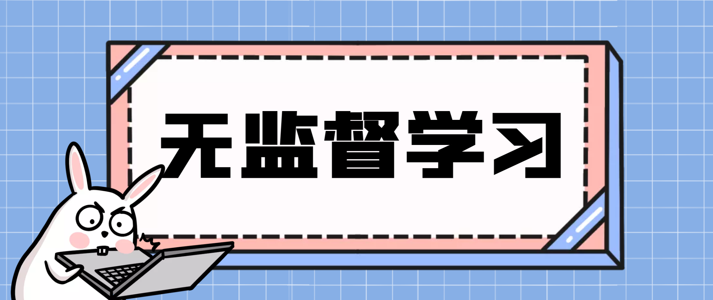
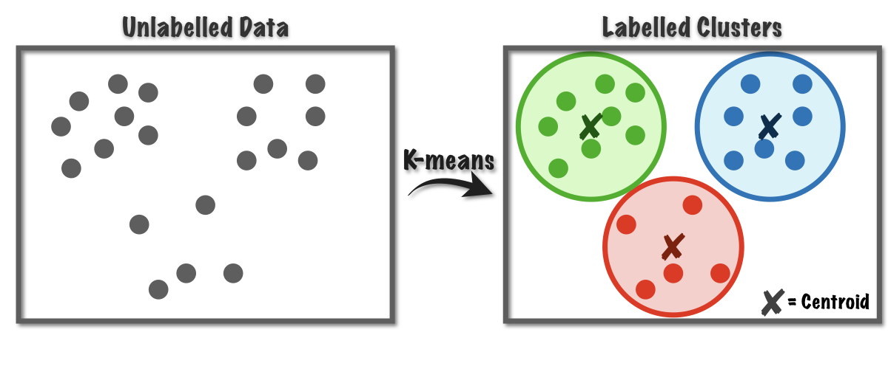
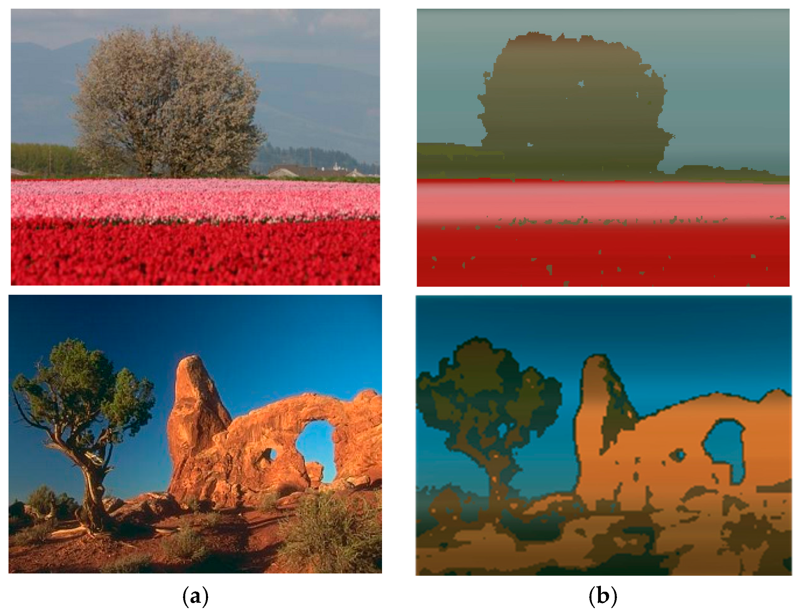
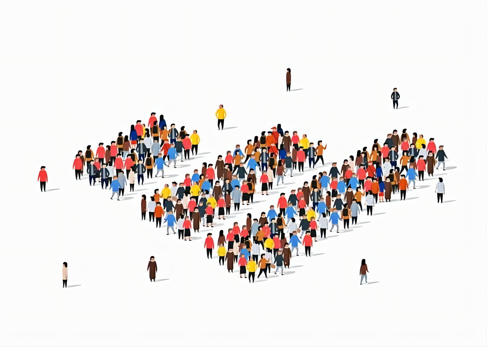
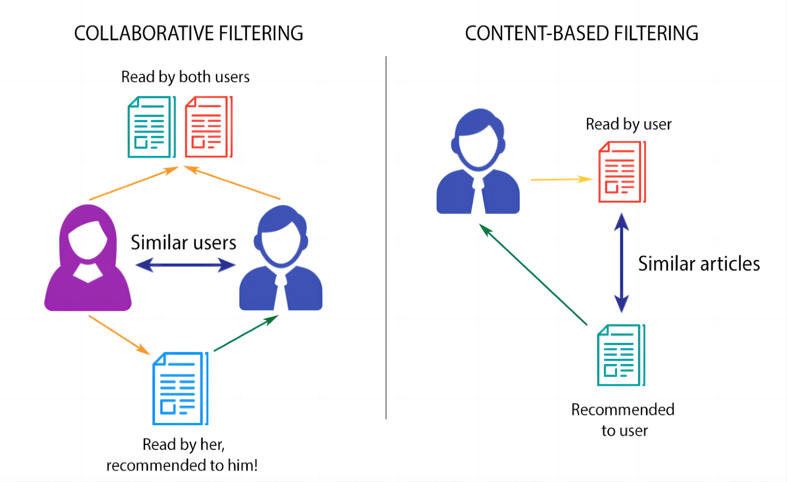
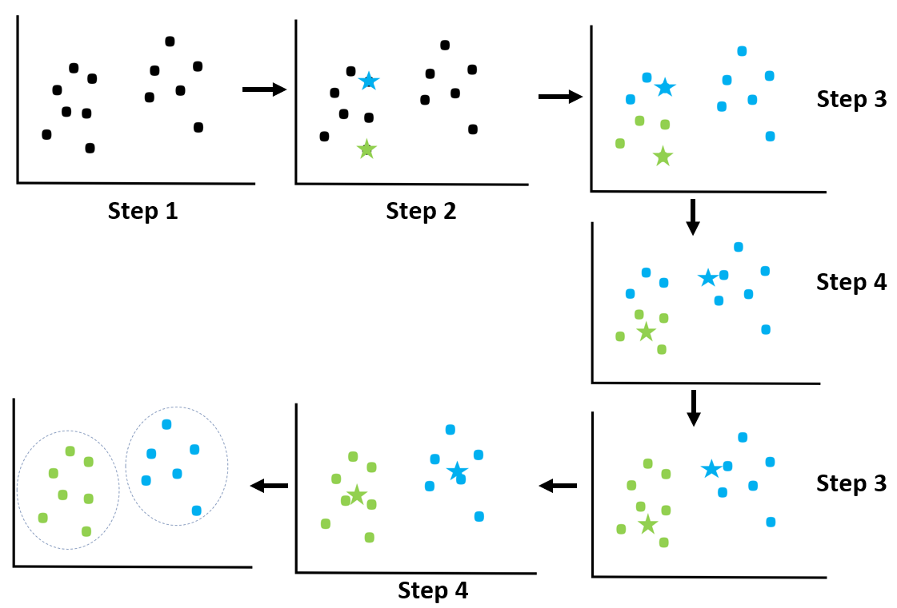
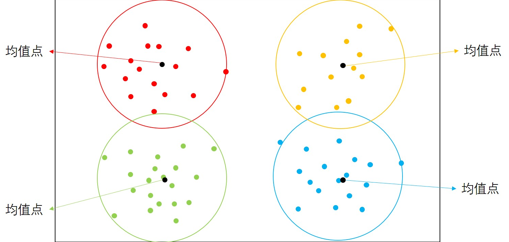

# KMeans聚类

假设我们有一些数据点，我们想要将它们分成几个不同的组，使得每个组内的数据点相似度较高，组间数据点的相似度较低。

KMeans聚类就是一种常用的算法，它可以帮助我们对数据进行分组。

作为一种通用的无监督学习算法，KMeans聚类可以应用于各种不同的领域，比如图像分割、社交网络分析和推荐系统。

在图像分割中，KMeans聚类可以将图像中的像素点分为不同的聚类，从而实现图像分割。具体来说，它可以通过将像素点分组到最接近的聚类中心来实现图像分割。例如，假设你想将一张照片分成两个部分：人和背景。你可以使用KMeans聚类算法来将像素点分为两组，从而实现图像分割。

在社交网络分析中，KMeans聚类可以将社交网络中的用户分为不同的聚类。具体来说，它可以通过将用户分组到最接近的聚类中心来实现社交网络分析。例如，假设你想将社交网络中的用户分为三组：青年人、中年人和老年人。你可以使用KMeans聚类算法来将用户分为三组，并分析这些用户之间的联系。

在推荐系统中，KMeans聚类可以将用户和商品分为不同的聚类。具体来说，它可以通过将用户和商品分组到最接近的聚类中心来实现推荐系统。例如，假设你想向用户推荐他们可能喜欢的商品。你可以使用KMeans聚类算法将用户和商品分为不同的聚类，并根据聚类中心来推荐商品。

### KMeans算法具体流程

KMeans聚类的基本思想是将数据点分成K个不同的组，其中K是我们自己设定的。

1.  一开始，我们随机选择K个数据点作为聚类中心。
2.  然后，对于每个数据点，我们计算它和每个聚类中心的距离，将它分配到距离最近的那个聚类中心所在的组。
3.  接下来，我们更新每个组的聚类中心，计算每个组中所有数据点的平均值，并将其作为该组的新聚类中心。
4.  然后，我们重新计算每个数据点和每个新的聚类中心之间的距离，并将数据点重新分配到距离最近的那个组。
5.  我们重复这个过程，直到聚类中心不再变化，或者我们达到了设定的迭代次数。最终，我们得到了K个不同的聚类组。

# 

### KMeans聚类得到的模型

