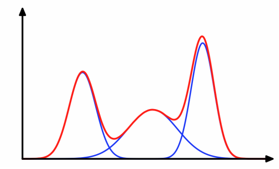
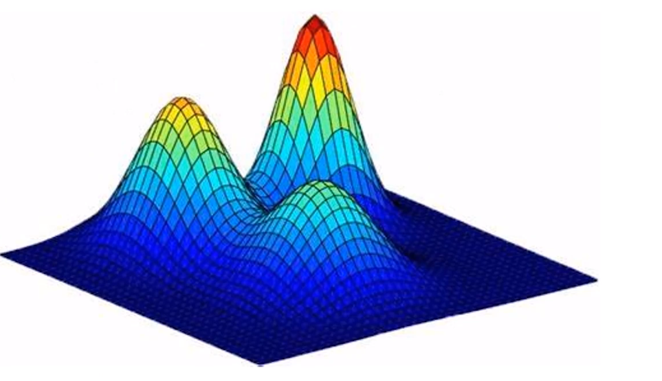
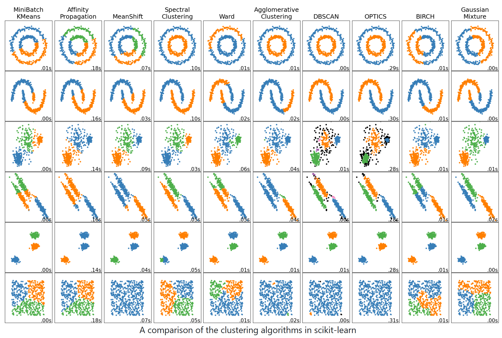
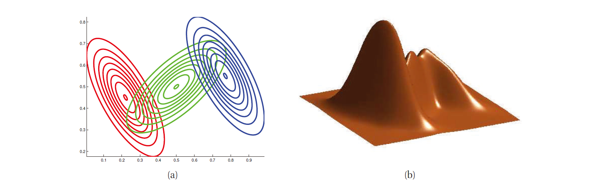
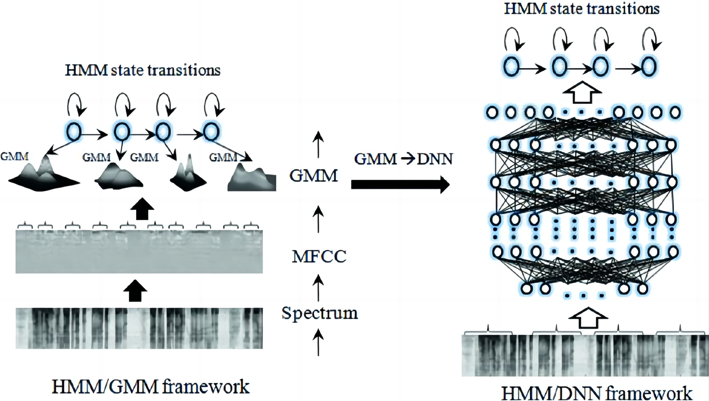

# 高斯混合模型

高斯混合模型（Gaussian Mixture Model，简称GMM）是一种常用的机器学习算法，用于对数据进行聚类或者拟合。

1.  对无标签的数据集，可以使用高斯混合模型进行聚类；

    

    >   让我们假设你正在一个杂货店里，你看到一堆水果，有苹果、香蕉和橙子。你想把它们分成几组，以便更好地组织它们。GMM就像是一个聪明的小伙伴，可以帮助你快速地将这些水果分成不同的组。
    >
    >   -   首先，我们将选择一个初始的“猜测”，假设有3个簇，每个簇代表一种水果。然后，我们将随机选择几个数据点，这些数据点将被指定为每个簇的中心点。在我们的例子中，可能会选择一些苹果、香蕉和橙子作为中心点。
    >   -   接下来，我们将对数据进行多次迭代（EM算法），每次迭代会根据每个中心点附近的数据点调整中心点的位置，以便更好地拟合数据。在这个过程中，我们还会计算每个数据点属于每个簇的概率。
    >   -   最后，当迭代完成时，我们将得到一个最终的聚类结果，其中每个簇代表一种水果。这些簇的大小和位置将取决于初始猜测和迭代过程中的调整。

    

    

2.  对有标签的数据集进行，也可以直接高斯混合模型进行分类；

    >   让我们假设你正在一个杂货店里，你看到三堆水果，有苹果、香蕉和橙子。你想对它们三组水果分别建模，以便未来闭眼随手拿起一个水果（苹果 or 香蕉 or 橙子），不看也可以快速分类出来是哪一种。GMM就像是一个聪明的小伙伴，可以帮助你快速地将这些不同组的水果分成进行建模，未来当有新的水果进来时，给出新的水果属于不同类别的似然。

总之，GMM是一个非常强大的聚类算法，它可以帮助我们将数据分成多个簇，并估计每个簇的参数。在实际应用中，它可以用于图像分割、语音识别、金融分析等领域。
