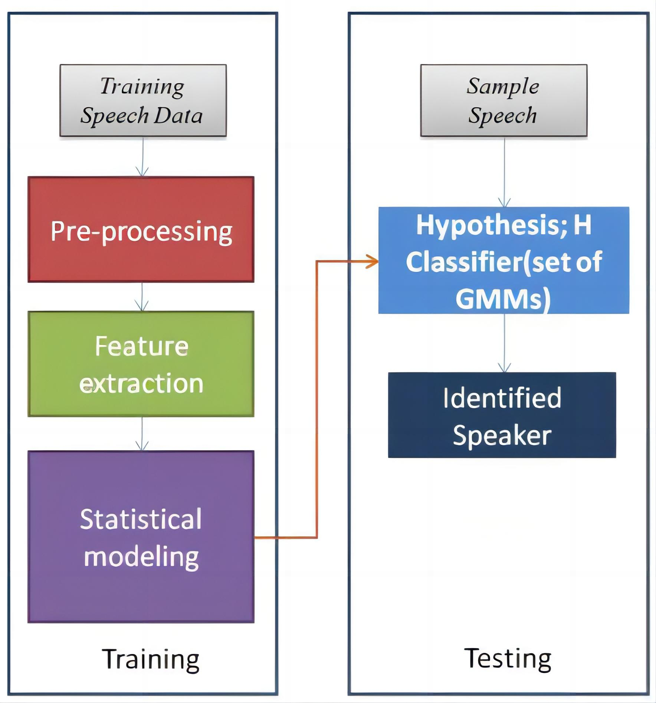
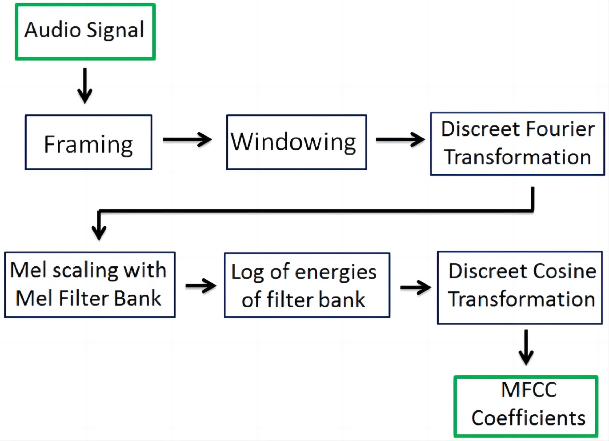

# 说话人识别



对于语音数据来说，重要的是首先进行特征提取，简单来说就是把连续的语音信号，通过分帧、加窗等操作得到向量化的数据。



而这一系列语音信号数值化的操作，可以通过现成的模块帮助我们完成，例如

`pip install python_speech_features`

```python
import python_speech_features as mfcc
def get_MFCC(sr,audio):
    features = mfcc.mfcc(audio, sr, 0.025, 0.01, 13, appendEnergy = False)
    features = preprocessing.scale(features)
    return features
```

然后就可以将一条语音信号，变成20个维度的MFCC向量，

为了得到更多有用的特征，我们也可以将20个维度的MFCC向量进行扩充，(MFCCs + ΔMFCC)，它们是 20 个 MFCC 特征和 20 个 MFCC 特征的导数。 MFCC 的导数提供了 MFCC 随时间变化的动态信息。这样特征来到了40维度。

计算 ΔMFCC的公式，
$$
d_t = \frac{\sum_{n=1}^{N}n{(c_{t+n}-c_{t-n})}}{2\sum_{n=1}^{N}n^2}
$$

```python
import numpy as np
import python_speech_features as mfcc
from sklearn import preprocessing


def calculate_delta(array):
    rows, cols = array.shape
    deltas = np.zeros((rows, 20))
    N = 2
    for i in range(rows):
        index = []
        j = 1
        while j <= N:
            if i - j < 0:
                first = 0
            else:
                first = i - j
            if i + j > rows - 1:
                second = rows - 1
            else:
                second = i + j
            index.append((second, first))
            j += 1
        deltas[i] = (array[index[0][0]] - array[index[0][1]] + (2 * (array[index[1][0]] - array[index[1][1]]))) / 10
    return deltas


def extract_features(audio, rate):
    mfcc_feat = mfcc.mfcc(audio, rate, 0.025, 0.01, 20, appendEnergy=True)
    mfcc_feat = preprocessing.scale(mfcc_feat)
    delta = calculate_delta(mfcc_feat)
    combined = np.hstack((mfcc_feat, delta))
    return combined
    
```

读取数据并提取特征

```python
from scipy.io.wavfile import read
from speaker_features import extract_features

source = 'D:/data/speaker-identification/development_set/'

train_file = 'D:/data/speaker-identification/development_set_enroll.txt'

file_paths = open(train_file, 'r')

for path in file_paths:
    path = path.strip()
    print(source + path)

    # 一个个地读取了原声音文件
    sr, audio = read(source + path)

    # 提取40个维度特征（MFCC+ΔMFCC）
    vector = extract_features(audio, sr)

```

