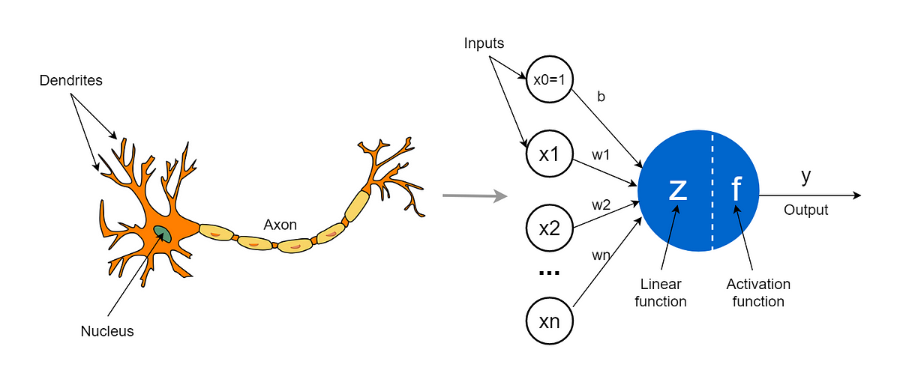
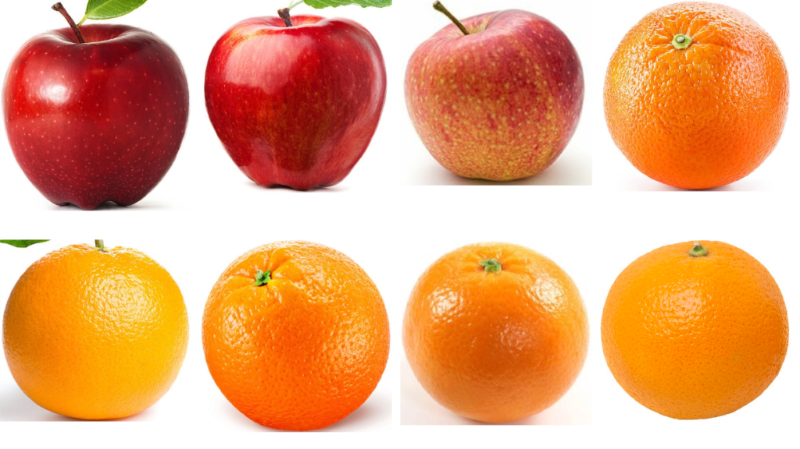

# 感知机

当我们谈论神经网络时，很难不提到感知机。感知机是神经网络的起点，也是神经网络历史上的一个里程碑。

感知机是由美国学者Frank Rosenblatt在20世纪50年代提出的，它是一种简单的神经网络模型，其灵感来源于人类神经元之间的联系。

感知机的基本结构类似于生物神经元。它有多个输入，每个输入都有一个权重，表示这个输入的重要性。
$$
\hat{Y}=f(w_0+w_1\times x_1+w_2\times x_2+\ldots+w_n\times x_n)
$$
感知机将所有输入与它们的权重相乘，并将结果相加，然后使用阈值函数来确定输出是否激活。如果输出激活，则感知机会产生一个信号，否则它会保持静默。

为了更好地理解感知机是如何工作的，可以将其比作一个判断器。假设你想要教一个机器判断橙子和苹果。你可以将橙子和苹果的属性作为输入，如大小、颜色、形状等等，并赋予它们不同的权重。

当感知机接收到这些属性时，它会将它们相乘并相加，然后比较结果是否大于一个设定的阈值。如果是，它就会输出“这是一个橙子”，否则它会输出“这是一个苹果”。

![What is Perceptron? A Beginners Guide [Updated] | Simplilearn](imgs/Perceptron_work.png)

感知机的一个重要特点是它可以学习。学习过程中，感知机会根据输入和输出之间的误差来调整权重，以改进其预测能力。这个过程被称为感知机学习规则，它使用了梯度下降算法来优化权重。