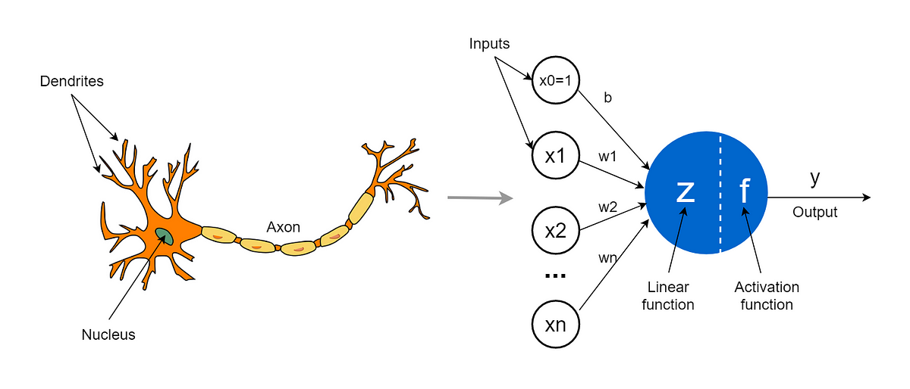

# 神经网络

### 从神经元到神经网络

神经网络多层感知机（Multilayer Perceptron，简称 MLP）是一种比感知机更为复杂的神经网络结构，它是通过多层神经元来处理信息的。

想象一下，你要训练一个机器来识别猫、狗和鸟。在传统的感知机模型中，你需要手动提取猫、狗和鸟的各种特征，例如颜色、纹理和形状，然后将这些特征输入到模型中进行分类。

在多层感知机中，你可以直接将原始数据输入到模型中，而模型会自动提取出数据中的关键特征。这是因为多层感知机由多个层组成，每个层都由多个神经元组成，每个神经元都会对前一层的输出进行加权和，然后将这些加权和输入到激活函数中进行处理，输出结果。

1.  加入隐藏层，引入非线性变化
2.  可以有更多隐藏层，引入更加复杂的非线性变化；
3.  也可以同时预测多个输出；

通过这种方式，多层感知机可以处理非常复杂的数据，如图像、音频和文本等。例如，如果你想训练一个机器来识别手写数字，你可以将手写数字的像素值作为输入，然后使用多层感知机来提取关键特征，最终输出该数字的标签。

比如目标检测任务，就需要同时预测多个输出：

DNN（ANN/MLP）、CNN、RNN

CNN、RNN、GNN、GAN

