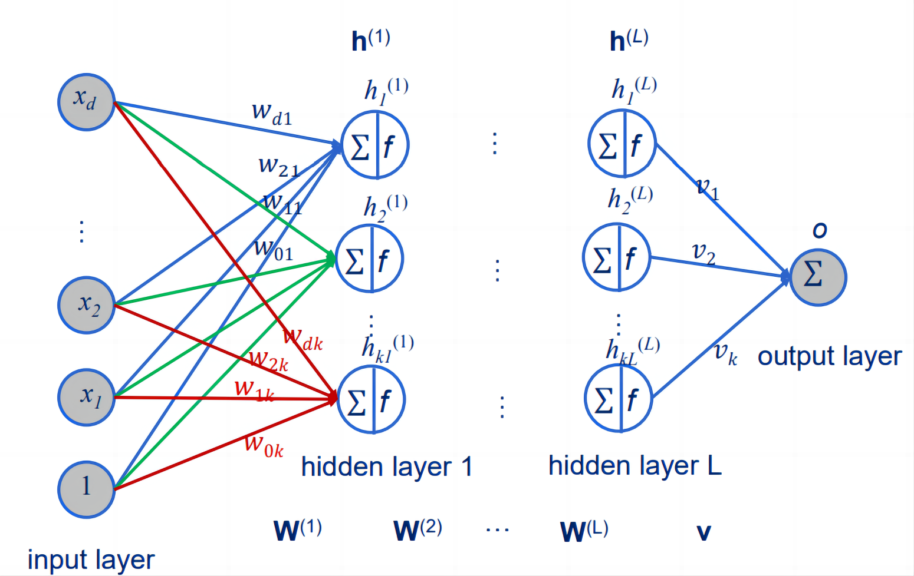
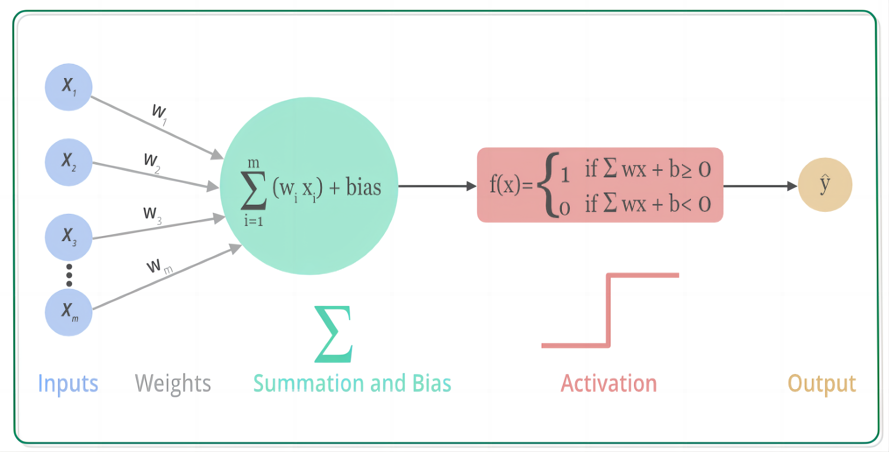
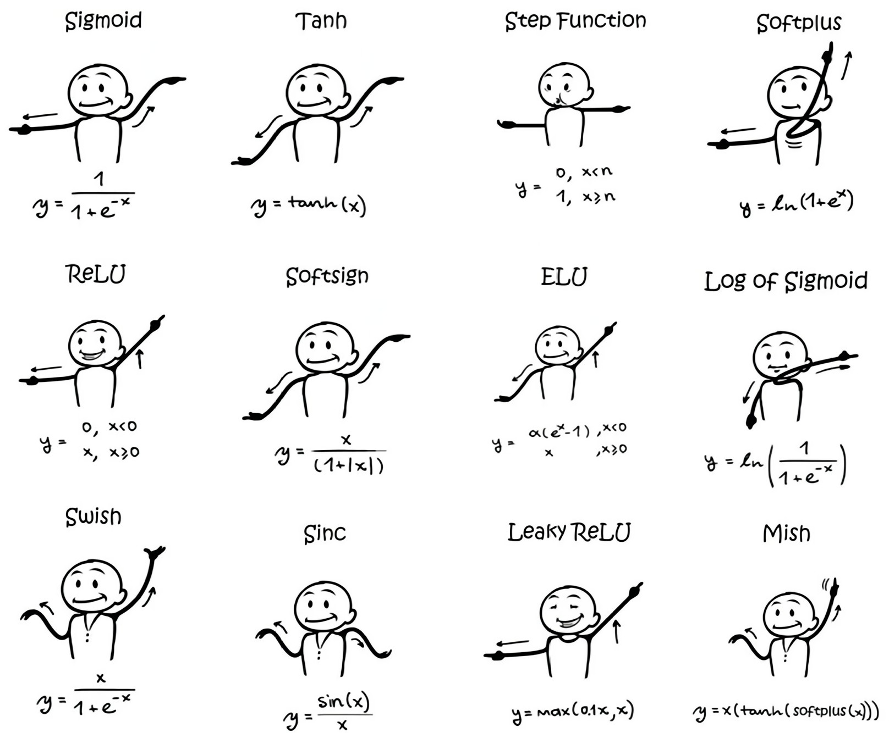
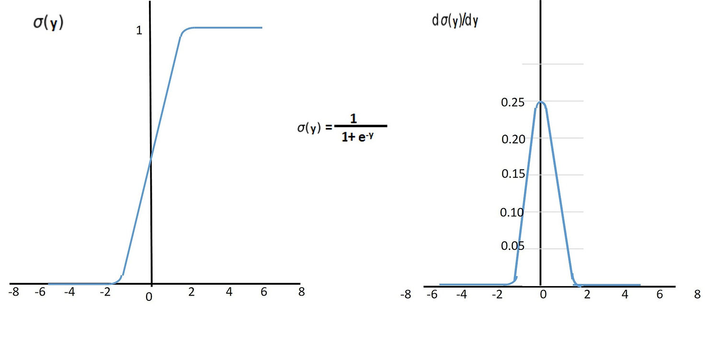
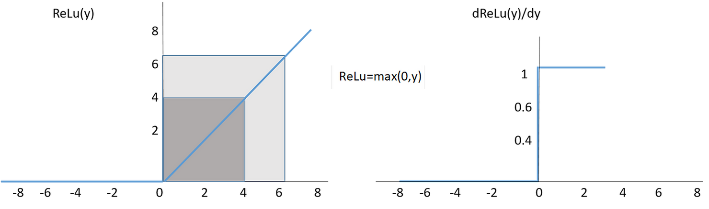
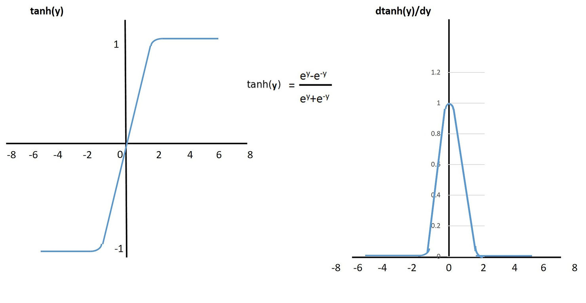

# 激活函数

当我们在神经网络中传递数据时，我们需要一种函数来帮助我们在每一层中转换数据。这就是激活函数（Activation Function）。

就好比生活中从某一房间去到另一房间，要推开一扇门才可以过去，而推开的这扇门有一个传感器，只要给传感器一定的压力，门就会自动为你打开。这个传感器就是激活函数。

激活函数是一种非线性函数，它可以把输入的数据映射到一个新的输出值，这个输出值可以在下一层被用作输入。

激活函数的主要作用是为神经网络引入非线性因素，使得神经网络可以处理更加复杂的数据，提高网络的表示能力。如果没有激活函数，神经网络将只是一组线性方程的组合，无法处理非线性数据。

举个例子，想象一下你要用神经网络来预测一只猫的品种。你需要输入许多数据，如猫的图像、年龄、重量等。这些数据都是非线性的，因为它们可能会在不同的方向上对结果产生不同的影响。如果没有激活函数，神经网络将无法处理这些非线性数据，从而无法准确预测猫的品种。

在实际应用中，我们使用各种不同的激活函数，包括sigmoid函数、ReLU函数、tanh函数等。每种激活函数都有自己的优点和缺点，因此我们需要根据具体情况选择适合的激活函数。

1.  Sigmoid 函数：这个函数的形状像一个“S”形，通常被用于二分类问题。当输入趋近于正无穷时，它的输出会趋近于1；当输入趋近于负无穷时，它的输出会趋近于0。然而，Sigmoid 函数的导数在接近边缘处变得非常小，这使得梯度消失问题变得更加明显。

    

2.  ReLU 函数：这是一种非常流行的激活函数，它的全称是“整流线性单元”。ReLU 函数的特点是在输入大于0时，输出等于输入；在输入小于等于0时，输出等于0。它不仅速度快，而且很容易优化，因为它的导数恒为1或0。然而，ReLU 函数的一个缺点是可能会出现“神经元死亡”问题，这是因为当神经元的输入小于0时，该神经元的梯度将始终为0。

    

3.  Leaky ReLU 函数：这是一种对 ReLU 函数的改进。当输入小于0时，它的输出等于输入的一个小的斜率。这个小斜率通常设置为0.01或0.001。相对于 ReLU 函数，Leaky ReLU 函数的优势是可以避免神经元死亡问题。

    

4.  Tanh 函数：这个函数的形状类似于 Sigmoid 函数，但是它的输出范围是[-1, 1]。与 Sigmoid 函数类似，当输入趋近于正无穷时，它的输出会趋近于1；当输入趋近于负无穷时，它的输出会趋近于-1。与 Sigmoid 函数相比，Tanh 函数具有更强的非线性特性。

    