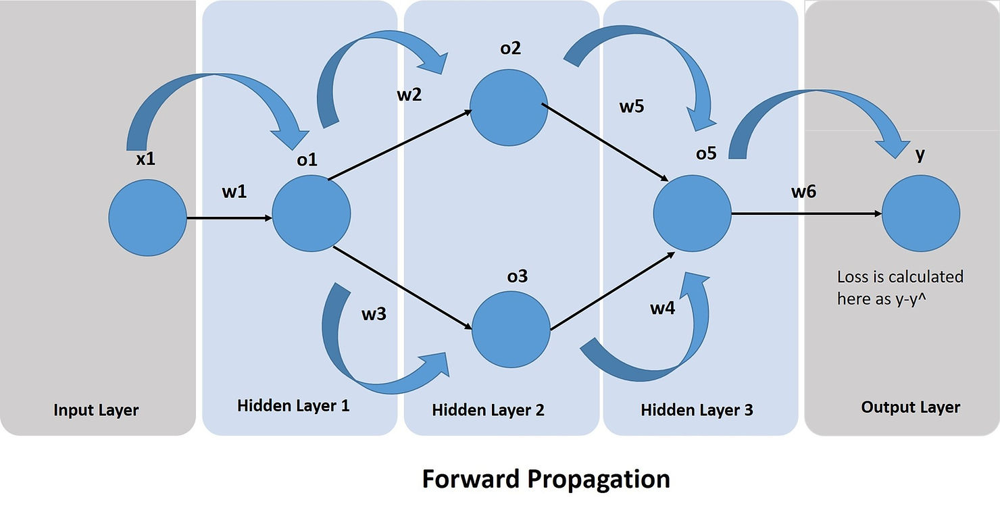
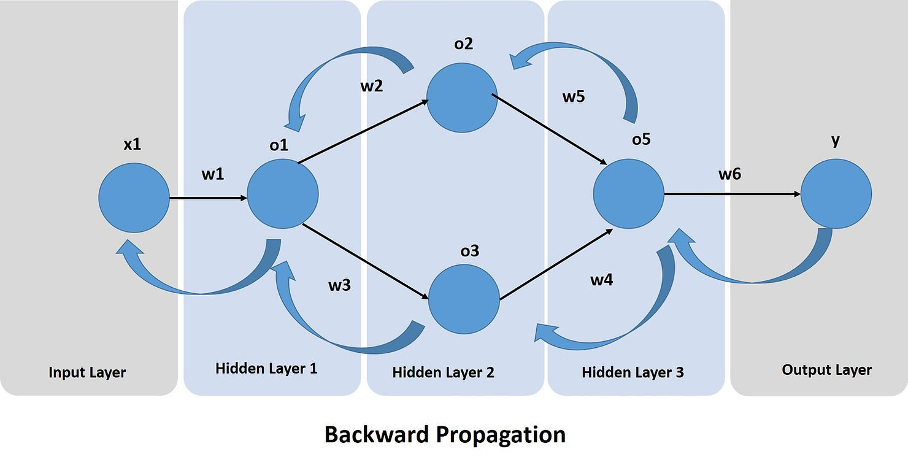

### 正向传播

1，先计算$X->\hat{Y}$，也就是将X带入计算图
$$
\hat{Y}=f_3\cdot (f_2\cdot (f_1\cdot (w_1\cdot x_1\cdot +w_2\cdot x_2\cdot +w_3\cdot x_3\cdot +b)+\ldots)\ldots)\ldots)
$$
2，再计算$\hat{Y}->Loss$，也就是将$Y$与$\hat{Y}$带入损失函数中
$$
\text{Total Loss}=Loss(\hat{Y},Y)=\sum_i^mloss(\hat{y_i},y_i)
$$
因此，正向传播整体上就是从$X->Loss$的过程，如果把 Forward Propagation 看成是一个函数的话，那么它无非就是一个复合函数
$$
Total Loss = FP(X) = Loss(f_3\cdot (f_2\cdot (f_1\cdot (w_1\cdot x_1\cdot +w_2\cdot x_2\cdot +w_3\cdot x_3\cdot +b)+\ldots)\ldots)\ldots), Y)
$$

### 反向传播

-   神经网络中反向传播是为了去调整参数使得损失函数值可以最小化
-   同时通过反向传播也是一种方式知道每个节点该对损失值负责多少

梯度是一个计算出来的数值，它可以帮助我们去知道如何调整神经网络的参数；一次迭代包含一次正向传播（计算predictions与loss）和一次反向传播（求梯度与调参），所谓训练就是多次迭代直到达到局部最小值，梯度下降法：
$$
W_{new}=W_{old}-\eta \frac{\part Loss}{\part W_{old}}
$$
这里回忆一下 Loss 是怎么得到的？不就是之前正向传播得到的，因此，对参数求导实际上就是复合函数求导，复合函数求导应用 chain rule，即链式求导法则。
$$
\frac{\part Loss}{\part W_{old}}=\frac{\part Loss(f_3\cdot (f_2\cdot (f_1\cdot (w_1\cdot x_1\cdot +w_2\cdot x_2\cdot +w_3\cdot x_3\cdot +b)+\ldots)\ldots)\ldots), Y)}{\part W_{old}}
$$
如果拿下面这个计算图来举例：

$$
\begin{align}
\frac{\part Loss}{\part W1_{old}}&=\frac{\part Loss}{\part y}\times \frac{\part y}{\part o5}\times \frac{\part o5}{\part o2}\times \frac{\part o2}{\part o1}\times \frac{\part o1}{\part W1_{old}} + \frac{\part Loss}{\part y}\times \frac{\part y}{\part o5}\times \frac{\part o5}{\part o3}\times \frac{\part o3}{\part o1}\times \frac{\part o1}{\part W1_{old}} \\
&=\frac{\part Loss}{\part y}\times \frac{\part y}{\part o5}\times \left(\frac{\part o5}{\part o2}\times \frac{\part o2}{\part o1}+ \frac{\part o5}{\part o3}\times \frac{\part o3}{\part o1} \right) \times \frac{\part o1}{\part W1_{old}}
\end{align}
$$

