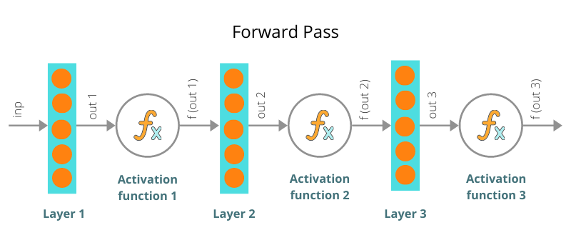
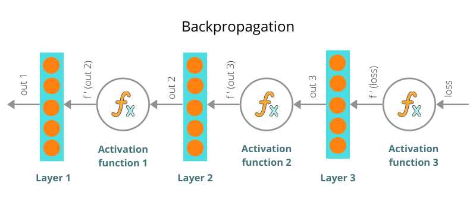
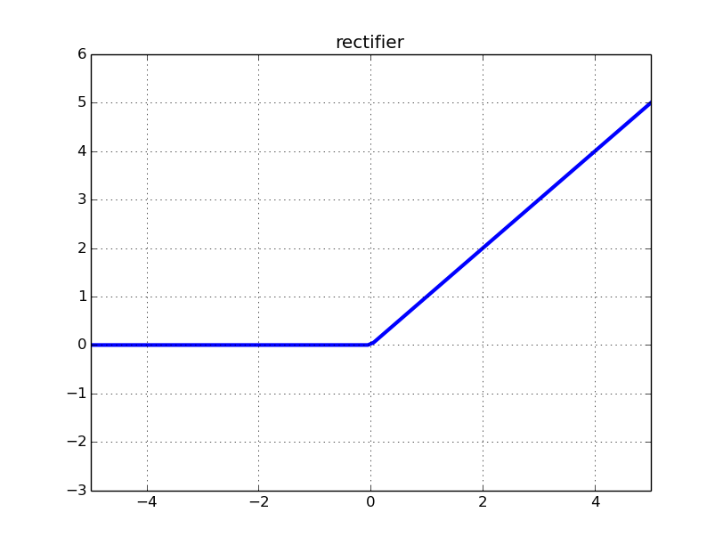
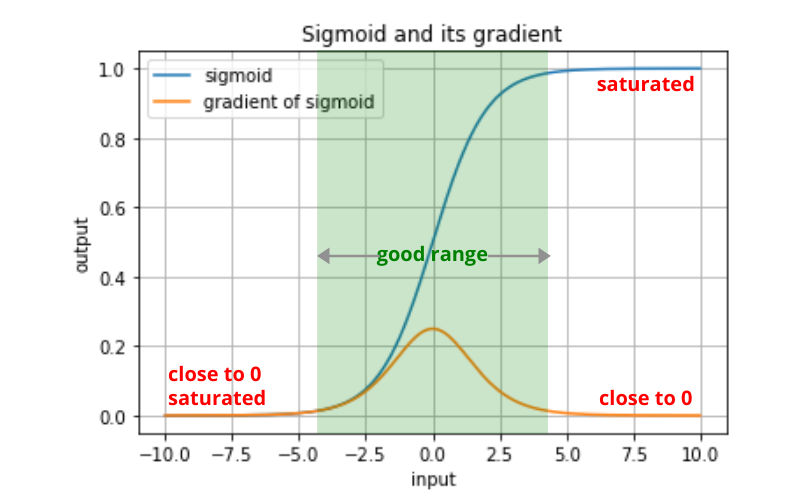
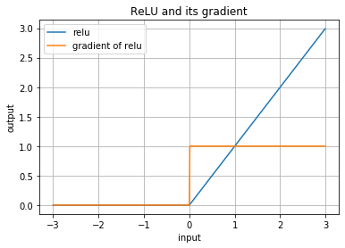

### 梯度消失

这个问题还是得从正向传播和反向传播谈起，

因为反向传播使用链式求导法则 chain rule，所以求梯度的计算是通过一些导函数的值连乘得到，如果导函数的值越接近0，那么连乘在一起就会更加接近0，例如：
$$
0.3 \times 0.2 \times 0.4 \times 0.1 = 0.0024
$$
拆解上面连乘过程到每一步，来看看输出值为什么越来越小：
$$
\begin{align}
step1&=>0.3\times 0.2=0.06 \\
step2&=>0.06\times 0.4 = 0.024 \\
step3&=>0.024\times 0.1=0.0024
\end{align}
$$
又因为反向传播求导是从后往前的，所以越靠近输入层的参数求导时，连乘在一起的项越多，越有可能一堆接近0的数值不断连乘，导致梯度值越来越接近0

当连乘之后的梯度值越接近0，$W_{new}=W_{old}-\eta \frac{\part Loss}{\part W_{old}}$ ，就会使得$W$参数调整越甚微，出现这种现象就叫做梯度消失问题。反过来另一个极端情况就叫做梯度爆炸。

### 避免梯度消失

1.  Using ReLU activation
2.  Batch normalization
3.  Residual Networks

在连乘的导函数里面会有许多激活函数的导函数出现，如果激活函数导函数不能给出相对大一些的值，那么就会很容易出现梯度消失了。

比如，我们将激活函数设置成Sigmoid或者Tanh，

Sigmoid函数导函数区间在0到0.25之间，Tanh函数导函数区间在0到1之间，它们输出的数值一直很小。

ReLU激活函数不会像Sigmoid函数或Tanh函数压扁输出在特定的范围，ReLU允许信号大于0的部分通过。因此，ReLU有更强的输出值。

当数值小于0的时候梯度是0，当数值大于0的时候梯度是1；梯度值是1确保了信号反向传播时保持强度。

在隐藏层中使用ReLU取代Sigmoid和Tanh，帮助避免梯度消失问题。