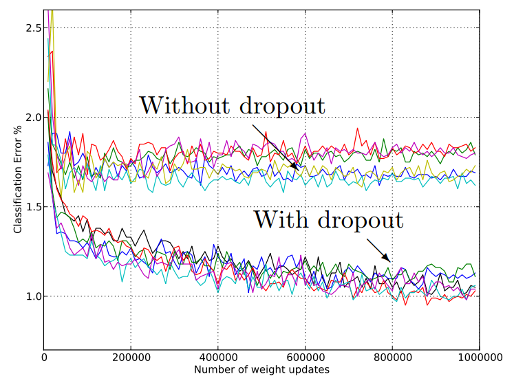
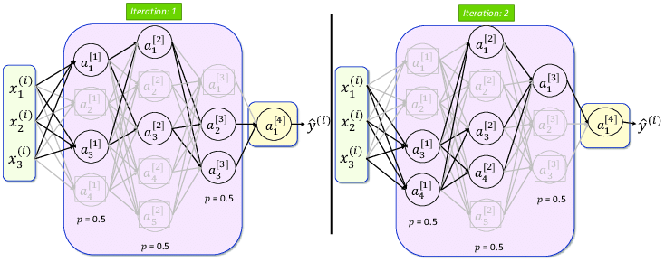
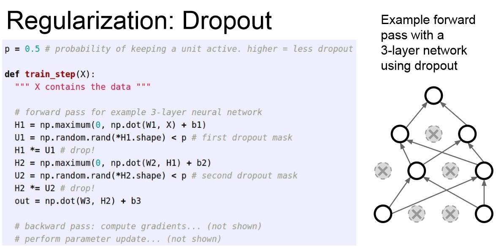
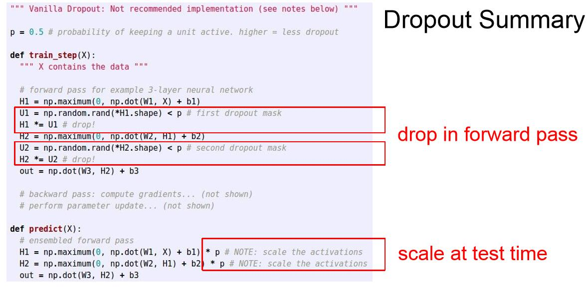
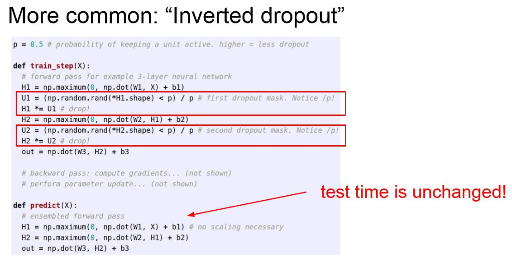

### Dropout

Dropout是防止过拟合的手段之一

-   训练时每次迭代，从 Base Network 随机一个 Subnetwork 进行训练，多次迭代就训练了参数共享的 Subnetworks，只要迭代次数足够多，整个 Base Network 都将得到训练；
-   换个角度理解即，每个神经元有一定的概率（dropout rate）输出值置为0；
-   预测的时候不起任何作用，相当于神经网络中每个参数都参与计算；

Dropout是正则化中非常常用的技巧。我们把一部分神经元置零，置零指的是将神经元的激活函数置零。一般在全连接层中使用，在卷积层中也会见到，在卷积层中有时候并不是将神经元置零，而是将某些特征映射整体置零，比如讲颜色通道中的某几个整体置零。Dropout一定程度上消除了特征之间的依赖关系，这样网络就只能用一些学习到的零散特征来进行判断。

如何使用？

深度学习框架中会封装有 Dropout 层，这样需要将哪一层输出随机的丢弃一些，那么就在哪一层后面跟 Dropout 层即可。

自行实现？

Dropout整体代码只有四行，非常高效：

Tips：有一个很常见的技巧是反转Dropout（inverted dropout），我们希望测试集的代码保持不变，于是在训练集dropout的输出值之后除以p。这样也可以保持训练集输出期望和测试集一致。

