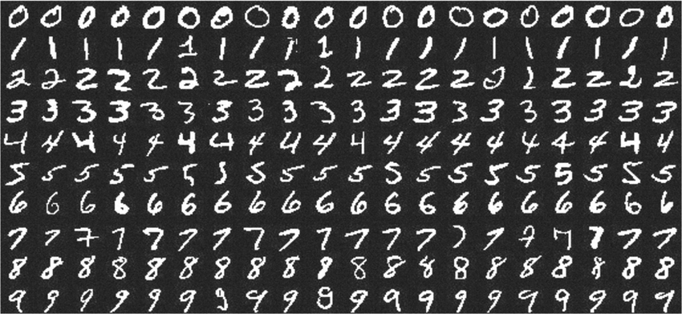

# PyTorch实战神经网络算法


### MNIST手写数字识别




导入模块

```python
import torch
import torch.nn as nn
import torch.nn.functional as F
import torch.optim as optim
from torchvision import datasets, transforms
```


检测CUDA是否可用

```python
use_cuda = torch.cuda.is_available()
```

设置device变量

```python
if use_cuda:
    device = torch.device("cuda")
else:
    device = torch.device("cpu")
```

