 

第1章 绪论
======

数据库的本质是用数据库管理系统高效支持的、使用数据结构组织的数据的集合

1.1数据库系统概述
----------

### 1.1.1数据库的4个基本概念

*   1.数据（Data）

数据是数据库中存储的基本对象。定义为描述事务的符号记录。数据的含义称为语义，数据与其语义是不可分的。

*   2.数据库（DataBase，DB）

长期存储在计算机内，有组织的，可共享的大量数据的集合。

数据库基本特征：1.永久存储  2.有组织  3.可共享  4.冗余度小  5.易扩展

*   3.数据库管理系统（DataBase Management System,DBMS）

位于用户与操作系统之间的一层数据管理软件

数据库管理系统和操作系统一样是计算机的基础软件。

主要功能：提供数据定义语言（DDL）、数据操纵语言（DML）等

*   4.数据库系统（DataBase System,DBS）

数据库系统由数据库（DB），数据库管理系统(DBMS)，应用程序和数据库管理员(DBA)组成的存储、管理、处理和维护数据的系统。

* * *

### 1.1.2数据管理技术的产生和发展（三个阶段）

#### 1.人工管理阶段：

在计算机出现之前，人们运用常规的手段从事记录、存储和对数据加工，也就是利用纸张来记录和利用计算工具（算盘、计算尺）来进行计算，并主要使用人的大脑来管理和利用这些数据。

*   数据的管理者：用户(程序员)，数据不保存
*   数据面向的对象：某一应用程序
*   数据的共享：不共享，冗余大
*   数据的独立性：不独立，完全依赖程序
*   数据的结构：无结构
*   数据控制能力：应用程序自己控制

#### 2.文件系统阶段：

在这一阶段（20世纪50年代后期至60年代中期）计算机不仅用于科学计算，还利用在信息管理方面。随着数据量的增加，数据的存储、检索和维护问题成为紧迫的需要，数据结构和数据管理技术迅速发展起来。此时，外部存储器已有磁盘、磁鼓等直接存取的存储设备。软件领域出现了操作系统和高级软件。操作系统中的文件系统是专门管理外存的数据管理软件，文件是操作系统管理的重要资源之一。

*   数据的管理者：文件系统，可长期保存
*   数据面向的对象：某一应用程序
*   数据的共享：共享差，冗余大
*   数据的独立性：独立性差
*   数据的结构：记录内有结构，整体无结构
*   数据控制能力：应用程序自己控制

#### 3.数据库系统阶段

* * *

### 1.1.3数据库系统的特点

程序员必须关注记录结构和不同文件记录之间的联系，工作量大，变成复杂，开发速度慢，缺乏并发控制。

数据库系统的特点：

*   数据结构化
*   数据的共享性高，冗余度低且易扩充
*   数据独立性高，数据独立性由数据库管理系统的二级映像功能来保证
*   物理独立性：当数据的物理存储改变了，应用数据不用改变
*   逻辑独立性：数据的逻辑结构改变了，应用程序不用改变
*   数据由数据库管理系统管理和控制
*   数据的安全性保护
*   数据的完整性检查
*   并发控制
*   数据库恢复

1.2数据模型
-------

**一、概述** 
  


* * *

**二、数据模型的组成要素**

数据模型通常由数据结构、数据操作和完整性约束三个部分组成。

* * *

**三、逻辑模型的分类（非关系模型与关系模型）**

非关系模型：层次模型(Hierarchical Model)、网状模型(Network Model)

关系模型(Relational Model)

层次模型，满足下面两个条件的基本层次联系的集合为层次模型（就是树结构）：

*   ①有且只有一个结点没有双亲结点，这个结点称为根结点
    
*   ②根以外的其它结点有且只有一个双亲结点
    

网状模型，满足下面两个条件的基本层次联系的集合（一对多关系，结构上像有向图）：

*   ①允许一个以上的结点无双亲；
*   ②一个结点可以有多于一个的双亲。

1.2.2概念模型
---------

**表示方法**：E-R图 
**注意**： E-R图中，实体用矩形表示，属性用椭圆表示，关系用菱形表示。

*   唯一标识实体的属性集叫做超码
*   唯一标识实体的属性集的最小子集为码
*   码肯定是超码，但是超码不一定是码
*   一个实体可以有多个码
*   一个码可以包括一到多个属性

例子：班级号，序号，学号，姓名 
学号是一个码，也是一个超码 
\[班级号，序号\]也是一个码 
\[学号，姓名\]是超码，不是码

* * *

**联系**：用菱形表示，菱形框内写明联系名，并用无向边分别与有关实体型连接起来，同时标明联系的类型（1:1， 1：n， m：n）

比如有两个简单实体，分别是单位和职员，它们的关系就是1:m，一个单位可以有多个职员；

再比如有两个实体，分别是学生和图书，它们的关系就是m:n，从而形成中间表学生借阅的图书，结果是1本图书可以被多人借阅，1个人也可以借多本图书。

* * *

### 1.2.3数据模型的组成要素（3种）

- 数据结构
  - 定义：描述数据库的组成对象，以及对象之间的联系。
  - 描述的内容：
    - 与数据类型、内容、性质有关的对象；
    - 与数据之间联系有关的对象。
  - 数据结构是对系统静态特性的描述。
- 数据操作
  - 定义：对数据库中各种对象(型)的实例(值)允许执行的操作及有关的操作规则。
  - 数据操作的2种类型：数据查询、数据更新(包括插入、删除、修改)。
  - 数据模型必须定义这些操作的确切含义、操作符号、操作规则（如优先级）以及实现操作的语言。
  - 数据操作是对系统动态特性的描述。
- 数据的完整性约束
  - 定义：一组完整性规则的集合。
  - 完整性规则：
    - 含义：给定的数据模型中数据及其联系所具有的制约和储存规则。
    - 作用：用以限定符合数据模型的数据库状态以及状态的变化，以保证数据的正确、有效、相容。
  - 完整性约束类型：
    - 规定本数据模型必须遵守的基本的通用的完整性约束条件。
    - 提供用户定义完整性约束条件的机制，以反映具体应用所涉及的数据必须遵守的特定的语义约束条件。

* * *

### 1.2.4最常用的数据模型


* * *

### 1.2.5层次模型

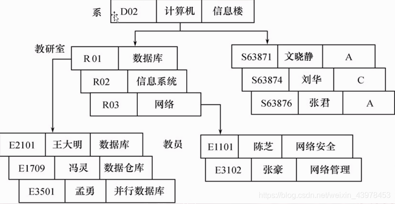

* * *

### 1.2.6网状模型


* * *

### 1.2.6关系模型

- 定义：用关系（表格数据）表示实体和实体之间联系的模型称为关系数据模型。
- 基本概念：
  - 关系（Relation）： 一个关系对应通常说的一张表。
  - 元组（Tuple）： 表中的一行即为一个元组。
  - 属性（Attribute）： 表中的一列即为一个属性，给每一个属性起一个名称即属性名。
  - 主码（Key）： 表中的某个属性组，它可以唯一确定一个元组。
  - 域（Domain）： 属性的取值范围。
  - 分量：元组中的一个属性值。
  - 关系模式：对关系的描述二维表的表头那一行称为关系模式，又称表的框架或记录类型。
  - 例子：关系名（属性1，属性2，属性3...，属性n）—— 学生（学号，姓名，年龄，系）
- 实体及实体间的联系的表示方法
  - 实体型：直接用关系（表）表示。
  - 属性：用属性名表示。
  - 一对一联系：隐含在实体对应的关系中。
  - 一对多联系：隐含在实体对应的关系中。
  - 多对多联系：直接用关系表示。
- 性质
  - 一个关系中不存在两个元组在各个分量（或属性）上完全相同；
  - 行的次序无关；
  - 列的次序无关；
  - 每个分量必须是不可分的量。
- 关系模型的完整性约束
  - 实体完整性：主码唯一且非空
  - 参照完整性：外码的约束
  - 用户定义的完整性：属性上约束条件的定义

#### 实体联系模型转换为关系数据模型的方法

- 1 : 1 联系：在两个实体任选一个添加另一个实体的主键。
- 1 : n 联系：在N端添加另一端的主键作为外键。
- n : m 联系：将联系转换为实体，然后在该实体上加上另外两个实体的主键，作为联系实体的联合主键和两个外键，并再加上该联系自身带的属性。

1.3 数据库系统结构
-----------

数据库系统的三级模式结构：模式（Schema）、外模式（External Schema）、内模式（Internal Schema） 
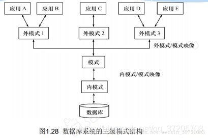 
**模式（也称逻辑模式)\[一个\]**：

*   ①数据库中全体数据的逻辑结构和特征的描述
*   ②所有用户的公共数据视图，综合了所有用户的需求

**模式的地位**：是数据库系统模式结构的中间层

*   ①与数据的物理存储细节和硬件环境无关
*   ②与具体的应用程序、开发工具及高级程序设计语言无关

**外模式（也称子模式或用户模式）\[多个\]**：

*   ①数据库用户（包括应用程序员和最终用户）使用的局部数据的逻辑结构和特征的描述
*   ②数据库用户的数据视图，是与某一应用有关的数据的逻辑表示

**外模式的用途**：

*   ①保证数据库安全性的一个有力措施
*   ②每个用户只能看见和访问所对应的外模式中的数据
*   外模式描述的是数据的局部逻辑结构

**内模式（也称存储模式）\[一个\]**：

*   ①是数据物理结构和存储方式的描述
*   ②是数据在数据库内部的表示方式：

**用途**：

*   a. 记录的存储方式（顺序存储，按照B树结构存储，按hash方法存储）
*   b. 索引的组织方式
*   c. 数据是否压缩存储
*   d. 数据是否加密
*   e. 数据存储记录结构的规定

第2章 关系数据库
=========

2.1 关系数据结构及其形式化定义
-----------------

### 2.1.1关系

*   单一结构的数据结构 ---- 关系
*   逻辑结构 ---- 二维表(在用户的角度)

**1.域（Domain）**：域是一组具有相同数据类型的值的集合，例如整数、自然数都是域

**2.笛卡尔积（Cartesian Product）**：笛卡尔积是域上面的一种集合运算。

笛卡尔积可表示为一个二维表，**表中每行对应一个元组，表中每一列的值来自一个域**

例如，给出3个域：

D1=导师集合SUPERVISOR=｛张清玫，刘逸｝

D2=专业集合SPECIALITY=｛计算机专业，信息专业｝

D3=研究生集合POSTGRADUATE=｛李勇，刘晨，王敏｝

D1，D2，D3的笛卡尔积为

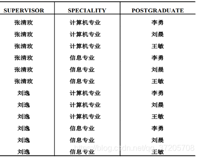  
**3.关系（Relation）**

若关系中的某一属性组的值能唯一地标识一个元组，则称该属性组为候选码（Candidate key）

若一个关系有多个候选码，则选定其中一个或多个为主码（Primary key）

**候选码**：通过该属性组能推出所有的属性，并且该属性组的任意子集都不能再推出所有属性了。即在满足完全函数依赖的前提下，还得是最小的属性组。

**全码**：若所有的属性组是候选码，那么称之为全码

**超码**：任意候选码的任意父集称为超码

**主码**：一个关系中有多个候选码，那么选择一个称为主码

**主属性**：候选码的属性称为主属性，不包含在任何候选码的属性叫做非主属性或非码属性

**范式**：关系必须满足一定的规范条件，规范化后的关系称为范式

* * *

### 2.1.2关系模式

关系模式是型(静态)，关系是值(动态)。  
关系模式是对关系的描述：

*   元组集合的结构
*   完整性约束条件

### 2.2.1基本的关系操作

常用的关系操作：选择，投影，连接，除，并，差，交，笛卡尔积

选择，投影，并，差，笛卡尔积是5种基本操作  

数据的更新：插入，删除，修改

* * *

### 2.2.2关系的三类完整性约束

- 实体完整性：主属性非空 

- 参照完整性：非主属性为空或者为已定义的属性值 
- 用户定义的完整性：针对某一具体的数据库的约束条件，反映某一具体运用所涉及的数据必须满足的语义要求

### 2.2.3关系代数

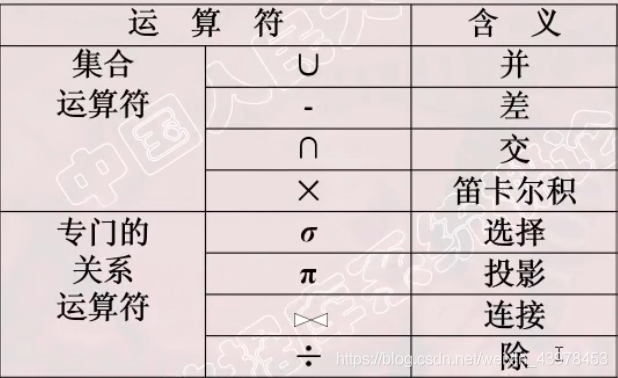

#### 选择（从行的角度进行的运算）

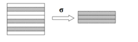 
如查询信息系（IS系）全体学生 


* * *

#### 投影（从列的角度）

投影后不仅取消了原关系中的某些列，可能也会取消某些元组（去掉重复行）

 
如查询学生的姓名和所在系 


* * *

#### 连接（从两个关系的笛卡尔积中选取属性间满足一定条件的元组）

一般连接

*   两个表对应的列符合某个条件的连接，保留所有符合条件的行和列

等值连接

*   对应列值相等的一般连接，保留所有符合的行和列

自然连接(特殊的等值连接)

*   R和S具有相同的属性组B，且连接后移除重复列
*   需要两个关系有同名的相同属性，并且自然连接的结果要移除重复列 
     
    如：可以先得到两个关系的笛卡尔积，然后筛选出C < E的 
    

* * *

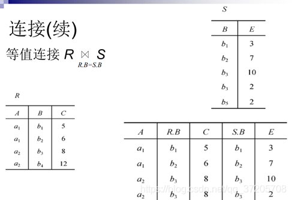

* * *


* * *

#### 悬浮元组与外连接

两个关系R和S在做自然连接时，关系R中某些元组有可能在S中不存在公共属性上值相等的元组，从而造成R中这些元组在操作时被舍弃了，这些被舍弃的元组称为悬浮元组。

外连接（OUTER JOIN）

如果把悬浮元组也保存在结果关系中，而在其他属性上填空值(Null)，就叫做外连接

左外连接(LEFT OUTER JOIN或LEFT JOIN)：只保留左边关系R中的悬浮元组

右外连接(RIGHT OUTER JOIN或RIGHT JOIN)：只保留右边关系S中的悬浮元组 
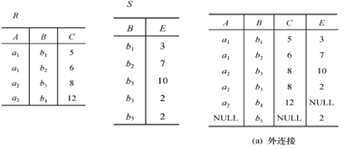 
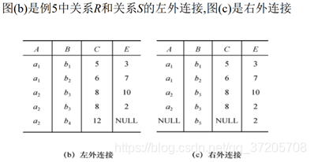 

* * *

#### 除

设R和S除运算的结果为T，则T包含所有在R中但不在S中的属性和值，且T的元组与S的元组经过组合均能出现在R中。

 
 
 
综合例子：以学生-课程数据库为例子 
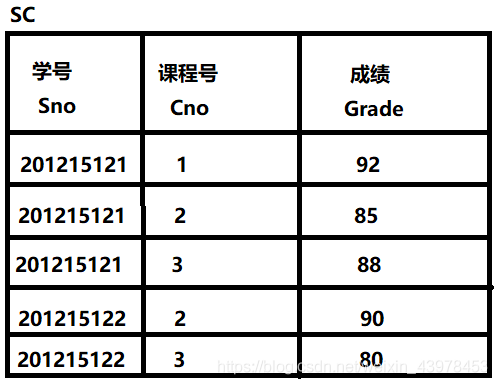

查询至少选修了1号课程和3号课程的学生号码 
建立一个临时关系K 
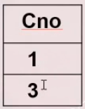 


* * *

第3章 关系数据库标准语言SQL
================

## 3.1 结构化查询语言SQL

### 3.1.1 SQL的定义

- 结构化查询语言，是关系数据库的标准语言
- SQL是一个通用的、功能极强的关系数据库语言

### 3.1.2 SQL的特点

*   集数据定义语言(DDL),数据操纵语言(DML)，数据控制语言(DCL)功能于一体
*   可以独立完成数据库生命周期中的全部活动
*   用户数据库投入运行后，可根据需要随时逐步修改模式，不影响数据库的运行
*   数据操作符统一
*   高度非过程
*   面向集合的操作方式
*   以同一种语法结构提供多种使用方式
*   语言简洁，易学易用

### 3.1.3 SQL基本概念

基本表

*   本身独立存在的表
*   SQL中一个关系对应一个基本表
*   一个(或多个)基本表对应一个存储文件
*   一个表可以带若干个索引

存储结构

*   逻辑结构组成了关系数据库的内模式
*   物理结构对用户是隐蔽的

视图

*   从一个或几个基本表中导出的表
*   数据库中只存放视图的定义不存放视图对应的数据
*   视图是一个虚表
*   用户可以在视图上再定义视图

3.2 数据定义
------------

### 3.2.1 定义、删除与修改基本表

#### 定义基本表

 **CREATE TABLE <表名>   （<列名> <数据类型>[ <列级完整性约束条件> ]      [,<列名> <数据类型>[<列级完整性约束条件>] ] …      [,<表级完整性约束条件> ] ）；**

<表名>：所要定义的基本表的名字

<列名>：组成该表的各个属性（列） 

<列级完整性约束条件>：涉及相应属性列的完整性约束条件 

<表级完整性约束条件>：涉及一个或多个属性列的完整性约束条件 

**常用完整性约束**

- 主码约束：PRIMARY KEY
- 唯一性约束：UNIQUE
- 非空值约束：NOT NULL
- 参照完整性约束：FOREIGN KEY

#### 修改基本表

**ALTER TABLE <表名> [ ADD <新列名> <数据类型> [ 完整性约束 ] ] [ DROP <完整性约束名> ] [ ALTER COLUMN<列名> <数据类型> ]；**

<表名>：要修改的基本表 

ADD子句：增加新列和新的完整性约束条件 

DROP子句：删除指定的完整性约束条件 

Alter 子句：用于修改列名和数据类型

#### 删除基本表

**DROP TABLE <表名>［RESTRICT| CASCADE］;**

- RESTRICT：删除表是有限制的。
  - 欲删除的基本表不能被其他表的约束所引用 
  - 如果存在依赖该表的对象，则此表不能被删除
- CASCADE：删除该表没有限制。 
  - 在删除基本表的同时，相关的依赖对象一起删除 

### 3.2.2 建立与删除索引

#### 建立索引

**CREATE [UNIQUE] [CLUSTER]       INDEX   <索引名>  ON  <表名>      (<列名>[<次序>][,<列名>[<次序>] ]…)；**

目的：建立索引是为了**加快查询速度**。

索引是关系数据库的内部实现技术，属于**内模式**的范畴。

关系数据库常见的索引有： 
(1）顺序文件上的索引

*   顺序文件中物理记录的顺序和逻辑记录的顺序是一致的
*   适合顺序存储：可以比较相等，比较大小

(2）B+树索引

*   B+树的非叶子节点只包含导航信息，不包含实际值
*   所有的叶子节点和相连的节点使用链表相连
*   适合顺序存储，链表存储，且列值大都不重复(例如身份证，分数)
*   可以比较大小，相等

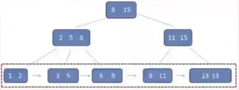

* * *

(3）散列(hash)索引

*   建立若干桶bucket，通过散列函数映射数值-例：求余，把整数值属性映射到10个桶。
*   适合顺序存储，链表存储
*   只适合比较相等，不适合比较大小
*   主要适合文本 
    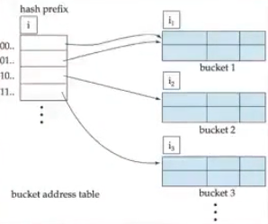

(4）位图索引（bitmap index）

* map应该理解为从一个K值列映射为K个二进制列(独热编码)

* 适合只有几个固定值且不频繁更新的列（如性别，婚姻，国别等）

* 只适合比较相等

* 例子，n=5个人，分数有A,B,C三种，生成k=3个长度为n的二进制向量，查分=A时，直接和A对应的第一个位图向量求位与运算

  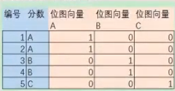

**索引的不足** 
虽然索引大大提高了查询速度，同时可能会显著降低更新表的速度，因为更新表时，DBMS不仅要存储数据，还要保存一下索引文件。

建立索引会占用磁盘空间的索引文件，一般情况这个问题不太严重。

#### 删除索引

**DROP INDEX <索引名>；**

* * *

### 3.2.3 比较不同的索引类型

#### 1.顺序文件上的索引(聚簇存取)

*   可对一组记录建立一个索度引项。这种索引表称为稀疏索引。即不是每一个键值都出现在索引数组中。稀疏索引一定程度上牺牲了精确查找的效率，但大大提高了查询效率。
*   B+树索引可以用来组织适用于组织索引顺序文件的动态索引结构(B+树索引中，所有记录节点都是按键值的大小顺序存放在同一层叶子节点中)
*   聚簇索引下，数据在物理上按顺序排在数据页上。一个表只能有一个聚簇(比如学生，可以按照班级聚簇，那么这个时候就不能再按照学号进行聚簇了)，经常连接的多个表也可以按照连接属性值聚簇存放(相当于预连接)，例如Student.Sno和SC.sno，利于连接访问，但不利于单表访问

#### 2.非顺序文件的索引(索引存取)

*   需要稠密索引，即每个记录都要有一个索引指针。适合随机读写，不适合批量读写(磁头需要不断移动)
*   非顺序文件的B+树索引：可以比较相等，比较大小。不适合批量读写
*   哈希索引：只适合比较相等，不适合比较大小
*   位图索引：适合只有几个固定值且不频繁更新的列(例如性别，国籍)，只适合比较相等

3.3 数据查询
--------

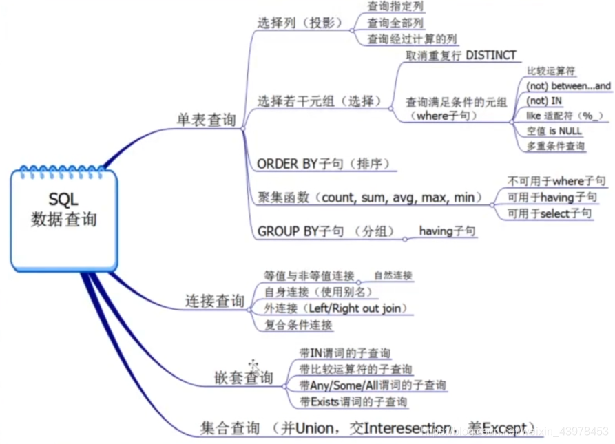  

* * *

### 单表查询

查询语句（SELECT）是数据库中最基本的和最重要的语句之一，其功能是从数据库中检索满足条件的数据。查询的数据源可以来自一张表，也可以来自多张表甚至来自视图，查询的结果是由0行（没有满足条件的数据）或多行记录组成的一个记录集合，并允许选择一个或多个字段作为输出字段。SELECT语句还可以对查询结果进行排序、汇总等。查询语句的基本结构可描述为：

```sql
SELECT <目标列名序列> -- 需要哪些列
	FROM <表名> [JOIN <表名> ON <连接条件>] -- 来自哪些表
	[WHERE <行选择条件>] -- 根据什么条件
	[GROUP BY <分组依据列>]
	[HAVING <组选择条件>]
	[ORDER BY <排列依据列>]
```


其中：

*   SELECT 子句用于指定输出的字段
*   FROM 子句用于指定数据的来源
*   WHERE 子句用于指定数据的行选择条件
*   GROUP BY 子句用于对检索到的记录进行分组
*   HAVING 子句用于指定对分组后结果的选择条件
*   ORDER BY 子句用于对查询的结果进行排序

#### 选择表中若干列

1. 查询指定的列

       -- 查询全体学生的学好与姓名
       SELECT Sno, Sname FROM Student

2. 查询全部列

       -- 查询全体学生的全部信息
       SELECT Sno, Sname, Ssex, Sbirthday, Sdept, Memo FROM Student
       -- 等价于
       SELECT * FROM Student

3. 查询表中没有的列

       -- 含表达式的列：查询全体学生的姓名及年龄（年龄的列名是空）
       SELECT Sname, YEAR(GETDATE()) - YEAR(Sbirthday) FROM Student
       
       -- 查询全体学生的姓名、年龄、字符串“今年是”以及今年的年份（给列取别名）
       SELECT Sname 姓名,
       YEAR(GETDATE()) - YEAR(Sbirthday) 年龄, 
       '今年是' 今年是, YEAR(GETDATE()) 年份 
       FROM Student


#### 选择表中若干行

1. 查询满足条件的元组

**WHERE 子句常用的查询条件：**

| 查询条件 |                谓词                 |
| :------: | :---------------------------------: |
|   比较   |       =, >, >=, <=, <, <>, !=       |
| 确定集合 | BETWEEN … AND …, NOT BETWEEN … AND… |
| 确定集合 |             IN, NOT IN              |
| 字符匹配 |           LIKE, NOT LIKE            |
|   空值   |        IS NULL, IS NOT NULL         |
| 多重条件 |               AND, OR               |

```sql
-- 1. 比较大小--------------------------------------------
-- 查询计算机系所有学生的姓名
SELECT Sname FROM Student WHERE Sdept='计算机系'

-- 查询考试成绩大于90的学生的学号、课程号和成绩
SELECT Sno, Cno, Grade FROM SC WHERE Grade > 90

-- 2. 确定范围--------------------------------------------
/*
注意：
BETWEEN ... AND ... ：包括边界
NOT BETWEEN ... AND ... ：不包括边界
*/
-- 查询学分在2～3之间的课程的课程名称、学分和开课学期
SELECT Cname, Credit, Semester FROM Course WHERE Credit BETWEEN 2 AND 3
-- 等价于
SELECT Cname, Credit, Semester FROM Course 
WHERE Credit >= 2 AND Credit <=3

-- 查询学分不在2～3之间的课程的课程名称、学分和开课学期
SELECT Cname, Credit, Semester FROM Course 
WHERE Credit NOT BETWEEN 2 AND 3
-- 等价于
SELECT Cname, Credit, Semester FROM Course
WHERE Credit < 2 OR Credit > 3

-- 查询出生在1997年的学生的全部信息
SELECT * FROM Student
WHERE Sbirthday BETWEEN '1997-01-01' AND '1997-12-31'

-- 3. 确定集合--------------------------------------------
-- 查询‘计算机系’和‘机电系’学生的学号、姓名和所在系
SELECT Sno, Sname, Sdept FROM Student
WHERE Sdept IN ('计算机系', '机电系')

-- 查询不在‘计算机系’和‘机电系’学生的学号、姓名和所在系
SELECT Sno, Sname, Sdept FROM Student
WHERE Sdept NOT IN ('计算机系', '机电系')

-- 4. 字符串匹配--------------------------------------------
/*
匹配串中有如下四种通配符：
_：匹配任意一个字符
%：匹配0到多个字符
[]：匹配[ ]中任意一个字符。如[abcd]表示匹配a, b, c, d中的一个。
	若要比较的字符是连续的，也可以用连字符'-'表达，比如匹配 abcd中任意一个
	可写成 [a-d]
[^ ]：不匹配[ ]中的任意一个字符，用法与[ ]一致，也可以用'-'表示连续字符
*/
-- 查询姓‘李’的学生的学号、姓名和所在系
SELECT Sno, Sname, Sdept FROM Student
WHERE Sname LIKE '李%'

-- 查询姓名中第二个字是‘冲’的学生的学号、姓名和所在系
SELECT Sno, Sname, Sdept FROM Student
WHERE Sname LIKE '_冲%'

-- 查询学号最后不是‘2’或者‘3’的学生的学号、姓名和所在系
SELECT Sno, Sname, Sdept FROM Student
WHERE Sno NOT LIKE '%[23]'
/*
注：mysql的LIKE好像没有 []和 [^]的用法，但可以用 REGEXP和 NOT REGEXP
	来用正则表达式进行匹配
*/
-- 如mysql下，查询学号最后不是‘2’或者‘3’的学生的学号、姓名和所在系
SELECT Sno, Sname, Sdept FROM Student 
WHERE Sno NOT REGEXP '[23]$'

/*
ESCAPE：可以指定一个字符，将该字符后面的一个字符当作普通字符看待，
	可以用来匹配 '_' 和 '%' 等通配符
*/
-- 查询msg字段中包含 "30%" 的记录
WHERE msg LIKE '%30!%%' ESCAPE '!'

-- 5. 涉及空值的查询--------------------------------------------
-- 查询还没有考试的学生的学号、相应的课程号
SELECT Sno, Cno FROM SC
WHERE Grade IS NULL

-- 查询有备注的学生的学号、姓名和备注
SELECT Sno, Sname, Memo FROM Student
WHERE Memo IS NOT NULL

-- 6. 多重条件查询--------------------------------------------
-- 查询‘计算机系’有备注的学生的学好、姓名、所在系和备注
SELECT Sno, Sname, Sdept, Memo FROM Student
WHERE Memo IS NOT NULL AND Sdelt = '计算机系'

-- 查询 ‘机电系’和‘计算机系’1997年出生的学生的学号、姓名、所在系和生日
SELECT Sno, Sname, Sdept, Sbirthday FROM Student
WHERE (Sdept = '计算机系' OR Sdept = '机电系')
AND Sbirthday BETWEEN '1997-01-01' AND '1997-12-31'
```

2. 消除取值相同的行

```sqL
/*
虽然原关系中不存在两个完全相同的元组，
但经过一定操作后可能会出现相同的元组
*/
-- 查询有考试挂科的学生的学号
SELECT DISTINCT Sno FROM SC
WHERE Grade < 60
```

3. 对查询结果进行排序

```SQL
/*
语法格式：
ORDER BY <列名> [ASC | DESC][, ...n]
ASC  表示升序
DESC 表示降序
默认ASC
*/
-- 将‘C01’号课程的成绩按升序排列
SELECT Cno, Grade FROM SC
WHERE Cno='C01' ORDER BY Grade

-- 将‘1001’号学生的成绩按降序排列
SELECT Cno, Grade FROM SC
WHERE Sno='1001' ORDER BY Grade DESC
```

4. 使用聚合函数进行统计

   **SQL常用聚合函数：**

   1.  COUNT(\*)：统计表中元组的个数
   2.  COUNT(\[DISTINCT\] <列名>)：统计本列的列值个数，DISTINCT表示去掉重复值后再统计
   3.  SUM(<列名>)：计算列值的和值（必须是数值类型）
   4.  AVG(<列名>)：计算列值的平均值（必须是数值类型）
   5.  MAX(<列名>)：得到列的最大值
   6.  MIN(<列名>)：得到列的最小值

   注：除了COUNT(\*)外，其他函数均忽略NULL值。

   统计函数的计算范围可以是满足WHERE子句条件的记录，也可以对满足条件的组进行计算。

   ```sql
   -- 统计学生总数
   SELECT COUNT(*) 学生人数总数  FROM Student
   
   -- 统计学生‘1001’的总成绩
   SELECT SUM(Grade) 总成绩 FROM SC WHERE Sno='1001'
   
   -- 统计学生‘1001’的平均成绩
   SELECT AVG(Grade) 平均成绩 FROM SC WHERE Sno='1001'
   -- 注：类型与Grade一致，如果是Grade是整型那么平均值也是整型
   
   -- 统计课程‘C01’的最高分数和最低分数
   SELECT MAX(Grade) 最高分, MIN(Grade) 最低分
   FROM SC WHERE Cno='C01'
   ```

5. 对数据进行分组

   GROUP BY 子句提供了对数据进行分组的功能，使用GROUP BY 子句可将统计控制在组这一级。分组的目的是细化聚合函数的作用对象，可以一次用多个列进行分组。

   HAVING 子句用于对分组后的统计结果再进行筛选，它一般和GROUP BY 子句一起使用，这两个子句的一般形式为：

   ```sql
   GROUP BY <分组依据列> [, ...n]
   [HAVING <组提取条件>]
   ```


   1. 使用GROUP BY 子句

      ```sql
      -- 统计每门课程的选课人数，列出课程号和选课人数
      SELECT Cno 课程号, COUNT(Sno) 选课人数
      FROM SC GROUP BY Cno
      
      -- 统计每个学生的选课门数，列出学号，选课门数和平均成绩
      SELECT Sno 学号, COUNT(Cno) 选课门数, AVG(Grade) 平均成绩
      FROM SC GROUP BY Sno
      
      -- 统计每个系的男生人数和女生人数，结果按系名升序排列
      SELECT Sdept, Ssex, COUNT(*) 人数 FROM Student
      GROUP BY Sdept, Ssex ORDER BY Sdept
      ```

   2. 使用WHERE子句的分组

      ```sql
      -- 统计每个系男生人数
      SELECT Sdept, Count(*) 男生人数 FROM Student
      WHERE Ssex = '男' GROUP BY Sdept
      /*
      注：带有WHERE的子句的分组查询是先执行WHERE子句的选择，
      	得到结果后再进行分组统计
      */
      ```

   3. 使用HAVING 子句。HAVING子句用于对分组后的统计结果再进行筛选，它的功能与WHERE类似，但它用于组而不是单个记录。在HAVING中能使用聚合函数，但在WHERE不能。

      ```sql
      -- 查询选课门数不超过3门的学生的学号和选课门数
      SELECT Sno, COUNT(*) 选课门数 FROM SC
      GROUP BY Sno HAVING COUNT(*) > 3
      
      -- 查询‘计算机系’和‘机电系’每个系的学生人数，有两种写法
      SELECT Sdept, COUNT(*) FROM Student
      GROUP BY Sdept
      HAVING Sdept IN ('计算机系', '机电系')
      
      SELECT Sdept, COUNT(*) FROM Student
      WHERE Sdept IN ('计算机系', '机电系')
      GROUP BY Sdept
      -- 其中第二种效率更高
      /*
      关于WHERE、GROUP BY、HAVING
      - WHERE 用来筛选FROM 中指定的数据源所产生的行数据
      - GROUP BY 用来对经过WHERE 筛选的结果数据进行分组
      - HAVING 用来对分组后的统计结果再进行筛选
      在分组前用先WHERE 进行筛选可以减少分组后的数据量，所以效率更好。
      */
      ```


### 多表连接查询

#### 内连接

内连接是一种最常用的连接类型。使用内链接时，如果两个表的相关字段满足连接条件，则从这两个表中提取数据并组合成新的记录。

```sql
-- 查询每个学生及其选课的详细
SELECT * FROM Student JOIN SC ON Student.Sno = SC.Sno
/*
注：如果用 * 会出现重复列 Sno，要消除重复列则需要进行投影
*/

-- 查询每个学生及其选课的详细，要求去掉重复列
SELECT S.Sno, Sname, Ssex, Sbirthday, Sdept, Memo, Cno, Grade
FROM Student S JOIN SC ON S.Sno=SC.Sno
/*
注：在FROM后面写 '关系名 别名' 如 Student S，可将S替代Student，
	用来简化SQL语句
*/

/*
查询‘计算机系’选修了‘数据库原理’课程的学生成绩单，成绩单包含姓名、
课程名称、成绩
*/
SELECT Sname, Cname, Grade
FROM Student S JOIN SC ON S.Sno = SC.Sno
JOIN Course C ON SC.Cno = C.Cno
WHERE Sdept = '计算机系' AND Cname = '数据库原理'

-- 查询选修了‘数据库原理’课程的学生姓名和所在系
SELECT Sname, Sdept
FROM Student S JOIN SC ON S.Sno = SC.Sno
WHERE Cname = '数据库原理'

-- 统计每个系学生的平均成绩
SELECT Sdept, AVG(Grade) 系平均成绩
FROM Student S JOIN SC ON S.Sno = SC.Sno
JOIN Course C ON SC.Cno = C.Cno
GROUP BY Sdept

-- 统计‘计算机系’学生中每门课程的选课人数、平均分、最高分和最低分
SELECT Cno, COUNT(*) 选课人数, AVG(Grade), MAX(Grade), MIN(Grade)
FROM Student S JOIN SC ON S.Sno = SC.Sno
WHERE Sdept = '计算机系'
GROUP BY Cno
```

#### 自连接

自连接是一种特殊的内连接，它是指相互连接的表在物理上是同一张表，但在逻辑上是两张表。

```sql
-- 查询课程‘数据库原理’的先修课程名
SELECT C1.Cname 课程名, C2.Cname 先修课程名
FROM Course C1 JOIN Course C2 ON C1.PreCno = C2.Cno
WHERE C1.name = '数据库原理'

-- 查询与‘张三’在同一个系学习的学生姓名和所在系
SELECT S2.Sname, S1.Sdept
FROM Student S1 JOIN Student S2 ON S1.Sdept = S2.Sdept
WHERE S1.Sname = '张三' AND S2.Sname != '张三'
```

#### 外连接

有时候我们希望输出那些不满足连接条件的元组信息，就需要用外连接来实现。外连接是只限制一张表中数据必须满足连接条件，而另一张表中的数据不必满足连接条件。外连接分为左外连接和右外连接两种，语法为：

```sql
FROM 表1 LIFT | RIGHT JOIN 表2 ON <连接条件> 
```


样例：

```sql
/*
查询计算机系全体学生的选课情况，包括学号、姓名、所在系、课程编号，
包括没有选课的学生
*/
SELECT S.Sno, Sname, Sdept, SC.Cno
FROM Student S LEFT JOIN SC ON S.Sno = SC.Sno
WHERE Sdept = '计算机系'

-- 查询没有人选的课程和课程名
SELECT Cname, Sno FROM Course C LEFT JOIN SC
ON C.Cno = SC.Cno
WHERE SC.Cno IS NULL

-- 统计‘计算机系’每个学生的选课门数，包括没有选课的学生
SELECT S.Sno, COUNT(SC.Cno) 选课门数
FROM Student S LEFT JOIN SC ON S.Sno = SC.Sno
GROUP BY S.Sno

/*
统计‘计算机系’选课门数少于3门的学生的学号和选课门数，包括没选课的学生。
查询结果按选课门数降序排序。
*/
SELECT S.Sno 学号, COUNT(SC.Cno) 选课门数
FROM Student S LEFT JOIN SC ON S.Sno = SC.Sno
WHERE Sdept = '计算机系'
GROUP BY S.Sno
HAVING COUNT(SC.Cno) < 3
ORDER BY COUNT(SC.Cno) DESC
```

#### TOP（LIMIT）的使用

在使用SELECT语句进行查询时，有时只希望列出结果集中的前几行，而不是全部结果。TOP格式如下：

```sql
TOP n [PERCENT] [WITH THIS]
```


*   n：非负整数
*   TOP n：取查询结果的前n行数据
*   TOP n PERCENT：取查询结果前n%数据
*   WITH THIS：包括并列的结果

TOP子句写在SELECT 后，如果有DISTINCT，则写在DISTINCT后。

```sql
-- 查询‘C01’号课程成绩的前三名的学号和成绩
SELECT TOP 3 Sno, Grade FROM SC 
WHERE Cno = 'C01' ORDER BY Grade DESC

-- 查询学分最多的四门课程的课程名称、学分和开课学期
SELECT TOP 4 Cname, Credit,  Semester
FROM Course ORDER BY Credit DESC

-- 查询选课人数最多的两门课程，列出课程号和选课人数
SELECT TOP 2 WITH THIS Cno, COUNT(*) 选课人数
FROM SC GROUP BY Cno
ORDER BY COUNT(Cno) DESC

/*
注：mysql好像没有TOP子句，而使用 LIMIT替代。LIMIT放在语句最后面。
LIMIT简单使用：
- LIMIT n：表示选取查询结果前n个
- LIMIT n,m：从第n行数据后选取m行数据
*/
-- mysql下，查询‘C01’号课程成绩的前三名的学号和成绩
SELECT Sno, Grade FROM SC 
WHERE Cno = 'C01' ORDER BY Grade DESC LIMIT 3
-- 于上面等价，从第0行数据后选取3行数据
SELECT Sno, Grade FROM SC 
WHERE Cno = 'C01' ORDER BY Grade DESC LIMIT 0,3
```

#### CASE表达式

CASE表达式是一种多分支表达式，它可以根据条件列表的值返回多个可能的结果表达式中的一个。CASE表达式可以用在任何允许使用表达式的地方，它不是一个完整的语句因此不能单独执行。CASE表达式有两种格式，**简单CASE表达式**和**搜索CASE表达式**。

1. 简单CASE表达式。简单CASE表达式将一个测试表达式和一组简单表达式进行比较，如果某个简单表达式与测试表达式值相等，则返回相应的结果表达式的值。

   **简单CASE表达式的语法为：**

   ```sql
   CASE 测试表达式
   WHEN 简单表达式1 THEN 结果表达式1
   WHEN 简单表达式2 THEN 结果表达式2
   ...
   WHEN 简单表达式n THEN 结果表达式n
   [ELSE 结果表达式 n+1]
   END
   ```


   其中：

   *   测试表达式可以是一个变量名、字段名、函数或子查询。
   *   简单表达式中不能包含比较运算符，其类型必须与测试表达式相同，或者可以隐式转化为测试表达式的类型。

   **CASE表达式的执行过程：**

   1. 计算测试表达式，然后从上到下的顺序将测试表达式与每个简单表达式进行比较。

   2. 如果某个简单表达式与测试表达式匹配，则返回第一个与之匹配的WHEN子句对应的结果表达式。

   3. 如果所有简单表达式的值与测试表达式都不匹配，若指定了ELSE子句，则返回ELSE子句对应的结果表达式，否则返回空（NULL）

      ```sql
      /*
      查询全体学生的信息，并对所在系用代码显示：
      ‘计算机系’代码为‘CS’
      ‘机电系’代码为‘JD’
      ‘信息管理系’代码为‘IM’
      其他系代码为‘QT’
      */
      SELECT Sno 学号, Sname 姓名, Ssex 性别,
      CASE Sdept
      	WHEN '计算机系' THEN 'CS'
      	WHEN '机电系' THEN 'JD'
      	WHEN '信息管理系' THEN 'IM'
      	ELSE 'QT'
      END 所在系
      FROM Student
      ```

      

2. 搜索CASE表达式

   **搜索CASE语法格式为：**

   ```sql
   CASE
   WHEN 布尔表达式1 THEN 结果表达式1
   WHEN 布尔表达式2 THEN 结果表达式2
   ...
   WHEN 布尔表达式n THEN 结果表达式n
   [ELSE 结果表达式n+1]
   END
   ```


   **与CASE简单表达式相比，搜索CASE表达式有如下两个区别：**

   1.  在CASE关键字后没有表达式
   2.  在WHEN关键字后是布尔表达式

   **搜索CASE表达式的执行过程：**

   1. 按从上到下顺序计算每个布尔表达式。

   2. 返回第一个取值为TRUE的布尔表达式对应的结果表达式。

   3. 如果没有取值为TRUE的不而表达式，若存在ELSE，返回相应结果表达式，否则返回空（NULL）

      ```sql
      /*
      查询全体学生的信息，并对所在系用代码显示：
      ‘计算机系’代码为‘CS’
      ‘机电系’代码为‘JD’
      ‘信息管理系’代码为‘IM’
      其他系代码为‘QT’
      */
      SELECT Sno 学号, Sname 姓名, Ssex 性别,
      CASE
      	WHEN Sdept = '计算机系' THEN 'CS'
      	WHEN Sdept = '机电系' THEN 'JD'
      	WHEN Sdept = '信息管理系' THEN 'IM'
      	ELSE 'QT'
      END 所在系
      FROM Student
      ```

      

3. 一些CASE样例

   ```sql
   /*
   查询‘C01’号课程的考试情况，列出学号和成绩，同时对成绩进行处理
   如果成绩大于等于90，则显示‘优’
   如果成绩在80到89之间，则显示‘良’
   如果成绩在70到79之间，则显示‘中’
   如果成绩在60到69之间，则显示‘合格’
   如果成绩小于60，则显示不合格
   */
   SELECT Sno, Grade
   CASE
   	WHEN Grade >= 90 THEN '优'
   	WHEN Grade BETWEEN 80 AND 89 THEN '良'
   	WHEN Grade BETWEEN 70 AND 79 THEN '中'
   	WHEN Grade BETWEEN 60 AND 69 THEN '及格'
   	WHEN Grade < 60 THEN '不及格'
   END 等级
   FROM SC
   WHERE Cno='C01'
   
   /*
   统计‘计算机系’每个学生的选课门数，包括没有选课的学生。
   列出学号、选课门数和选课情况，其中对选课情况的处理为：
   如果选课门数超过4门，则选课情况为‘多’
   如果选课门数在2～4之间，则为‘一般’
   如果选课门数在1～2,则为‘少’
   如果没有选课，则为‘未选’
   并将查询结果按选课门数降序排序
   */
   SELECT Sno 学号, COUNT(SC.Cno) 选课门数,
   CASE
   	WHEN COUNT(SC.Cno) > 3 THEN '多'
   	WHEN COUNT(SC.Cno) BETWEEN 2 AND 3 THEN '一般'
   	WHEN COUNT(SC.Cno) = 1 THEN '少'
   	WHEN COUNT(SC.Cno) = 0 THEN '未选'
   END 选课情况
   FROM Student S LEFT JOIN SC ON S.Sno = SC.Sno
   WHERE Sdept = '计算机系'
   GROUP BY S.Sno
   ```


#### 将查询结果保存到表中

SELECT语句产生的查询结果是保存在内存中的，如果希望将查询结果永久保存，比如保存在一个物理表中，可以通过在SELECT语句中使用INTO子句。

**包含INTO子句的SELECT语句语法格式为：**

```sql
SELECT 查询列表序列 INTO <新表名>
FROM 数据源
[...] -- 其他条件子句、分组子句等

/*
注：在MYSQL中，没有SELECT ... INTO 语句，有以下替代方法
*/
-- 创建一个新表，并将查询结果存入表中
CREATE TABLE <新表名> <SELECT 语句>
-- 将查询结果插入到已存在的表中
INSERT INTO <表名> <SELECT 语句>
```


这个语句包含如下3个功能：

1. 执行查询语句产生结果集。

2. 根据查询结果创建一个新表，新表中各列的列名就是查询结果集中的列名，类型就是该列在原表中定义的类型，如果查询结果是聚合函数或表达式等经过计算的结果，则新表中对应的列的数据类型是这些函数或表达式返回的数据类型。

3. 将查询结果集按列对应顺序保存到该新表中。

   -- 将‘计算机系’学生的学号、姓名、性别、年龄保存到新表Student_CS中
   SELECT Sno, Sname, Ssex, YEAR(GETDATE())-YEAR(Sbirthday) Sage
   INTO Student_CS
   FROM Student
   WHERE Sdept = '计算机系'

#### 子查询

在SQL语言中，一个SELECT-FROM-WHERE语句称为一个查询块。如果一个SELECT语句嵌套在一个SELECT、INSERT、UPDATE或DELETE语句中，则称之为**子查询(subquery)**或内层查询；而包含子查询的语句称为**主查询**或外层查询。子查询可以出现在任何能够使用表达式的地方，但通常情况下，子查询语句通常出现在主查询的WHERE子句或HAVING子句，与比较运算符或逻辑运算符一起构成查询条件。

**写在WHERE子句中的子查询通常有如下几种形式：**

*   WHERE <列名> \[NOT\] IN (子查询)
*   WHERE <列名> 比较运算符 (子查询)
*   WHERE EXISTS (子查询)

1. 使用子查询进行基于集合的测试

   使用子查询进行基于集合的测试时，通过运算符IN或 NOT IN，将一个列的值与子查询的结果集进行比较。通常形式为：

   WHERE <列名> \[NOT\] IN (子查询)

   注：在使用IN运算符的子查询时，由该子查询返回的结果集中的列的个数、类型以及语义必须与外层一致。

   ```sql
   -- 查询与‘张三’在同一个系学习的学生学号、姓名、性别、所在系
   SELECT Sno, Sname, Ssex, Sdept FROM Student
   WHERE Sdept IN (
   SELECT Sdept FROM Student WHERE Sname = '张三'
   )
   ```

2. 使用子查询进行比较测试

   使用子查询进行比较测试时，通过比较运算符(=, !=, <, >, <=, >=)，将一个列的值与子查询返回的结果进行比较。通常形式为：

   WHERE <列名> 比较运算符 (子查询)

   注：使用子查询进行比较测试时，要求子查询必须是返回单值的查询语句。

   ```sql
   -- 查询选了'C01'课程且成绩高于平均值的学生的学号和成绩
   SELECT Sno, Grade FROM SC
   WHERE Cno='C01' AND Grade > (
       SELECT AVG(Grade) FROM SC WHERE Cno='C01'
   )
   ```

3. 带有ANY或ALL的子查询

   当子查询返回多个值时，可以使用ANY或ALL的子查询，它的具体含义如下：

   | 运算符  |            含义            |
   | :-----: | :------------------------: |
   |  > ANY  |   大于子查询结果中某个值   |
   |  < ANY  |   小于子查询结果中某个值   |
   | \>= ANY | 大于等于子查询结果中某个值 |
   | <= ANY  | 小于等于子查询结果中某个值 |
   |  = ANY  |   等于子查询结果中某个值   |
   | != ANY  |  不等于子查询结果中某个值  |
   | \> ALL  |   大于子查询结果中所有值   |
   |  < ALL  |   小于子查询结果中所有值   |
   | \>= ALL | 大于等于子查询结果中所有值 |
   | <= ALL  | 小于等于子查询结果中所有值 |
   | != ALL  |  不等于子查询结果中所有值  |

   ```sql
   -- 查询比‘C01’课程成绩都高的选了‘C02’课程的学生的学号和成绩
   SELECT Sno, Grade FROM SC
   WHERE Cno='C01' AND Grade > ALL
   (
   SELECT Grade FROM SC WHERE Cno='C02'
   )
   ```

1. 带EXISTS谓词的子查询

   EXISTS代表存在量词 ∃ \\exists ∃。使用带EXISTS谓词的子查询可以进行存在性测试，其基本使用形式为：

   WHERE \[NOT\] EXISTS

   带EXISTS谓词的子查询不返回查询的数据，只产生逻辑真值或假值。

   * EXISTS的含义：当子查询中有满足条件的数据时，返回真值，否则返回假值。

   * NOT EXISTS的含义：当子查询中有满足条件的数据时，返回假值，否则返回真值。

     -- 查询选了'C01'号课程的学生姓名
     SELECT Sname FROM Student
     WHERE EXISTS
     (
     SELECT * FROM SC
     WHERE SC.Sno = Student.Sno AND Cno='C04'
     )

   **带有EXISTS谓词的子查询需注意：**

   1. 带EXISTS谓词的子查询是先执行外层查询，然后再执行内层查询。由外层查询决定内层查询的结果，外层查询的结果决定内层查询的执行次数。

      **上列过程如下：**

      1.  无条件执行外层查询，在外层查询的结果集中取第一行结果，得到Sno中的一个当前值，然后根据此Sno值处理内层查询。
      2.  将外层的Sno值作为已知值执行内层查询，如果在内层查询中有满足其WHERE条件的记录存在，则EXISTS返回TRUE，表示在外层查询中当前行数据为满足条件的结果，否则返回FALSE
      3.  顺序处理外层表Student中第2、3…行数据，知道处理完所有行。

   2. 由于EXISTS的子查询只返回真值或假值，因此在子查询中执行列名没意义。

   样例：

   ```sql
   -- 查询至少选修了第三学期开设的全部课程的学生姓名
   SELECT Sname FROM Student
   WHERE NOT EXISTS (
   	SELECT * FROM Course
       WHERE Semester=3 AND NOT EXISTS (
       	SELECT * FROM SC
           WHERE SC.Sno = Student.Sno AND Course.Cno = SC.Cno
       )
   )
   
   /*
   此样例可理解为：不存在第三学期课程没有选的学生姓名
   */
   ```


#### 查询的集合运算

SQL也提供了与关系代数中集合运算并、交和差对应的谓词，分别是UNION、INTERSECT、EXCEPT，当使用这些操作进行查询时，参与运算的两个查询需要分别用括号扩起来。

```sql
-- 查询‘计算机系’和‘机电系’的所有学生信息
(SELECT Sno, Sname, Ssex, Sdept
 FROM Student WHERE Sdept = '计算机系'
)
UNION
(SELECT Sno, Sname, Ssex, Sdept
 FROM Student WHERE Sdept = '机电系'
)

-- 查询同时选修了‘C01’与‘C02’课程的学生学号
(SELECT Sno FROM SC WHERE Cno='C01'
)
INTERSECT
(SELECT Sno FROM SC WHERE Cno='C02'
)

-- 查询选修了‘C01’但没选‘C02’课程的学生的学号
(SELECT Sno FROM SC WHERE Cno = 'C01'
)
EXCEPT
(SELECT Sno FROM SC WHERE Cno='C02'
)
```


注：mysql没有INTERSECT和EXCEPT语句，但可以用一些条件语句实现

3.4 数据操作
--------

### 插入数据

**INSERT INTO <表名> [(<属性列1>[，<属性列2 >…)] VALUES (<常量1> [，<常量2>]…), (...) ...**

-  INTO子句 
  - 属性列的顺序可与表定义中的顺序不一致 
  - 可以不指定属性列 
  - 可以指定部分属性列 
- VALUES子句 
  - 提供的值必须与INTO子句匹配（值的个数、值的类型）

* 插入元组

  ```sql
  INSERT INTO  Student (Sno,Sname,Ssex，Sdept，Sage) VALUES ('200215128','陈冬'，'男'，'IS'，18)；
  ```

*   插入子查询结果：可以生成批量需要插入的数据

    ```sql
    -- 将select子句查询出来的数据插入到另一张表
    INSERT INTO <表名> <as> SELECT子句;
    ```

DBMS在执行插入语句时会检查所插元组是否破坏表上已**定义的完整性规则**（实体完整性 参照完整性）和 **用户定义的完整性** （NOT NULL约束 UNIQUE约束 值域约束）

### 修改数据

**UPDATE  <表名> SET <列名>=<表达式>[, <列名>=<表达式>]…  [WHERE <条件>]；**

- 功能：修改指定表中满足WHERE子句条件的元组
- SET子句：指定修改方式、要修改的列、修改后取值
- WHERE子句 
  - 指定要修改的元组 
  - 缺省表示要修改表中的所有元组

DBMS在执行修改语句时会检查修改操作是否破坏表上已定义的完整性规则（实体完整性 主码不允许修改）和 用户定义的完整性（NOT NULL约束 UNIQUE约束 值域约束）

1.修改某一个元组的值

```sql
update Student set Sage=22 where Sno='2012888';
```


* * *

2.修改多个元组的值

```sql
#将所有学生的年龄+1
update Student set Sage=Sage+1;
```


* * *

3.带子查询的修改语句

```sql
update Student set Grade=0 where Sno in (
	select Sno from Studnet where Sdept='CS'
);
```


* * *

### 删除数据

**DELETE FROM <表名> [WHERE <条件>]；**

- 功能： 删除指定表中满足WHERE子句条件的元组
- WHERE子句
  - 指定要删除的元组
  - 缺省表示要删除表中的全部元组，表的定义仍在字典中

1.删除一个元组

```sql
delete from Studnet where Sno='201233242'；
```


* * *

2.删除所有记录

```sql
delete from SC；
```


* * *

3.带子查询的删除语句

```sql
delete from SC where Sno in (
	select Sno from Student where Sdept='CS'
);
```


3.5 视图
------

*   虚表，是从一个或几个基本表(或视图)导出的表
*   只存放视图的定义，不存放视图对应的数据
*   基表中的数据发生变化，从视图中查询出的数据也随之变化

### 定义视图

语法格式： 
create view <视图名> \[(<列名>\[,<列名>\]…)\] as <子查询> \[with check option\]；

- 组成视图的属性列名：全部省略或全部指定
- 子查询不允许含有ORDER BY子句和DISTINCT短语 
- WITH  CHECK  OPTION：表示对视图进行更新、插入、删除操作时，要保证更新、插入、删除的行满足视图定义中的条件。

```sql
#建立信息系学生的视图
create view IS_Student 
as
select  Sno,Sname,Sage from Student where Sdept='IS';
#如果加上with check option表示要求进行修改和插入操作时仍然保证该视图只有信息系的学生
create view IS_Student 
as
select  Sno,Sname,Sage from Student where Sdept='IS'
with check option;
```

基于多个基表的视图：

```sql
#建立信息系选修了1号课程的学生的视图(包括学号，姓名，成绩)
create VIEW IS_S1(Sno,Sname,Grade)
AS
SELECT Student.Sno,Sname,Grade
FROM Student,SC
WHERE Sdept='IS' AND Student.Sno=SC.Sno AND SC.Cno='1';
```


* * *

基于视图的视图：

```sql
#建立信息系选修了1号课程且成绩在90分以上的学生的视图
CREATE VIEW IS_S2
AS
SELECT Sno，Sname，Grade
FROM IS_S1
WHERE Grade>=90；
```


* * *

带表达式的视图:

```sql
#定义一个反映学生出生年份的视图
CREATE VIEW BT_S(Sno，Sname，Sbirth)
AS
SELECT Sno,Sname，2014-Sage
FROM Student；
```


* * *

分组视图：带有聚集函数group by子句的查询来定义视图

```sql
#将学生的学号及平均成绩定义为一个视图
CREATE VIEW S_G(Sno,Grade)
AS 
SELECT Sno,AVG(Grade)
FROM SC 
GROUD BY Sno;
```


* * *

### 删除视图

**DROP  VIEW  <视图名> [CASCADE]；**

- 该语句从数据字典中删除指定的视图定义
- 如果该视图上还导出了其他视图，使用CASCADE级联删除语句，把该视图和由它导出的所有视图一起删除
- 删除基表时，由该基表导出的所有视图定义都必须显式地使用DROP VIEW语句删除 

* * *

### 更新视图

**UPDATE <视图名>  SET <列名>=<表达式>[, <列名>=<表达式>]…  [WHERE <条件>]；**

更新视图的限制：一些视图是不可更新的，因为对这些视图的更新不能唯一地有意义地转换成对相应基本表的更新

------

### 视图的作用

* 简化用户操作

* 使用户能够以多种角度看待同一数据

* 对重构数据库提供了一定程度的逻辑独立性

* 能够对机密数据提供安全保护

* 使得可更加清晰的表达查询


## 3.6数据控制

- 存取权限控制是安全性控制措施的一种， 当进行授权的时候，授权结果存入数据典， 用户提出操作请求时，系统进行操作权限检查，决定是否执行操作。    

- SQL server中包括两种类型的权限：对象权限 和 语句权限

  1. 对象权限

     |   对象   |            操作             |
     | :------: | :-------------------------: |
     |    表    | SELECT INSERT UPDATE DELETE |
     |   视图   | SELECT INSERT UPDATE DELETE |
     | 存储过程 |           EXECUTE           |
     |    列    |        SELECT UPDATE        |

     

  2. 语句权限：语句权限主要指用户具有权限来执行某一语句。这些语句包括：

     1. CREATE DATABASE
     2. CREATE TABLE

     2. CREATE VIEW
     3. CREATE PROCEDURE

### 授权语句

- 语句授权格式：**GRANT  ALL | 语句1 [,语句2]… TO 用户1 [,用户2]…  **
- 对象授权格式：**GRANT  ALL [PRIVILEGES] | 权限1 [,权限2]… ON 对象类型 对象名       TO 用户1 [,用户2]…**

### 权限回收

**REVOKE ALL [PRIVILEGES] | 权限1 [,权限2]… [ON 对象类型 对象名] FROM 用户1 [,用户2]…**

## 存储过程和触发器

### 存储过程

​		存储过程是一系列预先编辑好的、能完成特定功能的SQL语句集，它与特定的数据库相关联，存储在SQL Server服务器上。用户可以像使用自定义的函数一样重复调用这些存储过程，实现它所定义的操作。 

#### 存储过程的类型

1．系统存储过程 

​	（1）sp_addtype：用于定义一个用户定义数据类型。 

​	（2）sp_configure：用于管理服务器配置选项设置。 

​	（3）sp_sendmail：用于发送电子邮件或寻呼信息。 

​	（4）sp_stored_procedures：用于返回当前数据库中的存储过程的清单。 

​	（5）sp_help：用于显示参数清单和其数据类型。 

​	（6）sp_depends：用于显示存储过程依据的对象或者依据存储过程的对象。 

​	（7）sp_helptext：用于显示存储过程的定义文本。 

​	（8）sp_rename：用于修改当前数据库中用户对象的名称。

2．用户自定义存储过程 

​		用户自定义存储过程是由用户创建并能完成某一特定功能的存储过程，是封装了可重用代码的SQL语句模块。用户把经常要执行的数据库处理的功能设计为存储过程，并把它存放在数据库服务器中，使用时就可以在各个程序中重复调用这些存储过程，减轻程序编写的工作量，也避免大量的数据在网络上传输，从而减少网络上的堵塞。

3．扩展存储过程

​		扩展存储过程允许使用高级编程语言（例如C或C++语言）创建应用程序的外部例程，从而使得SQL Server的实例可以动态地加载和运行动态链接库（DLL）函数。其名称以sp_为前缀，使用时按照存储过程的方法执行。

#### 存储过程的创建和执行

1．不能在创建存储过程中使用的语句：在创建存储过程时，下面这些语句不能在创建存储过程中使用。 		

​	（1）CREATE DEFAULT语句。 

​	（2）CREATE RULE语句。 

​	（3）CREATE或ALTER VIEW语句。 

​	（4）CREATE或ALTER PROCEDURE语句。 

​	（5）CREATE或ALTER TRIGGER语句。 

​	（6）CREATE或ALTER FUNCTION语句。 

​	（7）USE database_name语句。 

2．使用Transact-SQL语句创建存储过程 

​		Transact-SQL语言使用CREATE PROCEDURE语句创建存储过程，其一般格式为： 

​				**CREATE PROC [ EDURE ] procedure_name [ ；number ] [ @parameter data_type [ = default ]，…] AS  sql_statement**

​		 说明： 

​				procedure_name：给出存储过程名。 

​				number：为可选的整数，对同名的存储过程指定一个序号。 

​				@parameter：为存储过程的形参，@符号作为第一个字符来指定参数名。

​				data_type：指出参数的数据类型。 

​				default：给出参数的默认值。 

​				sql_statement：存储过程所要执行的SQL语句，它可以是一组SQL语句，可以包含流程控制语句等。

3．执行存储过程 

​		Transact-SQL语言使用EXECUTE语句执行存储过程，其一般格式为：  

​				**EXECUTE procedure_name [parameter]**

#### 存储过程的修改和删除

1．修改存储过程

​		Transact-SQL语言使用ALTER PROCEDURE语句修改存储过程，其一般格式为： 

​				**ALTER PROC [ EDURE ] procedure_name [ ；number ] [ @parameter data_type [ = default ]，…] AS  sql_statement**

2．删除存储过程 

​		Transact-SQL语言使用DROPPROCEDURE语句删除存储过程，其一般格式为： 

​				**DROP PROC [ EDURE ] procedure_name [,…n]**

#### 存储过程的优点

- 存储过程的能力增强了SQL语言的功能和灵活性。 
- 可保证数据的安全性和完整性。 
- 存储过程能够实现较快的执行速度。 
- 可以降低网络的数据流量。 
- 可保证数据访问和修改的一致性。

### 触发器

触发器（trigger）是个特殊的存储过程，它的执行不是由程序调用，也不是手工启动，而是由个事件来触发，当对一个基本表进行INSERT、UPDATE或DELETE操作时，触发器就会自动执行。

#### 触发器的类型

1．DML触发器 

​		DML触发器是当数据库服务器中发生数据操纵语言（DML）事件时执行的存储过程。DML事件包括在指定基本表或视图中修改数据的INSERT语句、UPDATE语句或DELETE语句。	

- AFTER触发器：AFTER 触发器为SQL Server 2000 版本以前所介绍的触发器。该类型触发器要求只有在执行INSERT、UPDATE或DELETE语句操作之后，触发器才被触发，且只能在表上定义。可以为同一个表定义多个触发器，也可以为针对表的同一操作定义多个触发器。对于AFTER 触发器，可以定义哪一个触发器被最先触发，哪一个被最后触发，通常使用系统过程sp_settriggerorder 来完成此任务。	
- INSTEAD OF触发器：使用INSTEAD OF触发器可以代替通常的触发动作，INSTEAD OF触发器执行时并不执行其所定义INSERT、UPDATE或DELETE语句操作，而仅是执行触发器本身。即INSTEAD OF触发器是在接收到执行请求时就被触发，之后的执行操作权交给INSTEAD OF触发器，由它去完成INSERT、UPDATE或DELETE语句的操作。 可以在表上定义INSTEAD OF触发器，也可以在视图上定义INSTEAD OF触发器，但对同一操作只能定义一个INSTEAD OF触发器。
- DDL触发器：DDL触发器是SQL Server 2005的新增功能，是在响应数据定义语言（DDL）事件时执行的存储过程，这些语句主要是以CREATE、ALTER和DROP开头的语句。DDL触发器一般用于执行数据库中的管理任务，如防止数据库表结构被修改等。

#### 触发器的工作原理

- 对于DML触发器来说，在定义了触发器的基本表上发生插入、修改、删除操作时，就会自动派生出一个或两个临时表，一个是插入inserted表，一个是删除deleted表。inserted表和deleted表的结构总是与被该触发器作用的基本表结构相同，而且只能由创建它们的触发器引用。
- 当在基本表上发生插入记录操作时，新插入的行将被存放在inserted表中，当在基本表上发生删除记录操作时，被删除的旧行将被存放在deleted表中。而对于更新记录操作来说，它的实现过程是先删除旧行，然后再插入新行，所以当在基本表上发生更新记录操作时，旧行将被存放在deleted表中，而新行将被存放在inserted表中。一旦触发器完成任务，这两个临时表将自动删除。

#### 触发器的创建和查看

1．不能在触发器中使用的语句：触发器中可以使用大多数Transact-SQL语句，下面这些语句不能在触发器中使用。 

​	（1）CREATE语句，如：CREATE DATABASE、CREATE TABLE、CREATE INDEX等。 

​	（2）ALTER语句，如ALTER DATABASE、ALTER TABLE、ALTER INDEX等。 

​	（3）DROP语句，如：DROP DATABASE、DROP TABLE、DROP INDEX等。 

​	（4）RESTORE语句，如：RESTORE DATABASE等。

#### 触发器的修改和删除

**ALTER TRIGGER trigger_name ON {table_name | view_name} {FOR | AFTER | INSTEAD OF } {[ INSERT ][ , ] [ UPDATE ][ , ][ DELETE ]} AS sql_statement**

#### 触发器的优缺点

- 优点：
  - 除非REFERENCES子句定义了级联引用操作，否则FOREIGN KEY约束只能以与另一列中的值完全匹配的值来验证列值。 、
  - CHECK约束只能根据逻辑表达式或同一表中的另一列来验证列值。 
  - 约束只能通过标准的系统错误信息传递错误信息。 
  - 触发器可以禁止或回滚违反引用完整性的更改，从而取消所尝试的数据修改。 
  - 如果触发器表上存在约束，则在INSTEAD OF触发器执行后但在AFTER触发器执行前检查这些约束。
- 缺点：
  - 要谨慎使用触发器，触发器功能强大，轻松可靠地实现许多复杂的功能，但由于大量的使用触发器会造成数据库及应用程序的维护困难。在数据库操作中，可以通过关系、触发器、存储过程、应用程序等来实现数据操作。同时规则、约束、缺省值也是保证数据完整性的重要保障。如果对触发器过分的依赖，势必影响数据库的结构，同时增加了维护的复杂程序。

第6章 关系数据理论
==========

针对一个具体问题，应该如何构建一个适合他的数据库模式，即应该构造几个关系模式，每个关系模式由哪些属性组成等——数据库逻辑设计问题——**关系数据库规范化理论**

关系数据库的规范化理论主要包括三个方面的内容：

*   函数依赖(核心作用，是模式分解和模式设计的基础)
*   范式(模式分解的标准)
*   模式设计

一个好的关系模式应该具备以下四个条件：

*   尽可能少的数据冗余
*   没有插入异常
*   没有删除异常
*   没有更新异常

函数依赖
--------

**数据依赖**：关系模式中的各属性之间的相互依赖、相互制约的联系称为数据依赖。数据依赖一般分为**函数依赖**、**多值依赖**和**连接依赖**。

*   **函数依赖**：是关系模式中属性之间的一种逻辑依赖关系。 
    学生(学号(Sno)，姓名(Sname)，系名(Sdept))，并且，一个学号对应一个学生，一个学生只在一个系学习。也就是学号确定，那学生姓名和所在系也就确定了。类似于y = f ( x ) y=f(x)y=f(x)，自变量x确定，y也就确定。Sname=f(Sno),Sdept=f(Sno),记作：Sno->Sname,Sno->Sdept

**平凡函数依赖与非平凡函数依赖**：

*   平凡的函数依赖：当属性集Y是属性集X的子集，则必然存在着函数依赖X->Y
*   Y不是X的子集，则称X->Y为非平凡函数依赖

**传递函数依赖**：设有关系模式R(U),U是属性全集，X,Y,Z是U的子集，若X->Y，但Y-/->X而Y->Z，则称Z对X传递函数依赖：X-t->Z。如果Y->X，那么称Z对X直接函数依赖，而不是传递函数依赖。

**函数依赖分为：**

*   完全函数依赖 
    Sno->ID,Sno->Sname,Sno->SDept,SDept->SDeptM
*   部分函数依赖 
    Sname部分依赖于(Sno,ID):只依赖于(Sno,ID)中任意一个 
    ID部分依赖于(Sno,Sname):只依赖于(Sno,Sname)中的Sno
*   传递函数依赖 
    Sno->Sdept->SdeptM

范式（数据库关系设计达到要求的具体程度）

*   非规范化，1NF,2NF,3NF,BCNF（从低级到高级）
*   规范化（从低一级别往高一级别范式的分解过程）

关系模式的范式
-----------

关系模式分解后的好坏用什么标准衡量——范式 

* * *

### 第一范式 1NF

是最基本的规范模式，即关系中的每个属性都是不可再分的简单项，即不存在表中有表的情况.

如果关系模式R所有的属性均为简单属性，即每个属性都是不可再分的，则称R属于第一范式，简称1NF，记作R∈1NF。

然而，一个关系模式仅属于第一范式是不适用的，比如SCD(SNO,CNO,Score，SN,Dept,MN,Age)，有大量的数据冗余，插入异常，删除异常和更新异常等弊端。在SCD中，既存在完全函数依赖，也存在部分函数依赖，显然情况在数据库中是不允许的。克服这些弊端的方法是进行关系分解，去掉过于复杂的函数依赖关系，向更高一级的范式进行转换。


* * *

第一范式的目标是：将基本数据划分成称为实体集或表的逻辑单元，当设计好每个实体后，需要为其指定主码.

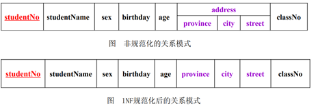

* * *

### 第二范式 2NF

如果关系模式R∈1NF，且每个非主属性都完全函数依赖于R的主关系键，则称R属于第二范式，简称2NF，记作R∈2NF。

第二范式的目标：将只部分依赖于候选码（即依赖于候选码的部分属性）的非主属性移到其他表中。 
  
S-L-C这个函数依赖图中非主属性Sdept和Sloc部分函数依赖于码(Sno, Cno) 


- 采用投影分解法将一个1NF的关系分解为多个2NF的关系，可以在一定程度上减轻原1NF关系中存在的插入异常、删除异常、数据冗余度大、修改复杂等问题。
- 将一个1NF关系分解为多个2NF的关系，并不能完全消除关系模式中的各种异常情况和数据冗余。
- 例子：
  - 设关系模式R（S#，C#，GRADE，TNAME，TADDR）的属性分别表示学生学号、选修课程的编号、成绩、任课教师姓名和教师地址等意义。（S#，C#）是R的候选键。 	    
  - R上有两个FD：（S#，C#）→（TNAME，TADDR）和C#→（TNAME，TADDR），因此前一个FD是局部依赖，R不是2NF模式。此时R的关系就会出现冗余和异常现象。譬如某一门课程有100个学生选修，那么在关系中就会存在100个元组，因而教师的姓名和地址就会重复100次。
  - 如果把R分解成R1（C#，TNAME，TADDR）和R2（S#，C#，GRADE）后，局部依赖（S#，C#）→（TNAME，TADDR）就消失了。R1和R2都是2NF模式。

* * *

### 第三范式 3NF

如果关系模式R∈2NF，且每个非主属性都不传递函数依赖于R的主关系键 
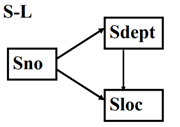 

Sloc传递函数依赖于Sno，即SL中存在非主属性对码的传递函数依赖

解决方法   

​		采用投影分解法，把SL分解为两个关系模式，以消除传递函数依赖：

​				SD（Sno， Sdept）

​				DL（Sdept， Sloc） 

​		SD的关键字为Sno， DL的关键字为Sdept。


* * *

### BCNF范式

通常认为BCNF是修正的第三范式，有时也称为扩充的第三范式。

一个满足BCNF的关系模式有：

*   所有非主属性都完全函数依赖于每个候选码
*   所有的主属性都完全函数依赖于每个不包含它的候选码
*   没有任何属性完全函数依赖于非码的任何一组属性

BCNF范式排除了：

*   任何属性(包括主属性和非主属性)对候选码的部分依赖和传递依赖；
*   主属性之间的传递依赖。

关系模式STJ(S,T,J)中，S表示学生，T表示教师，J表示课程。每一教师只教一门课

每门课有若干教师，某一学生选定某门课，就对应一个固定的教师。

由语义可得到函数依赖：(S,J)→T；(S,T)→J；T→J

因为没有任何非主属性对码传递依赖或部分依赖，

STJ ∈ 3NF。

因为T是决定因素，而T不包含码，所以STJ 不属于 BCNF 关系。

* * *

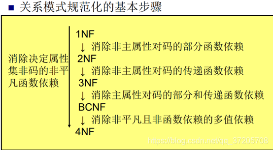

------

## 数据原理的公理系统

Armstrong公理系统是一套推理规则，是模式分解算法的理论基础。

用途 ：

- 从一组函数依赖求得蕴含的函数依赖
- 求给定关系模式的码

### 推理规则

- A1 自反律（Reflexivity）：   若Y 包含于 X 包含于 U，则X → Y为F所蕴含。 
- A2 增广律（Augmentation）：若X→Y为F所蕴含，且Z 包含于 U，则XZ→YZ为F所蕴含。 
- A3 传递律（Transitivity）：若X→Y及Y→Z为F所蕴含，则X→Z为F所蕴含。

### 导出规则

1.根据A1，A2，A3这三条推理规则可以得到下面三条推理规则：

- 合并规则：由X→Y，X→Z，有X→YZ。（A2、A3导出） 
- 伪传递规则：由X→Y，WY→Z，有XW→Z。（A2、A3导出） 
- 分解规则：由X→Y及 ZY，有X→Z。（A1、 A3导出）

2.根据合并规则和分解规则，可得引理4.1   

- 引理4.l ：X→A1, A2…Ak 成立的充分必要条件是 X→Ai成立（i=l，2，…，k）。

### 函数依赖闭包

- 在关系模式R中为F所逻辑蕴含的函数依赖的全体叫作 F的闭包，记为F +。 即：F+={X→Y|X→Y∈F∨“应用Armstong公理从F中导出的任何X→Y”} 		

  例：已知关系模式R中      U={A，B，C，D, E, G}，F={AB→C, C→A, BC→D, ACD→B, D→EG, BE→C, CG→BD, CE→AG}，判断BD→AC是否属于F+

  解：由D→EG知D→E，BD→BE      … ①   知BE→C，C→A 所以BE→A, BE→AC … ②由①、②知，BD→AC，所以BD→AC被F所蕴涵，即BD→AC属于F+

  

- 若F为关系模式R(U)的函数依赖集，X是U的子集，则由Armstrong公理推导出的所有X→Ai所形成的属性集： {Ai|i=1,2,…}      称为X对于F的闭包，记为X+。

​		例：设R=ABC,F={A→B, B→C}当X分别为A,B,C是求X+。

​		 解：当X=A时，X+=ABC    

​				 当X=B时，X+=BC

​				当X=C时，X+=C

### 算法

#### 求X+的算法

(1)算法依据：若F为关系模式R(U)的函数依赖集,X,Z,W是U的子集,对于任意的Z→W∈F,若 X≥Z（表X包含Z），则X→XW。

(2)算法：

​		a. 令X+ = X;

​		b. 在F中依次查找每个没有被标记的函数依赖， 若“左边属性集”包含于X+ ，则令 X+ = X+∪“右边属性集”,为被访问过的函数依赖设置访问标记。

​		c. 反复执行b直到X+不改变为止。

### 极小化过程

(1)逐一检查F中各函数依赖FDi：X→Y，若Y=A1,A2 …Ak，k > 2，则用 { X→Aj |j=1，2，…， k} 来取代X→Y。    例：A→BC可分解为A→B，A→C

(2)逐一检查F中各函数依赖FDi：X→A，令G=F  - {X→A}，若A∈XG+， 则从F中去掉此函数依赖。    例：F={A→B, B→C, A→C}中A→C

(3)逐一取出F中各函数依赖FDi：X→A，设X=B1,B2…Bm，逐一考查Bi （i=l，2，…，m），若A ∈（X-Bi ）F+ ，    则以X-Bi 取代X。

----要判断XY->A中Y是否为多余属性，只要在F中求X＋，如果X＋包含A，则Y为多余属性；否则Y不是多余属性。 

极小化过程也是检验F是否为极小依赖集的一个算法：若改造后的F与原来的F相同，说明F本身就是一个最小依赖集。

## 模式分解

- 把一个关系模式分解成若干个关系模式的过程，称为关系模式的分解。

- 关系模式分解必须遵守两个准则    
  - 无损联接性：信息不失真（不增减信息）。
  - 函数依赖保持性：不破坏属性间存在的依赖关系。

### 检验分解无损联接性的算法

设有关系模式R(A1,A2,…,An), F为它的函数依赖集，ρ={R1,R2,…,Rk}为R的一个分解。

算法：  

​	(1)构造初始表：构造一个k行n列的初始表，其中每列对应于R的一个属性， 每行用于表示分解后的一个模式组成。如果属性Aj属于关系模式Ri, 则在表的第一i行第j列置符号aj，否则置符号bij 。

​	(2)根据F中的函数依赖修改表内容：

​			考察F中的每个函数依赖X→Y,在属性组X所在的那些列上寻找具有相同符号的行，如果找到这样的两行或更多的行，则修改这些行，则使这些行上属性组Y所在的列上元素相同。

​			修改规则是：如果y所在的要修改的行中有一个为aj，则这些元素均变成aj；否则改动为bmj（其中m为这些行的最小行号）。

​			注意：若某个bij被改动，则该列中凡是与bij相同的符号均做相同的改动。

​			循环地对F中的函数依赖进行逐个处理，直到发现表中有一行变为a1,a2,…an或不能再被修改为止。

​	(3)判断分解是否为无损联接：如果通过修改，发现表中有一行变为a1,a2,…an, 则分解是无损联接的，否则分解不具有无损联接性。

### 判断定理

#### 判断分解的无损联接性

设ρ={R1, R2}是关系模式R的一个分解，F是R的函数依赖集，那么ρ是R（关于F）的无损分解的充分必要条件是：

​		(R1∩R2)→R1-R2∈F+  或  (R1∩R2)→R2-R1∈F+

#### 判断分解的函数依赖保持性

设F是关系模式R的函数依赖集，ρ={R1, R2,…, Rk}为R的一个分解，

​		如果 Fi=πRi(F) 的并集 (F1∪F2∪…∪Fk) ≡ F（i=1,2,…,k），则称分解ρ具有函数依赖保持性。
