 

第1章 绪论
======

数据库的本质是用数据库管理系统高效支持的、使用数据结构组织的数据的集合

1.1数据库系统概述
----------

### 1.1.1数据库的4个基本概念

*   1.数据（Data）

数据是数据库中存储的基本对象。定义为描述事务的符号记录。数据的含义称为语义，数据与其语义是不可分的。

*   2.数据库（DataBase，DB）

长期存储在计算机内，有组织的，可共享的大量数据的集合。

数据库基本特征：1.永久存储  2.有组织  3.可共享  4.冗余度小  5.易扩展

*   3.数据库管理系统（DataBase Management System,DBMS）

位于用户与操作系统之间的一层数据管理软件

数据库管理系统和操作系统一样是计算机的基础软件。

主要功能：提供数据定义语言（DDL）、数据操纵语言（DML）等

*   4.数据库系统（DataBase System,DBS）

数据库系统由数据库（DB），数据库管理系统(DBMS)，应用程序和数据库管理员(DBA)组成的存储、管理、处理和维护数据的系统。

* * *

### 1.1.2数据管理技术的产生和发展（三个阶段）

#### 1.人工管理阶段：

在计算机出现之前，人们运用常规的手段从事记录、存储和对数据加工，也就是利用纸张来记录和利用计算工具（算盘、计算尺）来进行计算，并主要使用人的大脑来管理和利用这些数据。

*   数据的管理者：用户(程序员)，数据不保存
*   数据面向的对象：某一应用程序
*   数据的共享：不共享，冗余大
*   数据的独立性：不独立，完全依赖程序
*   数据的结构：无结构
*   数据控制能力：应用程序自己控制

#### 2.文件系统阶段：

在这一阶段（20世纪50年代后期至60年代中期）计算机不仅用于科学计算，还利用在信息管理方面。随着数据量的增加，数据的存储、检索和维护问题成为紧迫的需要，数据结构和数据管理技术迅速发展起来。此时，外部存储器已有磁盘、磁鼓等直接存取的存储设备。软件领域出现了操作系统和高级软件。操作系统中的文件系统是专门管理外存的数据管理软件，文件是操作系统管理的重要资源之一。

*   数据的管理者：文件系统，可长期保存
*   数据面向的对象：某一应用程序
*   数据的共享：共享差，冗余大
*   数据的独立性：独立性差
*   数据的结构：记录内有结构，整体无结构
*   数据控制能力：应用程序自己控制

#### 3.数据库系统阶段

* * *

### 1.1.3数据库系统的特点

程序员必须关注记录结构和不同文件记录之间的联系，工作量大，变成复杂，开发速度慢，缺乏并发控制。

数据库系统的特点：

*   数据结构化
*   数据的共享性高，冗余度低且易扩充
*   数据独立性高，数据独立性由数据库管理系统的二级映像功能来保证
*   物理独立性：当数据的物理存储改变了，应用数据不用改变
*   逻辑独立性：数据的逻辑结构改变了，应用程序不用改变
*   数据由数据库管理系统管理和控制
*   数据的安全性保护
*   数据的完整性检查
*   并发控制
*   数据库恢复

1.2数据模型
-------

**一、概述** 
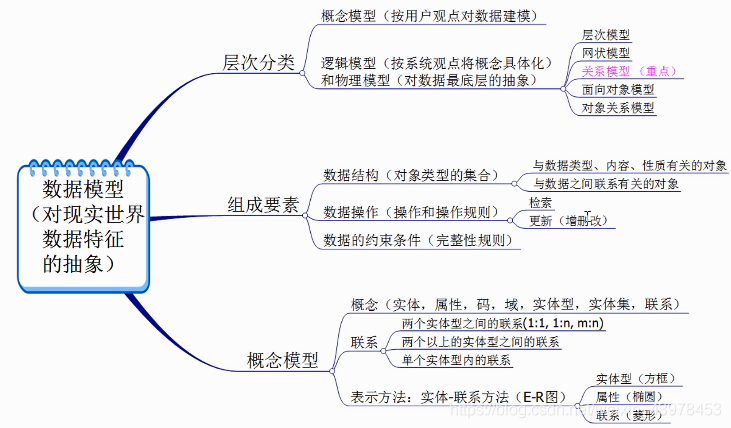  
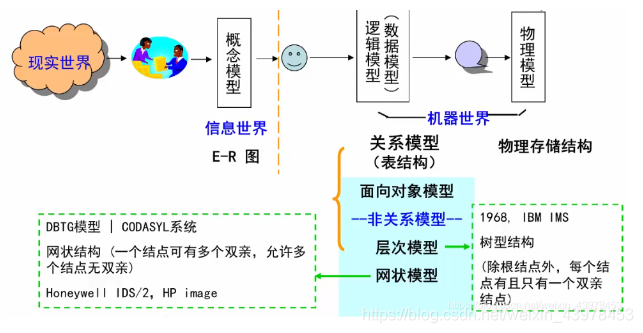

* * *

**二、数据模型的组成要素**

数据模型通常由数据结构、数据操作和完整性约束三个部分组成。

* * *

**三、逻辑模型的分类（非关系模型与关系模型）**

非关系模型：层次模型(Hierarchical Model)、网状模型(Network Model)

关系模型(Relational Model)

层次模型，满足下面两个条件的基本层次联系的集合为层次模型（就是树结构）：

*   ①有且只有一个结点没有双亲结点，这个结点称为根结点
    
*   ②根以外的其它结点有且只有一个双亲结点
    

网状模型，满足下面两个条件的基本层次联系的集合（一对多关系，结构上像有向图）：

*   ①允许一个以上的结点无双亲；
*   ②一个结点可以有多于一个的双亲。

1.2.2概念模型
---------

**表示方法**：E-R图 
**注意**： E-R图中，实体用矩形表示，属性用椭圆表示，关系用菱形表示。

*   唯一标识实体的属性集叫做超码
*   唯一标识实体的属性集的最小子集为码
*   码肯定是超码，但是超码不一定是码
*   一个实体可以有多个码
*   一个码可以包括一到多个属性

例子：班级号，序号，学号，姓名 
学号是一个码，也是一个超码 
\[班级号，序号\]也是一个码 
\[学号，姓名\]是超码，不是码

* * *

**联系**：用菱形表示，菱形框内写明联系名，并用无向边分别与有关实体型连接起来，同时标明联系的类型（1:1， 1：n， m：n）

比如有两个简单实体，分别是单位和职员，它们的关系就是1:m，一个单位可以有多个职员；

再比如有两个实体，分别是学生和图书，它们的关系就是m:n，从而形成中间表学生借阅的图书，结果是1本图书可以被多人借阅，1个人也可以借多本图书。

* * *

### 1.2.3数据模型的组成要素（3种）

- 数据结构
  - 定义：描述数据库的组成对象，以及对象之间的联系。
  - 描述的内容：
    - 与数据类型、内容、性质有关的对象；
    - 与数据之间联系有关的对象。
  - 数据结构是对系统静态特性的描述。
- 数据操作
  - 定义：对数据库中各种对象(型)的实例(值)允许执行的操作及有关的操作规则。
  - 数据操作的2种类型：数据查询、数据更新(包括插入、删除、修改)。
  - 数据模型必须定义这些操作的确切含义、操作符号、操作规则（如优先级）以及实现操作的语言。
  - 数据操作是对系统动态特性的描述。
- 数据的完整性约束
  - 定义：一组完整性规则的集合。
  - 完整性规则：
    - 含义：给定的数据模型中数据及其联系所具有的制约和储存规则。
    - 作用：用以限定符合数据模型的数据库状态以及状态的变化，以保证数据的正确、有效、相容。
  - 完整性约束类型：
    - 规定本数据模型必须遵守的基本的通用的完整性约束条件。
    - 提供用户定义完整性约束条件的机制，以反映具体应用所涉及的数据必须遵守的特定的语义约束条件。

* * *

### 1.2.4最常用的数据模型

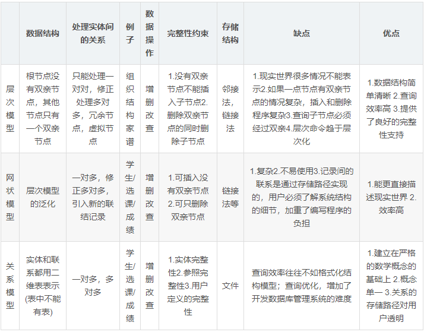

* * *

### 1.2.5层次模型

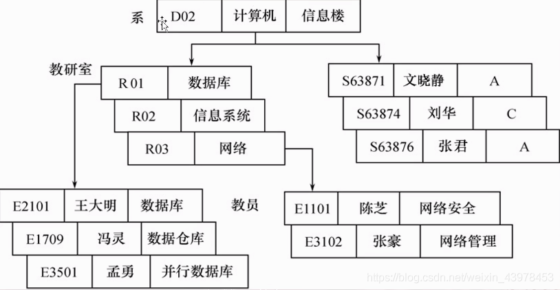

* * *

### 1.2.6网状模型

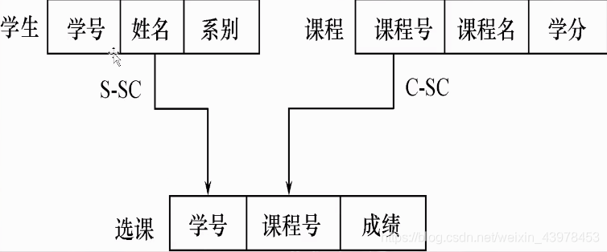

* * *

### 1.2.6关系模型

- 定义：用关系（表格数据）表示实体和实体之间联系的模型称为关系数据模型。
- 基本概念：
  - 关系（Relation）： 一个关系对应通常说的一张表。
  - 元组（Tuple）： 表中的一行即为一个元组。
  - 属性（Attribute）： 表中的一列即为一个属性，给每一个属性起一个名称即属性名。
  - 主码（Key）： 表中的某个属性组，它可以唯一确定一个元组。
  - 域（Domain）： 属性的取值范围。
  - 分量：元组中的一个属性值。
  - 关系模式：对关系的描述二维表的表头那一行称为关系模式，又称表的框架或记录类型。
  - 例子：关系名（属性1，属性2，属性3...，属性n）—— 学生（学号，姓名，年龄，系）
- 实体及实体间的联系的表示方法
  - 实体型：直接用关系（表）表示。
  - 属性：用属性名表示。
  - 一对一联系：隐含在实体对应的关系中。
  - 一对多联系：隐含在实体对应的关系中。
  - 多对多联系：直接用关系表示。
- 性质
  - 一个关系中不存在两个元组在各个分量（或属性）上完全相同；
  - 行的次序无关；
  - 列的次序无关；
  - 每个分量必须是不可分的量。
- 关系模型的完整性约束
  - 实体完整性
  - 参照完整性
  - 用户定义的完整性

#### 实体联系模型转换为关系数据模型的方法

- 1 : 1 联系：在两个实体任选一个添加另一个实体的主键。
- 1 : n 联系：在N端添加另一端的主键作为外键。
- n : m 联系：将联系转换为实体，然后在该实体上加上另外两个实体的主键，作为联系实体的联合主键和两个外键，并再加上该联系自身带的属性。

1.3 数据库系统结构
-----------

数据库系统的三级模式结构：模式（Schema）、外模式（External Schema）、内模式（Internal Schema） 
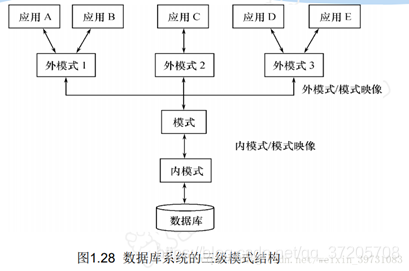 
**模式（也称逻辑模式)\[一个\]**：

*   ①数据库中全体数据的逻辑结构和特征的描述
*   ②所有用户的公共数据视图，综合了所有用户的需求

**模式的地位**：是数据库系统模式结构的中间层

*   ①与数据的物理存储细节和硬件环境无关
*   ②与具体的应用程序、开发工具及高级程序设计语言无关

**外模式（也称子模式或用户模式）\[多个\]**：

*   ①数据库用户（包括应用程序员和最终用户）使用的局部数据的逻辑结构和特征的描述
*   ②数据库用户的数据视图，是与某一应用有关的数据的逻辑表示

**外模式的用途**：

*   ①保证数据库安全性的一个有力措施
*   ②每个用户只能看见和访问所对应的外模式中的数据
*   外模式描述的是数据的局部逻辑结构

**内模式（也称存储模式）\[一个\]**：

*   ①是数据物理结构和存储方式的描述
*   ②是数据在数据库内部的表示方式：

**用途**：

*   a. 记录的存储方式（顺序存储，按照B树结构存储，按hash方法存储）
*   b. 索引的组织方式
*   c. 数据是否压缩存储
*   d. 数据是否加密
*   e. 数据存储记录结构的规定

第2章 关系数据库
=========

2.1 关系数据结构及其形式化定义
-----------------

### 2.1.1关系

*   单一结构的数据结构 ---- 关系
*   逻辑结构 ---- 二维表(在用户的角度)

**1.域（Domain）**：域是一组具有相同数据类型的值的集合，例如整数、自然数都是域

**2.笛卡尔积（Cartesian Product）**：笛卡尔积是域上面的一种集合运算。

笛卡尔积可表示为一个二维表，**表中每行对应一个元组，表中每一列的值来自一个域**

例如，给出3个域：

D1=导师集合SUPERVISOR=｛张清玫，刘逸｝

D2=专业集合SPECIALITY=｛计算机专业，信息专业｝

D3=研究生集合POSTGRADUATE=｛李勇，刘晨，王敏｝

D1，D2，D3的笛卡尔积为

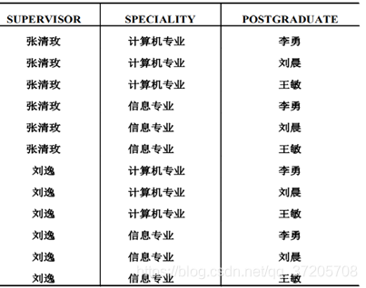  
**3.关系（Relation）**

若关系中的某一属性组的值能唯一地标识一个元组，则称该属性组为候选码（Candidate key）

若一个关系有多个候选码，则选定其中一个或多个为主码（Primary key）

**全码**：若所有的属性组是候选码，那么称之为全码

**超码**：任意候选码的任意父集称为超码

**主码**：一个关系中有多个候选码，那么选择一个称为主码

**主属性**：候选码的属性称为主属性，不包含在任何候选码的属性叫做非主属性或非码属性

**范式**：关系必须满足一定的规范条件，规范化后的关系称为范式

* * *

### 2.1.2关系模式

关系模式是型(静态)，关系是值(动态)。  
关系模式是对关系的描述：

*   元组集合的结构
*   完整性约束条件

* * *

### 2.2.1基本的关系操作

常用的关系操作：选择，投影，连接，除，并，差，交，笛卡尔积

选择，投影，并，差，笛卡尔积是5种基本操作  

数据的更新：插入，删除，修改

* * *

### 2.2.2关系的三类完整性约束

实体完整性

*   主属性非空  
    参照完整性
*   非主属性为空或者为已定义的属性值  
    用户定义的完整性
*   针对某一具体的数据库的约束条件，反映某一具体运用所涉及的数据必须满足的语义要求

### 2.2.3关系代数

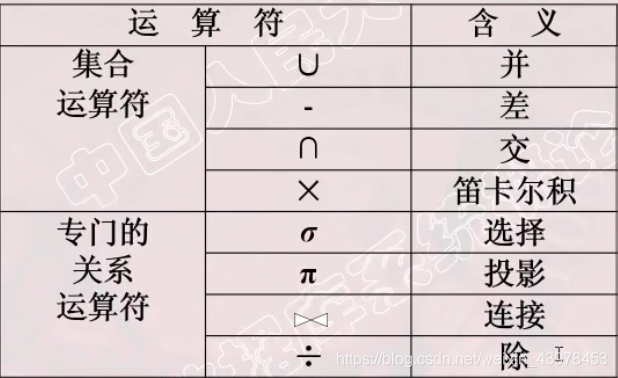

#### 选择（从行的角度进行的运算）

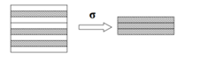  
如查询信息系（IS系）全体学生  
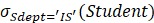

* * *

#### 投影（从列的角度）

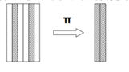  
如查询学生的姓名和所在系  
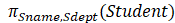

* * *

#### 连接（从两个关系的笛卡尔积中选取属性间满足一定条件的元组）

一般连接

*   两个表对应的列符合某个条件的连接，保留所有符合条件的行和列

等值连接

*   对应列值相等的一般连接，保留所有符合的行和列

自然连接(特殊的等值连接)

*   R和S具有相同的属性组B，且连接后移除重复列
*   需要两个关系有同名的相同属性，并且自然连接的结果要移除重复列  
    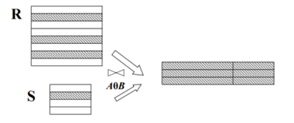  
    如：可以先得到两个关系的笛卡尔积，然后筛选出C < E的  
    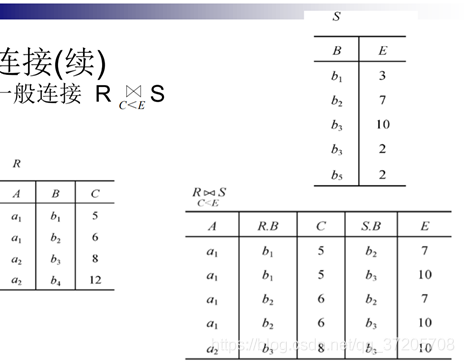

* * *

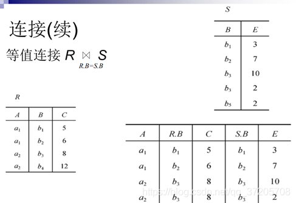

* * *

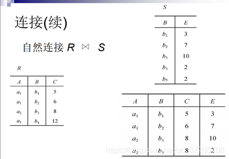

* * *

#### 悬浮元组与外连接

两个关系R和S在做自然连接时，关系R中某些元组有可能在S中不存在公共属性上值相等的元组，从而造成R中这些元组在操作时被舍弃了，这些被舍弃的元组称为悬浮元组。

外连接（OUTER JOIN）

如果把悬浮元组也保存在结果关系中，而在其他属性上填空值(Null)，就叫做外连接

左外连接(LEFT OUTER JOIN或LEFT JOIN)：只保留左边关系R中的悬浮元组

右外连接(RIGHT OUTER JOIN或RIGHT JOIN)：只保留右边关系S中的悬浮元组  
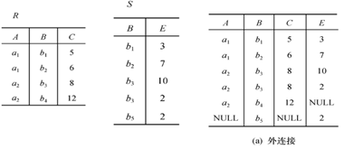  
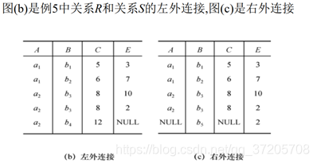  

* * *

#### 除

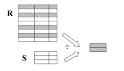  
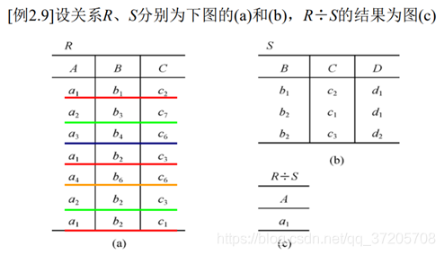  
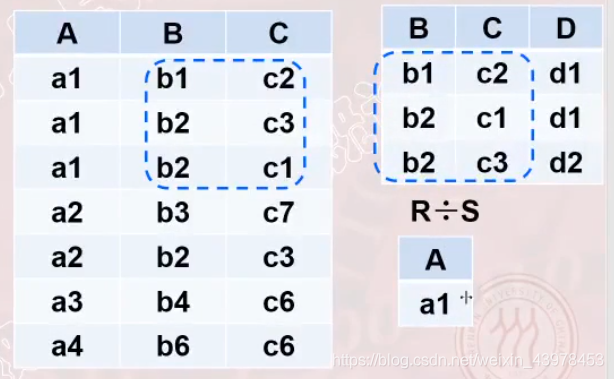  
综合例子：以学生-课程数据库为例子  
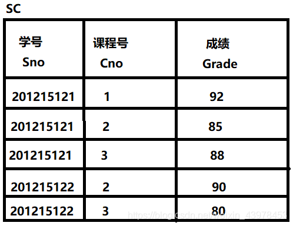

查询至少选修了1号课程和3号课程的学生号码  
建立一个临时关系K  
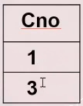  
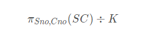

* * *

第3章 关系数据库操作语言SQL
================

### 3.1.2 SQL的特点

*   集数据定义语言(DDL),数据操纵语言(DML)，数据控制语言(DCL)功能于一体
*   可以独立完成数据库生命周期中的全部活动
*   用户数据库投入运行后，可根据需要随时逐步修改模式，不影响数据库的运行
*   数据操作符统一
*   高度非过程
*   面向集合的操作方式
*   以同一种语法结构提供多种使用方式
*   语言简洁，易学易用

* * *

### 3.1.3 SQL基本概念

基本表

*   本身独立存在的表
*   SQL中一个关系对应一个基本表
*   一个(或多个)基本表对应一个存储文件
*   一个表可以带若干个索引

存储结构

*   逻辑结构组成了关系数据库的内模式
*   物理结构对用户是隐蔽的

视图

*   从一个或几个基本表中导出的表
*   数据库中只存放视图的定义不存放视图对应的数据
*   视图是一个虚表
*   用户可以在视图上再定义视图

* * *

3.2 索引的建立与删除
------------

建立索引是为了加快查询速度。

索引是关系数据库的内部实现技术，属于**内模式**的范畴。

关系数据库常见的索引有：  
(1）顺序文件上的索引

*   顺序文件中物理记录的顺序和逻辑记录的顺序是一致的
*   适合顺序存储：可以比较相等，比较大小

* * *

(2）B+树索引

*   B+树的非叶子节点只包含导航信息，不包含实际值
*   所有的叶子节点和相连的节点使用链表相连
*   适合顺序存储，链表存储，且列值大都不重复(例如身份证，分数)
*   可以比较大小，相等

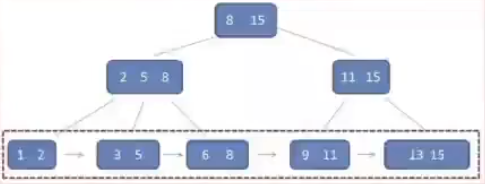

* * *

(3）散列(hash)索引

*   建立若干桶bucket，通过散列函数映射数值-例：求余，把整数值属性映射到10个桶。
*   适合顺序存储，链表存储
*   只适合比较相等，不适合比较大小
*   主要适合文本  
    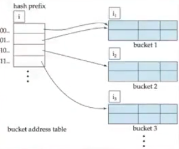

* * *

(4）位图索引（bitmap index）

*   map应该理解为从一个K值列映射为K个二进制列(独热编码)
*   适合只有几个固定值且不频繁更新的列（如性别，婚姻，国别等）
*   只适合比较相等
*   例子，n=5个人，分数有A,B,C三种，生成k=3个长度为n的二进制向量，查分=A时，直接和A对应的第一个位图向量求位与运算
*   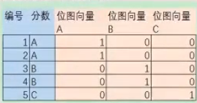

* * *

**索引的不足**  
虽然索引大大提高了查询速度，同时可能会显著降低更新表的速度，因为更新表时，DBMS不仅要存储数据，还要保存一下索引文件。

建立索引会占用磁盘空间的索引文件，一般情况这个问题不太严重。

* * *

### 3.2.1 比较不同的索引类型

#### 1.顺序文件上的索引(聚簇存取)

*   可对一组记录建立一个索度引项。这种索引表称为稀疏索引。即不是每一个键值都出现在索引数组中。稀疏索引一定程度上牺牲了精确查找的效率，但大大提高了查询效率。
    
*   B+树索引可以用来组织适用于组织索引顺序文件的动态索引结构(B+树索引中，所有记录节点都是按键值的大小顺序存放在同一层叶子节点中)
    
*   聚簇索引下，数据在物理上按顺序排在数据页上。一个表只能有一个聚簇(比如学生，可以按照班级聚簇，那么这个时候就不能再按照学号进行聚簇了)，经常连接的多个表也可以按照连接属性值聚簇存放(相当于预连接)，例如Student.Sno和SC.sno，利于连接访问，但不利于单表访问
    
* * *

#### 2.非顺序文件的索引(索引存取)

*   需要稠密索引，即每个记录都要有一个索引指针。适合随机读写，不适合批量读写(磁头需要不断移动)
*   非顺序文件的B+树索引：可以比较相等，比较大小。不适合批量读写
*   哈希索引：只适合比较相等，不适合比较大小
*   位图索引：适合只有几个固定值且不频繁更新的列(例如性别，国籍)，只适合比较相等

* * *

3.3 数据查询
--------

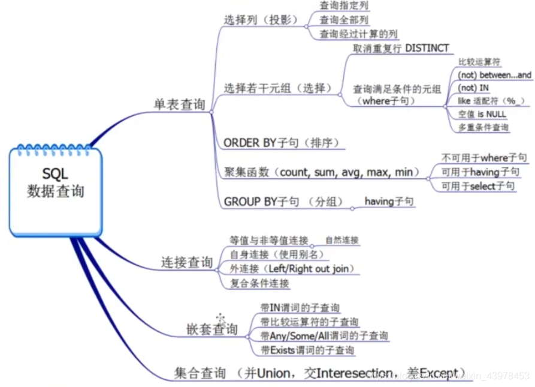  
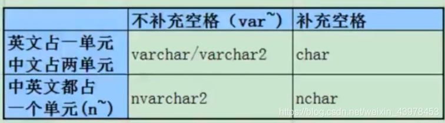

* * *

### 3.3.1 嵌套查询

*   一个SELECT-FROM-WHERE语句称为一个查询块
*   将一个查询块嵌套在另一个查询块的WHERE子句或HAVING短语的条件中的查询称为嵌套查询

SQL语言允许多层嵌套查询

*   即一个子查询中还可以嵌套其他子查询  
    子查询限制
*   不能使用ORDER BY 子句

相关子查询：总查询次数是m\*n

    select t.id,t.name,t.pass from student t where 80<=(select f.score from f where f.id=t.id and f.name='xxx') 

不相关子查询:

    select t.id,t.name,t.pass from t where t.id in (select f.id from  f where f.score=70) 

    select t.id,t.name,t.pass from student t where 80<=(select f.score from f

* * *

1.带有IN谓词的子查询

    查询与“刘晨”在同一个Sdept的学生的Sno，Sname，Sdept
    SELECT Sno ,Sname,Sdept
    FROM Student
    WHERE Sdept IN
    (SELECT Sdept FROM Student WHERE Sname='刘晨')；
    
    #用自身连接查询完成要求
    SELECT S1.Sno ,S1.Sname,S1.Sdept
    FROM Student S1,Student S2
    WHERE S1.Sdept=S2.Sdept AND S2.Sname='刘晨'；

此查询为不相关子查询  
由于DBMS系统对子查询优化不如连接优化做得好，一般鼓励用连接查询代替嵌套子查询

* * *

2.带有比较运算符的子查询

    SELECT Sno,Cno
    FROM SC x
    WHERE Grade >=(SELECT AVG(Grade) FROM SC y WHERE y.Sno=x.Sno);

* * *

3.带有ANY(SOME)或ALL谓词的子查询

    #查询非计算机系中比计算机系任意一个学生年龄小的学生姓名和年龄
    SELECT Sname,Sage
    FROM Student
    WHERE Sage<ANY(SELECT Sage FROM Student WHERE Sdept='CS')
    AND Sdept<>'CS';
    
    #使用聚集函数代替
    SELECT Sname,Sage
    FROM Student
    WHERE Sage<(SELECT MAX(Sage) FROM Student WHERE Sdept='CS');

* * *

4.带有EXISTS，NOT EXISTS谓词的子查询  
带有EXISTS谓词的子查询不返回任何数据，只产生逻辑真值’true’或‘‘false"

*   若内层查询结果非空，则外层的WHERE子句返回真值
*   若内层查询结果为空，则外层WHERE子句返回假值
*   注意这里是否为“空”指是否有返回结果记录行数是否为零

如果exists子查询返回记录但是记录的值为NULL，exists()返回true

    #查询没有选修1号课程的学生姓名
    SELECT Sname
    FROM Student
    WHERE NOT EXISTS(
    	SELECT * FROM SC WHERE Sno=Student.Sno AND Cno='1');

* * *

### 3.3.2 集合查询

1.并操作UNION

*   可以将多个查询结果合并起来，并且系统会自动去重。如果需要保留重复元组，需要用union all

    #查询选修了课程1和课程2的学生
    select Sno from SC where Cno='1'
    union
    select Sno from SC where Cno='2';
    
    #不用集合查询的写法
    select Sno from SC where Cno='1' or Cno='2';
    
* * *

2.交操作intersect

    #查询计算机系的学生与年龄不大于19岁的学生的交集
    select * from SC where Sdept='CS'
    intersect 
    select *from SC where Sage<='19';
    
    #实际上就是查询计算机系中学生年龄不大于19岁的学生
    select *from SC where Sdept='CS' and Sage<='19';

* * *

3.差操作except

#查询计算机系中学生与年龄不大于19岁的学生的差集

    select * from SC where Sdept='CS'
    except
    select * from SC where Sage<='19';
    
    #也就是查询计算机系中年龄大于19的学生
    select *from SC where Sdept='CS' and Sage>='19';

* * *

### 3.3.3 基于派生表的查询

* * *

3.4 数据更新
--------

### 3.4.1 插入数据

*   插入元组
*   插入子查询结果：可以生成批量需要插入的数据

    #对于每一个系，求其平均年龄并放入数据库中
    insert into Dept_age(Sdept,Avg_age)
    select Sdept,avg(Sage) from Student group by Sdept;
    
* * *

### 3.4.2 修改数据

1.修改某一个元组的值

    update Student set Sage=22 where Sno='2012888';

* * *

2.修改多个元组的值

    #将所有学生的年龄+1
    update Student set Sage=Sage+1;

* * *

3.带子查询的修改语句

    update Student set Grade=0 where Sno in (
    	select Sno from Studnet where Sdept='CS'
    );

* * *

### 3.4.3 删除数据

1.删除一个元组

    delete from Studnet where Sno='201233242'；

* * *

2.删除所有记录

    delete from SC；

* * *

3.带子查询的删除语句

    delete from SC where Sno in (
    	select Sno from Student where Sdept='CS'
    );

* * *

### 3.4.4 NULL

NULL表示不确定，并不是表示空的意思  
空值的约束条件

*   属性定义(或者域定义)中
*   有not null 约束条件的不能取空值
*   标准SQL加了UNIQUE限制的属性不能取空值，但实际上像oracle和mysql都是可以用的，加了也不会报错
*   码属性不能取空值

* * *

    #找出选修1号课程的不及格的学生
    SELECT Sno FROM SC WHERE Grade<60 AND Cno=‘1’;
    #注意：查询结果不包括缺考的学生，因为他们的Grade值为null
    
    #选出选修1号课程的不及格的学生以及缺考的学生
    SELECT Sno FROM SC WHERE Grade<60  AND Cno='1'
    union 
    SELECT Sno FROM SC WHERE Grade is null and Cno='1';
    #或者
    SELECT Sno FROM SC WHERE Grade<60 AND (Grade<60 OR Grade IS NULL);
    

* * *

3.5 视图
------

*   虚表，是从一个或几个基本表(或视图)导出的表
*   只存放视图的定义，不存放视图对应的数据
*   基表中的数据发生变化，从视图中查询出的数据也随之变化

* * *

### 3.5.1 定义视图

语法格式：  
create view <视图名> \[(<列名>\[,<列名>\]…)\] as <子查询> \[with check option\]；

with check option：

*   对视图进行update，insert和delete操作时要保证更新，插入或删除的行满足视图定义中的谓词条件(即子查询中的条件表达式)

    #建立信息系学生的视图
    create view IS_Student 
    as
    select  Sno,Sname,Sage from Student where Sdept='IS';
    #如果加上with check option表示要求进行修改和插入操作时仍然保证该视图只有信息系的学生
    create view IS_Student 
    as
    select  Sno,Sname,Sage from Student where Sdept='IS'
    with check option;
    
* * *

基于多个基表的视图：

    #建立信息系选修了1号课程的学生的视图(包括学号，姓名，成绩)
    create VIEW IS_S1(Sno,Sname,Grade)
    AS
    SELECT Student.Sno,Sname,Grade
    FROM Student,SC
    WHERE Sdept='IS' AND Student.Sno=SC.Sno AND SC.Cno='1';

* * *

基于视图的视图：

    #建立信息系选修了1号课程且成绩在90分以上的学生的视图
    CREATE VIEW IS_S2
    AS
    SELECT Sno，Sname，Grade
    FROM IS_S1
    WHERE Grade>=90；

* * *

带表达式的视图:

    #定义一个反映学生出生年份的视图
    CREATE VIEW BT_S(Sno，Sname，Sbirth)
    AS
    SELECT Sno,Sname，2014-Sage
    FROM Student；

* * *

分组视图：带有聚集函数group by子句的查询来定义视图

    #将学生的学号及平均成绩定义为一个视图
    CREATE VIEW S_G(Sno,Grade)
    AS 
    SELECT Sno,AVG(Grade)
    FROM SC 
    GROUD BY Sno;

* * *

### 3.5.2 删除视图

语法：drop view 视图名 \[cascade\]  
cascade：级联删除

* * *

### 3.5.3 查询视图

* * *

### 3.5.3 查询视图

* * *

### 3.5.5 视图的作用

*   简化用户操作
*   使用户能够以多种角度看待同一数据
*   对重构数据库提供了一定程度的逻辑独立性
*   能够对机密数据提供安全保护
*   使得可更加清晰的表达查询

  

第4章 数据库安全性
==========

数据库的数据保护主要包括数据的安全性和完整性。

4.1 数据库安全性概述
------------

**数据库的安全性是指保护数据库以防不合法使用所造成的数据泄露，更改或破坏。**

安全性：去银行取钱需要输入密码  
完整性：取的钱需要小于等于卡里面的钱

* * *

### 4.1.1 数据库的不安全因素

*   非授权用户对数据库的恶意存取和破坏
*   数据库中重要或敏感的数据被泄露
*   安全环境的脆弱性

* * *

4.2 数据库安全性控制
------------

存取控制(AC–Acess Control)

*   **自主存取控制方法(DAC)**:  
    用户对于不同的数据库对象有不同的存取权限，不同的用户对同一对象也有不同的权限，而且用户还可以将其拥有的存取权限转授给其他用户。非常灵活。主要通过SQL的GRANT语句和REVOKE语句来实现。
*   **强制存取控制方法(MAC)**  
    每一个数据库对象被标以一定的密级，每一个用户也被授予某一个级别的许可证。对于任意一个对象，只有具有合法许可证的用户才可以存取。较为严格。

基于角色访问控制(RBAC—Role-Based Acess Control)

* * *

数据库的安全性，主要包括**身份鉴定、多层存取控制、审计、视图和数据加密**等安全技术。

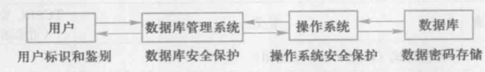

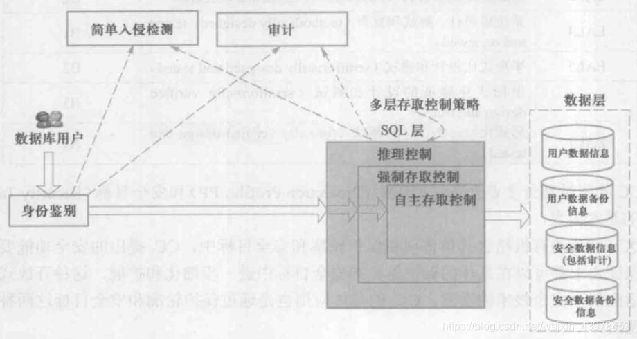

* * *

存取控制流程：

*   首先，数据库管理系统对提出SQL访问请求的数据库用户进行身份验证，防止不可信用户使用
*   然后，在SQL处理层进行自主存取控制和强制存取控制，进一步可以进行推理控制
*   还可以对用户访问行为和系统关键操作进行审计，对异常用户行为进行简单入侵检测

* * *

### 4.2.1 用户身份鉴别

用户身份鉴别是数据库管理系统提供的**最外层安全保护措施**。

每个用户在系统中都有一个**用户标识**。

每个用户标识都由 **用户名(user name)** 和\*\*用户标识号(UID) \*\*两部分组成。

静态口令鉴别

*   其实就是输入密码。所以，这种方式虽然简单，但容易被攻击，安全性较低。

动态口令鉴别

*   通过生物特征进行认证。例如指纹，虹膜和掌纹等。安全性较高

智能卡鉴别

*   智能卡是一种不可复制的硬件，内置集成电路的芯片，具有硬件加密功能。(就比如你去银行取钱，需要出示的不仅是银行卡号，还有身份证一样)。

* * *

### 4.2.3 自主存取控制方法

**用户权限是由两个要素组成：数据库对象和操作类型。**(用户可以在数据库的哪些对象上进行哪些操作)在数据库系统中，定义存取权限称为授权。

在关系数据库系统中，存取控制对象不仅有数据本身(基本表中的数据，属性列上的数据)，还有数据库模式(包括数据库、基本表、视图和索引的创建等)。

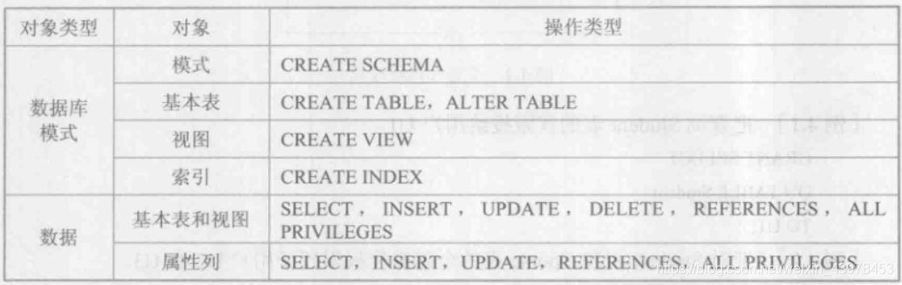

* * *

### 4.2.4 授权：授予与收回

SQL中使用==GRANT(授予)和REVOKE(收回)==语句向用户授予或收回数据的操作权限。

**GRANT语法格式:**

    GRANT<权限>[,<权限>]...
    ON <对象类型><对象名>[,<对象类型><对象名>]...
    TO <用户>[,<用户>]...
    [WITH GRANT OPTION]

**如果添加了WITH GRANT OPTION子句，则获得某种权限的用户还可以把这种权限再授予给其他用户**，但是不允许循环授权，即被授予者不能再把权限授予给授权者或祖先。  
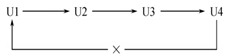

* * *

    #把查询Student表的权限授予给用户U1
    GRANT SELECT 
    ON TABLE Student
    TO U1;
    
    #把对Student和Course表的全部权限授予给用户U2和U3
    GRANT ALL PRIVILEGES
    ON TABLE Student,Course
    TO U2,U3;
    
    #把对SC表的查询权限给所有用户
    GRANT SELECT 
    ON TABLE SC
    TO PUBLIC;
    
    #把查询Student表和修改学生学号的权限给U1
    #注意：对属性列授权时必须明确指出相应的属性列名
    GRANT SELECT,UPDATE(Sno)
    ON TABLE Studnet
    TO U1;

* * *

**REVOKE语法格式:**

    REVOKE <权限>[,<权限>]...
    ON <对象类型><对象名>[,<对象类型><对象名>]...
    FROM <用户>[,<用户>]...[CASCADE|RESTRICT];

    #把用户U4修改学生学号的权限收回
    REVOKE UPDATE(Sno)
    ON TABEL Student
    FROM U4;
    
    #假设U5还将INSERT权限授予给了U6用户，现在把用户U5对SC表的INSERT权限收回
    REVOKE INSERT 
    ON TABLE SC
    FROM U5 CASCADE;
    #注意：这里使用的是CASCADE，有的数据库管理系统默认为RESTRICT，将自动执行级联删除。

* * *

**创建数据库模式的权限**

    CREAT USER <username>[WITH][DBA|RESOURCE|CONNECT];

*   只有系统的超级用户才能授权创建一个新的数据库用户
*   新创建的数据库用户有三种权限：CONNECT,RESOURCE,DBA
*   如果创建时没有指定权限，默认为CONNECT权限。拥有CONNECT 权限的用户只能登录数据库。
*   拥有RESOURCE权限的用户能创建基本表和视图，成为所创建对象的属主，但不能创建模式，不能创建新用户。可以使用GRANT将权限授予给其他用户。
*   拥有DBA权限的用户是超级用户—无所不能。  
    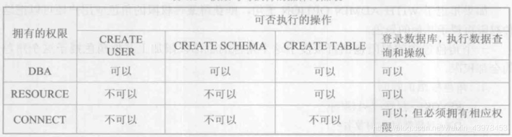

* * *

### 4.2.5 数据库角色

数据库角色是被命名的一组与数据库操作有关的权限，角色是权限的集合。 使用角色来管理数据库权限可以简化授权的过程。

在SQL中首先用CREAT ROLE 语句创建角色，然后用GRANT语句角色授权，用REVOKE语句回收授予角色的权限。

1.角色的创建

    CREAT ROLE <角色名>

2.给角色授权

    GRANT <权限>[,<权限>]...
    ON <对象类型> 对象名
    TO <角色>[,<角色>]...

3.将一个角色授予给其他的角色或用户

    GRANT <角色1>[,<角色2>]...
    TO <角色3>[,<用户1>]...
    [WITH ADMIN OPTION]

4.角色的回收

    REVOKE <权限>[,<权限>]...
    ON <对象类型><对象名>
    FROM <角色>[,<角色>]...

    CREAT ROLE R1;
    GRANT SELECT,UPDATE,INSERT 
    ON RABLE Student
    TO R1;
    
    GRANT R1
    TO 王平,张明,赵玲;
    
    REVOKE R1
    FROM 王平;

* * *

### 4.2.6 强制存取控制方法

强制存取控制是指系统为保证更高程度的安全性，按照TDI/TCSEC标准中安全策略的要求采取的强制存取检查手段。

在强制存取控制中，数据库管理系统所管理的全部实体被分为**主体**和**客体**两大类。

*   主体是系统中的活动实体，包括实际用户以及用户的各进程。
*   客体是系统中的被动实体，是受主体操纵的，包括文件，基本表，索引，视图等。

对于实体和客体，系统为他们每个实例指派一个敏感度被标记。敏感度标记分为若干级，**绝密、机密、可信、公开**等。

*   密级的次序是TS>=S>=C>=P。
*   主体的敏感度标记称为许可证级别，客体的敏感度标记称为密级。
*   强制存取控制就是通过对比主体的敏感度标记和客体的敏感度标记，最终确定主体是否能够存取客体。

**要求：**

*   仅当主体的许可证级别大于或等于客体的密级时，该主体才能读取相应的客体
*   仅当主体的许可证级别小于或等于客体的密级时，该主体才能写相应的客体
*   注意第2点，即用户可以写入数据但是不能再读取自己写入的数据。

**那为什么高级别的主体(用户)不能写低级别的客体(文件)？**

*   如果你是高级别的用户，如果可以写低级别的文件，那么很可能会把高级别的内容写入低几倍的文件中，从而造成了高级别的内容泄露(防止不怀好意的高级别用户有意泄露给低级别的用户)

* * *

4.3 视图机制
--------

    #建立计算机系学生的视图，把对该视图的SELECT权限授予王平，把该视图上的所有操作权限授予张明
    CREAT VIEW CS_Student
    AS 
    SELECT * FROM Student 
    WHERE Sdept='CS';
    
    GRANT SELECT 
    ON CS_Student 
    TO 王平;
    
    GRANT ALL PRIVILEGES
    ON CS_Student
    TO 张明;

* * *

4.4 审计
------

审计功能把用户对数据库的所有操作自动记录下来放进审计日记中。

审计员可以利用审计日记监控数据库中的各种行为，重现导致数据库现有现状的一系列事件，找出非法存取数据的人、事件和内容等，还可以进行防范。

**AUDIT语句和NOAUDIT语句**  
AUDIT语句用来设置审计功能，NOAUDIT用来取消审计功能。审计又可分为用户级审计和系统级审计。

    #对修改SC表结构或修改SC表数据的操作进行审计
    AUDIT ALTER,UPDATE
    ON SC;
    #取消对SC表的一切审计
    NOAUDIT ALTER,UPDATE
    ON SC；

* * *

4.5 数据加密
--------

**数据加密主要包括存储加密和传输加密：**

存储加密

*   一般提供透明和非透明两种存储加密方式：
*   透明存储加密是指内核级加密保护方式，对用户完全透明。在写到磁盘时对数据进行加密，授权用户读取数据时再对其进行解密。
*   非透明存储加密是通过多个加密函数实现

传输加密

*   在客户机/服务器结构中，为保证二者之间的安全数据交换，数据库管理系统提供了传输加密功能。常用的传输加密方式是链路加密和端到端加密。
*   链路加密
    *   在链路层进行加密
    *   传输信息由报文和报头两部分组成
    *   报文和报头均加密
*   端到端加密
    *   在发送端加密，接收端解密
    *   只加密报文不加密报头
    *   所需密码设备数量相对较少，容易被非法监听者发现并从中获取敏感信息。

* * *

第5章 数据库完整性
==========

数据库的完整性是指数据的**正确性**和**相容性**。

5.1 实体完整性:保证了单表各条记录的可区分性
------------------------

### 5.1.1 定义实体完整性

    #将Student表中的Sno属性定义为码
    CREATE TABLE Student(
    	Sno char(9) PRIMARY KEY, #在列级定义主码
    	Sname char(20) NOT NULL,
    	Ssex char(2),
    	Sage SMALLINT,
    	Sdept CHAR(20)
    );
    
    #或
    
    CREATE TABLE Student(
    	Sno char(9), #在列级定义主码
     	Sname char(20) NOT NULL,
     	Ssex char(2),
     	Sage SMALLINT,
     	Sdept CHAR(20)，
     	PRIMARY KEY(Sno)  #在表级定义主码
    );
    #注意：对多个属性构成的主码，只能定义为表级约束条件

* * *

### 5.1.2 实体完整性检查和违约处理

（1）检查主码的值是否唯一，如果不唯一则拒绝插入或修改  
（2）检查主码的各个属性是否为空，只要有一个为空就拒绝插入或修改  
一般检查如果通过全表扫描十分耗时。一般通过在主码上自动建立一个索引来提高效率。

* * *

5.2 参照完整性：实现不同表之间的参考联系
----------------------

### 5.2.1 参照完整性定义

    #定义SC中的参照完整性
    CREATE TABLE SC(
    	Sno CHAR(9) NOT NULL,
    	Cno CHAR(9）NOT NULL,
    	Grade SMALLINT,
    	PRIMARY KEY(Sno,Cno),  #在表级上定义实体完整性
    	FOREIGN KEY(Sno) REFERNECES Student(Sno), #在表级上定义参照完整性
    	FOREIGN KEY(Cno) REFERNECES Student(Cno)  #在表级上定义参照完整性
    );

* * *

### 5.2.2 参照完整性检查和违约处理

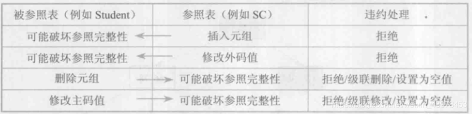

* * *

当发生上述操作，可以采取：

*   拒绝(NO ACTION)执行 默认策略
*   级联(CASCADE)操作
*   设置为空值

    CREATE TABLE SC(
    	Sno CHAR(9),
    	Cno CHAR(4),
    	Grade SMALLINT,
    	PRIMARY KEY(Sno,Cno), #在表级定义实体完整性 Sno和Cno都不能为空值
    	FOREIGN KEY(Sno) REFERENCE Student(Sno) #在表级定义参照完整性
    		ON DELETE CASCADE #当删除Student表中的元组时，级联删除SC表中对应的元组
    		ON UPDATE CASCADE #当更新Student表中的Sno时，级联更新SC表中相应的元组
    	FOREIGN KEY(Cno) REFERENCE Course(Cno) #在表级定义参照完整性
    		ON DELETE NO ACTION #当删除Course表中的元组造成与SC表不一致时，拒绝删除
    		ON UPDATE CASCADE #当更新Course表中的Cno时，级联更新SC表中相应的元组
    );
    
* * *

5.3 用户定义的完整性：常在创建表格时用CHECK自定义约束
-------------------------------

前面已经有了元组约束条件，为什么还要有完整性约束子句？

*   元组约束条件只能适用于建表语句
*   完整性约束命名子句可用于建表语句或修改表定义语句(包括修改约束，删除约束，新增约束)

* * *

### 5.3.1 属性上的约束条件

1.属性上的约束条件定义

*   列值非空(NOT NULL)
*   列值唯一(UNIQUE)
*   检查列值是否满足一个条件表达式(CHECK短语)

    CREATE TABLE Student(
    	Sno CHAR(9) PRIMARY KEY, #在列级定义主码
    	Sname CHAR(8) NOT NULL,  #Sname属性不为空
    	Ssex CHAR(2) CHECK(Ssex IN('男','女'))， #性别属性Ssex只允许取男或女
    	Sage SMALLINT，
    	Sdept CHAR(20)
    );
    

2.属性上约束条件的检查和违约处理

当往表中插入元组或修改属性的值时，关系数据库管理系统将检查属性上的约束条件是否满足，如果不满足则操作被拒绝执行

* * *

5.4 完整性约束命名子句：方便修改，在创建表格外还能修改
-----------------------------

    CONSTRAINT <完整性约束条件名><完整性约束条件>

    CREATE TABLE Student(
     Sno NUMERIC(6)
      CONSTRAINT C1 CHECK(Sno BETWEEN 90000 AND 99999),
     Sname CHAR(20)
      CONSTRAINT C2 NOT NULL,
     Sage NUMERIC(3)
      CONSISTENT C3 CHECK(Sage<30),
     Ssex CHAR(2)
      CONSTRAINT C4 CHECK(Ssex IN('男','女'))，
      CONSTRAINT StudentKey PRIMARY KEY(Sno),
    );

* * *

2.修改表中的完整性限制  
使用ALTER TABLE 语句修改表中的完整性限制

    ALTER TABLE Student
     DROP CONSTRAINT C4;

    ALTER TABLE Student
    DROP CONSTRAINT C1;
    ALTER TABLE Student
    ADD CONSTRAINT C1 CHECK(Sno BETWEEN 900000 AND 999999); 

* * *

5.5 域中的完整性限制：命名域约束，从而可以用到多列上
----------------------------

    #建立一个性别域，并声明性别域的取值范围
    CREATE DOMAIN GenderDomain CHAR(2)
     CHECK(VALUE IN('男','女'));
    #这样，对sex的说明改写为：
    Ssex GenderDomain;

    #建立性别域，并对其中的限制命名
    CREATE DOMAIN GenderDomain CHAR(2)
     CONSTRAIN GD CHECK(VALUE IN('男','女'));
    #删除GenderDomain的限制条件GD
    ALTER DOMAIN Genderdomain 
    	DROP CONSTRAIN GD;
    #删除原来的限制条件并在性别域增加限制条件GDD
    ALTER DOMAIN GenderDomain
    	DROP CONSTRAIN GD；
    ALTER DOMAIN GenderDomain
    	ADD CONSTRAIN GDD CHECK('1','0');

* * *

5.6 断言：更一般化的约束，可以涉及多个表和聚集函数的约束
------------------------------

    #限制每一门课程最多60名学生选修
    CREATE ASSERTION ASS_SC_CNUM1
    	CHECK(60>=(
    		SELECT COUNT(*) FROM SC GROUP BY Cno
    	)); 

* * *

5.7 触发器：定义一到多个表上DML数据操作事件驱动且自动调用的特殊过程
-------------------------------------

触发器是由用户定义在关系表上的一类由事件驱动的特殊过程。

*   触发器保存在数据库服务器中
*   任何用户对表的增、删、改操作均由服务器自动激活相应的触发器，在关系数据库管理系统和核心层进行集中的完整性控制。
*   触发器可以实现更为复杂的检查和操作，具有更精细和更强大的数据控制能力

触发器的优点

*   触发器是自动执行的，当用户对表中的数据作了任何修改之后立即被激活。
*   触发器可以通过数据库中的相关表进行层叠更改，实现多个表之间数据的一致性和完整性。
*   触发器可以强制限制，这些限制比用CHECK约束所定义的更复杂。

触发器的缺点

*   占用宝贵的数据库服务器资源，显著影响性能
*   将业务复杂化
*   显著加大平台迁移难度

* * *

### 5.7.1 定义触发器(CREATE TRIGGER)

    #当触发事件发生时，该触发器被激活
    CREATE TRIGGER<触发器名> 
    {BEFORE|AFTER}<触发事件>ON <表名>
    REFERENCING NEW|OLD ROW AS<变量> #REFERENCING指出引用的变量
    FOR EACH {ROW|STATEMENT}        #定义触发器的类型，指明动作执行的频率
    [WHEN<触发条件>]<触发动作体>      #仅当触发条件为真时才执行触发动作体

    #定义一个BEFORE行级触发器，为教师表Teacher定义完整性规则“教师的工资不低于4000元，如果低于4000，则改为4000”
    CREATE TRIGGER Insert_Or_Update_Sal
    BEFORE INSERT OR UPDATE ON Teacher #触发事件是插入或更新
    FOR EACH ROW                       #行级触发器
    BEGIN 				   #定义触发动作体，是PL/SQL过程块
    	IF(new.job='教授') AND (new.Sal<4000)
    	THEN new.Sal:=4000
    	END IF;
    END;

* * *

    #定义AFTER行级触发器，当教师表Teacher的工资发生变化后自动工资表Sal_log中增加一条相应的记录
    #首先建立工资变化表Sal_log
    CREATE TRIGGER Sal_log
    (
    	Eno NUMERIC(4) references teacher(eno),
    	Sal NUMERIC(7,2),
    	Username VARCHAR(10),
    	Date TIMESTAMP
    );
    
    CREATE TRIGGER Insert_Sal
    AFTER INSERT ON Teacher  #触发事件是INSERT
    FOR EACH ROW 
    BEGIN 
    	INSERT INTO Sal_log 
    	VALUES(
    		new.Eno,new.Sal,CURRENT_USER,CURRENT_TIMESTAMP
    	);
    END;

### 5.7.2 激活触发器

多个触发器，遵循如下的执行顺序：

*   执行该表上的BEFORE触发器
*   激活触发器的SQL语句
*   执行该表上的AFTER触发器

触发器优先级：

*   首先执行Before 语句级触发器，每条语句仅执行一次
*   其次执行Before行级触发器,为SQL语句影响的记录数的多少
*   再次执行After 行级触发器，为SQL语句影响的记录数是多少
*   最后执行是After 语句级触发器，每条语句仅执行一次

* * *

### 5.7.3 删除触发器

    #删除教师表Teacher上的触发器
    DROP TRIGGER Insert_Sal ON Teacher;

* * *

第6章 关系数据理论
==========

针对一个具体问题，应该如何构建一个适合他的数据库模式，即应该构造几个关系模式，每个关系模式由哪些属性组成等——数据库逻辑设计问题——**关系数据库规范化理论**

关系数据库的规范化理论主要包括三个方面的内容：

*   函数依赖(核心作用，是模式分解和模式设计的基础)
*   范式(模式分解的标准)
*   模式设计

一个好的关系模式应该具备以下四个条件：

*   尽可能少的数据冗余
*   没有插入异常
*   没有删除异常
*   没有更新异常

6.2 函数依赖
--------

**数据依赖**：关系模式中的各属性之间的相互依赖、相互制约的联系称为数据依赖。数据依赖一般分为**函数依赖**、**多值依赖**和**连接依赖**。

*   **函数依赖**：是关系模式中属性之间的一种逻辑依赖关系。  
    学生(学号(Sno)，姓名(Sname)，系名(Sdept))，并且，一个学号对应一个学生，一个学生只在一个系学习。也就是学号确定，那学生姓名和所在系也就确定了。类似于y = f ( x ) y=f(x)y=f(x)，自变量x确定，y也就确定。Sname=f(Sno),Sdept=f(Sno),记作：Sno->Sname,Sno->Sdept

**平凡函数依赖与非平凡函数依赖**：

*   平凡的函数依赖：当属性集Y是属性集X的子集，则必然存在着函数依赖X->Y
*   Y不是X的子集，则称X->Y为非平凡函数依赖

**传递函数依赖**：设有关系模式R(U),U是属性全集，X,Y,Z是U的子集，若X->Y，但Y-/->X而Y->Z，则称Z对X传递函数依赖：X-t->Z。如果Y->X，那么称Z对X直接函数依赖，而不是传递函数依赖。

**函数依赖分为：**

*   完全函数依赖  
    Sno->ID,Sno->Sname,Sno->SDept,SDept->SDeptM
*   部分函数依赖  
    Sname部分依赖于(Sno,ID):只依赖于(Sno,ID)中任意一个  
    ID部分依赖于(Sno,Sname):只依赖于(Sno,Sname)中的Sno
*   传递函数依赖  
    Sno->Sdept->SdeptM

范式（数据库关系设计达到要求的具体程度）

*   非规范化，1NF,2NF,3NF,BCNF（从低级到高级）
*   规范化（从低一级别往高一级别范式的分解过程）

6.3 关系模式的范式
-----------

关系模式分解后的好坏用什么标准衡量——范式  
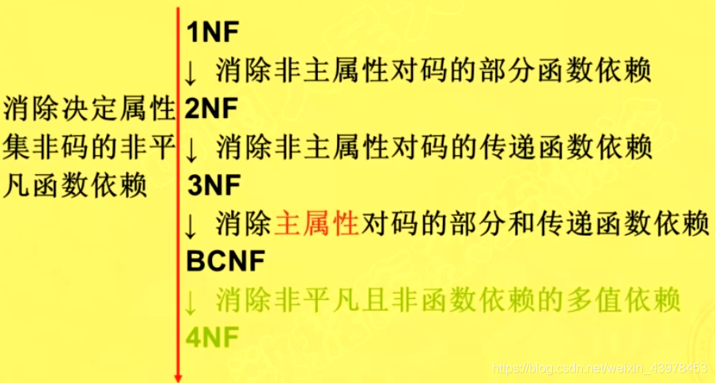

* * *

### 6.3.1 第一范式 1NF

是最基本的规范模式，即关系中的每个属性都是不可再分的简单项，即不存在表中有表的情况.

如果关系模式R所有的属性均为简单属性，即每个属性都是不可再分的，则称R属于第一范式，简称1NF，记作R∈1NF。

然而，一个关系模式仅属于第一范式是不适用的，比如SCD(SNO,CNO,Score，SN,Dept,MN,Age)，有大量的数据冗余，插入异常，删除异常和更新异常等弊端。在SCD中，既存在完全函数依赖，也存在部分函数依赖，显然情况在数据库中是不允许的。克服这些弊端的方法是进行关系分解，去掉过于复杂的函数依赖关系，向更高一级的范式进行转换。

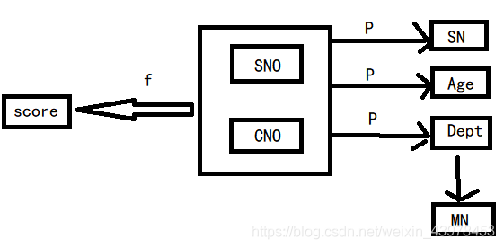

* * *

第一范式的目标是：将基本数据划分成称为实体集或表的逻辑单元，当设计好每个实体后，需要为其指定主码.

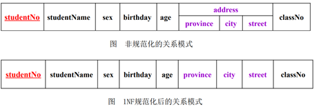

* * *

### 6.3.2 第二范式 2NF

如果关系模式R∈1NF，且每个非主属性都完全函数依赖于R的主关系键，则称R属于第二范式，简称2NF，记住R∈2NF。

2NF的缺点：

*   数据冗余
*   插入异常
*   删除异常
*   更新异常

第二范式的目标：将只部分依赖于候选码（即依赖于候选码的部分属性）的非主属性移到其他表中。  
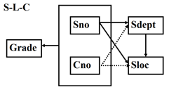  
S-L-C这个函数依赖图中非主属性Sdept和Sloc部分函数依赖于码(Sno, Cno)  
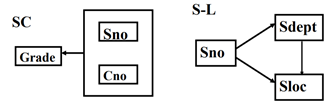

* * *

### 6.3.3 第三范式 3NF

如果关系模式R∈2NF，且每个非主属性都不传递函数依赖于R的主关系键  
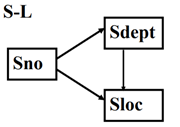  
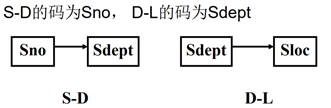

* * *

### 6.3.4 BC范式

通常认为BCNF是修正的第三范式，有时也称为扩充的第三范式。

一个满足BCNF的关系模式有：

*   所有非主属性都完全函数依赖于每个候选码
*   所有的主属性都完全函数依赖于每个不包含它的候选码
*   没有任何属性完全函数依赖于非码的任何一组属性

BCNF范式排除了：

*   任何属性(包括主属性和非主属性)对候选码的部分依赖和传递依赖；
*   主属性之间的传递依赖。

* * *

关系模式STJ(S,T,J)中，S表示学生，T表示教师，J表示课程。每一教师只教一门课，

每门课有若干教师，某一学生选定某门课，就对应一个固定的教师。

由语义可得到函数依赖：(S,J)→T；(S,T)→J；T→J

因为没有任何非主属性对码传递依赖或部分依赖，

STJ ∈ 3NF。

因为T是决定因素，而T不包含码，所以STJ 不属于 BCNF 关系。

* * *

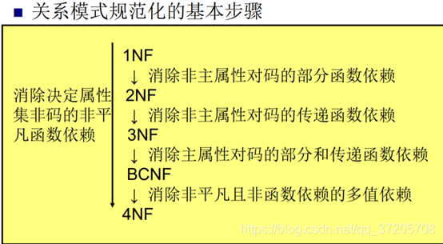

* * *

第7章 数据库设计
=========

*   需求分析：准确了解和分析用户需求（包括数据和处理）
*   概念结构设计：通过对用户需求进行综合、归纳与抽象，形成一个独立于具体DBMS的概念模型
*   逻辑结构设计：将概念结构转换为某个DBMS所支持的数据模型，并对其进行优化
*   物理结构设计：为逻辑数据模型选取一个最适合应用环境的物理结构（包括存储结构和存取方法）
*   数据库实施：根据逻辑设计和物理设计的结果建立数据库，编制与调试应用程序，组织数据入库并试运行
*   数据库运行和维护：在数据库投入正式使用后不断地对其进行评价、调整与修改

* * *

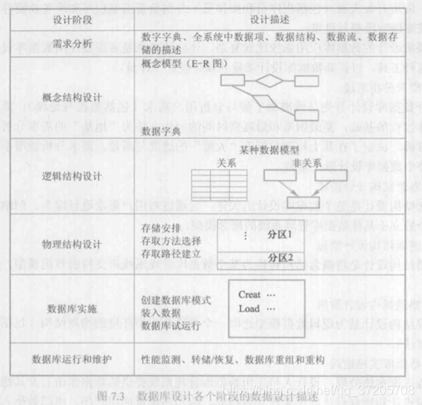

* * *

概念结构设计
------

设计概念结构通常有四类方法

*   自顶向下：即首先定义全局概念结构的框架，然后逐步细化
    
*   自底向上：即首先定义各局部应用的概念结构，然后将它们集成起来，得到全局概念结构
    
*   逐步扩张：首先定义最重要的核心概念结构，然后向外扩充
    
*   混合策略：即将自顶向下和自底向上相结合，用自顶向下策略设计一个全局概念结构的框架，以它为骨架集成由自底向上策略中设计的各局部概念结构。
    

逻辑结构设计
------

E-R图如何转换为[关系模型](https://so.csdn.net/so/search?q=%E5%85%B3%E7%B3%BB%E6%A8%A1%E5%9E%8B&spm=1001.2101.3001.7020)？

*   （1）一个1:1联系可以转换为一个独立的关系模式，也可以与任意一端对应的关系模式合并。如果转换为一个独立的关系模式，则与该联系相连的各实体的码以及联系本身的属性均转换为关系的属性，每个实体的码均是该关系的码；如果与某一端实体对应的关系模式合并，则需要在该关系模式的属性中加入另一个关系模式的码和联系本身的属性。（联系本身的属性？）
    
*   （2）一个1：n联系可以转换为一个独立的关系模式，也可以与n端对应的关系模式合并。如果转换为一个独立的关系模式，则与该联系相连的各实体的码以及联系本身的属性均转换为关系的属性，而关系的码为n端实体的码
    
*   （3）一个m：n联系转换为一个关系模式。与该联系相连的各实体的码以及联系本身的属性均转换为关系的属性，各实体的码组成关系的码或关系码的一部分
    
* * *

第10章 数据库恢复技术
============

尽管数据库系统中采取了各种保护措施来防止数据库的安全性和完整性被破坏以及并发事务的正确执行，但某些故障仍然不可避免，会导致数据库中部分数据的丢失甚至破坏数据库，数据库恢复就是为了将数据库从错误状态恢复到某一已知的正确状态。

事务是用户定义的一个数据库操作序列，这些操作要么全做要么全不做，是一个不可分割的工作单位。例如在关系数据库中，一个事务可以是一条SQL语句、一组SQL语句。

事务通常是以BEGIN TRANSACTION开始，以COMMIT或ROLLBACK结束。COMMIT表示提交，ROLLBACK表示回滚，在事务运行的过程中发生某种故障事务不能继续执行，系统就会将事务对数据库的已完成操作全部撤销，从而回滚到事务开始时的状态。

**事务的特性：**

*   1.原子性：事务是数据库的逻辑工作单位，事务中包括的操作要么都做，要么都不做
    
*   2.一致性：事务执行的结果必须是使数据库从一个一致性状态变到另一个一致性状态。事务执行过程中出现故障则称这时的数据库处于不一致性状态。
    
*   3.隔离性：一个事务的执行不能被其他事务干扰，并发执行的各个事务之间不能互相干扰
    
*   4.持续性（永久性）：一个事务一旦提交，它对数据库中数据的改变就应该是永久性的。
    
* * *

**事务的ACID特性可能遭到破坏的因素有：**

*   (1) 多个事务并行运行时，不同事务的操作交叉执行
*   (2) 事务在运行过程中被强制停止

* * *

### 故障的种类

*   1.事务内部的故障：
*   2.系统故障：如操作系统故障，CPU故障，系统断电
*   3.介质故障：如磁盘损坏、磁头碰撞、瞬时强磁场干扰等
*   4.计算机病毒

* * *

### 恢复的实现技术及策略

#### 数据转储

转储即DBA定期地将整个数据库复制到磁带或另一个磁盘上保存起来的过程。这些备用的数据称为后被副本。

转储分为:

*   静态转储:  
    静态转储必须等待正在运行的用户事务结束才能进行；
*   动态转储  
    转储期间允许对数据库进行存取或修改，即转储和用户事务可以并发执行。

也可分为:

*   海量转储即每次转储全部数据库"
*   增量转储即每次只转储上一次转储后更新的数据。

* * *

#### 登记日志文件（Logging）

日志文件是用来记录事务对数据库的更新操作的文件。不同数据库系统采用的日志文件格式并不完全一样，主要有两种格式：以记录为单位的日志文件和以数据块为单位的日志文件

对以记录为单位的日志文件，日志文件中需要登记的内容包括：

*   各个事务的开始（BEGIN TRANSACTION）标记
*   各个事务的结束（COMMIT或ROLLBACK）标记
*   各个事务的所有更新操作

以上每一条内容记为一个日志记录（log record）

每个日志记录的内容主要包括：

*   事务标识（标明是哪个事务）
*   操作的类型（插入、删除或修改）
*   操作对象（记录内部标识）
*   更新前数据的旧值（对插入操作而言，此项为空值）
*   更新后数据的新值（对删除操作而言，此项为空值）

* * *

### 恢复策略

REDO：重做，正向扫描日志文件，对每个REDO事务重新执行日志文件登记的操作

UDNO：撤销，反向扫描日志文件，对每个UNDO事务的更新操作执行逆操作

COMMIT：提交，将事务中所有对数据库的更新写回到磁盘上的物理数据库中，事务正常结束

ROLLBACK：回滚，事务运行的过程中发生了某种故障，事务不能继续执行，系统将事务中对数据库的所有已完成操作全部撤销，回滚到事务开始时的状态

* * *

### 事务故障的恢复

（1）反向扫描日志文件（即从最后向前扫描日志文件），查找该事务的更新操作

（2）对该事务的更新操作执行逆操作。（来得及或者未来得及写入数据库都没关系）

（3）继续反向扫描日志文件，查找该事务的其他更新操作，并做同样处理

（4）如此继续，直到读到该事务的开始标记

* * *

### 系统故障的恢复

（1）正向扫描日志文件，找出在故障发生前已经提交的事务（这些事务既有BEGIN TRANSACTION记录，也有COMMIT记录），将其事务标记记入REDO队列；同时找出故障发生时尚未完成的事务（这些事务只有BEGIN TRANSACTION记录，无相应的COMMIT记录），将其事务标记记入UNDO队列

（2）对撤销队列中的各个事务执行UNDO操作

（3）对重做队列中的各个事务执行REDO操作

为什么要REDO？考虑已提交事务对数据库的更新可能还留在缓冲区没来得及写入数据库（磁盘）。

* * *

### 介质故障的恢复：

（1）装入最新的数据库后备副本，使数据库恢复到最近一次转储时的一致性状态

（2）装入相应的日志文件副本（转储结束时刻的日志文件副本），重做已完成的事务，即扫描日志文件找出需要重做和撤销的事务  
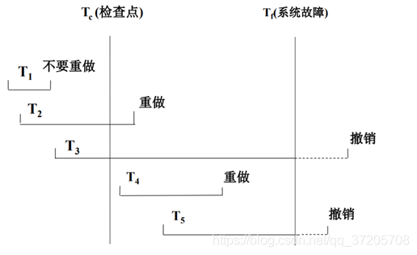

* * *

第11章 并发控制
=========

多事务执行方式：

*   事务串行执行
*   交叉并发方式(其实就是分时间片)
*   同时并发方式

并发控制概述
------

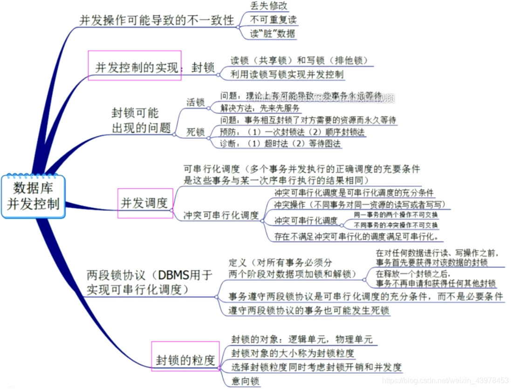

* * *

事务是并发控制的基本单位

并发控制机制的任务

*   对并发控制操作进行正确调度
*   保证事务的隔离性
*   保证数据库的一致性
    *   丢失修改
    *   不可重复读
    *   读“脏”数据

记号

*   R(x)：读数据x
*   W(x)：写数据x

* * *

##### 1、丢失修改

两个事务T1和T2读入同一数据并修改，T2提交的结果破坏了T1提交的结果，导致T1的修改丢失

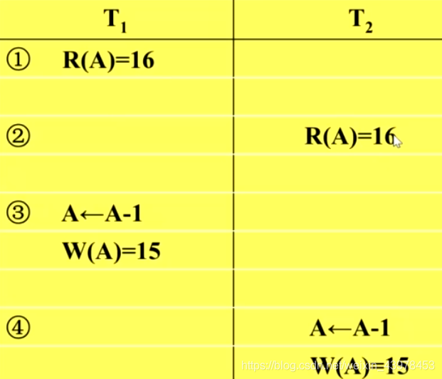

* * *

##### 2、不可重复读

不可重复读是指事务T1读取数据后，事务T2执行更新操作，使T1无法再现前一次的读取结果。

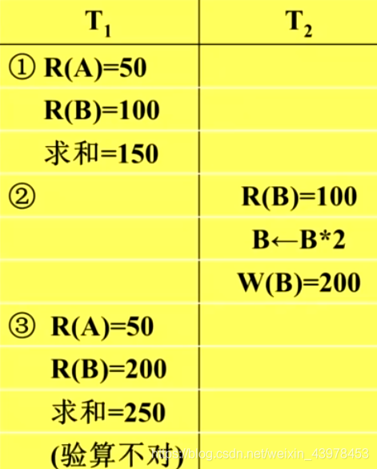

*   事务T1按一定条件从数据库中读取了某些记录之后，事务T2删除了其中的部分记录，当T1再次按相同的条件读取数据时，发现某些记录神秘消失了。
    
*   事务T1按一定条件从数据库中读取某些数据记录后，事务T2插入了一些数据，当T1再次按相同条件读取数据时，发现多了一些数据。
    
*   上面两种现象又称为”幻影”现象。
    
* * *

##### 3、读“脏”数据

事务T1修改某一数据，并将其写回磁盘  
事务T2读取同一数据后，T1由于某种原因被撤销  
这时T1已修改过的数据恢复原值，T2读到的数据就与数据库中的数据不一样  
T2读到的数据就是“脏”数据，即不正确数据

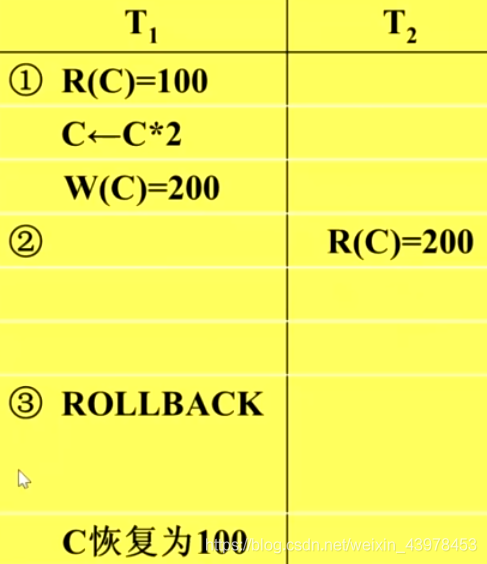

并发控制主要技术：

*   封锁(Locking)——最主要技术
*   时间戳(Timestamp)
*   乐观控制法
*   多版本并发控制(MVCC)

* * *

11.2 封锁
-------

##### 什么是封锁：

*   封锁就是事务T在对某个数据对象(例如表、记录等)操作之前，先向系统发出请求，对其加锁。
*   加锁之后事务T就对该数据对象有了一定的控制，在事务T释放他的锁之前，其他的事务不能更新此数据对象
*   封锁是实现并发控制的一个非常重要的技术

* * *

##### 基本封锁类型：

排它锁(简记为X)，又称为写锁

*   若事务T对数据对象A加上X锁，则只允许T读取和修改A，其他任何事务都不能再对A加任何类型的锁，直到T释放A上的锁
*   保证其他事务在T释放A上的锁之前不能再读取和修改A

共享锁(简记为S)，又称为读锁

*   若事务T对数据对象A加上S锁，则事物T可以读A但不能修改A，其他事务只能再对A加S锁，而不能加X锁，直到T释放A上的S锁
*   保证其他事务可以读A，但在T释放A上的S锁之前不能对A进行任何修改

* * *

11.3 封锁协议
---------

保持数据一致性的常用封锁协议

*   一级封锁协议：事务T在修改数据R之前必须先对其加X锁，直到事务结束才释放
*   二级封锁协议：一级封锁协议加上事务T在读取数据R之前必须先对其加S锁，读完后即可释放S锁
*   三级封锁协议：一级封锁协议加上事务T在读取数据R之前必须先对其加S锁，直到事务结束才释放。

三级协议的主要区别：

*   什么操作需要申请封锁以及何时释放锁(即持锁时间)

不同的封锁协议使事务达到的一致性级别不同

*   封锁协议级别越高，一致性程度越高

* * *

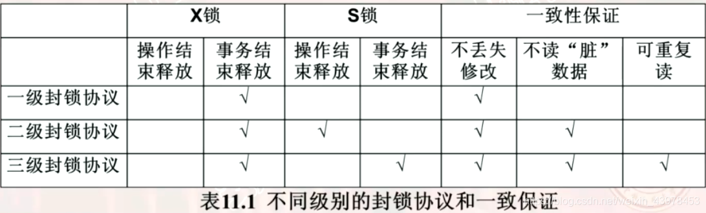

* * *

一级协议：(没有丢失数据修改)

* * *

二级协议(可以防止丢失修改和读“脏“数据)  

* * *

三级封锁协议(防止数据丢失，防止读"脏“数据，不可重复读)  

* * *

11.4 活锁和死锁
----------

### 11.4.1 活锁

事务T1封锁了数据R  
事务T2又请求封锁R，于是T2等待  
T3也请求封锁R，当T1释放了R上的封锁之后系统首先批准了T3的请求，T2仍等待  
T4来了，系统又批准，T2又等待…  
…  
T2有可能永远等待，这就是活锁的情形

避免活锁：采用先来先服务策略

*   当多个事务请求封锁同一数据对象时
*   按请求封锁的先后次序对这些事务排队
*   该数据对象上的锁一旦释放，首先批准申请队列中第一个事务获得锁

* * *

### 11.4.2 死锁

死锁：就是形成了环，T1等待T2，T2等待T1，T1和T2两个事务永远不能结束，形成死锁

* * *

**两类方法：**

*   死锁的预防：破坏产生的条件
    *   一次封锁法：要求每个事务必须一次将所有要使用的数据全部加锁，否则不能继续执行
    *   缺点  
        \- 会降低并发度  
        \- 难于事先精确确定封锁对象
    *   顺序封锁法：预先对数据对象规定一个封锁顺序，所有事务都按这个顺序施行封锁
    *   缺点
        *   维护成本
        *   难以实现
*   死锁的诊断与解除
    *   超时法：如果一个事务的等待时间超过了规定限制，就认为发生了死锁
    *   等待图法：用事务等待图动态反应所有事务的等待情况  
          
        

* * *

11.5 并发调度的可串行性
--------------

### 11.5.1 可串行化调度

### 11.5.2 冲突可串行化调度

* * *

注：部分提纲来自julia\_luofang

 

文章知识点与官方知识档案匹配，可进一步学习相关知识

[MySQL入门技能树](https://edu.csdn.net/skill/mysql/mysql-0f0cd6ec82e343db95ed800a7d964cfc?utm_source=csdn_ai_skill_tree_blog)[数据库组成](https://edu.csdn.net/skill/mysql/mysql-0f0cd6ec82e343db95ed800a7d964cfc?utm_source=csdn_ai_skill_tree_blog)[表](https://edu.csdn.net/skill/mysql/mysql-0f0cd6ec82e343db95ed800a7d964cfc?utm_source=csdn_ai_skill_tree_blog)45310 人正在系统学习中