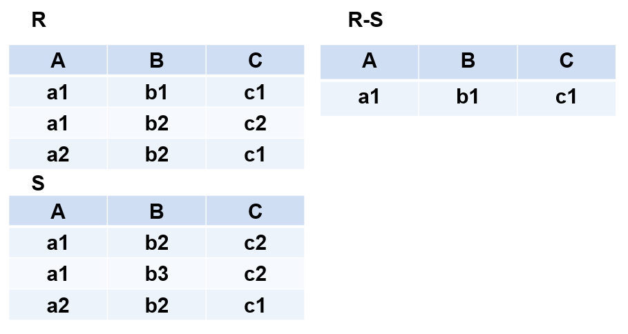

第一章 数据库绪论
---------

### 1.1、数据库系统概述

#### 1.1.1、数据库的四个概念

*   数据（Data）：数据是数据库中存储的基本对象，它是描述事物的符号记录。
*   数据库（Database）：数据库是长期储存在计算机内、有组织的、可共享的大量数据的集合。
*   数据库管理系统（DBMS）：数据库管理系统是位于用户与操作系统之间的一层数据管理软件，它是一个大型复杂的软件系统，它主要用于科学地组织和存储数据、高效地获取和维护数据。
*   数据库系统（DBS）：数据库系统主要是由数据库、数据库管理系统（及其开发工具）、数据库管理员以及应用程序所构成的一套人机系统。

#### 1.1.2、数据库系统的特点

*   数据的整体结构化

    数据的整体结构化是数据库的主要特征之一，它不再仅仅针对某一个应用，而是面向全组织，不仅数据内部结构化，整体也是结构化的，数据之间具有联系，数据记录可以变长，数据的最小存取单位是数据项。
    
*   数据的共享性高，冗余度低且易扩充

    数据面向整个系统，可以被多个用户、多个应用共享使用。
    数据共享的好处：
    （1）、减少数据冗余，节约存储空间。
    （2）、避免数据之间的不相容性与不一致性。
    （3）、使系统易于扩充。
    
*   数据独立性高

    数据独立性由数据库管理系统的二级映像功能来保证，它主要分为：物理独立性和逻辑独立性。
    物理独立性：指用户的应用程序与数据库中数据的物理存储是相互独立的，当数据的物理存储改变了，应用程序不用改变。
    逻辑独立性：指用户的应用程序与数据库中数据的逻辑结构是相互独立的，当数据的逻辑结构改变了，应用程序不用改变。
    
*   数据由数据库管理系统统一管理和控制

    数据库管理系统提供的数据控制功能。
    （1）、数据的安全性（Security）保护：保护数据以防止不合法的使用造成的数据的泄密和破坏。
    （2）、数据的完整性（Integrity）检查：保证数据的正确性、有效性和相容性。
    （3）、并发（Concurrency）控制：对多用户的并发操作加以控制和协调，防止相互干扰而得到错误的结果。
    （4）、数据库恢复（Recovery）技术：将数据库从错误状态恢复到某一已知的正确状态。
    

### 1.2、数据库数据模型

#### 1.2.1、数据模型的概述

数据模型是对现实世界数据特征的抽象，通俗地讲数据模型就是现实世界的模拟，数据模型是数据库系统的核心和基础。

#### 1.2.2、数据模型的要求

1.  能比较真实地模拟现实世界。
2.  容易为人所理解。
3.  便于在计算机上实现。

#### 1.2.3、数据模型的分类

数据模型分为两类（两个不同的层次）：

1.  **概念模型：**
    *   概念模型也称信息模型，它是按用户的观点来对数据和信息建模，用于数据库设计。
2.  **逻辑模型和物理模型：**
    *   逻辑模型主要包括层次模型、网状模型、关系模型、面向对象数据模型、对象关系数据模型、半结构化数据模型等。按计算机系统的观点对数据建模，用于DBMS实现。
    *   物理模型是对数据最底层的抽象，描述数据在系统内部的表示方式和存取方法，在磁盘或磁带上的存储方式和存取方法。

#### 1.2.4、概念模型的概述

**（1）、概念模型的用途**

*   概念模型用于信息世界的建模。
*   是现实世界到机器世界的一个中间层次。
*   是数据库设计的有力工具。
*   数据库设计人员和用户之间进行交流的语言。

**（2）、概念模型的要求**

*   较强的语义表达能力。
*   简单、清晰、易于用户理解。

**（3）、概念模型的表示**

实体-联系方法，用E-R图来描述现实世界的概念模型，E-R方法也称为E-R模型。

**（4）、信息世界中的基本概念**

*   实体（Entity）：客观存在并可相互区别的事物称为实体。
*   属性（Attribute）：实体所具有的某一特性称为属性。一个实体可以由若干个属性来刻画。例如学生实体可以由学号、姓名、性别、出生年份、系、入学时间等属性组成。（94002268，张山，男，1976，计算机系，1994）这些属性组合起来表征了一个学生。
*   码（Key）：唯一标识实体的属性集称为码。例如学号是学生实体的码。
*   域（Domain）：属性的取值范围称为该属性的域。例如，学号的域为8位整数，姓名的域为字符串集合，年龄的域为小于38的整数，性别的域为（男，女）。
*   实体型（Entity Type） ：具有相同属性的实体必然具有共同的特征和性质。用实体名及其属性名集合来抽象和刻画同类实体，称为实体型。例如，学生（学号，姓名，性别，出生年份，系，入学时间）就是一个实体型。
*   实体集（Entity Set）：同型实体的集合称为实体集。例如，全体学生就是一个实体集。
*   联系（Relationship） ：在现实世界中，事物内部以及事物之间是有联系的，这些联系在信息世界中反映为实体（型）内部的联系和实体（型）之间的联系。实体内部的联系通常是指组成实体的各属性之间的联系。实体之间的联系通常是指不同实体集之间的联系。

**（5）、两个实体型之间的联系**

两个实体型之间的联系可以分为三类：

*   一对一联系（1 : 1）

如果对于实体集A中的每一个实体，实体集B中至多有一个（也可以没有）实体与之联系，反之亦然，则称实体集A与实体集B具有一对一联系，记为1 : 1。例如，学校里面，一个班级只有一个正班长，而一个班长只在一个班中任职，则班级与班长之间具有一对一联系。

*   一对多联系（1 : n）
    
    如果对于实体集A中的每一个实体，实体集B中有n个实体（n≥0）与之联系，反之，对于实体集B中的每一个实体，实体集A中至多只有一个实体与之联系，则称实体集A与实体集B有一对多联系，记为1 : n。例如，一个班级中有若干名学生，而每个学生只在一个班级中学习，则班级与学生之间具有一对多联系。
    
*   多对多联系（m : n）
    
    如果对于实体集A中的每一个实体，实体集B中有n个实体（n≥0）与之联系，反之，对于实体集B中的每一个实体，实体集A中也有m个实体（m≥0）与之联系，则称实体集A与实体集B具有多对多联系，记为m : n。
    

#### 1.2.5、数据模型的组成

*   数据结构

    描述数据库的组成对象，以及对象之间的联系，它是对系统静态特性的描述。
    
*   数据操作

    对数据库中各种对象（型）的实例（值）允许执行的操作的集合，包括操作及有关的操作规则，它是对系统动态特性的描述。
    数据操作的类型：
    （1）、查询
    （2）、更新（包括插入、删除、修改）
    
*   数据的完整性约束条件

    是一组完整性规则的集合，用以限定符合数据模型的数据库状态以及状态的变化，以保证数据的正确、有效和相容。
    完整性规则：给定的数据模型中数据及其联系所具有的制约和依存规则。
    

#### 1.2.6、常见的数据模型

*   层次模型（Hierarchical Model）
*   网状模型（Network Model）
*   关系模型（Relational Model)）
*   面向对象数据模型（Object Oriented Data Model）
*   对象关系数据模型（Object Relational Data Model）
*   半结构化数据模型（Semistruture Data Model）

#### 1.2.7、层次模型

##### 1.2.7.1、概述

定义：层次数据模型是用树状层次结构来组织数据的数据模型。

层次模型是数据库系统中最早出现的数据模型，层次数据库系统的典型代表是IBM公司的IMS（Information Management System）数据库管理系统，层次模型用树形结构来表示各类实体以及实体间的联系。

满足下面两个条件的基本层次联系的集合为层次模型：

1.  有且只有一个结点没有双亲结点，这个结点称为根结点。
2.  根以外的其它结点有且只有一个双亲结点。

##### 1.2.7.2、特点

*   结点的双亲是唯一的。
*   只能直接处理一对多的实体联系。
*   每个记录类型可以定义一个排序字段，也称为码字段。
*   任何记录值只有按其路径查看时，才能显出它的全部意义。
*   没有一个子女记录值能够脱离双亲记录值而独立存在。

##### 1.2.7.3、数据结构

教员学生层次数据库模型举例：

##### 1.2.7.4、数据操纵

*   查询
*   插入
*   删除
*   更新

##### 1.2.7.5、完整性约束条件

*   无相应的双亲结点值就不能插入子女结点值。
*   如果删除双亲结点值，则相应的子女结点值也被同时删除。
*   更新操作时，应更新所有相应记录，以保证数据的一致性。

##### 1.2.7.6、优缺点

*   **优点**
    
    *   层次模型的数据结构比较简单清晰。
    *   查询效率高，性能优于关系模型，不低于网状模型。
    *   层次数据模型提供了良好的完整性支持。
*   **缺点**
    
    *   结点之间的多对多联系表示不自然。
    *   对插入和删除操作的限制多，应用程序的编写比较复杂。
    *   查询子女结点必须通过双亲结点。
    *   层次命令趋于程序化。

#### 1.2.8、网状模型

##### 1.2.8.1、概述

定义：用有向图表示实体和实体之间的联系的数据结构模型称为网状数据模型。

网状数据库系统采用网状模型作为数据的组织方式，典型代表是DBTG系统，亦称CODASYL系统，20世纪70年代由DBTG提出的一个系统方案。

满足下面两个条件的基本层次联系的集合称为网状数据模型：

1.  允许一个以上的结点无双亲。
2.  一个结点可以有多于一个的双亲。

##### 1.2.8.2、描述

*   实体型：用记录类型描述每个结点表示一个记录类型（实体）。
*   属性：用字段描述每个记录类型可包含若干个字段。
*   联系：用结点之间的连线表示记录类型（实体）之间的一对多的父子联系。

##### 1.2.8.3、数据结构

学生/选课/课程的网状数据模型举例：

##### 1.2.8.4、数据操纵

网状数据库系统（如DBTG）对数据操纵加了一些限制，提供了一定的完整性约束。

*   查询
*   插入
*   删除
*   更新

##### 1.2.8.5、完整性约束条件

*   一个联系中双亲记录与子女记录之间是一对多联系。
*   支持双亲记录和子女记录之间某些约束条件。

##### 1.2.8.6、优缺点

*   **优点**
    *   能够更为直接地描述现实世界，如一个结点可以有多个双亲。
    *   具有良好的性能，存取效率较高。
*   **缺点**
    *   结构比较复杂，而且随着应用环境的扩大，数据库的结构就变得越来越复杂，不利于最终用户掌握。
    *   DDL、DML语言复杂，用户不容易使用。
    *   记录之间联系是通过存取路径实现的，用户必须了解系统结构的细节。

#### 1.2.9、关系模型

##### 1.2.9.1、概述

定义：使用表格表示实体和实体之间关系的数据模型称之为关系数据模型。

关系数据库系统采用关系模型作为数据的组织方式，1970年美国IBM公司San Jose研究室的研究员E.F.Codd首次提出了数据库系统的关系模型，计算机厂商新推出的数据库管理系统几乎都支持关系模型。

关系型数据库是目前最流行的数据库，同时也是被普遍使用的数据库，如MySQL就是一种流行的数据库。

##### 1.2.9.2、特点

1.  关系数据模型中，无论是是实体、还是实体之间的联系都是被映射成统一的关系—一张二维表，在关系模型中，操作的对象和结果都是一张二维表，它由行和列组成。
2.  关系型数据库可用于表示实体之间的多对多的关系，只是此时要借助第三个关系—表，来实现多对多的关系。
3.  关系必须是规范化的关系，即每个属性是不可分割的实体，不允许表中表的存在。

##### 1.2.9.3、数据结构

学生登记表为例：

常见的术语描述：

*   关系（Relation）：一个关系对应通常说的一张表。
*   元组（Tuple）：表中的一行即为一个元组。
*   属性（Attribute）：表中的一列即为一个属性，给每一个属性起一个名称即属性名。
*   主码（Key）：也称码键，表中的某个属性组，它可以唯一确定一个元组。
*   域（Domain）：是一组具有相同数据类型的值的集合，属性的取值范围来自某个域。
*   分量：元组中的一个属性值。
*   关系模式：对关系的描述。

常见的术语对比图：

##### 1.2.9.4、数据操纵

数据操作是集合操作，操作对象和操作结果都是关系：

*   查询
*   插入
*   删除
*   更新

##### 1.2.9.5、完整性约束条件

*   实体完整性。
*   参照完整性。
*   用户定义的完整性。

##### 1.2.9.6、优缺点

*   **优点**
    *   建立在严格的数学概念的基础上。
    *   概念单一。
    *   关系模型的存取路径对用户透明。
*   **缺点**
    *   存取路径对用户透明，查询效率往往不如格式化数据模型。
    *   为提高性能，必须对用户的查询请求进行优化，增加了开发数据库管理系统的难度。

### 1.3、数据库系统结构

*   从数据库应用开发人员角度看，数据库系统通常采用三级模式结构，是数据库系统内部的系统结构。
*   从数据库最终用户角度看，数据库系统的结构分为：
    *   单用户结构
    *   主从式结构
    *   分布式结构
    *   客户-服务器结构
    *   浏览器-应用服务器结构
    *   数据库服务器多层结构

##### 1.3.1、数据库系统的模式概念

*   **模式（Schema）**
    *   数据库逻辑结构和特征的描述
    *   是型的描述，不涉及具体值
    *   反映的是数据的结构及其联系
    *   模式是相对稳定的
*   **实例（Instance）**
    *   模式的一个具体值
    *   反映数据库某一时刻的状态
    *   同一个模式可以有很多实例
    *   实例随数据库中的数据的更新而变动

##### 1.3.2、数据库系统的三级模式结构

三级模式结构说明：

*   模式（Schema）

    模式（也称逻辑模式）
    数据库中全体数据的逻辑结构和特征的描述。
    所有用户的公共数据视图。
    
*   外模式（External Schema）

    外模式（也称子模式或用户模式）
    数据库用户（包括应用程序员和最终用户）使用的局部数据的逻辑结构和特征的描述。
    数据库用户的数据视图，是与某一应用有关的数据的逻辑表示。
    
*   内模式（Internal Schema）

    内模式（也称存储模式）
    是数据物理结构和存储方式的描述。
    是数据在数据库内部的表示方式。
    记录的存储方式（例如，顺序存储，按照B树结构存储，按hash方法存储等）。
    索引的组织方式。
    数据是否压缩存储。
    数据是否加密。
    数据存储记录结构的规定。
    

三级模式结构图：

##### 1.3.3、数据库系统的二级映像功能

三级模式是对数据的三个抽象级别，二级映象在数据库管理系统内部实现这三个抽象层次的联系和转换：

*   外模式／模式映像

    保证数据的逻辑独立性。
    （1）、当模式改变时，数据库管理员对外模式／模式映象作相应改变，使外模式保持不变。
    （2）、应用程序是依据数据的外模式编写的，应用程序不必修改，保证了数据与程序的逻辑独立性，简称数据的逻辑独立性。
    
*   模式／内模式映像

    保证数据的物理独立性。
    （1）、当数据库的存储结构改变了（例如选用了另一种存储结构），数据库管理员修改模式／内模式映象，使模式保持不变。
    （2）、应用程序不受影响。保证了数据与程序的物理独立性，简称数据的物理独立性。
    

数据库的二级映像的主要功能：

*   保证了数据库外模式的稳定性。
*   从底层保证了应用程序的稳定性，除非应用需求本身发生变化，否则应用程序一般不需要修改。

### 1.4、数据库系统的组成

*   数据库
*   数据库管理系统（及其开发工具）
*   数据库管理员
*   应用程序

### 1.5、数据库管理员职责

1.  决定数据库中的信息内容和结构。
2.  决定数据库的存储结构和存取策略。
3.  定义数据的安全性要求和完整性约束条件。
4.  监控数据库的使用和运行。
5.  数据库的改进和重组。

第二章 关系数据库
---------

### 2.1、关系概述

#### 2.1.1、关系

现实世界的实体以及实体间的各种联系均用关系来表示。

从用户角度，关系模型中数据的逻辑结构是一张二维表，它是建立在集合代数的基础上。

**域（Domain）：** 域是一组具有相同数据类型的值的集合。

**笛卡尔积（Cartesian Product）：** 给定一组域D1，D2，…，Dn，允许其中某些域是相同的。D1，D2，…，Dn的笛卡尔积为：  
D1×D2×…×Dn ＝｛（d1，d2，…，dn）｜di∈Di，i＝1，2，…，n｝，笛卡尔积是所有域的所有取值的一个组合，它不能重复。

*   元组（Tuple）：笛卡尔积中每一个元素（d1，d2，…，dn）叫作一个n元组（n-tuple）或简称元组。
    
*   分量（Component）：笛卡尔积中每一个元素（d1，d2，…，dn）中的每一个值di叫作一个分量。
    
*   基数（Cardinal number）：若Di（i＝1，2，…，n）为有限集，其基数为mi（i＝1，2，…，n），则D1×D2×…×Dn的基数M为：
    
*   表示方法：笛卡尔积可表示为一张二维表，表中的每行对应一个元组，表中的每列对应一个域。
    
*   例如，给出3个域：
    
        D1=导师集合SUPERVISOR=｛张清玫，刘逸｝
        D2=专业集合SPECIALITY=｛计算机专业，信息专业｝
        D3=研究生集合POSTGRADUATE=｛李勇，刘晨，王敏｝
        D1，D2，D3的笛卡尔积为
        D1×D2×D3＝｛
                (张清玫，计算机专业，李勇)，(张清玫，计算机专业，刘晨)，
                (张清玫，计算机专业，王敏)，(张清玫，信息专业，李勇)，
                (张清玫，信息专业，刘晨)，(张清玫，信息专业，王敏)，
                (刘逸，计算机专业，李勇)，(刘逸，计算机专业，刘晨)，
                (刘逸，计算机专业，王敏)，(刘逸，信息专业，李勇)，
                (刘逸，信息专业，刘晨)，(刘逸，信息专业，王敏) ｝
        基数为2×2×3＝12
    
    

**关系（Relation）：** D1×D2×…×Dn的子集叫作在域D1，D2，…，Dn上的关系，表示为R（D1，D2，…，Dn），其中，R为关系名，n为关系的目或度（Degree）。关系中的每个元素是关系中的元组，通常用t表示。当n=1时，称该关系为单元关系（Unary relation）或一元关系 ，当n=2时，称该关系为二元关系（Binary relation），关系也是一个二维表，表的每行对应一个元组，表的每列对应一个域，关系中不同列可以对应相同的域，为了加以区分，必须对每列起一个名字，称为属性（Attribute），n目关系必有n个属性。若关系中的某一属性组的值能唯一地标识一个元组，则称该属性组为候选码，简单的情况：候选码只包含一个属性，最极端的情况：关系模式的所有属性组是这个关系模式的候选码，称为全码（All-key），若一个关系有多个候选码，则选定其中一个为主码（Primary key），候选码的诸属性称为主属性（Prime attribute），不包含在任何侯选码中的属性称为非主属性（Non-Prime attribute）或非码属性（Non-key attribute） 。

*   三类关系：
    *   基本关系（基本表或基表）：实际存在的表，是实际存储数据的逻辑表示
    *   查询表：查询结果对应的表
    *   视图表：由基本表或其他视图表导出的表，是虚表，不对应实际存储的数据
*   基本关系的性质：
    *   列是同质的（Homogeneous）
    *   不同的列可出自同一个域，其中的每一列称为一个属性，不同的属性要给予不同的属性名
    *   列的顺序无所谓，列的次序可以任意交换
    *   行的顺序无所谓，行的次序可以任意交换
    *   任意两个元组的候选码不能相同
    *   分量必须取原子值，这是规范条件中最基本的一条

#### 2.1.2、关系模式

*   **什么是关系模式？**
    
        关系模式是对关系的描述。如元组集合的结构，完整性约束条件。
    
*   **咋定义关系模式？**
    
        关系模式可以形式化地表示为：R（U，D，DOM，F）
        		R       	     关系名
        		U       	     组成该关系的属性名集合
        		D       	     U中属性所来自的域
        		DOM  	     	 属性向域的映象集合
        		F        	     属性间数据的依赖关系的集合
        		
        关系模式通常可以简记为R (U)或 R (A1，A2，…，An)
                R: 				关系名
                A1，A2，…，An  : 属性名
        注：域名及属性向域的映象常常直接说明为属性的类型、长度
    
*   **关系模式与关系？**
    
        关系模式（Relation Schema）是型，而关系是值，关系模式和关系往往笼统称为关系。
        
        关系模式是对关系的描述，它是静态的、稳定的。
        关系则表示关系模式在某一时刻的状态或内容，它是动态的、随时间不断变化的。
    
    

#### 2.1.3、关系数据库

关系数据库：在一个给定的应用领域中，所有关系的集合构成一个关系数据库。

关系数据库的型与值：

*   关系数据库的型: 关系数据库模式，是对关系数据库的描述。
*   关系数据库的值: 关系模式在某一时刻对应的关系的集合，通常称为关系数据库。

#### 2.1.4、关系模型的存储结构

关系数据库的物理组织：

*   有的关系数据库管理系统中一个表对应一个操作系统文件，将物理数据组织交给操作系统完成。
*   有的关系数据库管理系统从操作系统那里申请若干个大的文件，自己划分文件空间，组织表、索引等存储结构，并进行存储管理。

### 2.2、关系操作

常用关系操作：

*   查询操作：选择、投影、连接、除、并、差、交、笛卡尔积（选择、投影、并、差、笛卡尔基是5种基本操作，交、连接、除，可以用5种基本运算来表达，引进它们并不增加语言的能力，但可以简化表达）
*   数据更新：插入、删除、修改

关系操作特点：操作的对象和结果都是集合，一次一集合的方式。

关系代数语言：用对关系的运算来表达查询要求，代表：ISBL。

关系演算语言：用谓词来表达查询要求。

*   元组关系演算语言：谓词变元的基本对象是元组变量，代表：APLHA, QUEL。
*   域关系演算语言 ：谓词变元的基本对象是域变量，代表：QBE。

具有关系代数和关系演算双重特点的语言，代表：SQL（Structured Query Language）。

### 2.3、关系完整性

关系的三类完整性约束：

*   实体完整性和参照完整性：关系模型必须满足的完整性约束条件称为关系的两个不变性，应该由关系系统自动支持。
*   用户定义的完整性：应用领域需要遵循的约束条件，体现了具体领域中的语义约束。

#### 2.3.1、实体完整性

实体完整性规则（Entity Integrity）：若属性A是基本关系R的主属性，则属性A不能取空值，空值就是“不知道”或“不存在”或“无意义”的值。

实体完整性规则的说明：

1.  实体完整性规则是针对基本关系而言的，一个基本表通常对应现实世界的一个实体集。
2.  现实世界中的实体是可区分的，即它们具有某种唯一性标识。
3.  关系模型中以主码作为唯一性标识。
4.  主码中的属性即主属性不能取空值。主属性取空值，就说明存在某个不可标识的实体，即存在不可区分的实体，这与第（2）点相矛盾，因此这个规则称为实体完整性

#### 2.3.2、参照完整性

*   关系间的引用：在关系模型中实体及实体间的联系都是用关系来描述的，自然存在着关系与关系间的引用。
*   外码：设F是基本关系R的一个或一组属性，但不是关系R的码。如果F与基本关系S的主码Ks相对应，则称F是R的外码。基本关系R称为参照关系（Referencing Relation），基本关系S称为被参照关系（Referenced Relation）或目标关系（Target Relation）。
*   参照完整性规则：若属性（或属性组）F是基本关系R的外码它与基本关系S的主码Ks相对应（基本关系R和S不一定是不同的关系），则对于R中每个元组在F上的值必须为：或者取空值（F的每个属性值均为空值），或者等于S中某个元组的主码值。

#### 2.3.3、用户定义的完整性

针对某一具体关系数据库的约束条件，反映某一具体应用所涉及的数据必须满足的语义要求。

关系模型应提供定义和检验这类完整性的机制，以便用统一的系统的方法处理它们，而不需由应用程序承担这一功能。

### 2.4、关系代数

关系代数是一种抽象的查询语言，它用对关系的运算来表达查询。

关系代数的运算对象是关系，运算结果亦为关系。

关系代数的运算符有两类：传统的集合运算符和专门的关系运算符，传统的集合运算是从关系的“水平”方向即行的角度进行，而专门的关系运算不仅涉及行而且涉及列。

常见的关系运算符如下：

#### 2.4.1、传统的集合运算符

**并：**

**差：**

**交：**

**笛卡尔积：**

#### 2.4.2、专门的集合运算符

**选择：**

**投影：**

**连接：**

**除：**

第三章 SQL语言
---------

### 3.1、SQL的概述

SQL（Structured Query Language）结构化查询语言，是关系数据库的标准语言，SQL是一个通用的、功能极强的关系数据库语言。

### 3.2、SQL的发展

> 目前，没有一个数据库系统能够支持SQL标准的所有概念和特性.

### 3.3、SQL的特点

1.  综合统一
2.  高度非过程化
3.  面向集合的操作方式
4.  以同一种语法结构提供两种使用方式，SQL语言既是自含式语言，又是嵌入式语言
5.  语言简捷，易学易用

### 3.4、SQL的功能

### 3.5、SQL的结构

SQL支持关系数据库三级模式结构：

### 3.6、SQL的数据类型

### 3.7、数据定义语言（DDL）

一个关系数据库管理系统的实例（Instance）中可以建立多个数据库，一个数据库中可以建立多个模式，一个模式下通常包括多个表、视图和索引等数据库对象。因此SQL的数据定义功能包括定义模式、定义表、定义视图和定义索引。视图是基于基本表的虚表，索引是依附于基本表的，因此SQL通常不提供修改视图定义和修改索引定义的操作。用户如果想修改视图定义或索引定义，只能先将它们删除掉，然后再重建。不过有些关系数据库产品如Oracle允许直接修改视图定义。

#### 3.7.1、模式

##### 2.7.1.1、模式的定义

定义模式实际上定义了一个命名空间，在这个空间中可以定义该模式包含的数据库对象，例如基本表、视图、索引等。

在CREATE SCHEMA中可以接受CREATE TABLE，CREATE VIEW和GRANT子句。

    CREATE SCHEMA <模式名> AUTHORIZATION <用户名> [<表定义子句>|<视图定义子句>|<授权定义子句>];

案例演示：为用户ZHANG创建了一个模式TEST，并且在其中定义一个表TAB1。

    CREATE SCHEMA TEST AUTHORIZATION ZHANG CREATE TABLE TAB1 (
      COL1 SMALLINT,
      COL2 INT,
      COL3 CHAR(20),
      COL4 NUMERIC (10, 3),
      COL5 DECIMAL (5, 2)
    ) ;

##### 2.7.1.2、模式的删除

    DROP SCHEMA <模式名> <CASCADE|RESTRICT>;

> CASCADE（级联）：删除模式的同时把该模式中所有的数据库对象全部删除。
>
> RESTRICT（限制）：如果该模式中定义了下属的数据库对象（如表、视图等），则拒绝该删除语句的执行，仅当该模式中没有任何下属的对象时才能执行。

案例演示：删除模式ZHANG，同时该模式中定义的表TAB1也被删除。

    DROP SCHEMA ZHANG CASCADE;

#### 3.7.2、基本表

##### 3.7.2.1、基本表的定义

建立数据库最重要的一步就是定义一些基本表，SQL语言使用CREATE TABLE语句定义基本表。

    CREATE TABLE <表名> (
        <列名> <数据类型>[ <列级完整性约束条件> ]
      [,<列名> <数据类型>[ <列级完整性约束条件> ]]
      [,<列名> <数据类型>[ <列级完整性约束条件> ]]    
        ...
      [,<表级完整性约束条件> ]
    );

> <表名>：所要定义的基本表的名字。  
> <列名>：组成该表的各个属性（列）。  
> <列级完整性约束条件>：涉及相应属性列的完整性约束条件。  
> <表级完整性约束条件>：涉及一个或多个属性列的完整性约束条件 。  
> 如果完整性约束条件涉及到该表的多个属性列，则必须定义在表级上，否则既可以定义在列级也可以定义在表级。

案例演示：建立“学生”表Student，学号是主码，姓名取值唯一。

    CREATE TABLE Student (
      Sno CHAR(9) PRIMARY KEY,
      Sname CHAR(20) UNIQUE,
      Ssex CHAR(2),
      Sage SMALLINT,
      Sdept CHAR(20)
    ) ;

案例演示：建立一个“课程”表Course，课程号是主码。

    CREATE TABLE Course (
      Cno CHAR(4) PRIMARY KEY,
      Cname CHAR(40),
      Cpno CHAR(4),
      Ccredit INT
    ) ;

案例演示：建立一个学生选课表SC，学生号和课程号组成主码。

    CREATE TABLE SC (
      Sno CHAR(9),
      Cno CHAR(4),
      Grade DECIMAL (40, 2) ,
      /* 主码由两个属性构成，必须作为表级完整性进行定义 */
      PRIMARY KEY (Sno, Cno),
      /* 表级完整性约束条件，Sno是外码，被参照表是Student */
      FOREIGN KEY (Sno) REFERENCES Student (Sno),
      /* 表级完整性约束条件，Cno是外码，被参照表是Course */
      FOREIGN KEY (Cno) REFERENCES Course (Cno)
    ) ;

**模式与表：**

每一个基本表都属于某一个模式，一个模式包含多个基本表，定义基本表所属模式有以下三种方式：

*   方法一：在表名中明显地给出模式名
    *   Create table"S-T".Student(…);
    *   Create table “S-T”.Cource(…);
    *   Create table “S-T”.SC(…);
*   方法二：在创建模式语句中同时创建表
*   方法三：设置所属的模式

创建基本表（其他数据库对象也一样）时，若没有指定模式，系统根据搜索路径来确定该对象所属的模式，关系数据库管理系统会使用模式列表中第一个存在的模式作为数据库对象的模式名，若搜索路径中的模式名都不存在，系统将给出错误。

##### 3.7.2.2、基本表的修改

    ALTER TABLE <表名>
    [ ADD  [ COLUMN ] <新列名> <数据类型> [ 完整性约束 ] ]
    [ ADD <表级完整性约束>]
    [ DROP [ COLUMN ] <列名> [CASCADE| RESTRICT] ]
    [ DROP CONSTRAINT <完整性约束名> [ RESTRICT | CASCADE ] ]
    [ ALTER COLUMN <列名><数据类型> ] ;

> <表名>是要修改的基本表。  
> ADD子句用于增加新列、新的列级完整性约束条件和新的表级完整性约束条件。  
> DROP COLUMN子句用于删除表中的列。  
> 如果指定了CASCADE短语，则自动删除引用了该列的其他对象。  
> 如果指定了RESTRICT短语，则如果该列被其他对象引用，关系数据库管理系统将拒绝删除该列。  
> DROP CONSTRAINT子句用于删除指定的完整性约束条件。  
> ALTER COLUMN子句用于修改原有的列定义，包括修改列名和数据类型。

案例演示：向Student表增加“入学时间”列，其数据类型为日期型。

> 注意：不管基本表中原来是否已有数据，新增加的列一律为空值。

    ALTER TABLE Student 
    ADD S_entrance DATE ;

案例演示：将年龄的数据类型由字符型（假设原来的数据类型是字符型）改为整数。

    ALTER TABLE Student 
    ALTER COLUMN Sage INT ;

案例演示：增加课程名称必须取唯一值的约束条件。

    ALTER TABLE Course 
    ADD UNIQUE (Cname) ;

##### 3.7.2.3、基本表的删除

    DROP TABLE <表名> ［RESTRICT | CASCADE］ ;

> CASCADE（级联）：在删除基本表的同时，相关的依赖对象一起删除。
>
> RESTRICT（限制）：欲删除的基本表不能被其他表的约束所引用，如果存在依赖该表的对象，则此表不能被删除。

案例演示：删除Student表。

    DROP TABLE Student CASCADE ;

DROP TABLE时，SQL2011 与 3个RDBMS的处理策略比较：

#### 3.7.3、视图

##### 3.7.3.1、视图的定义

视图是一个虚拟表，其内容由查询定义。但视图并不存储数据，视图数据来自由定义视图的查询所引用的表。关系数据库管理系统执行CREATE VIEW语句时只是把视图定义存入数据字典，并不执行其中的SELECT语句。在对视图查询时，按视图的定义从基本表中将数据查出。视图能够简化用户的操作，使用户能以多种角度看待同一数据，视图对重构数据库提供了一定程度的逻辑独立性，能够对机密数据提供安全保护，适当的利用视图可以更清晰的表达查询。

    CREATE VIEW < 视图名 > [ (< 列名 > [, < 列名 > ] …) ] AS
    < 子查询 > [ WITH CHECK OPTION ] ;

> WITH CHECK OPTION：对视图进行UPDATE，INSERT和DELETE操作时要保证更新、插入或删除的行满足视图定义中的谓词条件（即子查询中的条件表达式）。子查询可以是任意的SELECT语句，是否可以含有ORDER BY子句和DISTINCT短语，则决定具体系统的实现。

**基于单表的视图：**

案例演示：建立信息系学生的视图。

    CREATE VIEW IS_Student AS 
    SELECT 
      Sno,
      Sname,
      Sage 
    FROM
      Student 
    WHERE Sdept = 'IS' ;

案例演示：建立信息系学生的视图，并要求进行修改和插入操作时仍需保证该视图只有信息系的学生。

    CREATE VIEW IS_Student AS 
    SELECT 
      Sno,
      Sname,
      Sage 
    FROM
      Student 
    WHERE Sdept = 'IS' WITH CHECK OPTION ;

**基于多表的视图：**

案例演示：建立信息系选修了1号课程的学生的视图（包括学号、姓名、成绩）。

    CREATE VIEW IS_S1 (Sno, Sname, Grade) AS 
    SELECT 
      Student.Sno,
      Sname,
      Grade 
    FROM
      Student,
      SC 
    WHERE Sdept = 'IS' AND Student.Sno = SC.Sno AND SC.Cno = '1' ;

**基于视图的视图：**

案例演示：建立信息系选修了1号课程且成绩在90分以上的学生的视图。

    CREATE VIEW IS_S2 AS 
    SELECT 
      Sno,
      Sname,
      Grade 
    FROM
      IS_S1 
    WHERE Grade >= 90 ;

**带表达式的视图：**

案例演示：定义一个反映学生出生年份的视图。

    CREATE VIEW BT_S (Sno, Sname, Sbirth) AS 
    SELECT 
      Sno,
      Sname,
      2014-Sage 
    FROM
      Student ;

**分组视图：**

案例演示：将学生的学号及平均成绩定义为一个视图。

    CREATE VIEW S_G (Sno, Gavg) AS 
    SELECT 
      Sno,
      AVG(Grade) 
    FROM
      SC 
    GROUP BY Sno ;

##### 3.7.3.2、数据的修改

案例演示：将信息系学生视图IS\_Student中学号”201215122”的学生姓名改为”刘辰”。

    UPDATE 
      IS_Student 
    SET
      Sname = '刘辰' 
    WHERE Sno = '201215122' ;

案例演示：向信息系学生视图IS\_S中插入一个新的学生记录，其中学号为”201215140”，姓名为”赵新”，年龄为20岁。

    INSERT INTO IS_Student 
    VALUES('201215140','赵新',20) ;

案例演示：删除信息系学生视图IS\_Student中学号为”201215140”的记录。

    DELETE FROM IS_Student 
    WHERE Sno = '201215140' ;

##### 3.7.3.3、视图的删除

    DROP VIEW < 视图名 > [ CASCADE ] ;

> 如果该视图上还导出了其他视图，使用CASCADE级联删除语句，把该视图和由它导出的所有视图一起删除 。

案例演示：删除视图BT\_S。

    DROP VIEW BT_S ;

#### 3.7.4、索引

##### 3.7.4.1、索引的定义

建立索引是加快查询速度的有效手段。用户可以根据应用环境的需要，在基本表上建立一个或多个索引，以提供多种存取路径，加快查找速度。一般说来，建立与删除索引由数据库管理员DBA或表的属主（即建立表的人）负责完成。系统在存取数据时会自动选择合适的索引作为存取路径，用户不必也不能选择索引。

在SQL语言中，建立索引使用CREATE INDEX语句。索引可以建立在该表的一列或多列上，各列名之间用逗号分隔。每个列名后面还可以用次序指定索引值的排列次序，可选ASC（升序）或DESC（降序），缺省值为ASC升序。

    CREATE [UNIQUE] [CLUSTER] INDEX <索引名> 
    ON <表名>(<列名>[<次序>][,<列名>[<次序>] ]…);

> <表名>：要建索引的基本表的名字。  
> 索引：可以建立在该表的一列或多列上，各列名之间用逗号分隔。  
> <次序>：指定索引值的排列次序，升序：ASC，降序：DESC。缺省值：ASC。  
> UNIQUE：此索引的每一个索引值只对应唯一的数据记录。  
> CLUSTER：表示要建立的索引是聚簇索引。所谓聚簇索引是指索引项的顺序与表中记录的物理顺序一致的索引组织。用户可以在最常查询的列上建立聚簇索引以提高查询效率。显然在一个基本表上最多只能建立一个聚簇索引。建立聚簇索引后，更新索引列数据时，往往导致表中记录的物理顺序的变更，代价较大，因此对于经常更新的列不宜建立聚簇索引。

案例演示：为Student，Course，SC三个表建立索引。Student表按学号升序建唯一索引，Course表按课程号升序建唯一索引，SC表按学号升序和课程号降序建唯一索引。

    CREATE UNIQUE INDEX Stusno 
    ON Student (Sno) ;
    
    CREATE UNIQUE INDEX Coucno 
    ON Course (Cno) ;
    
    CREATE UNIQUE INDEX SCno 
    ON SC (Sno ASC, Cno DESC) ;

##### 3.7.4.2、名称的修改

    ALTER INDEX <旧索引名> RENAME TO <新索引名> ;

案例演示：将SC表的SCno索引名改为SCSno。

    ALTER INDEX SCno RENAME TO SCSno;

##### 3.7.4.3、索引的删除

删除索引时，系统会从数据字典中删去有关该索引的描述。

    DROP INDEX <索引名> on <表名>;

案例演示：删除Student表的Sname索引。

    DROP INDEX Sname ON Student;

### 3.8、数据查询语言（DQL）

#### 3.8.1、单表查询

    SELECT 
      [ ALL | DISTINCT ] 
      < 目标列表达式 > [,< 目标列表达式 > ] … 
    FROM
      < 表名或视图名 > [,< 表名或视图名 > ] … | (SELECT 语句) [ AS ] < 别名 > 
    [ WHERE < 条件表达式 > ] 
    [ GROUP BY < 列名1 > [ HAVING < 条件表达式 > ] ] 
    [ ORDER BY < 列名2 > [ ASC | DESC ] ] ;

> SELECT子句：指定要显示的属性列。  
> FROM子句：指定查询对象（基本表或视图）。  
> WHERE子句：指定查询条件。  
> GROUP BY子句：对查询结果按指定列的值分组，该属性列值相等的元组为一个组。通常会在每组中作用聚集函数。  
> HAVING短语：只有满足指定条件的组才予以输出。  
> ORDER BY子句：对查询结果表按指定列值的升序或降序排序。

##### 3.8.1.1、简单查询

案例演示：查询全体学生的学号与姓名。

    SELECT Sno,Sname FROM Student ;

案例演示：查询全体学生的姓名、学号、所在系。

    SELECT Sname,Sno,Sdept FROM Student ;

案例演示：查询全体学生的详细记录。

    SELECT Sno,Sname,Ssex,Sage,Sdept FROM Student ;

    SELECT * FROM Student ;

案例演示：查全体学生的姓名及其出生年份。（假设当年为2014）

    SELECT Sname,2014-Sage FROM Student ;

案例演示：查询全体学生的姓名、出生年份和所在的院系，要求用小写字母表示系名。（假设当年为2014）

    SELECT Sname,'Year of Birth:',2014-Sage,LOWER(Sdept) FROM Student ;

##### 3.8.1.2、条件查询

案例演示：查询计算机科学系全体学生的名单。

    SELECT Sname FROM Student WHERE Sdept = 'CS' ;

案例演示：查询所有年龄在20岁以下的学生姓名及其年龄。

    SELECT Sname,Sage FROM Student WHERE Sage < 20 ;

案例演示：查询考试成绩有不及格的学生的学号。

    SELECT DISTINCT Sno FROM SC WHERE Grade < 60 ;

案例演示：查询年龄在20~23岁（包括20岁和23岁）之间的学生的姓名、系别和年龄。

    SELECT Sname,Sdept,Sage FROM Student WHERE Sage BETWEEN 20 AND 23 ;

案例演示：查询年龄不在20~23岁之间的学生姓名、系别和年龄。

    SELECT Sname,Sdept,Sage FROM Student WHERE Sage NOT BETWEEN 20 AND 23 ;

##### 3.8.1.3、IN子查询

案例演示：查询计算机科学系（CS）、数学系（MA）和信息系（IS）学生的姓名和性别。

    SELECT Sname,Ssex FROM Student WHERE Sdept IN ('CS','MA','IS') ;

案例演示：查询既不是计算机科学系、数学系，也不是信息系的学生的姓名和性别。

    SELECT Sname,Ssex FROM Student WHERE Sdept NOT IN ('CS','MA','IS') ;

##### 3.8.1.4、模糊查询

谓词： \[NOT\] LIKE ‘<匹配串>’ \[ESCAPE ‘ <换码字符>’\]

*   % （百分号） ：代表任意长度（长度可以为0）的字符串。
*   \_ （下横线）：代表任意单个字符。

案例演示：查询学号为201215121的学生的详细情况。

    SELECT * FROM Student WHERE Sno LIKE '201215121' ;

    SELECT * FROM Student WHERE Sno = '201215121' ;

案例演示：查询所有姓刘学生的姓名、学号和性别。

    SELECT Sname,Sno,Ssex FROM Student WHERE Sname LIKE '刘%' ;

案例演示：查询姓"欧阳"且全名为三个汉字的学生的姓名。

    SELECT Sname FROM Student WHERE Sname LIKE '欧阳__' ;

案例演示：查询名字中第2个字为"阳"字的学生的姓名和学号。

    SELECT Sname,Sno FROM Student WHERE Sname LIKE '__阳%' ;

案例演示：查询所有不姓刘的学生姓名、学号和性别。

    SELECT Sname,Sno,Ssex FROM Student WHERE Sname NOT LIKE '刘%' ;

案例演示：查询DB\_Design课程的课程号和学分。

> 注意：使用换码字符将通配符转义为普通字符。

    SELECT Cno,Ccredit FROM Course WHERE Cname LIKE 'DB#_Design' ESCAPE '#' ;

案例演示：查询以"DB\_"开头，且倒数第3个字符为 i的课程的详细情况。

    SELECT * FROM Course WHERE Cname LIKE 'DB#_%i__' ESCAPE '#' ;

##### 3.8.1.5、空值查询

案例演示：某些学生选修课程后没有参加考试，所以有选课记录，但没 有考试成绩。查询缺少成绩的学生的学号和相应的课程号。

    SELECT Sno,Cno FROM SC WHERE Grade IS NULL ;

案例演示：查所有有成绩的学生学号和课程号。

    SELECT Sno,Cno FROM SC WHERE Grade IS NOT NULL ;

##### 3.8.1.6、与或查询

案例演示：查询计算机系年龄在20岁以下的学生姓名。

    SELECT Sname FROM Student WHERE Sdept = 'CS' AND Sage < 20 ;

案例演示：查询计算机科学系（CS）、数学系（MA）和信息系（IS）学生的姓名和性别。

    SELECT Sname,Ssex FROM Student WHERE Sdept IN ('CS','MA','IS') ;

    SELECT Sname,Ssex FROM Student WHERE Sdept = 'CS' OR Sdept = 'MA' OR Sdept = 'IS' ;

##### 3.8.1.7、排序查询

案例演示：查询选修了3号课程的学生的学号及其成绩，查询结果按分数降序排列。

    SELECT Sno,Grade FROM SC WHERE Cno = '3' ORDER BY Grade DESC ;

案例演示：查询全体学生情况，查询结果按所在系的系号升序排列，同一系中的学生按年龄降序排列。

    SELECT * FROM Student ORDER BY Sdept,Sage DESC ;

##### 3.8.1.8、聚合查询

案例演示：查询学生总人数。

    SELECT COUNT(*) FROM Student ;

案例演示：查询选修了课程的学生人数。

    SELECT COUNT(DISTINCT Sno) FROM SC ;

案例演示：计算1号课程的学生平均成绩。

    SELECT AVG(Grade) FROM SC WHERE Cno = '1' ;

案例演示：查询选修1号课程的学生最高分数。

    SELECT MAX(Grade) FROM SC WHERE Cno = '1' ;

案例演示：查询学生201215012选修课程的总学分数。

    SELECT SUM(Ccredit) FROM SC, Course WHERE Sno = '201215012' AND SC.Cno = Course.Cno ;

##### 3.8.1.9、分组查询

案例演示：求各个课程号及相应的选课人数。

    SELECT Cno,COUNT(Sno) FROM SC GROUP BY Cno ;

##### 3.8.1.10、过滤查询

案例演示：查询选修了3门以上课程的学生学号。

    SELECT Sno FROM SC GROUP BY Sno HAVING COUNT(*) > 3 ;

案例演示：查询平均成绩大于等于90分的学生学号和平均成绩。

    SELECT Sno,AVG(Grade) FROM SC GROUP BY Sno HAVING AVG(Grade) >= 90 ;

#### 3.8.2、连接查询

##### 3.8.2.1、等值连接

案例演示：查询每个学生及其选修课程的情况。

    SELECT Student.*,SC.* FROM Student,SC WHERE Student.Sno = SC.Sno ;

##### 3.8.2.2、非等值连接

案例演示：查询选修2号课程且成绩在90分以上的所有学生的学号和姓名。

    SELECT Student.Sno,Sname FROM Student,SC WHERE Student.Sno = SC.Sno AND SC.Cno = '2' AND SC.Grade > 90 ;

##### 3.8.2.3、自身连接

案例演示：查询每一门课的间接先修课（即先修课的先修课）。

    SELECT 
      FIRST.Cno,
      SECOND.Cpno 
    FROM
      Course FIRST,
      Course SECOND 
    WHERE FIRST.Cpno = SECOND.Cno ;

##### 3.8.2.4、外连接

案例演示：查询每个学生及其选修课程的情况。

    SELECT 
      Student.Sno,
      Sname,
      Ssex,
      Sage,
      Sdept,
      Cno,
      Grade 
    FROM
      Student 
    LEFT JOIN SC ON (Student.Sno = SC.Sno) ;

##### 3.8.2.5、多表连接

案例演示：查询每个学生的学号、姓名、选修的课程名及成绩。

    SELECT 
      Student.Sno,
      Sname,
      Cname,
      Grade 
    FROM
      Student,
      SC,
      Course 
    WHERE Student.Sno = SC.Sno AND SC.Cno = Course.Cno ;

#### 3.8.3、嵌套查询

一个SELECT-FROM-WHERE语句称为一个查询块，将一个查询块嵌套在另一个查询块的WHERE子句或HAVING短语的条件中的查询称为嵌套查询，上层的查询块称为外层查询或父查询，下层查询块称为内层查询或子查询，SQL语言允许多层嵌套查询，即一个子查询中还可以嵌套其他子查询，子查询不能使用ORDER BY子句。

*   不相关子查询：子查询的查询条件不依赖于父查询，由里向外 逐层处理。即每个子查询在上一级查询处理之前求解，子查询的结果用于建立其父查询的查找条件。
*   相关子查询：子查询的查询条件依赖于父查询，首先取外层查询中表的第一个元组，根据它与内层查询相关的属性值处理内层查询，若WHERE子句返回值为真，则取此元组放入结果表，然后再取外层表的下一个元组，重复这一过程，直至外层表全部检查完为止。

##### 3.8.3.1、带有比较运算符的子查询

案例演示：找出每个学生超过他选修课程平均成绩的课程号。

    SELECT 
      Sno,
      Cno 
    FROM
      SC X
    WHERE Grade >= 
      (
      SELECT 
        AVG(Grade) 
      FROM
        SC Y
      WHERE y.Sno = x.Sno
      ) ;

##### 3.8.3.2、带有IN谓词的子查询

案例演示：查询与“刘晨”在同一个系学习的学生。

    SELECT 
      Sno,
      Sname,
      Sdept 
    FROM
      Student 
    WHERE Sdept IN 
      (
      SELECT 
        Sdept 
      FROM
        Student 
      WHERE Sname = '刘晨'
      ) ;

##### 3.8.3.3、带有ANY或ALL谓词的子查询

使用ANY或ALL谓词时必须同时使用比较运算，语义为：

*   \> ANY：大于子查询结果中的某个值
*   \> ALL：大于子查询结果中的所有值
*   < ANY：小于子查询结果中的某个值
*   < ALL：小于子查询结果中的所有值
*   \>= ANY：大于等于子查询结果中的某个值
*   \>= ALL：大于等于子查询结果中的所有值
*   <= ANY：小于等于子查询结果中的某个值
*   <= ALL：小于等于子查询结果中的所有值
*   \= ANY：等于子查询结果中的某个值
*   \= ALL：等于子查询结果中的所有值
*   != ANY：不等于子查询结果中的某个值
*   != ALL：不等于子查询结果中的任何一个值

案例演示：查询非计算机科学系中比计算机科学系任意一个学生年龄小的学生姓名和年龄。

    SELECT 
      Sname,
      Sage 
    FROM
      Student 
    WHERE Sage < ANY (SELECT Sage FROM Student WHERE Sdept = 'CS') 
    AND Sdept <> 'CS' ;

案例演示：查询非计算机科学系中比计算机科学系所有学生年龄都小的学生姓名及年龄。

    SELECT 
      Sname,
      Sage 
    FROM
      Student 
    WHERE Sage < ALL (SELECT Sage FROM Student WHERE Sdept = 'CS') 
    AND Sdept <> 'CS' ;

##### 3.8.3.4、带有EXISTS谓词的子查询

带有EXISTS谓词的子查询不返回任何数据，只产生逻辑真值“true”或逻辑假值“false”。

*   若内层查询结果非空，则外层的WHERE子句返回真值。
*   若内层查询结果为空，则外层的WHERE子句返回假值。

由EXISTS引出的子查询，其目标列表达式通常都用 \* ，因为带EXISTS的子查询只返回真值或假值，给出列名无实际意义。

NOT EXISTS谓词：

*   若内层查询结果非空，则外层的WHERE子句返回假值。
*   若内层查询结果为空，则外层的WHERE子句返回真值。

案例演示：查询所有选修了1号课程的学生姓名。

    SELECT 
      Sname 
    FROM
      Student 
    WHERE EXISTS 
      (SELECT 
        * 
      FROM
        SC 
      WHERE Sno = Student.Sno AND Cno = '1'
      ) ;

案例演示：查询没有选修1号课程的学生姓名。

    SELECT 
      Sname 
    FROM
      Student 
    WHERE NOT EXISTS 
      (SELECT 
        * 
      FROM
        SC 
      WHERE Sno = Student.Sno AND Cno = '1'
      ) ;

#### 3.8.4、集合查询

##### 3.8.4.1、并操作UNION

案例演示：查询计算机科学系的学生及年龄不大于19岁的学生。

    SELECT * FROM Student WHERE Sdept = 'CS' 
    UNION
    SELECT * FROM Student WHERE Sage <= 19 ;

> UNION：将多个查询结果合并起来时，系统自动去掉重复元组。  
> UNION ALL：将多个查询结果合并起来时，保留重复元组。

##### 3.8.4.2、交操作INTERSECT

案例演示：查询计算机科学系的学生与年龄不大于19岁的学生的交集。

    SELECT  * FROM Student WHERE Sdept = 'CS'
    INTERSECT 
    SELECT * FROM Student WHERE Sage <= 19 ;

实际上就是查询计算机科学系中年龄不大于19岁的学生。

    SELECT * FROM Student WHERE Sdept = 'CS' AND Sage <= 19 ;

##### 3.8.4.3、差操作EXCEPT

案例演示：查询计算机科学系的学生与年龄不大于19岁的学生的差集。

    SELECT * FROM Student WHERE Sdept = 'CS' 
    EXCEPT 
    SELECT * FROM Student WHERE Sage <= 19 ;

实际上是查询计算机科学系中年龄大于19岁的学生。

    SELECT * FROM Student WHERE Sdept = 'CS' AND Sage > 19 ;

#### 3.8.5、派生表查询

子查询不仅可以出现在WHERE子句中，还可以出现在FROM子句中，这时子查询生成的临时派生表（Derived Table）成为主查询的查询对象。如果子查询中没有聚集函数，派生表可以不指定属性列，子查询SELECT子句后面的列名为其缺省属性。

案例演示：找出每个学生超过他自己选修课程平均成绩的课程号。

    SELECT Sno,Cno FROM SC,(SELECT Sno,AVG(Grade) FROM SC GROUP BY Sno) AS Avg_sc(avg_sno,avg_grade) 
    WHERE SC.Sno = Avg_sc.avg_sno 
    AND SC.Grade >= Avg_sc.avg_grade ;

案例演示：查询所有选修了1号课程的学生姓名。

    SELECT 
      Sname 
    FROM
      Student,(SELECT Sno FROM SC WHERE Cno = '1') AS SC1 
    WHERE Student.Sno = SC1.Sno ;

### 3.9、数据操纵语言（DML）

#### 3.9.1、插入

##### 3.9.1.1、插入一条数据

语法格式：

    INSERT INTO < 表名 > [ (< 属性列1 > [, < 属性列2 > …) ] 
    VALUES (< 常量1 > [, < 常量2 > ] …) ;

案例演示：将一个新学生元组（学号：201215128;姓名：陈冬;性别：男;所在系：IS;年龄：18岁）插入到Student表中。

    INSERT INTO Student (Sno, Sname, Ssex, Sdept, Sage) 
    VALUES('201215128','陈冬','男','IS',18) ;

##### 3.9.1.2、插入多条数据

语法格式：

    INSERT INTO < 表名 > [ (< 属性列1 > [, < 属性列2 > …) ] 
    VALUES { (< 常量1 > [, < 常量2 > ] …) } ... ;

案例演示：插入两条学生元组，插入信息自选。

    INSERT INTO Student (Sno, Sname, Ssex, Sdept, Sage) 
    VALUES('201215129','小明','男','MA',29), ('201215130','小黄','女','CS',30) ;

##### 3.9.1.3、带子查询的插入

语法格式：

    INSERT INTO < 表名 > [ (< 属性列1 > [, < 属性列2 > …) ] 
    子查询 ;

案例演示：对每一个系，求学生的平均年龄，并把结果存入数据库。

第一步：建表

    CREATE TABLE Dept_age (
      Sdept CHAR(15) ,
      Avg_age INT
    ) ;

第二步：插入：

    INSERT INTO Dept_age (Sdept, Avg_age) 
    SELECT 
      Sdept,AVG(Sage) 
    FROM
      Student 
    GROUP BY Sdept ;

#### 3.9.2、修改

##### 3.9.2.1、修改一条数据

语法格式：

    UPDATE 
      < 表名 > 
    SET
      < 列名 >= < 表达式 > [,
      < 列名 >= < 表达式 > ] … 
    [ WHERE < 条件 > ] ;

案例演示：将学生201215121的年龄改为22岁。

    UPDATE 
      Student 
    SET
      Sage = 22 
    WHERE Sno = '201215121' ;

##### 3.9.2.2、修改多条数据

语法格式：

    UPDATE 
      < 表名 > 
    SET
      < 列名 >= < 表达式 > [,
      < 列名 >= < 表达式 > ] … ;

案例演示：将所有学生的年龄增加1岁。

    UPDATE 
      Student 
    SET
      Sage = Sage + 1 ;

##### 3.9.2.3、带子查询的修改

语法格式：

    UPDATE 
      < 表名 > 
    SET
      < 列名 >= < 表达式 > [,
      < 列名 >= < 表达式 > ] … 
    [ WHERE < 带子查询的条件 > ] ;

案例演示：将计算机科学系全体学生的成绩置零。

    UPDATE 
      SC 
    SET
      Grade = 0 
    WHERE Sno IN (SELECT Sno FROM Student WHERE Sdept = 'CS') ;

#### 3.9.3、删除

##### 3.9.3.1、删除一条数据

语法格式：

    DELETE FROM < 表名 > 
    [ WHERE < 条件 > ] ;

案例演示：删除学号为201215128的学生记录。

    DELETE FROM Student 
    WHERE Sno = '201215128' ;

##### 3.9.3.2、删除多条数据

语法格式：

    DELETE FROM < 表名 > ;

案例演示：删除所有的学生选课记录。

    DELETE FROM SC ;

##### 3.9.3.3、带子查询的删除

语法格式：

    DELETE FROM < 表名 > 
    [ WHERE < 带子查询的条件 > ] ;

案例演示：删除计算机科学系所有学生的选课记录。

    DELETE FROM SC 
    WHERE Sno IN (SELECT Sno FROM Student WHERE Sdept = 'CS') ;

第四章 数据库安全性
----------

### 4.1、数据库安全性概述

#### 4.1.1、不安全的因素

1.  非授权用户对数据库的恶意存取和破坏
2.  数据库中重要或敏感的数据被泄露
3.  安全环境的脆弱性

#### 4.1.2、安全标准简介

1985年美国国防部（DoD）正式颁布《DoD可信计算机系统评估准则》（简称TCSEC或DoD85），不同国家建立在TCSEC概念上的评估准则。

*   欧洲的信息技术安全评估准则（ITSEC）
*   加拿大的可信计算机产品评估准则（CTCPEC）
*   美国的信息技术安全联邦标准（FC）

1993年，CTCPEC、FC、TCSEC和ITSEC联合行动，解决原标准中概念和技术上的差异，称为CC（Common Criteria）项目。

1999年 CC V2.1版被ISO采用为国际标准。

2001年 CC V2.1版被我国采用为国家标准，目前CC已基本取代了TCSEC，成为评估信息产品安全性的主要标准。

1991年4月美国NCSC（国家计算机安全中心）颁布了《可信计算机系统评估标准关于可信数据库系统的解释》（ Trusted Database Interpretation 简称TDI），TDI又称紫皮书。它将TCSEC扩展到数据库管理系统，TDI中定义了数据库管理系统的设计与实现中需满足和用以进行安全性级别评估的标准，TCSEC/TDI，从四个方面来描述安全性级别划分的指标：

1.  安全策略
2.  责任
3.  保证
4.  文档

TCSEC/TDI安全级别划分：

### 4.2、数据库安全性控制

#### 4.2.1、用户身份鉴别

1.  静态口令鉴别
2.  动态口令鉴别
3.  生物特征鉴别
4.  智能卡鉴别

#### 4.2.2、存取控制机制

常用存取控制方法：

1.  自主存取控制（Discretionary Access Control ，简称DAC）
2.  强制存取控制（Mandatory Access Control，简称 MAC）

#### 4.2.3、权限授权回收

**权限授权**

语法格式：

    GRANT < 权限 > [,< 权限 > ] ...
    ON < 对象类型 > < 对象名 > [,< 对象类型 > < 对象名 > ] ...
    TO < 用户 > [,< 用户 > ] ...
    [ WITH GRANT OPTION ] ;

> WITH GRANT OPTION子句：指定：可以再授予，没有指定：不能传播。

案例演示：把查询Student表权限授给用户U1。

    GRANT SELECT 
    ON TABLE Student 
    TO U1 ;

案例演示：把对Student表和Course表的全部权限授予用户U2和U3。

    GRANT ALL PRIVILIGES 
    ON TABLE Student,Course 
    TO U2,U3 ;

案例演示：把对表SC的查询权限授予所有用户。

    GRANT SELECT 
    ON TABLE SC 
    TO PUBLIC ;

案例演示：把查询Student表和修改学生学号的权限授给用户U4。

    GRANT UPDATE(Sno), SELECT 
    ON TABLE Student 
    TO U4 ;

案例演示：把对表SC的INSERT权限授予U5用户，并允许他再将此权限授予其他用户。

    GRANT INSERT 
    ON TABLE SC 
    TO U5 
    WITH GRANT OPTION ;

**权限回收**

语法格式：

    REVOKE < 权限 > [, < 权限 > ] ...
    ON < 对象类型 > < 对象名 > [,< 对象类型 > < 对象名 > ] ... 
    FROM < 用户 > [,< 用户 > ] ... [ CASCADE | RESTRICT ] ;

案例演示：把用户U4修改学生学号的权限收回。

    REVOKE UPDATE(Sno) 
    ON TABLE Student 
    FROM U4 ;

案例演示：收回所有用户对表SC的查询权限。

    REVOKE SELECT 
    ON TABLE SC 
    FROM PUBLIC ;

案例演示：把用户U5对SC表的INSERT权限收回。

    REVOKE INSERT 
    ON TABLE SC 
    FROM U5 CASCADE ;

第五章 数据库完整性
----------

### 5.1、实体完整性

关系模型的实体完整性定义：CREATE TABLE中用PRIMARY KEY定义那些列为主码。

*   单属性构成的码有两种说明方法
    
    *   定义为列级约束条件
        
    *   定义为表级约束条件
    
*   多属性构成的码有一种说明方法
    
    *   定义为表级约束条件

案例演示：将Student表中的Sno属性定义为码。

（1）在列级定义主码。

    CREATE TABLE Student (
      Sno CHAR(9) PRIMARY KEY,
      Sname CHAR(20) NOT NULL,
      Ssex CHAR(2),
      Sage INT,
      Sdept CHAR(20)
    ) ;

（2）在表级定义主码。

    CREATE TABLE Student (
      Sno CHAR(9),
      Sname CHAR(20) NOT NULL,
      Ssex CHAR(2),
      Sage INT,
      Sdept CHAR(20),
      PRIMARY KEY (Sno)
    ) ;

（3）将SC表中的Sno，Cno属性组定义为主码。

    CREATE TABLE SC (
      Sno CHAR(9) NOT NULL,
      Cno CHAR(4) NOT NULL,
      Grade INT,
      PRIMARY KEY (Sno, Cno)
    ) ;

### 5.2、参照完整性

关系模型的参照完整性定义：在CREATE TABLE中用FOREIGN KEY定义哪些列为外码。

案例演示：关系SC中（Sno，Cno）是主码，Sno，Cno分别参照Student表的主码和Course表的主码，请定义SC中的参照完整性。

    CREATE TABLE SC (
      Sno CHAR(9) NOT NULL,
      Cno CHAR(4) NOT NULL,
      Grade INT,
      /*在表级定义实体完整性*/
      PRIMARY KEY (Sno, Cno),
      /*在表级定义参照完整性*/
      FOREIGN KEY (Sno) REFERENCES Student (Sno),
      /*在表级定义参照完整性*/
      FOREIGN KEY (Cno) REFERENCES Course (Cno)
    ) ;

### 5.3、用户定义的完整性

用户定义的完整性是：针对某一具体应用的数据必须满足的语义要求。

关系数据库管理系统提供了定义和检验用户定义完整性的机制，不必由应用程序承担。

CREATE TABLE时定义属性上的约束条件：

*   列值非空（NOT NULL）
*   列值唯一（UNIQUE）
*   检查列值是否满足一个条件表达式（CHECK）

案例演示：在定义SC表时，说明Sno、Cno、Grade属性不允许取空值。

    CREATE TABLE SC (
      Sno CHAR(9) NOT NULL,
      Cno CHAR(4) NOT NULL,
      Grade INT NOT NULL,
      PRIMARY KEY (Sno, Cno),
    ) ;

案例演示：建立部门表DEPT，要求部门名称Dname列取值唯一，部门编号Deptno列为主码。

    CREATE TABLE DEPT (
      Deptno INT,
      Dname CHAR(9) UNIQUE NOT NULL， 
      Location CHAR(10),
      PRIMARY KEY (Deptno)
    ) ;

案例演示：Student表的Ssex只允许取“男”或“女”。

    CREATE TABLE Student (
      Sno CHAR(9) PRIMARY KEY,
      Sname CHAR(8) NOT NULL,
      Ssex CHAR(2) CHECK (Ssex IN ('男', '女')),
      Sage INT,
      Sdept CHAR(20)
    ) ;

在CREATE TABLE时可以用CHECK短语定义元组上的约束条件，即元组级的限制。

案例演示：当学生的性别是男时，其名字不能以Ms.打头。

    CREATE TABLE Student (
      Sno CHAR(9),
      Sname CHAR(8) NOT NULL,
      Ssex CHAR(2),
      Sage INT,
      Sdept CHAR(20),
      PRIMARY KEY (Sno),
      CHECK (Ssex = '女' OR Sname NOT LIKE 'Ms.%')
    ) ;

### 5.4、触发器

触发器（Trigger）是用户定义在关系表上的一类由事件驱动的特殊过程。触发器保存在数据库服务器中，任何用户对表的增、删、改操作均由服务器自动激活相应的触发器，触发器可以实施更为复杂的检查和操作，具有更精细和更强大的数据控制能力。

触发器又叫做事件-条件-动作（event-condition-action）规则。当特定的系统事件发生时，对规则的条件进行检查，如果条件成立，则执  
行规则中的动作，否则不执行该动作。规则中的动作体可以很复杂，通常是一段SQL存储过程。

#### 5.4.1、定义触发器

语法格式：

    CREATE TRIGGER < 触发器名 > 
    { BEFORE | AFTER } < 触发事件 > 
    ON < 表名 > 
    REFERENCING NEW | OLD ROW AS < 变量 >
    FOR EACH { ROW | STATEMENT } 
    [ WHEN < 触发条件 > ] < 触发动作体 > ;

定义触发器的语法说明：

1.  表的拥有者才可以在表上创建触发器。
2.  触发器名。
    *   触发器名可以包含模式名，也可以不包含模式名。
    *   同一模式下，触发器名必须是唯一的。
    *   触发器名和表名必须在同一模式下。
3.  表名。
    *   触发器只能定义在基本表上，不能定义在视图上。
    *   当基本表的数据发生变化时，将激活定义在该表上相应触发事件的触发器。
4.  触发事件。
    *   触发事件可以是INSERT、DELETE或UPDATE也可以是这几个事件的组合。
    *   还可以UPDATE OF<触发列，…>，即进一步指明修改哪些列时激活触发器。
    *   AFTER/BEFORE是触发的时机，AFTER表示在触发事件的操作执行之后激活触发器，BEFORE表示在触发事件的操作执行之前激活触发器。
5.  触发器类型。
    *   行级触发器（FOR EACH ROW）
    *   语句级触发器（FOR EACH STATEMENT）
6.  触发条件。
    *   触发器被激活时，只有当触发条件为真时触发动作体才执行;否则触发动作体不执行。
    *   如果省略WHEN触发条件，则触发动作体在触发器激活后立即执行。
7.  触发动作体。
    *   触发动作体可以是一个匿名PL/SQL过程块，也可以是对已创建存储过程的调用。
    *   如果是行级触发器，用户都可以在过程体中使用NEW和OLD引用事件之后的新值和事件之前的旧值。
    *   如果是语句级触发器，则不能在触发动作体中使用NEW或OLD进行引用。
    *   如果触发动作体执行失败，激活触发器的事件就会终止执行，触发器的目标表或触发器可能影响的其他对象不发生任何变化。

注意：不同的RDBMS产品触发器语法各不相同。

案例演示：当对表SC的Grade属性进行修改时，若分数增加了10%，则将此次操作记录到下面表中：SC\_U(Sno,Cno,Oldgrade,Newgrade)，其中Oldgrade是修改前的分数，Newgrade是修改后的分数。

    CREATE TRIGGER SC_T 
    AFTER UPDATE OF Grade 
    ON SC 
    REFERENCING OLD ROW AS OldTuple,NEW ROW AS NewTuple 
    FOR EACH ROW 
    WHEN (NewTuple.Grade >= 1.1 * OldTuple.Grade) 
    INSERT INTO SC_U(Sno, Cno, OldGrade, NewGrade) 
    VALUES
      (
        OldTuple.Sno,
        OldTuple.Cno,
        OldTuple.Grade,
        NewTuple.Grade
      );

#### 5.4.2、删除触发器

语法格式：

    DROP TRIGGER < 触发器名 > ON < 表名 > ;

案例演示：删除触发器SC\_T。

    DROP TRIGGER SC_T ON SC ;

第六章 关系数据库理论
-----------

### 6.1、依赖

#### 6.1.1、函数依赖

专业定义：设R(U)是一个属性集U上的关系模式，X和Y是U的子集。若对于R(U)的任意一个可能的关系r，r 中不可能存在两个元组在X上的属性值相等， 而在Y上的属性值不等， 则称“X函数确定Y”或“Y函数依赖于X”，记作X→Y。

案例演示：在关系Student(Sno, Sname, Ssex, Sage, Sdept)，假设不允许重名，有:

*   **Sno → Sname**
*   **Sno → Ssex**
*   **Sno → Sage**
*   **Sno → Sdept**
*   **Sname → Sno**
*   **Sname → Ssex**
*   **Sname → Sage**
*   **Sname → Sdept**

#### 6.1.2、平凡函数依赖

专业定义：X→Y，但Y⊆X 则称X→Y是平凡的函数依赖。

#### 6.1.3、非平凡函数依赖

专业定义：X→Y，但Y⊈X则称X→Y是非平凡的函数依赖。

#### 6.1.4、完全函数依赖

专业定义：

案例演示：在关系SC(Sno, Cno, Grade)中，有：

#### 6.1.5、部分函数依赖

专业定义：

案例演示：在关系SC(Sno, Cno, Grade)中，则有：

#### 6.1.6、传递函数依赖

专业定义：

案例演示：在关系Std(Sno, Sdept, Mname)中，有：

*   **Sno → Sdept** ， **Sdept → Mname**

### 6.2、码

### 6.3、范式

#### 6.3.1、1NF

作为二维表，关系要符合一个最基本的条件：每个分量必须是不可分开的数据项。满足了这个条件的关系模式就属于第一范式（1NF）。

#### 6.3.2、2NF

若关系模式R∈1NF，并且每一个非主属性都完全函数依赖于任何一个候选码，则R∈2NF。

S-L-C(Sno,Sdept,Sloc,Cno,Grade)， Sloc为学生的住处，并且每个系的学生住在同一个地方。S-L-C的码为(Sno,Cno)。函数依赖有：

非主属性Sdept、Sloc并不完全依赖于码，关系模式S-L-C不属于2NF。

一个关系模式不属于2NF，会产生以下问题：

*   插入异常：如果插入一个新学生，但该生未选课，即该生无Cno，由于插入元组时，必须给定码值，因此插入失败。
*   删除异常：如果S4只选了一门课C3，现在他不再选这门课，则删除C3后，整个元组的其他信息也被删除了。
*   修改复杂：如果一个学生选了多门课，则Sdept，Sloc被存储了多次。如果该生转系，则需要修改所有相关的Sdept和Sloc，造成修改的复杂化。

出现这种问题的原因，例子中有两类非主属性：

1.  一类如Grade，它对码完全函数依赖。
2.  另一类如Sdept、Sloc，它们对码不是完全函数依赖。

解决方法：用投影分解把关系模式S-L-C分解成两个关系模式

*   SC(Sno,Cno,Grade)
*   S-L(Sno,Sdept,Sloc)

SC的码为(Sno,Cno)、SL的码为Sno，这样使得非主属性对码都是完全函数依赖了。

#### 6.3.3、3NF

#### 6.3.4、BCBF

BCNF（Boyce Codd Normal Form）由Boyce和Codd提出，比3NF更进了一步。通常认为BCNF是修正的第三范式，有时也称为扩充的第三范式。设关系模式R<U,F>∈1NF，若X →Y且Y ∉ X时，X必含有码，则R<U,F>∈BCNF。换言之，在关系模式R<U,F>中，如果每一个决定属性集都包含候选码，则R∈BCNF。

BCNF的关系模式所具有的性质：

*   所有非主属性都完全函数依赖于每个候选码
*   所有主属性都完全函数依赖于每个不包含它的候选码
*   没有任何属性完全函数依赖于非码的任何一组属性

如果一个关系数据库中的所有关系模式都属于BCNF，那么在函数依赖范畴内，它已实现了模式的彻底分解，达到了最高的规范化程度，消除了插入异常和删除异常。

考察关系模式C(Cno,Cname,Pcno)，它只有一个码Cno，没有任何属性对Cno部分依赖或传递依赖，所以C∈3NF。

同时C中Cno是唯一的决定因素，所以C∈BCNF。

第七章 数据库恢复技术
-----------

### 7.1、事务

#### 7.1.1、事务的概念

所谓事务是用户定义的一个数据库操作序列，这些操作要么全做要么全不做,是一个不可分割的工作单位。例如，在关系数据库中，一个事务可以是一条SQL语句、一组SQL语句或整个程序。事务和程序是两个概念。一般地讲，一个程序中包含多个事务。

#### 7.1.2、事务的语句

在SQL语言中，定义事务的语句有三条：

*   begin transaction （或者 BEGIN TRANSACTION）
*   commit （或者 COMMIT）
*   rollback （或者 ROLLBACK）

事务通常是以BEGIN TRANSACTION开始，以COMMIT或ROLLBACK结束。COMMIT表示提交，即提交事务的所有操作。

#### 7.1.3、事务的特性

事务具有四个特性：原子性（Atomicity）、一致性（Consistency）、隔离性（Isolation）和持续性（Durability）。这个四个特性也简称为ACID特性。

1.  原子性：事务是数据库的逻辑工作单位，事务中包括的诸操作要么都做，要么都不做。
2.  一致性：事务执行的结果必须是使数据库从一个一致性状态变到另一个一致性状态。因此当数据库只包含成功事务提交的结果时，就说数据库处于一致性状态。如果数据库系统运行中发生故障，有些事务尚未完成就被迫中断，（第一个操作是从账号A中减去一万元，第二个操作是向账号B中加入一万元。这两个操作要么全做，要么全不做）。
3.  隔离性：一个事务的执行不能被其他事务干扰。即一个事务内部的操作及使用的数据对其他并发事务是隔离的，并发执行的各个事务之间不能互相干扰。
4.  持续性：持续性也称永久性（Permanence），指一个事务一旦提交，它对数据库中数据的改变就应该是永久性的。接下来的其他操作或故障不应该对其执行结果有任何影响。

> 注：事务是恢复和并发控制的基本单位。

事务ACID特性可能遭到破坏的因素有：

1.  多个事务并行运行时，不同事务的操作交叉执行
2.  事务在运行过程中被强行停止

### 7.2、数据库恢复

尽管数据库系统中采取了各种保护措施来防止数据库的安全性和完整性被破坏，保证并发事务的正确执行，但是计算机系统中硬件的故障、软件的错误、操作员的失误以及恶意的破坏仍是不可避免的，这些故障轻则造成运行事务非正常中断，影响数据库中数据的正确性，重则破坏数据库，使数据库中全部或部分数据丢失，因此数据库管理系统必须具有把数据库从错误状态恢复到某一已知的正确状态（亦称为一致状态或完整状态）的功能，这就是数据库的恢复。

### 7.3、故障的种类

1.  事务内部的故障：事务内部的故障有的是可以通过事务程序本身发现的，有的是非预期的，不能由事务程序处理的。事务内部更多的故障是非预期的，是不能由应用程序处理的。如运算溢出、并发事务发生死锁而被选中撤销该事务、违反了某些完整性限制等。以后，事务故障仅指这类非预期的故障。事务故障意味着事务没有达到预期的终点（COMMIT或者显式的ROLLBACK），因此，数据库可能处于不正确状态。恢复程序要在不影响其他事务运行的情况下，强行回滚（ROLLBACK）该事务，即撤销该事务已经作出的任何对数据库的修改，使得该事务好像根本没有启动一样。
2.  系统故障（俗称软故障）：系统故障是指造成系统停止运转的任何事件，使得系统要重新启动。例如，特定类型的硬件错误（CPU故障）、操作系统故障、DBMS代码错误、突然停电等。这类故障影响正在运行的所有事务，但不破坏数据库。这时主存内容，尤其是数据库缓冲区（在内存）中的内容都被丢失，所有运行事务都非正常终止。
3.  介质故障（俗称硬故障）：系统故障常称为软故障（Soft Crash），介质故障称为硬故障（Hard Crash）。硬故障指外存故障，如磁盘损坏、磁头碰撞，瞬时强磁场干扰等。这类故障将破坏数据库或部分数据库，并影响正在存取这部分数据的所有事务。这类故障比前两类故障发生的可能性小得多，但破坏性最大。

### 7.4、恢复的机制

恢复机制涉及的两个关键问题是：

1.  第一，如何建立冗余数据；（最常用的技术是数据转储和登录日志文件）
2.  第二，如何利用这些冗余数据实施数据库恢复。

#### 7.4.1、数据转储

数据转储是数据库恢复中采用的基本技术。所谓转储即DBA定期地将整个数据库复制到磁带或另一个磁盘上保存起来的过程。这些备用的数据文本称为后备副本或后援副本。转储是十分耗费时间和资源的，不能频繁进行。DBA应该根据数据库使用情况确定一个适当的转储周期。转储可分为静态转储和动态转储。

*   静态转储是在系统中无运行事务时进行的转储操作。
*   动态转储可克服静态转储的缺点，它不用等待正在运行的用户事务结束，也不会影响新事务的运行。但是，转储结束时后援副本上的数据并不能保证正确有效。

#### 7.4.2、登录日志文件

**登录日志文件的格式：**

日志文件是用来记录事务对数据库的更新操作的文件。不同数据库系统采用的日志文件格式并不完全一样。

概括起来日志文件主要有两种格式：以记录为单位的日志文件和以数据块为单位的日志文件。

对于以记录为单位的日志文件，日志文件中需要登记的内容包括：

*   各个事务的开始(BEGIN TRANSACTION)标记
*   各个事务的结束(COMMIT或ROLLBACK)标记
*   各个事务的所有更新操作

> 注意：这里每个事务开始的标记、每个事务的结束标记和每个更新操作均作为日志文件中的一个日志记录(log record)。

**登录日志文件的内容：**

*   事务标识（标明是哪个事务）
*   操作的类型（插入、删除或修改）
*   操作对象（记录内部标识）
*   更新前数据的旧值（对插入操作而言，此项为空值）
*   更新后数据的新值（对删除操作而言, 此项为空值）

对于以数据块为单位的日志文件，日志记录的内容包括事务标识和被更新的数据块。由于将更新前的整个块和更新后的整个块都放入日志文件中，操作的类型和操作对象等信息就不必放入日志记录中。

**登录日志文件的作用：**

1.  事务故障恢复和系统故障必须用日志文件。
2.  在动态转储方式中必须建立日志文件，后援副本和日志文件综合起来才能有效地恢复数据库。
3.  在静态转储方式中，也可以建立日志文件。当数据库毁坏后可重新装入后援副本把数据库恢复到转储结束时刻的正确状态，然后利用日志文件，把已完成的事务进行重做处理，对故障发生时尚未完成的事务进行撤销处理。这样不必重新运行那些已完成的事务程序就可把数据库恢复到故障前某一时刻的正确状态。

**登录日志文件的原则：**

为保证数据库是可恢复的，登记日志文件时必须遵循两条原则：

*   登记的次序严格按并发事务执行的时间次序。
*   必须先写日志文件，后写数据库。

### 7.5、恢复的策略

当系统运行过程中发生故障，利用数据库后备副本和日志文件就可以将数据库恢复到故障前的某个一致性状态。

不同故障其恢复策略和方法也不一样。

#### 7.5.1、事务故障的恢复

事务故障是指事务在运行至正常终止点前被终止，这时恢复子系统应利用日志文件撤销（UNDO）此事务已对数据库进行的修改。事务故障的恢复是由系统自动完成的，对用户是透明的。系统的恢复步骤是：

1.  反向扫描文件日志（即从最后向前扫描日志文件），查找该事务的更新操作。
2.  对该事务的更新操作执行逆操作。即将日志记录中"更新前的值"写入数据库。这样，如果记录中是插入操作，则相当于做删除操作（因此时"更新前的值"为空）；若记录中是删除操作，则做插入操作；若是修改操作，则相当于用修改前值代替修改后值。
3.  继续反向扫描日志文件，查找该事务的其他更新操作，并做同样处理。
4.  如此处理下去，直至读到此事务的开始标记，事务故障恢复就完成了。

#### 7.5.2、系统故障的恢复

系统故障造成数据库不一致状态的原因有两个，一是未完成事务对数据库的更新可能已写入数据库，二是已提交事务对数据库的更新可能还留在缓冲区没来得及写入数据库。因此恢复操作就是要撤销故障发生时未完成的事务，重做已完成的事务。系统故障的恢复是由系统在重新启动时自动完成的，不需要用户干预。系统的恢复步骤是：

1.  正向扫描日志文件（即从头扫描日志文件），找出在故障发生前已经提交的事务(这些事务既有BEGIN TRANSACTION记录，也有COMMIT记录)，将其事务标识记入重做(REDO)队列。同时找出故障发生时尚未完成的事务(这些事务只有BEGIN TRANSACTION记录，无相应的COMMIT记录)，将其事务标识记入撤销队列。
2.  对撤销队列中的各个事务进行撤销(UNDO)处理。进行UNDO处理的方法是，反向扫描日志文件，对每个UNDO事务的更新操作执行逆操作，即将日志记录中"更新前的值"写入数据库。
3.  对重做队列中的各个事务进行重做(REDO)处理。进行REDO处理的方法是：正向扫描日志文件，对每个REDO事务重新执行日志文件登记的操作。即将日志记录中"更新后的值"写入数据库。

#### 7.5.3、介质故障的恢复

发生介质故障后，磁盘上的物理数据和日志文件被破坏，这是最严重的一种故障，恢复方法是重装数据库，然后重做已完成的事务。具体地说就是：

1.  装入最新的数据库后备副本（离故障发生时刻最近的转储副本），使数据库恢复到最近一次转储时的一致性状态。对于动态转储的数据库副本，还需同时装入转储开始时刻的日志文件副本，利用恢复系统故障的方法（即REDO+UNDO），才能将数据库恢复到一致性状态。
2.  装入相应的日志文件副本（转储结束时刻的日志文件副本），重做已完成的事务。即首先扫描日志文件，找出故障发生时已提交的事务的标识，将其记入重做队列。然后正向扫描日志文件，对重做队列中的所有事务进行重做处理。即将日志记录中"更新后的值"写入数据库。

第八章 数据库并发控制
-----------

### 8.1、并发控制概述

事务是并发控制的基本单位，并发控制机制的任务，对并发操作进行正确调度，保证事务的隔离性，保证数据库的一致性，并发操作带来的数据不一致性会导致以下问题：

*   丢失修改（Lost Update）
*   不可重复读（Non-repeatable Read）
*   读“脏”数据（Dirty Read）

为了充分利用系统资源发挥数据库共享资源的特点，应该允许多个事务并行地执行。

在单处理机系统中，事务的并行执行实际上是这些并行事务的并行操作轮流交叉运行。这种并行执行方式称为交叉并发方式（Interleaved Concurrency）。虽然单处理机系统中的并行事务并没有真正地并行运行，但是减少了处理机的空闲时间，提高了系统的效率。

在多处理机系统中，每个处理机可以运行一个事务，多个处理机可以同时运行多个事务，实现多个事务真正的并行运行。这种并行执行方式称为同时并发方式（Simultaneous Concurrency）。本章讨论的数据库系统并发控制技术是以单处理机系统为基础的。这些理论可以推广到多处理机的情况。

当多个用户并发地存取数据库时就会产生多个事务同时存取同一数据的情况。若对并发操作不加控制就可能会存取和存储不正确的数据，破坏数据库的一致性。所以数据库管理系统必须提供并发控制机制。并发控制机制是衡量一个数据库管理系统性能的重要标志之一。

### 8.2、封锁概述

封锁是实现并发控制的一个非常重要的技术。所谓封锁就是事务T在对某个数据对象例如表、记录等操作之前，先向系统发出请求，对其加锁。在事务T释放它的锁之前，其他的事务不能更新此数据对象。  
确切的控制由封锁的类型决定。基本的封锁类型有两种: 排它锁(Exclusive Locks，简称X锁) 和共享锁(Share Locks，简称S锁)。

1.　排它锁又称为写锁（X）。若事务T对数据对象A加上X锁，则只允许T读取和修改A，其他任何事务都不能再对A加任何类型的锁，直到T释放A上的锁。  
2.　共享锁又称为读锁（S）。若事务T对数据对象A加上S锁，则事务T可以读A但不能修改A，其他事务只能再对A加S锁，而不能加X锁，直到T释放A上的S锁。这就保证了其他事务可以读A，但在T释放A上的S锁之前不能对A做任何修改。

### 8.3、封锁协议

在运用X锁和S锁这两种基本封锁，对数据对象加锁时，还需要约定一些规则，例如何时申请X锁或S锁、持锁时间、何时释放等。称这些规则为封锁协议（Locking Protocol）。

*   **一级封锁协议：** 事务T在修改数据R之前必须先对其加X锁，直到事务结束才释放。事务结束包括正常结束（COMMIT）和非正常结束（ROLLBACK）。一级封锁协议可防止丢失修改，并保证事务T是可恢复的。在一级封锁协议中，如果仅仅是读数据不对其进行修改，是不需要加锁的，所以它不能保证可重复读和不读"脏"数据。
*   **二级封锁协议：** 一级封锁协议加上事务T在读取数据R之前必须先对其加S锁，读完后即可释放S锁。二级封锁协议除防止了丢失修改，还可进一步防止读"脏"数据。在二级封锁协议中，由于读完数据后即可释放S锁，所以它不能保证可重复读。
*   **三级封锁协议：** 一级封锁协议加上事务T在读取数据R之前必须先对其加S锁，直到事务结束才释放。三级封锁协议除防止了丢失修改和不读"脏"数据外，还进一步防止了不可重复读。

上述三级协议的主要区别在于什么操作需要申请封锁，以及何时释放锁(即持锁时间)。

### 8.4、活锁和死锁

和操作系统一样，封锁的方法可能引起活锁和死锁。  
**活锁** ：如果事务T1封锁了数据R，事务T2又请求封锁R，于是T2等待。T3也请求封锁R，当T1释放了R上的封锁之后系统首先批准了T3的请求，T2仍然等待。然后T4又请求封锁R，当T3释放了R上的封锁之后系统又批准了T4的请求……T2有可能永远等待，这就是活锁的情形。避免活锁的简单方法是采用先来先服务的策略  
**死锁** ：如果事务T1封锁了数据R1，T2封锁了数据R2，然后T1又请求封锁R2，因T2已封锁了R2，于是T1等待T2释放R2上的锁。接着T2又申请封锁R1，因T1已封锁了R1，T2也只能等待T1释放R1上的锁。这样就出现了T1在等待T2，而T2又在等待T1的局面，T1和T2两个事务永远不能结束，形成死锁。

**死锁的预防：**

1.  一次封锁法：要求每个事务必须一次将所有要使用的数据全部加锁，否则就不能继续执行，一次封锁法虽然可以有效地防止死锁的发生，但也存在问题：
    *   扩大了封锁的范围，从而降低了系统的并发度。
    *   数据库中数据是不断变化的，原来不要求封锁的数据，在执行过程中可能会变成封锁对象，所以很难事先精确地确定每个事务所要封锁的数据对象，为此只能扩大封锁范围，将事务在执行过程中可能要封锁的数据对象全部加锁，这就进一步降低了并发度。
2.  顺序封锁法：顺序封锁法是预先对数据对象规定一个封锁顺序，所有事务都按这个顺序实行封锁。例如在B树结构的索引中，可规定封锁的顺序必须是从根结点开始，然后是下一级的子女结点，逐级封锁。顺序封锁法可以有效地防止死锁，但也同样存在问题：
    *   数据库系统中封锁的数据对象极多，并且随数据的插入、删除等操作而不断地变化，要维护这样的资源的封锁顺序非常困难，成本很高。
    *   事务的封锁请求可以随着事务的执行而动态地决定，很难事先确定每一个事务要封锁哪些对象，因此也就很难按规定的顺序去施加封锁。

**死锁的诊断：**

1.  超时法：如果一个事务的等待时间超过了规定的时限，就认为发生了死锁。
2.  等待图法：事务等待图是一个有向图G=(T，U)。T为结点的集合，每个结点表示正运行的事务；U为边的集合，每条边表示事务等待的情况。若T1等待T2，则T1，T2之间划一条有向边，从T1指向T2。事务等待图动态地反映了所有事务的等待情况。并发控制子系统周期性地（比如每隔1 min）检测事务等待图，如果发现图中存在回路，则表示系统中出现了死锁。

### 8.5、并发调度的可串行性

多个事务的并发执行是正确的，当且仅当其结果与按某一次序串行地执行它们时的结果相同，我们称这种调度策略为可串行化（Serializable）的调度。可串行性（Serializability）是并发事务正确性的准则。按这个准则规定，一个给定的并发调度，当且仅当它是可串行化的，才认为是正确调度。为了保证并发操作的正确性，DBMS的并发控制机制必须提供一定的手段来保证调度是可串行化的。从理论上讲，在某一事务执行时禁止其他事务执行的调度策略一定是可串行化的调度，这也是最简单的调度策略，但这种方法实际上是不可取的，这使用户不能充分共享数据库资源。目前DBMS普遍采用封锁方法实现并发操作调度的可串行性，从而保证调度的正确性。两段锁（Two-Phase Locking，简称2PL）协议就是保证并发调度可串行性的封锁协议。除此之外还有其他一些方法，如时标方法、乐观方法等来保证调度的正确性。