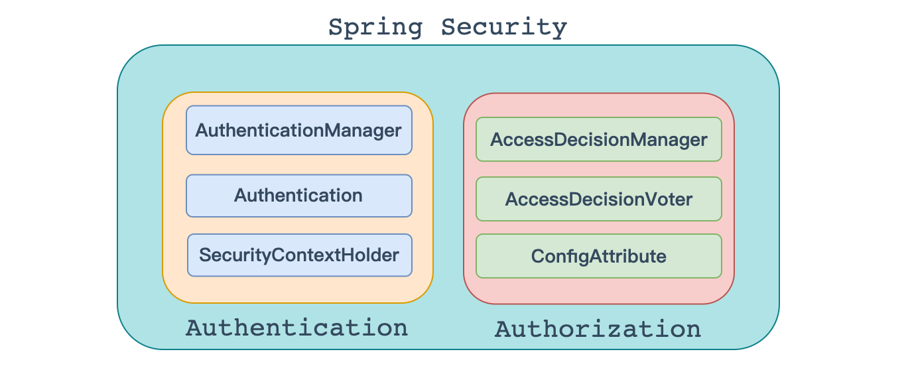
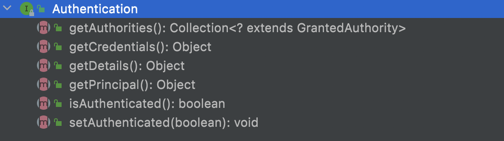
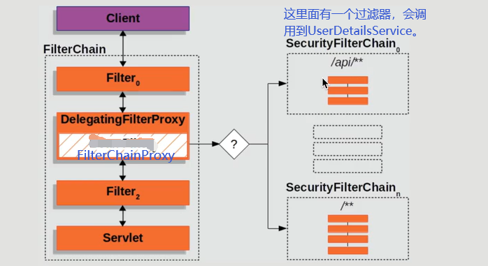
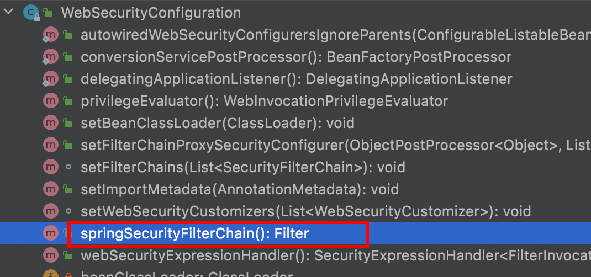
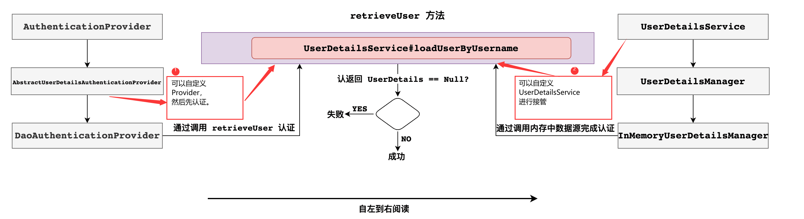
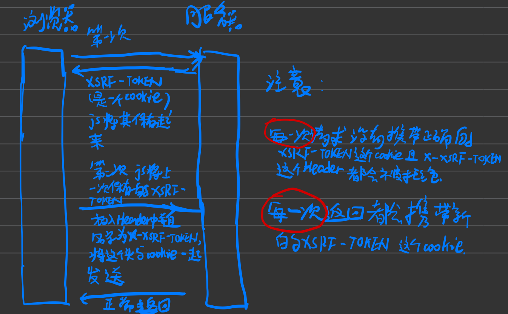

## [权限管理](https://shrink.fun/note/spring-security/#/?id=权限管理)

基本上涉及到用户参与的系统都要进行权限管理，权限管理属于系统安全的范畴，权限管理实现`对用户访问系统的控制`，按照`安全规则`或者`安全策略`控制用户`可以访问而且只能访问自己被授权的资源`。

权限管理包括用户**身份认证**和**授权**两部分，简称**认证授权**。对于需要访问控制的资源用户首先经过身份认证，认证通过后用户具有该资源的访问权限方可访问。

### [认证](https://shrink.fun/note/spring-security/#/?id=认证)

**`身份认证`** ，就是判断一个用户是否为合法用户的处理过程。最常用的简单身份认证方式是系统通过核对用户输入的用户名和口令，看其是否与系统中存储的该用户的用户名和口令一致，来判断用户身份是否正确。对于采用[指纹](http://baike.baidu.com/view/5628.htm)等系统，则出示指纹；对于硬件Key等刷卡系统，则需要刷卡。

### [授权](https://shrink.fun/note/spring-security/#/?id=授权)

**`授权`**，即访问控制，控制谁能访问哪些资源。主体进行身份认证后需要分配权限方可访问系统的资源，对于某些资源没有权限是无法访问的

### [解决方案](https://shrink.fun/note/spring-security/#/?id=解决方案)

和其他领域不同，在 Java 企业级开发中，安全管理框架非常少，目前比较常见的就是：

- Shiro

	- Shiro 本身是一个老牌的安全管理框架，有着众多的优点，例如轻量、简单、易于集成、可以在JavaSE环境中使用等。不过，在微服务时代，Shiro 就显得力不从心了，在微服务面前和扩展方面，无法充分展示自己的优势。

- ## [开发者自定义](https://shrink.fun/note/spring-security/#/?id=开发者自定义)

	也有很多公司选择自定义权限，即自己开发权限管理。但是一个系统的安全，不仅仅是登录和权限控制这么简单，我们还要考虑种各样可能存在的网络政击以及防彻策略，从这个角度来说，开发者白己实现安全管理也并非是一件容易的事情，只有大公司才有足够的人力物力去支持这件事情。

- Spring Security

	- Spring Security,作为spring 家族的一员，在和 Spring 家族的其他成员如 Spring Boot Spring Clond等进行整合时，具有其他框架无可比拟的优势，同时对 OAuth2 有着良好的支持，再加上Spring Cloud对 Spring Security的不断加持（如推出 Spring Cloud Security )，让 Spring Securiy 不知不觉中成为微服务项目的首选安全管理方案。

## [整体架构](https://shrink.fun/note/spring-security/#/?id=整体架构)

在的架构设计中，**`认证`**和**`授权`** 是分开的，无论使用什么样的认证方式。都不会影响授权，这是两个独立的存在，这种独立带来的好处之一，就是可以非常方便地整合一些外部的解决方案。



### [认证](https://shrink.fun/note/spring-security/#/?id=认证-1)

#### [AuthenticationManager](https://shrink.fun/note/spring-security/#/?id=authenticationmanager)

在Spring Security中认证是由`AuthenticationManager`接口来负责的，接口定义为：


```java
public interface AuthenticationManager { 
    Authentication authenticate(Authentication authentication) 
                                                          throws AuthenticationException;
}
```

- 返回 Authentication 表示认证成功
- 返回 AuthenticationException 异常，表示认证失败。

AuthenticationManager 主要实现类为 ProviderManager，在 ProviderManager 中管理了众多 AuthenticationProvider 实例。在一次完整的认证流程中，Spring Security 允许存在多个 AuthenticationProvider ，用来实现多种认证方式，这些 AuthenticationProvider 都是由 ProviderManager 进行统一管理的。


#### [Authentication](https://shrink.fun/note/spring-security/#/?id=authentication)

认证以及认证成功的信息主要是由 Authentication 的实现类进行保存的，其接口定义为：



```java
public interface Authentication extends Principal, Serializable {
    Collection<? extends GrantedAuthority> getAuthorities();
    Object getCredentials();
    Object getDetails();
    Object getPrincipal();
    boolean isAuthenticated();
    void setAuthenticated(boolean isAuthenticated) throws IllegalArgumentException;
}
```

- getAuthorities 获取用户权限信息
- getCredentials 获取用户凭证信息，一般指密码
- getDetails 获取用户详细信息
- getPrincipal 获取用户身份信息，用户名、用户对象等
- isAuthenticated 用户是否认证成功

#### [SecurityContextHolder](https://shrink.fun/note/spring-security/#/?id=securitycontextholder)

SecurityContextHolder 用来获取登录之后用户信息。Spring Security 会将登录用户数据保存在 Session 中。但是，为了使用方便,Spring Security在此基础上还做了一些改进，其中最主要的一个变化就是线程绑定。当用户登录成功后,Spring Security 会将登录成功的用户信息保存到 SecurityContextHolder 中。SecurityContextHolder 中的数据保存默认是通过ThreadLocal 来实现的，使用 ThreadLocal 创建的变量只能被当前线程访问，不能被其他线程访问和修改，也就是用户数据和请求线程绑定在一起。当登录请求处理完毕后，Spring Security 会将 SecurityContextHolder 中的数据拿出来保存到 Session 中，同时将 SecurityContexHolder 中的数据清空。以后每当有请求到来时，Spring Security 就会先从 Session 中取出用户登录数据，保存到 SecurityContextHolder 中，方便在该请求的后续处理过程中使用，同时在请求结束时将 SecurityContextHolder 中的数据拿出来保存到 Session 中，然后将 Security SecurityContextHolder 中的数据清空。这一策略非常方便用户在 Controller、Service 层以及任何代码中获取当前登录用户数据。

### [授权](https://shrink.fun/note/spring-security/#/?id=授权-1)

当完成认证后，接下米就是授权了。在 Spring Security 的授权体系中，有两个关键接口，

#### [AccessDecisionManager](https://shrink.fun/note/spring-security/#/?id=accessdecisionmanager)

> AccessDecisionManager (访问决策管理器)，用来决定此次访问是否被允许。


#### [AccessDecisionVoter](https://shrink.fun/note/spring-security/#/?id=accessdecisionvoter)

> AccessDecisionVoter (访问决定投票器)，投票器会检查用户是否具备应有的角色，进而投出赞成、反对或者弃权票。


AccesDecisionVoter 和 AccessDecisionManager 都有众多的实现类，在 AccessDecisionManager 中会换个遍历 AccessDecisionVoter，进而决定是否允许用户访问，因而 AaccesDecisionVoter 和 AccessDecisionManager 两者的关系类似于 AuthenticationProvider 和 ProviderManager 的关系。

#### [ConfigAttribute](https://shrink.fun/note/spring-security/#/?id=configattribute)

> ConfigAttribute，用来保存授权时的角色信息


在 Spring Security 中，用户请求一个资源(通常是一个接口或者一个 Java 方法)需要的角色会被封装成一个 ConfigAttribute 对象，在 ConfigAttribute 中只有一个 getAttribute方法，该方法返回一个 String 字符串，就是角色的名称。一般来说，角色名称都带有一个 `ROLE_` 前缀，投票器 AccessDecisionVoter 所做的事情，其实就是比较用户所具各的角色和请求某个 资源所需的 ConfigAtuibute 之间的关系。

## [实现原理](https://shrink.fun/note/spring-security/#/?id=实现原理)

https://docs.spring.io/spring-security/site/docs/5.5.4/reference/html5/#servlet-architecture

### [配置相关](https://shrink.fun/note/spring-security/#/?id=配置相关)

加载默认配置的类SpringBootWebSecurityConfiguration，这个类是 spring boot 自动配置类，通过这个源码得知，默认情况下对所有请求进行权限控制:

```java
@Configuration(proxyBeanMethods = false)
@ConditionalOnDefaultWebSecurity
@ConditionalOnWebApplication(type = Type.SERVLET)
class SpringBootWebSecurityConfiguration {
    @Bean
    @Order(SecurityProperties.BASIC_AUTH_ORDER)
    SecurityFilterChain defaultSecurityFilterChain(HttpSecurity http) 
    throws Exception {
    //要求所有请求都要认证
    http.authorizeRequests().anyRequest().authenticated()
    .and().formLogin().and().httpBasic();
        return http.build();
    }
}
```


**这就是为什么在引入 Spring Security 中没有任何配置情况下，请求会被拦截的原因！**

通过上面对自动配置分析，我们也能看出默认生效条件为:

```java
class DefaultWebSecurityCondition extends AllNestedConditions {

    DefaultWebSecurityCondition() {
        super(ConfigurationPhase.REGISTER_BEAN);
    }

    @ConditionalOnClass({ SecurityFilterChain.class, HttpSecurity.class })
    static class Classes {

    }

    @ConditionalOnMissingBean({ WebSecurityConfigurerAdapter.class, SecurityFilterChain.class })
    static class Beans {

    }

}
```

- 条件一 classpath中存在 SecurityFilterChain.class, HttpSecurity.class
- 条件二 没有自定义 WebSecurityConfigurerAdapter.class, SecurityFilterChain.class

**结论：**只要我们不自定义配置类(比如WebSecurityConfigurerAdapter) ，条件都是满足的，也就加载默认的配置。否则如果要进行自定义配置，就要继承这个WebSecurityConfigurerAdapter类，通过覆盖类中方法达到修改默认配置的目的。**WebSecurityConfigurerAdapter** 这个类极其重要，Spring Security 核心配置都在这个类中：


### [执行流程（即SecurityFilter的使用情况和调用顺序）](https://shrink.fun/note/spring-security/#/?id=执行流程（即securityfilter的使用情况和调用顺序）)

在 SpringSecurity 中 `认证、授权` 等功能都是基于[过滤器](https://docs.spring.io/spring-security/site/docs/5.5.4/reference/html5/#servlet-architecture)完成的。



需要注意的是，默认过滤器并不是直接放在 Web 项目的原生过滤器链中，而是通过一个 FilterChainProxy 来统一管理。Spring Security 中的过滤器链通过 FilterChainProxy 嵌入到 Web项目的原生过滤器链中。FilterChainProxy 作为一个顶层的管理者，将统一管理 Security Filter。FilterChainProxy 本身是通过 Spring 框架提供的 DelegatingFilterProxy 整合到原生的过滤器链中。

SecurityFilter的使用情况和调用顺序如下

| 过滤器                                          | 过滤器作用                                               | 默认是否加载 |
| ----------------------------------------------- | -------------------------------------------------------- | ------------ |
| ChannelProcessingFilter                         | 过滤请求协议 HTTP 、HTTPS                                | NO           |
| `WebAsyncManagerIntegrationFilter`              | 将 WebAsyncManger 与 SpringSecurity 上下文进行集成       | YES          |
| `SecurityContextPersistenceFilter`              | 在处理请求之前,将安全信息加载到 SecurityContextHolder 中 | YES          |
| `HeaderWriterFilter`                            | 处理头信息加入响应中                                     | YES          |
| CorsFilter                                      | 处理跨域问题                                             | NO           |
| `CsrfFilter`                                    | 处理 CSRF 攻击                                           | YES          |
| `LogoutFilter`                                  | 处理注销登录                                             | YES          |
| OAuth2AuthorizationRequestRedirectFilter        | 处理 OAuth2 认证重定向                                   | NO           |
| Saml2WebSsoAuthenticationRequestFilter          | 处理 SAML 认证                                           | NO           |
| X509AuthenticationFilter                        | 处理 X509 认证                                           | NO           |
| AbstractPreAuthenticatedProcessingFilter        | 处理预认证问题                                           | NO           |
| CasAuthenticationFilter                         | 处理 CAS 单点登录                                        | NO           |
| OAuth2LoginAuthenticationFilter                 | 处理 OAuth2 认证                                         | NO           |
| Saml2WebSsoAuthenticationFilter                 | 处理 SAML 认证                                           | NO           |
| `UsernamePasswordAuthenticationFilter`          | 处理表单登录                                             | YES          |
| OpenIDAuthenticationFilter                      | 处理 OpenID 认证                                         | NO           |
| `DefaultLoginPageGeneratingFilter`              | 配置默认登录页面                                         | YES          |
| `DefaultLogoutPageGeneratingFilter`             | 配置默认注销页面                                         | YES          |
| ConcurrentSessionFilter                         | 处理 Session 有效期                                      | NO           |
| DigestAuthenticationFilter                      | 处理 HTTP 摘要认证                                       | NO           |
| BearerTokenAuthenticationFilter                 | 处理 OAuth2 认证的 Access Token                          | NO           |
| `BasicAuthenticationFilter`                     | 处理 HttpBasic 登录                                      | YES          |
| `RequestCacheAwareFilter`                       | 处理请求缓存                                             | YES          |
| `SecurityContextHolder<br />AwareRequestFilter` | 包装原始请求                                             | YES          |
| JaasApiIntegrationFilter                        | 处理 JAAS 认证                                           | NO           |
| RememberMeAuthenticationFilter                  | 处理 RememberMe 登录                                     | NO           |
| `AnonymousAuthenticationFilter`                 | 配置匿名认证                                             | YES          |
| OAuth2AuthorizationCodeGrantFilter              | 处理OAuth2认证中授权码                                   | NO           |
| `SessionManagementFilter`                       | 处理 session 并发问题                                    | YES          |
| `ExceptionTranslationFilter`                    | 处理认证/授权中的异常                                    | YES          |
| `FilterSecurityInterceptor`                     | 处理授权相关                                             | YES          |
| SwitchUserFilter                                | 处理账户切换                                             | NO           |

可以看出，Spring Security 提供了 30 多个过滤器。默认情况下Spring Boot 在对 Spring Security 进入自动化配置时，会创建一个名为 SpringSecurityFilerChain 的过滤器，并注入到 Spring 容器中，这个过滤器将负责所有的安全管理，包括用户认证、授权、重定向到登录页面等。具体可以参考WebSecurityConfiguration的源码:




## [登录流程图](https://shrink.fun/note/spring-security/#/?id=登录流程图)



## [用法](https://shrink.fun/note/spring-security/#/?id=用法)

### [引依赖](https://shrink.fun/note/spring-security/#/?id=引依赖)

```xml
<!--security-->
<dependency>
    <groupId>org.springframework.boot</groupId>
    <artifactId>spring-boot-starter-security</artifactId>
</dependency>
```

### [代码](https://shrink.fun/note/spring-security/#/?id=代码)

1. 登录接口的url，参数名字。
2. 认证类
3. 数据以json格式登录
4. 登录成功处理器
5. 登录失败处理器
6. 退出接口的url，请求方法。
7. 退出成功处理器
8. 匿名用户访问受限url处理器
9. 拦截规则

参考数据库（简单）:

~~~sql
CREATE TABLE `role`  (
  `id` int NOT NULL AUTO_INCREMENT,
  `name` varchar(32) CHARACTER SET utf8mb4 COLLATE utf8mb4_0900_ai_ci NULL DEFAULT NULL,
  `name_zh` varchar(32) CHARACTER SET utf8mb4 COLLATE utf8mb4_0900_ai_ci NULL DEFAULT NULL,
  PRIMARY KEY (`id`) USING BTREE
) 

DROP TABLE IF EXISTS `user`;
CREATE TABLE `user`  (
  `id` int NOT NULL AUTO_INCREMENT,
  `username` varchar(32) CHARACTER SET utf8mb4 COLLATE utf8mb4_0900_ai_ci NOT NULL,
  `password` varchar(255) CHARACTER SET utf8mb4 COLLATE utf8mb4_0900_ai_ci NOT NULL,
  `enabled` tinyint(1) NULL DEFAULT NULL,
  `account_non_expired` tinyint(1) NULL DEFAULT NULL,
  `account_non_locked` tinyint(1) NULL DEFAULT NULL,
  `credentials_non_xpired` tinyint(1) NULL DEFAULT NULL,
  PRIMARY KEY (`id`) USING BTREE
)

CREATE TABLE `user_role`  (
  `id` int NOT NULL AUTO_INCREMENT,
  `uid` int NOT NULL,
  `rid` int NOT NULL,
  PRIMARY KEY (`id`) USING BTREE
)

# 必须以ROLE_开头，可以在代码中加上，也可以数据库直接加上
INSERT INTO `role` VALUES (1, 'ROLE_admin', '系统管理员');
INSERT INTO `role` VALUES (2, 'ROLE_common', '普通用户');
# {noop}表示密码类型，noop表示明文密码
INSERT INTO `user` VALUES (3, 'lisi', '{noop}1111', '男', 1, 1, 1, 1);
INSERT INTO `user_role` VALUES (1, 3, 1);
~~~


#### [认证类](https://shrink.fun/note/spring-security/#/?id=认证类)

```java
@Service
public class MyUserDetailsService implements UserDetailsService{
    @Autowired
    private UserMapper userMapper;
    @Override
    public UserDetails loadUserByUsername(String username) throws UsernameNotFoundException{
        //查到用户
        User user=userMapper.selectUserByUsername(username);
        //如果user不是空则构造需要返回的user.
        if(user!=null){
            //构建角色列表
            ArrayList<SimpleGrantedAuthority> authorities=new ArrayList<>();
            userMapper.selectRolesByUserId(user.getId())
                      .forEach(((Role role)->{
                          //添加角色,角色必须以"ROLE_"开头.
                          authorities.add(new SimpleGrantedAuthority("ROLE_"+role.getName()));
                      }));
            //其他未设置的属性默认都是true
            return new org.springframework.security.core.userdetails.User(user.getUsername(),user.getPassword(),authorities);
        }
        throw new UsernameNotFoundException("用户名没找到!!!");
    }
}
```

#### [登录成功处理器](https://shrink.fun/note/spring-security/#/?id=登录成功处理器)

AuthenticationSuccessHandler 实现

```java
@Component
public class LoginSuccessHandler implements AuthenticationSuccessHandler{
    //登录成功时回调这个方法
    @Override
    public void onAuthenticationSuccess(HttpServletRequest request,HttpServletResponse response,
            Authentication authentication/*认证相关信息(用户数据)*/) throws IOException, ServletException{
        HashMap<String,Object> res=new HashMap<>();
        res.put("msg","登录成功");
        res.put("user",authentication);
        res.put("status","200");
        response.setContentType("application/json;charset=UTF-8");
        response.getWriter().print(new Gson().toJson(res));
    }
}
```

#### [登录失败处理器](https://shrink.fun/note/spring-security/#/?id=登录失败处理器)

AuthenticationFailureHandler 实现

```java
@Component
public class LoginFailureHandler implements AuthenticationFailureHandler{
    //登录失败时回调这个方法
    @Override
    public void onAuthenticationFailure(HttpServletRequest request,HttpServletResponse response,
            AuthenticationException exception/*异常信息*/) throws IOException, ServletException{
        HashMap<String,Object> res=new HashMap<>();
        res.put("msg","登录失败");
        res.put("exception",exception);
        res.put("status","400");
        response.setContentType("application/json;charset=UTF-8");
        response.getWriter().print(new Gson().toJson(res));
    }
}
```

#### [退出成功处理器](https://shrink.fun/note/spring-security/#/?id=退出成功处理器)

LogoutSuccessHandler实现

```java
@Component
public class MyLogoutSuccessHandler implements LogoutSuccessHandler{
    //退出成功时回调这个方法
    @Override
    public void onLogoutSuccess(HttpServletRequest request,HttpServletResponse response,Authentication authentication/*认证相关信息(用户数据)*/) throws IOException, ServletException{
        HashMap<String,Object> res=new HashMap<>();
        res.put("msg","退出成功");
        res.put("exitingUser",authentication);
        res.put("status","200");
        response.setContentType("application/json;charset=UTF-8");
        response.getWriter().print(new Gson().toJson(res));
    }
}
```

#### [未登录处理器](https://shrink.fun/note/spring-security/#/?id=未登录处理器)

```java
@Component
public class MyAuthenticationEntryPoint implements AuthenticationEntryPoint{
    //未登录时调这个方法
    @Override
    public void commence(HttpServletRequest request,HttpServletResponse response,AuthenticationException authException) throws IOException, ServletException{
        HashMap<String,String> map=new HashMap<>();
        map.put("msg","请先登录");
        response.setContentType("application/json");
        response.setCharacterEncoding("utf-8");
        response.getWriter().print(new Gson().toJson(map));
    }
}
```

#### [无权限处理器](https://shrink.fun/note/spring-security/#/?id=无权限处理器)

```java
@Component
public class MyAccessDeniedHandler implements AccessDeniedHandler{
    //无权限时调用这个方法
    @Override
    public void handle(HttpServletRequest request,HttpServletResponse response,AccessDeniedException accessDeniedException) throws IOException, ServletException{
        HashMap<String,String> map=new HashMap<>();
        map.put("msg","没有权限");
        response.setContentType("application/json");
        response.setCharacterEncoding("utf-8");
        response.getWriter().print(new Gson().toJson(map));
    }
}
```

#### [Session被挤掉处理器](https://shrink.fun/note/spring-security/#/?id=session被挤掉处理器)

```java
@Component
public class MySessionInformationExpiredStrategy implements SessionInformationExpiredStrategy{
    /**
     * session被挤掉时调用
     */
    @Override
    public void onExpiredSessionDetected(SessionInformationExpiredEvent event) throws IOException, ServletException{
        HttpServletResponse response=event.getResponse();
        response.setContentType("application/json;charset=UTF-8");
        Map<String,Object> map=new HashMap<>();
        map.put("msg","当前会话已被挤掉,请重新登录!");
        response.getWriter()
                .println(new Gson().toJson(map));
    }
}
```

#### [两种登录形式对应的写法](https://shrink.fun/note/spring-security/#/?id=两种登录形式对应的写法)

> 记住我：在登录成功后给客户端发送一个cookie（本质是一个token），登录后每次访问时，如果session失效则会从cookie中恢复一个新session，这样客户端可用时间就是这个cookie的存活时间。

##### [数据以表单格式登录](https://shrink.fun/note/spring-security/#/?id=数据以表单格式登录)

```java
@Component
public class SecurityConfig extends WebSecurityConfigurerAdapter{
    //登录成功处理器
    @Autowired
    private AuthenticationSuccessHandler authenticationSuccessHandler;
    //登录失败处理器
    @Autowired
    AuthenticationFailureHandler authenticationFailureHandler;
    //退出成功处理器
    @Autowired
    private LogoutSuccessHandler logoutSuccessHandler;
    //未登录处理器
    @Autowired
    AuthenticationEntryPoint authenticationEntryPoint;
    //无权限处理器
    @Autowired
    AccessDeniedHandler accessDeniedHandler;
    //session被挤掉处理器
    @Autowired
    SessionInformationExpiredStrategy sessionInformationExpiredStrategy;
    //userDetailsService,用于给下面设置.
    @Autowired
    private UserDetailsService  userDetailsService;
    @Override
    public void configure(AuthenticationManagerBuilder builder) {
        //设置UserDetailsService
        builder.userDetailsService(userDetailsService);
    }
    //默认情况下AuthenticationManager是没办法从工厂中获取的,需要这样来声明它是bean.
    @Bean
    @Override
    public AuthenticationManager authenticationManagerBean() throws Exception{
        return super.authenticationManagerBean();
    }
    //供CORS使用
    public CorsConfigurationSource configurationSource(){
        CorsConfiguration corsConfiguration=new CorsConfiguration();
           //允许的域
        corsConfiguration.setAllowedOrigins(Arrays.asList("*"));
        //允许的请求方法
        corsConfiguration.setAllowedMethods(Arrays.asList("*"));
        //允许的请求头
        corsConfiguration.setAllowedHeaders(Arrays.asList("*"));
        //不需要预检请求的时间
        corsConfiguration.setMaxAge(3600L);
        UrlBasedCorsConfigurationSource source=new UrlBasedCorsConfigurationSource();
        //对系统的哪些url使用上面的配置
        source.registerCorsConfiguration("/**",corsConfiguration);
        return source;
    }
    //刚被注入时就会调这个方法进行预设
    @Override
    protected void configure(HttpSecurity http) throws Exception{
        http.authorizeRequests()
                .antMatchers("/role")
                //通过URL设置权限
                //表示/role只允许访问用户是指定的任意一个角色时才能访问
                .hasAnyRole("admin","user")
                .antMatchers("/authority")
                //表示/authority只允许访问用户拥有指定的权限时才能访问
                .hasAuthority("authority")
                //antMatchers()参数可以有多个url且均为ant风格,denyAll()表示拒绝所有请求.
                .antMatchers("/hello111").denyAll()
                //任何请求都要认证,anyRequest()必须在最后.
                .anyRequest().authenticated()
                //返回HttpSecurity
                .and()
                //采用表单认证
                .formLogin()
                //以下三项设置均是可选的
                    //确认登录的url
                    .loginProcessingUrl("/login")
                    //自定义的usernameParameter
                    .usernameParameter("username")
                    //自定义的passwordParameter
                    .passwordParameter("password")
                //认证成功后的处理器，相关介绍在下面。
                .successHandler(authenticationSuccessHandler)
                //认证成功后的处理器，相关介绍在下面。
                .failureHandler(authenticationFailureHandler)
                .and()
                //对于退出配置,不管是表单登录还是json登录都有效.
                .logout()
                //以下这项设置是可选的
                    //自定义的退出url以及请求方式
                    .logoutRequestMatcher(new OrRequestMatcher(new AntPathRequestMatcher("/logout1","GET"),new AntPathRequestMatcher("/logout2","POST")))
                //成功后的处理器，相关介绍在下面。
                .logoutSuccessHandler(logoutSuccessHandler)
                .and()
                //开启记住我,会在两处起作用:
                //1.登录成功时查看是否要添加cookie(本质是一个token)
                //2.session失效后用cookie恢复一个新session
                .rememberMe()
                //设置记住我的cookie的名字
                .rememberMeCookieName("cookie-remember-me")
                //设置决定是否开启记住我的参数的名字
                .rememberMeParameter("param-remember-me")
                .and()
                //开启CORS
                .cors()
                //CORS具体配置
                .configurationSource(configurationSource())
                .and()
                .exceptionHandling()
                //未登录处理器
                .authenticationEntryPoint(authenticationEntryPoint)
                //无权限处理器
                .accessDeniedHandler(accessDeniedHandler)
                .and()
                //禁用csrf防御
                //.csrf().disable()
                //启用csrf防御(默认),并且设置这个cookie允许js获取.
                .csrf()
                .csrfTokenRepository(CookieCsrfTokenRepository.withHttpOnlyFalse())
               .and()
                //开启会话管理
                .sessionManagement()
                //同一个账号密码共存会话个数
                .maximumSessions(1)
                //A挤B
                //怎么给A返回
                //.expiredSessionStrategy(sessionInformationExpiredStrategy)
                //禁止B登录
                .maxSessionsPreventsLogin(true)
                //使用SpringSecurity且要管理会话并存且为分布式情况则要加上这个保证管理会话并存正确
                .sessionRegistry(sessionRegistry());
    }
    /**
    * 以下三项用于使用SpringSecurity且要管理会话并存且为分布式情况
    */
    private FindByIndexNameSessionRepository sessionRepository;
    @Autowired
    public SecurityConfig(FindByIndexNameSessionRepository sessionRepository){
        this.sessionRepository=sessionRepository;
    }
    @Bean
    public SpringSessionBackedSessionRegistry sessionRegistry(){
        return new SpringSessionBackedSessionRegistry(sessionRepository);
    }
}
```

> SpringSecurity下CSRF防御的原理
>
> **注意:** HEAD、OPTIONS、TRACE 等方法就没有必要使用 CSRF 令牌了，强行使用可能会导致令牌泄露！

##### [数据以json格式登录](https://shrink.fun/note/spring-security/#/?id=数据以json格式登录)

1. 自定义JsonLoginFilter

	```java
	public class JsonLoginFilter extends UsernamePasswordAuthenticationFilter{
	    private Map<String,String> usernameAndPasswordAndRememberMe=null;
	    @Override
	    protected String obtainUsername(HttpServletRequest request){
	            try{
	                //将流数据转化成map
	                usernameAndPasswordAndRememberMe=new Gson().fromJson(new InputStreamReader(request.getInputStream()),Map.class);
	                //将获取记住我的参数名
	                String rememberMeParam=((TokenBasedRememberMeServices)getRememberMeServices()).getParameter();
	                //将记住我对应的值放入请求域中
	                request.setAttribute(rememberMeParam,usernameAndPasswordAndRememberMe.get(rememberMeParam));
	                return usernameAndPasswordAndRememberMe.get(getUsernameParameter());
	            }
	            catch(IOException e){
	                e.printStackTrace();
	                return null;
	            }
	    }
	    @Override
	    protected String obtainPassword(HttpServletRequest request){
	            String password=usernameAndPasswordAndRememberMe.get(getPasswordParameter());
	            return password;
	    }
	}
	```

2. 自定义RememberMeServices

	```java
	public class MyTokenBasedRememberMeServices extends TokenBasedRememberMeServices{
	    public MyTokenBasedRememberMeServices(String key,UserDetailsService userDetailsService){
	        super(key,userDetailsService);
	    }
	    /**
	     * 判断是否开启了remember-me
	     */
	    @Override
	    protected boolean rememberMeRequested(HttpServletRequest request,String parameter){
	        String rememberMeParam=(String)request.getAttribute(parameter);
	        if(rememberMeParam!=null){
	            if(rememberMeParam.equalsIgnoreCase("true")||rememberMeParam.equalsIgnoreCase("on")||rememberMeParam.equalsIgnoreCase("yes")||rememberMeParam.equals("1")){
	                return true;
	            }
	        }
	        return false;
	    }
	}
	```

3. 配置类

	```java
	@Configuration
	public class SecurityConfig extends WebSecurityConfigurerAdapter{
	    @Autowired
	    UserDetailsService userDetailsService;
	    //登录成功处理器
	    @Autowired
	    private AuthenticationSuccessHandler authenticationSuccessHandler;
	    //登录失败处理器
	    @Autowired
	    AuthenticationFailureHandler authenticationFailureHandler;
	    //退出成功处理器
	    @Autowired
	    private LogoutSuccessHandler logoutSuccessHandler;
	    //未登录处理器
	    @Autowired
	    MyAuthenticationEntryPoint authenticationEntryPoint;
	    //POST方式以json传递账号和密码的过滤器
	    @Bean
	    JsonLoginFilter jsonLoginFilter(){
	        JsonLoginFilter jsonLoginFilter=new JsonLoginFilter();
	        try{
	            jsonLoginFilter.setAuthenticationManager(authenticationManagerBean());
	            //以下六项只在使用json认证时有效
	            jsonLoginFilter.setFilterProcessesUrl("/my-login");	//默认值：/login，登录请求路径
	            jsonLoginFilter.setUsernameParameter("uname");
	            jsonLoginFilter.setPasswordParameter("passwd");
	            jsonLoginFilter.setAuthenticationSuccessHandler(authenticationSuccessHandler);
	            jsonLoginFilter.setAuthenticationFailureHandler(authenticationFailureHandler);
	            //设置[记住我]对应的类来决定在验证成功后是否给客户端返回cookie
	            jsonLoginFilter.setRememberMeServices(myTokenBasedRememberMeServices());
	        }
	        catch(Exception e){
	            e.printStackTrace();
	        }
	        return jsonLoginFilter;
	    }
	    //POST方式以json传递是否记住我
	    @Bean
	    MyTokenBasedRememberMeServices myTokenBasedRememberMeServices(){
	        MyTokenBasedRememberMeServices myTokenBasedRememberMeServices=new MyTokenBasedRememberMeServices(UUID.randomUUID()
	                                                                                                             .toString(),userDetailsService);
	        myTokenBasedRememberMeServices.setCookieName("cookie-remember-me");
	        myTokenBasedRememberMeServices.setParameter("param-remember-me");
	        return myTokenBasedRememberMeServices;
	    }
	    //配置userDetailsService
	    @Override
	    protected void configure(AuthenticationManagerBuilder auth) throws Exception{
	        auth.userDetailsService(userDetailsService);
	    }
	    //默认情况下AuthenticationManager是没办法从工厂中获取的,需要这样来声明它是bean.
	    @Bean
	    @Override
	    public AuthenticationManager authenticationManagerBean() throws Exception{
	        return super.authenticationManagerBean();
	    }
	    //刚被注入时就会调这个方法进行预设(缺少的到[以表单登录]的代码里找)
	    @Override
	    protected void configure(HttpSecurity http) throws Exception{
	        http.authorizeRequests()
	            //拒绝所有请求
	            .antMatchers("/hello111")
	            .denyAll()
	            .antMatchers("/verify-code.png")
	            .anonymous()
	            //任何请求都要认证,anyRequest()必须在最后.
	            .anyRequest()
	            .authenticated()
	            //返回HttpSecurity
	            .and()
	            //把默认的表单登录切换为json格式登录
	            .addFilterAt(jsonLoginFilter(),UsernamePasswordAuthenticationFilter.class)
	            //采用表单认证(如果切换为json了的话,底层实现已经被自定义的过滤器换掉了.)
	            .formLogin()
	            .and()
	            .logout()
	            //以下这项设置是可选的
	            //对于退出配置,不管是表单登录还是json登录都有效.
	            //自定义的退出url以及请求方式
	            .logoutRequestMatcher(new OrRequestMatcher(new AntPathRequestMatcher("/logout1","GET"),new AntPathRequestMatcher("/logout2","POST")))
	            //退出成功后的处理器,相关介绍在下面.
	            .logoutSuccessHandler(logoutSuccessHandler)
	            .and()
	            //开启记住我,会在两处起作用:
	            //1.登录成功时查看是否要添加cookie(本质是一个token)
	            //2.session失效后用cookie恢复一个新session
	            .rememberMe()
	            //设置当session失效后使用的[记住我]
	            .rememberMeServices(myTokenBasedRememberMeServices())
	            .and()
	            //未登录处理器
	            .exceptionHandling()
	            .authenticationEntryPoint(authenticationEntryPoint)
	            .and()
	            //禁用csrf防御
	            //.csrf().disable()
	            //启用csrf防御(默认),并且设置这个cookie允许js获取.
	            .csrf().csrfTokenRepository(CookieCsrfTokenRepository.withHttpOnlyFalse());
	    }
	}
	```

#### [OAuth2.0](https://shrink.fun/note/spring-security/#/?id=oauth20)

> OAuth2.0登录和其他登录方式并存

1. 引依赖

	```xml
	<!--OAuth2.0-client-->
	<dependency>
	    <groupId>org.springframework.boot</groupId>
	    <artifactId>spring-boot-starter-oauth2-client</artifactId>
	</dependency>
	```

2. 写配置

	```yml
	spring:
	  security:
	    oauth2:
	      client:
	        registration:
	          #可以配置多种社交登录
	          #gitee的配置1
	          gitee:
	            #clientId
	            client-id: cfb4c222862e5e42de4a2bb5bb0717f81e5509ef87592610f03eee62c0629005
	            #client密钥
	            client-secret: fdeee8118b01f9e04f05982b67e97c713719cd7312ed2ca3b39eb29000012cc4
	            #重定向uri(授权服务器认证通过后访问)(必须符合SecurityConfig类中配置的重定向url的格式)(gitee上面填写的redirect-uri要和这里一样)
	            redirect-uri: http://localhost:8080/oauth2-login/my-gitee
	            #授权类型                  授权码模式
	            authorization-grant-type: authorization_code
	        provider:
	          #可以配置多种社交登录
	          #gitee的配置2
	          gitee:
	            #获取code的uri
	            authorization-uri: https://gitee.com/oauth/authorize
	            #获取token的uri
	            token-uri: https://gitee.com/oauth/token
	            #获取用户信息的uri
	            user-info-uri: https://gitee.com/api/v5/user
	            #用户名对应的属性名
	            user-name-attribute: name
	```

3. 使用

	```java
	public class SecurityConfig extends WebSecurityConfigurerAdapter{
	    @Override
	    protected void configure(HttpSecurity http) throws Exception{
	        //添加OAuth2.0登录方式(请求OAuth2.0登录的接口uri格式为/oauth2/authorization/配置文件中的key(如这里的gitee))
	        http.oauth2Login()
	            //重定向url的格式
	            .loginProcessingUrl("/oauth2-login/*")
	            //OAuth2.0认证成功后的处理器
	            .successHandler(authenticationSuccessHandler)
	            //OAuth2.0认证成功后的处理器
	            .failureHandler(authenticationFailureHandler);
	    }
	}
	```

#### [权限控制的写法](https://shrink.fun/note/spring-security/#/?id=权限控制的写法)

##### [硬编码](https://shrink.fun/note/spring-security/#/?id=硬编码)

###### [通过URL进行权限控制](https://shrink.fun/note/spring-security/#/?id=通过url进行权限控制)

> 看上面SecurityConfig中的写法

###### [通过方法上加注解进行权限控制](https://shrink.fun/note/spring-security/#/?id=通过方法上加注解进行权限控制)

1. 在任意一个bean（通常选择SecurityConfig）上加注解@EnableGlobalMethodSecurity(prePostEnabled=true)表示开启Controller/Service方法上注释权限控制

	```java
	//开启Controller/Service方法上注释权限控制
	@EnableGlobalMethodSecurity(prePostEnabled=true)
	public class SecurityConfig extends WebSecurityConfigurerAdapter{}
	```

2. 在Controller/Service方法上加注解进行权限控制

	```java
	//允许具有指定权限的任意一个权限的用户访问(在执行之前进行权限判断)
	@PreAuthorize("hasAnyRole('user','admin')")
	@GetMapping("/pre-authorize-by-method")
	public String preAuthorizeByMethod(){
	    return "user,admin";
	}
	//允许具有指定权限的任意一个权限的用户访问(在执行之后进行权限判断)
	@PostAuthorize("hasAnyRole('user','admin')")
	@GetMapping("/post-authorize-by-method")
	public String postAuthorizeByMethod(){
	    return "user,admin";
	}
	```

##### [通过数据库进行权限控制](https://shrink.fun/note/spring-security/#/?id=通过数据库进行权限控制)

1. 自定义【路径所需权限获取器】

	```java
	//自定义的路径所需权限获取器
	@Component
	public class MyFilterInvocationSecurityMetadataSource implements FilterInvocationSecurityMetadataSource{
	    /**
	     * @param object 封装了请求路径
	     * @return 请求路径所需要的权限列表
	     */
	    @Override
	    public Collection<ConfigAttribute> getAttributes(Object object) throws IllegalArgumentException{
	        //解析出请求路径
	        String requestURI=((FilterInvocation)object).getRequest()
	                                                    .getRequestURI();
	        String[] roles=null;
	        //TODO:
	        // 1.从数据库中查出所有菜单(路径)
	        // 2.依次比较找到对应的菜单
	        // 3.构建这个菜单所需要的权限字符串数组roles
	        return SecurityConfig.createList(roles);
	        //如果该请求路径不需要权限则返回null,代表该路径可任意访问.
	    }
	    /**
	     * 固定写法
	     */
	    @Override
	    public Collection<ConfigAttribute> getAllConfigAttributes(){
	        return null;
	    }
	    /**
	     * 固定写法
	     */
	    @Override
	    public boolean supports(Class<?> clazz){
	        return FilterInvocation.class.isAssignableFrom(clazz);
	    }
	}
	```
	
2. 在SecurityConfig中注入

	```java
	//路径所需权限获取器
	@Autowired
	FilterInvocationSecurityMetadataSource filterInvocationSecurityMetadataSource;
	```

3. 使用自定义的路径所需权限获取器

	```java
	@Override
	protected void configure(HttpSecurity http) throws Exception{
	    //使用路径所需权限获取器时,url的认证及授权都由它控制,下面声明的所有url除了登录和退出url外均失效.
	    ApplicationContext applicationContext=http.getSharedObject(ApplicationContext.class);
	    http.apply(new UrlAuthorizationConfigurer<>(applicationContext))
	        .withObjectPostProcessor(new ObjectPostProcessor<FilterSecurityInterceptor>(){
	            @Override
	            public <O extends FilterSecurityInterceptor> O postProcess(O object){
	                //使用自定义的路径所需权限获取器
	                object.setSecurityMetadataSource(filterInvocationSecurityMetadataSource);
	                return object;
	            }
	        });
	    //TODO:其他操作
	}
	```

#### [有验证码时](https://shrink.fun/note/spring-security/#/?id=有验证码时)

1. 引依赖

	```xml
	<!--kaptcha-->
	<dependency>
	   <groupId>com.baomidou</groupId>
	   <artifactId>kaptcha-spring-boot-starter</artifactId>
	   <version>1.1.0</version>
	</dependency>
	```

2. 配置

	```yml
	#验证码
	kaptcha:
	 content:
	   #源字符
	   source: wjl
	```

3. 验证码Controller

	```java
	
	
	@RestController
	public class KaptchaController{
	   @Autowired
	   private Producer producer;
	   @GetMapping("/verify-code.png")
	   public String getVerifyCode(HttpSession session) throws IOException{
	       //1.生成验证码
	       String kaptcha=producer.createText();
	       //验证码图片
	       BufferedImage bi=producer.createImage(kaptcha);
	       //2.存入session
	       session.setAttribute("kaptcha",kaptcha);
	       //3.把验证码图片转换成base64然后返回,前端拿到后解码然后渲染即可成图片.
	       FastByteArrayOutputStream fos=new FastByteArrayOutputStream();
	       ImageIO.write(bi,"png",fos);
	       return Base64.encodeBase64String(fos.toByteArray());
	   }
	}
	```
	
4. 自定义KaptchaLoginFilter

	```java
	public class KaptchaLoginFilter extends UsernamePasswordAuthenticationFilter{
	   @Override
	   public Authentication attemptAuthentication(HttpServletRequest request,HttpServletResponse response) throws AuthenticationException{
	       String kaptcha=(String)request.getSession()
	                                     .getAttribute("kaptcha");
	       try{
	           if(request.getParameter("verifyCode")
	                     .equals(kaptcha)){
	               //验证码通过则再进行后续
	               return super.attemptAuthentication(request,response);
	           }
	           else{
	               throw new RuntimeException("验证码不正确");
	           }
	       }
	       catch(NullPointerException e){
	           throw new RuntimeException("验证码不正确");
	       }
	   }
	}
	```
	
5. 配置类和JsonLoginFilter的配置类一样，把JsonLoginFilter替换为KaptchaLoginFilter，再把验证码接口放行即可。

## [在Controller中获取认证之后的用户数据](https://shrink.fun/note/spring-security/#/?id=在controller中获取认证之后的用户数据)

#### [单线程模式：MODE_THREADLOCAL（一次请求过程中数据只能在本线程中获取）](https://shrink.fun/note/spring-security/#/?id=单线程模式：mode_threadlocal（一次请求过程中数据只能在本线程中获取）)

```java
@RestController
public class HelloController {
    @GetMapping("/hello")
    public String hello() {
      Authentication authentication = SecurityContextHolder
        .getContext().getAuthentication();
      System.out.println("认证信息: "+authentication);
      return "hello security";
    }
}
```

#### [父子线程模式：MODE_INHERITABLETHREADLOCAL（一次请求过程中数据可以在本线程和后代线程中获取）](https://shrink.fun/note/spring-security/#/?id=父子线程模式：mode_inheritablethreadlocal（一次请求过程中数据可以在本线程和后代线程中获取）)

要传系统参数

```java
-Dspring.security.strategy=MODE_INHERITABLETHREADLOCAL
@RestController
public class HelloController {
    @GetMapping("/hello")
    public String hello() {
      new Thread(()->{
        Authentication authentication = SecurityContextHolder
          .getContext().getAuthentication();
        System.out.println("认证信息: "+authentication);
      }).start();
      return "hello security";
    }
}
```

## [密码加密](https://shrink.fun/note/spring-security/#/?id=密码加密)

> 由于加密器都是单向的，为了验证密码，要先从数据库中拿到用户名和加密后的密文，再用加密器把前端传过来的密码加密然后和数据库中的密文进行比较。 因此这里也提醒我们在往数据库中存储密码时要用加密后的密码。

如果容器中配置了PasswordEncoder，则使用配置的，否则使用默认的DelegatingPasswordEncoder。

- 显式指定的PasswordEncoder

```java
//配置PasswordEncoder
@Bean
public PasswordEncoder passwordEncoder(){
    return new BCryptPasswordEncoder();
}
```

 密码应该就是**加密后的**

- DelegatingPasswordEncoder

	密码应该是**{加密方法}加密后的密码**

	使用这种的话有密码升级机制

	> 在密码校验成功后，会用DelegatingPasswordEncoder里面默认的PasswordEncoder对不是默认的PasswordEncoder加密的密码重新以默认的PasswordEncoder进行加密（用用户登录时用的明文进行加密，加密后密码是{方式}密文。），然后会调用我们的MyUserDetailsPasswordService，我们可以把新密码存在数据库中，这样就完成了密码加密方式的更新。
	>
	> ```java
	> @Service
	> public class MyUserDetailsPasswordService implements UserDetailsPasswordService{
	>     @Autowired
	>     private UserMapper userMapper;
	>     @Override
	>     public UserDetails updatePassword(UserDetails user,String newPassword){
	>         //newPassword已经是 {加密方式}密文 了
	>         User tempUser=new User();
	>         tempUser.setUsername(user.getUsername());
	>         tempUser.setPassword(newPassword);
	>         //把更新后的密码保存在数据库中
	>         userMapper.updateUserByUsername(tempUser);
	>         return user;
	>     }
	> }
	> ```

# JWT

1. 配置类：（多种方式，这里是自定义SecurityFilterChain的Bean）

~~~java
@Configuration
@RequiredArgsConstructor
public class SecurityConfig {
	private final StringRedisTemplate redisTemplate;

	@Bean
	public PasswordEncoder passwordEncoder() {
		return new BCryptPasswordEncoder();
	}

	@Bean
	public SecurityFilterChain securityFilterChain(HttpSecurity httpSecurity) throws Exception {
		return httpSecurity
				.formLogin((config) -> {
					config.loginProcessingUrl(LOGIN_URL)
						.usernameParameter("loginAct")
						.passwordParameter("loginPwd")
						.successHandler((request, response, authentication) -> {
							TUser user = (TUser) authentication.getPrincipal();
							String userJson = JsonUtil.toJson(user);

							// 生成jwt，如果勾选了记住我，则保存7天，否则保存30分钟
							String jwt = JWTUtils.createJWT(userJson);
							boolean rememberMe = Boolean.parseBoolean(request.getParameter("rememberMe"));
							redisTemplate.opsForValue().set(TOKEN_KEY + user.getId(), jwt,
									rememberMe ? EXPIRE_TIME : DEFAULT_EXPIRE_TIME, TimeUnit.MINUTES);

							user.setLoginPwd(null);
							String res = JsonUtil.toJson(R.OK(user, jwt));
							response.setContentType("application/json;charset=utf-8");
							response.getWriter().write(res);
						})
						.failureHandler((request, response, exception) -> {
							String json = JsonUtil.toJson(R.FAIL(exception.getMessage()));
							response.setContentType("application/json;charset=utf-8");
							response.getWriter().write(json);
						});
					
				})
				.logout((config) -> {
					config.logoutUrl(LOGIN_OUT_URL)
						.logoutSuccessHandler((request, response, authentication) -> {
							TUser user = (TUser) authentication.getPrincipal();
							redisTemplate.delete(TOKEN_KEY + user.getId());
							response.setContentType("application/json;charset=utf-8");
							response.getWriter().write(JsonUtil.toJson(R.OK()));
						});
				})
				.authorizeHttpRequests((config) -> {
					config.requestMatchers(LOGIN_URL).permitAll()
						.anyRequest().authenticated();
				})
            	.exceptionHandling((config) -> {
					// 没有权限时触发（若配置了全局异常处理器，则优先走全局异常处理器的逻辑）
					config.accessDeniedHandler((request, response, accessDeniedException) -> {
						String json = JsonUtil.toJson(R.FAIL(ACCESS_DENIED));
						response.getWriter().write(json);
					});
				})
				.csrf(AbstractHttpConfigurer::disable)
				// 禁用session，前后端分离不需要用session，用jwt
				.sessionManagement((config) -> {
					config.sessionCreationPolicy(SessionCreationPolicy.STATELESS);
				})
				.addFilterBefore(new TokenFilter(redisTemplate), LogoutFilter.class)
				.build();
	}
}
~~~


2. 过滤器配置：

~~~java
@RequiredArgsConstructor
public class TokenFilter extends OncePerRequestFilter {
	private final StringRedisTemplate redisTemplate;
	// 创建一个单线程的线程池
	private final ExecutorService EXECUTOR_SERVICE = Executors.newSingleThreadExecutor();

	@Override
	protected void doFilterInternal(HttpServletRequest request, HttpServletResponse response, FilterChain filterChain) throws ServletException, IOException {
		if (request.getRequestURI().contains(Constants.LOGIN_URL)) {
			filterChain.doFilter(request, response);
			return;
		}
		response.setContentType("application/json;charset=utf-8");
		String token = request.getHeader("Authorization");
		if (!StringUtils.hasText(token)) {
			String resJson = JsonUtil.toJson(R.FAIL(CodeEnum.TOKEN_IS_EMPTY));
			response.setStatus(401);
			response.getWriter().write(resJson);
			return;
		}
		if (!JWTUtils.verifyJWT(token)) {
			String resJson = JsonUtil.toJson(R.FAIL(CodeEnum.TOKEN_IS_ILLEGAL));
			response.setStatus(401);
			response.getWriter().write(resJson);
			return;
		}
		TUser user = JWTUtils.parseJWTGetUser(token);
		String redisToken = redisTemplate.opsForValue().get(TOKEN_KEY + user.getId());
		if (redisToken == null) {
			String resJson = JsonUtil.toJson(R.FAIL(CodeEnum.TOKEN_IS_EXPIRE));
			response.setStatus(401);
			response.getWriter().write(resJson);
			return;
		}
		if (!token.equals(redisToken)) {
			String resJson = JsonUtil.toJson(R.FAIL(CodeEnum.TOKEN_IS_ILLEGAL));
			response.setStatus(401);
			response.getWriter().write(resJson);
			return;
		}
		UsernamePasswordAuthenticationToken authentication =
				new UsernamePasswordAuthenticationToken(user, user.getId(), user.getAuthorities());
		SecurityContextHolder.getContext().setAuthentication(authentication);

		// 异步给token续续期
		EXECUTOR_SERVICE.submit(() -> {
			boolean rememberMe = Boolean.parseBoolean(request.getHeader("rememberMe"));
			if (rememberMe) {
				redisTemplate.expire(TOKEN_KEY + user.getId(), EXPIRE_TIME, TimeUnit.MINUTES);
			} else {
				redisTemplate.expire(TOKEN_KEY + user.getId(), DEFAULT_EXPIRE_TIME, TimeUnit.MINUTES);
			}
		});
		filterChain.doFilter(request, response);
	}
}
~~~

# 权限处理

可以分为三种：数据权限、菜单权限、功能权限

## 数据权限

可以通过AOP给SQL已经加上过滤条件。例如根据用户角色来拼接一个过滤条件：

1. 自定义用于数据过滤的注解：

~~~java
@Target(ElementType.METHOD)
@Retention(RetentionPolicy.RUNTIME)
@Documented
public @interface DataScope {
	/**
	 * 表的别名
	 */
	String tableAlias() default "";

	/**
	 * 表的字段名
	 */
	String tableField() default "";
}
~~~

2. 切面类：

> 约定：被注解的方法的第一个参数必须是BaseQuery对象，它含有属性filterSQL；若有多个查询条件的方法，可以定义一个新的Query对象并继承BaseQuery对象，从而满足约定的条件。

~~~java
@Aspect
@Component
public class DataScopeAspect {
	@Pointcut("@annotation(com.biluo.annotation.DataScope)")
	public void dataScopePointCut() {}

	@Before("dataScopePointCut()")
	public void doBefore(JoinPoint point) {
		MethodSignature signature = (MethodSignature) point.getSignature();
		DataScope dataScope = signature.getMethod().getDeclaredAnnotation(DataScope.class);
		String tableAlias = dataScope.tableAlias();
		String tableField = dataScope.tableField();
		// 获取当前用户
		TUser user = (TUser) SecurityContextHolder.getContext().getAuthentication().getPrincipal();
		List<String> roleList = user.getRoleList();
		if (!roleList.contains("admin")) {
			Object arg = point.getArgs()[0];
			if (arg instanceof BaseQuery query) {
				query.setFilterSQL(" and " + tableAlias + "." + tableField + " = " + user.getId());
			}
		}
	}
}
~~~

3. 给对应的mapper类中的查询方法加上注解：

~~~java
@DataScope(tableAlias = "tc", tableField = "owner_id")
List<ClueDto> list(BaseQuery query);

public class BaseQuery {
	private String filterSQL;
}
~~~

4. xml文件中的sql语句末尾拼上过滤sql：

~~~xml
<select id="list" resultType="com.biluo.model.Clue" resultMap="BaseResultMap">
    select ...
    <where>
        ${filterSQL}
    </where>
</select>
~~~

## 菜单权限

用户登录成功时，可以把用户的菜单权限列表返回给用户，前端可以根据该权限列表数据动态渲染页面菜单。

~~~vue
const { userInfo } = storeToRefs(userStore)

<el-aside :width="isCollapse ? '64px' : '200px'">
    <div class="menuTitle" @click="dashboard">xxx系统</div>
    <el-menu
             active-text-color="#ffd04b"
             background-color="#334157"
             :default-active="getRoutePath($route.path)"
             text-color="#ffffff"
             :unique-opened="true"
             :collapse="isCollapse"
             :collapse-transition="false"
             :router="true"
             style="border-right: 0">
        <el-sub-menu :index="index+1" v-for="(menu, index) in userInfo.menuPermissionList" :key="menu.id">
            <template #title>
<el-icon><component :is="menu.icon"></component></el-icon>
<span>{{menu.name}}</span>
            </template>
            <el-menu-item :index="subMenu.url" v-for="subMenu in menu.subPermissionList" :key="subMenu.id">
                <el-icon><component :is="subMenu.icon"></component></el-icon>
                {{subMenu.name}}
            </el-menu-item>
        </el-sub-menu>
    </el-menu>
</el-aside>
~~~


## 功能权限

对于具体的功能（前端按钮），后端首先会有一个功能权限列表（权限标识符列表）。对于后端，可以结合SpringSecurity的权限注解使用，对具体的方法加上权限校验；对于前端，可以把功能权限列表在用户登录成功后返回给用户，前端就可以根据列表数据对功能按钮进行动态渲染了。

例如：后端用SpringSecurity的权限注解，前端使用Vue的自定义指令来动态渲染按钮。

~~~java
@DeleteMapping("{id}")
@PreAuthorize("hasAuthority('clue:delete')")
public R deleteClue(@PathVariable Integer id) {
    return clueService.deleteClue(id) ? R.OK() : R.FAIL();
}
~~~

~~~js
app.directive('hasPermission', {
  mounted(el, binding) {
    const { value } = binding
    const { userInfo } = useUserStore()
    if (!userInfo.permistionList.find(item => item === value)) {
      el.style.display = 'none'
    }
  }
})
~~~

~~~vue
<el-button type="danger" @click="delHandle(scope.row.id)" v-hasPermission="'clue:delete'">删除</el-button>
~~~

