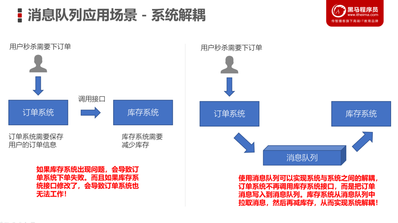

# day01

## Kafka简介

### 消息队列

* 消息队列——用于存放消息的组件
* 程序员可以将消息放入到队列中，也可以从消息队列中获取消息
* 很多时候消息队列不是一个永久性的存储，是作为临时存储存在的（设定一个期限：设置消息在MQ中保存10天）
* 消息队列中间件：消息队列的组件，例如：Kafka、Active MQ、RabbitMQ、RocketMQ、ZeroMQ

### Kafka的应用场景

* 异步处理
	* 可以将一些比较耗时的操作放在其他系统中，通过消息队列将需要进行处理的消息进行存储，其他系统可以消费消息队列中的数据
	* 比较常见的：发送短信验证码、发送邮件


* 系统解耦
	* 原先一个微服务是通过接口（HTTP）调用另一个微服务，这时候耦合很严重，只要接口发生变化就会导致系统不可用
	* 使用消息队列可以将系统进行解耦合，现在第一个微服务可以将消息放入到消息队列中，另一个微服务可以从消息队列中把消息取出来进行处理。进行系统解耦



* 流量削峰
	* 因为消息队列是低延迟、高可靠、高吞吐的，可以应对大量并发


* 日志处理
	* 可以使用消息队列作为临时存储，或者一种通信管道


### 消息队列的两种模型

* 生产者、消费者模型
	* 生产者负责将消息生产到MQ中
	* 消费者负责从MQ中获取消息
	* 生产者和消费者是解耦的，可能是生产者一个程序、消费者是另外一个程序
* 消息队列的模式
	* 点对点：一个消费者消费一个消息
	* 发布订阅：多个消费者可以消费一个消息

## Kafka搭建

### 集群搭建

* Kafka集群是必须要有ZooKeeper的

注意：

* 每一个Kafka的节点都需要修改broker.id（每个节点的标识，不能重复）
* log.dir数据存储目录需要配置

### 单机搭建

#### windows

- kafka官网下载地址:http://kafka.apache.org/downloads.html，下载二进制的.

- 需要提前安装zookeeper并运行（windows单机模式）

  - 下载zookeeper：https://zookeeper.apache.org/releases.html#download
  - 在zookeeper的conf目录下复制一份zoo_sample.cfg文件，并重命名为zoo.cfg
  - 修改zoo.cfg文件里面的路径(data,logs为新建目录)

  ```sh
  
  # 存放内存数据库快照的目录
  dataDir=D:\\Tools\\apache-zookeeper-3.6.2-bin\\data
  # 存放事务日志目录
  dataLogDir=D:\\Tools\\apache-zookeeper-3.6.2-bin\\logs
  # AdminServer端口，默认8080，可能冲突
  admin.serverPort=7070
  #服务端的监听端口，默认就是下方，不需要配置
  #clientPort=2181 
  #其中id为一个数字，表示zk进程的id，这个id也是dataDir目录下的myid文件的内容，host是该zk进程所在的ip地址，port1表示follower和leader交换消息所使用的端口，port2表示选举leader时所使用的端口
  # 单机模式不需要配置
  #server.id=host:port1:port2 
  ```

  - 启动：进入bin目录下,双击zkServer.cmd
  - 验证：在bin目录下双击zkCli.cmd,打开客户端(此时的服务端zkServer的dos窗口不要关闭),出现"欢迎"字样,说明安装成功

- 编辑文件Kafka配置文件，config文件夹下的server.properties

```sh
log.dirs=D:\\Tools\\kafka_2.13-2.8.0\\logs
# 默认就是下方，不需要修改
zookeeper.connect=localhost:2181
#Kafka会默认在9092端口上运行，并连接zookeeper的默认端口：2181
```

- 启动服务：

```sh
D:\tool\kafka_2.13-2.8.2>.\bin\windows\kafka-server-start.bat .\config\server.properties
# 如果报错：此时不应有xxxx，是该对应文件的目录名有空格，需要修改其文件路径所有目录名，或者移动到目录名没有空格的目录下；修改完目录名后，在修改好相关环境变量，如path
# 如果报错：命令行太长，是kafka的路径深度太深，将kafka移动到路径深度更浅的地方即可
```

### Kafka的生产者/消费者/工具

* 安装Kafka集群，可以测试以下
	* 创建一个topic主题（消息都是存放在topic中，类似mysql建表的过程）
	
	  ```sh
	  kafka-topics.bat --create --zookeeper localhost:2181 --replication-factor 1 --partitions 1 --topic topic001
	  #或者
	  kafka-topics.bat --create --bootstrap-server localhost:9092 --topic topic001
	  # 集群模式指定结点 
	  #kafka-topics.sh --create --bootstrap-server node1.itcast.cn:9092 --topic test
	  #查看所有主题
	  kafka-topics.bat --list --bootstrap-server localhost:9092
	  
	  #创建生产者：用Kafka内置的测试程序生产一些消息
	  kafka-console-producer.bat --broker-list localhost:9092 --topic topic001
	  #创建消费者：新开一个cmd
	  kafka-console-consumer.bat --bootstrap-server localhost:9092 --topic topic001 --from-beginning
	  ```
	
	* 基于kafka的内置测试生产者脚本来读取标准输入（键盘输入）的数据，并放入到topic中
	
	* 基于kafka的内置测试消费者脚本来消费topic中的数据
	
* 推荐大家开发的使用Kafka Tool
	
	* 下载：https://www.kafkatool.com/download.html
	* 浏览Kafka集群节点、多少个topic、多少个分区
	* 创建topic/删除topic
	* 浏览ZooKeeper中的数据
	

### Kafka的基准测试工具

* Kafka中提供了内置的性能测试工具

	* 生产者：测试生产每秒传输的数据量（多少条数据、多少M的数据）

		```html
		5000000 records sent, 11825.446943 records/sec (11.28 MB/sec), 2757.61 ms avg latency
		```

	* 消费者：测试消费每条拉取的数据量

* 对比生产者和消费者：消费者的速度更快

## Kafka Java API开发

### 生产者程序开发

1. 创建连接
	* bootstrap.servers：Kafka的服务器地址
	* acks：表示当生产者生产数据到Kafka中，Kafka中会以什么样的策略返回
	* key.serializer：Kafka中的消息是以key、value键值对存储的，而且生产者生产的消息是需要在网络上传到的，这里指定的是StringSerializer方式，就是以字符串方式发送（将来还可以使用其他的一些序列化框架：Google ProtoBuf、Avro）
	* value.serializer：同上
2. 创建一个生产者对象KafkaProducer
3. 调用send方法发送消息（ProducerRecor，封装是key-value键值对）
4. 调用Future.get表示等带服务端的响应
5. 关闭生产者


```java
public class KafkaProducerTest {
    public static void main(String[] args) throws ExecutionException, InterruptedException {
        // 1. 创建用于连接Kafka的Properties配置
        Properties props = new Properties();
        props.put("bootstrap.servers", "node1.itcast.cn:9092");
        props.put("acks", "all");
        props.put("key.serializer", "org.apache.kafka.common.serialization.StringSerializer");
        props.put("value.serializer", "org.apache.kafka.common.serialization.StringSerializer");

        // 2. 创建一个生产者对象KafkaProducer
        KafkaProducer<String, String> kafkaProducer = new KafkaProducer<>(props);

        // 3. 发送1-100的消息到指定的topic中
        for(int i = 0; i < 100; ++i) {
            // 构建一条消息，直接new ProducerRecord
            ProducerRecord<String, String> producerRecord = new ProducerRecord<>("test", null, i + "");
            Future<RecordMetadata> future = kafkaProducer.send(producerRecord);
            // 调用Future的get方法等待响应
            future.get();
            System.out.println("第" + i + "条消息写入成功！");
        }

        // 4.关闭生产者
        kafkaProducer.close();
    }
}
```

### 消费者程序开发

* group.id：消费者组的概念，可以在一个消费组中包含多个消费者。如果若干个消费者的group.id是一样的，表示它们就在一个组中，一个组中的消费者是共同消费Kafka中topic的数据。
* Kafka是一种拉消息模式的消息队列，在消费者中会有一个offset，表示从哪条消息开始拉取数据
* kafkaConsumer.poll：Kafka的消费者API是一批一批数据的拉取

```java
/**
 * 消费者程序
 *
 * 1.创建Kafka消费者配置
 * Properties props = new Properties();
 * props.setProperty("bootstrap.servers", "node1.itcast.cn:9092");
 * props.setProperty("group.id", "test");
 * props.setProperty("enable.auto.commit", "true");
 * props.setProperty("auto.commit.interval.ms", "1000");
 * props.setProperty("key.deserializer", "org.apache.kafka.common.serialization.StringDeserializer");
 * props.setProperty("value.deserializer", "org.apache.kafka.common.serialization.StringDeserializer");
 *
 * 2.创建Kafka消费者
 * 3.订阅要消费的主题
 * 4.使用一个while循环，不断从Kafka的topic中拉取消息
 * 5.将将记录（record）的offset、key、value都打印出来
 */
public class KafkaConsumerTest {

    public static void main(String[] args) {
        // 1.创建Kafka消费者配置
        Properties props = new Properties();
        props.setProperty("bootstrap.servers", "node1.itcast.cn:9092");
        // 消费者组（可以使用消费者组将若干个消费者组织到一起），共同消费Kafka中topic的数据
        // 每一个消费者需要指定一个消费者组，如果消费者的组名是一样的，表示这几个消费者是一个组中的
        props.setProperty("group.id", "test");
        // 自动提交offset
        props.setProperty("enable.auto.commit", "true");
        // 自动提交offset的时间间隔
        props.setProperty("auto.commit.interval.ms", "1000");
        // 拉取的key、value数据的
        props.setProperty("key.deserializer", "org.apache.kafka.common.serialization.StringDeserializer");
        props.setProperty("value.deserializer", "org.apache.kafka.common.serialization.StringDeserializer");

        // 2.创建Kafka消费者
        KafkaConsumer<String, String> kafkaConsumer = new KafkaConsumer<>(props);

        // 3. 订阅要消费的主题
        // 指定消费者从哪个topic中拉取数据
        kafkaConsumer.subscribe(Arrays.asList("test"));

        // 4.使用一个while循环，不断从Kafka的topic中拉取消息
        while(true) {
            // Kafka的消费者一次拉取一批的数据
            ConsumerRecords<String, String> consumerRecords = kafkaConsumer.poll(Duration.ofSeconds(5));
            // 5.将将记录（record）的offset、key、value都打印出来
            for (ConsumerRecord<String, String> consumerRecord : consumerRecords) {
                // 主题
                String topic = consumerRecord.topic();
                // offset：这条消息处于Kafka分区中的哪个位置
                long offset = consumerRecord.offset();
                // key\value
                String key = consumerRecord.key();
                String value = consumerRecord.value();

                System.out.println("topic: " + topic + " offset:" + offset + " key:" + key + " value:" + value);
            }
        }
    }
}

```

### 生产者使用异步方式生产消息

* 使用匿名内部类实现Callback接口，该接口中表示Kafka服务器响应给客户端，会自动调用onCompletion方法
	* metadata：消息的元数据（属于哪个topic、属于哪个partition、对应的offset是什么）
	* exception：这个对象Kafka生产消息封装了出现的异常，如果为null，表示发送成功，如果不为null，表示出现异常。

```java
// 二、使用异步回调的方式发送消息
ProducerRecord<String, String> producerRecord = new ProducerRecord<>("test", null, i + "");
kafkaProducer.send(producerRecord, new Callback() {
    @Override
    public void onCompletion(RecordMetadata metadata, Exception exception) {
        // 1. 判断发送消息是否成功
        if(exception == null) {
            // 发送成功
            // 主题
            String topic = metadata.topic();
            // 分区id
            int partition = metadata.partition();
            // 偏移量
            long offset = metadata.offset();
            System.out.println("topic:" + topic + " 分区id：" + partition + " 偏移量：" + offset);
        }
        else {
            // 发送出现错误
            System.out.println("生产消息出现异常！");
            // 打印异常消息
            System.out.println(exception.getMessage());
            // 打印调用栈
            System.out.println(exception.getStackTrace());
        }
    }
});
```

## Kafka中的重要概念

* broker
	* Kafka服务器进程，生产者、消费者都要连接broker
	* 一个集群由多个broker组成，功能实现Kafka集群的负载均衡、容错
* producer：生产者
* consumer：消费者
* topic：主题，一个Kafka集群中，可以包含多个topic。一个topic可以包含多个分区
	* 是一个逻辑结构，生产、消费消息都需要指定topic
* partition：Kafka集群的分布式就是由分区来实现的。一个topic中的消息可以分布在topic中的不同partition中
* replica：副本，实现Kafkaf集群的容错，实现partition的容错。一个topic至少应该包含大于1个的副本
* consumer group：消费者组，一个消费者组中的消费者可以共同消费topic中的分区数据。每一个消费者组都一个唯一的名字。配置group.id一样的消费者是属于同一个组中
* offset：偏移量。相对消费者、partition来说，可以通过offset来拉取数据

### 消费者组

* 一个消费者组中可以包含多个消费者，共同来消费topic中的数据
* 一个topic中如果只有一个分区，那么这个分区只能被某个组中的一个消费者消费
* 有多少个分区，那么就可以被同一个组内的多少个消费者消费

### 幂等性

* 生产者消息重复问题
	* Kafka生产者生产消息到partition，如果直接发送消息，kafka会将消息保存到分区中，但Kafka会返回一个ack给生产者，表示当前操作是否成功，是否已经保存了这条消息。如果ack响应的过程失败了，此时生产者会重试，继续发送没有发送成功的消息，Kafka又会保存一条一模一样的消息

* 在Kafka中可以开启幂等性
	* 当Kafka的生产者生产消息时，会增加一个pid（生产者的唯一编号）和sequence number（针对消息的一个递增序列）
	* 发送消息，会连着pid和sequence number一块发送
	* kafka接收到消息，会将消息和pid、sequence number一并保存下来
	* 如果ack响应失败，生产者重试，再次发送消息时，Kafka会根据pid、sequence number是否需要再保存一条消息
	* 判断条件：生产者发送过来的sequence number 是否小于等于 partition中消息对应的sequence

## 事务编程

* 开启事务的条件

	* 生产者

		```java
		// 开启事务必须要配置事务的ID
		props.put("transactional.id", "dwd_user");
		```

	* 消费者

		```java
		// 配置事务的隔离级别
		props.put("isolation.level","read_committed");
		// 关闭自动提交，一会我们需要手动来提交offset，通过事务来维护offset
		props.setProperty("enable.auto.commit", "false");
		```

	* 生产者

		* 初始化事务
		* 开启事务
		* 需要使用producer来将消费者的offset提交到事务中
		* 提交事务
		* 如果出现异常回滚事务

> 如果使用了事务，不要使用异步发送


```java
public class TransactionProgram {
    public static void main(String[] args) {
        // 1. 调用之前实现的方法，创建消费者、生产者对象
        KafkaConsumer<String, String> consumer = createConsumer();
        KafkaProducer<String, String> producer = createProducer();

        // 2. 生产者调用initTransactions初始化事务
        producer.initTransactions();

        // 3. 编写一个while死循环，在while循环中不断拉取数据，进行处理后，再写入到指定的topic
        while(true) {
            try {
                // (1)	生产者开启事务
                producer.beginTransaction();

                // 这个Map保存了topic对应的partition的偏移量
                Map<TopicPartition, OffsetAndMetadata> offsetMap = new HashMap<>();

                // 从topic中拉取一批的数据
                // (2)	消费者拉取消息
                ConsumerRecords<String, String> concumserRecordArray = consumer.poll(Duration.ofSeconds(5));
                // (3)	遍历拉取到的消息，并进行预处理
                for (ConsumerRecord<String, String> cr : concumserRecordArray) {
                    // 将1转换为男，0转换为女
                    String msg = cr.value();
                    String[] fieldArray = msg.split(",");

                    // 将消息的偏移量保存
                    // 消费的是ods_user中的数据
                    String topic = cr.topic();
                    int partition = cr.partition();
                    long offset = cr.offset();

                	int i = 1 / 0;

                    // offset + 1：offset是当前消费的记录（消息）对应在partition中的offset，而我们希望下一次能继续从下一个消息消息
                    // 必须要+1，从能消费下一条消息
                    offsetMap.put(new TopicPartition(topic, partition), new OffsetAndMetadata(offset + 1));

                    // 将字段进行替换
                    if(fieldArray != null && fieldArray.length > 2) {
                        String sexField = fieldArray[1];
                        if(sexField.equals("1")) {
                            fieldArray[1] = "男";
                        }
                        else if(sexField.equals("0")){
                            fieldArray[1] = "女";
                        }
                    }

                    // 重新拼接字段
                    msg = fieldArray[0] + "," + fieldArray[1] + "," + fieldArray[2];

                    // (4)	生产消息到dwd_user topic中
                    ProducerRecord<String, String> dwdMsg = new ProducerRecord<>("dwd_user", msg);
                    // 发送消息
                    Future<RecordMetadata> future = producer.send(dwdMsg);
                    try {
                        future.get();
                    } catch (Exception e) {
                        e.printStackTrace();
                        producer.abortTransaction();
                    }
//                            new Callback()
//                    {
//                        @Override
//                        public void onCompletion(RecordMetadata metadata, Exception exception) {
//                            // 生产消息没有问题
//                            if(exception == null) {
//                                System.out.println("发送成功:" + dwdMsg);
//                            }
//                            else {
//                                System.out.println("生产消息失败:");
//                                System.out.println(exception.getMessage());
//                                System.out.println(exception.getStackTrace());
//                            }
//                        }
//                    });
                }

                producer.sendOffsetsToTransaction(offsetMap, "ods_user");

                // (6)	提交事务
                producer.commitTransaction();
            }catch (Exception e) {
                e.printStackTrace();
                // (7)	捕获异常，如果出现异常，则取消事务
                producer.abortTransaction();
            }
        }
    }

    // 一、创建一个消费者来消费ods_user中的数据
    private static KafkaConsumer<String, String> createConsumer() {
        // 1. 配置消费者的属性（添加对事务的支持）
        Properties props = new Properties();
        props.setProperty("bootstrap.servers", "node1.itcast.cn:9092");
        props.setProperty("group.id", "ods_user");
        // 配置事务的隔离级别
        props.put("isolation.level","read_committed");
        // 关闭自动提交，一会我们需要手动来提交offset，通过事务来维护offset
        props.setProperty("enable.auto.commit", "false");
        // 反序列化器
        props.setProperty("key.deserializer", "org.apache.kafka.common.serialization.StringDeserializer");
        props.setProperty("value.deserializer", "org.apache.kafka.common.serialization.StringDeserializer");

        // 2. 构建消费者对象
        KafkaConsumer<String, String> kafkaConsumer = new KafkaConsumer<>(props);

        // 3. 订阅一个topic
        kafkaConsumer.subscribe(Arrays.asList("ods_user"));

        return kafkaConsumer;

    }

    // 二、编写createProducer方法，用来创建一个带有事务配置的生产者
    private static KafkaProducer<String, String> createProducer() {
        // 1. 配置生产者带有事务配置的属性
        Properties props = new Properties();
        props.put("bootstrap.servers", "node1.itcast.cn:9092");
        // 开启事务必须要配置事务的ID
        props.put("transactional.id", "dwd_user");
        props.put("key.serializer", "org.apache.kafka.common.serialization.StringSerializer");
        props.put("value.serializer", "org.apache.kafka.common.serialization.StringSerializer");

        // 2. 构建生产者
        KafkaProducer<String, String> kafkaProducer = new KafkaProducer<>(props);

        return kafkaProducer;
    }
}

```

# day02

## Kafka中的分区副本机制

### 生产者的分区写入策略

* 轮询（按照消息尽量保证每个分区的负载）策略，消息会均匀地分布到每个partition
	* 写入消息的时候，key为null的时候，默认使用的是轮询策略
* 随机策略（不使用）
* 按key写入策略，key.hash() % 分区的数量
* 自定义分区策略（类似于MapReduce指定分区）


> 乱序问题
>
> * 在Kafka中生产者是有写入策略，如果topic有多个分区，就会将数据分散在不同的partition中存储
> * 当partition数量大于1的时候，数据（消息）会打散分布在不同的partition中
> * 如果只有一个分区，消息是有序的

### 消费组Consumer Group Rebalance机制

* 再均衡：在某些情况下，消费者组中的消费者消费的分区会产生变化，会导致消费者分配不均匀（例如：有两个消费者消费3个，因为某个partition崩溃了，还有一个消费者当前没有分区要削峰），Kafka Consumer Group就会启用rebalance机制，重新平衡这个Consumer Group内的消费者消费的分区分配。
* 触发时机
	* 消费者数量发生变化
		* 某个消费者crash
		* 新增消费者
	* topic的数量发生变化
		* 某个topic被删除
	* partition的数量发生变化
		* 删除partition
		* 新增partition
* 不良影响
	* 发生rebalance，所有的consumer将不再工作，共同来参与再均衡，直到每个消费者都已经被成功分配所需要消费的分区为止（rebalance结束）

### 消费者的分区分配策略

分区分配策略：保障每个消费者尽量能够均衡地消费分区的数据，不能出现某个消费者消费分区的数量特别多，某个消费者消费的分区特别少

* Range分配策略（范围分配策略）：Kafka默认的分配策略
	* n：分区的数量 / 消费者数量
	* m：分区的数量 % 消费者数量
	* 前m个消费者消费n+1个分区
	* 剩余的消费者消费n个分区
* RoundRobin分配策略（轮询分配策略）
	* 消费者挨个分配消费的分区
* Striky粘性分配策略
	* 在没有发生rebalance跟轮询分配策略是一致的
	* 发生了rebalance，轮询分配策略，重新走一遍轮询分配的过程。而粘性会保证跟上一次的尽量一致，只是将新的需要分配的分区，均匀的分配到现有可用的消费者中即可
	* 减少上下文的切换

### 副本的ACK机制

producer是不断地往Kafka中写入数据，写入数据会有一个返回结果，表示是否写入成功。这里对应有一个ACKs的配置。

* acks = 0：生产者只管写入，不管是否写入成功，可能会数据丢失。性能是最好的
* acks = 1：生产者会等到leader分区写入成功后，返回成功，接着发送下一条
* acks = -1/all：确保消息写入到leader分区、还确保消息写入到对应副本都成功后，接着发送下一条，性能是最差的

根据业务情况来选择ack机制，是要求性能最高，一部分数据丢失影响不大，可以选择0/1。如果要求数据一定不能丢失，就得配置为-1/all。

分区中是有leader和follower的概念，为了确保消费者消费的数据是一致的，只能从分区leader去读写消息，follower做的事情就是同步数据，Backup。

### 高级API（High-Level API）、低级API（Low-Level API）

* 高级API就是直接让Kafka帮助管理、处理分配、数据
	* offset存储在ZK中
	* 由kafka的rebalance来控制消费者分配的分区
	* 开发起来比较简单，无需开发者关注底层细节
	* 无法做到细粒度的控制
* 低级API：由编写的程序自己控制逻辑
	* 自己来管理Offset，可以将offset存储在ZK、MySQL、Redis、HBase、Flink的状态存储
	* 指定消费者拉取某个分区的数据
	* 可以做到细粒度的控制
	* 原有的Kafka的策略会失效，需要我们自己来实现消费机制

## Kafka原理

###  leader和follower

* Kafka中的leader和follower是相对分区有意义，不是相对broker
* Kafka在创建topic的时候，会尽量分配分区的leader在不同的broker中，其实就是负载均衡
* leader职责：读写数据
* follower职责：同步数据、参与选举（leader crash之后，会选举一个follower重新成为分区的leader
* 注意和ZooKeeper区分
	* ZK的leader负责读、写，follower可以读取
	* Kafka的leader负责读写、follower不能读写数据（确保每个消费者消费的数据是一致的），Kafka一个topic有多个分区leader，一样可以实现数据操作的负载均衡

### AR\ISR\OSR

* AR表示一个topic下的所有副本
* ISR：In Sync Replicas，正在同步的副本（可以理解为当前有几个follower是存活的）
* OSR：Out of Sync Replicas，不再同步的副本
* AR = ISR + OSR

### leader选举

* Controller：controller是kafka集群的老大，是针对Broker的一个角色
	* Controller是高可用的，是用过ZK来进行选举
* Leader：是针对partition的一个角色
	* Leader是通过ISR来进行快速选举
* 如果Kafka是基于ZK来进行选举，ZK的压力可能会比较大。例如：某个节点崩溃，这个节点上不仅仅只有一个leader，是有不少的leader需要选举。通过ISR快速进行选举。

* leader的负载均衡

	* 如果某个broker crash之后，就可能会导致partition的leader分布不均匀，就是一个broker上存在一个topic下不同partition的leader
	* 通过以下指令，可以将leader分配到优先的leader对应的broker，确保leader是均匀分配的

	```shell
	bin/kafka-leader-election.sh --bootstrap-server node1.itcast.cn:9092 --topic test --partition=2 --election-type preferred
	```

	

### Kafka读写流程

* 写流程
	* 通过ZooKeeper找partition对应的leader，leader是负责写的
	* producer开始写入数据
	* ISR里面的follower开始同步数据，并返回给leader ACK
	* 返回给producer ACK
* 读流程
	* 通过ZooKeeper找partition对应的leader，leader是负责读的
	* 通过ZooKeeper找到消费者对应的offset
	* 然后开始从offset往后顺序拉取数据
	* 提交offset（自动提交——每隔多少秒提交一次offset、手动提交——放入到事务中提交）

### Kafka的物理存储

* Kafka的数据组织结构
	* topic
	* partition
	* segment
		* .log数据文件
		* .index（稀疏索引）
		* .timeindex（根据时间做的索引）
* 深入了解读数据的流程
	* 消费者的offset是一个针对partition全局offset
	* 可以根据这个offset找到segment段
	* 接着需要将全局的offset转换成segment的局部offset
	* 根据局部的offset，就可以从（.index稀疏索引）找到对应的数据位置
	* 开始顺序读取

### 消息传递的语义性

Flink里面有对应的每种不同机制的保证，提供Exactly-Once保障（二阶段事务提交方式）

* At-most once：最多一次（只管把数据消费到，不管有没有成功，可能会有数据丢失）
* At-least once：最少一次（有可能会出现重复消费）
* Exactly-Once：仅有一次（事务性性的保障，保证消息有且仅被处理一次）

### Kafka的消息不丢失

* broker消息不丢失：因为有副本relicas的存在，会不断地从leader中同步副本，所以，一个broker crash，不会导致数据丢失，除非是只有一个副本。
* 生产者消息不丢失：ACK机制（配置成ALL/-1）、配置0或者1有可能会存在丢失
* 消费者消费不丢失：重点控制offset
	* At-least once：一种数据可能会重复消费
	* Exactly-Once：仅被一次消费

### 数据积压

* 数据积压指的是消费者因为有一些外部的IO、一些比较耗时的操作（Full GC——Stop the world），就会造成消息在partition中一直存在得不到消费，就会产生数据积压
* 在企业中，我们要有监控系统，如果出现这种情况，需要尽快处理。虽然后续的Spark Streaming/Flink可以实现背压机制，但是数据累积太多一定对实时系统它的实时性是有说影响的

### 数据清理&配额限速

* 数据清理
	* Log Deletion（日志删除）：如果消息达到一定的条件（时间、日志大小、offset大小），Kafka就会自动将日志设置为待删除（segment端的后缀名会以 .delete结尾），日志管理程序会定期清理这些日志
		* 默认是7天过期
	* Log Compaction（日志合并）
		* 如果在一些key-value数据中，一个key可以对应多个不同版本的value
		* 经过日志合并，就会只保留最新的一个版本
* 配额限速
	* 可以限制Producer、Consumer的速率
	* 防止Kafka的速度过快，占用整个服务器（broker）的所有IO资源


# 配置

## 生产者配置

| NAME                                     | DESCRIPTION                                                  | TYPE     | DEFAULT                                                      | VALID VALUES       | IMPORTANCE |
| ---------------------------------------- | ------------------------------------------------------------ | -------- | ------------------------------------------------------------ | ------------------ | ---------- |
| bootstrap.servers                        | host/port列表，用于初始化建立和Kafka集群的连接。列表格式为host1:port1,host2:port2,....，无需添加所有的集群地址，kafka会根据提供的地址发现其他的地址（你可以多提供几个，以防提供的服务器关闭） | list     |                                                              |                    | high       |
| key.serializer                           | 实现 org.apache.kafka.common.serialization.Serializer 接口的 key 的 Serializer  类。 | class    |                                                              |                    | high       |
| value.serializer                         | 实现 org.apache.kafka.common.serialization.Serializer 接口的value 的 Serializer  类。 | class    |                                                              |                    | high       |
| acks                                     | 生产者需要leader确认请求完成之前接收的应答数。此配置控制了发送消息的耐用性，支持以下配置： | string   | 1                                                            | [all, -1, 0, 1]    | high       |
|                                          | acks=0  如果设置为0，那么生产者将不等待任何消息确认。消息将立刻添加到socket缓冲区并考虑发送。在这种情况下不能保障消息被服务器接收到。并且重试机制不会生效（因为客户端不知道故障了没有）。每个消息返回的offset始终设置为-1。 |          |                                                              |                    |            |
|                                          | acks=1，这意味着leader写入消息到本地日志就立即响应，而不等待所有follower应答。在这种情况下，如果响应消息之后但follower还未复制之前leader立即故障，那么消息将会丢失。 |          |                                                              |                    |            |
|                                          | acks=all  这意味着leader将等待所有副本同步后应答消息。此配置保障消息不会丢失（只要至少有一个同步的副本或者）。这是最强壮的可用性保障。等价于acks=-1。 |          |                                                              |                    |            |
| buffer.memory                            | 生产者用来缓存等待发送到服务器的消息的内存总字节数。如果消息发送比可传递到服务器的快，生产者将阻塞max.block.ms之后，抛出异常。 | long     | 33554432                                                     | [0,...]            | high       |
|                                          | 此设置应该大致的对应生产者将要使用的总内存，但不是硬约束，因为生产者所使用的所有内存都用于缓冲。一些额外的内存将用于压缩（如果启动压缩），以及用于保持发送中的请求。 |          |                                                              |                    |            |
| compression.type                         | 数据压缩的类型。默认为空（就是不压缩）。有效的值有 none，gzip，snappy, 或  lz4。压缩全部的数据批，因此批的效果也将影响压缩的比率（更多的批次意味着更好的压缩）。 | string   | none                                                         |                    | high       |
| retries                                  | 设置一个比零大的值，客户端如果发送失败则会重新发送。注意，这个重试功能和客户端在接到错误之后重新发送没什么不同。如果max.in.flight.requests.per.connection没有设置为1，有可能改变消息发送的顺序，因为如果2个批次发送到一个分区中，并第一个失败了并重试，但是第二个成功了，那么第二个批次将超过第一个。 | int      | 0                                                            | [0,...,2147483647] | high       |
| ssl.key.password                         | 密钥仓库文件中的私钥的密码。                                 | password | null                                                         |                    | high       |
| ssl.keystore.location                    | 密钥仓库文件的位置。可用于客户端的双向认证。                 | string   | null                                                         |                    | high       |
| ssl.keystore.password                    | 密钥仓库文件的仓库密码。只有配置了ssl.keystore.location时才需要。 | password | null                                                         |                    | high       |
| ssl.truststore.location                  | 信任仓库的位置                                               | string   | null                                                         |                    | high       |
| ssl.truststore.password                  | 信任仓库文件的密码                                           | password | null                                                         |                    | high       |
| batch.size                               | 当多个消息要发送到相同分区的时，生产者尝试将消息批量打包在一起，以减少请求交互。这样有助于客户端和服务端的性能提升。该配置的默认批次大小（以字节为单位）： | int      | 16384                                                        | [0,...]            | medium     |
|                                          | 不会打包大于此配置大小的消息。                               |          |                                                              |                    |            |
|                                          | 发送到broker的请求将包含多个批次，每个分区一个，用于发送数据。 |          |                                                              |                    |            |
|                                          | 较小的批次大小有可能降低吞吐量（批次大小为0则完全禁用批处理）。一个非常大的批次大小可能更浪费内存。因为我们会预先分配这个资源。 |          |                                                              |                    |            |
| client.id                                | 当发出请求时传递给服务器的id字符串。这样做的目的是允许服务器请求记录记录这个【逻辑应用名】，这样能够追踪请求的源，而不仅仅只是ip/prot。 | string   | ""                                                           |                    | medium     |
| connections.max.idle.ms                  | 多少毫秒之后关闭闲置的连接。                                 | long     | 540000                                                       |                    | medium     |
| linger.ms                                | 生产者组将发送的消息组合成单个批量请求。正常情况下，只有消息到达的速度比发送速度快的情况下才会出现。但是，在某些情况下，即使在适度的负载下，客户端也可能希望减少请求数量。此设置通过添加少量人为延迟来实现。-  也就是说，不是立即发出一个消息，生产者将等待一个给定的延迟，以便和其他的消息可以组合成一个批次。这类似于Nagle在TCP中的算法。此设置给出批量延迟的上限：一旦我们达到分区的batch.size值的记录，将立即发送，不管这个设置如何，但是，如果比这个小，我们将在指定的“linger”时间内等待更多的消息加入。此设置默认为0（即无延迟）。假设，设置  linger.ms=5，将达到减少发送的请求数量的效果，但对于在没有负载情况，将增加5ms的延迟。 | long     | 0                                                            | [0,...]            | medium     |
| max.block.ms                             | 该配置控制 KafkaProducer.send() 和 KafkaProducer.partitionsFor()  将阻塞多长时间。此外这些方法被阻止，也可能是因为缓冲区已满或元数据不可用。在用户提供的序列化程序或分区器中的锁定不会计入此超时。 | long     | 60000                                                        | [0,...]            | medium     |
| max.request.size                         | 请求的最大大小（以字节为单位）。此设置将限制生产者的单个请求中发送的消息批次数，以避免发送过大的请求。这也是最大消息批量大小的上限。请注意，服务器拥有自己的批量大小，可能与此不同。 | int      | 1048576                                                      | [0,...]            | medium     |
| partitioner.class                        | 实现Partitioner接口的的Partitioner类。                       | class    | org.apache.kafka.clients.producer.internals.DefaultPartitioner |                    | medium     |
| receive.buffer.bytes                     | 读取数据时使用的TCP接收缓冲区(SO_RCVBUF)的大小。如果值为-1，则将使用OS默认值。 | int      | 32768                                                        | [-1,...]           | medium     |
| request.timeout.ms                       | 该配置控制客户端等待请求响应的最长时间。如果在超时之前未收到响应，客户端将在必要时重新发送请求，如果重试耗尽，则该请求将失败。  这应该大于replica.lag.time.max.ms，以减少由于不必要的生产者重试引起的消息重复的可能性。 | int      | 30000                                                        | [0,...]            | medium     |
| sasl.jaas.config                         | JAAS配置文件使用的格式的SASL连接的JAAS登录上下文参数。这里描述JAAS配置文件格式。该值的格式为：'（=）*;' | password | null                                                         |                    | medium     |
| sasl.kerberos.service.name               | Kafka运行的Kerberos主体名称。可以在Kafka的JAAS配置或Kafka的配置中定义。 | string   | null                                                         |                    | medium     |
| sasl.mechanism                           | SASL机制用于客户端连接。这是安全提供者可用与任何机制。GSSAPI是默认机制。 | string   | GSSAPI                                                       |                    | medium     |
| security.protocol                        | 用于与broker通讯的协议。 有效值为：PLAINTEXT，SSL，SASL_PLAINTEXT，SASL_SSL。 | string   | PLAINTEXT                                                    |                    | medium     |
| send.buffer.bytes                        | 发送数据时，用于TCP发送缓存（SO_SNDBUF）的大小。如果值为 -1，将默认使用系统的。 | int      | 131072                                                       | [-1,...]           | medium     |
| ssl.enabled.protocols                    | 启用SSL连接的协议列表。                                      | list     | TLSv1.2,TLSv1.1,TLSv1                                        |                    | medium     |
| ssl.keystore.type                        | 密钥存储文件的文件格式。对于客户端是可选的。                 | string   | JKS                                                          |                    | medium     |
| ssl.protocol                             | 最近的JVM中允许的值是TLS，TLSv1.1和TLSv1.2。  较旧的JVM可能支持SSL，SSLv2和SSLv3，但由于已知的安全漏洞，不建议使用SSL。 | string   | TLS                                                          |                    | medium     |
| ssl.provider                             | 用于SSL连接的安全提供程序的名称。默认值是JVM的默认安全提供程序。 | string   | null                                                         |                    | medium     |
| ssl.truststore.type                      | 信任仓库文件的文件格式。                                     | string   | JKS                                                          |                    | medium     |
| enable.idempotence                       | 当设置为‘true’，生产者将确保每个消息正好一次复制写入到stream。如果‘false’，由于broker故障，生产者重试。即，可以在流中写入重试的消息。此设置默认是‘false’。请注意，启用幂等式需要将max.in.flight.requests.per.connection设置为1，重试次数不能为零。另外acks必须设置为“全部”。如果这些值保持默认值，我们将覆盖默认值。  如果这些值设置为与幂等生成器不兼容的值，则将抛出一个ConfigException异常。如果这些值设置为与幂等生成器不兼容的值，则将抛出一个ConfigException异常。 | boolean  | FALSE                                                        |                    | low        |
| interceptor.classes                      | 实现ProducerInterceptor接口，你可以在生产者发布到Kafka群集之前拦截（也可变更）生产者收到的消息。默认情况下没有拦截器。 | list     | null                                                         |                    | low        |
| max.in.flight.requests.per.connection    | 阻塞之前，客户端单个连接上发送的未应答请求的最大数量。注意，如果此设置设置大于1且发送失败，则会由于重试（如果启用了重试）会导致消息重新排序的风险。 | int      | 5                                                            | [1,...]            | low        |
| metadata.max.age.ms                      | 在一段时间段之后（以毫秒为单位），强制更新元数据，即使我们没有看到任何分区leader的变化，也会主动去发现新的broker或分区。 | long     | 300000                                                       | [0,...]            | low        |
| metric.reporters                         | 用作metrics reporters（指标记录员）的类的列表。实现MetricReporter接口，将受到新增加的度量标准创建类插入的通知。  JmxReporter始终包含在注册JMX统计信息中。 | list     | ""                                                           |                    | low        |
| metrics.num.samples                      | 维护用于计算度量的样例数量。                                 | int      | 2                                                            | [1,...]            | low        |
| metrics.recording.level                  | 指标的最高记录级别。                                         | string   | INFO                                                         | [INFO, DEBUG]      | low        |
| metrics.sample.window.ms                 | 度量样例计算上                                               | long     | 30000                                                        | [0,...]            | low        |
| reconnect.backoff.max.ms                 | 重新连接到重复无法连接的代理程序时等待的最大时间（毫秒）。 如果提供，每个主机的回退将会连续增加，直到达到最大值。  计算后退增加后，增加20％的随机抖动以避免连接风暴。 | long     | 1000                                                         | [0,...]            | low        |
| reconnect.backoff.ms                     | 尝试重新连接到给定主机之前等待的基本时间量。这避免了在循环中高频率的重复连接到主机。这种回退适应于客户端对broker的所有连接尝试。 | long     | 50                                                           | [0,...]            | low        |
| retry.backoff.ms                         | 尝试重试指定topic分区的失败请求之前等待的时间。这样可以避免在某些故障情况下高频次的重复发送请求。 | long     | 100                                                          | [0,...]            | low        |
| sasl.kerberos.kinit.cmd                  | Kerberos kinit 命令路径。                                    | string   | /usr/bin/kinit                                               |                    | low        |
| sasl.kerberos.min.time.before.relogin    | Login线程刷新尝试之间的休眠时间。                            | long     | 60000                                                        |                    | low        |
| sasl.kerberos.ticket.renew.jitter        | 添加更新时间的随机抖动百分比。                               | double   | 0.05                                                         |                    | low        |
| sasl.kerberos.ticket.renew.window.factor | 登录线程将睡眠，直到从上次刷新ticket到期时间的指定窗口因子为止，此时将尝试续订ticket。 | double   | 0.8                                                          |                    | low        |
| ssl.cipher.suites                        | 密码套件列表。这是使用TLS或SSL网络协议来协商用于网络连接的安全设置的认证，加密，MAC和密钥交换算法的命名组合。默认情况下，支持所有可用的密码套件。 | list     | null                                                         |                    | low        |
| ssl.endpoint.identification.algorithm    | 使用服务器证书验证服务器主机名的端点识别算法。               | string   | null                                                         |                    | low        |
| ssl.keymanager.algorithm                 | 用于SSL连接的密钥管理因子算法。默认值是为Java虚拟机配置的密钥管理器工厂算法。 | string   | SunX509                                                      |                    | low        |
| ssl.secure.random.implementation         | 用于SSL加密操作的SecureRandom PRNG实现。                     | string   | null                                                         |                    | low        |
| ssl.trustmanager.algorithm               | 用于SSL连接的信任管理因子算法。默认值是JAVA虚拟机配置的信任管理工厂算法。 | string   | PKIX                                                         |                    | low        |
| transaction.timeout.ms                   | 生产者在主动中止正在进行的交易之前，交易协调器等待事务状态更新的最大时间（以ms为单位）。如果此值大于broker中的max.transaction.timeout.ms设置，则请求将失败，并报“InvalidTransactionTimeout”错误。 | int      | 60000                                                        |                    | low        |
| transactional.id                         | 用于事务传递的TransactionalId。这样可以跨多个生产者会话的可靠性语义，因为它允许客户端保证在开始任何新事务之前使用相同的TransactionalId的事务已经完成。如果没有提供TransactionalId，则生产者被限制为幂等传递。请注意，如果配置了TransactionalId，则必须启用enable.idempotence。  默认值为空，这意味着无法使用事务。 | string   | null                                                         | non-empty string   | low        |

## 消费者配置

| NAME                                                   | DESCRIPTION                                                  | TYPE     | DEFAULT                 | VALID VALUES             | IMPORTANCE |
| ------------------------------------------------------ | ------------------------------------------------------------ | -------- | ----------------------- | ------------------------ | ---------- |
| bootstrap.servers                                      | host/port,用于和kafka集群建立初始化连接。因为这些服务器地址仅用于初始化连接，并通过现有配置的来发现全部的kafka集群成员（集群随时会变化），所以此列表不需要包含完整的集群地址（但尽量多配置几个，以防止配置的服务器宕机）。 | list     |                         |                          | high       |
| key.deserializer                                       | key的解析序列化接口实现类（Deserializer）。                  | class    |                         |                          | high       |
| value.deserializer                                     | value的解析序列化接口实现类（Deserializer）                  | class    |                         |                          | high       |
| fetch.min.bytes                                        | 服务器哦拉取请求返回的最小数据量，如果数据不足，请求将等待数据积累。默认设置为1字节，表示只要单个字节的数据可用或者读取等待请求超时，就会应答读取请求。将此值设置的越大将导致服务器等待数据累积的越长，这可能以一些额外延迟为代价提高服务器吞吐量。 | int      | 1                       | [0,...]                  | high       |
| group.id                                               | 此消费者所属消费者组的唯一标识。如果消费者用于订阅或offset管理策略的组管理功能，则此属性是必须的。 | string   | ""                      |                          | high       |
| heartbeat.interval.ms                                  | 当使用Kafka的分组管理功能时，心跳到消费者协调器之间的预计时间。心跳用于确保消费者的会话保持活动状态，并当有新消费者加入或离开组时方便重新平衡。该值必须必比session.timeout.ms小，通常不高于1/3。它可以调整的更低，以控制正常重新平衡的预期时间。 | int      | 3000                    |                          | high       |
| max.partition.fetch.bytes                              | 服务器将返回每个分区的最大数据量。如果拉取的第一个非空分区中第一个消息大于此限制，则仍然会返回消息，以确保消费者可以正常的工作。broker接受的最大消息大小通过message.max.bytes（broker config）或max.message.bytes (topic  config)定义。参阅fetch.max.bytes以限制消费者请求大小。 | int      | 1048576                 | [0,...]                  | high       |
| session.timeout.ms                                     | 用于发现消费者故障的超时时间。消费者周期性的发送心跳到broker，表示其还活着。如果会话超时期满之前没有收到心跳，那么broker将从分组中移除消费者，并启动重新平衡。请注意，该值必须在broker配置的group.min.session.timeout.ms和group.max.session.timeout.ms允许的范围内。 | int      | 10000                   |                          | high       |
| ssl.key.password                                       | 密钥存储文件中的私钥的密码。  客户端可选                     | password | null                    |                          | high       |
| ssl.keystore.location                                  | 密钥存储文件的位置，  这对于客户端是可选的，并且可以用于客户端的双向认证。 | string   | null                    |                          | high       |
| ssl.keystore.password                                  | 密钥仓库文件的仓库密码。客户端可选，只有ssl.keystore.location配置了才需要。 | password | null                    |                          | high       |
| ssl.truststore.location                                | 信任仓库文件的位置                                           | string   | null                    |                          | high       |
| ssl.truststore.password                                | 信任仓库文件的密码                                           | password | null                    |                          | high       |
| auto.offset.reset                                      | 当Kafka中没有初始offset或如果当前的offset不存在时（例如，该数据被删除了），该怎么办。 | string   | latest                  | [latest, earliest, none] | medium     |
| 最早：自动将偏移重置为最早的偏移                       |                                                              |          |                         |                          |            |
| 最新：自动将偏移重置为最新偏移                         |                                                              |          |                         |                          |            |
| none：如果消费者组找到之前的offset，则向消费者抛出异常 |                                                              |          |                         |                          |            |
| 其他：抛出异常给消费者。                               |                                                              |          |                         |                          |            |
| connections.max.idle.ms                                | 指定在多少毫秒之后关闭闲置的连接                             | long     | 540000                  |                          | medium     |
| enable.auto.commit                                     | 如果为true，消费者的offset将在后台周期性的提交               | boolean  | TRUE                    |                          | medium     |
| exclude.internal.topics                                | 内部topic的记录（如偏移量）是否应向消费者公开。如果设置为true，则从内部topic接受记录的唯一方法是订阅它。 | boolean  | TRUE                    |                          | medium     |
| fetch.max.bytes                                        | 服务器为拉取请求返回的最大数据值。这不是绝对的最大值，如果在第一次非空分区拉取的第一条消息大于该值，该消息将仍然返回，以确保消费者继续工作。接收的最大消息大小通过message.max.bytes  (broker config) 或 max.message.bytes (topic config)定义。注意，消费者是并行执行多个提取的。 | int      | 52428800                | [0,...]                  | medium     |
| max.poll.interval.ms                                   | 使用消费者组管理时poll()调用之间的最大延迟。消费者在获取更多记录之前可以空闲的时间量的上限。如果此超时时间期满之前poll()没有调用，则消费者被视为失败，并且分组将重新平衡，以便将分区重新分配给别的成员。 | int      | 300000                  | [1,...]                  | medium     |
| max.poll.records                                       | 在单次调用poll()中返回的最大记录数。                         | int      | 500                     | [1,...]                  | medium     |
| partition.assignment.strategy                          | 当使用组管理时，客户端将使用分区分配策略的类名来分配消费者实例之间的分区所有权 | list     | class  org.apache.kafka |                          | medium     |
| .clients.consumer                                      |                                                              |          |                         |                          |            |
| .RangeAssignor                                         |                                                              |          |                         |                          |            |
| receive.buffer.bytes                                   | 读取数据时使用的TCP接收缓冲区（SO_RCVBUF）的大小。  如果值为-1，则将使用OS默认值。 | int      | 65536                   | [-1,...]                 | medium     |
| request.timeout.ms                                     | 配置控制客户端等待请求响应的最长时间。  如果在超时之前未收到响应，客户端将在必要时重新发送请求，如果重试耗尽则客户端将重新发送请求。 | int      | 305000                  | [0,...]                  | medium     |
| sasl.jaas.config                                       | JAAS配置文件中SASL连接登录上下文参数。  这里描述JAAS配置文件格式。 该值的格式为： '(=)*;' | password | null                    |                          | medium     |
| sasl.kerberos.service.name                             | Kafka运行Kerberos  principal名。可以在Kafka的JAAS配置文件或在Kafka的配置文件中定义。 | string   | null                    |                          | medium     |
| sasl.mechanism                                         | 用于客户端连接的SASL机制。安全提供者可用的机制。GSSAPI是默认机制。 | string   | GSSAPI                  |                          | medium     |
| security.protocol                                      | 用于与broker通讯的协议。  有效值为：PLAINTEXT，SSL，SASL_PLAINTEXT，SASL_SSL。 | string   | PLAINTEXT               |                          | medium     |
| send.buffer.bytes                                      | 发送数据时要使用的TCP发送缓冲区（SO_SNDBUF）的大小。  如果值为-1，则将使用OS默认值。 | int      | 131072                  | [-1,...]                 | medium     |
| ssl.enabled.protocols                                  | 启用SSL连接的协议列表。                                      | list     | TLSv1.2,TLSv1.1,TLSv1   |                          | medium     |
| ssl.keystore.type                                      | key仓库文件的文件格式，客户端可选。                          | string   | JKS                     |                          | medium     |
| ssl.protocol                                           | 用于生成SSLContext的SSL协议。  默认设置是TLS，这对大多数情况都是适用的。 最新的JVM中的允许值为TLS，TLSv1.1和TLSv1.2。  较旧的JVM可能支持SSL，SSLv2和SSLv3，但由于已知的安全漏洞，不建议使用SSL。 | string   | TLS                     |                          | medium     |
| ssl.provider                                           | 用于SSL连接的安全提供程序的名称。  默认值是JVM的默认安全提供程序。 | string   | null                    |                          | medium     |
| ssl.truststore.type                                    | 信任存储文件的文件格式。                                     | string   | JKS                     |                          | medium     |
| auto.commit.interval.ms                                | 如果enable.auto.commit设置为true，则消费者偏移量自动提交给Kafka的频率（以毫秒为单位）。 | int      | 5000                    | [0,...]                  | low        |
| check.crcs                                             | 自动检查CRC32记录的消耗。  这样可以确保消息发生时不会在线或磁盘损坏。 此检查增加了一些开销，因此在寻求极致性能的情况下可能会被禁用。 | boolean  | TRUE                    |                          | low        |
| client.id                                              | 在发出请求时传递给服务器的id字符串。  这样做的目的是通过允许将逻辑应用程序名称包含在服务器端请求日志记录中，来跟踪ip/port的请求源。 | string   | ""                      |                          | low        |
| fetch.max.wait.ms                                      | 如果没有足够的数据满足fetch.min.bytes，服务器将在接收到提取请求之前阻止的最大时间。 | int      | 500                     | [0,...]                  | low        |
| interceptor.classes                                    | 用作拦截器的类的列表。  你可实现ConsumerInterceptor接口以允许拦截（也可能变化）消费者接收的记录。 默认情况下，没有拦截器。 | list     | null                    |                          | low        |
| metadata.max.age.ms                                    | 在一定时间段之后（以毫秒为单位的），强制更新元数据，即使没有任何分区领导变化，任何新的broker或分区。 | long     | 300000                  | [0,...]                  | low        |
| metric.reporters                                       | 用作度量记录员类的列表。实现MetricReporter接口以允许插入通知新的度量创建的类。JmxReporter始终包含在注册JMX统计信息中。 | list     | ""                      |                          | low        |
| metrics.num.samples                                    | 保持的样本数以计算度量。                                     | int      | 2                       | [1,...]                  | low        |
| metrics.recording.level                                | 最高的记录级别。                                             | string   | INFO                    | [INFO,  DEBUG]           | low        |
| metrics.sample.window.ms                               | The  window of time a metrics sample is computed over.       | long     | 30000                   | [0,...]                  | low        |
| reconnect.backoff.ms                                   | 尝试重新连接指定主机之前等待的时间，避免频繁的连接主机，这种机制适用于消费者向broker发送的所有请求。 | long     | 50                      | [0,...]                  | low        |
| retry.backoff.ms                                       | 尝试重新发送失败的请求到指定topic分区之前的等待时间。避免在某些故障情况下，频繁的重复发送。 | long     | 100                     | [0,...]                  | low        |
| sasl.kerberos.kinit.cmd Kerberos                       | kinit命令路径。                                              | string   | /usr/bin/kinit          |                          | low        |
| sasl.kerberos.min.time.before.relogin                  | 尝试/恢复之间的登录线程的休眠时间。                          | long     | 60000                   |                          | low        |
| sasl.kerberos.ticket.renew.jitter                      | 添加到更新时间的随机抖动百分比。                             | double   | 0.05                    |                          | low        |
| sasl.kerberos.ticket.renew.window.factor               | 登录线程将休眠，直到从上次刷新到ticket的指定的时间窗口因子到期，此时将尝试续订ticket。 | double   | 0.8                     |                          | low        |
| ssl.cipher.suites                                      | 密码套件列表，用于TLS或SSL网络协议的安全设置，认证，加密，MAC和密钥交换算法的明明组合。默认情况下，支持所有可用的密码套件。 | list     | null                    |                          | low        |
| ssl.endpoint.identification.algorithm                  | 使用服务器证书验证服务器主机名的端点识别算法。               | string   | null                    |                          | low        |
| ssl.keymanager.algorithm                               | 密钥管理器工厂用于SSL连接的算法。  默认值是为Java虚拟机配置的密钥管理器工厂算法。 | string   | SunX509                 |                          | low        |
| ssl.secure.random.implementation                       | 用于SSL加密操作的SecureRandom  PRNG实现。                    | string   | null                    |                          | low        |
| ssl.trustmanager.algorithm                             | 信任管理器工厂用于SSL连接的算法。  默认值是为Java虚拟机配置的信任管理器工厂算法。 | string   | PKIX                    |                          | low        |

# 补充

## 起步

- 导入依赖：原版本的`kafka-client`可能与kafka版本不对应而报错，可以排除该依赖另外导入其他版本的。

~~~xml
<parent>
    <groupId>org.springframework.boot</groupId>
    <artifactId>spring-boot-starter-parent</artifactId>
    <version>2.7.6</version>
</parent>

<dependencies>
    <dependency>
        <groupId>org.springframework.boot</groupId>
        <artifactId>spring-boot-starter-test</artifactId>
    </dependency>
    <dependency>
        <groupId>org.springframework.kafka</groupId>
        <artifactId>spring-kafka</artifactId>
        <exclusions>
            <exclusion>
                <groupId>org.apache.kafka</groupId>
                <artifactId>kafka-clients</artifactId>
            </exclusion>
        </exclusions>
    </dependency>
    <dependency>
        <groupId>org.apache.kafka</groupId>
        <artifactId>kafka-clients</artifactId>
        <version>3.1.2</version>
    </dependency>
</dependencies>
~~~

- 配置kafka的相关配置项

~~~yaml
logging:
  level:
    com.mq: debug
spring:
  kafka:
    bootstrap-servers: 111.173.105.157:9092
    producer:
      acks: all		# 设置生产者确认机制
      retries: 10	# 设置生产者的重试次数
      key-serializer: org.apache.kafka.common.serialization.StringSerializer
      value-serializer: org.apache.kafka.common.serialization.StringSerializer
    consumer:
      group-id: ${spring.application.name}-test
      key-deserializer: org.apache.kafka.common.serialization.StringDeserializer
      value-deserializer: org.apache.kafka.common.serialization.StringDeserializer
      enable-auto-commit: false
~~~

- 编写消费者

~~~java
@Component
public class SpringKafkaListener {
	@KafkaListener(topics = "test")
	public void testListener(String msg) throws InterruptedException {
		System.out.println(msg);
		Thread.sleep(500);
	}
}
~~~

- 编写生产者

~~~java
@SpringBootTest
public class SpringKafkaTest {
	@Resource
	private KafkaTemplate<String, String> kafkaTemplate;

	@Test
	public void testSend() {
		kafkaTemplate.send("test", "dd", "测试消息");
	}
}
~~~

## 消息丢失

### 生产者丢失

生产者发送消息到broker丢失的解决方法：

- 设置异步发送，发送失败使用回调进行记录或重发。

~~~java
public void testSend() throws InterruptedException {
    ListenableFuture<SendResult<String, String>> future = kafkaTemplate.send("test", "test1", "测试消息");
    future.addCallback(new ListenableFutureCallback<>() {
        @Override
        public void onFailure(Throwable ex) {
            log.error("消息发送失败：{}", ex.getMessage());
            //进行记录或重发
        }

        @Override
        public void onSuccess(SendResult<String, String> result) {
            RecordMetadata recordMetadata = result.getRecordMetadata();
            String topic = recordMetadata.topic();
            long offset = recordMetadata.offset();
            int partition = recordMetadata.partition();
            log.debug("消息发送成功，topic：{}, offset: {}, partition: {}", topic, offset, partition);
        }
    });
    Thread.sleep(2000);
}
~~~


- 失败重试，参数配置，可以设置重试次数。

	- yml中设置：`spring.kafka.producer.retries: 10`
	- 代码设置。

	~~~java
	@Bean
	public ProducerFactory<String, String> producerFactory(KafkaProperties properties) {
	    Map<String, Object> configProps = properties.buildProducerProperties();
	    // 可以在这里添加或覆盖其他属性  
	    return new DefaultKafkaProducerFactory<>(configProps);
	}
	~~~

### broker丢失

消息在broker中存储丢失，解决方法：

发送确认acks，选择all，让所有的副本都参与保存数据后的确认。（acks默认1，只需leader确认,0不需确认）

- yml中设置：`spring.kafka.producer.acks: all`

### 消费者丢失

消费者从broker接收信息丢失，解决方法：

- 关闭自动提交偏移量，开启手动提交偏移量。

	~~~java
	@Resource
	private ConsumerFactory<String, String> consumerFactory;
	
	@Bean
	public ConcurrentKafkaListenerContainerFactory<String, String> kafkaListenerContainerFactory() {
	    ConcurrentKafkaListenerContainerFactory<String, String> factory = new ConcurrentKafkaListenerContainerFactory<>();
	    factory.setConsumerFactory(consumerFactory);
	    // 设置手动确认模式
	    factory.getContainerProperties().setAckMode(ContainerProperties.AckMode.MANUAL);
	    return factory;
	}
	~~~

- 提交方式最后是：同步 + 异步提交。

	- `try{异步提交} catch{...} finally{同步提交}`
	- spring-kafka中无法直接配置同步

	~~~java
	@KafkaListener(topics = "test", groupId = "consumer-g1")
	public void testListener(String msg, Acknowledgment acknowledgment) throws InterruptedException {
	    try {
	        log.debug("接收到消息：" + msg);
	        // 接受消息成功，异步提交偏移量
	        acknowledgment.acknowledge();
	    } catch (Exception e) {
	        // 出现异常
	        log.error("消息消费失败：{}", e.getMessage());
	        // 异步等待5s后返回nack；如果返回了nack，则消息会立刻重发
	        acknowledgment.nack(Duration.ofSeconds(5));
	    }
	}
	~~~

- 消费者分区分配策略使用`stricky`粘性分配策略

~~~java
@Bean
public ConsumerFactory<String, String> producerFactory(KafkaProperties properties) {
    Map<String, Object> configProps = properties.buildProducerProperties();
    configProps.put(ConsumerConfig.PARTITION_ASSIGNMENT_STRATEGY_CONFIG, "sticky");
    return new DefaultKafkaConsumerFactory<>(configProps);
}
~~~

