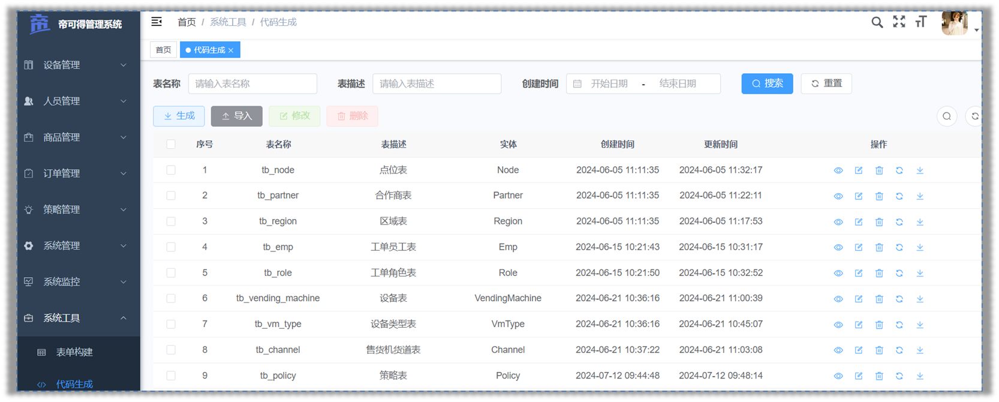
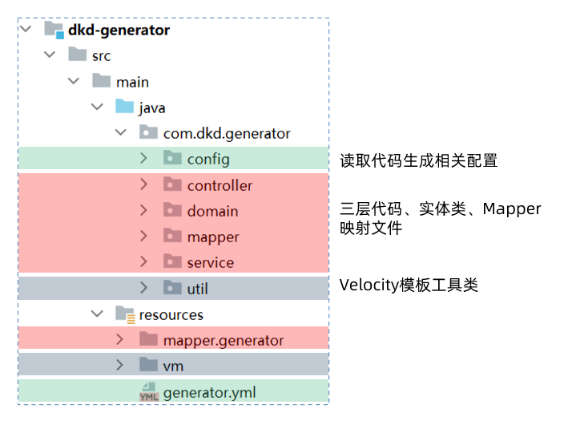
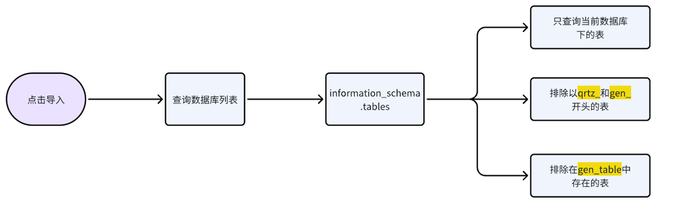
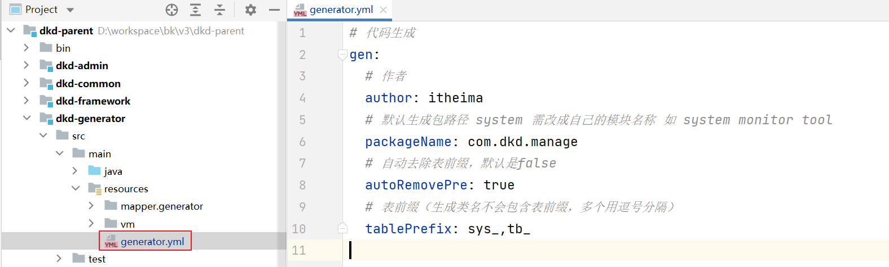
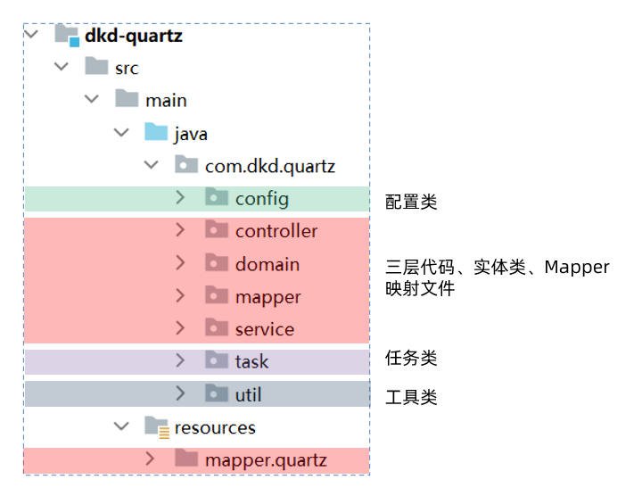

# 代码生成器

## 源码分析

代码生成器是提高开发效率的重要工具，它主要分为两个部分：

第一部分涉及将业务表结构导入到系统中，在这里，开发者可以预览、编辑、删除和同步业务表结构，实现对业务表的全面管理。

第二部分是在选择了特定的表之后，点击生成按钮，系统将根据表结构生成相应的前后端代码，并提供下载。

 

### 表结构说明

若依提供了两张核心表来存储导入的业务表信息：

`gen_table`：存储业务表的基本信息    ，它对应于配置代码基本信息和生成信息的页面

`gen_table_column`：存储业务表的字段信息     它对应于配置代码字段信息的页面。

这两张表是一对多的关系，一张业务表可以有多个字段的信息，所以在字段信息表中有个外键table_id指向

 

### 目录结构

1）后端代码

  

2）前端代码

  

### 查询数据库列表

当管理员在界面上点击导入按钮时，会弹出一个对话框，此时，前端需要向后端发送请求，查询数据库并返回到前端，展示当前项目库中所有待导入的业务表。

 

此功能涉及前端相关的代码位于`views/tool/index.vue`这个视图组件中，负责实现导入业务表的用户界面和交互逻辑。

```js
/** 打开导入表弹窗 */
function openImportTable() {
  proxy.$refs["importRef"].show();
}
```

后端处理逻辑则在代码生成模块的`GenController`中，负责接收前端的请求，处理业务逻辑，并返回查询结果。

```java
/**
 * 查询数据库列表
 */
@PreAuthorize("@ss.hasPermi('tool:gen:list')")
@GetMapping("/db/list")
public TableDataInfo dataList(GenTable genTable)
{
    startPage();
    List<GenTable> list = genTableService.selectDbTableList(genTable);
    return getDataTable(list);
}
```

具体的执行的流程如下图：

 

### 导入表结构

当管理员对话框中选中需要导入的业务表，点击确定按钮，此时，前端需要向后端发送请求，保存业务表的基本信息和字段信息

 

此功能涉及前端相关的代码位于`views/tool/importTable.vue`这个视图组件中，负责实现导入业务表的用户界面和交互逻辑。

```js
/** 导入按钮操作 */
function handleImportTable() {
  const tableNames = tables.value.join(",");
  if (tableNames == "") {
    proxy.$modal.msgError("请选择要导入的表");
    return;
  }
  importTable({ tables: tableNames }).then(res => {
    proxy.$modal.msgSuccess(res.msg);
    if (res.code === 200) {
      visible.value = false;
      emit("ok");
    }
  });
}
```

后端处理逻辑则在代码生成模块的`GenController`中，负责接收前端的请求，处理业务逻辑，保存业务表的基本信息和字段信息

```java
/**
 * 导入表结构（保存）
 */
@PreAuthorize("@ss.hasPermi('tool:gen:import')")
@Log(title = "代码生成", businessType = BusinessType.IMPORT)
@PostMapping("/importTable")
public AjaxResult importTableSave(String tables)
{
    // 将表名字符串转换为数组 tb_task_collect,tb_vendout_running
    String[] tableNames = Convert.toStrArray(tables);
    // 查询表信息
    List<GenTable> tableList = genTableService.selectDbTableListByNames(tableNames);
    // 导入表结构（保存）
    genTableService.importGenTable(tableList, SecurityUtils.getUsername());
    return success();
}
```

具体的执行的流程如下图：

 

### 生成代码

首先管理员，选中需要下载的业务表，并点击生成按钮来触发代码生成并下载的过程。

前端随后向后端发送请求，这个请求会告知服务器需要生成代码的业务表。

  


负责实现这一功能的前端代码位于`views/tool/index.vue`这个视图组件中，负责实现生成业务表的用户界面和交互逻辑。

```js
/** 生成代码操作 */
function handleGenTable(row) {
  const tbNames = row.tableName || tableNames.value;
  if (tbNames == "") {
    proxy.$modal.msgError("请选择要生成的数据");
    return;
  }
  if (row.genType === "1") {
    genCode(row.tableName).then(response => {
      proxy.$modal.msgSuccess("成功生成到自定义路径：" + row.genPath);
    });
  } else {
    proxy.$download.zip("/tool/gen/batchGenCode?tables=" + tbNames, "ruoyi.zip");
  }
}
```

后端的逻辑处理则在代码生成模块的`GenController`中，这里是处理前端请求、执行代码生成逻辑，将生成的代码字节流通过HTTP响应返回给客户端。

```java
/**
 * 批量生成代码
 */
@PreAuthorize("@ss.hasPermi('tool:gen:code')")
@Log(title = "代码生成", businessType = BusinessType.GENCODE)
@GetMapping("/batchGenCode")
public void batchGenCode(HttpServletResponse response, String tables) throws IOException
{
    // 将表名字符串转换为数组 tb_task_collect,tb_vendout_running
    String[] tableNames = Convert.toStrArray(tables);
    // 根据表名下载生成的代码字节数组
    byte[] data = genTableService.downloadCode(tableNames);
    // 将生成的代码字节流通过HTTP响应返回给客户端
    genCode(response, data);
}
```

具体的执行的流程如下图：

 

### 问题分析

我们已经对代码生成器的工作原理有了一定的了解，接下来我们解决一些项目中使用的问题，比如：

每次生成代码都需要修改作者，去除实体类前缀过于繁琐，现在我们可以修改`generator.yml`配置文件来调整为自己项目的

 


```yaml
# 代码生成
gen:
  # 作者
  author: itheima
  # 默认生成包路径 system 需改成自己的模块名称 如 system monitor tool
  packageName: com.dkd.manage
  # 自动去除表前缀，默认是false
  autoRemovePre: true
  # 表前缀（生成类名不会包含表前缀，多个用逗号分隔）
  tablePrefix: sys_,tb_
```


我们还想在若依代码生成的基础上继续进行增强

- 实体类支持Lombok

  ```java
  @Data
  @NoArgsConstructor
  @AllArgsConstructor
  @Builder
  public class Order extends BaseEntity {
  	
      private Long id;
      private String orderNo;
      
      // 没有get、set、toString方法了
  }
  ```

  

- Controller类支持Swagger

  ```java
  @Api(tags = "订单管理Controller")
  public class OrderController extends BaseController{
  
      @ApiOperation("查询订单管理列表")
      public TableDataInfo list(...){
      	return success(...);
      }
      
      @ApiOperation("获取订单管理详细信息")
      public AjaxResult getInfo(...) {
         return success(...);
      }
  
  }
  ```

  

要实现这些增强功能，我们需要掌握Velocity模板引擎的使用。Velocity允许我们定制和优化代码生成模板。

在下一个小节中，我们将开始学习Velocity模板引擎，这将帮助我们更好地理解和改造代码生成器的模板。

## Velocity模版引擎

### 介绍

Velocity是一个基于Java的模板引擎，可以通过特定的语法获取在java对象的数据 , 填充到模板中，从而实现界面和java代码的分离 !

 

常见的应用场景：

- Web内容生成 : 生成动态Web页面。
- 代码生成  : 生成Java源代码、SQL脚本、XML配置文件等。
- 网页静态化  : 生成静态网页。


### 入门

需求：根据下面html模板，完成对数据的填充

```html
<!DOCTYPE html>
<html lang="en">
<head>
    <meta charset="UTF-8">
    <meta name="viewport" content="width=device-width, initial-scale=1.0">
    <title>velocity快速入门</title>
</head>
<body>

    <h3>心怀梦想，坚持不懈，成功即在前方。加油少年！！</h3>
    
</body>
</html>
```

要求：**加油少年，**这几个字，需要动态填充进来

> 加油同学！！
>
> 加油女孩！！
>
> 加油朋友！！

#### 准备模板

```html
<!DOCTYPE html>
<html lang="en">
<head>
    <meta charset="UTF-8">
    <meta name="viewport" content="width=device-width, initial-scale=1.0">
    <title>velocity快速入门</title>
</head>
<body>

<h3>心怀梦想，坚持不懈，成功即在前方。${message}</h3>

</body>
</html>
```

> 上述代码中的 加油少年  修改为了  ${message}  这是一个动态变量（占位符），方便**动态**填充数据

#### 数据填充

编写java代码实现数据填充，并生成文件

```java
package com.dkd.test;

import com.dkd.generator.util.VelocityInitializer;
import org.apache.velocity.Template;
import org.apache.velocity.VelocityContext;
import org.apache.velocity.app.Velocity;

import java.io.FileWriter;
import java.util.List;

public class VelocityDemoTest {

    public static void main(String[] args) throws Exception {
        //1. 初始化模板引擎
        VelocityInitializer.initVelocity();
        //2. 准备数据模型
        VelocityContext velocityContext = new VelocityContext();
        velocityContext.put("message", "加油朋友！！");
        //3. 读取模板
        Template template = Velocity.getTemplate("vm/index.html.vm", "UTF-8");
        //4. 渲染模板
        FileWriter fileWriter = new FileWriter("D:\\workspace\\index.html");
        template.merge(velocityContext, fileWriter);
        fileWriter.close();
    }
}

```

#### 效果测试

在指定的目录中生成index.html文件

 

打开之后的效果：

 


### 基础语法

#### 变量

Velocity中的变量有两类

- 在模板中定义变量： `#set`开头，比如 `#set($name = "velocity")`
- 获取变量的的值：  `$name`  或者  `${name}`

下面是案例，基于刚才的入门案例模板改进

`##`双#号  是vm的注释

```velocity
<!DOCTYPE html>
<html lang="en">
<head>
    <meta charset="UTF-8">
    <meta name="viewport" content="width=device-width, initial-scale=1.0">
    <title>velocity快速入门</title>
</head>
<body>

<h3>心怀梦想，坚持不懈，成功即在前方。${message}</h3>

## 定义变量
#set($name = "velocity")


## 输出变量
第一种情况：${name} <br>
第二种情况：$name <br>

## 第三种情况：orderService
#set($column = "order")
字符串拼接：${column}Service <br>


</body>
</html>

```

对象的定义获取

在ruoyi-generator模块下新增一个区域的实体类

```java
package com.dkd.test;

import com.dkd.common.annotation.Excel;
import com.dkd.common.core.domain.BaseEntity;
import lombok.AllArgsConstructor;
import lombok.Data;
import lombok.NoArgsConstructor;

/**
 * 区域管理对象 tb_region
 *
 * @author itheima
 * @date 2024-06-05
 */
@Data
@NoArgsConstructor
@AllArgsConstructor
public class Region extends BaseEntity {
    private static final long serialVersionUID = 1L;

    /**
     * 主键ID
     */
    private Long id;

    /**
     * 区域名称
     */
    @Excel(name = "区域名称")
    private String regionName;

}
```

准备模型数据

```java
package com.dkd.test;

import com.dkd.generator.util.VelocityInitializer;
import org.apache.velocity.Template;
import org.apache.velocity.VelocityContext;
import org.apache.velocity.app.Velocity;

import java.io.FileWriter;
import java.util.List;

public class VelocityDemoTest {

    public static void main(String[] args) throws Exception {
        //1. 初始化模板引擎
        VelocityInitializer.initVelocity();
        //2. 准备数据模型
        VelocityContext velocityContext = new VelocityContext();
        velocityContext.put("message", "加油朋友！！");
        // 创建区域对象
        Region region = new Region(1L, "北京北五环");
        velocityContext.put("region", region);

        //3. 读取模板
        Template template = Velocity.getTemplate("vm/index.html.vm", "UTF-8");
        //4. 渲染模板
        FileWriter fileWriter = new FileWriter("D:\\workspace\\index.html");
        template.merge(velocityContext, fileWriter);
        fileWriter.close();
    }
}

```

动态模板展示数据

```velocity
<!DOCTYPE html>
<html lang="en">
<head>
    <meta charset="UTF-8">
    <meta name="viewport" content="width=device-width, initial-scale=1.0">
    <title>velocity快速入门</title>
</head>
<body>

<h3>心怀梦想，坚持不懈，成功即在前方。${message}</h3>

## 定义变量
#set($name = "velocity")

## 输出变量
第一种情况：${name} <br>
第二种情况：$name <br>

## 第三种情况：orderService
#set($column = "order")
字符串拼接：${column}Service <br>
<hr>

## 获取区域对象中的数据
区域ID:$region.id <br>
区域名称:${region.regionName} <br>
<hr>
</body>
</html>
```

#### 循环

循环的语法：`#foreach(...) ... #end`

```velocity
##定义一个集合
#set($list = ["春", "夏", "秋", "冬"])    

## 遍历循环
#foreach($item in $list)
   序号[$foreach.count] $item <br> ## count从1开始 index从0开始
#end
```

准备模型数据

```java
// 创建区域对象
Region region1 = new Region(1L, "北京北五环");
Region region2 = new Region(2L, "北京北四环");
velocityContext.put("region", region1);
List<Region> regionList = List.of(region1, region2);
velocityContext.put("regionList", regionList);
```

修改父工程的pom.xml文件，把jdk版本升级为11

```xml
<java.version>11</java.version>
```

动态模板展示数据

```velocity
## 遍历区域
#foreach($item in $regionList)
   序号[$foreach.count],区域ID:$item.id,区域名称:$item.regionName <br>
#end
</br>
```


#### if判断

判断的语法：`#if(condition) ... #elseif(condition) ... #else ... #end`

```velocity
##定义变量
#set($score=80)

## if判断
#if($score>=80)
    优秀
#elseif($score>=60)
    及格
#else
    不及格
#end
```

其他的判断条件：

```velocity
## 对象obj不为空才会执行里面的逻辑
#if($obj) ..... #end

## 对象obj为空才会执行里面的逻辑
#if(!$obj) ..... #end
```

在条件判断中，velocity支持常见的关系操作符，比如：`&&(与), ||(或), !(非)`


### 模板阅读

我们不需要使用velocity去开发新的模板，若依已经提供好了，在它基础上进行调整即可

下面这个是关于实体类的模板

```velocity
package ${packageName}.domain;

## 根据列类型获取导入包
#foreach ($import in $importList)
import ${import};
#end
## 导入Apache Commons Lang库，用于对象的toString方法
import org.apache.commons.lang3.builder.ToStringBuilder;
import org.apache.commons.lang3.builder.ToStringStyle;
## 导入项目自定义的Excel注解，用于生成Excel文档
import com.dkd.common.annotation.Excel;
#if($table.crud || $table.sub)
## 如果表具有CRUD操作或子表，继承BaseEntity
import com.dkd.common.core.domain.BaseEntity;
#elseif($table.tree)
## 如果表是树形结构，继承TreeEntity
import com.dkd.common.core.domain.TreeEntity;
#end

/**
 * ${functionName}对象 ${tableName}
 *
 * @author ${author}
 * @date ${datetime}
 */
#if($table.crud || $table.sub)
    #set($Entity="BaseEntity")
#elseif($table.tree)
    #set($Entity="TreeEntity")
#end
public class ${ClassName} extends ${Entity}
        {   ## 定义类的序列化版本ID
private static final long serialVersionUID = 1L;
## 根据表的列定义实体类的属性
#foreach ($column in $columns)
    ## 如果不是父类的属性，则生成属性
    #if(!$table.isSuperColumn($column.javaField))
    /** $column.columnComment */
        ## 如果字段需要在列表中展示，使用Excel注解标记
        #if($column.list)
            #set($parentheseIndex=$column.columnComment.indexOf("（"))
            #if($parentheseIndex != -1)
                #set($comment=$column.columnComment.substring(0, $parentheseIndex))
            #else
                #set($comment=$column.columnComment)
            #end
            #if($parentheseIndex != -1)
            @Excel(name = "${comment}", readConverterExp = "$column.readConverterExp()")
            #elseif($column.javaType == 'Date')
            @JsonFormat(pattern = "yyyy-MM-dd")
            @Excel(name = "${comment}", width = 30, dateFormat = "yyyy-MM-dd")
            #else
            @Excel(name = "${comment}")
            #end
        #end
    private $column.javaType $column.javaField;

    #end
#end
## 如果表有子表，定义子表信息的集合
#if($table.sub)
/** $table.subTable.functionName信息 */
private List<${subClassName}> ${subclassName}List;

#end
## 为每个属性字段生成getter和setter方法
#foreach ($column in $columns)
    #if(!$table.isSuperColumn($column.javaField))
        #if($column.javaField.length() > 2 && $column.javaField.substring(1,2).matches("[A-Z]"))
            #set($AttrName=$column.javaField)
        #else
            #set($AttrName=$column.javaField.substring(0,1).toUpperCase() + ${column.javaField.substring(1)})
        #end
    public void set${AttrName}($column.javaType $column.javaField)
            {
            this.$column.javaField = $column.javaField;
            }

    public $column.javaType get${AttrName}()
            {
            return $column.javaField;
            }
    #end
#end
## 如果表有子表，生成子表信息的getter和setter方法
#if($table.sub)
public List<${subClassName}> get${subClassName}List()
        {
        return ${subclassName}List;
        }

public void set${subClassName}List(List<${subClassName}> ${subclassName}List)
        {
        this.${subclassName}List = ${subclassName}List;
        }

#end
## 重写toString方法，使用Apache Commons Lang的ToStringBuilder
@Override
public String toString() {
        return new ToStringBuilder(this,ToStringStyle.MULTI_LINE_STYLE)
    #foreach ($column in $columns)
        #if($column.javaField.length() > 2 && $column.javaField.substring(1,2).matches("[A-Z]"))
            #set($AttrName=$column.javaField)
        #else
            #set($AttrName=$column.javaField.substring(0,1).toUpperCase() + ${column.javaField.substring(1)})
        #end
            .append("${column.javaField}", get${AttrName}())
    #end
    #if($table.sub)
            .append("${subclassName}List", get${subClassName}List())
    #end
        .toString();
        }
        }

```


## Lombok集成

目前，我们已经基本熟悉了velocity的作用和一些语法，那接下来，我们就通过这些知识来去改造若依框架的代码生成部分

### 导入坐标（已完成）

在`dkd-common`模块的`pom.xml`中添加lombok坐标

```xml
<!--  lombok工具-->
<dependency>
    <groupId>org.projectlombok</groupId>
    <artifactId>lombok</artifactId>
</dependency>
```

### 修改模板

在`dkd-generator`模块的`domain.java.vm`模板中添加lombok注解

```velocity
package ${packageName}.domain;

## 根据列类型获取导入包
#foreach ($import in $importList)
import ${import};
#end
## 导入项目自定义的Excel注解，用于生成Excel文档
import com.dkd.common.annotation.Excel;
#if($table.crud || $table.sub)
## 如果表具有CRUD操作或子表，继承BaseEntity
import com.dkd.common.core.domain.BaseEntity;
#elseif($table.tree)
## 如果表是树形结构，继承TreeEntity
import com.dkd.common.core.domain.TreeEntity;
#end
## 注意lombok导包
import lombok.AllArgsConstructor;
import lombok.Builder;
import lombok.Data;
import lombok.NoArgsConstructor;

/**
 * ${functionName}对象 ${tableName}
 *
 * @author ${author}
 * @date ${datetime}
 */
#if($table.crud || $table.sub)
#set($Entity="BaseEntity")
#elseif($table.tree)
#set($Entity="TreeEntity")
#end
@Data
@NoArgsConstructor
@AllArgsConstructor
@Builder
public class ${ClassName} extends ${Entity}
        {   ## 定义类的序列化版本ID
private static final long serialVersionUID=1L;
## 根据表的列定义实体类的属性
#foreach ($column in $columns)
    ## 如果不是父类的属性，则生成属性
    #if(!$table.isSuperColumn($column.javaField))
    /** $column.columnComment */
        ## 如果字段需要在列表中展示，使用Excel注解标记
        #if($column.list)
            #set($parentheseIndex=$column.columnComment.indexOf("（"))
            #if($parentheseIndex != -1)
                #set($comment=$column.columnComment.substring(0, $parentheseIndex))
            #else
                #set($comment=$column.columnComment)
            #end
            #if($parentheseIndex != -1)
            @Excel(name = "${comment}", readConverterExp = "$column.readConverterExp()")
            #elseif($column.javaType == 'Date')
            @JsonFormat(pattern = "yyyy-MM-dd")
            @Excel(name = "${comment}", width = 30, dateFormat = "yyyy-MM-dd")
            #else
            @Excel(name = "${comment}")
            #end
        #end
    private $column.javaType $column.javaField;

    #end
#end
## 如果表有子表，定义子表信息的集合
#if($table.sub)
/** $table.subTable.functionName信息 */
private List<${subClassName}> ${subclassName}List;

#end
}
```

### 生成后的效果

修改完成之后，重启项目，找到代码生成的功能，通过**代码预览**可以查看实体类的代码：

 

> - 正常添加了关于lombok的注解
> - 删除了set 、 get  、toString 等方法

可以把生成后的代码，拷贝到项目中，如果订单管理能够正常访问和操作，就算修改成功了，后期再次生成的代码，全部都支持lombok


## Swagger集成

### 修改模板

在`dkd-generator`模块的 `controller.java.vm`模板中添加Swagger注解

```velocity
package ${packageName}.controller;

import java.util.List;
import javax.servlet.http.HttpServletResponse;
import org.springframework.security.access.prepost.PreAuthorize;
import org.springframework.beans.factory.annotation.Autowired;
import org.springframework.web.bind.annotation.GetMapping;
import org.springframework.web.bind.annotation.PostMapping;
import org.springframework.web.bind.annotation.PutMapping;
import org.springframework.web.bind.annotation.DeleteMapping;
import org.springframework.web.bind.annotation.PathVariable;
import org.springframework.web.bind.annotation.RequestBody;
import org.springframework.web.bind.annotation.RequestMapping;
import org.springframework.web.bind.annotation.RestController;
import com.dkd.common.annotation.Log;
import com.dkd.common.core.controller.BaseController;
import com.dkd.common.core.domain.AjaxResult;
import com.dkd.common.enums.BusinessType;
import ${packageName}.domain.${ClassName};
import ${packageName}.service.I${ClassName}Service;
import com.dkd.common.utils.poi.ExcelUtil;
#if($table.crud || $table.sub)
import com.dkd.common.core.page.TableDataInfo;
#elseif($table.tree)
#end
import io.swagger.annotations.Api;
import io.swagger.annotations.ApiOperation;

/**
 * ${functionName}Controller
 *
 * @author ${author}
 * @date ${datetime}
 */
@Api(tags = "${functionName}Controller")
@RestController
@RequestMapping("/${moduleName}/${businessName}")
public class ${ClassName}Controller extends BaseController
{
    @Autowired
    private I${ClassName}Service ${className}Service;

    /**
     * 查询${functionName}列表
     */
    @ApiOperation("查询${functionName}列表")
    @PreAuthorize("@ss.hasPermi('${permissionPrefix}:list')")
    @GetMapping("/list")
#if($table.crud || $table.sub)
    public TableDataInfo list(${ClassName} ${className})
    {
        startPage();
        List<${ClassName}> list = ${className}Service.select${ClassName}List(${className});
        return getDataTable(list);
    }
#elseif($table.tree)
    public AjaxResult list(${ClassName} ${className})
    {
        List<${ClassName}> list = ${className}Service.select${ClassName}List(${className});
        return success(list);
    }
#end

    /**
     * 导出${functionName}列表
     */
    @ApiOperation("导出${functionName}列表")
    @PreAuthorize("@ss.hasPermi('${permissionPrefix}:export')")
    @Log(title = "${functionName}", businessType = BusinessType.EXPORT)
    @PostMapping("/export")
    public void export(HttpServletResponse response, ${ClassName} ${className})
    {
        List<${ClassName}> list = ${className}Service.select${ClassName}List(${className});
        ExcelUtil<${ClassName}> util = new ExcelUtil<${ClassName}>(${ClassName}.class);
        util.exportExcel(response, list, "${functionName}数据");
    }

    /**
     * 获取${functionName}详细信息
     */
    @ApiOperation("获取${functionName}详细信息")
    @PreAuthorize("@ss.hasPermi('${permissionPrefix}:query')")
    @GetMapping(value = "/{${pkColumn.javaField}}")
    public AjaxResult getInfo(@PathVariable("${pkColumn.javaField}") ${pkColumn.javaType} ${pkColumn.javaField})
    {
        return success(${className}Service.select${ClassName}By${pkColumn.capJavaField}(${pkColumn.javaField}));
    }

    /**
     * 新增${functionName}
     */
    @ApiOperation("新增${functionName}")
    @PreAuthorize("@ss.hasPermi('${permissionPrefix}:add')")
    @Log(title = "${functionName}", businessType = BusinessType.INSERT)
    @PostMapping
    public AjaxResult add(@RequestBody ${ClassName} ${className})
    {
        return toAjax(${className}Service.insert${ClassName}(${className}));
    }

    /**
     * 修改${functionName}
     */
    @ApiOperation("修改${functionName}")
    @PreAuthorize("@ss.hasPermi('${permissionPrefix}:edit')")
    @Log(title = "${functionName}", businessType = BusinessType.UPDATE)
    @PutMapping
    public AjaxResult edit(@RequestBody ${ClassName} ${className})
    {
        return toAjax(${className}Service.update${ClassName}(${className}));
    }

    /**
     * 删除${functionName}
     */
    @ApiOperation("删除${functionName}")
    @PreAuthorize("@ss.hasPermi('${permissionPrefix}:remove')")
    @Log(title = "${functionName}", businessType = BusinessType.DELETE)
	@DeleteMapping("/{${pkColumn.javaField}s}")
    public AjaxResult remove(@PathVariable ${pkColumn.javaType}[] ${pkColumn.javaField}s)
    {
        return toAjax(${className}Service.delete${ClassName}By${pkColumn.capJavaField}s(${pkColumn.javaField}s));
    }
}
```

### 生成后的效果

修改完成之后，重启项目，找到代码生成的功能，通过**代码预览**可以查看Controller类的代码：

 


可以把生成后的代码，拷贝到项目中，如果订单管理能够正常访问和操作，且系统接口显示工单管理就算修改成功了，后期再次生成的代码，全部都支持Swagger

 


# RBAC权限控制

## SpringSecurity介绍

Spring Security是一个功能强大的Java安全框架，它提供了全面的安全认证和授权的支持。

与RBAC模型结合使用时，Spring Security能够实现灵活的权限控制。

我们来看下它的二大核心概念，认证和授权。让我们用一个简单的例子来领会它们的意义。


**1）认证（Authentication）**想象一下，小智同学去图书馆借书。门口的图书管理员会要求小智出示借书证。这个借书证上有小智的照片和姓名，管理员通过它来确认小智的身份。这个过程，就是一个认证的实例。在Spring  Security的世界里，认证就像用户登录时提交的用户名和密码，系统通过这些信息来验证“你是谁”。

Spring Security不仅支持传统的用户名和密码认证，还支持OAuth2、JWT等现代认证方式。


**2）授权（Authorization）**  现在，假设小智同学已经踏入了图书馆的大门，但当小智想进入只有持特定权限才能进入的参考书籍区时，管理员会再次检查小智的借书证，看是否有相应的权限标记。如果有，那么小智就能进入这个区域；如果没有，那么小智只能遗憾地止步。这就是授权的精髓。在Spring  Security中，授权是确认用户在通过认证之后，是否有权限执行某些操作或访问特定资源。


## SpringSecurity配置

Spring Security的配置类是实现安全控制的核心部分

开启Spring Security各种功能，以确保Web应用程序的安全性，包括认证、授权、会话管理、过滤器添加等。

```java
package com.dkd.framework.config;

import org.springframework.beans.factory.annotation.Autowired;
import org.springframework.context.annotation.Bean;
import org.springframework.http.HttpMethod;
import org.springframework.security.authentication.AuthenticationManager;
import org.springframework.security.config.annotation.authentication.builders.AuthenticationManagerBuilder;
import org.springframework.security.config.annotation.method.configuration.EnableGlobalMethodSecurity;
import org.springframework.security.config.annotation.web.builders.HttpSecurity;
import org.springframework.security.config.annotation.web.configuration.WebSecurityConfigurerAdapter;
import org.springframework.security.config.annotation.web.configurers.ExpressionUrlAuthorizationConfigurer;
import org.springframework.security.config.http.SessionCreationPolicy;
import org.springframework.security.core.userdetails.UserDetailsService;
import org.springframework.security.crypto.bcrypt.BCryptPasswordEncoder;
import org.springframework.security.web.authentication.UsernamePasswordAuthenticationFilter;
import org.springframework.security.web.authentication.logout.LogoutFilter;
import org.springframework.web.filter.CorsFilter;
import com.dkd.framework.config.properties.PermitAllUrlProperties;
import com.dkd.framework.security.filter.JwtAuthenticationTokenFilter;
import com.dkd.framework.security.handle.AuthenticationEntryPointImpl;
import com.dkd.framework.security.handle.LogoutSuccessHandlerImpl;

/**
 * spring security配置
 *
 * @author ruoyi
 */
// 开启方法级别的权限控制 ==> @PreAuthorize
@EnableGlobalMethodSecurity(prePostEnabled = true, securedEnabled = true)
public class SecurityConfig extends WebSecurityConfigurerAdapter
{
    /**
     * 自定义用户认证逻辑
     */
    @Autowired
    private UserDetailsService userDetailsService;

    /**
     * 认证失败处理类
     */
    @Autowired
    private AuthenticationEntryPointImpl unauthorizedHandler;

    /**
     * 退出处理类
     */
    @Autowired
    private LogoutSuccessHandlerImpl logoutSuccessHandler;

    /**
     * token认证过滤器
     */
    @Autowired
    private JwtAuthenticationTokenFilter authenticationTokenFilter;

    /**
     * 跨域过滤器
     */
    @Autowired
    private CorsFilter corsFilter;

    /**
     * 允许匿名访问的地址
     */
    @Autowired
    private PermitAllUrlProperties permitAllUrl;

    /**
     * 解决 无法直接注入 AuthenticationManager
     *
     * @return
     * @throws Exception
     */
    @Bean
    @Override
    public AuthenticationManager authenticationManagerBean() throws Exception
    {
        return super.authenticationManagerBean();
    }

    /**
     * anyRequest          |   匹配所有请求路径
     * access              |   SpringEl表达式结果为true时可以访问
     * anonymous           |   匿名可以访问
     * denyAll             |   用户不能访问
     * fullyAuthenticated  |   用户完全认证可以访问（非remember-me下自动登录）
     * hasAnyAuthority     |   如果有参数，参数表示权限，则其中任何一个权限可以访问
     * hasAnyRole          |   如果有参数，参数表示角色，则其中任何一个角色可以访问
     * hasAuthority        |   如果有参数，参数表示权限，则其权限可以访问
     * hasIpAddress        |   如果有参数，参数表示IP地址，如果用户IP和参数匹配，则可以访问
     * hasRole             |   如果有参数，参数表示角色，则其角色可以访问
     * permitAll           |   用户可以任意访问
     * rememberMe          |   允许通过remember-me登录的用户访问
     * authenticated       |   用户登录后可访问
     */
    @Override
    protected void configure(HttpSecurity httpSecurity) throws Exception
    {
        // 配置URL访问授权规则
        ExpressionUrlAuthorizationConfigurer<HttpSecurity>.ExpressionInterceptUrlRegistry registry = httpSecurity.authorizeRequests();
        // 遍历无需认证即可访问的URL列表，设置这些URL对所有用户可访问
        permitAllUrl.getUrls().forEach(url -> registry.antMatchers(url).permitAll());
        // 配置Web应用程序规则
        httpSecurity
                // CSRF（跨站请求伪造）禁用，因为不使用session
                .csrf().disable()
                // 禁用HTTP响应标头
                .headers().cacheControl().disable().and()
                // 认证失败处理类
                .exceptionHandling().authenticationEntryPoint(unauthorizedHandler).and()
                // 基于token，所以不需要session
                .sessionManagement().sessionCreationPolicy(SessionCreationPolicy.STATELESS).and()
                // 过滤请求
                .authorizeRequests()
                // 对于登录login 注册register 验证码captchaImage 允许匿名访问
                .antMatchers("/login", "/register", "/captchaImage").permitAll()
                // 静态资源，可匿名访问
                .antMatchers(HttpMethod.GET, "/", "/*.html", "/**/*.html", "/**/*.css", "/**/*.js", "/profile/**").permitAll()
                .antMatchers("/swagger-ui.html", "/swagger-resources/**", "/webjars/**", "/*/api-docs", "/druid/**").permitAll()
                // 除上面外的所有请求全部需要鉴权认证
                .anyRequest().authenticated()
                .and()
                .headers().frameOptions().disable();
        // 添加Logout filter
        httpSecurity.logout().logoutUrl("/logout").logoutSuccessHandler(logoutSuccessHandler);
        // 添加JWT filter
        httpSecurity.addFilterBefore(authenticationTokenFilter, UsernamePasswordAuthenticationFilter.class);
        // 添加CORS filter
        httpSecurity.addFilterBefore(corsFilter, JwtAuthenticationTokenFilter.class);
        httpSecurity.addFilterBefore(corsFilter, LogoutFilter.class);
    }

    /**
     * 强散列哈希加密实现
     */
    @Bean
    public BCryptPasswordEncoder bCryptPasswordEncoder()
    {
        return new BCryptPasswordEncoder();
    }

    /**
     * 身份认证接口
     */
    @Override
    protected void configure(AuthenticationManagerBuilder auth) throws Exception
    {
        auth.userDetailsService(userDetailsService).passwordEncoder(bCryptPasswordEncoder());
    }
}
```

## 用户登录流程

管理员在登录页面，输入用户名和密码以及验证码后，点击登录按钮，向后端发送请求，后端通过springSecurity认证管理器进行登录校验

 

此功能涉及前端相关的代码位于`views/login.vue`这个视图组件中，负责实现用户登录界面和交互逻辑。

后端处理逻辑则在`dkd-admin`模块的SysLoginController中，负责接收前端的请求，处理登录逻辑，并返回token令牌

### 前端

1. 点击`login.vue`中的登录按钮

2. 调用`login.vue`中的`handleLogin`方法

3. 调用`store/mondles/user.js`中的`login`方法，将返回结果存入useUserStore对象中（用于管理用户相关的状态和操作）

4. 调用`api/login.js`中的`login`方法

5. 调用`utils/request.js`中的`service`实例基于axios发送ajax请求（.env.development文件设置了统一请求路径前缀）


### 后端

#### SysLoginController

在`ruoyi-admin`模块中`com.ruoyi.web.controller.system.SysLoginController`类的`login`方法接收前端登录请求

#### SysLoginService

在`ruoyi-framework`模块中`com.ruoyi.framework.web.service.SysLoginService`类的`login`方法处理登录逻辑

1. 验证码校验
2. 登录前置校验
3. SS认证管理器用户校验，调用执行UserDetailsServiceImpl.loadUserByUsername
   1. 认证通过后，创建登录用户对象LoginUser包括用户ID、部门ID、用户信息和用户权限信息
4. 登录成功，记录日志
5. 修改用户表更新登录信息
6. 生成token

**具体的执行的流程如下图：**

  


## 获取用户角色和权限

超级管理员登录帝可得系统后，可以查看区域管理所有的权限按钮，实现增删改查操作

 

而财务人员登录帝可得系统后，仅可以查看区域列表，其他权限没有

 

1）首先创建一个财务人员的角色，权限字符串 Accountant，仅设置区域管理查询权限

 

2）再创建一个用户，昵称为黑马彭于晏，用户名hmpyy，密码admin123 角色为财务人员

 

### 前端

1. 在全局`permission.js`中的`router.beforeEach`方法用于在用户导航到不同路由之前进行一些预处理
3. 调用`store/mondles/user.js`中的`getInfo`方法，将返回结果存入useUserStore对象中（用于管理用户相关的状态和操作）
4. 调用`api/login.js`中的`getInfo`方法

### 后端

#### SysLoginController

在`ruoyi-admin`模块中`com.ruoyi.web.controller.system.SysLoginController`类的`getInfo`方法接收前端获取用户信息请求

#### SysPermissionService

在`ruoyi-framework`模块中`com.ruoyi.framework.web.service.SysPermissionService`类

1. getRolePermission查询该用户角色集合
2. getMenuPermission查询该用户权限（菜单）集合

**具体的执行的流程如下图：**

 

### 页面权限

前端封装了一个指令权限，能简单快速的实现按钮级别的权限判断。

**使用权限字符串 v-hasPermi**：`@/directive/permission/hasPermi.js`

```html
// 单个
<el-button v-hasPermi="['system:user:add']">存在权限字符串才能看到</el-button>
// 多个
<el-button v-hasPermi="['system:user:add', 'system:user:edit']">包含权限字符串才能看到</el-button>
```


**使用角色字符串 v-hasRole**`@/directive/permission/hasRole.js`

```html
// 单个
<el-button v-hasRole="['admin']">管理员才能看到</el-button>
// 多个
<el-button v-hasRole="['role1', 'role2']">包含角色才能看到</el-button>
```


## 获取动态菜单路由

在上个小节我们创建了“黑马彭于晏”这个用户，并为他分配了特定的角色权限。这意味着，当他登录帝可得系统时，看到的侧边栏菜单将根据他的角色权限而有所不同。而超级管理员是可以查看所有菜单的

实现此功能的前端代码位于`src/permission.js`文件。它在登录成功后，会在跳转到新路由之前，去查询当前用户有权访问的动态菜单的路由列表。

后端处理逻辑则在`dkd-admin`模块的SysLoginController中，它负责接收前端发来的请求，处理查询，并构建起一个完整的菜单树结构，然后返回给前端。

### 前端

1. 在全局`permission.js`中的`router.beforeEach`方法用于在用户导航到不同路由之前进行一些预处理
3. 调用`store/mondles/permission.js`中的`generateRoutes`方法，将返回结果存入usePermissionStore对象中
4. 调用`api/menu.js`中的`getRouters`方法

### 后端

#### SysLoginController

在`ruoyi-admin`模块中`com.ruoyi.web.controller.system.SysLoginController`类的`getRouters`方法接收前端获取路由信息请求

#### ISysMenuService

在`ruoyi-system`模块中`com.ruoyi.web.system.service.ISysMenuService`类

1. selectMenuTreeByUserId根据用户ID查询菜单树信息（递归生成父子菜单）
2. buildMenus构建前端路由所需要的菜单路由格式RouterVo

**具体的执行的流程如下图：**

 

### 路由菜单加载

1. 用户登录成功后，通过路由`router/index.js`跳转到首页并加载layout布局组件
2. 在`layout/index.vue`中加载sidbar侧边栏
3. 在`layout/components/Sidebar/index.vue`中遍历动态路由菜单在页面显示
4. 用户点击菜单后会根据路由的path跳转到对应的视图组件在<app-main />显示


## 权限注解

### 源码分析

在若依框架中，权限的验证最核心的是使用的Spring Security的提供的权限注解`@PreAuthorize `

- @PreAuthorize 是 Spring Security 框架中提供的一个安全注解，用于实现基于注解的访问控制。它允许开发者在**方法级别**上声明特定的安全约束，以确保只有满足指定条件的用户才能调用该方法

- 当 @PreAuthorize 注解被应用于某个方法时，Spring Security 在**该方法执行前**会先对当前认证的用户进行权限检查。如果检查通过，方法调用得以继续；否则，框架会抛出相应的权限异常（如 AccessDeniedException），阻止方法执行。

  

若依框架中的权限控制代码，如下：


```java
@PreAuthorize("@ss.hasPermi('manage:order:list')")
public TableDataInfo list(Order order)
{
    startPage();
    List<Order> list = orderService.selectOrderList(order);
    return getDataTable(list);
}
```

- @PreAuthorize是Spring Security框架的权限注解，在执行方法前执行

- @ss.hasPermi('manage:order:list')
  - 其中的ss是指的一个spring管理的bean
    - 位置：ruoyi-framework模块中的com.ruoyi.framework.web.service.PermissionService
  - hasPermi  是PermissionService类中的一个方法，判断是否拥有该权限
  - manage:order:list为方法的参数

> 注意：在SecurityConfig类中添加`@EnableGlobalMethodSecurity(prePostEnabled = true, securedEnabled = true)`@PreAuthorize才能生效

**权限控制流程：**

   


### 权限方法

`@PreAuthorize`注解用于配置接口要求用户拥有某些权限才可访问，它拥有如下方法

| 方法        | 参数   | 描述                                           |
| ----------- | ------ | ---------------------------------------------- |
| hasPermi    | String | 验证用户是否具备某权限                         |
| lacksPermi  | String | 验证用户是否不具备某权限，与 hasPermi逻辑相反  |
| hasAnyPermi | String | 验证用户是否具有以下任意一个权限               |
| hasRole     | String | 判断用户是否拥有某个角色                       |
| lacksRole   | String | 验证用户是否不具备某角色，与 hasRole逻辑相反   |
| hasAnyRoles | String | 验证用户是否具有以下任意一个角色，多个逗号分隔 |

### 使用示例

1）数据权限示例。

```java
// 符合system:user:list权限要求
@PreAuthorize("@ss.hasPermi('system:user:list')")

// 不符合system:user:list权限要求
@PreAuthorize("@ss.lacksPermi('system:user:list')")

// 符合system:user:add或system:user:edit权限要求即可
@PreAuthorize("@ss.hasAnyPermi('system:user:add,system:user:edit')")
```

**编程式判断是否有资源权限**

```java
if (SecurityUtils.hasPermi("sys:user:edit"))
{
    System.out.println("当前用户有编辑用户权限");
}
```


2）角色权限示例。

```java
// 属于user角色
@PreAuthorize("@ss.hasRole('user')")

// 不属于user角色
@PreAuthorize("@ss.lacksRole('user')")

// 属于user或者admin之一
@PreAuthorize("@ss.hasAnyRoles('user,admin')")
```

**编程式判断是否有角色权限**

```java
if (SecurityUtils.hasRole("admin"))
{
    System.out.println("当前用户有admin角色权限");
}
```

> 权限提示：超级管理员拥有所有权限，不受权限约束。


### 公开接口

如果有些接口是不需要验证权限可以公开访问的，这个时候就需要我们给接口放行。

使用注解方式，只需要在`Controller`的类或方法上加入`@Anonymous`该注解即可

```java
// @PreAuthorize("@ss.xxxx('....')") 注释或删除掉原有的权限注解
@Anonymous
@GetMapping("/list")
public List<SysXxxx> list(SysXxxx xxxx)
{
    return xxxxList;
}
```


# 异步任务管理器

## 介绍

若依框架的前后端分离版本中，异步任务管理器扮演着重要角色，主要用于处理一些不需要即时返回结果的后台任务，从而提高应用程序的整体性能

```java
// 多线程执行任务AsyncManager.me().execute(AsyncFactory.createTimerTask());
AsyncManager.me().execute(AsyncFactory.createTimerTask());
```

场景：记录日志
 

那么，为什么使用异步任务管理器能够提高性能呢？让我们通过一个实际的例子来说明。

用户在浏览器中输入用户名、密码和验证码，然后发送登录请求。

在sysLoginService业务层代码中实现登录逻辑，核心业务是登录认证，包括验证码校验、用户名查询和密码校验。

如果校验失败，我们会记录日志并返回提示信息；如果校验成功，我们同样记录日志并返回token。

假设登录认证核心业务代码执行耗时50ms，记录日志也需要耗时50ms，那么整个登录请求耗时多久呢？没错就是100ms。

现在，如果产品经理根据客户的要求，增加了一个功能：在后台系统登录成功后给用户发送一条提示短信。这意味着我们需要在业务层增加发送短信的代码，而这同样需要耗时50ms。这样一来，整个登录请求的耗时就变成了150ms，用户的等待时间增加了，系统性能也随之下降。

此外，我们的登录业务还涉及到事务控制，以保证业务的一致性。

如果登录认证业务成功，但记录日志时出现异常，导致事务回滚，这样的设计显然是不合理的。这就是级联失败的现象。

其实对于用户只关心登录是否成功，而对于记录日志和发送短信这些非核心业务，他们并不关心是否立即完成。

 

因此，我们可以通过异步任务管理器的多线程来处理这些任务。我们来看下

在用户发送登录请求时，`sysLoginService`业务层只需关注登录认证的核心业务代码。

记录日志和发送短信的任务可以交给异步管理器来处理。

这样，用户登录的耗时只需要50ms，无需等待异步任务的完成，从而显著提高了性能。

更重要的是，登录认证作为一个独立的事务运行在主线程中，而记录日志则在另一个线程中进行。这样，即使记录日志失败，也不会影响登录认证的事务，实现了故障隔离。

 

通过使用异步任务管理器，我们可以将那些不需要立即返回结果的非核心业务代码交给它来执行，从而优化系统性能，提高用户体验。

## 源码

若依异步任务管理器是一个单例对象使用了线程池+异步工厂（产生任务用）

- com.dkd.framework.manager.AsyncManager 异步任务管理器
- com.dkd.framework.manager.factory.AsyncFactory 异步线程工厂


1、 AsyncManager.me()获取AsyncManager对象

2、调用execute方法，执行TimerTask任务（记录登录日志），它实现了runnable接口，由线程Thread去执行

3、execute方法内部调用ScheduledExecutorService异步操作任务调度线程池的schedule方法用于延迟10毫秒执行一个任务


**具体的流程图如下：**

 


# 操作日志

## 介绍

在日常编程中，记录日志是我们的得力助手，尤其在处理关键业务时，它能帮助我们追踪和审查操作过程。

然而，手动记录日志常常是繁琐且容易出错的。我们需要收集操作内容、参数等信息，这不仅增加了工作量，还可能导致代码重复，影响业务逻辑的清晰度。

那么，有没有什么办法可以让我们更优雅地处理这个问题呢？答案是肯定的，那就是使用注解

在需要被记录日志的`controller`方法上添加`@Log`注解，使用方法如下：

```java
@Log(title = "订单管理", businessType = BusinessType.INSERT)
public AjaxResult add(...)
{
    return toAjax(...);
}
```


**注解参数说明：**

| 参数               | 类型         | 默认值 | 描述                                                         |
| ------------------ | ------------ | ------ | ------------------------------------------------------------ |
| title              | String       | 空     | 操作模块                                                     |
| businessType       | BusinessType | OTHER  | 操作功能（`OTHER`其他、`INSERT`新增、`UPDATE`修改、`DELETE`删除、`GRANT`授权、`EXPORT`导出、`IMPORT`导入、`FORCE`强退、`GENCODE`生成代码、`CLEAN`清空数据） |
| operatorType       | OperatorType | MANAGE | 操作人类别（`OTHER`其他、`MANAGE`后台用户、`MOBILE`手机端用户） |
| isSaveRequestData  | boolean      | true   | 是否保存请求的参数                                           |
| isSaveResponseData | boolean      | true   | 是否保存响应的参数                                           |
| excludeParamNames  | String[]     | {}     | 排除指定的请求参数                                           |


## 源码

若依操作日志使用了自定义注解+AOP切面+异步任务管理器

- com.ruoyi.common.annotation.Log  自定义注解

- com.ruoyi.framework.aspectj.LogAspect  在一个aop切面类

  - 通过实现AOP切面编程，对目标方法进行拦截(标注Log注解的方法)，实现了操作日志的自动记录
  - 异步任务管理器来将任务（记录操作日志到数据库）交给线程池来完成

  


# 定时任务

## 源码分析

在实际项目开发中Web应用有一类不可缺少的，那就是定时任务。 定时任务的场景可以说非常广泛，比如某些视频网站，购买会员后，每天会给会员送成长值，每月会给会员送一些电影券； 比如在保证最终一致性的场景中，往往利用定时任务调度进行一些比对工作；比如一些定时需要生成的报表、邮件；比如一些需要定时清理数据的任务等。 所以我们提供方便友好的web界面，实现动态管理任务，可以达到动态控制定时任务启动、暂停、重启、删除、添加、修改等操作，极大地方便了开发过程。

 

### 表结构说明

**`sys_job` 表**：这是核心的定时任务表，用于存储定时任务的配置信息，如任务名称、任务组、执行的类全名、执行的参数、cron表达式等 

**`sys_job_log` 表**：用于记录定时任务的执行日志，包括任务的开始执行时间、结束执行时间、执行结果等 

 

### 目录结构

**1）后端代码**

 

- ScheduleUtils 定时任务工具类
- 抽象quartz调用类AbstractQuartzJob（实现Job接口）
- 定时任务处理类（禁止并发执行） 继承抽象类
- 定时任务处理类（允许并发执行） 继承抽象类
- 任务执行工具类 JobInvokeUtil
- cron表达式工具类

**2）前端代码**

 


### Quartz体系结构

 

### Quartz核心API

| API       | 描述                                                         |
| ------------ | ------------------------------------------------------------ |
| **Job**      | - 实际要执行的任务类<br>- 必须实现Quartz的`Job`接口。       |
| **JobDetail** | - 代表一个`Job`实例<br>- 通过`JobBuilder`类创建。           |
| **JobBuilder** | - 用于声明一个任务实例<br>- 可以定义关于该任务的详情，如任务名、组名等。 |
| **Trigger**  | - 触发器，用来触发并执行`Job`实例的机制。                   |
| **SimpleTrigger** | - 用于简单重复执行作业的触发器<br>- 例如：每隔一定时间执行一次。 |
| **CronTrigger** | - 使用Cron表达式定义执行计划的触发器<br>- 适用于定义复杂的执行时间。 |
| **TriggerBuilder** | - 用于创建触发器`Trigger`实例的构建器。                   |
| **Scheduler** | - Quartz中的核心组件<br>- 负责启动、停止、暂停和恢复任务。 |

### 定时任务执行

项目在启动时，初始化定时任务

 

流程图：

      

### 添加定时任务

刚才我们分析了在项目启动时，从数据库中查询任务配置列表，然后创建定时任务，并根据状态判断是否执行任务调度，那如果是新添加的定时任务该如何处理呢？为了解答这个问题，我们来对这部分的源码进行分析

我们已经对若依前端的代码交互模式比较熟悉了，所以本次我们关注后端部分，入口在定时任务模块的sysJobController中

```java
/**
 * 修改定时任务
 */
@PreAuthorize("@ss.hasPermi('monitor:job:edit')")
@Log(title = "定时任务", businessType = BusinessType.UPDATE)
@PutMapping
public AjaxResult edit(@RequestBody SysJob job) throws SchedulerException, TaskException
{
    if (!CronUtils.isValid(job.getCronExpression()))
    {
        return error("修改任务'" + job.getJobName() + "'失败，Cron表达式不正确");
    }
    else if (StringUtils.containsIgnoreCase(job.getInvokeTarget(), Constants.LOOKUP_RMI))
    {
        return error("修改任务'" + job.getJobName() + "'失败，目标字符串不允许'rmi'调用");
    }
    else if (StringUtils.containsAnyIgnoreCase(job.getInvokeTarget(), new String[] { Constants.LOOKUP_LDAP, Constants.LOOKUP_LDAPS }))
    {
        return error("修改任务'" + job.getJobName() + "'失败，目标字符串不允许'ldap(s)'调用");
    }
    else if (StringUtils.containsAnyIgnoreCase(job.getInvokeTarget(), new String[] { Constants.HTTP, Constants.HTTPS }))
    {
        return error("修改任务'" + job.getJobName() + "'失败，目标字符串不允许'http(s)'调用");
    }
    else if (StringUtils.containsAnyIgnoreCase(job.getInvokeTarget(), Constants.JOB_ERROR_STR))
    {
        return error("修改任务'" + job.getJobName() + "'失败，目标字符串存在违规");
    }
    else if (!ScheduleUtils.whiteList(job.getInvokeTarget()))
    {
        return error("修改任务'" + job.getJobName() + "'失败，目标字符串不在白名单内");
    }
    job.setUpdateBy(getUsername());
    return toAjax(jobService.updateJob(job));
}
```

**代码流程图：**

 

### 定时任务状态修改

刚才我们分析新增定时任务的源码时，发现了任务在初始化时是处于暂停状态的。

如果要启动任务，可以在页面进行任务状态的开关控制，所以接下来我们对此功能的源码进行分析

入口在定时任务模块的sysJobController中

```java
/**
 * 定时任务状态修改
 */
@PreAuthorize("@ss.hasPermi('monitor:job:changeStatus')")
@Log(title = "定时任务", businessType = BusinessType.UPDATE)
@PutMapping("/changeStatus")
public AjaxResult changeStatus(@RequestBody SysJob job) throws SchedulerException
{
    // 根据任务ID查询数据库，获取当前任务的配置信息
    SysJob newJob = jobService.selectJobById(job.getJobId());

    // 将前端的状态设置到任务配置对象中
    newJob.setStatus(job.getStatus());

    // 调用服务层的方法根据状态启动/暂停任务，并返回操作结果
    return toAjax(jobService.changeStatus(newJob));
}
```

**代码流程图：**

 

## 集群模式

### 介绍

首先我们来聊下为什么需要quartz集群

在单机模式下，默认所有的`jobDetail`和`trigger`都存储在内存中。这样做的好处是读取速度快，但缺点也很明显：一旦服务器故障，所有的任务数据就会丢失，这就是所谓的单点故障问题。

还有如果在一个高峰时段，比如上午9点，需要触发500个任务，这将给服务器带来巨大的负载压力。这不仅影响性能，还可能引发服务中断。

缺点：单点故障、负载压力大

 

为了解决这些问题，我们可以部署多个服务器节点，将任务信息存储到数据库中。这样，多个节点就可以通过共享数据库来协调任务的执行，形成Quartz集群模式。

这种方式不仅解决了单点故障问题，还能通过负载均衡提升效率。

集群模式的优势

- **高可用性**：即使某个节点出现问题，其他节点仍然可以正常运行。
- **负载均衡**：将任务分散到不同的节点执行，避免单个节点过载。

通常在生产环境中，我们会部署多台服务器，所以采用集群模式不会产生额外的成本。

 


**quartz集群所需数据库表**

| 表名                  | 用途                                                         |
|-----------------------|--------------------------------------------------------------|
| `qrtz_triggers`            | 存储触发器的基本信息，如触发器名称、组、类型等。       |
| `qrtz_cron_triggers`       | 存储Cron触发器的额外信息，如Cron表达式。               |
| `qrtz_simple_triggers`     | 存储简单触发器的额外信息，如重复次数和间隔。           |
| `qrtz_blob_triggers`       | 存储BLOB类型触发器的额外信息，如持久化的数据。         |
| `qrtz_simprop_triggers`    | 存储具有单一触发器属性的触发器的详细信息。             |
| `qrtz_job_details`         | 存储作业详细信息，如作业名称、组、描述、作业类名等。   |
| `qrtz_scheduler_state`     | 存储调度器的状态信息，如当前主节点信息等。             |
| `qrtz_locks`               | 存储锁信息，用于控制并发和防止资源冲突。               |
| `qrtz_paused_trigger_grps` | 存储被暂停的触发器组的信息。                           |
| `qrtz_fired_triggers`      | 存储已触发的触发器的详细信息，包括执行历史。           |
| `qrtz_calendars`           | 存储日历信息，定义工作日和非工作日，用于调度时间约束。 |

### 实现

#### 导入sql

将若依提供的`quartz.sql`导入到数据库中

 

#### 开启配置

打开`dkd-quartz`模块中`ScheduleConfig`配置类注释

 


#### 节点复制

首先修改当前SpringBoot的启动类的名称

 

 

 我们再添加（复制）一个SpringBoot的启动配置

`-Dserver.port=8081`

 


#### 观察数据库

重启项目即可，观察数据库，已存入jobDetail和trigger，多个服务器节点可以实现共享

 

 


### 源码

```java
package com.dkd.quartz.config;

import org.springframework.context.annotation.Bean;
import org.springframework.context.annotation.Configuration;
import org.springframework.scheduling.quartz.SchedulerFactoryBean;
import javax.sql.DataSource;
import java.util.Properties;

/**
 * 定时任务配置（单机部署建议删除此类和qrtz数据库表，默认走内存会最高效）
 *
 * @author ruoyi
 */
@Configuration
public class ScheduleConfig
{
    @Bean
    public SchedulerFactoryBean schedulerFactoryBean(DataSource dataSource)
    {
        SchedulerFactoryBean factory = new SchedulerFactoryBean();
        // 设置数据源
        factory.setDataSource(dataSource);

        // quartz参数
        Properties prop = new Properties();
        // 集群实例名称，在同一个集群内多个节点上该实例名称必须一致
        prop.put("org.quartz.scheduler.instanceName", "RuoyiScheduler");
        // 集群实例Id，在同一个集群内多个节点上该实例Id必须唯一
        // AUTO表示由schedulerFactoryBean自动生成（计算机名+时间戳）
        prop.put("org.quartz.scheduler.instanceId", "AUTO");
        // 线程池配置
        prop.put("org.quartz.threadPool.class", "org.quartz.simpl.SimpleThreadPool");
        prop.put("org.quartz.threadPool.threadCount", "20"); // 线程数
        prop.put("org.quartz.threadPool.threadPriority", "5");// 线程优先级（1~10）
        // JobStore配置：使用数据库来存储Job和Trigger信息
        prop.put("org.quartz.jobStore.class", "org.springframework.scheduling.quartz.LocalDataSourceJobStore");
        // 集群配置
        prop.put("org.quartz.jobStore.isClustered", "true"); // 开启集群
        prop.put("org.quartz.jobStore.clusterCheckinInterval", "15000");// 心跳间隔
        prop.put("org.quartz.jobStore.maxMisfiresToHandleAtATime", "10");// 最大允许处理的misfire数量
        prop.put("org.quartz.jobStore.txIsolationLevelSerializable", "true");// 隔离级别

        // sqlserver 启用
        // prop.put("org.quartz.jobStore.selectWithLockSQL", "SELECT * FROM {0}LOCKS UPDLOCK WHERE LOCK_NAME = ?");
        prop.put("org.quartz.jobStore.misfireThreshold", "12000");// 允许的misfire时间间隔
        prop.put("org.quartz.jobStore.tablePrefix", "QRTZ_");// 表前缀
        factory.setQuartzProperties(prop);

        factory.setSchedulerName("RuoyiScheduler");// 集群调度器名称
        // 延时启动
        factory.setStartupDelay(1);
        factory.setApplicationContextSchedulerContextKey("applicationContextKey");
        // 可选，QuartzScheduler
        // 启动时更新己存在的Job，这样就不用每次修改targetObject后删除qrtz_job_details表对应记录了
        factory.setOverwriteExistingJobs(true);
        // 设置自动启动，默认为true
        factory.setAutoStartup(true);

        return factory;
    }
}
```


# 数据权限

## 介绍

在我们开始深入学习数据权限控制之前，让我们先来思考一个实际开发中经常遇到的关键问题：**如何确保用户只能访问他们被授权查看的数据？**

这个问题的答案就是**数据权限控制**。

想象一下，我们有一个大型集团公司，旗下有多个子公司和部门。每个部门，比如市场部或财务部，都有自己的敏感数据。我们肯定不希望一个部门的员工能够访问另一个部门的敏感信息，对吧？

 

这时，可能会有同学问，为什么我们如此重视数据权限控制呢？原因很简单：**保护敏感信息**：它像一把锁，防止敏感数据泄露给未授权的人员，确保信息安全。

**数据权限的场景：**

1. **部门级权限**：比如，市场部的员工应该只能访问到销售部的数据，确保他们只能触及自己部门的信息。
2. **公司级权限**：子公司的经理可能需要有更广阔的视野，他们需要查看整个子公司的数据，以做出战略决策。
3. **跨部门权限**：而对于公司的高级领导或特定角色，他们可能需要有更全面的数据访问权限，以便跨部门或跨公司地进行管理和决策。

通过数据权限控制，我们不仅保护了公司的数据安全，还确保了数据的合理利用和流程的顺畅。

## 演示

在系统中，权限的分配和控制主要依赖于角色。每个角色可以被赋予不同的菜单权限和数据权限，用户则通过他们的角色来继承这些权限，进而决定他们能访问哪些系统资源。

目前，系统支持以下五种数据权限类型：

- **全部数据权限**：无限制访问所有数据，相当于拥有最高权限的通行证。
- **自定数据权限**：用户可以根据自己的需求设定访问特定数据的规则。
- **部门数据权限**：只能访问自己所在部门的数据，限制在本部门范围内。
- **部门及以下数据权限**：可以访问自己部门及下属部门的数据，适用于管理层级。
- **仅本人数据权限**：只能访问和操作自己的数据，保障个人隐私和数据隔离。

  

> 提示：默认系统管理员`admin`拥有所有数据权限`（userId=1）`，默认角色拥有所有数据权限（如不需要数据权限不用设置数据权限操作）


## 源码

1、若依系统的数据权限设计主要通过用户、角色、部门表建立关系，实现对数据的访问控制：

  

2、在需要数据权限控制方法上添加`@DataScope`注解，其中`d`和`u`用来表示表的别名

**部门数据权限注解**

```java
@DataScope(deptAlias = "d")
public List<...> select(...)
{
    return mapper.select(...);
}
```

**部门及用户权限注解**

```java
@DataScope(deptAlias = "d", userAlias = "u")
public List<...> select(...)
{
    return mapper.select(...);
}
```

| 参数      | 类型   | 默认值 | 描述         |
| --------- | ------ | ------ | ------------ |
| deptAlias | String | 空     | 部门表的别名 |
| userAlias | String | 空     | 用户表的别名 |


3、在`mybatis`查询底部标签添加数据范围过滤

```xml
<select id="select" parameterType="..." resultMap="...Result">
    <include refid="select...Vo"/>
    <!-- 数据范围过滤 -->
    ${params.dataScope}
</select>
```

其作用就是相当于在一个 select 语句后面拼接一个 and 条件语句，来实现查询限制，例如下面

```sql
-- 用户管理（未过滤数据权限的情况）：
select u.user_id, u.dept_id,  u.user_name, u.email
	, u.phonenumber, u.password, u.sex, u.avatar
	, u.status, u.del_flag, u.login_ip, u.login_date, u.create_by
	, u.create_time, u.remark, d.dept_name
from sys_user u
	left join sys_dept d on u.dept_id = d.dept_id
where u.del_flag = '0';
```


```sql
-- 用户管理（已过滤数据权限的情况）：
select u.user_id, u.dept_id,  u.user_name, u.email
	, u.phonenumber, u.password, u.sex, u.avatar
	, u.status, u.del_flag, u.login_ip, u.login_date, u.create_by
	, u.create_time, u.remark, d.dept_name
from sys_user u
	left join sys_dept d on u.dept_id = d.dept_id
where u.del_flag = '0'
	and u.dept_id in (
        select dept_id
        from sys_role_dept
        where role_id = 2
    );
```

结果很明显，我们多了如下语句。通过角色部门表`（sys_role_dept）`完成了自定义类型的数据权限过滤

```sql
and u.dept_id in (
	select dept_id
	from sys_role_dept
	where role_id = 2
)
```


若依数据权限底层使用了自定义注解+AOP切面+SQL拼接

- com.dkd.common.annotation.DataScope 自定义注解
- com.ruoyi.framework.aspectj.DataScopeAspect：切面类
  - 通过实现AOP编程，对目标方法进行拦截（标注DataScope 注解的方法），实现了构建数据范围SQL过滤条件
  
  ```java
  package com.dkd.framework.aspectj;
  
  import com.dkd.common.annotation.DataScope;
  import com.dkd.common.core.domain.BaseEntity;
  import com.dkd.common.core.domain.entity.SysRole;
  import com.dkd.common.core.domain.entity.SysUser;
  import com.dkd.common.core.domain.model.LoginUser;
  import com.dkd.common.core.text.Convert;
  import com.dkd.common.utils.SecurityUtils;
  import com.dkd.common.utils.StringUtils;
  import com.dkd.framework.security.context.PermissionContextHolder;
  import org.aspectj.lang.JoinPoint;
  import org.aspectj.lang.annotation.Aspect;
  import org.aspectj.lang.annotation.Before;
  import org.springframework.stereotype.Component;
  
  import java.util.ArrayList;
  import java.util.List;
  
  /**
   * 数据过滤处理
   *
   * @author ruoyi
   */
  @Aspect
  @Component
  public class DataScopeAspect
  {
      /**
       * 全部数据权限
       */
      public static final String DATA_SCOPE_ALL = "1";
  
      /**
       * 自定数据权限
       */
      public static final String DATA_SCOPE_CUSTOM = "2";
  
      /**
       * 部门数据权限
       */
      public static final String DATA_SCOPE_DEPT = "3";
  
      /**
       * 部门及以下数据权限
       */
      public static final String DATA_SCOPE_DEPT_AND_CHILD = "4";
  
      /**
       * 仅本人数据权限
       */
      public static final String DATA_SCOPE_SELF = "5";
  
      /**
       * 数据权限过滤关键字
       */
      public static final String DATA_SCOPE = "dataScope";
  
      @Before("@annotation(controllerDataScope)")
      public void doBefore(JoinPoint point, DataScope controllerDataScope) throws Throwable
      {
          // 清理数据范围（权限）过滤条件（params.dataScope）防止sql注入
          clearDataScope(point);
          // 设置数据范围（权限）过滤条件
          handleDataScope(point, controllerDataScope);
      }
  
      protected void handleDataScope(final JoinPoint joinPoint, DataScope controllerDataScope)
      {
          // 获取当前的登录用户
          LoginUser loginUser = SecurityUtils.getLoginUser();
          if (StringUtils.isNotNull(loginUser))
          {
              // 获取用户基本信息
              SysUser currentUser = loginUser.getUser();
              // 如果是超级管理员，则不过滤数据
              if (StringUtils.isNotNull(currentUser) && !currentUser.isAdmin())
              {
                  // 获取目标方法的权限字符串  例如：用户列表（system:user:list）
                  String permission = StringUtils.defaultIfEmpty(controllerDataScope.permission(), PermissionContextHolder.getContext());
                  // 设置数据范围（权限）过滤条件，根据当前用户、部门别名、用户别名和权限标识对切点对象进行过滤处理
                  dataScopeFilter(joinPoint, currentUser, controllerDataScope.deptAlias(),
                          controllerDataScope.userAlias(), permission);
              }
          }
      }
  
      /**
       * 数据范围过滤
       *
       * @param joinPoint 切点
       * @param user 用户
       * @param deptAlias 部门别名
       * @param userAlias 用户别名
       * @param permission 权限字符
       */
      public static void dataScopeFilter(JoinPoint joinPoint, SysUser user, String deptAlias, String userAlias, String permission)
      {
          // 构建SQL字符串，用于拼接数据范围条件
          StringBuilder sqlString = new StringBuilder();
          // 用于存储已经添加的数据范围类型，避免重复添加
          List<String> conditions = new ArrayList<String>();
  
          // 遍历用户的所有角色
          for (SysRole role : user.getRoles())
          {
              // 获取当前角色的数据范围条件类型 1~5
              String dataScope = role.getDataScope();
              // 如果数据范围类型是自定义类型且已添加，则跳过本次循环
              if (!DATA_SCOPE_CUSTOM.equals(dataScope) && conditions.contains(dataScope))
              {
                  continue;
              }
              // 如果当前角色权限列表不包含目标方法的权限字符串（system:user:list），则跳过本次循环
              if (StringUtils.isNotEmpty(permission) && StringUtils.isNotEmpty(role.getPermissions())
                      && !StringUtils.containsAny(role.getPermissions(), Convert.toStrArray(permission)))
              {
                  continue;
              }
              // 如果角色的数据范围类型是全部数据，则清空SQL字符串并添加数据范围类型，结束循环
              if (DATA_SCOPE_ALL.equals(dataScope))
              {
                  sqlString = new StringBuilder();
                  conditions.add(dataScope);
                  break;
              }
              // 如果角色的数据范围类型是自定义数据
              else if (DATA_SCOPE_CUSTOM.equals(dataScope))
              {
                  // 拼接SQL条件，限制部门ID在角色所关联的部门范围内
                  sqlString.append(StringUtils.format(
                          " OR {}.dept_id IN ( SELECT dept_id FROM sys_role_dept WHERE role_id = {} ) ", deptAlias,
                          role.getRoleId()));
              }
              // 如果角色的数据范围类型是本部门数据
              else if (DATA_SCOPE_DEPT.equals(dataScope))
              {
                  // 拼接SQL条件，限制部门ID等于用户所在部门ID
                  sqlString.append(StringUtils.format(" OR {}.dept_id = {} ", deptAlias, user.getDeptId()));
              }
              // 如果角色的数据范围类型是本部门及子部门数据
              else if (DATA_SCOPE_DEPT_AND_CHILD.equals(dataScope))
              {
                  // 拼接SQL条件，限制部门ID等于用户所在部门ID或在用户所在部门的子孙部门中
                  sqlString.append(StringUtils.format(
                          " OR {}.dept_id IN ( SELECT dept_id FROM sys_dept WHERE dept_id = {} or find_in_set( {} , ancestors ) )",
                          deptAlias, user.getDeptId(), user.getDeptId()));
              }
              // 如果角色的数据范围类型是仅本人数据
              else if (DATA_SCOPE_SELF.equals(dataScope))
              {
                  // 如果用户表别名不为空，拼接SQL条件限制用户ID等于当前用户ID
                  if (StringUtils.isNotBlank(userAlias))
                  {
                      sqlString.append(StringUtils.format(" OR {}.user_id = {} ", userAlias, user.getUserId()));
                  }
                  else
                  { // 否则，拼接SQL条件限制部门ID为0，即不查询任何数据
                      sqlString.append(StringUtils.format(" OR {}.dept_id = 0 ", deptAlias));
                  }
              }
              // 添加当前角色的数据范围类型条件
              conditions.add(dataScope);
          }
  
          // 如果数据范围类型集合（即多角色情况下，所有角色都不包含传递过来目标方法的权限字符），则添加一个条件使SQL查询不返回任何数据
          if (StringUtils.isEmpty(conditions))
          {
              sqlString.append(StringUtils.format(" OR {}.dept_id = 0 ", deptAlias));
          }
  
          // 如果SQL字符串不为空，则将构造好的数据范围条件添加到方法参数对象中，用于后续的SQL查询
          if (StringUtils.isNotBlank(sqlString.toString()))
          {
              // 获取切点方法的第一个参数
              Object params = joinPoint.getArgs()[0];
              // 检查参数是否非空且为BaseEntity类型
              if (StringUtils.isNotNull(params) && params instanceof BaseEntity)
              {
                  // 将参数转换为BaseEntity类型
                  BaseEntity baseEntity = (BaseEntity) params;
                  // 向BaseEntity的params属性中添加数据范围条件
                  baseEntity.getParams().put(DATA_SCOPE, " AND (" + sqlString.substring(4) + ")");
              }
          }
      }
  
      /**
       * 拼接权限sql前先清空params.dataScope参数防止注入
       */
      private void clearDataScope(final JoinPoint joinPoint)
      {
          // 获取切点方法的第一个参数
          Object params = joinPoint.getArgs()[0];
          // 检查参数不为null且是否为BaseEntity类型
          if (StringUtils.isNotNull(params) && params instanceof BaseEntity)
          {
              // 将参数转为BaseEntity类型
              BaseEntity baseEntity = (BaseEntity) params;
              // 将数据权限过滤条件设置为空
              baseEntity.getParams().put(DATA_SCOPE, "");
          }
      }
  }
  ```
  
  


 

> 提示：仅实体继承`BaseEntity`才会进行处理，`SQL`语句会存放到`BaseEntity`对象中的`params`属性中，然后在`xml`中通过`${params.dataScope}`获取拼接后的语句。

## 改造

### 需求

我们有一个系统登录日志，里面记录了所有用户的登录信息。

但是，并不是所有人都应该看到所有的日志数据。所以，我们需要根据用户的角色来控制他们能查看的数据范围。

 


### 添加权限注解

在`dkd-system`模块的`com.dkd.system.service.impl.SysLogininforServiceImpl`在服务层的方法上使用 `@DataScope` 注解

```java
/**
 * 系统访问日志情况信息 服务层处理
 *
 * @author ruoyi
 */
@Service
public class SysLogininforServiceImpl implements ISysLogininforService
{

    @Autowired
    private SysLogininforMapper logininforMapper;

    /**
     * 查询系统登录日志集合
     *
     * @param logininfor 访问日志对象
     * @return 登录记录集合
     */
    @DataScope(deptAlias = "d", userAlias = "u")
    @Override
    public List<SysLogininfor> selectLogininforList(SysLogininfor logininfor)
    {
        return logininforMapper.selectLogininforList(logininfor);
    }
    
}
```


### 添加表字段

如果`sys_logininfo`业务表需要实现数据权限，需要有`dept_id`和`user_id`这两个字段。

 

```sql
-- prompt：你是一名软件工程师，请为sys_logininfor表添加dept_id和user_id二个字段和注释，类型为bigint，生成sql语句

-- 添加 dept_id 和 user_id 字段
ALTER TABLE sys_logininfor ADD COLUMN `dept_id` BIGINT DEFAULT NULL COMMENT '部门ID';
ALTER TABLE sys_logininfor ADD COLUMN `user_id` BIGINT DEFAULT NULL COMMENT '用户ID';
```


### 添加实体属性

在`dkd-system`模块的`com.dkd.system.domain.SysLogininfor`实体类中，需要有`deptId`和`userId`这两个属性。

```java
package com.dkd.system.domain;

import com.dkd.common.annotation.Excel;
import com.dkd.common.annotation.Excel.ColumnType;
import com.dkd.common.core.domain.BaseEntity;
import com.fasterxml.jackson.annotation.JsonFormat;

import java.util.Date;

/**
 * 系统访问记录表 sys_logininfor
 *
 * @author ruoyi
 */
public class SysLogininfor extends BaseEntity
{
   
	// 其他代码略.....

    // 用户id
    private Long userId;
    // 部门id
    private Long deptId;

    public Long getUserId() {
        return userId;
    }

    public void setUserId(Long userId) {
        this.userId = userId;
    }

    public Long getDeptId() {
        return deptId;
    }

    public void setDeptId(Long deptId) {
        this.deptId = deptId;
    }
}
```


### 修改映射文件

在`dkd-system`模块的`com.dkd.system.domain.SysLogininforMapper.xml`映射文件中，通过动态拼接 SQL，实现数据范围的过滤

```xml
<insert id="insertLogininfor" parameterType="SysLogininfor">
    insert into sys_logininfor (user_name, status, ipaddr, login_location, browser, os, msg, login_time,user_id,dept_id)
    values (#{userName}, #{status}, #{ipaddr}, #{loginLocation}, #{browser}, #{os}, #{msg}, sysdate(),#{userId},#{deptId})
</insert>

<select id="selectLogininforList" parameterType="SysLogininfor" resultMap="SysLogininforResult">
    select l.info_id, l.user_name, l.ipaddr, l.login_location, l.browser, l.os, l.status, l.msg, l.login_time
    , u.user_id, d.dept_id
    from sys_logininfor l
    left join sys_dept d on l.dept_id = d.dept_id
    left join sys_user u on l.user_id = u.user_id
    <where>
        <if test="ipaddr != null and ipaddr != ''">
            AND ipaddr like concat('%', #{ipaddr}, '%')
        </if>
        <if test="status != null and status != ''">
            AND status = #{status}
        </if>
        <if test="userName != null and userName != ''">
            AND user_name like concat('%', #{userName}, '%')
        </if>
        <if test="params.beginTime != null and params.beginTime != ''"><!-- 开始时间检索 -->
            AND login_time &gt;= #{params.beginTime}
        </if>
        <if test="params.endTime != null and params.endTime != ''"><!-- 结束时间检索 -->
            AND login_time &lt;= #{params.endTime}
        </if>
        <!-- 数据范围过滤 -->
        ${params.dataScope}
    </where>
    order by info_id desc
</select>
```


### 异步工厂调整

在`dkd-framework`模块的`com.dkd.framework.manager.factory.AsyncFactory`异步工厂创建登录日志任务时，需要有`deptId`和`userId`这两个属性。

```java
/**
 * 异步工厂（产生任务用）
 *
 * @author ruoyi
 */
public class AsyncFactory{

    // 记录用户登录信息的定时任务
    public static TimerTask recordLogininfor(final String username, final String status,
                                             final String message,
                                             final Object... args){
        // 其他代码略...

        // 设置登录用户id和部门id
        SysUser sysUser = SpringUtils.getBean(ISysUserService.class).selectUserByUserName(username);
        if (StringUtils.isNotNull(sysUser))
        {
            logininfor.setUserId(sysUser.getUserId());
            logininfor.setDeptId(sysUser.getDeptId());
        }


        // 插入数据
        SpringUtils.getBean(ISysLogininforService.class).insertLogininfor(logininfor);
    }

}
```

