# Day01_Ajax入门

## 知识点自测

1. 如下对象取值的方式哪个正确?

   ```js
   let obj = {
       name: '黑马'
   }
   ```

   A: obj.a

   B: obj()a

   <details>
   <summary>答案</summary>
   <ul>
   <li>A选项正确</li>
   </ul>
   </details>


2. 哪个赋值会让浏览器解析成标签显示?

   ```js
   let ul = document.querySelector('#ul')
   let str = `<span>我是span标签</span>`
   ```

   A: ul.innerText = str

   B: ul.innerHTML = str

   <details>
   <summary>答案</summary>
   <ul>
   <li>选择B, innerText会把字符串当做普通文本现在在ul标签之间, innerHTML会试着把字符串解析成标签, 如果是普通文本则显示普通文本字符串</li>
   </ul>
   </details>


3. 哪个是获取输入框值的方式?

   ```js
   let theInput = document.querySelector('#input')
   ```

   A: theInput.innerHTML

   B: theInput.value

   <details>
   <summary>答案</summary>
   <ul>
   <li>答案是B, 表单标签设置或获取值用value属性, 其他标签用innerHTML/innerText, 进行设置/获取</li>
   </ul>
   </details>


4. 哪个是用于获取标签内容?

   ```js
   let theP = document.querySelector('#p')
   ```

   A: theP.innerHTML = '内容'

   B: theP.innerHTML

   <details>
   <summary>答案</summary>
   <ul>
   <li>答案是B, 单独出现是获取值在原地, 如果看到=这个符号, 是把右侧的值赋予给左侧的属性, 影响标签展示效果</li>
   </ul>
   </details>


5. 哪个是数组的映射方法？

   A: arr.forEach

   B: arr.map

   <details>
   <summary>答案</summary>
   <ul>
   <li>答案是B</li>
   </ul>
   </details>


6. 数组转字符串并指定拼接符的是哪个?

   A: arr.join()

   B: arr.split()

   <details>
   <summary>答案</summary>
   <ul>
   <li>答案是A</li>
   </ul>
   </details>


7. 函数传参的方式哪个是正确的？

   ```js
   function showAlert(msg, className) {}
   ```

   A：showAlert('消息', '类名')

   B：showAlert()

   <details>
   <summary>答案</summary>
   <ul>
   <li>答案是A</li>
   </ul>
   </details>


8. 以下哪套代码可以实现对象属性的简写？

   A：

   ```js
   const username = '老李'
   let obj = {
     username: username
   }
   ```

   B：

   ```js
   const user = '老李'
   let obj = {
     username: user
   }
   ```

   <details>
   <summary>答案</summary>
   <ul>
   <li>答案是A</li>
   </ul>
   </details>


9. 以下代码的值是多少？

   ```js
   const age = 10
   const result = age > 18 ? '成年了' : '未成年'
   ```

   A：‘成年了’

   B：‘未成年’

   <details>
   <summary>答案</summary>
   <ul>
   <li>答案是B</li>
   </ul>
   </details>


10. 以下哪个方法可以添加一个额外类名？

    A：标签对象.classList.add()

    B：标签对象.classList.contains()

    <details>
    <summary>答案</summary>
    <ul>
    <li>答案是A</li>
    </ul>
    </details>


## 目录

* AJAX 概念和 axios 使用
* 认识 URL
* URL 查询参数
* 常用请求方法和数据提交
* HTTP协议-报文
* 接口文档
* 案例 - 用户登录
* form-serialize 插件


## 学习目标

1. 掌握 axios 相关参数，从服务器获取并解析展示数据
1. 掌握接口文档的查看和使用
1. 掌握在浏览器的 network 面板中查看请求和响应的内容
1. 了解请求和响应报文的组成部分


## 01.AJAX 概念和 axios 使用

### 目标

了解 AJAX 概念并掌握 axios 库基本使用


### 讲解

1. 什么是 AJAX ? [mdn](https://developer.mozilla.org/zh-CN/docs/Web/Guide/AJAX/Getting_Started)

   * 使用浏览器的 XMLHttpRequest 对象 与服务器通信

   * 浏览器网页中，使用 AJAX技术（XHR对象）发起获取省份列表数据的请求，服务器代码响应准备好的省份列表数据给前端，前端拿到数据数组以后，展示到网页

     

2. 什么是服务器？

   * 可以暂时理解为提供数据的一台电脑

3. 为何学 AJAX ?

   * 以前我们的数据都是写在代码里固定的, 无法随时变化
   * 现在我们的数据可以从服务器上进行获取，让数据变活

4. 怎么学 AJAX ?

   * 这里使用一个第三方库叫 axios, 后续在学习 XMLHttpRequest 对象了解 AJAX 底层原理
   * 因为 axios 库语法简单，让我们有更多精力关注在与服务器通信上，而且后续 Vue，React 学习中，也使用 axios 库与服务器通信

5. 需求：从服务器获取省份列表数据，展示到页面上（体验 axios 语法的使用）

   > 获取省份列表数据 - 目标资源地址：http://hmajax.itheima.net/api/province

   * 完成效果：

     

6. 接下来讲解 axios 语法，步骤：

  1. 引入 axios.js 文件到自己的网页中

     > axios.js文件链接: https://cdn.jsdelivr.net/npm/axios/dist/axios.min.js

  8. 明确axios函数的使用语法

     ```js
     axios({
       url: '目标资源地址'
     }).then((result) => {
       // 对服务器返回的数据做后续处理
     })
     ```

     > 注意：请求的 url 地址, 就是标记资源的网址
     >
     > 注意：then 方法这里先体验使用，由来后续会讲到
     >
     > 补：
     >
     > - axios有一个属性：axios.defaults.baseURL，用了指定基地址，axios在发送请求时如果基地址存在，发送的地址为：baseURL + url
     > - axios拦截器：发起请求之前，会触发该配置函数，对请求参数进行额外配置
     >
     > ```javascript
     > // 请求拦截器：发送请求时先做什么
     > axios.interceptors.request.use(config => {
     >   // 在发送请求前，先给请求添加请求头
     >   const token = location.getItem('token')     
     >   token && config.headers.Authorization = `Bearer ${token}`
     > }, error => {	
     >   // 请求错误时做些什么
     >   return Promise.reject(error)
     > })
     > 
     > // 响应拦截器
     > axios.interceptors.response.use(response => {
     >   // 2xx范围内的状态码都会触发该回调函数
     >   // 对响应数据做点什么
     >   return response
     > }， config => {
     >   // 超出2xx范围的状态码都会触发该函数
     >   // 响应错误时做些什么
     >   return Promise.
     > })
     > ```

     

7. 对应代码

  ```html
  <!DOCTYPE html>
  <html lang="en">
  
  <head>
    <meta charset="UTF-8">
    <meta http-equiv="X-UA-Compatible" content="IE=edge">
    <meta name="viewport" content="width=device-width, initial-scale=1.0">
    <title>AJAX概念和axios使用</title>
  </head>
  
  <body>
    <!--
      axios库地址：https://cdn.jsdelivr.net/npm/axios/dist/axios.min.js
      省份数据地址：http://hmajax.itheima.net/api/province
  
      目标: 使用axios库, 获取省份列表数据, 展示到页面上
      1. 引入axios库
    -->
    <p class="my-p"></p>
    <script src="https://cdn.jsdelivr.net/npm/axios/dist/axios.min.js"></script>
    <script>
      // 2. 使用axios函数
      axios({
        url: 'http://hmajax.itheima.net/api/province'
      }).then(result => {
        console.log(result)
        // 好习惯：多打印，确认属性名
        console.log(result.data.list)
        console.log(result.data.list.join('<br>'))
        // 把准备好省份列表，插入到页面
        document.querySelector('.my-p').innerHTML = result.data.list.join('<br>') 
      })
    </script>
  </body>
  
  </html>
  ```


###  小结

1. AJAX 有什么用？

   <details>
   <summary>答案</summary>
   <ul>
   <li>浏览器和服务器之间通信，动态数据交互</li>
   </ul>
   </details>


2. AJAX 如何学：

   <details>
   <summary>答案</summary>
   <ul>
   <li>先掌握 axios 库使用，再了解 XMLHttpRequest 原理</li>
   </ul>
   </details>


3. 这一节 axios 体验步骤（语法）？

   <details>
   <summary>答案</summary>
   <ul>
   <li>引入 axios 库，使用 axios 相关语法</li>
   </ul>
   </details>
   
   

## 02.认识 URL

### 目标

了解 URL 的组成和作用


### 讲解

1. 为什么要认识 URL ? [mdn](https://developer.mozilla.org/zh-CN/docs/Web/Guide/AJAX/Getting_Started)

   * 虽然是后端给我的一个地址，但是哪部分标记的是服务器电脑，哪部分标记的是资源呢？所以为了和服务器有效沟通我们要认识一下

2. 什么是 URL ？

   * 统一资源定位符，简称网址，用于定位网络中的资源（资源指的是：网页，图片，数据，视频，音频等等）

     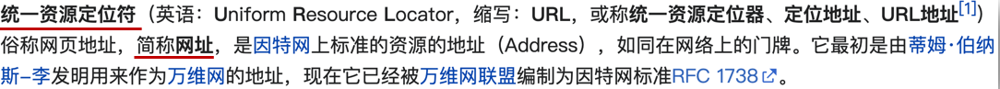

3. URL 的组成?

   * 协议，域名，资源路径（URL 组成有很多部分，我们先掌握这3个重要的部分即可）

     

     

4. 什么是 http 协议 ?

   * 叫超文本传输协议，规定了浏览器和服务器传递数据的格式（而格式具体有哪些稍后我们就会学到）

     

5. 什么是域名 ?

   * 标记服务器在互联网当中的方位，网络中有很多服务器，你想访问哪一台，就需要知道它的域名才可以

     

6. 什么是资源路径 ?

   * 一个服务器内有多个资源，用于标识你要访问的资源具体的位置

     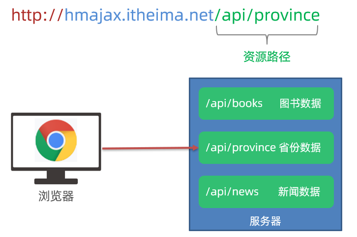

7. 接下来做个需求，访问新闻列表的 URL 网址，打印新闻数据

   * 效果图如下：

   

   > 新闻列表数据 URL 网址：http://hmajax.itheima.net/api/news

   ```js
   axios({
     url: 'http://hmajax.itheima.net/api/news'
   }).then(result => {
     console.log(result)
   })
   ```

   > url解释：从黑马服务器使用http协议，访问/api/news路径下的新闻列表资源


###  小结

1. URL 是什么？

   <details>
   <summary>答案</summary>
   <ul>
   <li>统一资源定位符，网址，用于访问服务器上资源
   </li>
   </ul>
   </details>


2. 请解释这个 URL，每个部分作用？

   http://hmajax.itheima.net/api/news

   <details>
   <summary>答案</summary>
   <ul>
   <li>协议://域名/资源路径
   </li>
   </ul>
   </details>


## 03.URL 查询参数

### 目标

掌握-通过URL传递查询参数，获取匹配的数据


### 讲解

1. 什么是查询参数 ?

   * 携带给服务器额外信息，让服务器返回我想要的某一部分数据而不是全部数据
   * 举例：查询河北省下属的城市列表，需要先把河北省传递给服务器

     

2. 查询参数的语法 ？

   * 在 url 网址后面用?拼接格式：http://xxxx.com/xxx/xxx?参数名1=值1&参数名2=值2
   * 参数名一般是后端规定的，值前端看情况传递即可

3. axios 如何携带查询参数?

   * 使用 params 选项即可

     ```js
     axios({
       url: '目标资源地址',
       params: {
         参数名: 值
       }
     }).then(result => {
       // 对服务器返回的数据做后续处理
     })
     ```
     
     > 查询城市列表的 url地址：[http://hmajax.itheima.net/api/city](http://hmajax.itheima.net/api/city?pname=河北省)
     >
     > 参数名：pname （值要携带省份名字）

4. 需求：获取“河北省”下属的城市列表，展示到页面，对应代码：

   ```html
   <!DOCTYPE html>
   <html lang="en">
   <head>
     <meta charset="UTF-8">
     <meta http-equiv="X-UA-Compatible" content="IE=edge">
     <meta name="viewport" content="width=device-width, initial-scale=1.0">
     <title>查询参数</title>
   </head>
   <body>
     <!-- 
       城市列表: http://hmajax.itheima.net/api/city
       参数名: pname
       值: 省份名字
     -->
     <p></p>
     <script src="https://cdn.jsdelivr.net/npm/axios/dist/axios.min.js"></script>
     <script>
       axios({
         url: 'http://hmajax.itheima.net/api/city',
         // 查询参数
         params: {
           pname: '辽宁省'
         }
       }).then(result => {
         console.log(result.data.list)
         document.querySelector('p').innerHTML = result.data.list.join('<br>')
       })
     </script>
   </body>
   </html>
   ```

   

###  小结

1. URL 查询参数有什么用？

   <details>
   <summary>答案</summary>
   <ul>
   <li>浏览器提供给服务器额外信息，获取对应的数据
   </li>
   </ul>
   </details>


2. axios 要如何携带查询参数？

   <details>
   <summary>答案</summary>
   <ul>
   <li>使用 params 选项，携带参数名和值在对象结构中
   </li>
   </ul>
   </details>


## 04.案例-查询-地区列表

### 目标

巩固查询参数的使用，并查看多对查询参数如何传递


### 讲解

1. 需求：根据输入的省份名字和城市名字，查询下属地区列表

   * 完成效果如下：

     

   * 相关参数

     > 查询地区: http://hmajax.itheima.net/api/area
     >
     > 参数名：
     >
     > pname：省份名字
     >
     > cname：城市名字

   

2. 正确代码如下：

   ```js
   /*
         获取地区列表: http://hmajax.itheima.net/api/area
         查询参数:
           pname: 省份或直辖市名字
           cname: 城市名字
       */
   // 目标: 根据省份和城市名字, 查询地区列表
   // 1. 查询按钮-点击事件
   document.querySelector('.sel-btn').addEventListener('click', () => {
       // 2. 获取省份和城市名字
       let pname = document.querySelector('.province').value
       let cname = document.querySelector('.city').value
   
       // 3. 基于axios请求地区列表数据
       axios({
           url: 'http://hmajax.itheima.net/api/area',
           params: {
               pname,
               cname
           }
       }).then(result => {
           // console.log(result)
           // 4. 把数据转li标签插入到页面上
           let list = result.data.list
           console.log(list)
           let theLi = list.map(areaName => `<li class="list-group-item">${areaName}</li>`).join('')
           console.log(theLi)
           document.querySelector('.list-group').innerHTML = theLi
       })
   })
   ```

   

###  小结

1. ES6 对象属性和值简写的前提是什么？

   <details>
   <summary>答案</summary>
   <ul>
   <li>当属性名和value位置变量名同名即可简写
   </li>
   </ul>
   </details>


## 05.常用请求方法和数据提交

### 目标

掌握如何向服务器提交数据，而不单单是获取数据


### 讲解

1. 想要提交数据，先来了解什么是请求方法

   * 请求方法是一些固定单词的英文，例如：GET，POST，PUT，DELETE，PATCH（这些都是http协议规定的），每个单词对应一种对服务器资源要执行的操作

     

     

   * 前面我们获取数据其实用的就是GET请求方法，但是axios内部设置了默认请求方法就是GET，我们就没有写

   * 但是提交数据需要使用POST请求方法

2. 什么时候进行数据提交呢？

   * 例如：多端要查看同一份订单数据，或者使用同一个账号进行登录，那订单/用户名+密码，就需要保存在服务器上，随时随地进行访问

     

     

3. axios 如何提交数据到服务器呢？

   * 需要学习，method 和 data 这2个新的选项了（大家不用担心，这2个学完，axios常用的选项就都学完了）

     ```js
     axios({
       url: '目标资源地址',
       method: '请求方法',
       data: {
         参数名: 值
       }
     }).then(result => {
       // 对服务器返回的数据做后续处理
     })
     ```
     
     

4. 需求：注册账号，提交用户名和密码到服务器保存

   > 注册用户 URL 网址：http://hmajax.itheima.net/api/register
   >
   > 请求方法：POST
   >
   > 参数名：
   >
   > username：用户名（要求中英文和数字组成，最少8位）
   >
   > password：密码（最少6位）

   

5. 正确代码如下：

   ```js
   /*
     注册用户：http://hmajax.itheima.net/api/register
     请求方法：POST
     参数名：
       username：用户名（中英文和数字组成，最少8位）
       password：密码  （最少6位）
   
     目标：点击按钮，通过axios提交用户和密码，完成注册
   */
   document.querySelector('.btn').addEventListener('click', () => {
     axios({
       url: 'http://hmajax.itheima.net/api/register',
       method: 'POST',
       data: {
         username: 'itheima007',
         password: '7654321'
       }
     })
   })
   ```

   


###  小结

1. 请求方法最常用的是哪2个，分别有什么作用？

   <details>
   <summary>答案</summary>
   <ul>
   <li>POST 提交数据，GET 查询数据
   </li>
   </ul>
   </details>

2. axios 的核心配置项？

   <details>
   <summary>答案</summary>
   <ul>
   <li>url：目标资源地址，method：请求方法，params：查询参数，data：提交的数据
   </li>
   </ul>
   </details>


## 06.axios 错误处理

### 目标

掌握接收 axios 响应错误信息的处理语法


### 讲解

1. 如果注册相同的用户名，则会遇到注册失败的请求，也就是 axios 请求响应失败了，你会在控制台看到如图的错误：

   

2. 在 axios 语法中要如何处理呢？

   * 因为，普通用户不会去控制台里看错误信息，我们要编写代码拿到错误并展示给用户在页面上

3. 使用 axios 的 catch 方法，捕获这次请求响应的错误并做后续处理，语法如下：

   ```js
   axios({
     // ...请求选项
   }).then(result => {
     // 处理成功数据
   }).catch(error => {
     // 处理失败错误
   })
   ```

4. 需求：再次重复注册相同用户名，提示用户注册失败的原因

   

   

5. 对应代码

   ```js
   document.querySelector('.btn').addEventListener('click', () => {
       axios({
         url: 'http://hmajax.itheima.net/api/register',
         method: 'post',
         data: {
           username: 'itheima007',
           password: '7654321'
         }
       }).then(result => {
         // 成功
         console.log(result)
       }).catch(error => {
         // 失败
         // 处理错误信息
         console.log(error)
         console.log(error.response.data.message)
         alert(error.response.data.message)
       })
   })
   ```


###  小结

1. axios 如何拿到请求响应失败的信息？

   <details>
   <summary>答案</summary>
   <ul>
   <li>通过 axios 函数调用后，在后面接着调用 .catch 方法捕获
   </li>
   </ul>
   </details>


## 07.HTTP 协议-请求报文

### 目标

了解 HTTP 协议中，请求报文的组成和作用


### 讲解

1. 首先，HTTP 协议规定了浏览器和服务器返回内容的<span style="color: red;">格式</span>

2. 请求报文：是浏览器按照协议规定发送给服务器的内容，例如刚刚注册用户时，发起的请求报文：

   

   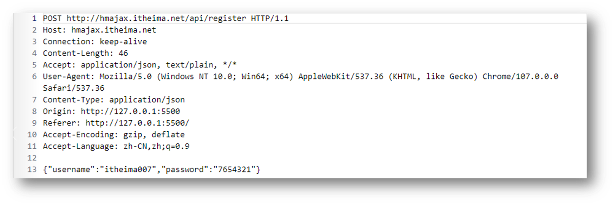

3. 这里的格式包含：

   * 请求行：请求方法，URL，协议
   * 请求头：以键值对的格式携带的附加信息，比如：Content-Type（指定了本次传递的内容类型）
   * 空行：分割请求头，空行之后的是发送给服务器的资源
   * 请求体：发送的资源

4. 我们切换到浏览器中，来看看刚才注册用户发送的这个请求报文以及内容去哪里查看呢

5. 代码：直接在上个代码基础上复制，然后运行查看请求报文对应关系即可


### 小结

1. 浏览器发送给服务器的内容叫做，请求报文

2. 请求报文的组成是什么？

   <details>
   <summary>答案</summary>
   <ul>
   <li>请求行，请求头，空行，请求体
   </li>
   </ul>
   </details>

3. 通过 Chrome 的网络面板如何查看请求体？

   


## 08.请求报文-错误排查

### 目标

了解学习了查看请求报文之后的作用，可以用来辅助错误排查


### 讲解

1. 学习了查看请求报文有什么用呢？
   * 可以用来确认我们代码发送的请求数据是否真的正确
2. 配套模板代码里，对应 08 标题文件夹里是我同桌的代码，它把登录也写完了，但是无法登录，我们来到模板代码中，找到运行后，在<span style="color: red;">不逐行查看代码的情况下</span>，查看请求报文，看看它登录提交的相关信息对不对，帮他找找问题出现的原因
3. 发现请求体数据有问题，往代码中定位，找到类名写错误了
4. 代码：在配套文件夹素材里，找到需要对应代码，直接运行，根据报错信息，找到错误原因


### 小结

1. 学会了查看请求报文，对实际开发有什么帮助呢？

   <details>
   <summary>答案</summary>
   <ul>
   <li>可以快速确认我们发送的内容是否正确
   </li>
   </ul>
   </details>


## 09.HTTP 协议-响应报文

### 目标

了解响应报文的组成


### 讲解

1. 响应报文：是服务器按照协议固定的格式，返回给浏览器的内容

   

   

2. 响应报文的组成：

   * 响应行（状态行）：协议，HTTP响应状态码，状态信息
   * 响应头：以键值对的格式携带的附加信息，比如：Content-Type（告诉浏览器，本次返回的内容类型）
   * 空行：分割响应头，控制之后的是服务器返回的资源
   * 响应体：返回的资源

3. HTTP 响应状态码：

   * 用来表明请求是否成功完成

   * 例如：404（客户端要找的资源，在服务器上不存在）

     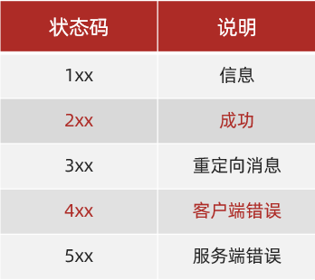


### 小结

1. 响应报文的组成？

   <details>
   <summary>答案</summary>
   <ul>
   <li>响应行，响应头，空行，响应体
   </li>
   </ul>
   </details>

2. HTTP 响应状态码是做什么的？

   <details>
   <summary>答案</summary>
   <ul>
   <li>表明请求是否成功完成，2xx都是成功的
   </li>
   </ul>
   </details>


## 10.接口文档

### 目标

掌握接口文档的使用，配合 axios 与服务器进行数据交互


### 讲解

1. 接口文档：描述接口的文章（一般是后端工程师，编写和提供）
2. 接口：指的使用 AJAX 和 服务器通讯时，使用的 URL，请求方法，以及参数，例如：[AJAX阶段接口文档](https://apifox.com/apidoc/shared-1b0dd84f-faa8-435d-b355-5a8a329e34a8)
3. 例如：获取城市列表接口样子

   
4. 需求：打开 AJAX 阶段接口文档，查看登录接口，并编写代码，完成一次登录的效果吧
5. 代码如下：

   ```js
   document.querySelector('.btn').addEventListener('click', () => {
     // 用户登录
     axios({
       url: 'http://hmajax.itheima.net/api/login',
       method: 'post',
       data: {
         username: 'itheima007',
         password: '7654321'
       }
     })
   })
   ```

   


### 小结

1. 接口文档是什么？

   <details>
   <summary>答案</summary>
   <ul>
   <li>由后端提供的描述接口的文章
   </li>
   </ul>
   </details>

2. 接口文档里包含什么？

   <details>
   <summary>答案</summary>
   <ul>
   <li>请求的 URL 网址，请求方法，请求参数和说明
   </li>
   </ul>
   </details>


## 11.案例-用户登录-主要业务

### 目标

尝试通过页面获取用户名和密码，进行登录


### 讲解

1. 先来到备课代码中，运行完成的页面，查看要完成的登录效果（登录成功和失败）

2. 需求：编写代码，查看接口文档，填写相关信息，完成登录业务

2. 分析实现的步骤
   
   1. 点击登录，获取并判断用户名和长度
   
   2. 提交数据和服务器通信
   
   3. 提示信息，反馈给用户（这节课先来完成前 2 个步骤）
   
      
   
4. 代码如下：

   ```js
   // 目标1：点击登录时，用户名和密码长度判断，并提交数据和服务器通信
   
   // 1.1 登录-点击事件
   document.querySelector('.btn-login').addEventListener('click', () => {
     // 1.2 获取用户名和密码
     const username = document.querySelector('.username').value
     const password = document.querySelector('.password').value
     // console.log(username, password)
   
     // 1.3 判断长度
     if (username.length < 8) {
       console.log('用户名必须大于等于8位')
       return // 阻止代码继续执行
     }
     if (password.length < 6) {
       console.log('密码必须大于等于6位')
       return // 阻止代码继续执行
     }
   
     // 1.4 基于axios提交用户名和密码
     // console.log('提交数据到服务器')
     axios({
       url: 'http://hmajax.itheima.net/api/login',
       method: 'POST',
       data: {
         username,
         password
       }
     }).then(result => {
       console.log(result)
       console.log(result.data.message)
     }).catch(error => {
       console.log(error)
       console.log(error.response.data.message)
     })
   })
   ```


### 小结

1. 总结下用户登录案例的思路？

   <details>
   <summary>答案</summary>
   <ul>
   <li>1. 登录按钮-绑定点击事件
   2. 从页面输入框里，获取用户名和密码
   3. 判断长度是否符合要求
   4. 基于 axios 提交用户名和密码
   </li>
   </ul>
   </details>


## 12.案例-用户登录-提示信息

### 目标

根据准备好的提示标签和样式，给用户反馈提示


### 讲解

1. 需求：使用提前准备好的提示框，来把登录成功/失败结果提示给用户

   

   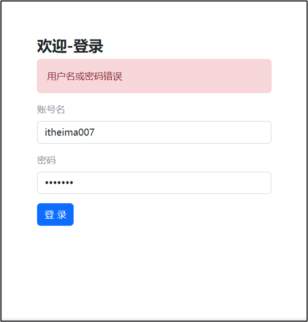

   

2. 使用提示框，反馈提示消息，因为有4处地方需要提示框，所以封装成函数

   1. 获取提示框

   2. 封装提示框函数，重复调用，满足提示需求

      功能：

      1. 显示提示框
      2. 不同提示文字msg，和成功绿色失败红色isSuccess参数（true成功，false失败）
      3. 过2秒后，让提示框自动消失

3. 对应提示框核心代码：

   ```js
   /**
    * 2.2 封装提示框函数，重复调用，满足提示需求
    * 功能：
    * 1. 显示提示框
    * 2. 不同提示文字msg，和成功绿色失败红色isSuccess（true成功，false失败）
    * 3. 过2秒后，让提示框自动消失
   */
   function alertFn(msg, isSuccess) {
     // 1> 显示提示框
     myAlert.classList.add('show')
   
     // 2> 实现细节
     myAlert.innerText = msg
     const bgStyle = isSuccess ? 'alert-success' : 'alert-danger'
     myAlert.classList.add(bgStyle)
   
     // 3> 过2秒隐藏
     setTimeout(() => {
       myAlert.classList.remove('show')
       // 提示：避免类名冲突，重置背景色
       myAlert.classList.remove(bgStyle)
     }, 2000)
   }
   ```


### 小结

1. 我们什么时候需要封装函数？

   <details>
   <summary>答案</summary>
   <ul>
   <li>遇到相同逻辑，重复代码要复用的时候
   </li>
   </ul>
   </details>

2. 如何封装一个函数呢？

   <details>
   <summary>答案</summary>
   <ul>
   <li>先明确要完成的需求，以及需要的参数，再来实现其中的细节，然后在需要的地方调用
   </li>
   </ul>
   </details>

3. 我们的提示框是如何控制出现/隐藏的？

   <details>
   <summary>答案</summary>
   <ul>
   <li>添加或移除显示的类名即可
   </li>
   </ul>
   </details>


## 13.form-serialize 插件

### 目标

使用 form-serialize 插件，快速收集目标表单范围内表单元素的值


### 讲解

1. 我们前面收集表单元素的值，是一个个标签获取的

   

2. 如果一套表单里有很多很多表单元素，如何一次性快速收集出来呢？

   

3. 使用 form-serialize 插件提供的 serialize 函数就可以办到

4. form-serialize 插件语法：

   1. 引入 form-serialize 插件到自己网页中

   2. 使用 serialize 函数

      * 参数1：要获取的 form 表单标签对象（要求表单元素需要有 name 属性-用来作为收集的数据中属性名）

      * 参数2：配置对象
        * hash：
          * true - 收集出来的是一个 JS 对象结构
          * false - 收集出来的是一个查询字符串格式
        * empty：
          * true - 收集空值
          * false - 不收集空值

5. 需求：收集登录表单里用户名和密码

6. 对应代码：

   ```html
   <!DOCTYPE html>
   <html lang="en">
   
   <head>
     <meta charset="UTF-8">
     <meta http-equiv="X-UA-Compatible" content="IE=edge">
     <meta name="viewport" content="width=device-width, initial-scale=1.0">
     <title>form-serialize插件使用</title>
   </head>
   
   <body>
     <form action="javascript:;" class="example-form">
       <input type="text" name="username">
       <br>
       <input type="text" name="password">
       <br>
       <input type="button" class="btn" value="提交">
     </form>
     <!-- 
       目标：在点击提交时，使用form-serialize插件，快速收集表单元素值
       1. 把插件引入到自己网页中
     -->
     <script src="./lib/form-serialize.js"></script>
     <script>
       document.querySelector('.btn').addEventListener('click', () => {
         /**
          * 2. 使用serialize函数，快速收集表单元素的值
          * 参数1：要获取哪个表单的数据
          *  表单元素设置name属性，值会作为对象的属性名
          *  建议name属性的值，最好和接口文档参数名一致
          * 参数2：配置对象
          *  hash 设置获取数据结构
          *    - true：JS对象（推荐）一般请求体里提交给服务器
          *    - false: 查询字符串
          *  empty 设置是否获取空值
          *    - true: 获取空值（推荐）数据结构和标签结构一致
          *    - false：不获取空值
         */
         const form = document.querySelector('.example-form')
         const data = serialize(form, { hash: true, empty: true })
         // const data = serialize(form, { hash: false, empty: true })
         // const data = serialize(form, { hash: true, empty: false })
         console.log(data)
       })
     </script>
   </body>
   
   </html>
   ```


### 小结

1. 我们什么时候使用 form-serialize 插件？

   <details>
   <summary>答案</summary>
   <ul>
   <li>快速收集表单元素的值</li>
   </ul>
   </details>

2. 如何使用 form-serialize 插件？

   <details>
   <summary>答案</summary>
   <ul>
   <li>1. 先引入插件到自己的网页中，2. 准备form和表单元素的name属性，3.使用serialize函数，传入form表单和配置对象
   </li>
   </ul>
   </details>

3. 配置对象中 hash 和 empty 有什么用？

   <details>
   <summary>答案</summary>
   <ul>
   <li>hash 决定是收集为 JS 对象还是查询参数字符串，empty 决定是否收集空值
   </li>
   </ul>
   </details>


## 14.案例-用户登录-form-serialize

### 目标

尝试通过 form-serialize 重新修改用户登录案例-收集用户名和密码


### 讲解

1. 基于模板代码，使用 form-serialize 插件来收集用户名和密码
2. 在原来的代码基础上修改即可

   1. 先引入插件

      ```html
      <!-- 3.1 引入插件 -->
      <script src="./lib/form-serialize.js"></script>
      ```

   2. 然后修改代码

      ```js
      // 3.2 使用serialize函数，收集登录表单里用户名和密码
      const form = document.querySelector('.login-form')
      const data = serialize(form, { hash: true, empty: true })
      console.log(data)
      // {username: 'itheima007', password: '7654321'}
      const { username, password } = data
      ```


### 小结

1. 如何把一个第三方插件使用在已完成的案例中？

   <details>
   <summary>答案</summary>
   <ul>
   <li>引入后，只需要使用在要修改的地方，修改一点就要确认测试一下
   </li>
   </ul>
   </details>


## 今日重点(必须会)

1. axios 的配置项有哪几个，作用分别是什么？
2. 接口文档都包含哪些信息？
3. 在浏览器中如何查看查询参数/请求体，以及响应体数据？
4. 请求报文和响应报文由几个部分组成，每个部分的作用？


## 今日作业(必完成)

参考作业文件夹的md要求


## 参考文献

1. [客户端->百度百科](https://baike.baidu.com/item/%E5%AE%A2%E6%88%B7%E7%AB%AF/101081?fr=aladdin)
2. [浏览器解释->百度百科](https://baike.baidu.com/item/%E6%B5%8F%E8%A7%88%E5%99%A8/213911?fr=aladdin)
3. [服务器解释->百度百科](https://baike.baidu.com/item/%E6%9C%8D%E5%8A%A1%E5%99%A8/100571?fr=aladdin)
4. [url解释->百度百科](https://baike.baidu.com/item/%E7%BB%9F%E4%B8%80%E8%B5%84%E6%BA%90%E5%AE%9A%E4%BD%8D%E7%B3%BB%E7%BB%9F/5937042?fromtitle=URL&fromid=110640&fr=aladdin)
5. [http协议->百度百科](https://baike.baidu.com/item/HTTP?fromtitle=HTTP%E5%8D%8F%E8%AE%AE&fromid=1276942)
6. [主机名->百度百科](https://baike.baidu.com/item/%E4%B8%BB%E6%9C%BA%E5%90%8D)
7. [端口号->百度百科](https://baike.baidu.com/item/%E7%AB%AF%E5%8F%A3%E5%8F%B)
8. [Ajax解释->百度-懂啦](https://baike.baidu.com/tashuo/browse/content?id=11fca6ecdc2c066af4c5594f&lemmaId=8425&fromLemmaModule=pcBottom&lemmaTitle=ajax)
9. [Ajax解释->MDN解释Ajax是与服务器通信而不只是请求](https://developer.mozilla.org/zh-CN/docs/Web/Guide/AJAX/Getting_Started)
10. [axios->百度(可以点击播报听读音)](https://baike.baidu.com/item/axios)
11. [axios(github)地址](https://github.com/axios/axios)
12. [axios官方推荐官网](https://axios-http.com/)
13. [axios(npmjs)地址](https://www.npmjs.com/package/axios)
14. [GET和POST区别->百度百科](https://baike.baidu.com/item/post/2171305)
15. [报文讲解->百度百科](https://baike.baidu.com/item/%E6%8A%A5%E6%96%87/3164352)
16. [HTTP状态码->百度百科](https://baike.baidu.com/item/HTTP%E7%8A%B6%E6%80%81%E7%A0%81/5053660)
17. [接口概念->百度百科](https://baike.baidu.com/item/%E6%8E%A5%E5%8F%A3/2886384)

# Day02_AJAX综合案例


## 知识点自测

1. 以下代码运行结果是什么？（考察扩展运算符的使用）

   ```js
   const result = {
     name: '老李',
     age: 18
   }
   const obj = {
     ...result
   }
   console.log(obj.age)
   ```
   
   A：报错
   
   B：18
   
   <details>
   <summary>答案</summary>
   <ul>
   <li>B正确</li>
   </ul>
   </details>


2. 什么是事件委托？

   A：只能把单击事件委托给父元素绑定

   B：可以把能冒泡的事件，委托给已存在的向上的任意标签元素绑定

   <details>
   <summary>答案</summary>
   <ul>
   <li>B正确</li>
   </ul>
   </details>


3. 事件对象e.target作用是什么?

   A：获取到这次触发事件相关的信息

   B：获取到这次触发事件目标标签元素

   <details>
   <summary>答案</summary>
   <ul>
   <li>B正确</li>
   </ul>
   </details>


4. 如果获取绑定在标签上自定义属性的值10？

   ```html
   <div data-code="10">西游记</div>
   ```
   
   A：div标签对象.innerHTML
   
   B：div标签对象.dataset.code
   
   C：div标签对象.code
   
   <details>
   <summary>答案</summary>
   <ul>
   <li>B正确</li>
   </ul>
   </details>


5. 哪个方法可以判断目标标签是否包含指定的类名?

   ```html
   <div class="my-div title info"></div>
   ```
   
   A: div标签对象.className === 'title'
   
   B: div标签对象.classList.contains('title')
   
   <details>
   <summary>答案</summary>
   <ul>
   <li>B正确</li>
   </ul>
   </details>


6. 伪数组取值哪种方式是正确的?

   ```js
   let obj = { 0: '老李', 1: '老刘' }
   ```
   
   A: obj.0
   
   B: obj[0]
   
   <details>
   <summary>答案</summary>
   <ul>
   <li>B正确</li>
   </ul>
   </details>


7. 以下哪个选项可以，往本地存储键为‘bgImg’，值为图片url网址的代码

   A：localStorage.setItem('bgImg')

   B：localStorage.getItem('bgImg')

   C：localStorage.setItem('bgImg', '图片url网址')

   D：localStorage.getItem('bgImg', '图片url网址')

   <details>
   <summary>答案</summary>
   <ul>
   <li>C正确</li>
   </ul>
   </details>


8. 以下代码运行结果是？

   ```js
   const obj = {
     username: '老李',
     age: 18,
     sex: '男'
   }
   Object.keys(obj)
   ```

   A：代码报错

   B：[username, age, sex]

   C：["username", "age", "sex"]

   D：["老李", 18, "男"]

   <details>
   <summary>答案</summary>
   <ul>
   <li>C正确</li>
   </ul>
   </details>


9. 下面哪个选项可以把数字字符串转成数字类型？

   A：+’10‘

   B：’10‘ + 0

   <details>
   <summary>答案</summary>
   <ul>
   <li>A正确</li>
   </ul>
   </details>


10. 以下代码运行后的结果是什么？（考察逻辑与的短路特性）

    ```js
    const age = 18
    const result1 = (age || '有年龄')
    
    const sex = ''
    const result2 = sex || '没有性别'
    ```

    A：报错，报错

    B：18，没有性别

    C：有年龄，没有性别

    D：18，’‘

    <details>
    <summary>答案</summary>
    <ul>
    <li>B正确</li>
    </ul>
    </details>
    
    


## 目录

* 案例-图书管理
* 图片上传
* 案例-网站换肤
* 案例-个人信息设置


## 学习目标

> 今天主要就是练，巩固 axios 的使用

1. 完成案例-图书管理系统（增删改查）经典业务
2. 掌握图片上传的思路
3. 完成案例-网站换肤并实现图片地址缓存
4. 完成案例-个人信息设置


## 01.案例_图书管理-介绍

### 目标

案例-图书管理-介绍（介绍要完成的效果和练习到的思维）


### 讲解

1. 打开备课代码运行图书管理案例效果-介绍要完成的增删改查业务效果和 Bootstrap 弹框使用

   

   
2. 分析步骤和对应的视频模块
   * 先学习 Bootstrap 弹框的使用（因为添加图书和编辑图书需要这个窗口来承载图书表单）
   * 先做渲染图书列表（这样做添加和编辑以及删除可以看到数据变化，所以先做渲染）
   * 再做新增图书功能
   * 再做删除图书功能
   * 再做编辑图书功能（注意：编辑和新增图书是2套弹框-后续做项目我们再用同1个弹框）


### 小结

1. 做完这个案例我们将会有什么收获呢?

   <details>
   <summary>答案</summary>
   <ul>
   <li>掌握前端经典增删改查的业务和思路，对以后开发很有帮助</li>
   </ul>
   </details>


## 02.Bootstrap 弹框_属性控制

### 目标

使用属性方式控制 Bootstarp 弹框的显示和隐藏


### 讲解

1. 什么是 Bootstrap 弹框？

   * 不离开当前页面，显示单独内容，供用户操作

     

2. 需求：使用 Bootstrap 弹框，先做个简单效果，点击按钮，让弹框出现，点击 X 和 Close 让弹框隐藏

   

3. 如何使用 Bootstrap 弹框呢？

   1. 先引入 bootstrap.css 和 bootstrap.js 到自己网页中

   2. 准备弹框标签，确认结构（可以从 Bootstrap 官方文档的 Modal 里复制基础例子）- 运行到网页后，逐一对应标签和弹框每个部分对应关系

   3. 通过自定义属性，通知弹框的显示和隐藏，语法如下：

      ```html
      <button data-bs-toggle="modal" data-bs-target="css选择器">
        显示弹框
      </button>
      
      <button data-bs-dismiss="modal">Close</button>
      ```

      

4. 去代码区实现一下

   ```html
   <!DOCTYPE html>
   <html lang="en">
   
   <head>
     <meta charset="UTF-8">
     <meta http-equiv="X-UA-Compatible" content="IE=edge">
     <meta name="viewport" content="width=device-width, initial-scale=1.0">
     <title>Bootstrap 弹框</title>
     <!-- 引入bootstrap.css -->
     <link href="https://cdn.jsdelivr.net/npm/bootstrap@5.2.2/dist/css/bootstrap.min.css" rel="stylesheet">
   </head>
   
   <body>
     <!-- 
       目标：使用Bootstrap弹框
       1. 引入bootstrap.css 和 bootstrap.js
       2. 准备弹框标签，确认结构
       3. 通过自定义属性，控制弹框的显示和隐藏
      -->
     <button type="button" class="btn btn-primary" data-bs-toggle="modal" data-bs-target=".my-box">
       显示弹框
     </button>
   
     <!-- 
       弹框标签
       bootstrap的modal弹框，添加modal类名（默认隐藏）
      -->
     <div class="modal my-box" tabindex="-1">
       <div class="modal-dialog">
         <!-- 弹框-内容 -->
         <div class="modal-content">
           <!-- 弹框-头部 -->
           <div class="modal-header">
             <h5 class="modal-title">Modal title</h5>
             <button type="button" class="btn-close" data-bs-dismiss="modal" aria-label="Close"></button>
           </div>
           <!-- 弹框-身体 -->
           <div class="modal-body">
             <p>Modal body text goes here.</p>
           </div>
           <!-- 弹框-底部 -->
           <div class="modal-footer">
             <button type="button" class="btn btn-secondary" data-bs-dismiss="modal">Close</button>
             <button type="button" class="btn btn-primary">Save changes</button>
           </div>
         </div>
       </div>
     </div>
   
     <!-- 引入bootstrap.js -->
     <script src="https://cdn.jsdelivr.net/npm/bootstrap@5.2.2/dist/js/bootstrap.min.js"></script>
   </body>
   
   </html>
   ```

   


### 小结

1. 用哪个属性绑定来控制弹框显示呢?

   <details>
   <summary>答案</summary>
   <ul>
   <li>data-bs-toggle和data-bs-target</li>
   </ul>
   </details>

2. 用哪个属性来控制隐藏弹框呢？

   <details>
   <summary>答案</summary>
   <ul>
   <li>data-bs-dismiss 关闭的是标签所在的当前提示框</li>
   </ul>
   </details>


## 03.Bootstrap 弹框_JS控制

### 目标

使用 JS 方式控制 Bootstarp 弹框的显示和隐藏


### 讲解

1. 为什么需要 JS 方式控制呢？

   * 当我显示之前，隐藏之前，需要执行一些 JS 逻辑代码，就需要引入 JS 控制弹框显示/隐藏的方式了

   * 例如：

     * 点击编辑姓名按钮，在弹框显示之前，在输入框填入默认姓名
     * 点击保存按钮，在弹框隐藏之前，获取用户填入的名字并打印

     

   

2. 所以在现实和隐藏之前，需要执行 JS 代码逻辑，就使用 JS 方式 控制 Bootstrap 弹框显示和隐藏

   语法如下：

   ```js
   // 创建弹框对象
   const modalDom = document.querySelector('css选择器')
   const modal = new bootstrap.Modal(modelDom)
   
   // 显示弹框
   modal.show()
   // 隐藏弹框
   modal.hide()
   ```

   

3. 去代码区实现一下

   ```js
   // 1. 创建弹框对象
   const modalDom = document.querySelector('.name-box')
   const modal = new bootstrap.Modal(modalDom)
   
   // 编辑姓名->点击->赋予默认姓名->弹框显示
   document.querySelector('.edit-btn').addEventListener('click', () => {
     document.querySelector('.username').value = '默认姓名'
   
     // 2. 显示弹框
     modal.show()
   })
   
   // 保存->点击->->获取姓名打印->弹框隐藏
   document.querySelector('.save-btn').addEventListener('click', () => {
     const username = document.querySelector('.username').value
     console.log('模拟把姓名保存到服务器上', username)
   
     // 2. 隐藏弹框
     modal.hide()
   })
   ```


### 小结

1. 什么时候用属性控制，什么时候用 JS 控制 Bootstrap 弹框的显示/隐藏?

   <details>
   <summary>答案</summary>
   <ul>
   <li>直接出现/隐藏用属性方式控制，如果需要先执行一段 JS 逻辑再显示/隐藏就用 JS 方式控制</li>
   </ul>
   </details>


## 04.案例_图书管理\_渲染列表

### 目标

完成图书管理案例-图书列表数据渲染效果


### 讲解

1. 需求：基于 axios 获取到图书列表数据，并用 JS 代码渲染数据，到准备好的模板标签中

   

2. 步骤：

   1. 获取数据

   2. 渲染数据

      

      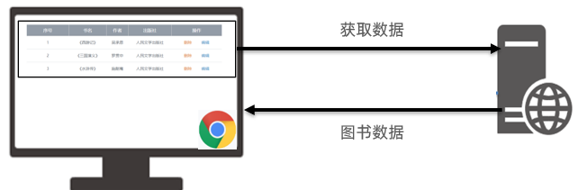

3. 获取数据的时候，需要给自己起一个外号，为什么需要给自己起一个外号呢？

   * 我们所有人数据都来自同一个服务器上，为了区分每个同学不同的数据，需要大家设置一个外号告诉服务器，服务器就会返回你对应的图书数据了

   

4. 核心代码如下：

   > 因为默认展示列表，新增，修改，删除后都要重新获取并刷新列表，所以把获取数据渲染数据的代码封装在一个函数内，方便复用

   ```js
   /**
    * 目标1：渲染图书列表
    *  1.1 获取数据
    *  1.2 渲染数据
    */
   const creator = '老张'
   // 封装-获取并渲染图书列表函数
   function getBooksList() {
     // 1.1 获取数据
     axios({
       url: 'http://hmajax.itheima.net/api/books',
       params: {
         // 外号：获取对应数据
         creator
       }
     }).then(result => {
       // console.log(result)
       const bookList = result.data.data
       // console.log(bookList)
       // 1.2 渲染数据
       const htmlStr = bookList.map((item, index) => {
         return `<tr>
         <td>${index + 1}</td>
         <td>${item.bookname}</td>
         <td>${item.author}</td>
         <td>${item.publisher}</td>
         <td data-id=${item.id}>
           <span class="del">删除</span>
           <span class="edit">编辑</span>
         </td>
       </tr>`
       }).join('')
       // console.log(htmlStr)
       document.querySelector('.list').innerHTML = htmlStr
     })
   }
   // 网页加载运行，获取并渲染列表一次
   getBooksList()
   ```

   

   


### 小结

1. 渲染数据列表的2个步骤是什么？

   <details>
   <summary>答案</summary>
   <ul>
   <li>获取数据，分析结构渲染到页面上</li>
   </ul>
   </details>


## 05.案例_图书管理\_新增图书

### 目标

完成图书管理案例-新增图书需求


### 讲解

1. 需求：点击添加按钮，出现准备好的新增图书弹框，填写图书信息提交到服务器保存，并更新图书列表

   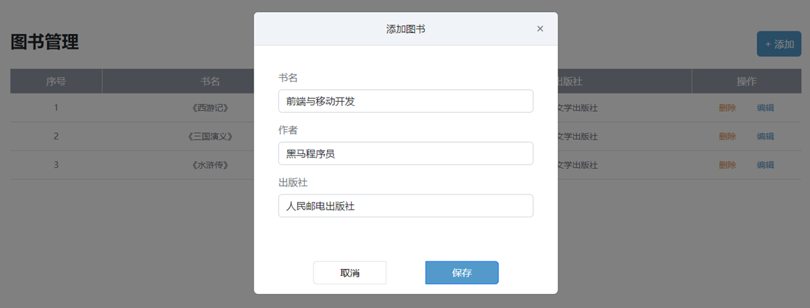

   

2. 步骤：

   1. 新增弹框（控制显示和隐藏）（基于 Bootstrap 弹框和准备好的表单-用属性和 JS 方式控制）

   2. 在点击保存按钮时，收集数据&提交保存

   3. 刷新-图书列表）（重新调用下之前封装的获取并渲染列表的函数）

      

3. 核心代码如下：

   ```js
   /**
    * 目标2：新增图书
    *  2.1 新增弹框->显示和隐藏
    *  2.2 收集表单数据，并提交到服务器保存
    *  2.3 刷新图书列表
    */
   // 2.1 创建弹框对象
   const addModalDom = document.querySelector('.add-modal')
   const addModal = new bootstrap.Modal(addModalDom)
   // 保存按钮->点击->隐藏弹框
   document.querySelector('.add-btn').addEventListener('click', () => {
     // 2.2 收集表单数据，并提交到服务器保存
     const addForm = document.querySelector('.add-form')
     const bookObj = serialize(addForm, { hash: true, empty: true })
     // console.log(bookObj)
     // 提交到服务器
     axios({
       url: 'http://hmajax.itheima.net/api/books',
       method: 'POST',
       data: {
         ...bookObj,
         creator
       }
     }).then(result => {
       // console.log(result)
       // 2.3 添加成功后，重新请求并渲染图书列表
       getBooksList()
       // 重置表单
       addForm.reset()
       // 隐藏弹框
       addModal.hide()
     })
   })
   ```

   


### 小结

1. 新增数据的3个步骤是什么？

   <details>
   <summary>答案</summary>
   <ul>
   <li>准备好数据标签和样式，然后收集表单数据提交保存，刷新列表</li>
   </ul>
   </details>


## 06.案例_图书管理\_删除图书

### 目标

完成图书管理案例-删除图书需求


### 讲解

1. 需求：点击图书删除元素，删除当前图书数据

   
   
   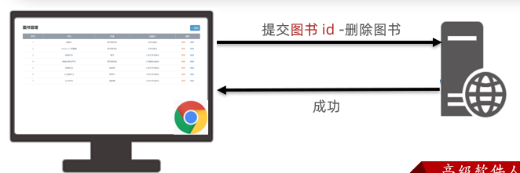

2. 步骤：

   1. 给删除元素，绑定点击事件（事件委托方式并判断点击的是删除元素才走删除逻辑代码），并获取到要删除的数据id
   2. 基于 axios 和接口文档，调用删除接口，让服务器删除这条数据
   3. 重新获取并刷新图书列表

      


3. 核心代码如下：

   ```js
   /**
    * 目标3：删除图书
    *  3.1 删除元素绑定点击事件->获取图书id
    *  3.2 调用删除接口
    *  3.3 刷新图书列表
    */
   // 3.1 删除元素->点击（事件委托）
   document.querySelector('.list').addEventListener('click', e => {
     // 获取触发事件目标元素
     // console.log(e.target)
     // 判断点击的是删除元素
     if (e.target.classList.contains('del')) {
       // console.log('点击删除元素')
       // 获取图书id（自定义属性id）
       const theId = e.target.parentNode.dataset.id
       // console.log(theId)
       // 3.2 调用删除接口
       axios({
         url: `http://hmajax.itheima.net/api/books/${theId}`,
         method: 'DELETE'
       }).then(() => {
         // 3.3 刷新图书列表
         getBooksList()
       })
     }
   })
   ```

   


### 小结

1. 删除数据的步骤是什么？

   <details>
   <summary>答案</summary>
   <ul>
   <li>告知服务器要删除的数据id，服务器删除后，重新获取并刷新列表</li>
   </ul>
   </details>


## 07-09.案例_图书管理\_编辑图书

### 目标

完成图书管理案例-编辑图书需求


### 讲解

1. 因为编辑图书要做回显等，比较复杂，所以分了3个视频来讲解

2. 需求：完成编辑图书回显当前图书数据到编辑表单，在用户点击修改按钮，收集数据提交到服务器保存，并刷新列表

   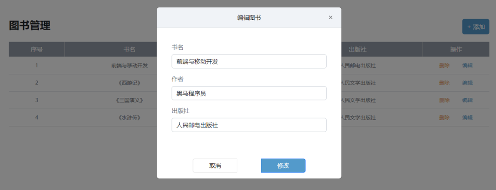

3. 编辑数据的核心思路：

   1. 给编辑元素，绑定点击事件（事件委托方式并判断点击的是编辑元素才走编辑逻辑代码），并获取到要编辑的数据id
   2. 基于 axios 和接口文档，调用查询图书详情接口，获取正在编辑的图书数据，并回显到表单中（页面上的数据是在用户的浏览器中不够准备，所以只要是查看数据都要从服务器获取）

      
   3. 收集并提交保存修改数据，并重新从服务器获取列表刷新页面

      


4. 核心代码如下：

   ```js
   /**
    * 目标4：编辑图书
    *  4.1 编辑弹框->显示和隐藏
    *  4.2 获取当前编辑图书数据->回显到编辑表单中
    *  4.3 提交保存修改，并刷新列表
    */
   // 4.1 编辑弹框->显示和隐藏
   const editDom = document.querySelector('.edit-modal')
   const editModal = new bootstrap.Modal(editDom)
   // 编辑元素->点击->弹框显示
   document.querySelector('.list').addEventListener('click', e => {
     // 判断点击的是否为编辑元素
     if (e.target.classList.contains('edit')) {
       // 4.2 获取当前编辑图书数据->回显到编辑表单中
       const theId = e.target.parentNode.dataset.id
       axios({
         url: `http://hmajax.itheima.net/api/books/${theId}`
       }).then(result => {
         const bookObj = result.data.data
         // document.querySelector('.edit-form .bookname').value = bookObj.bookname
         // document.querySelector('.edit-form .author').value = bookObj.author
         // 数据对象“属性”和标签“类名”一致
         // 遍历数据对象，使用属性去获取对应的标签，快速赋值
         const keys = Object.keys(bookObj) // ['id', 'bookname', 'author', 'publisher']
         keys.forEach(key => {
           document.querySelector(`.edit-form .${key}`).value = bookObj[key]
         })
       })
       editModal.show()
     }
   })
   // 修改按钮->点击->隐藏弹框
   document.querySelector('.edit-btn').addEventListener('click', () => {
     // 4.3 提交保存修改，并刷新列表
     const editForm = document.querySelector('.edit-form')
     const { id, bookname, author, publisher } = serialize(editForm, { hash: true, empty: true})
     // 保存正在编辑的图书id，隐藏起来：无需让用户修改
     // <input type="hidden" class="id" name="id" value="84783">
     axios({
       url: `http://hmajax.itheima.net/api/books/${id}`,
       method: 'PUT',
       data: {
         bookname,
         author,
         publisher,
         creator
       }
     }).then(() => {
       // 修改成功以后，重新获取并刷新列表
       getBooksList()
   
       // 隐藏弹框
       editModal.hide()
     })
   })
   ```

   


### 小结

1. 编辑数据的步骤是什么？

   <details>
   <summary>答案</summary>
   <ul>
   <li>获取正在编辑数据并回显，收集编辑表单的数据提交保存，重新获取并刷新列表</li>
   </ul>
   </details>


## 10.案例_图书管理\_总结

### 目标

总结下增删改查的核心思路


### 讲解

1. 因为增删改查的业务在前端实际开发中非常常见，思路是可以通用的，所以总结下思路

   > 1.渲染列表（查）
   >
   > 2.新增图书（增）
   >
   > 3.删除图书（删）
   >
   > 4.编辑图书（改）

   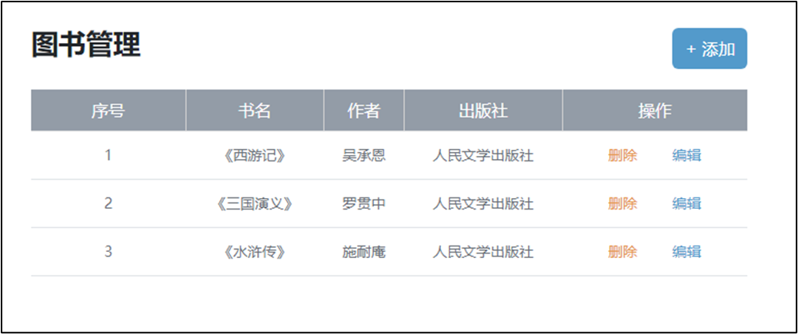

2. 渲染数据（查）

   > 核心思路：获取数据 -> 渲染数据

   ```js
   // 1.1 获取数据
   axios({...}).then(result => {
     const bookList = result.data.data
     // 1.2 渲染数据
     const htmlStr = bookList.map((item, index) => {
       return `<tr>
       <td>${index + 1}</td>
       <td>${item.bookname}</td>
       <td>${item.author}</td>
       <td>${item.publisher}</td>
       <td data-id=${item.id}>
         <span class="del">删除</span>
         <span class="edit">编辑</span>
       </td>
     </tr>`
     }).join('')
     document.querySelector('.list').innerHTML = htmlStr
   })
   ```

   

3. 新增数据（增）

   > 核心思路：准备页面标签 -> 收集数据提交（必须） -> 刷新页面列表（可选）

   ```js
   // 2.1 创建弹框对象
   const addModalDom = document.querySelector('.add-modal')
   const addModal = new bootstrap.Modal(addModalDom)
   document.querySelector('.add-btn').addEventListener('click', () => {
     // 2.2 收集表单数据，并提交到服务器保存
     const addForm = document.querySelector('.add-form')
     const bookObj = serialize(addForm, { hash: true, empty: true })
     axios({...}).then(result => {
       // 2.3 添加成功后，重新请求并渲染图书列表
       getBooksList()
       addForm.reset()
       addModal.hide()
     })
   })
   ```

   

   


4. 删除图书（删）

   > 核心思路：绑定点击事件（获取要删除的图书唯一标识） -> 调用删除接口（让服务器删除此数据） -> 成功后重新获取并刷新列表

   ```js
   // 3.1 删除元素->点击（事件委托）
   document.querySelector('.list').addEventListener('click', e => {
     if (e.target.classList.contains('del')) {
       // 获取图书id（自定义属性id）
       const theId = e.target.parentNode.dataset.id
       // 3.2 调用删除接口
       axios({...}).then(() => {
         // 3.3 刷新图书列表
         getBooksList()
       })
     }
   })
   ```

   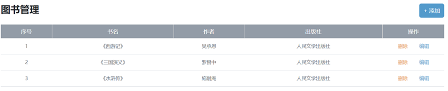

5. 编辑图书（改）

   > 核心思路：准备编辑图书表单 -> 表单回显正在编辑的数据 -> 点击修改收集数据 -> 提交到服务器保存 -> 重新获取并刷新列表

   ```js
   // 4.1 编辑弹框->显示和隐藏
   const editDom = document.querySelector('.edit-modal')
   const editModal = new bootstrap.Modal(editDom)
   document.querySelector('.list').addEventListener('click', e => {
     if (e.target.classList.contains('edit')) {
       // 4.2 获取当前编辑图书数据->回显到编辑表单中
       const theId = e.target.parentNode.dataset.id
       axios({...}).then(result => {
         const bookObj = result.data.data
         // 遍历数据对象，使用属性去获取对应的标签，快速赋值
         const keys = Object.keys(bookObj) 
         keys.forEach(key => {
           document.querySelector(`.edit-form .${key}`).value = bookObj[key]
         })
       })
       editModal.show()
     }
   })
   
   document.querySelector('.edit-btn').addEventListener('click', () => {
     // 4.3 提交保存修改，并刷新列表
     const editForm = document.querySelector('.edit-form')
     const { id, bookname, author, publisher } = serialize(editForm, { hash: true, empty: true})
     // 保存正在编辑的图书id，隐藏起来：无需让用户修改
     // <input type="hidden" class="id" name="id" value="84783">
     axios({...}).then(() => {
       getBooksList()
       editModal.hide()
     })
   })
   ```

   

   


### 小结

1. 学完图书管理案例，我们收货了什么？

   <details>
   <summary>答案</summary>
   <ul>
   <li>现在编辑的虽然是图书数据，以后编辑其他数据，再做增删改查都是差不多的思路</li>
   </ul>
   </details>


## 11.图片上传

### 目标

把本地图片上传到网页上显示


### 讲解

1. 什么是图片上传？
   * 就是把本地的图片上传到网页上显示
2. 图片上传怎么做？
   * 先依靠文件选择元素获取用户选择的本地文件，接着提交到服务器保存，服务器会返回图片的 url 网址，然后把网址加载到 img 标签的 src 属性中即可显示
3. 为什么不直接显示到浏览器上，要放到服务器上呢？
   * 因为浏览器保存是临时的，如果你想随时随地访问图片，需要上传到服务器上
4. 图片上传怎么做呢？
   1. 先获取图片文件对象
   2. 使用 FormData 表单数据对象装入（因为图片是文件而不是以前的数字和字符串了所以传递文件一般需要放入 FormData 以键值对-文件流的数据传递（可以查看请求体-确认请求体结构）

      ```js
      const fd = new FormData()
      fd.append(参数名, 值)
      ```
   3. 提交表单数据对象，使用服务器返回图片 url 网址
5. 核心代码如下：

   ```html
   <!DOCTYPE html>
   <html lang="en">
   
   <head>
     <meta charset="UTF-8">
     <meta http-equiv="X-UA-Compatible" content="IE=edge">
     <meta name="viewport" content="width=device-width, initial-scale=1.0">
     <title>图片上传</title>
   </head>
   
   <body>
     <!-- 文件选择元素 -->
     <input type="file" class="upload">
     
   
     <script src="https://cdn.jsdelivr.net/npm/axios/dist/axios.min.js"></script>
     <script>
       /**
        * 目标：图片上传，显示到网页上
        *  1. 获取图片文件
        *  2. 使用 FormData 携带图片文件
        *  3. 提交到服务器，获取图片url网址使用
       */
       // 文件选择元素->change改变事件
       document.querySelector('.upload').addEventListener('change', e => {
         // 1. 获取图片文件
         console.log(e.target.files[0])
         // 2. 使用 FormData 携带图片文件
         const fd = new FormData()
         fd.append('img', e.target.files[0])
         // 3. 提交到服务器，获取图片url网址使用
         axios({
           url: 'http://hmajax.itheima.net/api/uploadimg',
           method: 'POST',
           data: fd
         }).then(result => {
           console.log(result)
           // 取出图片url网址，用img标签加载显示
           const imgUrl = result.data.data.url
           document.querySelector('.my-img').src = imgUrl
         })
       })
     </script>
   </body>
   
   </html>
   ```

   


### 小结

1. 图片上传的思路是什么？

   <details>
   <summary>答案</summary>
   <ul>
   <li>先用文件选择元素，获取到文件对象，然后装入 FormData 表单对象中，再发给服务器，得到图片在服务器的 URL 网址，再通过 img 标签加载图片显示</li>
   </ul>
   </details>


## 12.案例_网站-更换背景图

### 目标

实现更换网站背景图的效果


### 讲解

1. 需求：先运行备课代码，查看要完成的效果，点击右上角选择本机中提供的素材图片，更换网站背景图

   
2. 网站更换背景图如何实现呢，并且保证刷新后背景图还在？具体步骤：
   1. 先获取到用户选择的背景图片，上传并把服务器返回的图片 url 网址设置给 body 背景
   2. 上传成功时，保存图片 url 网址到 localStorage 中
   3. 网页运行后，获取 localStorage 中的图片的 url 网址使用（并判断本地有图片 url 网址字符串才设置）
3. 核心代码如下：

   ```js
   /**
    * 目标：网站-更换背景
    *  1. 选择图片上传，设置body背景
    *  2. 上传成功时，"保存"图片url网址
    *  3. 网页运行后，"获取"url网址使用
    * */
   document.querySelector('.bg-ipt').addEventListener('change', e => {
     // 1. 选择图片上传，设置body背景
     console.log(e.target.files[0])
     const fd = new FormData()
     fd.append('img', e.target.files[0])
     axios({
       url: 'http://hmajax.itheima.net/api/uploadimg',
       method: 'POST',
       data: fd
     }).then(result => {
       const imgUrl = result.data.data.url
       document.body.style.backgroundImage = `url(${imgUrl})`
   
       // 2. 上传成功时，"保存"图片url网址
       localStorage.setItem('bgImg', imgUrl)
     })
   })
   
   // 3. 网页运行后，"获取"url网址使用
   const bgUrl = localStorage.getItem('bgImg')
   console.log(bgUrl)
   bgUrl && (document.body.style.backgroundImage = `url(${bgUrl})`)
   ```

   


### 小结

1. localStorage 取值和赋值的语法分别是什么？

   <details>
   <summary>答案</summary>
   <ul>
   <li>localStorage.getItem('key')是取值，localStorage.setItem('key', 'value')是赋值</li>
   </ul>
   </details>


## 13.案例_个人信息设置-介绍

### 目标

介绍个人信息设置案例-需要完成哪些效果，分几个视频讲解


### 讲解

1. 需求：先运行备课代码，查看要完成的效果

   
2. 本视频分为，信息回显 + 头像修改 + 信息修改+ 提示框反馈 4 部分
   1. 先完成信息回显
   2. 再做头像修改-立刻就更新给此用户
   3. 收集个人信息表单-提交保存
   4. 提交后反馈结果给用户（提示框）


### 小结

暂无


## 14.案例_个人信息设置-信息渲染

### 目标

把外号对应的用户信息渲染到页面上


### 讲解

1. 需求：把外号对应的个人信息和头像，渲染到页面表单和头像标签上。

   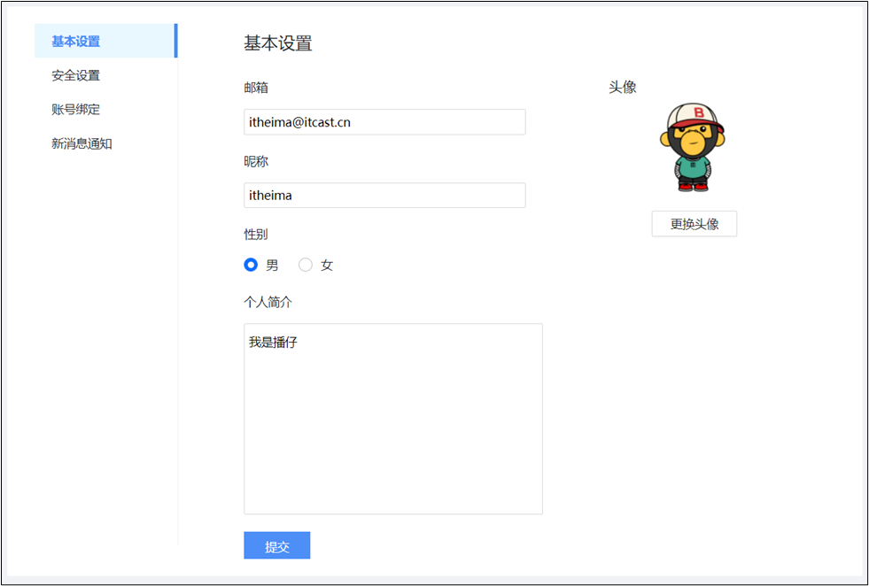
2. 注意：还是需要准备一个外号，因为想要查看自己对应的用户信息，不想被别人影响
3. 步骤：
   * 获取数据
   * 渲染数据到页面

4. 代码如下：

   ```js
   /**
    * 目标1：信息渲染
    *  1.1 获取用户的数据
    *  1.2 回显数据到标签上
    * */
   const creator = '播仔'
   // 1.1 获取用户的数据
   axios({
     url: 'http://hmajax.itheima.net/api/settings',
     params: {
       creator
     }
   }).then(result => {
     const userObj = result.data.data
     // 1.2 回显数据到标签上
     Object.keys(userObj).forEach(key => {
       if (key === 'avatar') {
         // 赋予默认头像
         document.querySelector('.prew').src = userObj[key]
       } else if (key === 'gender') {
         // 赋予默认性别
         // 获取性别单选框：[男radio元素，女radio元素]
         const gRadioList = document.querySelectorAll('.gender')
         // 获取性别数字：0男，1女
         const gNum = userObj[key]
         // 通过性别数字，作为下标，找到对应性别单选框，设置选中状态
         gRadioList[gNum].checked = true
         //一行搞定：document.querySelector(`.${k}[value='${userInfo[k]}']`).checked = true
       } else {
         // 赋予默认内容
         document.querySelector(`.${key}`).value = userObj[key]
       }
     })
   })
   ```
   
   


### 小结

1. 渲染数据和图书列表的渲染思路是否一样呢，是什么？

   <details>
   <summary>答案</summary>
   <ul>
   <li>一样的，都是获取到数据，然后渲染到页面上</li>
   </ul>
   </details>


## 15.案例_个人信息设置-头像修改

### 目标

修改用户的头像并立刻生效


### 讲解

1. 需求：点击修改用户头像

   
2. 实现步骤如下：

   1. 获取到用户选择的头像文件
   2. 调用头像修改接口，并除了头像文件外，还要在 FormData 表单数据对象中携带外号
   3. 提交到服务器保存此用户对应头像文件，并把返回的头像图片 url 网址设置在页面上

      
3. 注意：重新刷新重新获取，已经是修改后的头像了（证明服务器那边确实保存成功）
4. 核心代码：

   ```js
   /**
    * 目标2：修改头像
    *  2.1 获取头像文件
    *  2.2 提交服务器并更新头像
    * */
   // 文件选择元素->change事件
   document.querySelector('.upload').addEventListener('change', e => {
     // 2.1 获取头像文件
     console.log(e.target.files[0])
     const fd = new FormData()
     fd.append('avatar', e.target.files[0])
     fd.append('creator', creator)
     // 2.2 提交服务器并更新头像
     axios({
       url: 'http://hmajax.itheima.net/api/avatar',
       method: 'PUT',
       data: fd
     }).then(result => {
       const imgUrl = result.data.data.avatar
       // 把新的头像回显到页面上
       document.querySelector('.prew').src = imgUrl
     })
   })
   ```

   


### 小结

1. 为什么这次上传头像，需要携带外号呢？

   <details>
   <summary>答案</summary>
   <ul>
   <li>因为这次头像到后端，是要保存在某个用户名下的，所以要把外号名字一起携带过去</li>
   </ul>
   </details>


## 16.案例_个人信息设置-信息修改

### 目标

把用户修改的信息提交到服务器保存


### 讲解

1. 需求：点击提交按钮，收集个人信息，提交到服务器保存（无需重新获取刷新，因为页面已经是最新的数据了）
   1. 收集表单数据

   2. 提交到服务器保存-调用用户信息更新接口（注意请求方法是 PUT）代表数据更新的意思

      

2. 核心代码如下：

   ```js
   /**
    * 目标3：提交表单
    *  3.1 收集表单信息
    *  3.2 提交到服务器保存
    */
   // 保存修改->点击
   document.querySelector('.submit').addEventListener('click', () => {
     // 3.1 收集表单信息
     const userForm = document.querySelector('.user-form')
     const userObj = serialize(userForm, { hash: true, empty: true })
     userObj.creator = creator
     // 性别数字字符串，转成数字类型
     userObj.gender = +userObj.gender
     console.log(userObj)
     // 3.2 提交到服务器保存
     axios({
       url: 'http://hmajax.itheima.net/api/settings',
       method: 'PUT',
       data: userObj
     }).then(result => {
     })
   })
   ```

   


### 小结

1. 信息修改数据和以前增删改查哪个实现的思路比较接近呢？

   <details>
   <summary>答案</summary>
   <ul>
   <li>编辑，首先回显已经做完了，然后收集用户最新改动后的数据，提交到服务器保存，因为页面最终就是用户刚写的数据，所以不用重新获取并刷新页面了</li>
   </ul>
   </details>


## 17.案例_个人信息设置-提示框

### 目标

把用户更新个人信息结果，用提示框反馈给用户


### 讲解

1. 需求：使用 bootstrap 提示框，提示个人信息设置后的结果

   

2. bootstrap 的 toast 提示框和 modal 弹框使用很像，语法如下：

   1. 先准备对应的标签结构（模板里已有）

   2. 设置延迟自动消失的时间

      ```html
      <div class="toast" data-bs-delay="1500">
        提示框内容
      </div>
      ```

   3. 使用 JS 的方式，在 axios 请求响应成功时，展示结果

      ```js
      // 创建提示框对象
      const toastDom = document.querySelector('css选择器')
      const toast = new bootstrap.Toast(toastDom)
      
      // 显示提示框
      toast.show()
      ```

      

3. 核心代码：

   ```js
   /**
    * 目标3：提交表单
    *  3.1 收集表单信息
    *  3.2 提交到服务器保存
    */
   /**
    * 目标4：结果提示
    *  4.1 创建toast对象
    *  4.2 调用show方法->显示提示框
    */
   // 保存修改->点击
   document.querySelector('.submit').addEventListener('click', () => {
     // 3.1 收集表单信息
     const userForm = document.querySelector('.user-form')
     const userObj = serialize(userForm, { hash: true, empty: true })
     userObj.creator = creator
     // 性别数字字符串，转成数字类型
     userObj.gender = +userObj.gender
     console.log(userObj)
     // 3.2 提交到服务器保存
     axios({
       url: 'http://hmajax.itheima.net/api/settings',
       method: 'PUT',
       data: userObj
     }).then(result => {
       // 4.1 创建toast对象
       const toastDom = document.querySelector('.my-toast')
       const toast = new bootstrap.Toast(toastDom)
   
       // 4.2 调用show方法->显示提示框
       toast.show()
     })
   })
   ```

   


### 小结

1. bootstrap 弹框什么时候用 JS 方式控制显示呢？

   <details>
   <summary>答案</summary>
   <ul>
   <li>需要执行一些其他的 JS 逻辑后，再去显示/隐藏弹框时</li>
   </ul>
   </details>


## 今日重点(必须会)

1. 掌握增删改查数据的思路
2. 掌握图片上传的思路和流程
3. 理解调用接口时，携带外号的作用
4. 了解 bootstrap 弹框的使用


## 今日作业(必完成)

在配套作业文件夹的md内


## 参考文献

1. [表单概念->百度百科](https://baike.baidu.com/item/%E8%A1%A8%E5%8D%95)
2. [accept属性->mdn](https://developer.mozilla.org/zh-CN/docs/Web/HTTP/Content_negotiation/List_of_default_Accept_values)
3. [accept属性->菜鸟教程](https://www.runoob.com/tags/att-input-accept.html)
4. [FormData->mdn](https://developer.mozilla.org/zh-CN/docs/Web/API/FormData)
5. [BS的Model文档](https://v5.bootcss.com/docs/components/modal/#passing-options)
6. [axios请求方式别名](https://www.axios-http.cn/docs/api_intro)

# Day03_AJAX原理


## 知识点自测

1. 以下哪个方法可以把 JS 数据类型转成 JSON 字符串类型?

   A. JSON.stringify()

   B. JSON.parse()

   <details>
   <summary>答案</summary>
   <ul>
   <li>选择A</li>
   </ul>
   </details>


2. 以下哪个方法，会延迟一段时间后，再执行函数体，并执行一次就停止?

   A. setTimeout(函数体, 毫秒值)

   B. setInterval(函数体, 毫秒值)

   <details>
   <summary>答案</summary>
   <ul>
   <li>选择A</li>
   </ul>
   </details>


3. 下面代码 result 结果是多少?

   ```js
   let obj = {
     status: 240
   }
   const result = obj.status >= 200 && obj.status < 300
   ```
   
   A. true
   
   B. 大于
   
   C. 240
   
   D. false
   
   <details>
   <summary>答案</summary>
   <ul>
   <li>选A</li>
   </ul>
   </details>


4. 下面代码运行结果是多少？

   ```js
   let result = 'http://www.baidu.com'
   result += '?a=10'
   result += '&b=20'
   ```
   
   A：'http://www.baidu.com'
   
   B：'?a=10'
   
   C：'&b=20'
   
   D：'http://www.baidu.com?a=10&b=20'
   
   <details>
   <summary>答案</summary>
   <ul>
   <li>选D</li>
   </ul>
   </details>


5. 哪个事件能实时检测到输入框值的变化？

   A：input 事件
   
   B：change 事件
   
   <details>
   <summary>答案</summary>
   <ul>
   <li>选A</li>
   </ul>
   </details>
   
   

## 目录

* XMLHttpRequest 的学习
* Promise 
* 封装简易版 axios
* 案例 - 天气预报


## 学习目标

1. 了解原生 AJAX 语法 - XMLHttpRequest（XHR）
2. 了解 Promise 的概念和使用
3. 了解 axios 内部工作的大概过程（XHR + Promise）
4. 案例 - 天气预报


## 01.XMLHttpRequest - 基础使用

### 目标

了解 AJAX 原理 XHR 的基础使用


### 讲解

1. AJAX 是浏览器与服务器通信的技术，采用 XMLHttpRequest 对象相关代码

2. axios 是对 XHR 相关代码进行了封装，让我们只关心传递的接口参数

3. 学习 XHR 也是了解 axios 内部与服务器交互过程的真正原理

   

4. 语法如下：

   ```js
   const xhr = new XMLHttpRequest()
   xhr.open('请求方法', '请求url网址')
   xhr.addEventListener('loadend', () => {
     // 响应结果
     console.log(xhr.response)
   })
   xhr.send()
   ```

   

   

5. 需求：以一个需求来体验下原生 XHR 语法，获取所有省份列表并展示到页面上

6. 代码如下：

   ```html
   <!DOCTYPE html>
   <html lang="en">
   
   <head>
     <meta charset="UTF-8">
     <meta http-equiv="X-UA-Compatible" content="IE=edge">
     <meta name="viewport" content="width=device-width, initial-scale=1.0">
     <title>XMLHttpRequest_基础使用</title>
   </head>
   
   <body>
     <p class="my-p"></p>
     <script>
       /**
        * 目标：使用XMLHttpRequest对象与服务器通信
        *  1. 创建 XMLHttpRequest 对象
        *  2. 配置请求方法和请求 url 地址
        *  3. 监听 loadend 事件，接收响应结果
        *  4. 发起请求
       */
       // 1. 创建 XMLHttpRequest 对象
       const xhr = new XMLHttpRequest()
   
       // 2. 配置请求方法和请求 url 地址
       xhr.open('GET', 'http://hmajax.itheima.net/api/province')
   
       // 3. 监听 loadend 事件，接收响应结果
       xhr.addEventListener('loadend', () => {
         console.log(xhr.response)
         const data = JSON.parse(xhr.response)
         console.log(data.list.join('<br>'))
         document.querySelector('.my-p').innerHTML = data.list.join('<br>')
       })
   
       // 4. 发起请求
       xhr.send()
     </script>
   </body>
   
   </html>
   ```

   


### 小结

1. AJAX 原理是什么?

   <details>
   <summary>答案</summary>
   <ul>
   <li>window 提供的 XMLHttpRequest</li>
   </ul>
   </details>

2. 为什么学习 XHR ？

   <details>
   <summary>答案</summary>
   <ul>
   <li>有更多与服务器数据通信方式</li>
   <li>了解 axios 内部原理</li>
   </ul>
   </details>

3. XHR 使用步骤？

   <details>
   <summary>答案</summary>
   <ul>
   <li>1. 创建 XHR 对象 2. 调用 open 方法，设置 url 和请求方法 3. 监听 loadend 事件，接收结果 4. 调用 send 方法，发起请求</li>
   </ul>
   </details>


## 02.XMLHttpRequest - 查询参数

### 目标

使用 XHR 传递查询参数给服务器，获取匹配数据


### 讲解

1. 什么是查询参数：携带额外信息给服务器，返回匹配想要的数据
2. 查询参数原理要携带的位置和语法：http://xxxx.com/xxx/xxx?参数名1=值1&参数名2=值2
3. 所以，原生 XHR 需要自己在 url 后面携带查询参数字符串，没有 axios 帮助我们把 params 参数拼接到 url 字符串后面了
4. 需求：查询河北省下属的城市列表

   
5. 核心代码如下：

   ```js
   /**
    * 目标：使用XHR携带查询参数，展示某个省下属的城市列表
   */
   const xhr = new XMLHttpRequest()
   xhr.open('GET', 'http://hmajax.itheima.net/api/city?pname=辽宁省')
   xhr.addEventListener('loadend', () => {
     console.log(xhr.response)
     const data = JSON.parse(xhr.response)
     console.log(data)
     document.querySelector('.city-p').innerHTML = data.list.join('<br>')
   })
   xhr.send()
   ```


### 小结

1. XHR 如何携带查询参数?

   <details>
   <summary>答案</summary>
   <ul>
   <li>在调用 open 方法的时候，在 url? 后面按照指定格式拼接参数名和值</li>
   </ul>
   </details>


## 03.案例 - 地区查询

### 目标

使用 XHR 完成案例地区查询


### 讲解

1. 需求：和我们之前做的类似，就是不用 axios 而是用 XHR 实现，输入省份和城市名字后，点击查询，传递多对查询参数并获取地区列表的需求

   

2. 但是多个查询参数，如果自己拼接很麻烦，这里用 URLSearchParams 把参数对象转成“参数名=值&参数名=值“格式的字符串，语法如下：

   ```js
   // 1. 创建 URLSearchParams 对象
   const paramsObj = new URLSearchParams({
     参数名1: 值1,
     参数名2: 值2
   })
   
   // 2. 生成指定格式查询参数字符串
   const queryString = paramsObj.toString()
   // 结果：参数名1=值1&参数名2=值2
   ```


### 小结

1. JS 对象如何转成查询参数格式字符串?

   <details>
   <summary>答案</summary>
   <ul>
   <li>在调用 open 方法的时候，在 url? 后面按照指定格式拼接参数名和值</li>
   </ul>
   </details>


## 04.XMLHttpRequest - 数据提交

### 目标

通过 XHR 提交用户名和密码，完成注册功能


### 讲解

1. 了解原生 XHR 进行数据提交的方式

2. 需求：通过 XHR 完成注册用户功能

   

3. 步骤和语法：

   1. 注意1：但是这次没有 axios 帮我们了，我们需要自己设置请求头 Content-Type：application/json，来告诉服务器端，我们发过去的内容类型是 JSON 字符串，让他转成对应数据结构取值使用

   2. 注意2：没有 axios 了，我们前端要传递的请求体数据，也没人帮我把 JS 对象转成 JSON 字符串了，需要我们自己转换

   3. 注意3：原生 XHR 需要在 send 方法调用时，传入请求体携带

      ```js
      const xhr = new XMLHttpRequest()
      xhr.open('请求方法', '请求url网址')
      xhr.addEventListener('loadend', () => {
        console.log(xhr.response)
      })
      
      // 1. 告诉服务器，我传递的内容类型，是 JSON 字符串
      xhr.setRequestHeader('Content-Type', 'application/json')
      // 2. 准备数据并转成 JSON 字符串
      const user = { username: 'itheima007', password: '7654321' }
      const userStr = JSON.stringify(user)
      // 3. 发送请求体数据
      xhr.send(userStr)
      ```


4. 核心代码如下：

   ```js
   /**
    * 目标：使用xhr进行数据提交-完成注册功能
   */
   document.querySelector('.reg-btn').addEventListener('click', () => {
     const xhr = new XMLHttpRequest()
     xhr.open('POST', 'http://hmajax.itheima.net/api/register')
     xhr.addEventListener('loadend', () => {
       console.log(xhr.response)
     })
   
     // 设置请求头-告诉服务器内容类型（JSON字符串）
     xhr.setRequestHeader('Content-Type', 'application/json')
     // 准备提交的数据
     const userObj = {
       username: 'itheima007',
       password: '7654321'
     }
     const userStr = JSON.stringify(userObj)
     // 设置请求体，发起请求
     xhr.send(userStr)
   })
   ```

   

### 小结

1. XHR 如何提交请求体数据?

   <details>
   <summary>答案</summary>
   <ul>
   <li>在 send 中携带请求体数据，要按照后端要求的内容类型携带</li>
   </ul>
   </details>


## 05.认识_Promise

### 目标

认识 Promise 的作用和好处以及使用步骤


### 讲解

1. 什么是 Promise ？

   * Promise 对象用于表示一个异步操作的最终完成（或失败）及其结构值

2. Promise 的好处是什么？

   * 逻辑更清晰（成功或失败会关联后续的处理函数）

   * 了解 axios 函数内部运作的机制

     

   * 能解决回调函数地狱问题（后面会讲到），今天先来看下它的基础使用

3. Promise 管理异步任务，语法怎么用？

   ```js
   // 1. 创建 Promise 对象
   const p = new Promise((resolve, reject) => {
    // 2. 执行异步任务-并传递结果
    // 成功调用: resolve(值) 触发 then() 执行
    // 失败调用: reject(值) 触发 catch() 执行
   })
   // 3. 接收结果
   p.then(result => {
    // 成功
   }).catch(error => {
    // 失败
   })
   ```

4. 示例代码：

   ```js
   /**
    * 目标：使用Promise管理异步任务
   */
   // 1. 创建Promise对象
   const p = new Promise((resolve, reject) => {
     // 2. 执行异步代码
     setTimeout(() => {
       // resolve('模拟AJAX请求-成功结果')
       reject(new Error('模拟AJAX请求-失败结果'))
     }, 2000)
   })
   
   // 3. 获取结果
   p.then(result => {
     console.log(result)
   }).catch(error => {
     console.log(error)
   })
   ```

   


### 小结

1. 什么是 Promise ?

   <details>
   <summary>答案</summary>
   <ul>
   <li>表示（管理）一个异步操作最终状态和结果值的对象</li>
   </ul>
   </details>

2. 为什么学习 Promise ?

   <details>
   <summary>答案</summary>
   <ul>
   <li>成功和失败状态，可以关联对应处理函数，了解 axios 内部运作的原理</li>
   </ul>
   </details>

3. Promise 使用步骤？

   <details>
   <summary>答案</summary>
   <ul>
   <li>1. new Promise 对象执行异步任务。2. 用 resolve 关联 then 的回调函数传递成功结果。3.用 reject 关联 catch 的回调函数传递失败结果。</li>
   </ul>
   </details>


## 06.认识_Promise 的状态

### 目标

认识 Promise 的三种状态，知道如何关联成功/失败的处理函数


### 讲解

1. 为什么要了解 Promise 的三种状态 ？

   * 知道 Promise 对象如何关联的处理函数，以及代码的执行顺序

2. Promise 有哪三种状态？

   > 每个 Promise 对象必定处于以下三种状态之一

   1. 待定（pending）：初始状态，既没有被兑现，也没有被拒绝
   2. 已兑现（fulfilled）：操作成功完成
   3. 已拒绝（rejected）：操作失败

   > 状态的英文字符串，可以理解为 Promise 对象内的字符串标识符，用于判断什么时候调用哪一个处理函数

3. Promise 的状态改变有什么用：调用对应函数，改变 Promise 对象状态后，内部触发对应回调函数传参并执行

   

4. 注意：每个 Promise 对象一旦被兑现/拒绝，那就是已敲定了，状态无法再被改变


### 小结

1. Promise 对象有哪 3 种状态?

   <details>
   <summary>答案</summary>
   <ul>
   <li>待定 pending，已兑现 fulfilled，已拒绝 rejected</li>
   </ul>
   </details>

2. Promise 状态有什么用?

   <details>
   <summary>答案</summary>
   <ul>
   <li>状态改变后，如何关联处理函数</li>
   </ul>
   </details>


## 07.使用 Promise 和 XHR_获取省份列表

### 目标

尝试用 Promise 管理 XHR 异步任务


### 讲解

1. Promise 和 XHR 都已经学过基础语法了，我们可以来结合使用一下了

2. 需求：使用 Promise 和 XHR 请求省份列表数据并展示到页面上

   

3. 步骤：

   1. 创建 Promise 对象

   2. 执行 XHR 异步代码，获取省份列表数据

   3. 关联成功或失败回调函数，做后续的处理

      > 错误情况：用地址错了404演示

4. 核心代码如下：

   ```js
   /**
    * 目标：使用Promise管理XHR请求省份列表
    *  1. 创建Promise对象
    *  2. 执行XHR异步代码，获取省份列表
    *  3. 关联成功或失败函数，做后续处理
   */
   // 1. 创建Promise对象
   const p = new Promise((resolve, reject) => {
     // 2. 执行XHR异步代码，获取省份列表
     const xhr = new XMLHttpRequest()
     xhr.open('GET', 'http://hmajax.itheima.net/api/province')
     xhr.addEventListener('loadend', () => {
       // xhr如何判断响应成功还是失败的？
       // 2xx开头的都是成功响应状态码
       if (xhr.status >= 200 && xhr.status < 300) {
         resolve(JSON.parse(xhr.response))
       } else {
         reject(new Error(xhr.response))
       }
     })
     xhr.send()
   })
   
   // 3. 关联成功或失败函数，做后续处理
   p.then(result => {
     console.log(result)
     document.querySelector('.my-p').innerHTML = result.list.join('<br>')
   }).catch(error => {
     // 错误对象要用console.dir详细打印
     console.dir(error)
     // 服务器返回错误提示消息，插入到p标签显示
     document.querySelector('.my-p').innerHTML = error.message
   })
   ```

   


### 小结

1. AJAX 如何判断是否请求响应成功了?

   <details>
   <summary>答案</summary>
   <ul>
   <li>响应状态码在大于等于 200 并且小于 300 的范围是成功的</li>
   </ul>
   </details>


## 08.封装_简易axios-获取省份列表

### 目标

模拟 axios 函数封装，更深入了解 axios 内部运作原理


### 讲解

1. 需求：基于 Promise 和 XHR 封装 myAxios 函数，获取省份列表展示到页面

   

2. 核心语法：

   ```js
   function myAxios(config) {
     return new Promise((resolve, reject) => {
       // XHR 请求
       // 调用成功/失败的处理程序
     })
   }
   
   myAxios({
     url: '目标资源地址'
   }).then(result => {
       
   }).catch(error => {
       
   })
   ```

   

3. 步骤：

   1. 定义 myAxios 函数，接收配置对象，返回 Promise 对象
   2. 发起 XHR 请求，默认请求方法为 GET
   3. 调用成功/失败的处理程序
   4. 使用 myAxios 函数，获取省份列表展示


4. 核心代码如下：

   ```js
   /**
    * 目标：封装_简易axios函数_获取省份列表
    *  1. 定义myAxios函数，接收配置对象，返回Promise对象
    *  2. 发起XHR请求，默认请求方法为GET
    *  3. 调用成功/失败的处理程序
    *  4. 使用myAxios函数，获取省份列表展示
   */
   // 1. 定义myAxios函数，接收配置对象，返回Promise对象
   function myAxios(config) {
     return new Promise((resolve, reject) => {
       // 2. 发起XHR请求，默认请求方法为GET
       const xhr = new XMLHttpRequest()
       xhr.open(config.method || 'GET', config.url)
       xhr.addEventListener('loadend', () => {
         // 3. 调用成功/失败的处理程序
         if (xhr.status >= 200 && xhr.status < 300) {
           resolve(JSON.parse(xhr.response))
         } else {
           reject(new Error(xhr.response))
         }
       })
       xhr.send()
     })
   }
   
   // 4. 使用myAxios函数，获取省份列表展示
   myAxios({
     url: 'http://hmajax.itheima.net/api/province'
   }).then(result => {
     console.log(result)
     document.querySelector('.my-p').innerHTML = result.list.join('<br>')
   }).catch(error => {
     console.log(error)
     document.querySelector('.my-p').innerHTML = error.message
   })
   ```

   


### 小结

1. 自己封装的 myAxios 如何设置默认请求方法 GET?

   <details>
   <summary>答案</summary>
   <ul>
   <li>config.method 判断有值就用，无值用‘GET’方法</li>
   </ul>
   </details>


## 09.封装_简易axios-获取地区列表

### 目标

修改 myAxios 函数支持传递查询参数，获取辽宁省，大连市的地区列表


### 讲解

1. 需求：在上个封装的建议 axios 函数基础上，修改代码支持传递查询参数功能

1. 修改步骤：
   
   1. myAxios 函数调用后，判断 params 选项
   2. 基于 URLSearchParams 转换查询参数字符串
   3. 使用自己封装的 myAxios 函数显示地区列表
   
3. 核心代码：

   ```js
   function myAxios(config) {
     return new Promise((resolve, reject) => {
       const xhr = new XMLHttpRequest()
       // 1. 判断有params选项，携带查询参数
       if (config.params) {
         // 2. 使用URLSearchParams转换，并携带到url上
         const paramsObj = new URLSearchParams(config.params)
         const queryString = paramsObj.toString()
         // 把查询参数字符串，拼接在url？后面
         config.url += `?${queryString}`
       }
   
       xhr.open(config.method || 'GET', config.url)
       xhr.addEventListener('loadend', () => {
         if (xhr.status >= 200 && xhr.status < 300) {
           resolve(JSON.parse(xhr.response))
         } else {
           reject(new Error(xhr.response))
         }
       })
       xhr.send()
     })
   }
   
   // 3. 使用myAxios函数，获取地区列表
   myAxios({
     url: 'http://hmajax.itheima.net/api/area',
     params: {
       pname: '辽宁省',
       cname: '大连市'
     }
   }).then(result => {
     console.log(result)
     document.querySelector('.my-p').innerHTML = result.list.join('<br>')
   })
   ```

   


### 小结

1. 外面传入查询参数对象，myAxios 函数内如何转查询参数字符串?

   <details>
   <summary>答案</summary>
   <ul>
   <li>使用 URLSearchParams 对象转换</li>
   </ul>
   </details>


## 10.封装_简易axios-注册用户

### 目标

修改 myAxios 函数支持传递请求体数据，完成注册用户


### 讲解

1. 需求：修改 myAxios 函数支持传递请求体数据，完成注册用户功能

2. 修改步骤：

   1. myAxios 函数调用后，判断 data 选项
   2. 转换数据类型，在 send 方法中发送
   3. 使用自己封装的 myAxios 函数完成注册用户功能

3. 核心代码：

   ```js
   function myAxios(config) {
     return new Promise((resolve, reject) => {
       const xhr = new XMLHttpRequest()
   
       if (config.params) {
         const paramsObj = new URLSearchParams(config.params)
         const queryString = paramsObj.toString()
         config.url += `?${queryString}`
       }
       xhr.open(config.method || 'GET', config.url)
   
       xhr.addEventListener('loadend', () => {
         if (xhr.status >= 200 && xhr.status < 300) {
           resolve(JSON.parse(xhr.response))
         } else {
           reject(new Error(xhr.response))
         }
       })
       // 1. 判断有data选项，携带请求体
       if (config.data) {
         // 2. 转换数据类型，在send中发送
         const jsonStr = JSON.stringify(config.data)
         xhr.setRequestHeader('Content-Type', 'application/json')
         xhr.send(jsonStr)
       } else {
         // 如果没有请求体数据，正常的发起请求
         xhr.send()
       }
     })
   }
   
   document.querySelector('.reg-btn').addEventListener('click', () => {
     // 3. 使用myAxios函数，完成注册用户
     myAxios({
       url: 'http://hmajax.itheima.net/api/register',
       method: 'POST',
       data: {
         username: 'itheima999',
         password: '666666'
       }
     }).then(result => {
       console.log(result)
     }).catch(error => {
       console.dir(error)
     })
   })
   ```


### 小结

1. 外面传入 data 选项，myAxios 函数内如何携带请求体参数?

   <details>
   <summary>答案</summary>
   <ul>
   <li>判断外面传入了这个属性，自己转成 JSON 字符串并设置请求头并在 send 方法中携带</li>
   </ul>
   </details>


## 11-12.案例_天气预报-默认数据

### 目标

把北京市的数据，填充到页面默认显示


### 讲解

1. 需求：介绍本项目要完成的效果，和要实现的步骤和分的步骤和视频

   

2. 步骤

   1. 先获取北京市天气预报，展示
   2. 搜索城市列表，展示
   3. 点击城市，切换显示对应天气数据

3. 本视频先封装函数，获取城市天气并设置页面内容

4. 核心代码如下：

   ```js
   /**
    * 目标1：默认显示-北京市天气
    *  1.1 获取北京市天气数据
    *  1.2 数据展示到页面
    */
   // 获取并渲染城市天气函数
   function getWeather(cityCode) {
     // 1.1 获取北京市天气数据
     myAxios({
       url: 'http://hmajax.itheima.net/api/weather',
       params: {
         city: cityCode
       }
     }).then(result => {
       console.log(result)
       const wObj = result.data
       // 1.2 数据展示到页面
       // 阳历和农历日期
       const dateStr = `<span class="dateShort">${wObj.date}</span>
       <span class="calendar">农历&nbsp;
         <span class="dateLunar">${wObj.dateLunar}</span>
       </span>`
       document.querySelector('.title').innerHTML = dateStr
       // 城市名字
       document.querySelector('.area').innerHTML = wObj.area
       // 当天气温
       const nowWStr = `<div class="tem-box">
       <span class="temp">
         <span class="temperature">${wObj.temperature}</span>
         <span>°</span>
       </span>
     </div>
     <div class="climate-box">
       <div class="air">
         <span class="psPm25">${wObj.psPm25}</span>
         <span class="psPm25Level">${wObj.psPm25Level}</span>
       </div>
       <ul class="weather-list">
         <li>
           
           <span class="weather">${wObj.weather}</span>
         </li>
         <li class="windDirection">${wObj.windDirection}</li>
         <li class="windPower">${wObj.windPower}</li>
       </ul>
     </div>`
       document.querySelector('.weather-box').innerHTML = nowWStr
       // 当天天气
       const twObj = wObj.todayWeather
       const todayWStr = `<div class="range-box">
       <span>今天：</span>
       <span class="range">
         <span class="weather">${twObj.weather}</span>
         <span class="temNight">${twObj.temNight}</span>
         <span>-</span>
         <span class="temDay">${twObj.temDay}</span>
         <span>℃</span>
       </span>
     </div>
     <ul class="sun-list">
       <li>
         <span>紫外线</span>
         <span class="ultraviolet">${twObj.ultraviolet}</span>
       </li>
       <li>
         <span>湿度</span>
         <span class="humidity">${twObj.humidity}</span>%
       </li>
       <li>
         <span>日出</span>
         <span class="sunriseTime">${twObj.sunriseTime}</span>
       </li>
       <li>
         <span>日落</span>
         <span class="sunsetTime">${twObj.sunsetTime}</span>
       </li>
     </ul>`
       document.querySelector('.today-weather').innerHTML = todayWStr
   
       // 7日天气预报数据展示
       const dayForecast = wObj.dayForecast
       const dayForecastStr = dayForecast.map(item => {
         return `<li class="item">
         <div class="date-box">
           <span class="dateFormat">${item.dateFormat}</span>
           <span class="date">${item.date}</span>
         </div>
         
         <span class="weather">${item.weather}</span>
         <div class="temp">
           <span class="temNight">${item.temNight}</span>-
           <span class="temDay">${item.temDay}</span>
           <span>℃</span>
         </div>
         <div class="wind">
           <span class="windDirection">${item.windDirection}</span>
           <span class="windPower">${item.windPower}</span>
         </div>
       </li>`
       }).join('')
       // console.log(dayForecastStr)
       document.querySelector('.week-wrap').innerHTML = dayForecastStr
     })
   }
   
   // 默认进入网页-就要获取天气数据（北京市城市编码：'110100'）
   getWeather('110100')
   ```

   


### 小结

1. 做完这个项目会带来什么收货?

   <details>
   <summary>答案</summary>
   <ul>
   <li>可以做一个真正有意义的业务，查看城市的天气预报，测试自己封装的 myAxios 函数是否好用</li>
   </ul>
   </details>


## 13.案例_天气预报-搜索城市列表

### 目标

根据关键字，展示匹配的城市列表


### 讲解

1. 介绍本视频要完成的效果：搜索匹配关键字相关城市名字，展示城市列表即可

   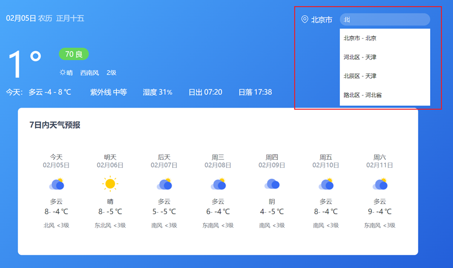

2. 步骤

   1. 绑定 input 事件，获取关键字
   2. 获取展示城市列表数据

3. 核心代码如下：

   ```js
   /**
    * 目标2：搜索城市列表
    *  2.1 绑定input事件，获取关键字
    *  2.2 获取展示城市列表数据
    */
   // 2.1 绑定input事件，获取关键字
   document.querySelector('.search-city').addEventListener('input', (e) => {
     console.log(e.target.value)
     // 2.2 获取展示城市列表数据
     myAxios({
       url: 'http://hmajax.itheima.net/api/weather/city',
       params: {
         city: e.target.value
       }
     }).then(result => {
       console.log(result)
       const liStr = result.data.map(item => {
         return `<li class="city-item" data-code="${item.code}">${item.name}</li>`
       }).join('')
       console.log(liStr)
       document.querySelector('.search-list').innerHTML = liStr
     })
   })
   ```

   


### 小结

1. 监听输入框实时改变的事件是什么?

   <details>
   <summary>答案</summary>
   <ul>
   <li>input事件</li>
   </ul>
   </details>


## 14.案例_天气预报-展示城市天气

### 目标

点击搜索框列表城市名字，切换对应城市天气数据


### 讲解

1. 介绍本视频要完成的效果：点击城市列表名字，切换当前页面天气数据

   

2. 步骤

   1. 检测搜索列表点击事件，获取城市 code 值
   2. 复用获取展示城市天气函数

3. 核心代码如下：

   ```js
   /**
    * 目标3：切换城市天气
    *  3.1 绑定城市点击事件，获取城市code值
    *  3.2 调用获取并展示天气的函数
    */
   // 3.1 绑定城市点击事件，获取城市code值
   document.querySelector('.search-list').addEventListener('click', e => {
     if (e.target.classList.contains('city-item')) {
       // 只有点击城市li才会走这里
       const cityCode = e.target.dataset.code
       console.log(cityCode)
       // 3.2 调用获取并展示天气的函数
       getWeather(cityCode)
     }
   })
   ```

   


### 小结

1. 这次我们获取城市天气，传递的是城市名字还是 code 值?

   <details>
   <summary>答案</summary>
   <ul>
   <li>看后端要求传递什么，就传什么即可</li>
   </ul>
   </details>


## 今日重点(必须会)

1. 了解 AJAX 原理之 XMLHttpRequest（XHR）相关语法
2. 了解 Promise 的作用和三种状态
3. 了解 axios 内部运作的过程
4. 完成案例-天气预报


## 今日作业(必完成)

参考作业文件夹作用


## 参考文档

1. [Ajax原生-mdn](https://developer.mozilla.org/zh-CN/docs/Web/Guide/AJAX/Getting_Started)
3. [同步异步-mdn](https://developer.mozilla.org/zh-CN/docs/Web/API/XMLHttpRequest/Synchronous_and_Asynchronous_Requests)
4. [回调函数-mdn](https://developer.mozilla.org/zh-CN/docs/Glossary/Callback_function)
5. [Promise-mdn](https://developer.mozilla.org/zh-CN/docs/Web/JavaScript/Reference/Global_Objects/Promise)

# Day04_AJAX进阶


## 知识点自测

1. 看如下标签回答如下问题？

   ```html
   <select>
       <option value="北京">北京市</option>
       <option value="南京">南京市</option>
       <option value="天津">天津市</option>
   </select>
   ```

   * 当选中第二个 option 时, JS 中获取下拉菜单 select 标签的 value 属性的值是多少?

     <details>
     <summary>答案</summary>
     <ul>
     <li>南京</li>
     </ul>
     </details>

   * 页面上看到的是北京, 还是北京市等？

     <details>
     <summary>答案</summary>
     <ul>
     <li>北京市</li>
     </ul>
     </details>


2. 我给 select 标签的 value 属性赋予"南京"会有什么效果？

   <details>
   <summary>答案</summary>
   <ul>
   <li>什么效果都没有, 没有没有一个option选项的value能匹配</li>
   </ul>
   </details>


## 目录

* 同步代码和异步代码
* 回调函数地狱和 Promise 链式调用
* async 和 await 使用
* 事件循环-EventLoop
* Promise.all 静态方法
* 案例 - 商品分类
* 案例 - 学习反馈


## 学习目标

1. 区分异步代码，回调函数地狱问题和所有解决防范（Promise 链式调用）
1. 掌握 async 和 await 使用
1. 掌握 EventLoop 的概念
1. 了解 Promise.all 静态方法作用
1. 完成省市区切换效果


## 01.同步代码和异步代码

### 目标

能够区分出哪些是异步代码


### 讲解

1. [同步代码]([https://developer.mozilla.org/zh-CN/docs/Learn/JavaScript/Asynchronous/Introducing#%E5%90%8C%E6%AD%A5%E7%BC%96%E7%A8%8B](https://developer.mozilla.org/zh-CN/docs/Learn/JavaScript/Asynchronous/Introducing))：逐行执行，需原地等待结果后，才继续向下执行


2. [异步代码](https://developer.mozilla.org/zh-CN/docs/Learn/JavaScript/Asynchronous/Introducing)：调用后耗时，不阻塞代码继续执行（不必原地等待），在将来完成后触发回调函数传递结果

3. 回答代码打印顺序：发现异步代码接收结果，使用的都是回调函数

   ```js
   const result = 0 + 1
   console.log(result)
   setTimeout(() => {
     console.log(2)
   }, 2000)
   document.querySelector('.btn').addEventListener('click', () => {
     console.log(3)
   })
   document.body.style.backgroundColor = 'pink'
   console.log(4)
   ```

   > 结果：1， 4， 2
   >
   > 按钮点击一次打印一次 3

   


### 小结

1. 什么是同步代码?

   <details>
   <summary>答案</summary>
   <ul>
   <li>逐行执行，原地等待结果后，才继续向下执行</li>
   </ul>
   </details>

2. 什么是异步代码?

   <details>
   <summary>答案</summary>
   <ul>
   <li>调用后耗时，不阻塞代码执行，将来完成后触发回调函数</li>
   </ul>
   </details>

3. JS 中有哪些异步代码?

   <details>
   <summary>答案</summary>
   <ul>
   <li>setTimeout / setInterval，事件，AJAX</li>
   </ul>
   </details>

4. 异步代码如何接收结果?

   <details>
   <summary>答案</summary>
   <ul>
   <li>依靠回调函数来接收</li>
   </ul>
   </details>


## 02.回调函数地狱

### 目标

了解回调函数地狱的概念和缺点


### 讲解

1. 需求：展示默认第一个省，第一个城市，第一个地区在下拉菜单中

   

2. 概念：在回调函数中嵌套回调函数，一直嵌套下去就形成了回调函数地狱

3. 缺点：可读性差，异常无法捕获，耦合性严重，牵一发动全身

   ```js
   axios({ url: 'http://hmajax.itheima.net/api/province' }).then(result => {
     const pname = result.data.list[0]
     document.querySelector('.province').innerHTML = pname
     // 获取第一个省份默认下属的第一个城市名字
     axios({ url: 'http://hmajax.itheima.net/api/city', params: { pname } }).then(result => {
       const cname = result.data.list[0]
       document.querySelector('.city').innerHTML = cname
       // 获取第一个城市默认下属第一个地区名字
       axios({ url: 'http://hmajax.itheima.net/api/area', params: { pname, cname } }).then(result => {
         document.querySelector('.area').innerHTML = result.data.list[0]
       })
     })
   })
   ```


### 小结

1. 什么是回调函数地狱?

   <details>
   <summary>答案</summary>
   <ul>
   <li>在回调函数一直向下嵌套回调函数，形成回调函数地狱</li>
   </ul>
   </details>

2. 回调函数地狱问题?

   <details>
   <summary>答案</summary>
   <ul>
   <li>可读性差，异常捕获困难，耦合性严重</li>
   </ul>
   </details>


## 03.Promise-链式调用

### 目标

了解 Promise 链式调用特点和语法


### 讲解

1. 概念：依靠 then() 方法会返回一个新生成的 Promise 对象特性，继续串联下一环任务，直到结束

2. 细节：then() 回调函数中的返回值，会影响新生成的 Promise 对象最终状态和结果

3. 好处：通过链式调用，解决回调函数嵌套问题

   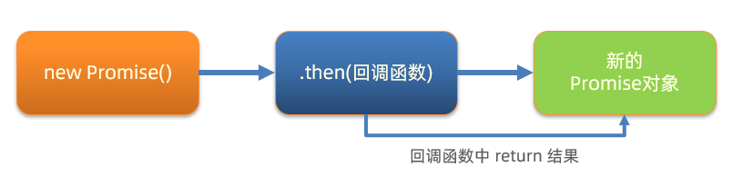

4. 按照图解，编写核心代码：

   ```js
   /**
    * 目标：掌握Promise的链式调用
    * 需求：把省市的嵌套结构，改成链式调用的线性结构
   */
   // 1. 创建Promise对象-模拟请求省份名字
   const p = new Promise((resolve, reject) => {
     setTimeout(() => {
       resolve('北京市')
     }, 2000)
   })
   
   // 2. 获取省份名字
   const p2 = p.then(result => {
     console.log(result)
     // 3. 创建Promise对象-模拟请求城市名字
     // return Promise对象最终状态和结果，影响到新的Promise对象
     return new Promise((resolve, reject) => {
       setTimeout(() => {
         resolve(result + '--- 北京')
       }, 2000)
     })
   })
   
   // 4. 获取城市名字
   p2.then(result => {
     console.log(result)
   })
   
   // then()原地的结果是一个新的Promise对象
   console.log(p2 === p)
   ```

   


### 小结

1. 什么是 Promise 的链式调用?

   <details>
   <summary>答案</summary>
   <ul>
   <li>使用 then 方法返回新 Promise 对象特性，一直串联下去</li>
   </ul>
   </details>

2. then 回调函数中，return 的值会传给哪里?

   <details>
   <summary>答案</summary>
   <ul>
   <li>传给 then 方法生成的新 Promise 对象</li>
   </ul>
   </details>

3. Promise 链式调用有什么用?

   <details>
   <summary>答案</summary>
   <ul>
   <li>解决回调函数嵌套问题</li>
   </ul>
   </details>


## 04.Promise-链式调用_解决回调地狱

### 目标

了解 Promise 链式调用解决回调地狱


### 讲解

1. 目标：使用 Promise 链式调用，解决回调函数地狱问题

2. 做法：每个 Promise 对象中管理一个异步任务，用 then 返回 Promise 对象，串联起来

   

3. 按照图解思路，编写核心代码：

   ```js
   /**
    * 目标：把回调函数嵌套代码，改成Promise链式调用结构
    * 需求：获取默认第一个省，第一个市，第一个地区并展示在下拉菜单中
   */
   let pname = ''
   // 1. 得到-获取省份Promise对象
   axios({url: 'http://hmajax.itheima.net/api/province'}).then(result => {
     pname = result.data.list[0]
     document.querySelector('.province').innerHTML = pname
     // 2. 得到-获取城市Promise对象
     return axios({url: 'http://hmajax.itheima.net/api/city', params: { pname }})
   }).then(result => {
     const cname = result.data.list[0]
     document.querySelector('.city').innerHTML = cname
     // 3. 得到-获取地区Promise对象
     return axios({url: 'http://hmajax.itheima.net/api/area', params: { pname, cname }})
   }).then(result => {
     console.log(result)
     const areaName = result.data.list[0]
     document.querySelector('.area').innerHTML = areaName
   })
   ```


### 小结

1. Promise 链式调用如何解决回调函数地狱?

   <details>
   <summary>答案</summary>
   <ul>
   <li>then 的回调函数中 return Promise对象，影响当前新 Promise 对象的值</li>
   </ul>
   </details>


## 05.async 函数和 await

### 目标

掌握 async 和 await 语法来编写简洁的异步代码


### 讲解

1. 概念：在 async 函数内，使用 await 关键字取代 then 函数，等待获取 Promise 对象成功状态的结果值 

2. 做法：使用 async 和 await 解决回调地狱问题

3. 核心代码：

   ```js
   /**
    * 目标：掌握async和await语法，解决回调函数地狱
    * 概念：在async函数内，使用await关键字，获取Promise对象"成功状态"结果值
    * 注意：await必须用在async修饰的函数内（await会阻止"异步函数内"代码继续执行，原地等待结果）
   */
   // 1. 定义async修饰函数
   async function getData() {
     // 2. await等待Promise对象成功的结果
     const pObj = await axios({url: 'http://hmajax.itheima.net/api/province'})
     const pname = pObj.data.list[0]
     const cObj = await axios({url: 'http://hmajax.itheima.net/api/city', params: { pname }})
     const cname = cObj.data.list[0]
     const aObj = await axios({url: 'http://hmajax.itheima.net/api/area', params: { pname, cname }})
     const areaName = aObj.data.list[0]
   
   
     document.querySelector('.province').innerHTML = pname
     document.querySelector('.city').innerHTML = cname
     document.querySelector('.area').innerHTML = areaName
   }
   
   getData()
   ```

   > 使用 await 替代 then 的方法
   >
   > async修改的函数内部才可以用await关键字；async可以修改匿名函数，如果是箭头函数，async放在参数名前面修饰即可


### 小结

1. await 的作用是什么？

   <details>
   <summary>答案</summary>
   <ul>
   <li>替代 then 方法来提取 Promise 对象成功状态的结果</li>
   </ul>
   </details>


## 06.async 函数和 await 捕获错误

### 目标

了解用 try catch 捕获同步流程的错误


### 讲解

1. try 和 catch 的作用：语句标记要尝试的语句块，并指定一个出现异常时抛出的响应

   ```js
   try {
     // 要执行的代码
   } catch (error) {
     // error 接收的是，错误消息
     // try 里代码，如果有错误，直接进入这里执行
   }
   ```
   
   > try 里有报错的代码，会立刻跳转到 catch 中

2. 尝试把代码中 url 地址写错，运行观察 try catch 的捕获错误信息能力

   ```js
   /**
    * 目标：async和await_错误捕获
   */
   async function getData() {
     // 1. try包裹可能产生错误的代码
     try {
       const pObj = await axios({ url: 'http://hmajax.itheima.net/api/province' })
       const pname = pObj.data.list[0]
       const cObj = await axios({ url: 'http://hmajax.itheima.net/api/city', params: { pname } })
       const cname = cObj.data.list[0]
       const aObj = await axios({ url: 'http://hmajax.itheima.net/api/area', params: { pname, cname } })
       const areaName = aObj.data.list[0]
   
       document.querySelector('.province').innerHTML = pname
       document.querySelector('.city').innerHTML = cname
       document.querySelector('.area').innerHTML = areaName
     } catch (error) {
       // 2. 接着调用catch块，接收错误信息
       // 如果try里某行代码报错后，try中剩余的代码不会执行了
       console.dir(error)
     }
   }
   
   getData()
   ```

   


### 小结

1. try 和 catch 有什么作用？

   <details>
   <summary>答案</summary>
   <ul>
   <li>捕获同步流程的代码报错信息</li>
   </ul>
   </details>


## 07.事件循环

### 目标

掌握事件循环模型是如何执行异步代码的


### 讲解

1. 事件循环（EventLoop）：掌握后知道 JS 是如何安排和运行代码的

   > 请回答下面 2 段代码打印的结果，并说明原因

   ```js
   console.log(1)
   setTimeout(() => {
     console.log(2)
   }, 2000)
   ```

   ```js
   console.log(1)
   setTimeout(() => {
     console.log(2)
   }, 0)
   console.log(3)
   ```

   

2. 作用：事件循环负责执行代码，收集和处理事件以及执行队列中的子任务

3. 原因：JavaScript 单线程（某一刻只能执行一行代码），为了让耗时代码不阻塞其他代码运行，设计了事件循环模型

4. 概念：执行代码和收集异步任务的模型，在调用栈空闲，反复调用任务队列里回调函数的执行机制，就叫事件循环

   ```js
   /**
    * 目标：阅读并回答执行的顺序结果
   */
   console.log(1)
   setTimeout(() => {
     console.log(2)
   }, 0)
   console.log(3)
   setTimeout(() => {
     console.log(4)
   }, 2000)
   console.log(5)
   ```

   > 具体运行过程，请参考 PPT 动画和视频讲解

   


### 小结

1. 什么是事件循环？

   <details>
   <summary>答案</summary>
   <ul>
   <li>执行代码和收集异步任务，在调用栈空闲时，反复调用任务队列里回调函数执行机制
   </li>
   </ul>
   </details>

2. 为什么有事件循环？

   <details>
   <summary>答案</summary>
   <ul>
   <li>JavaScript 是单线程的，为了不阻塞 JS 引擎，设计执行代码的模型
   </li>
   </ul>
   </details>

3. JavaScript 内代码如何执行？

   <details>
   <summary>答案</summary>
   <ul>
   <li> 执行同步代码，遇到异步代码交给宿主浏览器环境执行</li>
   <li>异步有了结果后，把回调函数放入任务队列排队</li>
   <li> 当调用栈空闲后，反复调用任务队列里的回调函数</li>
   </ul>
   </details>


## 08.事件循环-练习

### 目标

了解事件循环的执行模型


### 讲解

1. 需求：请根据掌握的事件循环的模型概念，分析代码执行过程

   ```js
   /**
    * 目标：阅读并回答执行的顺序结果
   */
   console.log(1)
   setTimeout(() => {
     console.log(2)
   }, 0)
   function myFn() {
     console.log(3)
   }
   function ajaxFn() {
     const xhr = new XMLHttpRequest()
     xhr.open('GET', 'http://hmajax.itheima.net/api/province')
     xhr.addEventListener('loadend', () => {
       console.log(4)
     })
     xhr.send()
   }
   for (let i = 0; i < 1; i++) {
     console.log(5)
   }
   ajaxFn()
   document.addEventListener('click', () => {
     console.log(6)
   })
   myFn()
   ```
   
   
   
   

> 结果：1 5 3 2 4 点击一次document就会执行一次打印6


### 小结

暂无


## 09.宏任务与微任务

### 目标

掌握微任务和宏任务的概念和区分


### 讲解

1. ES6 之后引入了 Promise 对象， 让 JS 引擎也可以发起异步任务

2. 异步任务划分为了

   * 宏任务：由浏览器环境执行的异步代码
   * 微任务：由 JS 引擎环境执行的异步代码

3. 宏任务和微任务具体划分：

   

4. 事件循环模型

   > 具体运行效果，参考 PPT 动画或者视频

   ```js
   /**
    * 目标：阅读并回答打印的执行顺序
   */
   console.log(1)
   setTimeout(() => {
     console.log(2)
   }, 0)
   const p = new Promise((resolve, reject) => {
     resolve(3)
   })
   p.then(res => {
     console.log(res)
   })
   console.log(4)
   ```

   

   


> 注意：
>
> script标签是js脚本执行事件，它是宏任务。
>
> 微任务队列会优先执行，它更接近js引擎；微任务队列清空后，才会执行下一个宏任务
>
> 宏任务每次在执行同步代码时，遇到微任务代码，就会产生微任务队列；当微任务队列的任务都执行完成后，微任务队列空间释放！
>
> 下一次宏任务执行时，遇到微任务代码，才会再次申请微任务队列空间放入回调函数消息排队
>
> 总结：一个宏任务包含微任务队列，他们之间是包含关系，不是并列关系


### 小结

1. 什么是宏任务？

   <details>
   <summary>答案</summary>
   <ul>
   <li>浏览器执行的异步代码
    例如：JS 执行脚本事件，setTimeout/setInterval，AJAX请求完成事件，用户交互事件等
   </li>
   </ul>
   </details>

2. 什么是微任务？

   <details>
   <summary>答案</summary>
   <ul>
   <li>JS 引擎执行的异步代码
    例如：Promise对象.then()的回调
   </li>
   </ul>
   </details>

3. JavaScript 内代码如何执行？

   <details>
   <summary>答案</summary>
   <ul>
   <li>  执行第一个 script 脚本事件宏任务，里面是同步代</li>
   <li>遇到 宏任务/微任务 交给宿主环境或js引擎，有结果后（处理完成），回调函数进入对应队列</li>
   <li>当执行栈空闲时，清空微任务队列，再执行下一个宏任务，从1再来</li>
   </ul>
   </details>


## 10.事件循环 - 经典面试题

### 目标

锻炼事件循环模型的使用


### 讲解

1. 需求：请切换到对应配套代码，查看具体代码，并回答打印顺序（锻炼事件循环概念的理解，阅读代码执行顺序_）

   ```js
   // 目标：回答代码执行顺序
   console.log(1)
   setTimeout(() => {
     console.log(2)
     const p = new Promise(resolve => resolve(3))
     p.then(result => console.log(result))
   }, 0)
   const p = new Promise(resolve => {
     setTimeout(() => {
       console.log(4)
     }, 0)
     resolve(5)
   })
   p.then(result => console.log(result))
   const p2 = new Promise(resolve => resolve(6))
   p2.then(result => console.log(result))
   console.log(7)
   ```
   
   
   
   


### 小结

暂无


## 11.Promise.all 静态方法

### 目标

了解 Promise.all 作用和使用场景


### 讲解

1. 概念：合并多个 Promise 对象，等待所有同时成功完成（或某一个失败），做后续逻辑

   

2. 语法：

   ```js
   const p = Promise.all([Promise对象, Promise对象, ...])
   p.then(result => {
     // result 结果: [Promise对象成功结果, Promise对象成功结果, ...]
   }).catch(error => {
     // 第一个失败的 Promise 对象，抛出的异常对象
   })
   ```


3. 需求：同时请求“北京”，“上海”，“广州”，“深圳”的天气并在网页尽可能同时显示

   

4. 核心代码如下：

   ```html
   <!DOCTYPE html>
   <html lang="en">
   
   <head>
     <meta charset="UTF-8">
     <meta http-equiv="X-UA-Compatible" content="IE=edge">
     <meta name="viewport" content="width=device-width, initial-scale=1.0">
     <title>Promise的all方法</title>
   </head>
   
   <body>
     <ul class="my-ul"></ul>
     <script src="https://cdn.jsdelivr.net/npm/axios/dist/axios.min.js"></script>
     <script>
       /**
        * 目标：掌握Promise的all方法作用，和使用场景
        * 业务：当我需要同一时间显示多个请求的结果时，就要把多请求合并
        * 例如：默认显示"北京", "上海", "广州", "深圳"的天气在首页查看
        * code：
        * 北京-110100
        * 上海-310100
        * 广州-440100
        * 深圳-440300
       */
       // 1. 请求城市天气，得到Promise对象
       const bjPromise = axios({ url: 'http://hmajax.itheima.net/api/weather', params: { city: '110100' } })
       const shPromise = axios({ url: 'http://hmajax.itheima.net/api/weather', params: { city: '310100' } })
       const gzPromise = axios({ url: 'http://hmajax.itheima.net/api/weather', params: { city: '440100' } })
       const szPromise = axios({ url: 'http://hmajax.itheima.net/api/weather', params: { city: '440300' } })
   
       // 2. 使用Promise.all，合并多个Promise对象
       const p = Promise.all([bjPromise, shPromise, gzPromise, szPromise])
       p.then(result => {
         // 注意：结果数组顺序和合并时顺序是一致
         console.log(result)
         const htmlStr = result.map(item => {
           return `<li>${item.data.data.area} --- ${item.data.data.weather}</li>`
         }).join('')
         document.querySelector('.my-ul').innerHTML = htmlStr
       }).catch(error => {
         console.dir(error)
       })
     </script>
   </body>
   
   </html>
   ```


### 小结

1. Promise.all 什么时候使用？

   <details>
   <summary>答案</summary>
   <ul>
   <li>合并多个 Promise 对象并等待所有同时成功的结果，如果有一个报错就会最终为失败状态，当需要同时渲染多个接口数据同时到网页上时使用
   </li>
   </ul>
   </details>


## 12.案例-商品分类

### 目标

完成商品分类效果


### 讲解

1. 需求：尽可能同时展示所有商品分类到页面上

   

2. 步骤：

   1. 获取所有的一级分类数据

   2. 遍历id，创建获取二级分类请求

   3. 合并所有二级分类Promise对象

   4. 等待同时成功，开始渲染页面

3. 核心代码：

   ```js
   /**
    * 目标：把所有商品分类“同时”渲染到页面上
    *  1. 获取所有一级分类数据
    *  2. 遍历id，创建获取二级分类请求
    *  3. 合并所有二级分类Promise对象
    *  4. 等待同时成功后，渲染页面
   */
   // 1. 获取所有一级分类数据
   axios({
     url: 'http://hmajax.itheima.net/api/category/top'
   }).then(result => {
     console.log(result)
     // 2. 遍历id，创建获取二级分类请求
     const secPromiseList = result.data.data.map(item => {
       return axios({
         url: 'http://hmajax.itheima.net/api/category/sub',
         params: {
           id: item.id // 一级分类id
         }
       })
     })
     console.log(secPromiseList) // [二级分类请求Promise对象，二级分类请求Promise对象，...]
     // 3. 合并所有二级分类Promise对象
     const p = Promise.all(secPromiseList)
     p.then(result => {
       console.log(result)
       // 4. 等待同时成功后，渲染页面
       const htmlStr = result.map(item => {
         const dataObj = item.data.data // 取出关键数据对象
         return `<div class="item">
       <h3>${dataObj.name}</h3>
       <ul>
         ${dataObj.children.map(item => {
           return `<li>
           <a href="javascript:;">
             
             <p>${item.name}</p>
           </a>
         </li>`
         }).join('')}
       </ul>
     </div>`
       }).join('')
       console.log(htmlStr)
       document.querySelector('.sub-list').innerHTML = htmlStr
     })
   })
   ```


### 小结

暂无


## 13.案例-学习反馈-省市区切换

### 目标

完成省市区切换效果


### 讲解

1. 需求：完成省市区切换效果

   

2. 步骤：

   1. 设置省份数据到下拉菜单

   2. 切换省份，设置城市数据到下拉菜单，并清空地区下拉菜单

   3. 切换城市，设置地区数据到下拉菜单

3. 核心代码：

   ```js
   /**
    * 目标1：完成省市区下拉列表切换
    *  1.1 设置省份下拉菜单数据
    *  1.2 切换省份，设置城市下拉菜单数据，清空地区下拉菜单
    *  1.3 切换城市，设置地区下拉菜单数据
    */
   // 1.1 设置省份下拉菜单数据
   axios({
     url: 'http://hmajax.itheima.net/api/province'
   }).then(result => {
     const optionStr = result.data.list.map(pname => `<option value="${pname}">${pname}</option>`).join('')
     document.querySelector('.province').innerHTML = `<option value="">省份</option>` + optionStr
   })
   
   // 1.2 切换省份，设置城市下拉菜单数据，清空地区下拉菜单
   document.querySelector('.province').addEventListener('change', async e => {
     // 获取用户选择省份名字
     // console.log(e.target.value)
     const result = await axios({ url: 'http://hmajax.itheima.net/api/city', params: { pname: e.target.value } })
     const optionStr = result.data.list.map(cname => `<option value="${cname}">${cname}</option>`).join('')
     // 把默认城市选项+下属城市数据插入select中
     document.querySelector('.city').innerHTML = `<option value="">城市</option>` + optionStr
   
     // 清空地区数据
     document.querySelector('.area').innerHTML = `<option value="">地区</option>`
   })
   
   // 1.3 切换城市，设置地区下拉菜单数据
   document.querySelector('.city').addEventListener('change', async e => {
     console.log(e.target.value)
     const result = await axios({url: 'http://hmajax.itheima.net/api/area', params: {
       pname: document.querySelector('.province').value,
       cname: e.target.value
     }})
     console.log(result)
     const optionStr = result.data.list.map(aname => `<option value="${aname}">${aname}</option>`).join('')
     console.log(optionStr)
     document.querySelector('.area').innerHTML = `<option value="">地区</option>` + optionStr
   })
   ```

   

### 小结

暂无


## 14.案例-学习反馈-数据提交

### 目标

完成学习反馈数据提交


### 讲解

1. 需求：收集学习反馈数据，提交保存

   

2. 步骤：

   1. 监听提交按钮的点击事件

   2. 依靠插件收集表单数据

   3. 基于 axios 提交保存，显示结果

3. 核心代码如下：

   ```js
   /**
    * 目标2：收集数据提交保存
    *  2.1 监听提交的点击事件
    *  2.2 依靠插件收集表单数据
    *  2.3 基于axios提交保存，显示结果
    */
   // 2.1 监听提交的点击事件
   document.querySelector('.submit').addEventListener('click', async () => {
     // 2.2 依靠插件收集表单数据
     const form = document.querySelector('.info-form')
     const data = serialize(form, { hash: true, empty: true })
     console.log(data)
     // 2.3 基于axios提交保存，显示结果
     try {
       const result = await axios({
         url: 'http://hmajax.itheima.net/api/feedback',
         method: 'POST',
         data
       })
       console.log(result)
       alert(result.data.message)
     } catch (error) {
       console.dir(error)
       alert(error.response.data.message)
     }
   })
   ```

   

### 小结

暂无


## 今日重点(必须会)

1. 掌握 async 和 await 的使用

2. 理解 EventLoop 和宏任务微任务执行顺序

3. 了解 Promise.all 的作用和使用场景

4. 完成案例-学习反馈

   

## 今日作业(必完成)

参考作业文件夹里md文档的要求


## 参考文献

1. [async和await的mdn讲解](https://developer.mozilla.org/zh-CN/docs/Web/JavaScript/Reference/Statements/async_function#%E5%B0%9D%E8%AF%95%E4%B8%80%E4%B8%8B)