> 阶段目标：掌握HTML、CSS常用布局技巧，能够独立制作网页。

# day01：HTML 基础

> 目标：掌握标签基本语法，能够独立布局文章页。

## 01-今日课程介绍

> 今日目标：掌握标签基本语法，能够独立布局文章页。

### 核心技术点
* 网页组成

* 排版标签

* 多媒体标签及属性

* 综合案例一 - 个人简介

  

* 综合案例二 - Vue 简介

  

  

## 02-标签语法

HTML 超文本标记语言——HyperText Markup Language。 

* 超文本：链接
* 标记：标签，带尖括号的文本


### 标签结构

* 标签要成对出现，中间包裹内容
* <>里面放英文字母（标签名）
* 结束标签比开始标签多 /
* 标签分类：双标签和单标签

```html
<strong>需要加粗的文字<strong>
<br>
<hr>
```


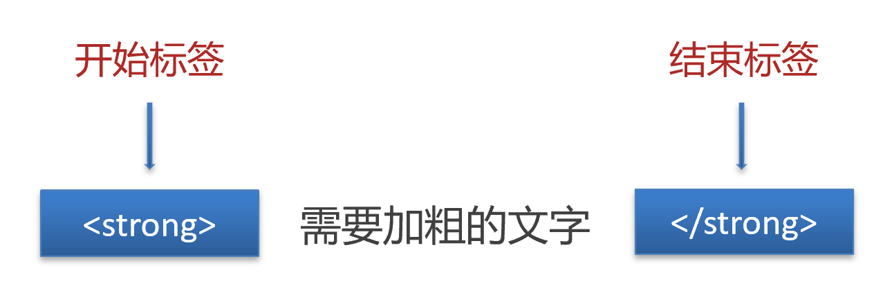

## 03-HTML骨架

* html：整个网页
* head：网页头部，用来存放给浏览器看的信息，例如 CSS
  * title：网页标题
* body：网页主体，用来存放给用户看的信息，例如图片、文字

```html
<html>
  <head>
    <title>网页标题</title>
  </head>
  <body>
    网页主体
  </body>
</html>
```

> 提示
>
> VS Code 可以快速生成骨架：在 HTML 文件（.html）中，!（英文）配合 Enter / Tab 键

## 04-标签的关系

> 作用：明确标签的书写位置，让代码格式更整齐

* 父子关系（嵌套关系）：子级标签换行且缩进（Tab键）

  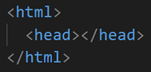

* 兄弟关系（并列关系）：兄弟标签换行要对齐

  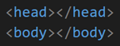

  

## 05-注释

概念：注释是对代码的解释和说明，能够提高程序的可读性，方便理解、查找代码。

注释不会再浏览器中显示。

在 VS Code 中，**添加 / 删除**注释的快捷键：**Ctrl + /** 

```html
<!-- 我是 HTML 注释 -->
```

## 06-标题标签

一般用在新闻标题、文章标题、网页区域名称、产品名称等等。 

```html
<h1>一级标题</h1>
<h2>二级标题</h2>
<h3>三级标题</h3>
<h4>四级标题</h4>
<h5>五级标题</h5>
<h6>六级标题</h6>
```

显示特点：

* 文字加粗
* 字号逐渐减小
* 独占一行（换行）

> 经验
>
> 1. h1 标签在一个网页中只能用一次，用来放新闻标题或网页的 logo
> 2. h2 ~ h6 没有使用次数的限制

## 07-段落标签

一般用在新闻段落、文章段落、产品描述信息等等。 

```html
<p>段落</p>
```

显示特点：

* 独占一行
* 段落之间存在间隙

## 08-换行和水平线

* 换行：br
* 水平线：hr

```html
<br>
<hr>
```

## 09-文本格式化标签

作用：为文本添加特殊格式，以突出重点。常见的文本格式：加粗、倾斜、下划线、删除线等。 


> 提示：strong、em、ins、del 标签自带强调含义（语义）。 

## 10-图像标签

作用：在网页中插入图片

```html

```

src用于指定图像的位置和名称，是  的必须属性。 

### 图像属性


### 属性语法

* 属性名="属性值"
* 属性写在尖括号里面，标签名后面，标签名和属性之间用空格隔开，不区分先后顺序

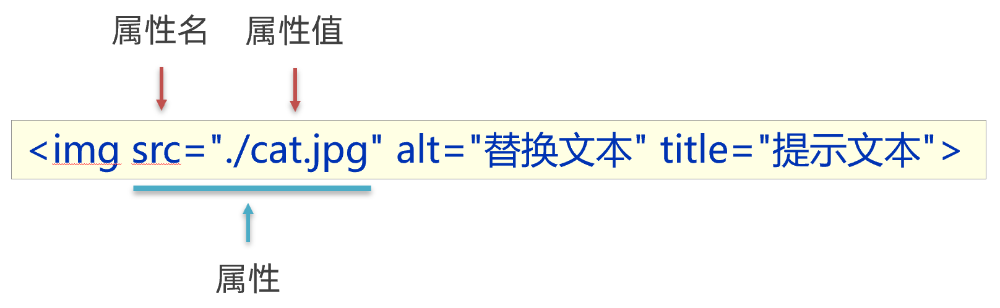

## 11-路径

概念：路径指的是查找文件时，从**起点**到**终点**经历的**路线**。 

路径分类：

* 相对路径：从当前文件位置出发查找目标文件
* 绝对路径：从盘符出发查找目标文件
  * Windows 电脑从盘符出发
  * Mac 电脑从根目录出发

### 相对路径

查找方式：从**当前文件位置**出发查找目标文件

特殊符号：

* **/** 表示进入某个文件夹里面          → 文件夹名/
* **. ** 表示当前文件所在文件夹           → ./
* **..** 表示当前文件的上一级文件夹 → ../   

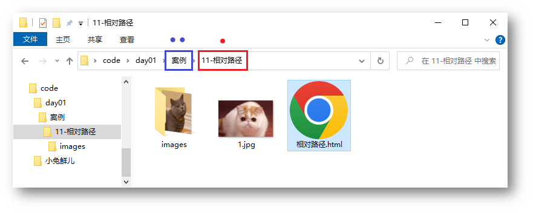

### 绝对路径

查找方式：Windows 电脑从盘符出发；Mac 电脑从根目录（/）出发

```html

```

> 提示
>
> 1. Windows 默认是 \ ，其他系统是 /，建议统一写为 / 
> 2. 特殊的绝对路径 → 文件的在线网址：<https://www.itheima.com/images/logo.png> "，应用场景：网页底部**友情链接**

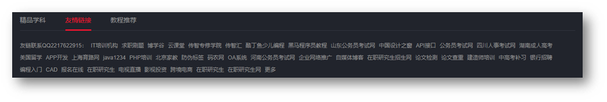

## 12-超链接标签

作用：点击跳转到其他页面。 

```html
<a href="https://www.baidu.com">跳转到百度</a>
```

**href 属性值是跳转地址，是超链接的必须属性。**

超链接默认是在当前窗口跳转页面，添加 **target="_blank"** 实现**新窗口**打开页面。

拓展：开发初期，不确定跳转地址，则 href 属性值写为 **#**，表示**空链接**，页面不会跳转，在当前页面刷新一次。

```html
<a href="https://www.baidu.com/">跳转到百度</a>

<!-- 跳转到本地文件：相对路径查找 --> 
<!-- target="_blank" 新窗口跳转页面 --> 
<a href="./01-标签的写法.html" target="_blank">跳转到01-标签的写法</a>

<!-- 开发初期，不知道超链接的跳转地址，href属性值写#，表示空链接，不会跳转 -->
<a href="#">空链接</a>
```

## 13-音频

```html
<audio src="音频的 URL"></audio>
```

常用属性


> 拓展：书写 HTML5 属性时，如果属性名和属性值相同，可以简写为一个单词。 

```html
<!-- 在 HTML5 里面，如果属性名和属性值完全一样，可以简写为一个单词 -->
<audio src="./media/music.mp3" controls loop autoplay></audio>
```

## 14-视频

```html
<video src="视频的 URL"></video>
```

常用属性


```html
<!-- 在浏览器中，想要自动播放，必须有 muted 属性 -->
<video src="./media/vue.mp4" controls loop muted autoplay></video>
```

## 15-综合案例一-个人简介

> 网页制作思路：从上到下，先整体再局部，逐步分析制作
>
> 分析内容 → 写代码 → 保存 → 刷新浏览器，看效果

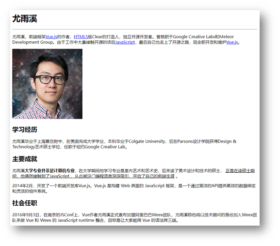

```html
<h1>尤雨溪</h1>
<hr>
<p>尤雨溪，前端框架<a href="../17-综合案例二/vue简介.html">Vue.js</a>的作者，<a href="#">HTML5</a>版Clear的打造人，独立开源开发者。曾就职于Google Creative Labs和Meteor Development Group。由于工作中大量接触开源的项目<a href="#">JavaScript</a>，最后自己也走上了开源之路，现全职开发和维护<a href="#">Vue.js</a>。

</p>

<h2>学习经历</h2>
<p>尤雨溪毕业于上海复旦附中，在美国完成大学学业，本科毕业于Colgate University，后在Parsons设计学院获得Design & Technology艺术硕士学位，任职于纽约Google Creative Lab。</p>
<h2>主要成就</h2>
<p>尤雨溪<strong>大学专业并非是计算机专业</strong>，在大学期间他学习专业是室内艺术和艺术史，后来读了美术设计和技术的硕士， <ins>正是在读硕士期间，他偶然接触到了JavaScript ，从此被这门编程语言深深吸引，开启了自己的前端生涯</ins> 。</p>
<p>2014年2月，开发了一个前端开发库Vue.js。Vue.js 是构建 Web 界面的 JavaScript 框架，是一个通过简洁的API提供高效的数据绑定和灵活的组件系统。</p>
<h2>社会任职</h2>
<p>2016年9月3日，在南京的JSConf上，Vue作者尤雨溪正式宣布加盟阿里巴巴Weex团队，尤雨溪称他将以技术顾问的身份加入Weex团队来做 Vue 和 Weex 的 JavaScript runtime 整合，目标是让大家能用 Vue 的语法跨三端。</p>
```

## 16-综合案例二-Vue简介

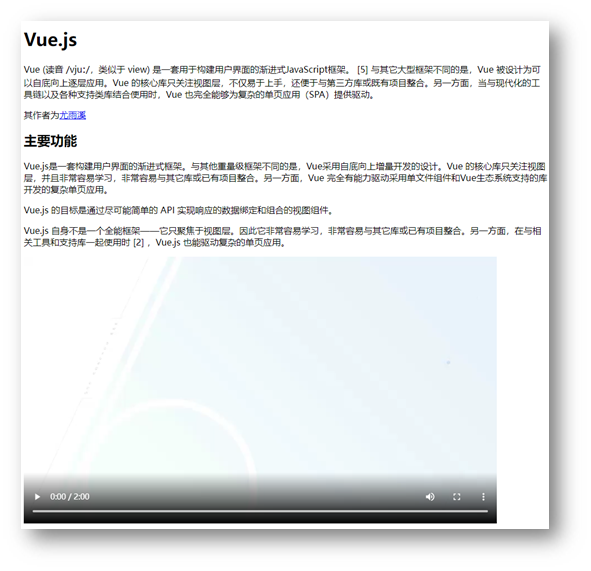

```html
<h1>Vue.js</h1>
<p>Vue (读音 /vjuː/，类似于 view) 是一套用于构建用户界面的渐进式JavaScript框架。 [5] 与其它大型框架不同的是，Vue 被设计为可以自底向上逐层应用。Vue 的核心库只关注视图层，不仅易于上手，还便于与第三方库或既有项目整合。另一方面，当与现代化的工具链以及各种支持类库结合使用时，Vue 也完全能够为复杂的单页应用（SPA）提供驱动。</p>
<p>其作者为<a href="../16-综合案例一/个人简介.html" target="_blank">尤雨溪</a></p>
<h2>主要功能</h2>
<p>Vue.js是一套构建用户界面的渐进式框架。与其他重量级框架不同的是，Vue采用自底向上增量开发的设计。Vue 的核心库只关注视图层，并且非常容易学习，非常容易与其它库或已有项目整合。另一方面，Vue 完全有能力驱动采用单文件组件和Vue生态系统支持的库开发的复杂单页应用。</p>
<p>Vue.js 的目标是通过尽可能简单的 API 实现响应的数据绑定和组合的视图组件。</p>
<p>Vue.js 自身不是一个全能框架——它只聚焦于视图层。因此它非常容易学习，非常容易与其它库或已有项目整合。另一方面，在与相关工具和支持库一起使用时 [2] ，Vue.js 也能驱动复杂的单页应用。</p>
<video src="../media/vue.mp4" controls></video>
```


# day02：列表、表格、表单

> 目标：掌握嵌套关系标签的写法，使用列表标签布局网页

## 01-列表

作用：布局内容排列整齐的区域。

列表分类：无序列表、有序列表、定义列表。

### 无序列表

作用：布局排列整齐的**不需要规定顺序**的区域。

标签：ul 嵌套 li，ul 是无序列表，li 是列表条目。

```html
<ul>
  <li>第一项</li>
  <li>第二项</li>
  <li>第三项</li>
  ……
</ul>
```

> 注意事项：
>
> * ul 标签里面只能包裹 li 标签
> * li 标签里面可以包裹任何内容

### 有序列表

作用：布局排列整齐的**需要规定顺序**的区域。

标签：ol 嵌套 li，ol 是有序列表，li 是列表条目。

```html
<ol>
  <li>第一项</li>
  <li>第二项</li>
  <li>第三项</li>
  ……
</ol>
```

> 注意事项：
>
> * ol 标签里面只能包裹 li 标签
> * li 标签里面可以包裹任何内容

### 定义列表

标签：dl 嵌套 dt 和 dd，dl 是定义列表，dt 是定义列表的标题，dd 是定义列表的描述 / 详情。

```html
<dl>
  <dt>列表标题</dt>
  <dd>列表描述 / 详情</dd>
   ……
</dl>
```


> 注意事项：
>
> * dl 里面只能包含dt 和 dd
> * dt 和 dd 里面可以包含任何内容

## 02-表格

网页中的表格与 Excel 表格类似，用来展示数据。 


### 基本使用

标签：table 嵌套 tr，tr 嵌套 td / th。 


> 提示：在网页中，**表格默认没有边框线**，使用 **border 属性**可以为表格添加边框线。 

```html
<table border="1">
  <tr>
    <th>姓名</th>
    <th>语文</th>
    <th>数学</th>
    <th>总分</th>
  </tr>
  <tr>
    <td>张三</td>
    <td>99</td>
    <td>100</td>
    <td>199</td>
  </tr>
  <tr>
    <td>李四</td>
    <td>98</td>
    <td>100</td>
    <td>198</td>
  </tr>
  <tr>
    <td>总结</td>
    <td>全市第一</td>
    <td>全市第一</td>
    <td>全市第一</td>
  </tr>
</table>
```

### 表格结构标签-了解

作用：用表格结构标签把内容划分区域，让表格结构更清晰，语义更清晰。

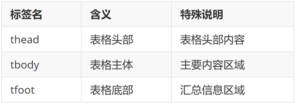

> 提示：表格结构标签可以省略。

### 合并单元格

作用：将多个单元格合并成一个单元格，以合并同类信息。 


合并单元格的步骤：

1. 明确合并的目标
2. 保留**最左最上**的单元格，添加属性（取值是**数字**，表示需要**合并的单元格数量**）
   * **跨行合并**，保留最上单元格，添加属性 **rowspan**
   * **跨列合并**，保留最左单元格，添加属性 **colspan**
3. 删除其他单元格

```html
<table border="1">
  <thead>
    <tr>
      <th>姓名</th>
      <th>语文</th>
      <th>数学</th>
      <th>总分</th>
    </tr>
  </thead>
  <tbody>
    <tr>
      <td>张三</td>
      <td>99</td>
      <td rowspan="2">100</td>
      <td>199</td>
    </tr>
    <tr>
      <td>李四</td>
      <td>98</td>
      <!-- <td>100</td> -->
      <td>198</td>
    </tr>
  </tbody>
  <tfoot>
    <tr>
      <td>总结</td>
      <td colspan="3">全市第一</td>
      <!-- <td>全市第一</td>
      <td>全市第一</td> -->
    </tr>
  </tfoot>
</table>
```

> 注意：不能跨表格结构标签合并单元格（thead、tbody、tfoot）。

## 03-表单

作用：收集用户信息。

使用场景：

* 登录页面
* 注册页面
* 搜索区域

### input 标签

input 标签 type 属性值不同，则功能不同。 

```html
<input type="..." >
```


### input 标签占位文本 

占位文本：提示信息，文本框和密码框都可以使用。 

```html
<input type="..." placeholder="提示信息">
```

### 单选框

常用属性


```html
<input type="radio" name="gender" checked> 男
<input type="radio" name="gender"> 女
```

> 提示：name 属性值自定义。

### 上传文件 

默认情况下，文件上传表单控件只能上传一个文件，添加 multiple 属性可以实现文件多选功能。

```html
<input type="file" multiple>
```

### 多选框

多选框也叫复选框，默认选中：checked。

```html
<input type="checkbox" checked> 敲前端代码
```

### 下拉菜单


标签：select 嵌套 option，select 是下拉菜单整体，option是下拉菜单的每一项。

```html
<select>
  <option>北京</option>
  <option>上海</option>
  <option>广州</option>
  <option>深圳</option>
  <option selected>武汉</option>
</select>
```

> 默认显示第一项，**selected** 属性实现**默认选中**功能。

### 文本域

作用：多行输入文本的表单控件。 


```html
<textarea>默认提示文字</textarea>
```

> 注意点：
>
> * 实际开发中，使用 CSS 设置 文本域的尺寸
> * 实际开发中，一般禁用右下角的拖拽功能

### label 标签 

作用：网页中，某个标签的说明文本。 

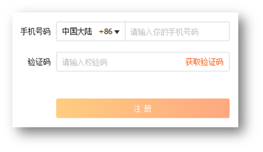

经验：用 label 标签绑定文字和表单控件的关系，增大表单控件的点击范围。 


* 写法一
  * label 标签只包裹内容，不包裹表单控件
  * 设置 label 标签的 for 属性值 和表单控件的 id 属性值相同

```html
<input type="radio" id="man">
<label for="man">男</label>
```

* 写法二：使用 label 标签包裹文字和表单控件，不需要属性 

```html
<label><input type="radio"> 女</label>
```

> 提示：支持 label 标签增大点击范围的表单控件：文本框、密码框、上传文件、单选框、多选框、下拉菜单、文本域等等。 

### 按钮

```html
<button type="">按钮</button>
```


```html
<!-- form 表单区域 -->
<!-- action="" 发送数据的地址 -->
<form action="">
  用户名：<input type="text">
  <br><br>
  密码：<input type="password">
  <br><br>

  <!-- 如果省略 type 属性，功能是 提交 -->
  <button type="submit">提交</button>
  <button type="reset">重置</button>
  <button type="button">普通按钮</button>
</form>
```

> 提示：按钮需配合 form 标签（表单区域）才能实现对应的功能。

## 04-语义化

### 无语义的布局标签 

作用：布局网页（划分网页区域，摆放内容）

* div：独占一行
* span：不换行

```html
<div>div 标签，独占一行</div>
<span>span 标签，不换行</span>
```

### 有语义的布局标签


## 05-字符实体


## 06-综合案例一-体育新闻列表 

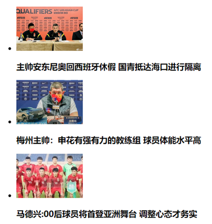

```html
<ul>
  <li>
    
    <h3>主帅安东尼奥回西班牙休假 国青抵达海口进行隔离</h3>
  </li>
  <li>
    
    <h3>梅州主帅：申花有强有力的教练组 球员体能水平高</h3>
  </li>
  <li>
    
    <h3>马德兴:00后球员将首登亚洲舞台 调整心态才务实</h3>
  </li>
</ul>
```

## 07-综合案例二-注册信息


```html
<h1>注册信息</h1>
<form action="">
  <!-- 表单控件 -->
  <!-- 个人信息 -->
  <h2>个人信息</h2>
  <label>姓名：</label><input type="text" placeholder="请输入真实姓名">
  <br><br>
  <label>密码：</label><input type="password" placeholder="请输入密码">
  <br><br>
  <label>确认密码：</label><input type="password" placeholder="请输入确认密码">
  <br><br>
  <label>性别：</label>
  <label><input type="radio" name="gender"> 男</label>
  <label><input type="radio" name="gender" checked> 女</label>
  <br><br>
  <label>居住城市：</label>
  <select>
    <option>北京</option>
    <option>上海</option>
    <option>广州</option>
    <option>深圳</option>
    <option>武汉</option>
  </select>
  <!-- 教育经历 -->
  <h2>教育经历</h2>
  <label>最高学历：</label>
  <select>
    <option>博士</option>
    <option>硕士</option>
    <option>本科</option>
    <option>大专</option>
  </select>
  <br><br>
  <label>学校名称：</label><input type="text">
  <br><br>
  <label>所学专业：</label><input type="text">
  <br><br>
  <label>在校时间：</label>
  <select>
    <option>2015</option>
    <option>2016</option>
    <option>2017</option>
    <option>2018</option>
  </select>
  --
  <select>
    <option>2019</option>
    <option>2020</option>
    <option>2021</option>
    <option>2022</option>
  </select>
  <!-- 工作经历 -->
  <h2>工作经历</h2>
  <label>公司名称：</label><input type="text">
  <br><br>
  <label>工作描述：</label>
  <br>
  <textarea></textarea>
  <br><br>
  <!-- 协议 和 按钮 -->
  <input type="checkbox"><label>已阅读并同意以下协议：</label>
  <ul>
    <li><a href="#">《用户服务协议》</a></li>
    <li><a href="#">《隐私政策》</a></li>
  </ul>
  <br><br>
  <button>免费注册</button>
  <button type="reset">重新填写</button>
</form>
```

# day03-CSS基础

> 目标：掌握 CSS 属性基本写法，能够使用文字相关属性美化文章页。

## 01-CSS初体验

层叠样式表 (Cascading Style Sheets，缩写为 CSS），是一种 **样式表** 语言，用来**描述 HTML 文档的呈现**（**美化内容**）。

书写位置：**title 标签下方添加 style 双标签，style 标签里面书写 CSS 代码**。

```html
<title>CSS 初体验</title>
<style>
  /* 选择器 { } */
  p {
    /* CSS 属性 */
    color: red;
  }
</style>

<p>体验 CSS</p>
```

> 提示：属性名和属性值成对出现 → 键值对。 

## 02-CSS引入方式

* **内部**样式表：学习使用
  * CSS 代码写在 style 标签里面
* **外部**样式表：开发使用
  * CSS 代码写在单独的 CSS 文件中（**.css**）
  * 在 HTML 使用 link 标签引入

```html
<link rel="stylesheet" href="./my.css">
```

* **行内**样式：配合 JavaScript 使用
  * CSS 写在标签的 style 属性值里

```html
<div style="color: red; font-size:20px;">这是 div 标签</div>
```

## 03-选择器

作用：**查找标签**，设置样式。 

### 标签选择器

标签选择器：使用**标签名**作为选择器 → 选中**同名标签设置相同的样式**。

例如：p, h1, div, a, img......

```html
<style>
  p {
    color: red;
  }
</style>

```

> 注意：标签选择器**无法差异化**同名标签的显示效果。

### 类选择器

作用：查找标签，**差异化**设置标签的显示效果。

步骤：

* 定义类选择器 → **.类名**
* 使用类选择器 → 标签添加 **class="类名"**

```html
<style>
  /* 定义类选择器 */
  .red {
    color: red;
  }
</style>

<!-- 使用类选择器 -->
<div class="red">这是 div 标签</div>
<div class="red size">div 标签</div>
```

注意：

* 类名**自定义**，不要用纯数字或中文，尽量用英文命名
* 一个类选择器**可以供多个标签使用**
* **一个标签可以使用多个类名**，类名之间用**空格**隔开

> 开发习惯：类名见名知意，多个单词可以用 - 连接，例如：news-hd。

### id选择器

作用：查找标签，差异化设置标签的显示效果。

场景：id 选择器一般**配合 JavaScript** 使用，很少用来设置 CSS 样式

步骤：

* 定义 id 选择器 → #id名
* 使用 id 选择器 → 标签添加 id= "id名"

```html
<style>
  /* 定义 id 选择器 */
  #red {
    color: red;
  }
</style>

<!-- 使用 id 选择器 -->
<div id="red">这是 div 标签</div>
```

> 规则：同一个 id 选择器在一个页面只能使用一次。

### 通配符选择器

作用：查找页面**所有**标签，设置相同样式。

通配符选择器： ***，不需要调用**，浏览器自动查找页面所有标签，设置相同的样式

```css
* {
  color: red;
}
```

> 经验：通配符选择器可以用于**清除标签的默认样式**，例如：标签默认的外边距、内边距。

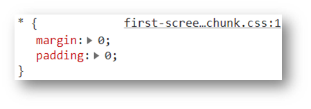

## 04-盒子尺寸和背景色


## 05-文字控制属性

### 字体大小

* 属性名：**font-size**
* 属性值：文字尺寸，PC 端网页最常用的单位 **px**

```css
p {
  font-size: 30px;
}
```

> 经验：谷歌浏览器默认字号是16px。

### 字体样式（是否倾斜） 

作用：清除文字默认的倾斜效果

属性名：**font-style**

属性值

* 正常（不倾斜）：**normal** 
* 倾斜：**italic**

### 行高

作用：设置多行文本的间距

属性名：line-height

属性值

* 数字 + px
* 数字（当前标签font-size属性值的倍数）

```css
line-height: 30px;


/* 当前标签字体大小为16px */
line-height: 2;
```


> 行高的测量方法：从一行文字的最顶端（最底端）量到下一行文字的最顶端（最底端）。 

#### 单行文字垂直居中

垂直居中技巧：**行高属性值等于盒子高度属性值**

注意：该技巧适用于单行文字垂直居中效果

```css
div {
  height: 100px;
  background-color: skyblue;

  /* 注意：只能是单行文字垂直居中 */
  line-height: 100px;
}
```

### 字体族

属性名：**font-family**

属性值：字体名

```css
font-family: 楷体;
```

> 拓展（了解）：font-family属性值可以书写多个字体名，各个字体名用逗号隔开，执行顺序是从左向右依次查找
>
> *  font-family 属性最后设置一个字体族名，网页开发建议使用无衬线字体

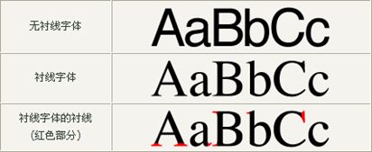

```css
font-family: Microsoft YaHei, Heiti SC, tahoma, arial, Hiragino Sans GB, "\5B8B\4F53", sans-serif;
```

### font复合属性

使用场景：设置网页文字公共样式 


复合属性：属性的简写方式，**一个属性对应多个值的写法**，各个属性值之间用**空格**隔开。

**font: 是否倾斜  是否加粗  字号/行高 字体（必须按顺序书写）**

```css
div {
  font: italic 700 30px/2 楷体;
}
```

> 注意：字号和字体值必须书写，否则 font 属性不生效 。

### 文本缩进 

属性名：**text-indent**

属性值：

* 数字 + px
* **数字 + em**（推荐：**1em = 当前标签的字号大小**）

```css
p {
  text-indent: 2em;
}
```

### 文本对齐方式 

作用：控制内容水平对齐方式

属性名：**text-align**


```css
text-align: center;
```

> text-align本质是控制内容的对齐方式，属性要设置给内容的父级。 

```html
<style>
  div {
    text-align: center;
  }
</style>

<div>
  
</div>
```

### 文本修饰线 

属性名： **text-decoration** 

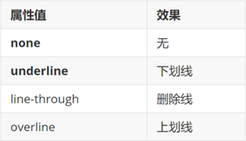


### color 文字颜色


> 提示：只要属性值为颜色，都可以使用上述四种颜色表示方式，例如：背景色。 

## 06-调试工具

作用：检查、调试代码；帮助程序员发现代码问题、解决问题

1. 打开调试工具

* 浏览器窗口内任意位置 / 选中标签 → 鼠标右键 → 检查
* F12

2. 使用调试工具


## 07-综合案例一-新闻详情

网页制作思路：

1. 从上到下，先整体再局部
2. 先标签，再 CSS 美化


### HTML标签

```html
<h1>在希望的田野上 | 湖北秋收开镰 各地多举措保增产增收</h1>
<div>来源：央视网 | 2222年12月12日 12:12:12</div>
<p><strong>央视网消息：</strong>眼下，湖北省秋收开镰已有一周多的时间。水稻收割已经超过四成，玉米收割七成。湖北省通过大力推广新品种水稻，建设高标准农田等一系列措施，为秋粮稳产提供有力支撑。</p>
<p>中稻占据了湖北全年粮食产量的一半以上。在湖北的主产区荆门市，370万亩中稻已经收割四成以上。</p>
<div class="pic">
  
</div>
<p>王化林说的新品种，是湖北省研发的杂交水稻“华夏香丝”，不仅产量高，还具有抗病、抗倒、抗高温的特性。在荆门漳河镇的一工程示范田内，像“华夏香丝”这样抗旱节水的品种还有20多个，这些水稻新品将在荆门全面推广，确保来年增产增收。</p>
<p>此外，湖北还大力推进高标准农田建设。截至今年6月，已建成3980万亩高标准农田。目前，湖北全省仍有1800多万亩中稻正在有序收割中，预计10月中旬收割完毕。</p>
```

### CSS样式

```html
<style>
  h1 {
    text-align: center;
    font-weight: 400;
    font-size: 30px;
    color: #333;
  }

  div {
    font-size: 14px;
    color: #999;
  }

  p {
    text-indent: 2em;
    font-size: 18px;
    color: #333;
  }

  /* div {
    text-align: center;
  } */

  .pic {
    text-align: center;
  }
</style>
```

## 08-综合案例二-CSS简介

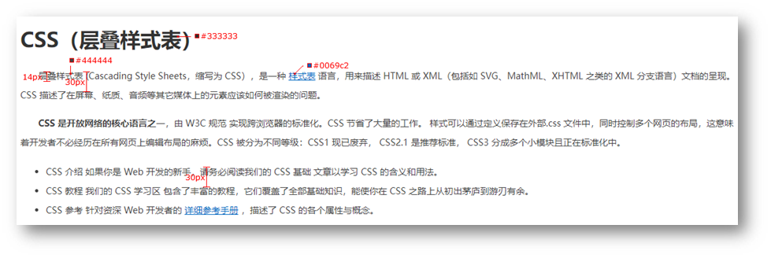

### HTML标签

```html
<h1>CSS（层叠样式表）</h1>
<p>层叠样式表 (Cascading Style Sheets，缩写为 CSS），是一种 <a href="#">样式表</a> 语言，用来描述 HTML 或 XML（包括如 SVG、MathML、XHTML 之类的 XML 分支语言）文档的呈现。CSS 描述了在屏幕、纸质、音频等其它媒体上的元素应该如何被渲染的问题。</p>
<p><strong>CSS 是开放网络的核心语言之一</strong>，由 W3C 规范 实现跨浏览器的标准化。CSS 节省了大量的工作。 样式可以通过定义保存在外部.css 文件中，同时控制多个网页的布局，这意味着开发者不必经历在所有网页上编辑布局的麻烦。CSS 被分为不同等级：CSS1 现已废弃， CSS2.1 是推荐标准， CSS3 分成多个小模块且正在标准化中。</p>
<ul>
  <li>CSS 介绍 如果你是 Web 开发的新手，请务必阅读我们的 CSS 基础 文章以学习 CSS 的含义和用法。</li>
  <li>CSS 教程 我们的 CSS 学习区 包含了丰富的教程，它们覆盖了全部基础知识，能使你在 CSS 之路上从初出茅庐到游刃有余。</li>
  <li>CSS 参考 针对资深 Web 开发者的 <a href="#">详细参考手册</a> ，描述了 CSS 的各个属性与概念。</li>
</ul>
```

### CSS样式

```html
<style>
  h1 {
    color: #333;
  }

  p {
    text-indent: 2em;
    font-size: 14px;
    color: #444;
    line-height: 30px;
  }

  a {
    color: #0069c2;
  }

  li {
    font-size: 14px;
    color: #444;
    line-height: 30px;
  }
</style>
```

# day04-CSS进阶

> 目标：掌握复合选择器作用和写法；使用background属性添加背景效果

## 01-复合选择器

定义：由两个或多个基础选择器，通过不同的方式组合而成。

作用：更准确、更高效的选择目标元素（标签）。

### 后代选择器

后代选择器：**选中某元素的后代元素**。

选择器写法：父选择器  子选择器 { CSS 属性}，父子选择器之间用**空格**隔开。

```html
<style>
  div span {
    color: red;
  }
</style>
<span> span 标签</span>
<div>
  <span>这是 div 的儿子 span</span >
</div>
```

### 子代选择器

子代选择器：选中某元素的子代元素（**最近的子级**）。

选择器写法：父选择器 > 子选择器 { CSS 属性}，父子选择器之间用 **>** 隔开。

```html
<style>
  div > span {
    color: red;
  }
</style>

<div>
  <span>这是 div 里面的 span</span>
  <p>
    <span>这是 div 里面的 p 里面的 span</span>
  </p>
</div>

```

### 并集选择器

并集选择器：选中**多组标签**设置**相同**的样式。

选择器写法：选择器1, 选择器2, …, 选择器N { CSS 属性}，选择器之间用 **,** 隔开。

```html
<style>
  div,
  p,
  span {
    color: red;
  }
</style>

<div> div 标签</div>
<p>p 标签</p>
<span>span 标签</span>
```

### 交集选择器 

交集选择器：选中**同时满足多个条件**的元素。

选择器写法：选择器1选择器2 { CSS 属性}，选择器之间连写，没有任何符号。 

```html
<style>
  p.box {
  color: red;
}
</style>

<p class="box">p 标签，使用了类选择器 box</p>
<p>p 标签</p>
<div class="box">div 标签，使用了类选择器 box</div>
```

> 注意：如果交集选择器中有标签选择器，标签选择器必须书写在最前面。 

### 伪类选择器 

伪类选择器：伪类表示元素**状态**，选中元素的某个状态设置样式。

鼠标悬停状态：**选择器:hover { CSS 属性 }**

```html
<style>
  a:hover {
    color: red;
  }
  .box:hover {
    color: green;
  }
</style>

<a href="#">a 标签</a>
<div class="box">div 标签</div>
```

#### 超链接伪类

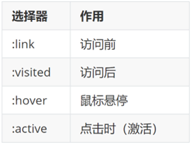

> 提示：如果要给超链接设置以上四个状态，需要按 LVHA 的顺序书写。 
>
> 经验：工作中，一个 a 标签选择器设置超链接的样式， hover状态特殊设置 

```css
a {
  color: red;
}

a:hover {
  color: green;
}
```

## 02-CSS特性

CSS特性：化简代码 / 定位问题，并解决问题

* 继承性
* 层叠性
* 优先级

### 继承性

继承性：子级默认继承父级的**文字控制属性**。 

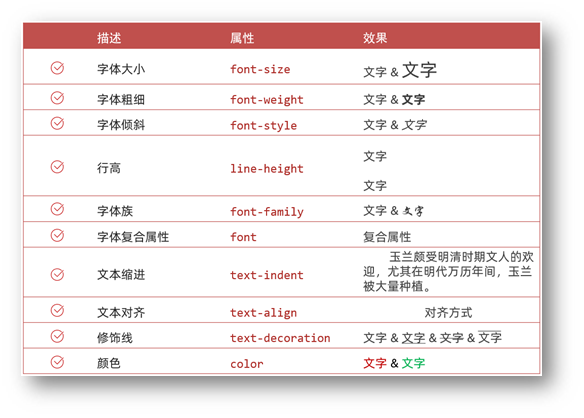

> 注意：如果标签有默认文字样式会继承失败。 例如：a 标签的颜色、标题的字体大小。

### 层叠性

特点：

* 相同的属性会覆盖：**后面的 CSS 属性覆盖前面的 CSS 属性**
* 不同的属性会叠加：**不同的 CSS 属性都生效**

```html
<style>
  div {
    color: red;
    font-weight: 700;
  }
  div {
    color: green;
    font-size: 30px;
  }
</style>

<div>div 标签</div>
```

> 注意：选择器类型相同则遵循层叠性，否则按选择器优先级判断。 

### 优先级

优先级：也叫权重，当一个标签**使用了多种选择器时**，基于不同种类的选择器的**匹配规则**。

```html
<style>
  div {
    color: red;
  }
  .box {
    color: green;
  }
</style>

<div class="box">div 标签</div>
```

#### 基础选择器

规则：选择器**优先级高的样式生效**。

公式：**通配符选择器 < 标签选择器 < 类选择器 < id选择器 < 行内样式 < !important**

​           **（选中标签的范围越大，优先级越低）**

#### 复合选择器-叠加

叠加计算：如果是复合选择器，则需要**权重叠加**计算。

公式：（每一级之间不存在进位）


规则：

* 从左向右依次比较选个数，同一级个数多的优先级高，如果个数相同，则向后比较
* **!important 权重最高**
* 继承权重最低

## 03-Emmet 写法

Emmet写法：代码的**简写**方式，输入缩写 VS Code 会自动生成对应的代码。 

* HTML标签


* CSS：大多数简写方式为属性单词的**首字母** 


## 04-背景属性


### 背景图

网页中，使用背景图实现装饰性的图片效果。

* 属性名：**background-image**（bgi）
* 属性值：url(背景图 URL)

```css
div {
  width: 400px;
  height: 400px;

  background-image: url(./images/1.png);
}
```

> 提示：背景图默认有**平铺（复制）效果**。 

### 平铺方式

属性名：**background-repeat**（bgr） 

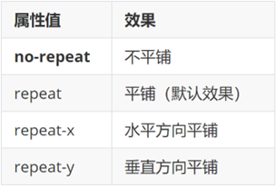

```css
div {
  width: 400px;
  height: 400px;
  background-color: pink;
  background-image: url(./images/1.png);

  background-repeat: no-repeat;
}
```

### 背景图位置

属性名：**background-position**（bgp）

属性值：水平方向位置 垂直方向位置

* 关键字

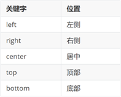

* 坐标
  * 水平：正数向右；负数向左
  * 垂直：正数向下；负数向上

```css
div {
  width: 400px;
  height: 400px;
  background-color: pink;
  background-image: url(./images/1.png);
  background-repeat: no-repeat;

  background-position: center bottom;
  background-position: 50px -100px;
  background-position: 50px center;
}
```

> 提示：
>
> * 关键字取值方式写法，可以颠倒取值顺序
> * 可以只写一个关键字，另一个方向默认为居中；数字只写一个值表示水平方向，垂直方向为居中

### 背景图缩放

作用：设置背景图大小

属性名：**background-size**（bgz）

常用属性值：

* 关键字
  *  cover：等比例缩放背景图片以完全覆盖背景区，可能背景图片部分看不见
  * contain：等比例缩放背景图片以完全装入背景区，可能背景区部分空白

* 百分比：根据盒子尺寸计算图片大小
* 数字 + 单位（例如：px）

```css
div {
  width: 500px;
  height: 400px;
  background-color: pink;
  background-image: url(./images/1.png);
  background-repeat: no-repeat;
  
  background-size: cover;
  background-size: contain;
}
```

> 提示：工作中，**图片比例与盒子比例相同**，使用 cover 或 contain 缩放背景图效果相同。

### 背景图固定

作用：背景不会随着元素的内容滚动。

属性名：**background-attachment**（bga）

属性值：**fixed**

```css
body {
  background-image: url(./images/bg.jpg);
  background-repeat: no-repeat;
  background-attachment: fixed;
}
```

### 背景复合属性

属性名：**background**（bg）

属性值：背景色 背景图 背景图平铺方式 背景图位置/背景图缩放  背景图固定（**空格隔开各个属性值，不区分顺序**）

```css
div {
  width: 400px;
  height: 400px;

  background: pink url(./images/1.png) no-repeat right center/cover;
}
```

## 05-显示模式

显示模式：标签（元素）的显示方式。 


作用：布局网页的时候，根据标签的显示模式选择合适的标签摆放内容。 

### 块级元素

特点：

* 独占一行
* 宽度默认是父级的100%
* 添加宽高属性生效

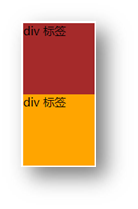

### 行内元素

特点：

* 一行可以显示多个
* 设置宽高属性不生效
* 宽高尺寸由内容撑开


### 行内块元素 

特点：

* 一行可以显示多个
* 设置宽高属性生效
* 宽高尺寸也可以由内容撑开


### 转换显示模式

属性：**display**

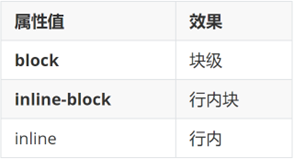


## 06-综合案例一-热词

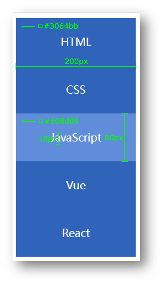

### HTML标签

```html
<a href="#">HTML</a>
<a href="#">CSS</a>
<a href="#">JavaScript</a>
<a href="#">Vue</a>
<a href="#">React</a>
```

### CSS样式

```html
<style>
/* 默认效果 */
a {
display: block;
width: 200px;
height: 80px;
background-color: #3064bb;
color: #fff;
text-decoration: none;
text-align: center;
line-height: 80px;
font-size: 18px;
}

/* 鼠标悬停的效果 */
a:hover {
background-color: #608dd9;
}
</style>
```

## 07-综合案例二 – banner 效果 


### HTML标签

```html
<div class="banner">
  <h2>让创造产生价值</h2>
  <p>我们希望小游戏平台可以提供无限的可能性，让每一个创作者都可以将他们的才华和创意传递给用户。</p>
  <a href="#">我要报名</a>
</div>
```


### CSS样式

```html
<style>
  .banner {
    height: 500px;
    background-color: #f3f3f4;
    background-image: url(./images/bk.png);
    background-repeat: no-repeat;
    background-position: left bottom;

    /* 文字控制属性，继承给子级 */
    text-align: right;
    color: #333;
  }

  .banner h2 {
    font-size: 36px;
    font-weight: 400;
    line-height: 100px;
  }

  .banner p {
    font-size: 20px;
  }

  .banner a {
    width: 125px;
    height: 40px;
    background-color: #f06b1f;

    display: inline-block;
    /* 转块级无法右对齐，因为块元素独占一行 */
    /* display: block; */

    text-align: center;
    line-height: 40px;
    color: #fff;
    text-decoration: none;
    font-size: 20px;
  }
</style>
```

# day05-盒子模型

> 目标：掌握盒子模型组成部分，使用盒子模型布局网页区域

## 01-选择器

### 结构伪类选择器 

### 基本使用

作用：根据元素的**结构关系**查找元素。 

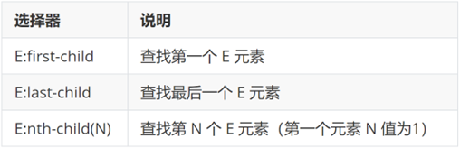

```css
li:first-child {
  background-color: green;
}
```

### :nth-child(公式) 


> 提示：公式中的n取值从 **0** 开始。 

### 伪元素选择器 

作用：创建**虚拟元素**（伪元素），用来**摆放装饰性的内容**。 


```css
div::before {
  content: "before 伪元素";
}
div::after {
  content: "after 伪元素";
}
```

注意点：

* 必须设置 **content: ””属性**，用来 设置伪元素的内容，如果没有内容，则**引号留空**即可
* 伪元素默认是**行内**显示模式
* **权重和标签选择器相同**

## 02-PxCook 

PxCook（像素大厨） 是一款切图设计工具软件。支持PSD文件的文字、颜色、距离自动智能识别。

* 开发面板（自动智能识别）
* 设计面板（手动测量尺寸和颜色）

使用方法：创建项目 → 输入 项目名称、项目类型 Web → 单击按钮【创建项目】 → 单击按钮【添加】，导入设计稿 

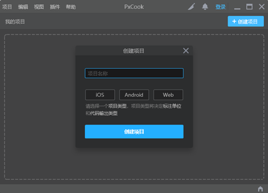

## 03-盒子模型

作用：布局网页，摆放盒子和内容。

### 盒子模型-组成

* 内容区域 – width & height
* 内边距 – padding（出现在内容与盒子边缘之间）
* 边框线 – border 
* 外边距 – margin（出现在盒子外面）

```css
div {
  margin: 50px;
  border: 5px solid brown;
  padding: 20px;
  width: 200px;
  height: 200px;
  background-color: pink;
}
```


### 边框线

#### 四个方向

属性名：**border**（bd）

属性值：边框线粗细  线条样式  颜色（不区分顺序）

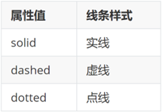

```css
div {
  border: 5px solid brown;
  width: 200px;
  height: 200px;
  background-color: pink;
}
```

#### 单方向边框线 

属性名：**border-方位名词**（bd+方位名词首字母，例如，bdl）

属性值：边框线粗细  线条样式  颜色（不区分顺序）

```css
div {
  border-top: 2px solid red;
  border-right: 3px dashed green;
  border-bottom: 4px dotted blue;
  border-left: 5px solid orange;
  width: 200px;
  height: 200px;
  background-color: pink;
}
```

### 内边距 

作用：设置 内容 与 盒子边缘 之间的距离。

* 属性名：padding / padding-方位名词

```css
div {
  /* 四个方向 内边距相同 */
  padding: 30px;
  /* 单独设置一个方向内边距 */
  padding-top: 10px;
  padding-right: 20px;
  padding-bottom: 40px;
  padding-left: 80px;
  width: 200px;
  height: 200px;
  background-color: pink;
}
```

> 提示：添加 padding 会撑大盒子。

* padding 多值写法


> 技巧：从**上**开始**顺时针**赋值，当前方向没有数值则与**对面取值相同**。 

### 尺寸计算


默认情况：盒子尺寸 = 内容尺寸 + border 尺寸 + 内边距尺寸

结论：给盒子加 border / padding 会撑大盒子

解决：

* 手动做减法，减掉 border / padding 的尺寸
* 內减模式：**box-sizing: border-box**

### 外边距 

作用：拉开两个盒子之间的距离

属性名：**margin**

提示：与 padding 属性值写法、含义相同

### 版心居中


左右 margin 值 为 auto（盒子要有宽度）

```css
div {
  margin: 0 auto;
  width: 1000px;
  height: 200px;
  background-color: pink;
}
```

### 清除默认样式 


清除标签默认的样式，比如：默认的内外边距。 


```css
/* 清除默认内外边距 */
* {
  margin: 0;
  padding: 0;
  box-sizing: border-box;
}
/* 清除列表项目符号 */
li {
  list-style: none;
}
```

### 元素溢出

作用：控制溢出元素的内容的显示方式。

属性名：**overflow**


### 外边距问题

#### 合并现象

场景：**垂直**排列的兄弟元素，上下 **margin** 会**合并**

现象：取两个 margin 中的**较大值生效**


```css
.one {
  margin-bottom: 50px;
}
.two {
  margin-top: 20px;
}
```

#### 外边距塌陷

场景：父子级的标签，子级的添加 **上外边距** 会产生**塌陷**问题

现象：**导致父级一起向下移动**

```css
.son {
  margin-top: 50px;
  width: 100px;
  height: 100px;
  background-color: orange;
}
```


解决方法：

* 取消子级margin，父级设置padding
* 父级设置 overflow: hidden
* 父级设置 border-top

### 行内元素 – 内外边距问题 

场景：行内元素添加 margin 和 padding，无法改变元素垂直位置

解决方法：给行内元素添加 **line-height** 可以改变垂直位置

```css
span {
  /* margin 和 padding 属性，无法改变垂直位置 */
  margin: 50px;
  padding: 20px;
  /* 行高可以改变垂直位置 */
  line-height: 100px;
}
```

### 圆角

作用：设置元素的外边框为圆角。

属性名：**border-radius**

属性值：数字+px / 百分比

提示：属性值是圆角半径


* 多值写法


> 技巧：从左上角开始顺时针赋值，当前角没有数值则与对角取值相同。 

* 正圆形状：给正方形盒子设置圆角属性值为 **宽高的一半 / 50%**

```css
img {
  width: 200px;
  height: 200px;
  
  border-radius: 100px;
  border-radius: 50%;
}
```


* 胶囊形状：给长方形盒子设置圆角属性值为 盒子高度的一半 

```css
div {
  width: 200px;
  height: 80px;
  background-color: orange;
  border-radius: 40px;
}
```


### 盒子阴影（拓展）

作用：给元素设置阴影效果

属性名：**box-shadow**

属性值：X 轴偏移量  Y 轴偏移量  模糊半径  扩散半径  颜色  内外阴影

注意： 

* X 轴偏移量 和 Y 轴偏移量 必须书写
* 默认是外阴影，内阴影需要添加 inset

```css
div {
  width: 200px;
  height: 80px;
  background-color: orange;
  box-shadow: 2px 5px 10px 0 rgba(0, 0, 0, 0.5) inset;
}
```

## 04-综合案例-产品卡片


CSS 书写顺序：

1. 盒子模型属性
2. 文字样式
3. 圆角、阴影等修饰属性

### HTML标签

```html
<div class="product">
  
  <h4>抖音直播SDK</h4>
  <p>包含抖音直播看播功能</p>
</div>
```


### CSS样式

```html
<style>
  * {
    margin: 0;
    padding: 0;
    box-sizing: border-box;
  }

  body {
    background-color: #f1f1f1;
  }

  .product {
    margin: 50px auto;
    padding-top: 40px;

    width: 270px;
    height: 253px;
    background-color: #fff;
    text-align: center;

    border-radius: 10px;
  }

  .product h4 {
    margin-top: 20px;
    margin-bottom: 12px;
    font-size: 18px;
    color: #333;
    font-weight: 400;
  }

  .product p {
    font-size: 12px;
    color: #555;
  }
</style>
```

## 05-综合案例二 – 新闻列表 


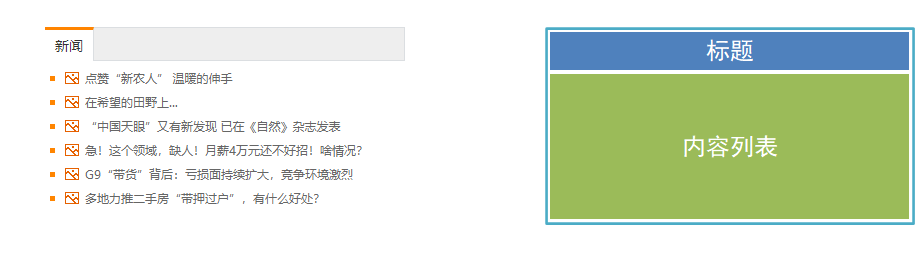


### 整体布局

```html
<style>
* {
  margin: 0;
  padding: 0;
  box-sizing: border-box;
}

li {
  list-style: none;
}

a {
  text-decoration: none;
}

.news {
  margin: 100px auto;
  width: 360px;
  height: 200px;
  /* background-color: pink; */
}
</style>

<div class="news"></div>
```

### 标题区域

```html
<style>
.news .hd {
  height: 34px;
  background-color: #eee;
  border: 1px solid #dbdee1;
  border-left: 0;
}

.news .hd a {
  /* -1 盒子向上移动 */
  margin-top: -1px;
  display: block;
  border-top: 3px solid #ff8400;
  border-right: 1px solid #dbdee1;
  width: 48px;
  height: 34px;
  background-color: #fff;

  text-align: center;
  line-height: 32px;
  font-size: 14px;
  color: #333;
}
</style>

<div class="hd"><a href="#">新闻</a></div>
```

### 内容区域

```html
<style>
.news .bd {
  padding: 5px;
}

.news .bd li {
  padding-left: 15px;
  background-image: url(./images/square.png);
  background-repeat: no-repeat;
  background-position: 0 center;
}

.news .bd li a {
  padding-left: 20px;
  background: url(./images/img.gif) no-repeat 0 center;

  font-size: 12px;
  color: #666;
  line-height: 24px;
}

.news .bd li a:hover {
  color: #ff8400;
}
</style>

<div class="bd">
  <ul>
    <li><a href="#">点赞“新农人” 温暖的伸手</a></li>
    <li><a href="#">在希望的田野上...</a></li>
    <li><a href="#">“中国天眼”又有新发现 已在《自然》杂志发表</a></li>
    <li><a href="#">急！这个领域，缺人！月薪4万元还不好招！啥情况？</a></li>
    <li><a href="#">G9“带货”背后：亏损面持续扩大，竞争环境激烈</a></li>
    <li><a href="#">多地力推二手房“带押过户”，有什么好处？</a></li>
  </ul>
</div>
```


# day06-Flex布局

> 目标：熟练使用 Flex 完成结构化布局

## 01-标准流

标准流也叫文档流，指的是标签在页面中**默认的排布规则**，例如：块元素独占一行，行内元素可以一行显示多个。 

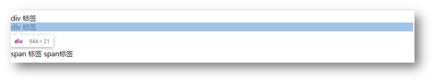

## 02-浮动

### 基本使用

作用：让块元素水平排列。

属性名：**float**

属性值

* **left**：左对齐
* **right**：右对齐

```html
<style>
  /* 特点：顶对齐；具备行内块显示模式特点；浮动的盒子会脱标 */
  .one {
    width: 100px;
    height: 100px;
    background-color: brown;

    float: left;
  }

  .two {
    width: 200px;
    height: 200px;
    background-color: orange;

    /* float: left; */

    float: right;
  }
</style>

<div class="one">one</div>
<div class="two">two</div>
```

特点：

* 浮动后的盒子**顶对齐**
* 浮动后的盒子具备**行内块**特点
* 浮动后的盒子**脱标**，**不占用标准流的位置**

### 产品区域布局


#### HTML标签

```html
<!-- 版心：左右，右面：8个产品 → 8个 li -->
<div class="product">
  <div class="left"></div>
  <div class="right">
    <ul>
      <li></li>
      <li></li>
      <li></li>
      <li></li>
      <li></li>
      <li></li>
      <li></li>
      <li></li>
    </ul>
  </div>
</div>
```


#### CSS样式

```html
<style>
  * {
    margin: 0;
    padding: 0;
  }

  li {
    list-style: none;
  }

  .product {
    margin: 50px auto;
    width: 1226px;
    height: 628px;
    background-color: pink;
  }

  .left {
    float: left;
    width: 234px;
    height: 628px;
    background-color: skyblue;
  }

  .right {
    float: right;
    width: 978px;
    height: 628px;
    background-color: brown;
  }

  .right li {
    float: left;
    margin-right: 14px;
    margin-bottom: 14px;
    width: 234px;
    height: 300px;
    background-color: orange;
  }

  /* 第四个li和第八个li 去掉右侧的margin */
  .right li:nth-child(4n) {
    margin-right: 0;
  }

  /* 细节：如果父级宽度不够，浮动的盒子会掉下来 */
</style>
```

### 清除浮动

场景：浮动元素会脱标，如果**父级没有高度**，**子级无法撑开父级高度**（可能导致页面布局错乱）

解决方法：**清除浮动**（清除浮动带来的影响）

#### 场景搭建


```html
<style>
  .top {
    margin: 10px auto;
    width: 1200px;
    /* height: 300px; */
    background-color: pink;
  }

  .left {
    float: left;
    width: 200px;
    height: 300px;
    background-color: skyblue;
  }

  .right {
    float: right;
    width: 950px;
    height: 300px;
    background-color: orange;
  }

  .bottom {
    height: 100px;
    background-color: brown;
  }

</style>

<div class="top">
  <div class="left"></div>
  <div class="right"></div>
</div>
<div class="bottom"></div>
```

#### 额外标签法

在**父元素内容的最后**添加一个**块级**元素，设置 CSS 属性 **clear: both** 

```html
<style>
.clearfix {
  clear: both;
}
</style>

<div class="father">
  <div class="left"></div>
  <div class="right"></div>
  <div class="clearfix"></div>
</div>
```

#### 单伪元素法

1. 准备 after 伪元素

```css
.clearfix::after {
  content: "";
  display: block;
  clear: both;
}
```

2. 父级使用 clearfix 类

```html
<div class="father clearfix"></div>
```

#### 双伪元素法

1. 准备 after 和 before 伪元素

```css
/* before 解决外边距塌陷问题 */
/* 双伪元素法 */
.clearfix::before,
.clearfix::after {
  content: "";
  display: table;
}

/* after 清除浮动 */
.clearfix::after {
  clear: both;
}
```

2. 父级使用 clearfix 类

```html
<div class="father clearfix"></div>
```

#### overfow法

```css
.father {
  margin: 10px auto;
  width: 1200px;
  /* height: 300px; */
  background-color: pink;

  overflow: hidden;
}
```

## 03-Flex布局

Flex 布局也叫**弹性布局**，是浏览器**提倡的布局模型**，非常适合**结构化**布局，提供了强大的空间分布和对齐能力。

Flex 模型不会产生浮动布局中脱标现象，布局网页更简单、更灵活。


### Flex组成

设置方式：给**父**元素设置 **display: flex**，子元素可以自动挤压或拉伸

组成部分：

* 弹性容器
* 弹性盒子
* 主轴：默认在**水平**方向
* 侧轴 / 交叉轴：默认在**垂直**方向


### 主轴对齐方式

属性名：**justify-content**

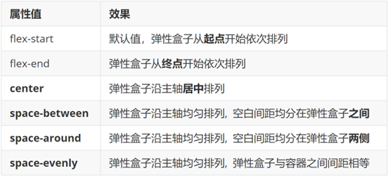

### 侧轴对齐方式

* align-items：当前弹性容器内**所有**弹性盒子的侧轴对齐方式（给**弹性容器**设置）
* align-self：单独控制**某个弹性盒子**的侧轴对齐方式（给**弹性盒子**设置）


### 修改主轴方向

**主轴默认在水平方向，侧轴默认在垂直方向**

属性名：**flex-direction**


### 弹性伸缩比

作用：控制弹性盒子的主轴方向的尺寸。

属性名：**flex**

属性值：整数数字，表示占用**父级剩余尺寸的份数**。

注：默认情况下，主轴方向尺寸是靠内容撑开，侧轴默认拉伸

### 弹性盒子换行

弹性盒子可以自动挤压或拉伸，默认情况下，所有弹性盒子都在一行显示。

属性名：**flex-wrap**

属性值

* wrap：换行
* nowrap：不换行（默认）

### 行内对齐方式

属性名：**align-content** 


> 注意：该属性对**单行**弹性盒子模型**无效**。 

## 04-综合案例 – 抖音解决方案 


### 整体布局

```html
<style>
* {
  margin: 0;
  padding: 0;
  box-sizing: border-box;
}

li {
  list-style: none;
}

.box {
  margin: 50px auto;
  width: 1200px;
  height: 418px;
  border: 1px solid #ddd;
  border-radius: 10px;
}
</style>

<div class="box"></div>
```

### 列表布局

```html
<style>
.box ul {
  display: flex;
  /* 弹性盒子换行 */
  flex-wrap: wrap;
  /* 调整主轴对齐方式 */
  justify-content: space-between;

  /* 调整 行对齐方式 */
  align-content: space-between;

  padding: 90px 40px 90px 60px;
  height: 418px;
}

.box li {
  display: flex;
  width: 500px;
  height: 88px;
  /* background-color: pink; */
}
</style>

<div class="box">
	<ul>
    <li>1</li>
    <li>2</li>
    <li>3</li>
    <li>4</li>
  </ul>
</div>
```

### 内容样式

```html
<style>
.box .pic {
  margin-right: 15px;
}

.box .text h4 {
  line-height: 40px;
  font-size: 20px;
  font-weight: 400;
  color: #333;
}

.box .text p {
  font-size: 14px;
  color: #666;
}
</style>

<ul>
  <li>
    <div class="pic">
      
    </div>
    <div class="text">
      <h4>一键发布多端</h4>
      <p>发布视频到抖音短视频、西瓜视频及今日头条</p>
    </div>
  </li>
  <li>
    <div class="pic">
      
    </div>
    <div class="text">
      <h4>管理视频内容</h4>
      <p>支持修改已发布稿件状态和实时查询视频审核状态</p>
    </div>
  </li>
  <li>
    <div class="pic">
      
    </div>
    <div class="text">
      <h4>发布携带组件</h4>
      <p>支持分享内容携带小程序、地理位置信息等组件，扩展内容及突出地域性</p>
    </div>
  </li>
  <li>
    <div class="pic">
      
    </div>
    <div class="text">
      <h4>数据评估分析</h4>
      <p>获取视频在对应产品内的数据表现、获取抖音热点，及时进行表现评估</p>
    </div>
  </li>
</ul>
```


# day07-学成在线

## 01-项目目录

网站根目录是指存放网站的**第一层**文件夹，内部包含当前网站的**所有素材**，包含 HTML、CSS、图片、JavaScript等等。 


* 首页引入CSS文件

```html
<!-- 顺序要求：先清除再设置 -->
<link rel="stylesheet" href="./css/base.css">
<link rel="stylesheet" href="./css/index.css">
```

## 02-版心居中


```css
.wrapper {
  margin: 0 auto;
  width: 1200px;
}

body {
  background-color: #f3f5f7;
}
```

## 03-布局思路

1. 布局思路：先整体再局部，从外到内，从上到下，从左到右
2. CSS 实现思路
   1. 画盒子，调整盒子范围 → 宽高背景色
   2. 调整盒子位置 → flex 布局、内外边距
   3. 控制图片、文字内容样式

## 04-header区域-整体布局

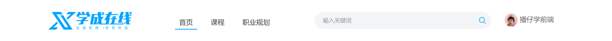

### HTML结构

```html
<!-- 头部区域 -->
<div class="header">
  <div class="wrapper">
    <!-- logo -->
    <div class="logo">logo</div>
    <!-- 导航 -->
    <div class="nav">导航</div>
    <!-- 搜索 -->
    <div class="search">search</div>
    <!-- 用户 -->
    <div class="user">用户</div>
  </div>
</div>
```

### CSS样式

```css
/* 头部区域 */
.header {
  height: 100px;
  background-color: #fff;
}

.header .wrapper {
  padding-top: 29px;
  display: flex;
}
```

## 05-header区域-logo


logo 功能：

* 单击跳转到首页
* 搜索引擎优化：提升网站百度搜索排名

实现方法：

* 标签结构：h1 > a > 网站名称（搜索关键字）

```html
<div class="logo">
  <h1><a href="#">学成在线</a></h1>
</div>
```

* CSS 样式

```css
/* logo */
.logo a {
  display: block;
  width: 195px;
  height: 41px;
  background-image: url(../images/logo.png);
  font-size: 0;
}
```

## 06-header区域-导航

实现方法：

* 标签结构：ul > **li * 3** > a
* 优势：**避免堆砌 a 标签**，**网站搜索排名降级**


### HTML结构

```html
<ul>
  <li><a href="#" class="active">首页</a></li>
  <li><a href="#">课程</a></li>
  <li><a href="#">职业规划</a></li>
</ul>
```

### CSS样式

```css
/* 导航 */
.nav {
  margin-left: 102px;
}

.nav ul {
  display: flex;
}

.nav li {
  margin-right: 24px;
}

.nav li a {
  display: block;
  padding: 6px 8px;
  line-height: 27px;
  font-size: 19px;
}


/* actvie 类选择器，表示默认选中的a */
.nav li .active,
.nav li a:hover {
  border-bottom: 2px solid #00a4ff;
}
```

## 07-header区域-搜索布局


### HTML结构

```html
<div class="search"></div>
```

### CSS样式

```css
.search {
  display: flex;
  margin-left: 64px;
  padding-left: 19px;
  padding-right: 12px;
  width: 412px;
  height: 40px;
  background-color: #f3f5f7;
  border-radius: 20px;
}
```

## 08-header区域-搜索内容

### HTML结构

```html
<div class="search">
  <input type="text" placeholder="请输入关键词">
  <a href="#"></a>
</div>
```

### CSS样式

```css
.search input {
   flex: 1;
   border: 0;
   background-color: transparent;
   /* 去掉表单控件的焦点框 */
   outline: none;
}

/* ::placeholder 选中就是 placeholder 属性文字样式*/
.search input::placeholder {
  font-size: 14px;
  color: #999;
}

/* 父级是flex布局，子级变弹性盒子：加宽高生效 */
.search a {
  align-self: center;
  width: 16px;
  height: 16px;
  background-image: url(../images/search.png);
}
```

## 09-header区域-用户区域

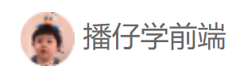

### HTML结构

```html
<div class="user">
  <a href="#">
    
    <span>播仔学前端</span>
  </a>
</div>
```

### CSS样式

```css
/* 用户 */
.user {
  margin-left: 32px;
  margin-top: 4px;
}

.user img {
  margin-right: 7px;
  /* vertical-align 行内块和行内垂直方向对齐方式 */
  vertical-align: middle;
}

.user span {
  font-size: 16px;
  color: #666;
}
```

## 10-banner区域-布局

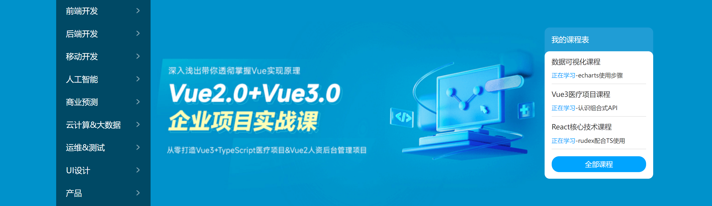

### HTML结构

```html
<div class="banner">
  <div class="wrapper">
    <div class="left">left</div>
    <div class="right">right</div>
  </div>
</div>
```

### CSS样式

```css
/* banner 区域 */
.banner {
  height: 420px;
  background-color: #0092cb;
}

.banner .wrapper {
  display: flex;
  justify-content: space-between;
  height: 420px;
  background-image: url(../uploads/banner.png);
}
```

## 11-banner区域-侧导航

### HTML结构

```html
<div class="left">
  <ul>
    <li><a href="#">前端开发</a></li>
    <li><a href="#">后端开发</a></li>
    <li><a href="#">移动开发</a></li>
    <li><a href="#">人工智能</a></li>
    <li><a href="#">商业预测</a></li>
    <li><a href="#">云计算&大数据</a></li>
    <li><a href="#">运维&测试</a></li>
    <li><a href="#">UI设计</a></li>
    <li><a href="#">产品</a></li>
  </ul>
</div>
```

### CSS样式

```css
/* 侧导航 */
.banner .left {
  padding: 3px 20px;
  width: 191px;
  height: 420px;
  background-color: rgba(0,0,0,0.42);
}

.banner .left a {
  /* 块级：宽度是父级的100% */
  display: block;
  height: 46px;
  background: url(../images/right.png) no-repeat right center;
  line-height: 46px;
  font-size: 16px;
  color: #fff;
}

.banner .left a:hover {
  background-image: url(../images/right-hover.png);
  color: #00a4ff;
}
```

## 12-banner区域-课程表布局

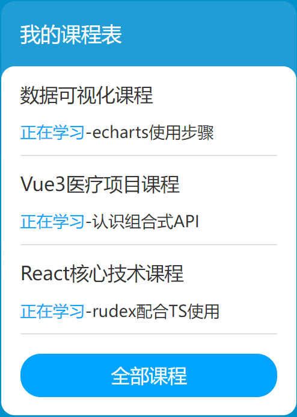

### HTML布局

```html
<div class="right">
  <h3>我的课程表</h3>
  <div class="content">1</div>
</div>
```

### CSS样式

```css
/* 课程表 */
.banner .right {
  margin-top: 60px;
  width: 218px;
  height: 305px;
  background-color: #209dd5;
  border-radius: 10px;
}

.banner .right h3 {
  margin-left: 14px;
  height: 48px;
  line-height: 48px;
  font-size: 15px;
  color: #fff;
  font-weight: 400;
}

.banner .right .content {
  padding: 14px;
  height: 257px;
  background-color: #fff;
  border-radius: 10px;
}
```

## 13-banner区域-课程表内容

### HTML结构

```html
<dl>
  <dt>数据可视化课程</dt>
  <dd><span>正在学习</span>-<strong>echarts使用步骤</strong></dd>
</dl>
<dl>
  <dt>Vue3医疗项目课程  </dt>
  <dd><span>正在学习</span>-<strong>认识组合式API</strong></dd>
</dl>
<dl>
  <dt>React核心技术课程</dt>
  <dd><span>正在学习</span>-<strong>rudex配合TS使用</strong></dd>
</dl>
```

### CSS样式

```css
.banner .right dl {
  margin-bottom: 12px;
  border-bottom: 1px solid #e0e0e0;
}

.banner .right dt {
  margin-bottom: 8px;
  font-size: 14px;
  line-height: 20px;
  font-weight: 700;
}

.banner .right dd {
  margin-bottom: 8px;
  font-size: 12px;
  line-height: 16px;
}

.banner .right dd span {
  color: #00a4ff;
}

.banner .right dd strong {
  color: #7d7d7d;
  font-weight: 400;
}
```

## 14-banner区域-全部课程

### HTML结构

```html
<a href="#">全部课程</a>
```

### CSS样式

```css
.banner .right a {
  display: block;
  height: 32px;
  background-color: #00a4ff;
  text-align: center;
  line-height: 32px;
  font-size: 14px;
  color: #fff;
  border-radius: 15px;
}
```

## 15-精品推荐-区域布局

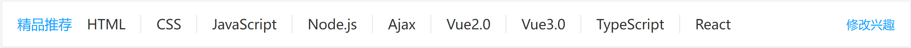

### HTML结构

```html
<!-- 精品推荐 -->
<div class="recommend wrapper">
  <h3>精品推荐</h3>
  <ul>
    <li><a href="#">HTML</a></li>
  </ul>
  <a href="#" class="modify">修改兴趣</a>
</div
```

### CSS样式

```css
/* 精品推荐 */
.recommend {
  display: flex;
  margin-top: 11px;
  padding: 0 20px;
  height: 60px;
  background-color: #fff;
  box-shadow: 0px 1px 2px 0px rgba(211, 211, 211, 0.5);
  line-height: 60px;
}
```

## 16-精品推荐-内容样式

### HTML结构

```html
<ul>
  <li><a href="#">HTML</a></li>
  <li><a href="#">CSS</a></li>
  <li><a href="#">JavaScript</a></li>
  <li><a href="#">Node.js</a></li>
  <li><a href="#">Ajax</a></li>
  <li><a href="#">Vue2.0</a></li>
  <li><a href="#">Vue3.0</a></li>
  <li><a href="#">TypeScript</a></li>
  <li><a href="#">React</a></li>
</ul>
```

### CSS样式

```css
.recommend h3 {
  font-size: 18px;
  color: #00a4ff;
  font-weight: 400;
}

.recommend ul {
  /* 除去标题和修改兴趣的尺寸，父级剩余尺寸都给ul，实现把修改兴趣挤到最右侧 */
  flex: 1;
  display: flex;
}

.recommend ul li a {
  padding: 0 24px;
  border-right: 1px solid #e0e0e0;
  font-size: 18px;
}

.recommend ul li:last-child a {
  border-right: 0;
}

.recommend .modify {
  font-size: 16px;
  color: #00a4ff;
}
```

## 17-推荐课程-标题区域

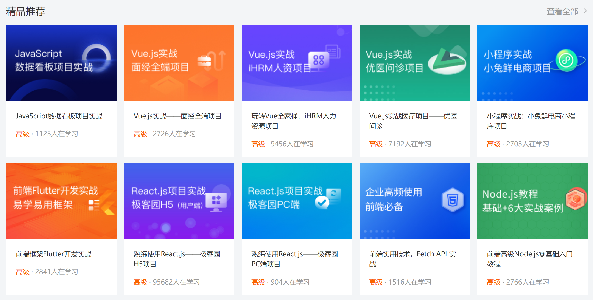

### HTML结构

```html
<!-- 精品推荐课程 -->
<div class="course wrapper">
  <!-- 标题 -->
  <div class="hd">
    <h3>精品推荐</h3>
    <a href="#" class="more">查看全部</a>
  </div>
  <!-- 内容 -->
  <div class="bd">1</div>
</div>
```

### CSS样式

```css
/* 推荐课程 */
.course {
  margin-top: 15px;
}

/* 标题 - 公共类，与其他区域共用 */
.hd {
  display: flex;
  justify-content: space-between;
  height: 60px;
  line-height: 60px;
}

.hd h3 {
  font-size: 21px;
  font-weight: 400;
}

.hd .more {
  padding-right: 20px;
  background: url(../images/more.png) no-repeat right center;
  font-size: 14px;
  color: #999;
}
```

## 18-推荐课程-内容布局

### HTML结构

```html
<ul>
  <li>1</li>
  <li>2</li>
  <li>3</li>
  <li>4</li>
  <li>5</li>
  <li>6</li>
  <li>7</li>
  <li>8</li>
</ul>
```

### CSS样式

```css
/* 课程内容 - 公共类 */
.bd ul {
  display: flex;
  flex-wrap: wrap;
  justify-content: space-between;
}

.bd li {
  margin-bottom: 14px;
  width: 228px;
  height: 271px;
  background-color: pink;
}
```

## 19-推荐课程-内容样式

### HTML结构

```html
<ul>
  <li>
    <a href="#">
      <div class="pic"></div>
      <div class="text">
        <h4>JavaScript数据看板项目实战</h4>
        <p><span>高级</span> · <i>1125</i>人在学习</p>
      </div>
    </a>
  </li>
  <li>
    <a href="#">
      <div class="pic"></div>
      <div class="text">
        <h4>Vue.js实战——面经全端项目</h4>
        <p><span>高级</span> · <i>2726</i>人在学习</p>
      </div>
    </a>
  </li>
  <li>
    <a href="#">
      <div class="pic"></div>
      <div class="text">
        <h4>玩转Vue全家桶，iHRM人力资源项目</h4>
        <p><span>高级</span> · <i>9456</i>人在学习</p>
      </div>
    </a>
  </li>
  <li>
    <a href="#">
      <div class="pic"></div>
      <div class="text">
        <h4>Vue.js实战医疗项目——优医问诊</h4>
        <p><span>高级</span> · <i>7192</i>人在学习</p>
      </div>
    </a>
  </li>
  <li>
    <a href="#">
      <div class="pic"></div>
      <div class="text">
        <h4>小程序实战：小兔鲜电商小程序项目</h4>
        <p><span>高级</span> · <i>2703</i>人在学习</p>
      </div>
    </a>
  </li>
  <li>
    <a href="#">
      <div class="pic"></div>
      <div class="text">
        <h4>前端框架Flutter开发实战</h4>
        <p><span>高级</span> · <i>2841</i>人在学习</p>
      </div>
    </a>
  </li>
  <li>
    <a href="#">
      <div class="pic"></div>
      <div class="text">
        <h4>熟练使用React.js——极客园H5项目</h4>
        <p><span>高级</span> · <i>95682</i>人在学习</p>
      </div>
    </a>
  </li>
  <li>
    <a href="#">
      <div class="pic"></div>
      <div class="text">
        <h4>熟练使用React.js——极客园PC端项目</h4>
        <p><span>高级</span> · <i>904</i>人在学习</p>
      </div>
    </a>
  </li>
  <li>
    <a href="#">
      <div class="pic"></div>
      <div class="text">
        <h4>前端实用技术，Fetch API 实战</h4>
        <p><span>高级</span> · <i>1516</i>人在学习</p>
      </div>
    </a>
  </li>
  <li>
    <a href="#">
      <div class="pic"></div>
      <div class="text">
        <h4>前端高级Node.js零基础入门教程</h4>
        <p><span>高级</span> · <i>2766</i>人在学习</p>
      </div>
    </a>
  </li>
</ul>
```

### CSS样式

```css
.bd li .pic {
  height: 156px;
}

.bd li .text {
  padding: 20px;
  height: 115px;
  background-color: #fff;
}

.bd li .text h4 {
  margin-bottom: 13px;
  height: 40px;
  font-size: 14px;
  line-height: 20px;
  font-weight: 400;
}

.bd li .text p {
  font-size: 14px;
  line-height: 20px;
  color: #999;
}

.bd li .text p span {
  color: #fa6400;
}

.bd li .text p i {
  font-style: normal;
}
```

## 20-前端开发工程师区域


### HTML结构

```html
<!-- 前端 -->
<div class="wrapper">
  <!-- 标题 -->
  <div class="hd">
    <h3>前端开发工程师</h3>
    <ul>
      <li><a href="#" class="active">热门</a></li>
      <li><a href="#">初级</a></li>
      <li><a href="#">中级</a></li>
      <li><a href="#">高级</a></li>
    </ul>
    <a href="#" class="more">查看全部</a>
  </div>
  <div class="bd">
    <div class="left">
      
    </div>
    <div class="right">
      <div class="top"></div>
      <div class="bottom">
        <ul>
          <li>
            <a href="#">
              <div class="pic"></div>
              <div class="text">
                <h4>JS高级javaScript进阶面向对象ES6</h4>
                <p><span>高级</span> · <i>101937</i>人在学习</p>
              </div>
            </a>
          </li>
          <li>
            <a href="#">
              <div class="pic"></div>
              <div class="text">
                <h4>零基础玩转微信小程序</h4>
                <p><span>高级</span> · <i>133781</i>人在学习</p>
              </div>
            </a>
          </li>
          <li>
            <a href="#">
              <div class="pic"></div>
              <div class="text">
                <h4>JavaScript基础——语法解析+项目实战</h4>
                <p><span>高级</span> · <i>8927</i>人在学习</p>
              </div>
            </a>
          </li>
          <li>
            <a href="#">
              <div class="pic"></div>
              <div class="text">
                <h4>前端框架Vue2+Vue3全套视频</h4>
                <p><span>高级</span> · <i>26022</i>人在学习</p>
              </div>
            </a>
          </li>
        </ul>
      </div>
    </div>
  </div>
</div>
```

### CSS样式

```css
/* 前端 */
.hd ul {
  display: flex;
}

.hd li {
  margin-right: 60px;
  font-size: 16px;
}

.hd li .active {
  color: #00a4ff;
}

.bd {
  display: flex;
  justify-content: space-between;
}

.bd .left {
  width: 228px;
  /* background-color: pink; */
}

.bd .right {
  width: 957px;
  /* background-color: pink; */
}

.bd .right .top {
  margin-bottom: 15px;
  height: 100px;
}
```

## 21-版权-布局

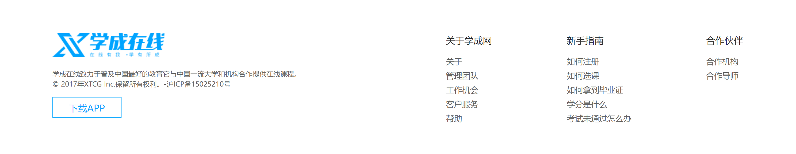

### HTML结构

```html
<!-- 版权 -->
<div class="footer">
  <div class="wrapper">
    <div class="left">left</div>
    <div class="right">right</div>
  </div>
</div>
```

### CSS样式

```css
/* 版权 */
.footer {
  margin-top: 60px;
  padding-top: 60px;
  height: 273px;
  background-color: #fff;
}

.footer .wrapper {
  display: flex;
  justify-content: space-between;
}

.footer .left {
  width: 440px;
  background-color: pink;
}
```

## 22-版权-内容

### HTML结构

```html
<div class="left">
  <a href="#"></a>
  <p>学成在线致力于普及中国最好的教育它与中国一流大学和机构合作提供在线课程。
    © 2017年XTCG Inc.保留所有权利。-沪ICP备15025210号</p>
  <a href="#" class="download">下载APP</a>
</div>
<div class="right">
  <dl>
    <dt>关于学成网</dt>
    <dd><a href="#">关于</a></dd>
    <dd><a href="#">管理团队</a></dd>
    <dd><a href="#">工作机会</a></dd>
    <dd><a href="#">客户服务</a></dd>
    <dd><a href="#">帮助</a></dd>
  </dl>
  <dl>
    <dt>新手指南</dt>
    <dd><a href="#">如何注册</a></dd>
    <dd><a href="#">如何选课</a></dd>
    <dd><a href="#">如何拿到毕业证</a></dd>
    <dd><a href="#">学分是什么</a></dd>
    <dd><a href="#">考试未通过怎么办</a></dd>
  </dl>
  <dl>
    <dt>合作伙伴</dt>
    <dd><a href="#">合作机构</a></dd>
    <dd><a href="#">合作导师</a></dd>
  </dl>
</div>
```

### CSS样式

```css
.footer .left p {
  margin-top: 24px;
  margin-bottom: 14px;
  font-size: 12px;
  line-height: 17px;
  color: #666;
}

.footer .left .download {
  display: block;
  width: 120px;
  height: 36px;
  border: 1px solid #00a4ff;
  text-align: center;
  line-height: 34px;
  font-size: 16px;
  color: #00a4ff;
}

.footer .right {
  display: flex;
}

.footer .right dl {
  margin-left: 130px;
}

.footer .right dt {
  margin-bottom: 12px;
  font-size: 16px;
  line-height: 23px;
}

.footer .right a {
  font-size: 14px;
  color: #666;
  line-height: 24px;
}
```

# day08-CSS高级

> 目标：掌握定位的作用及特点；掌握 CSS 高级技巧

## 01-定位

作用：灵活的改变盒子在网页中的位置

实现：

1.定位模式：position

2.边偏移：设置盒子的位置

* left
* right
* top
* bottom

### 相对定位

**position: relative**

特点：

* 不脱标，占用自己原来位置
* 显示模式特点保持不变
* 设置边偏移则相对自己原来位置移动

```css
div {
  position: relative;
  top: 100px;
  left: 200px;
}	
```

### 绝对定位

**position: absolute**

使用场景：子级绝对定位，父级相对定位（**子绝父相**）

特点：

* 脱标，不占位
* 显示模式具备行内块特点
* 设置边偏移则相对最近的已经定位的祖先元素改变位置
* 如果祖先元素都未定位，则相对浏览器可视区改变位置

```css
.father {
  position: relative;
}

.father span {
  position: absolute;
  top: 0;
  right: 0;
}
```

### 定位居中


实现步骤：

1. 绝对定位
2. 水平、垂直边偏移为 50%
3. 子级向左、上移动自身尺寸的一半

* 左、上的外边距为 –尺寸的一半
* transform: translate(-50%, -50%)

```css
img {
  position: absolute;
  left: 50%;
  top: 50%;

  /* margin-left: -265px;
  margin-top: -127px; */

  /* 方便： 50% 就是自己宽高的一半 */
  transform: translate(-50%, -50%);
}
```

### 固定定位

**position: fixed**

场景：元素的位置在网页滚动时不会改变

特点：

* 脱标，不占位
* 显示模式具备行内块特点
* 设置边偏移相对浏览器窗口改变位置

```css
div {
  position: fixed;
  top: 0;
  right: 0;

  width: 500px;
}
```

### 堆叠层级z-index


默认效果：按照标签书写顺序，后来者居上

作用：设置定位元素的层级顺序，改变定位元素的显示顺序

属性名：**z-index**

属性值：**整数数字**（默认值为0，取值越大，层级越高）

```css
.box1 {
  background-color: pink;
  /* 取值是整数，默认是0，取值越大显示顺序越靠上 */
  z-index: 1;
}

.box2 {
  background-color: skyblue;
  left: 100px;
  top: 100px;

  z-index: 2;
}
```

## 02-高级技巧

### CSS精灵

CSS 精灵，也叫 **CSS Sprites**，是一种网页**图片应用处理方式**。把网页中**一些背景图片**整合到**一张图片**文件中，再**background-position** 精确的定位出背景图片的位置。


优点：减少服务器被请求次数，减轻服务器的压力，提高页面加载速度


实现步骤：

1. 创建盒子，**盒子尺寸**与**小图**尺寸**相同**
2. 设置盒子**背景图**为精灵图
3. 添加 **background-position** 属性，改变**背景图位置**

​       3.1 使用 PxCook 测量小图片**左上角坐标**

​       3.2 取**负数**坐标为 background-position 属性值（向左上移动图片位置）

### 案例-京东服务


#### HTML结构

```html
<div class="service">
  <ul>
    <li>
      <h5></h5>
      <p>品类齐全，轻松购物</p>
    </li>
    <li>
      <h5></h5>
      <p>多仓直发，极速配送</p>
    </li>
    <li>
      <h5></h5>
      <p>正品行货，精致服务</p>
    </li>
    <li>
      <h5></h5>
      <p>天天低价，畅选无忧</p>
    </li>
  </ul>
</div>
```

#### CSS样式

```html
<style>
  * {
    margin: 0;
    padding: 0;
    box-sizing: border-box;
  }

  li {
    list-style: none;
  }

  .service {
    margin: 100px auto;
    width: 1190px;
    height: 42px;
    /* background-color: pink; */
  }

  .service ul {
    display: flex;
  }

  .service li {
    display: flex;
    padding-left: 40px;
    width: 297px;
    height: 42px;
    /* background-color: skyblue; */
  }

  .service li h5 {
    margin-right: 10px;
    width: 36px;
    height: 42px;
    /* background-color: pink; */
    background: url(./images/sprite.png) 0 -192px;
  }

  .service li:nth-child(2) h5 {
    background-position: -41px -192px;
  }

  .service li:nth-child(3) h5 {
    background-position: -82px -192px;
  }

  .service li:nth-child(4) h5 {
    background-position: -123px -192px;
  }

  .service li p {
    font-size: 18px;
    color: #444;
    font-weight: 700;
    line-height: 42px;
  }
</style>
```

### 字体图标


字体图标：**展示的是图标，本质是字体**

作用：在网页中添加**简单的、颜色单一**的小图标

优点

* **灵活性**：灵活地修改样式，例如：尺寸、颜色等
* **轻量级**：体积小、渲染快、降低服务器请求次数
* **兼容性**：几乎兼容所有主流浏览器
* **使用方便**：先下载再使用

#### 下载字体

iconfont 图标库：<https://www.iconfont.cn/> 

登录 → 素材库 → 官方图标库 → 进入图标库 → 选图标，加入购物车 → 购物车，添加至项目，确定 → 下载至本地 

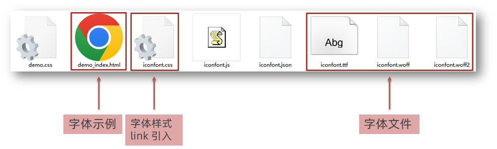

#### 使用字体

1. 引入字体样式表（iconfont.css） 


2. 标签使用字体图标类名
   * iconfont：字体图标基本样式（字体名，字体大小等等）
   * icon-xxx：图标对应的类名


#### 上传矢量图

作用：项目特有的图标上传到 iconfont 图标库，生成字体

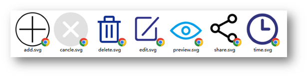

上传步骤：上传 → 上传图标 → 选择 svg 矢量图，打开 → 提交 → 系统审核

## 03-CSS修饰属性

### 垂直对齐方式 


属性名：vertical-align


### 过渡

作用：可以为一个元素在不同状态之间切换的时候添加**过渡效果**

属性名：**transition（复合属性）**

属性值：**过渡的属性  花费时间 (s)**

提示：

* 过渡的属性可以是具体的 CSS 属性
* 也可以为 all（两个状态属性值不同的所有属性，都产生过渡效果）
* transition 设置给元素本身

```css
img {
  width: 200px;
  height: 200px;
  transition: all 1s;
}

img:hover {
  width: 500px;
  height: 500px;
}
```

### 透明度opacity

作用：设置**整个元素的透明度**（包含背景和内容）

属性名：opacity

属性值：0 – 1

* 0：完全透明（元素不可见）
* 1：不透明
* 0-1之间小数：半透明

### 光标类型cursor

作用：鼠标悬停在元素上时指针显示样式

属性名：cursor


## 04-综合案例-轮播图

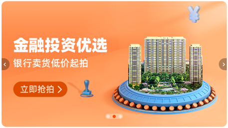

### 图片效果

#### HTML结构

```html
<div class="banner">
    <!-- 图: ul > li -->
    <ul>
      <li><a href="#"></a></li>
      <li><a href="#"></a></li>
      <li><a href="#"></a></li>
    </ul>
</div>
```

#### CSS样式

```css
* {
  margin: 0;
  padding: 0;
  box-sizing: border-box;
}

li {
  list-style: none;
}

.banner {
  position: relative;
  margin: 100px auto;
  width: 564px;
  height: 315px;
  /* background-color: pink; */
  overflow: hidden;
}

/* 图片 */
.banner img {
  width: 564px;
  border-radius: 12px;
  vertical-align: middle;
}

.banner ul {
  display: flex;
}
```

### 箭头

#### HTML结构

```html
<!-- 箭头 -->
<!-- 上一张 prev -->
<a href="#" class="prev">
  <i class="iconfont icon-zuoce"></i>
</a>
<!-- 下一张 next -->
<a href="#" class="next">
  <i class="iconfont icon-youce"></i>
</a>
```

#### CSS样式

```css
/* 箭头 */
.banner .prev,
.banner .next {
  /* 隐藏 */
  display: none;
  position: absolute;
  top: 50%;
  transform: translateY(-50%);

  width: 20px;
  height: 30px;
  background-color: rgba(0,0,0, 0.3);

  text-decoration: none;
  color: #fff;
  line-height: 30px;
}

/* 鼠标滑到banner区域，箭头要显示 display:block */
.banner:hover .prev,
.banner:hover .next {
  display: block;
}

.banner .prev {
  left: 0;
  border-radius: 0 15px 15px 0;
}

.banner .next {
  right: 0;
  border-radius: 15px 0 0 15px;
  text-align: center;
}
```

### 圆点

#### HTML结构

```html
<!-- 圆点 -->
<ol>
  <li></li>
  <li class="active"></li>
  <li></li>
</ol>
```

#### CSS样式

```css
/* 圆点 */
.banner ol {
  position: absolute;
  bottom: 20px;
  left: 50%;
  transform: translateX(-50%);
  height: 13px;
  background-color: rgba(255,255,255,0.3);

  display: flex;

  border-radius: 10px;
}

.banner ol li {
  margin: 3px;
  width: 8px;
  height: 8px;
  background-color: #fff;
  border-radius: 50%;
  cursor: pointer;
}

/* 橙色的li */
.banner ol .active {
  background-color: #ff5000;
}
```


# day09-小兔鲜儿

## 01-搭建项目目录


* xtx-pc
  * images 文件夹：存放固定使用的图片素材，例如：logo、样式修饰图等等
  * uploads 文件夹：存放非固定使用的图片素材，例如：商品图、宣传图需要上传的图片
  * iconfont 文件夹：字体图标素材
  * css 文件夹：存放 CSS 文件（link 标签引入）
    * base.css：基础公共样式
    * common.css：各个网页相同模块的重复样式，例如：头部、底部
    * index.css：首页 CSS 样式
  * index.html：首页 HTML 文件

### 引入样式表

```html
<link rel="stylesheet" href="./iconfont/iconfont.css">
<link rel="stylesheet" href="./css/base.css">
<link rel="stylesheet" href="./css/common.css">
<link rel="stylesheet" href="./css/index.css">
```

## 02-网页头部SEO三大标签

SEO：搜索引擎优化，提升网站百度搜索排名

提升SEO的常见方法：

1. 竞价排名
2. 将网页制作成html后缀
3. 标签语义化（在合适的地方使用合适的标签）
4. ……

网页头部 SEO 标签：

* title：网页标题标签
* description：网页描述
* keywords：网页关键词


```html
<!-- meta:desc -->
<meta name="description" content="小兔鲜儿官网，致力于打造全球最大的食品、生鲜电商购物平台。">
<!-- meta:kw -->
<meta name="keywords" content="小兔鲜儿,食品,生鲜,服装,家电,电商,购物">
<title>小兔鲜儿-新鲜、惠民、快捷！</title>
```

## 03-Favicon图标


Favicon 图标：网页图标，出现在浏览器标题栏，增加网站辨识度。

图标：**favicon.ico**，一般存放到网站的**根目录**里面

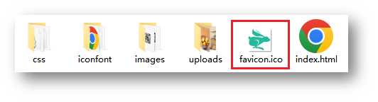

```html
<!-- link:favicon -->
<link rel="shortcut icon" href="favicon.ico" type="image/x-icon">
```

## 04-版心

> common.css

```css
/* 版心 */
.wrapper {
  margin: 0 auto;
  width: 1240px;
}
```

## 05-快捷导航-布局

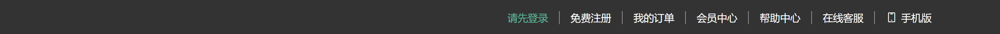

### HTML结构

```html
<!-- 快捷导航 -->
<div class="shortcut">
  <div class="wrapper">1</div>
</div>
```

### CSS样式

```css
/* 快捷导航 */
.shortcut {
  height: 52px;
  background-color: #333;
}

.shortcut .wrapper {
  display: flex;
  justify-content: flex-end;
  height: 52px;
  background-color: pink;
}
```

## 06-快捷导航-内容

### HTML结构

```html
<ul>
  <li><a href="#" class="login">请先登录</a></li>
  <li><a href="#">免费注册</a></li>
  <li><a href="#">我的订单</a></li>
  <li><a href="#">会员中心</a></li>
  <li><a href="#">帮助中心</a></li>
  <li><a href="#">在线客服</a></li>
  <li><a href="#"><span class="iconfont icon-mobile-phone"></span>手机版</a></li>
</ul>
```

### CSS样式

```css
.shortcut ul {
  display: flex;
  line-height: 52px;
}

.shortcut li a {
  padding: 0 15px;
  border-right: 1px solid #999;
  font-size: 14px;
  color: #fff;
}

.shortcut li:last-child a {
  border-right: 0;
}

.shortcut li .iconfont {
  margin-right: 4px;
  vertical-align: middle;
}

.shortcut li .login {
  color: #5EB69C;
}
```

## 07-头部-布局


### HTML结构

```html
<!-- 头部 -->
<div class="header wrapper">
  <!-- logo -->
  <div class="logo">logo</div>
  <!-- 导航 -->
  <div class="nav">导航</div>
  <!-- 搜索 -->
  <div class="search">搜索</div>
  <!-- 购物车 -->
  <div class="cart">购物车</div>
</div>
```

### CSS样式

```css
/* 头部 */
.header {
  display: flex;
  margin-top: 22px;
  margin-bottom: 22px;
  height: 88px;
  background-color: pink;
}
```

## 08-头部-logo

### HTML结构

```html
<!-- logo -->
<div class="logo">
  <h1><a href="#">小兔鲜儿</a></h1>
</div>
```

### CSS样式

```css
/* logo */
.logo {
  margin-right: 40px;
  width: 200px;
  height: 88px;
  /* background-color: skyblue; */
}

.logo a {
  display: block;
  width: 200px;
  height: 88px;
  background-image: url(../images/logo.png);
  font-size: 0;
}
```

## 09-头部-导航

### HTML结构

```html
<ul>
  <li><a href="#">首页</a></li>
  <li><a href="#">生鲜</a></li>
  <li><a href="#">美食</a></li>
  <li><a href="#">餐厨</a></li>
  <li><a href="#">电器</a></li>
  <li><a href="#">居家</a></li>
  <li><a href="#">洗护</a></li>
  <li><a href="#">孕婴</a></li>
  <li><a href="#">服装</a></li>
</ul>
```

### CSS样式

```css
/* 导航 */
.nav {
  margin-top: 33px;
  margin-right: 28px;
}

.nav ul {
  display: flex;
}

.nav li {
  margin-right: 47px;
}

.nav li a {
  padding-bottom: 10px;
  /* background-color: skyblue; */
}

.nav li a:hover {
  border-bottom: 2px solid #5EB69C;
  color: #5EB69C;
}
```

## 10-头部-搜索

### HTML结构

```html
<!-- 搜索 -->
<div class="search">
  <span class="iconfont icon-search"></span>
  <input type="text" placeholder="搜一搜">
</div>
```

### CSS样式

```scss
/* 搜索 */
.search {
  display: flex;
  margin-top: 33px;
  margin-right: 45px;
  width: 170px;
  height: 34px;
  border-bottom: 2px solid #F4F4F4;
}

.search .iconfont {
  margin-right: 8px;
  font-size: 18px;
  color: #ccc;
}

.search input {
  /* 浏览器优先生效 input 标签的默认宽度，所以 flex：1 不生效 */
  /* 解决办法：重置 input 默认宽度 → width：0 */
  flex: 1;
  width: 0;
}

.search input::placeholder {
  font-size: 16px;
  color: #ccc;
}
```

## 11-头部-购物车

### HTML结构

```html
<!-- 购物车 -->
<div class="cart">
  <span class="iconfont icon-cart-full"></span>
  <i>2</i>
</div>
```

### CSS样式

```CSS
/* 购物车 */
.cart {
  position: relative;
  margin-top: 32px;
}

.cart .iconfont {
  font-size: 24px;
}

.cart i {
  position: absolute;
  top: 1px;
  /* right 定位右对齐：如果文字多了，向左撑开，可能盖住其他的内容 */
  /* right: 1px; */
  /* left 定位左对齐：文字多了，向右撑开 */
  left: 15px;
  padding: 0 6px;
  height: 15px;
  background-color: #E26237;
  border-radius: 8px;
  font-size: 14px;
  color: #FFFEFE;
  line-height: 15px;
}
```

## 12-底部-布局

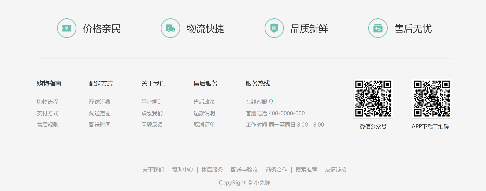

### HTML结构

```html
<!-- 底部 -->
<div class="footer">
  <div class="wrapper">
    <!-- 服务 -->
    <div class="service">服务</div>
    <!-- 帮助中心 -->
    <div class="help">帮助中心</div>
    <!-- 版权 -->
    <div class="copyright">版权</div>
  </div>
</div>
```

### CSS样式

```css
/* 底部 */
.footer {
  height: 580px;
  background-color: #F5F5F5;
}

/* 服务 */
.service {
  padding: 60px 0;
  height: 178px;
  border-bottom: 1px solid #E8E8E8;
}

/* 帮助中心 */
.help {
  display: flex;
  justify-content: space-between;
  padding-top: 60px;
  height: 300px;
  background-color: pink;
}
```

## 13-底部-服务区域

### HTML结构

```html
<ul>
  <li>
    <h5></h5>
    <p>价格亲民</p>
  </li>
  <li>
    <h5></h5>
    <p>物流快捷</p>
  </li>
  <li>
    <h5></h5>
    <p>品质新鲜</p>
  </li>
  <li>
    <h5></h5>
    <p>售后无忧</p>
  </li>
</ul>
```

### CSS结构

```css
.service ul {
  display: flex;
  justify-content: space-evenly;
}

.service li {
  display: flex;
  width: 190px;
  height: 58px;
  /* background-color: pink; */
}

.service li h5 {
  margin-right: 20px;
  width: 58px;
  height: 58px;
  background-image: url(../images/sprite.png);
}

.service li p {
  font-size: 28px;
  line-height: 58px;
}

.service li:nth-child(2) h5 {
  background-position: 0 -58px;
}
.service li:nth-child(3) h5 {
  background-position: 0 -116px;
}
.service li:nth-child(4) h5 {
  background-position: 0 -174px;
}
```

## 14-底部-帮助中心-左侧

### HTML结构

```html
<div class="left">
  <dl>
    <dt>购物指南</dt>
    <dd><a href="#">购物流程</a></dd>
    <dd><a href="#">支付方式</a></dd>
    <dd><a href="#">售后规则</a></dd>
  </dl>
  <dl>
    <dt>配送方式</dt>
    <dd><a href="#">配送运费</a></dd>
    <dd><a href="#">配送范围</a></dd>
    <dd><a href="#">配送时间</a></dd>
  </dl>
  <dl>
    <dt>关于我们</dt>
    <dd><a href="#">平台规则</a></dd>
    <dd><a href="#">联系我们</a></dd>
    <dd><a href="#">问题反馈</a></dd>
  </dl>
  <dl>
    <dt>售后服务</dt>
    <dd><a href="#">售后政策</a></dd>
    <dd><a href="#">退款说明</a></dd>
    <dd><a href="#">取消订单</a></dd>
  </dl>
  <dl>
    <dt>服务热线</dt>
    <dd><a href="#">在线客服<span class="iconfont icon-customer-service"></span></a></dd>
    <dd><a href="#">客服电话 400-0000-000</a></dd>
    <dd><a href="#">工作时间 周一至周日 8:00-18:00</a></dd>
  </dl>
</div>
```

### CSS样式

```css
/* left */
.help .left {
  display: flex;
}

.help .left dl {
  margin-right: 84px;
}

.help .left dl:last-child {
  margin-right: 0;
}

.help .left dt {
  margin-bottom: 30px;
  font-size: 18px;
}

.help .left dd {
  margin-bottom: 10px;
}

.help .left a {
  color: #969696;
}

.help .left .iconfont {
  color: #5EB69C;
}
```

## 15-底部-帮助中心-右侧

### HTML结构

```html
<div class="right">
  <ul>
    <li>
      <div class="pic"></div>
      <p>微信公众号</p>
    </li>
    <li>
      <div class="pic"></div>
      <p>APP下载二维码</p>
    </li>
  </ul>
</div>
```

### CSS样式

```css
/* right */
.help .right ul {
  display: flex;
}

.help .right li:first-child {
  margin-right: 55px;
}

.help .right .pic {
  margin-bottom: 10px;
  width: 120px;
  height: 120px;
}

.help .right p {
  color: #969696;
  text-align: center;
}
```

## 16-底部-版权

### HTML结构

```html
<p>
  <a href="#">关于我们</a>|
  <a href="#">帮助中心</a>|
  <a href="#">售后服务</a>|
  <a href="#">配送与验收</a>|
  <a href="#">商务合作</a>|
  <a href="#">搜索推荐</a>|
  <a href="#">友情链接</a>
</p>
<p>CopyRight © 小兔鲜</p>
```

### CSS样式

```css
/* 版权 */
.copyright {
  text-align: center;
}

.copyright p {
  margin-bottom: 10px;
  color: #A1A1A1;
}

.copyright p a {
  margin: 0 10px;
  color: #A1A1A1;
}
```# day10-小兔鲜儿

## 01-banner-轮播图

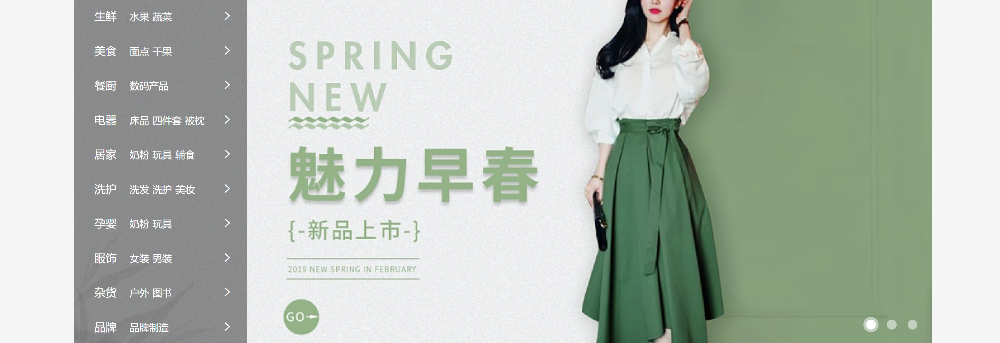

> index.css

### HTML结构

```html
<!-- banner -->
  <div class="banner">
    <div class="wrapper">
      <!-- 图片 -->
      <ul class="pic">
        <li><a href="#"></a></li>
        <li><a href="#"></a></li>
        <li><a href="#"></a></li>
      </ul>
    </div>
</div>
```

### CSS样式

```css
/* banner */
.banner {
  height: 500px;
  background-color: #F5F5F5;
}

.banner .wrapper {
  position: relative;
  height: 500px;
  background-color: pink;
  overflow: hidden;
}

/* 图片 */
.banner .pic {
  display: flex;
  /* flex 布局，父级宽度不够，子级被挤小，不想挤小，增大父级尺寸 */
  width: 3720px;
}
```
# day10-小兔鲜儿

## 01-banner-轮播图


> index.css

### HTML结构

```html
<!-- banner -->
  <div class="banner">
    <div class="wrapper">
      <!-- 图片 -->
      <ul class="pic">
        <li><a href="#"></a></li>
        <li><a href="#"></a></li>
        <li><a href="#"></a></li>
      </ul>
    </div>
</div>
```

### CSS样式

```css
/* banner */
.banner {
  height: 500px;
  background-color: #F5F5F5;
}

.banner .wrapper {
  position: relative;
  height: 500px;
  background-color: pink;
  overflow: hidden;
}

/* 图片 */
.banner .pic {
  display: flex;
  /* flex 布局，父级宽度不够，子级被挤小，不想挤小，增大父级尺寸 */
  width: 3720px;
}
```

## 02-banner-侧导航

### HTML结构

```html
<!-- 侧导航 ul -->
<div class="subnav">
  <ul>
    <li>
      <div><a href="#" class="classify">生鲜</a><a href="#">水果</a><a href="#">蔬菜</a></div>
      <span class="iconfont icon-arrow-right-bold"></span>
    </li>
    <li>
      <div><a href="#" class="classify">美食</a><a href="#">面点</a><a href="#">干果</a></div>
      <span class="iconfont icon-arrow-right-bold"></span>
    </li>
    <li>
      <div><a href="#" class="classify">餐厨</a><a href="#">数码产品</a></div>
      <span class="iconfont icon-arrow-right-bold"></span>
    </li>
    <li>
      <div><a href="#" class="classify">电器</a><a href="#">床品</a><a href="#">四件套</a><a href="#">被枕</a></div>
      <span class="iconfont icon-arrow-right-bold"></span>
    </li>
    <li>
      <div><a href="#" class="classify">居家</a><a href="#">奶粉</a><a href="#">玩具</a><a href="#">辅食</a></div>
      <span class="iconfont icon-arrow-right-bold"></span>
    </li>
    <li>
      <div><a href="#" class="classify">洗护</a><a href="#">洗发</a><a href="#">洗护</a><a href="#">美妆</a></div>
      <span class="iconfont icon-arrow-right-bold"></span>
    </li>
    <li>
      <div><a href="#" class="classify">孕婴</a><a href="#">奶粉</a><a href="#">玩具</a></div>
      <span class="iconfont icon-arrow-right-bold"></span>
    </li>
    <li>
      <div><a href="#" class="classify">服饰</a><a href="#">女装</a><a href="#">男装</a></div>
      <span class="iconfont icon-arrow-right-bold"></span>
    </li>
    <li>
      <div><a href="#" class="classify">杂货</a><a href="#">户外</a><a href="#">图书</a></div>
      <span class="iconfont icon-arrow-right-bold"></span>
    </li>
    <li>
      <div><a href="#" class="classify">品牌</a><a href="#">品牌制造</a></div>
      <span class="iconfont icon-arrow-right-bold"></span>
    </li>
    
  </ul>
</div>
```

### CSS样式

```css
/* 侧导航 */
.subnav {
  position: absolute;
  left: 0;
  top: 0;
  width: 250px;
  height: 500px;
  background-color: rgba(0,0,0,0.42);
}

.subnav li {
  display: flex;
  justify-content: space-between;
  padding-left: 30px;
  padding-right: 12px;
  height: 50px;
  /* background-color: pink; */
  line-height: 50px;
  color: #fff;

  cursor: pointer;
}

/* a所有都是小字，分类是大字 */
.subnav li a {
  margin-right: 5px;
  font-size: 14px;
  color: #fff;
}

.subnav li .classify {
  margin-right: 14px;
  font-size: 16px;
}

.subnav li .iconfont {
  font-size: 14px;
}

.subnav li:hover {
  background-color: #00BE9A;
}
```

## 03-banner-圆点指示器

### HTML结构

```html
<!-- 圆点指示器 -->
<ol>
  <li class="current"><i></i></li>
  <li><i></i></li>
  <li><i></i></li>
</ol>
```

### CSS样式

```css
/* 圆点指示器 */
.banner ol {
  position: absolute;
  bottom: 17px;
  right: 16px;
  display: flex;
}

.banner ol li {
  margin-left: 8px;
  width: 22px;
  height: 22px;
  /* background-color: pink; */
  border-radius: 50%;
  cursor: pointer;
}

.banner ol i {
  display: block;
  margin: 4px;
  width: 14px;
  height: 14px;
  background-color: rgba(255,255,255,0.5);
  border-radius: 50%;
}

/* 选中：li半透明； i白色 */
.banner ol .current {
  background-color: rgba(255,255,255,0.5);
}

.banner ol .current i {
  background-color: #fff;
}
```

## 04-新鲜好物-标题

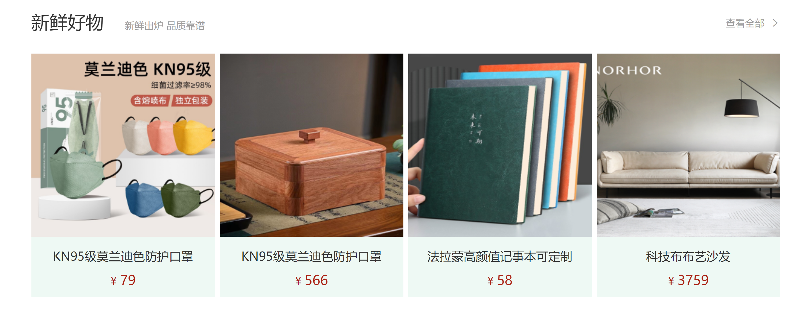

> 考虑公共样式

### HTML结构

```html
<!-- 新鲜好物 -->
<div class="goods wrapper">
  <!-- 标题 -->
  <div class="title">
    <div class="left">
      <h3>新鲜好物</h3>
      <p>新鲜出炉 品质靠谱</p>
    </div>
    <div class="right">
      <a href="#" class="more">查看全部<span class="iconfont icon-arrow-right-bold"></span></a>
    </div>
  </div>
</div>
```

### CSS样式

```css
/* 新鲜好物 */
/* 标题 -- 公共样式 */
.title {
  display: flex;
  justify-content: space-between;
  margin-top: 40px;
  margin-bottom: 30px;
  height: 42px;
  /* background-color: pink; */
}

.title .left {
  display: flex;
}

.title .left h3 {
  margin-right: 35px;
  font-size: 30px;
}

.title .left p {
  align-self: flex-end;
  color: #A1A1A1;
}

.title .right .more {
  line-height: 42px;
  color: #A1A1A1;
}

.title .right .more .iconfont {
  margin-left: 10px;
}
```

## 05-新鲜好物-内容

### HTML结构

```html
<!-- 内容 -->
<div class="bd">
  <ul>
    <li>
      <a href="#">
        <div class="pic"></div>
        <div class="txt">
          <h4>KN95级莫兰迪色防护口罩</h4>
          <p>¥<span>79</span></p>
        </div>
      </a>
    </li>
    <li>
      <a href="#">
        <div class="pic"></div>
        <div class="txt">
          <h4>紫檀外独板三层普洱茶盒</h4>
          <p>¥<span>566</span></p>
        </div>
      </a>
    </li>
    <li>
      <a href="#">
        <div class="pic"></div>
        <div class="txt">
          <h4>法拉蒙高颜值记事本可定制</h4>
          <p>¥<span>58</span></p>
        </div>
      </a>
    </li>
    <li>
      <a href="#">
        <div class="pic"></div>
        <div class="txt">
          <h4>科技布布艺沙发</h4>
          <p>¥<span>3579</span></p>
        </div>
      </a>
    </li> 
  </ul>
</div>
```

### CSS样式

```css
/* 好物内容 -- 公共样式 */
.bd ul {
  display: flex;
  justify-content: space-between;
}

.bd li {
  width: 304px;
  height: 404px;
  background-color: #EEF9F4;
}

.bd li .pic {
  width: 304px;
  height: 304px;
}

.bd li .txt {
  text-align: center;
}

.bd li h4 {
  margin-top: 18px;
  margin-bottom: 8px;
  font-size: 20px;
}

.goods .bd p {
  font-size: 18px;
  color: #AA2113;
}

.goods .bd p span {
  margin-left: 3px;
  font-size: 22px;
}
```

## 06-人气推荐

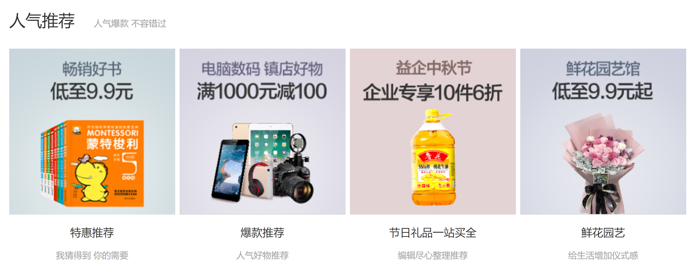

### HTML结构

```html
<!-- 人气推荐 -->
<div class="recommend wrapper">
  <!-- 标题 -->
  <div class="title">
    <div class="left">
      <h3>人气推荐</h3>
      <p>人气爆款 不容错过</p>
    </div>
  </div>
  <!-- 内容 -->
  <div class="bd">
    <ul>
      <li>
        <a href="#">
          <div class="pic"></div>
          <div class="txt">
            <h4>特惠推荐</h4>
            <p>我猜得到 你的需要</p>
          </div>
        </a>
      </li>
      <li>
        <a href="#">
          <div class="pic"></div>
          <div class="txt">
            <h4>爆款推荐</h4>
            <p>人气好物推荐</p>
          </div>
        </a>
      </li>
      <li>
        <a href="#">
          <div class="pic"></div>
          <div class="txt">
            <h4>节日礼品一站买全</h4>
            <p>编辑尽心整理推荐</p>
          </div>
        </a>
      </li>
      <li>
        <a href="#">
          <div class="pic"></div>
          <div class="txt">
            <h4>鲜花园艺</h4>
            <p>给生活增加仪式感</p>
          </div>
        </a>
      </li>
      
    </ul>
  </div>
</div>
```

### CSS样式

```css
/* 人气推荐 */
.recommend .bd li {
  background-color: #fff;
}

.recommend .bd p {
  color: #A1A1A1;
}
```

## 07-热门品牌-布局


### HTML结构

```html
<!-- 热门品牌 -->
<div class="brand">
  <div class="wrapper">
    <!-- 标题 -->
    <div class="title">
      <div class="left">
        <h3>热门品牌</h3>
        <p>国际经典 品质认证</p>
      </div>

      <div class="button">1</div>
    </div>
  </div>
</div>
```

### CSS样式

```css
/* 热门品牌 */
.brand {
  margin-top: 60px;
  height: 468px;
  background-color: #F5F5F5;
}

.brand .wrapper {
  overflow: hidden;
  height: 468px;
  /* background-color: pink; */
}

.brand .title {
  position: relative;
  margin-bottom: 40px;
}

.brand .button {
  position: absolute;
  right: 0;
  bottom: -25px;

  /* 让a在一行显示，宽高生效 */
  display: flex;
}
```

## 08-热门品牌-内容

### HTML结构

```html
<div class="button">
  <a href="#" class="prev">
    <i class="iconfont icon-arrow-left-bold"></i>
  </a>
  <a href="#" class="next">
    <i class="iconfont icon-arrow-right-bold"></i>
  </a>
</div>


<!-- 内容 -->
<div class="bd">
  <ul>
    <li><a href="#"></a></li>
    <li><a href="#"></a></li>
    <li><a href="#"></a></li>
    <li><a href="#"></a></li>
    <li><a href="#"></a></li>
  </ul>
</div>
```

### CSS样式

```css
.brand .button a {
  margin-left: 12px;
  width: 20px;
  height: 20px;
  text-align: center;
  line-height: 20px;
  color: #fff;
}

.brand .button .prev {
  background-color: #ddd;
}

.brand .button .next {
  background-color: #00BE9A;
}

.brand .bd li {
  width: 244px;
  height: 306px;
}
```

## 09-生鲜-标题


### HTML结构

```html
<!-- 生鲜 -->
<div class="fresh wrapper">
  <!-- 标题 -->
  <div class="title">
    <div class="left">
      <h3>生鲜</h3>
    </div>
    <div class="right">
      <ul>
        <li><a href="#" class="active">热门</a></li>
        <li><a href="#">蔬菜</a></li>
        <li><a href="#">肉禽蛋</a></li>
        <li><a href="#">水果</a></li>
        <li><a href="#">海鲜</a></li>
        <li><a href="#">零食</a></li>
        <li><a href="#">饮料</a></li>
      </ul>
      <a href="#" class="more">查看全部<span class="iconfont icon-arrow-right-bold"></span></a>
    </div>
  </div>
</div>
```

### CSS样式

```css
/* 生鲜 */
.fresh .title {
  margin-top: 60px;
  margin-bottom: 20px;
}

.title .right {
  display: flex;
}

.title .right ul {
  display: flex;
  margin-top: 10px;
  margin-right: 58px;
}

.title .right ul a {
  display: block;
  margin-left: 6px;
  padding: 0 7px;
  height: 20px;
  /* background-color: pink; */
  line-height: 20px;
}

.title .right ul .active {
  background-color: #00BE9A;
  color: #fff;
}
```

## 10-生鲜-内容布局

### HTML结构

```html
<!-- 内容 -->
<div class="content">
  <div class="left">
    <a href="#"></a>
  </div>
  <div class="right">
    <ul>
      <li>1</li>
      <li>2</li>
      <li>3</li>
      <li>4</li>
      <li>5</li>
      <li>6</li>
      <li>7</li>
      <li>8</li>
    </ul>
  </div>
</div>
```

### CSS样式

```css
/* 生鲜内容 */
.content {
  display: flex;
  justify-content: space-between;
}

.content .left {
  width: 248px;
  height: 610px;
  /* background-color: pink; */
}

.content .right {
  width: 968px;
  height: 610px;
  /* background-color: pink; */
}

.content .right ul {
  display: flex;
  flex-wrap: wrap;
}

.content .right li {
  position: relative;
  padding: 10px 21px 0;
  width: 242px;
  height: 305px;
  border: 2px solid #fff;

  /* 为了隐藏绿色cover */
  overflow: hidden;
}
```

## 11-生鲜-产品内容

### HTML结构

```html
<ul>
  <li>
    <a href="#">
      <div class="pic"></div>
      <div class="txt">
        <div class="info">
          <h4>双味千层，手抓饼烤肉组合</h4>
          <p>240g/袋 4片装</p>
          <p>加热即食</p>
        </div>
        <p class="price">¥<span>89.99</span></p>
      </div>
    </a>
  </li>
  <li>
    <a href="#">
      <div class="pic"></div>
      <div class="txt">
        <div class="info">
          <h4>云南甘蔗慢熬红糖馒头</h4>
          <p>220g/袋 5个装</p>
          <p>加热即食</p>
        </div>
        <p class="price">¥<span>9.00</span></p>
      </div>
    </a>
  </li>
  <li>
    <a href="#">
      <div class="pic"></div>
      <div class="txt">
        <div class="info">
          <h4>日式风味小圆饼</h4>
          <p>圆形【海盐味】</p>
          <p>糖果零食</p>
        </div>
        <p class="price">¥<span>588.00</span></p>
      </div>
    </a>
  </li>
  <li>
    <a href="#">
      <div class="pic"></div>
      <div class="txt">
        <div class="info">
          <h4>全麦奶油浓香小面包</h4>
          <p>50g*12袋</p>
          <p>美味西点</p>
        </div>
        <p class="price">¥<span>69.00</span></p>
      </div>
    </a>
  </li>
  <li>
    <a href="#">
      <div class="pic"></div>
      <div class="txt">
        <div class="info">
          <h4>秘制外皮五福摩提大福点心</h4>
          <p>150g/盒</p>
          <p>美味西点</p>
        </div>
        <p class="price">¥<span>39.99</span></p>
      </div>
    </a>
  </li>
  <li>
    <a href="#">
      <div class="pic"></div>
      <div class="txt">
        <div class="info">
          <h4>水果面膜韩国蜂蜜柚子茶</h4>
          <p>560g/瓶</p>
          <p>冲调饮品</p>
        </div>
        <p class="price">¥<span>39.99</span></p>
      </div>
    </a>
  </li>
  <li>
    <a href="#">
      <div class="pic"></div>
      <div class="txt">
        <div class="info">
          <h4>浓情比利时巧克力礼盒装</h4>
          <p>205克/盒</p>
          <p>糖果零食</p>
        </div>
        <p class="price">¥<span>120.00</span></p>
      </div>
    </a>
  </li>
  <li>
    <a href="#">
      <div class="pic"></div>
      <div class="txt">
        <div class="info">
          <h4>抹茶奶油小蛋糕礼盒装</h4>
          <p>220克/盒</p>
          <p>美味西点</p>
        </div>
        <p class="price">¥<span>60.00</span></p>
      </div>
    </a>
  </li>
</ul>
```

### CSS样式

```css
/* 产品内容 */
.content .pic {
  width: 200px;
  height: 180px;
}

.content .info {
  margin-top: 14px;
  margin-bottom: 5px;
  height: 60px;
  line-height: 19px;
}

.content .price {
  color: #AF2F22;
}

.content .price span {
  margin-left: 5px;
  font-size: 22px;
}
```

## 12-生鲜-过渡效果

### HTML结构

```html
<div class="cover">
  <p>找相似</p>
  <p></p>
  <p>发现更多宝贝<span class="iconfont icon-arrow-right-bold"></span></p>
</div>
```

### CSS样式

```css
/* 产品底部绿色区域 */
.content li .cover {
  position: absolute;
  left: 0;
  /* bottom: 0; */
  bottom: -86px;
  padding-top: 15px;
  width: 242px;
  height: 84px;
  background-color: #00BE9A;
  text-align: center;
  color: #fff;
  transition: all 0.5s;
}

.content .cover p:nth-child(1) {
  font-size: 18px;
}

.content .cover p:nth-child(2) {
  margin: 3px auto 6px;
  width: 120px;
  height: 1px;
  background-color: rgba(255,255,255,0.11);
}

.content .cover p:nth-child(3) {
  font-size: 13px;
} 

.content .cover p:nth-child(3) .iconfont {
  font-size: 14px;
}

/* 鼠标悬停到li，显示cover，改变位置 */
.content .right li:hover .cover {
  bottom: 0;
}

.content .right li:hover {
  border: 2px solid #00BE9A;
}
```

## 13-最新专题-布局

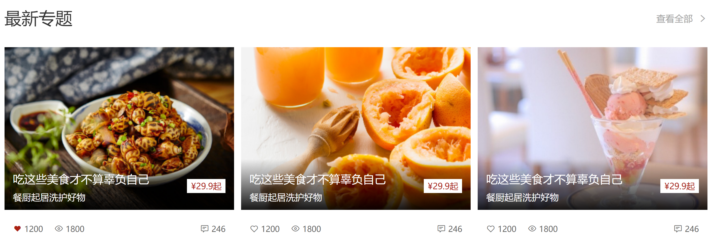

### HTML结构

```html
<!-- 最新专题 -->
<div class="topic wrapper">
  <div class="title">
    <div class="left">
      <h3>最新专题</h3>
    </div>
    <div class="right">
      <a href="#" class="more">查看全部<span class="iconfont icon-arrow-right-bold"></span></a>
    </div>
  </div>
  <div class="topic-bd">
    <ul>
      <li>1</li>
      <li>2</li>
      <li>3</li>
    </ul>
  </div>
</div>
```

### CSS样式

```css
/* 最新专题 */
.topic {
  margin-bottom: 40px;
}

.topic .title {
  margin-top: 100px;
}

.topic-bd ul {
  display: flex;
  justify-content: space-between;
}

.topic-bd li {
  width: 405px;
  height: 355px;
  background-color: pink;
}
```

## 14-最新专题-内容

### HTML结构

```html
<ul>
  <li>
    <a href="#">
      <div class="pic">
        
      </div>
      <div class="txt">
        <div class="left">
          <p>
            <i class="iconfont icon-favorites-fill"></i>
            <span>1220</span>
          </p>
          <p>
            <i class="iconfont icon-browse"></i>
            <span>1800</span>
          </p>
        </div>
        <div class="right">
          <p>
            <i class="iconfont icon-comment"></i>
            <span>246</span>
          </p>
        </div>
      </div>
    </a>
  </li>
  <li>
    <a href="#">
      <div class="pic">
        
      </div>
      <div class="txt">
        <div class="left">
          <p>
            <i class="iconfont icon-favorites-fill"></i>
            <span>1220</span>
          </p>
          <p>
            <i class="iconfont icon-browse"></i>
            <span>1800</span>
          </p>
        </div>
        <div class="right">
          <p>
            <i class="iconfont icon-comment"></i>
            <span>246</span>
          </p>
        </div>
      </div>
    </a>
  </li>
  <li>
    <a href="#">
      <div class="pic">
        
      </div>
      <div class="txt">
        <div class="left">
          <p>
            <i class="iconfont icon-favorites-fill"></i>
            <span>1220</span>
          </p>
          <p>
            <i class="iconfont icon-browse"></i>
            <span>1800</span>
          </p>
        </div>
        <div class="right">
          <p>
            <i class="iconfont icon-comment"></i>
            <span>246</span>
          </p>
        </div>
      </div>
    </a>
  </li>
</ul>
```

### CSS样式

```css
.topic-bd ul {
  display: flex;
  justify-content: space-between;
}

.topic-bd li {
  width: 405px;
  height: 355px;
  background-color: pink;
}

.topic-bd .pic {
  position: relative;
  width: 405px;
  height: 288px;
}

.topic-bd .txt {
  display: flex;
  justify-content: space-between;
  align-items: center;
  padding: 0 15px;
  width: 405px;
  height: 67px;
  /* background-color: skyblue; */
  font-size: 14px;
  color: #666;
}

.topic-bd .txt .left {
  display: flex;
}

.topic-bd .txt .left p {
  margin-right: 20px;
}

.topic-bd .txt .left p:nth-child(1) i {
  color: #AA2113;
}
```

## 15-最新专题-定位文字

### HTML结构

```html
<div class="pic">
  
  <!-- 定位区域 -->
  <div class="cover">
    <div class="left">
      <h4>吃这些美食才不算辜负自己</h4>
      <p>餐厨起居洗护好物</p>
    </div>
    <div class="right">￥<span>29.9</span><span>起</span></div>
  </div>
</div>
```

### CSS样式

```css
/* 定位区域 - 文字 */
.topic-bd .cover {
  position: absolute;
  left: 0;
  bottom: 0;

  display: flex;
  justify-content: space-between;
  align-items: center;

  padding: 0 15px;
  width: 405px;
  height: 90px;
  background-image: linear-gradient(180deg, rgba(137,137,137,0.00) 0%, rgba(0,0,0,0.90) 100%);
}

.topic-bd .cover .left {
  color: #fff;
}

.topic-bd .cover .left h4 {
  margin-bottom: 6px;
  font-size: 20px;
}

.topic-bd .cover .right {
  padding: 0 7px;
  height: 25px;
  background-color: #fff;
  color: #AA2113;
  font-size: 15px;
}

.topic-bd .cover .right span {
  font-size: 18px;
}
```

