# 移动 Web 第一天

> 目标：使用位移、缩放、旋转、渐变效果丰富网页元素的呈现方式。

## 01-平面转换

### 简介

作用：为元素添加动态效果，一般与过渡配合使用

概念：改变盒子在平面内的形态（位移、旋转、缩放、倾斜）


平面转换也叫 2D 转换，属性是 **transform**

### 平移

```css
transform: translate(X轴移动距离, Y轴移动距离);
```

* 取值
  * 像素单位数值
  * 百分比（参照**盒子自身尺寸**计算结果）
  * **正负**均可
* 技巧
  * translate() **只写一个值**，表示沿着 **X** 轴移动
  * 单独设置 X 或 Y 轴移动距离：translateX() 或 translateY()

### 定位居中

* 方法一：margin

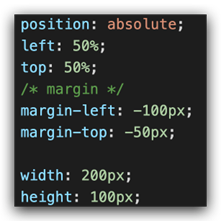

* 方法二：平移 → 百分比参照盒子自身尺寸计算结果 


### 案例-双开门

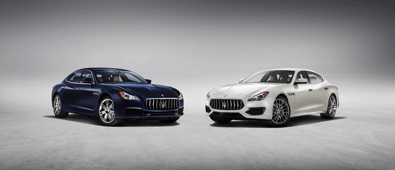

* HTML 结构

```html
<div class="father">
    <div class="left"></div>
    <div class="right"></div>
</div>
```

* CSS 样式

```css
* {
    margin: 0;
    padding: 0;
}

/* 1. 布局：父子结构，父级是大图，子级是左右小图 */
.father {
    display: flex;
    margin: 0 auto;
    width: 1366px;
    height: 600px;
    background-image: url(./images/bg.jpg);

    overflow: hidden;
}

.father .left,
.father .right {
    width: 50%;
    height: 600px;
    background-image: url(./images/fm.jpg);

    transition: all .5s;
}

.father .right {
    /* right 表示的取到精灵图右面的图片 */
    background-position: right 0;
}

/* 2. 鼠标悬停的效果：左右移动 */
.father:hover .left {
    transform: translate(-100%);
}

.father:hover .right {
    transform: translateX(100%);
}
```

### 旋转

```css
transform: rotate(旋转角度);
```

* 取值：角度单位是 **deg** 
* 技巧
  * 取值正负均可
  * 取值为正，顺时针旋转
  * 取值为负，逆时针旋转

### 转换原点

> 默认情况下，转换原点是盒子中心点 

```css
transform-origin: 水平原点位置 垂直原点位置;
```

取值：

* **方位名词**（left、top、right、bottom、center）
* 像素单位数值
* 百分比

### 案例-时钟


```css
.hour {
  width: 6px;
  height: 50px;
  background-color: #333;
  margin-left: -3px;
  transform: rotate(15deg);
  transform-origin: center bottom;
}

.minute {
  width: 5px;
  height: 65px;
  background-color: #333;
  margin-left: -3px;
  transform: rotate(90deg);
  transform-origin: center bottom;
}

.second {
  width: 4px;
  height: 80px;
  background-color: red;
  margin-left: -2px;
  transform: rotate(240deg);
  transform-origin: center bottom;
}
```

### 多重转换

多重转换技巧：先平移再旋转

```css
transform: translate() rotate();
```

* 多重转换原理：以第一种转换方式坐标轴为准转换形态
  * 旋转会改变网页元素的坐标轴向
  * 先写旋转，则后面的转换效果的轴向以旋转后的轴向为准，会影响转换结果

### 缩放

```css
transform: scale(缩放倍数);
transform: scale(X轴缩放倍数, Y轴缩放倍数);
```

* 技巧
  * 通常，只为 scale() 设置一个值，表示 X 轴和 Y 轴等比例缩放
  * 取值大于1表示放大，取值小于1表示缩小

### 案例-播放特效


* CSS 样式

```css
/* 1. 摆放播放按钮：图片区域的中间 */
.box li {
  overflow: hidden;
}

.pic {
  position: relative;
}

.pic::after {
  position: absolute;
  left: 50%;
  top: 50%;
  /* margin-left: -29px;
  margin-top: -29px; */
  /* transform: translate(-50%, -50%); */

  content: '';
  width: 58px;
  height: 58px;
  background-image: url(./images/play.png);
  transform: translate(-50%, -50%) scale(5);
  opacity: 0;

  transition: all .5s;
}
/* 2. hover效果：大按钮，看不见：透明是0 → 小按钮，看得见：透明度1 */
.box li:hover .pic::after {
  transform: translate(-50%, -50%) scale(1);
  opacity: 1;
}
```

### 倾斜

```css
transform: skew();
```

取值：角度度数 deg

## 02-渐变

渐变是多个颜色逐渐变化的效果，一般用于设置盒子背景 

分类：

* 线性渐变

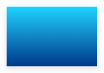

* 径向渐变


### 线性渐变

```css
background-image: linear-gradient(
  渐变方向,
  颜色1 终点位置,
  颜色2 终点位置,
  ......
);
```

取值：

* 渐变方向：可选
  * to 方位名词
  * 角度度数
* 终点位置：可选
  * 百分比

### 案例-产品展示


* HTML 结构

```html
<div class="box">
  
  <div class="title">OceanStor Pacific 海量存储斩获2021 Interop金奖</div>
  <div class="mask"></div>
</div>
```

* CSS 样式

```css
.mask {
  position: absolute;
  left: 0;
  top: 0;
  width: 100%;
  height: 100%;
  background-image: linear-gradient(
      transparent,
      rgba(0,0,0,0.5)
  );
  opacity: 0;

  transition: all .5s;
}

.box:hover .mask {
  opacity: 1;
}
```

### 径向渐变

```css
background-image: radial-gradient(
  半径 at 圆心位置,
  颜色1 终点位置,
  颜色2 终点位置,
  ......
);
```

取值：

* 半径可以是2条，则为椭圆
* 圆心位置取值：像素单位数值 / 百分比 / 方位名词

## 03-综合案例


### 导航-频道

#### 箭头旋转

```css
.x-header-nav .nav-item:hover .icon-down {
  transform: rotate(-180deg);
}
```

#### 频道列表

```css
.channel-layer {
  position: absolute;
  top: 60px;
  left: 50%;
  z-index: -2;
  width: 1080px;
  height: 120px;
  padding: 10px;
  margin-left: -540px;
  color: #72727b;
  background-color: #f5f5f5;
  border: 1px solid #e4e4e4;
  border-top: none;
  transition: all 0.5s;
  transform: translateY(-120px);
}

/* TODO 2. 弹窗频道 */
.x-header-nav .nav-item:hover .channel-layer {
  transform: translateY(0);
}
```

### 渐变按钮

#### 搜索按钮

```css
.x-header-search form .btn {
  position: absolute;
  top: 0;
  right: 0;
  width: 60px;
  height: 40px;
  line-height: 40px;
  text-align: center;
  background-color: #f86442;
  border-top-right-radius: 20px;
  border-bottom-right-radius: 20px;
  background-image: linear-gradient(
    to right,
    rgba(255, 255, 255, 0.3),
    #f86442
  );
}
```

#### 登录按钮

```css
/* TODO 7. 渐变按钮 */
.card .card-info .login {
  padding: 3px 34px;
  color: #fff;
  background-color: #ff7251;
  border-radius: 30px;
  box-shadow: 0 4px 8px 0 rgb(252 88 50 / 50%);
  background-image: linear-gradient(
    to right,
    rgba(255, 255, 255, 0.2),
    #ff7251
  );
}
```

#### 客户端按钮

```css
/* TODO 8. 径向渐变 */
.download .dl .dl-btn {
  width: 68px;
  height: 34px;
  line-height: 34px;
  color: #fff;
  text-align: center;
  border-radius: 4px;
  background-image: radial-gradient(
    50px at 10px 10px,
    rgba(255, 255, 255, 0.5),
    transparent
  );
}
```

### 轮播图

```css
/* TODO 4. 摆放图片 */
.banner .banner-list .banner-item.left {
  z-index: 0;
  transform: translate(-160px) scale(0.8);
  transform-origin: left center;
}

.banner .banner-list .banner-item.right {
  z-index: 0;
  transform: translate(160px) scale(0.8);
  transform-origin: right center;
}
```

### 猜你喜欢

```css
/* TODO 5. 播放按钮和遮罩 */
.album-item .album-item-box::after {
  position: absolute;
  left: 0;
  top: 0;
  content: '';
  width: 100%;
  height: 100%;
  background: rgba(0,0,0,.5) url(../assets/play.png) no-repeat center / 20px;
  opacity: 0;
  transition: all .5s;
}

.album-item .album-item-box:hover::after {
  opacity: 1;
  background-size: 50px;
}


/* TODO 6. 图片缩放 */
.album-item .album-item-box:hover img {
  transform: scale(1.1);
}
```

# 移动 Web 第二天

## 01-空间转换

###  空间转换简介

* 空间：是从坐标轴角度定义的 X 、Y 和 Z 三条坐标轴构成了一个立体空间，Z 轴位置与视线方向相同。
* 空间转换也叫 3D转换
* 属性：transform

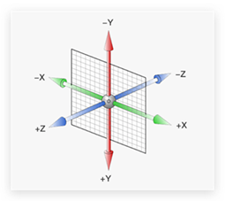

### 平移

 ```css
transform: translate3d(x, y, z);
transform: translateX();
transform: translateY();
transform: translateZ();
 ```

> 取值与平面转换相同
>
> 默认情况下，Z 轴平移没有效果，原因：电脑屏幕默认是平面，无法显示 Z 轴平移效果

### 视距

作用：指定了观察者与 Z=0 平面的距离，为元素添加透视效果

透视效果：近大远小、近实远虚

属性：(添加给父级，取值范围 800-1200)

```css
perspective: 视距;
```

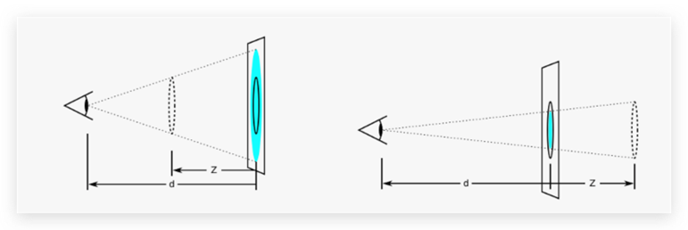

### 旋转

* Z 轴：rotateZ()


* X 轴：rotateX()


* Y 轴：rotateY()


### 左手法则

作用：根据旋转方向确定取值正负

使用：左手握住旋转轴, 拇指指向正值方向, 其他四个手指弯曲方向为旋转正值方向 


### rotate3d-了解

* rotate3d(x, y, z, 角度度数) ：用来设置自定义旋转轴的位置及旋转的角度
* x，y，z 取值为0-1之间的数字

### 立体呈现

作用：设置元素的子元素是位于 3D 空间中还是平面中

属性名：transform-style

属性值：

* flat：子级处于平面中
* preserve-3d：子级处于 3D 空间

### 案例-3d导航

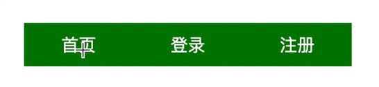

案例步骤：

1. 搭建立方体
   1. 绿色是立方体的前面
   2. 橙色是立方体的上面
2. 鼠标悬停，立方体旋转


```css
.nav li {
  position: relative;
  width: 100px;
  height: 40px;
  line-height: 40px;
  transition: all 0.5s;

  transform-style: preserve-3d;

  /* 为了看到橙色和绿色的移动过程，给立方体添加旋转 */
  /* transform: rotateX(-20deg) rotateY(30deg); */
}

.nav li a {
  position: absolute;
  left: 0;
  top: 0;
  display: block;
  width: 100%;
  height: 100%;
  text-align: center;
  text-decoration: none;
  color: #fff;
}

/* 立方体每个面都有独立的坐标轴，互不影响 */
.nav li a:first-child {
  background-color: green;
  transform: translateZ(20px);
}

.nav li a:last-child {
  background-color: orange;
  transform: rotateX(90deg) translateZ(20px);
}

.nav li:hover {
  transform: rotateX(-90deg);
}
```

### 缩放

```css
transform: scale3d(x, y, z);
transform: scaleX();
transform: scaleY();
transform: scaleZ();
```


## 02-动画

* 过渡：实现两个状态间的变化过程
* 动画：实现多个状态间的变化过程，动画过程可控（重复播放、最终画面、是否暂停）

### 动画实现步骤

1. 定义动画

```css
/* 方式一 */
@keyframes 动画名称 {
  from {}
  to {}
}

/* 方式二 */
@keyframes 动画名称 {
  0% {}
  10% {}
  ......
  100% {}
}
```

2. 使用动画

```css
animation: 动画名称 动画花费时长;
```

### animation复合属性

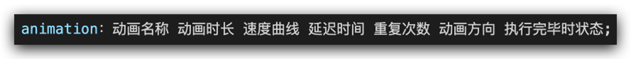

提示：

* 动画名称和动画时长必须赋值
* 取值不分先后顺序
* 如果有两个时间值，第一个时间表示动画时长，第二个时间表示延迟时间

### animation拆分写法


### 案例-走马灯


* HTML 结构

```html
<li></li>
<li></li>
<li></li>
<li></li>
<li></li>
<li></li>
<li></li>
<!-- 替身：填补显示区域的露白 -->
<li></li>
<li></li>
<li></li>
```

* CSS 样式

```css
.box {
  width: 600px;
  height: 112px;
  border: 5px solid #000;
  margin: 100px auto;
  overflow: hidden;
}

.box ul {
  display: flex;
  animation: move 6s infinite linear;
}

/* 定义位移动画；ul使用动画；鼠标悬停暂停动画 */
@keyframes move {
  0% {
    transform: translate(0);
  }
  100% {
    transform: translate(-1400px);
  }
}

.box:hover ul {
  animation-play-state: paused;
}
```

> 无缝动画原理：复制开头图片到结尾位置（图片累加宽度 = 区域宽度） 

### 精灵动画

* 核心

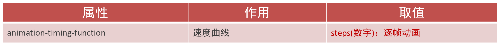

* 制作步骤

  1.准备显示区域

  盒子尺寸与一张精灵小图尺寸相同

  2.定义动画

  移动背景图（移动距离 = 精灵图宽度）

  3.使用动画

  steps(N)，N 与精灵小图个数相同 

```css
div {
  width: 140px;
  height: 140px;
  border: 1px solid #000;
  background-image: url(./images/bg.png);
  animation: run 1s steps(12) infinite;
}

@keyframes run {
  from {
    background-position: 0 0;
  }
  to {
    background-position: -1680px 0;
  }
}
```

### 多组动画

```css
animation: 
  动画一,
  动画二,
  ... ...
;
```


## 03-综合案例-全名出游


### 背景

```css
/* 大背景 */
/* 默认状态HTML和body的高度是0，所以导致cover缩放背景图不成功 */
html {
  height: 100%;
}
body {
  height: 100%;
  background: url(../images/f1_1.jpg) no-repeat center 0 / cover;
  /* background-size: cover; */
}
```

### 云彩位置和动画

* HTML 结构

```html
<!-- 云 -->
<div class="cloud">
  
  
  
</div>
```

* CSS 样式

```css
/* 云 */
.cloud img {
  position: absolute;
  left: 50%;
}

.cloud img:nth-child(1) {
  margin-left: -250px;
  top: 20px;
  animation: cloud 1s infinite alternate linear;
}
.cloud img:nth-child(2) {
  margin-left: 400px;
  top: 100px;
  animation: cloud 1s infinite alternate linear 0.4s;
}
.cloud img:nth-child(3) {
  margin-left: -550px;
  top: 200px;
  animation: cloud 1s infinite alternate linear 0.6s;
}

@keyframes cloud {
  100% {
    transform: translate(20px);
  }
}
```

### 文字动画

* HTML 结构

```html
<!-- 文字 -->
<div class="text">
  
</div>
```

* CSS 样式

```css
/* 文字 */
.text img {
  position: absolute;
  left: 50%;
  top: 50%;
  transform: translate(-50%, -50%);
  animation: text 1s;
}

/* 默认 → 小 → 大 → 小 → 默认 */
@keyframes text {
  0% {
    transform: translate(-50%, -50%) scale(1);
  }
  20% {
    transform: translate(-50%, -50%) scale(0.1);
  }
  40% {
    transform: translate(-50%, -50%) scale(1.4);
  }
  70% {
    transform: translate(-50%, -50%) scale(0.8);
  }
  100% {
    transform: translate(-50%, -50%) scale(1);
  }
}
```

# 移动 Web 第四天

## 01-移动 Web 基础

### 谷歌模拟器

模拟移动设备，方便查看页面效果

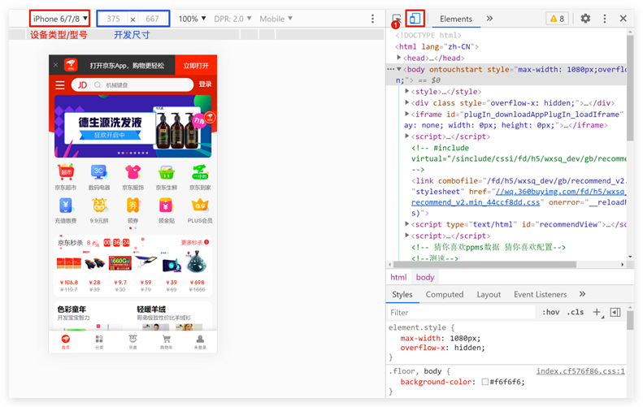

### 屏幕分辨率

分类：

* 物理分辨率：硬件分辨率（出厂设置）
* 逻辑分辨率：软件 / 驱动设置

结论：**制作网页参考 逻辑分辨率** 


### 视口

作用：显示 HTML 网页的区域，用来约束 HTML 的尺寸

```html
<!DOCTYPE html>
<html lang="en">
<head>
  <meta charset="UTF-8">
  <meta http-equiv="X-UA-Compatible" content="IE=edge">

  <!– 视口标签 -->
  <meta name="viewport" content="width=device-width, initial-scale=1.0">

  <title>Document</title>
</head>
<body>
  
</body>
</html>
```

* width=device-width：视口宽度 = 设备宽度
* initial-scale=1.0：缩放1倍（不缩放）

### 二倍图

概念：设计稿里面每个元素的尺寸的倍数

作用：防止图片在高分辨率屏幕下模糊失真

使用方法：


### 适配方案

* 宽度适配：宽度自适应
  * 百分比布局
  * Flex 布局

* 等比适配：宽高等比缩放
  * rem
  * vw

## 02-rem

### 简介

* rem单位，是相对单位
* rem单位是相对于HTML标签的字号计算结果
* 1rem = 1HTML字号大小

### 媒体查询

媒体查询能够检测视口的宽度，然后编写差异化的 CSS 样式

当某个条件成立, 执行对应的CSS样式


```css
@media (width:320px) {
  html {
    background-color: green;
  }
}
```

### rem 布局

目前rem布局方案中，将网页等分成10份， HTML标签的字号为视口宽度的 1/10。


### flexible.js

flexible.js 是手淘开发出的一个用来适配移动端的 js 库。

核心原理就是根据不同的视口宽度给网页中 html 根节点设置不同的 font-size。

```html
<body>
  ......
  <script src="./js/flexible.js"></script>
</body>
```

### rem 移动适配

rem单位尺寸

1.  确定基准根字号

* 查看设计稿宽度 → 确定参考设备宽度(视口宽度) → 确定基准根字号（1/10视口宽度）

2.  rem单位的尺寸

* **rem单位的尺寸 = px单位数值 / 基准根字号**

## 03-less

Less是一个CSS预处理器, Less文件后缀是.less。扩充了 CSS 语言, 使 CSS 具备一定的逻辑性、计算能力

注意：浏览器不识别 Less 代码，目前阶段，网页要引入对应的 CSS 文件

VS Code 插件：Easy LESS，保存 less文件后自动生成对应的 CSS 文件


### 注释

* 单行注释
  * 语法：// 注释内容
  * 快捷键：ctrl + /
* 块注释
  * 语法：/* 注释内容 */
  * 快捷键： Shift + Alt + A

### 运算

* 加、减、乘直接书写计算表达式
* 除法需要添加 小括号 或 .
* 表达式存在多个单位以第一个单位为准


### 嵌套

作用：快速生成后代选择器

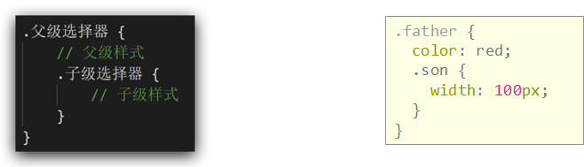

提示：用 & 表示当前选择器，不会生成后代选择器，通常配合伪类或伪元素使用


### 变量

概念：容器，存储数据

作用：存储数据，方便使用和修改

语法：

* 定义变量：@变量名: 数据; 
* 使用变量：CSS属性：@变量名;

```less
// 定义变量
@myColor: pink;
// 使用变量
.box {
  color: @myColor;
}
a {
  color: @myColor;
}
```

### 导入

作用：导入 less 公共样式文件

语法：导入: @import “文件路径”;

提示：如果是 less 文件可以省略后缀

```less
@import './base.less';
@import './common';
```

### 导出

写法：在 less 文件的第一行添加 // out: 存储URL

提示：文件夹名称后面添加 /

```less
// out: ./index.css
// out: ./css/
```

### 禁止导出

写法：在 less 文件第一行添加:  // out: false 


## 04-综合案例-极速问诊


### 准备工作

* 项目目录


* HTML 结构

```html
<link rel="stylesheet" href="./iconfont/iconfont.css">
<link rel="stylesheet" href="./css/index.css">

<body>
  ......
  <script src="./js/flexible.js"></script>
</body>
```

* less 样式

```less
// out: ../css/

@import "./base";
```

### 头部布局

* HTML 结构

```html
<!-- 头部 -->
<header>1</header>
```

* less 样式

```less
// 头部
header {
  display: flex;
  justify-content: space-between;
  padding: 0 (15 / @rootSize);
  height: (44 / @rootSize);
  background-color: pink;
  line-height: (44 / @rootSize);
}
```

### 头部内容

* HTML 结构

```html
<a href="#" class="back"><span class="iconfont icon-left"></span></a>
<h3>极速问诊</h3>
<a href="#" class="note">问诊记录</a>
```

* less 样式

```less
.icon-left {
  font-size: (22 / @rootSize);
}

h3 {
  font-size: (17 / @rootSize);
}

.note {
  font-size: (15 / @rootSize);
  color: #2CB5A5;
}
```

### banner 区域

* HTML 结构

```html
<!-- banner -->
<div class="banner">
  
  <p><span>20s</span> 快速匹配专业医生</p>
</div>
```

* less 样式

```less
// banner
.banner {
  margin-top: (30 / @rootSize);
  margin-bottom: (34 / @rootSize);
  text-align: center;
  img {
    margin-bottom: (18 / @rootSize);
    width: (240 / @rootSize);
    height: (206 / @rootSize);
  }

  p {
    font-size: (16 / @rootSize);
    span {
      color: #16C2A3;
    }
  }
}
```

### 问诊类型布局

* HTML 结构

```html
<!-- 问诊类型 -->
<div class="type">
  <ul>
    <li>
      <a href="#">
        <div class="pic">1</div>
        <div class="txt">2</div>
        <span class="iconfont icon-right"></span>
      </a>
    </li>
    <li>2</li>
  </ul>
</div>
```

* less 样式

```less
// 问诊类型
.type {
  padding: 0 (15 / @rootSize);
  li {
    margin-bottom: (15 / @rootSize);
    padding: 0 (15 / @rootSize);
    height: (78 / @rootSize);
    border: 1px solid #EDEDED;
    border-radius: (4 / @rootSize);
    a {
      display: flex;
      align-items: center;
      // 内容在78里面垂直居中
      height: (78 / @rootSize);
    }
  }
}
```

### 问诊类型内容

- HTML 结构

```html
<div class="pic">
  
</div>
<div class="txt">
  <h4>三甲图文问诊</h4>
  <p>三甲主治及以上级别医生</p>
</div>
<span class="iconfont icon-right"></span>
```

- less 样式

```less
img {
  margin-right: (14 / @rootSize);
  width: (40 / @rootSize);
  height: (40 / @rootSize);
}
.txt {
  flex:1;
  h4 {
    font-size: (16 / @rootSize);
    color: #3C3E42;
    line-height: (24 / @rootSize);
  }
  p {
    font-size: (13 / @rootSize);
    color: #848484;
  }
}
.iconfont {
  font-size: (16 / @rootSize);
}
```

# 移动 Web 第五天

## 01-vw适配方案

### vw和vh基本使用

vw和vh是相对单位，相对视口尺寸计算结果

* vw：viewport width（1vw = 1/100视口宽度 ）
* vh：lviewport height ( 1vh = 1/100视口高度 )

### vw布局

vw单位的尺寸 = px 单位数值 / ( 1/100 视口宽度 ) 

### vh问题

vh是1/100视口高度，全面屏视口高度尺寸大，如果混用可能会导致盒子变形 

## 02-综合案例-酷我音乐 

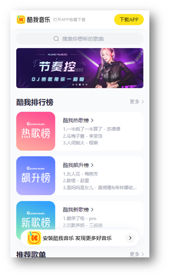

### 准备工作


* HTML 结构

```html
<link rel="stylesheet" href="./iconfont/iconfont.css">
<link rel="stylesheet" href="./css/index.css">
```

* less 样式

```less
// out: ../css/

@import "./base";
```

### 头部布局

* HTML 结构

```html
<!-- 头部 -->
<header>
  <div class="left">left</div>
  <a href="#">下载APP</a>
</header>
```

* less 样式

```less
body {
  background-color: #f9fafb;
}

@vw:3.75vw;

// 头部
header {
  display: flex;
  justify-content: space-between;
  align-items: center;
  padding: 0 (15 / @vw);
  height: (50 / @vw);
  background-color: #fff;
}
```

### 头部内容

* less 样式

```less
header {
  // 左边
  .left {
    width: (235 / @vw);
    height: (50 / @vw);
    background-image: url(../assets/head.png);
    background-size: contain;
    background-repeat: no-repeat;
  }
  a {
    width: (80 / @vw);
    height: (30 / @vw);
    background-color: #ffe31b;
    border-radius: (15 / @vw);
    text-align: center;
    line-height: (30 / @vw);
    font-size: (14 / @vw);
  }
}
```

### 搜索区域

* HTML 结构

```html
<!-- 搜索 -->
<div class="search">
  <div class="txt">
    <span class="iconfont icon-sousuo"></span>
    <span>搜索你想听的歌曲</span>
  </div>
</div>
```

* less 样式

```less
// 搜索
.search {
  padding: (10 / @vw) (15 / @vw);
  height: (52 / @vw);
  // background-color: pink;
  .txt {
    height: (32 / @vw);
    background-color: #f2f4f5;
    border-radius: (16 / @vw);
    text-align: center;
    line-height: (32 / @vw);
    color: #a1a4b3;
    font-size: (14 / @vw);
    .iconfont {
      font-size: (16 / @vw);
    }
  }
}
```

### banner 区域

* HTML 结构

```html
<!-- banner -->
<div class="banner">
  <ul>
    <li><a href="#"></a></li>
  </ul>
</div>
```

* less 样式

```less
// banner
.banner {
  padding: 0 (15 / @vw);
  height: (108 / @vw);
  // background-color: pink;
  ul {
    li {
      width: (345 / @vw);
      height: (108 / @vw);
      img {
        width: 100%;
        height: 100%;
        // cover完全覆盖
        // 缩放img，图片比例跟父级盒子比例不同，避免图片挤压变形
        object-fit: cover;
        border-radius: (5 / @vw);
      }
    }
  }
}
```

### 标题公共样式

* HTML 结构

```html
<!-- 排行榜 -->
<div class="list">
  <!-- 标题 -->
  <div class="title">
    <h4>酷我排行榜</h4>
    <a href="#">更多<span class="iconfont icon-right"></span></a>
  </div>
</div>
```

* less 样式

```less
// 排行榜
.list {
  margin-top: (20 / @vw);
  padding: 0 (15 / @vw);
}

// 标题 → 公共样式
.title {
  display: flex;
  justify-content: space-between;
  margin-bottom: (16 / @vw);
  line-height: (25 / @vw);
  h4 {
    font-size: (20 / @vw);
  }
  a {
    font-size: (12 / @vw);
    color: #a1a4b3;
  }
}
```

### 排行榜内容

* HTML 结构

```html
<!-- 内容 -->
<div class="content">
  <ul>
    <li>
      <div class="pic"></div>
      <div class="txt">
        <a href="#" class="more">酷我热歌榜<span class="iconfont icon-right"></span></a>
        <a href="#">1.樱花树下的约定（完整版） - 旺仔小乔</a>
        <a href="#">2.就让这大雨全都落下 - 容祖儿</a>
        <a href="#">3.缺氧 - 轩姨（相信光）</a>
      </div>
    </li>
    <li>
      <div class="pic"></div>
      <div class="txt">
        <a href="#" class="more">酷我新歌榜<span class="iconfont icon-right"></span></a>
        <a href="#">1.樱花树下的约定（完整版） - 旺仔小乔</a>
        <a href="#">2.就让这大雨全都落下 - 容祖儿</a>
        <a href="#">3.缺氧 - 轩姨（相信光）</a>
      </div>
    </li>
    <li>
      <div class="pic"></div>
      <div class="txt">
        <a href="#" class="more">酷我飙升榜<span class="iconfont icon-right"></span></a>
        <a href="#">1.樱花树下的约定（完整版） - 旺仔小乔</a>
        <a href="#">2.就让这大雨全都落下 - 容祖儿</a>
        <a href="#">3.缺氧 - 轩姨（相信光）</a>
      </div>
    </li>
  </ul>
</div>
```

* less 样式

```less
// 排行榜
.list {
  margin-top: (20 / @vw);
  padding: 0 (15 / @vw);
  li {
    display: flex;
    margin-bottom: (16 / @vw);
    height: (105 / @vw);
    background-color: #fff;
    border-radius: (10 / @vw);
    .pic {
      margin-right: (20 / @vw);
      img {
        width: (105 / @vw);
        height: (105 / @vw);
        border-radius: (10 / @vw);
      }
    }
    .txt {
      a {
        display: block;
        font-size: (12 / @vw);
        color: #a1a4b3;
        line-height: 1.8;
      }

      .more {
        font-size: (14 / @vw);
        color: #333;
        .iconfont {
          font-size: (16 / @vw);
        }
      }
    }
  }
}
```

### 推荐歌单布局

* HTML 结构

```html
<!-- 推荐歌单 -->
<div class="recommend">
  <!-- 标题 -->
  <div class="title">
    <h4>推荐歌单</h4>
    <a href="#">更多<span class="iconfont icon-right"></span></a>
  </div>
  <!-- 内容 -->
  <div class="content">
    <ul>
      <li>1</li>
      <li>1</li>
      <li>1</li>
      <li>1</li>
      <li>1</li>
      <li>1</li>
    </ul>
  </div>
</div>
```

* less 样式

```less
// 推荐歌单
.recommend {
  padding: 0 (15 / @vw);
  ul {
    display: flex;
    flex-wrap: wrap;
    justify-content: space-between;
    li {
      margin-bottom: (16 / @vw);
      width: (105 / @vw);
      height: (143 / @vw);
      background-color: pink;
    }
  }
}
```

### 推荐歌单内容

* HTML 结构

```html
<li>
  <div class="pic">
    
    <div class="cover">18.2W</div>
  </div>
  <div class="txt">抖音嗨爆DJ！劲爆旋律萦绕双耳</div>
</li>
<li>
  <div class="pic">
    
    <div class="cover">18.2W</div>
  </div>
  <div class="txt">抖音嗨爆DJ！劲爆旋律萦绕双耳</div>
</li>
<li>
  <div class="pic">
    
    <div class="cover">18.2W</div>
  </div>
  <div class="txt">抖音嗨爆DJ！劲爆旋律萦绕双耳</div>
</li>
<li>
  <div class="pic">
    
    <div class="cover">18.2W</div>
  </div>
  <div class="txt">抖音嗨爆DJ！劲爆旋律萦绕双耳</div>
</li>
<li>
  <div class="pic">
    
    <div class="cover">18.2W</div>
  </div>
  <div class="txt">抖音嗨爆DJ！劲爆旋律萦绕双耳</div>
</li>
<li>
  <div class="pic">
    
    <div class="cover">18.2W</div>
  </div>
  <div class="txt">抖音嗨爆DJ！劲爆旋律萦绕双耳</div>
</li>
```

* less 样式

```less
// 图片
.pic {
  position: relative;
  width: (105 / @vw);
  height: (105 / @vw);
  img {
    width: 100%;
    height: 100%;
    object-fit: cover;
    border-radius: (10 / @vw);
  }
  .cover {
    position: absolute;
    left: 0;
    bottom: 0;
    width: (70 / @vw);
    height: (28 / @vw);
    background-color: rgba(0,0,0,0.8);
    border-radius: 0 (10 / @vw) 0 (10 / @vw);
    text-align: center;
    line-height: (28 / @vw);
    color: #fff;
    font-size: (14 / @vw);
  }
}
// 文字
.txt {
  font-size: (14 / @vw);
}
```

### 下载区域

* HTML 结构

```html
<!-- 安装，下载 -->
<div class="download">
  
  <p>安装酷我音乐 发现更多好音乐</p>
  <span class="iconfont icon-right"></span>
</div>
```

* less 样式

```less
// 下载
.download {
  position: fixed;
  left: (15 / @vw);
  bottom: (30 / @vw);

  display: flex;
  align-items: center;
  padding: 0 (10 / @vw) 0 (15 / @vw);
  width: (345 / @vw);
  height: (45 / @vw);
  background-color: #fff;
  border-radius: (22 / @vw);
  img {
    margin-right: (10 / @vw);
    width: (36 / @vw);
    height: (36 / @vw);
  }
  p {
    flex: 1;
    font-size: (14 / @vw);
  }
  span {
    width: (32 / @vw);
    height: (32 / @vw);
    background-color: #f2f3f5;
    border-radius: 50%;
    text-align: center;
    line-height: (32 / @vw);
    font-size: (16 / @vw);
  }
}
```

### 头部固定

* less 样式

```less
// 头部
header {
  position: fixed;
  left: 0;
  top: 0;
  display: flex;
  justify-content: space-between;
  align-items: center;
  padding: 0 (15 / @vw);
  // 固定定位的盒子，宽度靠内容撑开，希望宽度100%
  width: 100%;
  height: (50 / @vw);
  background-color: #fff;
}

// 搜索
.search {
  // 头部固定定位，脱标不占位，搜索去最顶了，加上外边距挤下来即可
  margin-top: (50 / @vw);
  padding: (10 / @vw) (15 / @vw);
  height: (52 / @vw);
}
```

# 移动 Web 第六天

响应式布局方案

* 媒体查询
* Bootstrap框架

## 01-媒体查询

### 基本写法


* max-width：最大宽度（小于等于）
* min-width：最小宽度（大于等于）

### 书写顺序

* min-width（从小到大）
* max-width（从大到小）

### 案例-左侧隐藏

需求：网页宽度小于等于768px则隐藏左侧区域


* HTML 结构

```css
<div class="box">
  <div class="left">left</div>
  <div class="main">
    响应式网页效果响应式网页效果响应式网页效果响应式网页效果响应式网页效果响应式网页效果响应式网页效果响应式网页效果响应式网页效果响应式网页效果响应式网页效果响应式网页效果响应式网页效果响应式网页效果响应式网页效果响应式网页效果响应式网页效果响应式网页效果响应式网页效果响应式网页效果响应式网页效果响应式网页效果响应式网页效果响应式网页效果响应式网页效果响应式网页效果响应式网页效果响应式网页效果响应式网页效果响应式网页效果响应式网页效果响应式网页效果响应式网页效果响应式网页效果响应式网页效果响应式网页效果响应式网页效果响应式网页效果响应式网页效果响应式网页效果响应式网页效果响应式网页效果响应式网页效果响应式网页效果响应式网页效果响应式网页效果响应式网页效果响应式网页效果
  </div>
</div>
```

* CSS 样式

```css
.box {
  display: flex;
}

.left {
  width: 300px;
  height: 500px;
  background-color: pink;
}

.main {
  flex: 1;
  height: 500px;
  background-color: skyblue;
}

@media (max-width: 768px) {
  .left {
    display: none;
  }
}
```

### 媒体查询-完整写法

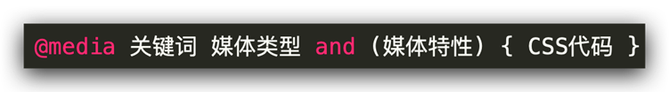

#### 关键词 / 逻辑操作符

* and
* only
* not

#### 媒体类型

媒体类型用来区分设备类型

* screen：屏幕设备
* 打印预览：print
* 阅读器：speech
* 不区分类型：all

#### 媒体特性

* 视口宽高：width / height
* 视口最大宽高：max-width ；max-height
* 视口最小宽高：min-width；min-height
* 屏幕方向：orientation
  * protrait：竖屏
  * landscape：横屏

### 媒体查询-外部CSS

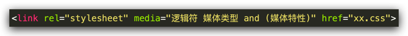

## 02-Bootstrap

### 简介

Bootstrap 是由 Twitter 公司开发维护的前端 UI 框架，它提供了大量编写好的 CSS 样式，允许开发者结合一定 HTML 结构及JavaScript，快速编写功能完善的网页及常见交互效果。 

中文官网: <https://www.bootcss.com/> 

### 使用步骤

#### 下载

下载：Bootstrap V5中文文档 → 进入中文文档 → 下载 →下载 Bootstrap 生产文件

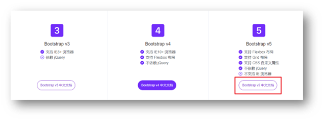

#### 使用

1. 引入 Bootstrap CSS 文件

```html
<link rel="stylesheet" href="./Bootstrap/css/bootstrap.min.css">
```

2. 调用类名： container 响应式布局版心类

```html
<div class="container">测试</div>
```

### 栅格系统

作用：响应式布局

栅格化是指将整个网页的宽度分成12等份，每个盒子占用的对应的份数

例如：一行排4个盒子，则每个盒子占 3份 即可（12 / 4 = 3）


* row 类：行，可以让内容在一行排（flex布局）

### 全局样式

#### 按钮


类名

* btn：默认样式
* btn-success：成功
* btn-warning：警告
* ……
* 按钮尺寸：btn-lg / btn-sm

#### 表格


表格类：

* table：默认样式
* table-striped：隔行变色
* table-success：表格颜色
* ……

### 组件

1.引入样式表

2.引入 js 文件

3.复制结构，修改内容

### 字体图标

#### 下载

导航 / Extend：图标库 → 安装 → 下载安装包 → [bootstrap-icons-1.X.X.zip](https://github.com/twbs/icons/releases/download/v1.10.3/bootstrap-icons-1.10.3.zip)

#### 使用

1. 复制 fonts 文件夹到项目目录
2. 网页引入 bootstrap-icons.css 文件
3. 调用 CSS 类名（图标对应的类名）

```html
<i class="bi-android2"></i>
```

## 03-综合案例-alloyTeam

### 准备工作


* HTML 结构

```html
<title>腾讯全端</title>
<link rel="shortcut icon" href="favicon.ico" type="image/x-icon">
<!-- 层叠性：咱们的css 要 层叠 框架的 -->
<link rel="stylesheet" href="./Bootstrap/css/bootstrap.min.css">
<link rel="stylesheet" href="./Bootstrap/font/bootstrap-icons.css">
<link rel="stylesheet" href="./css/index.css">


<script src="./Bootstrap/js/bootstrap.min.js"></script>
```

* less 样式

```less
// out: ../css/
```

### 头部导航

* HTML 结构

```html
<!-- 导航 -->
<nav class="navbar navbar-expand-lg bg-body-tertiary fixed-top">
  <div class="container">
    <a class="navbar-brand" href="#"></a>
    <button class="navbar-toggler" type="button" data-bs-toggle="collapse" data-bs-target="#navbarNav" aria-controls="navbarNav" aria-expanded="false" aria-label="Toggle navigation">
      <span class="navbar-toggler-icon"></span>
    </button>
    <div class="collapse navbar-collapse" id="navbarNav">
      <ul class="navbar-nav">
        <li class="nav-item">
          <a class="nav-link active" aria-current="page" href="#">首页</a>
        </li>
        <li class="nav-item">
          <a class="nav-link" href="#">博客</a>
        </li>
        <li class="nav-item">
          <a class="nav-link" href="#">Github</a>
        </li>
        <li class="nav-item">
          <a class="nav-link" href="#">TWeb Conf</a>
        </li>
        <li class="nav-item">
          <a class="nav-link" href="#">SuperStar</a>
        </li>
        <li class="nav-item">
          <a class="nav-link" href="#">Web前端导航</a>
        </li>
        <li class="nav-item">
          <a class="nav-link" href="#">关于</a>
        </li>
      </ul>
    </div>
  </div>
</nav>
```

* less 样式

```less
// 导航
.bg-body-tertiary {
  background-color: transparent !important;
  .navbar-collapse {
    flex-grow: 0;
  }
}
```

### 轮播图图片

* HTML 结构

```html
<!-- 轮播图 -->
<div id="carouselExampleIndicators" class="carousel slide">
  <div class="carousel-indicators">
    <button type="button" data-bs-target="#carouselExampleIndicators" data-bs-slide-to="0" class="active" aria-current="true" aria-label="Slide 1"></button>
    <button type="button" data-bs-target="#carouselExampleIndicators" data-bs-slide-to="1" aria-label="Slide 2"></button>
    <button type="button" data-bs-target="#carouselExampleIndicators" data-bs-slide-to="2" aria-label="Slide 3"></button>
    <button type="button" data-bs-target="#carouselExampleIndicators" data-bs-slide-to="3" aria-label="Slide 4"></button>
  </div>
  <div class="carousel-inner">
    <div class="carousel-item active">
      
    </div>
    <div class="carousel-item">
      
    </div>
    <div class="carousel-item">
      
    </div>
    <div class="carousel-item">
      
    </div>
  </div>
  <button class="carousel-control-prev" type="button" data-bs-target="#carouselExampleIndicators" data-bs-slide="prev">
    <span class="carousel-control-prev-icon" aria-hidden="true"></span>
    <span class="visually-hidden">Previous</span>
  </button>
  <button class="carousel-control-next" type="button" data-bs-target="#carouselExampleIndicators" data-bs-slide="next">
    <span class="carousel-control-next-icon" aria-hidden="true"></span>
    <span class="visually-hidden">Next</span>
  </button>
</div>
```

* less 样式

```less
.carousel {
  .carousel-item {
    height: 500px;
    background-size: cover;
    background-position: center 0;
  }
  .carousel-item:nth-child(1) {
    background-image: url(../assets/uploads/banner_1.jpg);
  }
  .carousel-item:nth-child(2) {
    background-image: url(../assets/uploads/banner_2.jpg);
  }
  .carousel-item:nth-child(3) {
    background-image: url(../assets/uploads/banner_3.jpg);
  }
  .carousel-item:nth-child(4) {
    background-image: url(../assets/uploads/banner_4.jpg);
  }
}
```

### 轮播图响应式

* less 样式

```less
// 轮播图: 小于768图片高度250 max；大于等于768图片高度400 min；大于等于992图片高度500
.carousel {
  // 响应式 → 媒体查询
  @media (max-width: 768px) {
    .carousel-item {
      height: 250px;
    }
  }

  @media (min-width: 768px) {
    .carousel-item {
      height: 400px;
    }
  }
  @media (min-width: 992px) {
    .carousel-item {
      height: 500px;
    }
  }


  .carousel-item {
    // height: 500px;
    background-size: cover;
    background-position: center 0;
  }
}
```

### 开源项目响应式

* HTML 结构

```html
<!-- 开源项目 -->
<div class="project container">
  <div class="title">
    <h2>OpenSource / 开源项目</h2>
    <p>种类众多的开源项目，让你爱不释手</p>
  </div>
  <div class="content">
    <div class="row">
      <div class="col-lg-3 col-md-6">1</div>
      <div class="col-lg-3 col-md-6">2</div>
      <div class="col-lg-3 col-md-6">3</div>
      <div class="col-lg-3 col-md-6">4</div>
    </div>
  </div>
</div>
```

* less 样式

```less
// 开源项目
// 视口宽度大于992；一行排4个盒子  col-lg-3
// 视口宽度大于768；一行排2个盒子  col-md-6
.project {
  margin-top: 60px;
  text-align: center;
}
```

### 开源项目内容布局

* HTML 结构

```html
<!-- 开源项目 -->
<div class="project container">
  <div class="title">
    <h2>OpenSource / 开源项目</h2>
    <p>种类众多的开源项目，让你爱不释手</p>
  </div>
  <div class="content">
    <div class="row">
      <div class="col-lg-3 col-md-6"><a href="#">1</a></div>
      <div class="col-lg-3 col-md-6"><a href="#">1</a></div>
      <div class="col-lg-3 col-md-6"><a href="#">1</a></div>
      <div class="col-lg-3 col-md-6"><a href="#">1</a></div>
    </div>
  </div>
</div>
```

* less 样式

```less
.project {
  margin-top: 60px;
  text-align: center;
  .row {
    div {
      margin-bottom: 10px;
      height: 200px;
      // background-color: pink;
      a {
        // 块级的宽度和父级一样大
        display: block;
        height: 200px;
        background-color: green;
        border-radius: 4px;
      }

      &:nth-child(1) a {
        background-color: #70c3ff;
      }
      &:nth-child(2) a {
        background-color: #fd6a7f;
      }
      &:nth-child(3) a {
        background-color: #7f8ea0;
      }
      &:nth-child(4) a {
        background-color: #89d04f;
      }
    }
  }
}
```
