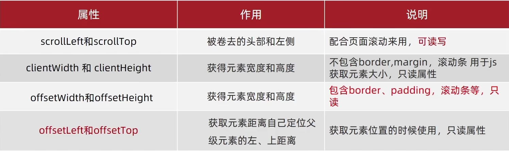
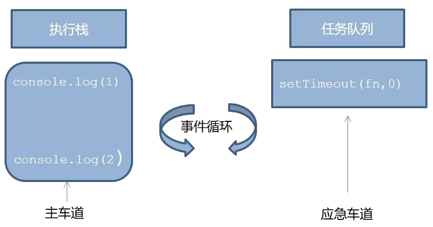

7[复习]()：

splice() 方法用于添加或删除数组中的元素。

**注意：**这种方法会改变原始数组。

1. **删除数组：**

splice(起始位置， 删除的个数)

比如：1

~~~javascript
let arr = ['red', 'green', 'blue']
arr.splice(1,1) // 删除green元素
console.log(arr) // ['red, 'blue']
~~~

2. **添加元素**

splice(起始位置，删除个数，添加数组元素)

~~~javascript
let arr = ['red', 'green', 'blue']
//arr.splice(1, 0, 'pink') // 在索引号是1的位置添加 pink
//console.log(arr) // ['red', 'pink', 'green', 'blue']
arr.splice(1, 0, 'pink', 'hotpink') // 在索引号是1的位置添加 pink  hotpink
console.log(arr) // ['red', 'pink', 'hotpink', 'green', 'blue']
~~~

# 声明变量const优先

- 不知道变量是否会修改，先const，要修改时再改成let
- 引用类型只改变内容，而不改变引用地址，直接const声明

# Web APIs - 第1天笔记

> 了解 DOM 的结构并掌握其基本的操作，体验 DOM 的在开发中的作用

- 知道 ECMAScript 与 JavaScript 的关系
- 了解 DOM 的相关概念及DOM 的本质是一个对象
- 掌握查找节点的基本方法
- 掌握节点属性和文本的操作
- 能够使用间歇函数创建定时任务

## 介绍

> 知道 ECMAScript 与 JavaScript 的关系，Web APIs 是浏览器扩展的功能。

严格意义上讲，我们在 JavaScript 阶段学习的知识绝大部分属于 ECMAScript 的知识体系，ECMAScript 简称 ES 它提供了一套语言标准规范，如变量、数据类型、表达式、语句、函数等语法规则都是由 ECMAScript 规定的。浏览器将 ECMAScript 大部分的规范加以实现，并且在此基础上又扩展一些实用的功能，这些被扩展出来的内容我们称为 Web APIs。


ECMAScript 运行在浏览器中然后再结合 Web APIs 才是真正的 JavaScript，Web APIs 的核心是 DOM 和 BOM。

扩展阅读：ECMAScript 规范在不断的更新中，存在多个不同的版本，早期的版本号采用数字顺序编号如 ECMAScript3、ECMAScript5，后来由于更新速度较快便采用年份做为版本号，如 ECMAScript2017、ECMAScript2018 这种格式，ECMAScript6 是 2015 年发布的，常叫做 EMCAScript2015。

关于 JavaScript 历史的[扩展阅读](https://javascript.ruanyifeng.com/introduction/history.html)。


> 知道 DOM 相关的概念，建立对 DOM 的初步认识，学习 DOM 的基本操作，体会 DOM 的作用

DOM（Document Object Model）是将整个 HTML 文档的每一个标签元素视为一个对象，这个对象下包含了许多的属性和方法，通过操作这些属性或者调用这些方法实现对 HTML 的动态更新，为实现网页特效以及用户交互提供技术支撑。

简言之 DOM 是用来动态修改 HTML 的，其目的是开发网页特效及用户交互。

观察一个小例子：


上述的例子中当用户分分别点击【开始】或【结束】按钮后，通过右侧调试窗口可以观察到 html 标签的内容在不断的发生改变，这便是通过 DOM 实现的。

### 概念

#### DOM 树

```html
<!DOCTYPE html>
<html lang="en">
<head>
  <meta charset="UTF-8">
  <meta name="viewport" content="width=device-width, initial-scale=1.0">
  <title>标题</title>
</head>
<body>
  文本
  <a href="">链接名</a>
  <div id="" class="">文本</div>
</body>
</html>
```

如下图所示，将 HTML 文档以树状结构直观的表现出来，我们称之为文档树或 DOM 树，**文档树直观的体现了标签与标签之间的关系。**


#### DOM 节点

节点是文档树的组成部分，**每一个节点都是一个 DOM 对象**，主要分为元素节点、属性节点、文本节点等。

1. 【元素节点】其实就是 HTML 标签，如上图中 `head`、`div`、`body` 等都属于元素节点。
2. 【属性节点】是指 HTML 标签中的属性，如上图中 `a` 标签的 `href` 属性、`div` 标签的 `class` 属性。
3. 【文本节点】是指 HTML 标签的文字内容，如 `title` 标签中的文字。
4. 【根节点】特指 `html` 标签。
5. 其它...

#### document

`document` 是 JavaScript 内置的专门用于 DOM 的对象，该对象包含了若干的属性和方法，`document` 是学习 DOM 的核心。

```html
<script>
  // document 是内置的对象
  // console.log(typeof document);

  // 1. 通过 document 获取根节点
  console.log(document.documentElement); // 对应 html 标签

  // 2. 通过 document 节取 body 节点
  console.log(document.body); // 对应 body 标签

  // 3. 通过 document.write 方法向网页输出内容
  document.write('Hello World!');
</script>
```

上述列举了 `document` 对象的部分属性和方法，我们先对 `document` 有一个整体的认识。

## 获取DOM对象

1. **querySelector('css选择器')**   满足条件的第一个元素
2. querySelectorAll                                                                                                                                                                                                                                                                                                                                                                                                                                                                                                                                                                                                                                                                                                                                                                                                                                                                               满足条件的元素集合 返回伪数组
3. 了解其他方式
   1. getElementById
   2. getElementsByTagName

```html
<!DOCTYPE html>
<html lang="en">
<head>
  <meta charset="UTF-8">
  <meta name="viewport" content="width=device-width, initial-scale=1.0">
  <title>DOM - 查找节点</title>
</head>
<body>
  <h3>查找元素类型节点</h3>
  <p>从整个 DOM 树中查找 DOM 节点是学习 DOM 的第一个步骤。</p>
  <ul>
      <li>元素</li>
      <li>元素</li>
      <li>元素</li>
      <li>元素</li>
  </ul>
  <script>
  	const p = document.querySelector('p')  // 获取第一个p元素
  	const lis = document.querySelectorAll('li')  // 获取第一个p元素
  </script>
</body>
</html>
```

总结：

- document.getElementById 专门获取元素类型节点，根据标签的 `id`  属性查找
- 任意 DOM 对象都包含 nodeType 属性，用来检检测节点类型

## 操作元素内容
通过修改 DOM 的文本内容，动态改变网页的内容。

1. `innerText` 将文本内容添加/更新到任意标签位置，**文本中包含的标签不会被解析。**

```html
<script>
  // innerText 将文本内容添加/更新到任意标签位置
  const intro = document.querySelector('.intro')
  // intro.innerText = '嗨~ 我叫李雷！'
  // intro.innerText = '<h4>嗨~ 我叫李雷！</h4>'
</script>
```

2. `innerHTML` 将文本内容添加/更新到任意标签位置，**文本中包含的标签会被解析。**

```html
<script>
  // innerHTML 将文本内容添加/更新到任意标签位置
  const intro = document.querySelector('.intro')
  intro.innerHTML = '嗨~ 我叫韩梅梅！'
  intro.innerHTML = '<h4>嗨~ 我叫韩梅梅！</h4>'
</script>
```

总结：如果文本内容中包含 `html` 标签时推荐使用 `innerHTML`，否则建议使用 `innerText` 属性。

##操作元素属性 

有3种方式可以实现对属性的修改：

#### 常用属性修改

1. 直接能过属性名修改，最简洁的语法

```html
<script>
  // 1. 获取 img 对应的 DOM 元素
  const pic = document.querySelector('.pic')
	// 2. 修改属性
  pic.src = './images/lion.webp'
  pic.style.width = 400;
  pic.alt = '图片不见了...'
</script>
```

#### 控制样式属性

1. 应用【修改样式】，通过修改行内样式 `style` 属性，实现对样式的动态修改。

通过元素节点获得的 `style` 属性本身的数据类型也是对象，如 `box.style.color`、`box.style.width` 分别用来获取元素节点 CSS 样式的 `color` 和 `width` 的值。

```html
<!DOCTYPE html>
<html lang="en">
<head>
  <meta charset="UTF-8">
  <meta name="viewport" content="width=device-width, initial-scale=1.0">
  <title>练习 - 修改样式</title>
</head>
<body>
  <div class="box">随便一些文本内容</div>
  <script>
    // 获取 DOM 节点
    const box = document.querySelector('.intro')
    box.style.color = 'red'
    box.style.width = '300px'
    // css 属性的 - 连接符与 JavaScript 的 减运算符
    // 冲突，所以要改成驼峰法
    box.style.backgroundColor = 'pink'
  </script>
</body>
</html>
```

任何标签都有 `style` 属性，通过 `style` 属性可以动态更改网页标签的样式，如要遇到 `css` 属性中包含字符 `-` 时，要将 `-` 去掉并将其后面的字母改成大写，如 `background-color` 要写成 `box.style.backgroundColor`；有单位的属性值要加单位

2. 操作类名(className) 操作CSS

如果修改的样式比较多，直接通过style属性修改比较繁琐，我们可以通过借助于css类名的形式。

~~~html
<!DOCTYPE html>
<html lang="en">
<head>
  <meta charset="UTF-8">
  <meta name="viewport" content="width=device-width, initial-scale=1.0">
  <title>练习 - 修改样式</title>
    <style>
        .pink {
            background: pink;
            color: hotpink;
        }
    </style>
</head>
<body>
  <div class="box">随便一些文本内容</div>
  <script>
    // 获取 DOM 节点
    const box = document.querySelector('.intro')
    box.className = 'pink'
  </script>
</body>
</html>
~~~

>注意：
>
>1.由于class是关键字, 所以使用className去代替
>
>2.className是使用新值换旧值, 如果需要添加一个类,需要保留之前的类名，可以使用classList

3. 通过 classList 操作类控制CSS

为了解决className 容易覆盖以前的类名，我们可以通过classList方式追加和删除类名

~~~html

<!DOCTYPE html>
<html lang="en">

<head>
    <meta charset="UTF-8">
    <meta http-equiv="X-UA-Compatible" content="IE=edge">
    <meta name="viewport" content="width=device-width, initial-scale=1.0">
    <title>Document</title>
    <style>
        div {
            width: 200px;
            height: 200px;
            background-color: pink;
        }

        .active {
            width: 300px;
            height: 300px;
            background-color: hotpink;
            margin-left: 100px;
        }
    </style>
</head>

<body>

    <div class="one"></div>
    <script>
        // 1.获取元素
        // let box = document.querySelector('css选择器')
        let box = document.querySelector('div')
        // add是个方法 添加  追加
        // box.classList.add('active')
        // remove() 移除 类
        // box.classList.remove('one')
        // 切换类
        box.classList.toggle('one')
    </script>
</body>

</html>
~~~

#### 操作表单元素属性

表单很多情况，也需要修改属性，比如点击眼睛，可以看到密码，本质是把表单类型转换为文本框

正常的有属性有取值的跟其他的标签属性没有任何区别

获取:DOM对象.属性名

设置:DOM对象.属性名= 新值

~~~html

<!DOCTYPE html>
<html lang="en">

<head>
    <meta charset="UTF-8">
    <meta http-equiv="X-UA-Compatible" content="IE=edge">
    <meta name="viewport" content="width=device-width, initial-scale=1.0">
    <title>Document</title>

</head>

<body>
    <input type="text" value="请输入">
    <button disabled>按钮</button>
    <input type="checkbox" name="" id="" class="agree">
    <script>
        // 1. 获取元素
        let input = document.querySelector('input')
        // 2. 取值或者设置值  得到input里面的值可以用 value
        // console.log(input.value)
        input.value = '小米手机'
        input.type = 'password'

        // 2. 启用按钮
        let btn = document.querySelector('button')
        // disabled 不可用   =  false  这样可以让按钮启用
        btn.disabled = false
        // 3. 勾选复选框
        let checkbox = document.querySelector('.agree')
        checkbox.checked = false
    </script>
</body>

</html>
~~~

#### 自定义属性

标准属性: 标签天生自带的属性 比如class id title等, 可以直接使用点语法操作比如： disabled、checked、selected

自定义属性：

在html5中推出来了专门的data-自定义属性  

在标签上一律以data-开头

在DOM对象上一律以dataset对象方式获取

~~~html
<!DOCTYPE html>
<html lang="en">

<head>
    <meta charset="UTF-8">
    <meta http-equiv="X-UA-Compatible" content="IE=edge">
    <meta name="viewport" content="width=device-width, initial-scale=1.0">
    <title>Document</title>

</head>

<body>
   <div data-id="1"> 自定义属性 </div>
    <script>
        // 1. 获取元素
        let div = document.querySelector('div')
        // 2. 获取自定义属性值
         console.log(div.dataset.id)
      
    </script>
</body>

</html>
~~~

## 间歇函数

> 知道间歇函数的作用，利用间歇函数创建定时任务。

`setInterval` 是 JavaScript 中内置的函数，它的作用是间隔固定的时间自动重复执行另一个函数，也叫定时器函数，返回值为定时器的id编号。

开启定时器：setInterval(函数， 间隔时间)（第一次执行要等间隔时间到）

关闭定时器：clearInterval(id)（id为定时器的id编号）

开启定时器原则：先关后开，防止重复启动定时器

```html
<script>
  // 1. 定义一个普通函数
  function repeat() {
    console.log('不知疲倦的执行下去....')
  }

  // 2. 使用 setInterval 调用 repeat 函数
  // 间隔 1000 毫秒，重复调用 repeat
  // setInterval(函数, 间歇时间)，可以写匿名函数
  setInterval(repeat, 1000)	//不要写成 repeat()
  setInterval('repeat()', 1000)	//也可以这样写，但不推荐
</script>
```

## 今日单词

| 单词        | 说明   | 解释                      |
| ----------- | ------ | ------------------------- |
| setInterval | 定时器 | setInterval(repeat, 1000) |
|             |        |                           |
|             |        |                           |
|             |        |                           |
|             |        |                           |
|             |        |                           |
|             |        |                           |

# Web APIs - 第2天

> 学会通过为DOM注册事件来实现可交互的网页特效。

- 能够判断函数运行的环境并确字 this 所指代的对象
- 理解事件的作用，知道应用事件的 3 个步骤


> 学习会为 DOM 注册事件，实现简单可交互的网页特交。

## 事件

事件是编程语言中的术语，它是用来描述程序的行为或状态的，**一旦行为或状态发生改变，便立即调用一个函数。**

例如：用户使用【鼠标点击】网页中的一个按钮、用户使用【鼠标拖拽】网页中的一张图片

###  事件监听

结合 DOM 使用事件时，需要为 DOM 对象添加事件监听，等待事件发生（触发）时，便立即调用一个函数。

事件监听三要素：

- 事件源：触发了事件的dom元素
- 事件类型；触发事件的方式（如click、mouseover）
- 事件调用的函数：触发事件时会调用的函数

`addEventListener('事件类型', 函数)` 是 DOM 对象专门用来添加事件监听的方法，它的两个参数分别为【事件类型】和【事件回调】。

添加事件的第二种方法：dom元素.on事件类型 = 函数（传统方法）。

第一种添加事件的方式更推荐，addEventListener方式可绑定多次，on方式多次绑定原来的会被覆盖。

```html
<!DOCTYPE html>
<html lang="en">
<head>
  <meta charset="UTF-8">
  <meta name="viewport" content="width=device-width, initial-scale=1.0">
  <title>事件监听</title>
</head>
<body>
  <h3>事件监听</h3>
  <p id="text">为 DOM 元素添加事件监听，等待事件发生，便立即执行一个函数。</p>
  <button id="btn">点击改变文字颜色</button>
  <script>
    // 1. 获取 button 对应的 DOM 对象
    const btn = document.querySelector('#btn')

    // 2. 添加事件监听
    btn.addEventListener('click', function () {
      console.log('等待事件被触发...')
      // 改变 p 标签的文字颜色
      let text = document.getElementById('text')
      text.style.color = 'red'
    })

    // 3. 只要用户点击了按钮，事件便触发了！！！
  </script>
</body>
</html>
```

完成事件监听分成3个步骤：

1. 获取 DOM 元素
2. 通过 `addEventListener` 方法为 DOM 节点添加事件监听
3. 等待事件触发，如用户点击了某个按钮时便会触发 `click` 事件类型
4. 事件触发后，相对应的回调函数会被执行

大白话描述：所谓的事件无非就是找个机会（事件触发）调用一个函数（回调函数）。

### 事件注册

- 传统on方式：btn.onclick = 函数（L0)
  - 同一个对象注册同类型事件，后面注册的事件会覆盖前面注册的事件
  - 使用null覆盖前面注册的同个事件，就可以实现事件的解绑
- 事件监听注册：btn.addEventListener('click', 函数)（L2）
  - 语法：addEventListener(事件类型, 事件处理函数, 是否使用捕获)
  - 后面注册的事件不会覆盖前面注册的事件
  - 可以通过第三个参数指定事件是在冒泡阶段还是捕获阶段执行，默认值false，在冒泡阶段执行
  - 匿名函数无法解绑，解绑需要用removeEventListener(事件类型, 事件处理函数名, 获取捕获或冒泡阶段)

### 事件类型

`click` 译成中文是【点击】的意思，它的含义是监听（等着）用户鼠标的单击操作，除了【单击】还有【双击】`dblclick`

```html
<script>
  // 双击事件类型
  btn.addEventListener('dblclick', function () {
    console.log('等待事件被触发...');
    // 改变 p 标签的文字颜色
    const text = document.querySelector('.text')
    text.style.color = 'red'
  })

  // 只要用户双击击了按钮，事件便触发了！！！
</script>
```

结论：【事件类型】决定了事件被触发的方式，如 `click` 代表鼠标单击，`dblclick` 代表鼠标双击。

### 事件处理程序

`addEventListener` 的第2个参数是函数，这个函数会在事件被触发时立即被调用，在这个函数中可以编写任意逻辑的代码，如改变 DOM 文本颜色、文本内容等。

```html
<script>
  // 双击事件类型
  btn.addEventListener('dblclick', function () {
    console.log('等待事件被触发...')
    
    const text = document.querySelector('.text')
    // 改变 p 标签的文字颜色
    text.style.color = 'red'
    // 改变 p 标签的文本内容
    text.style.fontSize = '20px'
  })
</script>
```

结论：【事件处理程序】决定了事件触发后应该执行的逻辑。


## 事件类型

将众多的事件类型分类可分为：鼠标事件、键盘事件、表单事件、焦点事件等，我们逐一展开学习。

### 鼠标事件

鼠标事件是指跟鼠标操作相关的事件，如单击、双击、移动等。

mouseenter 监听鼠标是否移入 DOM 元素

```html
<body>
  <h3>鼠标事件</h3>
  <p>监听与鼠标相关的操作</p>
  <hr>
  <div class="box"></div>
  <script>
    // 需要事件监听的 DOM 元素
    const box = document.querySelector('.box');

    // 监听鼠标是移入当前 DOM 元素
    box.addEventListener('mouseenter', function () {
      // 修改文本内容
      this.innerText = '鼠标移入了...';
      // 修改光标的风格
      this.style.cursor = 'move';
    })
  </script>
</body>
```

mouseleave 监听鼠标是否移出 DOM 元素

```html
<body>
  <h3>鼠标事件</h3>
  <p>监听与鼠标相关的操作</p>
  <hr>
  <div class="box"></div>
  <script>
    // 需要事件监听的 DOM 元素
    const box = document.querySelector('.box');

    // 监听鼠标是移出当前 DOM 元素
    box.addEventListener('mouseleave', function () {
      // 修改文本内容
      this.innerText = '鼠标移出了...';
    })
  </script>
</body>
```

mousemove 鼠标移动事件

注：鼠标经过和离开还有：mouseover 和 mouseout

- mouseover 和 mouseout 会有冒泡效果
- mouseenter 和 mouseleave 没有冒泡效果（推荐）

###  键盘事件

keydown   键盘按下触发
keyup   键盘抬起触发

### 焦点事件

focus  获得焦点

blur 失去焦点

### 文本框输入事件

input  

### 视/音频事件

ontimeupdate 视/音频(audio/video)当前的播放位置发生改变时触发

onloadeddate 在当前帧的数据加载完成且还没有足够的数据播放 视/音频 的下一帧触发

## 事件对象

任意事件类型被触发时与事件相关的信息会被以对象的形式记录下来，我们称这个对象为事件对象。

```html
<body>
  <h3>事件对象</h3>
  <p>任意事件类型被触发时与事件相关的信息会被以对象的形式记录下来，我们称这个对象为事件对象。</p>
  <hr>
  <div class="box"></div>
  <script>
    // 获取 .box 元素
    const box = document.querySelector('.box')

    // 添加事件监听
    box.addEventListener('click', function (e) {
      console.log('任意事件类型被触发后，相关信息会以对象形式被记录下来...');

      // 事件回调函数的第1个参数即所谓的事件对象
      console.log(e)
    })
  </script>
</body>
```

事件回调函数的【第1个参数】即所谓的事件对象，通常习惯性的将这个对数命名为 `event`、`ev` 、`ev` 。

接下来简单看一下事件对象中包含了哪些有用的信息：

1. `ev.type` 当前事件的类型
2. `ev.clientX/Y` 光标相对浏览器窗口的位置
3. `ev.offsetX/Y` 光标相对当前 DOM 元素的位置
3. `ev.pageX/Y` 光标相对于DOM的位置，不受滚动距离的影响
3. `ev.key` 用户按下的键盘键的值（现在不提倡使用keyCode属性）
3. `ev.target` 事件源

注：在事件回调函数内部通过 window.event 同样可以获取事件对象。(window可以省略，window的属性和方法一般都可以直接使用)

## 环境对象

> 能够分析判断函数运行在不同环境中 this 所指代的对象。

环境对象指的是函数内部特殊的变量 `this` ，它代表着当前函数运行时所处的环境。

```html
<script>
  // 声明函数
  function sayHi() {
    // this 是一个变量
    console.log(this);
  }

  // 声明一个对象
  let user = {
    name: '张三',
    sayHi: sayHi // 此处把 sayHi 函数，赋值给 sayHi 属性
  }
  
  let person = {
    name: '李四',
    sayHi: sayHi
  }

  // 直接调用
  sayHi() // window
  window.sayHi() // window

  // 做为对象方法调用
  user.sayHi()// user
	person.sayHi()// person
</script>
```

结论：

1. `this` 本质上是一个变量，数据类型为对象
2. 函数的调用方式不同 `this` 变量的值也不同
3. 【谁调用 `this` 就是谁】是判断 `this` 值的粗略规则
4. 函数直接调用时实际上 `window.sayHi()` 所以 `this` 的值为 `window`，所以普通方法的this是window
## 回调函数

如果将函数 A 做为参数传递给函数 B 时，我们称函数 A 为回调函数。

```html
<script>
  // 声明 foo 函数
  function foo(arg) {
    console.log(arg);
  }

  // 普通的值做为参数
  foo(10);
  foo('hello world!');
  foo(['html', 'css', 'javascript']);

  function bar() {
    console.log('函数也能当参数...');
  }
  // 函数也可以做为参数！！！！
  foo(bar);
</script>
```

函数 `bar` 做参数传给了 `foo` 函数，`bar` 就是所谓的回调函数了！！！

我们回顾一下间歇函数 `setInterval` 

```html
<script>
	function fn() {
    console.log('我是回调函数...');
  }
  // 调用定时器
  setInterval(fn, 1000);
</script>
```

`fn` 函数做为参数传给了 `setInterval` ，这便是回调函数的实际应用了，结合刚刚学习的函数表达式上述代码还有另一种更常见写法。

```html
<script>
  // 调用定时器，匿名函数做为参数
  setInterval(function () {
    console.log('我是回调函数...');
  }, 1000);
</script>
```

结论：

1. 回调函数本质还是函数，只不过把它当成参数使用
2. 使用匿名函数做为回调函数比较常见


# Web APIs - 第3天

> 进一步学习 事件进阶，实现更多交互的网页特效，结合事件流的特征优化事件执行的效率

- 掌握阻止事件冒泡的方法
- 理解事件委托的实现原理

## 事件流

事件流是对事件执行过程的描述，了解事件的执行过程有助于加深对事件的理解，提升开发实践中对事件运用的灵活度。


如上图所示，任意事件被触发时总会经历两个阶段：【捕获阶段】和【冒泡阶段】。

简言之，捕获阶段是【从父到子】的传导过程，冒泡阶段是【从子向父】的传导过程。

### 捕获和冒泡

了解了什么是事件流之后，我们来看事件流是如何影响事件执行的：

```html
<body>
  <h3>事件流</h3>
  <p>事件流是事件在执行时的底层机制，主要体现在父子盒子之间事件的执行上。</p>
  <div class="outer">
    <div class="inner">
      <div class="child"></div>
    </div>
  </div>
  <script>
    // 获取嵌套的3个节点
    const outer = document.querySelector('.outer');
    const inner = document.querySelector('.inner');
    const child = document.querySelector('.child');
		
    // html 元素添加事件
    document.documentElement.addEventListener('click', function () {
      console.log('html...')
    })
		
    // body 元素添加事件
    document.body.addEventListener('click', function () {
      console.log('body...')
    })

    // 外层的盒子添加事件
    outer.addEventListener('click', function () {
      console.log('outer...')
    })
    
    // 中间的盒子添加事件
    outer.addEventListener('click', function () {
      console.log('inner...')
    })
    
    // 内层的盒子添加事件
    outer.addEventListener('click', function () {
      console.log('child...')
    })
  </script>
</body>
```

执行上述代码后发现，当单击事件触发时，其祖先元素的单击事件也【相继触发】，这是为什么呢？

结合事件流的特征，我们知道当某个元素的事件被触发时，事件总是会先经过其祖先才能到达当前元素，然后再由当前元素向祖先传递，事件在流动的过程中遇到相同的事件便会被触发。

再来关注一个细节就是事件相继触发的【执行顺序】，事件的执行顺序是可控制的，即可以在捕获阶段被执行，也可以在冒泡阶段被执行。

如果事件是在冒泡阶段执行的，我们称为冒泡模式，它会先执行子盒子事件再去执行父盒子事件，默认是冒泡模式。

如果事件是在捕获阶段执行的，我们称为捕获模式，它会先执行父盒子事件再去执行子盒子事件。

```html
<body>
  <h3>事件流</h3>
  <p>事件流是事件在执行时的底层机制，主要体现在父子盒子之间事件的执行上。</p>
  <div class="outer">
    <div class="inner"></div>
  </div>
  <script>
    // 获取嵌套的3个节点
    const outer = document.querySelector('.outer')
    const inner = document.querySelector('.inner')

    // 外层的盒子
    outer.addEventListener('click', function () {
      console.log('outer...')
    }, true) // true 表示在捕获阶段执行事件
    
    // 中间的盒子
    outer.addEventListener('click', function () {
      console.log('inner...')
    }, true)
  </script>
</body>
```

结论：

1. `addEventListener` 第3个参数决定了事件是在捕获阶段触发还是在冒泡阶段触发
2. `addEventListener` 第3个参数为  `true` 表示捕获阶段触发，`false` 表示冒泡阶段触发，默认值为 `false`
3. 事件流只会在父子元素具有相同事件类型时才会产生影响
4. 绝大部分场景都采用默认的冒泡模式（其中一个原因是早期 IE 不支持捕获）

### 阻止冒泡

阻止冒泡是指阻断事件的流动，保证事件只在当前元素被执行，而不再去影响到其对应的祖先元素。

```html
<body>
  <h3>阻止冒泡</h3>
  <p>阻止冒泡是指阻断事件的流动，保证事件只在当前元素被执行，而不再去影响到其对应的祖先元素。</p>
  <div class="outer">
    <div class="inner">
      <div class="child"></div>
    </div>
  </div>
  <script>
    // 获取嵌套的3个节点
    const outer = document.querySelector('.outer')
    const inner = document.querySelector('.inner')
    const child = document.querySelector('.child')

    // 外层的盒子
    outer.addEventListener('click', function () {
      console.log('outer...')
    })

    // 中间的盒子
    inner.addEventListener('click', function (ev) {
      console.log('inner...')

      // 阻止事件冒泡
      ev.stopPropagation()
    })

    // 内层的盒子
    child.addEventListener('click', function (ev) {
      console.log('child...')

      // 借助事件对象，阻止事件向上冒泡
      ev.stopPropagation()
    })
  </script>
</body>
```

结论：事件对象中的 `ev.stopPropagation` 方法，专门用来阻止事件冒泡，它实际是阻止事件流动传播，捕获和冒泡都会被阻止。

>鼠标经过事件：
>
>mouseover 和 mouseout 会有冒泡效果
>
>mouseenter  和 mouseleave   没有冒泡效果 (推荐)

## 解绑事件

~~~javascript
const btn = document.querySelector('button')
//传统方式绑定事件
btn.onclick = function () {}	
//解绑
btn.onclick = null

//下面这种方式无法解绑，因为匿名函数没有名字
btn.addEventListener('click', function () {})
//解绑：removeEventListener(事件类型,事件处理函数,[获取捕获或冒泡阶段])，第三个参数默认false
btn.removeEventListener('click', '函数名')
~~~

## 阻止默认事件

某些情况我们需要阻止默认行为的发生，如链接的跳转、表单域跳转等。语法：event.preventDefault()

~~~js
const form = document.querySelector('form')
form.addEventListener('submit', function (e) {
    e.preventDefault()
})
~~~


## 事件委托

事件委托是利用事件流的特征解决一些现实开发需求的知识技巧，主要的作用是提升程序效率。

- 优点：减少注册次数，可以提高程序性能
- 原理：事件委托其实是利用事件冒泡的特点
  - 给父元素注册事件，当我们触发子元素时，会冒泡到父元素，从而触发父元素的事件
- 实现：事件对象.target 可以获得真正触发事件的元素，元素.tagName 可以获取元素的标签名称(大写)

大量的事件监听是比较耗费性能的，如下代码所示

```html
<script>
  // 假设页面中有 10000 个 button 元素
  const buttons = document.querySelectorAll('table button');

  for(let i = 0; i <= buttons.length; i++) {
    // 为 10000 个 button 元素添加了事件
    buttons.addEventListener('click', function () {
      // 省略具体执行逻辑...
    })
  }
</script>
```

利用事件流的特征，可以对上述的代码进行优化，事件的的冒泡模式总是会将事件流向其父元素的，如果父元素监听了相同的事件类型，那么父元素的事件就会被触发并执行，正是利用这一特征对上述代码进行优化，如下代码所示：

```html
<script>
  // 假设页面中有 10000 个 button 元素
  let buttons = document.querySelectorAll('table button');
  
  // 假设上述的 10000 个 buttom 元素共同的祖先元素是 table
  let parents = document.querySelector('table');
  parents.addEventListener('click', function () {
    console.log('点击任意子元素都会触发事件...');
  })
</script>
```

我们的最终目的是保证只有点击 button 子元素才去执行事件的回调函数，如何判断用户点击是哪一个子元素呢？


事件对象中的属性 `target` 或 `srcElement`属性表示真正触发事件的元素，它是一个元素类型的节点。

```html
<script>
  // 假设页面中有 10000 个 button 元素
  const buttons = document.querySelectorAll('table button')
  
  // 假设上述的 10000 个 buttom 元素共同的祖先元素是 table
  const parents = document.querySelector('table')
  parents.addEventListener('click', function (ev) {
    // console.log(ev.target);
    // 只有 button 元素才会真正去执行逻辑
    if(ev.target.tagName === 'BUTTON') {
      // 执行的逻辑
    }
  })
</script>
```

优化过的代码只对祖先元素添加事件监听，相比对 10000 个元素添加事件监听执行效率要高许多！！！

## 其他事件

### 页面加载事件

加载外部资源（如图片、外联CSS和JavaScript等）加载完毕时触发的事件（也可以监听具体资源）

有些时候需要等页面资源全部处理完了做一些事情

**事件名：load**

~~~javascript
//监听页面所有资源加载完毕：
window.addEventListener('load', function() {
    // xxxxx
})
//监听某个具体资源绑定load事件
img.addEventListener('load', function() {
    // xxxxx
})
~~~

补：事件名 `DOMContentLoaded` ，当初始的HTML文档被完全加载和解析完成后触发，无需等待样式表、图像等完全加载完毕。

`document.addEventListener('DOMContentLoaded', 函数)`

### 元素滚动事件

滚动条在滚动的时候持续触发的事件

~~~javascript
//页面滚动事件（也可以监听其他元素）
window.addEventListener('scroll', function() {
    //获取body元素：document.body
    //获取html元素跟获取body不一样，如下：
    const html = document.documentElement
    //获取页面向上滚动了多少像素
    console.log(html.scrollTop)
})
~~~

获取滚动的位置：scrollLeft 和 scrollTop（元素属性）

- 用于获取被卷去的大小，这两个属性可以获取元素内容往左、往上滚动出去而看不到的部分的长度
- 获取要用内容的父级元素
- 这两个值是可**读写**的

滚动到指定的坐标：scrollTo(x, y)，如：window.scrollTO(0, 0)

### 页面尺寸事件

会在窗口尺寸改变的时候触发事件：

~~~javascript
window.addEventListener('resize', function() {
    // xxxxx
})
~~~

#### client家族

- 获取元素可见部分的宽高：clientWidth 和 clientHeight，不包含边框、margin、滚动条等

#### offset家族

- 获取元素自身的宽高：offsetWidth 和 offsetHeight，包含宽高、padding、border（获取的是可视高度，盒子隐藏时结果为0）
- 获取位置：offsetLeft 和 offsetTop
  - 获取元素距离自己定位父级元素的左、上距离
  - 是**只读**属性

## 元素尺寸与位置

- 获取元素的自身宽高、包含元素自身设置的宽高、padding、border：offsetWidth和offsetHeight  
  - 获取出来的是数值,方便计算
  - 注意: 获取的是可视宽高, 如果盒子是隐藏的,获取的结果是0

- 返回对象，属性值包含元素的`大小`和`相对于视口的位置`：element.getBoundingClientRect()
  - 和offsetTop不一样，不是相对于定位父级元素的位置，而是相对可视窗口的位置



# Web APIs - 第4天

> 进一步学习 DOM 相关知识，实现可交互的网页特效

- 能够插入、删除和替换元素节点
- 能够依据元素节点关系查找节点

## 日期对象


掌握 Date 日期对象的使用，动态获取当前计算机的时间。


ECMAScript 中内置了获取系统时间的对象 Date，使用 Date 时与之前学习的内置对象 console 和 Math 不同，它需要借助 new 关键字才能使用。

### 实例化

~~~javascript
  // 1. 实例化
  // const date = new Date(); // 系统默认时间
  const date = new Date('2020-05-01') // 指定时间
  // date 变量即所谓的时间对象

  console.log(typeof date)


~~~

### 方法

 ~~~javascript
   // 1. 实例化
  const date = new Date();
  // 2. 调用时间对象方法
  // 通过方法分别获取年、月、日，时、分、秒
  const year = date.getFullYear(); // 四位年份
  const month = date.getMonth(); // 0 ~ 11
 ~~~


getFullYear() 获取四位年份

getMonth() 获取月份，取值为 0 ~ 11

getDate() 获取月份中的每一天，不同月份取值也不相同

getDay() 获取星期，取值为 0 ~ 6（0是星期日）

getHours() 获取小时，取值为 0 ~ 23

getMinutes() 获取分钟，取值为 0 ~ 59

getSeconds() 获取秒，取值为 0 ~ 59

toLocaleString() 以当地日期格式来格式化日期（年/月/日 时:分:秒）

toLocaleDateString() 使用当地格式，但只获取年月日（年/月/日）

toLocaleTimeString() 使用当地格式，但只获取时分秒（时:分:秒）

### 时间戳

时间戳是指1970年01月01日00时00分00秒起至现在的总秒数或毫秒数，它是一种特殊的计量时间的方式。

注：ECMAScript 中时间戳是以毫秒计的。

~~~javascript
    // 1. 实例化
  const date = new Date()
  // 2. 获取时间戳
  console.log(date.getTime())
// 还有一种获取时间戳的方法
  console.log(+new Date())
  console.log(+new Date(‘2022-4-1 18:30:00’))
  // 还有一种获取时间戳的方法
  console.log(Date.now())

~~~

获取时间戳的方法，分别为 getTime 和 Date.now 和  +new Date()

第三中方法无需实例化，但前面两种可以返回指定时间的时间戳

## DOM 节点

> 掌握元素节点创建、复制、插入、删除等操作的方法，能够依据元素节点的结构关系查找节点

回顾之前 DOM 的操作都是针对元素节点的属性或文本的，除此之外也有专门针对元素节点本身的操作，如插入、复制、删除、替换等。

### 查找节点

DOM 树中的任意节点都不是孤立存在的，它们要么是父子关系，要么是兄弟关系，不仅如此，我们可以依据节点之间的关系查找节点。

#### 父子关系

```html
<body>
  <button class="btn1">所有的子节点</button>
  <!-- 获取 ul 的子节点 -->
  <ul>
    <li>HTML</li>
    <li>CSS</li>
    <li>JavaScript 基础</li>
    <li>Web APIs</li>
  </ul>
  <script>
    const btn1 = document.querySelector('.btn1')
    btn1.addEventListener('click', function () {
      // 父节点
      const ul = document.querySelector('ul')

      // 所有的子节点
      console.log(ul.childNodes)
      // 只包含元素子节点
      console.log(ul.children)
    })
  </script>
</body>
```

结论：（都是属性）

- `parentNode` 返回最近一级的父节点，找不到返回null

- `childNodes` 获取全部的子节点，回车换行会被认为是空白文本节点，只选儿子
- `children` 只获取元素类型节点，只选儿子，返回伪数组

```html
<body>
  <table>
    <tr>
      <td width="60">序号</td>
      <td>课程名</td>
      <td>难度</td>
      <td width="80">操作</td>
    </tr>
    <tr>
      <td>1</td>
      <td><span>HTML</span></td>
      <td>初级</td>
      <td><button>变色</button></td>
    </tr>
    <tr>
      <td>2</td>
      <td><span>CSS</span></td>
      <td>初级</td>
      <td><button>变色</button></td>
    </tr>
    <tr>
      <td>3</td>
      <td><span>Web APIs</span></td>
      <td>中级</td>
      <td><button>变色</button></td>
    </tr>
  </table>
  <script>
    // 获取所有 button 节点，并添加事件监听
    const buttons = document.querySelectorAll('table button')
    for(let i = 0; i < buttons.length; i++) {
      buttons[i].addEventListener('click', function () {
        // console.log(this.parentNode); // 父节点 td
        // console.log(this.parentNode.parentNode); // 爷爷节点 tr
        this.parentNode.parentNode.style.color = 'red'
      })
    }
  </script>
</body>
```

结论：`parentNode` 获取父节点，以相对位置查找节点，实际应用中非常灵活。

#### 兄弟关系

```html
<body>
  <ul>
    <li>HTML</li>
    <li>CSS</li>
    <li>JavaScript 基础</li>
    <li>Web APIs</li>
  </ul>
  <script>
    // 获取所有 li 节点
    const lis = document.querySelectorAll('ul li')

    // 对所有的 li 节点添加事件监听
    for(let i = 0; i < lis.length; i++) {
      lis[i].addEventListener('click', function () {
        // 前一个节点
        console.log(this.previousSibling)
        // 下一下节点
        console.log(this.nextSibling)
      })
    }
  </script>
</body>
```

结论：

- `previousSibling` 获取前一个节点，以相对位置查找节点，实际应用中非常灵活。
- `nextSibling` 获取后一个节点，以相对位置查找节点，实际应用中非常灵活。
- `previousElementSibling` 获取前一个元素节点
- `nextElementSibling` 获取后一个元素节点

### 插入节点

在已有的 DOM 节点中插入新的 DOM 节点时，需要关注两个关键因素：首先要得到新的 DOM 节点，其次在哪个位置插入这个节点。

如下代码演示：

```html
<body>
  <h3>插入节点</h3>
  <p>在现有 dom 结构基础上插入新的元素节点</p>
  <hr>
  <!-- 普通盒子 -->
  <div class="box"></div>
  <!-- 点击按钮向 box 盒子插入节点 -->
  <button class="btn">插入节点</button>
  <script>
    // 点击按钮，在网页中插入节点
    const btn = document.querySelector('.btn')
    btn.addEventListener('click', function () {
      // 1. 获得一个 DOM 元素节点
      const p = document.createElement('p')
      p.innerText = '创建的新的p标签'
      p.className = 'info'
      
      // 复制原有的 DOM 节点
      const p2 = document.querySelector('p').cloneNode(true)
      p2.style.color = 'red'

      // 2. 插入盒子 box 盒子
      document.querySelector('.box').appendChild(p)
      document.querySelector('.box').appendChild(p2)
    })
  </script>
</body>
```

结论：

- `createElement('标签')` 动态创建任意 DOM 元素节点
- `当前节点.cloneNode()` 复制当前节点，传入参数 true 会把当前节点的后代节点也一起复制，默认false
- `父节点.appendChild(节点)` 在父节点内的末尾（结束标签前）插入节点
- `insertBefore(新节点, 子节点)` 在父节点中指定子节点之前插入新节点（如果子节点为null或undefined，相对于appendChild方法）

再来看另一种情形的代码演示：

```html
<body>
  <h3>插入节点</h3>
  <p>在现有 dom 结构基础上插入新的元素节点</p>
	<hr>
  <button class="btn1">在任意节点前插入</button>
  <ul>
    <li>HTML</li>
    <li>CSS</li>
    <li>JavaScript</li>
  </ul>
  <script>
    // 点击按钮，在已有 DOM 中插入新节点
    const btn1 = document.querySelector('.btn1')
    btn1.addEventListener('click', function () {

      // 第 2 个 li 元素
      const relative = document.querySelector('li:nth-child(2)')

      // 1. 动态创建新的节点
      const li1 = document.createElement('li')
      li1.style.color = 'red'
      li1.innerText = 'Web APIs'

      // 复制现有的节点
      const li2 = document.querySelector('li:first-child').cloneNode(true)
      li2.style.color = 'blue'

      // 2. 在 relative 节点前插入
      document.querySelector('ul').insertBefore(li1, relative)
      document.querySelector('ul').insertBefore(li2, relative)
    })
  </script>
</body>
```

### 删除节点

删除现有的 DOM 节点，也需要关注两个因素：首先由父节点删除子节点，其次是要删除哪个子节点。

```html
<body>
  <!-- 点击按钮删除节点 -->
  <button>删除节点</button>
  <ul>
    <li>HTML</li>
    <li>CSS</li>
    <li>Web APIs</li>
  </ul>

  <script>
    const btn = document.querySelector('button')
    btn.addEventListener('click', function () {
      // 获取 ul 父节点
      let ul = document.querySelector('ul')
      // 待删除的子节点
      let lis = document.querySelectorAll('li')

      // 删除节点
      ul.removeChild(lis[0])
    })
  </script>
</body>
```

结论：`父节点.removeChild(节点)` 删除节点时一定是由父子关系

- 如果不存在父子关系，则删除不成功
- 删除节点和隐藏节点(display:none)有区别：隐藏节点删除是用html节点来删除

补：`节点.remove()` 可以直接删除节点

## M端事件

移动端有自己独特的地方。比方`触屏事件touch`(也称触摸事件)，Android 和 IOS 都有。

touch对象代表一个触摸点，如手指、触摸笔等。

常见触屏事件：

- touchstart：手指触摸到一个DOM元素时触发
- touchmove：手指在一个DOM元素上滑动时触发
- touchend：手指从一个DOM元素上移开时触发

## Swiper插件

开源、免费、强大的触摸滑动插件

官网：https://www.swiper.com.cn/

在线演示：https://www.swiper.com.cn/demo/index.html

基本使用流程：http://www.swiper.com.cn/usage/index.html

API文档：https://www.swiper.com.cn/api/index.html

注意：多个swiper同时使用时，类名要注意区分

# Web APIs - 第5天笔记

> 目标： 能够利用JS操作浏览器,具备利用本地存储实现学生就业表的能力

- BOM操作
- 综合案例


## js组成

JavaScript的组成

- ECMAScript:
  - 规定了js基础语法核心知识。
  - 比如：变量、分支语句、循环语句、对象等等


- Web APIs :
  - DOM   文档对象模型， 定义了一套操作HTML文档的API
  - BOM   浏览器对象模型，定义了一套操作浏览器窗口的API

 

## window对象

**BOM** (Browser Object Model ) 是浏览器对象模型

- window对象是一个全局对象，也可以说是JavaScript中的顶级对象
- 像document、alert()、console.log()这些都是window的属性，基本BOM的属性和方法都是window的
- 所有通过var定义在全局作用域中的变量、函数都会变成window对象的属性和方法
- window对象下的属性和方法调用的时候可以省略window

 

## 定时器-延迟函数

JavaScript 内置的一个用来让代码延迟执行的函数，叫 setTimeout

**语法：**

~~~JavaScript
setTimeout(回调函数, 延迟时间)
~~~

setTimeout 仅仅只执行一次，所以可以理解为就是把一段代码延迟执行, 平时省略window

间歇函数 setInterval : 每隔一段时间就执行一次， , 平时省略window

清除延时函数：

~~~JavaScript
clearTimeout(timerId)
~~~

>注意点
>
>1. 延时函数需要等待,所以后面的代码先执行
>2. 返回值是一个正整数，表示定时器的编号

~~~html
<body>
  <script>
    // 定时器之延迟函数

    // 1. 开启延迟函数
    let timerId = setTimeout(function () {
      console.log('我只执行一次')
    }, 3000)

    // 1.1 延迟函数返回的还是一个正整数数字，表示延迟函数的编号
    console.log(timerId)

    // 1.2 延迟函数需要等待时间，所以下面的代码优先执行

    // 2. 关闭延迟函数
    clearTimeout(timerId)

  </script>
</body>
~~~

## JS执行机制

JS 语言的一大特点是单线程，同一时间只能做一件事情。

这是它诞生的使命所致——js是为了处理页面中用户的交互，以及操作DOM所诞生的。比如我们对某个DOM元素进行添加和删除操作时，不能同时进行。应该先添加，之后再删除。

单线程意味着所有任务需要排队，前一个任务结束才会执行后一个任务。这样导致的问题是：如果JS执行的时间过长，就会造成页面的渲染不连贯，导致页面渲染加载堵塞的感觉。

为了解决这个问题，利用多核CPU的计算能力，HTML5 提出 Web Worker 标准，允许 JS 脚本创建多个线程。于是，JS 中出现了<font color="red">同步</font>和<font color="red">异步</font>。

### 同步任务

同步任务都在主线程执行，形成一个<font color='red'>执行栈</font>

### 异步任务

JS 的异步是通过回调函数实现的。一般而言，异步任务有以下三中类型：

- 普通事件，如 click、resize 等
- 资源加载，如 load、error 等
- 定时器，包括 setInterval、setTimeout 方法等

异步任务会添加到<font color='red'>任务队列</font>中（也加消息队列）

### 执行机制

先执行**执行栈中的同步任务**，异步任务则会被放入任务队列中，一旦执行栈中的所有同步任务执行完毕，系统就会依序读取**任务队列**中的异步任务，于是被读取的异步任务结束等待状态，进入执行栈，开始执行。



由于主线程不断的重复获得任务、执行任务、再获得任务、再执行，所有这种机制被称为<font color='red'>事件循环（event loop）</font>。


## location对象 

location (地址) 它拆分并保存了 URL 地址的各个组成部分， 它是一个对象

| 属性/方法 | 说明                                                 |
| --------- | ---------------------------------------------------- |
| href      | 属性，获取完整的 URL 地址，赋值时用于地址的跳转      |
| search    | 属性，获取地址中携带的参数，符号 ？后面部分          |
| hash      | 属性，获取地址中的啥希值，符号 # 后面部分            |
| reload()  | 方法，用来刷新当前页面，传入参数 true 时表示强制刷新 |
| host      | 属性，获取主机，包括 域名 / ip 和 端口               |
| hostname  | 属性，获取主机名：域名 / ip                          |
| port      | 属性，获取端口                                       |
| pathname  | 属性，获取 域名 / ip 后面的部分                      |
| protocol  | 属性，获取请求的协议部分，如“http:”                  |

~~~html
<body>
  <form>
    <input type="text" name="search"> <button>搜索</button>
  </form>
  <a href="#/music">音乐</a>
  <a href="#/download">下载</a>

  <button class="reload">刷新页面</button>
  <script>
    // location 对象  
    // 1. href属性 （重点） 得到完整地址，赋值则是跳转到新地址
    console.log(location.href)
    // location.href = 'http://www.itcast.cn'

    // 2. search属性  得到 ? 后面的地址 
    console.log(location.search)  // ?search=笔记本

    // 3. hash属性  得到 # 后面的地址
    console.log(location.hash)

    // 4. reload 方法  刷新页面
    const btn = document.querySelector('.reload')
    btn.addEventListener('click', function () {
      // location.reload() // 页面刷新
      location.reload(true) // 强制页面刷新 ctrl+f5
    })
  </script>
</body>
~~~

## navigator对象

navigator是对象，该对象下记录了浏览器自身的相关信息

常用属性和方法：

- 通过 userAgent 检测浏览器的版本及平台

~~~javascript
// 检测 userAgent（浏览器信息）
(function () {
  const userAgent = navigator.userAgent
  // 验证是否为Android或iPhone
  const android = userAgent.match(/(Android);?[\s\/]+([\d.]+)?/)
  const iphone = userAgent.match(/(iPhone\sOS)\s([\d_]+)/)
  // 如果是Android或iPhone，则跳转至移动站点
  if (android || iphone) {
    location.href = 'http://m.itcast.cn'
  }})();
~~~

补：立即执行函数除了 `(function(){})()` 这种写法，还可以这么写：`!function(){}()`、`+function(){}()`、`~function(){}()`

## histroy对象

history (历史)是对象，主要管理历史记录， 该对象与浏览器地址栏的操作相对应，如前进、后退等

**使用场景**

history对象一般在实际开发中比较少用，但是会在一些OA 办公系统中见到。

 

常见方法：


~~~html
<body>
  <button class="back">←后退</button>
  <button class="forward">前进→</button>
  <script>
    // histroy对象

    // 1.前进
    const forward = document.querySelector('.forward')
    forward.addEventListener('click', function () {
      // history.forward() 
      history.go(1)
    })
    // 2.后退
    const back = document.querySelector('.back')
    back.addEventListener('click', function () {
      // history.back()
      history.go(-1)
    })
  </script>
</body>

~~~

## 本地存储（今日重点）

本地存储：将数据存储在本地浏览器中

常见的使用场景：

<https://todomvc.com/examples/vanilla-es6/>    页面刷新数据不丢失

好处：

1、页面刷新或者关闭不丢失数据，实现数据持久化

2、容量较大，sessionStorage和 localStorage 约 5M 左右

###  localStorage（重点）

**作用:** 数据可以长期保留在本地浏览器中，刷新页面和关闭页面，数据也不会丢失

**特性：**以键值对的形式存储，并且存储的是字符串， 省略了window


~~~html
<!DOCTYPE html>
<html lang="en">

<head>
  <meta charset="UTF-8">
  <meta http-equiv="X-UA-Compatible" content="IE=edge">
  <meta name="viewport" content="width=device-width, initial-scale=1.0">
  <title>本地存储-localstorage</title>
</head>

<body>
  <script>
    // 本地存储 - localstorage 存储的是字符串 
    // 1. 存储
    localStorage.setItem('age', 18)

    // 2. 获取
    console.log(typeof localStorage.getItem('age'))

    // 3. 删除
    localStorage.removeItem('age')
  </script>
</body>

</html>
~~~

### sessionStorage（了解）

特性：

- 用法跟localStorage基本相同
- 区别是：当页面浏览器被关闭时，存储在 sessionStorage 的数据会被清除

存储：sessionStorage.setItem(key,value)

获取：sessionStorage.getItem(key)

删除：sessionStorage.removeItem(key)

### localStorage 存储复杂数据类型

**问题：**本地只能存储字符串,无法存储复杂数据类型.

**解决：**需要将复杂数据类型转换成 JSON字符串,在存储到本地

**语法：**JSON.stringify(复杂数据类型)

JSON字符串：

- 首先是1个字符串
- 属性名使用双引号引起来，不能单引号
- 属性值如果是字符串型也必须双引号

~~~html
<body>
  <script>
    // 本地存储复杂数据类型
    const goods = {
      name: '小米',
      price: 1999
    }
    // localStorage.setItem('goods', goods)
    // console.log(localStorage.getItem('goods'))

    // 1. 把对象转换为JSON字符串  JSON.stringify
    localStorage.setItem('goods', JSON.stringify(goods))
    // console.log(typeof localStorage.getItem('goods'))

  </script>
</body>
~~~


**问题：**因为本地存储里面取出来的是字符串，不是对象，无法直接使用

**解决： **把取出来的字符串转换为对象

**语法：**JSON.parse(JSON字符串)

~~~html
<body>
  <script>
    // 本地存储复杂数据类型
    const goods = {
      name: '小米',
      price: 1999
    }
    // localStorage.setItem('goods', goods)
    // console.log(localStorage.getItem('goods'))

    // 1. 把对象转换为JSON字符串  JSON.stringify
    localStorage.setItem('goods', JSON.stringify(goods))
    // console.log(typeof localStorage.getItem('goods'))

    // 2. 把JSON字符串转换为对象  JSON.parse
    console.log(JSON.parse(localStorage.getItem('goods')))

  </script>
</body>
~~~

## 综合案例

### 数组map 方法

**使用场景：**

map 可以遍历数组处理数据，并且返回新的数组

**语法：**

~~~javascript
<body>
  <script>
  const arr = ['red', 'blue', 'pink']
  // 1. 数组 map方法 处理数据并且 返回一个数组
   const newArr = arr.map(function (ele, index) {
    // console.log(ele)  // 数组元素
    // console.log(index) // 索引号
    return ele + '颜色'
	})
console.log(newArr)
</script>
</body>
~~~

>map 也称为映射。映射是个术语，指两个元素的集之间元素相互“对应”的关系。
>
>map重点在于有返回值，forEach没有返回值（undefined）

### 数组join方法

**作用：**join() 方法用于把数组中的所有元素转换一个字符串

**语法：**

~~~html
<body>
  <script>
    const arr = ['red', 'blue', 'pink']

    // 1. 数组 map方法 处理数据并且 返回一个数组
    const newArr = arr.map(function (ele, index) {
      // console.log(ele)  // 数组元素
      // console.log(index) // 索引号
      return ele + '颜色'
    })
    console.log(newArr)

    // 2. 数组join方法  把数组转换为字符串
    // 小括号为空则逗号分割
    console.log(newArr.join())  // red颜色,blue颜色,pink颜色
    // 小括号是空字符串，则元素之间没有分隔符
    console.log(newArr.join(''))  //red颜色blue颜色pink颜色
    console.log(newArr.join('|'))  //red颜色|blue颜色|pink颜色
  </script>
</body>
~~~

# Web APIs - 第6天笔记

> 目标：能够利用正则表达式完成小兔鲜注册页面的表单验证，具备常见的表单验证能力

- 正则表达式
- 综合案例
- 阶段案例


## 正则表达式

**正则表达式**（Regular Expression）是一种字符串匹配的模式（规则）

**使用场景：**

- 例如验证表单：手机号表单要求用户只能输入11位的数字 (匹配)
- 过滤掉页面内容中的一些敏感词(替换)，或从字符串中获取我们想要的特定部分(提取)等 

 


### 正则基本使用

1. 定义规则

   ~~~JavaScript
   const reg =  /表达式/
   ~~~

   - 其中` /   / `是正则表达式字面量
   - 正则表达式也是`对象 `

2. 使用正则

   - `test()方法`   用来查看正则表达式与指定的字符串是否匹。如果正则表达式与指定的字符串匹配 ，返回`true`，否则`false`
   - `regObj.exec(字符串)` 在一个指定字符串中执行一个搜索匹配。匹配成功会返回一个数组，否则返回null

~~~html
<body>
  <script>
    // 正则表达式的基本使用
    const str = 'web前端开发'
    // 1. 定义规则
    const reg = /web/

    // 2. 使用正则  test()
    console.log(reg.test(str))  // true  如果符合规则匹配上则返回true
    console.log(reg.test('java开发'))  // false  如果不符合规则匹配上则返回 false
  </script>
</body>
~~~

### 元字符

1. **普通字符:**

- 大多数的字符仅能够描述它们本身，这些字符称作普通字符，例如所有的字母和数字。
- 普通字符只能够匹配字符串中与它们相同的字符。    
- 比如，规定用户只能输入英文26个英文字母，普通字符的话  /[abcdefghijklmnopqrstuvwxyz]/

2. **元字符(特殊字符）**

- 是一些具有特殊含义的字符，可以极大提高了灵活性和强大的匹配功能。
- 比如，规定用户只能输入英文26个英文字母，换成元字符写法： /[a-z]/  

#### 边界符

正则表达式中的边界符（位置符）用来提示字符所处的位置，主要有两个字符


>如果 ^ 和 $ 在一起，表示必须是精确匹配

~~~html
<body>
  <script>
    // 元字符之边界符
    // 1. 匹配开头的位置 ^
    const reg = /^web/
    console.log(reg.test('web前端'))  // true
    console.log(reg.test('前端web'))  // false
    console.log(reg.test('前端web学习'))  // false
    console.log(reg.test('we'))  // false

    // 2. 匹配结束的位置 $
    const reg1 = /web$/
    console.log(reg1.test('web前端'))  //  false
    console.log(reg1.test('前端web'))  // true
    console.log(reg1.test('前端web学习'))  // false
    console.log(reg1.test('we'))  // false  

    // 3. 精确匹配 ^ $
    const reg2 = /^web$/
    console.log(reg2.test('web前端'))  //  false
    console.log(reg2.test('前端web'))  // false
    console.log(reg2.test('前端web学习'))  // false
    console.log(reg2.test('we'))  // false 
    console.log(reg2.test('web'))  // true
    console.log(reg2.test('webweb'))  // flase 
  </script>
</body>
~~~

#### 量词

量词用来设定某个模式重复次数


> 注意： 逗号左右两侧千万不要出现空格

~~~html
<body>
  <script>
    // 元字符之量词
    // 1. * 重复次数 >= 0 次
    const reg1 = /^w*$/
    console.log(reg1.test(''))  // true
    console.log(reg1.test('w'))  // true
    console.log(reg1.test('ww'))  // true
    console.log('-----------------------')

    // 2. + 重复次数 >= 1 次
    const reg2 = /^w+$/
    console.log(reg2.test(''))  // false
    console.log(reg2.test('w'))  // true
    console.log(reg2.test('ww'))  // true
    console.log('-----------------------')

    // 3. ? 重复次数  0 || 1 
    const reg3 = /^w?$/
    console.log(reg3.test(''))  // true
    console.log(reg3.test('w'))  // true
    console.log(reg3.test('ww'))  // false
    console.log('-----------------------')


    // 4. {n} 重复 n 次
    const reg4 = /^w{3}$/
    console.log(reg4.test(''))  // false
    console.log(reg4.test('w'))  // flase
    console.log(reg4.test('ww'))  // false
    console.log(reg4.test('www'))  // true
    console.log(reg4.test('wwww'))  // false
    console.log('-----------------------')

    // 5. {n,} 重复次数 >= n 
    const reg5 = /^w{2,}$/
    console.log(reg5.test(''))  // false
    console.log(reg5.test('w'))  // false
    console.log(reg5.test('ww'))  // true
    console.log(reg5.test('www'))  // true
    console.log('-----------------------')

    // 6. {n,m}   n =< 重复次数 <= m
    const reg6 = /^w{2,4}$/
    console.log(reg6.test('w'))  // false
    console.log(reg6.test('ww'))  // true
    console.log(reg6.test('www'))  // true
    console.log(reg6.test('wwww'))  // true
    console.log(reg6.test('wwwww'))  // false

    // 7. 注意事项： 逗号两侧千万不要加空格否则会匹配失败

  </script>
~~~

#### 范围

表示字符的范围，定义的规则限定在某个范围，比如只能是英文字母，或者数字等等，用表示范围

 

~~~html
<body>
  <script>
    // 元字符之范围  []  
    // 1. [abc] 匹配包含的单个字符， 多选1
    const reg1 = /^[abc]$/
    console.log(reg1.test('a'))  // true
    console.log(reg1.test('b'))  // true
    console.log(reg1.test('c'))  // true
    console.log(reg1.test('d'))  // false
    console.log(reg1.test('ab'))  // false

    // 2. [a-z] 连字符 单个
    const reg2 = /^[a-z]$/
    console.log(reg2.test('a'))  // true
    console.log(reg2.test('p'))  // true
    console.log(reg2.test('0'))  // false
    console.log(reg2.test('A'))  // false
    // 想要包含小写字母，大写字母 ，数字
    const reg3 = /^[a-zA-Z0-9]$/
    console.log(reg3.test('B'))  // true
    console.log(reg3.test('b'))  // true
    console.log(reg3.test(9))  // true
    console.log(reg3.test(','))  // flase

    // 用户名可以输入英文字母，数字，可以加下划线，要求 6~16位
    const reg4 = /^[a-zA-Z0-9_]{6,16}$/
    console.log(reg4.test('abcd1'))  // false 
    console.log(reg4.test('abcd12'))  // true
    console.log(reg4.test('ABcd12'))  // true
    console.log(reg4.test('ABcd12_'))  // true

    // 3. [^a-z] 取反符
    const reg5 = /^[^a-z]$/
    console.log(reg5.test('a'))  // false 
    console.log(reg5.test('A'))  // true
    console.log(reg5.test(8))  // true

  </script>
</body>
~~~

#### 字符类

某些常见模式的简写方式，区分字母和数字


 

## 替换和修饰符

replace 替换方法，可以完成字符的替换

 

~~~html
<body>
  <script>
    // 替换和修饰符
    const str = '欢迎大家学习前端，相信大家一定能学好前端，都成为前端大神'
    // 1. 替换  replace  需求：把前端替换为 web
    // 1.1 replace 返回值是替换完毕的字符串
    // const strEnd = str.replace(/前端/, 'web') 只能替换一个
  </script>
</body>
~~~

修饰符约束正则执行的某些细节行为，如是否区分大小写、是否支持多行匹配等

- i 是单词 ignore 的缩写，正则匹配时字母不区分大小写
- g 是单词 global 的缩写，匹配所有满足正则表达式的结果

~~~html
<body>
  <script>
    // 替换和修饰符
    const str = '欢迎大家学习前端，相信大家一定能学好前端，都成为前端大神'
    // 1. 替换  replace  需求：把前端替换为 web
    // 1.1 replace 返回值是替换完毕的字符串
    // const strEnd = str.replace(/前端/, 'web') 只能替换一个

    // 2. 修饰符 g 全部替换
    const strEnd = str.replace(/前端/g, 'web')
    console.log(strEnd) 
  </script>
</body>
~~~

## 正则插件

 


## change 事件

给input注册 change 事件，值被修改并且失去焦点后触发

## 判断是否有类

 

元素.classList.contains() 看看有没有包含某个类，如果有则返回true，么有则返回false


