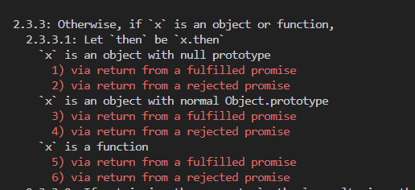
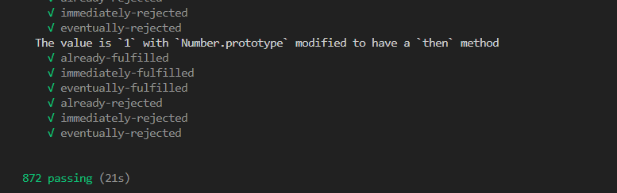

# JS原理课-DAY02


## 手写Promise

> 这一节咱们一起来手写Promise

这一章咱们会学习的有:

1. 实现Promise的核心功能:
2. Promise:
   1. 实例方法:`catch`,`finally`
   2. 静态方法:`resolve`,`reject`,`race`,`all`,`allSettled`,`any`

3. Promise\A+标准,并跑通872个单元测试

首先明确Promise的核心用法

```javascript
// 实例化 并管理异步任务
const p = new HMPromise((resolve, reject) => {
  setTimeout(() => {
    resolve('success')
    // reject('error')
  }, 1000);
})

// then方法获取成功/失败结果
// 参数1:成功时执行的回调函数
// 参数2:失败时执行的回调函数
p.then(res => {
  console.log('res:', res)
  return 'success2'
}, err => {
  console.log('err:', err)
}).then(res2 => {
  console.log('res2:', res2)
})

```


### 手写Promise-构造函数

**需求:**

1. 实现`HMPromise`类，可以用如下的方式实例化
2. 实例化时传入回调函数
   1. 回调函数立刻执行
   2. 回调函数接收函数`resolve`和`reject`

```javascript
const p = new HMPromise((resolve, reject) => {
  resolve('success')
  // reject('error')
})

```

**核心步骤:**

1. 定义类`HMPromise`
2. 添加构造函数`constructor`
3. 定义resolve/reject
4. 执行回调函数

```javascript
// 1. 定义类
class HMPromise {
  // 2. 添加构造函数
  constructor(func) {
    // 3. 定义resolve/reject
    const resolve = (result) => {
      console.log('resolve-执行啦:', result)
    }
    const reject = (result) => {
      console.log('reject-执行啦:', result)
    }

    // 4. 执行回调函数
    func(resolve, reject)
  }
}
```

#### 面试回答:

手写Promise-构造函数

1. 定义类`HMPromise`,内部添加构造函数`constructor`,构造函数需要接收回调函数`func`
2. 在构造函数中定义`resolve`和`reject`
3. 构造函数内部调用`func`并将`resolve`和`reject`传入:`func(resolve,reject)`


### 手写Promise-状态、成功or失败原因

**需求:**

1. `HMPromise`增加`state`属性，只能是如下3个值
   1. `pending`:待定，默认状态
   2. `fulfilled`:已兑现，操作成功
   3. `rejected`:已拒绝，操作失败
2. `HMPromise`增加`result`属性，记录成功/失败原因
3. 调用`resolve`或`reject`,修改状态,并记录成功/失败原因

```javascript
const p = new HMPromise((resolve, reject) => {
  resolve('success') // pending -> fulfilled
  // reject('error') // pending -> rejected
})
p.state // 状态
p.result // 原因
```

**核心步骤:**

1. 定义常量保存状态，避免**硬编码**
2. `HMPromise`中定义
   1. 属性:`state`保存状态，`result`成功/失败原因
   2. 修改`state`的私有方法，修改状态并记录`result`
   3. 注意:`state`只有在`pending`时，才可以修改，且不可逆

```javascript
const PENDING = 'pending'
const FULFILLED = 'fulfilled'
const REJECTED = 'rejected'
class HMPromise {
  // 1. 添加状态
  state = PENDING
  // 2. 添加原因
  result = undefined

  constructor(func) {
    // 3. 调整resolve/reject
    // 4. 状态不可逆
    // 改状态: pending->fulfilled
    // 记录原因
    const resolve = (result) => {
      if (this.state === PENDING) {
        this.state = FULFILLED
        this.result = result
      }
    }
    // 改状态: pending->rejected
    // 记录原因
    const reject = (result) => {
      if (this.state === PENDING) {
        this.state = REJECTED
        this.result = result
      }
    }

    func(resolve, reject)
  }
}
```

#### 面试回答:

手写Promise-状态、成功or失败原因

1. 定义3个常量用来保存状态,`pending`,`fulfilled`,`rejected`
2. `HMPromise`内部定义属性`state`和`result`分别用来保存状态和原因
3. 调用`resolve`时传入具体原因,如果状态为`pending`则更改状态并记录兑现原因
4. 调用`reject`时传入具体原因,如果状态为`pending`则更改状态并记录拒绝原因

### 手写Promise-then方法-成功和失败回调

**需求:**

1. then方法的回调函数1: 状态变为`fulfilled`时触发，并获取成功结果
2. then方法的回调函数2: 状态变为`rejected`时触发，并获取失败原因
3. then方法的回调函数1或2没有传递的特殊情况处理，[参考:then方法的参数](https://developer.mozilla.org/zh-CN/docs/Web/JavaScript/Reference/Global_Objects/Promise/then#%E5%8F%82%E6%95%B0)

```javascript
const p = new HMPromise((resolve, reject) => {
    resolve('success')
    // reject('error')
})
p.then(res => {
  console.log('成功回调:', res)
}, err => {
  console.log('失败回调:', err)
})
```

**核心步骤:**

1. 增加`then`方法，根据不同的状态执行对应的回调函数，并传入`result`
   1. 参数1:成功的回调函数
   2. 参数2:失败的回调函数
2. 判断参数
   1. 没有传递`onFulfilled`,`onRejected`时
   2. 设置默认值(参考文档)


```javascript
const PENDING = 'pending'
const FULFILLED = 'fulfilled'
const REJECTED = 'rejected'
class HMPromise {
  // 状态
  state = PENDING
  // 原因
  result = undefined

  // 构造函数
  constructor(func) {
    // pending->fulfilled
    const resolve = (result) => {
      if (this.state === PENDING) {
        this.state = FULFILLED
        this.result = result
      }
    }
    // pending->rejected
    const reject = (result) => {
      if (this.state === PENDING) {
        this.state = REJECTED
        this.result = result
      }
    }
    func(resolve, reject)
  }

  // 1. 添加实例方法
  then(onFulfilled, onRejected) {
    // 2. 参数判断(参考文档)
    onFulfilled = typeof onFulfilled === 'function' ? onFulfilled : x => x
    onRejected = typeof onRejected === 'function' ? onRejected : x => { throw x }

    // 2.1 执行成功回调
    // 2.2 执行失败回调
    if (this.state === FULFILLED) {
      onFulfilled(this.result)
    } else if (this.state === REJECTED) {
      onRejected(this.result)
    }
  }
}

```

#### 面试回答

手写Promise-then方法-成功和失败回调

1. 添加`then`方法,接收2个回调函数:
   1. 成功回调`onFulfilled`
   2. 失败回调`onRejected`
2. 判断传入的`onFulfilled`和`onRejected`是否为函数,如果不是设置默认值
3. 根据状态调用`onFulfilled`或`onRejected`并传入兑现或拒绝原因


### 手写Promise-then方法-异步和多次调用

**需求:**

1. 实例化传入的回调函数,内部支持异步操作
2. `then`方法支持多次调用(非链式编程)

```javascript
const p = new HMPromise((resolve, reject) => {
  setTimeout(() => {
    resolve('success')
    // reject('error')
  }, 2000);
})
p.then(res => {
  console.log('then1:', res)
}, err => {
  console.log('then1:', err)
})
p.then(res => {
  console.log('then2:', res)
}, err => {
  console.log('then2:', err)
})

```

**核心步骤:**

1. 定义属性:保存传入的回调函数:`[]`
2. 保存回调函数:状态为`pending`时
3. 调用成功回调:`resolve`内部
4. 调用失败回调:`reject`内部

```javascript
const PENDING = 'pending'
const FULFILLED = 'fulfilled'
const REJECTED = 'rejected'
class HMPromise {
  // 状态
  state = PENDING
  // 原因
  result = undefined
  // 1. 定义实例属性
  #handlers = [] // [{onFulfilled,onRejected}...]

  // 构造函数
  constructor(func) {
    // pending->fulfilled
    const resolve = (result) => {
      if (this.state === PENDING) {
        this.state = FULFILLED
        this.result = result
        // 3. 调用成功回调
        this.#handlers.forEach(({ onFulfilled }) => {
          onFulfilled(this.result)
        })
      }
    }
    // pending->rejected
    const reject = (result) => {
      if (this.state === PENDING) {
        this.state = REJECTED
        this.result = result
        // 4. 调用失败回调
        this.#handlers.forEach(({ onRejected }) => {
          onRejected(this.result)
        })
      }
    }
    func(resolve, reject)
  }

  // then方法
  then(onFulfilled, onRejected) {
    onFulfilled = typeof onFulfilled === 'function' ? onFulfilled : x => x
    onRejected = typeof onRejected === 'function' ? onRejected : x => { throw x }

    if (this.state === FULFILLED) {
      onFulfilled(this.result)
    } else if (this.state === REJECTED) {
      onRejected(this.result)
    } else if (this.state === PENDING) {
      // 2. 保存回调函数
      this.#handlers.push({
        onFulfilled, onRejected
      })
    }
  }
}

```

#### 面试回答

手写Promise-then方法-异步和多次调用

1. `HMPromise`添加私有属性`#handlers`
   1. 保存then方法调用时状态为`pending`的回调函数
   2. 格式为对象数组:`[{onFulfilled,onRejected}...]`

2. 构造函数内部调整`resolve`和`reject`的逻辑:
   1. 调用`resolve`时取出数组`#handlers`中的所有`onFulfilled`回调函数进行调用
   2. 调用`reject`时取出数组`#handlers`中的所有`onRejected`回调函数进行调用


### 手写Promise-异步任务-api补充

1. [传送门:MDN-queueMicrotask](https://developer.mozilla.org/zh-CN/docs/Web/API/queueMicrotask)
2. [传送门:MDN-queueMicrotask使用指南](https://developer.mozilla.org/zh-CN/docs/Web/API/HTML_DOM_API/Microtask_guide)
3. [传送门:MDN-setImmediate](https://developer.mozilla.org/zh-CN/docs/Web/API/Window/setImmediate)
4. [传送门:MDN-MutationObserver](https://developer.mozilla.org/zh-CN/docs/Web/API/MutationObserver)

**需求:**

1. 如下代码打印结果为`1,2,4,3`
1. 核心: 让then方法的回调函数以**异步任务**的方式执行

```javascript
console.log('top')
const p = new HMPromise((resolve, reject) => {
  resolve('success')
})
p.then(res => {
  console.log(res)
})
console.log('bottom')
```

**这里我们参考vue2的做法:**

1. **vue2:**Promise.then、MutationObserver 、 setImmediate 、 setTimeout
2. **我们选用**:queueMicrotask 、MutationObserver 、 setTimeout


**选用原因:**

1. `Promise.then`: 我们是手写Promise,故不选用这个
2. `queueMicrotask` :新式浏览器均支持,node11开始支持,ie不支持
3. `MutationObserver` :新式浏览器均支持,ie11开始支持
4. `setImmediate`: 新式浏览器只有edge支持,ie10开始支持
5. `setTimeout`:浏览器支持,node支持


**测试代码:**

```javascript
// ------------- 异步任务1 queueMicrotask  -------------
// node v11 ie 不支持
// console.log('top')
queueMicrotask(() => {
  // ....
})
// console.log('bottom')

// ------------- 异步任务2 MutationObserver -------------
// node 不支持 ie11
console.log('top')
// 创建并返回一个新的观察器，它会在触发指定 DOM 事件时，调用指定的回调函数
const obs = new MutationObserver(() => {
  console.log('MutationObserver-run')
})
// 创建div
const divNode = document.createElement('div')
// 监听创建的div ,监听子节点改变
obs.observe(divNode, { childList: true })
// 修改内容触发回调函数
divNode.innerText = 'itheima 666'
console.log('bottom')

// ------------- 异步任务3 setTimeout -------------
// 这个都熟悉,就不测试了啦
```

#### 面试回答

请问可以使用哪些方式开启异步任务:

1. `Promise.then`: 我们是手写Promise,故不选用这个
2. `queueMicrotask` :新式浏览器均支持,node11开始支持,ie不支持
3. `MutationObserver` :新式浏览器均支持,ie11开始支持
4. `setImmediate`: 新式浏览器只有edge支持,ie10开始支持
5. `setTimeout`:浏览器支持,node支持


### 手写Promise-异步任务-函数封装

**需求:**

1. 封装函数`runMicrotask`内部执行异步任务
2. 使用`runMicrotask`让`then`方法的回调函数为异步任务


**核心步骤:**

1. 封装函数`runMicrotask`并传入回调函数
2. 内部依次判断:`queueMicrotask` 、`MutationObserver` 、 `setTimeout`并使用即可
3. 使用`runMicrotask`开启执行异步任务即可

```javascript
// 1. 定义函数
function runAsynctask(callback) {
  // 2. 调用核心api(queueMicrotask,MutationObserver,setTimeout)
  if (typeof queueMicrotask === 'function') {
    queueMicrotask(callback)
  } else if (typeof MutationObserver === 'function') {
    const obs = new MutationObserver(callback)
    const divNode = document.createElement('div')
    obs.observe(divNode, { childList: true })
    divNode.innerText = 'itheima666'
  } else {
    setTimeout(callback, 0)
  }
}

const PENDING = 'pending'
const FULFILLED = 'fulfilled'
const REJECTED = 'rejected'
class HMPromise {
  // 状态
  state = PENDING
  // 原因
  result = undefined
  // 回调函数数组
  #handlers = [] // [{onFulfilled,onRejected}...]

  // 构造函数
  constructor(func) {
    // pending->fulfilled
    const resolve = (result) => {
      if (this.state === PENDING) {
        this.state = FULFILLED
        this.result = result
        this.#handlers.forEach(({ onFulfilled }) => {
          onFulfilled(this.result)
        })
      }
    }
    // pending->rejected
    const reject = (result) => {
      if (this.state === PENDING) {
        this.state = REJECTED
        this.result = result
        this.#handlers.forEach(({ onRejected }) => {
          onRejected(this.result)
        })
      }
    }
    func(resolve, reject)
  }

  // then方法
  then(onFulfilled, onRejected) {
    onFulfilled = typeof onFulfilled === 'function' ? onFulfilled : x => x
    onRejected = typeof onRejected === 'function' ? onRejected : x => { throw x }

    // 3. 使用封装函数
    if (this.state === FULFILLED) {
      runAsynctask(() => {
        onFulfilled(this.result)
      })
    } else if (this.state === REJECTED) {
      runAsynctask(() => {
        onRejected(this.result)
      })
    } else if (this.state === PENDING) {
      this.#handlers.push({
        onFulfilled: () => {
          runAsynctask(() => {
            onFulfilled(this.result)
          })
        }, onRejected: () => {
          runAsynctask(() => {
            onRejected(this.result)
          })
        }
      })
    }
  }
}

```

#### 面试回答

手写Promise-异步任务-函数封装

1. 封装执行异步任务的函数

   1. 定义函数传入异步任务(回调函数)

   1. 内部根据实际情况判断并使用开启异步任务的api即可,比如`queueMicrotask`,`MutationObserver`

   1. 调用的`api`可以根据实际情况进行调整

   1. 如果都无法执行,使用`setTimeout`兜底

2. 调整`then`中的逻辑,`fulFilled`,`rejected`,`pending`3种状态时的回调函数,使用封装的函数包装一次


### 手写Promise-链式编程-fulfilled状态-返回值+异常

**需求:**

1. `then`的链式编程
2. 目前只考虑`then`的第一个回调函数
   1. 返回普通值
   2. 内部出现异常


```javascript
const p = new HMPromise((resolve, reject) => {
  resolve(1)
})
p.then(res => {
  console.log(res)
  // throw 'throw-error'
  return 2
}).then(res => {
  console.log(res)
}, err => {
  console.log(err)
})

```

**核心步骤:**

1. 调整`then`方法，返回一个新的`HMPromise`对象
2. 使用`try-catch`捕获异常,并通过`reject`传递
3. 内部获取`onFulfilled`的执行结果,并通过`resolve`传递

```javascript
// 执行异步任务
function runAsynctask(callback) {
  if (typeof queueMicrotask === 'function') {
    queueMicrotask(callback)
  } else if (typeof MutationObserver === 'function') {
    const obs = new MutationObserver(callback)
    const divNode = document.createElement('div')
    obs.observe(divNode, { childList: true })
    divNode.innerText = 'itheima666'
  } else {
    setTimeout(callback, 0)
  }
}

/**
 * 链式编程-处理异常和普通内容(fulfilled状态)
 *  1. 返回新Promise实例
 *  2. 获取返回值
 *    2.1 处理返回值
 *    2.2 处理异常
*/
const PENDING = 'pending'
const FULFILLED = 'fulfilled'
const REJECTED = 'rejected'
class HMPromise {
  // 状态
  state = PENDING
  // 原因
  result = undefined
  // 回调函数数组
  #handlers = [] // [{onFulfilled,onRejected}...]

  // 构造函数
  constructor(func) {
    // pending->fulfilled
    const resolve = (result) => {
      if (this.state === PENDING) {
        this.state = FULFILLED
        this.result = result
        this.#handlers.forEach(({ onFulfilled }) => {
          onFulfilled(this.result)
        })
      }
    }
    // pending->rejected
    const reject = (result) => {
      if (this.state === PENDING) {
        this.state = REJECTED
        this.result = result
        this.#handlers.forEach(({ onRejected }) => {
          onRejected(this.result)
        })
      }
    }
    func(resolve, reject)
  }

  // then方法
  // 1. 返回新Promise实例
  // 2. 获取返回值
  //    2.1 处理返回值
  //    2.2 处理异常
  then(onFulfilled, onRejected) {
    onFulfilled = typeof onFulfilled === 'function' ? onFulfilled : x => x
    onRejected = typeof onRejected === 'function' ? onRejected : x => { throw x }

    // 1. 返回新Promise实例
    const p2 = new HMPromise((resolve, reject) => {
      if (this.state === FULFILLED) {
        runAsynctask(() => {
          // 2. 获取返回值
          try {
            const x = onFulfilled(this.result)
            // console.log('x:', x)
            // 2.1 处理返回值
            resolve(x)
          } catch (error) {
            // 2.2 处理异常
            // console.log('捕获异常:', error)
            reject(error)
          }
        })
      }
      else if (this.state === REJECTED) {
        runAsynctask(() => {
          onRejected(this.result)
        })
      }
      else if (this.state === PENDING) {
        this.#handlers.push({
          onFulfilled: () => {
            runAsynctask(() => {
              onFulfilled(this.result)
            })
          }, onRejected: () => {
            runAsynctask(() => {
              onRejected(this.result)
            })
          }
        })
      }

    })

    return p2
  }
}

```

#### 面试回答:

手写Promise-链式编程-fulfilled状态-返回值+异常,本节只考虑

1. 链式编程的本质then方法会返回一个新的`HMPromise`对象
2. 将原本的代码迁移到返回的`HMPromise`对象的回调函数中
3. 内部通过`try-catch`捕获异常,出现异常通过`reject`传递异常
4. 获取`onFulfilled`的执行结果,并通过`resolve`传递


### 手写Promise-链式编程-fulfilled状态-返回Promise

**需求:**

1. `then`的链式编程
2. 目前只考虑`then`的第一个回调函数
   1. 返回`Promise`

```javascript
const p = new HMPromise((resolve, reject) => {
  resolve(1)
})
p.then(res => {
  return new HMPromise((resolve, reject) => {
    resolve(2)
    // reject('error')
  })
}).then(res => {
  console.log('p2:', res) // 2
}, err => {
  console.log('p2:', err) // error
})
```

**核心步骤:**

1. 判断是否为`HMPromise`实例
1. 调用`then`方法依次传入回调函数

```javascript
// 执行异步任务
function runAsynctask(callback) {
  if (typeof queueMicrotask === 'function') {
    queueMicrotask(callback)
  } else if (typeof MutationObserver === 'function') {
    const obs = new MutationObserver(callback)
    const divNode = document.createElement('div')
    obs.observe(divNode, { childList: true })
    divNode.innerText = 'itheima666'
  } else {
    setTimeout(callback, 0)
  }
}

/**
 * 链式编程-处理Promise(fulfilled状态)
*/
const PENDING = 'pending'
const FULFILLED = 'fulfilled'
const REJECTED = 'rejected'
class HMPromise {
  // 状态
  state = PENDING
  // 原因
  result = undefined
  // 回调函数数组
  #handlers = [] // [{onFulfilled,onRejected}...]

  // 构造函数
  constructor(func) {
    // pending->fulfilled
    const resolve = (result) => {
      if (this.state === PENDING) {
        this.state = FULFILLED
        this.result = result
        this.#handlers.forEach(({ onFulfilled }) => {
          onFulfilled(this.result)
        })
      }
    }
    // pending->rejected
    const reject = (result) => {
      if (this.state === PENDING) {
        this.state = REJECTED
        this.result = result
        this.#handlers.forEach(({ onRejected }) => {
          onRejected(this.result)
        })
      }
    }
    func(resolve, reject)
  }

  // then方法
  then(onFulfilled, onRejected) {
    onFulfilled = typeof onFulfilled === 'function' ? onFulfilled : x => x
    onRejected = typeof onRejected === 'function' ? onRejected : x => { throw x }

    const p2 = new HMPromise((resolve, reject) => {
      if (this.state === FULFILLED) {
        runAsynctask(() => {
          try {
            const x = onFulfilled(this.result)
            // 1.处理返回Promise
            if (x instanceof HMPromise) {
              // console.log('HMPromise实例')
              // 2. 调用then方法
              // x.then(res => console.log(res), err => console.log(err))
              x.then(res => resolve(res), err => reject(err))
            } else {
              resolve(x)
            }
          } catch (error) {
            reject(error)
          }
        })
      }
      else if (this.state === REJECTED) {
        runAsynctask(() => {
          onRejected(this.result)
        })
      }
      else if (this.state === PENDING) {
        this.#handlers.push({
          onFulfilled: () => {
            runAsynctask(() => {
              onFulfilled(this.result)
            })
          }, onRejected: () => {
            runAsynctask(() => {
              onRejected(this.result)
            })
          }
        })
      }
    })
    return p2
  }
}
```

#### 面试回答

手写Promise-链式编程-fulfilled状态-返回Promise

1. 判断`onFulfilled`的执行结果是否为`HMPromise`实例
2. 如果是的话调用返回值的`then`方法,获取兑现和拒绝的原因并通过`resolve`和`reject`传递即可


### 手写Promise-链式编程-fulfilled状态-重复引用

**需求:**

1. `then`中返回的`then`方法返回的`Promise`实例报错
2. 注:下列代码中的`p2`


```javascript
const p = new HMPromise((resolve, reject) => {
  resolve(1)
})
const p2 = p.then(res => {
  return p2
})
p2.then(
  res => { },
  err => console.log('err:', err))
```

**核心步骤:**

1. 判断是否相同,抛出异常

```javascript
// 执行异步任务
function runAsynctask(callback) {
  if (typeof queueMicrotask === 'function') {
    queueMicrotask(callback)
  } else if (typeof MutationObserver === 'function') {
    const obs = new MutationObserver(callback)
    const divNode = document.createElement('div')
    obs.observe(divNode, { childList: true })
    divNode.innerText = 'itheima666'
  } else {
    setTimeout(callback, 0)
  }
}

/**
 * 链式编程-处理Promise(fulfilled状态)
*/
const PENDING = 'pending'
const FULFILLED = 'fulfilled'
const REJECTED = 'rejected'
class HMPromise {
  // 状态
  state = PENDING
  // 原因
  result = undefined
  // 回调函数数组
  #handlers = [] // [{onFulfilled,onRejected}...]

  // 构造函数
  constructor(func) {
    // pending->fulfilled
    const resolve = (result) => {
      if (this.state === PENDING) {
        this.state = FULFILLED
        this.result = result
        this.#handlers.forEach(({ onFulfilled }) => {
          onFulfilled(this.result)
        })
      }
    }
    // pending->rejected
    const reject = (result) => {
      if (this.state === PENDING) {
        this.state = REJECTED
        this.result = result
        this.#handlers.forEach(({ onRejected }) => {
          onRejected(this.result)
        })
      }
    }
    func(resolve, reject)
  }

  // then方法
  then(onFulfilled, onRejected) {
    onFulfilled = typeof onFulfilled === 'function' ? onFulfilled : x => x
    onRejected = typeof onRejected === 'function' ? onRejected : x => { throw x }

    const p2 = new HMPromise((resolve, reject) => {
      if (this.state === FULFILLED) {
        runAsynctask(() => {
          try {
            const x = onFulfilled(this.result)
            // 1. 处理重复引用
            if (x === p2) {
              // console.log('返回了p2')
              // 2. 抛出错误 Chaining cycle detected for promise #<Promise>
              throw new TypeError('Chaining cycle detected for promise #<Promise>')
            }
            if (x instanceof HMPromise) {
              x.then(res => resolve(res), err => reject(err))
            } else {
              resolve(x)
            }
          } catch (error) {
            reject(error)
          }
        })
      }
      else if (this.state === REJECTED) {
        runAsynctask(() => {
          onRejected(this.result)
        })
      }
      else if (this.state === PENDING) {
        this.#handlers.push({
          onFulfilled: () => {
            runAsynctask(() => {
              onFulfilled(this.result)
            })
          }, onRejected: () => {
            runAsynctask(() => {
              onRejected(this.result)
            })
          }
        })
      }
    })
    return p2
  }
}
```

#### 面试回答

手写Promise-链式编程-fulfilled状态-重复引用

1. 判断`onFulfilled`函数的返回值是否和`then`方法内部返回的`HMPromise`相同
2. 如果相同抛出错误`new TypeError('Chaining cycle detected for promise #<Promise>')`


### 手写Promise-链式编程-rejected状态

**需求:**

1. `then`的第二个回调函数，执行`reject`时的链式编程

```javascript
const p = new HMPromise((resolve, reject) => {
  reject(1)
})
const p2 = p.then(undefined, err => {
  throw 'error'
  // return p2
  // return 2
  // return new HMPromise((resolve, reject) => {
  //   resolve('HMPromise-2')
  // })
})
p2.then(res => {
  console.log('p2-res:', res)
}, err => {
  console.log('p2-err:', err)
})

```

**核心步骤:**

1. 处理异常:`onRejected`的异常
2. 获取返回值:`onRejected`的返回值
3. 将`fulfilled`状态中的处理逻辑抽取为函数`resolvePromise`并复用
4. `fulfilled`和`rejected`状态中调用函数`resolvePromise`

```javascript
// 执行异步任务
function runAsynctask(callback) {
  if (typeof queueMicrotask === 'function') {
    queueMicrotask(callback)
  } else if (typeof MutationObserver === 'function') {
    const obs = new MutationObserver(callback)
    const divNode = document.createElement('div')
    obs.observe(divNode, { childList: true })
    divNode.innerText = 'itheima666'
  } else {
    setTimeout(callback, 0)
  }
}

/**
 * 链式编程-处理Promise(fulfilled状态)
*/
const PENDING = 'pending'
const FULFILLED = 'fulfilled'
const REJECTED = 'rejected'
class HMPromise {
  // 状态
  state = PENDING
  // 原因
  result = undefined
  // 回调函数数组
  #handlers = [] // [{onFulfilled,onRejected}...]

  // 构造函数
  constructor(func) {
    // pending->fulfilled
    const resolve = (result) => {
      if (this.state === PENDING) {
        this.state = FULFILLED
        this.result = result
        this.#handlers.forEach(({ onFulfilled }) => {
          onFulfilled(this.result)
        })
      }
    }
    // pending->rejected
    const reject = (result) => {
      if (this.state === PENDING) {
        this.state = REJECTED
        this.result = result
        this.#handlers.forEach(({ onRejected }) => {
          onRejected(this.result)
        })
      }
    }
    func(resolve, reject)
  }

  // then方法
  // 1. 处理异常
  // 2. 获取返回值
  // 3. 抽取函数
  // 4. 调用函数
  then(onFulfilled, onRejected) {
    onFulfilled = typeof onFulfilled === 'function' ? onFulfilled : x => x
    onRejected = typeof onRejected === 'function' ? onRejected : x => { throw x }

    const p2 = new HMPromise((resolve, reject) => {
      if (this.state === FULFILLED) {
        runAsynctask(() => {
          try {
            const x = onFulfilled(this.result)
            // 4. 调用函数
            resolvePromise(p2, x, resolve, reject)
            // if (x === p2) {
            //   throw new TypeError('Chaining cycle detected for promise #<Promise>')
            // }
            // if (x instanceof HMPromise) {
            //   x.then(res => resolve(res), err => reject(err))
            // } else {
            //   resolve(x)
            // }
          } catch (error) {
            reject(error)
          }
        })
      }

      else if (this.state === REJECTED) {
        runAsynctask(() => {
          // 1. 处理异常
          try {
            // 2. 获取返回值
            const x = onRejected(this.result)
            // console.log('x:', x)
            // 4. 调用函数
            resolvePromise(p2, x, resolve, reject)
          } catch (error) {
            reject(error)
          }
        })
      }

      else if (this.state === PENDING) {
        this.#handlers.push({
          onFulfilled: () => {
            runAsynctask(() => {
              onFulfilled(this.result)
            })
          }, onRejected: () => {
            runAsynctask(() => {
              onRejected(this.result)
            })
          }
        })
      }
    })

    return p2
  }
}

// 3. 抽取函数
function resolvePromise(p2, x, resolve, reject) {
  if (x === p2) {
    throw new TypeError('Chaining cycle detected for promise #<Promise>')
  }
  if (x instanceof HMPromise) {
    x.then(res => resolve(res), err => reject(err))
  } else {
    resolve(x)
  }
}

```

#### 面试回答

手写Promise-链式编程-rejected状态

1. 判断`onRejected`可能出现的异常,如果出现通过`reject`传递
2. 获取`onRejected`函数的执行结果
3. 将`fulfilled`状态时的处理逻辑抽取为函数,`rejected`状态时调用函数复用逻辑


### 手写Promise-链式编程-pending状态

**需求:**

1. 执行异步操作时，支持链式编程

```javascript
const p = new HMPromise((resolve, reject) => {
  setTimeout(() => {
    resolve(1)
  }, 2000)
})
const p2 = p.then(res => {
  throw 'error'
  // return p2
  // return 2
  // return new HMPromise((resolve, reject) => {
  //   resolve('resolve-2')
  //   // reject('reject-2')
  // })
})
p2.then(res => {
  console.log('p2-res:', res)
}, err => {
  console.log('p2-err:', err)
})

```

**核心步骤:**

1. 处理异常:
   1. `fulfilled`状态时推入回调函数数组时增加`try-catch`

2. 获取返回值:
   1. 推入数组时,增加获取返回值的操作

3. 调用上一节封装的函数`resolvePromise`

```javascript
// 执行异步任务
function runAsynctask(callback) {
  if (typeof queueMicrotask === 'function') {
    queueMicrotask(callback)
  } else if (typeof MutationObserver === 'function') {
    const obs = new MutationObserver(callback)
    const divNode = document.createElement('div')
    obs.observe(divNode, { childList: true })
    divNode.innerText = 'itheima666'
  } else {
    setTimeout(callback, 0)
  }
}

function resolvePromise(p2, x, resolve, reject) {
  if (x === p2) {
    throw new TypeError('Chaining cycle detected for promise #<Promise>')
  }
  if (x instanceof HMPromise) {
    x.then(res => resolve(res), err => reject(err))
  } else {
    resolve(x)
  }
}

/**
 * 链式编程-处理Promise(fulfilled状态)
*/
const PENDING = 'pending'
const FULFILLED = 'fulfilled'
const REJECTED = 'rejected'
class HMPromise {
  // 状态
  state = PENDING
  // 原因
  result = undefined
  // 回调函数数组
  #handlers = [] // [{onFulfilled,onRejected}...]

  // 构造函数
  constructor(func) {
    // pending->fulfilled
    const resolve = (result) => {
      if (this.state === PENDING) {
        this.state = FULFILLED
        this.result = result
        this.#handlers.forEach(({ onFulfilled }) => {
          onFulfilled(this.result)
        })
      }
    }
    // pending->rejected
    const reject = (result) => {
      if (this.state === PENDING) {
        this.state = REJECTED
        this.result = result
        this.#handlers.forEach(({ onRejected }) => {
          onRejected(this.result)
        })
      }
    }
    func(resolve, reject)
  }

  // then方法
  then(onFulfilled, onRejected) {
    onFulfilled = typeof onFulfilled === 'function' ? onFulfilled : x => x
    onRejected = typeof onRejected === 'function' ? onRejected : x => { throw x }

    const p2 = new HMPromise((resolve, reject) => {
      if (this.state === FULFILLED) {
        runAsynctask(() => {
          try {
            const x = onFulfilled(this.result)
            resolvePromise(p2, x, resolve, reject)
          } catch (error) {
            reject(error)
          }
        })
      }

      else if (this.state === REJECTED) {
        runAsynctask(() => {
          try {
            const x = onRejected(this.result)
            resolvePromise(p2, x, resolve, reject)
          } catch (error) {
            reject(error)
          }
        })
      }

      else if (this.state === PENDING) {
        this.#handlers.push({
          onFulfilled: () => {
            runAsynctask(() => {
              // 1. 处理异常
              try {
                // 2.获取返回值
                const x = onFulfilled(this.result)
                // 3.调用函数
                resolvePromise(p2, x, resolve, reject)
              } catch (error) {
                reject(error)
              }
            })
          }, onRejected: () => {
            runAsynctask(() => {
              // 1. 处理异常
              try {
                // 2.获取返回值
                const x = onRejected(this.result)
                // 3.调用函数
                resolvePromise(p2, x, resolve, reject)
              } catch (error) {
                reject(error)
              }
            })
          }
        })
      }
    })

    return p2
  }
}
```

#### 面试回答:

手写Promise-链式编程-pending状态

1. `then`方法中`pending`状态时推入数组的函数增加`try-catch`捕获异常
2. 获取推入数组的回调函数的返回值
3. 调用上一节封装的函数并传入获取的值

小结:

到目前已经将核心功能全部实现啦,接下来开始实现后续功能

- [x] 实现Promise的核心功能:
- [ ] Promise:
  1. 实例方法:
     - [ ] `catch`
     - [ ] `finally`
  2. 静态方法:
     - [ ] `resolve`
     - [ ] `reject`
     - [ ] `race`
     - [ ] `all`
     - [ ] `allSettled`
     - [ ] `any`
- [ ] Promise\A+标准,并跑通872个单元测试


### 手写Promise-实例方法catch

**需求:**

1. 实现实例方法`catch`,可以实现如下调用

```javascript
const p = new HMPromise((resolve, reject) => {
  reject('reject-error')
  // throw 'throw-error'
})
p.then(res => {
  console.log('res:', res)
}).catch(err => {
  console.log('err:', err)
})

```

**核心步骤:**

1. 参考[文档](https://developer.mozilla.org/zh-CN/docs/Web/JavaScript/Reference/Global_Objects/Promise/catch),catch等同于:`then(undefined,onRjected)`
2. 直接添加`catch`方法，内部调用`then`
3. 使用`try-catch`包裹`constructor`中的`func`捕获异常

```javascript

function runAsynctask(callback) {
  if (typeof queueMicrotask === 'function') {
    queueMicrotask(callback)
  } else if (typeof MutationObserver === 'function') {
    const obs = new MutationObserver(callback)
    const divNode = document.createElement('div')
    obs.observe(divNode, { childList: true })
    divNode.innerText = 'itheima666'
  } else {
    setTimeout(callback, 0)
  }
}

function resolvePromise(p2, x, resolve, reject) {
  if (x === p2) {
    throw new TypeError('Chaining cycle detected for promise #<Promise>')
  }
  if (x instanceof HMPromise) {
    x.then(res => resolve(res), err => reject(err))
  } else {
    resolve(x)
  }
}

const PENDING = 'pending'
const FULFILLED = 'fulfilled'
const REJECTED = 'rejected'
class HMPromise {
  // 状态
  state = PENDING
  // 原因
  result = undefined
  // 回调函数数组
  #handlers = [] // [{onFulfilled,onRejected}...]

  // 构造函数
  constructor(func) {
    // pending->fulfilled
    const resolve = (result) => {
      if (this.state === PENDING) {
        this.state = FULFILLED
        this.result = result
        this.#handlers.forEach(({ onFulfilled }) => {
          onFulfilled(this.result)
        })
      }
    }

    // pending->rejected
    const reject = (result) => {
      if (this.state === PENDING) {
        this.state = REJECTED
        this.result = result
        this.#handlers.forEach(({ onRejected }) => {
          onRejected(this.result)
        })
      }
    }

    // 2. 处理异常
    try {
      func(resolve, reject)
    } catch (error) {
      // console.log('error:', error)
      reject(error)
    }
  }

  // then方法
  then(onFulfilled, onRejected) {
    onFulfilled = typeof onFulfilled === 'function' ? onFulfilled : x => x
    onRejected = typeof onRejected === 'function' ? onRejected : x => { throw x }

    const p2 = new HMPromise((resolve, reject) => {
      if (this.state === FULFILLED) {
        runAsynctask(() => {
          try {
            const x = onFulfilled(this.result)
            resolvePromise(p2, x, resolve, reject)
          } catch (error) {
            reject(error)
          }
        })
      }

      else if (this.state === REJECTED) {
        runAsynctask(() => {
          try {
            const x = onRejected(this.result)
            resolvePromise(p2, x, resolve, reject)
          } catch (error) {
            reject(error)
          }
        })
      }

      else if (this.state === PENDING) {
        this.#handlers.push({
          onFulfilled: () => {
            runAsynctask(() => {
              try {
                const x = onFulfilled(this.result)
                resolvePromise(p2, x, resolve, reject)
              } catch (error) {
                reject(error)
              }
            })
          }, onRejected: () => {
            runAsynctask(() => {
              try {
                const x = onRejected(this.result)
                resolvePromise(p2, x, resolve, reject)
              } catch (error) {
                reject(error)
              }
            })
          }
        })
      }
    })

    return p2
  }

  /**
   * catch方法
   * 1. 内部调用then方法
   * 2. 处理异常
   * */
  catch(onRejected) {
    // 1. 内部调用then方法
    return this.then(undefined, onRejected)
  }
}
```

#### 面试回答

手写Promise-实例方法catch

1. 定义`catch`方法,接收拒绝的回调函数`onRejected`

2. `catch`方法的本质是内部调用`then`方法

3. 调用形式为第一个回调函数传入`undefined`,第二个回调函数传入`onRejected`即可

   


### 手写Promise-实例方法finally

**需求:**

1. 无论成功失败都会执行`finally`的回调函数
2. 回调函数不接受任何参数

```javascript
const p = new HMPromise((resolve, reject) => {
  // resolve('resolve-res')
  // reject('reject-error')
  // throw 'throw-error'
})
p.then(res => {
  console.log('res:', res)
}).catch(err => {
  console.log('err:', err)
}).finally(() => {
  console.log('finally')
})
```

**核心步骤:**

1. 参考[文档](https://developer.mozilla.org/zh-CN/docs/Web/JavaScript/Reference/Global_Objects/Promise/finally):finally方法类似于调用`then(onFinally,onFinally)`,且不接受任何回调函数
2. **注意:**
   1. 版面问题,这里只保留函数部分的逻辑,其他代码未改动
   2. 后续未特殊说明,只保留函数部分代码


```javascript
finally(onFinally) {
    return this.then(onFinally,onFinally)
}
```

#### 面试回答:

手写Promise-实例方法finally

1. 添加`finally`方法,接收最终执行的回调函数`onFinally`
2. `finally`方法的本质为内部调用`then`方法
3. 调用形式为第一个和第二个回调函数均传入`onFinally`即可

```javascript
finally(onFinally) {
    return this.then(onFinally,onFinally)
}
```


到目前已经将实例方法都实现啦

- [x] 实现Promise的核心功能:
- [x] Promise:
  1. 实例方法:
     - [x] `catch`
     - [x] `finally`
  2. 静态方法:
     - [ ] `resolve`
     - [ ] `reject`
     - [ ] `race`
     - [ ] `all`
     - [ ] `allSettled`
     - [ ] `any`
- [ ] Promise\A+标准,并跑通872个单元测试


### 手写Promise-静态方法resolve

**需求:**

1. 返回一个带有成功原因的`Promise`对象

```javascript
HMPromise.resolve(new HMPromise((resolve, reject) => {
  // resolve('resolve')
  // reject('reject')
  // throw 'error'
})).then(res => {
  console.log('res:', res)
}, err => {
  console.log('err:', err)
})
HMPromise.resolve('itheima').then(res => {
  console.log(res)
})


```

**核心步骤:**

1. 增加静态方法`resolve`，根据传入的值返回不同的结果即可

```javascript
  static resolve(value) {
    // 1. 判断传入值
    if (value instanceof HMPromise) {
      // 2.1 Promise直接返回
      return value
    }
    // 2.2 转为Promise并返回(fulfilled状态)
    // return new HMPromise((resolve, reject) => {
    return new HMPromise((resolve) => {
      resolve(value)
    })
  }
```

#### 面试回答:

手写Promise-静态方法resolve

1. 通过`static`关键字添加静态方法`resolve`,接收参数`value`

2. 内部判断传入的值

   1. 如果是`Promise`实例,直接返回
   2. 其他的值,创建`Promise`实例并返回,内部通过`resolve(value)`传递`value`

   

### 手写Promise-静态方法reject

**需求:**

1. 返回一个带有拒绝原因的`Promise`对象

```javascript
HMPromise.reject('error').catch(res => {
  console.log(res)
})
```

**核心步骤:**

1. 添加静态方法
1. 返回`rejected`状态的`Promise`

```javascript
  static reject(value) {
    // 1. 返回rejected状态的Promise
    // new HMPromise((resolve,reject)=>{
    return new HMPromise((undefined, reject) => {
      reject(value)
    })
  }
```

#### 面试回答

手写Promise-静态方法reject

1. 添加静态方法`reject`并接收参数`value`
2. 内部返回一个拒绝状态的`Promise`实例即可


### 手写Promise-静态方法race

**需求:**

1. 接收Promise数组,数组中第一个Promise敲定时,获取`成功/失败`结果
2. 传入的参数不是数组,直接报错


```javascript
const p1 = new HMPromise((resolve, reject) => {
  setTimeout(() => {
    resolve(1)
  }, 2000)
})
const p2 = new HMPromise((resolve, reject) => {
  setTimeout(() => {
    reject(2)
  }, 1000)
})
HMPromise.race([p1, p2, 'itheima']).then((res) => {
  console.log('res:', res)
}, err => {
  console.log('err:', err)
})

```

**核心步骤:**

1. 返回`Promise`
2. 判断是否未数组,不是直接报错
3. 等待第一个敲定

```javascript
  static race(promises) {
    // 1. 返回Promise
    return new HMPromise((resolve, reject) => {
      // 2. 判断是否为数组
      if (!Array.isArray(promises)) {
        return reject(new TypeError('Argument is not iterable'))
      }
      // 3. 等待第一个敲定
      promises.forEach(p => {
        // p.then
        HMPromise.resolve(p).then(res => { resolve(res) }, err => { reject(err) })
      })
    })
  }
```

#### 面试回答:

手写Promise-静态方法race

1. 添加静态方法`race`接收参数`promises`
2. 内部返回一个新的`Promise`实例,在返回的`Promise`实例中:
   1. 判断参数是否为数组,不是通过`reject`传递错误
   2. 遍历Promise数组,通过`resolve`静态方法等待每一个兑现
   3. 任何一个兑现,调用`resolve`传递兑现结果
   4. 任何一个拒绝,调用`reject`传递拒绝原因


### 手写Promise-静态方法all

**需求:**

1. 接收Promise数组
   1. 所有Promise都成功时，返回一个成功的Promise对象及成功数组
   2. 任何一个Promise失败，返回一个失败的Promise对象及第一个失败原因

```javascript
const p1 = HMPromise.resolve(1)
const p2 = new HMPromise((resolve, reject) => {
  setTimeout(() => {
    resolve(2)
    // reject('error')
  }, 1000)
})
const p3 = 3
HMPromise.all([p1, p2, p3]).then(res => {
  console.log('res:', res)
}, err => {
  console.log('err:', err)
})

```

**核心步骤:**

1. 返回Promise

1. 判断参数是否未数组:

   1. 不是:直接报错
2. 是:
      1. 空数组直接兑现
   2. 处理全部兑现:记录结果->判断全部兑现
      3. 处理第一个拒绝

   


```javascript
static all(promises) {
    // 1. 返回Promise实例
    return new HMPromise((resolve, reject) => {
      // 2. 判断是否为数组
      if (!Array.isArray(promises)) {
        return reject(new TypeError('Argument is not iterable'))
      }
      // 3. 空数组直接兑现
      promises.length === 0 && resolve(promises)
      // 4.1 记录结果
      const results = []
      let count = 0
      promises.forEach((p, index) => {
        HMPromise.resolve(p).then(res => {
          // results.push 无法保证 结果的顺序和Promise数组的顺序一致
          // index 和 Promise实例的索引一致,保证顺序
          results[index] = res
          // 4.2 判断全部兑现
          count++
          count === promises.length && resolve(results)
        }, err => {
          // 5. 处理第一个拒绝
          reject(err)
        })
      })
    })
  }

```

#### 面试回答:

手写Promise-静态方法all

1. 添加静态方法`all`
2. 内部返回`Promise`实例,在返回的`Promise`实例中:
   1. 判断参数是否为数组,不是通过`reject`传递错误
   2. 空数组直接以空数组为结果进行兑现
   3. 遍历`Promise`数组,通过`resolve`静态方法等待结果
      1. 处理全部兑现:
         1. 通过数组记录结果,用索引的方式来添加,目的是保证结果的顺序和`Promise`数组的顺序一致
         2. 通过兑现次数进行判断,因为是通过索引的方式记录结果,如果第一次兑现的是最后一个,那么数组的长度就已经和Promise数组的长度一致了,所以需要通过兑现次数来进行判断
      2. 任意一个拒绝,调用`reject`传递拒绝原因

### 手写Promise-静态方法allSettled

**需求:**[-传送门](https://developer.mozilla.org/zh-CN/docs/Web/JavaScript/Reference/Global_Objects/Promise/allSettled)

1. 传入`Promise`数组，当所有对象都已敲定时
2. 返回一个新的`Promise`对象及以数组形式保存的结果

```javascript
const p1 = HMPromise.resolve(1)
const p2 = 2
const p3 = new HMPromise((resolve, reject) => {
  setTimeout(() => {
    reject(3)
  }, 1000)
})
HMPromise.allSettled([p1, p2, p3]).then(res => {
  console.log('res:', res)
}, err => {
  console.log('err:', err)
})
```


**核心步骤:**

1. 返回`Promise`
2. 判断是否为数组:
   1. 不是:报错
   2. 是:
      1. 空数组:直接兑现
      2. 等待全部敲定:并记录结果
         1. 处理兑现:`{state:FULFILLED,value:'xxx'}`
         2. 处理拒绝:`{state:REJECTED,reason:'xxx'}`


```javascript
  static allSettled(promises) {
    // 1. 返回Promise
    return new HMPromise((resolve, reject) => {
      // 2. 数组判断
      if (!Array.isArray(promises)) {
        return reject(new TypeError('Argument is not iterable'))
      }
      // 3. 为空直接敲定
      promises.length === 0 && resolve(promises)

      // 4. 等待全部敲定
      // 4.1 记录结果
      const results = []
      let count = 0
      promises.forEach((p, index) => {
        HMPromise.resolve(p).then(res => {
          // 4.2 处理兑现{status:'fulfilled',value:''}
          results[index] = { status: FULFILLED, value: res }
          count++
          count === promises.length && resolve(results)
        }, err => {
          // 4.3 处理拒绝{status:'rejected',reason:''}
          results[index] = { status: REJECTED, reason: err }
          count++
          count === promises.length && resolve(results)
        })
      })
    })
  }


```

#### 面试回答:

手写Promise-静态方法allSettled

做法和`all`方法类似,区别是要获取全部敲定的结果(成功/拒绝),以及获取的结果是对象形式

1. 添加静态方法`allSettled`
2. 内部返回`Promise`实例,在返回的`Promise`实例中:
   1. 判断参数是否为数组,不是通过`reject`传递错误
   2. 空数组直接以空数组为结果进行兑现
3. 遍历`Promise`数组,通过`resolve`静态方法等待敲定结果

4. 等待全部敲定:并记录结果,根据兑现和拒绝将如下格式的内容通过索引的方式的记录到数组中

   1. 处理兑现:`{state:FULFILLED,value:'xxx'}`

   2. 处理拒绝:`{state:REJECTED,reason:'xxx'}`

5. 根据敲定的次数判断是否全部敲定,全部敲定之后,通过`resolve`传递结果数组


### 手写Promise-静态方法any

**需求:**-[传送门](https://developer.mozilla.org/zh-CN/docs/Web/JavaScript/Reference/Global_Objects/Promise/any)

1. 传入`Promise`数组，
   1. 任何一个`Promise`对象敲定时，返回一个新的`Promise`对象，及对应的结果
   2. 所有Promise都被拒绝时，返回一个包含所有拒绝原因的`AggregateError`错误数组

```javascript
const p1 = new HMPromise((resolve, reject) => {
  setTimeout(() => {
    reject(1)
  }, 2000)
})
const p2 = 2
const p3 = new HMPromise((resolve, reject) => {
  setTimeout(() => {
    resolve(3)
    // reject(3)
  }, 1000)
})
HMPromise.any([p1, p2, p3]).then(res => {
  console.log('res:', res)
}, err => {
  console.dir(err)
})

```


**核心步骤:**

1. 返回Promise
2. 判断是否为数组
   1. 不是:报错
   2. 是:
      1. 空数组:直接拒绝
      2. 等待结果:
         1. 第一个兑现
         2. 全部拒绝


```javascript
  static any(promises) {
    // 1. 返回Promise,数组判断
    return new HMPromise((resolve, reject) => {
      if (!Array.isArray(promises)) {
        return reject(new TypeError('Argument is not iterable'))
      }
      // 2. 空数组直接拒绝
      promises.length === 0 && reject(new AggregateError(promises, 'All promises were rejected'))

      // 3. 等待结果
      const errors = []
      let count = 0
      promises.forEach((p, index) => {
        HMPromise.resolve(p).then(res => {
          // 3.1 第一个兑现
          resolve(res)
        }, err => {
          // 3.2 全部拒绝
          errors[index] = err
          count++
          count === promises.length && reject(new AggregateError(errors, 'All promises were rejected'))
        })
      })
    })
  }


```

#### 面试回答:

手写Promise-静态方法any

做法和`all`方法也有点类似,区别是获取第一个兑现,或者是全部拒绝

1. 添加静态方法`any`
2. 内部返回`Promise`实例,在返回的`Promise`实例中:
   1. 判断参数是否为数组,不是通过`reject`传递错误
   2. 空数组直接以空数组为结果进行兑现
3. 遍历`Promise`数组,通过`resolve`静态方法等待结果
   1. 第一个兑现,通过`resolve`传递兑现结果
   2. 全部拒绝:
      1. 定义数组,保存拒绝原因,通过索引记录,目的是保证顺序和`Promise`数组一致
      2. 通过次数判断是否全部拒绝,当全部拒绝时,通过`reject`传递`AggregateError`类型的错误,并将拒绝原因数组传递进去即可


到目前已经将静态方法都实现啦

- [x] 实现Promise的核心功能:
- [x] Promise:
  1. 实例方法:
     - [x] `catch`
     - [x] `finally`
  2. 静态方法:
     - [x] `resolve`
     - [x] `reject`
     - [x] `race`
     - [x] `all`
     - [x] `allSettled`
     - [x] `any`

- [x] Promise\A+标准,并跑通872个单元测试


### 手写Promise-Promise\A+测试

接下来咱们来测试一下手写Promise的代码能否通过[Promise\A+](https://promisesaplus.com/)测试

**Promise\A+规范:**

Promise\A+是社区推出的规范,其实最早Promise也是社区推出并实现的,旨在规范Promise的实现,里面约定了:

1. 状态必须是:pending,fulfilled,rejected
2. then方法的详细实现细节
3. ....

早期使用Promise可能需要导入一些库,比如:

- [Q](https://github.com/kriskowal/q)
- [when](https://github.com/cujojs/when)
- [WinJS](https://msdn.microsoft.com/en-us/library/windows/apps/br211867.aspx)
- [RSVP.js](https://github.com/tildeio/rsvp.js)

​    现在已经不需要了,因为在ES6中已经加入语言标准,我们可以直接使用了:从 Chrome 32、Opera 19、Firefox 29、Safari 8 和 Microsoft Edge 开始，promises 是默认开启的。若要使缺乏完整 promise 实现的浏览器符合规范，或将 promise 添加到其他浏览器和 Node.js 中，请查看[polyfill](https://github.com/jakearchibald/ES6-Promises#readme) (2k gzipped)。

​		上面提到的库,以及ES6中实现的Promise,还有我们手写的Promise其实都是按照标准进行编写的,那么如何测试是否符合标准呢

**测试:**

社区提供了[promises-](https://github.com/promises-aplus/promises-tests)[aplus](https://github.com/promises-aplus/promises-tests)[-tests](https://github.com/promises-aplus/promises-tests)用来测试实现的Promise是否符合规范,使用方式为:

1. 使用CommonJS的方式暴露对象,要求如下

   ```javascript
   1.  提供deferred方法,返回对象{promise,resolve,reject}
      1.1  promise: pending状态的promise实例(自己手写的Promise)
      1.2  resolve:  以传入的原因兑现promise
      1.3  reject:    以传入的原因拒绝promise
   ```

   ```javascript
   // 将我们自己手写的Promise拷贝到一个单独的文件,并在底部加上
   module.exports = {
     deferred() {
       const res = {}
       // 自己手写的Promise
       res.promise = new HMPromise((resolve, reject) => {
         // 内部将resolve和reject赋值上去   
         res.resolve = resolve
         res.reject = reject
       })
       return res
     }
   }
   
   ```

   

2. 下包:

   1. 初始化项目: `npm init -y`

   2. 下包:`npm i promises-aplus-tests -D`

3. 配置并执行命令:

   1. `package.json`的`scripts`中加入

   2. 注: `HMPromise`是文件名,根据实际情况调整自己的文件名即可

      ```javascript
      "test": "promises-aplus-tests HMPromise"
      ```

   3. 执行命令:`npm run test`


**测试:**

我们目前的写法中,没有考虑所有的边界情况,测试时会在2.3.3开始出错



只需要将`resolvePromise`函数替换为如下写法即可:

1. 函数名,参数顺序和原函数一致
2. 函数内部使用,序号+说明的方式对Promise\A+的标准进行标注

大伙可以参考注释对比确认还需要考虑哪些便捷情况,

```javascript
// 符合Promise\A规范(考虑了各种边界情况)
function resolvePromise(p2, x, resolve, reject) {
  // 2.3.3.1 如果p2和x引用同一个对象,通过TypeError作为原因来拒绝pormise
  if (x === p2) {
    throw new TypeError('Chaining cycle detected for promise');
  }

  /**
   * 2.3.3.2 如果x是一个promise,采用他的状态
   *  2.3.3.3.1 如果x是pengding状态,promise必须保持等待状态,直到x被fulfilled或rejected
   *  2.3.3.3.2 如果x是fulfilled状态,用相同的原因解决promise
   *  2.3.3.3.3 如果x是rejected状态,用相同的原因拒绝promise
   * */
  if (x instanceof HMPromise) {
    x.then(y => {
      resolvePromise(p2, y, resolve, reject)
    }, reject);
  }
  // 2.3.3 如果x是一个对象或者函数
  else if (x !== null && ((typeof x === 'object' || (typeof x === 'function')))) {
    // 2.3.3.1 让then成为x.then
    try {
      var then = x.then;
    } catch (e) {
      // 2.3.3.2 如果检索属性x.then抛出了异常e，用e作为原因拒绝promise
      return reject(e);
    }

    /**
     * 2.3.3.3  如果then是一个函数，通过call调用他,并且将x作为他的this(参数1)
     * 调用then时传入2个回调函数:
     *    第一个参数叫做resolvePromise(对应到的参数2)
     *    第二个参数叫做rejectPromise(对应到参数3)
     * */

    if (typeof then === 'function') {
      // 2.3.3.3.3 如果 resolvePromise 和 rejectPromise 均被调用，或者同一参数被调用了多次，只采用第一次调用,后续的调用会被忽略(观察called后续的赋值+判断)
      let called = false;
      try {
        then.call(
          x,
          // 2.3.3.3.1 如果 resolvePromise 以 成功原因 y 为参数被调用，继续执行 resolvePromise
          y => {
            if (called) return;
            called = true;
            resolvePromise(p2, y, resolve, reject);
          },
          // 2.3.3.3.2 如果 rejectPromise 以拒绝原因 r 为参数被调用，用 r 拒绝 promise
          r => {
            if (called) return;
            called = true;
            reject(r);
          }
        )
      }
      // 2.3.3.3.4 如果调用then抛出异常
      catch (e) {
        // 2.3.3.3.4.1 如果resolvePromise或rejectPromise已经被调用，忽略它
        if (called) return;
        called = true;

        // 2.3.3.3.4.2 否则以 e 作为拒绝原因 拒绝promise
        reject(e);
      }
    } else {
      // 2.3.3.4 如果then不是函数，用 x 作为原因 兑现promise
      resolve(x);
    }
  } else {
    // 2.3.4 如果then不是对象或函数，用 x 作为原因 兑现promise
    return resolve(x);
  }
}
```

替换完毕之后,再次执行`npm run test`,全部测试通过.




#### 面试回答:

手写Promise-Promise\A+测试

`Promise`和`Promise\A+`规范的关系

1. `Promise\A+`是社区推出的规范,最早Promise也是社区推出并实现的,旨在规范`Promise`的实现,里面约定了:
   1. 状态必须是`pending`,`fulfilled`,`rejected`
   2. `then`方法的详细实现细节
   3. 各种边界情况....

2. 早期使用`Promise`需要导入第三方库,现在在新式浏览器中已经不需要导入第三方库,因为`Promise`是默认开启的
3. 无论是早期实现了Promise的第三方库,以及现在的新式浏览器内置的Promise,都是符合`Promise\A+`规范要求的


## 参考资料

1. [MDN-Promise](https://developer.mozilla.org/zh-CN/docs/Web/JavaScript/Reference/Global_Objects/Promise)

   
