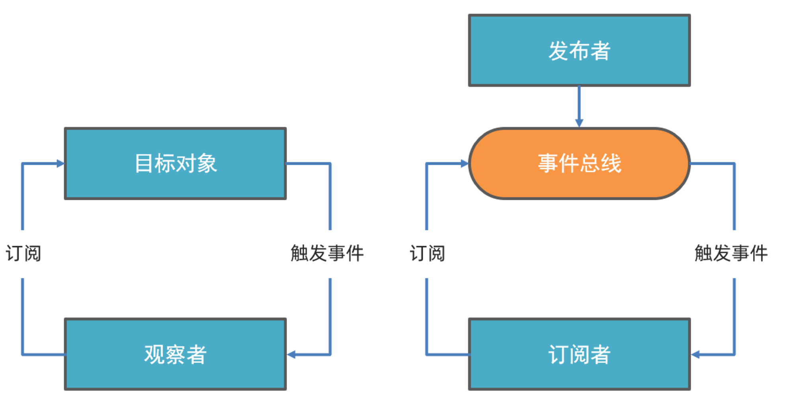

# JS原理课-DAY03

## 函数柯里化

> 这一节咱们来学习函数柯里化,在计算机科学中，柯里化（英语：Currying），又译为卡瑞化或加里化，是把接受多个参数的函数变换成接受一个单一参数（最初函数的第一个参数）的函数，并且返回接受余下的参数而且返回结果的新函数的技术。

这一节咱们会学习的有:

1. 什么是函数柯里化
2. 经典面试题
3. 柯里化实际应用

 柯里化 作为一种高阶技术, 可以提升函数的复用性和灵活性。

### 什么是函数柯里化

函数柯里化 (Currying) 是一种**将多个参数的函数转换为单个参数函数**的技术

转换完毕之后的函数:**只传递函数的一部分参数来调用，让他返回一个新的函数去处理剩下的参数。**

**例子:**

```javascript
// 调整函数 sum
function sum(num1, num2) {
  return num1 + num2
}

// 改写为 可以实现如下效果
console.log(sum(1)(2))// 
```

**核心步骤:**

1. `sum`改为接收一个参数，返回一个新函数
2. 新函数内部将**参数1**，**参数2**累加并返回

```javascript
function sum(num1) {
  return function (num2) {
    return num1 + num2
  }
}
```

#### 面试回答:

什么是函数柯里化

1. 函数柯里化是一种将多个参数的函数转换为单个参数函数的技术
2. 转换完毕之后的函数只需要传递一部分参数进行调用,并且会返回一个新的函数去处理剩下的参数


### 柯里化面试题-全局变量

柯里化在面试的时候一般以笔试题出现,比如

**需求:**

```javascript
function sum(a, b, c, d, e) {
  return a + b + c + d + e
}
// 改写函数sum实现:参数传递到5个即可实现累加
// sum(1)(2)(3)(4)(5)
// sum(1)(2,3)(4)(5)
// sum(1)(2,3,4)(5)
// sum(1)(2,3)(4,5)
```

**核心步骤:**

1. 接收不定长参数
2. 存储已传递的参数
3. 判断长度
   1. 满足5:累加
   2. 不满足:继续返回**函数本身**

```javascript
let nums = []
function currySum(...args) {
  nums.push(...args)
  if (nums.length >= 5) {
    return nums.reduce((prev, curv) => prev + curv, 0)
  } else {
    return currySum
  }
}
```

#### 面试回答:

柯里化面试题-全局变量

1. 定义数组保存参数
2. 函数接收不定长参数
3. 调用时将传入的参数,添加到数组中,并判断数组长度:
   1. 满足长度要求:累加并返回结果
   2. 未达到长度要求:继续返回函数本身


### 柯里化面试题-使用闭包

**需求:**

1. 使用**闭包**将上一节代码中的全局变量,保护起来
2. 支持自定义累加的参数个数

```javascript
function sumMaker(length){
    // 逻辑略
}
// 支持5个累加
const sum5 = sumMaker(5)
// 支持7个累加
const sum7 = sumMaker(7)
sum7(1,2,3)(4,5,6,7)
```


**核心步骤:**

1. 定义外层函数:
   1. 定义参数`length`
   2. 将全局变量迁移到函数内
2. 定义内层函数:
   1. 参数长度判断,使用传入的参数`length`
   2. 直接复用上一节的逻辑,并返回

```javascript
function sumMaker(length) {
  let nums = []
  function inner(...args) {
    nums.push(...args)
    if (nums.length >= length) {
      return nums.reduce((prev, curv) => prev + curv, 0)
    } else {
      return inner
    }
  }
  return inner
}
```

#### 面试回答:

柯里化面试题-使用闭包

1. 定义函数,接收参数,用来确定参数个数
2. 内部将上一节的逻辑拷贝进去
3. 返回原函数
4. 通过这样的调整,可以让我们自定义参数的个数,并且没有上一节的全局变量数组


### 柯里化实际应用-类型判断

通过**参数复用**,实现一个**类型判断生成器函数**

**需求:**

1. 将下列4个类型判断函数,改写为通过函数`typeOfTest`动态生成

```javascript
// 有如下4个函数
function isUndefined(thing) {
  return typeof thing === 'undefined'
}
function isNumber(thing) {
  return typeof thing === 'number'
}
function isString(thing) {
  return typeof thing === 'string'
}
function isFunction(thing) {
  return typeof thing === 'function'
}

// 改为通过 typeOfTest 生成:
const typeOfTest =function(){
   // 参数 和 逻辑略

}
const isUndefined = typeOfTest('undefined')
const isNumber = typeOfTest('number')
const isString = typeOfTest('string')
const isFunction = typeOfTest('function')

// 可以通过 isUndefined,isNumber,isString,isFunction 来判断类型:

isUndefined(undefined) // true
isNumber('123') // false
isString('memeda') // true
isFunction(() => { }) // true
```

**核心步骤:**

1. `typeOfTest`接收参数`type`用来接收判断的类型
2. 内部返回新函数,接收需要判断的值,并基于`type`进行判断
3. 使用箭头函数改写为最简形式~~[传送门-github](https://github.com/axios/axios/blob/v1.x/lib/utils.js)

```javascript
const typeOfTest = (type) => {
  return (thing) => {
    return typeof thing === type
  }
}
```

#### 面试回答:

柯里化实际应用-类型判断

1. 定义函数,接收需要判断的类型名

2. 内部返回一个新的函数,

   1. 新函数接收需要判断的具体的值
   2. 新函数内部根据外层函数传入的类型,以及传入的值进行判断并返回结果

   


### 柯里化实际应用-固定参数

依旧是一个**参数复用**的实际应用

**需求:**

1. 将如下3个请求的函数(都是**post**请求),变为通过`axiosPost`函数动态生成
2. 实现函数`axiosPost`

```javascript
 // 项目开发中不少请求的 请求方法 是相同的,比如
axios({
  url: 'url',
  method: 'get'
})
axios({
  url: 'url',
  method: 'get',
  params: {
    // 
  }
})
axios({
  url: 'url',
  method: 'post',
  data: ''
})
axios({
  url: 'url',
  method: 'post',
  data: '',
  headers: {

  }
})

// 固定请求参数,请求方法固定,其他参数从外部传递进来
// 需求: 实现方法requestWithMethod 支持如下调用
requestWithMethod('get')({
  url: '',
  params: {},
  headers: {}
})
requestWithMethod('post')({
  url: '',
  headers: {},
  data: {}
})

```

**核心步骤:**

1. 函数内部固定请求方法,post
2. 函数内部调用`axios`发请求即可
3. `axios`内部就是这样实现的
   1. [传送门-github:](https://github.com/axios/axios/blob/v1.x/dist/axios.js#L2667)


```javascript
function requestWithMethod(method) {
  return (config) => {
    return axios({
      method,
      ...config
    })
  }
}
```

#### 面试回答:

柯里化实际应用-固定参数

1. 函数柯里化是一种函数式编程思想:**将多个参数的函数转换为单个参数函数,调用时返回新的函数接收剩余参数**

2. 常见面试题,将函数改写为如下调用新式:核心思想就是返回新的函数,根据已经记录的参数长度判断:

   1. 长度符合要求:累加

   2. 长度不符合要求:继续返回


   ```javascript
   function sum(a, b, c, d, e) {
     return a + b + c + d + e
   }
   // 改写函数sum实现:参数传递到5个即可实现累加
   // sum(1)(2)(3)(4)(5)
   // sum(1)(2,3)(4)(5)
   // sum(1)(2,3,4)(5)
   // sum(1)(2,3)(4,5)
   ```

3. 常见应用:固定参数,比如`axios`中的:

   1. [类型判断函数](https://github.com/axios/axios/blob/v1.x/lib/utils.js#L20)
   2. [get,post,put等别名方法](https://github.com/axios/axios/blob/v1.x/dist/axios.js#L2667)
   3. 就用到了柯里化的思想

## JS设计模式

> 这一节咱们来学习JS中的设计模式
>
> [传送门:wiki-设计模式](https://zh.wikipedia.org/wiki/%E8%AE%BE%E8%AE%A1%E6%A8%A1%E5%BC%8F%EF%BC%9A%E5%8F%AF%E5%A4%8D%E7%94%A8%E9%9D%A2%E5%90%91%E5%AF%B9%E8%B1%A1%E8%BD%AF%E4%BB%B6%E7%9A%84%E5%9F%BA%E7%A1%80)
>
> [传送门:JavaScript设计模式与开发实践](https://www.ituring.com.cn/book/1632)

设计模式的指的是：在**面向对象软件**设计过程中针对特定问题的简洁而优雅的解决方案。通俗一点说，设计模式就是给面向对象软件开发中的一些好的设计取个名字。

目前说到设计模式，一般指的是《设计模式：可复用面向对象软件的基础》一书中提到的**23种**常见的软件开发设计模式。

JavaScript中不需要生搬硬套这些模式，咱们结合实际前端开发中的具体应用场景，来看看有哪些常用的设计模式

这一节咱们会学习:

1. JS中的常用设计模式
2. 设计模式在开发/框架中的应用场景

### 工厂模式

在JavaScript中，工厂模式的表现形式就是一个直接调用即可返回新对象的函数

```javascript
// 定义构造函数并实例化
function Dog(name){
    this.name=name
}
const dog = new Dog('柯基')

// 工厂模式
function ToyFactory(name,price){
    return {
        name,
        price
    }
}
const toy1 = ToyFactory('布娃娃',10)
const toy2 = ToyFactory('玩具车',15)
```

**应用场景**

1. Vue2->Vue3: 

   1. 启用了`new Vue`,改成了工厂函数`createApp`-[传送门](https://v3-migration.vuejs.org/zh/breaking-changes/global-api.html)
   2. *任何全局改变 Vue 行为的 API(vue2) 现在都会移动到应用实例上(vue3)*
   3. 就不会出现,Vue2中多个Vue实例共享,相同的全局设置,可以**实现隔离**

   ```html
   <!DOCTYPE html>
   <html lang="zh-CN">
   
   <head>
     <meta charset="UTF-8">
     <meta name="viewport" content="width=device-width, initial-scale=1.0">
     <title>Document</title>
     <style>
       #app1,
       #app2 {
         border: 1px solid #000;
       }
     </style>
   </head>
   
   <body>
     <h2>vue2-全局注册组件</h2>
     <div id="app1">
       实例1
       <my-title></my-title>
     </div>
     <div id="app2">
       实例2
       <my-title></my-title>
     </div>
     <script src="https://cdn.bootcdn.net/ajax/libs/vue/2.7.9/vue.js"></script>
     <script>
       Vue.component('my-title', {
         template: '<h2 style="color:orange">标题组件</h2>'
       })
       const app1 = new Vue({
         el: "#app1"
       })
   
       const app2 = new Vue({
         el: "#app2"
       })
   
     </script>
   </body>
   
   </html>
   ```

2. axios.create:

   1. 基于传入的配置创建一个新的`axios`实例,[传送门](https://www.axios-http.cn/docs/instance)
   2. 项目中有2个请求基地址如何设置?

```javascript
// 1. 基于不同基地址创建多个 请求对象
const request1 = axios.create({
  baseURL: "基地址1"
})
const request2 = axios.create({
  baseURL: "基地址2"
})
const request3 = axios.create({
  baseURL: "基地址3"
})

// 2. 通过对应的请求对象,调用接口即可
request1({
  url: '基地址1的接口'
})
request2({
  url: '基地址2的接口'
})
request3({
  url: '基地址3的接口'
})
```

#### 面试回答:

1. 工厂模式:JS中的表现形式,返回新对象的函数(方法)

   1. ```javascript
      function sayHi(){} // 函数
      const obj ={
          name:'jack',
          sayHello(){} // 方法
      }
      ```

2. 日常开发中,有2个很经典的场景

   1. `vue3`中创建实例的api改为`createApp`,`vue2`中是`new Vue`
      1. Vue3中,没有影响所有Vue实例的api了,全都变成了影响某个app对象的api,比如`Vue.component-->app.component`
   2. `axios.create`基于传入的配置,创建一个新的请求对象,可以用来设置多个基地址


### 单例模式

单例模式指的是，在使用这个模式时，单例对象整个系统需要保证**只有一个**存在。

**需求:**

1. 通过静态方法`getInstance`获取**唯一实例**

```javascript
const s1 = SingleTon.getInstance()
const s2 = SingleTon.getInstance()
console.log(s1===s2)//true
```

**核心步骤:**

1. 定义类
2. 私有静态属性:`#instance`
3. 提供静态方法`getInstance`:
   1. 调用时判断`#instance`是否存在:
   2. 存在:直接返回
   3. 不存在:实例化,保存,并返回

```javascript
class SingleTon {
   constructor() { }
   // 私有属性，保存唯一实例
   static #instance

  // 获取单例的方法
  static getInstance() {
    if (SingleTon.#instance === undefined) {
      // 内部可以调用构造函数
      SingleTon.#instance = new SingleTon()
    }
    return SingleTon.#instance
  }
}
```

**实际应用:**

1. vant组件库中的弹框组件,保证弹框是单例
   1. toast组件:[传送门](https://gitee.com/vant-contrib/vant/blob/main/packages/vant/src/toast/index.ts)
   2. notify组件:[传送门](https://gitee.com/vant-contrib/vant/blob/main/packages/vant/src/notify/index.ts)
   3. 如果弹框对象
      1. 不存在,-->创建一个新的
      2. 存在,直接用
2. vue中注册插件,用到了单例的思想(只能注册一次)
   1. vue2:[传送门](https://gitee.com/vuejs/vue/blob/main/src/core/global-api/use.ts)
   2. vue3:[传送门](https://gitee.com/vuejs/core/blob/main/packages/runtime-core/src/apiCreateApp.ts#L256)

#### 面试回答:

1. 单例模式:
   1. 保证,应用程序中,某个对象,只能有一个
2. 自己实现核心为一个返回唯一实例的方法,比如`getInstance`
   1. 实例存在`->`返回
   2. 实力不存在`->`创建,保存`->`返回
3. 应用场景:
   1. `vant`的`toast`和`notify`组件都用到了单例:多次弹框,不会创建多个弹框,复用唯一的弹框对象
   2. `vue`中注册插件,`vue2`和`vue3`都会判断插件是否已经注册,已注册,直接提示用户


### 观察者模式

在对象之间定义一个**一对多**的依赖，当一个对象状态改变的时候，所有依赖的对象都会自动收到通知。

**举个例子:**

1. `dom`事件绑定，比如

```javascript
window.addEventListener('load', () => {
  console.log('load触发1')
})
window.addEventListener('load', () => {
  console.log('load触发2')
})
window.addEventListener('load', () => {
  console.log('load触发3')
})
```

2. Vue中的watch:


#### 面试回答:

1. 观察者模式重点说清楚2点即可:
   1. 在对象之间定义一个**一对多**的依赖，当一个对象状态改变的时候，所有依赖的对象都会自动收到通知。
   2. 常见场景:vue中的watch,dom事件绑定

观察者模式和发布订阅模式的区别也是常见考点,回答方式见下一节


### 发布订阅模式01-应用场景

发布订阅模式可以实现的效果类似观察者模式,但是两者略有差异,一句话描述:一个有中间商(**发布订阅模式**)一个没中间商(**观察者模式**)



**应用场景:**

1. `vue2`中的`EventBus`:[传送门](https://v2.cn.vuejs.org/v2/api/#%E5%AE%9E%E4%BE%8B%E6%96%B9%E6%B3%95-%E4%BA%8B%E4%BB%B6)
2. `vue3`中因为移除了实例上对应方法，可以使用替代方案:[传送门](https://v3-migration.vuejs.org/zh/breaking-changes/events-api.html)
   1. 官方推荐,用插件
   2. 我们自己写


### 发布订阅模式02-自己写一个事件总线

**需求:**

```javascript
const bus = new HMEmitter()
// 注册事件
bus.$on('事件名1',回调函数)
bus.$on('事件名1',回调函数)

// 触发事件
bus.$emit('事件名',参数1,...,参数n)

// 移除事件
bus.$off('事件名')

// 一次性事件
bus.$once('事件名',回调函数)
```

**核心步骤:**

1. 定义类
2. 私有属性:`#handlers={事件1:[f1,f2],事件2:[f3,f4]}`
3. 实例方法:
   1. $on(事件名,回调函数):注册事件
   2. $emit(事件名,参数列表):触发事件
   3. $off(事件名):移除事件
   4. $once(事件名,回调函数):注册一次性事件

**基础模板:**

```html
<!DOCTYPE html>
<html lang="zh-CN">

<head>
  <meta charset="UTF-8">
  <meta name="viewport" content="width=device-width, initial-scale=1.0">
  <title>Document</title>
</head>

<body>
  <h2>自己实现事件总线</h2>
  <button class="on">注册事件</button>
  <button class="emit">触发事件</button>
  <button class="off">移除事件</button>
  <button class="once-on">一次性事件注册</button>
  <button class="once-emit">一次性事件触发</button>
  <script>
    class HMEmmiter {
    	// 逻辑略
    }

    // 简化 querySelector调用
    function qs(selector) {
      return document.querySelector(selector)
    }
    // 注册事件
    qs('.on').addEventListener('click', () => {
    
    })
    // 触发事件
    qs('.emit').addEventListener('click', () => {
   
    })
    // 移除事件
    qs('.off').addEventListener('click', () => {
      
    })
    // 一次性事件注册
    qs('.once-on').addEventListener('click', () => {
     
    })
    // 一次性事件触发
    qs('.once-emit').addEventListener('click', () => {
     
    })
  </script>
</body>

</html>
```


```javascript
class HMEmmiter {
  #handlers = {}
  // 注册事件
  $on(event, callback) {
    if (!this.#handlers[event]) {
      this.#handlers[event] = []
    }
    this.#handlers[event].push(callback)
  }
  // 触发事件
  $emit(event, ...args) {
    const funcs = this.#handlers[event] || []
    funcs.forEach(func => {
      func(...args)
    })
  }
  // 移除事件
  $off(event) {
    this.#handlers[event] = undefined
  }
  // 一次性事件
  $once(event, callback) {
    this.$on(event, (...args) => {
      callback(...args)
      this.$off(event)
    })
  }
}
```

#### 面试回答:

1. 发布订阅模式:可以实现的效果类似观察者模式,但是两者略有差异,一句话描述:一个有中间商(**发布订阅模式**)一个没中间商(**观察者模式**)
2. 经典的场景是`vue2`中的`EventBus`,`vue3`移除了实例的`$on`,`$off`,`$emit`方法,如果还需要使用:
   1. 使用第三方插件
   2. 自己实现事件总线:
3. 自己实现事件总线的核心逻辑:
   1. 添加类,内部定义私有属性`#handlers={}`,以对象的形式来保存回调函数
   2. 添加实例方法:
      1. `$on`:
         1. 接收事件名和回调函数
         2. 内部判断并将回调函数保存到`#handlers`中,以`{事件名:[回调函数1,回调函数2]}`格式保存
      2. `$emit`
         1. 接收事件名和回调函数参数
         2. 内部通过`#handlers`获取保存的回调函数,如果获取不到设置为空数组`[]`
         3. 然后挨个调用回调函数即可
      3. `$off`
         1. 接收事件名
         2. 将`#handlers`中事件名对应的值设置为`undefined`即可
      4. `$once`
         1. 接收事件名和回调函数
         2. 内部通过`$on`注册回调函数,
         3. 内部调用`callback`并通过`$off`移除注册的事件


### 原型模式

在原型模式下，当我们想要创建一个对象时，会先找到一个对象作为原型，然后通过**克隆原型**的方式来创建出一个与原型一样（共享一套数据/方法）的对象。在`JavaScript`中,`Object.create`就是实现原型模式的内置`api`

**应用场景:**

`vue2`中重写数组方法:

1. 调用方法时(`push`,`pop`,`shift`,`unshift`,`splice`,`sort`,`reverse`)可以触发视图更新:[传送门](https://v2.cn.vuejs.org/v2/guide/list.html#%E5%8F%98%E6%9B%B4%E6%96%B9%E6%B3%95)
2. 源代码:[传送门](https://gitee.com/vuejs/vue/blob/main/src/core/observer/array.ts)
3. 测试一下:

```html
<!DOCTYPE html>
<html lang="zh-CN">

<head>
  <meta charset="UTF-8">
  <meta name="viewport" content="width=device-width, initial-scale=1.0">
  <title>Document</title>
</head>

<body>
  <h2>原型模式</h2>
  <div id="app"></div>
  <script src="https://cdn.bootcdn.net/ajax/libs/vue/2.7.9/vue.js"></script>
  <script>
    const app = new Vue({
      el: "#app", data: {
        foods: ['西瓜', '西葫芦', '西红柿']
      }
    })
    console.log(app.foods.push === Array.prototype.push)
  </script>

</body>

</html>
```


#### 面试回答:

1. 原型模式:
   1. 基于某个对象,创建一个新的对象
   2. JS中,通过`Object.create`就是实现了这个模式的内置`api`
   3. 比如`vue2`中重写数组方法就是这么做的

2. vue2中数组重写了7个方法,内部基于数组的原型`Array.prototype`创建了一个新对象
3. 创建的方式是通过`Object.create`进行浅拷贝
4. 重写的时候:
   1. 调用数组的原方法,获取结果并返回---方法的功能和之前一致
   2. 通知了所有的观察者去更新视图

```javascript
const app = new Vue({
    el:"#app",
    data:{
        arr:[1,2,3]
    }
})
app.arr.push === Array.prototype.push //false
```


### 代理模式

代理模式指的是**拦截和控制**与目标对象的交互

这里我们来看一个非常经典的代理模式的应用: 缓存代理


**核心语法:**

1. 创建对象缓存数据
2. 获取数据时,先通过缓存判断:
   1. 有直接获取
   2. 没有:调用接口


```javascript
//  1. 创建对象缓存数据
const cache = {}
async function searchCity(pname) {
  // 2. 判断是否缓存数据
  if (!cache[pname]) {
    // 2.1 没有:查询,缓存,并返回
    const res = await axios({
      url: 'http://hmajax.itheima.net/api/city',
      params: {
        pname
      }
    })
    cache[pname] = res.data.list
  }
  // 2.2 有:直接返回
  return cache[pname]
}

document.querySelector('.query').addEventListener('keyup', async function (e) {
  if (e.keyCode === 13) {
    const city = await searchCity(this.value)
    console.log(city)
  }
})
```

#### 面试回答:

1. 代理模式的核心是,通过一个代理对象拦截对原对象的直接操纵
2. 比如可以通过缓存代理:
   1. 缓存获取到的数据
   2. 拦截获取数据的请求:
      1. 已有缓存:直接返回缓存数据
      2. 没有缓存:去服务器获取数据并缓存
3. 提升数据获取效率,降低服务器性能消耗


### 迭代器模式

迭代器模式提供一种方法顺序访问一个聚合对象中的各个元素，而又不暴露该对象的内部表示.简而言之就是:**遍历**

遍历作为日常开发中的**高频**操作,JavaScript中有大量的默认实现:**比如**

1. `Array.prototype.forEach`:遍历数组
2. `NodeList.prototype.forEach`:遍历`dom`,`document.querySelectorAll`
3. `for in`
4. `for of`


**面试题**:

1. `for in` 和`for of` 的区别?
   1. **`for...in`** **语句**以任意顺序迭代一个对象的除[Symbol](https://developer.mozilla.org/zh-CN/docs/Web/JavaScript/Reference/Global_Objects/Symbol)以外的[可枚举](https://developer.mozilla.org/zh-CN/docs/Web/JavaScript/Enumerability_and_ownership_of_properties)属性，包括继承的可枚举属性。
      1. 对象默认的属性以及动态增加的属性都是**可枚举**属性
      2. 遍历出来的是**属性名**
      3. 继承而来的属性也会遍历
   2. **`for...of`语句**在[可迭代对象](https://developer.mozilla.org/zh-CN/docs/Web/JavaScript/Reference/Iteration_protocols)（包括 [`Array`](https://developer.mozilla.org/zh-CN/docs/Web/JavaScript/Reference/Global_Objects/Array)，[`Map`](https://developer.mozilla.org/zh-CN/docs/Web/JavaScript/Reference/Global_Objects/Map)，[`Set`](https://developer.mozilla.org/zh-CN/docs/Web/JavaScript/Reference/Global_Objects/Set)，[`String`](https://developer.mozilla.org/zh-CN/docs/Web/JavaScript/Reference/Global_Objects/String)，[`TypedArray`](https://developer.mozilla.org/zh-CN/docs/Web/JavaScript/Reference/Global_Objects/TypedArray)，[arguments](https://developer.mozilla.org/zh-CN/docs/Web/JavaScript/Reference/Functions/arguments) 对象等等）上创建一个迭代循环
      1. for of不会遍历**继承**而来的属性
      2. 遍历出来的是**属性值**

```javascript
Object.prototype.objFunc = function () { }
Array.prototype.arrFunc = 'arrFunc'

const foods = ['西瓜', '西葫芦', '西兰花']
for (const key in foods) {
  console.log('for-in:key', key)
}
for (const iterator of foods) {
  console.log('for-of:iterator', iterator)
}
```


**可迭代协议和迭代器协议:**

1. 可迭代协议:[传送门](https://developer.mozilla.org/zh-CN/docs/Web/JavaScript/Reference/Iteration_protocols#%E5%8F%AF%E8%BF%AD%E4%BB%A3%E5%8D%8F%E8%AE%AE)
   1. 给对象增加属方法` [Symbol.iterator](){}`
   2. 返回一个符合迭代器协议的对象

2. 迭代器协议:[传送门](https://developer.mozilla.org/zh-CN/docs/Web/JavaScript/Reference/Iteration_protocols#%E8%BF%AD%E4%BB%A3%E5%99%A8%E5%8D%8F%E8%AE%AE)
   1. next方法,返回对象:
      1. `{done:true}`,迭代结束
      2. `{done:false,value:'xx'}`,获取解析并接续迭代
      3. 实现方式:
         1. 手写
         2. `Generator`

```javascript
// ------------- 迭代协议 -------------
/**
 * 迭代协议可以定制对象的迭代行为  分为2个协议:
 *  1. 可迭代协议: 增加方法[Symbol.iterator](){} 返回符合 迭代器协议 的对象
 *  2. 迭代器协议: 
 *      有next方法的对象,next方法返回:
 *        已结束: {done:true}
 *        继续迭代: {done:false,value:'x'}
 *    使用Generator
 *    自己实现 对象,next
 * */
const obj = {
  // Symbol.iterator 内置的常量
  // [属性名表达式]
  [Symbol.iterator]() {

    // ------------- 自己实现 -------------
    const arr = ['北京', '上海', '广州', '深圳']
    let index = 0

    return {
      next() {
        if (index < arr.length) {
          // 可以继续迭代
          return { done: false, value: arr[index++] }
        }
        // 迭代完毕
        return { done: true }
      }
    }


    // ------------- 使用Generator -------------
    // function* foodGenerator() {
    //   yield '西兰花'
    //   yield '花菜'
    //   yield '西兰花炒蛋'
    // }
    // const food = foodGenerator()
    // return food
  }
}

for (const iterator of obj) {
  console.log('iterator:', iterator)
}
```

#### 面试回答:

1. 迭代器模式在js中有大量的默认实现,因为遍历或者说迭代时日常开发中的高频操作,比如`forEach`,`for in`,`for of`等
2. `for in` 和`for of`的区别:
   1. **`for...in`** **语句**以任意顺序迭代一个对象的除[Symbol](https://developer.mozilla.org/zh-CN/docs/Web/JavaScript/Reference/Global_Objects/Symbol)以外的[可枚举](https://developer.mozilla.org/zh-CN/docs/Web/JavaScript/Enumerability_and_ownership_of_properties)属性，包括继承的可枚举属性。
      1. 对象默认的属性以及动态增加的属性都是**可枚举**属性
      2. 遍历出来的是**属性名**
      3. 继承而来的属性也会遍历
   2. **`for...of`语句**在[可迭代对象](https://developer.mozilla.org/zh-CN/docs/Web/JavaScript/Reference/Iteration_protocols)（包括 [`Array`](https://developer.mozilla.org/zh-CN/docs/Web/JavaScript/Reference/Global_Objects/Array)，[`Map`](https://developer.mozilla.org/zh-CN/docs/Web/JavaScript/Reference/Global_Objects/Map)，[`Set`](https://developer.mozilla.org/zh-CN/docs/Web/JavaScript/Reference/Global_Objects/Set)，[`String`](https://developer.mozilla.org/zh-CN/docs/Web/JavaScript/Reference/Global_Objects/String)，[`TypedArray`](https://developer.mozilla.org/zh-CN/docs/Web/JavaScript/Reference/Global_Objects/TypedArray)，[arguments](https://developer.mozilla.org/zh-CN/docs/Web/JavaScript/Reference/Functions/arguments) 对象等等）上创建一个迭代循环
      1. for of不会遍历**继承**而来的属性
      2. 遍历出来的是**属性值**

3. 如何自定义可迭代对象?
   1. 需要符合2个协议:可迭代协议和迭代器协议,其实就是按照语法要求实现功能而已
   2. 可迭代协议:[传送门](https://developer.mozilla.org/zh-CN/docs/Web/JavaScript/Reference/Iteration_protocols#%E5%8F%AF%E8%BF%AD%E4%BB%A3%E5%8D%8F%E8%AE%AE)
      1. 给对象增加属方法` [Symbol.iterator](){}`
      2. 返回一个符合**迭代器协议**的对象
   3. 迭代器协议:[传送门](https://developer.mozilla.org/zh-CN/docs/Web/JavaScript/Reference/Iteration_protocols#%E8%BF%AD%E4%BB%A3%E5%99%A8%E5%8D%8F%E8%AE%AE)
      1. 有next方法的一个对象,内部根据不同情况返回对应结果:
         1. `{done:true}`,迭代结束
         2. `{done:false,value:'xx'}`,获取解析并接续迭代
      2. 实现方式:
         1. 自己手写实现逻辑
         2. 直接返回一个`Generator`


## 参考资料

1. [阮一峰-《ECMAScript 6 教程》](https://wangdoc.com/es6/)
2. [图灵社区-JavaScript高级程序设计](https://www.ituring.com.cn/book/2472)
