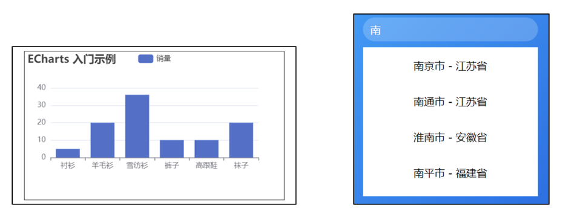
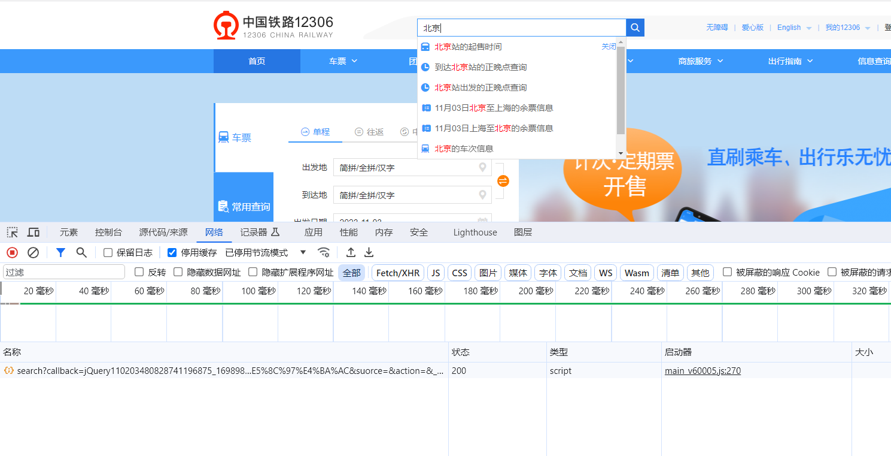
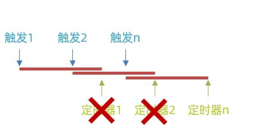
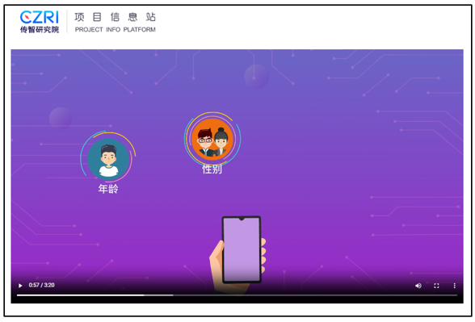
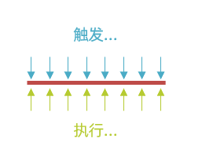
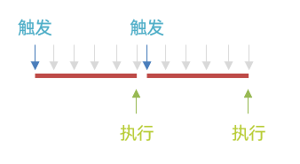

# 防抖和节流

## 防抖


### 防抖的适用场景

常见的前端性能优化方案 , 它可以防止JS高频渲染页面时出现的视觉抖动(卡顿):比如

1. **示例1:**页面改变尺寸时,同步调整图表的大小
2. **示例2:**输入内容时,结合ajax进行搜索并渲染结果

如果内容的渲染速度过快,都可能会造成抖动效果,并且连带会**浪费性能**

1. 频繁执行逻辑代码,耗费浏览器性能
2. 频繁发送请求去服务器,耗费服务器性能




**适用场景**:

1. 在触发频率高的事件中
   * 频率高的事件: resize、input 、scroll 、keyup….
2. 执行耗费性能操作
   * 耗费性能的操作: 操纵页面、网络请求….
3. 需要实现的效果: 连续操作之后只有最后一次生效

这个时候就可以适用防抖来进行优化


### 手写防抖

防抖优化之后的效果可以通过一些具体的网站来进行确认,比如[12306](https://www.12306.cn/index/),他就是通过防抖进行的优化:



1. 在输入内容的时候没有发送请求
2. 输入完毕之后,稍等一会才发送请求去服务器

这个就是防抖的效果: **连续事件停止触发后,一段时间内没有再次触发,就执行业务代码**


#### 核心实现步骤

1. 开启定时器,保存定时器id

2. 清除已开启的定时器





那个**输入框+搜索**的例子优化之后代码如下:

```javascript
let timeId
document.querySelector('.search-city').addEventListener('input', function () {
  //  2. 清除已开启的定时器
  clearTimeout(timeId)
    
  //  1. 开启定时器,保存定时器id
  timeId = setTimeout(() => {
    renderCity(this.value)
  }, 500)
})
```


### lodash的debounce方法


实际开发中一般不需要手写防抖,因为已经有库里面提供了对应的方法,可以直接调用,也可以自己手写实现`debounce`,一会咱们就从这两个方面进行讲解:

1. `lodash`工具库中的`debounce`方法(**常用**)
2. `debounce`的实现原理(**高频面试题**)


[传送门](https://www.lodashjs.com/docs/lodash.debounce)


```javascript
_.debounce(func, [wait=0], [options=])
```

#### 参数

1. `func` *(Function)*: 要防抖动的函数。
2. `[wait=0]` *(number)*: 需要延迟的毫秒数。
3. `[options=]` *(Object)*: 选项对象。
4. `[options.leading=false]` *(boolean)*: 指定在延迟开始前调用。
5. `[options.maxWait]` *(number)*: 设置 `func` 允许被延迟的最大值。
6. `[options.trailing=true]` *(boolean)*: 指定在延迟结束后调用。

#### 返回

*(Function)*: 返回新的 debounced（防抖动）函数。


**注意:** 

1. 实际开发时一般给前2个参数即可,然后适用返回的函数替换原函数即可
2. 项目中如果有`lodash`那么直接使用它提供的`debounce`即可,不仅可以实现防抖,原函数中的`this`和`参数`均可以正常使用


### 手写debounce函数


手写实现`debounce`函数,实现`lodash`中`debounce`方法的核心功能

**需求:**

1. 参数:
   1. `func` *(Function)*: 要防抖动的函数。
   2. `[wait=0]` *(number)*: 需要延迟的毫秒数。
2. 返回值:
   1. *(Function)*: 返回新的 debounced（防抖动）函数。


#### 核心步骤:

1. 返回防抖动的新函数

2. 原函数中的`this`可以正常使用

3. 原函数中的**参数**可以正常使用

```javascript
function debounce(func, wait = 0) {
  let timeId
  // 防抖动的新函数
  return function (...args) {
    let _this = this
    clearTimeout(timeId)
    timeId = setTimeout(function () {
      // 通过apply调用原函数,并指定this和参数
      func.apply(_this, args)
    }, wait)
  }
}

```


## 节流

### 节流的适用场景

常见的前端性能优化方案 , 它可以防止高频触发事件造成的性能浪费:比如

1. 播放视频时同步缓存播放时间
2. 如果要多设备同步,还需要通过`ajax`提交到服务器

高频触发耗费性能的操作,会造成**性能浪费**



**适用场景****:**在触发频率高的事件中, 执行耗费性能操作 , 连续触发 , 单位时间内只有一次生效


**优化之前:** 每当触发事件就会执行业务逻辑



**优化之后:**触发事件之后延迟执行逻辑,在逻辑执行完毕之后无法再次触发




### 手写节流

使用节流将播放器记录时间的例子优化:


**核心步骤**:

1.开启定时器,并保存 id

2.判断是否已开启定时器

3.定时器执行时 , id设置为空


```javascript
// 播放器案例优化之后代码
let timeId
video.addEventListener('timeupdate', function () {
  if (timeId !== undefined) {
    return
  }

  timeId = setTimeout(() => {
    console.log('timeupdate触发')
    localStorage.setItem('currentTime', this.currentTime)
    timeId = undefined
  }, 3000)

})
```

### lodash的throttle方法

实际开发中一般不需要手写节流,因为已经有库里面提供了对应的方法,可以直接调用,也可以自己手写实现`throttle`,一会咱们就从这两个方面进行讲解:

1. `lodash`工具库中的`throttle`方法(**常用**)
2. `throttle`的实现原理(**高频面试题**)


[传送门](https://www.lodashjs.com/docs/lodash.throttle)

```javascript
_.throttle(func, [wait=0], [options=])
```

#### 参数

1. `func` *(Function)*: 要节流的函数。
2. `[wait=0]` *(number)*: 需要节流的毫秒。
3. `[options=]` *(Object)*: 选项对象。
4. `[options.leading=true]` *(boolean)*: 指定调用在节流开始前。
5. `[options.trailing=true]` *(boolean)*: 指定调用在节流结束后。

#### 返回

*(Function)*: 返回节流的函数。


**注意:** 

1. 实际开发时一般会给3个参数即可,然后适用返回的函数替换原函数即可
   1. 参数3:`options.leading=true`默认为`true`,开始时触发节流函数,一般设置为`false`
2. 项目中如果有`lodash`那么直接使用它提供的`throttle`即可,不仅可以实现节流,原函数中的`this`和`参数`均可以正常使用

```javascript
// 播放器案例使用`lodash` 优化之后的结果如下
const func = function (e) {
  console.log('timeupdate触发')
  console.log('e:', e)
  localStorage.setItem('currentTime', this.currentTime)
}

const throttleFn = _.throttle(func, 1000, { leading: false })

video.addEventListener('timeupdate', throttleFn)
```


### 手写throttle方法


手写实现`throttle`函数,实现`lodash`中`throttle`方法的核心功能

**需求:**

1. 参数:
   1. `func` *(Function)*: 要节流的函数。
   2. `[wait=0]` *(number)*: 需要节流的毫秒。
2. 返回值:
   1. *(Function)*: 返回节流的函数


#### 核心步骤:

1. 返回节流的新函数

2. 原函数中的`this`可以正常使用

3. 原函数中的**参数**可以正常使用

```javascript
// 节流工具函数
function throttle(func, wait = 0) {
  let timeId
  return function (...args) {
    if (timeId !== undefined) {
      return
    }
    const _this = this
    timeId = setTimeout(() => {
      func.apply(_this, args)
      timeId = undefined
    }, wait)
  }
}
```


